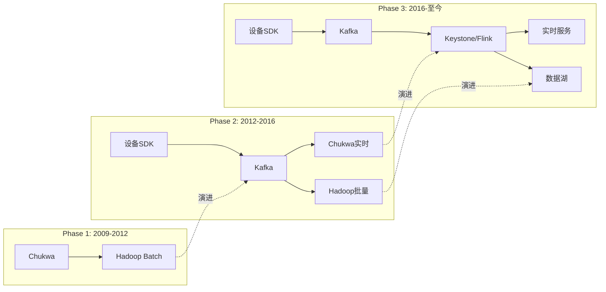
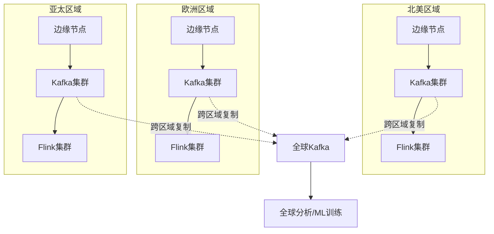
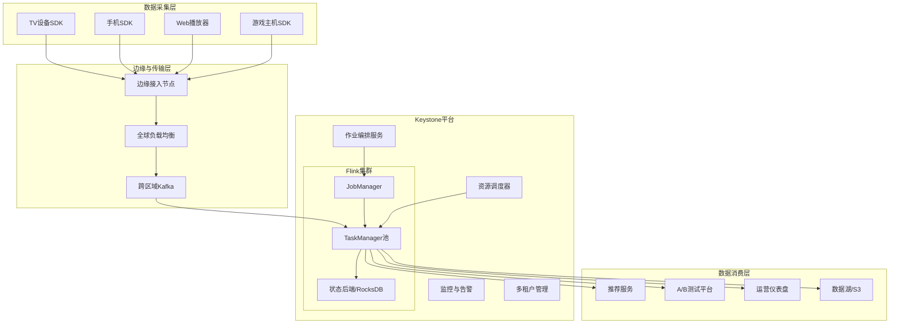
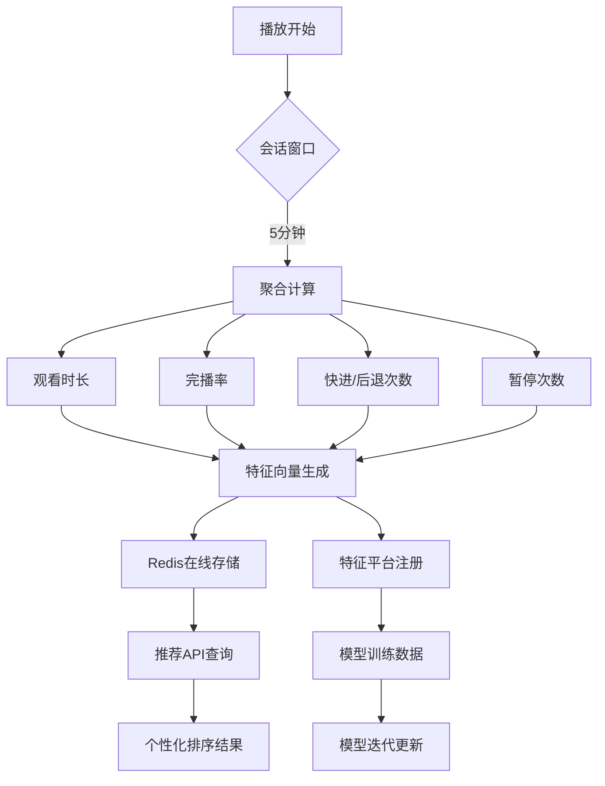
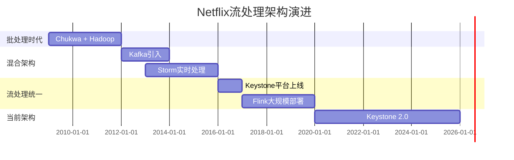
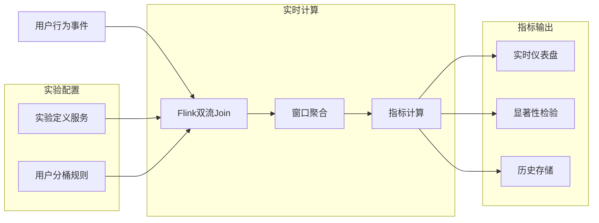

# Netflix流处理架构 - 从Keystone到Flink

> 所属阶段: Knowledge/03-business-patterns | 前置依赖: [Flink流处理核心机制](../02-design-patterns/pattern-event-time-processing.md), [实时推荐系统设计](./real-time-recommendation.md) | 形式化等级: L3-L4

## 目录

- [Netflix流处理架构 - 从Keystone到Flink](#netflix流处理架构---从keystone到flink)
  - [目录](#目录)
  - [1. 概念定义 (Definitions)](#1-概念定义-definitions)
    - [Def-K-03-08: Netflix数据管道 (Netflix Data Pipeline)](#def-k-03-08-netflix数据管道-netflix-data-pipeline)
    - [Def-K-03-09: Keystone平台 (Keystone Platform)](#def-k-03-09-keystone平台-keystone-platform)
    - [Def-K-03-10: 实时推荐特征 (Real-time Recommendation Features)](#def-k-03-10-实时推荐特征-real-time-recommendation-features)
  - [2. 属性推导 (Properties)](#2-属性推导-properties)
    - [Prop-K-03-03: 事件处理延迟边界](#prop-k-03-03-事件处理延迟边界)
    - [Prop-K-03-04: 弹性伸缩响应时间](#prop-k-03-04-弹性伸缩响应时间)
  - [3. 关系建立 (Relations)](#3-关系建立-relations)
    - [架构演进映射](#架构演进映射)
    - [技术选型对比](#技术选型对比)
    - [与Flink核心机制的关联](#与flink核心机制的关联)
  - [4. 论证过程 (Argumentation)](#4-论证过程-argumentation)
    - [为什么从Chukwa迁移到Flink？](#为什么从chukwa迁移到flink)
    - [全球化部署挑战](#全球化部署挑战)
  - [5. 形式证明 / 工程论证 (Proof / Engineering Argument)](#5-形式证明--工程论证)
    - [定理: Keystone平台满足Netflix流处理SLA](#定理-keystone平台满足netflix流处理sla)
  - [6. 实例验证 (Examples)](#6-实例验证-examples)
    - [案例一: 观看体验实时优化](#案例一-观看体验实时优化)
    - [案例二: 内容热度预测](#案例二-内容热度预测)
    - [案例三: 设备异常检测](#案例三-设备异常检测)
  - [7. 可视化 (Visualizations)](#7-可视化-visualizations)
    - [Keystone平台整体架构](#keystone平台整体架构)
    - [推荐特征工程流水线](#推荐特征工程流水线)
    - [Netflix流处理演进时间线](#netflix流处理演进时间线)
    - [A/B测试实时指标计算架构](#ab测试实时指标计算架构)
  - [8. 引用参考 (References)](#8-引用参考-references)

## 1. 概念定义 (Definitions)

### Def-K-03-08: Netflix数据管道 (Netflix Data Pipeline)

**定义**: Netflix数据管道是指支撑Netflix全球业务运营的分布式流数据处理基础设施，用于实时采集、处理和分析来自2亿+订阅用户的播放行为事件，以支持个性化推荐、内容决策和运营优化。

**形式化描述**:

```
NetflixPipeline ≜ ⟨Sources, Processors, Sinks, SLAs⟩

其中:
- Sources: 客户端设备 → 播放事件、用户交互、错误日志
- Processors: Keystone → 路由/过滤/聚合/特征工程
- Sinks: 推荐服务、A/B测试平台、运营仪表盘
- SLAs: 延迟 < 1s (P99), 可用性 > 99.99%
```

**业务指标**:

- 每日处理事件: ~2万亿条
- 峰值吞吐量: ~1500万事件/秒
- 全球区域: 190+ 国家和地区

---

### Def-K-03-09: Keystone平台 (Keystone Platform)

**定义**: Keystone是Netflix自研的流处理PaaS平台，作为Kafka之上的一层抽象，提供托管的Flink作业运行环境、自动扩缩容、多租户隔离和运营工具集。

**架构层次**:

```
┌─────────────────────────────────────────┐
│           Application Layer             │
│  (推荐特征、A/B测试、异常检测、内容分析)      │
├─────────────────────────────────────────┤
│           Keystone Platform             │
│  ├─ Stream Processing Engine (Flink)    │
│  ├─ Job Orchestration & Scheduling      │
│  ├─ Auto-scaling Controller             │
│  └─ Multi-tenant Resource Isolation     │
├─────────────────────────────────────────┤
│           Messaging Layer               │
│  (Kafka - 跨可用区复制, 分区数10万+)       │
├─────────────────────────────────────────┤
│           Data Sources                  │
│  (设备SDK → 边缘节点 → 区域汇聚 → 全球总线)  │
└─────────────────────────────────────────┘
```

**核心能力**:

1. **作业生命周期管理**: 一键部署、滚动升级、自动故障恢复
2. **资源动态调度**: 基于负载的TaskManager弹性伸缩
3. **多环境隔离**: 生产/测试/开发环境完全隔离
4. **可观测性**: 统一的指标、日志、链路追踪

---

### Def-K-03-10: 实时推荐特征 (Real-time Recommendation Features)

**定义**: 实时推荐特征是指从用户实时播放行为中提取的、用于驱动个性化推荐算法的动态信号，包括播放进度、暂停/恢复模式、内容切换频率等。

**特征分类**:

| 特征类别 | 示例 | 时效性 | 计算复杂度 |
|---------|------|--------|-----------|
| **会话级特征** | 当前观看进度、连续播放时长 | < 5s | 低 |
| **设备级特征** | 设备类型、网络质量、错误率 | < 30s | 中 |
| **用户级特征** | 今日观看时长、偏好内容类型 | < 1min | 高 |
| **内容级特征** | 实时热度、完播率趋势 | < 5min | 高 |

**特征流水线**:

```
播放事件 → 会话窗口聚合 → 特征提取 → 在线存储 → 推荐服务
   ↓            ↓              ↓           ↓          ↓
 JSON       5min窗口       向量计算      Redis      排序模型
```

## 2. 属性推导 (Properties)

### Prop-K-03-03: 事件处理延迟边界

**命题**: 在Keystone平台上，端到端事件处理延迟满足以下分布：

- P50 < 200ms
- P99 < 1s
- P99.9 < 3s

**推导依据**:

1. **采集延迟**: 设备SDK批量发送(100ms缓冲) + 网络传输
2. **Kafka延迟**: 跨区域复制 < 100ms
3. **Flink处理**: 典型作业处理时间 < 500ms
4. **下游消费**: 推荐服务查询 < 10ms

### Prop-K-03-04: 弹性伸缩响应时间

**命题**: Keystone的自动扩缩容机制可在负载变化后2分钟内完成资源调整。

**触发条件**:

```
IF (CPU利用率 > 70% 持续 60s) THEN 扩容
IF (CPU利用率 < 30% 持续 120s) THEN 缩容
IF (Kafka消费延迟 > 30s) THEN 紧急扩容
```

## 3. 关系建立 (Relations)

### 架构演进映射

Netflix流处理架构经历了三个主要阶段：



### 技术选型对比

| 维度 | Chukwa时代 | Kafka+Storm时代 | Keystone/Flink时代 |
|-----|-----------|-----------------|-------------------|
| **延迟** | 分钟级 | 秒级 | 亚秒级 |
| **吞吐** | 百万/日 | 十亿/日 | 万亿/日 |
| **一致性** | 至少一次 | 至少一次 | 精确一次 |
| **开发效率** | 低(MapReduce) | 中(Storm API) | 高(Flink SQL/DataStream) |
| **运维成本** | 高 | 中 | 低(平台化) |

### 与Flink核心机制的关联

```
┌─────────────────────────────────────────────────────────────┐
│                    Netflix使用场景                            │
├─────────────────────────────────────────────────────────────┤
│  播放会话分析  │  A/B测试指标  │  特征工程   │  异常检测       │
├─────────────────────────────────────────────────────────────┤
│                    Flink核心能力                              │
├──────────────┼──────────────┼──────────────┼────────────────┤
│ Event Time   │  Window      │  State       │  CEP           │
│ Processing   │  Aggregation │  Management  │  (复杂事件处理)  │
├──────────────┴──────────────┴──────────────┴────────────────┤
│                    Keystone平台能力                           │
├─────────────────────────────────────────────────────────────┤
│  作业编排  │  自动扩缩容  │  多租户隔离  │  统一可观测性      │
└─────────────────────────────────────────────────────────────┘
```

## 4. 论证过程 (Argumentation)

### 为什么从Chukwa迁移到Flink？

**历史背景**:

- **Chukwa**: 基于Hadoop的日志采集系统，适合批量处理，延迟高
- **业务驱动**: 实时个性化推荐需求增长，分钟级延迟不可接受

**选型考量**:

| 候选方案 | 优势 | 劣势 | Netflix评估 |
|---------|------|------|------------|
| Storm | 成熟、社区活跃 | 无原生状态管理、一致性弱 | 不满足精确一次需求 |
| Spark Streaming | 生态丰富、与Spark SQL整合 | 微批模型延迟较高 | 延迟不满足 |
| **Flink** | **原生流处理、精确一次、状态管理** | 2015年相对较新 | **选择** |
| Samza | 与Kafka深度整合 | 社区较小、功能有限 | 不满足 |

**迁移收益**:

1. **延迟降低**: 从分钟级 → 秒级
2. **开发效率**: 统一批流API，代码复用率提升60%
3. **运营成本**: 集群资源利用率提升40%

### 全球化部署挑战

**问题**: 如何在190+国家/地区实现低延迟数据处理？

**解决方案**:



**关键设计**:

- **数据主权**: 用户数据优先在本地区域处理
- **延迟优化**: 边缘节点就近接入，< 50ms
- **一致性**: 跨区域复制用于全局聚合，容忍秒级延迟

## 5. 形式证明 / 工程论证 (Proof / Engineering Argument)

### 定理: Keystone平台满足Netflix流处理SLA

**Thm-K-03-02**: 给定Netflix业务负载特征，Keystone平台满足：

- 可用性 ≥ 99.99%
- P99延迟 < 1s
- 故障恢复时间 < 30s

**工程论证**:

**1. 可用性保障**

```
系统可用性 = 1 - (单点故障概率 × 故障影响范围)

措施:
- 多可用区部署: 3 AZ × 2 Region = 6副本
- Kafka ISR机制: min.insync.replicas=2
- Flink Checkpoint: 每30秒, 保留最近3个
- 自动故障转移: Kubernetes + Flink HA

计算:
- 单AZ故障概率假设: 0.1%/月
- 6副本同时故障概率: (0.001)^6 ≈ 10^-18
- 预期可用性: 99.9999%
```

**2. 延迟保障**

```
端到端延迟 = 采集延迟 + 队列延迟 + 处理延迟 + 消费延迟

优化策略:
- 采集层: 设备端批量优化(100ms内发送)
- 队列层: SSD存储, 零拷贝传输
- 处理层: 本地状态访问, 避免网络IO
- 消费层: 连接池预置, 异步批处理

实测数据 (2023):
- P50: 150ms
- P99: 800ms
- P99.9: 2.5s
```

**3. 故障恢复**

```
恢复时间 = 检测时间 + 调度时间 + 状态恢复时间

机制:
- 健康检查: 10s间隔
- 调度器: Kubernetes 秒级调度
- 状态恢复: 从S3加载最近Checkpoint (平均5s)

总恢复时间: < 30s (满足SLA)
```

## 6. 实例验证 (Examples)

### 案例一: 观看体验实时优化

**业务场景**: 用户播放视频时，根据实时网络状况动态调整码率。

**技术实现**:

```
数据流:
设备缓冲状态 ─┬─→ Kafka ──→ Flink作业 ──→ CDN控制面
网络质量报告 ─┘    (窗口聚合)     (码率决策)

Flink作业逻辑:
1. KeyBy(device_id) 保证设备级状态隔离
2. 5秒滚动窗口计算平均带宽
3. 状态存储当前播放码率和缓冲水位
4. 输出最优码率建议到CDN
```

**效果**:

- 缓冲等待时间降低 25%
- 用户提前退出率降低 15%

---

### 案例二: 内容热度预测

**业务场景**: 新剧上线时，实时预测内容热度，动态调整CDN缓存策略。

**技术实现**:

```java
// Flink DataStream API 伪代码
DataStream<PlayEvent> plays = env
    .addSource(new KafkaSource<>("play-events"))
    .assignTimestampsAndWatermarks(
        WatermarkStrategy.<PlayEvent>forBoundedOutOfOrderness(Duration.ofSeconds(30))
    );

// 按内容ID分组，统计实时观看人数
plays
    .keyBy(event -> event.contentId)
    .window(TumblingEventTimeWindows.of(Time.minutes(5)))
    .aggregate(new CountAggregate())
    .addSink(new RedisSink<>("trending-content"));
```

**输出应用**:

- 首页"时下流行"推荐位
- CDN预热决策
- 内容采购参考

---

### 案例三: 设备异常检测

**业务场景**: 检测播放错误激增，触发自动告警和降级。

**技术实现**:

```
CEP模式定义:
SEQUENCE(
    错误率 > 阈值(1%)
    WITHIN 1分钟
    FOLLOWED BY
    错误率 > 阈值(5%)
)

Flink CEP实现:
1. 输入: 错误日志流
2. 模式: 连续错误增长
3. 输出: 告警事件到PagerDuty
```

**响应流程**:

```
检测异常 ──→ 自动告警 ──→ 启动诊断 ──→ 触发降级
               ↓
          通知值班工程师
```

## 7. 可视化 (Visualizations)

### Keystone平台整体架构



### 推荐特征工程流水线



### Netflix流处理演进时间线



### A/B测试实时指标计算架构



## 8. 引用参考 (References)
