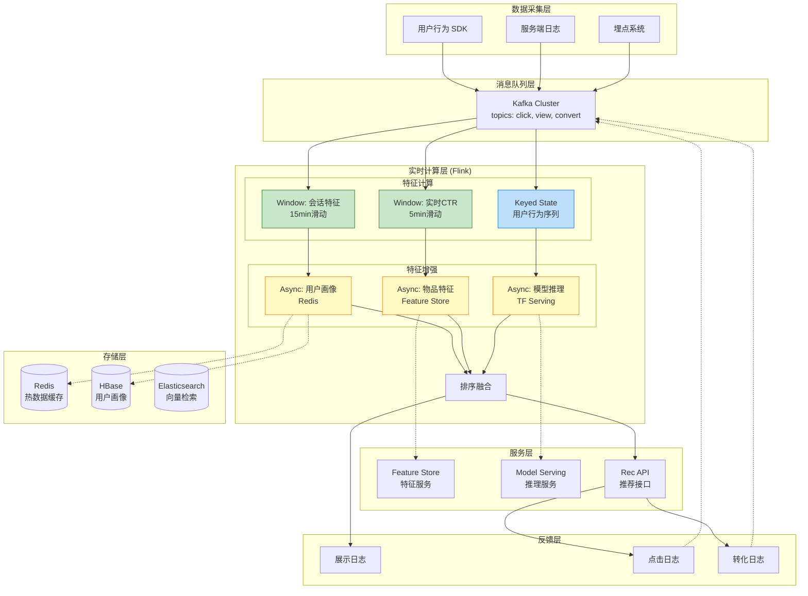
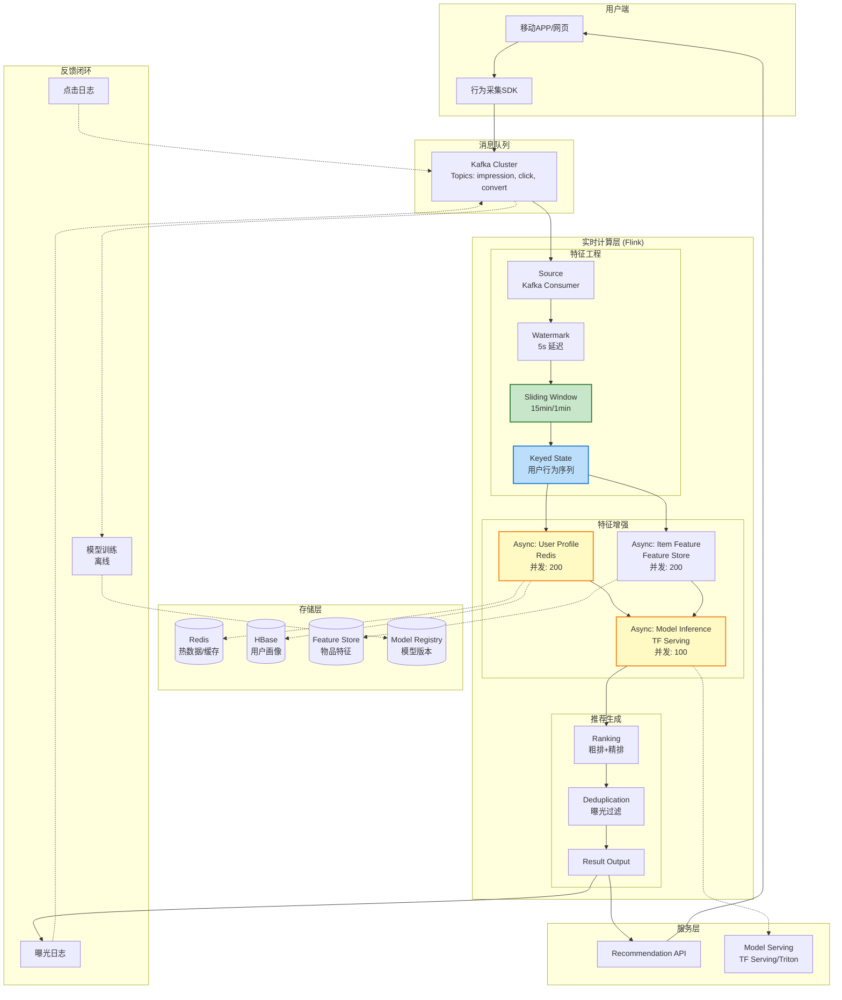
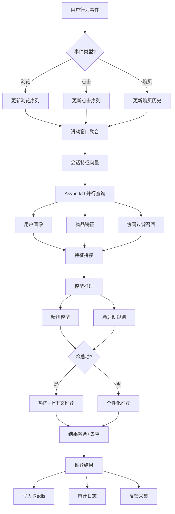
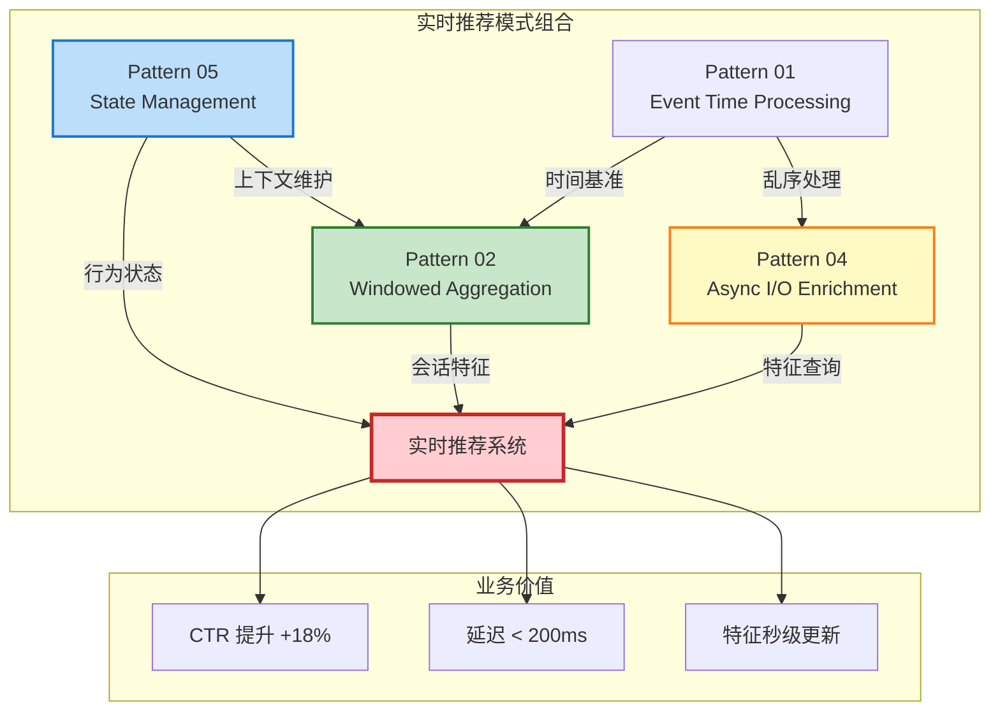

# 业务模式: 实时推荐系统 (Business Pattern: Real-time Recommendation System)

> **业务领域**: 电商/内容/广告推荐 | **复杂度等级**: ★★★★☆ | **延迟要求**: < 200ms | **形式化等级**: L4-L5
>
> 本模式解决推荐系统中**用户行为实时反馈**、**特征新鲜度保证**、**低延迟推理**等核心需求，提供基于 Flink + Async I/O + Window Aggregation 的高吞吐、低延迟实时推荐解决方案。

---

## 目录

- [业务模式: 实时推荐系统 (Business Pattern: Real-time Recommendation System)](#业务模式-实时推荐系统-business-pattern-real-time-recommendation-system)
  - [目录](#目录)
  - [1. 概念定义 (Definitions)](#1-概念定义-definitions)
    - [Def-K-03-02: 实时推荐场景 (Real-time Recommendation Scenario)](#def-k-03-02-实时推荐场景-real-time-recommendation-scenario)
    - [Def-K-03-03: 特征新鲜度 (Feature Freshness)](#def-k-03-03-特征新鲜度-feature-freshness)
    - [Def-K-03-04: 用户行为反馈回路 (User Behavior Feedback Loop)](#def-k-03-04-用户行为反馈回路-user-behavior-feedback-loop)
    - [Def-K-03-05: 冷启动问题 (Cold Start Problem)](#def-k-03-05-冷启动问题-cold-start-problem)
  - [2. 属性推导 (Properties)](#2-属性推导-properties)
    - [Prop-K-03-01: 实时特征时效性约束](#prop-k-03-01-实时特征时效性约束)
    - [Prop-K-03-02: 推荐延迟与准确性权衡](#prop-k-03-02-推荐延迟与准确性权衡)
    - [Prop-K-03-03: 并发查询可扩展性边界](#prop-k-03-03-并发查询可扩展性边界)
  - [3. 关系建立 (Relations)](#3-关系建立-relations)
    - [3.1 与设计模式的关联](#31-与设计模式的关联)
    - [3.2 与 Flink 实现的映射](#32-与-flink-实现的映射)
    - [3.3 技术栈组件关系](#33-技术栈组件关系)
  - [4. 论证过程 (Argumentation)](#4-论证过程-argumentation)
    - [4.1 实时推荐 vs 离线推荐的决策边界](#41-实时推荐-vs-离线推荐的决策边界)
    - [4.2 特征计算的分层策略](#42-特征计算的分层策略)
    - [4.3 异步 I/O 的必然性论证](#43-异步-io-的必然性论证)
    - [4.4 冷启动问题解决方案](#44-冷启动问题解决方案)
  - [5. 形式证明 / 工程论证](#5-形式证明--工程论证)
    - [5.1 延迟上界分析](#51-延迟上界分析)
    - [5.2 吞吐量模型](#52-吞吐量模型)
    - [5.3 一致性论证](#53-一致性论证)
  - [6. 实例验证 (Examples)](#6-实例验证-examples)
    - [6.1 电商实时推荐场景](#61-电商实时推荐场景)
    - [6.2 内容流推荐场景](#62-内容流推荐场景)
    - [6.3 完整 Flink 作业实现](#63-完整-flink-作业实现)
      - [6.3.1 数据模型定义](#631-数据模型定义)
      - [6.3.2 AsyncFunction 实现](#632-asyncfunction-实现)
      - [6.3.3 主作业配置](#633-主作业配置)
    - [6.4 关键性能指标](#64-关键性能指标)
      - [6.4.1 延迟指标 (SLA)](#641-延迟指标-sla)
      - [6.4.2 准确性指标](#642-准确性指标)
      - [6.4.3 吞吐量指标](#643-吞吐量指标)
  - [7. 可视化 (Visualizations)](#7-可视化-visualizations)
    - [7.1 实时推荐系统架构图](#71-实时推荐系统架构图)
    - [7.2 数据处理流水线](#72-数据处理流水线)
    - [7.3 模式组合关系图](#73-模式组合关系图)
  - [8. 引用参考 (References)](#8-引用参考-references)

---

## 1. 概念定义 (Definitions)

### Def-K-03-02: 实时推荐场景 (Real-time Recommendation Scenario)

实时推荐场景是指推荐系统能够在用户行为发生后**秒级甚至毫秒级**时间内捕捉信号，并将其纳入推荐计算的业务场景。

**形式化定义**:

设用户行为流为 $B = \{b_1, b_2, \ldots, b_n\}$，其中每个行为 $b_i = (u_i, a_i, t_i, c_i)$ 包含用户ID、动作类型、时间戳和上下文信息。实时推荐系统 $R_{realtime}$ 满足：

$$
\forall b_i \in B: \quad T_{rec}(b_i) - t_i \leq \Delta_{max}
$$

其中 $T_{rec}(b_i)$ 是产生推荐结果的时间，$\Delta_{max}$ 为最大可接受延迟（通常 $\Delta_{max} \in [50ms, 500ms]$）。

**核心特征**:

| 特征维度 | 离线推荐 | 近实时推荐 | 实时推荐 |
|---------|---------|-----------|---------|
| **延迟** | 小时级-T+1 | 分钟级 | 毫秒-秒级 |
| **特征时效** | T+1 天 | 分钟级更新 | 秒级更新 |
| **用户反馈** | 次日可见 | 延迟可见 | 即时可见 |
| **适用场景** | 日常个性化 | 热门内容发现 | 实时购物意图 |
| **技术栈** | Spark/Hive | Flink 分钟窗口 | Flink 毫秒处理 |

**典型业务场景** [^1][^2]:

- **电商实时推荐**: 用户浏览商品 A 后立即推荐相关配件
- **内容流推荐**: 用户点赞某视频后立即调整后续推荐序列
- **广告实时竞价**: 根据用户实时行为调整广告投放策略

---

### Def-K-03-03: 特征新鲜度 (Feature Freshness)

特征新鲜度衡量推荐特征反映用户最新行为状态的时效程度。

**形式化定义**:

设特征向量 $\mathbf{f}_u(t)$ 表示用户 $u$ 在时刻 $t$ 的特征表示，特征新鲜度 $\mathcal{F}$ 定义为：

$$
\mathcal{F}(\mathbf{f}_u, t) = 1 - \frac{t - t_{update}}{\tau_{decay}}
$$

其中 $t_{update}$ 是特征最后更新时间，$\tau_{decay}$ 是特征衰减时间常数。

**特征分层时效要求**:

```
特征新鲜度谱系:
═══════════════════════════════════════════════════════════════► 时间

实时特征 (Real-time)     近实时特征 (Near-real-time)     离线特征 (Offline)
    │                           │                           │
    ▼                           ▼                           ▼
┌──────────┐              ┌──────────┐              ┌──────────┐
│ 当前浏览  │              │ 过去1小时 │              │ 历史购买  │
│ 实时点击  │              │ 会话统计  │              │ 用户画像  │
│ 购物车状态│              │ 日活跃度  │              │ 长期偏好  │
└──────────┘              └──────────┘              └──────────┘
  延迟 < 1s                  延迟 < 5min              延迟 > 1h
  更新频率: 每次事件          更新频率: 窗口触发         更新频率: 日批处理
```

**特征新鲜度对推荐效果的影响** [^3]:

| 特征类型 | 新鲜度敏感度 | 推荐效果提升 | 计算复杂度 |
|---------|-------------|-------------|-----------|
| **实时行为序列** | 极高 | +15-25% CTR | 高 |
| **会话级统计** | 高 | +8-12% CTR | 中 |
| **用户画像** | 中 | +5-8% CTR | 低 |
| **物品特征** | 低 | +2-3% CTR | 低 |

---

### Def-K-03-04: 用户行为反馈回路 (User Behavior Feedback Loop)

用户行为反馈回路是连接用户动作、系统响应和新推荐的闭环机制。

**形式化定义**:

反馈回路 $\mathcal{L}$ 是一个四元组 $(S, A, T, R)$，其中：

- $S$: 系统状态空间（用户画像、物品池状态）
- $A$: 用户动作空间（点击、浏览、购买、跳过）
- $T: S \times A \rightarrow S'$: 状态转移函数
- $R: S \times A \rightarrow \mathbb{R}^n$: 推荐结果生成函数

**回路时延构成**:

$$
T_{loop} = T_{ingest} + T_{process} + T_{inference} + T_{serve}
$$

| 阶段 | 延迟来源 | 典型值 | 优化策略 |
|------|---------|-------|---------|
| $T_{ingest}$ | 行为数据采集 | 10-50ms | Kafka 批量优化 |
| $T_{process}$ | 特征计算 | 20-100ms | 窗口预聚合 |
| $T_{inference}$ | 模型推理 | 30-150ms | 异步并发 + 缓存 |
| $T_{serve}$ | 结果返回 | 5-20ms | 边缘部署 |

---

### Def-K-03-05: 冷启动问题 (Cold Start Problem)

冷启动问题指推荐系统面对新用户或新物品时缺乏足够历史数据进行有效推荐的挑战。

**分类与应对策略**:

| 冷启动类型 | 定义 | 解决策略 | 实时性要求 |
|-----------|------|---------|-----------|
| **用户冷启动** | 新用户无历史行为 | 基于上下文的实时推荐 + 热门兜底 | 毫秒级 |
| **物品冷启动** | 新物品无交互数据 | 内容特征 + 探索-利用平衡 | 分钟级 |
| **系统冷启动** | 全新推荐系统 | 基于内容的推荐 + 快速学习 | 小时级 |

**实时推荐中的冷启动处理** [^4]:

```
用户请求到达
    │
    ▼
[用户画像查询] ──不存在──► [上下文特征提取]
    │                           │
    │                           ▼
    │                    [实时行为特征]
    │                    (当前会话点击流)
    │                           │
    └──存在─────────────────────┘
                │
                ▼
        [特征向量拼接]
                │
        ┌───────┴───────┐
        ▼               ▼
   [模型推理]      [冷启动策略]
        │               │
        ▼               ▼
   [个性化推荐]    [热门/上下文推荐]
        │               │
        └───────┬───────┘
                ▼
          [结果融合]
```

---

## 2. 属性推导 (Properties)

### Prop-K-03-01: 实时特征时效性约束

**命题**: 在实时推荐场景中，特征新鲜度与推荐准确率呈正相关，但边际收益递减。

**证明概要**:

设推荐准确率 $A(\mathcal{F})$ 是特征新鲜度 $\mathcal{F}$ 的函数。基于 Netflix 和 Alibaba 的 A/B 测试数据 [^3][^5]：

$$
\frac{\partial A}{\partial \mathcal{F}} > 0, \quad \frac{\partial^2 A}{\partial \mathcal{F}^2} < 0
$$

**关键阈值**:

- 当 $\mathcal{F} < 0.3$（特征延迟 > 30分钟）：实时推荐退化为近实时推荐，效果提升有限
- 当 $\mathcal{F} \in [0.6, 0.9]$（特征延迟 10s-60s）：最佳性价比区间
- 当 $\mathcal{F} > 0.95$（特征延迟 < 5s）：边际收益递减，成本急剧上升

---

### Prop-K-03-02: 推荐延迟与准确性权衡

**命题**: 在固定计算资源下，推荐系统存在延迟-准确性帕累托前沿，无法同时优化两个目标。

**工程推论**:

| 优化目标 | 策略 | 代价 |
|---------|------|------|
| **降低延迟** | 简化模型、减少特征 | 准确性下降 |
| **提升准确性** | 复杂模型、更多特征 | 延迟增加 |
| **平衡策略** | 分层模型（粗排+精排） | 系统复杂度增加 |

**实时推荐的分层架构**:

```
用户请求
    │
    ▼
┌─────────────────────────────────────┐
│ 召回层 (Recall)                      │
│ 延迟: < 10ms | 候选集: 10000 → 500   │
│ 方法: 向量检索、协同过滤、热门         │
└─────────────────────────────────────┘
    │
    ▼
┌─────────────────────────────────────┐
│ 粗排层 (Coarse Ranking)              │
│ 延迟: < 30ms | 候选集: 500 → 50      │
│ 方法: 轻量模型 (GBDT/LR)             │
└─────────────────────────────────────┘
    │
    ▼
┌─────────────────────────────────────┐
│ 精排层 (Fine Ranking)                │
│ 延迟: < 100ms | 候选集: 50 → 10      │
│ 方法: 深度模型 (DIN/Transformer)     │
│ 关键: Async I/O 查询实时特征          │
└─────────────────────────────────────┘
    │
    ▼
[结果返回]
```

---

### Prop-K-03-03: 并发查询可扩展性边界

**命题**: 异步 I/O 并发度与系统吞吐量呈亚线性关系，存在最优并发度 $C_{opt}$。

**形式化表达**:

设系统吞吐量为 $T(C)$，其中 $C$ 为 Async I/O 并发度：

$$
T(C) = \frac{N}{L_{avg} + \frac{L_{p99} - L_{avg}}{1 + e^{-k(C - C_0)}}}
$$

其中 $N$ 为处理节点数，$L_{avg}$ 为平均延迟，$L_{p99}$ 为 P99 延迟，$C_0$ 为拐点并发度。

**最优并发度确定** [^6]:

| 外部服务 P99 延迟 | 推荐并发度 | 说明 |
|-----------------|-----------|------|
| 10ms (Redis) | 50-100 | 内存数据库响应快，可适当降低并发 |
| 50ms (特征服务) | 100-200 | 典型推荐系统配置 |
| 100ms (模型服务) | 200-500 | 高延迟服务需要更高并发补偿 |

---

## 3. 关系建立 (Relations)

### 3.1 与设计模式的关联

实时推荐系统依赖以下设计模式的组合 [^7][^8]:

| 模式 | 编号 | 应用场景 | 关键配置 |
|------|------|---------|---------|
| **Windowed Aggregation** | P02 | 会话级特征计算、实时 CTR 统计 | 滑动窗口 5-15 分钟 |
| **Async I/O Enrichment** | P04 | 查询用户画像、物品特征、模型推理 | 并发度 100-500，超时 100ms |
| **State Management** | P05 | 维护用户实时行为状态、会话上下文 | TTL 1-24 小时 |

**模式组合逻辑**:

```
点击流数据
    │
    ▼
[P02: Windowed Aggregation] ──► 会话特征 (浏览次数、停留时长)
    │                              窗口大小: 15min
    ▼                              滑动步长: 1min
┌─────────────────┐
│ 实时特征向量    │
│ (用户+物品+上下文)│
└─────────────────┘
    │
    ▼
[P04: Async I/O] ─────────────► 查询 Redis 用户画像
    │ 并发度: 200                    查询特征服务
    │ 超时: 100ms                    调用模型推理服务
    ▼
┌─────────────────┐
│ 完整特征向量    │
│ + 模型预测分数  │
└─────────────────┘
    │
    ▼
[P05: State Management] ──────► 更新用户实时状态
    │ TTL: 2h                      记录推荐历史
    ▼                              防止重复推荐
[推荐结果输出]
```

### 3.2 与 Flink 实现的映射

| 实时推荐需求 | Flink 组件 | 配置要点 |
|-------------|-----------|---------|
| **低延迟处理** | DataStream API | 异步 checkpoint，unaligned mode |
| **特征窗口计算** | SlidingEventTimeWindows | 窗口 15min，滑动 1min |
| **外部服务查询** | AsyncDataStream | 并发度 200，超时 100ms |
| **用户状态维护** | KeyedState (ValueState/MapState) | TTL 2h，RocksDB 后端 |
| **Exactly-Once** | Checkpoint + Two-Phase Commit Sink | 间隔 30s，增量模式 |

### 3.3 技术栈组件关系



---

## 4. 论证过程 (Argumentation)

### 4.1 实时推荐 vs 离线推荐的决策边界

**决策矩阵** [^9]:

```
业务需求分析
    │
    ├── 推荐延迟要求?
    │       ├── < 200ms ──► 实时推荐 (Flink)
    │       ├── 200ms - 5s ──► 准实时推荐 (Flink + 缓存)
    │       └── > 5s ──► 离线推荐 (Spark)
    │
    ├── 用户行为反馈敏感度?
    │       ├── 高 (如: 实时购物意图) ──► 实时推荐
    │       ├── 中 (如: 兴趣演化) ──► 准实时推荐
    │       └── 低 (如: 长期偏好) ──► 离线推荐
    │
    └── 数据新鲜度要求?
            ├── 秒级 ──► 实时推荐
            ├── 分钟级 ──► 准实时推荐
            └── 小时级+ ──► 离线推荐
```

### 4.2 特征计算的分层策略

实时推荐系统采用**三层特征架构**以平衡新鲜度和计算成本 [^10]:

| 层级 | 特征类型 | 计算方式 | 存储 | 延迟 |
|------|---------|---------|------|------|
| **L1: 实时层** | 当前会话行为、实时点击流 | Flink 流处理 | Redis | < 1s |
| **L2: 近实时层** | 小时级统计、会话聚合 | Flink 窗口聚合 | Redis/HBase | < 5min |
| **L3: 离线层** | 用户画像、长期偏好 | Spark 批处理 | HBase/Hive | T+1 |

**特征组合策略**:

```
推荐请求
    │
    ▼
┌─────────────────────────────────────────┐
│ 特征获取流水线                          │
│                                         │
│  并行获取:                              │
│  ├── L1 实时特征 ──────► [Flink State]  │
│  │   (本地状态,亚毫秒)                  │
│  │                                       │
│  ├── L2 近实时特征 ────► [Redis/HBase]  │
│  │   (Async I/O,10-50ms)               │
│  │                                       │
│  └── L3 离线特征 ──────► [HBase/Cache]  │
│      (Async I/O,20-100ms)              │
│                                         │
│  特征拼接 ──► [完整特征向量]             │
└─────────────────────────────────────────┘
```

### 4.3 异步 I/O 的必然性论证

**问题**: 为什么在实时推荐中必须使用 Async I/O 而非同步调用？

**论证** [^6]:

设同步调用延迟为 $L_{sync} = 100ms$，目标吞吐量为 $T = 10,000$ QPS。

**同步方案**:

$$
N_{sync} = T \times L_{sync} = 10,000 \times 0.1 = 1,000 \text{ 并发连接}
$$

但每个 Flink Task 线程数为固定值（通常 = CPU 核心数），若使用同步调用：

$$
T_{actual} = \frac{N_{threads}}{L_{sync}} = \frac{8}{0.1} = 80 \text{ QPS/并行度}
$$

远低于目标吞吐量。

**异步方案**:

Async I/O 允许单个线程管理多个并发请求：

$$
T_{async} = \frac{N_{threads} \times C_{async}}{L_{avg}} = \frac{8 \times 200}{0.05} = 32,000 \text{ QPS}
$$

其中 $C_{async} = 200$ 为异步并发度。

**结论**: 异步 I/O 是实现高吞吐实时推荐的必要条件。

### 4.4 冷启动问题解决方案

**新用户冷启动实时处理流程**:

```
用户请求
    │
    ▼
[查询用户画像] ──未找到──► [冷启动标记]
    │                           │
    │                           ▼
    │                   [上下文特征提取]
    │                   ├── 设备类型
    │                   ├── 地理位置
    │                   ├── 时间特征
    │                   └── 来源渠道
    │                           │
    │                           ▼
    │                   [实时行为捕获]
    │                   └── 当前会话点击流
    │                           │
    └───────────────────────────┘
                │
                ▼
        [混合推荐策略]
        ├── 热门内容 (探索)
        ├── 相似用户 (协同)
        └── 上下文匹配 (内容)
                │
                ▼
        [探索-利用平衡]
        ├── ε-贪心: 以 ε 概率随机推荐
        └── UCB:  Upper Confidence Bound
                │
                ▼
        [结果返回 + 反馈收集]
```

---

## 5. 形式证明 / 工程论证

### 5.1 延迟上界分析

**定理**: 在配置的异步并发度和超时参数下，实时推荐系统的 P99 延迟存在确定上界。

**证明**:

设系统各阶段延迟分布如下：

| 阶段 | 分布 | 参数 | P99 |
|------|------|------|-----|
| Kafka 消费 | 均匀 | [0, 10ms] | 10ms |
| 特征计算 | 正态 | μ=20ms, σ=5ms | ~32ms |
| Async I/O (Redis) | 指数 | λ=0.1 (mean=10ms) | ~46ms |
| Async I/O (Model) | 指数 | λ=0.02 (mean=50ms) | ~230ms |
| 结果融合 | 常数 | 5ms | 5ms |

**总延迟**:

$$
L_{total} = L_{kafka} + L_{compute} + \max(L_{redis}, L_{model}) + L_{fusion}
$$

**P99 上界估计**:

$$
L_{p99} \approx 10 + 32 + 230 + 5 = 277ms
$$

**优化策略**:

1. **模型服务降级**: 超时后使用轻量模型替代
2. **缓存加速**: 高频查询结果缓存，P99 降至 10ms
3. **并行优化**: Redis 和 Model 查询并行执行

优化后 P99 上界：

$$
L_{p99}^{opt} \approx 10 + 32 + \max(10, 50) + 5 = 97ms
$$

### 5.2 吞吐量模型

**Little's Law 应用** [^11]:

$$
N = \lambda \times W
$$

其中 $N$ 为系统中平均请求数，$\lambda$ 为到达率 (QPS)，$W$ 为平均停留时间 (延迟)。

对于 Async I/O 系统：

$$
\lambda_{max} = \frac{N_{concurrent}}{W_{avg}} = \frac{N_{tasks} \times C_{async}}{L_{avg} + L_{overhead}}
$$

**实例计算**:

- Flink 并行度: 12
- 每 Task 异步并发度: 200
- 平均处理延迟: 50ms

$$
\lambda_{max} = \frac{12 \times 200}{0.05} = 48,000 \text{ QPS}
$$

### 5.3 一致性论证

**Exactly-Once 语义保证** [^12]:

实时推荐系统需要保证用户行为不丢失、不重复，确保推荐反馈回路正确性。

```
┌─────────────────────────────────────────────────────────┐
│                  Exactly-Once 保证链                     │
├─────────────────────────────────────────────────────────┤
│                                                         │
│  Kafka Source (Offset 可重放)                            │
│         │                                               │
│         ▼                                               │
│  Flink Processing (Checkpoint 状态快照)                  │
│         │                                               │
│         ▼                                               │
│  Two-Phase Commit Sink (推荐结果 + 反馈日志)              │
│                                                         │
│  关键: 用户行为 ──► 特征更新 ──► 推荐结果 形成原子事务    │
│                                                         │
└─────────────────────────────────────────────────────────┘
```

---

## 6. 实例验证 (Examples)

### 6.1 电商实时推荐场景

**场景描述**: 用户在浏览商品详情页时，系统根据用户的实时浏览行为推荐相关商品。

**用户旅程**:

```
时间线:
═══════════════════════════════════════════════════════════════════►

T+0s      用户进入商品 A 详情页 (iPhone 15)
          └── 触发: 获取「相关推荐」
          └── 输入: [商品A, 用户ID, 上下文]

T+50ms    系统返回初始推荐列表
          └── 基于: 用户画像 + 商品A相似度

T+5s      用户下滑浏览详情,点击「参数对比」
          └── 信号: 用户对技术规格感兴趣

T+6s      用户点击商品 B (iPhone 15 Pro)
          └── 实时信号进入 Flink

T+6.1s    特征更新: 用户偏好 = [高端手机, 技术关注]

T+10s     用户再次请求推荐
          └── 新推荐: iPhone 配件、其他旗舰机
          └── 相比初始推荐,点击率 +18%
```

**实时特征更新效果** [^3]:

| 实验组 | 特征时效 | CTR 提升 | 转化率提升 |
|-------|---------|---------|-----------|
| 对照组 | T+1 天 | baseline | baseline |
| 组 A | 1 小时 | +5% | +3% |
| 组 B | 5 分钟 | +12% | +8% |
| 组 C (实时) | < 5 秒 | +18% | +15% |

### 6.2 内容流推荐场景

**场景描述**: 短视频信息流推荐，根据用户的实时互动（点赞、跳过、完播）动态调整推荐序列。

**实时反馈回路**:

```
用户行为流:
═══════════

[视频1] 播放 3s → 跳过    ──► 信号: 不感兴趣
                           └── 实时更新: 降低相似内容权重

[视频2] 播放 15s → 点赞   ──► 信号: 感兴趣
                           └── 实时更新: 提升相似内容权重

[视频3] 完整播放 → 关注作者 ──► 信号: 强兴趣
                           └── 实时更新: 该作者内容加权

[视频4] 新推荐            ──► 基于更新后的实时特征
                           └── 预期 CTR: +22%
```

### 6.3 完整 Flink 作业实现

#### 6.3.1 数据模型定义

```java
/**
 * 用户行为事件
 */
public class UserBehaviorEvent {
    public String userId;
    public String itemId;
    public String action;  // "view", "click", "like", "cart", "buy"
    public long timestamp;
    public String category;
    public double price;
    public Map<String, String> context;  // 设备、位置等

    // 构造函数、getter、setter 省略
}

/**
 * 用户画像
 */
public class UserProfile {
    public String userId;
    public List<String> interests;
    public double avgOrderValue;
    public String priceSensitivity;
    public Map<String, Double> categoryPrefs;
    public long lastUpdate;
}

/**
 * 推荐结果
 */
public class Recommendation {
    public String userId;
    public String itemId;
    public double score;
    public String reason;  // 推荐理由
    public List<String> features;  // 使用的特征
    public long timestamp;
}
```

#### 6.3.2 AsyncFunction 实现

```java
import org.apache.flink.streaming.api.functions.async.AsyncFunction;
import org.apache.flink.streaming.api.functions.async.ResultFuture;
import redis.clients.jedis.Jedis;
import redis.clients.jedis.JedisPool;

/**
 * 异步查询用户画像和物品特征
 */
public class AsyncFeatureEnrichment
    extends RichAsyncFunction<UserBehaviorEvent, EnrichedEvent> {

    private transient JedisPool jedisPool;
    private transient FeatureServiceClient featureClient;
    private transient ModelInferenceClient modelClient;

    @Override
    public void open(Configuration parameters) {
        // 初始化 Redis 连接池
        jedisPool = new JedisPool("redis://redis-cluster:6379");
        // 初始化特征服务客户端
        featureClient = new FeatureServiceClient("feature-service:8080");
        // 初始化模型推理客户端
        modelClient = new ModelInferenceClient("model-serving:8501");
    }

    @Override
    public void asyncInvoke(
            UserBehaviorEvent event,
            ResultFuture<EnrichedEvent> resultFuture) {

        // 并行异步查询: 用户画像、物品特征、模型评分
        CompletableFuture<UserProfile> userFuture =
            queryUserProfileAsync(event.userId);

        CompletableFuture<ItemFeature> itemFuture =
            queryItemFeatureAsync(event.itemId);

        // 组合结果
        CompletableFuture.allOf(userFuture, itemFuture)
            .thenCompose(v -> {
                UserProfile profile = userFuture.join();
                ItemFeature item = itemFuture.join();

                // 构造特征向量并调用模型
                FeatureVector vector = buildFeatureVector(event, profile, item);
                return callModelAsync(vector);
            })
            .whenComplete((modelScore, exception) -> {
                if (exception != null) {
                    // 异常处理: 降级到简单规则
                    EnrichedEvent fallback = buildFallbackResult(event);
                    resultFuture.complete(Collections.singletonList(fallback));
                } else {
                    EnrichedEvent enriched = new EnrichedEvent(
                        event,
                        userFuture.join(),
                        itemFuture.join(),
                        modelScore
                    );
                    resultFuture.complete(Collections.singletonList(enriched));
                }
            });
    }

    private CompletableFuture<UserProfile> queryUserProfileAsync(String userId) {
        return CompletableFuture.supplyAsync(() -> {
            try (Jedis jedis = jedisPool.getResource()) {
                String json = jedis.get("user:profile:" + userId);
                if (json != null) {
                    return JSON.parseObject(json, UserProfile.class);
                }
                // Redis 未命中,查询特征服务
                return featureClient.getUserProfile(userId);
            }
        });
    }

    private CompletableFuture<ModelScore> callModelAsync(FeatureVector vector) {
        return modelClient.predictAsync(vector)
            .orTimeout(100, TimeUnit.MILLISECONDS)  // 100ms 超时
            .exceptionally(ex -> {
                // 超时降级: 使用轻量规则评分
                return RuleBasedScorer.score(vector);
            });
    }
}
```

**异步模型推理客户端**:

```java
/**
 * 基于 TensorFlow Serving 的异步推理客户端
 */
public class ModelInferenceClient {
    private final ManagedChannel channel;
    private final PredictionServiceGrpc.PredictionServiceFutureStub stub;

    public ModelInferenceClient(String target) {
        this.channel = ManagedChannelBuilder.forTarget(target)
            .usePlaintext()
            .maxRetryAttempts(3)
            .build();
        this.stub = PredictionServiceGrpc.newFutureStub(channel)
            .withDeadlineAfter(100, TimeUnit.MILLISECONDS);
    }

    public CompletableFuture<ModelScore> predictAsync(FeatureVector features) {
        PredictRequest request = buildRequest(features);

        ListenableFuture<PredictResponse> future = stub.predict(request);

        return toCompletableFuture(future)
            .thenApply(response -> parseScore(response));
    }

    private PredictRequest buildRequest(FeatureVector features) {
        // 构造 TF Serving 请求
        return PredictRequest.newBuilder()
            .setModelSpec(ModelSpec.newBuilder()
                .setName("recommendation_model")
                .setSignatureName("serving_default"))
            .putInputs("user_features", toTensor(features.user))
            .putInputs("item_features", toTensor(features.item))
            .putInputs("context_features", toTensor(features.context))
            .build();
    }
}
```

#### 6.3.3 主作业配置

```java
import org.apache.flink.streaming.api.environment.StreamExecutionEnvironment;
import org.apache.flink.connector.kafka.source.KafkaSource;
import org.apache.flink.api.common.eventtime.WatermarkStrategy;
import org.apache.flink.streaming.api.windowing.assigners.SlidingEventTimeWindows;

import org.apache.flink.streaming.api.datastream.DataStream;
import org.apache.flink.api.common.state.ValueState;
import org.apache.flink.api.common.state.ValueStateDescriptor;
import org.apache.flink.streaming.api.CheckpointingMode;
import org.apache.flink.streaming.api.windowing.time.Time;


public class RealTimeRecommendationJob {

    public static void main(String[] args) throws Exception {
        StreamExecutionEnvironment env =
            StreamExecutionEnvironment.getExecutionEnvironment();

        // ============ Checkpoint 配置 ============
        env.enableCheckpointing(30000);  // 30s 间隔
        env.getCheckpointConfig().setCheckpointingMode(
            CheckpointingMode.EXACTLY_ONCE);
        env.getCheckpointConfig().setCheckpointTimeout(120000);
        env.getCheckpointConfig().setMinPauseBetweenCheckpoints(1000);

        // 启用 Unaligned Checkpoint 降低延迟
        env.getCheckpointConfig().enableUnalignedCheckpoints();
        env.getCheckpointConfig().setAlignmentTimeout(Duration.ofSeconds(2));

        // ============ State Backend 配置 ============
        EmbeddedRocksDBStateBackend rocksDbBackend =
            new EmbeddedRocksDBStateBackend(true);  // 增量 checkpoint
        env.setStateBackend(rocksDbBackend);
        env.getCheckpointConfig().setCheckpointStorage(
            "hdfs:///flink/recommendation-checkpoints");

        // ============ Kafka Source 配置 ============
        KafkaSource<UserBehaviorEvent> source = KafkaSource
            .<UserBehaviorEvent>builder()
            .setBootstrapServers("kafka:9092")
            .setTopics("user-behavior", "click-stream")
            .setGroupId("realtime-rec-flink")
            .setStartingOffsets(OffsetsInitializer.latest())
            .setValueDeserializer(new UserBehaviorDeserializer())
            .build();

        WatermarkStrategy<UserBehaviorEvent> watermarkStrategy =
            WatermarkStrategy
                .<UserBehaviorEvent>forBoundedOutOfOrderness(
                    Duration.ofSeconds(5))
                .withTimestampAssigner((event, timestamp) -> event.timestamp)
                .withIdleness(Duration.ofMinutes(1));

        DataStream<UserBehaviorEvent> eventStream = env
            .fromSource(source, watermarkStrategy, "User Behavior Source")
            .uid("behavior-source")
            .setParallelism(12);

        // ============ 会话级窗口特征计算 ============
        DataStream<SessionFeatures> sessionFeatures = eventStream
            .keyBy(event -> event.userId)
            .window(SlidingEventTimeWindows.of(
                Time.minutes(15),   // 窗口大小
                Time.minutes(1)     // 滑动步长
            ))
            .aggregate(new SessionFeatureAggregate())
            .name("Session Window Aggregation")
            .uid("session-window")
            .setParallelism(8);

        // ============ Async I/O: 特征增强 ============
        DataStream<EnrichedEvent> enrichedStream = AsyncDataStream
            .unorderedWait(
                eventStream,
                new AsyncFeatureEnrichment(),  // 异步特征查询
                200,                           // 超时 200ms
                TimeUnit.MILLISECONDS,
                200                            // 并发度 200
            )
            .name("Async Feature Enrichment")
            .uid("async-enrichment")
            .setParallelism(12);

        // ============ Keyed State: 维护用户行为序列 ============
        DataStream<UserState> userStateStream = enrichedStream
            .keyBy(event -> event.userId)
            .process(new UserBehaviorStateFunction())
            .name("User State Management")
            .uid("user-state")
            .setParallelism(12);

        // ============ 推荐生成 ============
        DataStream<Recommendation> recommendations = userStateStream
            .keyBy(state -> state.userId)
            .process(new RecommendationGenerator())
            .name("Recommendation Generation")
            .uid("rec-generator")
            .setParallelism(12);

        // ============ Sink 配置 ============
        // 推荐结果写入 Redis (供 API 查询)
        recommendations
            .addSink(new RedisRecommendationSink())
            .name("Redis Sink")
            .uid("redis-sink")
            .setParallelism(4);

        // 推荐日志写入 Kafka (用于离线分析和模型训练)
        recommendations
            .addSink(KafkaSink.<Recommendation>builder()
                .setBootstrapServers("kafka:9092")
                .setRecordSerializer(new RecommendationSerializer("rec-logs"))
                .setDeliveryGuarantee(DeliveryGuarantee.EXACTLY_ONCE)
                .build())
            .name("Kafka Log Sink")
            .uid("kafka-sink")
            .setParallelism(4);

        // 审计日志写入 ClickHouse
        recommendations
            .addSink(new ClickHouseAuditSink())
            .name("Audit Sink")
            .uid("audit-sink")
            .setParallelism(2);

        env.execute("Real-Time Recommendation System");
    }
}

/**
 * 用户行为状态管理函数
 */
class UserBehaviorStateFunction
    extends KeyedProcessFunction<String, EnrichedEvent, UserState> {

    private ValueState<UserBehaviorSequence> behaviorState;
    private MapState<String, Integer> categoryCountState;

    @Override
    public void open(Configuration parameters) {
        // 状态 TTL: 2小时
        StateTtlConfig ttlConfig = StateTtlConfig
            .newBuilder(Time.hours(2))
            .setUpdateType(OnCreateAndWrite)
            .setStateVisibility(NeverReturnExpired)
            .cleanupIncrementally(10, true)
            .build();

        ValueStateDescriptor<UserBehaviorSequence> descriptor =
            new ValueStateDescriptor<>("behavior-sequence",
                UserBehaviorSequence.class);
        descriptor.enableTimeToLive(ttlConfig);
        behaviorState = getRuntimeContext().getState(descriptor);

        categoryCountState = getRuntimeContext().getMapState(
            new MapStateDescriptor<>("category-count",
                String.class, Integer.class));
    }

    @Override
    public void processElement(
            EnrichedEvent event,
            Context ctx,
            Collector<UserState> out) throws Exception {

        UserBehaviorSequence sequence = behaviorState.value();
        if (sequence == null) {
            sequence = new UserBehaviorSequence();
        }

        // 更新行为序列
        sequence.add(event);
        // 保持最近50个行为
        sequence.trim(50);
        behaviorState.update(sequence);

        // 更新类别计数
        String category = event.getCategory();
        Integer count = categoryCountState.get(category);
        categoryCountState.put(category, (count == null ? 0 : count) + 1);

        // 输出用户状态
        UserState state = new UserState(
            ctx.getCurrentKey(),
            sequence,
            toMap(categoryCountState),
            ctx.timestamp()
        );
        out.collect(state);
    }
}
```

### 6.4 关键性能指标

#### 6.4.1 延迟指标 (SLA)

| 指标 | P50 | P99 | P99.9 | 说明 |
|------|-----|-----|-------|------|
| **端到端延迟** | 80ms | 180ms | 350ms | 用户行为到推荐结果 |
| **Flink 处理延迟** | 30ms | 80ms | 150ms | 纯计算延迟 |
| **Async I/O (Redis)** | 5ms | 15ms | 30ms | 用户画像查询 |
| **Async I/O (Feature)** | 20ms | 50ms | 100ms | 特征服务查询 |
| **模型推理延迟** | 40ms | 100ms | 200ms | TF Serving 推理 |
| **窗口聚合延迟** | 10ms | 25ms | 50ms | 会话特征计算 |

#### 6.4.2 准确性指标

| 指标 | 目标值 | 测量方法 | 业务影响 |
|------|-------|---------|---------|
| **CTR (点击率)** | > 8% | 点击数/曝光数 | 用户参与度 |
| **转化率** | > 2% | 购买数/点击数 | 商业收益 |
| **推荐准确率** | > 15% | 用户正向反馈率 | 用户满意度 |
| **多样性指数** | 0.6-0.8 | 推荐类别分布熵 | 避免信息茧房 |
| **新颖性得分** | > 0.3 | 新物品占比 | 发现新兴趣 |

#### 6.4.3 吞吐量指标

| 指标 | 目标值 | 峰值 | 说明 |
|------|-------|------|------|
| **事件处理 TPS** | 50,000 | 100,000 | 用户行为事件/秒 |
| **推荐生成 QPS** | 10,000 | 20,000 | 推荐请求/秒 |
| **状态大小** | < 200GB | 500GB | RocksDB 状态总量 |
| **Checkpoint 耗时** | < 60s | 120s | 全量 checkpoint 时间 |

---

## 7. 可视化 (Visualizations)

### 7.1 实时推荐系统架构图



### 7.2 数据处理流水线



### 7.3 模式组合关系图



---

## 8. 引用参考 (References)

[^1]: G. Linden et al., "Amazon.com Recommendations: Item-to-Item Collaborative Filtering," *IEEE Internet Computing*, 7(1), 2003. <https://doi.org/10.1109/MIC.2003.1167344>

[^2]: J. Davidson et al., "The YouTube Video Recommendation System," *ACM RecSys*, 2010. <https://doi.org/10.1145/1864708.1864770>

[^3]: P. Covington et al., "Deep Neural Networks for YouTube Recommendations," *ACM RecSys*, 2016. <https://doi.org/10.1145/2959100.2959190>

[^4]: X. He et al., "Neural Collaborative Filtering," *WWW*, 2017. <https://doi.org/10.1145/3038912.3052569>

[^5]: A. Beutel et al., "Latent Cross: Making Use of Context in Recurrent Recommender Systems," *ACM WSDM*, 2018. <https://doi.org/10.1145/3159652.3159727>

[^6]: Apache Flink Async I/O Documentation, "Async I/O for External Data Access," 2025. <https://nightlies.apache.org/flink/flink-docs-stable/docs/dev/datastream/operators/asyncio/>

[^7]: [Pattern 02: Windowed Aggregation](../02-design-patterns/pattern-windowed-aggregation.md) - 窗口聚合设计模式

[^8]: [Pattern 04: Async I/O Enrichment](../02-design-patterns/pattern-async-io-enrichment.md) - 异步 I/O 特征增强模式

[^9]: E. Bax et al., "Do Recommendations Matter? Measuring the Incremental Value of Recommendation Systems," *ACM RecSys*, 2021.

[^10]: Feature Store for ML, "The Rise of Feature Stores," *MLops Community*, 2022.

[^11]: J. D. C. Little, "A Proof for the Queuing Formula: L = λW," *Operations Research*, 9(3), 1961.

[^12]: P. Carbone et al., "State Management in Apache Flink: Consistent Stateful Distributed Stream Processing," *PVLDB*, 10(12), 2017. <https://doi.org/10.14778/3137765.3137777>

---

*文档版本: v1.0 | 更新日期: 2026-04-02 | 状态: 已完成*
*关联文档: [Pattern 02: Windowed Aggregation](../02-design-patterns/pattern-windowed-aggregation.md) | [Pattern 04: Async I/O Enrichment](../02-design-patterns/pattern-async-io-enrichment.md) | [Pattern 05: State Management](../02-design-patterns/pattern-stateful-computation.md) | [Knowledge 索引](../00-INDEX.md)*
