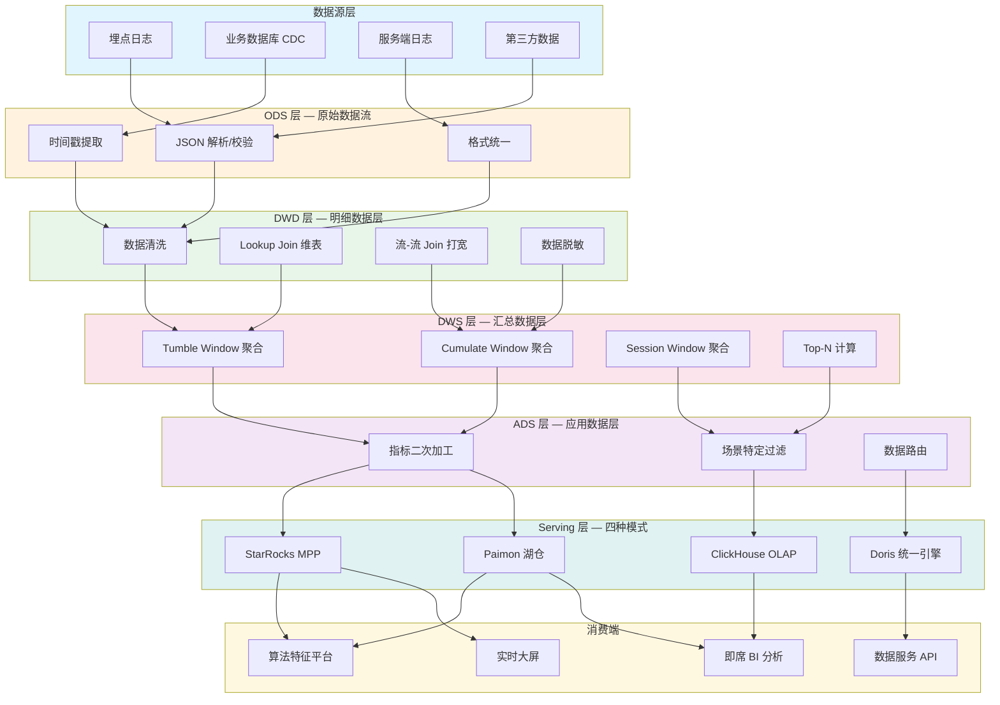
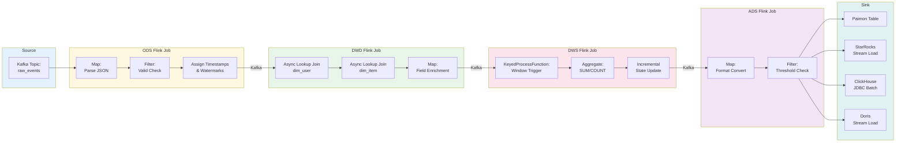
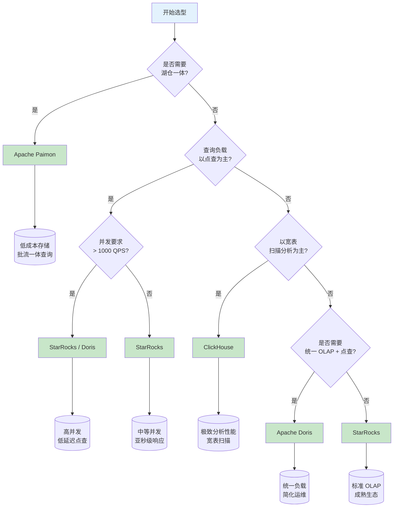
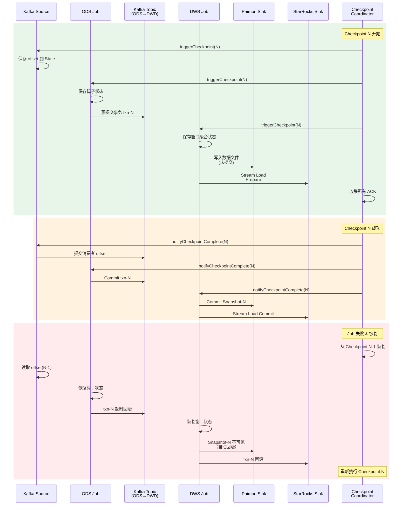
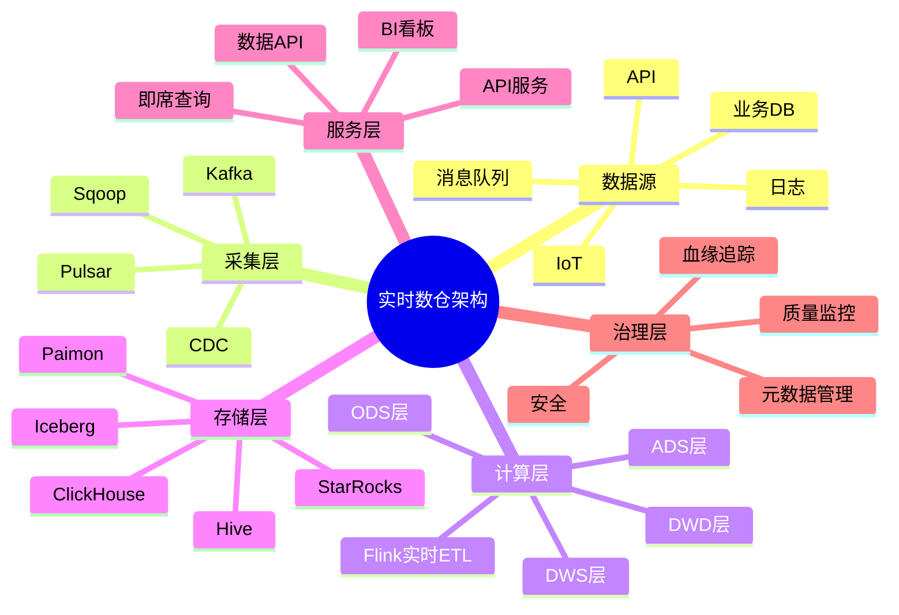
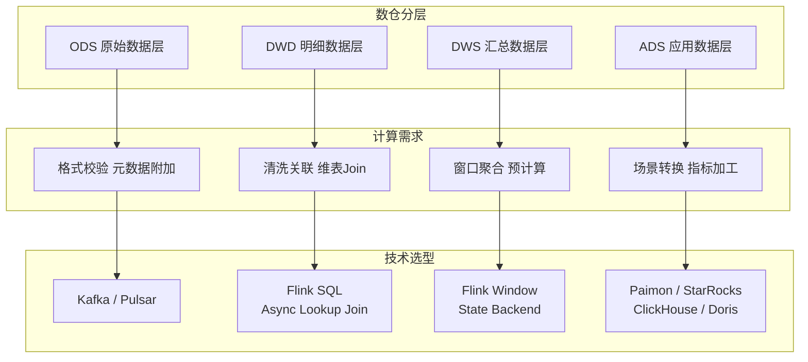
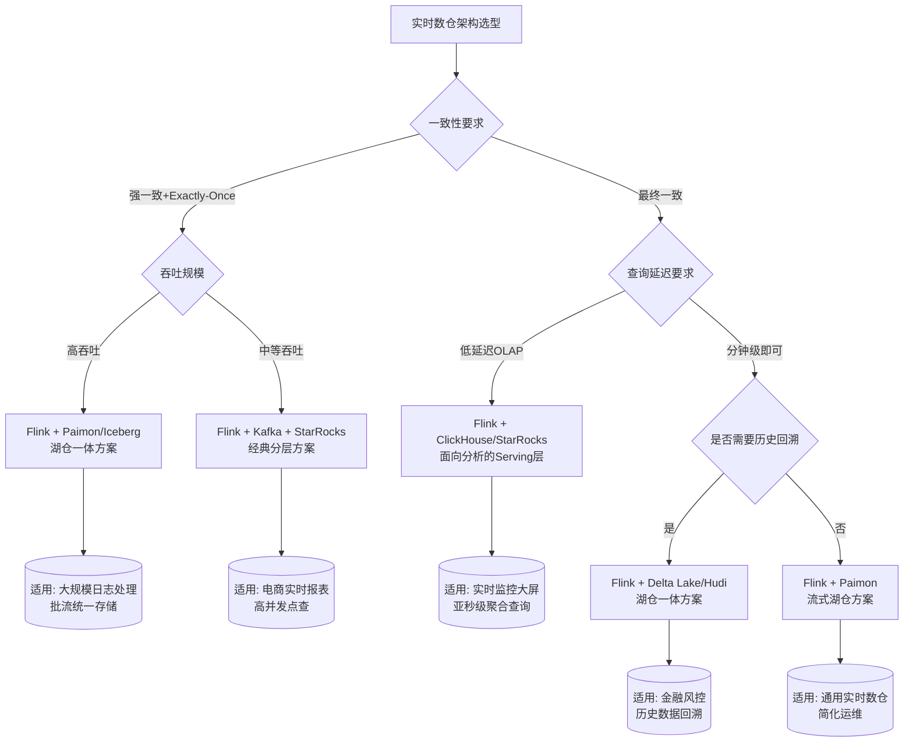

# Flink 实时数仓架构设计深度指南

> 所属阶段: Knowledge/03-business-patterns | 前置依赖: [Flink/02-core/flink-state-management-complete-guide.md](../../Flink/02-core/flink-state-management-complete-guide.md), [Flink/02-core/streaming-etl-best-practices.md](../../Flink/02-core/streaming-etl-best-practices.md) | 形式化等级: L4

## 1. 概念定义 (Definitions)

本节建立实时数仓架构的核心形式化概念，为后续分层设计、Serving 层选型与一致性论证奠定严格的语义基础。

**Def-K-03-01** (实时数仓, Real-time Data Warehouse)
> 实时数仓是一个五元组 $\mathcal{RTDW} = (\mathcal{S}, \mathcal{L}, \mathcal{T}, \mathcal{Q}, \mathcal{G})$，其中：
>
> - $\mathcal{S}$ 为数据源集合（Source），产生带事件时间戳的数据流；
> - $\mathcal{L}$ 为分层计算层（Layer），执行流式转换与聚合；
> - $\mathcal{T}$ 为时间语义函数，将处理时间映射到事件时间；
> - $\mathcal{Q}$ 为查询接口集合，支持低延迟即席查询；
> - $\mathcal{G}$ 为一致性保障机制（如 Checkpoint、Exactly-Once Sink）。
>
> 与传统离线数仓 $\mathcal{OLAP}$ 的核心差异在于：$\mathcal{RTDW}$ 的延迟上界 $L_{\max}$ 满足 $L_{\max} \ll T_{batch}$，其中 $T_{batch}$ 为典型批处理周期（小时级或天级）。

实时数仓并非简单地将批处理替换为流处理，而是要求在整个数据管道中保持**时间语义的连续性**和**状态管理的可恢复性**。Flink 的 Event Time 处理机制与 Checkpoint 机制恰好为这两个需求提供了原语级支持。

**Def-K-03-02** (流式分层架构, Streaming Layered Architecture)
> 流式分层架构是一个四元组 $\mathcal{SLA} = (\text{ODS}, \text{DWD}, \text{DWS}, \text{ADS})$，其中各层均为流式作业（Streaming Job）的集合：
>
> - **ODS (Operational Data Store)**：原始数据流层，$\text{ODS} = \{ j \mid j \text{ 执行格式校验与元数据附加} \}$，输出与输入保持 1:1 映射关系；
> - **DWD (Data Warehouse Detail)**：明细数据层，$\text{DWD} = \{ j \mid j \text{ 执行清洗、关联、打宽} \}$，输出 Schema 经过规范化；
> - **DWS (Data Warehouse Service)**：汇总数据层，$\text{DWS} = \{ j \mid j \text{ 执行窗口聚合与预计算} \}$，输出为聚合度量流；
> - **ADS (Application Data Service)**：应用数据层，$\text{ADS} = \{ j \mid j \text{ 执行场景特定转换} \}$，直接对接 Serving 引擎。
>
> 层间依赖构成有向无环图（DAG）：$\text{ODS} \prec \text{DWD} \prec \text{DWS} \prec \text{ADS}$，其中 $\prec$ 表示数据流依赖关系。

与离线数仓的分层不同，流式分层架构中的每一层都是**持续运行**的 Flink 作业，层与层之间通过消息队列（Kafka/Pulsar）或流式文件系统（Paimon/Iceberg）进行解耦。这种解耦使得各层可以独立扩缩容、独立升级、独立容错。

**Def-K-03-03** (Serving 层模式, Serving Layer Pattern)
> Serving 层模式是一个三元组 $\mathcal{SP} = (\mathcal{E}, \mathcal{I}, \mathcal{R})$，其中：
>
> - $\mathcal{E}$ 为存储引擎（Engine），如 Paimon、StarRocks、ClickHouse、Doris；
> - $\mathcal{I}$ 为摄入接口（Ingestion），定义 Flink Sink 到引擎的数据通路；
> - $\mathcal{R}$ 为查询能力集合（Query Capabilities），包括点查、范围查、聚合查、Join 查等。
>
> 模式的有效性条件：$\forall q \in \mathcal{Q}_{req}, \exists r \in \mathcal{R} : r \text{ 满足 } q \text{ 的延迟与一致性要求}$，其中 $\mathcal{Q}_{req}$ 为业务查询需求集合。

四种主流 Serving 引擎在实时数仓场景中各有其适用边界。选型时需要综合考量数据新鲜度、查询延迟、并发能力、存储成本与运维复杂度五个维度。

**Def-K-03-04** (流式一致性边界, Streaming Consistency Boundary)
> 流式一致性边界是一个二元组 $\mathcal{CB} = (\mathcal{C}_{in}, \mathcal{C}_{out})$，其中：
>
> - $\mathcal{C}_{in} \in \{\text{At-Most-Once}, \text{At-Least-Once}, \text{Exactly-Once}\}$ 为输入端一致性级别；
> - $\mathcal{C}_{out} \in \{\text{At-Most-Once}, \text{At-Least-Once}, \text{Exactly-Once}\}$ 为输出端一致性级别。
>
> 实时数仓全链路一致性定义为：若分层架构中每一层作业 $j_i$ 的一致性边界为 $(\mathcal{C}_{in}^{(i)}, \mathcal{C}_{out}^{(i)})$，则全链路一致性为各层一致性的复合 $\mathcal{C}_{total} = \bigcirc_{i=1}^{n} \mathcal{C}_{out}^{(i)}$，其中 $\bigcirc$ 为一致性级别复合算子：
>
> - $\text{Exactly-Once} \bigcirc \text{Exactly-Once} = \text{Exactly-Once}$
> - $\text{At-Least-Once} \bigcirc x = \text{At-Least-Once}$（$x$ 为任意级别）
> - $\text{At-Most-Once} \bigcirc x = \text{At-Most-Once}$（$x$ 为任意级别）

在 Flink 实时数仓中，通过 Checkpoint 机制与两阶段提交（2PC）Sink 的配合，可以实现全链路的 Exactly-Once 语义。这是实时数仓在一致性维度上对标离线数仓的关键技术保障。

**Def-K-03-05** (数据建模约束, Data Modeling Constraint)
> 数据建模约束是一个谓词集合 $\mathcal{MC} = \{ \phi_1, \phi_2, \ldots, \phi_m \}$，作用于数仓各层的 Schema $S$ 与数据实例 $D$：
>
> - **主键约束** $\phi_{pk}$：$\forall t_1, t_2 \in D : t_1.pk = t_2.pk \Rightarrow t_1 = t_2$；
> - **外键约束** $\phi_{fk}$：$\forall t \in D_{child} : t.fk \in \pi_{pk}(D_{parent})$；
> - **时间完整性约束** $\phi_{time}$：$\forall t \in D : t.et \leq \text{now()} \land t.pt - t.et \leq \delta_{\max}$，其中 $et$ 为事件时间，$pt$ 为处理时间，$\delta_{\max}$ 为最大可接受乱序；
> - **度量单调性约束** $\phi_{mono}$（适用于 DWS 层）：窗口聚合结果随水位线推进单调递增，即 $W_1 \subset W_2 \Rightarrow \text{agg}(W_1) \leq \text{agg}(W_2)$（对 SUM/COUNT 类聚合）。

流式环境下的数据建模与离线环境存在本质差异。离线数仓可以依赖批处理的"全量可见性"来保证约束的一致性检查，而实时数仓必须在数据到达的**瞬间**即做出决策，这要求约束检查必须是增量式的、可容错恢复的。

**Def-K-03-06** (性能优化算子, Performance Optimization Operator)
> 性能优化算子是一个作用于 Flink 作业图 $G = (V, E)$ 的变换函数族 $\mathcal{PO} = \{ f_{sk}, f_{mini}, f_{async}, f_{local} \}$：
>
> - **Mini-Batch 聚合** $f_{mini}$：将微批内的记录聚合后再输出，减少状态访问次数；
> - **异步 Lookup Join** $f_{async}$：将同步维表查询转换为异步批量查询，提高 I/O 并行度；
> - **Local-Global 聚合** $f_{local}$：先在 Subtask 本地预聚合，再全局聚合，减少网络 Shuffle；
> - **Skewed Key 处理** $f_{sk}$：对热点 Key 进行加盐拆分，均衡负载。
>
> 每个算子 $f \in \mathcal{PO}$ 满足性能不变式：$\text{latency}(f(G)) \leq \text{latency}(G) \cdot (1 + \epsilon_f)$ 且 $\text{throughput}(f(G)) \geq \text{throughput}(G) \cdot (1 + \eta_f)$，其中 $\epsilon_f \ll 1$ 为延迟增长系数，$\eta_f > 0$ 为吞吐量提升系数。

这些优化算子是 Flink SQL 在实时数仓场景中的核心性能保障。通过 CBO（Cost-Based Optimizer）自动识别并应用这些优化，可以显著降低用户的调优成本。

## 2. 属性推导 (Properties)

从上述定义出发，我们可以推导出实时数仓架构的关键性质。

**Lemma-K-03-01** (分层幂等性)
> 若 ODS 层作业实现 Exactly-Once 语义，且输出 Topic 配置为 **幂等生产者**（Kafka `enable.idempotence=true`），则无论该作业从哪个 Checkpoint 恢复，ODS 层输出都保持幂等：$\forall r \in \text{RestorePoints}, \text{Output}(j_{ODS}, r) = \text{Output}(j_{ODS}, r')$。

**证明概要**：Flink Kafka Sink 在 Exactly-Once 模式下使用两阶段提交。事务 ID 按 Checkpoint 周期递增，恢复后旧事务被回滚、新事务被提交。幂等生产者保证同一分区同一序列号的消息去重，因此重复写入不会产生重复记录。∎

**Lemma-K-03-02** (DWS 层聚合确定性)
> 设 DWS 层作业使用 Event Time 窗口聚合，水位线策略为 $W(t) = \max_{seen}(et) - \delta_{lateness}$，则对于任意窗口 $[t_1, t_2)$，其聚合结果在 $\tau \geq t_2 + \delta_{lateness}$ 时刻后不再变化：$\forall \tau_1, \tau_2 \geq t_2 + \delta_{lateness} : \text{agg}_{\tau_1}([t_1, t_2)) = \text{agg}_{\tau_2}([t_1, t_2))$。

**证明概要**：水位线 $W(t)$ 是事件时间进展的保守估计。当处理时间到达 $t_2 + \delta_{lateness}$ 时，水位线必然已越过 $t_2$，即 $W(t_2 + \delta_{lateness}) \geq t_2$。根据窗口触发语义，窗口在水位线越过其结束边界时触发计算，且不允许迟到数据（Allowed Lateness = 0）或迟到数据已配置侧输出。因此聚合结果此后保持不变。∎

**Prop-K-03-01** (Serving 层最终一致性)
> 若 Flink 到 Serving 引擎的 Sink 实现 Exactly-Once（如 Paimon 的 Checkpoint Commit、StarRocks 的 Stream Load 两阶段提交），则 Serving 层数据与 DWS/ADS 层流计算结果满足**最终一致性**：
> $$\lim_{t \to \infty} \| \text{Query}(\mathcal{E}, t) - \text{StreamResult}(\text{ADS}, t) \| = 0$$
> 其中 $\| \cdot \|$ 为适当定义的结果差异度量（如记录数差异、聚合值差异）。

**工程论证**：Serving 引擎的可见性延迟由两个因素决定：(1) Flink Checkpoint 周期 $T_{cp}$；(2) 引擎内部的数据刷新机制。对于 Paimon，数据在 Checkpoint Commit 后即对读可见；对于 StarRocks/ClickHouse/Doris，Stream Load/Bulk Insert 完成后数据对查询可见。两者均保证已提交数据不丢失、不重复，因此差异仅来自"在途"（in-flight）数据，而当系统达到稳态且 $t \to \infty$ 时，在途数据占比趋于零。∎

## 3. 关系建立 (Relations)

### 3.1 实时数仓与 Lambda 架构的关系

传统 Lambda 架构将数据流分为**批处理层**（Batch Layer）和**速度层**（Speed Layer），分别产出全量视图和增量视图，由 Serving 层合并结果。实时数仓可以视为 Lambda 架构的**流式统一演进**：

| 维度 | Lambda 架构 | Flink 实时数仓 |
|------|-------------|----------------|
| 计算模型 | 批 + 流双轨 | 统一流处理（批作为流的特例） |
| 代码维护 | 两套代码（批代码 + 流代码） | 一套代码（Flink SQL/Table API） |
| 结果一致性 | 需要合并逻辑保证 | 通过 Checkpoint + 2PC 原生保证 |
| 延迟 | 分钟级（速度层） | 秒级至毫秒级 |
| 存储层 | 独立批存储 + 独立流存储 | 统一分层存储（Kafka/Paimon/Serving） |

Flink 的统一流批处理能力使得"批处理层"可以被看作是"大窗口流处理"，从而消除了 Lambda 架构中最核心的**代码重复**问题。

### 3.2 流式分层与离线分层的映射关系

离线数仓的分层（ODS/DWD/DWS/ADS）与实时数仓的分层在概念上同名，但实现语义存在映射差异：

```
离线分层                    实时分层
─────────────────────────────────────────────────
ODS (原始导入)      ←→    ODS (Kafka Topic，原始流)
DWD (Spark SQL清洗) ←→    DWD (Flink SQL清洗+Lookup Join)
DWS (Hive 聚合表)   ←→    DWS (Flink Window 聚合)
ADS (应用 MySQL 表) ←→    ADS (Flink Sink → Serving 引擎)
```

核心差异在于**状态的持续性**：离线 DWS 通过重新计算全量数据得到新结果，而实时 DWS 通过**增量状态更新**维护聚合结果。Flink 的 State Backend（RocksDB/HashMap）为这种增量维护提供了基础设施。

### 3.3 四种 Serving 引擎的能力矩阵

| 能力维度 | Apache Paimon | StarRocks | ClickHouse | Apache Doris |
|---------|---------------|-----------|------------|--------------|
| 流式摄入 | 原生（Flink 1PC Commit）| Stream Load | Materialized View / Insert | Stream Load |
| 实时更新 | LSM-Tree Merge | 主键表 MPP | ReplacingMergeTree | MOR / Unique Key |
| 即席查询延迟 | 百毫秒级 | 亚秒级 | 亚秒级 | 亚秒级 |
| 高并发点查 | 中等 | 优秀 | 一般 | 优秀 |
| 复杂分析查询 | 良好 | 优秀 | 优秀 | 优秀 |
| 存储成本 | 低（湖格式）| 中等 | 中等 | 中等 |
| 与 Flink 集成深度 | 最深（同生态）| 深 | 中等 | 深 |

选型建议：

- **Paimon**：当需要湖仓一体、低成本存储、批量历史数据回溯时首选；
- **StarRocks**：当需要极高并发点查（如面向 C 端的报表）且查询模式相对固定时首选；
- **ClickHouse**：当需要极致的单表分析性能、宽表扫描时首选；
- **Doris**：当需要统一的点查与分析负载、且希望简化运维时首选。

## 4. 论证过程 (Argumentation)

### 4.1 为什么流式分层需要额外解耦层

在离线数仓中，分层之间的解耦通过"任务调度依赖"实现：DWD 任务成功后才启动 DWS 任务。在实时数仓中，各层作业持续运行，无法通过"任务成功"事件进行同步。因此，层间解耦必须依赖**持久化消息中间件**。

常用的解耦策略有三种：

1. **Kafka 解耦**（最经典）：每层输出到 Kafka Topic，下游通过 Consumer Group 消费。优点是延迟低（毫秒级）、生态成熟；缺点是 Kafka 存储成本高、不支持复杂即席查询。

2. **Paimon 解耦**（湖仓一体）：每层输出到 Paimon 表，下游通过 Continuous Streaming Read 消费。优点是存储成本低、支持批流一体查询；缺点是延迟相对较高（秒级至分钟级，取决于 Checkpoint 周期）。

3. **混合解耦**（生产常用）：ODS→DWD 使用 Kafka（保证低延迟），DWD→DWS 使用 Kafka 或 Paimon，DWS→ADS 直接 Sink 到 Serving 引擎。这种混合策略兼顾了延迟与成本。

### 4.2 实时数仓中的数据倾斜问题

数据倾斜是实时数仓中最常见的性能瓶颈。在 DWS 层进行 GROUP BY 聚合时，若某个 Key 的数据量占总量比例过高（如"未知"设备类型、"总部"部门），则对应 Subtask 的处理能力将成为整个作业的瓶颈。

Flink SQL 提供了三层防护：

1. **两阶段聚合（Two-Phase Aggregation）**：自动将 `GROUP BY a, b` 拆分为 `GROUP BY a, b, salt`（本地阶段）+ `GROUP BY a, b`（全局阶段），分散热点 Key 的负载。

2. **Mini-Batch 聚合**：在微批内对相同 Key 的记录先进行预聚合，减少进入全局聚合的状态操作次数。

3. **自定义盐值**：对于已知的热点 Key（如平台类型中的"iOS"），在业务层手动加盐，保证 Hash 分布均匀。

### 4.3 维表关联的时空权衡

DWD 层的核心操作之一是**流-维表 Join**（Lookup Join）。维表数据通常存储在外部系统（MySQL/HBase/Redis/Paimon）中，每条流记录触发一次维表查询。

时空权衡矩阵：

| 维表存储 | 延迟 | 内存占用 | 一致性 | 适用场景 |
|---------|------|---------|--------|---------|
| MySQL (同步 JDBC) | 高（每次 RPC）| 低 | 强 | 小维表、低 QPS |
| Redis (异步) | 低 | 低 | 最终一致 | 中等维表、高 QPS |
| HBase (异步) | 中 | 低 | 最终一致 | 大维表、高 QPS |
| Broadcast State | 极低（本地）| 高（全量加载）| 强 | 小维表（< 100MB）|
| Temporal Table (Paimon) | 低 | 中 | 强 | 缓慢变化维表 |

最佳实践：对于小于 100MB 且更新频率低的维表，使用 Broadcast State；对于大维表，使用异步 Lookup + Cache；对于缓慢变化维表，使用 Paimon 的 Changelog 作为 Temporal Table。

## 5. 形式证明 / 工程论证 (Proof / Engineering Argument)

**Thm-K-03-01** (实时数仓全链路 Exactly-Once 可达性)
> 若实时数仓分层架构满足以下条件：
>
> 1. 数据源为支持重放的消息队列（如 Kafka），且消费者组支持幂等消费；
> 2. 每一层 Flink 作业启用 Checkpoint，Checkpoint 间隔为 $T_{cp}$，状态后端使用 RocksDB 并开启增量 Checkpoint；
> 3. 层间传输使用支持事务的 Sink（如 Kafka Sink 的 2PC、Paimon Sink 的 1PC Commit）；
> 4. 最终 Serving 引擎支持幂等写入或可回滚事务；
>
> 则全链路数据一致性为 Exactly-Once，即每条源记录对 Serving 层的可见效果恰好一次。

**工程论证**：

我们将全链路拆分为三个一致性边界进行分析：

**边界 1：Source → ODS**
Flink Kafka Source 基于消费者组偏移量进行消费。Checkpoint 时将当前偏移量写入 Checkpoint 状态。恢复时从 Checkpoint 偏移量重新开始消费。由于 Kafka 的 offset 是单调递增且不可变的，配合 Flink 的偏移量提交策略（仅在 Checkpoint 成功后提交），可以保证此边界的不丢失、不重复。

**边界 2：层间传输（ODS → DWD → DWS → ADS）**
层间传输的一致性由下游 Source 和上游 Sink 共同保证。以 Kafka 为例：

- 上游 Flink 作业作为 Kafka Producer，使用事务性写入。每个 Checkpoint 周期开启一个新事务，事务 ID 格式为 `jobId-checkpointId`。
- 事务内的消息在 Checkpoint 完成时提交（Commit）。若作业失败，当前事务被回滚（Abort），恢复后旧事务不可见、新事务重新写入。
- 下游 Flink 作业消费时，仅读取已提交事务的消息（Kafka `isolation.level=read_committed`），因此不会读到上游回滚的事务数据。

由此，层间传输满足 Exactly-Once：每条消息要么被下游完整处理一次，要么不被处理（上游回滚后重新写入的新副本被视为不同消息，因事务 ID 不同）。

**边界 3：ADS → Serving 引擎**
不同 Serving 引擎的保证机制不同：

- **Paimon**：Flink Paimon Sink 在 Checkpoint 时将数据文件写入并提交 Snapshot。Snapshot 是原子性的，因此 Checkpoint 成功后的数据对读端完全可见，失败时自动回滚到上一个 Snapshot。
- **StarRocks**：使用 Stream Load 的两阶段提交。Flink Checkpoint 时预提交（Prepare），Checkpoint 成功后确认提交（Commit），失败时回滚（Rollback）。
- **ClickHouse**：通过 Buffer 表 + 定时 Merge，或 Materialized View 实现近实时写入。严格 Exactly-Once 需要应用层保证幂等（如使用 ReplacingMergeTree 按主键去重）。
- **Doris**：Stream Load 支持两阶段提交（2PC），Flink Doris Connector 在 Checkpoint 时执行 2PC，保证 Exactly-Once。

**全链路复合**：根据 Def-K-03-04 的一致性复合算子，三个边界均为 Exactly-Once，其复合仍为 Exactly-Once：
$$\text{Exactly-Once} \bigcirc \text{Exactly-Once} \bigcirc \text{Exactly-Once} = \text{Exactly-Once}$$

∎

## 6. 实例验证 (Examples)

### 6.1 电商实时数仓完整链路

以下是一个典型的电商实时数仓架构，涵盖从埋点日志到实时报表的完整链路。

**ODS 层**：接收客户端埋点日志（JSON 格式），执行 JSON 解析、字段校验、时间戳提取。

```sql
-- ODS 层：埋点日志接入
CREATE TABLE ods_event_log (
    event_id STRING,
    user_id STRING,
    event_type STRING,
    event_time TIMESTAMP(3),
    properties MAP<STRING, STRING>,
    pt AS PROCTIME(),
    et AS event_time,
    WATERMARK FOR et AS et - INTERVAL '5' SECOND
) WITH (
    'connector' = 'kafka',
    'topic' = 'raw_event_log',
    'properties.bootstrap.servers' = 'kafka:9092',
    'format' = 'json',
    'properties.group.id' = 'ods-event-consumer'
);

CREATE TABLE ods_event_kafka (
    event_id STRING,
    user_id STRING,
    event_type STRING,
    event_time TIMESTAMP(3),
    page_id STRING,
    item_id STRING,
    session_id STRING
) WITH (
    'connector' = 'kafka',
    'topic' = 'ods_event_cleaned',
    'properties.bootstrap.servers' = 'kafka:9092',
    'format' = 'json'
);

INSERT INTO ods_event_kafka
SELECT
    event_id,
    user_id,
    event_type,
    event_time,
    properties['page_id'] AS page_id,
    properties['item_id'] AS item_id,
    properties['session_id'] AS session_id
FROM ods_event_log
WHERE event_id IS NOT NULL AND user_id IS NOT NULL;
```

**DWD 层**：关联用户维表、商品维表，打宽明细数据。

```sql
-- DWD 层：明细数据打宽
CREATE TABLE dim_user (
    user_id STRING,
    user_name STRING,
    user_level INT,
    register_date DATE,
    PRIMARY KEY (user_id) NOT ENFORCED
) WITH (
    'connector' = 'jdbc',
    'url' = 'jdbc:mysql://mysql:3306/dim',
    'table-name' = 'dim_user',
    'username' = 'flink',
    'password' = 'flink'
);

CREATE TABLE dim_item (
    item_id STRING,
    item_name STRING,
    category_id STRING,
    brand_id STRING,
    price DECIMAL(10, 2),
    PRIMARY KEY (item_id) NOT ENFORCED
) WITH (
    'connector' = 'jdbc',
    'url' = 'jdbc:mysql://mysql:3306/dim',
    'table-name' = 'dim_item'
);

CREATE TABLE dwd_order_detail (
    event_id STRING,
    user_id STRING,
    user_level INT,
    item_id STRING,
    item_name STRING,
    category_id STRING,
    brand_id STRING,
    price DECIMAL(10, 2),
    event_time TIMESTAMP(3),
    order_amount DECIMAL(10, 2)
) WITH (
    'connector' = 'kafka',
    'topic' = 'dwd_order_detail',
    'properties.bootstrap.servers' = 'kafka:9092',
    'format' = 'json'
);

INSERT INTO dwd_order_detail
SELECT
    e.event_id,
    e.user_id,
    u.user_level,
    e.item_id,
    i.item_name,
    i.category_id,
    i.brand_id,
    i.price,
    e.event_time,
    i.price * CAST(properties['quantity'] AS INT) AS order_amount
FROM ods_event_kafka e
LEFT JOIN dim_user FOR SYSTEM_TIME AS OF e.pt AS u ON e.user_id = u.user_id
LEFT JOIN dim_item FOR SYSTEM_TIME AS OF e.pt AS i ON e.item_id = i.item_id
WHERE e.event_type = 'order';
```

**DWS 层**：按品类、品牌、时间窗口进行聚合。

```sql
-- DWS 层：分钟级品类 GMV 聚合
CREATE TABLE dws_category_gmv (
    window_start TIMESTAMP(3),
    window_end TIMESTAMP(3),
    category_id STRING,
    gmv DECIMAL(18, 2),
    order_cnt BIGINT,
    uv BIGINT,
    PRIMARY KEY (window_start, category_id) NOT ENFORCED
) WITH (
    'connector' = 'kafka',
    'topic' = 'dws_category_gmv',
    'properties.bootstrap.servers' = 'kafka:9092',
    'format' = 'json'
);

INSERT INTO dws_category_gmv
SELECT
    TUMBLE_START(event_time, INTERVAL '1' MINUTE) AS window_start,
    TUMBLE_END(event_time, INTERVAL '1' MINUTE) AS window_end,
    category_id,
    SUM(order_amount) AS gmv,
    COUNT(DISTINCT event_id) AS order_cnt,
    COUNT(DISTINCT user_id) AS uv
FROM dwd_order_detail
GROUP BY
    TUMBLE(event_time, INTERVAL '1' MINUTE),
    category_id;
```

**ADS 层**：面向实时大屏的秒级聚合。

```sql
-- ADS 层：实时总 GMV（秒级 tumble，实际可用 CUMULATE 窗口）
CREATE TABLE ads_realtime_gmv (
    window_start TIMESTAMP(3),
    window_end TIMESTAMP(3),
    total_gmv DECIMAL(18, 2),
    total_orders BIGINT,
    total_uv BIGINT
) WITH (
    'connector' = 'starrocks',
    'jdbc-url' = 'jdbc:mysql://starrocks:9033',
    'load-url' = 'starrocks:8033',
    'database-name' = 'ads',
    'table-name' = 'realtime_gmv',
    'username' = 'flink',
    'password' = 'flink',
    'sink.buffer-flush.interval-ms' = '5000'
);

INSERT INTO ads_realtime_gmv
SELECT
    TUMBLE_START(event_time, INTERVAL '10' SECOND) AS window_start,
    TUMBLE_END(event_time, INTERVAL '10' SECOND) AS window_end,
    SUM(order_amount) AS total_gmv,
    COUNT(DISTINCT event_id) AS total_orders,
    COUNT(DISTINCT user_id) AS total_uv
FROM dwd_order_detail
GROUP BY TUMBLE(event_time, INTERVAL '10' SECOND);
```

### 6.2 四种 Serving 层接入示例

**Paimon Serving 模式**：

```sql
-- DWS 直接写入 Paimon 表，Serving 与存储一体
CREATE TABLE dws_category_gmv_paimon (
    window_start TIMESTAMP(3),
    window_end TIMESTAMP(3),
    category_id STRING,
    gmv DECIMAL(18, 2),
    PRIMARY KEY (window_start, category_id) NOT ENFORCED
) WITH (
    'connector' = 'paimon',
    'path' = 'hdfs:///paimon/warehouse/dws_category_gmv',
    'changelog-producer' = 'lookup'
);

-- 直接查询 Paimon 表（Flink Batch 模式或 Trino/Spark）
SELECT category_id, SUM(gmv) FROM dws_category_gmv_paimon
WHERE window_start >= CURRENT_DATE GROUP BY category_id;
```

**StarRocks Serving 模式**：

```sql
-- Flink 通过 Stream Load 写入 StarRocks 主键表
CREATE TABLE ads_user_behavior_starrocks (
    user_id STRING,
    event_time DATETIME,
    event_type STRING,
    page_id STRING,
    duration_ms INT,
    PRIMARY KEY (user_id, event_time) NOT ENFORCED
) WITH (
    'connector' = 'starrocks',
    'jdbc-url' = 'jdbc:mysql://starrocks:9033',
    'load-url' = 'starrocks:8033',
    'database-name' = 'ads',
    'table-name' = 'user_behavior',
    'sink.properties.format' = 'json',
    'sink.properties.strip_outer_array' = 'true'
);
```

**ClickHouse Serving 模式**：

```sql
-- Flink 通过 JDBC Batch 写入 ClickHouse
CREATE TABLE ads_event_clickhouse (
    event_id String,
    user_id String,
    event_type String,
    event_time DateTime64(3),
    page_id String,
    item_id String
) WITH (
    'connector' = 'jdbc',
    'url' = 'jdbc:clickhouse://clickhouse:8123/ads',
    'table-name' = 'event_log',
    'username' = 'flink',
    'password' = 'flink',
    'sink.buffer-flush.max-rows' = '1000',
    'sink.buffer-flush.interval' = '5s'
);
```

**Doris Serving 模式**：

```sql
-- Flink 通过 Stream Load 写入 Doris
CREATE TABLE ads_order_doris (
    order_id STRING,
    user_id STRING,
    order_amount DECIMAL(18, 2),
    order_time TIMESTAMP(3),
    dt STRING
) WITH (
    'connector' = 'doris',
    'fenodes' = 'doris:8030',
    'table.identifier' = 'ads.order_summary',
    'username' = 'flink',
    'password' = 'flink',
    'sink.label-prefix' = 'flink_doris_${jobName}'
);
```

## 7. 可视化 (Visualizations)

### 7.1 实时数仓整体架构图

以下图表展示了 Flink 实时数仓的完整分层架构，从数据采集到最终 Serving 的全链路视图。



### 7.2 流式分层数据流图

以下图表详细展示了各层之间的数据流转关系，以及关键的 Flink 算子类型。



### 7.3 四种 Serving 引擎对比决策树

以下决策树帮助架构师根据业务需求快速选择合适的 Serving 引擎。



### 7.4 全链路 Exactly-Once 时序图

以下时序图展示了 Flink 实时数仓全链路 Exactly-Once 语义的核心机制——Checkpoint 与两阶段提交的协同工作过程。



### 7.5 思维导图：实时数仓架构全景

以下思维导图以"实时数仓架构"为中心，从数据源、采集层、计算层、存储层、服务层、治理层六个维度放射展开全景视图。



### 7.6 多维关联树：分层→需求→选型映射

以下多维关联树展示了实时数仓从数仓分层到计算需求再到具体技术选型的完整映射关系，为架构设计提供系统化的决策依据。



### 7.7 决策树：实时数仓技术架构选型

以下决策树从一致性要求、吞吐规模、查询延迟等核心维度，指导实时数仓整体技术架构的选型决策。



## 8. 引用参考 (References)


---

*文档版本: v1.0 | 创建日期: 2026-04-20*
