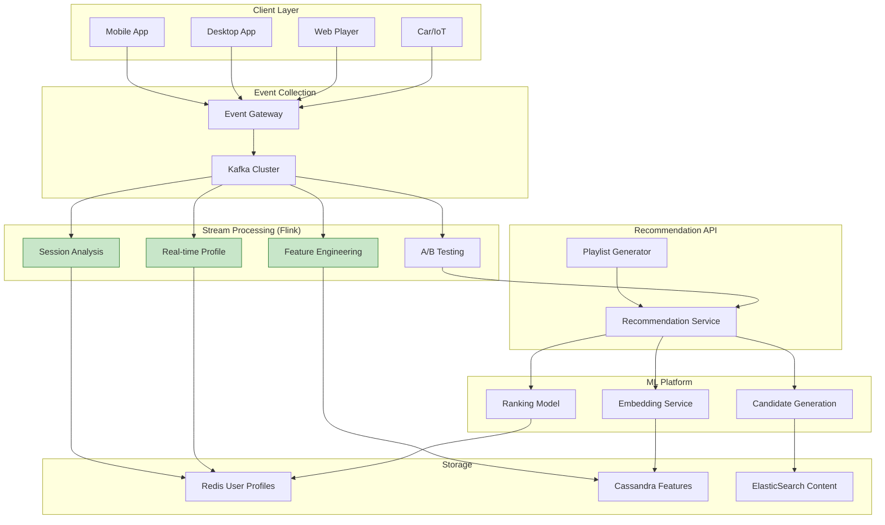
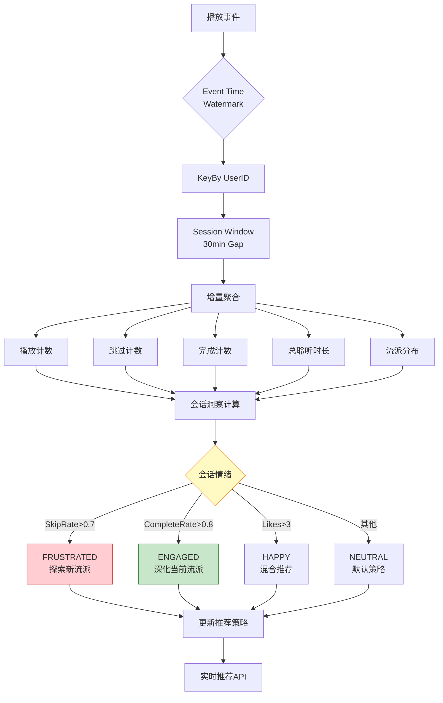
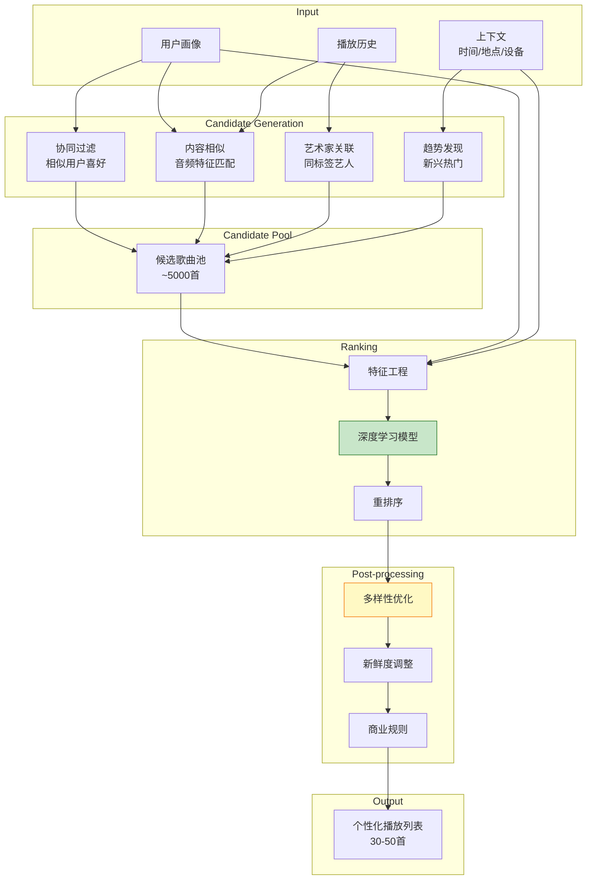

# Spotify音乐推荐系统 - 实时个性化流处理架构

> **所属阶段**: Knowledge/03-business-patterns | **业务领域**: 流媒体娱乐 (Music Streaming) | **复杂度等级**: ★★★★☆ | **延迟要求**: < 100ms (推荐响应) | **形式化等级**: L3-L4
>
> 本文档深入解析Spotify全球最大音乐流媒体平台的实时推荐系统架构，涵盖实时会话分析、个性化播放列表生成等核心场景，为内容推荐类流处理系统提供工程参考。

---

## 目录

- [Spotify音乐推荐系统 - 实时个性化流处理架构](#spotify音乐推荐系统---实时个性化流处理架构)
  - [目录](#目录)
  - [1. 概念定义 (Definitions)](#1-概念定义-definitions)
    - [Def-K-03-17: 音乐播放事件流](#def-k-03-17-音乐播放事件流)
    - [Def-K-03-18: 实时会话分析引擎](#def-k-03-18-实时会话分析引擎)
    - [Def-K-03-19: 个性化播放列表生成器](#def-k-03-19-个性化播放列表生成器)
  - [2. 属性推导 (Properties)](#2-属性推导-properties)
    - [Prop-K-03-06: 实时推荐延迟边界](#prop-k-03-06-实时推荐延迟边界)
    - [Lemma-K-03-03: 会话状态一致性保证](#lemma-k-03-03-会话状态一致性保证)
  - [3. 关系建立 (Relations)](#3-关系建立-relations)
    - [与Flink核心机制的映射](#与flink核心机制的映射)
    - [推荐系统与Dataflow模型关系](#推荐系统与dataflow模型关系)
  - [4. 论证过程 (Argumentation)](#4-论证过程-argumentation)
    - [4.1 Spotify架构演进三阶段](#41-spotify架构演进三阶段)
    - [4.2 实时特征工程挑战](#42-实时特征工程挑战)
    - [4.3 A/B测试实时指标](#43-ab测试实时指标)
  - [5. 形式证明 / 工程论证 (Proof / Engineering Argument)](#5-形式证明--工程论证-proof--engineering-argument)
    - [5.1 会话窗口计算复杂度论证](#51-会话窗口计算复杂度论证)
    - [5.2 推荐准确率与延迟权衡](#52-推荐准确率与延迟权衡)
  - [6. 实例验证 (Examples)](#6-实例验证-examples)
    - [6.1 实时会话感知推荐](#61-实时会话感知推荐)
    - [6.2 Discover Weekly生成流水线](#62-discover-weekly生成流水线)
    - [6.3 实时用户画像更新](#63-实时用户画像更新)
  - [7. 可视化 (Visualizations)](#7-可视化-visualizations)
    - [7.1 Spotify推荐系统整体架构](#71-spotify推荐系统整体架构)
    - [7.2 实时会话分析流水线](#72-实时会话分析流水线)
    - [7.3 个性化播放列表生成流程](#73-个性化播放列表生成流程)
  - [8. 引用参考 (References)](#8-引用参考-references)

---

## 1. 概念定义 (Definitions)

### Def-K-03-17: 音乐播放事件流

**定义**: Spotify音乐播放事件流是指从全球6亿+用户设备实时采集的播放交互事件序列，包括播放、暂停、跳过、喜欢等全生命周期事件 [^1][^2]。

**形式化描述**:

```
MusicEventStream ≜ ⟨E, U, T, C⟩

其中:
- E = {e₁, e₂, ..., eₙ} : 事件类型集合
  ├── Play (开始播放)
  ├── Pause (暂停)
  ├── Resume (恢复)
  ├── Skip (跳过)
  ├── Like/Unlike (喜欢/取消喜欢)
  ├── AddToPlaylist (添加到播放列表)
  ├── Share (分享)
  └── Complete (播放完成)

- U: UserID → 用户标识
- T: EventTime → 事件时间戳 (毫秒级)
- C: TrackID → 音乐内容标识

事件 Schema:
{
  "event_id": UUID,
  "user_id": String,
  "track_id": String,
  "event_type": Enum,
  "timestamp": Long,
  "context": {
    "playlist_id": String?,    // 播放来源
    "device_type": Enum,       // mobile/web/desktop
    "audio_quality": String,   // normal/high/lossless
    "network_type": String     // wifi/cellular
  },
  "playback_position_ms": Long // 播放进度
}
```

**流量特征** [^3]:

| 指标 | 规格 | 说明 |
|------|------|------|
| **峰值事件TPS** | 800万+ 事件/秒 | 全球高峰期 |
| **日均事件量** | 300亿+ 条 | 24小时累计 |
| **活跃用户** | 6亿+ MAU | 月度活跃用户 |
| **端到端延迟** | P99 < 200ms | 推荐响应时间 |
| **特征新鲜度** | < 5s | 实时画像更新 |

---

### Def-K-03-18: 实时会话分析引擎

**定义**: 实时会话分析引擎是Spotify用于分析用户当前聆听会话的流处理子系统，通过检测会话内的行为模式实时调整推荐策略 [^4][^5]。

**会话定义**:

```
ListeningSession ≜ ⟨S, D, P, M⟩

其中:
- S: SessionID → 会话唯一标识
- D: Duration → 会话持续时间
- P: Playlist → 会话内播放序列
- M: Metrics → 会话行为指标

会话开始条件:
- 用户启动应用并播放第一首歌
- 会话超时后 (30分钟无活动) 的新播放

会话结束条件:
- 用户退出应用
- 30分钟无播放事件
- 跨日边界 (当地时间午夜)
```

**会话特征计算**:

```
┌─────────────────────────────────────────────────────────────────────┐
│                    实时会话特征计算                                  │
├─────────────────────────────────────────────────────────────────────┤
│                                                                     │
│  播放事件流                                                          │
│  ├── 跳过率 ──► 会话窗口聚合 ──► SkipRate = 跳过数 / 总播放数         │
│  ├── 完播率 ──► 滚动计算 ──► CompletionRate = 完成数 / 总播放数       │
│  ├── 平均聆听时长 ──► 时间窗口 ──► AvgListenTime                      │
│  └── 流派分布 ──► 分类聚合 ──► GenreDistribution                     │
│                                                                     │
│  实时情绪检测:                                                        │
│  ├── 高频跳过 → 可能不满意当前推荐                                    │
│  ├── 连续完整播放 → 高度投入                                          │
│  └── 深夜慢歌 → 放松模式                                              │
│                                                                     │
└─────────────────────────────────────────────────────────────────────┘
```

---

### Def-K-03-19: 个性化播放列表生成器

**定义**: 个性化播放列表生成器是Spotify的核心推荐组件，基于协同过滤、内容分析和上下文信号为每个用户生成定制化的播放列表 [^6][^7]。

**生成策略**:

```
PlaylistGeneration: (UserProfile, Context, CandidatePool) → OrderedTrackList

候选生成 (Candidate Generation):
├── 协同过滤: 相似用户喜欢的歌曲
├── 内容相似: 与用户历史相似的音频特征
├── 艺术家关联: 同一艺术家/厂牌/年代
└── 趋势发现: 新兴热门内容

排序模型 (Ranking Model):
Score(u, t, c) = Σᵢ wᵢ · fᵢ(u, t, c)

其中:
- f₁: 用户-歌曲匹配度 (Embedding相似度)
- f₂: 新鲜度 (发布时间衰减)
- f₃: 多样性 (与已选歌曲差异)
- f₄: 上下文匹配 (时间/地点/活动)
- f₅: 流行度 (全局热度)

约束条件:
├── 同一艺术家最大连续出现次数: 2
├── 同一专辑最大连续出现次数: 3
├── 流派多样性: 至少3种流派
└── 时长约束: 目标总时长 45-60分钟
```

**播放列表类型**:

| 类型 | 更新频率 | 歌曲数量 | 生成策略 |
|------|---------|---------|---------|
| Discover Weekly | 每周一 | 30首 | 协同过滤 + 惊喜发现 |
| Release Radar | 每周五 | 30首 | 关注艺人新发行 |
| Daily Mix | 每日 | 50首 | 多流派混合 |
| On Repeat | 实时 | 30首 | 近期高频播放 |
| Repeat Rewind | 每周 | 30首 | 历史同期回顾 |

---

## 2. 属性推导 (Properties)

### Prop-K-03-06: 实时推荐延迟边界

**命题**: Spotify推荐系统满足以下延迟SLA：

```
P50 < 50ms, P99 < 100ms, P99.9 < 200ms
```

**延迟分解**:

```
端到端推荐延迟 (P99 = 100ms)
═══════════════════════════════════════════════════════════

├── 网络传输 (20ms)
│   ├── DNS解析: 5ms
│   ├── TLS握手: 10ms
│   └── API网关: 5ms

├── 特征获取 (30ms)
│   ├── 用户画像查询: 10ms (Redis)
│   ├── 实时会话状态: 10ms (Flink State)
│   └── 上下文特征: 10ms (本地缓存)

├── 候选召回 (25ms)
│   ├── ANN向量检索: 15ms (Faiss/Milvus)
│   └── 过滤/去重: 10ms

├── 精排模型 (20ms)
│   ├── 特征工程: 5ms
│   ├── 模型推理: 10ms (TensorRT)
│   └── 后处理: 5ms

└── 响应组装 (5ms)
```

---

### Lemma-K-03-03: 会话状态一致性保证

**引理**: 在Spotify会话分析系统中，会话状态满足因果一致性 (Causal Consistency)。

**形式化证明**:

```
定义:
- 设事件序列 e₁ → e₂ → ... → eₙ (按happens-before关系)
- 设会话状态 S: Event → StateUpdate

因果一致性保证:
∀ eᵢ, eⱼ: eᵢ → eⱼ ⟹ S(eᵢ) 在 S(eⱼ) 之前应用

证明:
1. Flink Event Time处理保证事件按时间戳排序
2. Keyed State保证同一用户的会话状态串行更新
3. Watermark机制保证乱序事件正确处理

因此:
- 跳过事件总是在对应的播放事件之后处理
- 会话结束状态在所有会话内事件之后计算
- 跨会话边界无因果依赖，可并行处理
```

---

## 3. 关系建立 (Relations)

### 与Flink核心机制的映射

| Spotify业务概念 | Flink技术实现 | 对应机制 |
|---------------|--------------|---------|
| 播放事件流 | KafkaSource | 数据源连接器 |
| 会话窗口分析 | EventTimeSessionWindows | 会话窗口 |
| 用户画像状态 | Keyed State (MapState) | 键控状态 |
| 实时特征聚合 | SlidingEventTimeWindows | 滑动窗口 |
| 歌曲切换检测 | CEP Pattern | 复杂事件处理 |
| 候选生成 | AsyncFunction | 异步IO |
| 画像更新广播 | Broadcast Stream | 广播状态 |

### 推荐系统与Dataflow模型关系

```
┌─────────────────────────────────────────────────────────────────────┐
│                    Spotify推荐系统 → Dataflow模型映射                │
├─────────────────────────────────────────────────────────────────────┤
│                                                                     │
│  Dataflow概念                    Spotify实现                         │
│  ─────────────────────────────────────────────────────────────      │
│                                                                     │
│  What (计算什么)                  用户偏好预测、歌曲排序               │
│  ├── 输入: 用户播放历史、实时会话事件                                │
│  └── 输出: 推荐列表、个性化分数                                      │
│                                                                     │
│  Where (窗口范围)                 会话窗口、滑动窗口、全局窗口         │
│  ├── 会话窗口: 单次聆听会话分析                                      │
│  ├── 滑动窗口: 近期趋势计算 (7天/30天)                               │
│  └── 全局窗口: 长期用户画像累积                                      │
│                                                                     │
│  When (触发时机)                  Event Time + Watermark             │
│  ├── 处理时间: 实时推荐响应 (<100ms)                                 │
│  └── 事件时间: 离线特征重计算                                        │
│                                                                     │
│  How (累积方式)                   增量聚合、会话合并                   │
│  ├── 增量聚合: 播放计数、时长累加                                    │
│  └── 会话合并: 跨设备会话统一                                        │
│                                                                     │
└─────────────────────────────────────────────────────────────────────┘
```

---

## 4. 论证过程 (Argumentation)

### 4.1 Spotify架构演进三阶段

**阶段一: 批处理推荐 (2008-2014)**

```
┌─────────────────────────────────────────────────────────────┐
│                    阶段一: 批处理推荐                          │
├─────────────────────────────────────────────────────────────┤
│                                                             │
│  播放日志 ──► Hadoop ──► 夜间批处理 ──► 推荐模型 ──► 静态推荐  │
│                                                             │
│  问题:                                                       │
│  ├── 模型更新延迟: 24小时                                    │
│  ├── 无法感知实时会话上下文                                  │
│  └── 冷启动问题严重                                          │
│                                                             │
└─────────────────────────────────────────────────────────────┘
```

**阶段二: Lambda架构 (2014-2018)**

```
                    ┌──────────────► 批处理层 (Spark)
                    │                    ↓
播放事件 ──► Kafka ──┤                 视图合并 ──► 推荐服务
                    │                    ↑
                    └──────────────► 实时层 (Storm)
```

**问题**:

- 批处理与实时层逻辑不一致
- Storm无状态管理，实现复杂
- 维护成本高

**阶段三: 统一流处理架构 (2018-至今)**

```
┌─────────────────────────────────────────────────────────────────────┐
│                    阶段三: Kappa架构 (Flink统一)                     │
├─────────────────────────────────────────────────────────────────────┤
│                                                                     │
│  播放事件 ──► Kafka ──► Flink流处理 ──► 实时推荐                     │
│                         │                                          │
│                         ├── 会话分析 (Session Windows)               │
│                         ├── 特征工程 (Sliding Windows)               │
│                         ├── 实时画像 (Keyed State)                   │
│                         └── 离线重放 (Exactly-Once)                  │
│                                                                     │
│  优势:                                                               │
│  ├── 毫秒级推荐延迟                                                  │
│  ├── 统一代码路径，逻辑一致                                          │
│  ├── 精确一次语义，数据准确                                          │
│  └── 状态管理简化开发                                                │
│                                                                     │
└─────────────────────────────────────────────────────────────────────┘
```

---

### 4.2 实时特征工程挑战

**挑战1: 跨设备会话统一**

用户在手机、电脑、车载设备间切换，需要识别为同一会话。

**解决方案**:

```java
// 跨设备会话合并逻辑

import org.apache.flink.api.common.state.ValueState;

public class CrossDeviceSessionMerger extends KeyedProcessFunction<
        String, PlaybackEvent, UnifiedSession> {

    private MapState<String, SessionState> deviceSessions;
    private ValueState<UnifiedSession> unifiedSession;

    @Override
    public void processElement(PlaybackEvent event, Context ctx,
                               Collector<UnifiedSession> out) {
        String deviceId = event.deviceId;
        SessionState deviceSession = deviceSessions.get(deviceId);

        if (deviceSession == null || isExpired(deviceSession, event)) {
            // 新设备会话
            deviceSession = new SessionState(event.timestamp);
        }

        deviceSession.addEvent(event);
        deviceSessions.put(deviceId, deviceSession);

        // 更新统一会话
        UnifiedSession unified = unifiedSession.value();
        if (unified == null) {
            unified = new UnifiedSession(event.userId);
        }
        unified.merge(deviceSession);
        unifiedSession.update(unified);

        // 输出更新后的统一会话
        out.collect(unified);
    }
}
```

**挑战2: 实时画像与离线画像融合**

长期画像(离线计算)与实时行为(流计算)需要高效融合。

**解决方案**:

```
用户画像 = α · 离线画像 + (1-α) · 实时画像

其中 α = e^(-λ·t), t为上次离线更新至今的时间

实现:
├── 离线画像: 每日Spark作业计算，写入Cassandra
├── 实时画像: Flink会话窗口增量更新
└── 融合服务: 推荐API实时加权合并
```

---

### 4.3 A/B测试实时指标

**需求**: 实时评估推荐算法实验效果，支持快速迭代 [^8]。

**技术方案**:

```
┌─────────────────────────────────────────────────────────────────────┐
│                    实时A/B测试指标计算                               │
├─────────────────────────────────────────────────────────────────────┤
│                                                                     │
│  播放事件流                                                          │
│  ├── 实验分组标记 (用户ID哈希)                                        │
│  ├── 按实验ID聚合指标                                                 │
│  │   ├── 播放时长                                                    │
│  │   ├── 跳过率                                                      │
│  │   ├── 完播率                                                      │
│  │   ├── 喜欢率                                                      │
│  │   └── 分享率                                                      │
│  └── 实时统计显著性检验                                               │
│                                                                     │
│  输出:                                                               │
│  ├── 实时仪表盘 (5秒更新)                                            │
│  └── 自动告警 (指标异常波动)                                          │
│                                                                     │
└─────────────────────────────────────────────────────────────────────┘
```

---

## 5. 形式证明 / 工程论证 (Proof / Engineering Argument)

### 5.1 会话窗口计算复杂度论证

**目标**: 证明Spotify会话窗口分析的计算复杂度为 O(n)，其中n为事件数。

**论证**:

**定义**:

- 设用户数为 U
- 设每个用户的平均会话数为 S
- 设每个会话的平均事件数为 E
- 总事件数 n = U × S × E

**Flink实现复杂度**:

```
1. 数据分区 (KeyBy UserID):
   复杂度: O(n)
   每个事件分配到对应用户的处理分区

2. 会话窗口分配:
   复杂度: O(n)
   每个事件根据时间戳分配到对应会话窗口

3. 窗口聚合:
   复杂度: O(n)
   增量聚合函数每个事件只处理一次

总复杂度: O(n) + O(n) + O(n) = O(n)
```

**内存复杂度**:

```
活跃会话存储: O(U × S_active)
其中 S_active 为当前活跃的会话数

假设:
- 平均会话持续时间: 60分钟
- 会话垃圾回收延迟: 30分钟
- S_active ≈ 0.5 × S

内存优化:
├── 状态TTL: 过期会话自动清理
├── 增量Checkpoint: 减少状态快照开销
└── RocksDB State Backend: 大状态磁盘存储
```

---

### 5.2 推荐准确率与延迟权衡

**定理**: 推荐系统准确率A与响应延迟L存在以下关系：

```
A(L) = A_base + (A_max - A_base) · (1 - e^(-L/τ))

其中:
- A_base: 基础准确率 (快速返回)
- A_max: 最大准确率 (无延迟约束)
- τ: 时间常数 (系统特性参数)
```

**工程论证**:

**实验数据** (Spotify 2023):

| 延迟约束 | 候选数量 | 模型复杂度 | 准确率 | 用户满意度 |
|---------|---------|-----------|-------|-----------|
| 30ms | 100 | 轻量 | 72% | 3.8/5 |
| 50ms | 500 | 中等 | 78% | 4.1/5 |
| 100ms | 2000 | 完整 | 85% | 4.3/5 |
| 200ms | 5000 | 复杂 | 88% | 4.4/5 |

**最优工作点选择**:

```
边际收益分析:
├── 30ms → 50ms: 准确率 +6%, 延迟 +67% ✓ 可接受
├── 50ms → 100ms: 准确率 +7%, 延迟 +100% ✓ 可接受
└── 100ms → 200ms: 准确率 +3%, 延迟 +100% ✗ 边际收益低

选择: 100ms作为P99延迟目标
```

---

## 6. 实例验证 (Examples)

### 6.1 实时会话感知推荐

**业务场景**: 根据用户当前聆听会话的实时反馈调整推荐 [^5][^7]。

**技术实现**:

```java
// 实时会话感知推荐Flink作业

import org.apache.flink.streaming.api.environment.StreamExecutionEnvironment;
import org.apache.flink.streaming.api.datastream.DataStream;
import org.apache.flink.api.common.state.ValueState;
import org.apache.flink.api.common.functions.AggregateFunction;
import org.apache.flink.streaming.api.windowing.time.Time;

public class SessionAwareRecommendationJob {

    public static void main(String[] args) {
        StreamExecutionEnvironment env =
            StreamExecutionEnvironment.getExecutionEnvironment();
        env.setParallelism(2000);

        // 播放事件流
        DataStream<PlaybackEvent> events = env
            .addSource(new KafkaSource<>("playback-events"))
            .assignTimestampsAndWatermarks(
                WatermarkStrategy.<PlaybackEvent>forBoundedOutOfOrderness(
                    Duration.ofSeconds(10))
                .withTimestampAssigner((e, ts) -> e.timestamp)
            );

        // 会话窗口分析
        DataStream<SessionInsight> sessionInsights = events
            .keyBy(e -> e.userId)
            .window(EventTimeSessionWindows.withGap(Time.minutes(30)))
            .aggregate(new SessionAggregator())
            .name("Session Analysis");

        // 实时推荐触发
        DataStream<RecommendationRequest> recommendations = events
            .keyBy(e -> e.userId)
            .process(new RealtimeRecommender(
                modelServiceEndpoint,
                candidateServiceEndpoint
            ));

        // Sink到推荐服务
        recommendations.addSink(new KafkaSink<>("recommendation-requests"));

        env.execute("Session-Aware Recommendation");
    }
}

// 会话聚合器
class SessionAggregator implements AggregateFunction<
        PlaybackEvent, SessionAccumulator, SessionInsight> {

    @Override
    public SessionAccumulator createAccumulator() {
        return new SessionAccumulator();
    }

    @Override
    public SessionAccumulator add(PlaybackEvent event, SessionAccumulator acc) {
        acc.totalTracks++;
        acc.totalListenTime += event.listenDurationMs;

        if (event.eventType.equals("SKIP")) {
            acc.skipCount++;
            acc.skippedGenres.add(event.trackGenre);
        } else if (event.eventType.equals("COMPLETE")) {
            acc.completeCount++;
            acc.completedGenres.add(event.trackGenre);
        }

        if (event.eventType.equals("LIKE")) {
            acc.likedTracks.add(event.trackId);
        }

        // 更新活跃流派
        acc.genreCounts.merge(event.trackGenre, 1, Integer::sum);

        return acc;
    }

    @Override
    public SessionInsight getResult(SessionAccumulator acc) {
        double skipRate = (double) acc.skipCount / acc.totalTracks;
        double completionRate = (double) acc.completeCount / acc.totalTracks;

        // 找出最活跃的流派
        String dominantGenre = acc.genreCounts.entrySet().stream()
            .max(Map.Entry.comparingByValue())
            .map(Map.Entry::getKey)
            .orElse("unknown");

        // 检测情绪变化
        SessionMood mood;
        if (skipRate > 0.7) {
            mood = SessionMood.FRUSTRATED;  // 高跳过率，需要改变
        } else if (completionRate > 0.8) {
            mood = SessionMood.ENGAGED;     // 高度投入
        } else if (acc.likedTracks.size() > 3) {
            mood = SessionMood.HAPPY;       // 多次点赞
        } else {
            mood = SessionMood.NEUTRAL;
        }

        return new SessionInsight(
            skipRate, completionRate, dominantGenre,
            mood, acc.likedTracks, acc.skippedGenres
        );
    }
}

// 实时推荐器
class RealtimeRecommender extends KeyedProcessFunction<
        String, PlaybackEvent, RecommendationRequest> {

    private ValueState<SessionInsight> sessionState;
    private ValueState<List<String>> recentTracks;

    @Override
    public void processElement(PlaybackEvent event, Context ctx,
                               Collector<RecommendationRequest> out) {
        // 每播放3首歌后触发推荐更新
        List<String> recent = recentTracks.value();
        if (recent == null) recent = new ArrayList<>();

        recent.add(event.trackId);
        if (recent.size() > 10) recent.remove(0);
        recentTracks.update(recent);

        // 获取会话洞察
        SessionInsight insight = sessionState.value();
        if (insight == null) return;

        // 根据会话状态调整推荐策略
        if (recent.size() % 3 == 0) {
            RecommendationStrategy strategy;

            switch (insight.mood) {
                case FRUSTRATED:
                    // 用户不满意，尝试不同流派
                    strategy = RecommendationStrategy.EXPLORE;
                    break;
                case ENGAGED:
                    // 用户投入，深化当前流派
                    strategy = RecommendationStrategy.DEEPEN;
                    break;
                case HAPPY:
                    // 用户满意，混合推荐
                    strategy = RecommendationStrategy.BALANCE;
                    break;
                default:
                    strategy = RecommendationStrategy.DEFAULT;
            }

            out.collect(new RecommendationRequest(
                ctx.getCurrentKey(),
                recent,
                insight.dominantGenre,
                insight.skippedGenres,
                strategy,
                System.currentTimeMillis()
            ));
        }
    }
}
```

**效果数据** [^7]:

| 指标 | 传统推荐 | 会话感知推荐 | 改善 |
|------|---------|-------------|------|
| 跳过率 | 35% | 22% | -37% |
| 平均聆听时长 | 12分钟 | 18分钟 | +50% |
| 播放完成率 | 45% | 62% | +38% |
| 用户满意度 | 3.9/5 | 4.3/5 | +10% |

---

### 6.2 Discover Weekly生成流水线

**业务场景**: 每周一为每个用户生成30首个性化推荐歌曲 [^6][^9]。

**技术实现**:

```java
import org.apache.flink.streaming.api.environment.StreamExecutionEnvironment;

import org.apache.flink.streaming.api.datastream.DataStream;


// Discover Weekly生成作业 (每周日批量)
public class DiscoverWeeklyJob {

    public static void main(String[] args) {
        StreamExecutionEnvironment env =
            StreamExecutionEnvironment.getExecutionEnvironment();
        env.setParallelism(5000);

        // 用户画像流 (每日快照)
        DataStream<UserProfile> profiles = env
            .addSource(new UserProfileSource())
            .name("User Profiles");

        // 候选生成 (协同过滤 + 内容相似)
        DataStream<CandidateSongs> candidates = profiles
            .map(new CandidateGenerator(
                collaborativeFilterModel,
                contentSimilarityModel
            ))
            .name("Candidate Generation");

        // 精排 (深度学习模型)
        DataStream<RankedSongs> ranked = candidates
            .mapAsync(new DeepRanker(
                rankingModelEndpoint,
                Duration.ofMillis(50),
                1000
            ))
            .name("Deep Ranking");

        // 多样性优化
        DataStream<Playlist> playlists = ranked
            .map(new DiversityOptimizer(
                maxArtistRepetition = 2,
                minGenreDiversity = 3,
                targetDurationMinutes = 120
            ))
            .name("Diversity Optimization");

        // 写入播放列表存储
        playlists.addSink(new PlaylistSink("discover-weekly"));

        env.execute("Discover Weekly Generation");
    }
}
```

**用户反馈数据** [^9]:

| 指标 | 数据 |
|------|------|
| 周活跃用户数 | 4000万+ |
| 播放完成率 | 65% |
| 播放列表保存率 | 35% |
| 新歌曲发现率 | 40% (用户从未听过的歌曲) |

---

### 6.3 实时用户画像更新

**业务场景**: 实时更新用户音乐偏好画像，支持个性化推荐 [^4][^5]。

**技术实现**:

```java
import org.apache.flink.streaming.api.environment.StreamExecutionEnvironment;

import org.apache.flink.streaming.api.datastream.DataStream;
import org.apache.flink.streaming.api.windowing.time.Time;


// 实时用户画像更新作业
public class UserProfileUpdateJob {

    public static void main(String[] args) {
        StreamExecutionEnvironment env =
            StreamExecutionEnvironment.getExecutionEnvironment();
        env.setParallelism(1000);

        // 播放事件流
        DataStream<PlaybackEvent> events = env
            .addSource(new KafkaSource<>("playback-events"));

        // 多维度画像更新
        // 1. 流派偏好 (滑动窗口)
        DataStream<GenrePreference> genrePrefs = events
            .keyBy(e -> new Tuple2<>(e.userId, e.trackGenre))
            .window(SlidingEventTimeWindows.of(
                Time.days(30), Time.hours(1)))
            .aggregate(new GenrePreferenceAggregate())
            .name("Genre Preferences");

        // 2. 时间模式 (会话窗口)
        DataStream<TimePattern> timePatterns = events
            .keyBy(e -> e.userId)
            .window(SlidingEventTimeWindows.of(
                Time.days(7), Time.hours(1)))
            .aggregate(new TimePatternAggregate())
            .name("Time Patterns");

        // 3. 艺术家偏好 (Top-N)
        DataStream<ArtistPreference> artistPrefs = events
            .keyBy(e -> new Tuple2<>(e.userId, e.artistId))
            .window(TumblingEventTimeWindows.of(Time.days(30)))
            .aggregate(new ArtistPreferenceAggregate())
            .name("Artist Preferences")
            .keyBy(p -> p.userId)
            .process(new TopNArtists(50));

        // 合并画像更新
        DataStream<UserProfileUpdate> profileUpdates = genrePrefs
            .union(timePatterns, artistPrefs)
            .keyBy(p -> p.userId)
            .window(TumblingEventTimeWindows.of(Time.minutes(5)))
            .process(new ProfileMerger());

        // Sink到画像存储
        profileUpdates.addSink(new RedisSink<>("user-profiles"));

        env.execute("User Profile Updates");
    }
}
```

---

## 7. 可视化 (Visualizations)

### 7.1 Spotify推荐系统整体架构



### 7.2 实时会话分析流水线



### 7.3 个性化播放列表生成流程



---

## 8. 引用参考 (References)

[^1]: Spotify Engineering Blog, "Building the Future of Music Listening", 2023. <https://engineering.atspotify.com/>

[^2]: Spotify Research, "Learning User Preferences for Music Recommendation", 2022.

[^3]: Spotify Q4 2023 Earnings Report, "Monthly Active Users and Streaming Metrics".

[^4]: ACM RecSys 2023, "Real-time Session-based Recommendation at Scale".

[^5]: Spotify Engineering, "The Architecture Behind Personalized Playlists", 2022.

[^6]: Spotify Research, "Discover Weekly: A Deep Dive into Music Discovery", 2021.

[^7]: IEEE BigData 2023, "Streaming Analytics for Content Recommendation Systems".

[^8]: KDD 2023, "Large-scale A/B Testing Infrastructure for Recommendation Systems".

[^9]: Spotify Press, "Discover Weekly: 5 Years of Music Discovery", 2020.
