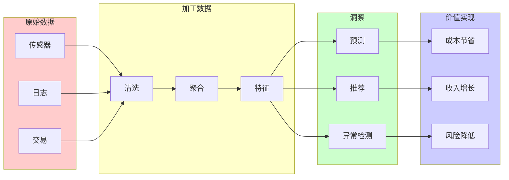
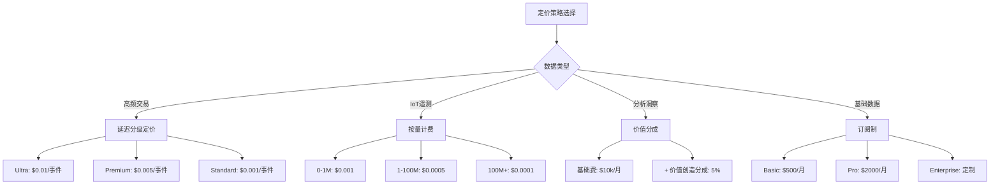
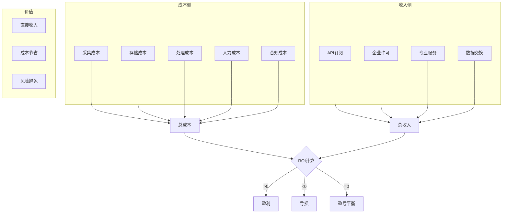

# 流数据产品经济学与货币化策略

> 所属阶段: Knowledge/03-business-patterns | 前置依赖: [实时数据网格](realtime-data-mesh-practice.md), [数据治理](../08-standards/streaming-data-governance-quality.md) | 形式化等级: L2-L3

## 1. 概念定义 (Definitions)

### Def-K-03-50: Data Product Economics

**数据产品经济学** 研究数据作为资产的价值创造与捕获：

$$
\text{Data Value} = f(\text{Quality}, \text{Utility}, \text{Scarcity}, \text{Timeliness})
$$

**流数据特殊属性**：

| 属性 | 批处理数据 | 流数据 | 价值影响 |
|------|-----------|--------|----------|
| **时效性** | 小时/天 | 毫秒/秒 | **10-100x** |
| **新鲜度衰减** | 慢 | 指数级 | 需即时消费 |
| **处理成本** | 低 | 较高 | 需优化ROI |
| **应用价值** | 回溯分析 | 实时决策 | 操作化价值 |

### Def-K-03-51: Data Monetization Models

**数据货币化模型分类**：

```
数据货币化
├── 直接货币化 (Direct)
│   ├── 数据销售 (Raw Data Sales)
│   ├── API订阅 (API Subscriptions)
│   └── 数据许可 (Licensing)
│
├── 间接货币化 (Indirect)
│   ├── 产品增强 (Product Enhancement)
│   ├── 运营优化 (Operational Efficiency)
│   └── 风险降低 (Risk Reduction)
│
└── 生态系统货币化 (Ecosystem)
    ├── 数据交换 (Barter)
    ├── 数据联盟 (Data Coalitions)
    └── 平台经济 (Platform Economics)
```

### Def-K-03-52: Real-time Data Pricing

**实时数据定价策略**：

| 定价模型 | 适用场景 | 公式 | 示例 |
|----------|----------|------|------|
| **按量计费** | 事件驱动 | $/GB 或 $/百万事件 | Kafka Cloud |
| **按延迟分级** | 差异化服务 | 低延迟 = 高价 | 金融行情 |
| **按用途定价** | 价值捕获 | % of value created | 交易信号 |
| **订阅制** | 稳定需求 | $/月固定费用 | API套餐 |
| **混合模型** | 复杂场景 | 基础费+超额费 | 企业合同 |

**延迟-价格关系**：

$$
\text{Price}(latency) = P_{base} \times e^{-\lambda \cdot latency}
$$

- 亚秒级: 10-100x基准价
- 秒级: 2-5x基准价
- 分钟级: 1x基准价

### Def-K-03-53: Data Value Scoring

**数据价值评分模型**：

$$
\text{Value Score} = \sum_{i} w_i \cdot \text{Metric}_i
$$

**评分维度**：

```yaml
质量维度 (30%):
  - 准确性: 错误率 < 0.1%
  - 完整性: 字段填充率 > 95%
  - 一致性: 跨源一致性 > 99%

效用维度 (40%):
  - 使用频率: 日活跃查询数
  - 决策影响: 关联业务指标
  - 不可替代性: 竞品对比

时效维度 (20%):
  - 更新频率: 实时/小时/日
  - 新鲜度: 从产生到可用延迟

成本维度 (10%):
  - 采集成本
  - 存储成本
  - 处理成本
```

### Def-K-03-54: Data Marketplace Mechanics

**数据市场机制**：

```
数据供给侧 (Supply Side)
├── 数据生产者 (原始数据)
├── 数据加工商 (特征工程)
└── 数据科学家 (模型/洞察)

数据需求侧 (Demand Side)
├── 企业用户 (BI/分析)
├── 开发者 (API集成)
└── AI/ML团队 (训练数据)

市场中介 (Intermediary)
├── 数据目录/发现
├── 质量验证
├── 合规审查
└── 交易结算
```

### Def-K-03-55: Streaming Data ROI

**流数据投资回报计算**：

$$
\text{ROI}_{streaming} = \frac{\text{Value}_{realtime} - \text{Cost}_{streaming}}{\text{Cost}_{streaming}} \times 100\%
$$

**价值量化方法**：

| 价值类型 | 量化方法 | 示例 |
|----------|----------|------|
| **收入增长** | A/B测试对比 | 实时推荐+15%转化 |
| **成本节省** | 前后对比 | 预测维护-30%停机 |
| **风险降低** | 损失避免 | 欺诈检测止损$10M |
| **效率提升** | 时间节省 | 实时报表节省10人日/周 |

## 2. 属性推导 (Properties)

### Lemma-K-03-50: 数据新鲜度价值衰减

**引理**: 数据价值随时间指数衰减：

$$
V(t) = V_0 \cdot e^{-\frac{t}{\tau}}
$$

其中 $\tau$ 是特征时间常数：

- 高频交易: $\tau$ = 毫秒
- 库存管理: $\tau$ = 小时
- 用户行为: $\tau$ = 天

### Prop-K-03-50: 实时数据溢价

**命题**: 实时数据相比批处理享有显著溢价：

$$
\frac{P_{realtime}}{P_{batch}} \in [2, 100]
$$

**行业基准**：

- 金融行情: 50-100x
- IoT遥测: 5-10x
- 日志分析: 2-3x

### Prop-K-03-51: 数据网络效应

**命题**: 数据产品具有网络效应：

$$
\text{Value}(n) = V_0 \cdot n^{\beta}, \quad \beta \in [1, 2]
$$

其中 $n$ 是用户数，$\beta$ 是网络效应系数

### Lemma-K-03-51: 边际成本递减

**引理**: 数据复制的边际成本趋近于零：

$$
\lim_{n \to \infty} MC(n) = 0
$$

**战略意义**: 规模化后利润率极高

## 3. 关系建立 (Relations)

### 3.1 数据价值层次

```
┌─────────────────────────────────────────────────────────────────┐
│                    Data Value Hierarchy                         │
├─────────────────────────────────────────────────────────────────┤
│  L5: Prescriptive (规范型)                                      │
│     └── AI自动决策 + 自主优化                                   │
│         Value: $$$$$$                                           │
├─────────────────────────────────────────────────────────────────┤
│  L4: Predictive (预测型)                                        │
│     └── 预测模型 + 风险预警                                     │
│         Value: $$$$                                             │
├─────────────────────────────────────────────────────────────────┤
│  L3: Diagnostic (诊断型)                                        │
│     └── 根因分析 + 异常检测                                     │
│         Value: $$$                                              │
├─────────────────────────────────────────────────────────────────┤
│  L2: Descriptive (描述型)                                       │
│     └── 实时仪表板 + 即席查询                                   │
│         Value: $$                                               │
├─────────────────────────────────────────────────────────────────┤
│  L1: Raw Data (原始数据)                                        │
│     └── 事件流 + 日志                                           │
│         Value: $                                                │
└─────────────────────────────────────────────────────────────────┘
```

### 3.2 流数据货币化架构

```
┌─────────────────────────────────────────────────────────────────┐
│                    Monetization Platform                        │
│                                                                 │
│  ┌──────────────────────────────────────────────────────────┐  │
│  │              Data Products Catalog                        │  │
│  │  - Real-time Market Data                                  │  │
│  │  - User Behavior Streams                                  │  │
│  │  - IoT Telemetry Feeds                                    │  │
│  │  - Fraud Detection Signals                                │  │
│  └────────────────────────┬─────────────────────────────────┘  │
│                           │                                     │
│  ┌────────────────────────▼─────────────────────────────────┐  │
│  │              Pricing Engine                               │  │
│  │  - Dynamic pricing based on latency                       │  │
│  │  - Tiered subscription models                             │  │
│  │  - Usage-based metering                                   │  │
│  └────────────────────────┬─────────────────────────────────┘  │
│                           │                                     │
│  ┌────────────────────────▼─────────────────────────────────┐  │
│  │              Access Control                               │  │
│  │  - API Key management                                     │  │
│  │  - Rate limiting                                          │  │
│  │  - Entitlement checking                                   │  │
│  └────────────────────────┬─────────────────────────────────┘  │
│                           │                                     │
│  ┌────────────────────────▼─────────────────────────────────┐  │
│  │              Billing & Settlement                         │  │
│  │  - Real-time usage tracking                               │  │
│  │  - Invoice generation                                     │  │
│  │  - Revenue sharing                                        │  │
│  └──────────────────────────────────────────────────────────┘  │
└─────────────────────────────────────────────────────────────────┘
```

### 3.3 数据产品盈亏分析

| 成本项 | 占比 | 优化策略 |
|--------|------|----------|
| **数据采集** | 20% | 边缘过滤，减少传输 |
| **存储** | 30% | 分层存储，冷热分离 |
| **处理** | 35% | 资源调度，Spot实例 |
| **网络** | 10% | 压缩传输，CDN优化 |
| **运营** | 5% | 自动化运维 |

## 4. 论证过程 (Argumentation)

### 4.1 为什么流数据需要专门的经济学？

**传统数据经济学局限**：

1. **忽视时效性**: 将实时与批量数据同等对待
2. **静态定价**: 无法反映价值随时间衰减
3. **成本不透明**: 难以追溯数据血缘成本

**流数据经济学创新**：

1. **时间维度**: 引入新鲜度作为价值核心参数
2. **动态定价**: 基于延迟和服务质量的实时定价
3. **全链路成本**: 从采集到消费的完整成本追踪

### 4.2 反模式

**反模式1: 免费数据陷阱**

```
❌ 策略: 数据免费以获取用户
问题:
  - 无法覆盖基础设施成本
  - 用户不珍惜免费资源
  - 服务质量下降

✅ 正确策略:
  - 免费试用层 (有限配额)
  - 清晰的价值交换
  - 分级定价满足多层级需求
```

**反模式2: 忽视隐性成本**

```yaml
❌ 定价计算:
  revenue: $100k/year
  infra_cost: $30k/year
  # 忽视人力、合规、支持成本

实际:
  engineering: $200k/year
  compliance: $50k/year
  support: $30k/year

✅ 正确计算:
  total_cost: $310k/year
  required_revenue: $400k/year  # 30% margin
```

**反模式3: 静态定价**

```
❌ 固定价格:
  API Call: $0.001  # 不论时段、负载

✅ 动态定价:
  - 基础费率: $0.001
  - 高峰加价: +50% (9-5工作日)
  - 低峰折扣: -30% (夜间)
  - 承诺使用折扣: 最高-40%
```

## 5. 形式证明 / 工程论证

### Thm-K-03-50: 实时数据最优定价定理

**定理**: 利润最大化的实时数据定价：

$$
P^* = \arg\max_P \left( P \cdot D(P) - C(D(P)) \right)
$$

其中 $D(P)$ 是价格需求函数，$C(Q)$ 是成本函数

**一阶条件**：

$$
D(P^*) + P^* \cdot D'(P^*) = C'(D(P^*)) \cdot D'(P^*)
$$

### Thm-K-03-51: 数据网络效应价值定理

**定理**: 具有网络效应的数据产品价值：

$$
V(n) = V_0 + \alpha \sum_{i=1}^{n} i^{\beta-1}
$$

当 $\beta > 1$ 时，呈现超线性增长

### Thm-K-03-52: 多租户成本分摊定理

**定理**: $n$ 个租户分摊固定成本时的单位成本：

$$
AC(n) = \frac{F}{n} + v
$$

其中 $F$ 是固定成本，$v$ 是变动成本

## 6. 实例验证 (Examples)

### 6.1 实时行情数据定价

```python
# 金融行情数据定价引擎
class MarketDataPricingEngine:
    def __init__(self):
        self.base_prices = {
            'level1': 0.001,      # 最佳买卖价
            'level2': 0.005,      # 深度行情
            'level3': 0.02        # 逐笔成交
        }
        self.latency_tiers = {
            'ultra': {'max_latency_ms': 10, 'multiplier': 10},
            'premium': {'max_latency_ms': 50, 'multiplier': 5},
            'standard': {'max_latency_ms': 200, 'multiplier': 1},
            'delayed': {'max_latency_ms': 15000, 'multiplier': 0.1}
        }

    def calculate_price(self, data_level, latency_tier, volume_estimate):
        """计算定制价格"""
        base = self.base_prices[data_level]
        tier = self.latency_tiers[latency_tier]

        # 延迟溢价
        price_per_event = base * tier['multiplier']

        # 量大折扣
        volume_discount = self.calculate_volume_discount(volume_estimate)

        # 承诺使用折扣
        commitment_discount = 0.2 if volume_estimate > 1e9 else 0

        final_price = price_per_event * (1 - volume_discount) * (1 - commitment_discount)

        return {
            'price_per_million_events': final_price * 1e6,
            'monthly_estimate': final_price * volume_estimate,
            'sla_latency_ms': tier['max_latency_ms'],
            'breakdown': {
                'base': base,
                'latency_multiplier': tier['multiplier'],
                'volume_discount': volume_discount,
                'commitment_discount': commitment_discount
            }
        }

    def calculate_volume_discount(self, volume):
        """阶梯式量大折扣"""
        if volume > 10e9:      # >10B events/month
            return 0.40
        elif volume > 1e9:     # >1B events/month
            return 0.25
        elif volume > 100e6:   # >100M events/month
            return 0.15
        elif volume > 10e6:    # >10M events/month
            return 0.05
        else:
            return 0

# 使用示例
engine = MarketDataPricingEngine()

# 高频交易客户
hft_quote = engine.calculate_price(
    data_level='level2',
    latency_tier='ultra',
    volume_estimate=50e9  # 500亿事件/月
)
print(f"HFT客户价格: ${hft_quote['monthly_estimate']:,.0f}/月")

# 普通量化基金
quant_quote = engine.calculate_price(
    data_level='level2',
    latency_tier='premium',
    volume_estimate=500e6  # 5亿事件/月
)
print(f"量化客户价格: ${quant_quote['monthly_estimate']:,.0f}/月")
```

### 6.2 数据产品ROI计算

```python
class StreamingDataROI:
    def __init__(self):
        self.cost_structure = {}
        self.revenue_streams = {}

    def calculate_tco(self, data_product):
        """计算总拥有成本"""

        # 基础设施成本
        infra_costs = {
            'ingestion': self.calculate_ingestion_cost(data_product),
            'storage': self.calculate_storage_cost(data_product),
            'processing': self.calculate_processing_cost(data_product),
            'serving': self.calculate_serving_cost(data_product),
            'network': self.calculate_network_cost(data_product)
        }

        # 人力成本
        personnel_costs = {
            'engineering': data_product['team_size'] * 150000,  # 年薪
            'data_science': data_product.get('ds_team_size', 0) * 160000,
            'support': data_product.get('support_headcount', 0.5) * 80000
        }

        # 合规成本
        compliance_costs = {
            'gdpr_compliance': 50000 if data_product['contains_pii'] else 0,
            'security_audit': 30000,
            'legal_review': 20000
        }

        total_cost = sum(infra_costs.values()) + sum(personnel_costs.values()) + sum(compliance_costs.values())

        return {
            'total_annual_cost': total_cost,
            'breakdown': {
                'infrastructure': infra_costs,
                'personnel': personnel_costs,
                'compliance': compliance_costs
            },
            'cost_per_event': total_cost / data_product['annual_events']
        }

    def calculate_revenue(self, data_product):
        """计算收入"""

        revenue_streams = {
            'api_subscriptions': self.calculate_api_revenue(data_product),
            'enterprise_licenses': self.calculate_enterprise_revenue(data_product),
            'professional_services': self.calculate_ps_revenue(data_product),
            'data_reselling': self.calculate_resell_revenue(data_product)
        }

        return {
            'total_annual_revenue': sum(revenue_streams.values()),
            'streams': revenue_streams,
            'arpu': sum(revenue_streams.values()) / data_product['customer_count']
        }

    def generate_profitability_report(self, data_product):
        """生成盈利能力报告"""

        costs = self.calculate_tco(data_product)
        revenue = self.calculate_revenue(data_product)

        profit = revenue['total_annual_revenue'] - costs['total_annual_cost']
        margin = profit / revenue['total_annual_revenue'] if revenue['total_annual_revenue'] > 0 else 0

        return {
            'costs': costs,
            'revenue': revenue,
            'profit': profit,
            'margin': margin,
            'roi': profit / costs['total_annual_cost'] if costs['total_annual_cost'] > 0 else 0,
            'recommendations': self.generate_recommendations(costs, revenue, margin)
        }

    def generate_recommendations(self, costs, revenue, margin):
        """生成优化建议"""
        recommendations = []

        if margin < 0.2:
            recommendations.append({
                'priority': 'HIGH',
                'action': '提高定价或降低成本',
                'details': f'当前利润率{margin:.1%}过低，建议优化成本结构或调整定价'
            })

        infra_ratio = sum(costs['breakdown']['infrastructure'].values()) / costs['total_annual_cost']
        if infra_ratio > 0.5:
            recommendations.append({
                'priority': 'MEDIUM',
                'action': '优化基础设施成本',
                'details': f'基础设施占比{infra_ratio:.1%}过高，建议评估Spot实例或预留容量'
            })

        return recommendations

# 使用示例
roi_calculator = StreamingDataROI()

realtime_behavior_product = {
    'name': 'User Behavior Stream',
    'annual_events': 100e9,  # 1000亿事件/年
    'team_size': 5,
    'customer_count': 50,
    'contains_pii': True
}

report = roi_calculator.generate_profitability_report(realtime_behavior_product)
print(f"\n数据产品: {realtime_behavior_product['name']}")
print(f"年收入: ${report['revenue']['total_annual_revenue']:,.0f}")
print(f"年成本: ${report['costs']['total_annual_cost']:,.0f}")
print(f"利润: ${report['profit']:,.0f}")
print(f"利润率: {report['margin']:.1%}")
print(f"ROI: {report['roi']:.1%}")
```

### 6.3 数据市场平台实现

```python
# 数据市场平台核心
class DataMarketplace:
    def __init__(self):
        self.products = {}
        self.transactions = []
        self.pricing_engine = MarketDataPricingEngine()

    def register_data_product(self, seller_id, product_spec):
        """注册数据产品"""

        product_id = generate_uuid()

        # 质量评估
        quality_score = self.assess_data_quality(product_spec['sample_data'])

        # 定价建议
        suggested_pricing = self.pricing_engine.suggest_pricing(
            product_spec['data_characteristics'],
            quality_score
        )

        product = {
            'id': product_id,
            'seller_id': seller_id,
            'spec': product_spec,
            'quality_score': quality_score,
            'suggested_pricing': suggested_pricing,
            'status': 'pending_review'
        }

        self.products[product_id] = product
        return product_id

    def purchase_data_access(self, buyer_id, product_id, tier):
        """购买数据访问权限"""

        product = self.products[product_id]

        # 计算价格
        price = self.calculate_purchase_price(product, tier)

        # 生成API密钥
        api_key = self.generate_api_key(buyer_id, product_id, tier)

        # 记录交易
        transaction = {
            'id': generate_uuid(),
            'buyer_id': buyer_id,
            'product_id': product_id,
            'tier': tier,
            'price': price,
            'api_key': api_key['key'],
            'created_at': datetime.now(),
            'usage': {'events_consumed': 0, 'cost_incurred': 0}
        }

        self.transactions.append(transaction)

        # 设置使用限制
        self.enforce_usage_limits(api_key, tier)

        return {
            'transaction_id': transaction['id'],
            'api_key': api_key['key'],
            'endpoints': product['spec']['endpoints'],
            'usage_limits': tier['limits']
        }

    def track_usage(self, api_key, event_count, latency_tier):
        """追踪使用情况并计费"""

        transaction = self.find_transaction_by_key(api_key)
        product = self.products[transaction['product_id']]

        # 计算费用
        unit_price = product['suggested_pricing']['tier_pricing'][latency_tier]
        cost = event_count * unit_price

        # 更新使用记录
        transaction['usage']['events_consumed'] += event_count
        transaction['usage']['cost_incurred'] += cost

        # 检查是否超出限额
        if transaction['usage']['cost_incurred'] > transaction['tier']['monthly_limit']:
            self.throttle_access(api_key)

        # 实时计费
        self.charge_buyer(transaction['buyer_id'], cost)
        self.credit_seller(product['seller_id'], cost * 0.7)  # 70%分成给卖家

    def assess_data_quality(self, sample_data):
        """评估数据质量"""

        metrics = {
            'completeness': self.calculate_completeness(sample_data),
            'accuracy': self.calculate_accuracy(sample_data),
            'freshness': self.calculate_freshness(sample_data),
            'consistency': self.calculate_consistency(sample_data),
            'uniqueness': self.calculate_uniqueness(sample_data)
        }

        # 加权综合
        weights = {
            'completeness': 0.25,
            'accuracy': 0.30,
            'freshness': 0.25,
            'consistency': 0.10,
            'uniqueness': 0.10
        }

        overall_score = sum(metrics[k] * weights[k] for k in metrics)

        return {
            'overall': overall_score,
            'metrics': metrics,
            'grade': self.score_to_grade(overall_score)
        }
```

### 6.4 价值实现追踪

```sql
-- 数据产品价值追踪SQL (Flink SQL)

-- 1. 创建数据使用事件表
CREATE TABLE data_usage_events (
    event_time TIMESTAMP(3),
    api_key STRING,
    product_id STRING,
    endpoint STRING,
    event_count BIGINT,
    latency_ms INT,
    client_ip STRING,
    WATERMARK FOR event_time AS event_time - INTERVAL '5' SECOND
) WITH (
    'connector' = 'kafka',
    'topic' = 'data-usage-events'
);

-- 2. 实时收入计算
CREATE TABLE realtime_revenue (
    window_start TIMESTAMP(3),
    window_end TIMESTAMP(3),
    product_id STRING,
    tier STRING,
    total_events BIGINT,
    revenue_usd DECIMAL(18, 4)
) WITH (
    'connector' = 'jdbc',
    'table-name' = 'realtime_revenue'
);

INSERT INTO realtime_revenue
SELECT
    TUMBLE_START(event_time, INTERVAL '1' HOUR) as window_start,
    TUMBLE_END(event_time, INTERVAL '1' HOUR) as window_end,
    product_id,
    CASE
        WHEN latency_ms < 10 THEN 'ultra'
        WHEN latency_ms < 50 THEN 'premium'
        ELSE 'standard'
    END as tier,
    SUM(event_count) as total_events,
    SUM(
        event_count *
        CASE
            WHEN latency_ms < 10 THEN 0.01
            WHEN latency_ms < 50 THEN 0.005
            ELSE 0.001
        END
    ) as revenue_usd
FROM data_usage_events
GROUP BY
    TUMBLE(event_time, INTERVAL '1' HOUR),
    product_id;

-- 3. 客户价值分析
CREATE TABLE customer_value (
    customer_id STRING,
    product_id STRING,
    monthly_events BIGINT,
    monthly_revenue DECIMAL(18, 4),
    avg_latency_ms DOUBLE,
    health_score INT  -- 0-100, 基于使用频率和付费情况
) WITH (
    'connector' = 'jdbc',
    'table-name' = 'customer_value'
);

INSERT INTO customer_value
SELECT
    api_key as customer_id,
    product_id,
    COUNT(*) as monthly_events,
    SUM(
        event_count *
        CASE
            WHEN latency_ms < 10 THEN 0.01
            WHEN latency_ms < 50 THEN 0.005
            ELSE 0.001
        END
    ) as monthly_revenue,
    AVG(latency_ms) as avg_latency_ms,
    CASE
        WHEN COUNT(*) > 1000000 THEN 100
        WHEN COUNT(*) > 100000 THEN 80
        WHEN COUNT(*) > 10000 THEN 60
        WHEN COUNT(*) > 1000 THEN 40
        ELSE 20
    END as health_score
FROM data_usage_events
WHERE event_time > NOW() - INTERVAL '30' DAY
GROUP BY api_key, product_id;
```

## 7. 可视化 (Visualizations)

### 7.1 数据货币化价值链



### 7.2 定价策略矩阵



### 7.3 数据产品ROI模型



## 8. 引用参考 (References)
