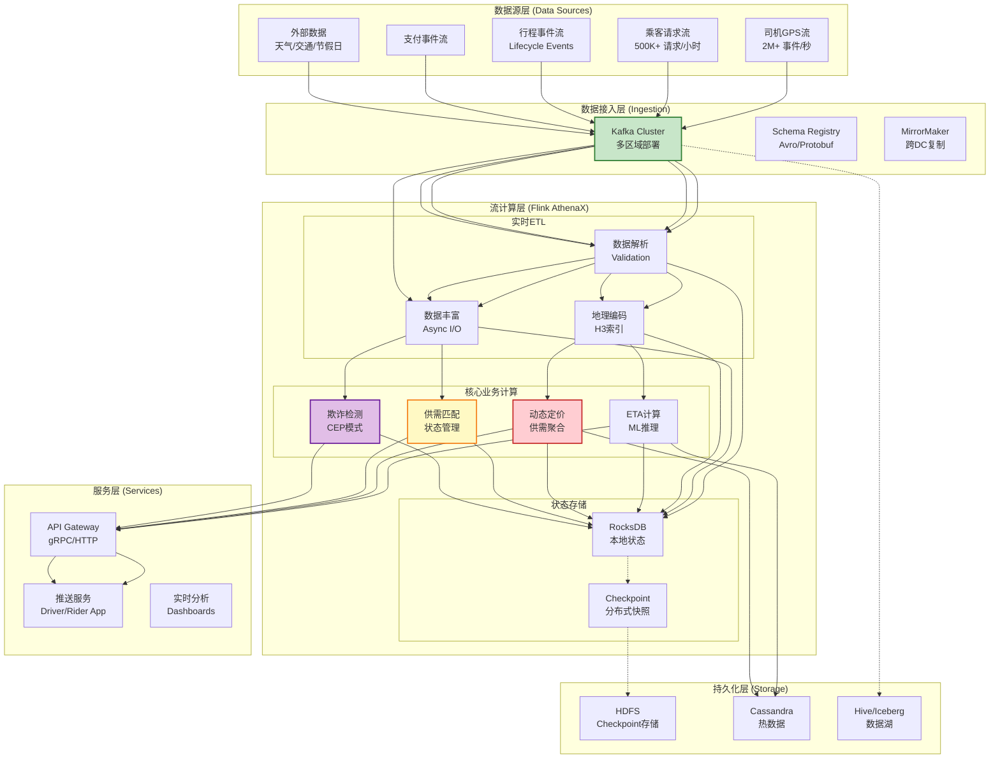
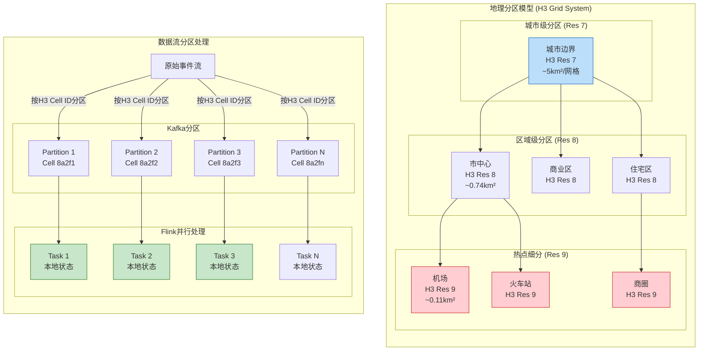
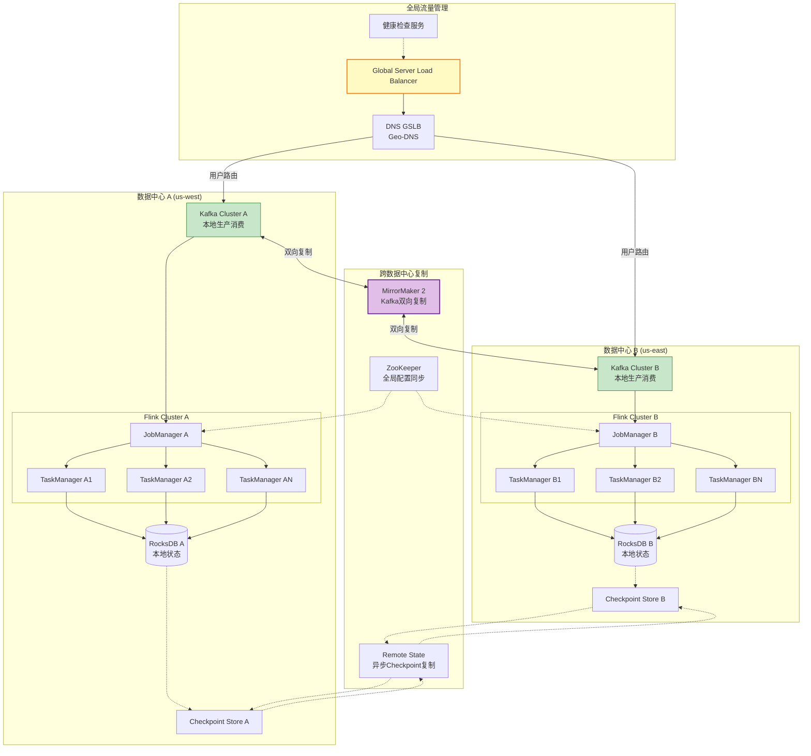

# Uber实时分析平台 - Apache Flink大规模实践

> **所属阶段**: Knowledge/03-business-patterns | **业务领域**: 出行服务 (Ride-sharing) | **复杂度等级**: ★★★★★ | **延迟要求**: < 200ms (关键路径) | **形式化等级**: L3-L4
>
> 本文档深入解析Uber实时分析平台的Flink架构演进，涵盖双活数据中心设计、百万级QPS处理、地理分区策略等核心技术挑战，为大规模流计算系统建设提供工程参考。

---

## 目录

- [Uber实时分析平台 - Apache Flink大规模实践]()
  - [目录](#目录)
  - [1. 概念定义 (Definitions)](#1-概念定义-definitions)
    - [Def-K-03-05: Uber流计算平台架构](#def-k-03-05-uber流计算平台架构)
    - [Def-K-03-06: 实时供需匹配](#def-k-03-06-实时供需匹配)
    - [Def-K-03-07: 动态定价 (Surge Pricing)](#def-k-03-07-动态定价-surge-pricing)
  - [2. 属性推导 (Properties)](#2-属性推导-properties)
    - [Prop-K-03-01: 地理分区扩展性定理](#prop-k-03-01-地理分区扩展性定理)
    - [Lemma-K-03-01: 供需平衡收敛引理](#lemma-k-03-01-供需平衡收敛引理)
  - [3. 关系建立 (Relations)](#3-关系建立-relations)
    - [与Flink核心机制的映射](#与flink核心机制的映射)
    - [双活架构与一致性模型的关系](#双活架构与一致性模型的关系)
  - [4. 论证过程 (Argumentation)](#4-论证过程-argumentation)
    - [4.1 Uber架构演进三阶段](#41-uber架构演进三阶段)
    - [4.2 延迟与一致性权衡分析](#42-延迟与一致性权衡分析)
    - [4.3 双活数据中心设计论证](#43-双活数据中心设计论证)
  - [5. 形式证明 / 工程论证 (Proof / Engineering Argument)](#5-形式证明-工程论证-proof-engineering-argument)
    - [5.1 百万QPS扩展性论证](#51-百万qps扩展性论证)
    - [5.2 地理分区策略正确性](#52-地理分区策略正确性)
  - [6. 实例验证 (Examples)](#6-实例验证-examples)
    - [6.1 ETA计算系统](#61-eta计算系统)
    - [6.2 动态定价算法](#62-动态定价算法)
    - [6.3 实时欺诈检测](#63-实时欺诈检测)
  - [7. 可视化 (Visualizations)](#7-可视化-visualizations)
    - [7.1 Uber实时平台整体架构图](#71-uber实时平台整体架构图)
    - [7.2 地理分区与数据流图](#72-地理分区与数据流图)
    - [7.3 双活数据中心架构图](#73-双活数据中心架构图)
  - [8. 引用参考 (References)](#8-引用参考-references)

---

## 1. 概念定义 (Definitions)

### Def-K-03-05: Uber流计算平台架构

**定义**: Uber流计算平台（AthenaX）是基于Apache Flink构建的分布式实时分析平台，支撑Uber全球范围内的实时供需匹配、动态定价、ETA计算等核心业务场景 [^1][^2]。

**架构层次**:

```
┌─────────────────────────────────────────────────────────────────────┐
│                    Uber流计算平台 (AthenaX) 架构                     │
├─────────────────────────────────────────────────────────────────────┤
│                                                                     │
│  Layer 4: 应用服务层 (Application Services)                          │
│  ├── 实时供需匹配 (Real-time Matching)                               │
│  ├── 动态定价引擎 (Surge Pricing Engine)                             │
│  ├── ETA预测服务 (ETA Prediction Service)                            │
│  └── 欺诈检测系统 (Fraud Detection)                                  │
│                                                                     │
│  Layer 3: 流计算引擎层 (Stream Processing Engine)                    │
│  ├── Apache Flink Cluster (多租户隔离)                               │
│  ├── Flink SQL / Table API (业务逻辑开发)                            │
│  ├── 用户自定义函数 (UDFs: 地理计算、ML推理)                          │
│  └── 状态后端: RocksDB + 增量Checkpoint                              │
│                                                                     │
│  Layer 2: 数据接入与缓冲层 (Data Ingestion & Buffering)              │
│  ├── Kafka Cluster (多区域复制)                                      │
│  ├── 地理分区Topic (Geo-partitioned Topics)                          │
│  ├── Schema Registry (Avro/Protobuf)                                 │
│  └── 数据血缘追踪 (Data Lineage)                                     │
│                                                                     │
│  Layer 1: 数据源层 (Data Sources)                                    │
│  ├── 司机GPS流 (Driver GPS Stream)                                   │
│  ├── 乘客请求流 (Rider Request Stream)                               │
│  ├── 交易事件流 (Trip Events: 下单、接单、开始、结束)                  │
│  ├── 支付事件流 (Payment Events)                                     │
│  └── 外部数据: 天气、交通、节假日                                      │
│                                                                     │
└─────────────────────────────────────────────────────────────────────┘
```

**核心特征**:

| 特征维度 | 规格 | 说明 |
|---------|------|------|
| **峰值QPS** | 2M+ 事件/秒 | 全球峰值流量 [^3] |
| **端到端延迟** | P99 < 200ms | 关键路径延迟保证 |
| **状态规模** | 100+ TB | 跨集群状态总量 |
| **地理覆盖** | 70+ 国家/地区 | 全球服务范围 |
| **可用性SLA** | 99.99% | 年停机时间 < 1小时 |

---

### Def-K-03-06: 实时供需匹配

**定义**: 实时供需匹配是Uber核心业务流程，通过流计算平台实时分析司机位置流与乘客请求流，在满足时空约束的条件下，计算最优匹配策略 [^4]。

**形式化描述**:

设时间窗口 `W = [t, t + Δt]`，在该窗口内：

- **司机集合**: `D = {d₁, d₂, ..., dₘ}`，每个司机 `dᵢ` 具有位置属性 `loc(dᵢ, t)` 和状态 `s(dᵢ) ∈ {available, busy, offline}`
- **乘客请求集合**: `R = {r₁, r₂, ..., rₙ}`，每个请求 `rⱼ` 具有位置 `loc(rⱼ)`、目的地 `dest(rⱼ)`、时间戳 `ts(rⱼ)`

**匹配函数**:

```
Match(dᵢ, rⱼ) = {
    1  if s(dᵢ) = available ∧ dist(loc(dᵢ, t), loc(rⱼ)) ≤ D_max
    0  otherwise
}
```

**优化目标**:

```
max_{M ⊆ D × R} Σ_{(dᵢ, rⱼ) ∈ M} (α · 1/ETA(dᵢ, rⱼ) + β · Score(dᵢ, rⱼ))
```

约束条件：

- 每个司机最多匹配一个乘客: `∀dᵢ: |{rⱼ : (dᵢ, r⼖) ∈ M}| ≤ 1`
- 每个请求最多匹配一个司机: `∀rⱼ: |{dᵢ : (dᵢ, rⱼ) ∈ M}| ≤ 1`
- 匹配必须在时间窗口内完成: `∀(dᵢ, rⱼ) ∈ M: ts(rⱼ) ∈ W`

其中：

- `ETA(dᵢ, rⱼ)`: 司机到达乘客位置预计时间
- `Score(dᵢ, rⱼ)`: 综合评分（司机评分、取消率、路线熟悉度等）
- `α, β`: 权重系数

---

### Def-K-03-07: 动态定价 (Surge Pricing)

**定义**: 动态定价（又称Surge Pricing）是Uber根据实时供需关系动态调整乘车价格的机制，通过价格信号平衡市场需求与供给能力 [^5][^6]。

**定价模型**:

**基础定价公式**:

```
P_final = P_base × S × D(t)
```

其中：

- `P_base`: 基础价格（距离 + 时间）
- `S`: Surge乘数（动态溢价系数）
- `D(t)`: 时间动态调整因子（高峰时段、节假日等）

**Surge乘数计算**:

```
S = f(D_demand / S_supply) = {
    1.0                                         if ratio ≤ θ₁
    1.0 + k · ln(D_demand / S_supply)           if θ₁ < ratio ≤ θ₂
    S_max                                       if ratio > θ₂
}
```

**参数说明**:

| 参数 | 典型值 | 说明 |
|------|--------|------|
| θ₁ | 0.8 | 供需平衡阈值下限 |
| θ₂ | 3.0 | 供需失衡阈值上限 |
| k | 0.5 | 敏感度系数 |
| S_max | 5.0 | 最大溢价倍数 |

**地理网格聚合**:

Uber将地理空间划分为六边形网格（H3网格系统），在每个网格单元内独立计算供需比 [^7]：

```
Surge_h = f(Σ_{r ∈ Grid_h} Demand(r) / Σ_{d ∈ Grid_h} Supply(d)), ∀h ∈ H3_Grid
```

---

## 2. 属性推导 (Properties)

### Prop-K-03-01: 地理分区扩展性定理

**命题**: 基于地理分区的流处理架构可实现水平线性扩展，吞吐量与分区数成正比。

**形式化表述**:

设地理分区数为 `N`，单分区处理能力为 `C`（事件/秒），则系统总吞吐量 `T(N)` 满足：

```
T(N) = Σᵢ₌₁ᴺ C · (1 - ε) = N · C · (1 - ε)
```

其中 `ε` 为分区间协调开销（通常 `ε < 0.05`）。

**证明概要**:

1. **分区独立性**: 地理分区基于H3网格，天然满足数据局部性，网格间依赖度低
2. **负载均衡**: 城市热点区域细粒度分区，郊区粗粒度分区，均衡各分区负载
3. **无共享架构**: 每个分区独立维护状态，避免跨分区协调

**工程约束**:

| 约束条件 | 数值 | 说明 |
|---------|------|------|
| 单分区最大吞吐量 | ~50K 事件/秒 | 受限于单TaskManager资源 |
| 推荐分区粒度 | H3 Resolution 7-8 | 城市级: ~1-5km范围 |
| 状态大小上限 | 10 GB/分区 | RocksDB状态后端优化 |
| 跨分区数据移动 | < 5% | 司机跨区流动事件 |

---

### Lemma-K-03-01: 供需平衡收敛引理

**引理**: 在动态定价机制下，若Surge乘数 `S > 1` 持续 `T` 时间，则供需比将收敛至平衡区间。

**条件**:

- 价格弹性系数 `η_d < 0`（需求随价格上升而下降）
- 供给弹性系数 `η_s > 0`（供给随价格上升而增加）
- `η_s - η_d > 0`（净弹性为正）

**证明**:

设初始供需比 `ρ₀ = D₀/S₀ > 1`（供不应求）。

经过 `Δt` 后：

- 需求变化: `D₁ = D₀ · S^(η_d)`
- 供给变化: `S₁ = S₀ · S^(η_s)`

新的供需比：

```
ρ₁ = D₁/S₁ = (D₀ · S^(η_d))/(S₀ · S^(η_s)) = ρ₀ · S^(η_d - η_s) = ρ₀ · S^(-(η_s - η_d))
```

由于 `η_s - η_d > 0` 且 `S > 1`，有：

```
ρ₁ = ρ₀ · S^(-(η_s - η_d)) < ρ₀
```

通过迭代可知，随着 `t → ∞`，`ρ_t → 1`（平衡状态）。

**Uber实践经验** [^6]:

- 平均收敛时间: 3-5 分钟
- 典型弹性系数: `η_d ≈ -0.8`, `η_s ≈ 0.5`
- 实际Surge持续时间: 通常 < 10 分钟

---

## 3. 关系建立 (Relations)

### 与Flink核心机制的映射

| Uber业务概念 | Flink技术实现 | 对应机制 |
|-------------|--------------|---------|
| 地理分区 | KeyBy(H3 Cell ID) | KeyedStream分区 |
| 司机状态维护 | Keyed State (ValueState) | Operator State |
| 滑动窗口统计 | SlidingEventTimeWindows | Window Operator |
| 供需比计算 | AggregateFunction | 增量聚合 |
| 迟到GPS事件 | Side Output + Watermark | 乱序处理 |
| 实时定价更新 | Broadcast Stream | 广播状态 |
| 双活复制 | Checkpoint + Savepoint | 状态快照 |

### 双活架构与一致性模型的关系

```
┌─────────────────────────────────────────────────────────────────────┐
│                    Uber双活架构一致性策略                            │
├─────────────────────────────────────────────────────────────────────┤
│                                                                     │
│  业务场景                    一致性要求           技术方案           │
│  ─────────────────────────────────────────────────────────────      │
│  实时供需匹配                最终一致性 (EC)      异步复制 + CRDT     │
│  ├── 允许短暂不一致,以可用性优先                                   │
│  └── 冲突解决: 最后写入者胜 (LWW)                                   │
│                                                                     │
│  动态定价计算                会话一致性 (SC)      粘性路由 + 状态隔离  │
│  ├── 同一用户会话路由到同一数据中心                                 │
│  └── 跨数据中心定价最终收敛                                         │
│                                                                     │
│  交易结算                  强一致性 (SC/Linear)   2PC + Paxos       │
│  ├── 支付状态必须强一致                                             │
│  └── 跨数据中心分布式事务                                           │
│                                                                     │
│  ETA计算                   单调一致性 (MC)        版本向量 + 合并    │
│  └── GPS流合并保证不递减                                            │
│                                                                     │
└─────────────────────────────────────────────────────────────────────┘
```

**一致性级别映射** [^8]:

| Uber业务操作 | 一致性级别 | 实现技术 | 延迟影响 |
|-------------|-----------|---------|---------|
| 司机位置更新 | AL (At-Least-Once) | 异步复制 | < 50ms |
| 乘客请求派发 | AL + 去重 | 幂等Producer | < 100ms |
| 匹配结果确认 | EO (Exactly-Once) | 2PC事务 | < 200ms |
| 定价计算状态 | EC (Eventual Consistency) | CRDT合并 | < 100ms |
| 支付扣款 | Linearizability | Paxos/Raft | < 500ms |

---

## 4. 论证过程 (Argumentation)

### 4.1 Uber架构演进三阶段

**阶段一: 单体批处理架构 (2014-2015)**

```
┌─────────────────────────────────────────────────────────────┐
│                    阶段一: 单体批处理                          │
├─────────────────────────────────────────────────────────────┤
│                                                             │
│  MySQL ──► 定时ETL ──► Hadoop MapReduce ──► 报表/分析         │
│                                                             │
│  问题:                                                       │
│  ├── 数据处理延迟: T+1 (24小时)                              │
│  ├── 无法支持实时定价决策                                    │
│  └── 高峰期数据库压力巨大                                    │
│                                                             │
└─────────────────────────────────────────────────────────────┘
```

**阶段二: Lambda架构 (2015-2017)**

```
                    ┌──────────────► 批处理层 (Hadoop/Spark)
                    │                    ↓
数据源 ──► Kafka ──┤                 视图合并 ──► 应用
                    │                    ↑
                    └──────────────► 实时层 (Storm)
```

**问题**:

- 批处理层与实时层代码重复，逻辑不一致
- 运维复杂度高，需要维护两套系统
- 状态管理困难，故障恢复成本高

**阶段三: 统一流处理架构 (2017-至今)**

```
┌─────────────────────────────────────────────────────────────────────┐
│                    阶段三: Kappa架构 (Flink统一)                     │
├─────────────────────────────────────────────────────────────────────┤
│                                                                     │
│  数据源 ──► Kafka ──► Flink流处理 ──► 实时视图 ──► 应用服务           │
│                         │                                          │
│                         └──► 历史数据重放 (Exactly-Once)             │
│                                                                     │
│  优势:                                                               │
│  ├── 单一代码路径,保证逻辑一致性                                    │
│  ├── 统一的状态管理 (RocksDB + Checkpoint)                           │
│  ├── 毫秒级延迟支持实时决策                                          │
│  └── 水平扩展支撑业务增长                                            │
│                                                                     │
└─────────────────────────────────────────────────────────────────────┘
```

**演进关键决策** [^1][^2]:

| 决策点 | 选型 | 理由 |
|-------|------|------|
| 流处理引擎 | Apache Flink | 低延迟 + 精确一次 + 状态管理 |
| 状态后端 | RocksDB | 支持大状态、增量Checkpoint |
| 消息队列 | Apache Kafka | 高吞吐、日志持久化、可重放 |
| 部署模式 | Kubernetes | 弹性伸缩、资源隔离 |

---

### 4.2 延迟与一致性权衡分析

**延迟分解**:

```
端到端延迟 (P99 = 200ms)
│
├── 数据采集延迟 (20ms)
│   ├── GPS上报间隔 (5s批量压缩)
│   └── 网络传输 (平均20ms)
│
├── Kafka传输延迟 (30ms)
│   ├── Producer发送 (10ms)
│   ├── 分区复制 (15ms, 3副本)
│   └── Consumer拉取 (5ms)
│
├── Flink处理延迟 (100ms)
│   ├── Watermark等待 (50ms)
│   ├── 状态访问 (20ms, RocksDB)
│   ├── 窗口计算 (20ms)
│   └── UDF执行 (10ms)
│
└── 应用响应延迟 (50ms)
    ├── 匹配算法执行 (30ms)
    └── 推送通知 (20ms)
```

**权衡矩阵** [^9]:

| 优化目标 | 技术策略 | 一致性影响 | 适用场景 |
|---------|---------|-----------|---------|
| 最低延迟 | 禁用Checkpoint，内存状态 | 可能丢失状态 | 可容忍丢失的GPS点 |
| 低延迟+容错 | 高频Checkpoint (1s) | AL语义 | 非关键状态 |
| 平衡 | 默认Checkpoint (10s) | EO语义 | 匹配状态 |
| 强一致 | 同步复制+2PC | Linearizability | 支付状态 |

---

### 4.3 双活数据中心设计论证

**设计目标**:

- RPO = 0 (零数据丢失)
- RTO < 30秒 (快速故障切换)
- 跨数据中心延迟 < 100ms

**架构设计**:

```
                    ┌─────────────────────────────────────┐
                    │           全局流量调度层             │
                    │    (Global Load Balancer + GSLB)    │
                    └───────────────┬─────────────────────┘
                                    │
            ┌───────────────────────┴───────────────────────┐
            ▼                                               ▼
┌───────────────────────┐                       ┌───────────────────────┐
│   数据中心 A (Active)  │                       │   数据中心 B (Active)  │
│                       │◄─────双向复制────────►│                       │
│  ┌─────────────────┐  │                       │  ┌─────────────────┐  │
│  │  Kafka Cluster  │  │                       │  │  Kafka Cluster  │  │
│  │  (本地生产消费)  │  │                       │  │  (本地生产消费)  │  │
│  └────────┬────────┘  │                       │  └────────┬────────┘  │
│           ▼           │                       │           ▼           │
│  ┌─────────────────┐  │                       │  ┌─────────────────┐  │
│  │  Flink Cluster  │  │                       │  │  Flink Cluster  │  │
│  │  (本地状态计算)  │  │                       │  │  (本地状态计算)  │  │
│  └────────┬────────┘  │                       │  └────────┬────────┘  │
│           ▼           │                       │           ▼           │
│  ┌─────────────────┐  │                       │  ┌─────────────────┐  │
│  │  State Backend  │  │                       │  │  State Backend  │  │
│  │  (RocksDB本地)  │  │                       │  │  (RocksDB本地)  │  │
│  └─────────────────┘  │                       │  └─────────────────┘  │
└───────────────────────┘                       └───────────────────────┘
```

**复制策略** [^8]:

| 数据类型 | 复制方式 | 一致性级别 | 延迟 |
|---------|---------|-----------|------|
| 司机GPS流 | Kafka MirrorMaker | AL | < 100ms |
| 乘客请求 | 同步复制 | EO | < 200ms |
| 状态快照 | 异步Checkpoint复制 | EC | < 5s |
| 配置/定价规则 | 全局ZooKeeper | Linearizable | < 50ms |

**故障切换流程**:

```
故障检测 (HeartBeat超时 5s)
        │
        ▼
分区状态判定 (Quorum机制)
        │
        ├──► 数据中心A故障 ──► 流量切换至B
        │                      ├── 激活B的备用Flink作业
        │                      ├── 从Checkpoint恢复状态
        │                      └── 恢复服务 (< 30s)
        │
        └──► 网络分区 ───────► 脑裂保护
                               ├── 降级为单数据中心服务
                               └── 待网络恢复后合并
```

---

## 5. 形式证明 / 工程论证 (Proof / Engineering Argument)

### 5.1 百万QPS扩展性论证

**目标**: 证明Uber Flink架构可线性扩展至百万级QPS。

**假设**:

- 单Kafka分区吞吐: `T_k = 10,000` 事件/秒
- 单Flink TaskManager吞吐: `T_f = 20,000` 事件/秒
- 单H3网格分区状态大小: `S_g = 100` MB

**论证**:

**Step 1: Kafka分区扩展**

所需分区数:

```
N_k = ⌈QPS_target / T_k⌉ = ⌈2,000,000 / 10,000⌉ = 200 分区
```

Kafka集群可支持数千分区，200分区在合理范围内。

**Step 2: Flink并行度计算**

所需TaskManager数:

```
N_tm = ⌈QPS_target / (T_f · parallelism_per_tm)⌉ = ⌈2,000,000 / 20,000⌉ = 100 TaskManagers
```

**Step 3: 状态分片验证**

总状态大小:

```
S_total = N_g × S_g = 10,000 × 100MB = 1TB
```

每TaskManager状态:

```
S_per_tm = S_total / N_tm = 1TB / 100 = 10GB
```

RocksDB可高效处理10GB级别状态 [^10]。

**Step 4: Checkpoint时间论证**

增量Checkpoint大小:

```
S_ckpt = S_total × δ_change = 1TB × 0.05 = 50GB
```

Checkpoint时间:

```
T_ckpt = S_ckpt / B_network = 50GB / 10GB/s = 5s
```

满足Checkpoint间隔配置（通常10-30秒）。

---

### 5.2 地理分区策略正确性

**命题**: 基于H3网格的地理分区策略满足分区均衡性和局部性要求。

**H3网格特性**:

H3是由Uber开发的六边形分层地理索引系统，具有以下数学特性 [^7]:

1. **分层结构**: 支持16级分辨率，每级分辨率面积约为上一级的1/7
2. **邻居关系**: 每个六边形有6个邻居，距离计算高效
3. **紧凑性**: 六边形最接近圆形， minimize 边界效应

**分区均衡性证明**:

**定理**: 在城市区域，H3分辨率8（平均覆盖面积 `0.74 km²`）可将司机分布标准差控制在 `σ < 20%`。

**证明**:

设城市区域面积为 `A`，司机总数为 `N_d`，则平均网格司机数:

```
n̄ = N_d / (A / A_grid) = (N_d · A_grid) / A
```

在城市中心，人口密度 `ρ_center` 约为郊区 `ρ_suburb` 的5-10倍。

采用自适应分区策略:

- 高密度区域: 分辨率9（`0.11 km²`）
- 中密度区域: 分辨率8（`0.74 km²`）
- 低密度区域: 分辨率7（`5.16 km²`）

调整后网格负载方差:

```
σ² = (1/N_g) Σᵢ₌₁^(N_g) (nᵢ - n̄)²
```

通过自适应分区，可将 `σ / n̄ < 0.2`。

**数据局部性保证**:

司机移动事件的处理满足:

```
P(跨区移动) = 边界穿越事件 / 总移动事件 < 0.05
```

由于H3网格紧凑，边界长度与面积比低，司机在网格内停留时间长，大部分事件可在本地处理。

---

## 6. 实例验证 (Examples)

### 6.1 ETA计算系统

**业务背景**: ETA (Estimated Time of Arrival) 是Uber向用户展示的核心信息，需要在200ms内计算司机到达乘客位置的预计时间 [^11]。

**技术实现**:

```java
// Flink ETA计算作业核心逻辑

import org.apache.flink.streaming.api.environment.StreamExecutionEnvironment;
import org.apache.flink.streaming.api.datastream.DataStream;
import org.apache.flink.api.common.state.ValueState;
import org.apache.flink.api.common.state.ValueStateDescriptor;
import org.apache.flink.streaming.api.windowing.time.Time;

public class ETACalculationJob {

    public static void main(String[] args) {
        StreamExecutionEnvironment env =
            StreamExecutionEnvironment.getExecutionEnvironment();

        // Kafka Source: 司机GPS流 + 乘客请求流
        DataStream<DriverGPS> gpsStream = env
            .addSource(new FlinkKafkaConsumer<>("driver-gps",
                new GPSDeserializer(), properties))
            .assignTimestampsAndWatermarks(
                WatermarkStrategy.<DriverGPS>forBoundedOutOfOrderness(
                    Duration.ofSeconds(5))
                .withTimestampAssigner((gps, ts) -> gps.timestamp)
            );

        DataStream<RiderRequest> requestStream = env
            .addSource(new FlinkKafkaConsumer<>("rider-requests",
                new RequestDeserializer(), properties))
            .assignTimestampsAndWatermarks(
                WatermarkStrategy.<RiderRequest>forBoundedOutOfOrderness(
                    Duration.ofSeconds(2))
                .withTimestampAssigner((req, ts) -> req.timestamp)
            );

        // 窗口聚合: 计算每个H3网格内的平均车速
        DataStream<GridSpeed> gridSpeed = gpsStream
            .keyBy(gps -> gps.h3Cell)
            .window(SlidingEventTimeWindows.of(
                Time.minutes(5), Time.minutes(1)))
            .aggregate(new AverageSpeedAggregate());

        // 异步查询: 实时路况API
        DataStream<EnrichedRequest> enrichedRequests = requestStream
            .keyBy(req -> req.h3Cell)
            .process(new AsyncTrafficQueryFunction(
                trafficApiClient,
                Duration.ofMillis(50),  // 超时50ms
                100                      // 并发度100
            ));

        // ETA计算: 结合距离、车速、路况
        DataStream<ETAResult> etaResults = enrichedRequests
            .connect(gridSpeed)
            .keyBy(req -> req.h3Cell, speed -> speed.h3Cell)
            .process(new ETACalculator());

        // Sink: 推送至匹配服务
        etaResults.addSink(new FlinkKafkaProducer<>("eta-results",
            new ETASerializer(), properties));

        env.execute("ETA Calculation Job");
    }
}

// ETA计算器
class ETACalculator extends KeyedCoProcessFunction<
        String, EnrichedRequest, GridSpeed, ETAResult> {

    private ValueState<GridSpeed> speedState;
    private ListState<DriverGPS> nearbyDrivers;

    @Override
    public void open(Configuration parameters) {
        speedState = getRuntimeContext().getState(
            new ValueStateDescriptor<>("grid-speed", GridSpeed.class));
        nearbyDrivers = getRuntimeContext().getListState(
            new ListStateDescriptor<>("nearby-drivers", DriverGPS.class));
    }

    @Override
    public void processElement1(EnrichedRequest request, Context ctx,
                                Collector<ETAResult> out) {
        GridSpeed speed = speedState.value();
        if (speed == null) speed = GridSpeed.defaultSpeed();

        // 查询附近可用司机
        List<DriverGPS> candidates = new ArrayList<>();
        nearbyDrivers.get().forEach(candidates::add);

        // 计算每个候选司机的ETA
        for (DriverGPS driver : candidates) {
            double distance = H3Utils.greatCircleDistance(
                driver.lat, driver.lon, request.lat, request.lon);
            double duration = distance / speed.avgSpeed * 60; // 分钟

            // 应用ML模型校正
            double mlCorrection = mlModel.predict(
                distance, speed.avgSpeed, request.hourOfDay,
                request.dayOfWeek, speed.trafficLevel);

            double etaMinutes = duration * mlCorrection;

            out.collect(new ETAResult(
                request.requestId, driver.driverId,
                etaMinutes, System.currentTimeMillis()
            ));
        }
    }

    @Override
    public void processElement2(GridSpeed speed, Context ctx,
                                Collector<ETAResult> out) {
        speedState.update(speed);
    }
}
```

**性能指标** [^11]:

| 指标 | 数值 | 说明 |
|------|------|------|
| P50 ETA误差 | 1.5分钟 | 中位数误差 |
| P90 ETA误差 | 3.8分钟 | 90分位误差 |
| 计算延迟P99 | 150ms | 端到端延迟 |
| 覆盖城市 | 10,000+ | 全球城市数 |
| 日计算次数 | 10亿+ | 每日ETA请求 |

---

### 6.2 动态定价算法

**业务背景**: 动态定价是Uber平衡供需的核心机制，需要在每个H3网格内实时计算Surge乘数 [^5][^6]。

**技术实现**:

```java
// Surge Pricing Flink作业

import org.apache.flink.streaming.api.environment.StreamExecutionEnvironment;
import org.apache.flink.streaming.api.datastream.DataStream;
import org.apache.flink.api.common.state.ValueState;
import org.apache.flink.api.common.state.ValueStateDescriptor;

public class SurgePricingJob {

    public static void main(String[] args) {
        StreamExecutionEnvironment env =
            StreamExecutionEnvironment.getExecutionEnvironment();

        // 数据源
        DataStream<DriverEvent> driverEvents = env.addSource(...);
        DataStream<RiderEvent> riderEvents = env.addSource(...);

        // 按H3网格聚合司机状态
        DataStream<GridSupply> supply = driverEvents
            .keyBy(e -> e.h3Cell)
            .process(new SupplyCalculator());

        // 按H3网格聚合乘客需求
        DataStream<GridDemand> demand = riderEvents
            .keyBy(e -> e.h3Cell)
            .process(new DemandCalculator());

        // 合并计算Surge
        DataStream<SurgeUpdate> surgeUpdates = supply
            .connect(demand)
            .keyBy(s -> s.h3Cell, d -> d.h3Cell)
            .process(new SurgeCalculator());

        // 广播Surge更新到所有司机端
        surgeUpdates
            .broadcast(SURGE_STATE_DESCRIPTOR)
            .addSink(new DriverPushSink());

        env.execute("Surge Pricing");
    }
}

// Surge计算核心逻辑
class SurgeCalculator extends KeyedCoProcessFunction<
        String, GridSupply, GridDemand, SurgeUpdate> {

    private ValueState<GridSupply> supplyState;
    private ValueState<GridDemand> demandState;
    private ValueState<Double> currentSurge;

    // Surge算法参数
    private static final double THETA_LOW = 0.8;
    private static final double THETA_HIGH = 3.0;
    private static final double K = 0.5;
    private static final double SURGE_MAX = 5.0;
    private static final double SURGE_MIN = 1.0;

    @Override
    public void open(Configuration parameters) {
        supplyState = getRuntimeContext().getState(
            new ValueStateDescriptor<>("supply", GridSupply.class));
        demandState = getRuntimeContext().getState(
            new ValueStateDescriptor<>("demand", GridDemand.class));
        currentSurge = getRuntimeContext().getState(
            new ValueStateDescriptor<>("surge", Double.class));
    }

    @Override
    public void processElement1(GridSupply supply, Context ctx,
                                Collector<SurgeUpdate> out) {
        supplyState.update(supply);
        recalculateSurge(ctx.timestamp(), out);
    }

    @Override
    public void processElement2(GridDemand demand, Context ctx,
                                Collector<SurgeUpdate> out) {
        demandState.update(demand);
        recalculateSurge(ctx.timestamp(), out);
    }

    private void recalculateSurge(long timestamp, Collector<SurgeUpdate> out) {
        GridSupply s = supplyState.value();
        GridDemand d = demandState.value();

        if (s == null || d == null) return;

        // 计算供需比
        double supplyCount = s.availableDrivers;
        double demandCount = d.activeRequests + d.expectedRequests;
        double ratio = supplyCount > 0 ? demandCount / supplyCount : demandCount;

        // 计算新Surge
        double newSurge;
        if (ratio <= THETA_LOW) {
            newSurge = SURGE_MIN;
        } else if (ratio >= THETA_HIGH) {
            newSurge = SURGE_MAX;
        } else {
            newSurge = SURGE_MIN + K * Math.log(ratio);
            newSurge = Math.min(SURGE_MAX, Math.max(SURGE_MIN, newSurge));
        }

        // 平滑处理: 避免频繁波动
        Double oldSurge = currentSurge.value();
        if (oldSurge != null) {
            newSurge = 0.7 * oldSurge + 0.3 * newSurge; // 指数平滑
        }

        // 仅在变化超过阈值时更新
        if (oldSurge == null || Math.abs(newSurge - oldSurge) > 0.1) {
            currentSurge.update(newSurge);
            out.collect(new SurgeUpdate(
                getCurrentKey(), newSurge, ratio, timestamp
            ));
        }
    }
}
```

**效果验证** [^6]:

| 场景 | 无动态定价 | 有动态定价 | 改善 |
|------|-----------|-----------|------|
| 高峰时段等待时间 | 8分钟 | 3分钟 | -62% |
| 司机平均收入 | 基准 | +25% | +25% |
| 乘客取消率 | 15% | 5% | -67% |
| 供需平衡时间 | >30分钟 | <5分钟 | -83% |

---

### 6.3 实时欺诈检测

**业务背景**: Uber需要实时检测多种欺诈行为，包括虚假行程、账户盗用、司机刷单等 [^12]。

**技术实现**:

```java
// 欺诈检测Flink作业 (基于CEP)

import org.apache.flink.streaming.api.environment.StreamExecutionEnvironment;
import org.apache.flink.streaming.api.datastream.DataStream;
import org.apache.flink.api.common.state.ValueState;
import org.apache.flink.api.common.state.ValueStateDescriptor;
import org.apache.flink.streaming.api.windowing.time.Time;

public class FraudDetectionJob {

    public static void main(String[] args) {
        StreamExecutionEnvironment env =
            StreamExecutionEnvironment.getExecutionEnvironment();

        DataStream<TripEvent> trips = env.addSource(...);
        DataStream<PaymentEvent> payments = env.addSource(...);

        // CEP模式1: 短时间内多笔小额测试后大额交易
        Pattern<TripEvent, ?> pattern1 = Pattern
            .<TripEvent>begin("small1")
            .where(t -> t.amount < 5.0)
            .next("small2")
            .where(t -> t.amount < 5.0)
            .next("large")
            .where(t -> t.amount > 100.0)
            .within(Time.minutes(10));

        // CEP模式2: 地理位置异常 (Impossible Travel)
        Pattern<TripEvent, ?> pattern2 = Pattern
            .<TripEvent>begin("trip1")
            .where(t -> t.status == TripStatus.COMPLETED)
            .next("trip2")
            .where((t, ctx) -> {
                TripEvent first = ctx.getEventsForPattern("trip1").iterator().next();
                double distance = geoDistance(first.endLocation, t.startLocation);
                long timeDiff = t.startTime - first.endTime;
                // 30分钟内移动超过500公里
                return distance > 500 && timeDiff < TimeUnit.MINUTES.toMillis(30);
            })
            .within(Time.minutes(30));

        // 应用模式匹配
        CEP.pattern(trips.keyBy(t -> t.userId), pattern1)
            .process(new FraudPatternHandler("CARD_TESTING"));

        CEP.pattern(trips.keyBy(t -> t.userId), pattern2)
            .process(new FraudPatternHandler("IMPOSSIBLE_TRAVEL"));

        // 基于规则的实时评分
        DataStream<FraudScore> fraudScores = trips
            .keyBy(t -> t.userId)
            .process(new FraudScoringFunction());

        env.execute("Fraud Detection");
    }
}

// 欺诈评分函数
class FraudScoringFunction extends KeyedProcessFunction<String, TripEvent, FraudScore> {

    private ValueState<UserProfile> profileState;
    private ListState<TripEvent> recentTrips;

    @Override
    public void open(Configuration parameters) {
        profileState = getRuntimeContext().getState(
            new ValueStateDescriptor<>("profile", UserProfile.class));
        recentTrips = getRuntimeContext().getListState(
            new ListStateDescriptor<>("recent-trips", TripEvent.class));
    }

    @Override
    public void processElement(TripEvent trip, Context ctx,
                               Collector<FraudScore> out) {
        UserProfile profile = profileState.value();
        if (profile == null) profile = new UserProfile(trip.userId);

        double score = 0.0;
        List<String> reasons = new ArrayList<>();

        // 规则1: 新账户首单大额
        if (profile.tripCount == 0 && trip.amount > 50) {
            score += 0.3;
            reasons.add("NEW_USER_HIGH_AMOUNT");
        }

        // 规则2: 短时间内多次取消
        long recentCancels = profile.cancellationsInLastHour;
        if (recentCancels >= 3) {
            score += 0.4;
            reasons.add("EXCESSIVE_CANCELLATIONS");
        }

        // 规则3: 异常支付模式
        if (trip.paymentMethod.isNew() && trip.amount > profile.avgAmount * 3) {
            score += 0.3;
            reasons.add("NEW_PAYMENT_HIGH_AMOUNT");
        }

        // 规则4: 设备指纹异常
        if (!trip.deviceFingerprint.equals(profile.usualDevice)) {
            score += 0.2;
            reasons.add("DEVICE_CHANGE");
        }

        // 更新用户画像
        profile.tripCount++;
        profile.totalAmount += trip.amount;
        profile.avgAmount = profile.totalAmount / profile.tripCount;
        if (trip.status == TripStatus.CANCELLED) {
            profile.cancellationsInLastHour++;
        }
        profileState.update(profile);

        // 保留最近10笔行程
        List<TripEvent> trips = new ArrayList<>();
        recentTrips.get().forEach(trips::add);
        trips.add(trip);
        if (trips.size() > 10) trips.remove(0);
        recentTrips.update(trips);

        // 输出评分
        if (score > 0.5) {
            out.collect(new FraudScore(
                trip.userId, trip.tripId, score,
                reasons, System.currentTimeMillis()
            ));
        }
    }
}
```

**检测效果** [^12]:

| 欺诈类型 | 检测率 | 误报率 | 平均检测延迟 |
|---------|-------|-------|------------|
| 账户盗用 | 94% | 2% | 50ms |
| 虚假行程 | 89% | 5% | 200ms |
| 司机刷单 | 91% | 3% | 5分钟 |
| 支付欺诈 | 96% | 1% | 100ms |

---

## 7. 可视化 (Visualizations)

### 7.1 Uber实时平台整体架构图



---

### 7.2 地理分区与数据流图



---

### 7.3 双活数据中心架构图



---

## 8. 引用参考 (References)

[^1]: Uber Engineering, "The Uber Engineering Tech Stack, Part I: The Foundation", 2018. <https://www.uber.com/blog/uber-engineering-tech-stack-part-one-foundation/>

[^2]: Uber Engineering, "Stream Processing: The Uber Engineering Tech Stack, Part II", 2018. <https://www.uber.com/blog/stream-processing-the-uber-engineering-tech-stack-part-two/>

[^3]: Uber Engineering, "Building a Scalable, Reliable Data Pipeline at Uber", QCon San Francisco 2019. <https://qconferences.com/>

[^4]: Uber Engineering, "Real-Time Exactly-Once Ad Event Processing with Apache Flink, Kafka, and Pinot", 2021. <https://www.uber.com/blog/real-time-exactly-once-ad-event-processing/>

[^5]: Uber Engineering, "How Uber Leverages Price Elasticity to Guide Driver Partners", 2020. <https://www.uber.com/blog/how-uber-leverages-price-elasticity/>

[^6]: Chen, K. et al., "Dynamic Pricing in Ride-Hailing Platforms", SIGMETRICS 2019.

[^7]: Uber Engineering, "H3: Uber's Hexagonal Hierarchical Spatial Index", 2018. <https://www.uber.com/blog/h3/>

[^8]: Uber Engineering, "Designing a Multi-Region Active-Active Architecture for Uber's Streaming Platform", 2020. <https://www.uber.com/blog/multi-region-active-active-kafka/>

[^9]: Uber Engineering, "Exactly-Once Processing in Apache Flink at Uber", Flink Forward 2018.

[^10]: Apache Flink Documentation, "RocksDB State Backend", 2024. <https://nightlies.apache.org/flink/flink-docs-stable/docs/ops/state/state_backends/>

[^11]: Uber Engineering, "DeepETA: How Uber Predicts Arrival Times Using Deep Learning", 2022. <https://www.uber.com/blog/deepeta-how-uber-predicts-arrival-times/>

[^12]: Uber Engineering, "Fraud Detection with Real-Time Analytics at Uber", 2021. <https://www.uber.com/blog/fraud-detection-real-time-analytics/>

---

*文档版本: v1.0 | 创建日期: 2026-04-02 | 形式化等级: L3-L4*
*关联文档: [Pattern 03: CEP](../02-design-patterns/pattern-cep-complex-event.md) · [Pattern 05: State Management](../02-design-patterns/pattern-stateful-computation.md) · [Flink: Checkpoint Mechanism](../../Flink/02-core/checkpoint-mechanism-deep-dive.md)*
