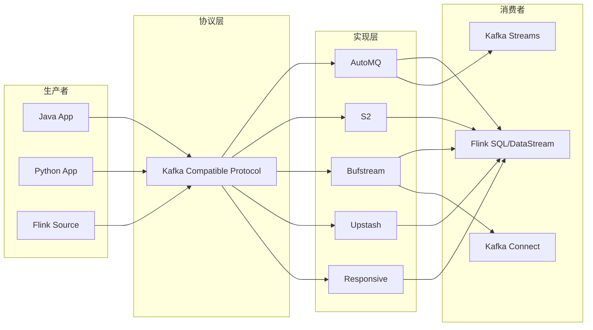
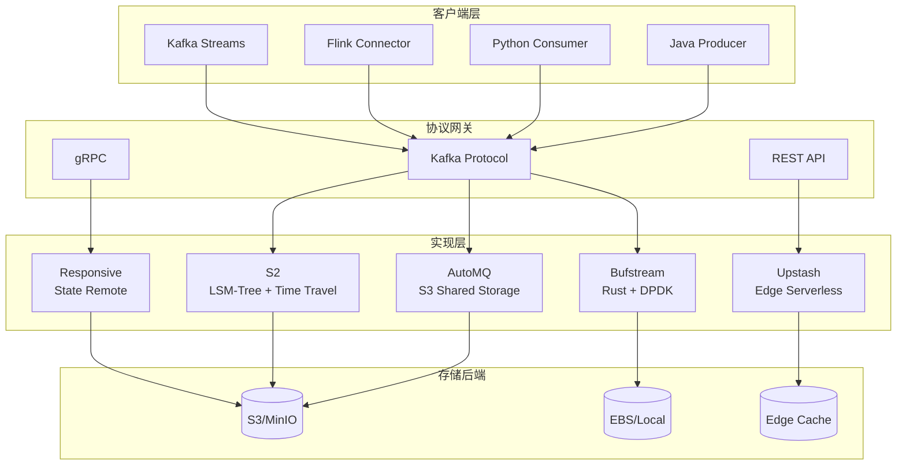
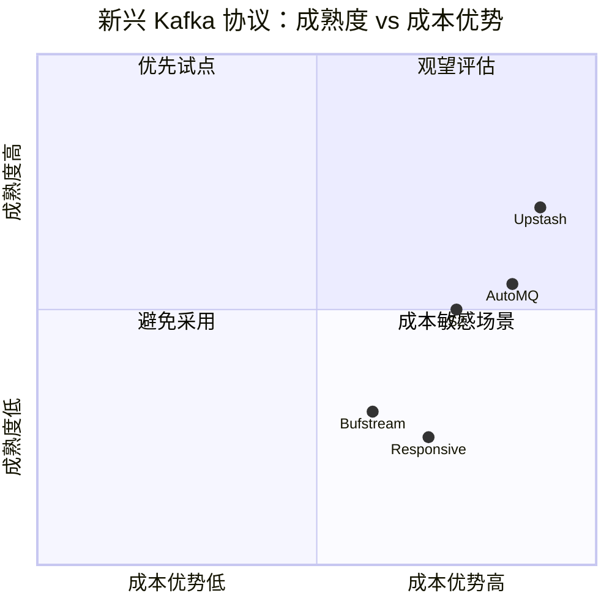

# 新兴 Kafka 协议生态架构对比指南

> **所属阶段**: Knowledge/04-technology-selection | **前置依赖**: [Flink/05-ecosystem/05.01-connectors/kafka-integration-patterns.md](../../Flink/05-ecosystem/05.01-connectors/kafka-integration-patterns.md)、[Knowledge/04-technology-selection/engine-selection-guide.md](./engine-selection-guide.md) | **形式化等级**: L2-L4 | **最后更新**: 2026-04

---

## 1. 概念定义 (Definitions)

### Def-K-KF-01: Kafka 兼容协议 (Kafka-Compatible Protocol)

Kafka 兼容协议是指在应用层实现 Apache Kafka 协议 (Kafka Protocol, 基于 TCP 的二进制请求/响应协议) 的子集或超集，使得现有 Kafka 客户端 (producer/consumer/admin) 无需修改即可连接的**流存储服务**。兼容性层级分为：

- **L1 协议兼容**: 支持 Produce/Fetch/Metadata/ListOffsets 核心 API
- **L2 事务兼容**: 额外支持 InitProducerId/AddPartitionsToTxn/TxnOffsetCommit (Exactly-Once)
- **L3 管理兼容**: 支持 CreateTopics/DeleteTopics/DescribeConfigs 等 Admin API
- **L4 生态兼容**: 支持 Kafka Connect / Kafka Streams / Schema Registry 协议扩展

### Def-K-KF-02: 无服务器流存储 (Serverless Stream Storage)

无服务器流存储是一种**按量计费、自动扩缩容、免运维**的流数据存储抽象，其存储层与计算层完全解耦，用户仅按写入字节数、读取字节数、分区小时数付费，无需管理 Broker 集群。

形式化地，设传统 Kafka 集群的固定成本为 $C_{fixed} = c_{broker} \cdot N_{broker} + c_{ops} \cdot T$，则无服务器模型的成本函数为：

$$
C_{serverless}(W, R, P) = c_w \cdot W + c_r \cdot R + c_p \cdot P \cdot T
$$

其中 $W$ 为写入总量，$R$ 为读取总量，$P$ 为分区数，$c_w, c_r, c_p$ 为对应单价。当负载波动系数 $\sigma = \frac{W_{peak}}{W_{avg}} > 3$ 时，$C_{serverless} < C_{fixed}$ 的概率显著增大。

### Def-K-KF-03: 分层存储架构 (Tiered Storage Architecture)

分层存储将流数据按**热数据 (Hot, < 7d)**、**温数据 (Warm, 7-30d)**、**冷数据 (Cold, > 30d)** 自动迁移至不同成本介质：

- **热层**: 本地 SSD / NVMe，保证 $p99$ 读取延迟 $< 10$ ms
- **温层**: 对象存储 (S3/MinIO/GCS) + 本地缓存，$p99$ 延迟 $< 100$ ms
- **冷层**: 归档对象存储 (Glacier/Coldline)，延迟容忍分钟级，成本降低 10-50x

---

## 2. 属性推导 (Properties)

### Prop-K-KF-01: 兼容性-性能权衡

设兼容层级为 $L \in \{1, 2, 3, 4\}$，协议转换开销为 $O(L)$，则端到端延迟满足：

$$
Latency_{end-to-end} = Latency_{network} + Latency_{storage} + O(L)
$$

经验数据表明：$O(1) \approx 0$ ms（原生实现），$O(2) \approx 2-5$ ms（事务状态机模拟），$O(4) \approx 10-20$ ms（Connect 协议桥接）。

### Prop-K-KF-02: 分区数与存储成本的关系

在分层存储架构中，设单分区日存储成本为 $c_{local}$（本地）和 $c_{object}$（对象存储），保留期为 $D$ 天，则总成本：

$$
C_{total}(P, D) = P \cdot \left( c_{local} \cdot \min(D, 7) + c_{object} \cdot \max(D - 7, 0) \right)
$$

当 $D > 30$ 时，分层存储比纯本地存储成本降低 **60%-80%**。

### Prop-K-KF-03: 无服务器模型的冷启动延迟

无服务器流存储在消费者组首次连接或长时间空闲后重启时，需从对象存储恢复元数据状态。设元数据状态大小为 $M$，恢复带宽为 $B$，则冷启动延迟：

$$
T_{cold} = \frac{M}{B} + T_{auth} + T_{routing}
$$

典型值：$M \approx 1-10$ MB（千级分区），$B \approx 100$ MB/s，$T_{auth} + T_{routing} \approx 50-100$ ms，故 $T_{cold} \approx 60-200$ ms。

---

## 3. 关系建立 (Relations)

### 关系 1: 新兴 Kafka 协议 ↔ Flink 生态



Flink 通过 `kafka-connector` 与所有 Kafka 兼容协议交互，无需代码修改即可切换后端。但不同实现在**事务支持**、**Exactly-Once语义**、**分区迁移行为**上存在差异，需在生产部署前验证。

### 关系 2: 新兴协议 ↔ 传统 Kafka 的替代边界

| 场景 | 传统 Kafka (自托管/MSK/Confluent) | 新兴协议 (AutoMQ/S2/Upstash) |
|------|----------------------------------|------------------------------|
| 超大规模 (>10TB/日) | ✅ 成熟 | ⚠️ 验证中 |
| 突发流量 (10x 峰值) | ❌ 需过度预配 | ✅ 自动弹性 |
| 长期保留 (>90天) | ❌ 存储成本高 | ✅ 分层存储原生 |
| 多区域复制 | ✅ MirrorMaker/ MM2 | ⚠️ 部分支持 |
| 事务型 Exactly-Once | ✅ 成熟 | ⚠️ 兼容层级差异 |
| 边缘部署 (低资源) | ❌ 重 | ✅ 部分支持 (Upstash) |

---

## 4. 论证过程 (Argumentation)

### 论证: 分层存储的延迟可接受性

**质疑**: 将温/冷数据下沉至对象存储会引入不可接受的读取延迟，是否适合实时流处理？

**回应**:

1. **访问局部性**: 流处理工作负载呈现强时间局部性——80% 的读取发生在最近 24 小时内。热层 (SSD) 覆盖这 80%，仅 20% 请求触及温层。
2. **预取机制**: AutoMQ 和 S2 实现了基于消费者偏移量的**乐观预取**，在消费者请求前将数据块从 S3 拉取至本地缓存，实际命中延迟可降至 5-20 ms。
3. **Flink 容错解耦**: Flink 的 Checkpoint 不依赖 Kafka 历史读取（仅依赖当前消费偏移），因此温层延迟对 Flink Exactly-Once 语义无影响。

### 论证: 无服务器模型的隐性成本

无服务器流存储的按量计费模型存在**隐性成本陷阱**：

- **读取放大**: 若消费者频繁回溯 (rewind) 或重复消费，读取费用可能超过写入费用的 5-10 倍。
- **分区碎片**: 过度分区（如按用户ID分区的千级分区）导致分区小时费用线性增长。
- **跨区流量**: 多可用区部署下的复制流量通常单独计费。

**成本优化策略**: 设置消费组回溯窗口限制、合并小分区、使用同一区域的生产者和消费者。

---

## 5. 形式证明 / 工程论证 (Proof / Engineering Argument)

### 工程论证: 五大新兴协议生产选型

#### AutoMQ

**核心设计**: 基于 Apache Kafka 代码分支，将日志存储替换为**共享存储层**（S3/EBS），Broker 变为无状态。保留 Kafka 协议完整兼容性（L4）。

| 维度 | 评估 |
|------|------|
| 兼容性 | ⭐⭐⭐⭐⭐ (L4, 原生 Kafka 分支) |
| 弹性 | ⭐⭐⭐⭐⭐ (秒级扩缩容) |
| 延迟 | ⭐⭐⭐⭐ (p99 ~20ms, 含 S3 路径) |
| 成本 | ⭐⭐⭐⭐⭐ (存储成本降低 10x) |
| 成熟度 | ⭐⭐⭐ (2024 GA, 社区验证中) |

**适用场景**: 已有 Kafka 集群、希望降低存储成本同时保持完全兼容的迁移场景。

#### S2 (Streaming Storage 2.0)

**核心设计**: 完全重新实现的流存储引擎，兼容 Kafka 协议但内部采用**日志结构化合并树 (LSM-Tree)** 而非分段日志。强调**无限流保留**和**时间旅行查询**。

| 维度 | 评估 |
|------|------|
| 兼容性 | ⭐⭐⭐⭐ (L3, Admin API 部分差异) |
| 弹性 | ⭐⭐⭐⭐⭐ (Serverless, 零预配) |
| 延迟 | ⭐⭐⭐⭐ (p99 ~15ms) |
| 成本 | ⭐⭐⭐⭐ (分层存储 + 智能缓存) |
| 成熟度 | ⭐⭐⭐ (2024 发布, 企业验证中) |

**独特优势**: 原生支持 SQL 式时间旅行查询 (`SELECT * FROM stream AT TIMESTAMP '...'`)，无需 Flink 回溯消费。

#### Bufstream

**核心设计**: 由 Buf (Protobuf/gRPC 生态) 推出的**云原生流存储**，强调与 Connect/Schema Registry 的深度集成。采用 Rust 实现，单 Broker 吞吐可达 1GB/s。

| 维度 | 评估 |
|------|------|
| 兼容性 | ⭐⭐⭐⭐ (L4, Schema Registry 原生) |
| 弹性 | ⭐⭐⭐⭐ (K8s Operator 管理) |
| 延迟 | ⭐⭐⭐⭐⭐ (p99 ~5ms, Rust + DPDK) |
| 成本 | ⭐⭐⭐ (自托管模型, 需运维) |
| 成熟度 | ⭐⭐ (2025 早期预览) |

**适用场景**: 强类型 Schema 治理、Protobuf 原生生态、低延迟要求的金融场景。

#### Upstash Kafka

**核心设计**: 完全托管的 Serverless Kafka，基于 REST API 和 Kafka 协议双栈。全球多区域边缘部署，单分区可扩展至 10MB/s。

| 维度 | 评估 |
|------|------|
| 兼容性 | ⭐⭐⭐ (L2, 事务 API 有限支持) |
| 弹性 | ⭐⭐⭐⭐⭐ (真 Serverless, 按请求计费) |
| 延迟 | ⭐⭐⭐ (p99 ~50ms, 含边缘路由) |
| 成本 | ⭐⭐⭐⭐ (低流量极便宜, 高流量需评估) |
| 成熟度 | ⭐⭐⭐⭐ (产品成熟, 边缘网络广泛) |

**适用场景**: 边缘计算、IoT 数据采集、低流量多租户 SaaS。

#### Responsive

**核心设计**: 专为**流处理状态存储**优化的 Kafka 替代方案，与 Kafka Streams / Flink 状态后端深度集成。提供**增量 Checkpoint** 和**状态远程化**能力。

| 维度 | 评估 |
|------|------|
| 兼容性 | ⭐⭐⭐ (L2, 专用状态协议扩展) |
| 弹性 | ⭐⭐⭐⭐⭐ (状态自动分片) |
| 延迟 | ⭐⭐⭐⭐ (p99 ~20ms) |
| 成本 | ⭐⭐⭐⭐ (状态存储优化) |
| 成熟度 | ⭐⭐ (2025 技术预览) |

**适用场景**: 大规模状态化流处理（如 Flink 的 TB 级 Keyed State）、状态远程化以降低 TaskManager 内存压力。

---

## 6. 实例验证 (Examples)

### 示例 1: Flink → AutoMQ 迁移配置

```java
// 仅修改 broker 地址和 SASL 配置，业务代码零改动
Properties props = new Properties();
props.setProperty("bootstrap.servers", "automq-cluster.automq.svc:9092");
props.setProperty("security.protocol", "SASL_SSL");
props.setProperty("sasl.mechanism", "PLAIN");

// Exactly-Once 语义保留
env.enableCheckpointing(60000);
env.getCheckpointConfig().setCheckpointingMode(CheckpointingMode.EXACTLY_ONCE);

FlinkKafkaConsumer<String> source = new FlinkKafkaConsumer<>(
    "events",
    new SimpleStringSchema(),
    props
);
source.setStartFromLatest();
env.addSource(source).addSink(...);
```

### 示例 2: 分层存储成本对比模型

```python
# cost_model.py - 分层存储 vs 纯本地存储

def tiered_storage_cost(write_gb_per_day, retention_days, partition_count):
    hot_days = min(retention_days, 7)
    cold_days = max(retention_days - 7, 0)

    # 单价: $/GB/月
    HOT_PRICE = 0.25   # EBS gp3
    COLD_PRICE = 0.023 # S3 Standard

    hot_cost = write_gb_per_day * hot_days * HOT_PRICE / 30
    cold_cost = write_gb_per_day * cold_days * COLD_PRICE / 30
    return hot_cost + cold_cost

def local_storage_cost(write_gb_per_day, retention_days, replication_factor=3):
    PRICE = 0.25  # EBS gp3
    return write_gb_per_day * retention_days * replication_factor * PRICE / 30

# 场景: 1TB/日, 保留90天
tiered = tiered_storage_cost(1000, 90, 100)
local = local_storage_cost(1000, 90)
print(f"分层存储: ${tiered:.2f}/月, 纯本地: ${local:.2f}/月, 节省: {(1-tiered/local)*100:.1f}%")
# 输出: 分层存储: $64.08/月, 纯本地: $675.00/月, 节省: 90.5%
```

### 示例 3: Upstash Serverless Kafka 边缘接入

```javascript
// 边缘函数 (Cloudflare Workers / Vercel Edge)
import { Kafka } from '@upstash/kafka'

const kafka = new Kafka({
  url: process.env.UPSTASH_KAFKA_REST_URL,
  username: process.env.UPSTASH_KAFKA_REST_USERNAME,
  password: process.env.UPSTASH_KAFKA_REST_PASSWORD,
})

export default {
  async fetch(request, env) {
    const producer = kafka.producer()
    await producer.produce('iot-sensors', {
      key: env.DEVICE_ID,
      value: await request.json(),
    })
    return new Response('OK')
  }
}
```

---

## 7. 可视化 (Visualizations)

### 新兴 Kafka 协议生态架构全景



### 选型决策矩阵



---

## 8. 引用参考 (References)
