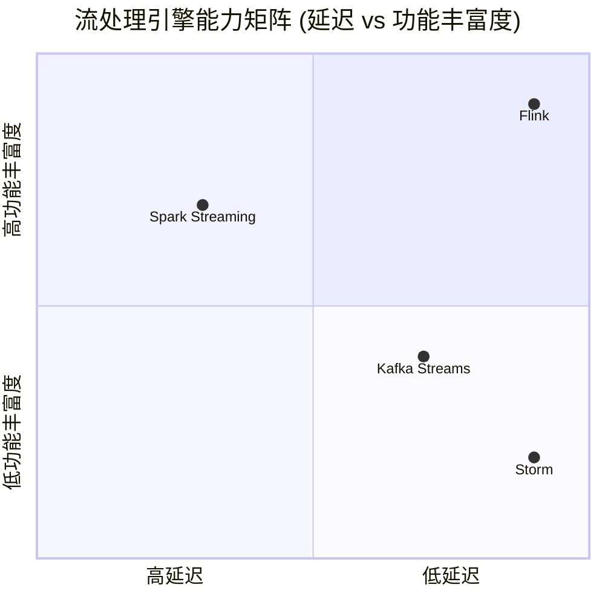
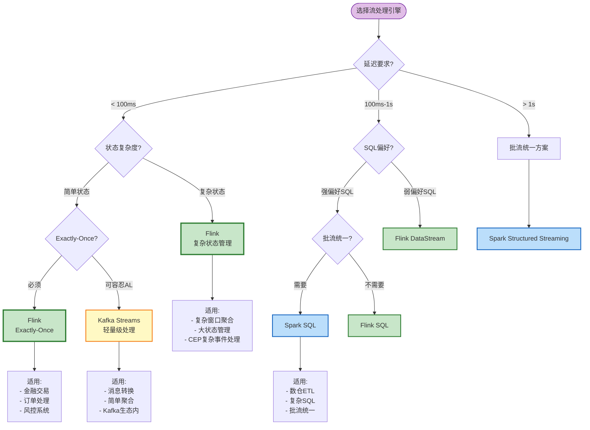

# 流处理引擎选型指南 (Stream Processing Engine Selection Guide)

> **所属阶段**: Knowledge/04-technology-selection | **前置依赖**: [../01-concept-atlas/streaming-models-mindmap.md](../01-concept-atlas/streaming-models-mindmap.md), [../../Struct/03-relationships/03.03-expressiveness-hierarchy.md](../../Struct/03-relationships/03.03-expressiveness-hierarchy.md) | **形式化等级**: L3-L4

---

## 目录

- [1. 概念定义 (Definitions)](#1-概念定义-definitions)
- [2. 属性推导 (Properties)](#2-属性推导-properties)
- [3. 关系建立 (Relations)](#3-关系建立-relations)
- [4. 论证过程 (Argumentation)](#4-论证过程-argumentation)
- [5. 工程论证 (Engineering Argument)](#5-工程论证-engineering-argument)
- [6. 实例验证 (Examples)](#6-实例验证-examples)
- [7. 可视化 (Visualizations)](#7-可视化-visualizations)
- [8. 引用参考 (References)](#8-引用参考-references)

---

## 1. 概念定义 (Definitions)

### Def-K-04-01. 流处理引擎 (Stream Processing Engine)

流处理引擎是支持**无界数据流** (unbounded data stream) 持续计算的分布式运行时系统，其核心特征由以下五元组定义：

$$
\text{SPE} = (S_{\text{source}}, T_{\text{transform}}, S_{\text{sink}}, C_{\text{consistency}}, F_{\text{fault}})
$$

| 组件 | 定义 | 关键问题 |
|------|------|----------|
| $S_{\text{source}}$ | 数据源连接器集合 | 支持哪些数据源？偏移量管理？ |
| $T_{\text{transform}}$ | 转换算子集合 | 窗口类型？状态算子？CEP支持？ |
| $S_{\text{sink}}$ | 数据汇连接器集合 | Exactly-Once保证？事务支持？ |
| $C_{\text{consistency}}$ | 一致性语义 | At-Most/Least/Exactly-Once？ |
| $F_{\text{fault}}$ | 容错机制 | Checkpoint？状态后端？ |

**定义动机**：将流处理引擎抽象为五元组，使得不同引擎可以在统一框架下进行比较，避免主观性评价 [^1]。

---

### Def-K-04-02. 延迟-吞吐权衡 (Latency-Throughput Trade-off)

定义延迟-吞吐权衡函数 $L(T)$ 描述引擎在特定吞吐量 $T$ 下可达到的最小延迟：

$$
L(T) = L_{\text{base}} + L_{\text{queue}}(T) + L_{\text{coord}}(T)
$$

其中：

- $L_{\text{base}}$：基础处理延迟（算子计算时间）
- $L_{\text{queue}}(T) = \frac{1}{\mu - T}$：排队延迟（M/M/1队列模型）
- $L_{\text{coord}}(T)$：协调开销（Barrier同步、事务提交）

**关键观察**：当 $T \to \mu$（吞吐量接近处理容量），延迟趋向无穷——系统饱和。

---

### Def-K-04-03. 一致性级别 (Consistency Levels)

流处理引擎提供三种一致性保证，按严格程度递增：

| 级别 | 定义 | 语义 | 适用场景 |
|------|------|------|----------|
| **At-Most-Once** (AMO) | $\Pr[\text{重复}] = 0$ | 至多一次，可能丢失 | 日志聚合、监控指标 |
| **At-Least-Once** (ALO) | $\Pr[\text{丢失}] = 0$ | 至少一次，可能重复 | 推荐系统、非交易统计 |
| **Exactly-Once** (EO) | $\Pr[\text{丢失}] = \Pr[\text{重复}] = 0$ | 恰好一次 | 金融交易、订单处理 |

**形式化区分**：

- AMO $\subset$ ALO $\subset$ EO（实现复杂度递增）
- EO 需要**幂等 Sink** 或**分布式事务**（2PC）支持

---

### Def-K-04-04. 状态管理复杂度 (State Management Complexity)

定义状态管理复杂度为三维向量：

$$
\vec{C}_{\text{state}} = (D_{\text{size}}, D_{\text{ttl}}, D_{\text{query}})
$$

| 维度 | 含义 | 低复杂度 | 高复杂度 |
|------|------|----------|----------|
| $D_{\text{size}}$ | 状态大小 | < 1GB/分区 | > 100GB/分区 |
| $D_{\text{ttl}}$ | 状态生命周期 | 固定TTL | 事件驱动清理 |
| $D_{\text{query}}$ | 状态查询模式 | Key-Lookup | 复杂SQL/多表Join |

---

## 2. 属性推导 (Properties)

### Lemma-K-04-01. 微批模型延迟下界

**陈述**：基于微批 (micro-batching) 的流处理引擎，其端到端延迟存在理论下界：

$$
L_{\text{micro-batch}} \geq \frac{B}{\lambda} + L_{\text{proc}}
$$

其中 $B$ 为批大小，$\lambda$ 为数据到达率，$L_{\text{proc}}$ 为批处理时间。

**推导**：

1. 数据必须等待批次填满或超时触发
2. 批触发周期 $T_{\text{trigger}} = \min(B/\lambda, T_{\text{max}})$
3. 因此最小延迟为批触发周期加上处理时间
4. Spark Structured Streaming 采用此模型，延迟通常为秒级 [^2]

**推论**：微批模型无法达到亚秒级延迟，无论硬件如何优化。

---

### Lemma-K-04-02. 原生流引擎吞吐上界

**陈述**：原生流引擎 (native streaming) 的吞吐量受限于**检查点开销**：

$$
T_{\text{max}} = \frac{T_{\text{raw}}}{1 + \alpha \cdot f_{\text{ckpt}} \cdot t_{\text{serialize}}}
$$

其中：

- $T_{\text{raw}}$：无检查点时的原始吞吐
- $\alpha$：状态大小系数
- $f_{\text{ckpt}}$：检查点频率
- $t_{\text{serialize}}$：序列化开销

**推导**：

1. Checkpoint 期间需要暂停（或异步快照）状态写入
2. 状态越大、检查点越频繁，吞吐损失越大
3. Flink 的异步屏障快照 (ABS) 将 $\alpha$ 降至接近0

---

### Prop-K-04-01. Exactly-Once 实现必要条件

**陈述**：实现端到端 Exactly-Once 语义需要同时满足以下三个条件：

$$
\text{EO} \Rightarrow S_{\text{replayable}} \land C_{\text{checkpoint}} \land S_{\text{idempotent}}
$$

| 条件 | 解释 | 责任方 |
|------|------|--------|
| $S_{\text{replayable}}$ | Source 可重放（如 Kafka offset） | 数据源 |
| $C_{\text{checkpoint}}$ | 引擎 Checkpoint 机制 | 流处理引擎 |
| $S_{\text{idempotent}}$ | Sink 幂等写入或事务支持 | 数据汇 |

**推导**：

1. 若 Source 不可重放，故障时无法重新消费丢失数据
2. 若无 Checkpoint，无法保证状态一致性
3. 若 Sink 非幂等且不支持事务，故障恢复时会产生重复写入

---

## 3. 关系建立 (Relations)

### 关系 1: 引擎与表达能力层次映射

流处理引擎与 Struct/ 中的表达能力层次 $L_1$-$L_6$ 存在对应关系：

| 引擎 | 表达能力层次 | 关键特征 | 限制 |
|------|-------------|----------|------|
| **Storm** | $L_3$ | 静态拓扑，有限状态 | 无原生状态管理 |
| **Kafka Streams** | $L_4$ | 动态分区，本地状态 | 仅 Kafka Source/Sink |
| **Flink** | $L_4$-$L_5$ | 动态重缩放，复杂状态 | 需要外部检查点存储 |
| **Spark Streaming** | $L_3$-$L_4$ | 批流统一，SQL优化 | 微批延迟 |

**关联 Struct/**：见 [Struct/03-relationships/03.03-expressiveness-hierarchy.md](../../Struct/03-relationships/03.03-expressiveness-hierarchy.md)

---

### 关系 2: 引擎选择与设计模式依赖

引擎选择决定了可用的设计模式组合：

```
Flink ────────► Pattern 01-07 全支持
                    │
                    ├── P01 Event Time (Watermark原生)
                    ├── P03 CEP (内置CEP库)
                    └── P07 Checkpoint (ABS算法)

Spark Streaming ──► Pattern 02, 04, 06 优先
                    │
                    ├── P02 Window (基于批的窗口)
                    └── P04 Async I/O (阻塞式外部查询)

Kafka Streams ────► Pattern 05 状态管理
                    │
                    └── 仅限 Kafka 生态内循环
```

---

### 关系 3: SQL支持与优化能力正相关

引擎的 SQL 支持程度与其查询优化能力正相关：

$$
\text{SQL\_Optimization} \propto \text{Declarative\_Level} \propto \frac{1}{\text{Manual\_Tuning}}
$$

| 引擎 | SQL层 | 优化器 | 适用人群 |
|------|-------|--------|----------|
| Flink SQL | Declarative | CBO + RBO | 分析师、数据工程师 |
| Spark SQL | Declarative | Catalyst | 数据科学家 |
| Kafka Streams DSL | Functional | 无 | 应用开发者 |
| Storm API | Imperative | 无 | 底层系统开发者 |

---

## 4. 论证过程 (Argumentation)

### 论证 1: 延迟要求的刚性约束

**场景分析**：

| 延迟要求 | 可用引擎 | 典型场景 | 技术限制 |
|----------|----------|----------|----------|
| < 10ms | Storm, Flink (低延迟模式) | 高频交易、实时监控 | 牺牲一致性 |
| 10-100ms | Flink, Kafka Streams | 实时推荐、风控预警 | 异步 Checkpoint |
| 100ms-1s | Flink, Kafka Streams, Spark | 日志分析、ETL | 平衡模式 |
| > 1s | Spark, 批处理 | 离线报表、数据仓库 | 微批优化 |

**关键论点**：延迟要求是不可妥协的硬性约束。若业务要求 < 100ms，则 Spark Streaming 无论功能多强大都不适用。

---

### 论证 2: 状态复杂度与引擎匹配

**复杂度分层**：

**低复杂度** ($D_{\text{size}} < 1\text{GB}, D_{\text{ttl}} = \text{fixed}$):

- Kafka Streams 本地状态足够
- HashMapStateBackend 性能最优
- 无需远程状态存储

**中复杂度** ($1\text{GB} < D_{\text{size}} < 100\text{GB}$):

- Flink + RocksDBStateBackend
- 增量 Checkpoint 降低开销
- TTL 自动清理过期状态

**高复杂度** ($D_{\text{size}} > 100\text{GB}$ 或复杂查询):

- Flink + 外部状态存储 (HBase, Redis)
- 状态查询分离架构
- 需要自定义状态管理策略

---

### 论证 3: Exactly-Once 的工程代价

**实现 EO 的额外开销**：

| 引擎 | EO实现机制 | 吞吐损失 | 延迟增加 | 运维复杂度 |
|------|-----------|----------|----------|------------|
| Flink | 异步屏障快照 + 2PC Sink | 5-15% | < 50ms | 中 |
| Kafka Streams | EOS 事务 | 10-20% | 100-500ms | 低 |
| Spark | 微批幂等 + 事务 | 15-25% | 批次延迟 | 低 |
| Storm | 无原生EO | 需自行实现 | - | 高 |

**决策原则**：若业务可容忍 At-Least-Once，则避免 EO 的额外开销。

---

## 5. 工程论证 (Engineering Argument)

### 引擎选型多维评估框架

**评估维度权重矩阵**：

| 维度 | 金融风控 | IoT | 实时推荐 | 日志分析 |
|------|----------|-----|----------|----------|
| 延迟 | ★★★★★ | ★★★★☆ | ★★★☆☆ | ★★☆☆☆ |
| 吞吐 | ★★★☆☆ | ★★★★★ | ★★★★☆ | ★★★★★ |
| Exactly-Once | ★★★★★ | ★★★☆☆ | ★★☆☆☆ | ★☆☆☆☆ |
| SQL | ★★★★☆ | ★★☆☆☆ | ★★★★★ | ★★★★☆ |
| 学习曲线 | ★★★☆☆ | ★★★★☆ | ★★★☆☆ | ★★★★★ |

**综合评分** (满分5分)：

| 引擎 | 金融风控 | IoT | 实时推荐 | 日志分析 | 综合 |
|------|----------|-----|----------|----------|------|
| **Flink** | 4.8 | 4.5 | 4.2 | 3.8 | **4.3** |
| **Spark Streaming** | 3.5 | 3.8 | 4.5 | 4.8 | 4.2 |
| **Kafka Streams** | 3.2 | 4.2 | 3.5 | 3.0 | 3.5 |
| **Storm** | 2.8 | 3.0 | 2.5 | 2.2 | 2.6 |

**结论**：Flink 在延迟敏感和一致性要求高的场景表现最优；Spark Streaming 适合高吞吐、延迟不敏感的批流统一场景。

---

## 6. 实例验证 (Examples)

### 示例 1: 金融实时风控系统选型

**业务需求**：

- 延迟：< 200ms (从交易发生到风控决策)
- 一致性：Exactly-Once (不能漏判也不能重复)
- 状态：复杂 (用户画像、行为模式)
- CEP：需要 (识别多事件序列模式)

**选型决策**：

```
延迟要求 < 200ms ──► 排除 Spark Streaming
Exactly-Once 必须 ──► 排除 Storm (无原生EO)
CEP 需求 ──► 优选 Flink (内置CEP库)

最终选择: Flink + RocksDBStateBackend + Kafka Source
```

**配置要点**：

- Checkpoint间隔：1分钟（平衡容错与吞吐）
- Watermark延迟：500ms（容忍网络抖动）
- 状态TTL：24小时（用户会话有效期）

---

### 示例 2: IoT设备数据处理选型

**业务需求**：

- 设备数：100万+ MQTT连接
- 延迟：秒级可接受
- 数据量：高吞吐 (百万条/秒)
- 一致性：At-Least-Once 足够

**选型决策**：

```
高吞吐 + 秒级延迟 ──► Kafka Streams 或 Flink
已有 Kafka 基础设施 ──► Kafka Streams 无缝集成
状态简单 (设备状态) ──► Kafka Streams 本地状态足够

最终选择: Kafka Streams + Kafka Connect (MQTT)
```

**架构优势**：

- 无需额外集群，复用 Kafka 基础设施
- 本地状态存储降低延迟
- Kafka EOS 保证 ALO 语义

---

### 示例 3: 实时数仓 ETL 选型

**业务需求**：

- 数据源：MySQL CDC + Kafka + HDFS
- 转换：复杂 SQL (Join, Window Aggregate)
- 延迟：分钟级可接受
- 历史数据：需与离线数据合并

**选型决策**：

```
复杂 SQL + 批流统一 ──► Spark Structured Streaming
历史数据合并 ──► Spark 批流统一架构优势
分钟级延迟 ──► 微批模型可接受

最终选择: Spark Streaming + Delta Lake
```

---

### 示例 4: 错误选型案例分析

**场景**：某电商公司选择 Storm 构建实时推荐系统

**问题**：

1. Storm 无原生状态管理，需自建 Redis 状态存储
2. 无 Event Time 支持，无法处理乱序数据
3. 无 Exactly-Once，导致重复推荐
4. 开发成本高，维护困难

**改进方案**：

```
迁移至 Flink
├── 原生 Keyed State 管理用户特征
├── Watermark 机制处理点击流乱序
├── Exactly-Once Sink 到推荐服务
└── CEP 识别用户行为序列模式
```

---

## 7. 可视化 (Visualizations)

### 图 7.1: 流处理引擎对比矩阵



**图说明**：

- Flink 在延迟和功能丰富度上都处于领先位置
- Spark Streaming 功能丰富但延迟较高（微批模型）
- Storm 低延迟但功能有限
- Kafka Streams 适合 Kafka 生态内的轻量级处理

---

### 图 7.2: 引擎选型决策树



**决策路径说明**：

1. 延迟 < 100ms → Flink 或 Kafka Streams（Storm 已过时，不推荐新项目使用）
2. 复杂状态 → Flink RocksDB 状态后端
3. Exactly-Once 必须 → Flink Checkpoint + 事务 Sink
4. 批流统一需求 → Spark Structured Streaming
5. 纯 Kafka 生态 → Kafka Streams 简化架构

---

### 图 7.3: 引擎核心能力雷达图 (文本描述)

```
                    延迟性能
                      5 |
                        |    Flink ★★★★★
            SQL支持     |    Spark ★★★☆☆
                5       |    Kafka ★★★★☆
                  \     |    Storm ★★★★★
                   \    |
                    \   |
                     \  |
    生态集成 5 -------●------- 5 状态管理
                     /  |
                    /   |
                   /    |
                  /     |
    学习曲线     /      |
              5         |  5 一致性保证
                        |
```

| 引擎 | 延迟 | 吞吐 | 状态管理 | Exactly-Once | SQL支持 | 生态 | 学习曲线 |
|------|:----:|:----:|:--------:|:------------:|:-------:|:----:|:--------:|
| Flink | ★★★★★ | ★★★★★ | ★★★★★ | ★★★★★ | ★★★★☆ | ★★★★★ | ★★★☆☆ |
| Spark Streaming | ★★★☆☆ | ★★★★★ | ★★★★☆ | ★★★★☆ | ★★★★★ | ★★★★★ | ★★★★☆ |
| Kafka Streams | ★★★★☆ | ★★★☆☆ | ★★★☆☆ | ★★★★☆ | ★★☆☆☆ | ★★★☆☆ | ★★★★★ |
| Storm | ★★★★★ | ★★☆☆☆ | ★☆☆☆☆ | ★☆☆☆☆ | ★☆☆☆☆ | ★★☆☆☆ | ★★☆☆☆ |

---

## 8. 引用参考 (References)

[^1]: T. Akidau et al., "The Dataflow Model: A Practical Approach to Balancing Correctness, Latency, and Cost in Massive-Scale, Unbounded, Out-of-Order Data Processing," *PVLDB*, 8(12), 2015. —— Dataflow 模型的工业实践奠基

[^2]: M. Zaharia et al., "Discretized Streams: Fault-Tolerant Streaming Computation at Scale," *SOSP*, 2013. —— Spark Streaming 微批模型理论基础


---

## 关联文档

- [../01-concept-atlas/streaming-models-mindmap.md](../01-concept-atlas/streaming-models-mindmap.md) —— 流计算模型全景对比
- [../02-design-patterns/pattern-event-time-processing.md](../02-design-patterns/pattern-event-time-processing.md) —— Event Time 处理模式
- [../../Struct/03-relationships/03.03-expressiveness-hierarchy.md](../../Struct/03-relationships/03.03-expressiveness-hierarchy.md) —— 表达能力层次理论
- [../04-technology-selection/paradigm-selection-guide.md](./paradigm-selection-guide.md) —— 并发范式选型指南
- [../04-technology-selection/storage-selection-guide.md](./storage-selection-guide.md) —— 存储系统选型指南

---

*文档版本: 2026.04 | 形式化等级: L3-L4 | 状态: 完整*
