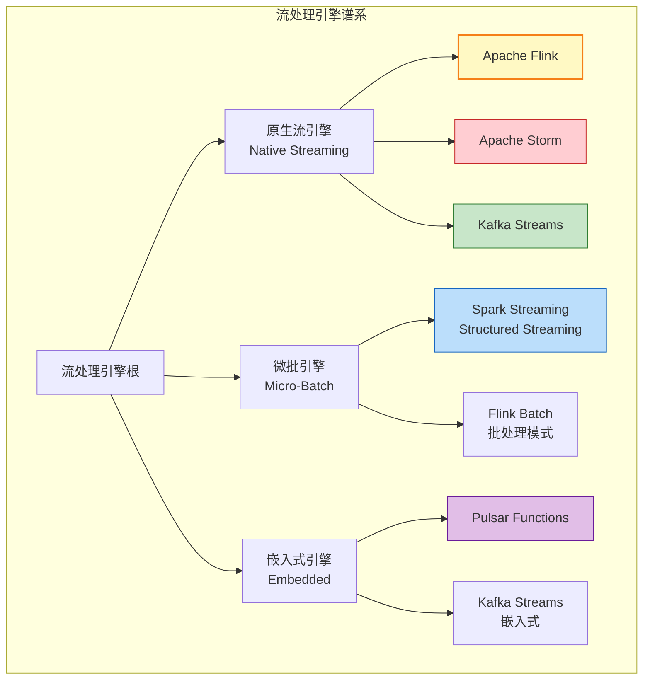
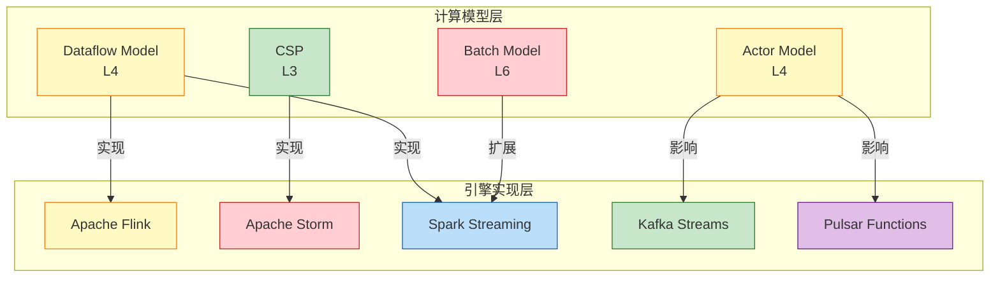
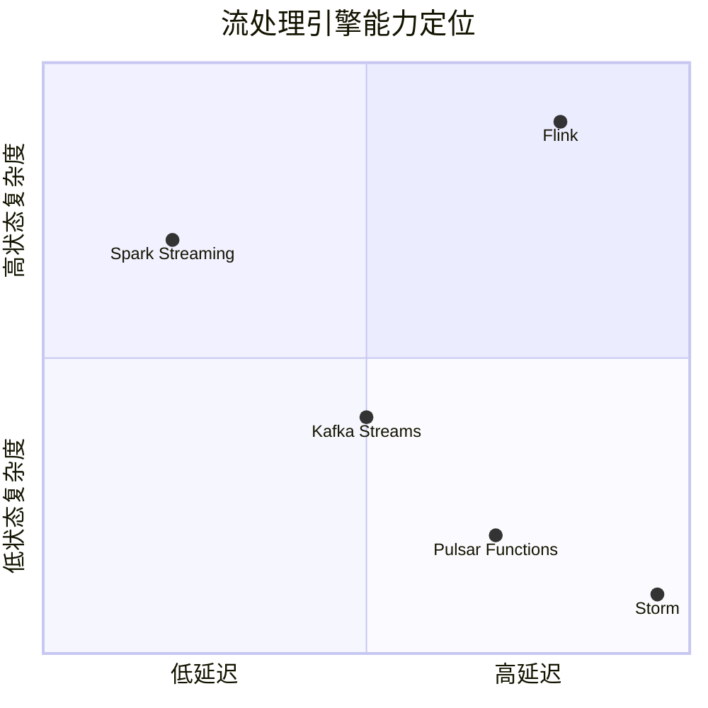
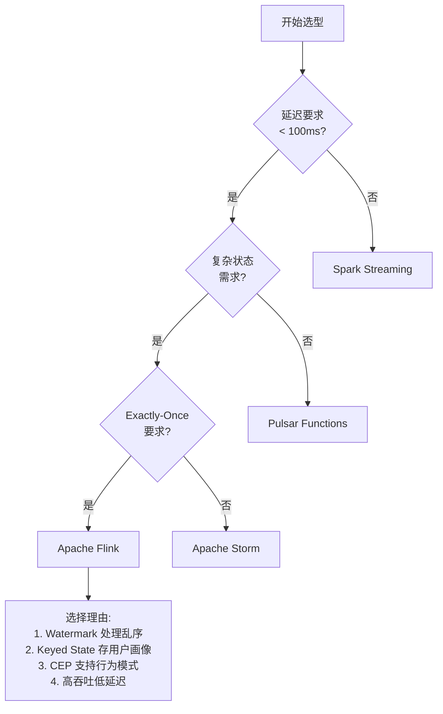
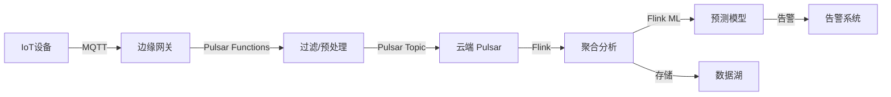
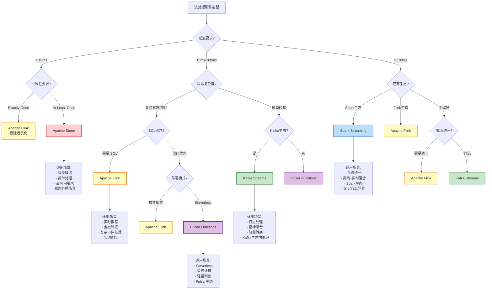
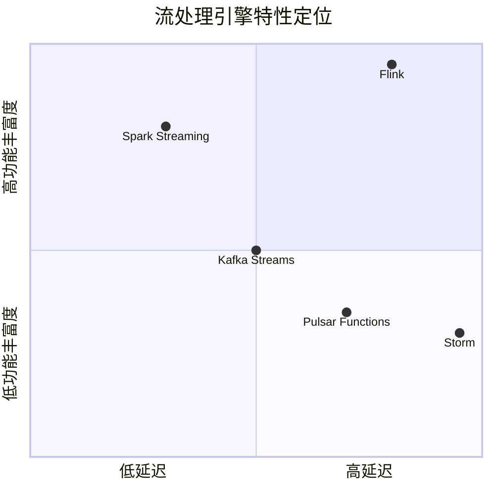

# 流处理引擎选型决策指南 (Stream Processing Engine Selection Guide) {#流处理引擎选型决策指南-stream-processing-engine-selection-guide}

> **所属阶段**: Knowledge/04-technology-selection | **前置依赖**: [../../Struct/03-relationships/03.03-expressiveness-hierarchy.md](../../Struct/03-relationships/03.03-expressiveness-hierarchy.md), [../01-concept-atlas/concurrency-paradigms-matrix.md](../01-concept-atlas/concurrency-paradigms-matrix.md) | **形式化等级**: L4-L6
> **版本**: 2026.04 | **文档规模**: ~25KB

---

## 目录 {#目录}

- [流处理引擎选型决策指南 (Stream Processing Engine Selection Guide) {#流处理引擎选型决策指南-stream-processing-engine-selection-guide}](#流处理引擎选型决策指南-stream-processing-engine-selection-guide-流处理引擎选型决策指南-stream-processing-engine-selection-guide)
  - [目录 {#目录}](#目录-目录)
  - [1. 概念定义 (Definitions) {#1-概念定义-definitions}](#1-概念定义-definitions-1-概念定义-definitions)
    - [1.1 流处理引擎谱系 {#11-流处理引擎谱系}](#11-流处理引擎谱系-11-流处理引擎谱系)
    - [1.2 引擎核心定义 {#12-引擎核心定义}](#12-引擎核心定义-12-引擎核心定义)
      - [Def-K-04-01. Apache Flink {#def-k-04-01-apache-flink}](#def-k-04-01-apache-flink-def-k-04-01-apache-flink)
      - [Def-K-04-02. Kafka Streams {#def-k-04-02-kafka-streams}](#def-k-04-02-kafka-streams-def-k-04-02-kafka-streams)
      - [Def-K-04-03. Spark Streaming (Structured Streaming) {#def-k-04-03-spark-streaming-structured-streaming}](#def-k-04-03-spark-streaming-structured-streaming-def-k-04-03-spark-streaming-structured-streaming)
      - [Def-K-04-04. Apache Storm {#def-k-04-04-apache-storm}](#def-k-04-04-apache-storm-def-k-04-04-apache-storm)
      - [Def-K-04-05. Pulsar Functions {#def-k-04-05-pulsar-functions}](#def-k-04-05-pulsar-functions-def-k-04-05-pulsar-functions)
    - [1.3 选型核心维度定义 {#13-选型核心维度定义}](#13-选型核心维度定义-13-选型核心维度定义)
      - [Def-K-04-06. 延迟特征 (Latency Profile) {#def-k-04-06-延迟特征-latency-profile}](#def-k-04-06-延迟特征-latency-profile-def-k-04-06-延迟特征-latency-profile)
      - [Def-K-04-07. 状态管理能力 (State Management Capability) {#def-k-04-07-状态管理能力-state-management-capability}](#def-k-04-07-状态管理能力-state-management-capability-def-k-04-07-状态管理能力-state-management-capability)
      - [Def-K-04-08. 一致性保证级别 (Consistency Guarantee Level) {#def-k-04-08-一致性保证级别-consistency-guarantee-level}](#def-k-04-08-一致性保证级别-consistency-guarantee-level-def-k-04-08-一致性保证级别-consistency-guarantee-level)
      - [Def-K-04-09. 表达能力层次映射 (Expressiveness Hierarchy Mapping) {#def-k-04-09-表达能力层次映射-expressiveness-hierarchy-mapping}](#def-k-04-09-表达能力层次映射-expressiveness-hierarchy-mapping-def-k-04-09-表达能力层次映射-expressiveness-hierarchy-mapping)
  - [2. 属性推导 (Properties) {#2-属性推导-properties}](#2-属性推导-properties-2-属性推导-properties)
    - [Lemma-K-04-01. 延迟与吞吐的权衡上界 {#lemma-k-04-01-延迟与吞吐的权衡上界}](#lemma-k-04-01-延迟与吞吐的权衡上界-lemma-k-04-01-延迟与吞吐的权衡上界)
    - [Lemma-K-04-02. 状态复杂度与容错开销的正相关 {#lemma-k-04-02-状态复杂度与容错开销的正相关}](#lemma-k-04-02-状态复杂度与容错开销的正相关-lemma-k-04-02-状态复杂度与容错开销的正相关)
    - [Prop-K-04-01. Dataflow模型引擎的语义优势 {#prop-k-04-01-dataflow模型引擎的语义优势}](#prop-k-04-01-dataflow模型引擎的语义优势-prop-k-04-01-dataflow模型引擎的语义优势)
    - [Prop-K-04-02. 微批处理的延迟下界 {#prop-k-04-02-微批处理的延迟下界}](#prop-k-04-02-微批处理的延迟下界-prop-k-04-02-微批处理的延迟下界)
  - [3. 关系建立 (Relations) {#3-关系建立-relations}](#3-关系建立-relations-3-关系建立-relations)
    - [3.1 引擎与计算模型的关系 {#31-引擎与计算模型的关系}](#31-引擎与计算模型的关系-31-引擎与计算模型的关系)
    - [3.2 表达能力层次映射 {#32-表达能力层次映射}](#32-表达能力层次映射-32-表达能力层次映射)
    - [3.3 引擎间能力关系 {#33-引擎间能力关系}](#33-引擎间能力关系-33-引擎间能力关系)
  - [4. 论证过程 (Argumentation) {#4-论证过程-argumentation}](#4-论证过程-argumentation-4-论证过程-argumentation)
    - [4.1 六维选型对比矩阵 {#41-六维选型对比矩阵}](#41-六维选型对比矩阵-41-六维选型对比矩阵)
      - [表 1: 核心性能对比矩阵 {#表-1-核心性能对比矩阵}](#表-1-核心性能对比矩阵-表-1-核心性能对比矩阵)
      - [表 2: 架构与部署对比矩阵 {#表-2-架构与部署对比矩阵}](#表-2-架构与部署对比矩阵-表-2-架构与部署对比矩阵)
      - [表 3: 开发体验对比矩阵 {#表-3-开发体验对比矩阵}](#表-3-开发体验对比矩阵-表-3-开发体验对比矩阵)
    - [4.2 场景驱动的选型论证 {#42-场景驱动的选型论证}](#42-场景驱动的选型论证-42-场景驱动的选型论证)
      - [论证 1: 为什么实时推荐系统应选择 Flink {#论证-1-为什么实时推荐系统应选择-flink}](#论证-1-为什么实时推荐系统应选择-flink-论证-1-为什么实时推荐系统应选择-flink)
      - [论证 2: 为什么日志聚合应选择 Kafka Streams {#论证-2-为什么日志聚合应选择-kafka-streams}](#论证-2-为什么日志聚合应选择-kafka-streams-论证-2-为什么日志聚合应选择-kafka-streams)
      - [论证 3: 为什么复杂事件处理(CEP)应选择 Flink {#论证-3-为什么复杂事件处理cep应选择-flink}](#论证-3-为什么复杂事件处理cep应选择-flink-论证-3-为什么复杂事件处理cep应选择-flink)
      - [论证 4: 为什么低延迟交易系统应选择 Storm/Flink {#论证-4-为什么低延迟交易系统应选择-stormflink}](#论证-4-为什么低延迟交易系统应选择-stormflink-论证-4-为什么低延迟交易系统应选择-stormflink)
    - [4.3 云原生能力对比 {#43-云原生能力对比}](#43-云原生能力对比-43-云原生能力对比)
  - [5. 工程论证 (Engineering Argumentation) {#5-工程论证-engineering-argumentation}](#5-工程论证-engineering-argumentation-5-工程论证-engineering-argumentation)
    - [5.1 迁移指南: 从 Spark Streaming 到 Flink {#51-迁移指南-从-spark-streaming-到-flink}](#51-迁移指南-从-spark-streaming-到-flink-51-迁移指南-从-spark-streaming-到-flink)
    - [5.2 成本效益分析框架 {#52-成本效益分析框架}](#52-成本效益分析框架-52-成本效益分析框架)
  - [6. 实例验证 (Examples) {#6-实例验证-examples}](#6-实例验证-examples-6-实例验证-examples)
    - [6.1 实例 1: 电商实时推荐系统选型 {#61-实例-1-电商实时推荐系统选型}](#61-实例-1-电商实时推荐系统选型-61-实例-1-电商实时推荐系统选型)
    - [6.2 实例 2: 金融风控实时决策系统选型 {#62-实例-2-金融风控实时决策系统选型}](#62-实例-2-金融风控实时决策系统选型-62-实例-2-金融风控实时决策系统选型)
    - [6.3 实例 3: 物联网数据平台选型 {#63-实例-3-物联网数据平台选型}](#63-实例-3-物联网数据平台选型-63-实例-3-物联网数据平台选型)
    - [6.4 反例分析 {#64-反例分析}](#64-反例分析-64-反例分析)
      - [反例 1: 在低延迟场景误用 Spark Streaming {#反例-1-在低延迟场景误用-spark-streaming}](#反例-1-在低延迟场景误用-spark-streaming-反例-1-在低延迟场景误用-spark-streaming)
      - [反例 2: 在复杂状态场景误用 Kafka Streams {#反例-2-在复杂状态场景误用-kafka-streams}](#反例-2-在复杂状态场景误用-kafka-streams-反例-2-在复杂状态场景误用-kafka-streams)
      - [反例 3: 在无 Kafka 环境使用 Kafka Streams {#反例-3-在无-kafka-环境使用-kafka-streams}](#反例-3-在无-kafka-环境使用-kafka-streams-反例-3-在无-kafka-环境使用-kafka-streams)
  - [7. 可视化 (Visualizations) {#7-可视化-visualizations}](#7-可视化-visualizations-7-可视化-visualizations)
    - [7.1 流处理引擎选型决策树 {#71-流处理引擎选型决策树}](#71-流处理引擎选型决策树-71-流处理引擎选型决策树)
    - [7.2 引擎能力雷达图对比 {#72-引擎能力雷达图对比}](#72-引擎能力雷达图对比-72-引擎能力雷达图对比)
    - [7.3 场景-引擎映射矩阵 {#73-场景-引擎映射矩阵}](#73-场景-引擎映射矩阵-73-场景-引擎映射矩阵)
  - [8. 引用参考 (References) {#8-引用参考-references}](#8-引用参考-references-8-引用参考-references)
  - [关联文档 {#关联文档}](#关联文档-关联文档)
    - [上游依赖 {#上游依赖}](#上游依赖-上游依赖)
    - [同层关联 {#同层关联}](#同层关联-同层关联)
    - [下游应用 {#下游应用}](#下游应用-下游应用)

---

## 1. 概念定义 (Definitions) {#1-概念定义-definitions}

### 1.1 流处理引擎谱系 {#11-流处理引擎谱系}

流处理引擎是实现**Dataflow Model**或相关并发模型的运行时系统。根据实现架构和一致性保证，可分为以下谱系：



---

### 1.2 引擎核心定义 {#12-引擎核心定义}

#### Def-K-04-01. Apache Flink {#def-k-04-01-apache-flink}

**形式化定义**（参见 [../../Struct/01-foundation/01.04-dataflow-model-formalization.md](../../Struct/01-foundation/01.04-dataflow-model-formalization.md)）：

$$
\text{Flink} = (\mathcal{G}, \Sigma, \mathbb{T}_{event}, \mathbb{T}_{proc}, \mathcal{C}, \mathcal{S})
$$

其中 $\mathcal{G} = (V, E)$ 为算子图，$\Sigma$ 为流类型签名，$\mathbb{T}_{event}$ 为事件时间域，$\mathbb{T}_{proc}$ 为处理时间域，$\mathcal{C}$ 为 Checkpoint 机制，$\mathcal{S}$ 为状态后端。

**核心特征**：

| 维度 | 特征 |
|------|------|
| **计算模型** | 原生 Dataflow，支持批流统一 |
| **时间语义** | 事件时间/处理时间/摄取时间，Watermark 机制 |
| **状态管理** | 按键分区状态，支持 Value/List/Map/Reduce 状态 |
| **容错机制** | Chandy-Lamport 分布式快照，Exactly-Once 语义 |
| **延迟特性** | 毫秒级（~10ms），高吞吐 |
| **表达能力** | L4+（动态算子、移动性支持）|

**代表版本**：Flink 1.18+ / 2.0

---

#### Def-K-04-02. Kafka Streams {#def-k-04-02-kafka-streams}

**形式化定义**：

$$
\text{Kafka Streams} = (\mathcal{T}, \mathcal{K}, \mathcal{P}, \mathcal{L}_{local}, \mathcal{R}_{rep})
$$

其中 $\mathcal{T}$ 为拓扑定义（Processor API），$\mathcal{K}$ 为 Kafka 集群，$\mathcal{P}$ 为分区分配策略，$\mathcal{L}_{local}$ 为本地状态存储（RocksDB），$\mathcal{R}_{rep}$ 为变更日志复制机制。

**核心特征**：

| 维度 | 特征 |
|------|------|
| **计算模型** | 嵌入式库，无独立集群 |
| **时间语义** | 事件时间（Kafka 记录时间戳）|
| **状态管理** | 本地状态存储 + changelog Topic |
| **容错机制** | Kafka 分区复制 + changelog 回放 |
| **延迟特性** | 秒级（~100ms-1s）|
| **表达能力** | L3-L4（静态拓扑为主）|

**部署模式**：嵌入应用 JVM，无额外集群开销

---

#### Def-K-04-03. Spark Streaming (Structured Streaming) {#def-k-04-03-spark-streaming-structured-streaming}

**形式化定义**：

$$
\text{Spark Streaming} = (\mathcal{B}, \Delta t, \mathcal{D}_{micro}, \mathcal{O}_{output}, \mathcal{W}_{watermark})
$$

其中 $\mathcal{B}$ 为批处理引擎（Spark SQL），$\Delta t$ 为微批间隔，$\mathcal{D}_{micro}$ 为微批数据抽象，$\mathcal{O}_{output}$ 为输出模式（Complete/Update/Append），$\mathcal{W}_{watermark}$ 为事件时间 Watermark。

**核心特征**：

| 维度 | 特征 |
|------|------|
| **计算模型** | 微批（Micro-batch），批流统一 |
| **时间语义** | 事件时间支持（Structured Streaming）|
| **状态管理** | Spark SQL 状态存储（HDFS/S3）|
| **容错机制** | RDD 血统 + Checkpoint，Exactly-Once |
| **延迟特性** | 秒级（~100ms-数秒）|
| **表达能力** | L4（受限的动态性）|

**代表版本**：Spark 3.5+（Structured Streaming）

---

#### Def-K-04-04. Apache Storm {#def-k-04-04-apache-storm}

**形式化定义**：

$$
\text{Storm} = (\mathcal{T}_{topology}, \mathcal{S}_{spout}, \mathcal{B}_{bolt}, \mathcal{A}_{ack}, \mathcal{W}_{worker})
$$

其中 $\mathcal{T}_{topology}$ 为拓扑（有向图），$\mathcal{S}_{spout}$ 为数据源组件，$\mathcal{B}_{bolt}$ 为处理组件，$\mathcal{A}_{ack}$ 为确认机制，$\mathcal{W}_{worker}$ 为执行工作进程。

**核心特征**：

| 维度 | 特征 |
|------|------|
| **计算模型** | 原生流，记录级处理 |
| **时间语义** | 处理时间为主（Storm 1.0+ 支持事件时间）|
| **状态管理** | 需外部存储（Redis/HBase）|
| **容错机制** | 记录级 ACK，At-Least-Once |
| **延迟特性** | 亚毫秒级（~1-5ms）|
| **表达能力** | L3（静态拓扑）|

**版本演进**：Storm 2.x（基于 Flink 的 blink 部分思想）

---

#### Def-K-04-05. Pulsar Functions {#def-k-04-05-pulsar-functions}

**形式化定义**：

$$
\text{Pulsar Functions} = (\mathcal{F}_{func}, \mathcal{C}_{context}, \mathcal{T}_{trigger}, \mathcal{S}_{state}, \mathcal{R}_{runtime})
$$

其中 $\mathcal{F}_{func}$ 为用户函数，$\mathcal{C}_{context}$ 为执行上下文，$\mathcal{T}_{trigger}$ 为触发机制（Topic 事件），$\mathcal{S}_{state}$ 为 BookKeeper 状态存储，$\mathcal{R}_{runtime}$ 为运行时（Thread/Process/K8s）。

**核心特征**：

| 维度 | 特征 |
|------|------|
| **计算模型** | Serverless Function，轻量级 |
| **时间语义** | 处理时间 |
| **状态管理** | BookKeeper 状态存储（可选）|
| **容错机制** | Pulsar 消费组 + 重试 |
| **延迟特性** | 毫秒级（~10-50ms）|
| **表达能力** | L3（无状态/轻状态函数）|

**部署模式**：K8s、Thread Pool、独立进程

---

### 1.3 选型核心维度定义 {#13-选型核心维度定义}

#### Def-K-04-06. 延迟特征 (Latency Profile) {#def-k-04-06-延迟特征-latency-profile}

| 级别 | 延迟范围 | 适用场景 | 代表引擎 |
|------|----------|----------|----------|
| **极低延迟** | < 10ms | 高频交易、实时控制 | Storm |
| **低延迟** | 10ms - 100ms | 实时推荐、监控告警 | Flink |
| **中等延迟** | 100ms - 1s | 日志处理、指标聚合 | Kafka Streams, Pulsar |
| **高延迟** | > 1s | 离线分析、批量 ETL | Spark Streaming |

#### Def-K-04-07. 状态管理能力 (State Management Capability) {#def-k-04-07-状态管理能力-state-management-capability}

| 级别 | 状态类型 | 容错机制 | 代表引擎 |
|------|----------|----------|----------|
| **无状态** | 纯函数转换 | 无 | Pulsar Functions |
| **键值状态** | 按键聚合状态 | changelog 复制 | Kafka Streams |
| **窗口状态** | 时间窗口状态 | Checkpoint 快照 | Flink |
| **复杂状态** | 会话、CEP 模式 | 分布式快照 | Flink |

#### Def-K-04-08. 一致性保证级别 (Consistency Guarantee Level) {#def-k-04-08-一致性保证级别-consistency-guarantee-level}

| 级别 | 语义 | 实现机制 | 代表引擎 |
|------|------|----------|----------|
| **At-Most-Once** | 可能丢失 | 无确认 | 无默认 |
| **At-Least-Once** | 可能重复 | ACK 确认 | Storm |
| **Exactly-Once** | 精确一次 | 分布式快照/事务 | Flink, Kafka Streams, Spark |

#### Def-K-04-09. 表达能力层次映射 (Expressiveness Hierarchy Mapping) {#def-k-04-09-表达能力层次映射-expressiveness-hierarchy-mapping}

根据 [../../Struct/03-relationships/03.03-expressiveness-hierarchy.md](../../Struct/03-relationships/03.03-expressiveness-hierarchy.md) 的六层表达能力层次：

| 层次 | 引擎 | 表达能力 | 关键特性 |
|------|------|----------|----------|
| L3 | Storm | 静态拓扑 | 预定义 Spout/Bolt 拓扑 |
| L3+ | Kafka Streams | 准静态拓扑 | DSL 构建拓扑，运行时有限调整 |
| L4 | Flink | 动态拓扑 | 动态算子链、自适应调度 |
| L4 | Spark Streaming | 准动态 | 微批内静态，批间可调整 |
| L3 | Pulsar Functions | 函数级 | 独立函数，无拓扑概念 |

---

## 2. 属性推导 (Properties) {#2-属性推导-properties}

### Lemma-K-04-01. 延迟与吞吐的权衡上界 {#lemma-k-04-01-延迟与吞吐的权衡上界}

**陈述**：在流处理系统中，延迟（Latency）与吞吐（Throughput）存在理论权衡上界，由 Little's Law 约束：

$$
L = \lambda \cdot W
$$

其中 $L$ 为系统中平均作业数，$\lambda$ 为到达率（吞吐），$W$ 为平均等待时间（延迟）。

**推导**：

1. 对于微批处理模型（Spark Streaming），$W \geq \Delta t$（批间隔），延迟有下界；
2. 对于原生流模型（Flink/Storm），$W$ 主要取决于单条记录处理时间和排队延迟；
3. 在资源固定时，提高吞吐（$\lambda$）必然增加延迟（$W$），除非增加并行度；
4. Flink 的流水线执行和 Storm 的边队列缓存策略在不同负载下优化此权衡。

**工程推论**：低延迟场景选择原生流引擎，高吞吐容忍延迟场景可选择微批。

---

### Lemma-K-04-02. 状态复杂度与容错开销的正相关 {#lemma-k-04-02-状态复杂度与容错开销的正相关}

**陈述**：状态管理的复杂度与容错机制的开销呈正相关。

**推导**：

1. **无状态处理**（Pulsar Functions）：无需 Checkpoint，容错仅依赖消息重放，开销最低；
2. **键值状态**（Kafka Streams）：changelog 复制开销与状态变更频率成正比，$O(|\Delta S|)$；
3. **分布式快照**（Flink）：Checkpoint 开销与状态大小和拓扑复杂度相关，$O(|S| + |V| + |E|)$；
4. 状态后端选择（内存/RocksDB/增量）影响 Checkpoint 的 I/O 开销。

**工程推论**：轻量级状态选择 Kafka Streams，复杂状态选择 Flink。

---

### Prop-K-04-01. Dataflow模型引擎的语义优势 {#prop-k-04-01-dataflow模型引擎的语义优势}

**陈述**：基于严格 Dataflow 模型的引擎（Flink）在处理时间语义、窗口计算和乱序数据处理上具有语义优势。

**推导**：

1. **Watermark 机制**：Flink 的 Watermark $w$ 明确表示"时间戳 $< w$ 的事件已到达"，提供乱序处理的确定性语义；
2. **窗口对齐**：事件时间窗口基于数据本身的时间戳，而非处理时间，避免延迟数据导致的窗口漂移；
3. **状态一致性**：Keyed State 与 Watermark 结合，确保窗口触发时状态的一致性视图；
4. Kafka Streams 和 Spark Streaming 的事件时间支持是后期添加，语义完整性不及原生设计。

**结论**：需要严格事件时间语义的场景优先选择 Flink。

---

### Prop-K-04-02. 微批处理的延迟下界 {#prop-k-04-02-微批处理的延迟下界}

**陈述**：微批处理模型的延迟存在理论下界，由批间隔 $\Delta t$ 决定。

**推导**：

1. Spark Streaming 的 micro-batch 模型将流切分为离散批次，最小延迟为 $\Delta t$；
2. Continuous Processing 模式（Spark 2.3+ 实验性）试图突破此限制，但牺牲了部分 Exactly-Once 保证；
3. 在低数据率场景，批间隔导致的延迟占比显著；
4. 在高数据率场景，批处理效率抵消了延迟损失。

**结论**：延迟敏感场景（< 100ms）应避免纯微批模型。

---

## 3. 关系建立 (Relations) {#3-关系建立-relations}

### 3.1 引擎与计算模型的关系 {#31-引擎与计算模型的关系}



### 3.2 表达能力层次映射 {#32-表达能力层次映射}

根据 [../../Struct/03-relationships/03.03-expressiveness-hierarchy.md](../../Struct/03-relationships/03.03-expressiveness-hierarchy.md) 的 Thm-S-14-01：

| 层次 | 引擎 | 表达能力特征 | 可判定性 |
|------|------|--------------|----------|
| L3 | Storm | 静态拓扑，预定义组件 | 可验证 |
| L3+ | Kafka Streams | DSL 拓扑构建，有限运行时调整 | 部分可验证 |
| L4 | Flink | 动态算子链，自适应调度 | 运行时验证 |
| L4 | Spark Streaming | 微批抽象，批内静态 | 批级验证 |
| L3 | Pulsar Functions | 函数独立，无拓扑 | 函数级验证 |

**关键关系**：

- Flink $\supset$ Storm（表达能力包含，Flink 可模拟 Storm 语义）
- Flink $\approx$ Spark Streaming（图灵完备等价，语义侧重不同）
- Kafka Streams $\perp$ Pulsar Functions（不可比较，架构差异）

### 3.3 引擎间能力关系 {#33-引擎间能力关系}



---

## 4. 论证过程 (Argumentation) {#4-论证过程-argumentation}

### 4.1 六维选型对比矩阵 {#41-六维选型对比矩阵}

#### 表 1: 核心性能对比矩阵 {#表-1-核心性能对比矩阵}

| 维度 | Flink | Kafka Streams | Spark Streaming | Storm | Pulsar Functions |
|------|-------|---------------|-----------------|-------|------------------|
| **延迟** | 毫秒级 (~10ms) | 秒级 (~100ms-1s) | 秒级 (~100ms-数秒) | 亚毫秒 (~1-5ms) | 毫秒级 (~10-50ms) |
| **吞吐** | 极高 (> 百万/秒) | 高 (~十万/秒) | 极高 (批处理优化) | 高 (~百万/秒) | 中 (~万/秒) |
| **状态管理** | 原生 Keyed State | 本地 + changelog | RDD 状态存储 | 外部存储 | BookKeeper 状态 |
| **Exactly-Once** | ✅ 原生支持 | ✅ 事务支持 | ✅ 原生支持 | ⚠️ 需 Trident | ❌ At-Least-Once |
| **SQL支持** | ✅ Flink SQL | ❌ KSQL (外部) | ✅ Spark SQL | ❌ 无 | ❌ 无 |
| **生态集成** | 极丰富 | Kafka 生态 | Spark 生态 | 中等 | Pulsar 生态 |

#### 表 2: 架构与部署对比矩阵 {#表-2-架构与部署对比矩阵}

| 维度 | Flink | Kafka Streams | Spark Streaming | Storm | Pulsar Functions |
|------|-------|---------------|-----------------|-------|------------------|
| **部署模式** | 独立集群/YARN/K8s | 嵌入式/独立 | YARN/Mesos/K8s | 独立集群 | K8s/Thread/Process |
| **资源隔离** | TaskManager 级 | JVM 级 | Executor 级 | Worker 级 | Function 级 |
| **水平扩展** | 动态并行度 | 分区驱动 | 静态配置 | 静态配置 | 自动扩缩容 |
| **K8s原生** | Operator 支持 | 有限 | Operator 支持 | 有限 | 原生支持 |
| **云厂商支持** | Ververica/EMR | Confluent | Databricks/EMR | 有限 | StreamNative |

#### 表 3: 开发体验对比矩阵 {#表-3-开发体验对比矩阵}

| 维度 | Flink | Kafka Streams | Spark Streaming | Storm | Pulsar Functions |
|------|-------|---------------|-----------------|-------|------------------|
| **编程模型** | DataStream/Table API | DSL/Processor API | DataFrame/DStream | Topology API | Function API |
| **语言支持** | Java/Scala/Python/SQL | Java/Scala | Java/Scala/Python/R | Java/Clojure/Python | Java/Python/Go |
| **学习曲线** | 陡峭 | 平缓 | 中等 | 陡峭 | 平缓 |
| **调试工具** | Web UI/Metrics | 有限 | Spark UI | Storm UI | Pulsar Admin |
| **社区活跃** | ⭐⭐⭐⭐⭐ | ⭐⭐⭐⭐ | ⭐⭐⭐⭐⭐ | ⭐⭐⭐ | ⭐⭐⭐ |

### 4.2 场景驱动的选型论证 {#42-场景驱动的选型论证}

#### 论证 1: 为什么实时推荐系统应选择 Flink {#论证-1-为什么实时推荐系统应选择-flink}

**场景需求**：

- 毫秒级特征更新（用户行为实时反馈）
- 复杂窗口聚合（滑动窗口会话分析）
- Exactly-Once 保证（推荐准确性）
- 高并发支持（海量用户）

**论证**：

1. **时间语义**：推荐系统依赖用户行为的时间序列模式。Flink 的 Watermark 机制处理乱序点击流，确保窗口计算基于真实事件时间（Prop-K-04-01）。

2. **状态复杂度**：用户画像需要大状态（每个用户一个状态对象）。Flink 的 RocksDB 状态后端支持 TB 级状态，增量 Checkpoint 降低容错开销（Lemma-K-04-02）。

3. **算法支持**：Flink ML 和复杂事件处理（CEP）库支持推荐算法的实时计算。

4. **反例**：Kafka Streams 的本地状态限制单机状态大小；Spark Streaming 的微批延迟无法满足实时性要求。

**结论**：Flink 是实时推荐系统的首选引擎。

---

#### 论证 2: 为什么日志聚合应选择 Kafka Streams {#论证-2-为什么日志聚合应选择-kafka-streams}

**场景需求**：

- 轻量级处理（过滤、转换、路由）
- 与 Kafka 深度集成（日志存储）
- 无额外基础设施（简化运维）
- Exactly-Once 保证（日志不丢失不重复）

**论证**：

1. **架构契合**：日志已经存储在 Kafka，Kafka Streams 直接消费，无需数据搬运。

2. **部署简化**：嵌入式库模式，无需独立集群，与应用同 JVM 部署，降低运维复杂度。

3. **状态轻量**：日志处理多为无状态或轻状态（计数、去重），Kafka Streams 的 changelog 机制足够。

4. **延迟容忍**：日志聚合通常容忍秒级延迟，Kafka Streams 的性能足够。

5. **反例**：Flink 的独立集群模式对于简单日志处理过于重量级；Storm 缺乏 Exactly-Once 支持。

**结论**：Kafka Streams 是 Kafka 生态内日志聚合的最简方案。

---

#### 论证 3: 为什么复杂事件处理(CEP)应选择 Flink {#论证-3-为什么复杂事件处理cep应选择-flink}

**场景需求**：

- 模式匹配（序列、并行、否定）
- 时间窗口内的复杂规则
- 低延迟告警
- 状态跨事件保持

**论证**：

1. **CEP 库**：Flink 提供声明式 CEP API，支持 `next()`, `followedBy()`, `within()` 等模式算子。

2. **时间语义**：CEP 依赖事件时间判断模式超时，Flink 的 Watermark 提供确定性超时触发。

3. **状态管理**：模式匹配需要保持部分匹配状态，Flink 的 Keyed State 支持高效的状态更新。

4. **反例**：Storm 缺乏内置 CEP 支持，需外部库（Esper）集成；Kafka Streams 无原生 CEP API。

**结论**：Flink 是当前 CEP 场景的最佳开源选择。

---

#### 论证 4: 为什么低延迟交易系统应选择 Storm/Flink {#论证-4-为什么低延迟交易系统应选择-stormflink}

**场景需求**：

- 亚毫秒级延迟（价格变动实时响应）
- 高可用（故障快速恢复）
- 记录级处理（无批处理延迟）

**论证**：

1. **延迟要求**：金融交易对延迟极度敏感。Storm 的 record-at-a-time 处理提供最低延迟（~1ms）。

2. **容错选择**：Storm 的 At-Least-Once 语义通过 Trident 可升级为 Exactly-Once，但增加延迟。Flink 的原生 Exactly-Once 在延迟和一致性间取得平衡。

3. **状态外置**：交易系统状态通常外置（Redis/HBase），Storm 的无状态设计与此契合。

4. **反例**：Spark Streaming 的微批模型延迟过高；Kafka Streams 的嵌入式模式难以满足跨数据中心部署需求。

**结论**：极端低延迟选择 Storm，延迟-一致性平衡选择 Flink。

### 4.3 云原生能力对比 {#43-云原生能力对比}

| 能力 | Flink | Kafka Streams | Spark Streaming | Storm | Pulsar Functions |
|------|-------|---------------|-----------------|-------|------------------|
| **K8s Operator** | ✅ 官方 | ❌ 无 | ✅ 第三方 | ❌ 无 | ✅ 官方 |
| **自动扩缩容** | ✅ 自适应调度 | ⚠️ 分区绑定 | ⚠️ 静态配置 | ❌ 手动 | ✅ HPA 支持 |
| **存算分离** | ✅ 支持 | ❌ 本地状态 | ⚠️ 部分支持 | ✅ 支持 | ✅ 支持 |
| **Serverless** | ⚠️ Flink SQL Gateway | ❌ 不支持 | ❌ 不支持 | ❌ 不支持 | ✅ 原生 |
| **多租户** | ✅ YARN/K8s 隔离 | ❌ JVM 级 | ✅ 支持 | ⚠️ 有限 | ✅ 命名空间隔离 |

---

## 5. 工程论证 (Engineering Argumentation) {#5-工程论证-engineering-argumentation}

### 5.1 迁移指南: 从 Spark Streaming 到 Flink {#51-迁移指南-从-spark-streaming-到-flink}

**迁移动机**：

- 微批延迟无法满足业务需求
- 需要真正的事件时间处理
- 复杂状态管理需求

**迁移策略**：

| Spark 概念 | Flink 对应 | 差异说明 |
|------------|------------|----------|
| DStream | DataStream | Flink API 更丰富，支持更多转换 |
| RDD 血统 | Checkpoint | Flink Checkpoint 更轻量，支持增量 |
| Spark SQL | Flink SQL | 语义相似，Flink 流 SQL 更成熟 |
| Windowed DStream | Windowed Stream | Flink 支持事件时间窗口 |
| UpdateStateByKey | KeyedProcessFunction | Flink 状态类型更丰富 |

**迁移步骤**：

1. **POC 验证**：选择非关键流进行 Flink 试点，对比延迟和准确性
2. **双跑阶段**：Spark 和 Flink 并行运行，输出对比验证
3. **状态迁移**：将 Spark 的 HDFS Checkpoint 迁移到 Flink Savepoint
4. **灰度切换**：按流量比例逐步切换

**注意事项**：

- Watermark 策略需要重新设计（Spark 的 Watermark 语义不同）
- 状态 TTL 配置需要调整
- 监控指标体系需要重建

### 5.2 成本效益分析框架 {#52-成本效益分析框架}

**TCO（总拥有成本）模型**：

$$
\text{TCO} = \text{基础设施成本} + \text{运维成本} + \text{开发成本} + \text{机会成本}
$$

| 成本项 | Flink | Kafka Streams | Spark Streaming | Pulsar Functions |
|--------|-------|---------------|-----------------|------------------|
| **基础设施** | 高（独立集群）| 低（无额外）| 高（独立集群）| 中（Serverless）|
| **运维人力** | 高 | 低 | 中 | 低 |
| **开发人力** | 中 | 低 | 低 | 低 |
| **机会成本** | 低（成熟）| 低 | 低 | 高（新兴）|

**选择建议**：

- **初创团队/Kafka 用户**：Kafka Streams（最低 TCO）
- **复杂流处理需求**：Flink（长期收益最高）
- **已有 Spark 生态**：Spark Streaming（迁移成本最低）

---

## 6. 实例验证 (Examples) {#6-实例验证-examples}

### 6.1 实例 1: 电商实时推荐系统选型 {#61-实例-1-电商实时推荐系统选型}

**场景描述**：

- 日活用户：1000万
- 峰值 QPS：50万事件/秒
- 延迟要求：用户行为发生后 100ms 内更新推荐
- 算法复杂度：协同过滤 + 实时特征工程

**决策过程**：



**最终选择**：Apache Flink

**部署架构**：

- Flink on Kubernetes
- RocksDB 状态后端 + S3 Checkpoint
- 3 JobManager + 15 TaskManager（每节点 8 slot）

---

### 6.2 实例 2: 金融风控实时决策系统选型 {#62-实例-2-金融风控实时决策系统选型}

**场景描述**：

- 交易量：10万笔/秒
- 延迟要求：端到端 < 50ms
- 规则复杂度：500+ 条规则，含时序模式
- 合规要求：Exactly-Once 处理，审计追踪

**决策分析**：

| 引擎 | 延迟 | Exactly-Once | CEP | 结论 |
|------|------|--------------|-----|------|
| Flink | ~10ms | ✅ | ✅ | 满足所有需求 |
| Storm | ~5ms | ⚠️ Trident | ❌ 需外部 | 不满足 CEP |
| Kafka Streams | ~200ms | ✅ | ❌ | 延迟不满足 |

**最终选择**：Apache Flink + Flink CEP

**关键配置**：

```java
// 低延迟优化
env.setBufferTimeout(5);  // 5ms 缓冲区超时
env.getConfig().setAutoWatermarkInterval(10);

// 状态后端
env.setStateBackend(new RocksDBStateBackend("s3://checkpoints"));
env.enableCheckpointing(100, CheckpointingMode.EXACTLY_ONCE);
```

---

### 6.3 实例 3: 物联网数据平台选型 {#63-实例-3-物联网数据平台选型}

**场景描述**：

- 设备数：100万+
- 数据点：1000万/秒
- 处理需求：过滤、聚合、告警
- 部署环境：边缘 + 云端混合

**决策分析**：

**边缘节点**：Pulsar Functions

- 轻量级，资源受限环境运行
- Serverless 模型，自动扩缩容
- 与云端 Pulsar 集成

**云端聚合**：Flink

- 复杂窗口聚合
- 与数据湖集成
- ML 推理

**最终架构**：



---

### 6.4 反例分析 {#64-反例分析}

#### 反例 1: 在低延迟场景误用 Spark Streaming {#反例-1-在低延迟场景误用-spark-streaming}

**场景**：高频交易系统使用 Spark Streaming（微批 1秒）

**问题**：

1. 1秒批间隔导致交易信号延迟，错过最佳执行窗口
2. 微批模型无法处理单条记录的细粒度控制
3. Continuous Processing 模式不成熟，稳定性差

**后果**：系统上线后无法满足业务延迟要求，被迫重构。

**正确做法**：选择 Storm（~5ms）或 Flink（~10ms）。

---

#### 反例 2: 在复杂状态场景误用 Kafka Streams {#反例-2-在复杂状态场景误用-kafka-streams}

**场景**：实时会话分析使用 Kafka Streams，单用户状态 > 1GB

**问题**：

1. Kafka Streams 本地状态存储受限于单机磁盘
2. 状态恢复时需要重放大量 changelog，耗时数小时
3. 内存压力导致频繁 GC，性能下降

**后果**：大状态用户出现时系统不稳定，状态恢复时间过长。

**正确做法**：选择 Flink，使用 RocksDB 状态后端支持大状态，增量 Checkpoint 加速恢复。

---

#### 反例 3: 在无 Kafka 环境使用 Kafka Streams {#反例-3-在无-kafka-环境使用-kafka-streams}

**场景**：使用 RabbitMQ 作为消息队列，却选择 Kafka Streams 作为处理引擎

**问题**：

1. Kafka Streams 深度依赖 Kafka 的日志存储和分区机制
2. 无法直接使用 RabbitMQ 作为数据源（无官方连接器）
3. 状态 changelog 需要额外 Kafka 集群，架构复杂

**后果**：架构不自然，引入不必要的 Kafka 集群，运维成本增加。

**正确做法**：选择与消息队列解耦的引擎（Flink），或切换到 Kafka。

---

## 7. 可视化 (Visualizations) {#7-可视化-visualizations}

### 7.1 流处理引擎选型决策树 {#71-流处理引擎选型决策树}



### 7.2 引擎能力雷达图对比 {#72-引擎能力雷达图对比}



### 7.3 场景-引擎映射矩阵 {#73-场景-引擎映射矩阵}

| 场景 | 首选引擎 | 次选引擎 | 不推荐 |
|------|----------|----------|--------|
| 实时推荐系统 | Flink | Kafka Streams | Spark Streaming |
| 日志聚合/ETL | Kafka Streams | Flink | Storm |
| 金融风控/CEP | Flink | - | Storm, Kafka Streams |
| 高频交易 (<10ms) | Storm | Flink | Spark Streaming |
| 批流统一处理 | Flink | Spark Streaming | Kafka Streams |
| IoT 边缘处理 | Pulsar Functions | Flink MiniCluster | Spark Streaming |
| 指标监控告警 | Kafka Streams | Pulsar Functions | Storm |
| 实时数仓构建 | Flink | Spark Streaming | Kafka Streams |
| 复杂机器学习 | Flink ML | Spark ML | Kafka Streams |
| Serverless 流处理 | Pulsar Functions | Flink SQL Gateway | Storm |

---

## 8. 引用参考 (References) {#8-引用参考-references}


---

## 关联文档 {#关联文档}

### 上游依赖 {#上游依赖}

- [../../Struct/03-relationships/03.03-expressiveness-hierarchy.md](../../Struct/03-relationships/03.03-expressiveness-hierarchy.md) —— 表达能力层次理论
- [../../Struct/01-foundation/01.04-dataflow-model-formalization.md](../../Struct/01-foundation/01.04-dataflow-model-formalization.md) —— Dataflow 模型形式化
- [../01-concept-atlas/concurrency-paradigms-matrix.md](../01-concept-atlas/concurrency-paradigms-matrix.md) —— 并发范式对比

### 同层关联 {#同层关联}

- [../../Flink/](../../Flink/) —— Flink 专项深度文档
- [../../Struct/](../../Struct/) —— 形式化理论文档
- [./flink-vs-risingwave.md](./flink-vs-risingwave.md) —— Flink vs RisingWave深度对比

### 下游应用 {#下游应用}

- [../10-case-studies/00-INDEX.md](../10-case-studies/00-INDEX.md) —— 实际案例分析（待创建）
- [../../ROADMAP.md](../../ROADMAP.md) —— 技术演进路线图（待创建）

---

*文档版本: 2026.04 | 形式化等级: L4-L6 | 状态: 完整*
*文档规模: ~25KB | 对比矩阵: 6个 | 决策树: 1个 | 实例: 3个*
