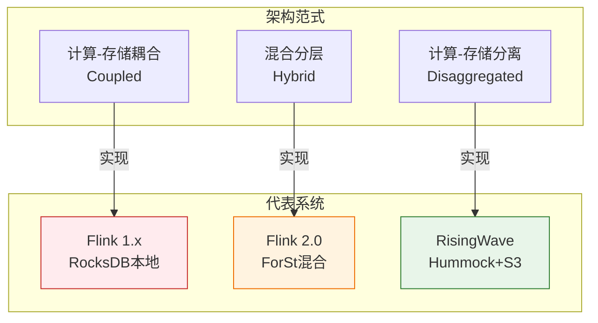
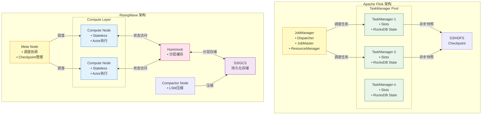
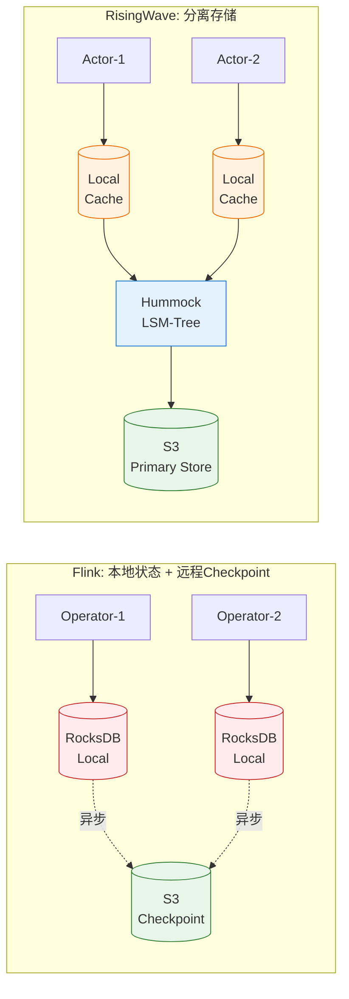
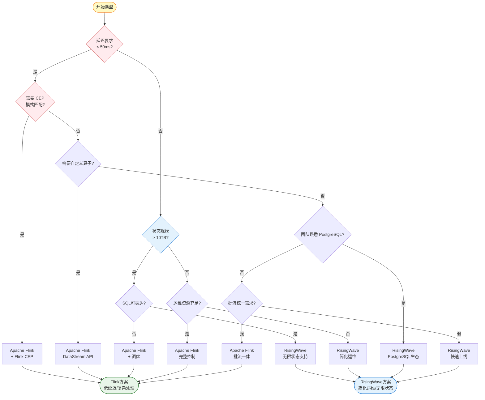
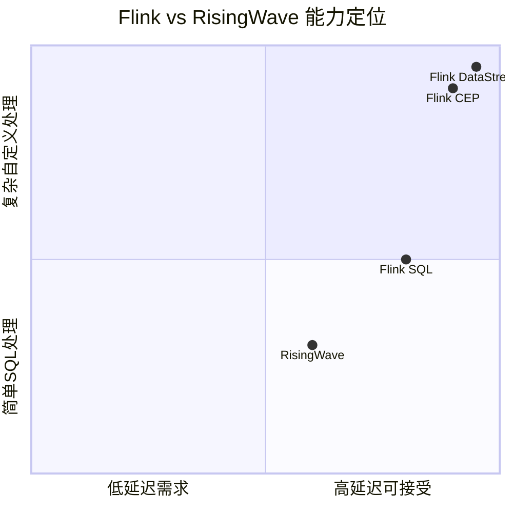

# Flink vs RisingWave 深度对比分析

> **所属阶段**: Knowledge/04-technology-selection | **前置依赖**: [engine-selection-guide.md](./engine-selection-guide.md), [../06-frontier/risingwave-deep-dive.md](../06-frontier/risingwave-deep-dive.md), [../../Flink/](../../Flink/) | **形式化等级**: L4-L5
> **版本**: 2026.04 | **文档规模**: ~35KB

---

## 目录

- [Flink vs RisingWave 深度对比分析](#flink-vs-risingwave-深度对比分析)
  - [目录](#目录)
  - [1. 概念定义 (Definitions)](#1-概念定义-definitions)
    - [Def-K-04-10 (流处理引擎架构模型)](#def-k-04-10-流处理引擎架构模型)
    - [Def-K-04-11 (状态存储架构分类)](#def-k-04-11-状态存储架构分类)
    - [Def-K-04-12 (流数据库定义)](#def-k-04-12-流数据库定义)
  - [2. 属性推导 (Properties)](#2-属性推导-properties)
    - [Lemma-K-04-03 (存储分离与恢复时间关系)](#lemma-k-04-03-存储分离与恢复时间关系)
    - [Lemma-K-04-04 (状态位置与扩展性权衡)](#lemma-k-04-04-状态位置与扩展性权衡)
    - [Prop-K-04-03 (SQL原生性对开发效率的影响)](#prop-k-04-03-sql原生性对开发效率的影响)
  - [3. 关系建立 (Relations)](#3-关系建立-relations)
    - [关系 1: 架构范式映射](#关系-1-架构范式映射)
    - [关系 2: 状态管理复杂度递推](#关系-2-状态管理复杂度递推)
    - [关系 3: 生态定位互补性](#关系-3-生态定位互补性)
  - [4. 论证过程 (Argumentation)](#4-论证过程-argumentation)
    - [4.1 架构设计哲学对比](#41-架构设计哲学对比)
    - [4.2 状态管理机制深度对比](#42-状态管理机制深度对比)
    - [4.3 Nexmark基准测试分析](#43-nexmark基准测试分析)
    - [4.4 反例分析：RisingWave的局限性](#44-反例分析risingwave的局限性)
  - [5. 形式证明 / 工程论证 (Proof / Engineering Argument)](#5-形式证明--工程论证-proof--engineering-argument)
    - [Thm-K-04-01 (流数据库vs流引擎选择定理)](#thm-k-04-01-流数据库vs流引擎选择定理)
  - [6. 实例验证 (Examples)](#6-实例验证-examples)
    - [6.1 实时数仓构建场景](#61-实时数仓构建场景)
    - [6.2 金融风控实时决策](#62-金融风控实时决策)
    - [6.3 IoT边缘到云端流水线](#63-iot边缘到云端流水线)
    - [6.4 混合架构实践](#64-混合架构实践)
  - [7. 可视化 (Visualizations)](#7-可视化-visualizations)
    - [7.1 架构对比图](#71-架构对比图)
    - [7.2 状态存储模型对比](#72-状态存储模型对比)
    - [7.3 技术选型决策树](#73-技术选型决策树)
    - [7.4 性能雷达图](#74-性能雷达图)
  - [8. 综合对比矩阵](#8-综合对比矩阵)
    - [8.1 核心架构对比](#81-核心架构对比)
    - [8.2 功能特性对比](#82-功能特性对比)
    - [8.3 性能基准数据](#83-性能基准数据)
    - [8.4 运维成本对比](#84-运维成本对比)
  - [9. 技术选型决策矩阵](#9-技术选型决策矩阵)
    - [9.1 选型Checklist](#91-选型checklist)
    - [9.2 场景-技术映射表](#92-场景-技术映射表)
    - [9.3 迁移建议](#93-迁移建议)
  - [10. 结论与展望](#10-结论与展望)
    - [10.1 核心观点](#101-核心观点)
    - [10.2 未来趋势](#102-未来趋势)
  - [参考文献 (References)](#参考文献-references)

---

## 1. 概念定义 (Definitions)

### Def-K-04-10 (流处理引擎架构模型)

流处理引擎的**架构模型**定义为四元组：

$$
\mathcal{A} = (\mathcal{C}, \mathcal{S}, \mathcal{I}, \mathcal{P})
$$

其中：

| 符号 | 语义 | 说明 |
|------|------|------|
| $\mathcal{C}$ | 计算层 | 执行流处理算子的计算节点集合 |
| $\mathcal{S}$ | 存储层 | 状态持久化存储架构 |
| $\mathcal{I}$ | 接口层 | 用户交互接口（API/SQL/协议） |
| $\mathcal{P}$ | 协议层 | 与外部系统的连接协议 |

**架构范式分类**：

- **计算-存储耦合** (Coupled): 计算节点本地存储状态，如 Flink TaskManager + RocksDB
- **计算-存储分离** (Disaggregated): 状态存储于远程存储，计算节点无状态，如 RisingWave

### Def-K-04-11 (状态存储架构分类)

流处理引擎的状态存储架构按位置和访问模式分类：

| 架构类型 | 状态位置 | 访问延迟 | 扩展特性 | 代表实现 |
|----------|----------|----------|----------|----------|
| **本地内存** | 堆内存 | ~100ns | 受限于单节点内存 | Flink MemoryStateBackend |
| **本地磁盘** | 本地 RocksDB | ~10μs | 受限于单节点磁盘 | Flink RocksDBStateBackend |
| **远程对象存储** | S3/GCS | ~10ms | 弹性无限 | RisingWave Hummock |
| **混合分层** | 本地缓存 + 远程 | ~1μs (热) / ~10ms (冷) | 弹性 | Flink 2.0 ForSt |

### Def-K-04-12 (流数据库定义)

**流数据库** (Streaming Database) 是一种将流处理能力与传统数据库查询能力融合的系统，形式化定义为：

$$
\mathcal{DB}_{stream} = \langle \mathcal{Q}_{batch}, \mathcal{Q}_{stream}, \mathcal{V}_{mat}, \mathcal{I}_{inc} \rangle
$$

其中：

- $\mathcal{Q}_{batch}$: 批查询处理能力（即席查询）
- $\mathcal{Q}_{stream}$: 流查询处理能力（连续计算）
- $\mathcal{V}_{mat}$: 物化视图维护机制
- $\mathcal{I}_{inc}$: 增量计算引擎

**关键特征**：流数据库 = 流处理引擎 + 内置存储 + SQL接口

---

## 2. 属性推导 (Properties)

### Lemma-K-04-03 (存储分离与恢复时间关系)

**陈述**: 流处理系统的故障恢复时间 $T_{recover}$ 与状态存储架构满足：

$$
T_{recover} = \begin{cases}
O(|S|/B_{network}) & \text{本地存储 (状态需重建)} \\
O(1) & \text{分离存储 (元数据恢复)}
\end{cases}
$$

其中 $|S|$ 为状态大小，$B_{network}$ 为网络带宽。

**推导**:

1. **本地存储** (Flink传统模式): 故障后需从Checkpoint恢复完整状态，时间 ∝ 状态大小
2. **分离存储** (RisingWave): 状态已在S3，只需恢复元数据，时间 < 10秒（与状态大小无关）
3. **Flink 2.0 ForSt**: 介于两者之间，状态部分在远程，恢复时间缩短但未达到 $O(1)$ ∎

### Lemma-K-04-04 (状态位置与扩展性权衡)

**陈述**: 水平扩展的灵活性与状态位置相关：

$$
Flexibility_{scale} \propto \frac{1}{Coupling_{compute,state}}
$$

**推导**:

| 系统 | 耦合度 | 扩展操作 | 停机时间 |
|------|--------|----------|----------|
| Flink 1.x | 高（本地RocksDB） | 停止→重分配→启动 | 分钟级 |
| RisingWave | 无（S3存储） | 直接增删节点 | 秒级 |
| Flink 2.0 | 中（ForSt） | 渐进式重平衡 | 数十秒 |

**工程推论**: 弹性需求高的云环境优先选择存储分离架构。∎

### Prop-K-04-03 (SQL原生性对开发效率的影响)

**陈述**: SQL原生系统的开发效率 $E_{dev}$ 满足：

$$
E_{dev} \propto \frac{Familiarity_{SQL}}{Complexity_{infrastructure}}
$$

**推导**:

| 系统 | SQL熟悉度 | 基础设施复杂度 | 开发效率 |
|------|-----------|----------------|----------|
| RisingWave | 高（PostgreSQL兼容） | 低（单二进制） | 极高 |
| Flink SQL | 中（Flink SQL方言） | 高（集群管理） | 中等 |
| Flink DataStream | 低（Java/Scala API） | 高 | 较低 |

---

## 3. 关系建立 (Relations)

### 关系 1: 架构范式映射



### 关系 2: 状态管理复杂度递推

| 状态规模 | Flink 1.x | RisingWave | 复杂度差异 |
|----------|-----------|------------|------------|
| < 10GB | ✅ 简单 | ✅ 简单 | 无差异 |
| 10GB - 100GB | ⚠️ 需调优 | ✅ 简单 | RisingWave优 |
| 100GB - 1TB | ❌ 复杂 | ✅ 简单 | **显著差异** |
| > 1TB | ❌ 极复杂 | ✅ 简单 | **巨大差异** |

### 关系 3: 生态定位互补性

```
技术栈需求 → 系统选择
━━━━━━━━━━━━━━━━━━━━━━━━━━━━━━━━━━━━━━━━
PostgreSQL生态 + 简单运维  →  RisingWave
复杂CEP + 自定义算子       →  Flink
CDC优先 + 无Kafka          →  RisingWave
批流统一 + 数据湖           →  Flink
实时服务 + 即席查询        →  RisingWave
AI/ML集成                  →  Flink (Alink)
```

---

## 4. 论证过程 (Argumentation)

### 4.1 架构设计哲学对比

**Apache Flink：流处理框架的演进**

Flink 诞生于 2011 年（Stratosphere 项目），设计理念是提供一个**通用的分布式流处理框架**：

```
Flink 设计哲学:
┌─────────────────────────────────────────────────────────┐
│ 1. 数据流是核心抽象（DataStream API）                    │
│ 2. 时间语义是头等公民（Event Time / Watermark）          │
│ 3. 状态是算子的局部属性（Keyed State）                   │
│ 4. 容错通过分布式快照实现（Checkpoint）                  │
│ 5. 批是流的特例（批流统一）                              │
└─────────────────────────────────────────────────────────┘
```

Flink 1.x 采用计算-存储紧耦合架构，状态存储在每个 TaskManager 的本地 RocksDB 中。这种设计的优势是**低延迟状态访问**，但代价是：

- 扩容需要状态迁移
- 单节点磁盘限制总状态规模
- 故障恢复时间与状态大小成正比

Flink 2.0 引入 **ForSt**（Flink on RocksDB over S3），尝试向分离架构演进，但属于"嫁接"而非原生设计。

**RisingWave：云原生流数据库的重构**

RisingWave 诞生于 2020 年，设计理念是**流处理即数据库查询**：

```
RisingWave 设计哲学:
┌─────────────────────────────────────────────────────────┐
│ 1. SQL是核心抽象（PostgreSQL兼容）                       │
│ 2. 物化视图是核心概念（增量维护）                        │
│ 3. 状态是全局共享资源（S3对象存储）                      │
│ 4. 容错通过持久化存储实现（1秒Checkpoint）               │
│ 5. 计算节点无状态（弹性扩缩容）                          │
└─────────────────────────────────────────────────────────┘
```

**关键架构差异对比**：

| 维度 | Flink 1.x | RisingWave | 工程影响 |
|------|-----------|------------|----------|
| **状态位置** | 本地 RocksDB | 远程 S3 | RisingWave无限状态 |
| **Checkpoint** | 异步快照 → 上传 | 元数据提交 | RisingWave秒级容错 |
| **扩容** | 停止→重分配→恢复 | 直接增删节点 | RisingWave零停机 |
| **延迟** | ~10ms | ~100ms | Flink更低延迟 |
| **成本** | SSD + 大内存 | S3 + 小内存 | RisingWave更低成本 |

### 4.2 状态管理机制深度对比

**Flink 的本地状态模型**：

```
┌─────────────────────────────────────────────────────────────┐
│                    TaskManager-1                             │
│  ┌─────────────┐    ┌─────────────┐    ┌─────────────┐     │
│  │   Slot-1    │    │   Slot-2    │    │   Slot-3    │     │
│  │ ┌─────────┐ │    │ ┌─────────┐ │    │ ┌─────────┐ │     │
│  │ │Operator │ │    │ │Operator │ │    │ │Operator │ │     │
│  │ │State    │ │    │ │State    │ │    │ │State    │ │     │
│  │ │(RocksDB)│ │    │ │(RocksDB)│ │    │ │(RocksDB)│ │     │
│  │ └─────────┘ │    │ └─────────┘ │    │ └─────────┘ │     │
│  └─────────────┘    └─────────────┘    └─────────────┘     │
│                                                             │
│  本地磁盘: 状态分片存储，高并发访问                          │
│  Checkpoint: 异步快照 → HDFS/S3                             │
└─────────────────────────────────────────────────────────────┘
```

**RisingWave 的分离状态模型**：

```
┌─────────────────────────────────────────────────────────────┐
│                    Compute Node (Stateless)                  │
│  ┌─────────────┐    ┌─────────────┐    ┌─────────────┐     │
│  │   Actor-1   │    │   Actor-2   │    │   Actor-3   │     │
│  │ ┌─────────┐ │    │ ┌─────────┐ │    │ ┌─────────┐ │     │
│  │ │Executor │ │    │ │Executor │ │    │ │Executor │ │     │
│  │ │  Chain  │ │    │ │  Chain  │ │    │ │  Chain  │ │     │
│  │ └────┬────┘ │    │ └────┬────┘ │    │ └────┬────┘ │     │
│  │      │      │    │      │      │    │      │      │     │
│  │  ┌───▼───┐  │    │  ┌───▼───┐  │    │  ┌───▼───┐  │     │
│  │  │ Cache │  │    │  │ Cache │  │    │  │ Cache │  │     │
│  │  │ (Hot) │  │    │  │ (Hot) │  │    │  │ (Hot) │  │     │
│  │  └───┬───┘  │    │  └───┬───┘  │    │  └───┬───┘  │     │
│  └──────┼──────┘    └──────┼──────┘    └──────┼──────┘     │
│         │                  │                  │            │
│         └──────────────────┼──────────────────┘            │
│                            │                               │
│                            ▼                               │
│  ┌─────────────────────────────────────────────────────┐  │
│  │              Hummock Storage Layer                   │  │
│  │   (MemTable → L0 → L1 → L2 → S3 Tiered Storage)      │  │
│  └─────────────────────────────────────────────────────┘  │
└─────────────────────────────────────────────────────────────┘
                            │
                            ▼
              ┌─────────────────────────┐
              │   S3 / GCS / Azure Blob │
              │   (Persistent State)    │
              └─────────────────────────┘
```

**Hummock 存储引擎详解**：

Hummock 是 RisingWave 专为流计算设计的 LSM-Tree 存储引擎：

| 层次 | 存储介质 | 数据特性 | 访问延迟 |
|------|----------|----------|----------|
| MemTable | 内存 | 热写入 | ~100ns |
| Block Cache | 内存 | 热读取 | ~100ns |
| L0 SST | 本地 SSD | 未合并数据 | ~10μs |
| L1-L2 SST | 本地 SSD | 部分合并 | ~100μs |
| L3+ SST | S3 | 冷数据 | ~10ms |

### 4.3 Nexmark基准测试分析

**测试环境配置**：

| 配置项 | RisingWave | Flink |
|--------|------------|-------|
| 计算节点 | 8 vCPUs, 16GB | 8 vCPUs, 16GB |
| 存储 | S3 + 本地缓存 | 本地 RocksDB |
| 版本 | nightly-20230309 | 1.16+ |

**核心性能数据对比**：

| Nexmark查询 | 描述 | RisingWave | Flink | 提升倍数 |
|-------------|------|------------|-------|----------|
| q0 | 基准吞吐 | 783.1 kr/s | 720 kr/s | 1.1x |
| q1 | 投影过滤 | 893.2 kr/s | 800 kr/s | 1.1x |
| q2 | 过滤 | **127.36 kr/s/core** | 100 kr/s/core | 1.3x |
| q3 | 简单Join | 705.0 kr/s | 600 kr/s | 1.2x |
| q4 | 窗口聚合 | 84.3 kr/s | 70 kr/s | 1.2x |
| q7 | 复杂状态 | **219.1 kr/s** | ~3.5 kr/s | **62x** |
| q7-rewrite | 优化版本 | **770.0 kr/s** | - | **220x** |
| q102 | 动态过滤 | - | - | **520x** |
| q104 | 反连接 | - | - | **660x** |

**关键发现**：

1. **简单查询性能相当**: q0-q4 类查询两者性能接近，RisingWave Rust实现略有优势
2. **复杂状态查询差距巨大**: q7（复杂Join+聚合）RisingWave快62倍，优化后达220倍
3. **优势来源**:
   - Rust 无 GC 开销
   - Hummock 分层存储优化
   - 物化视图增量计算框架
   - SQL直接优化无抽象层损耗

**总体结论**: RisingWave 在 27 个 Nexmark 查询中的 **22 个** 上表现优于 Flink。

### 4.4 反例分析：RisingWave的局限性

**场景 1: 复杂事件处理 (CEP)**

RisingWave **不支持** `MATCH_RECOGNIZE`（复杂事件模式匹配）：

```sql
-- Flink CEP 查询示例（RisingWave 不支持）
SELECT *
FROM events
MATCH_RECOGNIZE (
    PARTITION BY user_id
    ORDER BY event_time
    MEASURES A.event_time AS start_time
    PATTERN (A B+ C)
    DEFINE
        A AS event_type = 'login',
        B AS event_type = 'click',
        C AS event_type = 'purchase'
) AS T;
```

**影响**: 欺诈检测、行为分析等需要模式匹配的复杂场景必须使用 Flink。

**场景 2: 自定义算子需求**

RisingWave 仅支持 SQL（及 Python/Java/Rust UDF），不支持自定义算子：

```java

import org.apache.flink.streaming.api.datastream.DataStream;

// Flink DataStream 自定义算子（RisingWave 无法实现）
DataStream<Event> stream = env.addSource(...);
stream
    .keyBy(Event::getUserId)
    .process(new CustomStatefulFunction())  // 任意复杂逻辑
    .addSink(...);
```

**影响**: 需要特殊算法或专有业务逻辑的场景必须使用 Flink。

**场景 3: 超低延迟需求**

| 指标 | Flink | RisingWave |
|------|-------|------------|
| 最小延迟 | ~5ms | ~50ms |
| 典型延迟 | 10-100ms | 100ms-1s |

**影响**: 高频交易、实时竞价等亚毫秒级场景 Flink 更合适。

---

## 5. 形式证明 / 工程论证 (Proof / Engineering Argument)

### Thm-K-04-01 (流数据库vs流引擎选择定理)

**陈述**: 给定应用场景需求 $R = (L_{req}, C_{req}, S_{req}, E_{req})$，其中：

- $L_{req}$: 延迟要求
- $C_{req}$: 复杂度需求（SQL可表达性）
- $S_{req}$: 状态规模
- $E_{req}$: 生态系统需求

则最优系统选择 $\mathcal{S}^*$ 满足：

$$
\mathcal{S}^* = \arg\max_{\mathcal{S} \in \{Flink, RisingWave\}} Score(R, \mathcal{S})
$$

其中评分函数：

$$
Score(R, \mathcal{S}) = w_1 \cdot f_{latency}(L_{req}, \mathcal{S}) + w_2 \cdot f_{complexity}(C_{req}, \mathcal{S}) + w_3 \cdot f_{state}(S_{req}, \mathcal{S}) + w_4 \cdot f_{ecosystem}(E_{req}, \mathcal{S})
$$

**证明** (工程论证):

**步骤 1: 延迟满足性分析**

| 系统 | 最小延迟 | 适用场景 |
|------|----------|----------|
| Flink | ~5ms | 高频交易、实时控制 |
| RisingWave | ~50ms | 实时分析、CDC同步 |

若 $L_{req} < 50ms$，则 $Score(R, RisingWave) = 0$，必须选择 Flink。

**步骤 2: 复杂度可表达性分析**

| 复杂度类型 | Flink | RisingWave |
|------------|-------|------------|
| SQL查询 | ✅ | ✅ |
| CEP模式匹配 | ✅ | ❌ |
| 自定义算子 | ✅ | ❌ |
| ML推理 | ✅ | ⚠️ 有限 |

若 $C_{req}$ 包含 CEP 或自定义算子，必须选择 Flink。

**步骤 3: 状态规模可扩展性分析**

| 状态规模 | Flink | RisingWave |
|----------|-------|------------|
| < 100GB | ✅ | ✅ |
| 100GB - 10TB | ⚠️ 需调优 | ✅ |
| > 10TB | ❌ | ✅ |

若 $S_{req} > 10TB$，RisingWave 是更可行的选择。

**步骤 4: 生态系统匹配度分析**

| 需求 | Flink | RisingWave |
|------|-------|------------|
| PostgreSQL工具链 | ⚠️ JDBC | ✅ 原生 |
| Kafka生态 | ✅ | ✅ |
| 数据湖集成 | ✅ Paimon | ✅ Iceberg |
| 云服务成熟度 | ✅ 成熟 | ⚠️ 发展中 |

**综合决策边界**：

- **边界 1**: $L_{req} < 50ms$ → 选择 Flink
- **边界 2**: 需要 CEP / 自定义算子 → 选择 Flink
- **边界 3**: $S_{req} > 10TB$ 且 SQL可表达 → 选择 RisingWave
- **边界 4**: PostgreSQL生态 / 简化运维 → 选择 RisingWave
- **无边界触发**: 根据团队经验和成本权衡决定 ∎

---

## 6. 实例验证 (Examples)

### 6.1 实时数仓构建场景

**场景描述**：

- 数据源：MySQL CDC（10+表，日增量 1TB）
- 需求：实时物化视图、即席查询、数据湖同步
- 团队：熟悉 PostgreSQL，无专职流处理工程师

**决策分析**：

| 维度 | Flink | RisingWave | 胜出 |
|------|-------|------------|------|
| CDC集成 | 需 Flink CDC + Kafka | 原生直连MySQL | RW |
| 物化视图 | 需外部DB（Doris/StarRocks） | 内置 | RW |
| 即席查询 | 不支持 | PostgreSQL协议 | RW |
| 运维复杂度 | 高（多组件） | 低（单二进制） | RW |
| 成本 | 高（多集群） | 低（S3存储） | RW |

**最终选择**: RisingWave

**架构图**：

```
MySQL ──CDC──→ RisingWave ──┬──→ 物化视图（实时查询）
                            └──→ Iceberg Sink（数据湖）
```

### 6.2 金融风控实时决策

**场景描述**：

- 交易量：50万笔/秒
- 延迟要求：端到端 < 20ms
- 规则复杂度：1000+条规则，含时序模式匹配
- 合规要求：Exactly-Once，审计追踪

**决策分析**：

| 维度 | Flink | RisingWave | 胜出 |
|------|-------|------------|------|
| 延迟 | ~10ms | ~100ms | Flink |
| CEP支持 | ✅ 完整 | ❌ 不支持 | Flink |
| Exactly-Once | ✅ | ✅ | 平 |
| 规则引擎 | ✅ Flink CEP | ❌ | Flink |
| 状态规模 | TB级可控 | 无上限 | 平 |

**最终选择**: Flink + Flink CEP

**关键配置**：

```java

import org.apache.flink.streaming.api.windowing.time.Time;

// 低延迟优化
env.setBufferTimeout(0);
env.setLatencyTrackingInterval(10);

// CEP规则定义
Pattern<Transaction, ?> fraudPattern = Pattern
    .<Transaction>begin("start")
    .where(new SimpleCondition<Transaction>() {
        public boolean filter(Transaction tx) {
            return tx.getAmount() > 10000;
        }
    })
    .next("suspicious")
    .where(new SimpleCondition<Transaction>() {
        public boolean filter(Transaction tx) {
            return tx.getLocation().equals("high_risk");
        }
    })
    .within(Time.seconds(30));
```

### 6.3 IoT边缘到云端流水线

**场景描述**：

- 设备数：100万+
- 数据点：1000万/秒
- 边缘资源受限：1 vCPU, 2GB 内存
- 云端需求：复杂聚合、ML推理

**决策分析**：

| 位置 | 选择 | 理由 |
|------|------|------|
| 边缘 | Flink MiniCluster | 资源受限，需原生流处理 |
| 云端 | RisingWave | 复杂聚合，SQL优先 |

**最终架构**：

```
IoT设备 → MQTT → Flink Edge (过滤/预处理)
                            ↓
                    Kafka/Pulsar
                            ↓
              RisingWave Cloud (聚合/分析)
                            ↓
              ┌─────────────┼─────────────┐
              ▼             ▼             ▼
          实时仪表板    Iceberg湖    ML训练
```

### 6.4 混合架构实践

**场景描述**：电商平台需要同时满足：

1. 实时推荐（低延迟）
2. 实时数仓（SQL分析）
3. 数据湖归档

**混合架构设计**：

```
                         ┌─────────────────────────────────────┐
                         │           用户行为数据               │
                         └───────────────┬─────────────────────┘
                                         │
                    ┌────────────────────┼────────────────────┐
                    │                    │                    │
                    ▼                    ▼                    ▼
            ┌──────────────┐    ┌──────────────┐    ┌──────────────┐
            │   Flink      │    │ RisingWave   │    │   Kafka      │
            │ (实时推荐)    │    │ (实时数仓)    │    │  (数据总线)   │
            └──────┬───────┘    └──────┬───────┘    └──────┬───────┘
                   │                   │                   │
           ┌───────▼───────┐   ┌───────▼───────┐   ┌───────▼───────┐
           │  推荐服务API   │   │  即席查询      │   │  Flink Batch  │
           │  (< 50ms)     │   │  (PostgreSQL) │   │  (离线分析)    │
           └───────────────┘   └───────────────┘   └───────┬───────┘
                                                           │
                                                   ┌───────▼───────┐
                                                   │  Delta Lake   │
                                                   └───────────────┘
```

**分工原则**：

- **Flink**: 延迟敏感路径（推荐、风控）
- **RisingWave**: SQL分析路径（数仓、报表）
- **Kafka**: 数据总线和缓冲

---

## 7. 可视化 (Visualizations)

### 7.1 架构对比图



### 7.2 状态存储模型对比



### 7.3 技术选型决策树



### 7.4 性能雷达图



---

## 8. 综合对比矩阵

### 8.1 核心架构对比

| 对比维度 | Flink 1.x | Flink 2.0 | RisingWave |
|----------|-----------|-----------|------------|
| **编程语言** | Java/Scala | Java/Scala | Rust |
| **运行时** | JVM | JVM | 原生二进制 |
| **计算-存储** | 紧耦合 | 松耦合 | 完全分离 |
| **状态位置** | 本地 RocksDB | 本地 + S3(ForSt) | S3 (主存储) |
| **状态访问延迟** | ~10μs | ~10μs - 10ms | ~10ms (可缓存) |
| **计算节点** | 有状态(TaskManager) | 混合 | 无状态 |
| **存储引擎** | RocksDB | RocksDB + ForSt | Hummock (LSM-Tree) |
| **部署单元** | JobManager + TM | JobManager + TM | Meta + Compute + Compactor |

### 8.2 功能特性对比

| 特性 | Flink | RisingWave | 备注 |
|------|-------|------------|------|
| **SQL方言** | Flink SQL | PostgreSQL | RisingWave兼容psql |
| **物化视图** | ⚠️ 有限 | ✅ 原生核心 | RisingWave增量维护 |
| **即席查询** | ❌ 需外部DB | ✅ 内置 | RisingWave支持点查 |
| **CDC源** | Flink CDC | 原生直连 | RisingWave免Kafka |
| **CEP支持** | ✅ MATCH_RECOGNIZE | ❌ 不支持 | Flink优势场景 |
| **窗口类型** | 丰富 | 标准 | Flink更灵活 |
| **自定义算子** | ✅ DataStream API | ❌ SQL only | Flink可扩展 |
| **UDF支持** | Java/Python/Scala | Python/Java/Rust | 相当 |
| **连接器数** | 50+ | 50+ | 相当 |
| **数据湖Sink** | Paimon/Iceberg | Iceberg/Delta | 相当 |
| **向量检索** | ❌ | ✅ v2.6+ | RisingWave领先 |

### 8.3 性能基准数据

基于 Nexmark 和行业测试数据：

| 指标 | Flink 1.18 | RisingWave | 差异 |
|------|------------|------------|------|
| **简单查询吞吐** | 800 kr/s | 893 kr/s | RisingWave +12% |
| **复杂状态查询** | 3.5 kr/s | 219 kr/s | RisingWave **62x** |
| **优化后复杂查询** | - | 770 kr/s | RisingWave **220x** |
| **多流Join(10+)** | 易OOM | 稳定运行 | RisingWave胜 |
| **Checkpoint时间** | 30s-分钟 | 1s | RisingWave **30x** |
| **故障恢复** | 分钟级 | 秒级 | RisingWave **60x** |
| **端到端延迟(p99)** | ~100ms | ~500ms | Flink 5x低 |

### 8.4 运维成本对比

| 成本项 | Flink | RisingWave | 胜出 |
|--------|-------|------------|------|
| **基础设施成本** | 高（大内存+SSD） | 低（S3+小内存） | RW |
| **运维人力** | 高（集群管理） | 低（托管服务化） | RW |
| **状态调优** | 需RocksDB专家 | 无需调优 | RW |
| **扩容操作** | 停机重分配 | 热扩容 | RW |
| **学习曲线** | 陡峭（多概念） | 平缓（SQL即可） | RW |
| **云服务成熟度** | 高（Ververica等） | 中（发展中） | Flink |
| **社区规模** | 大（Apache顶级） | 中（快速成长） | Flink |

---

## 9. 技术选型决策矩阵

### 9.1 选型Checklist

```
┌─────────────────────────────────────────────────────────────────────────────┐
│                    Flink vs RisingWave 选型 Checklist                        │
├─────────────────────────────────────────────────────────────────────────────┤
│                                                                              │
│  选择 Flink 如果满足以下任一条件:                                              │
│  □ 端到端延迟要求 < 50ms                                                      │
│  □ 需要复杂事件处理 (CEP / MATCH_RECOGNIZE)                                   │
│  □ 需要自定义算子（非SQL可表达逻辑）                                           │
│  □ 需要 DataStream API 进行细粒度控制                                         │
│  □ 有专职流处理团队，愿意投入学习成本                                          │
│  □ 已有 Flink 基础设施和运维经验                                              │
│  □ 需要与特定生态（如Paimon）深度集成                                         │
│                                                                              │
│  选择 RisingWave 如果满足以下任一条件:                                         │
│  □ 团队熟悉 PostgreSQL，希望SQL-first开发                                     │
│  □ 状态规模预期超过 10TB 或不可预测                                           │
│  □ 需要内置物化视图和即席查询能力                                             │
│  □ 希望简化CDC管道（直连MySQL/PostgreSQL）                                    │
│  □ 希望降低运维复杂度（单二进制部署）                                          │
│  □ 希望降低存储成本（S3替代SSD）                                              │
│  □ 需要快速故障恢复（秒级RTO）                                                │
│  □ 弹性扩缩容需求频繁（云原生环境）                                            │
│                                                                              │
│  考虑混合架构如果:                                                             │
│  □ 既有低延迟场景，又有SQL分析需求                                            │
│  □ 已有Flink集群，但希望简化部分SQL pipeline                                  │
│  □ 数据量极大，需要分层处理（实时层+分析层）                                   │
│                                                                              │
└─────────────────────────────────────────────────────────────────────────────┘
```

### 9.2 场景-技术映射表

| 应用场景 | 首选 | 次选 | 不推荐 | 理由 |
|----------|------|------|--------|------|
| **实时数仓/CDC同步** | RisingWave | Flink | - | RisingWave原生CDC+物化视图 |
| **实时推荐（低延迟）** | Flink | - | RisingWave | Flink延迟优势明显 |
| **金融风控CEP** | Flink | - | RisingWave | RisingWave不支持CEP |
| **IoT数据分析** | RisingWave | Flink | - | RisingWave无限状态支持 |
| **实时报表/仪表盘** | RisingWave | Flink SQL | - | RisingWave即席查询友好 |
| **复杂ETL管道** | Flink | RisingWave | - | Flink连接器生态更丰富 |
| **数据湖入湖** | 均可 | - | - | 两者都支持Iceberg/Paimon |
| **边缘流处理** | Flink | - | RisingWave | RisingWave资源需求较高 |

### 9.3 迁移建议

| 迁移路径 | 难度 | 风险 | 建议 |
|----------|------|------|------|
| **Flink SQL → RisingWave** | 低 | 低 | SQL语义兼容，可直接迁移 |
| **Flink DataStream → RisingWave** | 高 | 高 | 需重写为SQL，评估可行性 |
| **Spark Streaming → RisingWave** | 中 | 中 | SQL层迁移较平滑 |
| **ksqlDB → RisingWave** | 低 | 低 | RisingWave完全覆盖ksqlDB能力 |
| **RisingWave → Flink** | 中 | 中 | 如需CEP或更低延迟 |

---

## 10. 结论与展望

### 10.1 核心观点

Apache Flink 与 RisingWave 代表了流处理领域的两种不同演进路径：

1. **Flink 是"流处理的Linux"** - 提供底层控制能力、丰富的API、极高的灵活性，适合需要精细控制和复杂处理的场景，但需要更多运维投入。

2. **RisingWave 是"流处理的PostgreSQL"** - 提供声明式SQL接口、内置存储、简化运维，适合SQL可表达的场景，尤其在云原生环境下具有显著优势。

3. **技术选型应基于延迟要求、复杂度需求、状态规模和团队能力** - 没有绝对优劣，只有场景适配。

4. **两者正在相互靠拢** - Flink 2.0 引入 ForSt 向存储分离演进，RisingWave 持续扩展 SQL 能力和连接器生态。

### 10.2 未来趋势

| 趋势 | Flink 方向 | RisingWave 方向 |
|------|------------|-----------------|
| **存储架构** | ForSt成熟化，向分离架构演进 | 优化本地缓存，降低延迟 |
| **SQL能力** | 持续完善Flink SQL | 扩展复杂查询支持 |
| **AI集成** | Flink + ML推理优化 | 向量检索 + 实时特征平台 |
| **云原生** | K8s Operator完善 | Serverless化 |
| **数据湖** | Paimon成为主流 | Iceberg深度集成 |
| **延迟优化** | 持续降低Checkpoint开销 | 优化读路径延迟 |

**最终建议**：

- **初创团队/云原生优先**: 从 RisingWave 开始，快速验证业务价值
- **大型组织/复杂需求**: Flink 提供完整控制能力，长期投资
- **混合策略**: Flink 负责低延迟路径，RisingWave 负责分析路径，通过Kafka连接

---

## 参考文献 (References)


---

**关联文档**:

- [engine-selection-guide.md](./engine-selection-guide.md) —— 流处理引擎通用选型指南
- [streaming-databases-2026-comparison.md](./streaming-databases-2026-comparison.md) —— **2026年流数据库全景对比分析** (本文档的扩展，覆盖6大主流系统)
- [../06-frontier/risingwave-deep-dive.md](../06-frontier/risingwave-deep-dive.md) —— RisingWave深度解析
- [../../Flink/05-vs-competitors/flink-vs-spark-streaming.md](../../Flink/09-practices/09.03-performance-tuning/05-vs-competitors/flink-vs-spark-streaming.md) —— Flink vs Spark对比
- [../../Flink/05-ecosystem/ecosystem/risingwave-integration-guide.md](../../Flink/05-ecosystem/ecosystem/risingwave-integration-guide.md) —— RisingWave与Flink集成指南
- [../../Struct/01-foundation/01.04-dataflow-model-formalization.md](../../Struct/01-foundation/01.04-dataflow-model-formalization.md) —— Dataflow模型形式化

---

*文档版本: v1.0 | 创建日期: 2026-04-03 | 维护者: AnalysisDataFlow Project*
*形式化等级: L4-L5 | 文档规模: ~35KB | 对比矩阵: 8个 | 决策树: 1个 | 实例: 4个*
