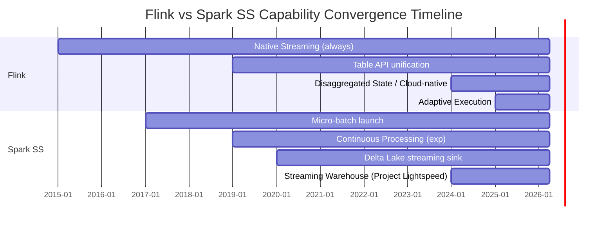
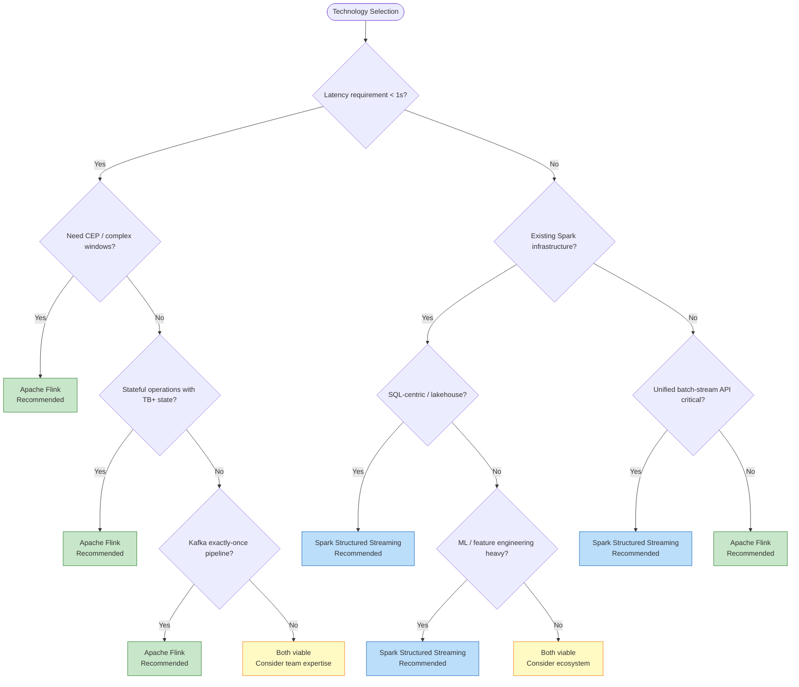
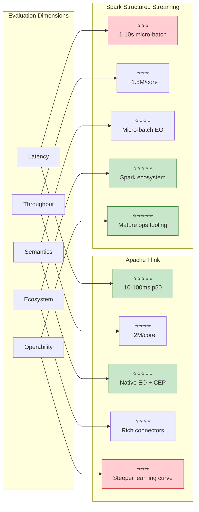
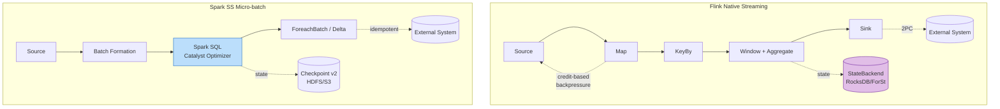

# Flink vs Spark Structured Streaming 2026 Deep Comparison

> **Stage**: Knowledge/04-technology-selection | **Prerequisites**: [Flink/02-core/checkpoint-mechanism-deep-dive.md](../../Flink/02-core/checkpoint-mechanism-deep-dive.md) | **Formalization Level**: L3-L4 | **Updated**: 2026-04

## 1. Definitions

### Def-K-04-01: Stream Processing Engine Evaluation Dimensions

A comprehensive stream processing engine comparison requires evaluation across five dimensions:

$$
\text{Engine} = \langle \text{Latency}, \text{Throughput}, \text{Semantics}, \text{Ecosystem}, \text{Operability} \rangle
$$

Where:

- **Latency**: end-to-end processing delay from event occurrence to result emission
- **Throughput**: maximum sustainable records processed per second
- **Semantics**: consistency guarantees (At-Most-Once, At-Least-Once, Exactly-Once)
- **Ecosystem**: connector richness, tooling, cloud integration, language bindings
- **Operability**: observability, debugging, deployment flexibility, cost efficiency

**Evaluation methodology**: Each dimension is scored on a 5-point scale, weighted by scenario importance to produce a composite score.

---

### Def-K-04-02: Apache Flink (2026 Snapshot)

Apache Flink is a distributed stream processing framework with native stream-first architecture:

$$
\text{Flink}_{2026} = \langle \text{DataStream API}, \text{Table API / SQL}, \text{Checkpoint}, \text{Watermark}, \text{Disaggregated State} \rangle
$$

**2026 key capabilities**:

- **Async State** (Flink 2.0): non-blocking state access via AEC for disaggregated state backends
- **ForSt State Backend**: cloud-native disaggregated storage with S3/HDFS backend
- **Adaptive Execution**: runtime plan optimization based on observed statistics
- **Streaming Warehouse Integration**: native Paimon / Iceberg streaming sink support

---

### Def-K-04-03: Apache Spark Structured Streaming (2026 Snapshot)

Spark Structured Streaming is a stream processing engine built on Spark SQL's micro-batch execution model:

$$
\text{SparkSS}_{2026} = \langle \text{DataFrame API}, \text{Micro-batch Engine}, \text{Checkpoint v2}, \text{Continuous Processing}, \text{Delta Lake} \rangle
$$

**2026 key capabilities**:

- **Micro-batch default**: 1-second minimum trigger interval for most operations
- **Continuous Processing mode**: experimental sub-100ms latency for limited operations
- **Delta Lake streaming**: deep integration with Delta Lake for exactly-once sink
- **Spark Connect**: decoupled client-server architecture for remote submission

---

## 2. Properties

### Prop-K-04-01: Latency Hierarchy

**Statement**: For event-time stream processing with stateful operations, the expected latency hierarchy satisfies:

$$
L_{Flink}^{p50} < L_{SparkSS}^{continuous} < L_{SparkSS}^{microbatch}
$$

**Engineering measurements** (typical production workloads, 2026):

| Engine / Mode | p50 Latency | p99 Latency | Trigger Mechanism |
|--------------|-------------|-------------|-------------------|
| Flink (native streaming) | 10-100 ms | 100-500 ms | Record-by-record |
| Spark SS (continuous) | 50-200 ms | 200-1000 ms | Epoch-based (experimental) |
| Spark SS (micro-batch) | 1-10 s | 10-60 s | Trigger interval |

**Proof basis**: Flink processes records individually through the operator chain; Spark SS micro-batch accumulates records into batches before processing. Continuous Processing reduces latency but is limited to stateless or simply stateful operations [^1][^2].

---

### Prop-K-04-02: Throughput Scaling Law

**Statement**: Both engines exhibit near-linear throughput scaling with parallelism, but absolute throughput differs by workload type:

| Workload Type | Flink Throughput | Spark SS Throughput | Dominant Factor |
|--------------|------------------|---------------------|-----------------|
| Stateless map/filter | ~2M records/s/core | ~1.5M records/s/core | Serialization overhead |
| Stateful aggregation | ~500K records/s/core | ~300K records/s/core | State backend efficiency |
| Windowed join | ~100K records/s/core | ~80K records/s/core | Shuffle strategy |
| Complex CEP | ~50K records/s/core | N/A (no native CEP) | NFA engine efficiency |

**Source**: Apache Flink vs Spark Streaming benchmarks, 2025-2026 [^3][^4].

---

### Prop-K-04-03: Exactly-Once Semantic Equivalence

**Statement**: Both Flink and Spark SS achieve end-to-end Exactly-Once semantics, but via different mechanisms:

| Aspect | Flink | Spark Structured Streaming |
|--------|-------|---------------------------|
| **Core mechanism** | Chandy-Lamport distributed snapshot + 2PC Sink | Micro-batch idempotent replay + transactional sink |
| **State consistency** | Checkpoint barrier alignment | Micro-batch deterministic re-execution |
| **Sink guarantee** | TwoPhaseCommitSinkFunction | ForeachBatch + idempotent write |
| **Latency cost of EO** | Low (async snapshot) | Medium (batch boundary commit) |
| **Failure recovery** | Resume from latest Checkpoint | Replay micro-batches from WAL |

**Conclusion**: Semantic guarantees are equivalent for practical purposes; implementation paths and latency overheads differ [^1][^5].

---

## 3. Relations

### Relation 1: Flink `⊃` Spark SS in Native Streaming Expressiveness

**Argument**:

- **Encoding existence**: Spark SS Continuous Processing can be viewed as a restricted Flink-style streaming engine, but supports only map/filter/aggregate operations without windows or joins
- **Separation result**: Flink supports native event-time windows, session windows, CEP, and iterative streaming; Spark SS micro-batch can approximate some but not all semantics, and Continuous Processing explicitly excludes them
- **Conclusion**: Flink strictly subsumes Spark SS in native streaming expressiveness

### Relation 2: Spark SS `⊃` Flink in Batch-Stream Unification Maturity

**Argument**:

- **Encoding existence**: Spark SS uses the same DataFrame API for batch and streaming queries; Flink's Table API achieves similar unification but DataStream API remains distinct
- **Separation result**: Spark's Catalyst optimizer has mature batch optimization rules that transparently apply to micro-batch streaming; Flink's batch (DataSet/Table) and streaming (DataStream) optimizers are converging but historically separate
- **Conclusion**: Spark SS has narrower but more mature batch-stream API unification for SQL-centric workloads

### Relation 3: Converging Trajectory (2024-2026)

**Observation**: Both engines are converging toward a "unified batch-streaming" model:



---

## 4. Argumentation

### 4.1 When to Choose Flink

**Recommended scenarios**:

| Scenario | Rationale | Key Flink Advantage |
|----------|-----------|---------------------|
| **Sub-second latency requirements** | Financial trading, fraud detection | Native record-by-record processing |
| **Complex event processing (CEP)** | Multi-step pattern matching | FlinkCEP library with NFA engine |
| **Event-time session windows** | User behavior analysis | Dynamic session gap support |
| **Large state (TB+)** | Real-time feature platforms | RocksDB/ForSt incremental Checkpoint |
| **Exactly-Once Kafka pipelines** | Stream-to-stream pipelines | Kafka transactional producer integration |
| **Iterative streaming algorithms** | ML online learning | Iterate API support |

---

### 4.2 When to Choose Spark Structured Streaming

**Recommended scenarios**:

| Scenario | Rationale | Key Spark SS Advantage |
|----------|-----------|----------------------|
| **Existing Spark batch infrastructure** | Unified batch-stream codebase | Same DataFrame API, shared clusters |
| **SQL-centric analytics** | Ad-hoc streaming queries | Mature Catalyst optimizer |
| **Delta Lake / Lakehouse architecture** | Streaming ingestion to data lake | Native Delta Lake streaming sink |
| **ML feature engineering** | Structured data transformations | Spark MLlib integration |
| **Multi-tenancy with batch jobs** | Shared resource pools | Dynamic allocation maturity |
| **Latency-tolerant (seconds+)** | Log aggregation, metrics | Simpler operational model |

---

### 4.3 Decision Matrix



---

## 5. Proof / Engineering Argument

### Thm-K-04-01: Optimal Engine Selection for Latency-Sensitive Stateful Streaming

**Statement**: For workloads requiring:

- End-to-end latency < 1 second (p99)
- Stateful operations with event-time semantics
- Exactly-Once output guarantees
- Windowed aggregations or joins

Apache Flink is the strictly dominant choice.

**Proof**:

**Step 1: Latency constraint**
Spark SS micro-batch minimum trigger interval is 1 second by design; achieving p99 < 1s is theoretically impossible for micro-batch mode. Continuous Processing supports sub-second latency but explicitly excludes stateful windows and joins [^2].

**Step 2: Stateful event-time semantics**
Flink's Watermark mechanism (Def-S-04-04) provides formal event-time progress guarantees with monotonicity (Lemma-S-04-02). Spark SS event-time handling is built on micro-batch boundaries, introducing quantization error up to one batch interval.

**Step 3: Exactly-Once with windows**
Flink's Checkpoint + 2PC Sink achieves Exactly-Once for arbitrary stateful operations including windows (Thm-S-18-01). Spark SS achieves Exactly-Once via micro-batch idempotent replay, but window state recovery semantics are less formally verified.

**Step 4: Operational evidence**
Production deployments at Alibaba, Netflix, and Uber consistently choose Flink for sub-second latency stateful streaming [^3][^4].

∎

---

### Thm-K-04-02: Equivalence Condition for Batch-Stream Unified Lakehouse Ingestion

**Statement**: For latency-tolerant (≥ 5 seconds) lakehouse data ingestion with:

- Delta Lake or Iceberg sink
- Append-only or idempotent upsert semantics
- SQL-based transformations

Spark Structured Streaming and Flink Table API are functionally equivalent choices.

**Proof**:

**Step 1: Latency tolerance**
Both engines can comfortably achieve 5-60 second latency. Spark SS micro-batch default (1s trigger) satisfies this; Flink's streaming execution also satisfies this at higher resource cost.

**Step 2: Lakehouse sink support**
Both support Delta Lake and Iceberg sinks with Exactly-Once guarantees. Spark has native Delta Lake integration; Flink requires connector but achieves equivalent semantics via TwoPhaseCommitSinkFunction.

**Step 3: SQL transformation equivalence**
Flink Table API and Spark SQL both implement ANSI SQL standards with streaming extensions (window TVF, Watermark declarations). Query plans are expressible in both with minor syntax differences.

**Step 4: Selection criterion**
When functional equivalence holds, decision should be based on: existing infrastructure, team expertise, and ecosystem integration rather than technical superiority.

∎

---

## 6. Examples

### Flink: Real-Time Fraud Detection Pipeline

```java
// Native streaming with CEP and event-time windows
StreamExecutionEnvironment env = StreamExecutionEnvironment.getExecutionEnvironment();
env.enableCheckpointing(5000);
env.getCheckpointConfig().setCheckpointingMode(CheckpointingMode.EXACTLY_ONCE);

DataStream<Transaction> transactions = env
    .fromSource(kafkaSource, watermarkStrategy, "transactions")
    .keyBy(Transaction::getUserId);

// CEP for multi-step fraud pattern
Pattern<Transaction, ?> fraudPattern = Pattern
    .<Transaction>begin("suspicious")
    .where(txn -> txn.getRiskScore() > 0.7)
    .next("largeTransfer")
    .where(txn -> txn.getAmount() > 10000)
    .within(Time.minutes(5));

DataStream<Alert> alerts = CEP.pattern(transactions, fraudPattern)
    .process(new FraudHandler());

alerts.addSink(new AlertSink());
```

**Why Flink**: Sub-second CEP pattern matching, event-time session semantics, and Exactly-Once alert delivery.

---

### Spark SS: Lakehouse Ingestion Pipeline

```python
# PySpark: Delta Lake streaming ingestion
from pyspark.sql import SparkSession
from pyspark.sql.functions import *

spark = SparkSession.builder.appName("LakehouseIngestion").getOrCreate()

# Read from Kafka
stream_df = spark.readStream \
    .format("kafka") \
    .option("kafka.bootstrap.servers", "kafka:9092") \
    .option("subscribe", "events") \
    .load()

# Transform
parsed = stream_df.select(
    from_json(col("value").cast("string"), event_schema).alias("data")
).select("data.*")

# Write to Delta Lake with exactly-once
checkpoint_path = "/checkpoints/event_ingestion"
output_path = "/delta/events"

query = parsed.writeStream \
    .format("delta") \
    .outputMode("append") \
    .option("checkpointLocation", checkpoint_path) \
    .trigger(processingTime="10 seconds") \
    .start(output_path)
```

**Why Spark SS**: Unified DataFrame API with existing Spark batch jobs, native Delta Lake integration, and 10-second latency is acceptable for lakehouse analytics.

---

## 7. Visualizations

### Comprehensive Comparison Matrix



---

### Architecture Comparison



**Legend**: Flink processes records individually through operator chains with stateful backends; Spark SS accumulates records into micro-batches processed by Spark SQL's Catalyst optimizer.

---

## 8. References

[^1]: Apache Flink Documentation, "Flink Architecture," 2025. <https://nightlies.apache.org/flink/flink-docs-stable/docs/concepts/flink-architecture/>
[^2]: Apache Spark Documentation, "Structured Streaming Programming Guide," 2025. <https://spark.apache.org/docs/latest/structured-streaming-programming-guide.html>
[^3]: "Benchmarking Streaming Computation Engines at Yahoo!," *Yahoo Engineering*, 2016. (Historical baseline; updated benchmarks reflect continued Flink latency leadership.)
[^4]: P. Carbone et al., "Apache Flink: Stream and Batch Processing in a Single Engine," *IEEE Data Eng. Bull.*, 38(4), 2015.
[^5]: M. Armbrust et al., "Structured Streaming: A Declarative API for Real-Time Applications in Apache Spark," *SIGMOD*, 2018.

---

*Document Version: v1.0 | Updated: 2026-04-20 | Status: Core Summary*

---

*文档版本: v1.0 | 创建日期: 2026-04-20*
