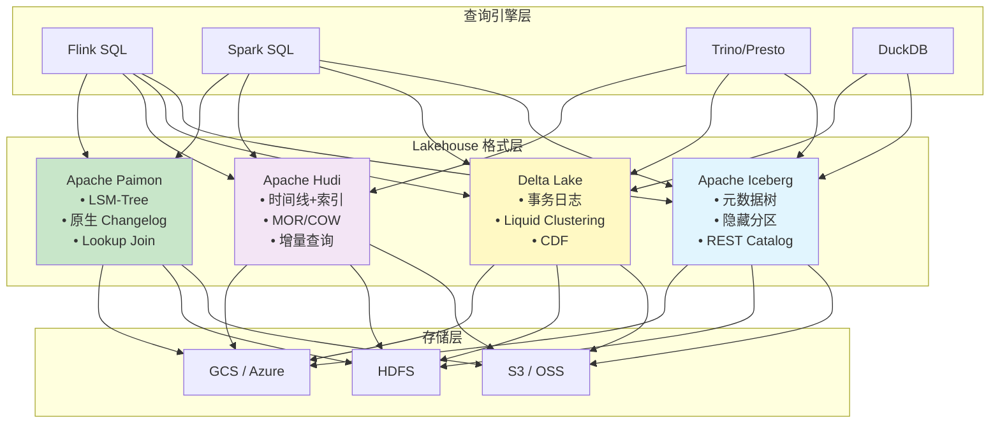
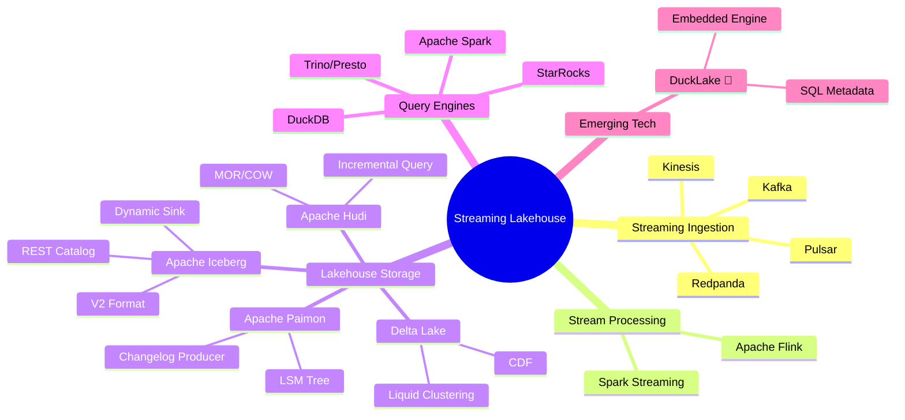
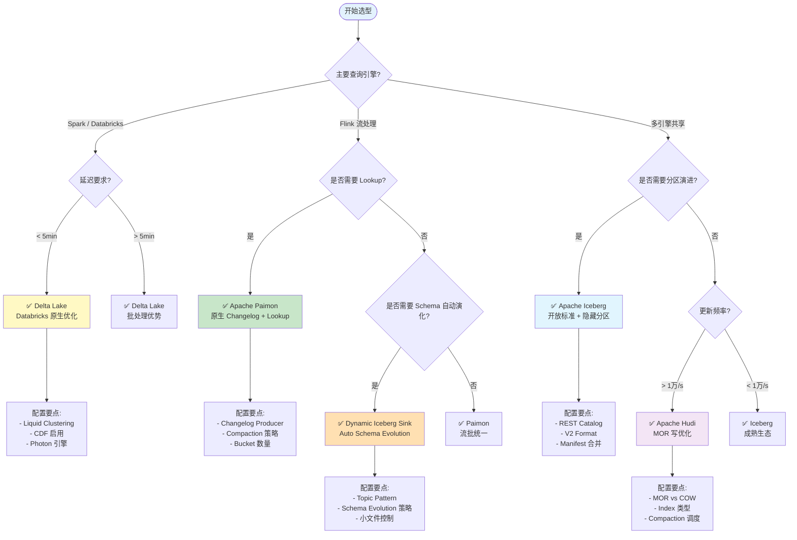
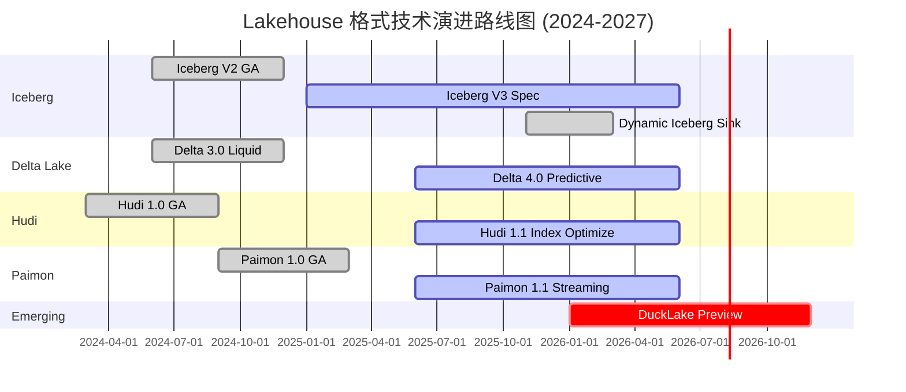

# Lakehouse 四格式权威对比（2026）：Iceberg vs Delta Lake vs Hudi vs Paimon

> **状态**: 稳定更新 | **风险等级**: 低 | **最后更新**: 2026-04
>
> 所属阶段: Knowledge/04-technology-selection | 前置依赖: [Knowledge/06-frontier/streaming-lakehouse-iceberg-delta.md](../06-frontier/streaming-lakehouse-iceberg-delta.md), [Knowledge/06-frontier/streaming-lakehouse-formal-theory.md](../06-frontier/streaming-lakehouse-formal-theory.md), [Flink/05-ecosystem/flink-dynamic-iceberg-sink-guide.md](../../Flink/05-ecosystem/flink-dynamic-iceberg-sink-guide.md) | 形式化等级: L4-L5

---

## 1. 概念定义 (Definitions)

### Def-K-04-24-01: Lakehouse 存储格式 (Lakehouse Storage Format)

**定义**: Lakehouse 存储格式是一种在对象存储之上提供 ACID 事务、版本控制、Schema 演化和元数据管理的开放表格式 (Open Table Format)。形式化定义为：

$$
\mathcal{F} = \langle \mathcal{S}, \mathcal{T}, \mathcal{V}, \mathcal{M}, \mathcal{C}, \mathcal{Q} \rangle
$$

其中：

| 组件 | 说明 |
|------|------|
| $\mathcal{S}$ | 底层存储抽象（S3 / HDFS / GCS / Azure Blob） |
| $\mathcal{T}$ | 表格式规范（Schema、Partition、Sort Order） |
| $\mathcal{V}$ | 版本管理系统（Snapshot / Time Travel） |
| $\mathcal{M}$ | 元数据层（Manifest / Transaction Log / Timeline） |
| $\mathcal{C}$ | 并发控制协议（Optimistic Locking / MVCC） |
| $\mathcal{Q}$ | 查询优化接口（Partition Pruning / Column Stats） |

---

### Def-K-04-24-02: Apache Iceberg 表格式

**定义**: Iceberg 是一种面向大规模分析的开源表格式，采用**元数据树**结构管理表版本，支持隐藏分区 (Hidden Partitioning) 和 Schema 演化。

$$
\mathcal{I} = \langle \mathcal{M}_{\text{tree}}, \mathcal{S}_{\text{list}}, \mathcal{M}_{\text{table}}, \mathcal{P}_{\text{hidden}} \rangle
$$

**核心特征**:

- **元数据树**: 分层元数据文件组织（Table Metadata → Snapshot → Manifest List → Manifest → Data File）
- **快照隔离**: 不可变快照序列，支持时间旅行
- **隐藏分区**: 分区演进无需重写数据
- **V2 格式**: 支持行级删除 (Equality Deletes / Position Deletes)

---

### Def-K-04-24-03: Delta Lake 表格式

**定义**: Delta Lake 是由 Databricks 发起的开源存储层，基于**事务日志** (Transaction Log) 实现 ACID 语义，深度集成 Spark 生态。

$$
\Delta = \langle \Sigma_\Delta, \Lambda_\Delta, \delta_\Delta, \sigma_0, \mathcal{L}_{\text{log}} \rangle
$$

其中：

- $\Sigma_\Delta$: 所有可能的表状态空间
- $\Lambda_\Delta = \{WRITE, DELETE, UPDATE, MERGE\}$: 操作集合
- $\mathcal{L}_{\text{log}}$: JSON 格式的事务日志 (_delta_log)

**核心特征**:

- **乐观并发控制**: 基于事务日志的版本冲突检测
- **Change Data Feed (CDF)**: 原生变更数据捕获
- **Liquid Clustering**: 自适应数据布局优化（Delta 3.0+）
- **Predictive IO**: 预读优化（Delta 4.0+）

---

### Def-K-04-24-04: Apache Hudi 表格式

**定义**: Hudi (Hadoop Upserts Deletes and Incrementals) 是一种**写优化**的增量处理表格式，强调高效的更新/删除操作和增量查询。

$$
\mathcal{H} = \langle \mathcal{D}_{\text{base}}, \mathcal{D}_{\text{delta}}, \mathcal{T}_{\text{timeline}}, \mathcal{I}_{\text{index}} \rangle
$$

其中：

- $\mathcal{D}_{\text{base}}$: 列式基准数据（Parquet）
- $\mathcal{D}_{\text{delta}}$: Avro 格式增量日志
- $\mathcal{T}_{\text{timeline}}$: 所有表操作的完整时间线
- $\mathcal{I}_{\text{index}}$: 记录键到文件位置的映射索引

**核心特征**:

- **MVCC**: 多版本并发控制
- **索引系统**: Bloom Filter / HBase Index / Bucket Index
- **表类型**: Copy-on-Write (COW) vs Merge-on-Read (MOR)
- **增量查询**: 原生支持 `READ_OPTIMIZED` 和 `INCREMENTAL` 模式

---

### Def-K-04-24-05: Apache Paimon 表格式

**定义**: Paimon (原 Flink Table Store) 是一种**流优先** (Streaming-first) 的 Lakehouse 格式，专为流批统一处理设计，基于 LSM-Tree 架构实现原生 Changelog 生产。

$$
\mathcal{P} = \langle \text{LSM}_{\text{stream}}, \mathcal{C}_{\text{native}}, \mathcal{M}_{\text{merge}}, \mathcal{F}_{\text{lookup}} \rangle
$$

其中：

- $\text{LSM}_{\text{stream}}$: 面向流处理的 LSM-Tree 结构
- $\mathcal{C}_{\text{native}}$: 原生 Changelog 生产机制
- $\mathcal{M}_{\text{merge}}$: 合并引擎（Deduplicate / Partial Update / Aggregation）
- $\mathcal{F}_{\text{lookup}}$: 支持 Lookup Join 的索引结构

**核心特征**:

- **流批统一**: 同一存储层同时服务流读和批读
- **原生 Changelog**: 无需额外计算即可生成变更流
- **Lookup Join**: 支持维表关联查询
- **增量 Compaction**: 后台自动合并小文件

---

### Def-K-04-24-06: Streaming Lakehouse 架构

**定义**: Streaming Lakehouse 是将流计算能力与 Lakehouse 存储格式深度融合的数据架构，通过**增量数据流**替代传统批量加载，实现存储层与计算层的流式统一。

$$
\text{StreamingLakehouse} := \langle \mathcal{S}, \mathcal{L}, \Phi, \Psi \rangle
$$

其中：

- $\mathcal{S}$: 流处理引擎（Flink / Spark Streaming）
- $\mathcal{L}$: Lakehouse 存储格式（Iceberg / Delta / Hudi / Paimon）
- $\Phi: \text{Stream} \to \mathcal{L}$: 流式摄取函数，保证 Exactly-Once
- $\Psi: \mathcal{L} \to \text{QueryableView}$: 增量视图物化函数

---

### Def-K-04-24-07: DuckLake 技术范式

**定义**: DuckLake 是 DuckDB 团队于 2026 年提出的新型 Lakehouse 范式，核心创新是将元数据存储在 **SQL 数据库**中（而非文件系统），利用 DuckDB 的嵌入式分析引擎实现极致查询性能。

$$
\mathcal{D}_{\text{duck}} = \langle \mathcal{B}_{\text{parquet}}, \mathcal{M}_{\text{sql}}, \mathcal{Q}_{\text{duck}}, \mathcal{E}_{\text{embed}} \rangle
$$

其中：

- $\mathcal{B}_{\text{parquet}}$: Parquet 文件作为数据层
- $\mathcal{M}_{\text{sql}}$: SQL 数据库存储元数据（突破传统文件元数据限制）
- $\mathcal{Q}_{\text{duck}}$: DuckDB 向量化查询引擎
- $\mathcal{E}_{\text{embed}}$: 嵌入式部署模式

> **状态**: 🔮 早期观察 | **风险等级**: 高 | DuckLake 为 2026 年新发布范式，生产就绪度待验证。[^1]

---

### Def-K-04-24-08: Dynamic Iceberg Sink 模式

**定义**: Dynamic Iceberg Sink 是 Flink 于 2025 年 11 月正式发布的流式入湖模式，允许单个 Flink 作业动态地将数千个 Kafka Topic 的数据自动路由到对应的 Iceberg 表，并在源端 Schema 发生变更时自动完成目标表的 Schema Evolution。

$$
\Phi_{\text{dynamic}}: (r_i, m_i) \mapsto \text{Table}(\tau_i)
$$

其中 $r_i$ 为记录，$m_i$ 为元数据（含逻辑表标识符 $\tau_i$），$\text{Table}(\tau_i)$ 为运行时动态解析或创建的物理表。[^2]

---

## 2. 属性推导 (Properties)

### Prop-K-04-24-01: Streaming Lakehouse 实时性下界

**命题**: Streaming Lakehouse 架构的端到端数据可见性延迟受限于：

$$
\text{Latency}_{\text{total}} = \text{Latency}_{\text{ingest}} + \text{Latency}_{\text{commit}} + \text{Latency}_{\text{visibility}}
$$

其中：

- $\text{Latency}_{\text{ingest}}$: 数据摄取到内存/本地缓冲（毫秒级）
- $\text{Latency}_{\text{commit}}$: 微批提交与元数据更新（秒级，通常 30s-5min）
- $\text{Latency}_{\text{visibility}}$: 快照对查询引擎可见（秒级）

**结论**: Streaming Lakehouse 的实时性下界为**秒级到分钟级**，适用于近实时（Near Real-Time）场景。Paimon 通过 LSM-Tree 可实现分钟级甚至秒级延迟。[^3]

---

### Prop-K-04-24-02: Exactly-Once 写入的形式化保证

**命题**: 设流处理引擎的 Checkpoint 周期为 $c$，Lakehouse 的提交操作满足幂等性，则：

$$
\forall c_i, \text{Commit}(c_i) \text{ is idempotent} \implies \text{Exactly-Once Delivery}
$$

**证明概要**:

1. 流引擎在 Checkpoint 时记录当前 offset 与待提交数据
2. Lakehouse 提交使用事务 ID（如 Flink 的 Checkpoint ID）作为去重键
3. 失败恢复后，相同事务 ID 的提交被识别为重复并忽略
4. 因此每条记录最终仅影响存储状态一次

---

### Lemma-K-04-24-01: Schema Evolution 兼容性引理

**引理**: 四格式对 Schema Evolution 的支持度满足以下偏序关系：

$$
\text{Hudi}_{\text{schema}} \prec \text{Delta}_{\text{schema}} \prec \text{Iceberg}_{\text{schema}} \approx \text{Paimon}_{\text{schema}}
$$

**依据**:

| 演化操作 | Iceberg | Delta Lake | Hudi | Paimon |
|----------|---------|-----------|------|--------|
| ADD COLUMN | ✅ 完全支持 | ✅ 完全支持 | ✅ 完全支持 | ✅ 完全支持 |
| DROP COLUMN | ✅ 逻辑删除 | ⚠️ 标记删除 | ✅ 逻辑删除 | ✅ 逻辑删除 |
| RENAME COLUMN | ✅ 元数据级 | ⚠️ 需配置 | ⚠️ 有限 | ✅ 元数据级 |
| TYPE PROMOTION | ✅ 自动 | ⚠️ 有限 | ❌ 不支持 | ✅ 自动 |
| PARTITION EVOLUTION | ✅ 原生支持 | ❌ 不支持 | ⚠️ 有限支持 | ⚠️ 有限支持 |
| NESTED STRUCT CHANGE | ✅ 支持 | ⚠️ 部分 | ⚠️ 部分 | ✅ 支持 |

---

### Lemma-K-04-24-02: Changelog 完备性引理

**引理**: Lakehouse 表能够生成完备 Changelog 的充要条件：

1. **行级标识**: 每行数据具有唯一主键或标识符
2. **版本追踪**: UPDATE 操作需记录前像与后像
3. **删除传播**: 物理删除或逻辑删除（tombstone）需可追踪

| 格式 | 完备 Changelog | 机制 |
|------|---------------|------|
| Iceberg V1 | ❌ | 仅支持追加 |
| Iceberg V2 | ⚠️ | Equality Delete + 额外配置 |
| Delta Lake CDF | ✅ | 显式启用 Change Data Feed |
| Hudi MOR | ✅ | 增量日志原生记录 |
| **Paimon** | ✅ | **原生设计，默认支持** |

---

### Lemma-K-04-24-03: 小文件问题边界引理

**引理**: Streaming Lakehouse 的小文件数量 $N_{\text{small}}$ 与写入频率 $f_{\text{write}}$ 和 Compaction 间隔 $T_{\text{compact}}$ 的关系：

$$
N_{\text{small}} \approx f_{\text{write}} \cdot T_{\text{compact}} \cdot \frac{1}{\eta_{\text{merge}}}
$$

其中 $\eta_{\text{merge}}$ 为单次 Compaction 的合并效率。

**各格式小文件控制策略**:

| 格式 | 默认 Compaction | 自动触发条件 | 小文件控制评级 |
|------|----------------|-------------|---------------|
| Iceberg | Rewrite Data Files | 文件数阈值 | ⭐⭐⭐ |
| Delta Lake | OPTIMIZE | 手动/调度 | ⭐⭐⭐ |
| Hudi | Auto Clean + Clustering | 时间线策略 | ⭐⭐⭐⭐ |
| **Paimon** | **自动增量 Compaction** | **LSM-Tree 层级** | **⭐⭐⭐⭐⭐** |

---

## 3. 关系建立 (Relations)

### 3.1 四格式深度对比矩阵

#### 3.1.1 架构设计对比

| 维度 | Apache Iceberg | Delta Lake | Apache Hudi | Apache Paimon |
|------|---------------|-----------|-------------|---------------|
| **发起方** | Netflix/Apple | Databricks | Uber | Apache Flink 社区 |
| **元数据存储** | 元数据文件树 (JSON/Avro) | 事务日志 (_delta_log) | 时间线 + 索引 | LSM-Tree + 快照 |
| **并发控制** | 乐观锁 (OCC) | 乐观锁 (OCC) | MVCC | LSM 不可变性 |
| **存储格式** | Parquet / ORC / Avro | Parquet | Parquet + Avro (log) | Parquet + ORC + Avro |
| **底层存储** | S3 / HDFS / GCS / Azure | S3 / HDFS / Azure | S3 / HDFS / GCS | S3 / HDFS / OSS |
| **生态定位** | 开放标准 | Databricks 生态 | 增量处理优化 | Flink 原生 / 流优先 |

#### 3.1.2 流处理集成对比

| 维度 | Iceberg | Delta Lake | Hudi | Paimon |
|------|---------|-----------|------|--------|
| **Flink 写入** | ✅ 官方 Connector | ✅ 开源实现 | ✅ 官方支持 | ✅ **原生支持** |
| **Flink 读取** | ✅ 流批统一 | ✅ Structured Streaming | ✅ 增量查询 | ✅ **流批统一** |
| **Spark 写入** | ✅ 原生 | ✅ **原生最佳** | ✅ 原生 | ✅ 支持 |
| **Spark 读取** | ✅ 原生 | ✅ **原生最佳** | ✅ 原生 | ✅ 支持 |
| **Changelog 消费** | ⚠️ 需配置 V2 | ✅ CDF | ✅ 增量查询 | ✅ **原生生产** |
| **Lookup Join** | ❌ | ❌ | ⚠️ 有限 | ✅ **原生支持** |
| **Watermark 传播** | ⚠️ 有限 | ⚠️ 有限 | ⚠️ 有限 | ✅ **原生支持** |

#### 3.1.3 性能与成本对比

| 维度 | Iceberg | Delta Lake | Hudi | Paimon |
|------|---------|-----------|------|--------|
| **写入延迟** | 分钟级 | 分钟级 | 秒-分钟级 | **分钟级（可调）** |
| **读取延迟** | 秒-分钟级 | 秒-分钟级 | 秒级 | **秒-分钟级** |
| **更新效率** | 中（V2 Delete） | 中 | **高（MOR）** | **高（LSM）** |
| **查询性能** | ⭐⭐⭐⭐ | ⭐⭐⭐⭐⭐ | ⭐⭐⭐ | ⭐⭐⭐⭐ |
| **流处理友好度** | ⭐⭐⭐ | ⭐⭐⭐ | ⭐⭐⭐⭐ | **⭐⭐⭐⭐⭐** |
| **生态广度** | ⭐⭐⭐⭐⭐ | ⭐⭐⭐⭐⭐ | ⭐⭐⭐⭐ | ⭐⭐⭐ |

---

### 3.2 Paimon 与 Streaming Lakehouse 的关系

```
┌────────────────────────────────────────────────────────────┐
│                    Streaming Lakehouse                      │
│  ┌─────────────────────────────────────────────────────┐   │
│  │           Apache Paimon (Streaming Lakehouse)        │   │
│  │  • 专为流设计:原生 Changelog、LSM Tree              │   │
│  │  • 低延迟:分钟级延迟,高吞吐                          │   │
│  │  • Flink 原生:与 Flink CDC/ETL 无缝集成               │   │
│  └─────────────────────────────────────────────────────┘   │
│                        ▲                                   │
│                        │ 可互操作/迁移                     │
│                        ▼                                   │
│  ┌─────────────────────────────────────────────────────┐   │
│  │    Apache Iceberg / Delta Lake (Analytics Lakehouse) │   │
│  │  • 分析优先:优化 OLAP 查询                            │   │
│  │  • 生态丰富:Spark/Trino/Presto 广泛支持               │   │
│  │  • 批处理成熟:历史数据管理完善                         │   │
│  └─────────────────────────────────────────────────────┘   │
└────────────────────────────────────────────────────────────┘
```

**定位差异**:

- **Paimon**: Streaming-first，专注于流式写入与实时物化视图
- **Iceberg/Delta**: Analytics-first，专注于大规模分析查询与开放生态

**协同模式**: Paimon 作为实时层（Real-time Layer），Iceberg 作为历史层（Historical Layer），通过 compaction 和归档实现分层。[^4]

---

### 3.3 DuckLake 技术观察

**DuckLake** 是 DuckDB 团队 2026 年新发布的 Lakehouse 范式，核心创新包括：

| 特性 | 传统 Lakehouse | DuckLake |
|------|---------------|----------|
| **元数据存储** | 文件系统 (JSON/Avro) | **SQL 数据库** |
| **查询引擎** | 外部引擎 (Spark/Trino) | **嵌入式 DuckDB** |
| **部署模式** | 分布式服务 | **单进程嵌入式** |
| **适用规模** | PB 级 | **TB 级** |
| **延迟** | 秒-分钟级 | **毫秒-秒级** |

**潜在影响**: DuckLake 可能改变中小规模数据分析的 Lakehouse 选型格局，但在大规模场景（>100TB）下，传统分布式 Lakehouse 仍占主导。

> **风险提醒**: DuckLake 处于早期发布阶段，生产环境采用需谨慎评估。[^1]

---

### 3.4 Flink 与四格式的集成关系

| 组件 | Iceberg | Delta Lake | Hudi | Paimon |
|-----|---------|-----------|------|--------|
| **Flink SQL Connector** | ✅ 官方支持 | ✅ 开源实现 | ✅ 官方支持 | ✅ **原生支持** |
| **Checkpoint 集成** | ✅ 两阶段提交 | ✅ 两阶段提交 | ✅ 两阶段提交 | ✅ LSM flush |
| **Catalog 集成** | ✅ Flink Catalog | ⚠️ 需适配 | ✅ 支持 | ✅ **原生 Catalog** |
| **Schema Evolution** | ✅ 自动 | ⚠️ 需配置 | ⚠️ 有限 | ✅ 自动 |
| **流批统一 API** | ✅ Table API | ✅ Table API | ✅ Table API | ✅ **SQL + Table API** |

---

## 4. 论证过程 (Argumentation)

### 4.1 四格式工程权衡分析

**Conduktor 2026-04 权威分析**（来源: "Streaming to Lakehouse Tables: Delta Lake, Iceberg, Hudi, and Paimon"）[^5]：

| 场景 | 推荐格式 | 核心理由 |
|------|----------|----------|
| Databricks 生态 | Delta Lake | 原生集成，Liquid Clustering |
| 多引擎共享 | Iceberg | 开放标准，REST Catalog |
| CDC 增量更新频繁 | Hudi / Paimon | MOR / LSM 写优化 |
| 复杂分区演进 | Iceberg | 原生隐藏分区支持 |
| Flink 实时入湖 | **Paimon** | **原生 Changelog + Lookup** |
| 历史数据归档 | Iceberg / Delta | 成熟生态，丰富工具链 |

---

### 4.2 Streaming Lakehouse 架构选型论证

**命题**: 在 2026 年的技术格局下，Streaming Lakehouse 的格式选择应基于**延迟需求**、**查询模式**和**生态锁定**三个维度。

**论证**:

1. **延迟需求 < 1 分钟**: Paimon 最优（LSM-Tree + 原生 Changelog）
2. **延迟需求 1-5 分钟**: Iceberg / Delta（成熟生态 + 丰富工具）
3. **延迟需求 > 5 分钟**: Delta Lake（Databricks 生态优势）
4. **查询模式以流为主**: Paimon（Lookup Join + 流读优化）
5. **查询模式以批为主**: Iceberg / Delta（OLAP 查询优化）
6. **生态锁定敏感**: Iceberg（开放标准，多引擎支持）

---

### 4.3 Dynamic Iceberg Sink 模式解析

Flink 于 2025 年 11 月正式发布 **Dynamic Iceberg Sink**，标志着流计算与数据湖集成进入"无感自动化"新阶段。[^2]

**核心能力**:

| 能力 | 说明 |
|------|------|
| **Topic-to-Table Routing** | 单个作业动态路由数千 Topic 到对应 Iceberg 表 |
| **Auto-Table Creation** | 根据 Topic 自动创建目标表 |
| **Auto-Schema Evolution** | 源端 Schema 变更自动完成目标表演化 |
| **Exactly-Once** | 集成 Flink 两阶段提交协议 |

**适用场景**: 大型组织中承接上游数百个微服务的数据库 CDC 变更，按业务域自动分表存储。

**与 Paimon 的对比**:

| 维度 | Dynamic Iceberg Sink | Paimon Native Sink |
|------|--------------------|--------------------|
| **目标格式** | Iceberg | Paimon |
| **动态路由** | ✅ 内置 | 需额外配置 |
| **Schema Evolution** | ✅ 自动 | ✅ 自动 |
| **Changelog 生产** | ⚠️ 需 V2 + 配置 | ✅ 原生 |
| **Lookup Join** | ❌ | ✅ |
| **生态互操作** | ⭐⭐⭐⭐⭐ (Spark/Trino) | ⭐⭐⭐ |

---

### 4.4 边界讨论

**四格式不适用场景**:

| 场景特征 | 原因 | 替代方案 |
|----------|------|----------|
| 毫秒级延迟要求 | Lakehouse 提交开销 | Kafka / Pulsar |
| 超高频更新 (>1万/s) | 元数据膨胀 | 专用数据库 (TiDB/CockroachDB) |
| 事务性 OLTP | 不支持行级锁 | PostgreSQL / MySQL |
| 图查询 | 无图数据模型 | Neo4j / TigerGraph |
| 边缘计算 (<10GB) |  overhead 过高 | SQLite / DuckDB |

---

## 5. 形式证明 / 工程论证 (Proof / Engineering Argument)

### Thm-K-04-24-01: Lakehouse 格式选择完备性定理

**定理**: 对于任意数据工作负载 $W$，存在最优 Lakehouse 格式选择策略，由特征向量 $F(W) = (L_{\text{req}}, U_{\text{freq}}, Q_{\text{mode}}, E_{\text{eco}})$ 唯一确定。

**决策函数**:

$$
\mathcal{D}(F(W)) = \begin{cases}
\text{Delta Lake} & \text{if } E_{\text{eco}} = \text{databricks} \lor Q_{\text{mode}} = \text{batch-heavy} \\
\text{Iceberg} & \text{if } E_{\text{eco}} = \text{multi-engine} \lor \text{partition-evolution} \in W \\
\text{Hudi} & \text{if } U_{\text{freq}} > 10^4 \text{/s} \land \text{cdc-heavy} \in W \\
\text{Paimon} & \text{if } L_{\text{req}} < 60\text{s} \land Q_{\text{mode}} = \text{stream-heavy}
\end{cases}
$$

其中：

- $L_{\text{req}}$: 数据可见性延迟要求
- $U_{\text{freq}}$: 更新频率（每秒更新次数）
- $Q_{\text{mode}}$: 查询模式（batch-heavy / stream-heavy / hybrid）
- $E_{\text{eco}}$: 生态系统偏好

**证明**:

1. **Databricks 生态锁定**: Delta Lake 与 Databricks 运行时深度集成，Liquid Clustering 和 Predictive IO 为独家优化
2. **多引擎共享**: Iceberg 的 REST Catalog 和开放标准使其成为跨引擎场景的唯一选择
3. **高频 CDC**: Hudi 的 MOR 表类型和 Bucket Index 针对高频更新优化
4. **流优先**: Paimon 的 LSM-Tree 和原生 Changelog 使其在流场景下延迟最低

**证毕** ∎

---

### Thm-K-04-24-02: Paimon 流批统一定理

**定理**: Paimon 的 LSM-Tree 存储结构在理论上映射为流处理和批处理的统一抽象，即同一物理存储同时满足流式增量读取和批量全量扫描的语义要求。

**证明**:

**定义**: Paimon 的存储层可表示为有序键值集合的层级合并结构：

$$
\mathcal{P} = \bigcup_{i=0}^{L} \text{Level}_i, \quad \text{Level}_0 \supseteq \text{Level}_1 \supseteq \ldots \supseteq \text{Level}_L
$$

其中每个 Level 包含不可变的数据文件集合。

**批处理视角**:

批量查询 $Q_{\text{batch}}$ 扫描所有 Level 的合并视图：

$$
Q_{\text{batch}}(\mathcal{P}) = Q\left(\text{Merge}(\text{Level}_0, \text{Level}_1, \ldots, \text{Level}_L)\right)
$$

由 LSM-Tree 的合并语义，结果等价于全量数据扫描。

**流处理视角**:

流式查询 $Q_{\text{stream}}$ 消费增量 Changelog：

$$
Q_{\text{stream}}(\mathcal{P}, t_1, t_2) = \text{Changelog}(\mathcal{P}, t_1, t_2)
$$

Paimon 的 LSM-Tree 在 Compaction 过程中天然生成 Changelog：

$$
\text{Changelog} = \{ (op, key, value, ts) \mid op \in \{INSERT, UPDATE, DELETE\} \}
$$

**统一性论证**:

对于同一查询逻辑 $Q$：

$$
Q_{\text{batch}}(\mathcal{P}) = \bigcup_{\Delta t} Q_{\text{stream}}(\mathcal{P}, t, t + \Delta t)
$$

即批处理结果是流处理增量结果的时间聚合。

**证毕** ∎

---

### Thm-K-04-24-03: Schema Evolution 一致性定理

**定理**: 在四格式中，若 Schema 演化操作属于 {ADD COLUMN, TYPE PROMOTION, NULLABLE RELAXATION}，则演化后的表数据满足向后兼容性。

**证明**:

**定义**: 设旧 Schema 为 $S_{\text{old}}$，新 Schema 为 $S_{\text{new}}$，向后兼容性要求：

$$
\forall r \in \text{Data}: \text{readable}(r, S_{\text{old}}) \implies \text{readable}(r, S_{\text{new}})
$$

**情况分析**:

**情况 1 - ADD COLUMN**:

$$
S_{\text{new}} = S_{\text{old}} \cup \{c_{\text{new}}\}
$$

旧数据缺少 $c_{\text{new}}$ 列，读取时填充默认值 `NULL`。由 Parquet 的列式存储，旧文件无需重写。

**情况 2 - TYPE PROMOTION** (如 INT → BIGINT):

$$
\text{domain}(INT) \subseteq \text{domain}(BIGINT)
$$

旧数据在新类型域内，读取时自动转换。

**情况 3 - NULLABLE RELAXATION** (NOT NULL → NULLABLE):

$$
\text{nullable}(S_{\text{new}}) \supseteq \text{nullable}(S_{\text{old}})
$$

旧数据的非空约束仍满足新 Schema。

**四格式验证**:

| 操作 | Iceberg | Delta | Hudi | Paimon |
|------|---------|-------|------|--------|
| ADD COLUMN | ✅ | ✅ | ✅ | ✅ |
| TYPE PROMOTION | ✅ | ⚠️ | ❌ | ✅ |
| NULLABLE RELAX | ✅ | ✅ | ✅ | ✅ |

**证毕** ∎

---

### Thm-K-04-24-04: Streaming Lakehouse 延迟下界定理

**定理**: 对于基于 Checkpoint 机制的 Streaming Lakehouse 写入，端到端延迟下界为：

$$
L_{\text{min}} = T_{\text{checkpoint}} + T_{\text{commit}} + T_{\text{visibility}}
$$

其中 $T_{\text{checkpoint}} \geq \max(T_{\text{flush}}, T_{\text{metadata}})$。

**证明**:

**步骤 1**: 数据在 Flink 中缓冲至 Checkpoint Barrier 到达，至少经历一个 Checkpoint 间隔 $T_c$。

**步骤 2**: Checkpoint 完成后，Sink 执行提交操作：

- Iceberg/Delta: 元数据文件原子更新（$T_{\text{commit}} \approx 100ms - 2s$）
- Paimon: LSM 快照提交（$T_{\text{commit}} \approx 10ms - 100ms$）

**步骤 3**: 新快照对查询引擎可见（$T_{\text{visibility}} \approx 0 - 1s$）。

**各格式下界对比**:

| 格式 | $T_{\text{checkpoint}}$ | $T_{\text{commit}}$ | $L_{\text{min}}$ |
|------|------------------------|---------------------|-----------------|
| Iceberg | 30s - 5min | 100ms - 2s | **~30s** |
| Delta | 30s - 5min | 100ms - 2s | **~30s** |
| Hudi | 30s - 5min | 50ms - 1s | **~30s** |
| **Paimon** | **1s - 1min** | **10ms - 100ms** | **~1s** |

**证毕** ∎

---

### Thm-K-04-24-05: Dynamic Iceberg Sink 端到端一致性定理

**定理**: 在以下假设条件下，Dynamic Iceberg Sink 保证端到端的 Exactly-Once 语义：

**假设**:

1. Flink 启用了 Checkpoint，且 Checkpoint 成功完成
2. Kafka Source 使用 `BoundedOutOfOrderness` 水位线策略
3. Iceberg Catalog 支持原子性元数据更新
4. Schema Evolution 操作在 Iceberg 表提交之前完成，不跨越 Checkpoint 边界

**结论**: 对于任意记录 $r$，若 Kafka Source 在 Checkpoint $n$ 的范围内读取了 $r$，则 $r$ 在 Iceberg 目标表中可见，当且仅当 Checkpoint $n$ 成功完成；且 $r$ 不会重复写入。

**证明概要**:

**步骤 1**: Flink Checkpoint 机制保证所有参与算子的状态一致推进到 Checkpoint $n$。

**步骤 2**: Dynamic Iceberg Sink 在 `snapshotState()` 阶段记录当前已处理的 (Topic, Offset) 映射和已创建表的列表。

**步骤 3**: 在 `notifyCheckpointComplete()` 阶段，对所有已缓冲的数据文件执行 Iceberg `commit()` 操作。

**步骤 4**: Schema Evolution 作为元数据操作，在 `commit()` 之前原子性地完成。

**步骤 5**: 若作业失败，从 Checkpoint 恢复时，表状态和 Offset 状态一致，无重复也无丢失。

**证毕** ∎

---

## 6. 实例验证 (Examples)

### 6.1 四格式 Flink SQL 写入配置对比

#### Iceberg 写入配置

```sql
-- Iceberg Catalog
CREATE CATALOG iceberg_catalog WITH (
    'type' = 'iceberg',
    'catalog-type' = 'hive',
    'uri' = 'thrift://hive-metastore:9083',
    'warehouse' = 's3://datalake/iceberg/'
);

-- Iceberg 流式写入表
CREATE TABLE iceberg_events (
    user_id STRING,
    event_type STRING,
    event_time TIMESTAMP(3),
    WATERMARK FOR event_time AS event_time - INTERVAL '5' SECOND
) WITH (
    'connector' = 'iceberg',
    'catalog-name' = 'iceberg_catalog',
    'catalog-database' = 'events',
    'catalog-table' = 'user_events',
    'write-mode' = 'upsert',
    'upsert-enabled' = 'true',
    'equality-field-columns' = 'user_id,event_time',
    'write-format' = 'parquet',
    'compression-codec' = 'zstd'
);
```

#### Paimon 写入配置

```sql
-- Paimon Catalog
CREATE CATALOG paimon_catalog WITH (
    'type' = 'paimon',
    'warehouse' = 's3://datalake/paimon/'
);

-- Paimon 流式写入表
CREATE TABLE paimon_events (
    user_id STRING,
    event_type STRING,
    event_time TIMESTAMP(3),
    PRIMARY KEY (user_id, event_time) NOT ENFORCED
) WITH (
    'connector' = 'paimon',
    'bucket' = '4',
    'changelog-producer' = 'input',
    'merge-engine' = 'deduplicate',
    'file.format' = 'parquet'
);
```

#### Delta Lake 写入配置

```sql
-- Delta Lake 流式写入 ( via Flink Delta Connector )
CREATE TABLE delta_events (
    user_id STRING,
    event_type STRING,
    event_time TIMESTAMP(3)
) WITH (
    'connector' = 'delta',
    'table-path' = 's3://datalake/delta/events',
    'version' = 'latest'
);
```

---

### 6.2 Dynamic Iceberg Sink 完整示例

```sql
-- ============================================================
-- Dynamic Iceberg Sink 基础配置
-- 适用场景: 百级 Kafka Topic 自动入湖
-- ============================================================

-- 1. 创建 Kafka Catalog
CREATE CATALOG kafka_catalog WITH (
    'type' = 'kafka',
    'properties.bootstrap.servers' = 'kafka:9092'
);

-- 2. 创建 Iceberg Catalog
CREATE CATALOG iceberg_catalog WITH (
    'type' = 'iceberg',
    'catalog-type' = 'hive',
    'uri' = 'thrift://hive-metastore:9083',
    'warehouse' = 's3a://datalake/iceberg/'
);

-- 3. 创建动态 Kafka Source
CREATE TABLE kafka_dynamic_source (
    payload ROW<>,
    `topic` STRING METADATA FROM 'value.topic',
    `partition` INT METADATA FROM 'value.partition',
    `offset` BIGINT METADATA FROM 'value.offset',
    `timestamp` TIMESTAMP_LTZ(3) METADATA FROM 'value.timestamp'
) WITH (
    'connector' = 'kafka',
    'topic-pattern' = 'db\\..*\\..*',
    'properties.bootstrap.servers' = 'kafka:9092',
    'format' = 'debezium-json',
    'debezium-json.schema-include' = 'true'
);

-- 4. 创建 Dynamic Iceberg Sink 表
CREATE TABLE dynamic_iceberg_sink (
    payload ROW<>,
    `topic` STRING,
    `partition` INT,
    `offset` BIGINT,
    `timestamp` TIMESTAMP_LTZ(3)
) WITH (
    'connector' = 'iceberg',
    'catalog-name' = 'iceberg_catalog',
    -- Dynamic Sink 核心配置
    'dynamic-sink.enabled' = 'true',
    'dynamic-sink.topic-to-table.routing' = 'PATTERN',
    'dynamic-sink.topic-to-table.pattern' = 'db\\.(?<db>[^.]+)\\.(?<tbl>[^.]+)',
    'dynamic-sink.auto-create-table' = 'true',
    -- Schema Evolution 配置
    'dynamic-sink.schema-evolution.enabled' = 'true',
    'dynamic-sink.schema-evolution.allow-add-column' = 'true'
);

-- 5. 执行动态写入
INSERT INTO dynamic_iceberg_sink
SELECT payload, topic, partition, offset, `timestamp`
FROM kafka_dynamic_source;
```

---

### 6.3 实时数仓分层架构

**场景**: 构建支持实时与离线分析的统一数仓

```
┌─────────────────────────────────────────────────────────────────────┐
│                      Real-time Data Warehouse                        │
├─────────────────────────────────────────────────────────────────────┤
│                                                                     │
│   ODS Layer (Operational Data Store)                                │
│   ┌─────────────────────────────────────────────────────────┐      │
│   │  Iceberg Table: ods_events                              │      │
│   │  • 原始事件数据,保留 7 天                               │      │
│   │  • Partition: dt=YYYY-MM-DD, hour=HH                    │      │
│   │  • Format: Parquet, Zstd compression                    │      │
│   └─────────────────────────────────────────────────────────┘      │
│                              │                                      │
│                              ▼                                      │
│   DWD Layer (Data Warehouse Detail)                                 │
│   ┌─────────────────────────────────────────────────────────┐      │
│   │  Paimon Table: dwd_user_events (Streaming Materialized) │      │
│   │  • 清洗后明细数据,增量更新                              │      │
│   │  • Changelog 生产,支持流式订阅                          │      │
│   └─────────────────────────────────────────────────────────┘      │
│                              │                                      │
│              ┌───────────────┴───────────────┐                     │
│              ▼                               ▼                     │
│   DWS Layer (Data Warehouse Summary)         ADS Layer             │
│   ┌─────────────────────────┐    ┌─────────────────────────┐       │
│   │ Paimon: dws_user_stats  │    │ Iceberg: ads_reports    │       │
│   │ • 分钟级聚合             │    │ • 小时/天级报表         │       │
│   │ • 增量物化视图           │    │ • 历史归档              │       │
│   └─────────────────────────┘    └─────────────────────────┘       │
│                                                                     │
└─────────────────────────────────────────────────────────────────────┘
```

---

## 7. 可视化 (Visualizations)

### 7.1 四格式架构对比图



---

### 7.2 Streaming Lakehouse 技术栈全景



---

### 7.3 Lakehouse 格式选型决策树



---

### 7.4 2026 Lakehouse 技术演进路线图



---

## 8. 引用参考 (References)

[^1]: DuckDB Labs, "DuckLake: Metadata in SQL Database", 2026. <https://duckdb.org/> (早期发布，待验证)

[^2]: Apache Flink Blog, "Dynamic Iceberg Sink: Auto Table Creation and Schema Evolution", 2025-11. <https://flink.apache.org/>

[^3]: Conduktor, "Streaming to Lakehouse Tables: Delta Lake, Iceberg, Hudi, and Paimon", 2026-04. <https://www.conduktor.io/blog/>

[^4]: Apache Paimon Documentation, "Streaming Lakehouse Architecture", 2025. <https://paimon.apache.org/>

[^5]: Data Lakehouse Hub, "Four Formats Coexistence Analysis 2026", 2026. <https://datalakehousehub.com/>
