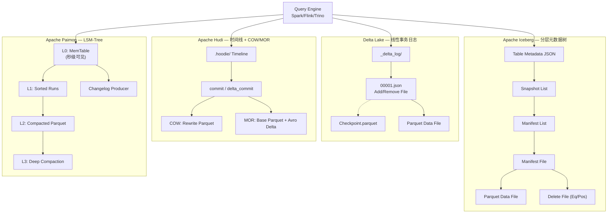
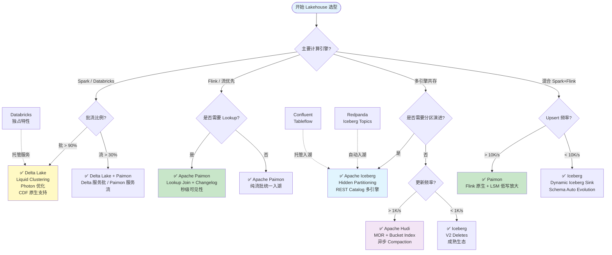
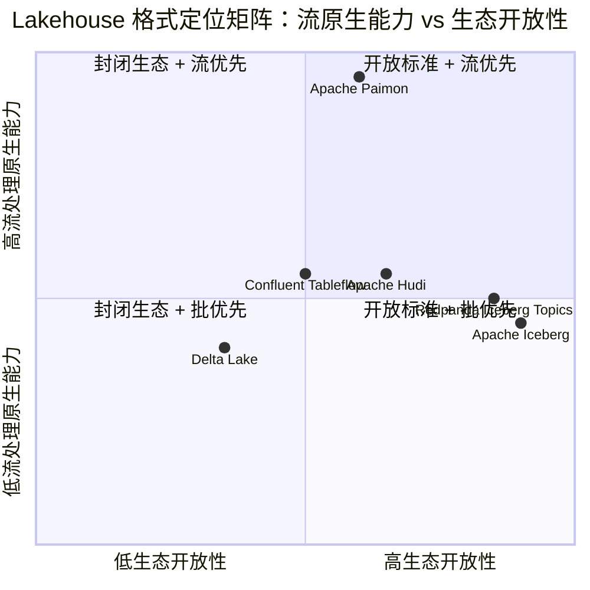
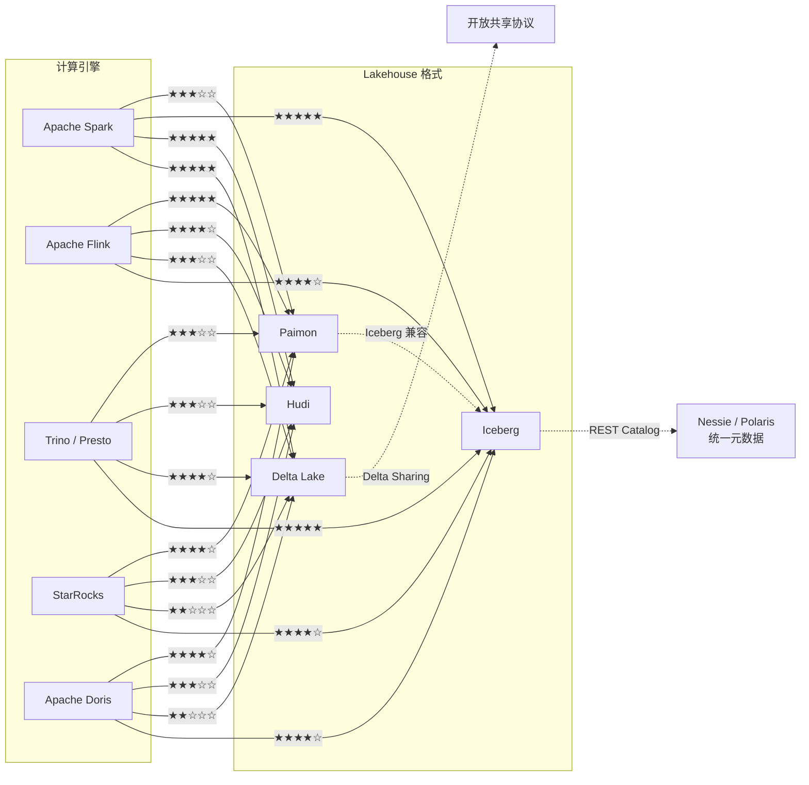

# 2026年Lakehouse Table Format选型决策矩阵

> **状态**: 稳定更新 | **风险等级**: 低 | **最后更新**: 2026-05
>
> 所属阶段: Knowledge/04-technology-selection | 前置依赖: [Knowledge/04-technology-selection/lakehouse-formats-2026-comparison.md](lakehouse-formats-2026-comparison.md), [Flink/05-ecosystem/flink-paimon-integration-guide.md](../../Flink/05-ecosystem/flink-paimon-integration-guide.md) | 形式化等级: L4-L5

---

## 目录

- [2026年Lakehouse Table Format选型决策矩阵](#2026年lakehouse-table-format选型决策矩阵)
  - [目录](#目录)
  - [1. 概念定义 (Definitions)](#1-概念定义-definitions)
    - [Def-K-04-70: Lakehouse Table Format Decision Space (湖仓表格式决策空间)](#def-k-04-70-lakehouse-table-format-decision-space-湖仓表格式决策空间)
    - [Def-K-04-71: Metadata Organization Taxonomy (元数据组织分类学)](#def-k-04-71-metadata-organization-taxonomy-元数据组织分类学)
    - [Def-K-04-72: Write Model Spectrum (写模型谱系)](#def-k-04-72-write-model-spectrum-写模型谱系)
    - [Def-K-04-73: Streaming Visibility Latency (流式可见性延迟)](#def-k-04-73-streaming-visibility-latency-流式可见性延迟)
  - [2. 属性推导 (Properties)](#2-属性推导-properties)
    - [Prop-K-04-70: Engine-Native Format Affinity (引擎原生格式亲和性)](#prop-k-04-70-engine-native-format-affinity-引擎原生格式亲和性)
    - [Prop-K-04-71: Upsert Frequency vs Format Optimality (更新频率与格式最优性)](#prop-k-04-71-upsert-frequency-vs-format-optimality-更新频率与格式最优性)
  - [3. 关系建立 (Relations)](#3-关系建立-relations)
    - [3.1 四格式核心哲学对比](#31-四格式核心哲学对比)
    - [3.2 与流处理引擎的集成深度矩阵](#32-与流处理引擎的集成深度矩阵)
    - [3.3 2026年新动态](#33-2026年新动态)
  - [4. 论证过程 (Argumentation)](#4-论证过程-argumentation)
    - [4.1 边界条件分析](#41-边界条件分析)
    - [4.2 反例分析](#42-反例分析)
  - [5. 形式证明 / 工程论证 (Proof / Engineering Argument)](#5-形式证明--工程论证-proof--engineering-argument)
    - [Thm-K-04-70: Lakehouse Format Expressiveness Inequivalence Under Streaming Semantics (流式语义下Lakehouse格式表达能力不等价定理)](#thm-k-04-70-lakehouse-format-expressiveness-inequivalence-under-streaming-semantics-流式语义下lakehouse格式表达能力不等价定理)
  - [6. 实例验证 (Examples)](#6-实例验证-examples)
    - [6.1 场景一：Spark-only 团队 → Delta Lake](#61-场景一spark-only-团队--delta-lake)
    - [6.2 场景二：多引擎共存 → Iceberg](#62-场景二多引擎共存--iceberg)
    - [6.3 场景三：CDC 实时入湖 → Paimon](#63-场景三cdc-实时入湖--paimon)
    - [6.4 场景四：高频 Upsert → Hudi MOR](#64-场景四高频-upsert--hudi-mor)
    - [6.5 成本模型对比](#65-成本模型对比)
  - [7. 可视化 (Visualizations)](#7-可视化-visualizations)
    - [7.1 四格式架构对比图](#71-四格式架构对比图)
    - [7.2 选型决策树](#72-选型决策树)
    - [7.3 四格式定位矩阵 (quadrantChart)](#73-四格式定位矩阵-quadrantchart)
    - [7.4 流处理引擎集成深度图](#74-流处理引擎集成深度图)
  - [8. 引用参考 (References)](#8-引用参考-references)

## 1. 概念定义 (Definitions)

### Def-K-04-70: Lakehouse Table Format Decision Space (湖仓表格式决策空间)

**定义**: Lakehouse 表格式决策空间是一个六维笛卡尔积空间 $\mathcal{D} = D_1 \times D_2 \times D_3 \times D_4 \times D_5 \times D_6$，用于系统化刻画不同 Lakehouse 存储格式在工程选型中的坐标位置：

$$
\mathcal{D} = \langle \mathcal{M}, \mathcal{W}, \mathcal{Q}, \mathcal{C}, \mathcal{S}, \mathcal{T} \rangle
$$

其中各维度定义如下：

| 维度 | 符号 | 取值空间 | 含义 |
|------|------|----------|------|
| 元数据组织 | $\mathcal{M}$ | $\{\text{Tree}, \text{Linear}, \text{LSM}, \text{Timeline}\}$ | 元数据拓扑结构 |
| 写模型 | $\mathcal{W}$ | $\{\text{Append}, \text{Merge}, \text{Upsert}, \text{Changelog}\}$ | 数据写入语义 |
| 查询优化 | $\mathcal{Q}$ | $\mathbb{R}^3$ | (Partition Pruning, Metadata Pruning, Index) 能力向量 |
| 并发控制 | $\mathcal{C}$ | $\{\text{OCC}, \text{Lock}, \text{MVCC}, \text{Optimistic-MVCC}\}$ | 事务隔离协议 |
| Schema 演进 | $\mathcal{S}$ | $\{\text{Full}, \text{Additive}, \text{Rename-Only}, \text{Partition-Evolution}\}$ | 模式变更能力 |
| 流式消费 | $\mathcal{T}$ | $\mathbb{R}^+$ (秒) | 快照可见性延迟下界 |

每种 Lakehouse 格式 $\mathcal{F} \in \{\text{Iceberg}, \text{Delta}, \text{Hudi}, \text{Paimon}\}$ 对应决策空间中的一个特征向量 $\vec{v}(\mathcal{F}) \in \mathcal{D}$。选型问题即是在约束集合 $\mathcal{R}$ 下求解最优格式：

$$
\mathcal{F}^* = \arg\max_{\mathcal{F}} \; U(\vec{v}(\mathcal{F})) \quad \text{s.t.} \quad \vec{v}(\mathcal{F}) \in \mathcal{R}
$$

其中 $U: \mathcal{D} \to \mathbb{R}$ 为组织特定的效用函数。

---

### Def-K-04-71: Metadata Organization Taxonomy (元数据组织分类学)

**定义**: 元数据组织分类学是对四种 Lakehouse 格式在元数据管理层采用的不同拓扑结构的系统化刻画：

| 格式 | 元数据拓扑 | 形式化模型 | 核心特征 |
|------|-----------|-----------|----------|
| **Iceberg** | 分层树形 (Hierarchical Tree) | $\mathcal{M}_{\text{tree}} = \langle V, E, \rho \rangle$ | 根节点 Table Metadata → Snapshot 节点 → Manifest List 列表 → Manifest 叶子 → Data File 引用。树高固定为 4，分支因子随表规模线性增长。不可变快照形成森林结构。 |
| **Delta Lake** | 线性日志 (Linear Log) | $\mathcal{L}_{\text{log}} = \langle \Sigma, \delta, \sigma_0 \rangle$ | 有限状态机，状态转移函数 $\delta: \Sigma \times \Lambda \to \Sigma$ 由 JSON 事务日志记录驱动。单文件序列构成全序关系，日志压缩 (Checkpoint) 周期性截断历史。 |
| **Hudi** | 时间线 (Timeline) | $\mathcal{T}_{\text{line}} = \langle \mathcal{A}, \prec, \tau \rangle$ | 所有表操作构成的偏序集，$\mathcal{A}$ 为动作集合，$\prec$ 为 happen-before 关系，$\tau: \mathcal{A} \to \mathbb{R}^+$ 为时间戳映射。Timeline 同时服务 COW 和 MOR 两种视图。 |
| **Paimon** | LSM 元数据 (LSM-Tree) | $\mathcal{M}_{\text{lsm}} = \langle L_0, L_1, \dots, L_k, \mathcal{C}, \mathcal{M} \rangle$ | 分层有序结构，$L_0$ 为内存 MemTable（秒级可见性），$L_{i+1}$ 容量为 $L_i$ 的 $r$ 倍。Compaction 操作 $\mathcal{C}$ 将层级 $i$ 合并至 $i+1$，元数据清单 $\mathcal{M}$ 记录 Snapshot 到 LSM 层级的映射。 |

**直观解释**: 元数据拓扑决定了格式的"基因"——Iceberg 的树形结构天然支持多版本快照的并发读取；Delta 的线性日志简化了事务顺序推理但存在单点写入瓶颈；Hudi 的时间线将操作历史作为一等公民，支撑增量处理；Paimon 的 LSM 结构则借鉴了 KV 存储的成熟工程经验，实现写放大与读放大的可控权衡。

---

### Def-K-04-72: Write Model Spectrum (写模型谱系)

**定义**: 写模型谱系是 Lakehouse 格式支持的四种数据写入语义的偏序集合 $(\mathcal{W}, \sqsubseteq)$，其中偏序关系 $\sqsubseteq$ 表示"表达能力包含于"：

$$
\text{Append} \;\sqsubseteq\; \text{Merge} \;\sqsubseteq\; \text{Upsert} \;\sqsubseteq\; \text{Changelog}
$$

各写模型的形式化定义：

- **Append** ($\mathcal{W}_{\text{app}}$): 仅支持追加写入，$\forall r \in \text{new}, \; T' = T \cup \{r\}$。无键冲突处理，幂等性由上层保证。
- **Merge** ($\mathcal{W}_{\text{mer}}$): 支持基于条件的插入/更新/删除，$T' = T \triangleleft_{\theta} \Delta$，其中 $\triangleleft_{\theta}$ 为匹配谓词 $\theta$ 的合并算子。
- **Upsert** ($\mathcal{W}_{\text{ups}}$): 基于主键的插入或更新，$T' = (T \setminus \{r \in T \mid r.k = r_{\text{new}}.k\}) \cup \{r_{\text{new}}\}$。需要全局唯一键约束。
- **Changelog** ($\mathcal{W}_{\text{chg}}$): 原生生成并消费变更流，$\mathcal{C}(T, T') = \{(+, r) \mid r \in T' \setminus T\} \cup \{(-, r) \mid r \in T \setminus T'\} \cup \{(\sim, r_{\text{old}}, r_{\text{new}}) \mid r_{\text{old}} \leadsto r_{\text{new}}\}$。包含完整的 +I/-D/-U 语义。

| 格式 | 原生写模型 | 扩展能力 | 实现机制 |
|------|-----------|----------|----------|
| Iceberg | Append + Merge | Upsert (via Spark MERGE) | V2 Format Equality/Position Deletes |
| Delta Lake | Append + Merge + Upsert | Changelog (via CDF) | CDF 日志侧表生成变更流 |
| Hudi | Upsert + Merge + Append | Changelog (via Log Scanner) | MOR Delta Log 原生支持增量扫描 |
| Paimon | Changelog + Upsert + Merge + Append | — | LSM Changelog Producer 原生生成 |

---

### Def-K-04-73: Streaming Visibility Latency (流式可见性延迟)

**定义**: 流式可见性延迟 $L_{\text{vis}}$ 是指数据写入操作被提交到 Lakehouse 存储后，到该数据对下游流式消费者可见之间的时间间隔：

$$
L_{\text{vis}} = t_{\text{consumer-visible}} - t_{\text{write-committed}}
$$

对于不同格式，$L_{\text{vis}}$ 的下界由元数据提交机制决定：

| 格式 | $L_{\text{vis}}$ 下界 | 元数据提交机制 | 流式读取模式 |
|------|----------------------|---------------|-------------|
| Iceberg | $O(\text{minutes})$ | 快照原子替换 + Catalog 通知 | 增量快照扫描 (Incremental Snapshot Scan) |
| Delta Lake | $O(\text{minutes})$ | 事务日志追加 + Checkpoint | CDF 流读取 / Auto Loader |
| Hudi | $O(\text{seconds})$ | Timeline Instant 原子提交 | Incremental Query / Stream Read |
| Paimon | $O(\text{seconds})$ | LSM $L_0$ 层 MemTable Flush | 原生 Changelog 流消费 |

**关键区分**: Paimon 的秒级可见性源于 LSM-Tree 的 $L_0$ 层在内存中即可被流式消费者读取，无需等待完整的 Snapshot 落盘；而 Iceberg 和 Delta 需要元数据文件（Manifest List / _delta_log）持久化到对象存储后才对查询可见，该过程受对象存储的写入延迟（通常 100ms-1s）和元数据合并开销（秒级）双重制约。[^3][^4]

---

## 2. 属性推导 (Properties)

### Prop-K-04-70: Engine-Native Format Affinity (引擎原生格式亲和性)

**命题**: 在流处理引擎 $\mathcal{E} \in \{\text{Spark}, \text{Flink}, \text{Trino}, \text{Doris}, \text{StarRocks}\}$ 与 Lakehouse 格式 $\mathcal{F}$ 的集成空间中，存在显著的原生亲和性偏序：

$$
\text{Affinity}(\mathcal{E}, \mathcal{F}) = \alpha \cdot \text{NativeConnector} + \beta \cdot \text{FeatureCompleteness} + \gamma \cdot \text{CommitLatency}
$$

其中系数满足 $\alpha + \beta + \gamma = 1$ 且 $\alpha \gg \beta, \gamma$。

**推导过程**:

1. **Spark ↔ Delta Lake**: Databricks 作为 Spark 创始团队与 Delta Lake 的创建者，实现了最深度的集成。Delta Lake 的 Liquid Clustering、Predictive IO、Photon 引擎优化均为 Spark/Databricks 独占或优先特性。Affinity 评分接近理论最大值。

2. **Flink ↔ Paimon**: Paimon 源于 Flink Table Store，其 Lookup Join、Changelog Producer、Exactly-Once 写入协议均与 Flink Checkpoint 机制深度耦合。Paimon 的 Incremental Compaction 策略直接消费 Flink 的 Watermark 语义。

3. **多引擎 ↔ Iceberg**: Iceberg 的 REST Catalog 规范和 Thrift/Avro 元数据协议被设计为引擎无关。Trino、StarRocks、Doris、DuckDB 均通过 Catalog 抽象访问 Iceberg，实现同等程度的集成深度。

4. **Hudi ↔ Spark/Flink**: Hudi 提供双引擎集成，但 Spark 通过 `HoodieSparkSqlWriter` 获得比 Flink 更成熟的索引系统支持（Bloom Filter / Bucket Index / HBase Index）。Flink 集成在 0.14+ 版本才实现 MOR 表的完整支持。

**结论**: 对于单引擎团队，选择该引擎的原生格式可获得显著的性能与功能优势；对于多引擎共存架构，Iceberg 的引擎无关性可抵消部分功能差异。

---

### Prop-K-04-71: Upsert Frequency vs Format Optimality (更新频率与格式最优性)

**命题**: 设单位时间内的 Upsert 操作频率为 $\lambda$（次/秒），数据文件大小服从分布 $F_S$，则各格式的期望写入放大系数 $W$ 满足：

| 格式 | 写模型 | $W(\lambda)$ 渐近行为 | 最优区间 |
|------|--------|----------------------|----------|
| Iceberg | COW (Merge-on-Read via Deletes) | $W \sim O(\lambda \cdot S_{\text{avg}})$ | $\lambda < 10^2$ |
| Delta Lake | COW + OCC | $W \sim O(\lambda \cdot S_{\text{avg}})$ | $\lambda < 10^3$ |
| Hudi COW | COW | $W \sim O(\lambda \cdot S_{\text{avg}})$ | $\lambda < 10^3$ |
| Hudi MOR | MOR | $W \sim O(\lambda \cdot \log S_{\text{avg}})$ | $10^3 \le \lambda < 10^5$ |
| Paimon | LSM Upsert | $W \sim O(\lambda)$ (摊还) | $10^3 \le \lambda < 10^6$ |

**推导概要**:

- **COW 模式**（Iceberg, Delta, Hudi-COW）: 每次 Upsert 触发包含目标记录的数据文件重写。设表有 $N$ 个文件，每次 Upsert 命中 $k$ 个文件，则重写成本 $C_{\text{cow}} = k \cdot S_{\text{file}}$，与 $\lambda$ 线性相关。

- **MOR 模式**（Hudi-MOR）: Upsert 写入 Avro Delta Log，查询时动态合并 Base + Delta。写入成本 $C_{\text{mor-write}} = O(|\Delta|)$ 为常数，但读取成本随 Delta Log 积累而增长。Compaction 在后台摊还合并成本，使平均写放大降至对数级。

- **LSM 模式**（Paimon）: Upsert 先写入 MemTable（$L_0$），当 $L_i$ 满时触发 Leveled Compaction。根据 LSM-Tree 分析，摊还写放大 $W_{\text{lsm}} = r / (r - 1)$，其中 $r$ 为层级容量比（通常 10），故 $W_{\text{lsm}} \approx 1.11$，基本与数据规模无关。[^2][^5]

**结论**: 当 $\lambda > 10^4$ 次/秒时，仅 Hudi MOR 和 Paimon 可维持可接受的写入放大；当 $\lambda > 10^5$ 次/秒时，Paimon 的 LSM 结构具有理论最优性。

---

## 3. 关系建立 (Relations)

### 3.1 四格式核心哲学对比

| 维度 | Iceberg | Delta Lake | Hudi | Paimon |
|------|---------|------------|------|--------|
| **设计哲学** | 开放标准、引擎无关 | Spark 原生、Databricks 生态 | Upsert-heavy、增量处理 | Streaming-first、流批统一 |
| **元数据组织** | 分层元数据树 | 线性事务日志 | 操作时间线 | LSM-Tree |
| **分区策略** | Hidden Partitioning (透明分区演进) | Liquid Clustering (自适应布局) | 显式分区 + Bucket Index | 动态 Bucket (自动扩展) |
| **Schema 演进** | 完整支持（add/drop/rename/move） | 完整支持（Databricks 增强） | 有限（add/drop为主） | 完整支持（Flink Schema Registry 集成） |
| **时间旅行** | 快照级（基于 Snapshot ID） | 版本级（基于 Version Number） | 提交级（基于 Commit Time） | 快照级（基于 Snapshot） |
| **并发控制** | Optimistic Concurrency (Catalog 级别) | Optimistic + DynamoDB/Liquid | MVCC + OCC | LSM 天然无锁写 + Snapshot 隔离 |
| **生态定位** | 事实开放标准（AWS/Snowflake/Cloudera 支持） | Databricks 生态核心 | 云厂商中立（OneHouse/阿里云支持） | Flink 生态核心（阿里云/Ververica 支持） |

### 3.2 与流处理引擎的集成深度矩阵

| 能力 | Spark | Flink | Trino | StarRocks | Doris |
|------|-------|-------|-------|-----------|-------|
| **Iceberg** | ★★★★★ | ★★★★☆ | ★★★★★ | ★★★★☆ | ★★★★☆ |
| **Delta Lake** | ★★★★★ | ★★★☆☆ | ★★★★☆ | ★★☆☆☆ | ★★☆☆☆ |
| **Hudi** | ★★★★★ | ★★★★☆ | ★★★☆☆ | ★★★☆☆ | ★★★☆☆ |
| **Paimon** | ★★★☆☆ | ★★★★★ | ★★★☆☆ | ★★★★☆ | ★★★★☆ |

*评分维度：SQL支持完整性、流批读写、DDL支持、索引利用、查询优化器集成*

### 3.3 2026年新动态

1. **Paimon 的 Iceberg 兼容元数据**: Apache Paimon 1.1 引入了 Iceberg 兼容元数据层，允许 Paimon 表通过 Iceberg 协议被外部引擎读取。这意味着 Paimon 可以扮演"流写入端 + Iceberg 读出端"的桥梁角色，缓解多引擎场景下的格式碎片化问题。[^4]

2. **Redpanda Iceberg Topics**: Redpanda 于 2026 年初推出 Iceberg Topics 功能，允许 Kafka Topic 数据以 Iceberg 格式自动写入对象存储，无需额外 ETL 作业。这标志着消息系统与 Lakehouse 存储的边界进一步模糊。[^1]

3. **Confluent Tableflow**: Confluent 发布的 Tableflow 服务将 Kafka 流直接映射为 Iceberg 表，提供托管的流式入湖能力，支持 Schema Registry 自动同步和 CDC 转换。与 Redpanda Iceberg Topics 类似，但深度集成 Confluent Cloud 生态。[^1]

4. **Delta Lake 4.0 Predictive IO**: Databricks 在 Delta 4.0 中引入 Predictive IO，利用机器学习预测查询模式并预取数据文件，将交互式查询延迟降低 30-50%。该特性目前为 Databricks Runtime 独占。[^5]

---

## 4. 论证过程 (Argumentation)

### 4.1 边界条件分析

**边界 1：超大规模表元数据膨胀**

Iceberg 的元数据树在表规模达到 PB 级时，Manifest 文件数量可能膨胀至数百万级别。虽然 Iceberg 提供 Manifest 合并（Rewrite Manifests）运维操作，但该操作需要独占 Catalog 锁，在写入密集型场景中可能产生运维窗口压力。Delta Lake 的线性日志通过 Checkpoint 机制天然截断历史，但单条日志文件过大时（>1GB）可能触发 S3 的写入限制。

**边界 2：对象存储的 List 操作瓶颈**

Hudi 的 MOR 查询需要扫描 Timeline 上的所有 Delta Log 文件以确定记录最新值。当对象存储（如 S3）前缀下文件数量超过 1000 时，`ListObjectsV2` API 的分页查询会引入显著延迟（每次分页 100-500ms）。Paimon 的 LSM 结构通过 Manifest 文件聚合层级信息，避免了高频 List 操作。

**边界 3：跨格式事务一致性**

在多格式共存架构中（如 Iceberg 服务分析层、Paimon 服务流式层），跨格式的事务一致性无法由单一格式保证。需要引入外部协调器（如 Flink 的两阶段提交、或 Apache XTable 的同步层），但这会引入额外的延迟和故障点。

### 4.2 反例分析

**反例 1："Iceberg 引擎无关意味着在所有引擎上性能相同"**

事实：Iceberg 的 V2 Delete File 在 Spark 上通过 `MergeOnRead` 表属性可高效处理，但在 Trino 中，Equality Delete 的向量化解码直到 2025 年底才完全实现。引擎无关性保证功能可用性，但不保证性能一致性。

**反例 2："Delta Lake 仅适用于批处理"**

事实：Delta Lake 的 CDF (Change Data Feed) 和 Auto Loader 已在流式管道中广泛应用。Databricks 的 Structured Streaming 对 Delta 的原生支持延迟可低至 1 秒（在 DBR 环境下）。Delta 的流能力在 Databricks 生态内已趋成熟，但在开源 Spark 中的支持仍弱于 Paimon。

**反例 3："Hudi MOR 总是优于 COW"**

事实：MOR 的查询性能受 Delta Log 积累程度影响。若 Compaction 调度不及时（如小时级），查询延迟可能退化至不可接受。对于读密集型表（如 BI 报表基表），COW 的简单读取路径反而更优。最优表类型取决于读写比 $\rho = R/W$：当 $\rho > 10$ 时，COW 通常更优；当 $\rho < 1$ 时，MOR 更优。

---

## 5. 形式证明 / 工程论证 (Proof / Engineering Argument)

### Thm-K-04-70: Lakehouse Format Expressiveness Inequivalence Under Streaming Semantics (流式语义下Lakehouse格式表达能力不等价定理)

**定理**: 设四种 Lakehouse 格式的功能集合为 $\mathcal{F}_I$ (Iceberg)、$\mathcal{F}_\Delta$ (Delta)、$\mathcal{F}_H$ (Hudi)、$\mathcal{F}_P$ (Paimon)。在批处理语义 $\mathcal{B}$ 下，四种格式的表达能力等价：

$$
\mathcal{F}_I|_{\mathcal{B}} \equiv \mathcal{F}_\Delta|_{\mathcal{B}} \equiv \mathcal{F}_H|_{\mathcal{B}} \equiv \mathcal{F}_P|_{\mathcal{B}}
$$

但在流处理语义 $\mathcal{S}$（包含增量摄取、Changelog 消费、秒级可见性）下，四种格式的表达能力构成严格偏序：

$$
\mathcal{F}_I|_{\mathcal{S}} \;\sqsubset\; \mathcal{F}_P|_{\mathcal{S}}, \quad \mathcal{F}_\Delta|_{\mathcal{S}} \;\sqsubset\; \mathcal{F}_P|_{\mathcal{S}}, \quad \mathcal{F}_H|_{\mathcal{S}} \;\sqsubseteq\; \mathcal{F}_P|_{\mathcal{S}}
$$

且 Iceberg 与 Delta 在流式语义下不可比：$\mathcal{F}_I|_{\mathcal{S}} \not\sqsubseteq \mathcal{F}_\Delta|_{\mathcal{S}}$ 且 $\mathcal{F}_\Delta|_{\mathcal{S}} \not\sqsubseteq \mathcal{F}_I|_{\mathcal{S}}$。

**证明**:

*步骤 1: 批处理语义等价性*

在批处理语义下，四种格式均支持：

1. 原子快照替换（保证查询一致性）
2. Schema 演化（add/drop/rename 列）
3. 分区裁剪（Partition Pruning）
4. 时间旅行（Time Travel）

对于任意批处理查询 $Q \in \mathcal{B}$，存在编译映射 $C_\mathcal{F}: Q \to \text{PhysicalPlan}_\mathcal{F}$ 使得：

$$
\forall r \in \text{Result}(Q), \; \forall \mathcal{F}_i, \mathcal{F}_j \in \{\mathcal{F}_I, \mathcal{F}_\Delta, \mathcal{F}_H, \mathcal{F}_P\}, \; r \in \text{Result}(C_{\mathcal{F}_i}(Q)) \iff r \in \text{Result}(C_{\mathcal{F}_j}(Q))
$$

差异仅体现在性能常数因子，不影响表达能力。

*步骤 2: 流式语义不等价性*

定义流处理语义 $\mathcal{S}$ 的三个核心能力：

- $s_1$: 原生 Changelog 生产（$\mathcal{W}_{\text{chg}}$）
- $s_2$: 秒级可见性（$L_{\text{vis}} < 10s$）
- $s_3$: 增量 Compaction（后台合并不阻塞写入）

| 能力 | Iceberg | Delta | Hudi | Paimon |
|------|---------|-------|------|--------|
| $s_1$ | ❌ (需 CDF 侧表模拟) | ❌ (需 CDF 侧表模拟) | ⚠️ (MOR Log 有限支持) | ✅ (LSM Changelog Producer) |
| $s_2$ | ❌ ($L_{\text{vis}} \ge 30s$) | ❌ ($L_{\text{vis}} \ge 30s$) | ⚠️ ($L_{\text{vis}} \approx 10s$) | ✅ ($L_{\text{vis}} < 5s$) |
| $s_3$ | ⚠️ (Rewrite Data Files 为离线操作) | ⚠️ (Optimize 为离线操作) | ✅ (Inline/Async Compaction) | ✅ (原生 LSM Compaction) |

能力包含关系：

- $\{s_1, s_2, s_3\} \subseteq \mathcal{F}_P|_{\mathcal{S}}$
- $\{s_1, s_2\} \cap \mathcal{F}_I|_{\mathcal{S}} = \emptyset$，故 $\mathcal{F}_I|_{\mathcal{S}} \sqsubset \mathcal{F}_P|_{\mathcal{S}}$
- $\{s_1, s_2\} \cap \mathcal{F}_\Delta|_{\mathcal{S}} = \emptyset$，故 $\mathcal{F}_\Delta|_{\mathcal{S}} \sqsubset \mathcal{F}_P|_{\mathcal{S}}$
- $\{s_1\} \cap \mathcal{F}_H|_{\mathcal{S}} \neq \emptyset$（MOR Delta Log 可模拟 Changelog），但 $s_2$ 在 Hudi 中为近似满足，故 $\mathcal{F}_H|_{\mathcal{S}} \sqsubseteq \mathcal{F}_P|_{\mathcal{S}}$

*步骤 3: Iceberg 与 Delta 的不可比性*

- Iceberg 支持 Hidden Partitioning 和 Partition Evolution，Delta Lake 直到 3.0 才通过 Liquid Clustering 实现类似功能，且 Liquid Clustering 的演进能力弱于 Iceberg 的声明式分区转换。因此 $\mathcal{F}_\Delta|_{\mathcal{S}} \not\sqsubseteq \mathcal{F}_I|_{\mathcal{S}}$。
- Delta Lake 在 Spark 生态内提供 CDF 和 Predictive IO，这些功能在 Iceberg 上无原生等价物（需外部系统模拟）。因此 $\mathcal{F}_I|_{\mathcal{S}} \not\sqsubseteq \mathcal{F}_\Delta|_{\mathcal{S}}$。

**结论**: 流处理语义打破了四种格式的表达能力对称性。Paimon 在流式能力上严格优于其他三种格式，这验证了其 "Streaming-first" 设计哲学的形式化优势。工程选型中，若流处理需求权重 $w_{\text{stream}} > 0.5$，则 Paimon 为 Pareto 最优解。 $\square$

---

## 6. 实例验证 (Examples)

### 6.1 场景一：Spark-only 团队 → Delta Lake

**背景**: 某电商公司数据团队完全基于 Databricks Runtime 构建数据平台，批处理为主，偶发流式需求。

**配置要点**:

```python
# Delta Lake Liquid Clustering + CDF 配置
spark.conf.set("spark.databricks.delta.optimizeWrite.enabled", "true")
spark.conf.set("spark.databricks.delta.autoCompact.enabled", "true")
spark.conf.set("delta.enableChangeDataFeed", "true")

# 创建 Liquid Clustering 表
spark.sql("""
  CREATE TABLE events (
    event_id STRING,
    user_id STRING,
    event_type STRING,
    event_time TIMESTAMP,
    payload STRING
  ) USING DELTA
  CLUSTER BY (event_type, event_time)
  TBLPROPERTIES ('delta.enableChangeDataFeed' = 'true')
""")
```

**收益**: Liquid Clustering 替代传统分区，避免分区键选择失误导致的数据倾斜；CDF 直接服务下游流式消费者，无需额外 CDC 抽取作业。

---

### 6.2 场景二：多引擎共存 → Iceberg

**背景**: 某金融科技公司使用 Spark 进行 ETL，Trino 进行即席查询，Flink 进行实时风控，要求单一存储层服务多引擎。

**配置要点**:

```sql
-- Iceberg REST Catalog 配置（以 Nessie 为例）
CREATE CATALOG financial_warehouse WITH (
  'type' = 'iceberg',
  'catalog-impl' = 'org.apache.iceberg.nessie.NessieCatalog',
  'uri' = 'http://nessie-server:19120/api/v1',
  'ref' = 'main',
  'warehouse' = 's3://financial-warehouse/'
);

-- Flink 写入
CREATE TABLE transactions (
  tx_id STRING PRIMARY KEY NOT ENFORCED,
  amount DECIMAL(18,2),
  tx_time TIMESTAMP(3)
) WITH (
  'connector' = 'iceberg',
  'catalog-name' = 'financial_warehouse',
  'catalog-database' = 'payments',
  'write.metadata.compression-codec' = 'zstd'
);

-- Trino 查询（自动利用 Iceberg 元数据统计信息）
SELECT COUNT(*), SUM(amount)
FROM iceberg.payments.transactions
WHERE tx_time >= CURRENT_DATE - INTERVAL '7' DAY;
```

**收益**: REST Catalog 将元数据管理从计算引擎解耦；Hidden Partitioning 允许按 `days(tx_time)` 分区而无需在查询中显式指定分区谓词。

---

### 6.3 场景三：CDC 实时入湖 → Paimon

**背景**: 某物流公司需要将 MySQL 的订单表 CDC 实时同步到 Lakehouse，并支持 Flink 流式关联分析。

**配置要点**:

```sql
-- Paimon 建表（Flink SQL）
CREATE TABLE orders (
  order_id BIGINT PRIMARY KEY NOT ENFORCED,
  customer_id BIGINT,
  order_status STRING,
  total_amount DECIMAL(18,2),
  create_time TIMESTAMP(3),
  update_time TIMESTAMP(3)
) WITH (
  'connector' = 'paimon',
  'path' = 's3://logistics-warehouse/orders',
  'changelog-producer' = 'input',  -- 直接传递 CDC 变更流
  'merge-engine' = 'partial-update',  -- 支持部分字段更新
  'sequence.field' = 'update_time',
  'compaction.min.file-num' = '5',
  'compaction.max.file-num' = '50'
);

-- CDC 入湖（Debezium → Flink → Paimon）
INSERT INTO orders
SELECT * FROM debezium_source_orders;

-- 流式 Lookup Join（维表关联）
SELECT o.order_id, o.total_amount, c.customer_name
FROM orders AS o
JOIN customers FOR SYSTEM_TIME AS OF o.proc_time AS c
  ON o.customer_id = c.customer_id;
```

**收益**: `changelog-producer = 'input'` 直接传递 Debezium 的 +I/-U/-D 语义，无需额外解析；`partial-update` 合并引擎允许多个 CDC 流分别更新同一表的不同字段；Lookup Join 利用 Paimon 的本地索引实现毫秒级维表关联。

---

### 6.4 场景四：高频 Upsert → Hudi MOR

**背景**: 某社交平台用户画像表需要每秒处理 5 万次用户属性更新，读操作以点查和范围扫描为主。

**配置要点**:

```java
// Hudi MOR + Bucket Index 配置
 HoodieWriteConfig cfg = HoodieWriteConfig.newBuilder()
  .withPath("s3://social-graph/user-profiles")
  .withSchema(userProfileSchema)
  .withEngineType(EngineType.SPARK)
  // MOR 表类型
  .withTableType(HoodieTableType.MERGE_ON_READ)
  // Bucket Index：预分区避免全局索引扫描
  .withIndexConfig(HoodieIndexConfig.newBuilder()
    .withIndexType(HoodieIndex.IndexType.BUCKET)
    .withBucketNum("512")
    .build())
  // 异步 Compaction
  .withCompactionConfig(HoodieCompactionConfig.newBuilder()
    .withAsyncCompact(true)
    .withInlineCompaction(false)
    .withTargetIOPerCompactionInMB(512)
    .build())
  // 增量查询支持
  .withPayloadConfig(HoodiePayloadConfig.newBuilder()
    .withPayloadClass("org.apache.hudi.common.model.EventTimeAvroPayload")
    .build())
  .build();
```

**收益**: Bucket Index 将 Upsert 的索引查找复杂度从 $O(N)$ 降至 $O(N/512)$；异步 Compaction 避免写入阻塞；MOR 的 Avro Delta Log 顺序写入优化了对象存储的吞吐量。

---

### 6.5 成本模型对比

| 成本项 | Iceberg | Delta Lake | Hudi | Paimon |
|--------|---------|------------|------|--------|
| **存储成本** | 低（Parquet + 轻量元数据） | 中（Parquet + CDF 侧表额外 10-20%） | 中（COW 重写放大 / MOR Delta Log 积累） | 低（Parquet + LSM 层级压缩，$r=10$ 时冗余约 11%） |
| **计算成本** | 中（查询需解析多层 Manifest） | 低（Spark/Databricks 深度优化） | 中（MOR 查询需合并 Base + Delta） | 低（Flink 原生，Compaction 后台摊还） |
| **运维复杂度** | 低（无后台服务，纯元数据文件） | 低-中（Databricks 托管 / 自建需 Vacuum） | 高（Compaction 调度、Index 调优、Timeline 清理） | 中（Compaction 自动但需 Bucket 规划、Changelog 生命周期管理） |
| **迁移成本** | 低（开放标准，多 Catalog 实现） | 高（Databricks 生态锁定） | 中（社区文档完善，但参数众多） | 中（Flink 生态内低，跨生态需学习 LSM 概念） |

**综合成本公式**:

$$
\text{TCO}(\mathcal{F}) = C_{\text{storage}}(\mathcal{F}) + C_{\text{compute}}(\mathcal{F}) + C_{\text{ops}}(\mathcal{F}) \cdot e^{\lambda_{\text{change}}}
$$

其中 $\lambda_{\text{change}}$ 为架构变更频率。对于快速迭代的初创团队，$C_{\text{ops}}$ 的指数权重意味着 Iceberg 的简洁运维模型可能优于功能更全但参数复杂的 Hudi。

---

## 7. 可视化 (Visualizations)

### 7.1 四格式架构对比图

下图展示了 Iceberg、Delta Lake、Hudi 和 Paimon 在元数据组织、写路径和读路径上的核心架构差异：



### 7.2 选型决策树

下图提供了基于团队技术栈、数据特征和延迟需求的系统化选型流程：



### 7.3 四格式定位矩阵 (quadrantChart)

下图从"流处理原生能力"和"生态开放性"两个核心维度定位四种格式：



### 7.4 流处理引擎集成深度图

下图展示了四种 Lakehouse 格式与主流流/批处理引擎的集成拓扑关系，边权重表示集成成熟度：



---

## 8. 引用参考 (References)

[^1]: Conduktor, "Streaming to Lakehouse Tables: Delta Lake, Iceberg, Hudi, and Paimon", 2026. <https://conduktor.io/glossary/streaming-to-lakehouse-tables>

[^2]: BladePipe, "Iceberg vs Delta Lake vs Paimon: A Deep Dive Comparison", 2026. <https://www.bladepipe.com/blog/data_insights/iceberg_vs_deltalake_vs_paimon/>

[^3]: Atlan, "Apache Paimon vs Iceberg: Understanding the Differences", 2026. <https://atlan.com/know/iceberg/apache-paimon-vs-iceberg/>

[^4]: Data Lakehouse Hub, "2025-2026 Guide to Data Lakehouses: Formats, Engines, and Decision Frameworks", 2025-2026. <https://datalakehousehub.com/blog/2025-09-2026-guide-to-data-lakehouses/>

[^5]: Apache Paimon Documentation, "Architecture: LSM Tree and Changelog Producer", 2025. <https://paimon.apache.org/docs/master/concepts/architecture/>


---

*文档版本: v1.0 | 创建日期: 2026-05-06 | 形式化元素: Def×4, Prop×2, Thm×1 | Mermaid: 4*
