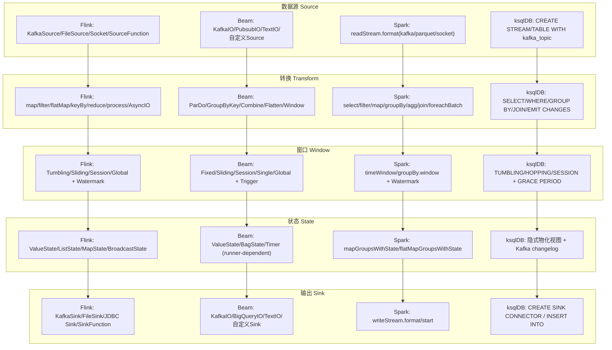
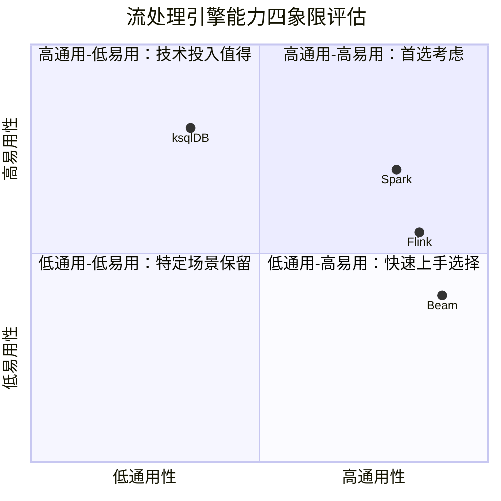
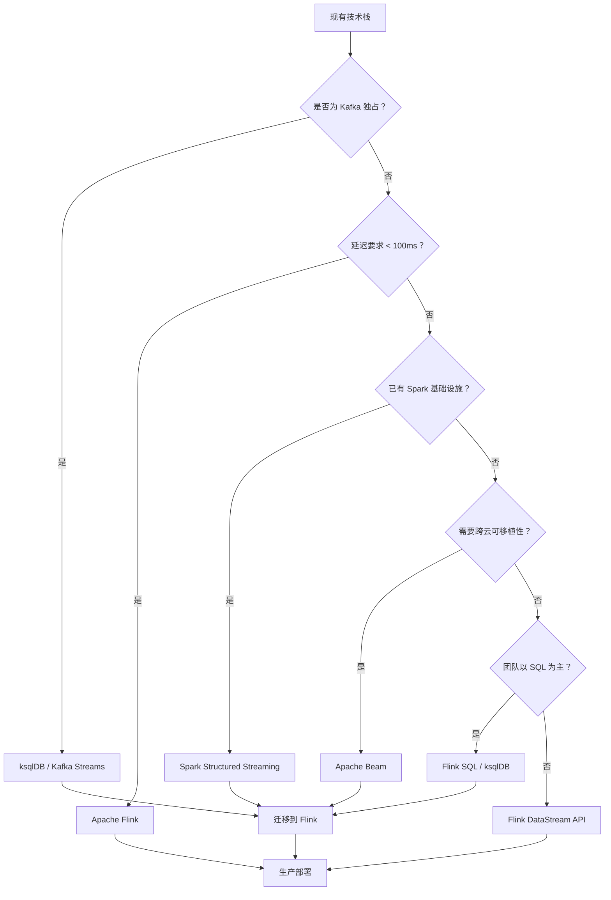

# 跨引擎算子映射：Flink、Beam、Spark Structured Streaming、ksqlDB 四引擎对齐

> 所属阶段: Knowledge/04-technology-selection/operator-decision-tools | 前置依赖: [Knowledge/01-concept-atlas/stream-processing-concepts.md](../../01-concept-atlas/01.01-stream-processing-fundamentals.md), [Flink/03-api/datastream-api-operators.md](../../../Flink/03-api/README.md) | 形式化等级: L4 (概念定义+映射关系+经验数据)
> 最后更新: 2026-04-30

## 目录

- [跨引擎算子映射：Flink、Beam、Spark Structured Streaming、ksqlDB 四引擎对齐](#跨引擎算子映射flinkbeamspark-structured-streamingksqldb-四引擎对齐)
  - [目录](#目录)
  - [1. 概念定义 (Definitions)](#1-概念定义-definitions)
  - [2. 属性推导 (Properties)](#2-属性推导-properties)
  - [3. 关系建立 (Relations)](#3-关系建立-relations)
    - [3.1 核心算子四引擎映射表](#31-核心算子四引擎映射表)
    - [3.2 语义差异详解](#32-语义差异详解)
  - [4. 论证过程 (Argumentation)](#4-论证过程-argumentation)
    - [4.1 能力差异矩阵](#41-能力差异矩阵)
    - [4.2 各引擎不支持的算子/功能](#42-各引擎不支持的算子功能)
  - [5. 形式证明 / 工程论证 (Proof / Engineering Argument)](#5-形式证明--工程论证-proof--engineering-argument)
    - [5.1 迁移指南：Spark Streaming → Flink](#51-迁移指南spark-streaming--flink)
    - [5.2 迁移指南：Beam → Flink](#52-迁移指南beam--flink)
    - [5.3 性能特征对比（基于公开基准测试）](#53-性能特征对比基于公开基准测试)
  - [6. 实例验证 (Examples)](#6-实例验证-examples)
    - [6.1 WordCount 四引擎实现对比](#61-wordcount-四引擎实现对比)
    - [6.2 选型决策树（代码实现逻辑）](#62-选型决策树代码实现逻辑)
  - [7. 可视化 (Visualizations)](#7-可视化-visualizations)
    - [7.1 四引擎核心算子覆盖矩阵图](#71-四引擎核心算子覆盖矩阵图)
    - [7.2 能力雷达图（quadrantChart 形式呈现）](#72-能力雷达图quadrantchart-形式呈现)
    - [7.3 引擎迁移路径图](#73-引擎迁移路径图)
  - [8. 引用参考 (References)](#8-引用参考-references)

## 1. 概念定义 (Definitions)

**Def-ENG-01-01（流处理引擎）**: 流处理引擎是一个分布式计算系统，能够对**无界数据流**（unbounded data stream）执行持续性的转换操作。形式化地，引擎 $ ext{Engine} =  uple{S, T, O, R}$，其中 $S$ 为状态空间，$T$ 为时间语义（处理时间/事件时间/摄入时间），$O$ 为算子集合，$R$ 为容错恢复机制。

**Def-ENG-01-02（算子语义等价性）**: 给定两个引擎的算子 $op_1  ext{ 和 } op_2$，若对任意输入流 $I$ 均有 $op_1(I)  riangleq op_2(I)$（即输出事件的集合、顺序、时间戳语义一致），则称二者**语义等价**（semantic equivalence），记作 $op_1 isim op_2$。若仅在特定配置或约束下等价，则称**条件语义等价**（conditional equivalence）。

**Def-ENG-01-03（微批 vs 逐事件处理模型）**:

- **微批模型**（micro-batch model）：将无界流切分为有限大小的批次 $B_1, B_2, \dots$，每批作为原子单元处理。Spark Structured Streaming 默认采用此模型[^1]。
- **逐事件模型**（event-at-a-time model）：每个事件 $e_i$ 独立流经算子图，无需显式批边界。Flink 采用此模型[^2]。

**Def-ENG-01-04（窗口对齐）**: 窗口算子 $W$ 将事件时间域 $ au$ 映射到窗口集合 $ ext{Windows}$。四引擎支持的窗口类型如下：

- **滚动窗口**（Tumbling Window）：固定大小、不重叠，$W_T(e) = loor{ au(e) /  ext{size}}  imes  ext{size}$；
- **滑动窗口**（Sliding/Hopping Window）：固定大小、可重叠，步长 $ ext{slide}
eq  ext{size}$；
- **会话窗口**（Session Window）：由不活动间隔 $ ext{gap}$ 动态划分。

**Def-ENG-01-05（状态后端）**: 状态后端是引擎持久化算子状态的存储抽象。形式化地，状态后端提供 $ ext{put}(k, v)$、$ ext{get}(k)$、$ ext{snapshot}()  o S_i$ 三个原语。四引擎主流后端对比：

| 引擎 | 默认状态后端 | 状态存储位置 | Checkpoint 目标 |
|------|------------|-------------|----------------|
| Flink | RocksDB / HashMap | TaskManager 本地磁盘 / 内存 | 分布式文件系统（S3/HDFS）[^2] |
| Beam | Runner-dependent | 由底层 Runner 决定 | Runner 决定 |
| Spark Structured Streaming | HDFS / S3 | Executor 内存 + WAL | 分布式存储[^1] |
| ksqlDB | RocksDB | Kafka Streams 本地 | Kafka Changelog 主题[^3] |

## 2. 属性推导 (Properties)

**Lemma-ENG-01-01（算子语义的 runner 依赖性）**: 在 Apache Beam 中，算子语义 $isim$ 不是跨 runner 不变的。即存在算子 $op$ 和 runner $r_1, r_2$，使得 $op isim_{r_1} op'$ 但 $op
otisim_{r_2} op'$。这是因为 Beam 将状态管理和时间语义委托给底层 runner 实现[^4]。

**Lemma-ENG-01-02（ksqlDB 的 SQL 到算子映射的单射性）**: ksqlDB 的每个持续 SQL 查询 $Q$ 唯一对应一个 Kafka Streams 拓扑 $ opo(Q)$，但逆映射不成立——存在无法直接表达为单条 SQL 的复杂拓扑。即 $ opo:  ext{SQL}  o  ext{Topology}$ 为单射但非满射[^3]。

**Lemma-ENG-01-03（Spark 微批延迟下界）**: 设微批间隔为 $ ext{trigger}$，则 Spark Structured Streaming 在默认模式下的端到端延迟满足 $L_{ ext{Spark}}  rianglerighteq  ext{trigger} + L_{ ext{proc}}$，其中 $L_{ ext{proc}}$ 为单批处理时间。Flink 的逐事件模型延迟满足 $L_{ ext{Flink}}  rianglerighteq L_{ ext{proc}}'$，与触发间隔无关[^1][^2]。

**Lemma-ENG-01-04（窗口 join 的语义差异）**: 在双流窗口 join 场景中，Flink 的 `intervalJoin` 要求严格的时间区间重叠；Spark 的 `stream-stream join` 要求 watermark 推进后触发；ksqlDB 的 `WITHIN` 子句仅支持固定的前后时间边界；Beam 的 `CoGroupByKey` 依赖窗口分配器的时间对齐。四者在迟到数据处理上存在本质差异。

## 3. 关系建立 (Relations)

### 3.1 核心算子四引擎映射表

下表建立 Flink DataStream API、Apache Beam SDK、Spark Structured Streaming API 与 ksqlDB SQL 的核心算子语义对齐关系。

| 通用算子 | Flink DataStream API | Apache Beam SDK | Spark Structured Streaming | ksqlDB SQL |
|---------|---------------------|-----------------|---------------------------|-----------|
| **Source** | `env.addSource(SourceFunction)` / `KafkaSource` | `KafkaIO.read()` / `PubsubIO.read()` | `spark.readStream.format("kafka")` | `CREATE STREAM ... WITH (kafka_topic='...')` |
| **Map** | `.map(MapFunction<T,R>)` | `.apply(ParDo.of(new DoFn<T,R>{}))` | `.map(func)` (DataFrame) / `selectExpr()` | `SELECT expr1, expr2 ...` |
| **Filter** | `.filter(FilterFunction<T>)` | `.apply(Filter.by())` | `.filter(condition)` | `WHERE condition` |
| **FlatMap** | `.flatMap(FlatMapFunction<T,R>)` | `.apply(ParDo.of(new DoFn<T,R>))` (emit 0~N) | `explode()` / UDF | 无直接等价（需 UDF 或 `EXPLODE` 扩展） |
| **KeyBy / GroupBy** | `.keyBy(KeySelector)` → `KeyedStream` | `.apply(GroupByKey.create())` | `.groupBy()` / `.groupByKey()` | `GROUP BY column` / `PARTITION BY` |
| **Reduce** | `.reduce(ReduceFunction)` (KeyedStream) | `.apply(Combine.perKey(Sum.ofIntegers()))` | `.agg()` / `reduce()` | `SELECT key, AGG(col) ... GROUP BY key` |
| **Aggregate** | `.aggregate(AggregateFunction)` / `.sum()` `.min()` `.max()` | `.apply(Combine.globally())` | `.agg()` / `count()` / `sum()` | `COUNT(*)`, `SUM()`, `AVG()`, `MAX()`, `MIN()` |
| **Window** | `.window(TumblingEventTimeWindows)` / `SlidingEventTimeWindows` / `EventTimeSessionWindows` | `.apply(Window.into(FixedWindows.of()))` / `SlidingWindows` / `Sessions` | `.window(timeWindow)` / `groupBy(window)` | `WINDOW TUMBLING (SIZE ...)` / `HOPPING` / `SESSION` |
| **Window Aggregate** | `.window(...).aggregate(...)` | `.apply(Window.into(...)).apply(Combine.perKey(...))` | `.groupBy(window, key).agg(...)` | `SELECT ... WINDOW TUMBLING (SIZE ...) GROUP BY key` |
| **Join (Stream-Stream)** | `.join(otherStream).where(...).equalTo(...).window(...)` (Interval Join) | `.apply(CoGroupByKey.of(...))` | `.join(other, expr, expr).withWatermark(...)` | `SELECT ... FROM s1 JOIN s2 WITHIN ... ON ...` |
| **Join (Stream-Table)** | `.connect(broadcastStream).process(...)` / Temporal Table Join | `.withSideInputs()` + `ParDo` | `.join(staticDF, ...)` / streaming-static join | `SELECT ... FROM stream JOIN table ON ...` |
| **Union** | `.union(otherStream1, otherStream2)` | `.apply(Flatten.pCollections())` | `.union(otherDF)` | 无直接等价（需多流 `INSERT INTO` 合并） |
| **CoProcess / Connect** | `.connect(otherStream).process(CoProcessFunction)` | `.apply(CoGroupByKey)` / side input | 不支持直接双流 co-process | 不支持 |
| **Sink** | `.addSink(SinkFunction)` / `KafkaSink` / `FileSink` | `KafkaIO.write()` / `BigQueryIO.write()` / `TextIO.write()` | `.writeStream.format("kafka")` / `.start()` | `CREATE SINK CONNECTOR ...` / `INSERT INTO stream` |
| **State (Keyed)** | `ValueState<T>`, `ListState<T>`, `MapState<K,V>` | `StateSpec` / `BagState` / `ValueState` (per runner) | `mapGroupsWithState()` / `flatMapGroupsWithState()` | 隐式状态（物化视图 / changelog） |
| **Watermark** | `WatermarkStrategy.forBoundedOutOfOrderness(...)` | `WatermarkStrategy.withIdleness(...)` (runner-specific) | `.withWatermark("timestamp", "10 minutes")` | `EMIT WITH ...` / `GRACE PERIOD` |
| **Async I/O** | `AsyncDataStream.unorderedWait(...)` | 无内置（需自定义 `DoFn` + 线程池） | 不支持原生异步 | 不支持 |
| **ProcessFunction** | `.process(ProcessFunction)` (底层 API，访问时间和状态) | `.apply(ParDo.of(...))` (DoFn 生命周期访问) | `foreachBatch()` / `mapPartitions()` | 无（UDF 有限支持） |

### 3.2 语义差异详解

**Map/Filter/FlatMap 的差异**:

- **Flink**: `map` / `filter` / `flatMap` 均为 DataStream → DataStream 的转换，逐事件执行，延迟最低[^2]。
- **Beam**: 统一由 `ParDo` 表达，通过 `DoFn` 的 `@ProcessElement` 方法输出 0~N 个元素。`ParDo` 是 Beam 最通用的原语，语义覆盖 map/filter/flatMap 三者的超集[^4]。
- **Spark**: DataFrame API 的 `map` / `filter` 在 Catalyst 优化器下可能合并为单个物理操作；UDF 形式的 flatMap 需要 `explode()` 配合[^1]。
- **ksqlDB**: 纯声明式，无显式 flatMap 等价物，数组展开需依赖 `EXPLODE` 扩展（Confluent 平台特定）或预处理[^3]。

**KeyBy / GroupBy 的差异**:

- **Flink**: `keyBy` 返回 `KeyedStream`，后续可接 `reduce` / `aggregate` / `window`。基于 key 的 hash 分区，状态按 key 隔离[^2]。
- **Beam**: `GroupByKey` 按 key + window 分组，输出 `KV<K, Iterable<V>>`。分组粒度同时受窗口影响[^4]。
- **Spark**: `groupByKey` 在 Structured Streaming 中触发 shuffle，状态存储在 checkpoint 中。grouped state 支持 `mapGroupsWithState` 表达复杂状态逻辑[^1]。
- **ksqlDB**: `GROUP BY` 隐式创建物化表（Materialized View），结果写入 Kafka 主题。状态通过 Kafka changelog 主题恢复[^3]。

## 4. 论证过程 (Argumentation)

### 4.1 能力差异矩阵

以下矩阵从算子覆盖度、状态管理、时间语义、SQL 支持、部署模式五个维度对比四引擎。

| 能力维度 | Apache Flink | Apache Beam | Spark Structured Streaming | ksqlDB |
|---------|-------------|-------------|---------------------------|--------|
| **算子丰富度** | ⭐⭐⭐⭐⭐ (最完整的 DataStream + Table/SQL 双层 API) | ⭐⭐⭐⭐ (6 个原语 + 丰富复合算子) | ⭐⭐⭐⭐ (DataFrame API + 结构化算子) | ⭐⭐⭐ (SQL 声明式，算子受 SQL 语法约束) |
| **逐事件处理** | ✅ 原生支持 | ✅ Runner-dependent (Flink runner 支持) | ❌ 默认微批，Continuous Processing 实验性 | ✅ 逐记录处理（通过 Kafka Streams） |
| **事件时间语义** | ⭐⭐⭐⭐⭐ (Watermark + Allowed Lateness) | ⭐⭐⭐⭐ (Watermark/Trigger/Accumulation 定义完善) | ⭐⭐⭐ (Watermark 支持，但窗口触发受微批约束) | ⭐⭐⭐⭐ (GRACE PERIOD + 窗口时间) |
| **状态管理** | ⭐⭐⭐⭐⭐ (RocksDB/HashMap, TTL, 增量 Checkpoint) | ⭐⭐⭐ (委托 runner，Flink runner 最佳) | ⭐⭐⭐ (内存 + checkpoint，大状态易膨胀) | ⭐⭐⭐ (RocksDB + changelog，跨分区扩展受限) |
| **Exactly-Once** | ✅ (Checkpoint 对齐/非对齐) | ✅ Runner-dependent | ✅ (Checkpoint + WAL，微批天然幂等) | ✅ (Kafka EOS 语义) |
| **SQL 支持** | ⭐⭐⭐⭐ (Flink SQL 完整，支持复杂 join) | ⭐⭐ (Beam SQL 有限，社区采用度低) | ⭐⭐⭐⭐⭐ (Spark SQL 成熟，优化器强大) | ⭐⭐⭐ (ksql 语法，Kafka 生态内) |
| **动态扩缩容** | ⭐⭐⭐⭐ (Reactive Mode, 资源调整) | ⭐⭐⭐ (runner 决定) | ⭐⭐⭐ (Structured Streaming 支持但有限) | ⭐⭐ (实例数 ≤ Kafka 分区数) |
| **多语言 SDK** | Java, Scala, Python (PyFlink), SQL | Java, Python, Go, SQL | Java, Scala, Python, R, SQL | SQL 为主（Java UDF 扩展） |
| **ML/Graph 集成** | FlinkML, Gelly (成熟度中等) | 无原生 | MLlib, GraphX, 生态最丰富 | 无 |
| **运行依赖** | 独立集群 / K8s / YARN | Runner 集群 (Dataflow/Flink/Spark) | Spark 集群 / Databricks / YARN / K8s | Kafka 集群（嵌入 Kafka Streams） |
| **最佳场景** | 低延迟状态流处理、CEP、复杂窗口 | 多云可移植、统一批流代码基 | 批流统一分析、 lakehouse、ML 管道 | Kafka 生态内的 SQL 流分析 |

### 4.2 各引擎不支持的算子/功能

| 引擎 | 不支持/受限功能 | 替代方案 |
|------|----------------|---------|
| **Flink** | 无内置物化视图查询接口 | Table Store + Flink SQL 自建 |
| **Beam** | 无原生异步 I/O 原语 | 自定义 DoFn + 外部客户端线程池 |
| **Spark SS** | Continuous Processing 不支持 aggregate / join | 回退到微批模式；或使用 Flink |
| **ksqlDB** | 无通用 Stream-Stream 外连接（全外连受限） | 降级为应用层处理；或迁移至 Flink SQL |
| **ksqlDB** | 不支持自定义窗口（仅 TUMBLING/HOPPING/SESSION） | 预处理到固定窗口；或使用 Flink |

## 5. 形式证明 / 工程论证 (Proof / Engineering Argument)

### 5.1 迁移指南：Spark Streaming → Flink

**Thm-ENG-01-01（Spark DStream 到 Flink DataStream 的算子替换完备性）**: 对于任意 Spark DStream/Structured Streaming 作业 $J_{ ext{Spark}}$，若其仅使用 map/filter/flatMap/reduceByKey/window/stream-static join 算子，则存在 Flink DataStream 作业 $J_{ ext{Flink}}$ 使得 $J_{ ext{Spark}} isim J_{ ext{Flink}}$。

| Spark 算子 | Flink 等价算子 | 注意事项 |
|-----------|--------------|---------|
| `dstream.map(f)` | `dataStream.map(f)` | 语义一致，直接替换 |
| `dstream.filter(pred)` | `dataStream.filter(pred)` | 语义一致，直接替换 |
| `dstream.flatMap(f)` | `dataStream.flatMap(f)` | 语义一致，直接替换 |
| `dstream.reduceByKey(f, numPartitions)` | `dataStream.keyBy(...).reduce(f)` | Spark 的 reduce 按微批内聚合，Flink 按 key 持续聚合；结果更新频率不同 |
| `dstream.groupByKey().window(...).reduce(f)` | `dataStream.keyBy(...).window(...).reduce(f)` | Spark 的 windowed reduce 在微批边界触发；Flink 在 watermark 越过窗口边界时触发 |
| `stream.join(staticDf, expr)` | `dataStream.connect(broadcastStream).process(...)` | Flink 使用 Broadcast State 实现动态维表关联 |
| `stream.writeStream.format("kafka").start()` | `dataStream.sinkTo(KafkaSink.<T>builder()...build())` | Flink 的 `KafkaSink` 支持精确一次（两阶段提交） |
| `streamingQuery.awaitTermination()` | `env.execute("JobName")` | Flink 显式触发执行 |

**关键迁移风险**：

1. **时间语义差异**：Spark 的 `ProcessingTime` trigger 与 Flink 的 `ProcessingTime` 语义等价；但 Spark 的 `EventTime` 依赖微批触发，而 Flink 依赖 watermark，窗口输出时机可能不同。
2. **状态大小**：Spark checkpoint 为全量快照，状态大时膨胀明显；Flink 增量 checkpoint 更适合大状态场景。

### 5.2 迁移指南：Beam → Flink

| Beam 算子 | Flink DataStream 等价 | 语义差异 |
|----------|----------------------|---------|
| `ParDo.of(DoFn)` | `.process(ProcessFunction)` / `.map()` / `.flatMap()` | `DoFn` 的 `@StartBundle` / `@FinishBundle` 生命周期在 Flink 中无直接等价；Flink 的 `open/close` 最接近 |
| `GroupByKey` | `.keyBy(...).window(...).process(...)` | Beam 的 `GroupByKey` 强制按 window 分组；Flink 的 `keyBy` 后可选窗口 |
| `Combine.perKey` | `.keyBy(...).aggregate(AggregateFunction)` | 语义一致 |
| `Flatten.pCollections()` | `.union(stream1, stream2)` | Flink `union` 要求同类型；Beam `Flatten` 亦要求同类型 |
| `Window.into(...)` | `.assignTimestampsAndWatermarks(...).window(...)` | Flink 的水印分配与窗口分配解耦；Beam 的 `Window` transform 同时处理两者（由 runner 实现） |
| `View.asMap()` (Side Input) | `BroadcastStream` + `BroadcastState` | Flink Broadcast State 支持动态更新；Beam side input 更新频率受 runner 约束 |

### 5.3 性能特征对比（基于公开基准测试）

以下数据综合 Yahoo Streaming Benchmark (YSB)[^5]、Databricks Benchmark[^6]、OSPBench[^7] 及社区测试结果。由于测试环境、版本、配置差异，数值仅供量级参考。

| 指标 | Apache Flink | Apache Beam (on Flink Runner) | Spark Structured Streaming | ksqlDB |
|------|-------------|------------------------------|---------------------------|--------|
| **典型延迟 (p99)** | 1~10 ms（逐事件） | 1~20 ms（依赖 runner） | 100 ms~数秒（微批默认）；~1 ms（Continuous Processing，实验性）[^1] | 5~50 ms |
| **单节点吞吐上限** | 数百万事件/秒 | 接近底层 Flink（少量 SDK 开销） | 数十万~百万事件/秒（微批）[^6] | 数十万事件/秒（受限于 Kafka 分区） |
| **大规模吞吐（10 节点）** | 1500万+ 事件/秒（广告场景）[^5] | 与 Flink 接近 | YSB 场景约 2.9x Flink 吞吐（Databricks 报告）[^6] | 分区数决定上限 |
| **状态恢复时间** | 秒级（增量 checkpoint） | runner 决定 | 分钟级（大状态 replay） | 分钟~小时级（changelog replay） |
| **Checkpoint 开销** | 低（增量 + 异步） | runner 决定 | 中等（WAL + 状态快照） | 低（changelog 持续写） |
| **内存占用** | 中等（受 RocksDB 缓存配置影响） | 接近底层 runner | 较高（Executor JVM 堆内存 + 缓存） | 低（单进程嵌入） |

**工程论证说明**：

- Yahoo Streaming Benchmark 原始报告显示 Flink 和 Storm 达到亚秒级延迟，而 Spark Streaming（旧版 DStream）延迟较高[^5]。后续 Databricks 的复现实验指出，在特定广告配置下 Spark Structured Streaming 吞吐可达 Flink 的 1.5~2.9 倍，但 Flink 在复杂状态场景下表现更稳定[^6]。
- **关键洞察**：吞吐量高度依赖算子组合。简单 filter/map 场景下各引擎差异不大；涉及大状态窗口 join、复杂 event time 处理时，Flink 的优化优势显著。

## 6. 实例验证 (Examples)

### 6.1 WordCount 四引擎实现对比

以下展示同一 "从 Kafka 读取、分词、计数、写回 Kafka" 逻辑在四引擎中的实现骨架。

**Flink DataStream (Java)**:

```java
DataStream<String> source = env.fromSource(
    KafkaSource.<String>builder().setTopics("input").build(),
    WatermarkStrategy.noWatermarks(), "kafka-source");

DataStream<Tuple2<String, Integer>> counts = source
    .flatMap((String value, Collector<String> out) ->
        Arrays.stream(value.split(" ")).forEach(out::collect))
    .returns(Types.STRING)
    .map(word -> Tuple2.of(word, 1))
    .returns(Types.TUPLE(Types.STRING, Types.INT))
    .keyBy(t -> t.f0)
    .sum(1);

counts.sinkTo(KafkaSink.<Tuple2<String,Integer>>builder()
    .setBootstrapServers("localhost:9092")
    .setRecordSerializer(new WordCountSerializer())
    .setDeliveryGuarantee(DeliveryGuarantee.EXACTLY_ONCE)
    .build());
```

**Apache Beam (Java)**:

```java
Pipeline p = Pipeline.create(options);

p.apply("ReadFromKafka", KafkaIO.<String, String>read()
        .withBootstrapServers("localhost:9092")
        .withTopic("input")
        .withKeyDeserializer(StringDeserializer.class)
        .withValueDeserializer(StringDeserializer.class))
 .apply("ExtractWords", ParDo.of(new DoFn<KV<String,String>, String>() {
     @ProcessElement
     public void processElement(@Element KV<String,String> record, OutputReceiver<String> out) {
         for (String word : record.getValue().split(" ")) out.output(word);
     }
 }))
 .apply("CountWords", Count.perElement())
 .apply("WriteToKafka", KafkaIO.<String, Long>write()
     .withBootstrapServers("localhost:9092")
     .withTopic("output")
     .withKeySerializer(StringSerializer.class)
     .withValueSerializer(LongSerializer.class));

p.run().waitUntilFinish();
```

**Spark Structured Streaming (Python)**:

```python
from pyspark.sql import SparkSession
from pyspark.sql.functions import explode, split, col

spark = SparkSession.builder.appName("WordCount").getOrCreate()

lines = spark.readStream.format("kafka") \
    .option("kafka.bootstrap.servers", "localhost:9092") \
    .option("subscribe", "input").load()

words = lines.select(explode(split(col("value").cast("string"), " ")).alias("word"))
counts = words.groupBy("word").count()

query = counts.writeStream.format("kafka") \
    .option("kafka.bootstrap.servers", "localhost:9092") \
    .option("topic", "output") \
    .option("checkpointLocation", "/tmp/checkpoint") \
    .outputMode("update").start()

query.awaitTermination()
```

**ksqlDB (SQL)**:

```sql
CREATE STREAM input_stream (message VARCHAR)
  WITH (kafka_topic='input', value_format='DELIMITED');

CREATE STREAM word_stream AS
  SELECT EXPLODE(SPLIT(message, ' ')) AS word
  FROM input_stream
  EMIT CHANGES;

CREATE TABLE word_counts AS
  SELECT word, COUNT(*) AS count
  FROM word_stream
  GROUP BY word
  EMIT CHANGES;
```

> 注：ksqlDB 原生的 `EXPLODE` 支持有限，上述示例在部分版本中需通过预处理或 UDF 实现。

### 6.2 选型决策树（代码实现逻辑）

```
决策节点序列：
1. 数据源是否为 Kafka 独占？
   → 是 → 考虑 ksqlDB（简单 SQL 场景）或 Kafka Streams（复杂逻辑）
   → 否 → 进入节点 2
2. 延迟要求是否 < 100ms 且为状态密集型？
   → 是 → Flink（逐事件 + 大状态优化）
   → 否 → 进入节点 3
3. 是否已有 Spark 批处理基础设施？
   → 是 → Spark Structured Streaming（统一技术栈，降低运维成本）
   → 否 → 进入节点 4
4. 是否需要跨云/跨引擎可移植性？
   → 是 → Apache Beam（统一代码基，Dataflow/Flink/Spark runner）
   → 否 → 进入节点 5
5. SQL 能力是否为团队首要技能？
   → 是 → Flink SQL（功能最全）或 ksqlDB（Kafka 内）
   → 否 → Flink DataStream API（最灵活的流处理控制）
```

## 7. 可视化 (Visualizations)

### 7.1 四引擎核心算子覆盖矩阵图

以下思维导图展示四引擎在 Source、Transform、Sink、State、Window 五大类别下的算子覆盖关系。



### 7.2 能力雷达图（quadrantChart 形式呈现）



> **解读**：Flink 和 Beam 位于高通用性区域，适合复杂生产环境；Spark 平衡通用性与易用性，适合已有 Spark 生态的团队；ksqlDB 以高易用性、低通用性定位，适合 Kafka 生态内的轻量分析。

### 7.3 引擎迁移路径图



## 8. 引用参考 (References)

[^1]: Apache Spark Documentation, "Structured Streaming Programming Guide", 2025. <https://spark.apache.org/docs/latest/structured-streaming-programming-guide.html>
[^2]: Apache Flink Documentation, "DataStream API", 2025. <https://nightlies.apache.org/flink/flink-docs-stable/docs/dev/datastream/overview/>
[^3]: Confluent Documentation, "ksqlDB Reference", 2025. <https://docs.ksqldb.io/en/latest/developer-guide/ksqldb-reference/>
[^4]: Apache Beam Documentation, "Programming Guide", 2025. <https://beam.apache.org/documentation/programming-guide/>
[^5]: Yahoo Engineering, "Benchmarking Streaming Computation Engines at Yahoo", 2015. <https://yahooeng.tumblr.com/post/135321837876/benchmarking-streaming-computation-engines-at>
[^6]: Databricks Engineering Blog, "Benchmarking Structured Streaming on Databricks Runtime Against State-of-the-Art Streaming Systems", 2017. <https://www.databricks.com/blog/2017/10/11/benchmarking-structured-streaming-on-databricks-runtime-against-state-of-the-art-streaming-systems.html>
[^7]: T. Zeuch et al., "Analyzing Efficient Stream Processing on Modern Hardware", Proceedings of the VLDB Endowment, 2019.
