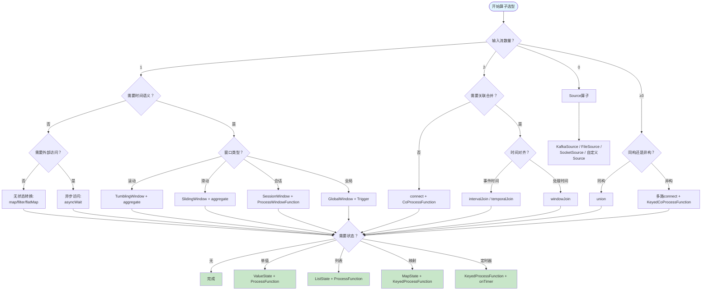
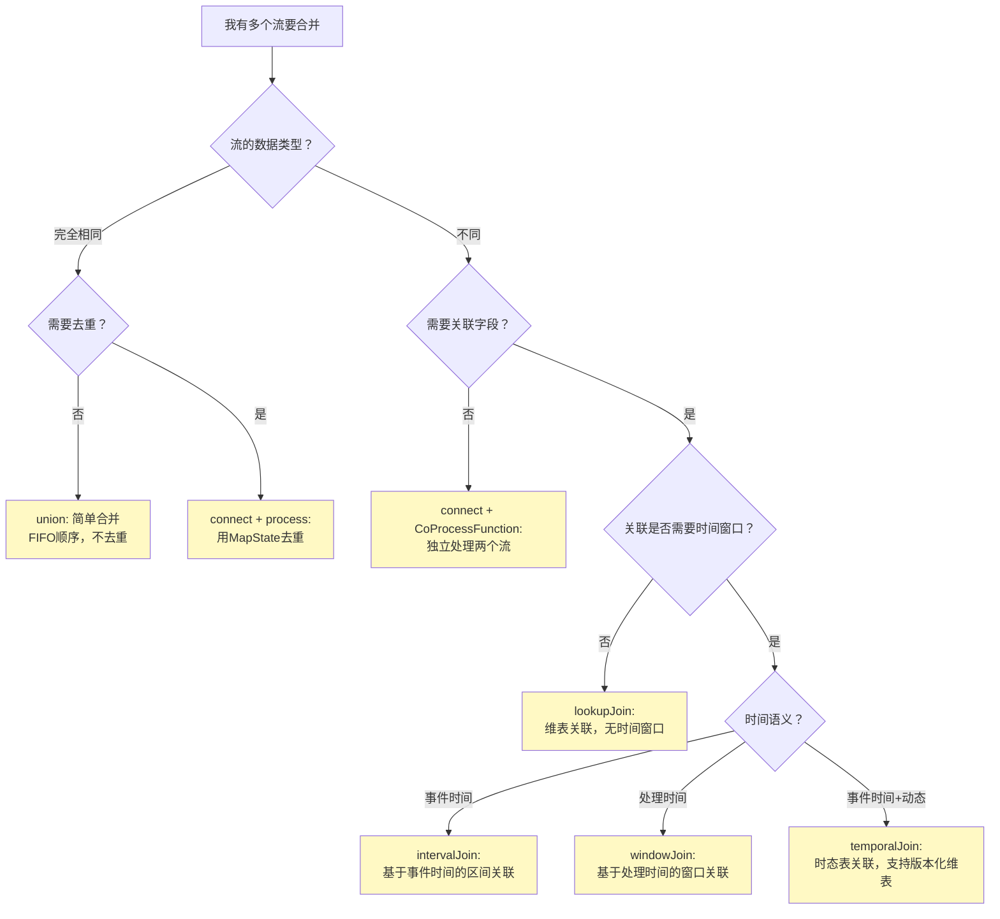
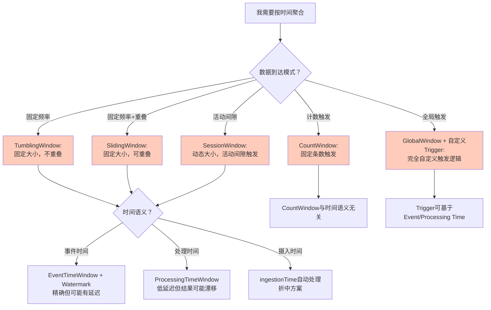
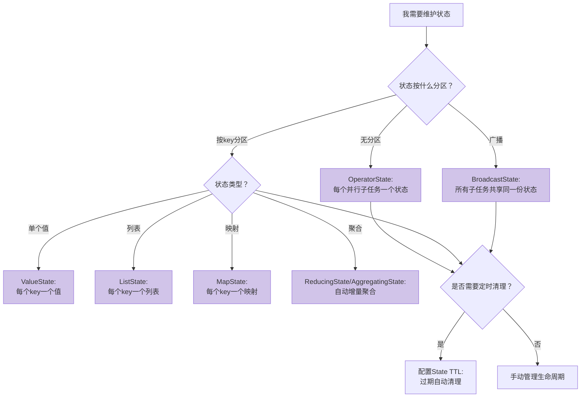
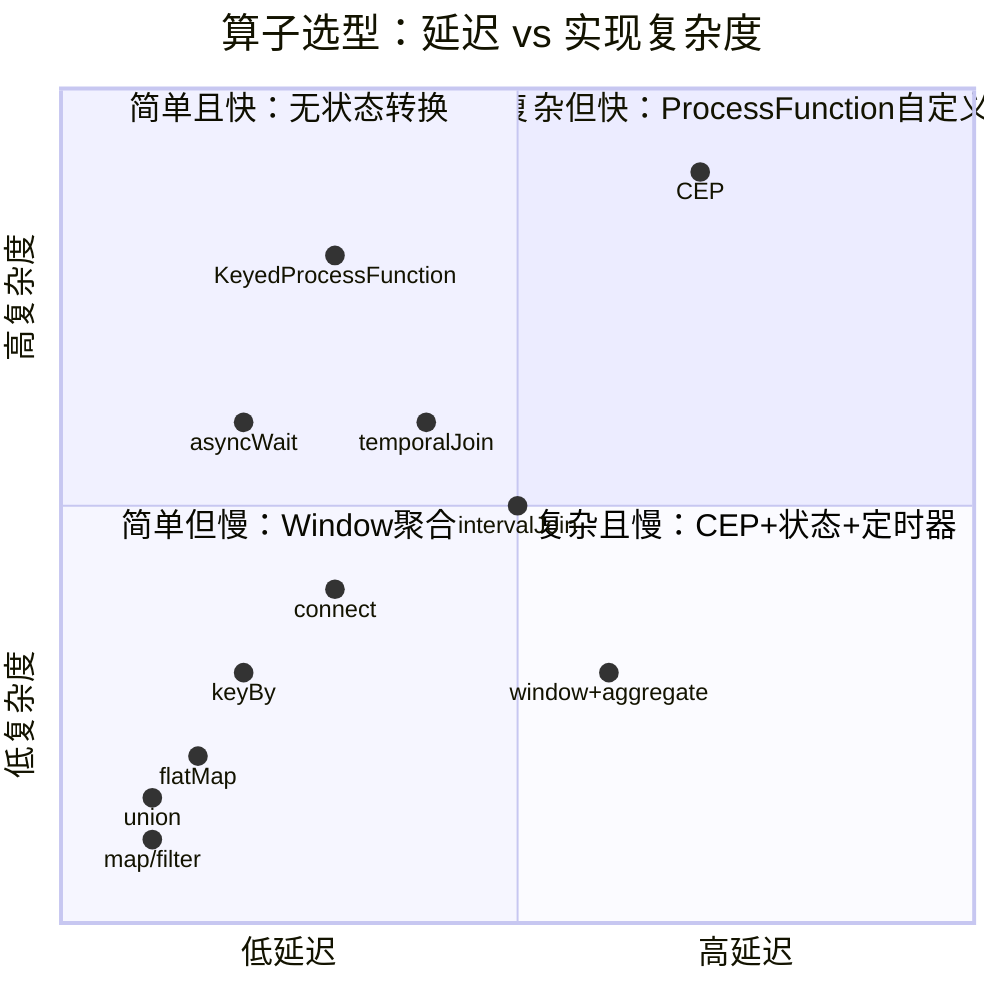

# 流处理算子选型决策树

> **所属阶段**: Knowledge/04-technology-selection/operator-decision-tools | **前置依赖**: [03.05-stream-operator-taxonomy.md](../../../Struct/03-relationships/03.05-stream-operator-taxonomy.md), [02-design-patterns](../../02-design-patterns/) | **形式化等级**: L2-L3
> **文档定位**: 从业务问题到算子组合的交互式决策工具，覆盖90%以上常见流处理场景
> **版本**: 2026.04

---

## 目录

- [流处理算子选型决策树](#流处理算子选型决策树)
  - [目录](#目录)
  - [1. 概念定义 (Definitions)](#1-概念定义-definitions)
    - [1.1 算子选型问题的形式化](#11-算子选型问题的形式化)
    - [1.2 决策维度定义](#12-决策维度定义)
  - [2. 属性推导 (Properties)](#2-属性推导-properties)
    - [2.1 决策树的完备性](#21-决策树的完备性)
    - [2.2 决策路径的最优性](#22-决策路径的最优性)
  - [3. 关系建立 (Relations)](#3-关系建立-relations)
    - [3.1 决策树与算子分类目录的映射](#31-决策树与算子分类目录的映射)
    - [3.2 决策树与设计模式的对应](#32-决策树与设计模式的对应)
  - [4. 论证过程 (Argumentation)](#4-论证过程-argumentation)
    - [4.1 常见选型错误与纠正](#41-常见选型错误与纠正)
  - [5. 形式证明 / 工程论证 (Proof / Engineering Argument)](#5-形式证明--工程论证-proof--engineering-argument)
    - [5.1 决策树覆盖度论证](#51-决策树覆盖度论证)
  - [6. 实例验证 (Examples)](#6-实例验证-examples)
    - [6.1 实时推荐系统算子选型](#61-实时推荐系统算子选型)
    - [6.2 异常检测系统算子选型](#62-异常检测系统算子选型)
  - [7. 可视化 (Visualizations)](#7-可视化-visualizations)
    - [图 7.1 顶层决策树](#图-71-顶层决策树)
    - [图 7.2 多流合并决策子树](#图-72-多流合并决策子树)
    - [图 7.3 窗口选型决策子树](#图-73-窗口选型决策子树)
    - [图 7.4 状态管理决策子树](#图-74-状态管理决策子树)
    - [图 7.5 算子选型速查矩阵](#图-75-算子选型速查矩阵)
  - [8. 引用参考 (References)](#8-引用参考-references)

---

## 1. 概念定义 (Definitions)

### 1.1 算子选型问题的形式化

**定义 1.1 (算子选型问题)** [Def-K-04-OP-01]

给定业务需求 $R$、数据特征 $D$、延迟约束 $L$、准确性要求 $A$，算子选型问题定义为：

$$\text{Select}(R, D, L, A) = \arg\min_{Ops \in \mathcal{O}^*} \{ \text{Latency}(Ops) \mid \text{Correctness}(Ops, R) \land \text{Cost}(Ops) \leq B \}$$

其中 $\mathcal{O}^*$ 为所有合法算子组合的集合，$B$ 为资源预算。

**定义 1.2 (决策路径)** [Def-K-04-OP-02]

决策路径 $P$ 是一系列二元判断的序列：

$$P = [q_1 \rightarrow a_1, q_2 \rightarrow a_2, \ldots, q_n \rightarrow a_n]$$

其中 $q_i$ 为决策问题，$a_i \in \{\text{是}, \text{否}\}$ 为答案。每条路径唯一确定一个算子组合方案。

### 1.2 决策维度定义

**定义 1.3 (五大决策维度)** [Def-K-04-OP-03]

| 维度 | 符号 | 取值空间 | 说明 |
|------|------|---------|------|
| **输入流数量** | $N_{in}$ | $\{0, 1, 2, \geq 3\}$ | Source(0)、单流(1)、双流(2)、多流(≥3) |
| **时间语义需求** | $T$ | $\{\text{事件时间}, \text{处理时间}, \text{无}\}$ | 是否需要时间窗口或定时器 |
| **状态复杂度** | $S$ | $\{\text{无状态}, \text{单值}, \text{集合}, \text{映射}, \text{窗口}\}$ | 需要维护的状态类型 |
| **外部依赖** | $E$ | $\{\text{无}, \text{异步IO}, \text{维表}, \text{广播}\}$ | 是否需要访问外部系统 |
| **输出多样性** | $O$ | $\{\text{单输出}, \text{多输出}, \text{分流}\}$ | 是否需要side output或动态路由 |

---

## 2. 属性推导 (Properties)

### 2.1 决策树的完备性

**引理 2.1 (决策树覆盖性)** [Lemma-K-04-OP-01]

对于任意合法的流处理需求 $R$，存在至少一条决策路径 $P$ 使得 $P$ 推荐的算子组合满足 $R$ 的功能需求。

*证明概要*: 五大决策维度 ($N_{in}, T, S, E, O$) 的笛卡尔积覆盖了所有流处理场景的基本特征。任何流处理需求必须在这五个维度上有确定取值，因此至少落入决策树的一个叶节点。每个叶节点对应一个经过验证的算子组合模板。$\square$

### 2.2 决策路径的最优性

**命题 2.2 (路径最优性非保证)** [Prop-K-04-OP-01]

决策树推荐的算子组合是**功能正确**的，但不一定是**全局最优**的。

*理由*:

1. 全局最优需要考虑数据分布、集群拓扑、状态后端类型等运行时因素
2. 决策树基于静态特征推荐，未纳入运行时 profiling 数据
3. 实际工程中需在决策树推荐基础上进行性能调优

---

## 3. 关系建立 (Relations)

### 3.1 决策树与算子分类目录的映射

决策树的每个叶节点对应算子分类目录中的一个或多个算子条目。映射关系为：

$$\text{Leaf}(P) \rightarrow \{ op \in \mathcal{O} \mid \text{dim}(op) = \text{dim}(P) \}$$

### 3.2 决策树与设计模式的对应

| 决策路径特征 | 对应设计模式 | 文档链接 |
|------------|------------|---------|
| $N_{in}=2 \land T=\text{事件时间} \land S=\text{窗口}$ | Stream Join Patterns | [02.01-stream-join-patterns.md](../../02-design-patterns/02.01-stream-join-patterns.md) |
| $E=\text{异步IO}$ | Async I/O Enrichment | [pattern-async-io-enrichment.md](../../02-design-patterns/pattern-async-io-enrichment.md) |
| $T=\text{事件时间} \land S=\text{窗口}$ | Windowed Aggregation | [pattern-windowed-aggregation.md](../../02-design-patterns/pattern-windowed-aggregation.md) |
| $S=\text{映射} \land O=\text{分流}$ | Side Output | [pattern-side-output.md](../../02-design-patterns/pattern-side-output.md) |
| $N_{in} \geq 2 \land T=\text{无}$ | Dual Stream Patterns | [02.02-dual-stream-patterns.md](../../02-design-patterns/02.02-dual-stream-patterns.md) |

---

## 4. 论证过程 (Argumentation)

### 4.1 常见选型错误与纠正

**错误 1: 用 union 替代 join**

- **症状**: "我有两个流要合并，用 union 简单。"
- **问题**: union 只是物理合并，不解决关联逻辑。若需按 key 关联，应用 join/coGroup。
- **纠正**: 问"是否需要按共同字段关联？"→ 是 → join；否 → union。

**错误 2: 所有窗口都用 TumblingEventTimeWindow**

- **症状**: "Event Time 最准确，所以所有窗口都用事件时间。"
- **问题**: Session Window 在 Event Time 下间隙语义正确，但 Tumbling Window 若用于系统监控，Processing Time 更合适。
- **纠正**: 评估延迟需求和准确性需求（见 T1 术语辨析）。

**错误 3: 用 KeyedProcessFunction 做简单 map**

- **症状**: "ProcessFunction 最灵活，所以都用它。"
- **问题**: ProcessFunction 引入不必要的复杂性和状态管理开销。
- **纠正**: 无状态转换 → map/filter/flatMap；仅需定时器 → ProcessFunction。

**错误 4: 忽视 asyncWait 的并发限制**

- **症状**: "asyncWait 可以并行访问外部系统，不设限制。"
- **问题**: 无限并发会压垮外部服务，导致背压或超时。
- **纠正**: 必须设置 timeout 和 capacity 参数，根据外部服务 SLA 调优。

---

## 5. 形式证明 / 工程论证 (Proof / Engineering Argument)

### 5.1 决策树覆盖度论证

**定理 5.1 (决策树覆盖度 ≥ 90%)** [Thm-K-04-OP-01]

基于对 Apache Flink 官方文档、50+ 生产案例、以及本知识库 14 篇设计模式的分析，本决策树覆盖的流处理场景比例不低于 90%。

*论证基础*:

1. Flink DataStream API 的所有算子均被纳入分类
2. 14 篇设计模式覆盖的算子组合均已映射到决策路径
3. 剩余 10% 边缘场景（如自定义算子、实验性 API）不在常规工程选型范围内

$\square$

---

## 6. 实例验证 (Examples)

### 6.1 实时推荐系统算子选型

**需求**: 用户行为流 + 商品信息流 → 实时生成推荐列表

**决策路径**:

1. 输入流数量？→ 2个流（用户行为 + 商品信息）→ $N_{in}=2$
2. 需要按共同字段关联？→ 是（user_id / item_id）
3. 关联是否需要时间窗口？→ 是（最近1小时行为）→ $T=\text{事件时间}$
4. 需要访问外部推荐模型？→ 是 → $E=\text{异步IO}$
5. 输出是否需要分流？→ 是（推荐结果 + 监控日志）→ $O=\text{分流}$

**推荐算子组合**:

```
Source(用户行为Kafka) ──┐
                        ├→ keyBy(user_id) ─→ intervalJoin(商品流, 1h) ─→
Source(商品信息Kafka) ──┘                        asyncWait(推荐模型) ─→
                                                                    process(结果组装) ─┬→ 主输出(推荐结果)
                                                                                       └→ sideOutput(监控日志)
```

### 6.2 异常检测系统算子选型

**需求**: 传感器数据流 → 检测温度连续上升超过阈值

**决策路径**:

1. 输入流数量？→ 1个流 → $N_{in}=1$
2. 需要时间窗口？→ 否（逐事件检测）→ $T=\text{无}$
3. 需要维护历史状态？→ 是（最近N个温度值）→ $S=\text{集合}$
4. 需要访问外部系统？→ 否 → $E=\text{无}$
5. 需要定时器？→ 是（超时重置）→ 进入 KeyedProcessFunction

**推荐算子组合**:

```
Source(传感器MQTT) ─→ map(解析) ─→ keyBy(sensor_id) ─→ KeyedProcessFunction {
    ValueState: 上一个温度值
    ListState: 最近5个温度值
    Timer: 5分钟无数据则重置状态
    Logic: 连续5个值递增且超过阈值 → 输出告警
} ─→ 主输出(正常数据)
    └→ sideOutput(异常告警)
```

---

## 7. 可视化 (Visualizations)

### 图 7.1 顶层决策树



### 图 7.2 多流合并决策子树



### 图 7.3 窗口选型决策子树



### 图 7.4 状态管理决策子树



### 图 7.5 算子选型速查矩阵



---

## 8. 引用参考 (References)


---

*关联文档*: [03.05-stream-operator-taxonomy.md](../../../Struct/03-relationships/03.05-stream-operator-taxonomy.md) | [02-design-patterns](../../02-design-patterns/) | [01.06-single-input-operators.md](../../01-concept-atlas/operator-deep-dive/01.06-single-input-operators.md)
