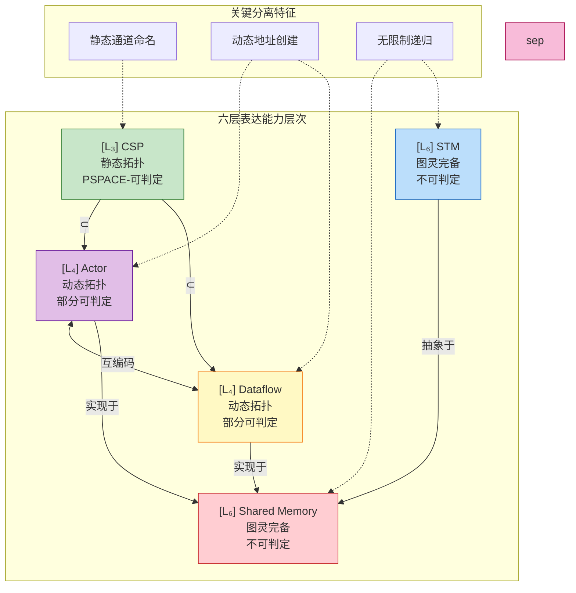
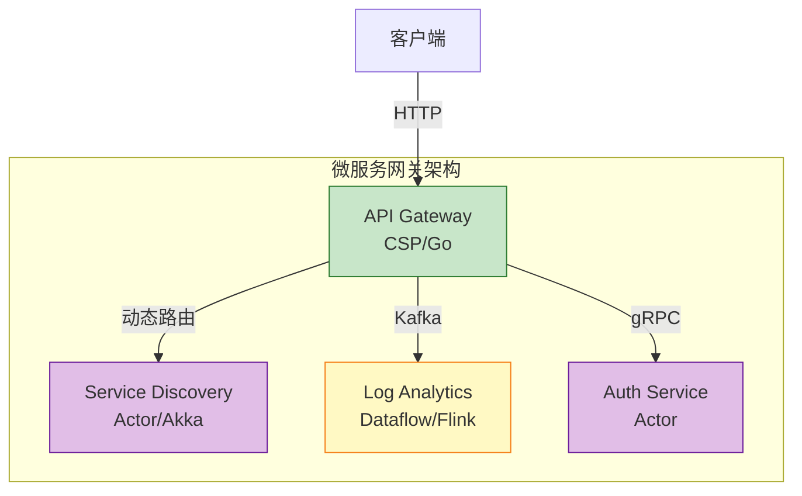
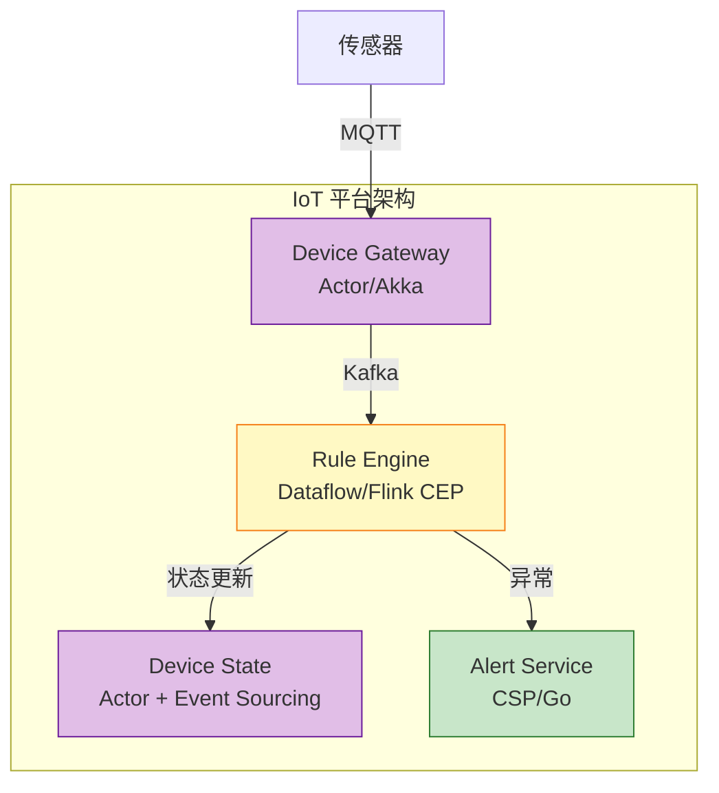
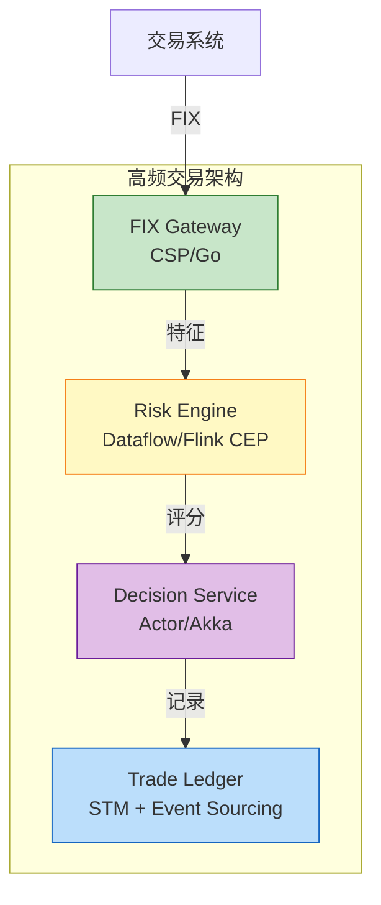
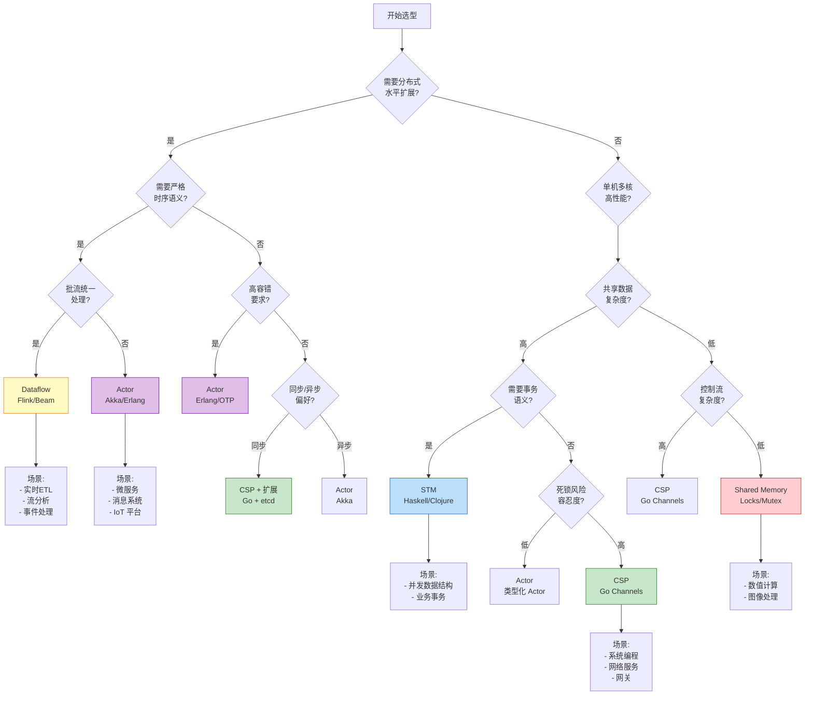
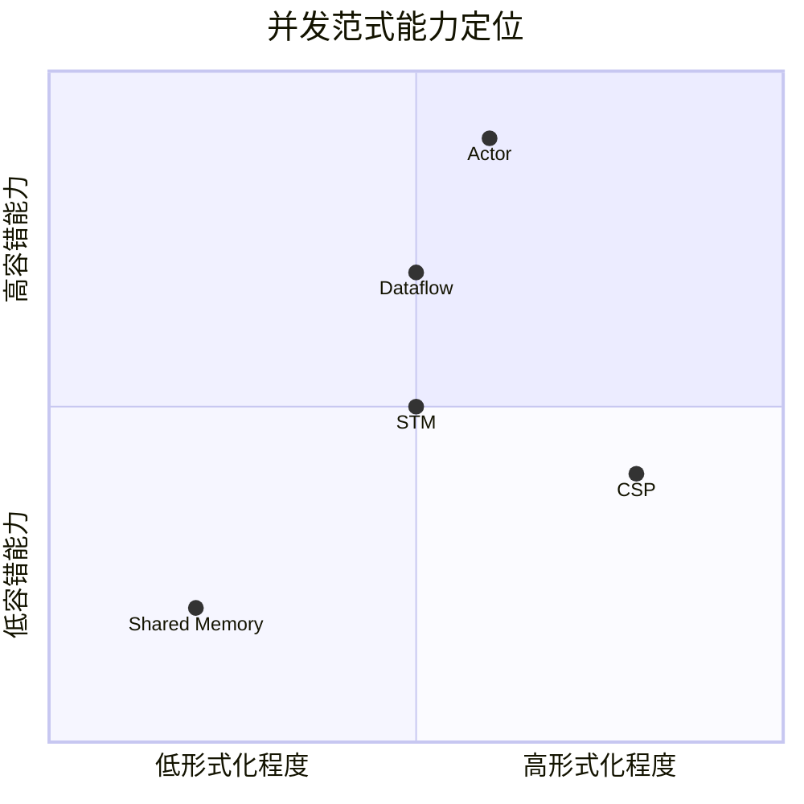
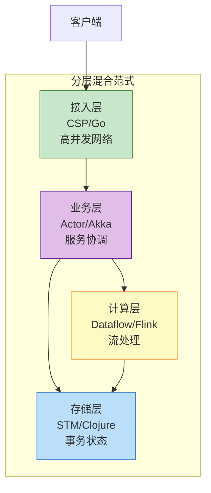

# 并发范式选型指南 (Concurrency Paradigm Selection Guide)

> **所属阶段**: Knowledge | **前置依赖**: [../01-concept-atlas/concurrency-paradigms-matrix.md](../01-concept-atlas/concurrency-paradigms-matrix.md), [../../Struct/03-relationships/03.03-expressiveness-hierarchy.md](../../Struct/03-relationships/03.03-expressiveness-hierarchy.md) | **形式化等级**: L3-L6
> **版本**: 2026.04 | **文档规模**: ~15KB

---

## 目录

- [并发范式选型指南 (Concurrency Paradigm Selection Guide)](#并发范式选型指南-concurrency-paradigm-selection-guide)
  - [目录](#目录)
  - [1. 概念定义 (Definitions)](#1-概念定义-definitions)
    - [Def-K-04-01. 并发范式 (Concurrency Paradigm)](#def-k-04-01-并发范式-concurrency-paradigm)
    - [Def-K-04-02. 选型决策空间 (Selection Decision Space)](#def-k-04-02-选型决策空间-selection-decision-space)
    - [Def-K-04-03. 五大核心范式定义](#def-k-04-03-五大核心范式定义)
      - [Actor 模型](#actor-模型)
      - [CSP (Communicating Sequential Processes)](#csp-communicating-sequential-processes)
      - [Dataflow 模型](#dataflow-模型)
      - [Shared Memory](#shared-memory)
      - [STM (Software Transactional Memory)](#stm-software-transactional-memory)
    - [Def-K-04-04. 范式适配度 (Paradigm Fitness)](#def-k-04-04-范式适配度-paradigm-fitness)
  - [2. 属性推导 (Properties)](#2-属性推导-properties)
    - [Lemma-K-04-01. 表达能力层次与范式映射关系](#lemma-k-04-01-表达能力层次与范式映射关系)
    - [Lemma-K-04-02. 范式组合的可行性边界](#lemma-k-04-02-范式组合的可行性边界)
    - [Prop-K-04-01. 状态隔离度与分布式扩展性的正相关](#prop-k-04-01-状态隔离度与分布式扩展性的正相关)
    - [Prop-K-04-02. 同步语义与形式化可验证性的权衡](#prop-k-04-02-同步语义与形式化可验证性的权衡)
  - [3. 关系建立 (Relations)](#3-关系建立-relations)
    - [3.1 范式与表达能力层次 L1-L6 的映射](#31-范式与表达能力层次-l1-l6-的映射)
    - [3.2 范式间编码关系](#32-范式间编码关系)
    - [3.3 语言实现映射关系](#33-语言实现映射关系)
  - [4. 论证过程 (Argumentation)](#4-论证过程-argumentation)
    - [4.1 场景驱动的选型维度](#41-场景驱动的选型维度)
      - [维度 1: 分布式水平扩展需求](#维度-1-分布式水平扩展需求)
      - [维度 2: 时间语义重要性](#维度-2-时间语义重要性)
      - [维度 3: 容错要求](#维度-3-容错要求)
      - [维度 4: 延迟/吞吐量权衡](#维度-4-延迟吞吐量权衡)
    - [4.2 决策树构建逻辑](#42-决策树构建逻辑)
    - [4.3 反模式识别逻辑](#43-反模式识别逻辑)
  - [5. 形式证明 / 工程论证](#5-形式证明-工程论证-proof-engineering-argument)
    - [5.1 决策正确性论证](#51-决策正确性论证)
    - [5.2 混合范式的工程论证](#52-混合范式的工程论证)
  - [6. 实例验证 (Examples)](#6-实例验证-examples)
    - [6.1 案例 1: 微服务网关系统](#61-案例-1-微服务网关系统)
    - [6.2 案例 2: IoT 实时数据处理平台](#62-案例-2-iot-实时数据处理平台)
    - [6.3 案例 3: 高频交易系统](#63-案例-3-高频交易系统)
    - [6.4 反例: 范式误用的典型场景](#64-反例-范式误用的典型场景)
      - [反例 1: 用 Actor 实现实时竞价系统](#反例-1-用-actor-实现实时竞价系统)
      - [反例 2: 用 Shared Memory 实现高并发网关](#反例-2-用-shared-memory-实现高并发网关)
      - [反例 3: 用 STM 实现分布式事务协调](#反例-3-用-stm-实现分布式事务协调)
  - [7. 可视化 (Visualizations)](#7-可视化-visualizations)
    - [图 7.1: 并发范式选型决策树](#图-71-并发范式选型决策树)
    - [图 7.2: 五大范式能力雷达图](#图-72-五大范式能力雷达图)
    - [图 7.3: 范式-场景适配矩阵](#图-73-范式-场景适配矩阵)
    - [图 7.4: 混合范式架构模式](#图-74-混合范式架构模式)
  - [8. 引用参考 (References)](#8-引用参考-references)

---

## 1. 概念定义 (Definitions)

### Def-K-04-01. 并发范式 (Concurrency Paradigm)

**定义**：并发范式是对并发计算单元之间**交互模式**的根本性抽象，包含三个核心要素：

$$
\mathcal{P} = (C, S, E)
$$

其中：

- $C$：**通信机制** (Communication) —— 单元间信息传递的方式
- $S$：**状态模型** (State) —— 共享或隔离的状态访问策略
- $E$：**执行语义** (Execution) —— 计算触发的驱动方式

**五大范式的核心抽象**：

| 范式 | 通信机制 $C$ | 状态模型 $S$ | 执行语义 $E$ |
|------|-------------|-------------|-------------|
| **Actor** | 异步消息传递 (Mailbox) | 完全隔离 | 消息驱动 |
| **CSP** | 同步通道通信 (Channel) | 完全隔离 | 同步握手 |
| **Dataflow** | 数据流边 (Stream) | 按键分区隔离 | 数据可用性驱动 |
| **Shared Memory** | 直接内存访问 | 完全共享 | 指令顺序驱动 |
| **STM** | 事务边界内共享 | 版本化快照 | 事务提交驱动 |

**定义动机**：范式选择不是技术偏好问题，而是由系统需求的本质特征决定的。通过形式化定义三大要素，可以建立从需求特征到范式选择的映射规则。

---

### Def-K-04-02. 选型决策空间 (Selection Decision Space)

**定义**：选型决策空间 $\mathcal{D}$ 是由四个正交维度张成的决策空间：

$$
\mathcal{D} = D_{dist} \times D_{time} \times D_{fault} \times D_{perf}
$$

其中各维度的取值空间：

| 维度 | 符号 | 取值空间 | 说明 |
|------|------|----------|------|
| **分布式扩展** | $D_{dist}$ | $\{单机, 垂直扩展, 水平扩展\}$ | 系统部署拓扑需求 |
| **时间语义** | $D_{time}$ | $\{无要求, 处理时间, 事件时间\}$ | 对时序正确性的要求 |
| **容错需求** | $D_{fault}$ | $\{无, 应用层, 框架层, 原生\}$ | 故障恢复机制需求 |
| **性能约束** | $D_{perf}$ | $\{低延迟, 高吞吐, 强一致\}$ | 关键性能指标偏好 |

**决策点**：每个具体的系统需求对应决策空间中的一个点 $d \in \mathcal{D}$，范式选型即寻找与该点最近邻的范式集合。

---

### Def-K-04-03. 五大核心范式定义

#### Actor 模型

$$
\text{Actor} = (\alpha, b, M, \sigma)
$$

- $\alpha$：不可伪造地址 (ActorRef)
- $b$：行为函数 $\text{Message} \times \sigma \to \text{Actions} \times \sigma'$
- $M$：Mailbox 消息队列
- $\sigma$：私有状态

**核心特征**：异步消息、位置透明、监督树容错、动态创建

---

#### CSP (Communicating Sequential Processes)

$$
\text{CSP} ::= \text{STOP} \mid \text{SKIP} \mid a \to P \mid P \mathbin{\square} Q \mid P \mathbin{\sqcap} Q \mid P \mathbin{|||} Q \mid P \mathbin{\parallel_A} Q
$$

**核心特征**：同步通信、外部选择、静态命名、组合语义

---

#### Dataflow 模型

$$
\mathcal{G} = (V, E, P, \Sigma, \mathbb{T})
$$

- $V$：算子集合
- $E$：数据依赖边
- $P$：并行度函数 $V \to \mathbb{N}^+$
- $\Sigma$：流类型签名
- $\mathbb{T}$：时间域

**核心特征**：数据驱动执行、DAG 拓扑、时间语义、状态算子

---

#### Shared Memory

$$
\mathcal{M} = (S, L, \mathcal{O}, \mathcal{T})
$$

- $S$：共享状态空间
- $L$：锁集合
- $\mathcal{O}$：操作集合
- $\mathcal{T}$：线程集合

**核心特征**：显式同步、直接内存访问、细粒度控制、竞态风险

---

#### STM (Software Transactional Memory)

$$
\text{STM} = (\mathcal{T}, \mathcal{V}, \mathcal{L}, \text{commit}, \text{abort})
$$

- $\mathcal{T}$：事务集合
- $\mathcal{V}$：版本控制
- $\mathcal{L}$：冲突检测机制

**核心特征**：乐观并发、原子性语义、可组合性、声明式同步

---

### Def-K-04-04. 范式适配度 (Paradigm Fitness)

**定义**：给定系统需求 $d \in \mathcal{D}$ 和范式 $p$，定义**范式适配度**函数：

$$
\text{Fit}(d, p) = \sum_{i=1}^{4} w_i \cdot \text{match}(d_i, p_i)
$$

其中：

- $w_i$ 为维度权重（$\sum w_i = 1$）
- $\text{match}(d_i, p_i) \in [0, 1]$ 为需求与范式在该维度的匹配度

**适配度阈值**：

- $\text{Fit} \geq 0.8$：强烈推荐
- $0.6 \leq \text{Fit} < 0.8$：可用，需权衡
- $\text{Fit} < 0.6$：不推荐，存在更优替代

---

## 2. 属性推导 (Properties)

### Lemma-K-04-01. 表达能力层次与范式映射关系

**陈述**：五大并发范式在六层表达能力层次 L1-L6 上的分布遵循以下映射：

| 范式 | 表达能力层次 | 核心区分特征 |
|------|-------------|-------------|
| CSP | L3 | 静态通道命名、有限状态可判定 |
| Actor | L4 | 动态地址创建、移动性支持 |
| Dataflow | L4 | 动态算子拓扑、数据驱动执行 |
| Shared Memory | L6 | 图灵完备、无限制共享访问 |
| STM | L6 | 图灵完备、事务抽象 |

**推导**：

1. **CSP ∈ L3**：CSP 的通道名在语法层面静态确定，系统运行时的通信拓扑完全由源代码决定。根据 Thm-S-14-01 [^1]，静态拓扑模型属于 L3 层次。

2. **Actor ∈ L4**：Actor 支持运行时动态创建新地址（spawn）和地址传递（将 ActorRef 作为消息内容）。这对应于 π-演算的 $(\nu a)$ 和 $\bar{b}\langle a \rangle$ 操作，属于 L4 的移动性特征。

3. **Dataflow ∈ L4**：Dataflow 的算子拓扑可以在运行时动态调整（如 Flink 的 Rescale），算子间的数据边对应于动态建立的通信通道。根据 03.02-flink-to-process-calculus.md，Flink 可映射到 π-演算，故属于 L4。

4. **Shared Memory ∈ L6**：共享内存模型支持无限制递归和任意数据访问模式，是图灵完备的。由于缺乏结构限制，一般性质验证不可判定。

5. **STM ∈ L6**：STM 在共享内存之上提供事务抽象，但底层仍是图灵完备计算。事务冲突检测增加了运行时开销，但未降低表达能力层次。

---

### Lemma-K-04-02. 范式组合的可行性边界

**陈述**：不同范式的组合可行性由它们的**状态模型兼容性**决定：

| 组合 | 可行性 | 关键约束 |
|------|--------|----------|
| Actor + Dataflow | ✅ 高度可行 | Actor 封装 Dataflow 作业提交 |
| CSP + Dataflow | ✅ 高度可行 | CSP 处理控制流，Dataflow 处理数据流 |
| Actor + CSP | ⚠️ 需谨慎 | 同步/异步语义冲突需协调 |
| STM + Shared Memory | ✅ 可行 | STM 抽象于 Shared Memory 之上 |
| Actor + STM | ❌ 不推荐 | 状态隔离与事务语义冲突 |
| Dataflow + Shared Memory | ⚠️ 有限可行 | 仅限算子内部实现 |

**推导**：

1. **Actor + Dataflow**：Actor 的状态隔离与 Dataflow 的按键分区状态不冲突。Actor 可作为 Dataflow 作业的协调者，负责作业提交、监控和故障恢复。这是 IoT 平台的典型架构。

2. **CSP + Dataflow**：CSP 的同步语义适合控制平面（配置分发、协调信号），Dataflow 的数据驱动适合数据平面（流处理）。两者正交，可分层使用。

3. **Actor + CSP**：Actor 的异步消息传递与 CSP 的同步通信存在语义差异。组合时需要显式适配层（如将 Actor 消息映射为 CSP 事件），可能引入额外的复杂度。

4. **Actor + STM**：Actor 的完全状态隔离意味着每个 Actor 的状态是私有的，而 STM 需要多个事务参与者访问共享状态。两者在状态模型上存在根本冲突。

---

### Prop-K-04-01. 状态隔离度与分布式扩展性的正相关

**陈述**：状态隔离程度与系统的分布式水平扩展能力正相关。

**形式化**：设 $I(s)$ 为状态 $s$ 的隔离度（0=完全共享，1=完全隔离），$E_{dist}$ 为分布式扩展效率，则：

$$
\frac{\partial E_{dist}}{\partial I} > 0
$$

**推导**：

1. **Actor/CSP**：完全状态隔离（$I = 1$），每个计算单元独立，无共享状态需要同步。节点间只需传递消息/事件，天然支持水平扩展到任意节点数。

2. **Dataflow**：按键分区隔离（$I = 0.8$），同键状态需要在同一节点，但不同键可独立分布。支持水平扩展，但受限于键的分布均匀性。

3. **STM**：事务边界内共享（$I = 0.3$），事务参与者需要在同一节点或支持分布式事务协议。分布式 STM 实现复杂，扩展性受限。

4. **Shared Memory**：完全共享（$I = 0$），需要分布式共享内存（DSM）系统支持，网络延迟导致扩展效率急剧下降。

---

### Prop-K-04-02. 同步语义与形式化可验证性的权衡

**陈述**：同步通信语义提供更强的形式化可验证性，但以牺牲吞吐量和灵活性为代价。

**推导**：

1. **CSP 同步通信**：
   - 确定性执行轨迹，便于模型检验
   - FDR 等工具支持死锁/活锁检测
   - 有限状态子集是 PSPACE-可判定的

2. **Actor 异步通信**：
   - 非确定性消息交错，状态空间爆炸
   - 一般性质验证不可判定
   - 依赖测试和运行时监控

3. **工程权衡**：
   - 安全关键系统（航空、核工业）倾向 CSP，接受性能损失
   - 互联网服务倾向 Actor，接受验证不完备

---

## 3. 关系建立 (Relations)

### 3.1 范式与表达能力层次 L1-L6 的映射

**关系说明**：

- **CSP ⊂ Actor/Dataflow**：CSP 的静态通道可被编码为单消息缓冲 Actor/算子，但反向编码因动态拓扑而失败（参见 Thm-S-14-01 [^1]）
- **Actor ≈ Dataflow**：两者图灵完备等价，可通过互编码实现（参见 03.05-cross-model-mappings.md）
- **L4 ⊂ L6**：所有 L4 模型都可以在 Shared Memory 上实现，但会丧失状态隔离带来的容错优势

---

### 3.2 范式间编码关系

基于 [../../Struct/03-relationships/03.01-actor-to-csp-encoding.md](../../Struct/03-relationships/03.01-actor-to-csp-encoding.md) 和 [../../Struct/03-relationships/03.05-cross-model-mappings.md](../../Struct/03-relationships/03.05-cross-model-mappings.md)：

| 源范式 → 目标范式 | 编码存在性 | 语义保持 | 关键限制 |
|-------------------|-----------|----------|----------|
| CSP → Actor | ✅ | 迹等价 | 需模拟同步为请求-应答 |
| Actor → CSP | ⚠️ 受限 | 弱双模拟 | 仅限无动态地址传递的受限 Actor |
| CSP → Dataflow | ✅ | 观察等价 | 通道映射为单并行度算子 |
| Dataflow → CSP | ❌ | — | 动态拓扑无法静态编码 |
| Actor → Dataflow | ✅ | 行为等价 | Actor 映射为 KeyedProcessFunction |
| Dataflow → Actor | ✅ | 行为等价 | 算子映射为 Actor，边映射为消息 |
| STM → Shared Memory | ✅ | 精化关系 | 锁实现事务语义 |
| Shared Memory → STM | ❌ | — | 锁模式无法自动推断 |

---

### 3.3 语言实现映射关系

| 范式 | 主要实现语言/框架 | 核心抽象 | 适用规模 |
|------|------------------|----------|----------|
| **Actor** | Erlang/OTP, Akka (Scala/Java), Pekko | ActorRef, Mailbox, Supervisor | 分布式系统 |
| **CSP** | Go (goroutine/channel), Occam, Crystal | Channel, Select, Goroutine | 系统编程 |
| **Dataflow** | Apache Flink, Apache Beam, TensorFlow | DataStream, Window, Checkpoint | 流处理 |
| **Shared Memory** | Java (synchronized), C++ (std::mutex), Pthreads | Lock, Mutex, Condition Variable | 单机多核 |
| **STM** | Haskell (STM monad), Clojure (refs), Scala STM | TVar, atomically, retry | 并发数据结构 |

**语言-范式绑定强度**：

- **强绑定**：Erlang/Actor（语言级）、Go/CSP（语言级）、Haskell/STM（库级核心）
- **中绑定**：Scala/Actor（Akka 库）、Java/Shared Memory（语言级锁）
- **弱绑定**：Python/所有范式（GIL 限制真正的并发）

---

## 4. 论证过程 (Argumentation)

### 4.1 场景驱动的选型维度

#### 维度 1: 分布式水平扩展需求

| 需求级别 | 特征 | 推荐范式 | 理由 |
|----------|------|----------|------|
| 单机多核 | 垂直扩展，共享内存可用 | Shared Memory, STM, CSP | 低延迟，无网络开销 |
| 同机架集群 | 10-100 节点，低延迟网络 | CSP, Actor | 同步/异步通信均可 |
| 跨地域分布 | 1000+ 节点，高延迟网络 | Actor, Dataflow | 异步解耦，容错原生 |

#### 维度 2: 时间语义重要性

| 需求级别 | 特征 | 推荐范式 | 理由 |
|----------|------|----------|------|
| 无时间要求 | 仅要求最终一致 | Actor, Shared Memory | 简单，无额外开销 |
| 处理时间 | 以处理时间为准 | CSP, Actor | 无乱序处理需求 |
| 事件时间 | 乱序数据正确性 | Dataflow | Watermark 机制 |

#### 维度 3: 容错要求

| 需求级别 | 特征 | 推荐范式 | 理由 |
|----------|------|----------|------|
| 无容错 | 崩溃即终止 | Shared Memory | 简单，无恢复机制 |
| 应用层容错 | 开发者实现恢复 | CSP, STM | 需设计恢复逻辑 |
| 框架层容错 | 监督树/Checkpoint | Actor, Dataflow | 原生支持 |

#### 维度 4: 延迟/吞吐量权衡

| 需求 | 推荐范式 | 典型延迟 | 典型吞吐 |
|------|----------|----------|----------|
| 极低延迟 (< 100μs) | Shared Memory, STM | ~10μs | 中等 |
| 低延迟 (< 1ms) | CSP | ~100μs | 高 |
| 高吞吐 (> 1M msg/s) | Actor, Dataflow | ~1ms | 极高 |

---

### 4.2 决策树构建逻辑

决策树的每个节点对应一个维度判断，路径权重由实际业务需求确定。

**关键决策点**：

1. **分布式扩展？**
   - 是 → 排除 Shared Memory, STM（除非使用 DSM）
   - 否 → 保留所有选项

2. **严格时序语义？**
   - 是 → 倾向 Dataflow（Watermark）
   - 否 → 倾向 Actor/CSP

3. **原生容错要求？**
   - 是 → 倾向 Actor（监督树）/ Dataflow（Checkpoint）
   - 否 → CSP + 应用层恢复亦可

4. **同步/异步偏好？**
   - 同步 → CSP
   - 异步 → Actor

---

### 4.3 反模式识别逻辑

**反模式定义**：在特定场景下选择不适配范式的系统性错误。

| 反模式名称 | 错误场景 | 问题 | 正确选择 |
|-----------|---------|------|----------|
| **Actor 误用于流处理** | 实时分析系统 | 缺乏时间语义、窗口管理复杂 | Dataflow |
| **CSP 误用于动态拓扑** | 微服务发现 | 无法表达运行时通道创建 | Actor |
| **STM 误用于分布式事务** | 跨服务事务 | 分布式 STM 不成熟 | Actor Saga |
| **Shared Memory 误用于高并发** | 网关服务 | 锁竞争、缓存行抖动 | CSP |
| **Dataflow 误用于请求-响应** | API 服务 | 延迟高、资源浪费 | Actor/CSP |

---

## 5. 形式证明 / 工程论证

### 5.1 决策正确性论证

**定理 (范式选型的正确性条件)**：给定系统需求 $d = (d_{dist}, d_{time}, d_{fault}, d_{perf})$，范式 $p$ 是正确选择当且仅当：

$$
\forall i \in \{dist, time, fault, perf\}: \text{capability}(p, i) \geq d_i
$$

**工程论证**：

| 范式 | 分布式能力 | 时间语义 | 容错能力 | 性能特征 |
|------|-----------|----------|----------|----------|
| Actor | 原生支持 | 无 | 监督树 | 高吞吐 |
| CSP | 需扩展 | 无 | 需应用实现 | 低延迟 |
| Dataflow | 原生支持 | Watermark | Checkpoint | 极高吞吐 |
| Shared Memory | 不支持 | 无 | 无 | 极低延迟 |
| STM | 不支持 | 无 | 事务回滚 | 中等延迟 |

**推论**：

- 若 $d_{dist} = $"水平扩展" 且 $d_{fault} = $"原生" → 正确选择 ∈ {Actor, Dataflow}
- 若 $d_{perf} = $"低延迟" 且 $d_{dist} = $"单机" → 正确选择 ∈ {CSP, STM}

---

### 5.2 混合范式的工程论证

**论证**：现代复杂系统应采用分层混合范式架构。

**分层选型原则**：

| 架构层次 | 职责 | 推荐范式 | 理由 |
|----------|------|----------|------|
| 接入层 | 连接管理、协议处理 | CSP | 高并发、低延迟 |
| 业务层 | 服务协调、状态机 | Actor | 容错、弹性 |
| 计算层 | 流处理、批处理 | Dataflow | 时间语义、水平扩展 |
| 存储层 | 事务性状态 | STM | 一致性、可组合性 |

**论证实例**：

1. **IoT 平台（Actor + Dataflow）**：
   - 设备网关使用 Actor：每个设备一个 Actor，天然支持百万连接
   - 数据处理使用 Dataflow：传感器数据流需要窗口聚合和乱序处理
   - 边界：Actor 将设备数据发送到 Dataflow Source

2. **网关系统（CSP + Dataflow）**：
   - 请求处理使用 CSP：Go 的高性能网络栈处理 HTTP/gRPC
   - 日志处理使用 Dataflow：请求日志实时分析
   - 边界：异步 Channel 将日志发送到 Dataflow

---

## 6. 实例验证 (Examples)

### 6.1 案例 1: 微服务网关系统

**场景需求**：

- 10万+ QPS 的 HTTP 请求处理
- 请求路由、认证、限流
- 请求日志实时分析
- 服务发现动态更新

**范式选型**：

**选型理由**：

1. **API Gateway (CSP/Go)**：Go 的 goroutine 和 channel 提供极高的并发处理能力，select 语句完美支持超时和取消语义。

2. **Service Discovery (Actor)**：服务注册/发现需要容错和弹性，Akka 的监督树确保高可用。

3. **Log Analytics (Dataflow)**：日志数据为无界流，需要窗口聚合统计 QPS、延迟分布等。

4. **Auth Service (Actor)**：认证状态需要容错，Actor 的状态隔离确保认证令牌安全。

---

### 6.2 案例 2: IoT 实时数据处理平台

**场景需求**：

- 100万+ 设备并发连接
- 传感器数据实时采集
- 异常检测与告警
- 设备状态管理

**范式选型**：

**选型理由**：

1. **Device Gateway (Actor)**：每个设备映射为一个 Actor，监督树处理设备 Actor 故障，支持热更新。

2. **Rule Engine (Dataflow CEP)**：传感器数据流需要复杂事件处理（CEP）模式匹配，Flink CEP 提供声明式模式定义。

3. **Device State (Actor + Event Sourcing)**：设备状态通过事件溯源持久化，支持状态回溯和审计。

4. **Alert Service (CSP)**：告警需要低延迟推送，Go 的高性能网络栈满足要求。

---

### 6.3 案例 3: 高频交易系统

**场景需求**：

- 微秒级延迟要求
- 复杂风控规则计算
- 事务一致性
- 审计与合规

**范式选型**：

**选型理由**：

1. **FIX Gateway (CSP)**：金融交易对延迟极度敏感，Go 的低 GC 开销满足要求。

2. **Risk Engine (Dataflow CEP)**：风控规则需要模式匹配（如连续大单），Flink CEP 支持声明式规则。

3. **Decision Service (Actor)**：决策需要高可用，监督树确保服务持续可用。

4. **Trade Ledger (STM)**：交易记录需要原子性，STM 保证事务一致性，事件溯源提供审计追踪。

---

### 6.4 反例: 范式误用的典型场景

#### 反例 1: 用 Actor 实现实时竞价系统

**场景**：尝试用 Akka 实现实时广告竞价（RTB）

**问题**：

- Actor 缺乏内置时间语义，无法定义竞价窗口
- Mailbox FIFO 与事件时间顺序不一致
- 需要自行实现 Exactly-Once 语义

**后果**：延迟高、竞价错误率上升

**正确做法**：采用 Dataflow（Flink），利用 Watermark 和窗口算子

---

#### 反例 2: 用 Shared Memory 实现高并发网关

**场景**：尝试用 Java synchronized 实现 API 网关

**问题**：

- 粗粒度锁导致严重线程竞争
- 细粒度锁设计复杂，易死锁
- 难以水平扩展到多机

**后果**：吞吐量瓶颈，延迟不稳定

**正确做法**：采用 CSP（Go），利用 goroutine 轻量并发

---

#### 反例 3: 用 STM 实现分布式事务协调

**场景**：尝试用 STM 实现跨服务 Saga

**问题**：

- STM 主要针对单机共享内存
- 分布式 STM 不成熟，冲突检测困难
- 缺乏故障恢复机制

**后果**：数据不一致，恢复困难

**正确做法**：采用 Actor Saga 模式或 Dataflow 两阶段提交

---

## 7. 可视化 (Visualizations)

### 图 7.1: 并发范式选型决策树

---

### 图 7.2: 五大范式能力雷达图

**解读**：

- **Actor**：高容错、中等形式化（监督树可验证）
- **CSP**：高形式化（FDR 验证）、中等容错
- **Dataflow**：中等形式化（时间语义可验证）、中高容错
- **Shared Memory**：低形式化、低容错
- **STM**：中等形式化（事务逻辑）、中等容错

---

### 图 7.3: 范式-场景适配矩阵

| 场景特征 | Actor | CSP | Dataflow | Shared Memory | STM |
|----------|-------|-----|----------|---------------|-----|
| **微服务** | ⭐⭐⭐⭐⭐ | ⭐⭐⭐ | ⭐⭐ | ⭐ | ⭐⭐ |
| **流处理** | ⭐⭐ | ⭐⭐⭐ | ⭐⭐⭐⭐⭐ | ⭐ | ⭐⭐ |
| **网关/API** | ⭐⭐⭐ | ⭐⭐⭐⭐⭐ | ⭐⭐ | ⭐⭐ | ⭐⭐ |
| **IoT 平台** | ⭐⭐⭐⭐⭐ | ⭐⭐ | ⭐⭐⭐⭐⭐ | ⭐ | ⭐ |
| **高频交易** | ⭐⭐ | ⭐⭐⭐⭐⭐ | ⭐⭐⭐ | ⭐⭐⭐⭐ | ⭐⭐⭐ |
| **游戏服务器** | ⭐⭐⭐⭐⭐ | ⭐⭐⭐ | ⭐⭐ | ⭐⭐ | ⭐ |
| **数据处理** | ⭐⭐⭐ | ⭐⭐ | ⭐⭐⭐⭐⭐ | ⭐⭐⭐ | ⭐⭐ |
| **并发数据结构** | ⭐⭐ | ⭐⭐⭐ | ⭐ | ⭐⭐⭐ | ⭐⭐⭐⭐⭐ |

**图例**：⭐ 越多表示适配度越高

---

### 图 7.4: 混合范式架构模式

**模式说明**：

| 层次 | 范式 | 职责 | 技术选型 |
|------|------|------|----------|
| 接入层 | CSP | 网络接入、协议处理 | Go + gRPC |
| 业务层 | Actor | 服务编排、状态机 | Akka + Kubernetes |
| 计算层 | Dataflow | 流处理、实时分析 | Flink + Kafka |
| 存储层 | STM | 事务性状态管理 | Clojure + Datomic |

---

## 8. 引用参考 (References)

[^1]: [../../Struct/03-relationships/03.03-expressiveness-hierarchy.md](../../Struct/03-relationships/03.03-expressiveness-hierarchy.md) — 六层表达能力层次定理

---

*文档版本: 2026.04 | 形式化等级: L3-L6 | 状态: 完成*
*文档规模: ~15KB | 决策树: 1个 | 对比矩阵: 6个 | 案例: 3个*
