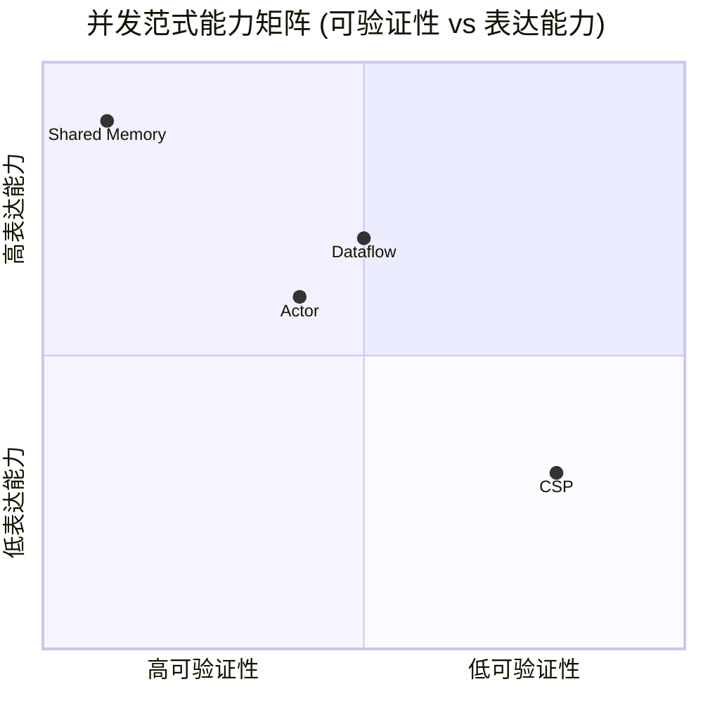
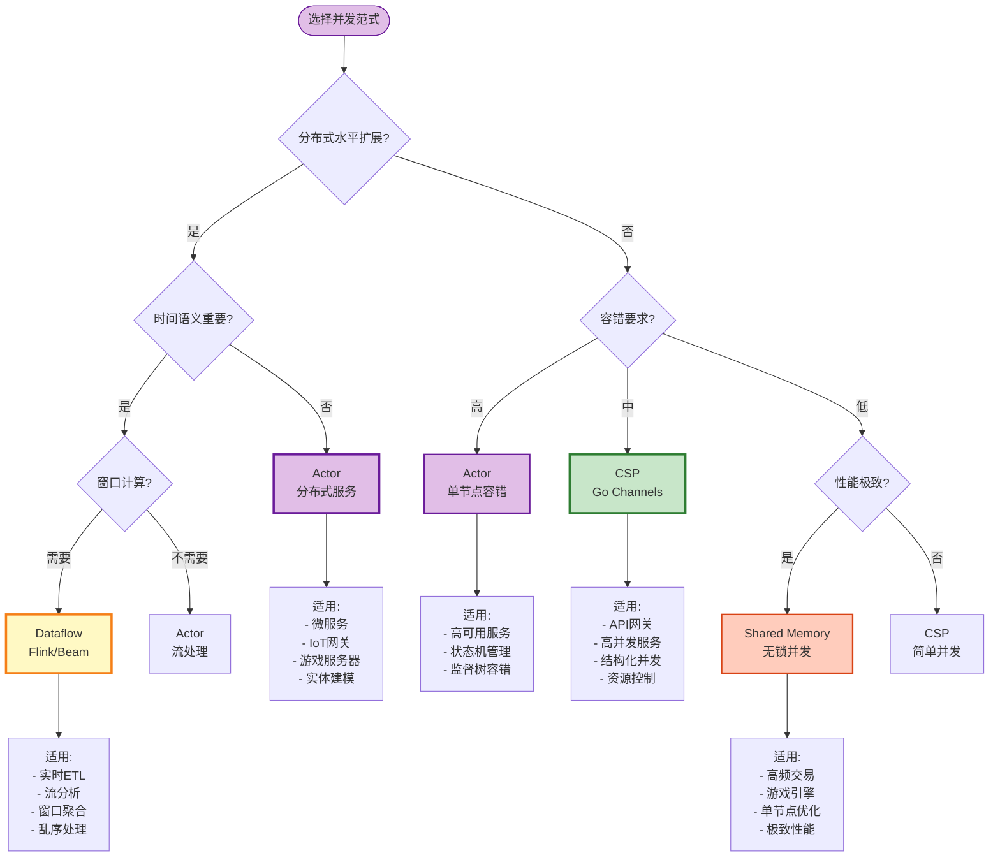
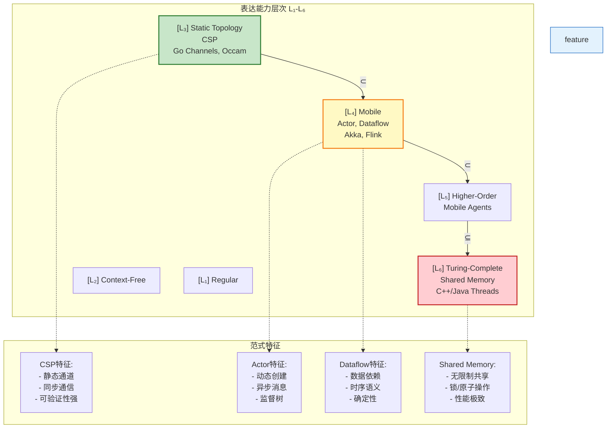

# 并发范式选型指南 (Concurrency Paradigm Selection Guide)

> **所属阶段**: Knowledge/04-technology-selection | **前置依赖**: [../01-concept-atlas/concurrency-paradigms-matrix.md](../01-concept-atlas/concurrency-paradigms-matrix.md), [../../Struct/03-relationships/03.03-expressiveness-hierarchy.md](../../Struct/03-relationships/03.03-expressiveness-hierarchy.md) | **形式化等级**: L3-L5

---

## 目录

- [并发范式选型指南 (Concurrency Paradigm Selection Guide)](#并发范式选型指南-concurrency-paradigm-selection-guide)
  - [目录](#目录)
  - [1. 概念定义 (Definitions)](#1-概念定义-definitions)
    - [Def-K-04-05. 并发范式 (Concurrency Paradigm)](#def-k-04-05-并发范式-concurrency-paradigm)
    - [Def-K-04-06. 表达能力层次映射 (L1-L6 Mapping)](#def-k-04-06-表达能力层次映射-l1-l6-mapping)
    - [Def-K-04-07. 分布式扩展维度 (Distributed Scaling Dimension)](#def-k-04-07-分布式扩展维度-distributed-scaling-dimension)
    - [Def-K-04-08. 时间语义重要性 (Temporal Semantics Importance)](#def-k-04-08-时间语义重要性-temporal-semantics-importance)
  - [2. 属性推导 (Properties)](#2-属性推导-properties)
    - [Lemma-K-04-03. Actor 模型无共享状态保证](#lemma-k-04-03-actor-模型无共享状态保证)
    - [Lemma-K-04-04. CSP 组合性限制](#lemma-k-04-04-csp-组合性限制)
    - [Prop-K-04-02. Dataflow 模型确定性保证](#prop-k-04-02-dataflow-模型确定性保证)
    - [Prop-K-04-03. 范式可验证性递减律](#prop-k-04-03-范式可验证性递减律)
  - [3. 关系建立 (Relations)](#3-关系建立-relations)
    - [关系 1: 范式与业务场景映射](#关系-1-范式与业务场景映射)
    - [关系 2: 范式组合的可能性](#关系-2-范式组合的可能性)
    - [关系 3: 范式与编程语言生态绑定](#关系-3-范式与编程语言生态绑定)
  - [4. 论证过程 (Argumentation)](#4-论证过程-argumentation)
    - [论证 1: 水平扩展需求的刚性选择](#论证-1-水平扩展需求的刚性选择)
    - [论证 2: 时间语义的重要性评估](#论证-2-时间语义的重要性评估)
    - [论证 3: 容错要求与监督机制](#论证-3-容错要求与监督机制)
  - [5. 工程论证 (Engineering Argument)](#5-工程论证-engineering-argument)
    - [范式选型决策矩阵](#范式选型决策矩阵)
    - [范式演进趋势分析](#范式演进趋势分析)
  - [6. 实例验证 (Examples)](#6-实例验证-examples)
    - [示例 1: 实时推荐系统范式选型](#示例-1-实时推荐系统范式选型)
    - [示例 2: IoT 设备管理平台范式选型](#示例-2-iot-设备管理平台范式选型)
    - [示例 3: 高并发 API 网关范式选型](#示例-3-高并发-api-网关范式选型)
    - [示例 4: 高频交易系统范式选型](#示例-4-高频交易系统范式选型)
    - [示例 5: 错误范式选型案例分析](#示例-5-错误范式选型案例分析)
  - [7. 可视化 (Visualizations)](#7-可视化-visualizations)
    - [图 7.1: 并发范式对比矩阵](#图-71-并发范式对比矩阵)
    - [图 7.2: 范式选型决策树](#图-72-范式选型决策树)
    - [图 7.3: 范式与表达能力层次对应图](#图-73-范式与表达能力层次对应图)
    - [图 7.4: 范式能力雷达图 (文本表格)](#图-74-范式能力雷达图-文本表格)
  - [8. 引用参考 (References)](#8-引用参考-references)
  - [关联文档](#关联文档)

---

## 1. 概念定义 (Definitions)

### Def-K-04-05. 并发范式 (Concurrency Paradigm)

并发范式是定义**计算单元交互方式**的抽象模型，由四元组定义：

$$
\mathcal{P} = (A_{\text{actor}}, C_{\text{coord}}, S_{\text{state}}, M_{\text{failure}})
$$

| 组件 | 定义 | Actor | CSP | Dataflow | Shared Memory |
|------|------|-------|-----|----------|---------------|
| $A_{\text{actor}}$ | 计算单元 | Actor (封装状态) | 进程 | 算子 (Operator) | 线程 |
| $C_{\text{coord}}$ | 协调机制 | 异步消息 | 同步通道 | 数据依赖图 | 锁/原子操作 |
| $S_{\text{state}}$ | 状态模型 | 私有 + 消息传递 | 显式通信 | 算子本地状态 | 共享内存 |
| $M_{\text{failure}}$ | 故障模型 | 监督树 | 进程重启 | Checkpoint | 无原生支持 |

**定义动机**：不同范式对应不同的编程心智模型和运行时特性，选型本质是选择**状态管理**与**通信协调**的权衡策略 [^1]。

---

### Def-K-04-06. 表达能力层次映射 (L1-L6 Mapping)

并发范式与 Struct/ 定义的表达能力层次 $L_1$-$L_6$ 的对应关系：

| 层次 | 表达能力 | 并发范式 | 代表语言/框架 | 可判定性 |
|------|----------|----------|---------------|----------|
| $L_3$ | 静态拓扑 | **CSP** | Go channels, Occam | EXPTIME |
| $L_4$ | 动态拓扑 | **Actor**, **Dataflow** | Akka, Flink, Erlang | 部分可判定 |
| $L_5$ | 高阶移动 | **移动 Agent** | Mobile Ambients | 大部分不可判定 |
| $L_6$ | 图灵完备 | Shared Memory | C++/Java threads | 完全不可判定 |

**关键区分**：

- CSP ($L_3$)：通道名在编译期固定，无法动态创建
- Actor/Dataflow ($L_4$)：支持运行时动态创建 Actor/算子
- Shared Memory ($L_6$)：无限制共享状态，验证最困难

---

### Def-K-04-07. 分布式扩展维度 (Distributed Scaling Dimension)

定义分布式扩展能力为三元组：

$$
\vec{S}_{\text{dist}} = (H_{\text{horizontal}}, V_{\text{elasticity}}, L_{\text{locality}})
$$

| 维度 | 定义 | 衡量标准 |
|------|------|----------|
| $H_{\text{horizontal}}$ | 水平扩展能力 | 节点数增加时吞吐线性增长 |
| $V_{\text{elasticity}}$ | 弹性伸缩能力 | 动态增减节点无中断 |
| $L_{\text{locality}}$ | 数据本地性 | 计算向数据迁移的能力 |

---

### Def-K-04-08. 时间语义重要性 (Temporal Semantics Importance)

定义时间语义重要性为场景对**事件时序准确性**的敏感程度：

$$
I_{\text{time}} = f(\text{out-of-order}, \text{late-data}, \text{result-determinism})
$$

| 重要性级别 | 特征 | 典型场景 |
|------------|------|----------|
| **高** | 必须处理乱序、迟到数据 | 金融交易、IoT传感器 |
| **中** | 允许近似时序 | 实时监控、推荐系统 |
| **低** | 仅处理顺序到达数据 | 日志聚合、简单ETL |

---

## 2. 属性推导 (Properties)

### Lemma-K-04-03. Actor 模型无共享状态保证

**陈述**：在纯 Actor 模型中，任意时刻系统状态变更仅发生在单个 Actor 内部，形式化表述为：

$$
\forall t. \forall s_t \in \text{State}. \Delta s_t = f(a_i, m_j) \Rightarrow a_i \text{ 是唯一的}
$$

其中 $a_i$ 为接收消息 $m_j$ 的 Actor。

**推导**：

1. Actor 模型核心原则：状态封装，不共享
2. 消息传递是唯一的交互方式
3. 因此状态变更只能由消息接收触发
4. 每个消息只有一个接收者
5. 故任意时刻只有一个 Actor 在执行状态变更 ∎

**工程意义**：消除了数据竞争 (data race) 的可能性，但引入了顺序不确定性。

---

### Lemma-K-04-04. CSP 组合性限制

**陈述**：CSP 的静态通道拓扑限制了其表达动态连接模式的能力。对于进程集合 $P = \{p_1, ..., p_n\}$，若通道集合 $C$ 在编译期固定，则无法表达运行时进程动态发现。

**推导**：

1. CSP 通道 $c \in C$ 在语法层面声明
2. 运行时无法创建新通道名
3. 新进程 $p_{n+1}$ 加入时，若需与现有进程通信，必须复用预定义通道
4. 这要求所有可能的通信模式在编译期预知
5. 动态服务发现、移动代理等场景无法原生表达 ∎

**关联 Struct/**：见 [Struct/03-relationships/03.03-expressiveness-hierarchy.md](../../Struct/03-relationships/03.03-expressiveness-hierarchy.md) 中 $L_3 \subset L_4$ 的严格分离证明。

---

### Prop-K-04-02. Dataflow 模型确定性保证

**陈述**：在 Dataflow 模型中，若满足以下条件，则计算结果确定性得到保证：

$$
\text{Determinism} \iff \text{Event Time Ordering} \land \text{Watermark Monotonicity}
$$

**推导**：

1. Dataflow 算子通过数据依赖触发执行
2. 若使用 Event Time 而非 Processing Time，乱序可通过 Watermark 处理
3. Watermark 单调性保证不会"错过"已到达窗口的数据
4. 因此对于相同的输入事件集合，输出结果唯一确定 ∎

**关联 Struct/**：见 [Struct/02-properties/02.03-watermark-monotonicity.md](../../Struct/02-properties/02.03-watermark-monotonicity.md) 中 Watermark 单调性定理。

---

### Prop-K-04-03. 范式可验证性递减律

**陈述**：并发范式的表达能力与可验证性呈负相关：

$$
\text{Expressiveness}(\mathcal{P}) \uparrow \Rightarrow \text{Verifiability}(\mathcal{P}) \downarrow
$$

**证据**：

| 范式 | 表达能力层次 | 形式化验证工具 | 可验证性质 |
|------|-------------|----------------|------------|
| CSP | $L_3$ | FDR, PAT | 死锁自由、活锁自由、时序逻辑 |
| Actor | $L_4$ | 有限工具支持 | 类型安全、部分死锁检测 |
| Dataflow | $L_4$ | 自定义分析 | Watermark 单调性、确定性 |
| Shared Memory | $L_6$ | 无完备工具 | 仅局部性质 |

---

## 3. 关系建立 (Relations)

### 关系 1: 范式与业务场景映射

| 业务场景 | 推荐范式 | 理由 | 典型实现 |
|----------|----------|------|----------|
| **微服务架构** | Actor | 服务解耦、故障隔离 | Akka, Orleans |
| **实时流处理** | Dataflow | 时序处理、窗口计算 | Flink, Beam |
| **高并发网关** | CSP | 结构化并发、资源控制 | Go, Kotlin协程 |
| **并行计算** | Shared Memory | 细粒度共享、性能极致 | OpenMP, TBB |
| **游戏服务器** | Actor | 玩家会话管理、状态封装 | Akka, Erlang |
| **IoT数据处理** | Dataflow | 乱序处理、迟到数据 | Flink |

---

### 关系 2: 范式组合的可能性

现代系统常组合多种范式：

```
┌─────────────────────────────────────────────────────────┐
│                   混合范式架构示例                        │
├─────────────────────────────────────────────────────────┤
│  接入层: Actor (Akka HTTP)                                │
│      │  每个连接一个 Actor，管理会话状态                    │
│      ▼                                                   │
│  处理层: Dataflow (Flink)                                 │
│      │  流处理引擎，处理时序数据                            │
│      ▼                                                   │
│  协调层: CSP (Go channels)                                │
│      │  内部组件间同步通信                                  │
│      ▼                                                   │
│  存储层: Shared Memory (本地缓存)                          │
└─────────────────────────────────────────────────────────┘
```

**组合原则**：

- 外部接口层使用 Actor（解耦、容错）
- 数据处理核心使用 Dataflow（时序、确定性）
- 内部组件协调使用 CSP（结构化、可控）
- 性能关键路径使用 Shared Memory（极致性能）

---

### 关系 3: 范式与编程语言生态绑定

| 范式 | 主要语言 | 运行时特性 | 学习曲线 |
|------|----------|------------|----------|
| Actor | Scala (Akka), Erlang, Java | 轻量级线程 (M:N) | 陡峭 |
| CSP | Go, Kotlin, Rust | 协程/绿色线程 | 中等 |
| Dataflow | Java (Flink), Python (Beam) | JVM/托管运行时 | 中等 |
| Shared Memory | C++, Java, Rust | OS线程 | 平缓 |

---

## 4. 论证过程 (Argumentation)

### 论证 1: 水平扩展需求的刚性选择

**决策逻辑**：

```
需要水平扩展?
├── 否 ──► 单节点足够
│           ├── 性能极致 ──► Shared Memory
│           └── 结构化并发 ──► CSP
│
└── 是 ──► 分布式架构
            ├── 时序处理重要? ──► Dataflow
            └── 服务解耦优先? ──► Actor
```

**关键区分**：

- **Actor**：适合实体建模（每个用户一个 Actor，每个设备一个 Actor）
- **Dataflow**：适合数据处理（ETL、聚合、窗口计算）
- 两者都支持水平扩展，但编程模型截然不同

---

### 论证 2: 时间语义的重要性评估

**场景分析**：

| 场景特征 | 时间语义重要性 | 推荐范式 | 关键机制 |
|----------|---------------|----------|----------|
| 传感器数据乱序严重 | 高 | Dataflow | Watermark + Event Time |
| 金融交易需精确时序 | 高 | Dataflow | 单调 Watermark + 允许延迟 |
| 日志收集（顺序到达） | 低 | Actor/Dataflow | Processing Time 即可 |
| 用户行为实时分析 | 中 | Actor/Dataflow | 近似时序可接受 |

**关键论点**：若业务需要处理**乱序数据**或定义**时间窗口**，Dataflow 模型是唯一选择。Actor 和 CSP 缺乏原生时间语义支持。

---

### 论证 3: 容错要求与监督机制

**容错能力对比**：

| 范式 | 故障隔离 | 自动恢复 | 监督机制 | 适用场景 |
|------|----------|----------|----------|----------|
| Actor | ★★★★★ | ★★★★★ | 监督树 (Supervision Tree) | 高可用服务 |
| Dataflow | ★★★★☆ | ★★★★☆ | Checkpoint + 重放 | 数据处理 |
| CSP | ★★★☆☆ | ★★☆☆☆ | 进程重启 | 系统编程 |
| Shared Memory | ★☆☆☆☆ | ★☆☆☆☆ | 无 | 非关键计算 |

**决策原则**：

- 服务连续性要求极高 → Actor（监督树隔离故障）
- 数据处理完整性优先 → Dataflow（Checkpoint 保证状态）
- 资源受限嵌入式系统 → CSP（轻量级进程）

---

## 5. 工程论证 (Engineering Argument)

### 范式选型决策矩阵

**多维度评估框架**：

| 评估维度 | 权重 | Actor | CSP | Dataflow | Shared Memory |
|----------|------|-------|-----|----------|---------------|
| 分布式扩展 | 0.25 | 5 | 3 | 5 | 1 |
| 时间语义支持 | 0.20 | 2 | 1 | 5 | 1 |
| 容错能力 | 0.20 | 5 | 3 | 4 | 1 |
| 开发效率 | 0.15 | 3 | 4 | 4 | 3 |
| 性能上限 | 0.10 | 3 | 4 | 4 | 5 |
| 学习曲线 | 0.10 | 2 | 4 | 3 | 5 |
| **加权总分** | 1.00 | **3.75** | **3.05** | **4.35** | **2.25** |

**结论**：

- **Dataflow** 在分布式流处理场景综合得分最高
- **Actor** 在服务解耦和容错场景表现最优
- **CSP** 适合结构化并发和系统编程
- **Shared Memory** 仅在单节点性能关键场景考虑

---

### 范式演进趋势分析

**行业趋势** (2024-2026)：

1. **Dataflow 主流化**：Flink 成为实时计算事实标准，Dataflow 模型被广泛接受
2. **Actor 云原生化**：Akka 演进为 Pekko，与 Kubernetes 深度集成
3. **CSP 协程化**：Go 的 goroutine 模型影响 Kotlin、Java 虚拟线程发展
4. **Shared Memory 局限化**：仅在高性能计算 (HPC) 和单节点优化场景保留

---

## 6. 实例验证 (Examples)

### 示例 1: 实时推荐系统范式选型

**业务需求**：

- 处理用户点击流，实时更新推荐
- 需要处理乱序点击（网络延迟）
- 用户画像需维护大状态
- 需要精确去重（不能重复推荐）

**选型分析**：

```
乱序处理 ──► Dataflow (Watermark)
大状态管理 ──► Dataflow (RocksDB StateBackend)
精确去重 ──► Dataflow (Exactly-Once)

推荐: Dataflow (Flink)
```

**架构**：

```
Kafka (点击流)
    │
    ▼
Flink Dataflow
    ├── Watermark 处理乱序
    ├── Keyed State 维护用户画像
    └── Window Aggregate 实时特征
    │
    ▼
推荐服务
```

---

### 示例 2: IoT 设备管理平台范式选型

**业务需求**：

- 100万+ 设备连接
- 每个设备独立状态（在线/离线/固件版本）
- 设备故障需隔离，不影响其他设备
- 支持设备指令下发

**选型分析**：

```
实体建模 ──► Actor (每个设备一个 Actor)
故障隔离 ──► Actor (监督树)
状态封装 ──► Actor (私有状态)

推荐: Actor (Akka)
```

**架构**：

```
MQTT Broker
    │
    ▼
Akka Actor System
    ├── DeviceActor (百万级实例)
    │       ├── 管理设备状态
    │       └── 处理设备消息
    ├── GatewayActor
    │       └── 连接管理
    └── Supervisor
            └── 故障恢复策略
```

---

### 示例 3: 高并发 API 网关范式选型

**业务需求**：

- 10万+ QPS 请求处理
- 请求路由、限流、认证
- 低延迟要求 (< 10ms)
- 资源使用可控

**选型分析**：

```
结构化并发 ──► CSP (goroutine)
资源可控 ──► CSP (通道缓冲)
低延迟 ──► CSP (轻量级调度)

推荐: CSP (Go)
```

**架构**：

```
HTTP Listener
    │
    ▼
Go Goroutine Pool
    ├── Accept Goroutine
    ├── Handler Goroutine (per request)
    └── Middleware Chain (channels)
            │
            ├── Rate Limiting
            ├── Authentication
            └── Routing
```

---

### 示例 4: 高频交易系统范式选型

**业务需求**：

- 微秒级延迟要求
- 单节点处理
- 共享订单簿状态
- 极致性能优化

**选型分析**：

```
极致性能 ──► Shared Memory
单节点 ──► Shared Memory (无需分布式)
共享状态 ──► Shared Memory (无锁队列)

推荐: Shared Memory (C++ 无锁数据结构)
```

**架构**：

```
Market Data Feed
    │
    ▼
Ring Buffer (Disruptor pattern)
    │
    ├── Matching Engine (无锁)
    │       └── 共享订单簿
    └── Risk Engine
            └── 共享风控状态
```

---

### 示例 5: 错误范式选型案例分析

**场景**：某社交平台使用 Actor 模型实现实时消息流处理

**问题**：

1. Actor 缺乏原生时间窗口支持，需自建窗口管理
2. 消息乱序处理复杂，实现 Watermark 困难
3. Actor 状态持久化开销大，Checkpoint 复杂
4. 系统延迟高，无法达到实时要求

**改进方案**：

```
迁移至 Dataflow (Flink)
├── 原生 Event Time 处理
├── 内置窗口算子 (Tumble, Session)
├── 异步状态后端 (RocksDB)
└── 自动 Checkpoint 机制

性能提升: 延迟从秒级降至百毫秒级
```

---

## 7. 可视化 (Visualizations)

### 图 7.1: 并发范式对比矩阵



**图说明**：

- CSP 位于左上：可验证性强但表达能力受限（$L_3$）
- Shared Memory 位于右下：表达能力最强但几乎不可验证（$L_6$）
- Actor 和 Dataflow 位于中间地带，平衡表达能力与可验证性（$L_4$）

---

### 图 7.2: 范式选型决策树



**决策路径说明**：

1. 需要分布式扩展 + 时间语义重要 → Dataflow（唯一选择）
2. 需要分布式扩展 + 服务解耦 → Actor
3. 单节点 + 高容错 → Actor（监督树）
4. 单节点 + 结构化并发 → CSP
5. 极致性能 + 可控共享 → Shared Memory

---

### 图 7.3: 范式与表达能力层次对应图



---

### 图 7.4: 范式能力雷达图 (文本表格)

| 维度 | CSP | Actor | Dataflow | Shared Memory |
|------|:---:|:-----:|:--------:|:-------------:|
| 分布式扩展 | ★★☆☆☆ | ★★★★★ | ★★★★★ | ★☆☆☆☆ |
| 时间语义 | ★☆☆☆☆ | ★★☆☆☆ | ★★★★★ | ★☆☆☆☆ |
| 容错能力 | ★★★☆☆ | ★★★★★ | ★★★★☆ | ★☆☆☆☆ |
| 可验证性 | ★★★★★ | ★★★☆☆ | ★★★☆☆ | ★☆☆☆☆ |
| 开发效率 | ★★★★☆ | ★★★☆☆ | ★★★★☆ | ★★★☆☆ |
| 性能上限 | ★★★☆☆ | ★★★☆☆ | ★★★★☆ | ★★★★★ |
| 学习曲线 | ★★★★☆ | ★★☆☆☆ | ★★★☆☆ | ★★★★★ |

---

## 8. 引用参考 (References)

[^1]: G. Agha, "Actors: A Model of Concurrent Computation in Distributed Systems," MIT Press, 1986. —— Actor 模型理论基础


---

## 关联文档

- [../01-concept-atlas/concurrency-paradigms-matrix.md](../01-concept-atlas/concurrency-paradigms-matrix.md) —— 并发范式全面对比
- [../../Struct/03-relationships/03.03-expressiveness-hierarchy.md](../../Struct/03-relationships/03.03-expressiveness-hierarchy.md) —— 表达能力层次理论
- [./engine-selection-guide.md](./engine-selection-guide.md) —— 流处理引擎选型指南
- [./storage-selection-guide.md](./storage-selection-guide.md) —— 存储系统选型指南

---

*文档版本: 2026.04 | 形式化等级: L3-L5 | 状态: 完整*
