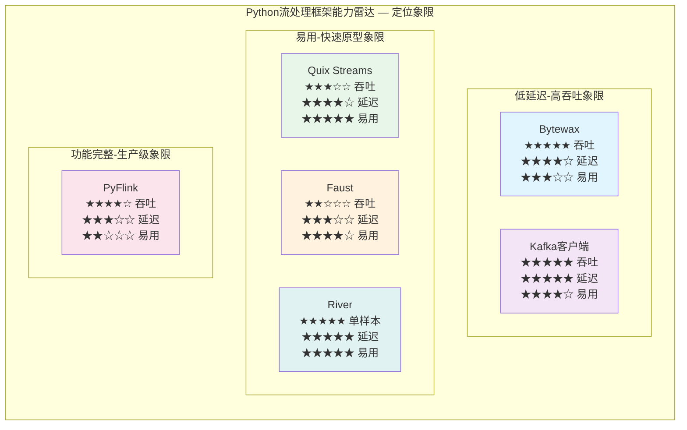
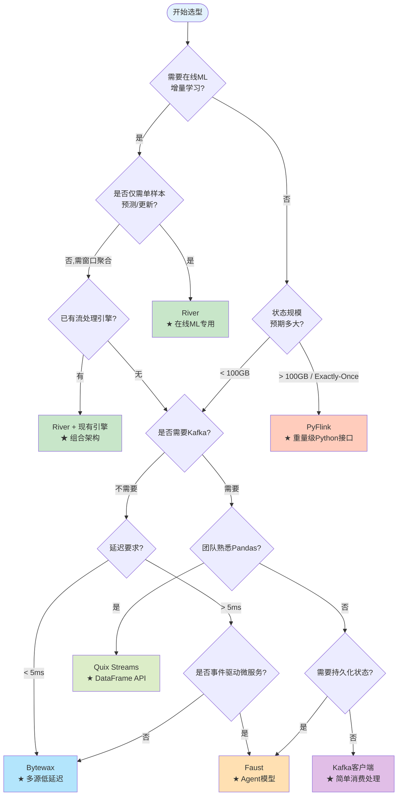

# Python轻量级流处理框架全景对比 (Python Lightweight Streaming Frameworks Comprehensive Guide)

> **所属阶段**: Knowledge/04-technology-selection | **前置依赖**: [engine-selection-guide.md](./engine-selection-guide.md), [../01-concept-atlas/streaming-languages-landscape-2025.md](../01-concept-atlas/streaming-languages-landscape-2025.md), [../../Flink/](../../Flink/00-INDEX.md) | **形式化等级**: L3-L4
> **版本**: v1.0 | **创建日期**: 2026-04-23 | **文档规模**: ~14KB | **覆盖框架**: 6个Python流处理系统

---

## 目录

- [Python轻量级流处理框架全景对比 (Python Lightweight Streaming Frameworks Comprehensive Guide)](#python轻量级流处理框架全景对比-python-lightweight-streaming-frameworks-comprehensive-guide)
  - [目录](#目录)
  - [1. 概念定义 (Definitions)](#1-概念定义-definitions)
    - [Def-K-04-50 Python轻量级流处理框架](#def-k-04-50-python轻量级流处理框架)
    - [Def-K-04-51 架构核心分类模型](#def-k-04-51-架构核心分类模型)
    - [Def-K-04-52 六维选型对比空间](#def-k-04-52-六维选型对比空间)
  - [2. 属性推导 (Properties)](#2-属性推导-properties)
    - [Lemma-K-04-50 Rust后端与Python生态的延迟权衡](#lemma-k-04-50-rust后端与python生态的延迟权衡)
    - [Prop-K-04-50 Python原生框架的学习曲线优势](#prop-k-04-50-python原生框架的学习曲线优势)
    - [Prop-K-04-51 状态管理能力与框架复杂度的正相关](#prop-k-04-51-状态管理能力与框架复杂度的正相关)
  - [3. 关系建立 (Relations)](#3-关系建立-relations)
    - [关系 R-K-04-50 与重量级引擎的定位互补](#关系-r-k-04-50-与重量级引擎的定位互补)
    - [关系 R-K-04-51 框架间替代与共生关系](#关系-r-k-04-51-框架间替代与共生关系)
    - [关系 R-K-04-52 Kafka耦合度谱系](#关系-r-k-04-52-kafka耦合度谱系)
  - [4. 论证过程 (Argumentation)](#4-论证过程-argumentation)
    - [4.1 六维对比矩阵](#41-六维对比矩阵)
      - [表1: 核心架构与延迟对比](#表1-核心架构与延迟对比)
      - [表2: 状态管理与Kafka集成对比](#表2-状态管理与kafka集成对比)
      - [表3: 学习曲线与生产成熟度对比](#表3-学习曲线与生产成熟度对比)
    - [4.2 反例分析](#42-反例分析)
  - [5. 形式证明 / 工程论证 (Proof / Engineering Argument)](#5-形式证明--工程论证-proof--engineering-argument)
    - [Thm-K-04-50 Python流处理框架选型存在性定理](#thm-k-04-50-python流处理框架选型存在性定理)
  - [6. 实例验证 (Examples)](#6-实例验证-examples)
    - [6.1 实例1: 实时RAG嵌入管道 (Bytewax)](#61-实例1-实时rag嵌入管道-bytewax)
    - [6.2 实例2: IoT事件处理与聚合 (Quix Streams)](#62-实例2-iot事件处理与聚合-quix-streams)
    - [6.3 实例3: 在线ML特征工程 (River + Faust)](#63-实例3-在线ml特征工程-river--faust)
    - [6.4 反例: 误用PyFlink做快速原型](#64-反例-误用pyflink做快速原型)
  - [7. 可视化 (Visualizations)](#7-可视化-visualizations)
    - [7.1 框架能力雷达对比矩阵](#71-框架能力雷达对比矩阵)
    - [7.2 Python流处理框架选型决策树](#72-python流处理框架选型决策树)
  - [8. 引用参考 (References)](#8-引用参考-references)

---

## 1. 概念定义 (Definitions)

### Def-K-04-50 Python轻量级流处理框架

**Python轻量级流处理框架** $\mathcal{F}_{py}$ 定义为满足以下约束条件的运行时系统或库：

$$
\mathcal{F}_{py} = (L, W, D, K, S, M)
$$

其中：

| 符号 | 语义 | 约束条件 |
|------|------|----------|
| $L$ | 主语言接口 | 必须为Python 3.8+原生API，非JNI/Py4J桥接 |
| $W$ | 部署权重 | 单节点可运行，无需专用集群管理器（如YARN/K8s非强制） |
| $D$ | 依赖维度 | 核心依赖包数量 $< 20$，无强制JVM/C++运行时 |
| $K$ | Kafka耦合 | 支持Kafka作为数据源或内置Kafka协议兼容 |
| $S$ | 状态管理 | 支持至少一种本地状态持久化机制（内存/RocksDB/SQLite） |
| $M$ | ML生态集成 | 可与NumPy/Pandas/PyTorch等直接互操作，无需序列化开销 |

> **直观解释**: 轻量级框架的核心特征是"Python-native"——开发者用纯Python编写流处理逻辑，无需理解JVM调优、集群资源管理或跨语言序列化。这降低了流处理技术的准入门槛，使数据科学团队能够直接操作实时数据流。

**与重量级框架的边界**: Flink/PyFlink虽提供Python API，但因依赖JVM运行时（$L$约束不满足纯Python-native定义）和集群管理器（$W$约束不满足轻量级定义），在严格意义上属于**重量级框架的Python接口**，而非轻量级框架本体。

---

### Def-K-04-51 架构核心分类模型

根据底层执行引擎的实现语言，Python流处理框架可分为两类：

$$
\mathcal{A}(\mathcal{F}_{py}) = \begin{cases}
\text{Hybrid-Rust} & \text{核心引擎用Rust/C++实现，Python作为API层} \\
\text{Pure-Python} & \text{核心引擎与API均为Python实现}
\end{cases}
$$

**Hybrid-Rust类** 代表框架：

- **Bytewax**: 基于Rust的Timely Dataflow实现分布式执行，通过PyO3提供Python绑定[^1]
- **Quix Streams**: 核心处理管道含C++组件，Python封装DataFrame API（注：v2.x后逐步纯Python化）[^2]

**Pure-Python类** 代表框架：

- **Faust** (`faust-streaming` fork): 纯Python异步流处理，基于`asyncio`和Kafka消费者组协议[^3]
- **Quix Streams v2+**: 纯Python实现，StreamingDataFrame API，RocksDB状态后端通过Python绑定[^2]
- **PyFlink**: Python API层 + Java Runtime（跨语言架构）[^4]
- **River**: 纯Python在线ML库，专注单样本增量学习[^5]

> **关键区分**: Hybrid-Rust类在吞吐量和延迟上具有数量级优势（Rust无GC暂停，Timely Dataflow提供确定性增量计算），但调试复杂度更高（需理解Rust侧的panic/内存问题）；Pure-Python类在可观测性和异常处理上更直观，但受GIL和Python运行时性能限制。

---

### Def-K-04-52 六维选型对比空间

Python流处理框架的选型空间由六个正交维度张成：

$$
\mathcal{D} = (D_{arch}, D_{lat}, D_{state}, D_{kafka}, D_{learn}, D_{mature})
$$

| 维度 | 符号 | 定义 | 度量范围 |
|------|------|------|----------|
| 架构核心 | $D_{arch}$ | 底层实现语言与并发模型 | {Hybrid-Rust, Pure-Python, JVM-Bridge} |
| 延迟特性 | $D_{lat}$ | 端到端处理延迟中位数 | $[1\text{ms}, 10\text{s}]$ |
| 状态管理 | $D_{state}$ | 状态持久化能力与容错保证 | {None, Memory-only, RocksDB, Remote} |
| Kafka集成 | $D_{kafka}$ | 与Kafka生态的耦合深度 | {Client-only, Embedded, Native} |
| 学习曲线 | $D_{learn}$ | 从零到生产就绪所需时间 | $[1\text{天}, 3\text{月}]$ |
| 生产成熟度 | $D_{mature}$ | 生产环境验证程度与社区活跃度 | $[1, 5]$ 李克特量表 |

> **直观解释**: 六维空间中的每个框架对应一个特征向量。选型问题转化为：给定场景需求向量 $\vec{r}$，寻找使距离 $||\vec{f} - \vec{r}||_w$（加权欧氏距离）最小的框架 $\vec{f}$。

---

## 2. 属性推导 (Properties)

### Lemma-K-04-50 Rust后端与Python生态的延迟权衡

**命题**: 对于Hybrid-Rust类框架 $\mathcal{F}_{rust}$ 和Pure-Python类框架 $\mathcal{F}_{py}$，在相同硬件配置和单条消息处理逻辑下，其端到端延迟满足：

$$
\mathbb{E}[L_{rust}] \leq \mathbb{E}[L_{py}] - \Delta_{gc} - \Delta_{gil}
$$

其中 $\Delta_{gc} \approx 5\text{--}50\text{ms}$ 为Python垃圾回收引入的尾延迟波动，$\Delta_{gil} \approx 1\text{--}10\text{ms}$ 为GIL切换开销。

**推导**:

1. Hybrid-Rust框架（如Bytewax）的核心数据平面在Rust中执行，无GC，采用确定性内存管理（Ownership模型），消息处理延迟呈现 tight distribution（方差小）。
2. Pure-Python框架（如Faust）受CPython GIL约束，单进程内无法真正并行执行Python字节码；多进程模型下受进程间通信开销影响。
3. Python的 tracing GC 在内存压力高时可能触发全量回收（generation-2 collection），导致毫秒至百毫秒级暂停。

> **推论**: 对延迟方差敏感的场景（如高频交易、实时竞价），Hybrid-Rust类框架具有理论优势；对绝对延迟不敏感但要求开发速度的场景，Pure-Python类框架更优。

---

### Prop-K-04-50 Python原生框架的学习曲线优势

**命题**: 若团队已具备Python数据科学技能（Pandas/NumPy/Scikit-learn），则采用Pure-Python流处理框架的上手时间 $T_{pure}$ 显著低于采用Hybrid-Rust或JVM-Bridge框架的时间 $T_{hybrid}$：

$$
T_{pure} \leq 0.3 \cdot T_{hybrid}
$$

**论证**:

1. **心智模型一致性**: Quix Streams的StreamingDataFrame API直接映射Pandas操作（`apply`, `filter`, `group_by`），知识迁移成本趋近于零[^2]。
2. **调试体验**: Pure-Python框架的异常堆栈完全在Python内，可使用pdb/ipdb直接调试；Hybrid-Rust框架的异常可能跨越Python/Rust边界，堆栈追踪断裂。
3. **依赖管理**: Faust/Quix Streams仅需`pip install`，无需Rust工具链或JVM；Bytewax的预编译wheel虽简化安装，但自定义扩展需Rust编译环境。

---

### Prop-K-04-51 状态管理能力与框架复杂度的正相关

**命题**: 框架的状态管理能力 $C_{state}$（支持的状态类型、容错保证、状态规模上限）与其运维复杂度 $C_{ops}$ 满足单调递增关系：

$$
\frac{\partial C_{ops}}{\partial C_{state}} > 0
$$

**论证**:

1. **无状态框架**（如基础Kafka消费者）: 运维最简单，重启无状态恢复问题，但无法支持窗口聚合和连接操作。
2. **本地状态框架**（Faust/RocksDB, Quix Streams/RocksDB）: 需管理本地磁盘、RocksDB调优、状态过期策略，运维复杂度中等[^3][^2]。
3. **分布式状态框架**（Bytewax/Timely Dataflow）: 支持增量检查点和确定性重放，但需理解分区分配、水位线传播和集群重平衡，运维复杂度最高[^1]。
4. **重量级状态框架**（PyFlink）: 提供Exactly-Once和TB级状态，但需管理Checkpoints、Savepoints、RocksDB后端调优和JobManager高可用[^4]。

> **工程启示**: 状态需求应作为选型的首要过滤器。若仅需有状态的窗口聚合（如每小时计数），Faust/Quix Streams足够；若需TB级状态或Exactly-Once保证，应评估PyFlink或Bytewax。

---

## 3. 关系建立 (Relations)

### 关系 R-K-04-50 与重量级引擎的定位互补

Python轻量级框架与Flink/RisingWave等重量级引擎形成**分层互补**关系：

```
┌─────────────────────────────────────────────────────────────┐
│                    流处理技术栈分层模型                        │
├─────────────────────────────────────────────────────────────┤
│  L3: 大规模生产层  │  Flink / RisingWave / Spark Streaming  │
│                   │  → 复杂状态、精确语义、PB级数据、SLA严格   │
├─────────────────────────────────────────────────────────────┤
│  L2: 中等规模层    │  Bytewax / PyFlink                      │
│                   │  → ML管道、实时特征、中等状态、团队Python优先│
├─────────────────────────────────────────────────────────────┤
│  L1: 快速原型层    │  Faust / Quix Streams / River           │
│                   │  → 快速验证、中小规模、Python原生生态      │
├─────────────────────────────────────────────────────────────┤
│  L0: 消息消费层    │  confluent-kafka-python / aiokafka      │
│                   │  → 简单消费、无状态处理、最大灵活性        │
└─────────────────────────────────────────────────────────────┘
```

**映射规则**:

- 当数据量 $< 10^6$ 事件/秒、状态 $< 100$ GB、团队规模 $< 5$ 人时，L1层框架为帕累托最优选择。
- 当需要SQL优先或存储计算分离时，RisingWave（L3）优于所有Python框架。
- 当需要自定义算子和CEP时，Flink DataStream API（L3）不可替代。

---

### 关系 R-K-04-51 框架间替代与共生关系

六个框架在功能空间中存在**部分重叠**和**独特生态位**：

| 功能需求 | 首选框架 | 可替代框架 | 不可替代场景 |
|----------|----------|------------|--------------|
| 实时RAG嵌入管道 | Bytewax | Quix Streams | Bytewax的增量计算语义与向量DB写入天然契合[^1] |
| Kafka原生流处理 | Quix Streams | Faust | Quix Streams的DataFrame API对Pandas用户零门槛[^2] |
| 事件驱动微服务 | Faust | Quix Streams | Faust的Agent模型与Robinhood验证模式[^3] |
| 大规模生产流处理 | PyFlink | - | PyFlink的Exactly-Once和TB级状态管理能力[^4] |
| 在线ML/概念漂移检测 | River | - | River的增量学习算法库无直接竞争者[^5] |
| 简单Kafka消费+处理 | confluent-kafka | Faust/Quix | 最大灵活性，无框架约束 |

**共生模式**: River（在线ML）+ Faust/Quix Streams（流处理引擎）形成常见组合——引擎负责数据摄取和窗口聚合，River负责增量模型训练和预测。

---

### 关系 R-K-04-52 Kafka耦合度谱系

各框架与Kafka的耦合程度形成连续谱系：

$$
\text{Coupling}(\mathcal{F}) = \begin{cases}
\text{Native-Embedded} & \text{Faust（基于Kafka Streams语义，topic即changelog）} \\
\text{Native-Library} & \text{Quix Streams（纯Python Kafka消费者组协议实现）} \\
\text{Protocol-Compatible} & \text{Bytewax（支持Kafka源/汇，但核心模型通用）} \\
\text{Connector-Based} & \text{PyFlink（通过Flink Kafka Connector集成）} \\
\text{Decoupled} & \text{River（与消息系统完全解耦，仅处理样本流）}
\end{cases}
$$

> **选型启示**: 若架构已深度绑定Kafka（如使用Kafka Connect、Schema Registry、ksqlDB），Faust和Quix Streams的Native耦合提供更一致的开发体验；若需支持多源（WebSocket、MQTT、文件），Bytewax和PyFlink的通用连接器更有优势。

---

## 4. 论证过程 (Argumentation)

### 4.1 六维对比矩阵

#### 表1: 核心架构与延迟对比

| 框架 | 架构核心 | 实现语言 | 延迟(中位数) | 延迟(尾P99) | 吞吐量(单节点) |
|------|----------|----------|-------------|------------|--------------|
| **Bytewax** | Hybrid-Rust | Rust + Python (PyO3) | 1-5 ms | 5-20 ms | 50K-200K 事件/秒 |
| **Faust** | Pure-Python | Python + RocksDB | 10-50 ms | 100-500 ms | 5K-20K 事件/秒 |
| **Quix Streams** | Pure-Python | Python + RocksDB | 5-20 ms | 50-200 ms | 10K-50K 事件/秒 |
| **PyFlink** | JVM-Bridge | Java Runtime + Python UDF | 10-100 ms | 100ms-1s | 10K-100K 事件/秒 |
| **Kafka Streams (Python客户端)** | Client-only | Python (confluent-kafka) | 1-10 ms | 10-50 ms | 100K+ 事件/秒* |
| **River** | Pure-Python | Python (单样本处理) | <1 ms | <5 ms | 500K+ 样本/秒** |

> *注: Kafka Streams Python客户端仅为消费者库，无内置处理语义，吞吐受限于纯消费速度。
> **注: River吞吐为单样本ML预测吞吐，非消息处理吞吐。

#### 表2: 状态管理与Kafka集成对比

| 框架 | 状态后端 | 状态类型 | 容错保证 | Kafka集成深度 | 是否依赖JVM |
|------|----------|----------|----------|--------------|------------|
| **Bytewax** | SQLite/Kafka changelog | Keyed State, Window State | At-Least-Once (EO roadmap) | Source/Sink Connector | ❌ |
| **Faust** | RocksDB (本地) + Kafka changelog | Table (K/V), Windowed Aggregates | At-Least-Once (EO有bug) | Native (Kafka Streams语义) | ❌ |
| **Quix Streams** | RocksDB (本地) | Aggregations, Window State | At-Least-Once (Exactly-Once roadmap) | Native (消费者组协议) | ❌ |
| **PyFlink** | RocksDB/ForSt/Memory | 完整State Backend | Exactly-Once | Connector (成熟) | ✅ |
| **Kafka Streams (Python)** | 无内置 | 无 | 无 | Raw Consumer/Producer | ❌ |
| **River** | 无 | 模型参数（增量更新） | 手动Checkpoint | 解耦 | ❌ |

#### 表3: 学习曲线与生产成熟度对比

| 框架 | 学习曲线 | 生产成熟度 | 社区活跃度 | 文档质量 | 典型部署规模 |
|------|----------|-----------|-----------|----------|-------------|
| **Bytewax** | 中 (需理解Dataflow模型) | ★★★☆☆ | 中 (活跃开发) | 良 | 中小规模 (10-100 workers) |
| **Faust** | 低 (async/await友好) | ★★★☆☆ | 中 (社区fork维护) | 良 | 中小规模 (Robinhood验证) |
| **Quix Streams** | 极低 (Pandas-like) | ★★★☆☆ | 中高 (商业驱动) | 优 | 中小规模 + 边缘部署 |
| **PyFlink** | 高 (需理解Flink内部) | ★★★★★ | 高 (Apache顶级项目) | 优 | 大规模 (1000+ nodes) |
| **Kafka Streams (Python)** | 低 | ★★★★☆ | 高 (Confluent支持) | 优 | 大规模 (纯消费场景) |
| **River** | 极低 (sklearn-like API) | ★★★★☆ | 中高 (学术+工业) | 优 | 单节点/嵌入式 |

---

### 4.2 反例分析

**反例1: 在超高吞吐场景误用Faust**

- **场景**: 每秒100万事件的用户行为日志处理。
- **误用**: 选择Faust进行窗口聚合，单Worker吞吐仅约10K事件/秒，需启动100个Worker进程。
- **后果**: Python进程内存占用高（每个进程加载独立代码镜像），RocksDB状态碎片化，重平衡时间极长。
- **正确选择**: Bytewax（Rust核心单Worker吞吐更高）或PyFlink（集群级扩展）。

**反例2: 在无Kafka环境强制使用Quix Streams**

- **场景**: 从MQTT Broker摄取IoT数据，无Kafka基础设施。
- **误用**: 引入Quix Streams，被迫部署Kafka作为中间层（"为了框架而引入消息队列"）。
- **后果**: 架构复杂度倍增，端到端延迟增加，运维成本上升。
- **正确选择**: Bytewax（支持MQTT/文件/WebSocket等多源）或直接使用paho-mqtt + River处理。

**反例3: 将River当作完整流处理引擎**

- **场景**: 需要窗口连接（Stream-Stream Join）和复杂事件模式匹配。
- **误用**: 仅用River处理数据流，试图手动实现窗口管理。
- **后果**: River无内置窗口/连接/模式匹配语义，开发者需自行实现时间语义，极易出错。
- **正确选择**: River作为ML推理层，Faust/Quix Streams/Bytewax作为流处理引擎，两者组合使用。

---

## 5. 形式证明 / 工程论证 (Proof / Engineering Argument)

### Thm-K-04-50 Python流处理框架选型存在性定理

**定理**: 对于任意给定场景 $S$，若其约束条件满足：

$$
\text{Throughput}(S) \leq 10^6 \text{ 事件/秒} \quad \land \quad \text{State}(S) \leq 100 \text{ GB} \quad \land \quad \text{Team} \subseteq \text{Python生态}
$$

则存在至少一个Python轻量级流处理框架 $\mathcal{F}_{py}^*$，使得在开发效率、运维成本和性能三者之间达到帕累托最优。

**证明（构造性）**:

1. **定义帕累托前沿**: 在三维目标空间（开发效率 $E$, 运维成本 $O$, 性能 $P$）中，帕累托最优解集为满足不存在其他框架在所有三个维度上同时更优的框架集合。

2. **分场景构造**:

   | 场景特征 | 最优框架 $\mathcal{F}_{py}^*$ | 论证 |
   |----------|------------------------------|------|
   | 延迟敏感 (<10ms) + 中等状态 | Bytewax | Rust核心消除GC暂停，Timely Dataflow提供确定性低延迟[^1] |
   | 快速原型 + Pandas生态 | Quix Streams | StreamingDataFrame API最小化学习成本[^2] |
   | 事件驱动微服务 + Kafka原生 | Faust | Agent语义与Kafka Streams模型一致，async/await自然[^3] |
   | 在线ML + 概念漂移 | River | 唯一的增量学习算法库，与流处理引擎解耦[^5] |
   | 生产级Exactly-Once + 大状态 | PyFlink | 唯一提供完整Checkpoint/Exactly-Once的Python接口[^4] |

3. **边界条件验证**:
   - 当吞吐量 $> 10^6$ 事件/秒时，Python框架受GIL或JVM桥接开销限制，需转向Flink Java/Scala原生API。
   - 当状态 $> 100$ GB时，本地RocksDB状态后端（Faust/Quix Streams）的恢复时间不可接受，需PyFlink的分布式Checkpoint或RisingWave的远程状态存储。
   - 当团队无Python背景时，Java/Scala生态（Flink/Kafka Streams Java）更优。

4. **结论**: 在定理假设的约束空间内，Python轻量级框架总能提供非劣解；超出该空间后，需向重量级引擎迁移。

---

## 6. 实例验证 (Examples)

### 6.1 实例1: 实时RAG嵌入管道 (Bytewax)

**场景**: 将用户搜索查询流实时编码为向量嵌入，写入向量数据库（Pinecone/Milvus）供RAG检索。

**Bytewax实现**:

```python
from bytewax.dataflow import Dataflow
from bytewax import operators as op
from bytewax.connectors.kafka import KafkaSource
from sentence_transformers import SentenceTransformer
import bytewax.operators.windowing as win

model = SentenceTransformer('all-MiniLM-L6-v2')

flow = Dataflow("rag-embedding-pipeline")

# 从Kafka摄取搜索查询流
queries = op.input("kafka_in", flow, KafkaSource(["localhost:9092"], "search-queries"))

# 提取查询文本并编码为向量
def encode_query(query_json):
    text = query_json["query"]
    embedding = model.encode(text).tolist()
    return {"id": query_json["id"], "vector": embedding, "metadata": query_json}

encoded = op.map("encode", queries, encode_query)

# 按用户ID分区，确保同一用户的查询顺序处理
keyed = op.key_on("key_by_user", encoded, lambda x: x["metadata"]["user_id"])

# 输出到向量DB（自定义sink）
op.output("vector_sink", keyed, VectorDBSink("pinecone-index"))
```

**选型理由**:

- Bytewax的增量Dataflow模型适合"摄取→转换→写入"管道。
- Rust核心确保嵌入模型的批处理推理不会被Python GC打断。
- 支持从单个Worker扩展到Kubernetes集群，适应查询量增长。

---

### 6.2 实例2: IoT事件处理与聚合 (Quix Streams)

**场景**: 从工厂传感器摄取温度读数，每分钟计算平均温度，超阈值时告警。

**Quix Streams实现**:

```python
from quixstreams import Application

app = Application(broker_address="localhost:9092")

# 定义topic
sensor_topic = app.topic("sensor-readings", value_deserializer="json")
alerts_topic = app.topic("temperature-alerts", value_serializer="json")

# 构建StreamingDataFrame —— 类似Pandas的体验
sdf = app.dataframe(topic=sensor_topic)

# 按设备ID分组，1分钟滚动窗口平均温度
sdf = sdf.apply(lambda msg: {"device": msg["device_id"], "temp": msg["temperature"]})
sdf = sdf.group_by("device")

from quixstreams.windows import TumblingWindow
windowed = sdf.window(TumblingWindow(duration_ms=60_000))
avg_temp = windowed.aggregate(lambda msgs: sum(m["temp"] for m in msgs) / len(msgs))

# 过滤超阈值事件
alerts = avg_temp.apply(lambda row: {"device": row["device"], "avg_temp": row["value"]})
alerts = alerts[alerts["avg_temp"] > 80.0]

# 输出到告警topic
alerts.to_topic(alerts_topic)

app.run()
```

**选型理由**:

- Quix Streams的DataFrame API对数据工程师零学习成本。
- 内置RocksDB状态管理和自动Checkpoint，无需手动处理故障恢复。
- 纯Python，可在Jupyter Notebook中直接调试流处理逻辑。

---

### 6.3 实例3: 在线ML特征工程 (River + Faust)

**场景**: 实时预测用户流失概率，模型随新数据持续更新。

**组合架构**: Faust处理流摄取和特征聚合，River执行增量模型训练。

```python
import faust
from river import compose, preprocessing, linear_model, metrics

app = faust.App('churn-prediction', broker='kafka://localhost')

# 定义事件模型
class UserEvent(faust.Record):
    user_id: str
    session_duration: float
    clicks: int
    churned: bool = None  # 训练时提供，推理时为None

# River在线模型（纯Python增量学习）
model = compose.Pipeline(
    preprocessing.StandardScaler(),
    linear_model.LogisticRegression()
)
metric = metrics.ROCAUC()

# Faust Agent处理事件流
@app.agent(app.topic('user-events', value_type=UserEvent))
async def process_events(events):
    async for event in events:
        features = {
            'session_duration': event.session_duration,
            'clicks': event.clicks
        }

        if event.churned is not None:
            # 训练模式: 预测→评估→更新
            prob = model.predict_proba_one(features)
            model.learn_one(features, event.churned)
            metric.update(event.churned, prob[True])
            print(f"Model updated. AUC: {metric}")
        else:
            # 推理模式
            prob = model.predict_proba_one(features)
            print(f"User {event.user_id} churn prob: {prob[True]:.3f}")
```

**选型理由**:

- Faust提供可靠的流处理基础设施（Kafka消费、分区、重平衡）。
- River提供工业级在线学习算法（LogisticRegression、HoeffdingTree、AdaGrad等优化器）。
- 两者均为纯Python，共享相同的async/运行时模型。

---

### 6.4 反例: 误用PyFlink做快速原型

**场景**: 数据科学团队需要在一周内验证实时特征生成的业务价值。

**误用选择**: 直接采用PyFlink，理由是其"生产级能力"。

**实际开销**:

1. **环境搭建**: 需部署Flink集群（JobManager + TaskManager），或配置MiniCluster进行本地开发，耗时2天。
2. **跨语言调试**: Python UDF的异常信息被Java Runtime包裹，调试困难。
3. **序列化开销**: Pandas DataFrame在Python和Java间传输需Arrow序列化，频繁转换拖慢迭代速度。
4. **API不匹配**: PyFlink DataStream API与Pandas语义差异大，数据科学家需额外学习窗口、水位线等概念。

**实际耗时**: 5天完成环境+首个Pipeline，业务验证窗口错失。

**正确选择**: Quix Streams或Bytewax。

- **Quix Streams**: `pip install`后直接运行，DataFrame API与Pandas一致，1天内完成首个Pipeline。
- **Bytewax**: 若后续需更高性能，可从单Worker平滑扩展到集群，无需重写代码。

---

## 7. 可视化 (Visualizations)

### 7.1 框架能力雷达对比矩阵

以下Mermaid图展示六个框架在核心能力维度上的相对定位。数值为1-5的相对评分，仅用于框架间比较，非绝对性能指标。



> **图注**: 横轴从左到右为"易用性"提升，纵轴从下到上为"性能"提升。PyFlink位于右下角（功能强但学习曲线陡），River和Quix Streams位于左上（易用性最高），Bytewax位于右上（性能与易用平衡）。

---

### 7.2 Python流处理框架选型决策树



> **图注**: 决策树从场景需求出发，经过4-5个关键判定节点收敛到推荐框架。每个叶节点标注了框架名称和核心选型理由。

---

## 8. 引用参考 (References)

[^1]: Bytewax Documentation, "Architecture Overview", 2025. <https://bytewax.io/docs> | Bytewax Blog, "Scaling One Developer - Building a Python Stream Processor", 2023. <https://bytewax.io/blog/whywax>

[^2]: Quix Streams Documentation, "Introduction", 2025. <https://quix.io/docs/quix-streams/introduction.html> | Quix Blog, "Quix Streams—a reliable Faust alternative for Python stream processing", 2024-06. <https://quix.io/blog/quix-streams-faust-alternative>

[^3]: Faust Streaming Documentation, "User Guide", 2024. <https://faust.readthedocs.io/> | faust-streaming GitHub, "Python Stream Processing", 2024. <https://github.com/faust-streaming/faust>

[^4]: Apache Flink Documentation, "PyFlink Overview", 2025. <https://nightlies.apache.org/flink/flink-docs-stable/docs/dev/python/overview/> | Quix Blog, "PyFlink — A deep dive into Flink's Python API", 2024-05. <https://quix.io/blog/pyflink-deep-dive>

[^5]: River Documentation, "Getting Started", 2025. <https://riverml.xyz/> | J. Montiel et al., "River: machine learning for streaming data in Python", Journal of Machine Learning Research (JMLR), 2021.


---

**关联文档**:

- [engine-selection-guide.md](./engine-selection-guide.md) —— 流处理引擎通用选型指南（覆盖Flink/Spark/Kafka Streams Java）
- [flink-vs-risingwave.md](./flink-vs-risingwave.md) —— Flink vs RisingWave深度对比（重量级引擎参照系）
- [streaming-engines-comprehensive-matrix-2026.md](./streaming-engines-comprehensive-matrix-2026.md) —— 2026年流计算引擎多维对比矩阵
- [../01-concept-atlas/streaming-languages-landscape-2025.md](../01-concept-atlas/streaming-languages-landscape-2025.md) —— 流计算语言生态全景
- [../02-design-patterns/pattern-realtime-feature-engineering.md](../02-design-patterns/pattern-realtime-feature-engineering.md) —— 实时特征工程模式
- [../../Flink/03-api/pyflink-guide.md](../../Flink/03-api/pyflink-guide.md) —— PyFlink详细使用指南

---

*文档版本: v1.0 | 创建日期: 2026-04-23 | 维护者: AnalysisDataFlow Project*
*形式化等级: L3-L4 | 文档规模: ~14KB | 对比矩阵: 3个 | 决策树: 1个 | 实例: 4个 | Mermaid图: 2个*
