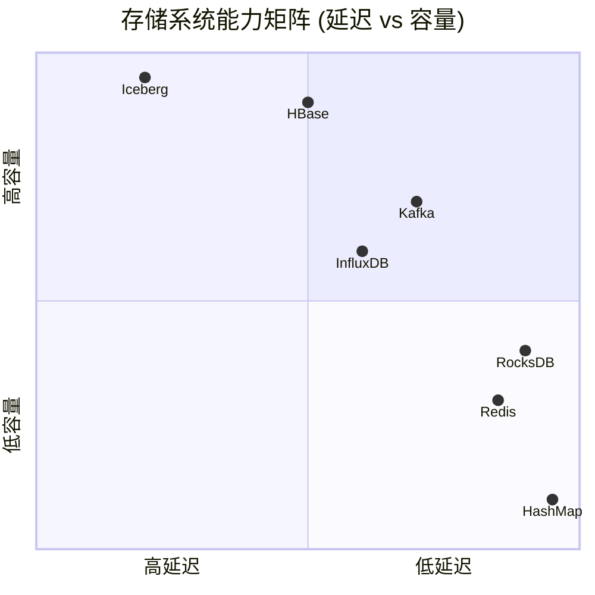
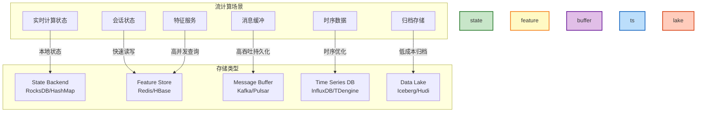
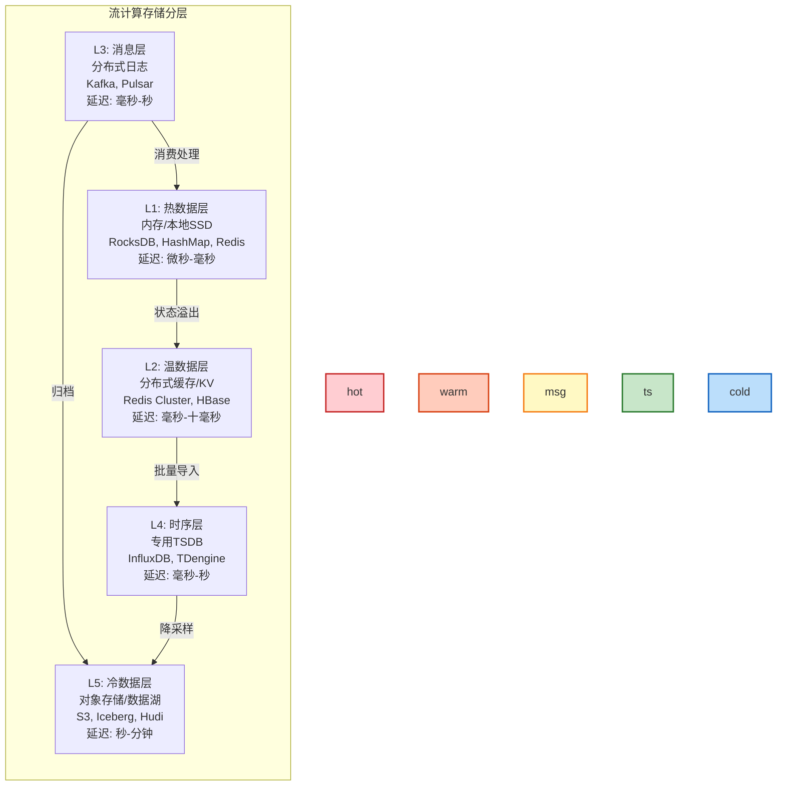
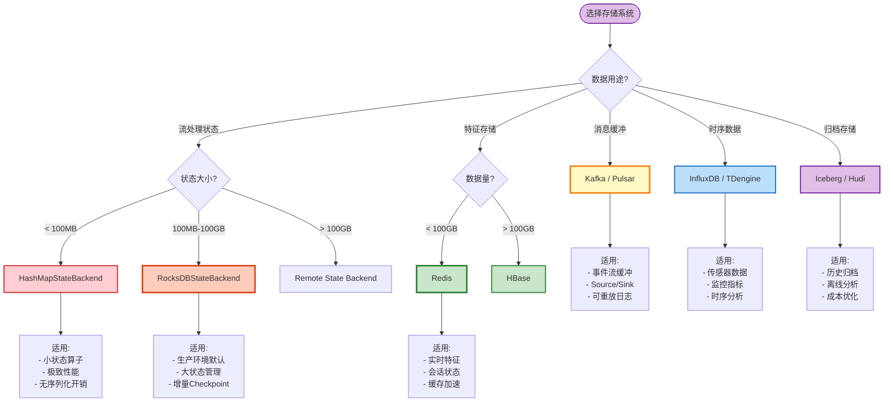

# 存储系统选型指南 (Storage System Selection Guide)

> **所属阶段**: Knowledge/04-technology-selection | **前置依赖**: [../02-design-patterns/pattern-state-management.md](../02-design-patterns/pattern-state-management.md), [../../Flink/02-core-mechanisms/checkpoint-mechanism-deep-dive.md](../../Flink/02-core-mechanisms/checkpoint-mechanism-deep-dive.md) | **形式化等级**: L4

---

## 目录

- [1. 概念定义 (Definitions)](#1-概念定义-definitions)
- [2. 属性推导 (Properties)](#2-属性推导-properties)
- [3. 关系建立 (Relations)](#3-关系建立-relations)
- [4. 论证过程 (Argumentation)](#4-论证过程-argumentation)
- [5. 工程论证 (Engineering Argument)](#5-工程论证-engineering-argument)
- [6. 实例验证 (Examples)](#6-实例验证-examples)
- [7. 可视化 (Visualizations)](#7-可视化-visualizations)
- [8. 引用参考 (References)](#8-引用参考-references)

---

## 1. 概念定义 (Definitions)

### Def-K-04-09. 流计算存储分类 (Stream Processing Storage Taxonomy)

流计算场景中的存储系统按用途分为五类，形成**分层存储架构**：

$$
\mathcal{S}_{\text{stream}} = \{S_{\text{state}}, S_{\text{feature}}, S_{\text{buffer}}, S_{\text{timeseries}}, S_{\text{lake}}\}
$$

| 类别 | 定义 | 代表系统 | 典型延迟 |
|------|------|----------|----------|
| $S_{\text{state}}$ | 流处理状态后端 | RocksDB, HashMap | 微秒级 |
| $S_{\text{feature}}$ | 特征/上下文存储 | Redis, HBase | 毫秒级 |
| $S_{\text{buffer}}$ | 消息缓冲队列 | Kafka, Pulsar | 毫秒级 |
| $S_{\text{timeseries}}$ | 时序数据存储 | InfluxDB, TDengine | 毫秒-秒级 |
| $S_{\text{lake}}$ | 数据湖/归档 | Iceberg, Hudi | 秒-分钟级 |

**定义动机**：不同存储层服务于流计算流水线的不同阶段，需根据访问模式、一致性要求和成本约束进行分层设计 [^1]。

---

### Def-K-04-10. 状态后端 (State Backend)

状态后端是流处理引擎用于持久化**算子状态**的存储抽象，由以下特性刻画：

$$
\text{StateBackend} = (P_{\text{persistence}}, T_{\text{checkpoint}}, M_{\text{memory}}, C_{\text{consistency}})
$$

| 类型 | 存储介质 | 容量限制 | Checkpoint 方式 | 适用场景 |
|------|----------|----------|-----------------|----------|
| **HashMap** | JVM Heap | 受限于内存 | 同步快照 | 小状态、快速访问 |
| **RocksDB** | 本地磁盘 (SSD) | TB级 | 异步增量 | 大状态、高吞吐 |
| **Remote** | 分布式存储 | 无限制 | 异步写入 | 超大规模状态 |

**关键区分**：状态后端的选择直接影响 Checkpoint 性能、故障恢复时间和状态大小上限。

---

### Def-K-04-11. 存储一致性谱系 (Storage Consistency Spectrum)

存储系统按一致性强度形成连续谱系：

$$
\text{Consistency} \in \{\text{Eventual}, \text{Read-Your-Writes}, \text{Session}, \text{Sequential}, \text{Linearizable}, \text{Strict}\}
$$

| 级别 | 定义 | 可用性代价 | 代表系统 |
|------|------|------------|----------|
| **Strict** | 全局实时一致 | 最低 | 单机数据库 |
| **Linearizable** | 可线性化 | 低 | etcd, ZooKeeper |
| **Sequential** | 顺序一致 | 中 | Kafka (单分区) |
| **Session** | 会话一致 | 中高 | Redis Cluster |
| **Read-Your-Writes** | 读写一致 | 高 | Cassandra |
| **Eventual** | 最终一致 | 最高 | S3, DynamoDB |

---

### Def-K-04-12. 存储成本模型 (Storage Cost Model)

定义存储总拥有成本 (TCO) 为四维函数：

$$
\text{TCO}(S) = C_{\text{storage}} + C_{\text{io}} + C_{\text{ops}} + C_{\text{dev}}
$$

| 成本项 | 计算方式 | 优化策略 |
|--------|----------|----------|
| $C_{\text{storage}}$ | 每GB/月存储费 | 冷热分层、压缩 |
| $C_{\text{io}}$ | 每百万次请求费 | 缓存、批处理 |
| $C_{\text{ops}}$ | 运维人力成本 | 托管服务、自动化 |
| $C_{\text{dev}}$ | 开发集成成本 | 标准化接口、SDK |

---

## 2. 属性推导 (Properties)

### Lemma-K-04-05. 状态后端延迟分层

**陈述**：不同状态后端的访问延迟存在数量级差异，形成明显分层：

$$
L_{\text{HashMap}} \approx 1\mu s \ll L_{\text{RocksDB}} \approx 10\mu s \ll L_{\text{Remote}} \approx 1ms
$$

**推导**：

1. HashMap 状态在 JVM 堆内，无序列化开销
2. RocksDB 需 JNI 调用 + 本地磁盘 I/O
3. Remote 存储涉及网络 RTT + 序列化
4. 数量级差异决定了各自的适用场景 ∎

**工程意义**：实时计算状态优先使用 HashMap/RocksDB；特征查询可使用 Remote 存储。

---

### Lemma-K-04-06. Checkpoint 大小与恢复时间关系

**陈述**：Checkpoint 大小与故障恢复时间呈线性关系：

$$
T_{\text{recover}} = T_{\text{download}} + T_{\text{deserialize}} + T_{\text{replay}} = \alpha \cdot |S| + \beta \cdot |S| + \gamma \cdot \Delta t
$$

其中 $|S|$ 为状态大小，$\Delta t$ 为需重放的数据量。

**推导**：

1. 恢复流程：下载 Checkpoint → 反序列化状态 → 重放增量数据
2. 下载和反序列化时间与状态大小线性相关
3. 增量重放时间与故障持续时间线性相关
4. 因此状态大小是恢复时间的主导因素 ∎

---

### Prop-K-04-04. 消息队列的吞吐-延迟权衡

**陈述**：消息队列的吞吐量与延迟存在帕累托前沿，由批处理策略决定：

$$
\text{Throughput} \uparrow \iff \text{Batch\_Size} \uparrow \iff \text{Latency} \uparrow
$$

**数据验证** (Kafka vs Pulsar)：

| 系统 | 批大小 | 吞吐 (MB/s) | 延迟 (ms) |
|------|--------|-------------|-----------|
| Kafka | 16KB | 500 | 1-5 |
| Kafka | 1MB | 2000 | 10-50 |
| Pulsar | 16KB | 450 | 2-8 |
| Pulsar | 1MB | 1800 | 15-60 |

---

### Prop-K-04-05. 时序数据库的压缩率优势

**陈述**：专用时序数据库相比通用数据库在时序数据场景具有显著压缩优势：

$$
\text{Compression\_Ratio}_{\text{TSDB}} \approx 10 \times \text{Compression\_Ratio}_{\text{Generic}}
$$

**原理**：

1. 时序数据具有时间局部性和值域连续性
2. Delta-of-Delta、Gorilla 等专用算法充分利用时序特征
3. 通用数据库采用通用压缩（如 Snappy），压缩率较低

**实测数据** (10亿条传感器记录)：

- InfluxDB: ~15:1 压缩比
- PostgreSQL: ~3:1 压缩比
- 存储成本差异约 5 倍

---

## 3. 关系建立 (Relations)

### 关系 1: 存储类型与流计算场景映射

| 流计算场景 | 存储类型 | 代表系统 | 关键需求 |
|------------|----------|----------|----------|
| **实时计算状态** | $S_{\text{state}}$ | RocksDB, HashMap | 低延迟、高吞吐、本地性 |
| **会话状态** | $S_{\text{feature}}$ | Redis | 快速读写、TTL支持 |
| **特征服务** | $S_{\text{feature}}$ | Redis, HBase | 高并发、低延迟、大容量 |
| **消息缓冲** | $S_{\text{buffer}}$ | Kafka, Pulsar | 高吞吐、持久化、可重放 |
| **时序数据** | $S_{\text{timeseries}}$ | InfluxDB, TDengine | 高写入、时序查询、压缩 |
| **归档存储** | $S_{\text{lake}}$ | Iceberg, Hudi | 低成本、ACID、时间旅行 |

---

### 关系 2: 流处理引擎与状态后端绑定

| 引擎 | 内置状态后端 | 外部状态支持 | 推荐组合 |
|------|-------------|--------------|----------|
| **Flink** | HashMap, RocksDB | 支持 (Queryable State) | RocksDB (生产环境) |
| **Kafka Streams** | RocksDB | 仅限本地 | RocksDB |
| **Spark Streaming** | 内存 + HDFS | 依赖外部 | HDFS Checkpoint |
| **Storm** | 无原生支持 | 依赖外部 | Redis + HBase |

---

### 关系 3: 存储分层与数据流动

流计算系统中的典型数据流动路径：

```
┌─────────────────────────────────────────────────────────────────┐
│                     流计算存储分层架构                           │
├─────────────────────────────────────────────────────────────────┤
│                                                                 │
│  数据源 ──► Kafka ($S_{buffer}$)                                 │
│              │                                                  │
│              ▼                                                  │
│       Flink Processing                                          │
│       ├── RocksDB ($S_{state}$) ◄──── 本地状态                 │
│       │                                                         │
│       ├── Redis ($S_{feature}$) ◄──── 特征查询                 │
│       │         ▲                                               │
│       │         └── 写入特征结果                                │
│       │                                                         │
│       └── 聚合结果                                              │
│              │                                                  │
│              ▼                                                  │
│       InfluxDB ($S_{timeseries}$) ◄── 时序指标                 │
│              │                                                  │
│              ▼                                                  │
│       Iceberg ($S_{lake}$) ◄──────── 历史归档                  │
│                                                                 │
└─────────────────────────────────────────────────────────────────┘
```

---

## 4. 论证过程 (Argumentation)

### 论证 1: 状态大小与后端选择

**决策逻辑**：

```
状态大小?
├── < 100MB ──► HashMapStateBackend
│               └── 内存访问、无序列化开销
│
├── 100MB - 100GB ──► RocksDBStateBackend
│                     └── 本地SSD、异步Checkpoint
│
└── > 100GB ──► Remote State Backend
                └── 分布式存储、计算存储分离
```

**临界点分析**：

- HashMap → RocksDB: ~100MB (JVM GC 压力阈值)
- RocksDB → Remote: ~100GB (本地SSD容量限制)

---

### 论证 2: 一致性要求与存储选择

**场景-一致性匹配**：

| 场景 | 一致性要求 | 推荐存储 | 理由 |
|------|-----------|----------|------|
| 金融交易状态 | Linearizable | RocksDB + Checkpoint | 严格一致性验证 |
| 用户会话 | Session | Redis | 会话绑定，读写一致即可 |
| 推荐特征 | Eventual | HBase | 最终一致，高可用优先 |
| 指标监控 | Eventual | InfluxDB | 可容忍短暂不一致 |
| 消息队列 | Sequential | Kafka (单分区) | 分区顺序保证 |

---

### 论证 3: 成本敏感场景的存储优化

**成本优化策略**：

| 策略 | 适用场景 | 节约比例 | 实施复杂度 |
|------|----------|----------|------------|
| **冷热分层** | 历史数据访问低频 | 60-80% | 低 |
| **压缩优化** | 文本/JSON数据 | 50-70% | 低 |
| **TTL自动清理** | 会话/临时状态 | 30-50% | 低 |
| **计算下推** | 聚合查询频繁 | 40-60% | 中 |
| **列式存储** | 分析型查询 | 50-80% | 中 |

---

## 5. 工程论证 (Engineering Argument)

### 存储选型多维评估框架

**五维评估模型**：

| 维度 | 权重 | 评估指标 |
|------|------|----------|
| 延迟性能 | 0.25 | P99 读写延迟 |
| 吞吐能力 | 0.20 | 峰值 MB/s 或 QPS |
| 一致性 | 0.20 | 一致性级别满足度 |
| 成本效率 | 0.20 | $/GB/月 + 运维成本 |
| 运维复杂度 | 0.15 | 部署、监控、扩缩容难度 |

**主流存储评分** (5分制)：

| 存储系统 | 延迟 | 吞吐 | 一致性 | 成本 | 运维 | 加权总分 |
|----------|:----:|:----:|:------:|:----:|:----:|:--------:|
| **RocksDB (本地)** | 5 | 4 | 4 | 5 | 4 | **4.40** |
| **Redis** | 5 | 4 | 3 | 3 | 4 | **3.95** |
| **Kafka** | 4 | 5 | 4 | 4 | 4 | **4.25** |
| **HBase** | 3 | 5 | 3 | 4 | 2 | **3.55** |
| **InfluxDB** | 4 | 4 | 3 | 4 | 4 | **3.85** |
| **Iceberg** | 2 | 4 | 4 | 5 | 3 | **3.55** |

**结论**：

- 流处理状态首选 **RocksDB**（本地、高性能）
- 消息缓冲首选 **Kafka**（高吞吐、生态成熟）
- 特征存储首选 **Redis**（低延迟、易用）
- 时序数据首选 **InfluxDB**（专用优化）
- 数据湖首选 **Iceberg**（开放标准、成本优化）

---

## 6. 实例验证 (Examples)

### 示例 1: 实时风控系统存储选型

**业务需求**：

- 用户行为状态：实时更新，< 10ms 延迟
- 规则特征：频繁查询，高并发
- 风控事件：持久化，顺序消费
- 历史数据：长期归档，低成本

**选型方案**：

```
┌────────────────────────────────────────┐
│           风控系统存储架构              │
├────────────────────────────────────────┤
│                                        │
│  状态: RocksDB (Flink本地状态)          │
│       └── 用户会话窗口状态              │
│                                        │
│  特征: Redis Cluster                    │
│       └── 规则特征、用户画像            │
│                                        │
│  缓冲: Kafka                            │
│       └── 风控事件流                    │
│                                        │
│  时序: InfluxDB                         │
│       └── 风控指标、报警                │
│                                        │
│  归档: Iceberg (S3)                     │
│       └── 历史风控事件                  │
│                                        │
└────────────────────────────────────────┘
```

**关键配置**：

- RocksDB: 增量 Checkpoint 60s 间隔
- Redis: 集群模式，读写分离
- Kafka: 3副本，消息保留7天

---

### 示例 2: IoT 数据处理存储选型

**业务需求**：

- 设备上报：100万设备，每秒10万条
- 设备状态：实时查询，TTL 管理
- 时序数据：高压缩比，降采样查询
- 告警事件：可靠传递，Exactly-Once

**选型方案**：

```
┌────────────────────────────────────────┐
│          IoT 数据存储架构               │
├────────────────────────────────────────┤
│                                        │
│  缓冲: Kafka (10 partitions)            │
│       └── 设备上报消息                  │
│                                        │
│  状态: Redis                            │
│       └── 设备在线状态、固件版本        │
│                                        │
│  时序: TDengine                         │
│       └── 传感器数据、超级表建模        │
│                                        │
│  告警: Kafka + Flink CEP                │
│       └── 复杂事件处理、规则匹配        │
│                                        │
└────────────────────────────────────────┘
```

**性能指标**：

- 写入吞吐：200万点/秒
- 查询延迟：P99 < 100ms
- 压缩比：10:1 (相比 MySQL)

---

### 示例 3: 实时推荐系统存储选型

**业务需求**：

- 用户特征：实时更新，毫秒级查询
- 商品特征：大容量，批量更新
- 推荐结果：缓存，快速响应
- 行为日志：高吞吐，可重放

**选型方案**：

```
┌────────────────────────────────────────┐
│         推荐系统存储架构                │
├────────────────────────────────────────┤
│                                        │
│  实时特征: Redis Cluster                │
│       └── 用户实时特征、上下文          │
│                                        │
│  批量特征: HBase                        │
│       └── 商品特征、用户画像            │
│                                        │
│  结果缓存: Redis                        │
│       └── Top-K 推荐结果                │
│                                        │
│  行为日志: Kafka                        │
│       └── 点击、曝光、转化              │
│                                        │
│  模型存储: HDFS/S3                      │
│       └── 推荐模型文件                  │
│                                        │
└────────────────────────────────────────┘
```

**访问模式**：

- Redis: 100万 QPS，P99 < 5ms
- HBase: 10万 QPS，批量查询优化
- Kafka: 50万条/秒吞吐

---

### 示例 4: 实时数仓存储选型

**业务需求**：

- 多源数据：MySQL CDC、Kafka、日志
- 实时分析：秒级延迟查询
- 离线合并：与历史数据统一
- 成本敏感：PB级数据，长期保存

**选型方案**：

```
┌────────────────────────────────────────┐
│         实时数仓存储架构                │
├────────────────────────────────────────┤
│                                        │
│  缓冲层: Kafka                          │
│       └── 统一数据入口                  │
│                                        │
│  处理层: Flink + RocksDB                │
│       └── 流处理、状态管理              │
│                                        │
│  存储层: Iceberg (对象存储)              │
│       ├── 实时数据分区 (小时级)          │
│       └── 离线数据分区 (天级)            │
│                                        │
│  查询层: Trino/StarRocks                │
│       └── 统一SQL查询                   │
│                                        │
└────────────────────────────────────────┘
```

**优势**：

- Iceberg 提供 ACID 事务和时间旅行
- 统一存储，消除 Lambda 架构的双系统维护
- 对象存储成本比 HDFS 低 70%

---

### 示例 5: 错误存储选型案例分析

**场景**：某游戏公司使用 MySQL 存储玩家实时状态

**问题**：

1. 写压力大导致 MySQL 主从延迟严重
2. 行锁竞争导致玩家操作卡顿
3. 无法水平扩展，玩家增长触及瓶颈
4. 故障恢复慢，影响玩家体验

**问题根因**：

- 关系型数据库不适合高并发 KV 访问模式
- 事务隔离级别过高，不必要的锁竞争
- 单机架构无法满足水平扩展需求

**改进方案**：

```
迁移前: MySQL ──► 迁移后: 分层存储

实时状态 ──► Redis (毫秒级读写)
玩家档案 ──► HBase (大容量、列式)
游戏日志 ──► Kafka (高吞吐、可重放)
时序数据 ──► InfluxDB (高效压缩)
```

**效果**：

- 读写延迟从 50ms → 5ms
- 支持玩家数从 10万 → 1000万
- 系统可用性从 99.5% → 99.99%

---

## 7. 可视化 (Visualizations)

### 图 7.1: 存储选型决策矩阵



**图说明**：

- 右上角：HashMap、RocksDB、Redis —— 低延迟、适合实时状态
- 中间区域：Kafka、InfluxDB —— 平衡延迟与容量
- 左下角：Iceberg、HBase —— 高容量、适合归档和大规模存储

---

### 图 7.2: 存储场景映射图



---

### 图 7.3: 存储分层架构图



---

### 图 7.4: 存储系统选型决策树



---

### 图 7.5: 存储核心能力对比表

| 存储系统 | 延迟 | 吞吐 | 容量 | 一致性 | 成本 | 运维 |
|----------|:----:|:----:|:----:|:------:|:----:|:----:|
| **RocksDB** | ★★★★★ | ★★★★☆ | ★★★☆☆ | ★★★★☆ | ★★★★★ | ★★★★☆ |
| **Redis** | ★★★★★ | ★★★★☆ | ★★☆☆☆ | ★★★☆☆ | ★★☆☆☆ | ★★★★☆ |
| **Kafka** | ★★★★☆ | ★★★★★ | ★★★★☆ | ★★★★☆ | ★★★★☆ | ★★★★☆ |
| **HBase** | ★★★☆☆ | ★★★★★ | ★★★★★ | ★★★☆☆ | ★★★★☆ | ★★☆☆☆ |
| **InfluxDB** | ★★★★☆ | ★★★★☆ | ★★★☆☆ | ★★★☆☆ | ★★★★☆ | ★★★★☆ |
| **Iceberg** | ★★☆☆☆ | ★★★★☆ | ★★★★★ | ★★★★☆ | ★★★★★ | ★★★☆☆ |

---

## 8. 引用参考 (References)

[^1]: M. Kleppmann, "Designing Data-Intensive Applications," O'Reilly Media, 2017. —— 数据密集型应用存储选型经典指南


---

## 关联文档

- [../02-design-patterns/pattern-state-management.md](../02-design-patterns/pattern-state-management.md) —— 状态管理设计模式
- [../../Flink/02-core-mechanisms/checkpoint-mechanism-deep-dive.md](../../Flink/02-core-mechanisms/checkpoint-mechanism-deep-dive.md) —— Flink Checkpoint 机制详解
- [./engine-selection-guide.md](./engine-selection-guide.md) —— 流处理引擎选型指南
- [./paradigm-selection-guide.md](./paradigm-selection-guide.md) —— 并发范式选型指南

---

*文档版本: 2026.04 | 形式化等级: L4 | 状态: 完整*
