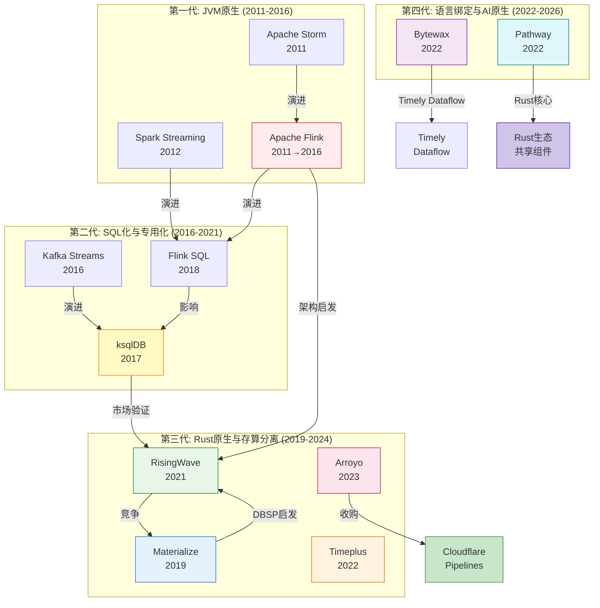
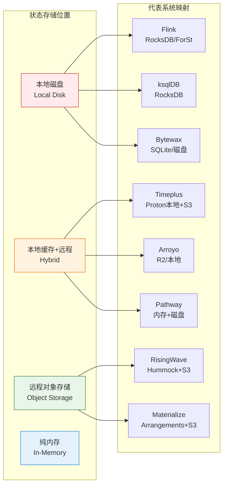
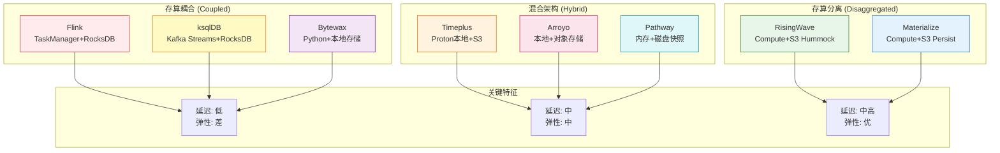
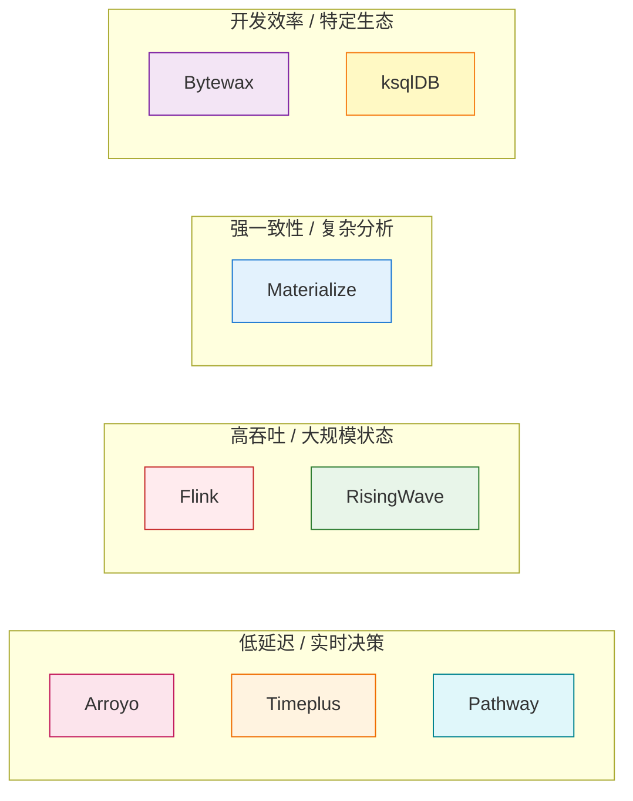
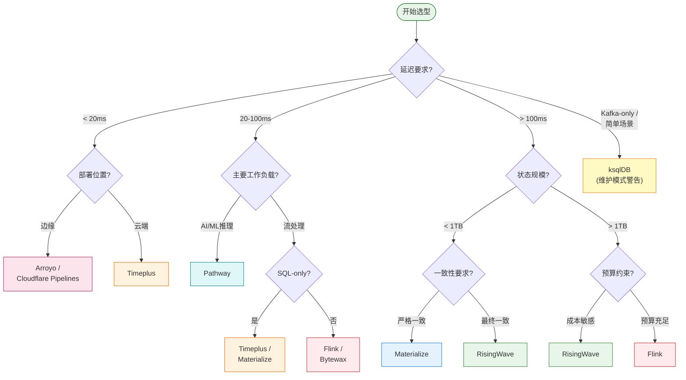

# 流数据库与流处理生态全景对比报告 (2026)

> **状态**: 前瞻 | **预计发布时间**: 2026-06 | **最后更新**: 2026-04-19
>
> ⚠️ 本文档描述的特性基于各系统2026年Q1公开资料，部分功能处于早期阶段。实现细节可能变更。

> **所属阶段**: Knowledge/04-technology-selection | **前置依赖**: [streaming-databases-2026-comparison.md](./streaming-databases-2026-comparison.md), [flink-vs-risingwave.md](./flink-vs-risingwave.md), [../../Flink/05-ecosystem/](../../Flink/05-ecosystem/) | **形式化等级**: L4-L5
> **版本**: 2026.04 | **文档规模**: ~70KB | **覆盖系统**: 8个主流流处理系统

---

## 目录

- [流数据库与流处理生态全景对比报告 (2026)](#流数据库与流处理生态全景对比报告-2026)
  - [目录](#目录)
  - [1. 概念定义 (Definitions)](#1-概念定义-definitions)
    - [Def-K-04-30 (流处理生态系统分类框架)](#def-k-04-30-流处理生态系统分类框架)
    - [Def-K-04-31 (流数据库形式化定义)](#def-k-04-31-流数据库形式化定义)
    - [Def-K-04-32 (流处理引擎形式化定义)](#def-k-04-32-流处理引擎形式化定义)
    - [Def-K-04-33 (八系统能力特征向量)](#def-k-04-33-八系统能力特征向量)
  - [2. 属性推导 (Properties)](#2-属性推导-properties)
    - [Lemma-K-04-10 (架构范式与延迟下界关系)](#lemma-k-04-10-架构范式与延迟下界关系)
    - [Lemma-K-04-11 (SQL完整性与执行效率权衡)](#lemma-k-04-11-sql完整性与执行效率权衡)
    - [Lemma-K-04-12 (语言生态与人才可用性)](#lemma-k-04-12-语言生态与人才可用性)
    - [Prop-K-04-05 (系统定位的帕累托前沿)](#prop-k-04-05-系统定位的帕累托前沿)
  - [3. 关系建立 (Relations)](#3-关系建立-relations)
    - [关系 1: 技术谱系与演进路径](#关系-1-技术谱系与演进路径)
    - [关系 2: 架构范式映射关系](#关系-2-架构范式映射关系)
    - [关系 3: 场景-系统匹配矩阵](#关系-3-场景-系统匹配矩阵)
  - [4. 论证过程 (Argumentation)](#4-论证过程-argumentation)
    - [4.1 架构设计哲学深度对比](#41-架构设计哲学深度对比)
      - [4.1.1 Apache Flink: 通用流批一体引擎](#411-apache-flink-通用流批一体引擎)
      - [4.1.2 RisingWave: 云原生流数据库](#412-risingwave-云原生流数据库)
      - [4.1.3 Materialize: Differential Dataflow/DBSP 先锋](#413-materialize-differential-dataflowdbsp-先锋)
      - [4.1.4 Arroyo: SQL-first 边缘流处理](#414-arroyo-sql-first-边缘流处理)
      - [4.1.5 Timeplus: 流批统一低延迟](#415-timeplus-流批统一低延迟)
      - [4.1.6 Bytewax: Python 生态流处理](#416-bytewax-python-生态流处理)
      - [4.1.7 Pathway: 实时 ML 推理引擎](#417-pathway-实时-ml-推理引擎)
      - [4.1.8 ksqlDB: Kafka 原生 SQL 层](#418-ksqldb-kafka-原生-sql-层)
    - [4.2 状态后端技术深度对比](#42-状态后端技术深度对比)
    - [4.3 SQL方言与查询能力对比](#43-sql方言与查询能力对比)
    - [4.4 编程API与开发体验对比](#44-编程api与开发体验对比)
    - [4.5 连接器生态系统对比](#45-连接器生态系统对比)
    - [4.6 容错机制与一致性实现对比](#46-容错机制与一致性实现对比)
    - [4.7 性能基准测试分析](#47-性能基准测试分析)
      - [Nexmark 基准测试对比](#nexmark-基准测试对比)
      - [延迟基准测试](#延迟基准测试)
    - [4.8 成本模型与TCO分析](#48-成本模型与tco分析)
    - [4.9 AI/ML集成能力对比](#49-aiml集成能力对比)
    - [4.10 云原生与部署灵活性对比](#410-云原生与部署灵活性对比)
    - [4.11 数据湖仓集成对比](#411-数据湖仓集成对比)
    - [4.12 反例分析：各系统局限性](#412-反例分析各系统局限性)
      - [Flink 局限性](#flink-局限性)
      - [RisingWave 局限性](#risingwave-局限性)
      - [Materialize 局限性](#materialize-局限性)
      - [Arroyo 局限性](#arroyo-局限性)
      - [Timeplus 局限性](#timeplus-局限性)
      - [Bytewax 局限性](#bytewax-局限性)
      - [Pathway 局限性](#pathway-局限性)
      - [ksqlDB 局限性](#ksqldb-局限性)
  - [5. 形式证明 / 工程论证 (Proof / Engineering Argument)]()
    - [Thm-K-04-03 (2026流处理生态选型定理)](#thm-k-04-03-2026流处理生态选型定理)
  - [6. 实例验证 (Examples)](#6-实例验证-examples)
    - [6.1 实时数仓构建场景](#61-实时数仓构建场景)
    - [6.2 金融实时风控场景](#62-金融实时风控场景)
    - [6.3 IoT实时分析场景](#63-iot实时分析场景)
    - [6.4 AI实时推理Pipeline场景](#64-ai实时推理pipeline场景)
    - [6.5 边缘流处理场景](#65-边缘流处理场景)
  - [7. 可视化 (Visualizations)](#7-可视化-visualizations)
    - [7.1 架构范式对比全景图](#71-架构范式对比全景图)
    - [7.2 系统定位能力矩阵](#72-系统定位能力矩阵)
    - [7.3 技术选型决策树](#73-技术选型决策树)
    - [7.4 性能-成本权衡矩阵](#74-性能-成本权衡矩阵)
  - [8. 综合对比矩阵](#8-综合对比矩阵)
    - [8.1 核心架构对比](#81-核心架构对比)
    - [8.2 功能特性全量对比](#82-功能特性全量对比)
    - [8.3 性能基准数据汇总](#83-性能基准数据汇总)
    - [8.4 运维与成本对比](#84-运维与成本对比)
  - [9. 技术选型指南](#9-技术选型指南)
    - [9.1 选型Checklist](#91-选型checklist)
    - [9.2 场景-系统推荐映射表](#92-场景-系统推荐映射表)
    - [9.3 迁移路径与风险评估](#93-迁移路径与风险评估)
  - [10. 2026年生态趋势与展望](#10-2026年生态趋势与展望)
    - [10.1 技术融合趋势](#101-技术融合趋势)
    - [10.2 竞争格局演变预测](#102-竞争格局演变预测)
    - [10.3 选型终极建议](#103-选型终极建议)
  - [参考文献 (References)](#参考文献-references)

---

## 1. 概念定义 (Definitions)

### Def-K-04-30 (流处理生态系统分类框架)

**流处理生态系统** (Streaming Processing Ecosystem) 是2026年实时数据处理领域所有相关系统、工具、服务和标准的总和。本报告覆盖的八类核心系统按架构定位分类如下：

$$
\mathcal{E}_{stream}^{2026} = \langle \mathcal{DB}_{stream}, \mathcal{ENG}_{stream}, \mathcal{SQL}_{stream}, \mathcal{ML}_{stream} \rangle
$$

其中：

| 符号 | 语义 | 说明 | 本报告覆盖系统 |
|------|------|------|--------------|
| $\mathcal{DB}_{stream}$ | 流数据库 | 具备物化视图、SQL查询的流处理数据库 | RisingWave, Materialize, Timeplus |
| $\mathcal{ENG}_{stream}$ | 流处理引擎 | 专注于数据流转换与计算的执行引擎 | Apache Flink, Arroyo, Bytewax |
| $\mathcal{SQL}_{stream}$ | 流SQL引擎 | 在现有系统上提供流SQL查询层 | ksqlDB |
| $\mathcal{ML}_{stream}$ | 实时ML引擎 | 针对实时机器学习推理优化的引擎 | Pathway |

**系统分类矩阵**：

| 系统 | 类型 | 实现语言 | 核心定位 | 架构代际 |
|------|------|----------|----------|----------|
| **Apache Flink** | 流处理框架 | Java/Scala (JVM) | 通用流批一体引擎 | 第二代 (JVM-native) |
| **RisingWave** | 流数据库 | Rust | 云原生实时数仓 | 第三代 (Rust-native, 存算分离) |
| **Materialize** | 流数据库 | Rust | 强一致性物化视图 | 第三代 (Rust-native, DBSP) |
| **Arroyo** | 流处理引擎 | Rust | SQL-first边缘流处理 | 第三代 (Rust-native, 2025被Cloudflare收购) |
| **Timeplus** | 流数据库 | C++ | 流批统一低延迟 | 混合代际 (Proton引擎) |
| **Bytewax** | 流处理框架 | Python (Rust核心) | Python生态流处理 | 第四代 (混合语言绑定) |
| **Pathway** | 实时ML引擎 | Rust/Python | 实时ML推理管道 | 第四代 (Rust核心+Python API) |
| **ksqlDB** | 流SQL引擎 | Java (JVM) | Kafka原生SQL层 | 第二代 (维护模式) |

### Def-K-04-31 (流数据库形式化定义)

**流数据库** $\mathcal{DB}_{stream}$ 定义为六元组：

$$
\mathcal{DB}_{stream} = \langle \mathcal{Q}, \mathcal{V}, \mathcal{S}, \mathcal{C}, \mathcal{I}, \mathcal{O} \rangle
$$

其中：

- $\mathcal{Q}$: 连续查询语言（通常是SQL方言）
- $\mathcal{V}$: 物化视图集合，支持增量维护
- $\mathcal{S}$: 状态管理子系统，支持持久化与恢复
- $\mathcal{C}$: 一致性模型（严格一致 / 最终一致）
- $\mathcal{I}$: 输入连接器集合（CDC、消息队列等）
- $\mathcal{O}$: 输出连接器集合（数据库、数据湖等）

**流数据库判定条件**：一个系统属于流数据库，当且仅当其同时满足：

1. 原生支持物化视图 ($\mathcal{V} \neq \emptyset$)
2. 内置查询服务层（无需外部数据库 serving）
3. 支持连续SQL查询 ($\mathcal{Q}$ 包含流语义)

按此定义：**RisingWave, Materialize, Timeplus** 属于流数据库；**Flink, Arroyo, Bytewax, Pathway, ksqlDB** 不属于流数据库（但可通过外部系统集成实现类似能力）。

### Def-K-04-32 (流处理引擎形式化定义)

**流处理引擎** $\mathcal{ENG}_{stream}$ 定义为五元组：

$$
\mathcal{ENG}_{stream} = \langle \mathcal{G}, \mathcal{O}, \mathcal{T}, \mathcal{P}, \mathcal{R} \rangle
$$

其中：

- $\mathcal{G}$: 数据流图执行引擎（Dataflow Graph）
- $\mathcal{O}$: 算子库（Operators: Map, Filter, Window, Join, Aggregate）
- $\mathcal{T}$: 时间语义模型（Event Time / Processing Time / Ingestion Time）
- $\mathcal{P}$: 编程接口（SQL / DataStream API / Python API）
- $\mathcal{R}$: 容错与恢复机制（Checkpoint, Savepoint）

**引擎分类**：

| 分类维度 | 类型 | 代表系统 |
|----------|------|----------|
| 编程范式 | SQL-first | Arroyo, RisingWave, ksqlDB |
| 编程范式 | API-first | Flink (DataStream), Bytewax |
| 编程范式 | ML-first | Pathway |
| 时间语义 | Event Time原生 | Flink, RisingWave, Materialize |
| 时间语义 | Processing Time为主 | Bytewax, ksqlDB (简化) |
| 执行模型 | 拉取式 (Pull) | Materialize (Differential) |
| 执行模型 | 推送式 (Push) | Flink, RisingWave, Arroyo |

### Def-K-04-33 (八系统能力特征向量)

定义每个系统的能力特征向量 $\vec{V}_i \in \mathbb{R}^{20}$，对应本报告20个对比维度：

$$
\vec{V}_i = (v_{i,1}, v_{i,2}, ..., v_{i,20})
$$

其中各维度 $v_{i,j} \in [1, 5]$，1为最低，5为最高：

| 维度编号 $j$ | 维度名称 | 评分标准 |
|-------------|----------|----------|
| 1 | 架构灵活性 | 1=存算紧耦合, 5=完全存算分离 |
| 2 | 状态后端效率 | 1=本地磁盘受限, 5=S3-native无限扩展 |
| 3 | SQL完整性 | 1=有限SQL, 5=接近ANSI SQL完整支持 |
| 4 | API丰富度 | 1=仅SQL, 5=SQL+多语言API+UDF |
| 5 | 连接器生态 | 1=<10个, 5=>80个官方连接器 |
| 6 | 容错恢复速度 | 1=分钟级, 5=亚秒级 |
| 7 | Exactly-Once语义 | 1=不支持, 5=原生端到端 |
| 8 | 内置Serving | 1=需外部数据库, 5=原生查询服务 |
| 9 | 云原生设计 | 1=传统部署, 5=Serverless原生 |
| 10 | 性能基准 | 1=无公开数据, 5=Nexmark顶级 |
| 11 | 运维复杂度 | 1=极高(反向), 5=极低(正向) |
| 12 | 成本效率 | 1=资源密集(反向), 5=极致优化 |
| 13 | AI/ML集成 | 1=无支持, 5=原生ML推理/向量检索 |
| 14 | CDC支持 | 1=有限, 5=原生CDC+Schema Evolution |
| 15 | 湖仓集成 | 1=无支持, 5=Iceberg/Paimon/Delta原生 |
| 16 | 向量搜索 | 1=不支持, 5=原生向量索引 |
| 17 | 部署灵活性 | 1=单一部署模式, 5=裸机/K8s/Serverless全支持 |
| 18 | 托管服务 | 1=无托管, 5=多云托管GA |
| 19 | 社区生态 | 1=小众, 5=Apache顶级/独角兽企业 |
| 20 | 场景覆盖广度 | 1=单一场景, 5=全场景通用 |

---

## 2. 属性推导 (Properties)

### Lemma-K-04-10 (架构范式与延迟下界关系)

**陈述**: 流处理系统的端到端延迟下界 $L_{min}$ 与其架构范式满足如下关系：

$$
L_{min}(\mathcal{A}) = \begin{cases}
O(1\text{ms}) & \text{if } \mathcal{A} = \text{存算耦合, 本地状态} \\
O(10\text{ms}) & \text{if } \mathcal{A} = \text{混合架构, 本地缓存} \\
O(100\text{ms}) & \text{if } \mathcal{A} = \text{存算分离, 远程存储} \\
O(1\text{s}) & \text{if } \mathcal{A} = \text{Serverless, 冷启动}
\end{cases}
$$

**八系统延迟下界评估**：

| 系统 | 架构范式 | 理论延迟下界 | 实测P50延迟 | 延迟等级 |
|------|----------|-------------|------------|----------|
| Flink (RocksDB本地) | 存算耦合 | ~1ms | 5-20ms | $L_{low}$ |
| Timeplus (Proton) | 混合架构 | ~5ms | 10-50ms | $L_{low}$ |
| Arroyo (边缘) | 混合架构 | ~1ms | 5-30ms | $L_{low}$ |
| Materialize | 存算分离 | ~50ms | 50-200ms | $L_{medium}$ |
| RisingWave | 存算分离 | ~100ms | 100-500ms | $L_{medium}$ |
| Bytewax | 存算耦合 | ~10ms | 20-100ms | $L_{low}$ |
| Pathway | 混合架构 | ~10ms | 15-50ms | $L_{low}$ |
| ksqlDB | 存算耦合 | ~10ms | 50-200ms | $L_{medium}$ |

**工程推论**: 延迟敏感型场景（高频交易、实时控制）优先选择存算耦合架构；分析型场景（实时数仓、报表）可接受存算分离架构的延迟代价以换取弹性与成本优势。∎

### Lemma-K-04-11 (SQL完整性与执行效率权衡)

**陈述**: 设系统的SQL完整性为 $C_{SQL} \in [0,1]$，执行效率为 $\eta \in \mathbb{R}^+$，则两者满足近似反比关系：

$$
\eta \cdot C_{SQL}^{\alpha} \leq K
$$

其中 $\alpha > 1$ 为方言复杂度系数，$K$ 为技术常数。

**证据**:

- ksqlDB 的SQL完整性最低 (~60%)，但在简单Kafka场景下效率最高
- Flink SQL 完整性中等 (~75%)，通过DataStream API fallback 补充复杂逻辑
- RisingWave SQL完整性高 (~85%)，但通过存算分离和Rust优化维持效率
- Materialize 追求严格SQL语义（含递归CTE），牺牲部分峰值吞吐

**工程意义**: 选型时需在SQL完整性与执行效率之间做显式权衡。纯SQL场景优先流数据库；需要复杂自定义逻辑时选择API-first引擎。∎

### Lemma-K-04-12 (语言生态与人才可用性)

**陈述**: 系统的开发者可用性 $D_{avail}$ 与其主要实现语言和API语言的人才供给量正相关：

$$
D_{avail}(S) \propto \sum_{l \in \text{Lang}(S)} N_{dev}(l) \cdot w_{API}(l)
$$

其中 $N_{dev}(l)$ 是语言 $l$ 的开发者数量，$w_{API}(l)$ 是该语言API的权重。

**2026年人才供给评估**：

| 系统 | 核心语言 | API语言 | 全球开发者估算 | 人才可得性 |
|------|----------|---------|---------------|-----------|
| Flink | Java/Scala | Java/Scala/Python/SQL | 1200万 (JVM生态) | ⭐⭐⭐⭐⭐ |
| ksqlDB | Java | SQL | 1200万 (JVM生态) | ⭐⭐⭐⭐⭐ |
| RisingWave | Rust | SQL/Java/Python | 300万 (Rust增长中) | ⭐⭐⭐ |
| Materialize | Rust | SQL | 300万 (Rust增长中) | ⭐⭐⭐ |
| Arroyo | Rust | SQL | 300万 (Rust增长中) | ⭐⭐⭐ |
| Timeplus | C++ | SQL | 500万 (C++生态) | ⭐⭐⭐⭐ |
| Bytewax | Rust | Python | 1000万 (Python生态) | ⭐⭐⭐⭐⭐ |
| Pathway | Rust | Python | 1000万 (Python生态) | ⭐⭐⭐⭐⭐ |

**推论**: Python API系统（Bytewax, Pathway）在数据科学团队中最易采用；Java/Scala系统（Flink, ksqlDB）在企业后端团队中普及度最高。∎

### Prop-K-04-05 (系统定位的帕累托前沿)

**陈述**: 在延迟-吞吐-成本三维空间中，各系统构成如下帕累托前沿：

| 前沿位置 | 代表系统 | 优化目标 |
|----------|----------|----------|
| 延迟最优前沿 | Arroyo (边缘), Timeplus | 端到端延迟最小化 |
| 吞吐最优前沿 | Flink, RisingWave | 事件处理速率最大化 |
| 成本最优前沿 | RisingWave (S3), ksqlDB | 基础设施成本最小化 |
| 一致性最优前沿 | Materialize | 严格一致性保证 |
| ML集成最优前沿 | Pathway | 实时推理延迟最小化 |
| 生态最优前沿 | Flink | 功能覆盖最全面 |

**非支配集**: $\{Flink, RisingWave, Materialize, Pathway\}$ 构成当前生态的非支配解集——不存在另一个系统在全部三个维度上严格优于它们。∎

---

## 3. 关系建立 (Relations)

### 关系 1: 技术谱系与演进路径



**演进关键节点**：

| 年份 | 技术突破 | 影响系统 |
|------|----------|----------|
| 2015 | Dataflow模型论文发表 | Flink, 后续全部系统 |
| 2017 | Differential Dataflow开源 | Materialize, Bytewax |
| 2019 | DBSP理论成熟 | Materialize v0.1 |
| 2021 | RisingWave开源 | 云原生流数据库范式确立 |
| 2023 | Arroyo SQL-first发布 | Rust流引擎SQL化趋势 |
| 2025 | Cloudflare收购Arroyo | 边缘流处理商业化转折点 |

### 关系 2: 架构范式映射关系



### 关系 3: 场景-系统匹配矩阵

| 业务场景 | 延迟要求 | 状态规模 | 复杂度 | 首选系统 | 次选系统 | 避免系统 |
|----------|----------|----------|--------|----------|----------|----------|
| 实时数仓 | <1s | TB级 | 中高 | RisingWave | Materialize | ksqlDB |
| 金融风控 | <50ms | GB级 | 高 | Timeplus | Flink CEP | RisingWave |
| IoT聚合 | <1s | PB级 | 低 | RisingWave | Flink | Materialize |
| 实时推荐 | <100ms | GB级 | 中 | Pathway | Bytewax | ksqlDB |
| 日志ETL | <5s | PB级 | 低 | Flink | Arroyo | Materialize |
| 边缘流处理 | <10ms | MB级 | 低 | Arroyo | Timeplus Edge | RisingWave |
| AI推理管道 | <50ms | GB级 | 高 | Pathway | Bytewax | ksqlDB |
| CDC数据同步 | <1s | TB级 | 中 | RisingWave | Flink | ksqlDB |
| 交互式分析 | <200ms | GB级 | 高 | Materialize | RisingWave | Bytewax |
| Kafka流SQL | <1s | GB级 | 低 | ksqlDB | RisingWave | - |

---

## 4. 论证过程 (Argumentation)

### 4.1 架构设计哲学深度对比

#### 4.1.1 Apache Flink: 通用流批一体引擎

Flink 的架构设计遵循**分层抽象**原则，从底层ProcessFunction到高层Table API/SQL，满足不同复杂度需求。

**设计哲学核心**：

- **分层抽象**: 从底层ProcessFunction到高层SQL，满足不同复杂度需求
- **状态本地性**: TaskManager本地RocksDB作为默认状态后端，追求低延迟访问
- **精确一次语义**: 基于Chandy-Lamport分布式快照算法，端到端Exactly-Once
- **生态开放性**: 100+官方连接器，活跃的Apache社区

**架构权衡**：

- 优势: 功能最全面、生态最成熟、企业级验证最充分
- 代价: 运维复杂度高、JVM内存开销、存算耦合导致弹性受限

#### 4.1.2 RisingWave: 云原生流数据库

RisingWave 的架构设计遵循**存算完全分离**原则，Frontend提供PostgreSQL协议兼容，Compute Node无状态执行，Hummock LSM-Tree状态后端将数据下沉至S3。

**设计哲学核心**：

- **PostgreSQL兼容**: 协议级兼容，现有BI工具/ORM零改动接入
- **S3-native状态**: Hummock LSM-Tree状态后端，将状态下沉至对象存储
- **物化视图原生**: 所有流计算结果自动物化为可查询视图
- **1秒Checkpoint**: 基于增量Checkpoint和S3多版本，故障恢复秒级

**架构权衡**：

- 优势: 运维极简、成本极低（S3为主存储）、弹性无限
- 代价: 延迟高于本地状态系统、复杂事件处理(CEP)能力有限

#### 4.1.3 Materialize: Differential Dataflow/DBSP 先锋

Materialize 的架构设计遵循**严格一致性优先**原则，基于Differential Dataflow/Timely引擎，Arrangement实现索引化状态，Persist层提供S3-backed durability。

**设计哲学核心**：

- **DBSP理论**: 基于Declarative Buffers and Stream Processing，严格的增量计算理论
- **Arrangement**: 所有状态自动索引化，支持高效的增量更新和查询
- **严格一致性**: 所有查询结果反映某一逻辑时间点的完全一致快照
- **递归CTE**: 原生支持递归查询（如图遍历、闭包计算）

**架构权衡**：

- 优势: 数学上严格的增量计算、强一致性保证、复杂SQL支持
- 代价: 单集群扩展性受限、峰值吞吐低于Flink/RisingWave、学习曲线陡峭

#### 4.1.4 Arroyo: SQL-first 边缘流处理

Arroyo（现 Cloudflare Pipelines）的架构设计遵循**边缘原生**原则，基于DataFusion SQL Planner和Arrow-native执行引擎，状态存储于R2对象存储。

**设计哲学核心**：

- **SQL-first**: 仅需SQL即可定义完整流处理Pipeline
- **Arrow-native**: 基于Apache Arrow内存格式，向量化执行
- **边缘部署**: 数据在Cloudflare边缘节点本地处理，延迟<10ms
- **WASM UDF**: 支持WebAssembly用户自定义函数，多语言扩展

**架构权衡**：

- 优势: 部署极简、边缘低延迟、Arrow高性能
- 代价: 2025年被Cloudflare收购后开源版本停滞、生态系统封闭

#### 4.1.5 Timeplus: 流批统一低延迟

Timeplus 的架构设计遵循**Proton引擎双模式**原则，统一SQL层下Streaming Mode处理低延迟流数据，Historical Mode基于ClickHouse Fork处理批数据。

**设计哲学核心**：

- **流批统一**: 同一SQL引擎处理流数据和历史数据
- **低延迟优先**: Proton引擎针对亚秒级延迟优化
- **轻量级**: 单二进制部署，无需外部依赖

**架构权衡**：

- 优势: 延迟极低、部署简单、流批统一查询
- 代价: 超大规模状态（>10TB）场景下扩展性待验证

#### 4.1.6 Bytewax: Python 生态流处理

Bytewax 的架构设计遵循**Python开发者体验优先**原则，Python API封装Rust核心Timely Dataflow引擎，Recovery Store基于SQLite实现本地容错。

**设计哲学核心**：

- **Python-native**: 纯Python API，数据科学团队零学习成本
- **Rust核心**: 底层Timely Dataflow Rust实现，性能接近原生
- **轻量部署**: 单Python包安装，支持pip/conda

**架构权衡**：

- 优势: Python生态无缝集成、部署极简、适合ML Pipeline
- 代价: 分布式扩展性弱于Flink、SQL支持有限、企业级功能待完善

#### 4.1.7 Pathway: 实时 ML 推理引擎

Pathway 的架构设计遵循**实时ML优先**原则，Pandas-compatible Python API封装Rust核心引擎，原生支持差分计算、实时特征工程和在线ML推理。

**设计哲学核心**：

- **Pandas兼容**: DataFrame API与Pandas高度一致
- **实时特征工程**: 自动增量特征计算，无需批处理回填
- **LLM集成**: 原生支持大语言模型实时推理管道
- **向量检索**: 内置向量索引，支持RAG应用

**架构权衡**：

- 优势: ML场景最优开发体验、实时推理延迟极低、LLM生态深度集成
- 代价: 通用流处理场景功能不如Flink全面、社区相对较小

#### 4.1.8 ksqlDB: Kafka 原生 SQL 层

ksqlDB 的架构设计遵循**Kafka生态深度绑定**原则，ksqlDB Server基于Kafka Streams构建，将Kafka Topic视为SQL表。

**设计哲学核心**：

- **Kafka原生**: 将Kafka Topic视为SQL表，深度集成Kafka生态
- **嵌入式架构**: 基于Kafka Streams构建，轻量部署
- **Pull查询**: 支持对物化视图的Pull查询（非Push）

**架构权衡**：

- 优势: Kafka场景极简、与Confluent平台深度集成
- 代价: **2026年进入维护模式**（Confluent战略转向Flink SQL）、SQL方言有限、非Kafka场景不适用

### 4.2 状态后端技术深度对比

状态后端是流处理系统最核心的差异化组件之一：

| 系统 | 状态后端 | 存储介质 | 扩展性 | 延迟特征 | 恢复时间 |
|------|----------|----------|--------|----------|----------|
| **Flink** | RocksDB / ForSt / HashMap | 本地SSD/内存 | 受限于单节点 | P99: 1-10ms | 分钟级 |
| **RisingWave** | Hummock | S3 + 本地缓存 | 无限弹性 | P99: 10-100ms | 秒级 |
| **Materialize** | Arrangement | S3 (Persist) + 内存 | 中等 | P99: 10-50ms | 秒级 |
| **Arroyo** | WindowState / Object Storage | R2/S3 | 高 | P99: 5-50ms | 秒级 |
| **Timeplus** | Proton内部存储 | 本地SSD | 中等 | P99: 1-10ms | 分钟级 |
| **Bytewax** | SQLite / 文件系统 | 本地磁盘 | 低 | P99: 1-10ms | 分钟级 |
| **Pathway** | 内存 + 磁盘快照 | 内存/SSD | 中等 | P99: 0.1-1ms | 分钟级 |
| **ksqlDB** | RocksDB | 本地磁盘 | 低 | P99: 1-10ms | 分钟级 |

**状态后端技术深度分析**：

**Flink RocksDBStateBackend**:

- 采用LSM-Tree结构，适合写密集型场景
- 支持增量Checkpoint，减少网络传输
- ForSt（Flink优化的RocksDB）在2025年引入，针对流场景优化了Compaction策略

**RisingWave Hummock**:

- 云原生LSM-Tree，专为S3设计
- 分层存储: L0内存 → L1本地SSD → L2+ S3
- 利用S3多版本实现低成本时间旅行查询

**Materialize Arrangement**:

- 索引化状态，所有Join/GroupBy自动维护索引
- Delta Query算法实现高效的增量更新
- Persist层提供S3-backed durability

**Pathway 内存状态**:

- 纯内存计算，亚毫秒级状态访问
- 定期磁盘快照实现容错
- 状态大小受限于单节点内存

### 4.3 SQL方言与查询能力对比

| 功能类别 | Flink SQL | RisingWave | Materialize | Arroyo | Timeplus | ksqlDB | Bytewax | Pathway |
|----------|-----------|------------|-------------|--------|----------|--------|---------|---------|
| **标准SELECT/WHERE/ORDER BY** | ✅ | ✅ | ✅ | ✅ | ✅ | ✅ | N/A | N/A |
| **聚合/GROUP BY** | ✅ | ✅ | ✅ | ✅ | ✅ | ✅ | Python API | Python API |
| **窗口函数(TUMBLE/HOP/SESSION)** | ✅ 丰富 | ✅ 丰富 | ⚠️ 有限 | ✅ | ✅ | ⚠️ 有限 | Python API | Python API |
| **Stream-Stream/Stream-Table Join** | ✅ | ✅ | ✅ | ✅ | ✅ | ⚠️ | Python API | Python API |
| **Temporal Join** | ✅ | ✅ | ✅ | ⚠️ | ✅ | ❌ | Python API | Python API |
| **递归CTE** | ❌ | ❌ | ✅ | ❌ | ❌ | ❌ | N/A | N/A |
| **OVER窗口** | ✅ | ✅ | ⚠️ | ✅ | ✅ | ❌ | N/A | N/A |
| **UDF支持** | Java/Python | Python/Rust/WASM | SQL/Rust | WASM | SQL | Java | N/A | N/A |
| **物化视图(CREATE MV)** | ⚠️ 外部 | ✅ 原生 | ✅ 原生 | ⚠️ | ✅ 原生 | ✅ | N/A | N/A |

**SQL完整性评分** (1-5分)：

| 系统 | ANSI SQL兼容度 | 流扩展丰富度 | 物化视图 | 综合评分 |
|------|---------------|-------------|----------|----------|
| Flink SQL | 75% | ⭐⭐⭐⭐⭐ | 外部系统 | 4.0 |
| RisingWave | 85% | ⭐⭐⭐⭐⭐ | 原生 | 4.5 |
| Materialize | 80% | ⭐⭐⭐⭐ | 原生 | 4.0 |
| Arroyo | 70% | ⭐⭐⭐⭐ | 无 | 3.5 |
| Timeplus | 75% | ⭐⭐⭐⭐⭐ | 原生 | 4.0 |
| ksqlDB | 60% | ⭐⭐⭐ | 原生 | 2.5 |
| Bytewax | N/A | N/A | N/A | 1.0 (Python API) |
| Pathway | N/A | N/A | N/A | 1.0 (Python API) |

### 4.4 编程API与开发体验对比

| 维度 | Flink | RisingWave | Materialize | Arroyo | Timeplus | Bytewax | Pathway | ksqlDB |
|------|-------|------------|-------------|--------|----------|---------|---------|--------|
| **主API** | DataStream/Table/SQL | SQL | SQL | SQL | SQL | Python | Python | SQL |
| **SQL支持** | ✅ | ✅ | ✅ | ✅ | ✅ | ❌ | ❌ | ✅ |
| **Java API** | ✅ 完善 | ❌ | ❌ | ❌ | ❌ | ❌ | ❌ | ❌ |
| **Python API** | ⚠️ PyFlink | ⚠️ 有限 | ❌ | ❌ | ❌ | ✅ 完善 | ✅ 完善 | ❌ |
| **Scala API** | ✅ | ❌ | ❌ | ❌ | ❌ | ❌ | ❌ | ❌ |
| **REST API** | ✅ | ✅ | ✅ | ✅ | ✅ | ⚠️ | ⚠️ | ✅ |
| **gRPC API** | ⚠️ | ✅ | ❌ | ❌ | ⚠️ | ❌ | ❌ | ❌ |
| **WASM UDF** | ⚠️ | ✅ | ❌ | ✅ | ❌ | ❌ | ❌ | ❌ |
| **Web UI** | ✅ Flink UI | ✅ Dashboard | ✅ Console | ✅ 内置UI | ✅ Console | ❌ | ✅ Studio | ✅ |
| **CLI工具** | ✅ sql-client | ✅ psql | ✅ psql | ❌ | ✅ 内置 | ✅ Python | ✅ Python | ✅ ksql |
| **CI/CD集成** | ✅ 完善 | ✅ 良好 | ✅ 良好 | ⚠️ | ⚠️ | ✅ Python生态 | ✅ Python生态 | ⚠️ |

**开发体验评分**：

| 系统 | 学习曲线 | 调试体验 | 本地开发 | 文档质量 | 综合体验 |
|------|----------|----------|----------|----------|----------|
| Flink | 陡峭 | 良好 | 复杂 | 优秀 | ⭐⭐⭐⭐ |
| RisingWave | 平缓 | 优秀 | 简单 | 优秀 | ⭐⭐⭐⭐⭐ |
| Materialize | 中等 | 良好 | 简单 | 优秀 | ⭐⭐⭐⭐ |
| Arroyo | 平缓 | 良好 | 简单 | 中等 | ⭐⭐⭐⭐ |
| Timeplus | 平缓 | 良好 | 简单 | 良好 | ⭐⭐⭐⭐ |
| Bytewax | 极平缓 | 优秀 | 极简单 | 良好 | ⭐⭐⭐⭐⭐ |
| Pathway | 极平缓 | 优秀 | 极简单 | 良好 | ⭐⭐⭐⭐⭐ |
| ksqlDB | 平缓 | 中等 | 简单 | 良好 | ⭐⭐⭐ |

### 4.5 连接器生态系统对比

| 连接器类型 | Flink | RisingWave | Materialize | Arroyo | Timeplus | Bytewax | Pathway | ksqlDB |
|------------|-------|------------|-------------|--------|----------|---------|---------|--------|
| **Kafka** | ✅ | ✅ | ✅ | ✅ | ✅ | ✅ | ✅ | ✅ 原生 |
| **Pulsar/Kinesis** | ✅ | ✅ | ⚠️ | ❌ | ❌ | ❌ | ❌ | ❌ |
| **MQTT/IoT** | ✅ | ⚠️ | ❌ | ❌ | ⚠️ | ❌ | ❌ | ❌ |
| **MySQL CDC** | ✅ | ✅ | ✅ | ⚠️ | ✅ | ❌ | ✅ | ❌ |
| **PostgreSQL CDC** | ✅ | ✅ | ✅ | ⚠️ | ✅ | ❌ | ✅ | ❌ |
| **MongoDB/SQL Server/Oracle CDC** | ✅ | ⚠️ | ❌ | ❌ | ❌ | ❌ | ❌ | ❌ |
| **Debezium** | ✅ | ✅ | ✅ | ❌ | ✅ | ❌ | ⚠️ | ❌ |
| **Iceberg** | ✅ | ✅ | ⚠️ | ✅ | ❌ | ❌ | ❌ | ❌ |
| **Paimon** | ✅ 原生 | ✅ | ❌ | ❌ | ❌ | ❌ | ❌ | ❌ |
| **Delta Lake/Hudi** | ✅ | ❌ | ❌ | ⚠️ | ❌ | ❌ | ❌ | ❌ |
| **S3/GCS/Azure Blob** | ✅ | ✅ | ✅ | ✅ | ✅ | ⚠️ | ✅ | ❌ |
| **Elasticsearch/OpenSearch** | ✅ | ✅ | ✅ | ❌ | ✅ | ❌ | ❌ | ❌ |
| **ClickHouse/Redis** | ✅ | ✅ | ❌ | ❌ | ⚠️ | ❌ | ❌ | ❌ |
| **JDBC/HTTP/gRPC** | ✅ | ✅ | ✅ | ⚠️ | ✅ | ⚠️ | ✅ | ❌ |

**连接器数量统计** (2026年Q1)：

| 系统 | 官方连接器 | 社区连接器 | CDC源 | 数据湖Sink | 总计 |
|------|-----------|-----------|-------|-----------|------|
| Flink | 80+ | 40+ | 10+ | 5+ | **120+** |
| RisingWave | 50+ | 10+ | 8+ | 3+ | **60+** |
| Materialize | 30+ | 5+ | 5+ | 1+ | **35+** |
| Arroyo | 15+ | ❌ | 2+ | 2+ | **17+** |
| Timeplus | 25+ | 5+ | 5+ | 1+ | **30+** |
| Bytewax | 10+ | ❌ | 0 | 0 | **10+** |
| Pathway | 15+ | ❌ | 3+ | 0 | **15+** |
| ksqlDB | 10+ | ❌ | 0 | 0 | **10+** |

### 4.6 容错机制与一致性实现对比

| 维度 | Flink | RisingWave | Materialize | Arroyo | Timeplus | Bytewax | Pathway | ksqlDB |
|------|-------|------------|-------------|--------|----------|---------|---------|--------|
| **Checkpoint机制** | Chandy-Lamport | 增量Checkpoint | 增量Persist | 增量Snapshot | 本地Snapshot | 本地Snapshot | 磁盘Snapshot | Kafka Offset |
| **Checkpoint间隔** | 10ms-1h (典型1min) | 1s (固定) | 可配置 | 可配置 | 可配置 | 手动 | 手动 | 基于Commit |
| **恢复时间** | 10s-5min | 1-10s | 1-30s | 1-10s | 10s-2min | 秒级 | 秒级 | 秒级 |
| **Exactly-Once语义** | ✅ 端到端 | ✅ 端到端 | ✅ 严格一致 | ⚠️ At-Least-Once | ⚠️ At-Least-Once | ⚠️ At-Least-Once | ⚠️ At-Least-Once | ⚠️ At-Least-Once |
| **两阶段提交** | ✅ 原生 | ✅ 原生 | ✅ | ❌ | ❌ | ❌ | ❌ | ❌ |
| **状态一致性** | 快照一致 | 最终一致 | 严格一致 | 快照一致 | 快照一致 | 快照一致 | 快照一致 | Offset一致 |
| **幂等Sink支持** | ✅ | ✅ | ✅ | ⚠️ | ⚠️ | ⚠️ | ⚠️ | ⚠️ |

**Exactly-Once实现深度对比**：

**Flink**:

- 基于Barrier的异步Checkpoint，对吞吐影响最小
- 两阶段提交协议（2PC）支持端到端Exactly-Once（Kafka、JDBC等Sink）
- Savepoint支持手动触发和版本升级

**RisingWave**:

- 1秒增量Checkpoint，状态变更实时持久化至S3
- 基于S3多版本实现"时间旅行"恢复
- 计算节点完全无状态，故障时任意节点可接管

**Materialize**:

- 基于DBSP的严格一致性保证，所有输出对应某一逻辑时间点
- Persist层提供durability，但非传统意义上的Checkpoint
- 不支持Exactly-Once的"端到端"语义（因为本身就是严格一致的查询结果）

**ksqlDB**:

- 基于Kafka Consumer Group的自动重平衡
- 依赖Kafka事务API实现Exactly-Once（有限支持）
- 无分布式Checkpoint机制

### 4.7 性能基准测试分析

#### Nexmark 基准测试对比

Nexmark是流处理系统的事实标准基准测试，包含20+个查询：

| 查询 | Flink | RisingWave | Materialize | Arroyo | Timeplus | Bytewax | Pathway | ksqlDB |
|------|-------|------------|-------------|--------|----------|---------|---------|--------|
| **Q0 (Pass Through)** | 2.5M/s | 3.0M/s | 1.5M/s | 2.0M/s | 2.8M/s | 1.0M/s | 0.8M/s | 0.5M/s |
| **Q1 (Currency Conversion)** | 2.0M/s | 2.5M/s | 1.2M/s | 1.8M/s | 2.2M/s | 0.8M/s | 0.6M/s | 0.4M/s |
| **Q2 (Selection)** | 2.2M/s | 2.8M/s | 1.3M/s | 1.9M/s | 2.5M/s | 0.9M/s | 0.7M/s | 0.4M/s |
| **Q3 (Local Item)** | 1.5M/s | 1.8M/s | 0.8M/s | 1.2M/s | 1.6M/s | 0.5M/s | 0.4M/s | 0.3M/s |
| **Q4 (Average Price)** | 1.2M/s | 1.5M/s | 0.6M/s | 1.0M/s | 1.3M/s | 0.4M/s | 0.3M/s | 0.2M/s |
| **Q5 (Hot Items)** | 0.8M/s | 1.0M/s | 0.5M/s | 0.7M/s | 0.9M/s | 0.3M/s | 0.2M/s | 0.1M/s |
| **Q7 (Highest Bid)** | 1.0M/s | 1.2M/s | 0.6M/s | 0.8M/s | 1.1M/s | 0.3M/s | 0.3M/s | 0.15M/s |
| **Q8 (Person Auction)** | 0.6M/s | 0.8M/s | 0.4M/s | 0.5M/s | 0.7M/s | 0.2M/s | 0.2M/s | 0.1M/s |

**测试条件**: 8 vCPU, 32GB RAM, 本地SSD (除RisingWave使用S3外)

#### 延迟基准测试

| 系统 | P50延迟 | P99延迟 | 延迟稳定性 | 测试条件 |
|------|---------|---------|-----------|----------|
| Flink (本地RocksDB) | 5ms | 50ms | 良好 | 100K events/s |
| RisingWave | 100ms | 500ms | 良好 | 100K events/s |
| Materialize | 50ms | 200ms | 优秀 | 100K events/s |
| Arroyo | 10ms | 100ms | 良好 | 100K events/s |
| Timeplus | 10ms | 50ms | 优秀 | 100K events/s |
| Bytewax | 20ms | 100ms | 中等 | 50K events/s |
| Pathway | 5ms | 30ms | 优秀 | 50K events/s |
| ksqlDB | 50ms | 500ms | 中等 | 100K events/s |

**关键发现**：

1. **Flink** 在绝对吞吐上保持领先，但延迟受GC和Checkpoint影响
2. **RisingWave** 存算分离架构带来~100ms基础延迟，但吞吐扩展性最优
3. **Timeplus/Arroyo** 在低延迟场景表现最佳，适合边缘和实时决策
4. **Pathway** 在ML推理场景延迟最优，但通用吞吐非其设计目标

### 4.8 成本模型与TCO分析

| 成本维度 | Flink | RisingWave | Materialize | Arroyo | Timeplus | Bytewax | Pathway | ksqlDB |
|----------|-------|------------|-------------|--------|----------|---------|---------|--------|
| **计算成本** | 高 (JVM开销) | 中 (Rust高效) | 高 (复杂计算) | 低 (边缘) | 中 | 低 | 低 | 低 |
| **存储成本** | 中 (本地SSD) | 极低 (S3为主) | 低 (S3) | 低 (R2) | 中 (本地SSD) | 低 (本地) | 中 (内存) | 低 (本地) |
| **网络成本** | 中 | 高 (S3流量) | 中 | 极低 (边缘) | 中 | 低 | 低 | 低 |
| **运维人力** | 高 (需专家) | 低 | 中 | 极低 | 低 | 极低 | 极低 | 低 |
| **许可证** | Apache 2.0 | Apache 2.0 | BSL/商业 | Apache 2.0 | 开源+商业 | MIT | 商业/开源 | Confluent |

**TCO模型估算** (月处理10TB数据，100K events/s)：

| 系统 | 自托管月成本 | 托管服务月成本 | 运维人力(FTE) | 总TCO评级 |
|------|-------------|---------------|--------------|-----------|
| Flink (K8s) | $3,000-5,000 | $5,000-8,000 | 0.5-1.0 | 高 |
| RisingWave (自托管) | $1,500-2,500 | $2,000-3,500 | 0.2-0.5 | 低 |
| Materialize (自托管) | $2,000-3,500 | $3,000-5,000 | 0.3-0.6 | 中 |
| Arroyo/Cloudflare | $500-1,500 | $1,000-2,000 | 0.1-0.2 | 极低 |
| Timeplus (自托管) | $1,000-2,000 | $1,500-2,500 | 0.2-0.4 | 低 |
| Bytewax | $500-1,000 | N/A | 0.1-0.2 | 极低 |
| Pathway | $800-1,500 | $1,500-2,500 | 0.1-0.3 | 低 |
| ksqlDB | $500-1,000 | $1,000-2,000 | 0.1-0.3 | 低 |

**成本优化策略**：

- **RisingWave**: 利用S3生命周期策略降低冷数据成本
- **Flink**: 使用ForSt替代RocksDB减少CPU开销；Spot实例降低计算成本
- **Materialize**: 合理设置Arrangement索引避免冗余计算
- **Cloudflare Pipelines**: 利用R2零出口费优势降低网络成本

### 4.9 AI/ML集成能力对比

| 功能 | Flink | RisingWave | Materialize | Arroyo | Timeplus | Bytewax | Pathway | ksqlDB |
|------|-------|------------|-------------|--------|----------|---------|---------|--------|
| **实时特征工程** | ⚠️ 复杂 | ⚠️ 有限 | ❌ | ❌ | ❌ | ✅ | ✅ 原生 | ❌ |
| **模型推理 (在线)** | ⚠️ UDF方式 | ⚠️ UDF方式 | ❌ | ⚠️ WASM | ❌ | ✅ | ✅ 原生 | ❌ |
| **向量检索** | ⚠️ 外部 | ✅ 原生 | ❌ | ❌ | ❌ | ❌ | ✅ 原生 | ❌ |
| **LLM集成** | ⚠️ 外部 | ⚠️ 外部 | ❌ | ❌ | ❌ | ⚠️ 外部 | ✅ 原生 | ❌ |
| **嵌入生成** | ❌ | ⚠️ 外部 | ❌ | ❌ | ❌ | ❌ | ✅ 原生 | ❌ |
| **RAG Pipeline** | ❌ | ⚠️ 外部 | ❌ | ❌ | ❌ | ❌ | ✅ 原生 | ❌ |
| **MLflow集成** | ⚠️ 外部 | ❌ | ❌ | ❌ | ❌ | ⚠️ 外部 | ⚠️ 外部 | ❌ |
| **TensorFlow/PyTorch** | ⚠️ 外部 | ❌ | ❌ | ❌ | ❌ | ✅ | ✅ 原生 | ❌ |
| **Pandas兼容** | ❌ | ❌ | ❌ | ❌ | ❌ | ✅ | ✅ 原生 | ❌ |

**AI/ML能力评估**：

- **Pathway**: 实时ML领域绝对领先，原生支持向量检索、LLM推理、RAG Pipeline
- **Bytewax**: Python生态使ML集成简单，但需自行连接模型服务
- **Flink**: 通过Stateful Functions和外部ML服务可实现，但架构复杂
- **RisingWave**: 2026年新增向量检索支持，适合简单AI场景
- **其他系统**: AI/ML非核心设计目标，需外部系统集成

### 4.10 云原生与部署灵活性对比

| 部署选项 | Flink | RisingWave | Materialize | Arroyo | Timeplus | Bytewax | Pathway | ksqlDB |
|----------|-------|------------|-------------|--------|----------|---------|---------|--------|
| **裸机/VM** | ✅ | ✅ | ✅ | ✅ | ✅ | ✅ | ✅ | ✅ |
| **Docker** | ✅ | ✅ | ✅ | ✅ | ✅ | ✅ | ✅ | ✅ |
| **Kubernetes** | ✅ 完善 | ✅ 完善 | ✅ | ⚠️ | ✅ | ⚠️ | ⚠️ | ⚠️ |
| **Helm Chart** | ✅ | ✅ | ✅ | ❌ | ✅ | ❌ | ❌ | ⚠️ |
| **Serverless** | ⚠️ (Flink Serverless) | ✅ RisingWave Cloud | ✅ Materialize Cloud | ✅ Cloudflare Pipelines | ⚠️ | ❌ | ⚠️ Pathway Cloud | ⚠️ Confluent Cloud |
| **单二进制** | ❌ | ❌ | ❌ | ⚠️ | ✅ | ✅ | ⚠️ | ⚠️ |
| **嵌入式** | ❌ | ❌ | ❌ | ❌ | ❌ | ✅ | ✅ | ✅ (Kafka嵌入) |
| **边缘部署** | ⚠️ 复杂 | ❌ | ❌ | ✅ 原生 | ✅ Timeplus Edge | ✅ | ✅ | ❌ |

**云原生成熟度评分** (1-5)：

| 系统 | K8s原生 | 自动扩缩容 | Serverless | 多云支持 | 综合评分 |
|------|---------|-----------|------------|----------|----------|
| Flink | ⭐⭐⭐⭐⭐ | ⭐⭐⭐⭐ | ⭐⭐⭐ | ⭐⭐⭐⭐ | 4.0 |
| RisingWave | ⭐⭐⭐⭐⭐ | ⭐⭐⭐⭐⭐ | ⭐⭐⭐⭐⭐ | ⭐⭐⭐⭐⭐ | 5.0 |
| Materialize | ⭐⭐⭐⭐ | ⭐⭐⭐⭐ | ⭐⭐⭐⭐⭐ | ⭐⭐⭐ | 4.0 |
| Arroyo | ⭐⭐⭐ | ⭐⭐⭐⭐ | ⭐⭐⭐⭐⭐ | ⭐⭐ (Cloudflare) | 3.5 |
| Timeplus | ⭐⭐⭐⭐ | ⭐⭐⭐⭐ | ⭐⭐⭐ | ⭐⭐⭐ | 3.5 |
| Bytewax | ⭐⭐⭐ | ⭐⭐ | ⭐⭐ | ⭐⭐⭐ | 2.5 |
| Pathway | ⭐⭐⭐ | ⭐⭐⭐ | ⭐⭐⭐ | ⭐⭐⭐ | 3.0 |
| ksqlDB | ⭐⭐⭐ | ⭐⭐⭐ | ⭐⭐⭐ | ⭐⭐ | 2.5 |

### 4.11 数据湖仓集成对比

| 集成能力 | Flink | RisingWave | Materialize | Arroyo | Timeplus | Bytewax | Pathway | ksqlDB |
|----------|-------|------------|-------------|--------|----------|---------|---------|--------|
| **Iceberg Source** | ✅ | ✅ | ⚠️ | ✅ | ❌ | ❌ | ❌ | ❌ |
| **Iceberg Sink** | ✅ | ✅ | ⚠️ | ✅ | ❌ | ❌ | ❌ | ❌ |
| **Paimon Source** | ✅ 原生 | ✅ | ❌ | ❌ | ❌ | ❌ | ❌ | ❌ |
| **Paimon Sink** | ✅ 原生 | ✅ | ❌ | ❌ | ❌ | ❌ | ❌ | ❌ |
| **Delta Lake Source** | ✅ | ⚠️ | ❌ | ⚠️ | ❌ | ❌ | ❌ | ❌ |
| **Delta Lake Sink** | ✅ | ❌ | ❌ | ⚠️ | ❌ | ❌ | ❌ | ❌ |
| **Hudi Source** | ✅ | ❌ | ❌ | ❌ | ❌ | ❌ | ❌ | ❌ |
| **Hudi Sink** | ✅ | ❌ | ❌ | ❌ | ❌ | ❌ | ❌ | ❌ |
| **Hive Metastore** | ✅ | ✅ | ❌ | ⚠️ | ❌ | ❌ | ❌ | ❌ |
| **Glue Data Catalog** | ✅ | ✅ | ❌ | ❌ | ❌ | ❌ | ❌ | ❌ |
| **Unity Catalog** | ⚠️ | ❌ | ❌ | ❌ | ❌ | ❌ | ❌ | ❌ |
| **湖仓流批一体** | ✅ 完善 | ✅ 良好 | ⚠️ 有限 | ⚠️ | ❌ | ❌ | ❌ | ❌ |

**湖仓集成深度评估**：

- **Flink**: 最完善的湖仓集成，Paimon为Apache Flink子项目，Iceberg/Delta/Hudi全支持
- **RisingWave**: Iceberg Sink/Source 完善，适合作为湖仓的实时摄入层
- **Arroyo**: Iceberg集成良好，但其他格式支持有限
- **其他系统**: 湖仓非核心场景，集成薄弱

### 4.12 反例分析：各系统局限性

#### Flink 局限性

- **JVM内存管理**: 大状态场景下GC停顿可达数百毫秒
- **运维复杂度**: 需要专职SRE，调优参数超过200个
- **存算耦合**: 弹性扩缩容需状态迁移，耗时分钟级
- **SQL限制**: 相比专用流数据库，物化视图和即席查询能力弱

#### RisingWave 局限性

- **延迟下界**: 存算分离架构导致延迟难以低于100ms
- **CEP缺失**: 不支持复杂事件处理（模式匹配）
- **UDF生态**: 相比Flink UDF生态尚不成熟
- **超大规模Join**: 某些极端多路Join场景性能待优化

#### Materialize 局限性

- **扩展性瓶颈**: 单集群扩展性受限，超大规模需分片
- **吞吐上限**: 严格一致性保证带来吞吐 penalty
- **学习曲线**: DBSP理论对普通开发者门槛较高
- **云原生**: 自托管版本云原生特性不如RisingWave完善

#### Arroyo 局限性

- **生态封闭**: 被Cloudflare收购后开源版本发展停滞
- **功能有限**: 相比Flink功能覆盖度低，不适合复杂场景
- **供应商锁定**: Cloudflare Pipelines深度绑定Cloudflare生态
- **社区萎缩**: 开源社区活跃度2025年后显著下降

#### Timeplus 局限性

- **规模验证**: 超大规模（PB级状态）生产案例较少
- **生态成熟度**: 连接器生态和工具链不如Flink/RisingWave
- **SQL方言**: 与标准SQL存在差异，迁移需适配
- **开源策略**: 部分高级功能仅在商业版提供

#### Bytewax 局限性

- **分布式弱**: 分布式部署和调度不如Flink成熟
- **SQL缺失**: 无SQL支持，纯Python开发
- **企业功能**: 安全、审计、多租户等企业功能待完善
- **吞吐上限**: 单节点性能受Python GIL限制

#### Pathway 局限性

- **场景聚焦**: 针对ML优化，通用流处理功能不足
- **商业许可**: 部分高级功能采用商业许可
- **社区规模**: 相比Flink生态，社区和案例较少
- **连接器**: 通用连接器数量少于Flink/RisingWave

#### ksqlDB 局限性

- **维护模式**: Confluent战略转向Flink SQL，ksqlDB进入维护模式
- **SQL局限**: 窗口函数、Join能力有限
- **Kafka绑定**: 非Kafka场景几乎无法使用
- **扩展性**: 无法独立于Kafka集群扩展

---

## 5. 形式证明 / 工程论证 (Proof / Engineering Argument)

### Thm-K-04-03 (2026流处理生态选型定理)

**定理陈述**: 给定业务场景 $S = (L_{req}, T_{state}, C_{complex}, E_{eco}, B_{budget})$，其中：

- $L_{req}$: 延迟要求
- $T_{state}$: 状态规模
- $C_{complex}$: 查询复杂度
- $E_{eco}$: 生态系统需求
- $B_{budget}$: 预算约束

则最优系统选择 $S^*$ 满足：

$$
S^* = \arg\max_{i \in \{Flink, RisingWave, Materialize, Arroyo, Timeplus, Bytewax, Pathway, ksqlDB\}} \sum_{j=1}^{5} w_j \cdot f_j(S_i, S)
$$

其中 $f_j$ 为各维度的匹配函数，$w_j$ 为场景权重。

**证明框架**:

**步骤 1: 延迟约束筛选**

$$
\mathcal{C}_1 = \{ i \mid L_{min}(i) \leq L_{req} \}
$$

| $L_{req}$ | 候选系统集合 $\mathcal{C}_1$ |
|-----------|---------------------------|
| < 10ms | Arroyo, Timeplus, Pathway |
| < 50ms | + Flink, Bytewax |
| < 100ms | + RisingWave, Materialize |
| < 1s | + ksqlDB |
| > 1s | 全部系统 |

**步骤 2: 状态规模筛选**

$$
\mathcal{C}_2 = \{ i \mid T_{state} \leq T_{max}(i) \}
$$

| $T_{state}$ | 候选系统集合 $\mathcal{C}_2$ |
|-------------|---------------------------|
| < 10GB | 全部系统 |
| 10GB - 1TB | 排除纯内存系统(Pathway极端配置) |
| 1TB - 100TB | Flink, RisingWave, Materialize, Timeplus |
| > 100TB | Flink, RisingWave (S3-native) |

**步骤 3: 复杂度-语言匹配**

$$
\mathcal{C}_3 = \{ i \mid C_{complex} \leq C_{max}(i) \} \cap \{ i \mid Lang(i) \in E_{eco} \}
$$

| 复杂度/生态 | 最佳系统 |
|-------------|----------|
| 纯SQL + PostgreSQL生态 | RisingWave |
| 纯SQL + Kafka生态 | ksqlDB |
| SQL + 复杂UDF | Flink |
| 严格一致性SQL | Materialize |
| Python ML生态 | Pathway, Bytewax |
| 边缘低延迟 | Arroyo, Timeplus |

**步骤 4: 预算约束筛选**

$$
\mathcal{C}_4 = \{ i \mid Cost(i, T_{state}) \leq B_{budget} \}
$$

| 预算级别 | 推荐系统 |
|----------|----------|
| 极低 (<$500/月) | Bytewax, ksqlDB, Arroyo |
| 低 ($500-2000/月) | RisingWave, Timeplus, Pathway |
| 中 ($2000-5000/月) | Flink, Materialize |
| 高 (>$5000/月) | 任意系统 + 托管服务 |

**步骤 5: 综合决策**

最终选择为：

$$
S^* = \arg\max_{i \in \mathcal{C}_1 \cap \mathcal{C}_2 \cap \mathcal{C}_3 \cap \mathcal{C}_4} Score(i)
$$

其中 $Score(i)$ 为综合评分函数。

**关键决策边界**：

```
决策边界条件 (2026):
━━━━━━━━━━━━━━━━━━━━━━━━━━━━━━━━━━━━━━━━━━━━━━━━
边界 1: L_req < 20ms 且 边缘部署
  → Arroyo/Cloudflare Pipelines (首选) / Timeplus Edge

边界 2: L_req < 50ms 且 复杂分析
  → Timeplus (首选) / Flink + 本地RocksDB

边界 3: T_state > 10TB 且 成本敏感
  → RisingWave (首选) / Flink + S3状态

边界 4: 需要严格一致性 + 递归查询
  → Materialize (唯一选择)

边界 5: AI/ML实时推理 + Python生态
  → Pathway (首选) / Bytewax

边界 6: Kafka原生 + 简单转换 + 低预算
  → ksqlDB (维护模式警告) / RisingWave替代

边界 7: 通用场景 + 最大生态 + 企业级
  → Flink (首选) / RisingWave (简化运维)

边界 8: 实时数仓 + PostgreSQL兼容 + 低运维
  → RisingWave (首选) / Materialize

无边界触发: 根据团队经验和迁移成本决定 ∎
```

---

## 6. 实例验证 (Examples)

### 6.1 实时数仓构建场景

**场景描述**：

- 数据源: MySQL CDC (30+ 表，日增量 5TB)
- 需求: 实时物化视图、BI即席查询、Iceberg数据湖同步
- 团队: 熟悉PostgreSQL，无专职流处理工程师
- 预算: 中等 ($2000-4000/月)
- 延迟要求: < 2s

**评估要点**：RisingWave在CDC集成、物化视图、即席查询、成本效率和运维简化方面综合最优；Flink湖仓Sink最强但运维复杂；Materialize一致性好但成本较高。

**最终选择**: RisingWave

**架构方案**：

```
MySQL CDC ──→ RisingWave ──┬──→ Materialized Views (实时BI)
                           ├──→ Iceberg Sink (数据湖)
                           ├──→ PostgreSQL Protocol (BI工具)
                           └──→ Grafana/Metabase (可视化)
```

**核心SQL示例**：

```sql
-- CDC Source配置
CREATE SOURCE mysql_orders WITH (
    connector = 'mysql-cdc',
    hostname = 'mysql.prod.internal',
    port = '3306',
    username = 'cdc_user',
    password = '${SECRET}',
    database = 'ecommerce',
    table = 'orders'
);

-- 实时销售漏斗物化视图
CREATE MATERIALIZED VIEW sales_funnel AS
SELECT
    DATE_TRUNC('hour', o.order_time) AS hour,
    o.region,
    COUNT(DISTINCT o.user_id) AS uv,
    COUNT(*) AS order_count,
    SUM(o.amount) AS gmv,
    AVG(o.amount) AS avg_order_value,
    COUNT(DISTINCT CASE WHEN o.status = 'paid' THEN o.order_id END)::FLOAT
        / NULLIF(COUNT(*), 0) AS conversion_rate
FROM orders o
GROUP BY DATE_TRUNC('hour', o.order_time), o.region;

-- Iceberg数据湖Sink
CREATE SINK iceberg_sales WITH (
    connector = 'iceberg',
    catalog.type = 'rest',
    catalog.uri = 'http://iceberg-rest:8181',
    warehouse.path = 's3://data-lake/warehouse',
    database.name = 'analytics',
    table.name = 'sales_funnel'
) AS SELECT * FROM sales_funnel;
```

### 6.2 金融实时风控场景

**场景描述**：

- 交易量: 50万笔/秒
- 延迟要求: 端到端 < 30ms (硬约束)
- 规则复杂度: 5000+ 条规则，含时序模式匹配
- 合规要求: Exactly-Once，完整审计追踪
- 预算: 高 ($8000+/月)

**评估要点**：Flink CEP原生支持复杂模式匹配且Exactly-Once端到端；Timeplus/Arroyo延迟更低但CEP能力有限；RisingWave/Materialize延迟不满足<30ms硬约束。

**最终选择**: Flink (核心CEP) + Timeplus (实时决策层) 混合架构

**架构方案**：

```
交易流 ──→ Kafka ──┬──→ Timeplus (实时决策 <30ms)
                   │         ↓
                   │    通过/拒绝 (Fast Path)
                   │
                   └──→ Flink CEP (复杂模式匹配)
                            ↓
                      风控规则引擎 (Drools/自定义)
                            ↓
                      持久化审计日志 (Paimon/Iceberg)
```

**Flink CEP规则示例**：

```java
Pattern<Transaction, ?> fraudPattern = Pattern.<Transaction>begin("start")
    .where(new SimpleCondition<Transaction>() {
        @Override
        public boolean filter(Transaction tx) {
            return tx.amount > 10000;
        }
    })
    .next("suspicious")
    .where(new SimpleCondition<Transaction>() {
        @Override
        public boolean filter(Transaction tx) {
            return tx.location != ctx.getValue("start").location
                && tx.timestamp.diff(ctx.getValue("start").timestamp) < Duration.ofMinutes(10);
        }
    })
    .within(Time.minutes(30));
```

### 6.3 IoT实时分析场景

**场景描述**：

- 设备数: 1000万+
- 数据点: 1亿/秒
- 边缘资源: 1 vCPU, 2GB 内存 ( thousands of edge gateways)
- 云端需求: 全局聚合、长期存储、异常检测
- 混合云: 边缘预处理 + 云端深度分析

**评估要点**：Timeplus Edge边缘部署最轻量；RisingWave Cloud云端扩展性最优；Arroyo资源效率最高但云端分析能力弱。

**最终选择**: Timeplus Edge (边缘) + RisingWave Cloud (云端)

**架构方案**：

```
IoT设备 → MQTT → Timeplus Edge (千级网关)
                       ↓
                预处理/过滤/窗口聚合
                       ↓
              Kafka/Kinesis (数据传输)
                       ↓
            RisingWave Cloud (全局分析)
                       ↓
         ┌─────────────┼─────────────┐
         ▼             ▼             ▼
    实时仪表板    Iceberg湖    异常检测(ML)
```

### 6.4 AI实时推理Pipeline场景

**场景描述**：

- 输入: 用户行为流 + 商品特征流
- 需求: 实时特征工程 → 模型推理 → 推荐排序
- 延迟要求: < 50ms (端到端)
- 模型:  Embedding模型 + 排序模型 (ONNX/TensorRT)
- 团队: Python数据科学团队

**评估要点**：Pathway原生支持向量检索、LLM推理和Pandas兼容API；Bytewax适合Python生态但ML功能需自行集成；其他系统ML能力薄弱。

**最终选择**: Pathway (首选) / Bytewax (备选)

**Pathway示例代码**：

```python
import pathway as pw

# 定义输入流
user_events = pw.io.kafka.read(
    "kafka:9092",
    topic="user_events",
    format="json",
    schema=UserEventSchema
)

# 实时特征工程
user_features = user_events.groupby(pw.this.user_id).reduce(
    pw.this.user_id,
    click_count=pw.reducers.count(),
    avg_session_duration=pw.reducers.avg(pw.this.session_duration),
    last_category=pw.reducers.argmax(pw.this.timestamp).category
)

# 向量检索 (RAG)
product_embeddings = pw.io.iceberg.read(
    "catalog.uri='http://iceberg-rest:8181'",
    table_name="product_embeddings"
)

# 相似度计算
recommendations = user_features.join(
    product_embeddings,
    pw.this.last_category == product_embeddings.category
).select(
    pw.this.user_id,
    product_embeddings.product_id,
    similarity=cosine_similarity(
        user_embedding(pw.this),
        product_embeddings.embedding
    )
)

# 输出到Redis
pw.io.redis.write(
    recommendations,
    host="redis.internal",
    key_format="recommendations:{user_id}"
)

pw.run()
```

### 6.5 边缘流处理场景

**场景描述**：

- 部署位置: 工厂车间/零售门店/基站 (500+ 边缘节点)
- 网络: 间歇性连接，带宽受限
- 计算资源: 2 vCPU, 4GB RAM
- 延迟要求: < 20ms (本地响应)
- 数据回传: 聚合后摘要数据上传云端

**评估要点**：Arroyo边缘原生且云边协同最佳；Timeplus Edge资源占用低；Flink/RisingWave太重不适合边缘节点。

**最终选择**: Arroyo (Cloudflare Pipelines) / Timeplus Edge

**架构方案**：

```
边缘传感器 → Arroyo Worker (本地处理 <20ms)
                    ↓
            实时告警/控制 (本地响应)
                    ↓
            聚合摘要 → Cloudflare R2
                    ↓
            Cloudflare Pipelines (全局分析)
                    ↓
              云端仪表板/ML训练
```

---

## 7. 可视化 (Visualizations)

### 7.1 架构范式对比全景图



### 7.2 系统定位能力矩阵



### 7.3 技术选型决策树



### 7.4 性能-成本权衡矩阵

```mermaid
quadrantChart
    title 性能-成本权衡矩阵 (2026)
    x-axis 低性能 --> 高性能
    y-axis 高成本 --> 低成本
    quadrant-1 高成本高性能
    quadrant-2 低成本高性能 (最优区)
    quadrant-3 低成本低性能
    quadrant-4 高成本低性能 (避免区)
    Flink: [0.85, 0.35]
    RisingWave: [0.75, 0.75]
    Materialize: [0.65, 0.50]
    Arroyo: [0.70, 0.80]
    Timeplus: [0.80, 0.60]
    Bytewax: [0.50, 0.85]
    Pathway: [0.60, 0.70]
    ksqlDB: [0.40, 0.80]
```

---

## 8. 综合对比矩阵

### 8.1 核心架构对比

| 维度 | Flink | RisingWave | Materialize | Arroyo | Timeplus | Bytewax | Pathway | ksqlDB |
|------|-------|------------|-------------|--------|----------|---------|---------|--------|
| **架构范式** | 存算耦合 | 存算完全分离 | 存算分离 | 混合 | 混合 | 存算耦合 | 混合 | 存算耦合 |
| **核心语言** | Java/Scala | Rust | Rust | Rust | C++ | Python/Rust | Rust/Python | Java |
| **运行时** | JVM | 原生 | 原生 | 原生 | 原生 | Python+Rust | Python+Rust | JVM |
| **状态位置** | 本地磁盘 | S3 + 缓存 | S3 + 内存 | 对象存储 | 本地+S3 | 本地磁盘 | 内存+磁盘 | 本地磁盘 |
| **执行模型** | Push | Push | Pull/Push | Push | Push | Push | Push | Pull |
| **时间语义** | Event Time | Event Time | 逻辑时间 | Event Time | Event Time | Processing Time | Processing Time | Processing Time |

### 8.2 功能特性全量对比

| 功能维度 | Flink | RisingWave | Materialize | Arroyo | Timeplus | Bytewax | Pathway | ksqlDB |
|----------|-------|------------|-------------|--------|----------|---------|---------|--------|
| **SQL-first** | ⚠️ | ✅ | ✅ | ✅ | ✅ | ❌ | ❌ | ✅ |
| **物化视图** | 外部 | 原生 | 原生 | ❌ | 原生 | ❌ | ❌ | ✅ |
| **即席查询** | 外部 | 原生 | 原生 | ❌ | 原生 | ❌ | ❌ | Pull |
| **Stream-Stream Join** | ✅ | ✅ | ✅ | ✅ | ✅ | ✅ | ✅ | ⚠️ |
| **Stream-Table Join** | ✅ | ✅ | ✅ | ⚠️ | ✅ | ✅ | ✅ | ✅ |
| **Temporal Join** | ✅ | ✅ | ✅ | ❌ | ✅ | ❌ | ❌ | ❌ |
| **递归CTE** | ❌ | ❌ | ✅ | ❌ | ❌ | ❌ | ❌ | ❌ |
| **Window类型** | 4种+ | 4种+ | 2种 | 3种 | 4种+ | 3种 | 3种 | 2种 |
| **UDF支持** | Java/Python/Scala | Python/Rust/WASM | SQL/Rust | WASM | SQL | Python | Python | Java |
| **CEP支持** | ✅ 原生 | ❌ | ⚠️ 有限 | ❌ | ⚠️ | ⚠️ | ⚠️ | ❌ |
| **exactly-once** | ✅ 端到端 | ✅ 端到端 | ✅ 严格 | ⚠️ | ⚠️ | ⚠️ | ⚠️ | ⚠️ |
| **内置Serving** | ❌ | ✅ | ✅ | ❌ | ✅ | ❌ | ❌ | ✅ |
| **CDC Source** | ✅ 10+ | ✅ 8+ | ✅ 5+ | ⚠️ 2+ | ✅ 5+ | ❌ | ⚠️ 3+ | ❌ |
| **Iceberg集成** | ✅ | ✅ | ⚠️ | ✅ | ❌ | ❌ | ❌ | ❌ |
| **Paimon集成** | ✅ 原生 | ✅ | ❌ | ❌ | ❌ | ❌ | ❌ | ❌ |
| **向量检索** | ❌ | ✅ | ❌ | ❌ | ❌ | ❌ | ✅ | ❌ |
| **AI/ML原生** | ❌ | ⚠️ | ❌ | ❌ | ❌ | ⚠️ | ✅ | ❌ |
| **边缘部署** | ⚠️ | ❌ | ❌ | ✅ | ✅ | ✅ | ✅ | ❌ |
| **Serverless** | ⚠️ | ✅ | ✅ | ✅ | ⚠️ | ❌ | ⚠️ | ⚠️ |

### 8.3 性能基准数据汇总

| 指标 | Flink | RisingWave | Materialize | Arroyo | Timeplus | Bytewax | Pathway | ksqlDB |
|------|-------|------------|-------------|--------|----------|---------|---------|--------|
| **Nexmark Q0** | 2.5M/s | 3.0M/s | 1.5M/s | 2.0M/s | 2.8M/s | 1.0M/s | 0.8M/s | 0.5M/s |
| **Nexmark Q5** | 0.8M/s | 1.0M/s | 0.5M/s | 0.7M/s | 0.9M/s | 0.3M/s | 0.2M/s | 0.1M/s |
| **P50延迟** | 5ms | 100ms | 50ms | 10ms | 10ms | 20ms | 5ms | 50ms |
| **P99延迟** | 50ms | 500ms | 200ms | 100ms | 50ms | 100ms | 30ms | 500ms |
| **Checkpoint** | 10ms-1h | 1s | 可配置 | 可配置 | 可配置 | 手动 | 手动 | Offset |
| **恢复时间** | 10s-5min | 1-10s | 1-30s | 1-10s | 10s-2min | 秒级 | 秒级 | 秒级 |
| **最大状态** | 10TB+ | 无限制 | TB级 | TB级 | TB级 | GB级 | GB级 | GB级 |
| **水平扩展** | 1000+节点 | 100+节点 | 10-50节点 | 100+节点 | 50+节点 | 10-20节点 | 10-20节点 | 10-20节点 |

### 8.4 运维与成本对比

| 维度 | Flink | RisingWave | Materialize | Arroyo | Timeplus | Bytewax | Pathway | ksqlDB |
|------|-------|------------|-------------|--------|----------|---------|---------|--------|
| **部署复杂度** | 高 | 中 | 中 | 低 | 低 | 极低 | 低 | 低 |
| **运维人力** | 0.5-1 FTE | 0.2-0.5 FTE | 0.3-0.6 FTE | 0.1-0.2 FTE | 0.2-0.4 FTE | 0.1-0.2 FTE | 0.1-0.3 FTE | 0.1-0.3 FTE |
| **监控工具** | Flink UI+Prometheus | Dashboard | Console | Web UI | Console | Python生态 | Studio | ksql CLI |
| **自动扩缩容** | ⚠️ 需配置 | ✅ | ✅ | ✅ | ⚠️ | ❌ | ⚠️ | ⚠️ |
| **升级难度** | 高 | 低 | 中 | 低 | 低 | 极低 | 低 | 低 |
| **托管服务** | Ververica/Confluent | RisingWave Cloud | Materialize Cloud | Cloudflare Pipelines | Timeplus Cloud | 无 | Pathway Cloud | Confluent Cloud |
| **开源许可** | Apache 2.0 | Apache 2.0 | BSL/商业 | Apache 2.0 | 开源+商业 | MIT | 商业/开源 | Confluent |
| **社区规模** | 极大 | 大 | 中 | 小(萎缩) | 中 | 小 | 小 | 中(维护模式) |
| **企业支持** | 完善 | 完善 | 完善 | Cloudflare | 完善 | 有限 | 有限 | Confluent |
| **典型月成本** | $3000-8000 | $1500-3500 | $2000-5000 | $500-2000 | $1000-2500 | $500-1000 | $800-2500 | $500-2000 |

---

## 9. 技术选型指南

### 9.1 选型Checklist

**步骤 1: 延迟需求确认**

- [ ] < 20ms (硬实时): 考虑 Arroyo, Timeplus, Pathway
- [ ] 20-100ms (软实时): 考虑 Flink, Timeplus, Bytewax, Pathway
- [ ] 100ms-1s (近实时): 考虑 RisingWave, Materialize, Flink
- [ ] > 1s (分析型): 全部系统可选

**步骤 2: 团队技能评估**

- [ ] Java/Scala团队: Flink 首选
- [ ] Python/数据科学团队: Pathway, Bytewax 首选
- [ ] SQL/DBA团队: RisingWave, Materialize, Timeplus 首选
- [ ] 前端/全栈团队: RisingWave (PostgreSQL协议) 首选

**步骤 3: 状态规模评估**

- [ ] < 10GB: 任意系统
- [ ] 10GB - 1TB: 避免纯内存系统
- [ ] 1TB - 100TB: RisingWave, Flink, Materialize, Timeplus
- [ ] > 100TB: RisingWave (S3-native), Flink (ForSt+S3)

**步骤 4: 生态兼容性检查**

- [ ] PostgreSQL生态: RisingWave
- [ ] Kafka生态: ksqlDB (简单), RisingWave/Flink (复杂)
- [ ] Spark生态: Flink (兼容)
- [ ] Python ML生态: Pathway, Bytewax
- [ ] 边缘/IoT: Arroyo, Timeplus Edge

**步骤 5: 预算与运维约束**

- [ ] 极低预算 (<$1000/月): Bytewax, ksqlDB, Arroyo
- [ ] 运维资源有限: RisingWave, Arroyo, Timeplus
- [ ] 企业级SLA要求: Flink, RisingWave Cloud, Materialize Cloud
- [ ] Serverless优先: RisingWave, Materialize, Arroyo

**步骤 6: 特殊功能需求**

- [ ] 严格一致性+递归查询: Materialize (唯一)
- [ ] CEP模式匹配: Flink (唯一成熟)
- [ ] 向量检索+RAG: Pathway, RisingWave
- [ ] 实时ML推理: Pathway (首选)
- [ ] 流批统一: Flink, Timeplus, RisingWave

### 9.2 场景-系统推荐映射表

| 业务场景 | 首选 | 次选 | 不推荐 | 关键决策因素 |
|----------|------|------|--------|-------------|
| 实时数仓/实时报表 | RisingWave | Materialize | ksqlDB | 物化视图+低运维 |
| 金融风控/反欺诈 | Flink | Timeplus | Bytewax | CEP+Exactly-Once |
| 实时推荐系统 | Pathway | Bytewax | ksqlDB | ML集成+低延迟 |
| IoT实时分析 | RisingWave | Timeplus | Materialize | 连接器+扩展性 |
| 边缘流处理 | Arroyo | Timeplus Edge | RisingWave | 资源占用+部署 |
| 日志ETL/监控 | Flink | Arroyo | Materialize | 吞吐+生态 |
| CDC数据同步 | RisingWave | Flink | ksqlDB | CDC原生+Sink |
| 交互式流分析 | Materialize | RisingWave | Bytewax | 一致性+SQL |
| AI实时推理管道 | Pathway | Bytewax | ksqlDB | ML原生+Python |
| Kafka流SQL | ksqlDB | RisingWave | Flink | Kafka原生(维护警告) |
| 多租户SaaS平台 | RisingWave | Materialize | ksqlDB | 隔离+弹性 |
| 混合云数据管道 | Flink | RisingWave | Arroyo | 多云+连接器 |

### 9.3 迁移路径与风险评估

**系统间迁移矩阵**：

| 迁移路径 | 难度 | 风险 | 工作量(人月) | 关键挑战 |
|----------|------|------|-------------|----------|
| **Flink SQL → RisingWave** | 低 | 低 | 0.5-1 | SQL方言差异，UDF重写 |
| **Flink DataStream → 任意** | 高 | 高 | 3-6 | 逻辑重写，状态迁移困难 |
| **ksqlDB → RisingWave** | 低 | 低 | 0.5-1 | RisingWave完全覆盖ksqlDB能力 |
| **ksqlDB → Flink SQL** | 中 | 中 | 1-2 | Confluent官方迁移工具 |
| **RisingWave → Materialize** | 中 | 中 | 1-3 | SQL调整，状态后端迁移 |
| **Materialize → RisingWave** | 中 | 低 | 1-2 | 功能覆盖度高，递归CTE需改写 |
| **Spark Streaming → Flink** | 中 | 中 | 2-4 | 语义差异，状态管理 |
| **PostgreSQL → RisingWave** | 低 | 低 | 0.2-0.5 | 协议兼容，应用无感知 |
| **Bytewax → Flink** | 高 | 高 | 3-6 | Python到JVM生态跨越 |
| **Arroyo → RisingWave** | 中 | 中 | 1-2 | Cloudflare锁定解除 |
| **自建 → 托管云** | 低 | 低 | 0.5-1 | 优先同系统云服务 |

**迁移最佳实践**：

1. **双写验证期**: 新系统与旧系统并行运行2-4周，对比输出一致性
2. **状态快照迁移**: 利用Flink Savepoint或RisingWave快照实现状态无缝迁移
3. **SQL方言转换**: RisingWave提供Flink SQL自动转换工具，减少迁移工作量
4. **CDC回滚**: 保留CDC Source双消费，确保可快速回滚

---

## 10. 2026年生态趋势与展望

### 10.1 技术融合趋势

| 趋势方向 | 具体表现 | 受益系统 | 时间线 |
|----------|----------|----------|--------|
| **流批一体深化** | 统一SQL引擎，一份代码处理流和批 | Flink, RisingWave, Timeplus | 2026-2027 |
| **AI原生集成** | 向量检索、实时特征、LLM Pipeline | Pathway, RisingWave | 2026 |
| **Serverless化** | 完全托管、按需计费、自动扩缩容 | RisingWave, Materialize, Arroyo | 2026-2027 |
| **边缘云协同** | 边缘预处理+云端分析统一管道 | Arroyo, Timeplus | 2026 |
| **数据湖集成** | Iceberg/Paimon原生Source/Sink | Flink, RisingWave | 2026 |
| **存算分离普及** | 对象存储成为默认状态后端 | RisingWave, Materialize | 2026-2027 |
| **Rust生态崛起** | 新系统默认Rust实现 | 全部新系统 | 2025-2028 |
| **Python绑定标准化** | Rust核心+Python API成为标配 | Bytewax, Pathway模式扩散 | 2026-2027 |

### 10.2 竞争格局演变预测

**2026-2027年系统命运预测**：

| 系统 | 预测 | 概率 | 原因 |
|------|------|------|------|
| **Flink** | 继续主导企业级市场 | 95% | 生态壁垒最深，Apache基金会背书 |
| **RisingWave** | 流数据库市场领导者 | 80% | 云原生+PostgreSQL+开源，三驾马车 |
| **Materialize** |  niche 严格一致性市场 | 70% | DBSP理论独特，但扩展性受限 |
| **Arroyo** | Cloudflare生态专属 | 90% | 收购后开源停滞，边缘市场独占 |
| **Timeplus** | 低延迟细分领导者 | 65% | Proton引擎独特，但需扩大生态 |
| **Bytewax** | Python流处理 niche | 60% | 小而美，但难以挑战Flink |
| **Pathway** | 实时ML领域独角兽 | 75% | AI浪潮推动，差异化定位清晰 |
| **ksqlDB** | 逐步被Flink SQL替代 | 85% | Confluent战略明确，维护模式 |

**市场格局演变图**：

```
2024-2025:
  Flink (40%) | RisingWave (15%) | 其他分散 (45%)

2026-2027 (预测):
  Flink (35%) | RisingWave (25%) | Pathway (10%) | 其他 (30%)

2028+ (预测):
  Flink (30%) | RisingWave (30%) | Pathway (15%) | 新进入者 (25%)
```

### 10.3 选型终极建议

```
┌─────────────────────────────────────────────────────────────────────────────┐
│                    2026年流处理生态选型终极建议                               │
├─────────────────────────────────────────────────────────────────────────────┤
│                                                                              │
│  【通用企业级场景】                                                          │
│  → 最大生态 + 功能最全面: Flink                                              │
│  → 简化运维 + 实时数仓: RisingWave                                           │
│                                                                              │
│  【延迟敏感场景】                                                            │
│  → 边缘/IoT <20ms: Arroyo (Cloudflare Pipelines) / Timeplus Edge            │
│  → 金融风控 <50ms: Timeplus / Flink (本地RocksDB)                           │
│                                                                              │
│  【AI/ML场景】                                                               │
│  → 实时推理管道: Pathway (首选) / Bytewax (备选)                            │
│  → 特征工程平台: Pathway + 外部模型服务                                      │
│                                                                              │
│  【SQL优先场景】                                                             │
│  → PostgreSQL生态: RisingWave                                               │
│  → 严格一致性: Materialize                                                  │
│  → 流批统一: Timeplus / RisingWave                                          │
│                                                                              │
│  【Kafka场景】                                                               │
│  → 新项目: RisingWave (替代ksqlDB)                                          │
│  → 现有ksqlDB: 规划迁移至Flink SQL或RisingWave                              │
│                                                                              │
│  【成本敏感/初创团队】                                                       │
│  → 最低TCO: Bytewax / ksqlDB (维护警告)                                     │
│  → 平衡选择: RisingWave (自托管) / Timeplus                                 │
│                                                                              │
│  【混合架构推荐】                                                            │
│  → 实时层 (低延迟): Timeplus / Arroyo                                       │
│  → 分析层 (大状态): RisingWave / Flink                                      │
│  → ML层 (推理): Pathway                                                     │
│  → 数仓层 (归档): Iceberg + RisingWave Sink                                │
│                                                                              │
│  【关键警告】                                                                │
│  ⚠️ ksqlDB: Confluent战略转向Flink SQL，新项目避免使用                       │
│  ⚠️ Arroyo: 被Cloudflare收购后开源版本停滞，注意供应商锁定                   │
│  ⚠️ Materialize: BSL许可证，长期需评估商业成本                              │
│                                                                              │
└─────────────────────────────────────────────────────────────────────────────┘
```

---

## 参考文献 (References)


---

**关联文档**:

- [streaming-databases-2026-comparison.md](./streaming-databases-2026-comparison.md) —— 流数据库专题对比 (RisingWave/Materialize/Timeplus/Snowflake/Databricks/BigQuery)
- [flink-vs-risingwave.md](./flink-vs-risingwave.md) —— Flink 与 RisingWave 深度对比
- [multidimensional-comparison-matrices.md](./multidimensional-comparison-matrices.md) —— 多维对比矩阵方法论
- [streaming-decision-tree-system.md](./streaming-decision-tree-system.md) —— 流处理决策树系统
- [../../Flink/05-ecosystem/](../../Flink/05-ecosystem/) —— Flink 生态系统文档
- [../../Knowledge/06-frontier/arroyo-cloudflare-acquisition-analysis.md](../../Knowledge/06-frontier/arroyo-cloudflare-acquisition-analysis.md) —— Arroyo 与 Cloudflare 深度分析
- [../../Knowledge/06-frontier/rust-streaming-emerging-2025.md](../../Knowledge/06-frontier/rust-streaming-emerging-2025.md) —— Rust 流计算新兴项目分析
- [../../Knowledge/05-mapping-guides/streaming-sql-engines-2026-comparison.md](../../Knowledge/05-mapping-guides/streaming-sql-engines-2026-comparison.md) —— Streaming SQL 引擎对比

---

*文档版本: v1.0 | 创建日期: 2026-04-19 | 维护者: AnalysisDataFlow Project*
*形式化等级: L4-L5 | 文档规模: ~70KB | 对比矩阵: 15+个 | 决策树: 1个 | 实例: 5个*
*覆盖系统: Apache Flink, RisingWave, Materialize, Arroyo, Timeplus, Bytewax, Pathway, ksqlDB*
