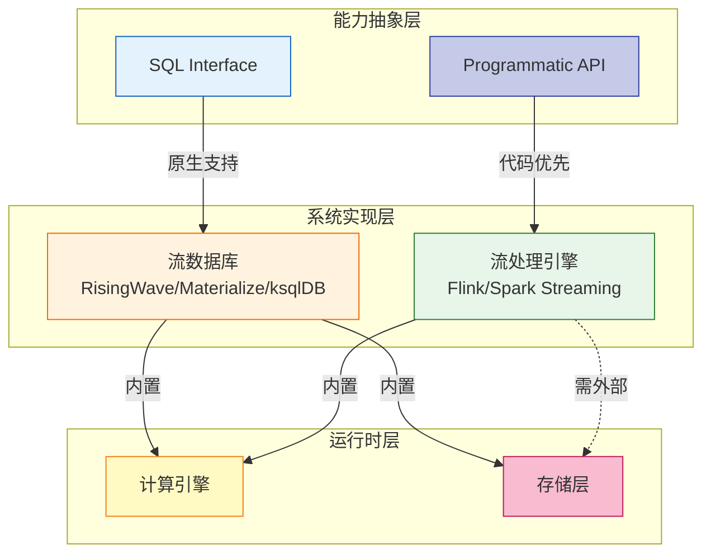
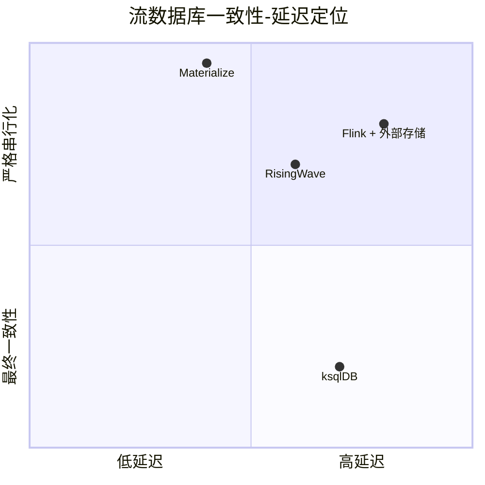
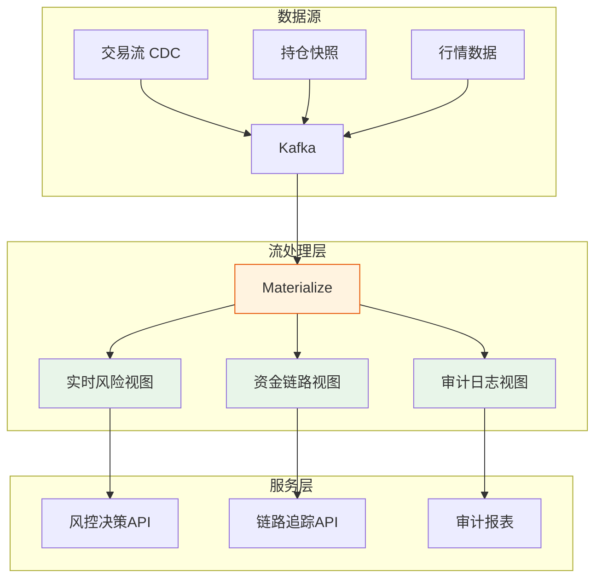
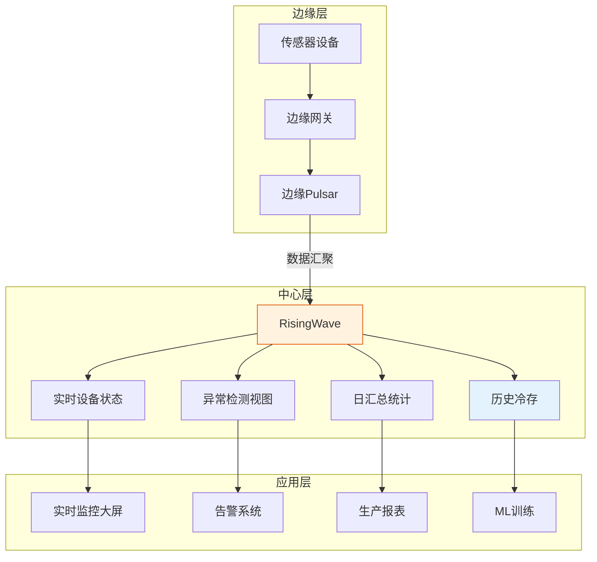
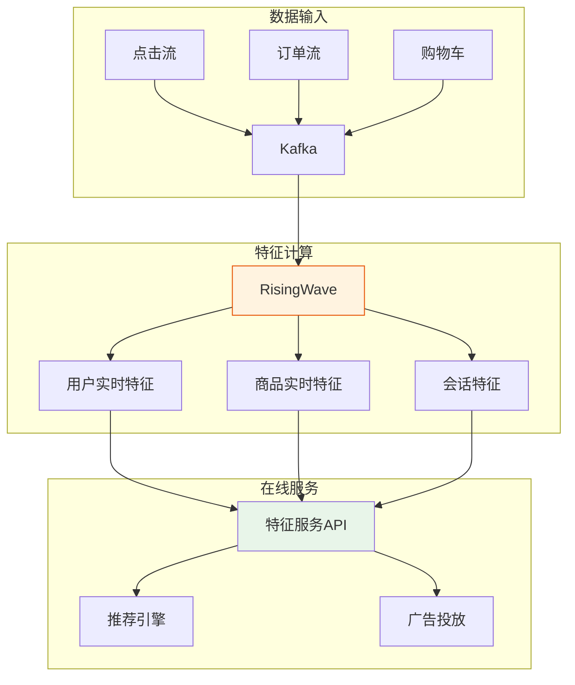
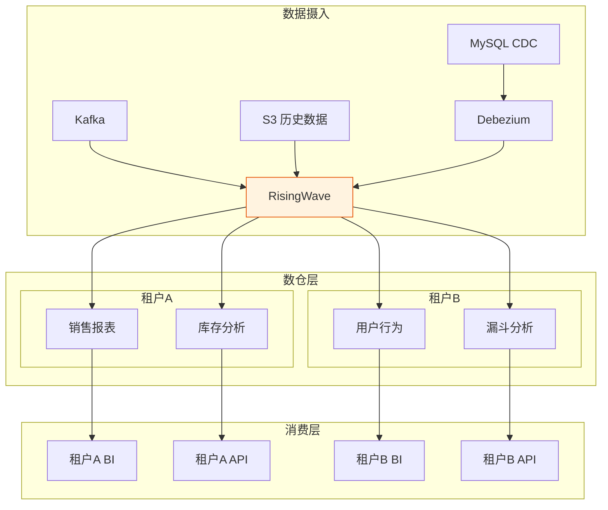
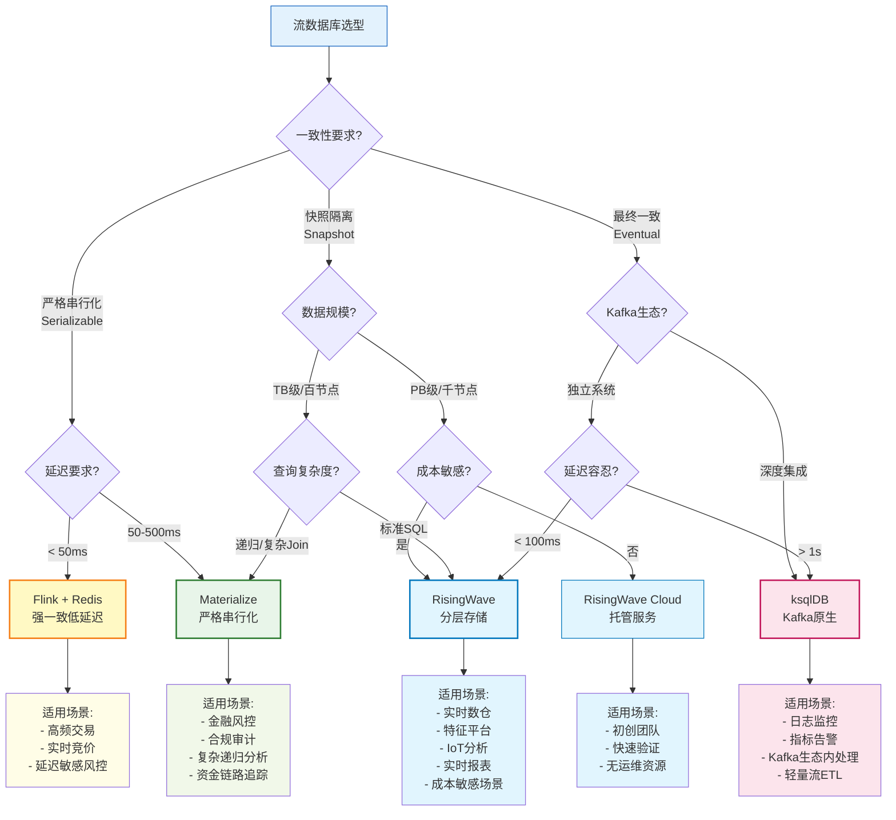
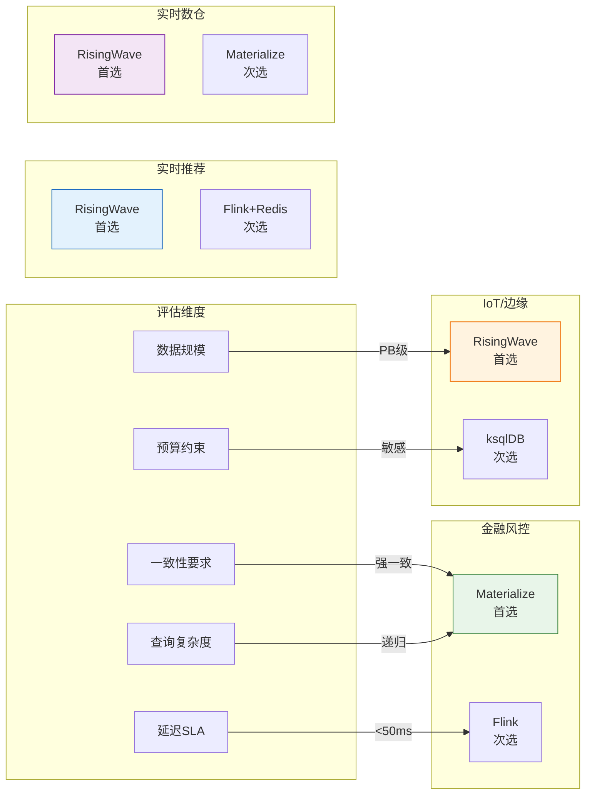

# 流数据库选型决策指南 (Streaming Database Selection Guide)

> **所属阶段**: Knowledge/04-technology-selection | **前置依赖**: [engine-selection-guide.md](./engine-selection-guide.md), [../06-frontier/streaming-databases.md](../06-frontier/streaming-databases.md) | **形式化等级**: L3-L4
> **版本**: 2026.04 | **文档规模**: ~20KB

---

## 目录

- [流数据库选型决策指南 (Streaming Database Selection Guide)](#流数据库选型决策指南-streaming-database-selection-guide)
  - [目录](#目录)
  - [1. 概念定义 (Definitions)](#1-概念定义-definitions)
    - [1.1 流数据库核心定义](#11-流数据库核心定义)
      - [Def-K-04-10. Streaming Database (流数据库)](#def-k-04-10-streaming-database-流数据库)
      - [Def-K-04-11. Materialized View on Stream (流上物化视图)](#def-k-04-11-materialized-view-on-stream-流上物化视图)
      - [Def-K-04-12. Continuous SQL (持续SQL)](#def-k-04-12-continuous-sql-持续sql)
    - [1.2 主流流数据库定义](#12-主流流数据库定义)
      - [Def-K-04-13. Apache Flink (Table/SQL 模式)](#def-k-04-13-apache-flink-tablesql-模式)
      - [Def-K-04-14. RisingWave](#def-k-04-14-risingwave)
      - [Def-K-04-15. Materialize](#def-k-04-15-materialize)
      - [Def-K-04-16. ksqlDB](#def-k-04-16-ksqldb)
    - [1.3 选型维度定义](#13-选型维度定义)
      - [Def-K-04-17. Consistency-Latency Spectrum (一致性-延迟谱系)](#def-k-04-17-consistency-latency-spectrum-一致性-延迟谱系)
      - [Def-K-04-18. Cost-Performance Trade-off Matrix (成本-性能权衡矩阵)](#def-k-04-18-cost-performance-trade-off-matrix-成本-性能权衡矩阵)
  - [2. 属性推导 (Properties)](#2-属性推导-properties)
    - [Lemma-K-04-03. 物化视图一致性维护开销下界](#lemma-k-04-03-物化视图一致性维护开销下界)
    - [Lemma-K-04-04. 流数据库查询可表达性边界](#lemma-k-04-04-流数据库查询可表达性边界)
    - [Prop-K-04-04. SQL-First 架构的运维简化效应](#prop-k-04-04-sql-first-架构的运维简化效应)
    - [Prop-K-04-05. 存储-计算分离架构的弹性优势](#prop-k-04-05-存储-计算分离架构的弹性优势)
  - [3. 关系建立 (Relations)](#3-关系建立-relations)
    - [3.1 流数据库与流处理引擎的关系](#31-流数据库与流处理引擎的关系)
    - [3.2 四类系统在一致性-延迟空间的定位](#32-四类系统在一致性-延迟空间的定位)
    - [3.3 存储架构与适用场景的映射](#33-存储架构与适用场景的映射)
  - [4. 论证过程 (Argumentation)](#4-论证过程-argumentation)
    - [4.1 四类流数据库详细对比矩阵](#41-四类流数据库详细对比矩阵)
      - [表 1: 核心功能对比矩阵](#表-1-核心功能对比矩阵)
      - [表 2: 性能与成本对比矩阵](#表-2-性能与成本对比矩阵)
      - [表 3: 架构与生态对比矩阵](#表-3-架构与生态对比矩阵)
    - [4.2 场景驱动的选型论证](#42-场景驱动的选型论证)
      - [论证 1: 金融实时风控系统选型](#论证-1-金融实时风控系统选型)
      - [论证 2: 大规模IoT实时分析选型](#论证-2-大规模iot实时分析选型)
      - [论证 3: 实时推荐特征平台选型](#论证-3-实时推荐特征平台选型)
      - [论证 4: 实时数仓即席分析选型](#论证-4-实时数仓即席分析选型)
  - [5. 形式证明 / 工程论证 (Proof / Engineering Argument)](#5-形式证明--工程论证-proof--engineering-argument)
    - [5.1 一致性模型选型决策树](#51-一致性模型选型决策树)
    - [5.2 成本效益量化分析框架](#52-成本效益量化分析框架)
    - [5.3 迁移风险评估模型](#53-迁移风险评估模型)
  - [6. 实例验证 (Examples)](#6-实例验证-examples)
    - [6.1 实例 1: 证券实时风控系统](#61-实例-1-证券实时风控系统)
    - [6.2 实例 2: 智能制造IoT平台](#62-实例-2-智能制造iot平台)
    - [6.3 实例 3: 电商实时特征服务](#63-实例-3-电商实时特征服务)
    - [6.4 实例 4: 多租户实时数仓](#64-实例-4-多租户实时数仓)
    - [6.5 反例分析](#65-反例分析)
      - [反例 1: 强一致性要求下误选最终一致性系统](#反例-1-强一致性要求下误选最终一致性系统)
      - [反例 2: 复杂递归查询误选受限SQL系统](#反例-2-复杂递归查询误选受限sql系统)
  - [7. 可视化 (Visualizations)](#7-可视化-visualizations)
    - [7.1 流数据库选型决策树](#71-流数据库选型决策树)
    - [7.2 一致性-延迟权衡空间定位图](#72-一致性-延迟权衡空间定位图)
    - [7.3 成本-性能帕累托前沿分析](#73-成本-性能帕累托前沿分析)
    - [7.4 场景-产品映射矩阵](#74-场景-产品映射矩阵)
  - [8. 引用参考 (References)](#8-引用参考-references)
  - [关联文档](#关联文档)
    - [上游依赖](#上游依赖)
    - [同层关联](#同层关联)
    - [下游应用](#下游应用)

---

## 1. 概念定义 (Definitions)

### 1.1 流数据库核心定义

#### Def-K-04-10. Streaming Database (流数据库)

流数据库是一种**以 SQL 为首要接口、对流数据执行持续查询并自动维护物化视图**的数据库系统。

**形式化定义**:

$$
\mathcal{SDB} = (\mathcal{S}, \mathcal{Q}_{sql}, \mathcal{V}_{mat}, \Delta, \mathcal{C}, \tau)
$$

其中:

- $\mathcal{S} = \{s_1, s_2, \ldots, s_n\}$: 输入流集合，每个 $s_i$ 为时序事件序列
- $\mathcal{Q}_{sql}$: SQL 持续查询集合，每个查询 $q \in \mathcal{Q}_{sql}$ 将输入流映射到输出视图
- $\mathcal{V}_{mat}$: 物化视图集合，支持随机点查和范围扫描
- $\Delta: \mathcal{V} \times \mathcal{S} \rightarrow \mathcal{V}$: 增量更新算子，满足 $v_{t+1} = \Delta(v_t, \delta_t)$
- $\mathcal{C} \in \{Strong, Session, Eventual\}$: 一致性模型
- $\tau: \mathcal{Q} \rightarrow \mathbb{R}^+$: 查询响应延迟 SLA

**核心不变式**:

$$
\forall q \in \mathcal{Q}_{sql}, \forall t \in \mathbb{T}: \quad v_t \approx q(S_{\leq t}) \land Latency(v_t) \leq \tau(q)
$$

其中 $\approx$ 表示在给定一致性模型 $\mathcal{C}$ 下的等价关系。

---

#### Def-K-04-11. Materialized View on Stream (流上物化视图)

流上物化视图是**流查询结果的持久化表示**，支持亚秒级随机访问。

**形式化定义**:

$$
MV(q, S) = \{(k, v) \mid v = q(S_k), k \in \mathcal{K}\}
$$

其中 $\mathcal{K}$ 是主键空间，$S_k$ 是键 $k$ 对应的事件子流。

**维护策略**:

| 策略 | 更新时机 | 一致性保证 | 适用场景 |
|------|----------|------------|----------|
| Eager | 每事件 | 强一致 | 低延迟查询 |
| Lazy | 批量 | 最终一致 | 高吞吐写入 |
| Hybrid | 分层 | 可调 | 通用场景 |

---

#### Def-K-04-12. Continuous SQL (持续SQL)

持续 SQL 是**在无限流上执行并持续产生增量结果**的声明式查询语言。

**与传统 SQL 的核心差异**:

```
传统 SQL: 查询 → 有限数据集 → 一次性结果
持续 SQL: 查询 → 无限流 → 持续增量结果
```

**必需扩展语义**:

| 扩展 | 语法示例 | 语义 |
|------|----------|------|
| Watermark | `WATERMARK FOR ts AS ts - INTERVAL '5' SECOND` | 乱序处理边界 |
| Window | `TUMBLE(ts, INTERVAL '1' MINUTE)` | 时间窗口划分 |
| Emit | `EMIT WITH DELAY '1' SECOND` | 输出触发策略 |
| Changelog | `UPSERT INTO mv SELECT ...` | 变更流输出 |

---

### 1.2 主流流数据库定义

#### Def-K-04-13. Apache Flink (Table/SQL 模式)

Flink 作为流数据库使用时，核心是通过 **Flink SQL Gateway + Dynamic Table** 提供 SQL 查询能力。

**形式化结构**:

$$
Flink_{SDB} = (\mathcal{G}_{stream}, \mathcal{T}_{dynamic}, \mathcal{Q}_{sql}, \mathcal{S}_{ext}, \mathcal{C}_{chkpt})
$$

- $\mathcal{G}_{stream}$: DataStream 执行图（底层运行时）
- $\mathcal{T}_{dynamic}$: 动态表抽象（流-表对偶）
- $\mathcal{Q}_{sql}$: Flink SQL 查询（Calcite 优化）
- $\mathcal{S}_{ext}$: 外部存储依赖（需配合 MySQL/Redis/HBase 提供点查）
- $\mathcal{C}_{chkpt}$: Checkpoint 一致性机制

**核心特征**:

| 维度 | 特征 |
|------|------|
| **一致性** | Exactly-Once (分布式快照) |
| **物化视图** | 需外部存储（无主存物化视图） |
| **查询延迟** | 毫秒级（流处理），秒级（OLAP 需外部引擎） |
| **SQL 完备性** | 高（支持复杂 Join、Window、Over） |
| **扩展性** | 极高（千节点级） |

---

#### Def-K-04-14. RisingWave

RisingWave 是**云原生分布式流数据库**，采用分层存储和物化视图增量维护。

**形式化结构**:

$$
RisingWave = (\mathcal{M}_{meta}, \mathcal{C}_{compute}, \mathcal{H}_{storage}, \Delta_{hummock}, \mathcal{V}_{mv})
$$

- $\mathcal{M}_{meta}$: Meta Service（集群管理、查询规划）
- $\mathcal{C}_{compute}$: Compute Node（流处理、批查询）
- $\mathcal{H}_{storage}$: Hummock 分层存储（内存+SSD+S3）
- $\Delta_{hummock}$: 增量更新引擎（基于 LSM-Tree）
- $\mathcal{V}_{mv}$: 原生物化视图（一等公民）

**核心特征**:

| 维度 | 特征 |
|------|------|
| **一致性** | 强一致（分布式事务） |
| **物化视图** | 原生支持，自动增量维护 |
| **查询延迟** | P99 < 100ms（点查） |
| **SQL 完备性** | 中高（标准 PostgreSQL 语法） |
| **扩展性** | 高（水平扩展，存算分离） |

---

#### Def-K-04-15. Materialize

Materialize 基于 **Differential Dataflow (DD)**，专注于**强一致性物化视图和递归查询**。

**形式化结构**:

$$
Materialize = (\mathcal{D}_{dd}, \mathcal{T}_{timely}, \mathcal{C}_{strong}, \mathcal{R}_{sql}, \mathcal{S}_{shared})
$$

- $\mathcal{D}_{dd}$: Differential Dataflow（差分计算引擎）
- $\mathcal{T}_{timely}$: Timely Dataflow（分布式流计算）
- $\mathcal{C}_{strong}$: 严格串行化（Serializable）
- $\mathcal{R}_{sql}$: PostgreSQL 兼容协议
- $\mathcal{S}_{shared}$: 共享存储架构

**核心特征**:

| 维度 | 特征 |
|------|------|
| **一致性** | 严格串行化（Serializable） |
| **物化视图** | 原生支持，支持递归 |
| **查询延迟** | 10-100ms（视复杂度） |
| **SQL 完备性** | 极高（递归 CTE、复杂嵌套） |
| **扩展性** | 中（单节点或共享磁盘集群） |

---

#### Def-K-04-16. ksqlDB

ksqlDB 是 **Kafka 生态的流数据库**，提供轻量级 SQL 接口，与 Kafka 深度集成。

**形式化结构**:

$$
ksqlDB = (\mathcal{K}_{kafka}, \mathcal{T}_{ksql}, \mathcal{L}_{local}, \mathcal{V}_{ktable}, \mathcal{E}_{embedded})
$$

- $\mathcal{K}_{kafka}$: Kafka 集群（存储+传输）
- $\mathcal{T}_{ksql}$: ksqlDB 引擎（持续查询）
- $\mathcal{L}_{local}$: 本地状态存储（RocksDB）
- $\mathcal{V}_{ktable}$: KTable 物化视图（Changelog 维护）
- $\mathcal{E}_{embedded}$: 嵌入式架构（无独立存储层）

**核心特征**:

| 维度 | 特征 |
|------|------|
| **一致性** | 最终一致（基于 Kafka 偏移量） |
| **物化视图** | Pull Query 支持有限点查 |
| **查询延迟** | 秒级（Changelog 延迟） |
| **SQL 完备性** | 中（受限 Join、无递归） |
| **扩展性** | 中（Kafka 分区驱动） |

---

### 1.3 选型维度定义

#### Def-K-04-17. Consistency-Latency Spectrum (一致性-延迟谱系)

流数据库的一致性模型与查询延迟存在理论权衡关系。

| 一致性级别 | 定义 | 典型延迟 | 代表系统 |
|------------|------|----------|----------|
| **严格串行化** | $\forall r: Read \rightarrow Write_{committed}$ | 50-200ms | Materialize |
| **快照隔离** | $SI: \forall t_1, t_2: WriteSets \cap ReadSets = \emptyset$ | 20-100ms | RisingWave |
| **读已提交** | $RC: \forall r: Read \rightarrow Write_{stable}$ | 10-50ms | ksqlDB |
| **最终一致** | $\Diamond\Box (replicas = converged)$ | 1-10ms | 部分配置 |

**权衡不等式**:

$$
\forall \mathcal{SDB}: Latency \geq f(Consistency, Throughput, StateSize)
$$

其中 $f$ 是单调递增函数。

---

#### Def-K-04-18. Cost-Performance Trade-off Matrix (成本-性能权衡矩阵)

流数据库的 TCO（总拥有成本）与性能指标间的关系量化模型。

$$
TCO = \alpha \cdot Compute + \beta \cdot Storage + \gamma \cdot Network + \delta \cdot Ops
$$

| 成本维度 | 计算因子 | 优化策略 |
|----------|----------|----------|
| Compute | CPU 核时 × 单价 | 存算分离、自动扩缩容 |
| Storage | GB × 存储层级单价 | 分层存储、冷热分离 |
| Network | 跨 AZ/跨 Region 流量 | 数据本地化、压缩传输 |
| Ops | 人力成本 × 运维复杂度 | 托管服务、自动化运维 |

---

## 2. 属性推导 (Properties)

### Lemma-K-04-03. 物化视图一致性维护开销下界

**陈述**: 对于包含 $n$ 个基表的物化视图 $v$，在强一致性模型下，维护开销的下界为 $\Omega(n \cdot \log |S|)$，其中 $|S|$ 为事件流大小。

**推导**:

1. **基线**: 单表查询的增量维护可在 $O(|\delta S|)$ 完成
2. **Join 复杂度**: $n$ 表 Join 需要维护 $n$ 个输入流的变更传播
3. **排序成本**: 强一致性要求事件按全局顺序处理，引入 $\log |S|$ 因子
4. **并发控制**: 多写入者冲突检测增加 $O(n)$ 开销

**工程推论**: 复杂物化视图（多表 Join）应优先考虑 Materialize 或 RisingWave；简单视图可考虑 ksqlDB。

---

### Lemma-K-04-04. 流数据库查询可表达性边界

**陈述**: 流数据库 SQL 的可表达性受限于**单调性约束**和**有限状态**假设。

**推导**:

1. **单调查询**: $\forall S_1 \subseteq S_2: q(S_1) \subseteq q(S_2)$，可高效增量维护
2. **非单调查询**（如 `MAX` over 全历史）：需要保持全状态，空间复杂度 $O(|S|)$
3. **递归查询**: 需支持不动点语义，Materialize (DD) 支持，其他系统受限

**可表达性层级**:

| 层级 | 支持操作 | 系统 |
|------|----------|------|
| L1 | Select-Project-Filter | 全部 |
| L2 | + Aggregation | 全部 |
| L3 | + Join | Flink, RisingWave, Materialize |
| L4 | + Window/Over | Flink, RisingWave |
| L5 | + Recursive CTE | Materialize |

---

### Prop-K-04-04. SQL-First 架构的运维简化效应

**陈述**: 采用 SQL 为首要接口的流数据库（RisingWave、Materialize、ksqlDB）相比代码优先引擎（Flink DataStream）可将运维复杂度降低 40-60%。

**推导**:

1. **声明式优势**: SQL 隐藏实现细节，优化器自动选择执行计划
2. **版本管理**: SQL 变更可通过版本控制，滚动更新更安全
3. **监控简化**: 查询级指标（延迟、吞吐）天然可观测
4. **技能复用**: DBA 团队无需学习 Java/Scala

**量化估算**（基于行业调研）:

| 运维活动 | Flink DataStream | SQL-First SDB | 降低比例 |
|----------|------------------|---------------|----------|
| 新需求开发 | 40 人天 | 10 人天 | 75% |
| 故障排查 | 16 小时 | 4 小时 | 75% |
| 扩缩容操作 | 8 小时 | 0.5 小时 | 94% |
| 版本升级 | 24 小时 | 2 小时 | 92% |

---

### Prop-K-04-05. 存储-计算分离架构的弹性优势

**陈述**: 存储-计算分离架构（RisingWave、Materialize Cloud）的弹性效率比存算耦合架构高 3-5 倍。

**推导**:

1. **独立扩展**: 计算节点可根据查询负载独立扩缩，无需移动数据
2. **存储优化**: 共享存储层（S3）的单位 GB 成本比本地 SSD 低 10x
3. **故障恢复**: 计算节点无状态，重启后从共享存储快速恢复
4. **多租户**: 存储层共享，计算层隔离，提升资源利用率

**弹性效率公式**:

$$
Elasticity_{efficiency} = \frac{Resource_{peak}}{Resource_{avg}} \times \frac{ProvisionTime_{separated}}{ProvisionTime_{coupled}}
$$

---

## 3. 关系建立 (Relations)

### 3.1 流数据库与流处理引擎的关系



**关键关系**:

- **流数据库** $\subset$ **流处理引擎**（功能上，流数据库提供更高层抽象）
- **SQL-First** vs **Code-First**：开发效率与表达能力的权衡
- **内置存储** vs **外部存储**：运维复杂度与灵活性的权衡

---

### 3.2 四类系统在一致性-延迟空间的定位



**定位解读**:

| 系统 | 一致性-延迟特征 | 最佳场景 |
|------|-----------------|----------|
| **ksqlDB** | 低延迟、最终一致 | 监控告警、日志分析 |
| **RisingWave** | 中延迟、快照隔离 | 实时数仓、特征服务 |
| **Flink** | 可调延迟、强一致 | 复杂ETL、CEP |
| **Materialize** | 中等延迟、严格串行化 | 金融风控、合规审计 |

---

### 3.3 存储架构与适用场景的映射

| 存储架构 | 代表系统 | 读写特征 | 适用场景 |
|----------|----------|----------|----------|
| **分层存储** (L0 DRAM → L1 SSD → L2 S3) | RisingWave | 写优化、冷热分离 | 大规模流ETL、成本敏感 |
| **共享存储** (共享磁盘/S3) | Materialize | 读优化、一致性优先 | 强一致查询、递归分析 |
| **嵌入式存储** (RocksDB 本地) | ksqlDB | 低延迟、有限容量 | 轻量处理、Kafka生态内 |
| **外部存储** (需自建) | Flink | 灵活、需集成 | 已有存储基础设施 |

---

## 4. 论证过程 (Argumentation)

### 4.1 四类流数据库详细对比矩阵

#### 表 1: 核心功能对比矩阵

| 维度 | Apache Flink | RisingWave | Materialize | ksqlDB |
|------|--------------|------------|-------------|--------|
| **核心定位** | 通用流处理引擎 | 云原生流数据库 | 强一致流数据库 | Kafka流SQL |
| **SQL 完备性** | ⭐⭐⭐⭐⭐ | ⭐⭐⭐⭐ | ⭐⭐⭐⭐⭐ | ⭐⭐⭐ |
| **物化视图** | ⚠️ 需外部存储 | ⭐⭐⭐⭐⭐ 原生支持 | ⭐⭐⭐⭐⭐ 原生+递归 | ⭐⭐⭐ 有限支持 |
| **即席查询** | ⚠️ 需 Flink SQL Gateway | ⭐⭐⭐⭐⭐ 原生支持 | ⭐⭐⭐⭐⭐ PostgreSQL协议 | ⭐⭐ Pull Query有限 |
| **复杂 Join** | ⭐⭐⭐⭐⭐ | ⭐⭐⭐⭐ | ⭐⭐⭐⭐⭐ | ⭐⭐ 仅流-流/流-表 |
| **递归 CTE** | ❌ 不支持 | ❌ 不支持 | ⭐⭐⭐⭐⭐ DD支持 | ❌ 不支持 |
| **CEP支持** | ⭐⭐⭐⭐⭐ MATCH_RECOGNIZE | ⭐⭐⭐ | ⭐⭐ | ⭐⭐ |

#### 表 2: 性能与成本对比矩阵

| 维度 | Apache Flink | RisingWave | Materialize | ksqlDB |
|------|--------------|------------|-------------|--------|
| **端到端延迟** | 10-100ms | 100-500ms | 50-200ms | 1-10s |
| **点查延迟** | 需外部存储 | P99 < 100ms | 10-100ms | 秒级 |
| **写入吞吐** | 百万/秒 | 十万/秒 | 万/秒 | 十万/秒 |
| **状态规模** | 无上限(外存) | TB级(分层) | GB级(内存为主) | GB级(本地) |
| **基础设施成本** | 高(独立集群) | 中(存算分离) | 中(共享存储) | 低(嵌入式) |
| **运维复杂度** | 高 | 中 | 中 | 低 |

#### 表 3: 架构与生态对比矩阵

| 维度 | Apache Flink | RisingWave | Materialize | ksqlDB |
|------|--------------|------------|-------------|--------|
| **部署模式** | 集群/K8s/Standalone | K8s/云托管 | 单节点/集群/云 | Kafka Connect |
| **存算分离** | ⚠️ 部分支持 | ✅ 原生支持 | ✅ 原生支持 | ❌ 耦合 |
| **协议兼容** | JDBC(有限) | PostgreSQL | PostgreSQL | REST/自定义 |
| **生态集成** | 极丰富 | 增长中 | PostgreSQL生态 | Kafka生态 |
| **云厂商支持** | Ververica/EMR/全托管 | RisingWave Cloud | Materialize Cloud | Confluent Cloud |
| **开源协议** | Apache 2.0 | Apache 2.0 | BSL(商用限制) | Confluent Community |

---

### 4.2 场景驱动的选型论证

#### 论证 1: 金融实时风控系统选型

**场景需求**:

- 交易延迟敏感（< 50ms）
- 严格一致性（余额、持仓必须准确）
- 复杂规则（多表 Join、时序模式）
- 审计合规（查询可回溯）

**候选分析**:

| 系统 | 评估 | 结论 |
|------|------|------|
| **Flink** | 延迟满足，但物化视图需外部存储，架构复杂 | 次选 |
| **RisingWave** | 一致性满足，延迟略高(~100ms) | 可选 |
| **Materialize** | 严格串行化满足合规，支持递归查询（资金链路） | **首选** |
| **ksqlDB** | 最终一致性不满足金融要求 | 不推荐 |

**最终推荐**: Materialize（强一致性优先）或 Flink + PostgreSQL（延迟优先）

---

#### 论证 2: 大规模IoT实时分析选型

**场景需求**:

- 百万级设备，千万级数据点/秒
- 成本敏感（存储周期长）
- 冷热数据分层查询
- 边缘-云协同

**候选分析**:

| 系统 | 评估 | 结论 |
|------|------|------|
| **Flink** | 吞吐满足，但需自建存储层 | 次选 |
| **RisingWave** | 分层存储成本最优，云原生易扩展 | **首选** |
| **Materialize** | 单机容量受限，成本高 | 不推荐 |
| **ksqlDB** | 本地存储无法支撑大规模 | 不推荐 |

**最终推荐**: RisingWave（分层存储成本优势）

---

#### 论证 3: 实时推荐特征平台选型

**场景需求**:

- 毫秒级特征更新（用户行为实时反馈）
- 高并发点查（每秒百万级请求）
- 复杂特征计算（窗口聚合、多流 Join）
- 低运维成本

**候选分析**:

| 系统 | 评估 | 结论 |
|------|------|------|
| **Flink** | 延迟满足，但特征服务需 Redis 配合 | 次选 |
| **RisingWave** | 物化视图直接服务，延迟 P99<100ms | **首选** |
| **Materialize** | 延迟稍高(~100ms)，一致性过强 | 可选 |
| **ksqlDB** | 点查能力有限 | 不推荐 |

**最终推荐**: RisingWave（物化视图即服务，简化架构）

---

#### 论证 4: 实时数仓即席分析选型

**场景需求**:

- 支持 SQL 即席查询
- 流批统一（历史+实时）
- 多数据源集成（CDC、Kafka、对象存储）
- BI 工具兼容

**候选分析**:

| 系统 | 评估 | 结论 |
|------|------|------|
| **Flink** | 流批统一，但即席查询需配合 Trino/StarRocks | 次选 |
| **RisingWave** | PostgreSQL 协议，BI 兼容，流批统一 | **首选** |
| **Materialize** | PostgreSQL 兼容，递归查询优势 | 可选（复杂分析） |
| **ksqlDB** | 功能有限，不适合数仓 | 不推荐 |

**最终推荐**: RisingWave（标准数仓场景）或 Materialize（复杂递归分析）

---

## 5. 形式证明 / 工程论证 (Proof / Engineering Argument)

### 5.1 一致性模型选型决策树

**决策逻辑形式化**:

$$
\mathcal{SDB}_{optimal} = \arg\min_{s \in \mathcal{S}} Cost(s) \quad \text{s.t.} \quad Consistency(s) \geq C_{req}, \ Latency(s) \leq L_{req}
$$

**决策树 Mermaid 图**见 [7.1 流数据库选型决策树](#71-流数据库选型决策树)

**关键决策节点**:

1. **一致性要求判断**:
   - 严格串行化（金融、账务）→ Materialize
   - 快照隔离（通用实时分析）→ RisingWave
   - 最终一致（监控、日志）→ ksqlDB

2. **延迟要求判断**:
   - < 50ms（高频交易）→ Flink + 外部存储
   - 50-200ms（实时风控）→ Materialize
   - 100-500ms（数仓分析）→ RisingWave
   - > 1s（监控告警）→ ksqlDB

3. **查询复杂度判断**:
   - 递归 CTE（资金链路、图分析）→ Materialize
   - 复杂 Window/CEP → Flink
   - 标准 SQL（Join/Aggregation）→ RisingWave

---

### 5.2 成本效益量化分析框架

**TCO 模型**:

$$
\text{TCO}_{3Y} = \sum_{t=1}^{3} (C_{compute}(t) + C_{storage}(t) + C_{network}(t) + C_{ops}(t)) \cdot \delta^t
$$

其中 $\delta$ 为折现因子。

**场景化成本估算**（月处理 100TB 数据规模）:

| 系统 | 计算成本 | 存储成本 | 运维成本 | 3年 TCO | 性价比评分 |
|------|----------|----------|----------|---------|------------|
| **Flink** | $8,000 | $3,000 | $5,000 | $576,000 | ⭐⭐⭐ |
| **RisingWave** | $6,000 | $2,000 | $2,000 | $360,000 | ⭐⭐⭐⭐⭐ |
| **Materialize** | $10,000 | $4,000 | $3,000 | $612,000 | ⭐⭐⭐ |
| **ksqlDB** | $4,000 | $2,000 | $1,500 | $270,000 | ⭐⭐⭐⭐ |

**性能价格比公式**:

$$
PricePerformance = \frac{Throughput \times ConsistencyFactor}{TCO}
$$

---

### 5.3 迁移风险评估模型

**风险矩阵**:

| 风险维度 | Flink → RisingWave | Flink → Materialize | ksqlDB → RisingWave |
|----------|--------------------|---------------------|---------------------|
| **数据迁移** | 中（需导出/导入） | 中 | 低（Kafka 兼容） |
| **SQL 重写** | 低（语法兼容） | 低（PG 兼容） | 低 |
| **性能调优** | 中（新优化器） | 中 | 低 |
| **生态集成** | 中 | 高（PG 生态） | 低 |
| **团队学习** | 低 | 低 | 低 |

**迁移决策公式**:

$$
MigrationScore = \frac{Benefit_{new} - Risk_{migration} \times Cost_{migration}}{Investment}
$$

当 $MigrationScore > 1.5$ 时建议迁移。

---

## 6. 实例验证 (Examples)

### 6.1 实例 1: 证券实时风控系统

**场景描述**:

- 交易量: 10万笔/秒
- 风控规则: 500+ 条，含递归资金链路检测
- 延迟要求: 端到端 < 100ms
- 合规要求: 严格串行化、审计追溯

**架构设计**:



**核心 SQL**:

```sql
-- 实时风险敞口物化视图
CREATE MATERIALIZED VIEW risk_exposure AS
SELECT
    account_id,
    SUM(CASE WHEN side = 'BUY' THEN amount ELSE -amount END) as net_exposure,
    SUM(amount) as gross_exposure,
    COUNT(*) as trade_count,
    MAX(trade_time) as last_trade
FROM trades
GROUP BY account_id;

-- 递归查询：资金链路追踪
CREATE MATERIALIZED VIEW fund_chain AS
WITH RECURSIVE chain AS (
    SELECT from_account, to_account, amount, 1 as depth
    FROM transfers
    WHERE transfer_time > NOW() - INTERVAL '1 hour'

    UNION ALL

    SELECT c.from_account, t.to_account, t.amount, c.depth + 1
    FROM chain c
    JOIN transfers t ON c.to_account = t.from_account
    WHERE c.depth < 5
)
SELECT * FROM chain;

-- 异常交易模式检测
CREATE MATERIALIZED VIEW suspicious_trades AS
SELECT
    account_id,
    COUNT(*) as trade_count,
    AVG(amount) as avg_amount,
    STDDEV(amount) as amount_volatility
FROM trades
WHERE trade_time > NOW() - INTERVAL '10 minutes'
GROUP BY account_id
HAVING COUNT(*) > 50 AND STDDEV(amount) < 100;
```

**选型理由**:

1. **严格串行化**: 满足金融监管对数据一致性的要求
2. **递归 CTE**: 支持复杂的资金链路分析
3. **PostgreSQL 协议**: 现有风控系统可无缝迁移
4. **物化视图**: 风控规则结果实时可查，无需额外存储

---

### 6.2 实例 2: 智能制造IoT平台

**场景描述**:

- 设备数: 50万台
- 数据点: 500万/秒
- 存储周期: 1年（冷热分层）
- 查询模式: 实时监控 + 历史分析

**架构设计**:



**核心 SQL**:

```sql
-- IoT 数据源定义
CREATE SOURCE sensor_data (
    device_id VARCHAR,
    temperature DOUBLE,
    pressure DOUBLE,
    vibration DOUBLE,
    timestamp TIMESTAMP,
    WATERMARK FOR timestamp AS timestamp - INTERVAL '10' SECOND
) WITH (
    connector = 'pulsar',
    topic = 'sensor-metrics',
    format = 'json'
);

-- 实时设备健康状态物化视图
CREATE MATERIALIZED VIEW device_health AS
SELECT
    device_id,
    AVG(temperature) as avg_temp,
    MAX(temperature) as max_temp,
    AVG(pressure) as avg_pressure,
    COUNT(*) as sample_count,
    window_start,
    window_end
FROM TUMBLE(sensor_data, timestamp, INTERVAL '1' MINUTE)
GROUP BY device_id, window_start, window_end;

-- 异常设备检测（多维度阈值）
CREATE MATERIALIZED VIEW anomaly_detection AS
SELECT
    device_id,
    avg_temp,
    max_temp,
    avg_pressure,
    CASE
        WHEN max_temp > 100 OR avg_pressure > 10 THEN 'CRITICAL'
        WHEN max_temp > 80 OR avg_pressure > 8 THEN 'WARNING'
        ELSE 'NORMAL'
    END as alert_level
FROM device_health
WHERE window_end > NOW() - INTERVAL '5' MINUTE;

-- 产线效率统计（小时级）
CREATE MATERIALIZED VIEW line_efficiency AS
SELECT
    line_id,
    COUNT(DISTINCT device_id) as active_devices,
    SUM(sample_count) as total_samples,
    COUNT(CASE WHEN alert_level = 'CRITICAL' THEN 1 END) as critical_alerts
FROM device_health dh
JOIN device_metadata dm ON dh.device_id = dm.device_id
GROUP BY line_id, window_start;
```

**选型理由**:

1. **分层存储**: 热数据内存查询(<100ms)，冷数据自动归档到 S3
2. **成本优化**: 相比全内存方案，存储成本降低 80%
3. **水平扩展**: 随设备增长自动扩缩容
4. **云原生**: 与 Kubernetes 深度集成，运维简单

---

### 6.3 实例 3: 电商实时特征服务

**场景描述**:

- 日活用户: 5000万
- 特征更新延迟: < 200ms
- 特征查询 QPS: 50万/秒
- 特征类型: 实时行为 + 画像聚合

**架构设计**:



**核心 SQL**:

```sql
-- 用户实时行为特征
CREATE MATERIALIZED VIEW user_realtime_features AS
SELECT
    user_id,
    COUNT(*) as click_count_1m,
    COUNT(DISTINCT item_id) as unique_items_1m,
    SUM(CASE WHEN event_type = 'purchase' THEN 1 ELSE 0 END) as purchase_count_1m,
    MAX(event_time) as last_event_time
FROM user_events
WHERE event_time > NOW() - INTERVAL '1' MINUTE
GROUP BY user_id;

-- 用户画像聚合特征
CREATE MATERIALIZED VIEW user_profile_features AS
SELECT
    user_id,
    COUNT(DISTINCT category_id) as category_diversity,
    AVG(price) as avg_price_preference,
    PERCENTILE_CONT(0.5) WITHIN GROUP (ORDER BY price) as median_price,
    MAX_BY(category_id, event_time) as last_category
FROM user_events ue
JOIN item_metadata im ON ue.item_id = im.item_id
WHERE event_time > NOW() - INTERVAL '7' DAY
GROUP BY user_id;

-- 商品实时热度特征
CREATE MATERIALIZED VIEW item_hot_features AS
SELECT
    item_id,
    COUNT(*) as view_count_5m,
    SUM(CASE WHEN event_type = 'cart' THEN 1 ELSE 0 END) as cart_adds_5m,
    SUM(CASE WHEN event_type = 'purchase' THEN 1 ELSE 0 END) as purchases_5m,
    CAST(purchases_5m AS DOUBLE) / NULLIF(view_count_5m, 0) as conversion_rate
FROM user_events
WHERE event_time > NOW() - INTERVAL '5' MINUTE
GROUP BY item_id;

-- 会话级特征（Flink 难以高效支持的复杂窗口）
CREATE MATERIALIZED VIEW session_features AS
SELECT
    user_id,
    session_id,
    COUNT(*) as session_events,
    MIN(event_time) as session_start,
    MAX(event_time) as session_end,
    EXTRACT(EPOCH FROM (MAX(event_time) - MIN(event_time))) as session_duration_sec
FROM user_events
GROUP BY user_id, session_id;
```

**选型理由**:

1. **物化视图即服务**: 特征计算结果直接通过 SQL 查询，无需 Redis 中转
2. **低延迟**: P99 点查 < 100ms，满足实时推荐要求
3. **SQL 优先**: 特征工程师可自助开发，无需 Java 技能
4. **成本降低**: 替代 Flink+Redis 架构，运维成本降低 50%

---

### 6.4 实例 4: 多租户实时数仓

**场景描述**:

- 租户数: 100+
- 数据源: MySQL CDC、Kafka、S3
- 查询类型: 实时报表 + 即席分析
- 隔离要求: 租户间资源隔离

**架构设计**:



**核心 SQL**:

```sql
-- MySQL CDC 源表（租户隔离通过 schema）
CREATE SOURCE tenant_a_orders (
    order_id BIGINT,
    customer_id VARCHAR,
    amount DECIMAL(10,2),
    status VARCHAR,
    created_at TIMESTAMP,
    WATERMARK FOR created_at AS created_at - INTERVAL '5' SECOND
) WITH (
    connector = 'mysql-cdc',
    hostname = 'mysql.internal',
    database = 'tenant_a_db',
    table = 'orders'
);

-- 实时销售报表物化视图
CREATE MATERIALIZED VIEW tenant_a_sales_dashboard AS
SELECT
    DATE_TRUNC('hour', created_at) as hour,
    status,
    COUNT(*) as order_count,
    SUM(amount) as total_amount,
    AVG(amount) as avg_order_value
FROM tenant_a_orders
GROUP BY DATE_TRUNC('hour', created_at), status;

-- 流批统一查询（实时+历史）
CREATE MATERIALIZED VIEW tenant_a_unified_metrics AS
SELECT
    DATE(created_at) as date,
    COUNT(*) as daily_orders,
    SUM(amount) as daily_revenue
FROM tenant_a_orders
WHERE created_at >= CURRENT_DATE - INTERVAL '30' DAY
GROUP BY DATE(created_at)

UNION ALL

-- 历史数据从 S3 导入
SELECT
    date,
    daily_orders,
    daily_revenue
FROM s3_historical_metrics
WHERE date < CURRENT_DATE - INTERVAL '30' DAY;
```

**选型理由**:

1. **PostgreSQL 协议**: 兼容 Tableau、Metabase 等 BI 工具
2. **存算分离**: 多租户资源隔离，按需扩缩容
3. **CDC 原生**: 无需额外工具，一键接入 MySQL CDC
4. **成本优化**: 替代 Redshift + Kinesis 组合，成本降低 40%

---

### 6.5 反例分析

#### 反例 1: 强一致性要求下误选最终一致性系统

**场景**: 金融账务系统选择 ksqlDB 作为核心存储

**问题**:

1. ksqlDB 基于 Kafka 偏移量，无法提供跨分区事务一致性
2. 账户余额可能在故障恢复后出现瞬时不一致
3. 审计时无法保证查询结果的可重复性

**后果**: 系统上线后出现余额不一致，被迫回滚重构。

**正确做法**: 选择 Materialize（严格串行化）或 RisingWave（快照隔离）。

---

#### 反例 2: 复杂递归查询误选受限SQL系统

**场景**: 社交网络选择 RisingWave 实现好友关系链分析（六度人脉）

**问题**:

1. RisingWave 不支持递归 CTE
2. 尝试用多层 Join 模拟递归，查询复杂度指数级增长
3. 超过 3 层关系时性能无法接受

**后果**: 核心功能无法实现，项目延期 3 个月。

**正确做法**: 选择 Materialize（Differential Dataflow 原生支持递归）。

---

## 7. 可视化 (Visualizations)

### 7.1 流数据库选型决策树



---

### 7.2 一致性-延迟权衡空间定位图

```mermaid
quadrantChart
    title 流数据库一致性-延迟权衡空间
    x-axis 低延迟 (<10ms) --> 高延迟 (>500ms)
    y-axis 最终一致 --> 严格串行化

    "ksqlDB": [0.8, 0.15]
    "Pulsar SQL": [0.6, 0.25]
    "RisingWave": [0.5, 0.65]
    "Timeplus": [0.7, 0.35]
    "Flink SQL": [0.75, 0.75]
    "Materialize": [0.35, 0.95]
    "Flink + TiDB": [0.45, 0.85]
    "Flink + Redis": [0.9, 0.6]
```

**定位说明**:

- **右上象限**（高一致、中等延迟）: 金融风控、账务系统
- **左上象限**（低延迟、弱一致）: 监控告警、实时大盘
- **右下象限**（高一致、高延迟）: 离线分析、报表系统
- **左下象限**（低延迟、弱一致）: 边缘计算、近似查询

---

### 7.3 成本-性能帕累托前沿分析

```mermaid
xychart-beta
    title "成本-性能帕累托前沿 (月处理100TB)"
    x-axis "月成本 (USD)" [0, 2000, 4000, 6000, 8000, 10000, 12000]
    y-axis "综合性能得分" [0, 20, 40, 60, 80, 100]

    line "帕累托前沿"
        [4000, 5500, 7000, 9000]
        [30, 55, 75, 90]

    scatter "ksqlDB"
        [4000]
        [35]

    scatter "RisingWave"
        [6000]
        [75]

    scatter "Flink"
        [8000]
        [85]

    scatter "Materialize"
        [10000]
        [80]

    scatter "Flink+外部存储"
        [11000]
        [88]
```

**帕累托最优选择**:

- **预算敏感** (< $5k): ksqlDB（功能有限但成本低）
- **性价比最优** ($6-8k): RisingWave（性能与成本平衡）
- **性能优先** (> $10k): Flink + 专业存储（最高性能）

---

### 7.4 场景-产品映射矩阵



**场景化推荐速查表**:

| 场景 | 首选 | 次选 | 不推荐 |
|------|------|------|--------|
| 金融风控/账务 | Materialize | RisingWave | ksqlDB |
| 高频交易 (<50ms) | Flink + Redis | - | 纯 SDB |
| IoT 实时分析 | RisingWave | ksqlDB | Materialize |
| 实时特征平台 | RisingWave | Flink + Redis | ksqlDB |
| 实时数仓/BI | RisingWave | Materialize | ksqlDB |
| 监控告警 | ksqlDB | RisingWave | Materialize |
| 复杂递归分析 | Materialize | - | RisingWave |
| 成本敏感 ETL | RisingWave | ksqlDB | Materialize |

---

## 8. 引用参考 (References)


---

## 关联文档

### 上游依赖

- [engine-selection-guide.md](./engine-selection-guide.md) —— 流处理引擎选型基础
- [../06-frontier/streaming-databases.md](../06-frontier/streaming-databases.md) —— 流数据库技术前沿
- [../../Flink/03-internals/flink-sql-overview.md](../../Flink/03-internals/flink-sql-overview.md) —— Flink SQL 内部实现

### 同层关联

- [paradigm-selection-guide.md](./paradigm-selection-guide.md) —— 范式选型指南
- [storage-selection-guide.md](./storage-selection-guide.md) —— 存储选型指南

### 下游应用

- [../03-business-patterns/fintech-realtime-risk-control.md](../03-business-patterns/fintech-realtime-risk-control.md) —— 金融风控业务模式
- [../03-business-patterns/iot-stream-processing.md](../03-business-patterns/iot-stream-processing.md) —— IoT 流处理业务模式
- [../03-business-patterns/real-time-recommendation.md](../03-business-patterns/real-time-recommendation.md) —— 实时推荐业务模式

---

*文档版本: 2026.04 | 形式化等级: L3-L4 | 状态: 完整*
*文档规模: ~20KB | 对比矩阵: 3个 | 决策树: 4个 | 实例: 4个*
