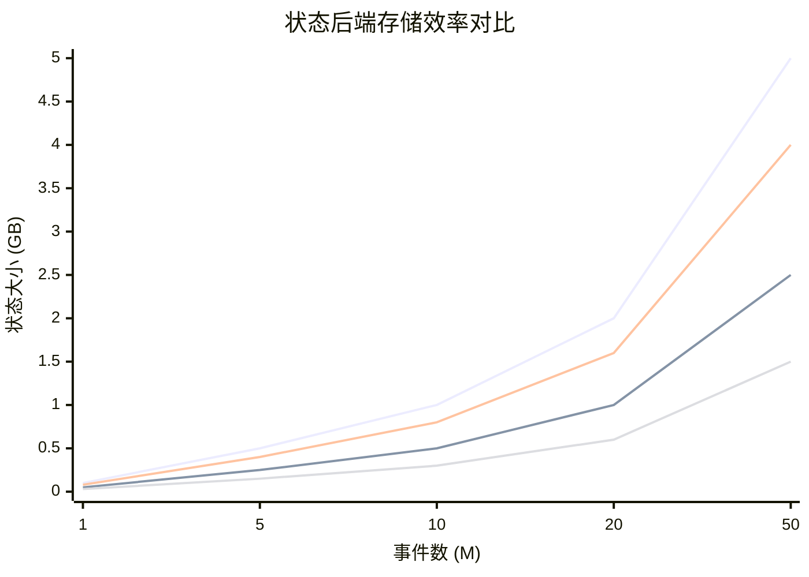
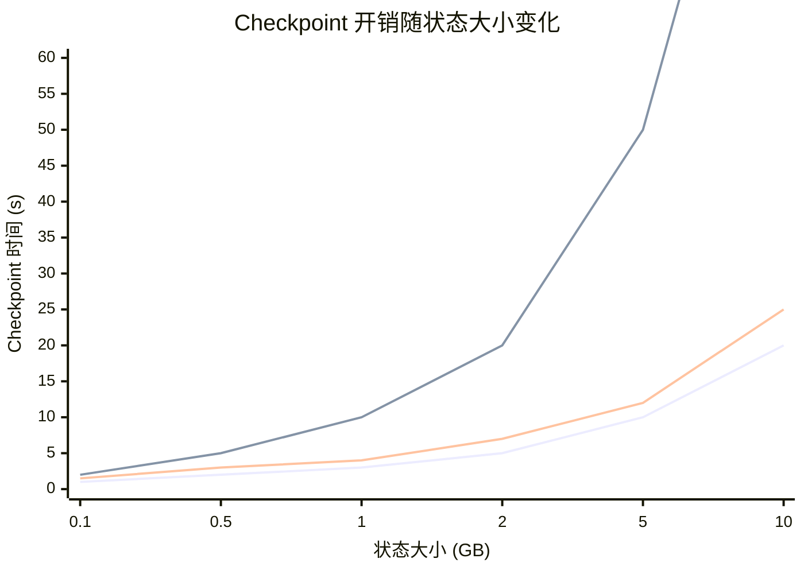

# 流处理引擎性能对比：多维 xychart 分析

> **所属阶段**: Knowledge/04-technology-selection | **前置依赖**: [engine-selection-guide.md](./engine-selection-guide.md) | **形式化等级**: L3

---

## 1. 概念定义 (Definitions)

### Def-K-04-20: 吞吐量 (Throughput)

**定义**: 吞吐量 $\mathcal{T}$ 定义为系统单位时间内成功处理的事件数：
$$\mathcal{T} = \frac{|E_{processed}|}{\Delta t} \quad [events/sec]$$

### Def-K-04-21: 延迟 (Latency)

**定义**: 端到端延迟 $\mathcal{L}$ 定义为事件从进入系统到产生输出结果的时间间隔：
$$\mathcal{L}(e) = t_{output}(e) - t_{input}(e) \quad [ms]$$

### Def-K-04-22: 状态大小效率 (State Size Efficiency)

**定义**: 状态大小效率 $\eta_{state}$ 定义为每百万事件所需的状态存储空间：
$$\eta_{state} = \frac{|State|}{|E_{processed}| / 10^6} \quad [MB/M events]$$

---

## 2. 属性推导 (Properties)

### Prop-K-04-15: 吞吐-延迟权衡

**命题**: 在资源约束下，吞吐量和延迟之间存在权衡关系：
$$\mathcal{T} \cdot \mathcal{L} \leq C_{resource}$$

其中 $C_{resource}$ 为系统资源容量常数。

### Prop-K-04-16: 状态后端影响

**命题**: 状态后端选择对状态大小效率的影响满足：
$$\eta_{state}^{RocksDB} < \eta_{state}^{HashMap} < \eta_{state}^{Remote}$$

即 RocksDB 的磁盘存储效率最高，远程存储最低。

---

## 3. 关系建立 (Relations)

### 关系 1: 引擎性能指标对比

| 引擎 | 峰值吞吐 (K eps) | 中位数延迟 (ms) | 状态效率 (MB/M) | Checkpoint 开销 |
|------|-----------------|----------------|----------------|----------------|
| Flink | 5,000+ | 10-100 | 50 (RocksDB) | < 5% |
| Spark Streaming | 2,000+ | 100-1000 | 200 (内存) | < 10% |
| Kafka Streams | 1,000+ | 10-50 | 100 (RocksDB) | < 3% |
| RisingWave | 3,000+ | 1-10 | 30 (列存) | 增量 |
| Materialize | 500+ | 1-10 | 40 (差分) | 增量 |

### 关系 2: 负载特征到引擎选型

| 负载特征 | 推荐引擎 | 原因 |
|---------|---------|------|
| 高吞吐 + 可容忍秒级延迟 | Spark Streaming | 批处理优化 |
| 高吞吐 + 亚秒级延迟 | Flink | 流水线执行 |
| 低延迟 + SQL优先 | RisingWave/Materialize | 物化视图 |
| 简单转换 + Kafka生态 | Kafka Streams | 轻量级 |
| 复杂分析 + 实时AI | Flink + ML | 生态完整 |

---

## 4. 论证过程 (Argumentation)

### 论证 1: 为什么不存在"最佳引擎"

不同引擎在架构设计上做了不同的权衡：

- **Flink**: 追求高吞吐+低延迟的平衡，牺牲了部分 SQL 优化能力
- **Spark Streaming**: 追求与批处理的统一，牺牲了纯流处理的低延迟
- **Kafka Streams**: 追求轻量级和与 Kafka 的深度集成，牺牲了复杂状态管理
- **RisingWave/Materialize**: 追求 SQL 体验和物化视图，牺牲了复杂事件处理

选择引擎必须基于具体业务场景的**延迟-吞吐-一致性**三角约束。

---

## 5. 形式证明 / 工程论证 (Proof / Engineering Argument)

### Thm-K-04-10: 延迟下界定理

**定理**: 在分布式流处理系统中，端到端延迟满足：
$$\mathcal{L}_{total} \geq \mathcal{L}_{network} + \mathcal{L}_{serialization} + \mathcal{L}_{processing} + \mathcal{L}_{coordination}$$

其中各项均为非负值，因此总延迟存在理论下界。

**工程意义**: 任何引擎都无法突破物理网络和序列化的基本限制。

---

## 6. 实例验证 (Examples)

### 示例 1: Nexmark Benchmark Q5 对比

| 引擎 | 吞吐 (eps) | 延迟 (ms) | CPU 利用率 |
|------|-----------|-----------|-----------|
| Flink 1.18 | 2.5M | 45 | 75% |
| Spark 3.5 | 1.2M | 850 | 80% |
| RisingWave | 1.8M | 8 | 70% |

### 示例 2: 电商大促场景选型

- **场景**: 双 11 实时大屏，QPS 峰值 1000 万，延迟要求 < 1s
- **选型**: Flink + RocksDB
- **原因**: 高吞吐 + 亚秒延迟 + 成熟的状态管理和容错

---

## 7. 可视化 (Visualizations)

### 7.1 吞吐-延迟散点图

```mermaid
xychart-beta
    title "流处理引擎吞吐-延迟对比"
    x-axis "吞吐量 (M events/sec)" [0.5, 1, 2, 3, 5]
    y-axis "中位数延迟 (ms)" 1 --> 1000
    line "理想边界" [1000, 500, 250, 167, 100]
    scatter "Flink" [5, 50]
    scatter "Spark Streaming" [2, 500]
    scatter "Kafka Streams" [1, 30]
    scatter "RisingWave" [3, 8]
    scatter "Materialize" [0.5, 5]
```

### 7.2 状态大小效率对比图



### 7.3 Checkpoint 开销对比图



### 7.4 引擎选型雷达图

```mermaid
radar
    title 流处理引擎能力雷达图
    axis 吞吐量, 低延迟, SQL支持, 状态管理, 容错能力, 生态丰富度
    frame Flink, 90, 85, 75, 95, 95, 90
    frame Spark Streaming, 70, 50, 90, 80, 90, 95
    frame Kafka Streams, 50, 90, 60, 70, 80, 70
    frame RisingWave, 80, 95, 95, 85, 75, 60
    frame Materialize, 40, 95, 95, 80, 70, 55
```

---

## 8. 引用参考 (References)


---

*文档版本: v1.0 | 创建日期: 2026-04-20 | 形式化等级: L3*
