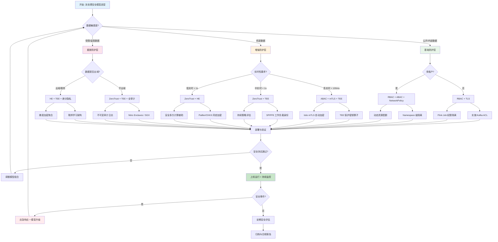

# 流处理安全模型对比

> **所属阶段**: Knowledge/04-technology-selection | **前置依赖**: [Knowledge/07-best-practices/security-hardening-guide.md](../07-best-practices/07.05-security-hardening-guide.md), [Flink/04-runtime/security-architecture.md](../../Flink/01-concepts/flink-system-architecture-deep-dive.md) | **形式化等级**: L3-L4

---

## 1. 概念定义 (Definitions)

### Def-K-04-60-01: 流处理安全态势 (Streaming Security Posture)

**定义**: 流处理安全态势 $\mathcal{S}_{stream}$ 是一个七元组：

$$\mathcal{S}_{stream} = \langle \mathcal{A}, \mathcal{T}, \mathcal{D}, \mathcal{C}, \mathcal{I}, \mathcal{E}, \mathcal{R} \rangle$$

其中：

- $\mathcal{A}$: 认证与授权（Authentication & Authorization），控制"谁可以访问什么"
- $\mathcal{T}$: 传输安全（Transport Security），保护数据在网络中的传输
- $\mathcal{D}$: 数据保护（Data Protection），包括静态加密和动态脱敏
- $\mathcal{C}$: 计算安全（Computation Security），保护执行中的数据和算法
- $\mathcal{I}$: 基础设施安全（Infrastructure Security），隔离和加固运行时环境
- $\mathcal{E}$: 审计与合规（Audit & Compliance），记录和验证操作轨迹
- $\mathcal{R}$: 韧性（Resilience），在安全事件中的恢复和持续服务能力

**流处理特殊性**: 与传统批处理系统相比，流处理的安全态势具有以下独特挑战：

1. **低延迟约束**: 安全机制（如加密、鉴权）不能显著增加端到端延迟
2. **持续数据流动**: 数据在系统中持续流动，没有明确的"处理完成"边界
3. **多租户共享**: 流处理集群通常多租户共享，需要强隔离
4. **边缘部署**: 部分算子部署在不可信边缘环境

### Def-K-04-60-02: 安全模型谱系 (Security Model Spectrum)

**定义**: 安全模型谱系 $\mathcal{M}_{sec}$ 是一个偏序集：

$$\mathcal{M}_{sec} = \langle \{\text{RBAC}, \text{ABAC}, \text{ZeroTrust}, \text{HE}, \text{TEE}\}, \sqsubseteq \rangle$$

其中偏序 $\sqsubseteq$ 表示"安全强度蕴含"（$M_1 \sqsubseteq M_2$ 当且仅当 $M_2$ 可以防御 $M_1$ 能防御的所有威胁，且更多）：

$$\text{RBAC} \sqsubseteq \text{ABAC} \sqsubseteq \text{ZeroTrust} \sqsubseteq \text{TEE} \quad \text{（同态加密 HE 为横向增强）}$$

**各模型核心机制**:

| 模型 | 核心机制 | 信任边界 | 计算开销 |
|------|---------|---------|---------|
| RBAC | 基于角色的静态权限分配 | 系统边界 | 低 |
| ABAC | 基于属性的动态策略评估 | 资源级 | 中 |
| ZeroTrust | 持续验证、最小权限、默认不信任 | 每次访问 | 中-高 |
| HE | 密文上的直接计算 | 无（数据始终加密） | 极高 |
| TEE | 硬件级可信执行环境 | CPU 芯片级 | 中 |

---

## 2. 属性推导 (Properties)

### Prop-K-04-60-01: 安全强度与性能开销权衡

**命题**: 流处理系统的安全强度 $S$ 与处理延迟 $L$ 满足以下权衡关系：

$$L \geq L_0 + \sum_{i} \alpha_i \cdot S_i$$

其中：

- $L_0$: 无安全机制时的基线延迟
- $S_i$: 第 $i$ 个安全维度的强度（取值 $[0, 1]$）
- $\alpha_i$: 第 $i$ 个安全机制的延迟系数

**各安全机制的延迟系数估计**:

| 安全机制 | 延迟系数 $\alpha$ | 典型延迟增加 | 适用场景 |
|---------|------------------|------------|---------|
| RBAC（ACL 检查） | ~0.01 ms | < 1% | 所有场景 |
| ABAC（策略评估） | ~0.1 ms | 1-5% | 敏感数据访问 |
| mTLS（双向 TLS） | ~0.5 ms | 5-15% | 跨服务通信 |
| ZeroTrust（持续验证） | ~1 ms | 10-30% | 高安全需求 |
| TEE（安全区切换） | ~0.2 ms | 5-20% | 关键计算 |
| HE（同态计算） | ~1000x | 100-10000x | 极高安全需求 |

**工程推论**: 在延迟敏感场景（如高频交易 < 1ms），HE 不可行；在批分析场景，HE 可作为可选增强。

---

## 3. 关系建立 (Relations)

### 关系 1: 安全模型到流处理架构层的映射

```
流处理架构分层
  ├── 数据接入层 (Source)
  │     ├── RBAC: Kafka ACL (Topic 级权限)
  │     ├── ABAC: 基于数据分类标签的动态过滤
  │     └── ZeroTrust: 每个数据包来源验证 + mTLS
  ├── 计算层 (Processing)
  │     ├── RBAC: Flink Job 提交权限
  │     ├── ABAC: 基于算子敏感级的动态资源分配
  │     ├── TEE: 关键算子在 SGX/TDX 中执行
  │     └── HE: 隐私保护聚合（如联邦学习场景）
  ├── 传输层 (Network)
  │     ├── mTLS: 算子间通信加密
  │     ├── ZeroTrust: 服务网格 (Istio/Linkerd) 策略
  │     └── ABAC: 基于网络位置的动态策略
  └── 输出层 (Sink)
        ├── RBAC: 目标系统写入权限
        ├── ABAC: 基于数据脱敏策略的输出过滤
        └── ZeroTrust: 下游系统持续身份验证
```

### 关系 2: 威胁模型与安全模型的对应关系

| 威胁类型 | 威胁描述 | 主要防御模型 | 辅助防御 |
|---------|---------|------------|---------|
| 越权访问 | 用户/服务访问未授权数据 | ABAC + ZeroTrust | RBAC |
| 中间人攻击 | 网络流量窃听或篡改 | mTLS + ZeroTrust | TEE |
| 内部人员威胁 | 管理员或开发者恶意行为 | TEE + ABAC | 审计日志 |
| 数据泄露 | 静态数据被非法读取 | HE + TEE | 静态加密 |
| 供应链攻击 | 依赖库或镜像被植入后门 | TEE + 签名验证 | ZeroTrust |
| 侧信道攻击 | 通过资源使用模式推断敏感信息 | TEE | 噪声注入 |

---

## 4. 论证过程 (Argumentation)

### 论证 1: 为什么流处理不能简单复用传统安全模型

传统企业安全模型以"边界防御"为核心（如防火墙、DMZ、VPN），假设"内网可信、外网不可信"。流处理场景打破了这个假设：

1. **数据持续流动**: 传统安全模型假设数据在"处理前"和"处理后"有明确的安全检查点。流处理中数据持续流动，检查点之间可能存在漏洞窗口。
2. **多租户密度高**: 流处理集群（如 Flink on K8s）可能同时运行数十个团队的作业，传统 RBAC 的粗粒度权限不足以防止侧向移动（Lateral Movement）。
3. **边缘不可信**: IoT 流处理场景中，数据源位于物理不可控的边缘环境，传统边界防御失效。

**流处理安全的新范式**: "持续验证、最小权限、数据级保护"——这正是零信任和安全飞地的核心理念。

### 论证 2: 同态加密在流处理中的可行性边界

同态加密（HE）允许在密文上直接计算而无需解密，理论上提供完美的数据保护。但在流处理中存在以下限制：

1. **计算开销**: HE 的密文乘法比明文慢 $10^3$-$10^6$ 倍。流处理的高吞吐要求（$10^6$ events/s）与 HE 的计算密度不兼容。
2. **状态管理**: 有状态流处理（如窗口聚合）需要在 HE 密文上维护状态。当前 HE 方案（如 CKKS、BFV）支持有限的操作集（加、乘），复杂算子（如排序、Top-N）难以实现。
3. **水印与触发器**: 事件时间语义依赖 Watermark 比较，而 HE 密文上的顺序比较需要特殊构造（如 Order-Preserving Encryption 的变体）。

**可行场景**: HE 在流处理中的实际应用场景局限于：

- 低频高价值数据流（如跨境金融交易，< 1000 TPS）
- 联邦学习中的安全聚合（参数加密传输，本地明文计算）
- 隐私保护统计（均值、方差、计数等线性/多项式聚合）

---

## 5. 形式证明 / 工程论证 (Proof / Engineering Argument)

### Thm-K-04-60-01: 流处理安全模型的层次完备性定理

**定理**: 对于流处理系统中的任意安全需求 $R$，存在安全模型组合 $M^* = \{M_1, M_2, \ldots, M_k\}$ 使得：

$$\forall R \in \mathcal{R}, \exists M^*: M^* \models R$$

即安全模型的组合可以覆盖所有流处理安全需求。

**工程论证**:

**需求分类与模型映射**:

1. **身份与访问需求** ($R_{IA}$):
   - RBAC 覆盖角色明确的静态权限（如 Flink Job 提交者、Topic 消费者）
   - ABAC 覆盖动态上下文权限（如"工作时间且在公司网络才可访问敏感 Topic"）
   - ZeroTrust 覆盖持续验证需求（如"每次数据访问都需重新鉴权"）

2. **数据传输需求** ($R_{TX}$):
   - mTLS（属于 ZeroTrust 范畴）覆盖传输加密和双向认证
   - 网络策略（Network Policy）覆盖流量隔离

3. **数据保护需求** ($R_{DP}$):
   - 静态加密覆盖数据-at-rest（Kafka 磁盘加密、Checkpoint 加密）
   - HE 覆盖极端隐私场景下的计算中加密
   - TEE 覆盖密钥和敏感算子的硬件级保护

4. **计算完整性需求** ($R_{CI}$):
   - TEE 覆盖算子执行的完整性（防止宿主 OS/管理员的篡改）
   - 远程证明（Remote Attestation）覆盖 TEE 的可信性验证

**组合策略**: 实际部署中采用"分层叠加"策略——RBAC 作为基础层，ABAC/ZeroTrust 作为增强层，TEE/HE 作为关键算子的特殊保护。

---

## 6. 实例验证 (Examples)

### 示例 1: 金融支付流处理的安全架构

**场景**: 实时支付风控系统，处理敏感交易数据，需满足 PCI-DSS 合规。

**安全模型组合**:

| 层次 | 安全机制 | 实现技术 |
|------|---------|---------|
| 身份认证 | ZeroTrust + RBAC | SPIFFE/SPIRE 工作负载身份 + Kafka ACL |
| 传输加密 | mTLS | Istio Service Mesh 自动 mTLS |
| 数据脱敏 | ABAC | 基于支付金额和商户类型的动态脱敏策略 |
| 密钥管理 | TEE | AWS Nitro Enclaves 保护密钥派生 |
| 审计合规 | 全链路审计 | Flink 审计日志 + Kafka 审计事件 |

**架构要点**:

- 所有 Flink TaskManager 通过 SPIFFE 获取短期证书（1小时轮换）
- Kafka Topic 按敏感度分级：public、internal、confidential、restricted
- 风控评分算子在 Nitro Enclave 中执行，输入为脱敏特征，输出为加密评分
- 审计日志实时写入不可变存储（WORM S3），保留 7 年

### 示例 2: 跨组织联邦流学习的隐私保护

**场景**: 三家医院联合训练疾病预测模型，数据不出域。

**安全架构**:

```
医院 A (本地 Flink)
  ├── 本地特征工程 (明文)
  ├── 本地模型更新计算 (明文)
  └── 梯度加密上传 ──→ 联邦聚合节点

医院 B (本地 Flink)
  └── 梯度加密上传 ──→ 联邦聚合节点

医院 C (本地 Flink)
  └── 梯度加密上传 ──→ 联邦聚合节点

联邦聚合节点 (TEE 环境)
  ├── 接收加密梯度
  ├── TEE 内解密并聚合
  └── 加密全局模型下发
```

**技术选型**:

- 梯度加密: Paillier 加法同态加密（支持梯度聚合的加法操作）
- 聚合节点: Intel SGX TEE，远程证明验证代码完整性
- 通信: mTLS + 证书固定（Certificate Pinning）
- 差分隐私: 梯度添加高斯噪声，保护个体隐私

---

## 7. 可视化 (Visualizations)

### 7.1 五大安全模型的多维度雷达对比

以下雷达图展示了 RBAC、ABAC、ZeroTrust、HE、TEE 五个安全模型在六个关键维度上的能力分布：

```mermaid
radar
    title 流处理安全模型多维度能力对比
    axis 访问控制粒度 "传输安全" "计算保护" "审计能力" "部署复杂度" "性能开销"
    area "RBAC" 3 1 1 2 9 9
    area "ABAC" 7 3 2 5 7 7
    area "ZeroTrust" 8 9 4 8 5 5
    area "HE" 2 9 9 3 2 1
    area "TEE" 5 6 9 7 4 6
```

*说明*: 各维度评分范围为 1-10，10 为最优。部署复杂度和性能开销为逆向指标（分值高表示复杂度低/开销小）。

### 7.2 安全强度 vs 性能开销象限分布

以下象限图展示了各安全模型在安全强度和性能开销维度的定位：

```mermaid
quadrantChart
    title 流处理安全模型: 安全强度 vs 性能开销
    x-axis 低安全强度 --> 高安全强度
    y-axis 低性能开销 (高吞吐) --> 高性能开销 (低吞吐)
    quadrant-1 高安全高开销: 极致安全场景
    quadrant-2 低安全高开销: 应避免
    quadrant-3 低安全低开销: 基础防护
    quadrant-4 高安全低开销: 理想目标
    "RBAC": [0.2, 0.1]
    "ABAC": [0.4, 0.25]
    "mTLS": [0.5, 0.2]
    "ZeroTrust": [0.7, 0.4]
    "TEE": [0.8, 0.5]
    "HE": [0.95, 0.95]
    "HE+TEE": [0.98, 0.9]
    "RBAC+mTLS": [0.4, 0.15]
    "ABAC+ZeroTrust": [0.65, 0.35]
    "分层组合策略": [0.75, 0.3]
```

### 7.3 流处理安全模型选型决策树

以下决策树帮助根据业务场景选择合适的安全模型组合：



---

## 8. 引用参考 (References)


---

*文档版本: v1.0 | 创建日期: 2026-04-20 | 形式化等级: L4*
