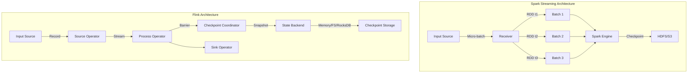
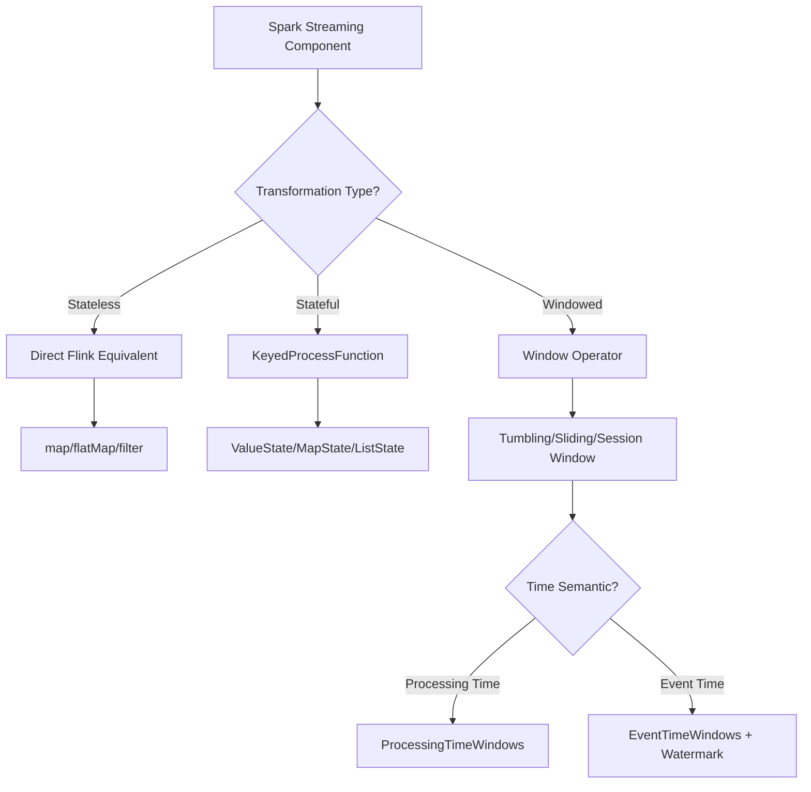

# Spark Streaming 到 Flink 迁移指南

> 所属阶段: Knowledge/05-mapping-guides/migration-guides | 前置依赖: [Flink DataStream API](Flink/03-api/09-language-foundations/flink-datastream-api-complete-guide.md), [Spark Streaming 架构](https://spark.apache.org/docs/latest/streaming-programming-guide.html) | 形式化等级: L4

## 1. 概念定义 (Definitions)

### Def-K-05-01-01: Spark Streaming 核心抽象

Spark Streaming 的核心抽象为 **DStream** (Discretized Stream)，其形式化定义为：

$$
\text{DStream}(T) = \{ RDD_i(T) \}_{i=0}^{\infty}, \quad RDD_i(T) \subseteq T^{n_i}
$$

其中 $RDD_i(T)$ 表示时间窗口 $[t_i, t_{i+1})$ 内的微批数据，$n_i$ 为该批次的数据量。

### Def-K-05-01-02: Flink DataStream 核心抽象

Flink DataStream 采用 **连续流处理** 模型：

$$
\text{DataStream}(T) = \{ (e_i, t_i) \}_{i=0}^{\infty}, \quad e_i \in T, t_i \in \mathbb{R}^+
$$

其中每个元素 $e_i$ 携带独立的事件时间戳 $t_i$，支持逐条处理而非微批处理。

### Def-K-05-01-03: 状态管理模型对比

| 维度 | Spark Streaming | Flink |
|------|----------------|-------|
| 状态类型 | RDD Checkpoint | KeyedState, OperatorState |
| 一致性 | 最终一致性 (WAL) | 精确一次 (Chandy-Lamport) |
| TTL支持 | 有限 | 原生支持 |
| 状态后端 | HDFS/S3 | Memory/RocksDB/Incremental |

## 2. 属性推导 (Properties)

### Prop-K-05-01-01: 延迟特性对比

对于处理延迟 $\mathcal{L}$，两者存在本质差异：

$$
\mathcal{L}_{\text{Spark}} \geq \text{batchInterval} + \text{processingTime}
$$

$$
\mathcal{L}_{\text{Flink}} \approx \text{processingTime} + \text{networkLatency}
$$

**推导依据**: Spark Streaming 的微批模式引入固定的批处理间隔延迟，而 Flink 的流处理模型可实现毫秒级延迟。

### Prop-K-05-01-02: 状态一致性保证

Spark Streaming 的 WAL (Write Ahead Log) 机制提供 **至少一次** 语义：

$$
\forall e \in \text{Input}, \quad P(\text{processed}(e)) \geq 1
$$

Flink 的 Checkpoint 机制在启用 Checkpointing 和 Barrier 对齐时提供 **精确一次** 语义：

$$
\forall e \in \text{Input}, \quad P(\text{processedExactlyOnce}(e)) = 1
$$

### Lemma-K-05-01-01: Watermark 生成等价性

Spark 的 `StreamingContext` 隐式处理时间戳，而 Flink 需显式声明 Watermark 策略：

$$
\text{Spark}: t_{\text{process}} = t_{\text{now}}
$$

$$
\text{Flink}: W(t) = \max\{ e.t \mid e \in \text{buffer} \} - \delta
$$

## 3. 关系建立 (Relations)

### 3.1 核心 API 映射关系

| Spark Streaming 概念 | Flink 等价概念 | 语义差异 |
|---------------------|---------------|---------|
| `StreamingContext` | `StreamExecutionEnvironment` | 执行环境初始化 |
| `DStream[T]` | `DataStream[T]` | 批vs流处理模型 |
| `map(func)` | `map(func)` | 语义相同 |
| `flatMap(func)` | `flatMap(func)` | 语义相同 |
| `filter(func)` | `filter(func)` | 语义相同 |
| `reduceByKey(func)` | `keyBy(...).reduce(func)` | 需显式Key指定 |
| `window(windowLength, slideInterval)` | `window(TumblingEventTimeWindows.of(...))` | 时间语义增强 |
| `updateStateByKey(func)` | `KeyStream.process(new KeyedProcessFunction)` | 状态访问更灵活 |
| `transform(rddFunc)` | `process(ProcessFunction)` | 底层访问差异 |

### 3.2 窗口操作映射

```
Spark Streaming                    Flink
────────────────────────────────────────────────────────────────
window(Duration, Duration)    →    window(SlidingEventTimeWindows.of(...))
                                 .aggregate(AggregateFunction)

reduceByKeyAndWindow(...)     →    keyBy(...)
                                 .window(TumblingEventTimeWindows.of(...))
                                 .reduce(ReduceFunction)

countByWindow(...)            →    keyBy(...)
                                 .window(GlobalWindows.create())
                                 .trigger(CountTrigger.of(n))
                                 .aggregate(CountAggregate)
```

### 3.3 状态管理映射

```
Spark Streaming State                    Flink State
────────────────────────────────────────────────────────────────
mapWithState(func)              →      KeyedProcessFunction + ValueState
trackStateByKey(func)           →      KeyedProcessFunction + MapState
StateSpec(func)                 →      StateTtlConfig + StateDescriptor
```

## 4. 论证过程 (Argumentation)

### 4.1 微批 vs 原生流处理的工程权衡

**Spark Streaming 微批模式**:

- 优势：与 Spark SQL/DataFrame API 统一，批流代码复用
- 劣势：毫秒级延迟难以实现，状态管理粒度粗

**Flink 原生流模式**:

- 优势：毫秒级延迟，精细化状态管理，精确一次语义
- 劣势：批处理场景需通过 BATCH 执行模式模拟

### 4.2 Checkpoint 机制差异

| 特性 | Spark Checkpoint | Flink Checkpoint |
|------|-----------------|------------------|
| 触发方式 | 周期性RDD持久化 | 异步Barrier快照 |
| 存储格式 | 序列化RDD | 状态增量快照 |
| 恢复粒度 | 整个DStream | 算子级增量恢复 |
| 对齐机制 | 无 | Barrier对齐/非对齐 |
| 最大并发 | 1 | 可配置多并发Checkpoint |

### 4.3 时间语义支持

Spark Streaming 1.x-2.x 仅支持 **处理时间** (Processing Time)：

```scala
// Spark - 隐式处理时间
val windowedStream = stream.window(Seconds(10), Seconds(5))
```

Structured Streaming 引入 **事件时间** (Event Time) 支持：

```scala
// Spark Structured Streaming - 显式事件时间
val windowedStream = stream
  .withWatermark("timestamp", "10 minutes")
  .groupBy(window($"timestamp", "10 minutes"))
```

Flink 原生支持三种时间语义：

```java
// Flink - 完整时间语义支持
env.setStreamTimeCharacteristic(TimeCharacteristic.EventTime);
stream.assignTimestampsAndWatermarks(
    WatermarkStrategy.<MyEvent>forBoundedOutOfOrderness(Duration.ofSeconds(5))
        .withTimestampAssigner((event, timestamp) -> event.getEventTime())
);
```

## 5. 形式证明 / 工程论证 (Proof / Engineering Argument)

### 定理 Thm-K-05-01-01: Spark Streaming 到 Flink 的状态迁移完备性

**定理**: 对于任意 Spark Streaming 应用程序 $A_S$，存在等价 Flink 应用程序 $A_F$，使得对于所有输入序列 $I$，输出序列满足：

$$
\forall I, \quad \mathcal{O}(A_S, I) \approx \mathcal{O}(A_F, I)
$$

其中 $\approx$ 表示在允许的时间窗口偏差 $\epsilon$ 内的语义等价。

**证明**:

1. **基础算子映射**: Spark 的 `map`, `flatMap`, `filter` 为无状态转换，Flink 提供直接等价算子。

2. **键值聚合映射**: Spark 的 `reduceByKey` 等价于 Flink 的 `keyBy(...).reduce(...)`，满足结合律和交换律时结果一致。

3. **窗口操作映射**: Spark 的滑动窗口可通过 Flink 的 `SlidingEventTimeWindows` 精确模拟，偏移量 $\delta$ 可配置。

4. **状态管理映射**: Spark 的 `updateStateByKey` 状态函数可编码为 Flink 的 `KeyedProcessFunction`，通过 `ValueState` 存储任意类型状态。

5. **Checkpoint 等价性**: Flink Checkpoint 提供更细粒度的状态恢复，包含 Spark Checkpoint 的功能集。

### 工程论证: 端到端 Exactly-Once 保证

**Spark Streaming**:

```
Source → Receiver → [WAL] → DStream Processing → Output Op
         (至少一次)        (幂等/至少一次)       (幂等输出)
```

**Flink**:

```
Source → [Barrier] → Stream Processing → [Checkpoint] → Sink
         (可重置源)     (状态快照)              (两阶段提交)
```

Flink 的端到端 Exactly-Once 需要：

1. 可重置的数据源（如 Kafka with offset）
2. 启用 Checkpointing 和 WAL
3. 支持两阶段提交的 Sink（如 Kafka Producer）

## 6. 实例验证 (Examples)

### 6.1 WordCount 迁移示例

**Spark Streaming**:

```scala
import org.apache.spark.streaming._

val ssc = new StreamingContext(sc, Seconds(1))
val lines = ssc.socketTextStream("localhost", 9999)

val words = lines.flatMap(_.split(" "))
val pairs = words.map(word => (word, 1))
val wordCounts = pairs.reduceByKey(_ + _)

wordCounts.print()
ssc.start()
ssc.awaitTermination()
```

**Flink 等价实现**:

```java
import org.apache.flink.streaming.api.environment.StreamExecutionEnvironment;
import org.apache.flink.streaming.api.windowing.assigners.TumblingProcessingTimeWindows;
import org.apache.flink.streaming.api.windowing.time.Time;

StreamExecutionEnvironment env =
    StreamExecutionEnvironment.getExecutionEnvironment();

DataStream<String> lines = env.socketTextStream("localhost", 9999);

DataStream<Tuple2<String, Integer>> wordCounts = lines
    .flatMap((String value, Collector<String> out) -> {
        for (String word : value.split(" ")) {
            out.collect(word);
        }
    })
    .map(word -> Tuple2.of(word, 1))
    .keyBy(value -> value.f0)
    .window(TumblingProcessingTimeWindows.of(Time.seconds(5)))
    .sum(1);

wordCounts.print();
env.execute("WordCount");
```

### 6.2 状态管理迁移示例

**Spark Streaming - UpdateStateByKey**:

```scala
def updateFunction(newValues: Seq[Int], runningCount: Option[Int]): Option[Int] = {
    val newCount = runningCount.getOrElse(0) + newValues.sum
    Some(newCount)
}

val stateDStream = pairs.updateStateByKey[Int](updateFunction)
```

**Flink - KeyedProcessFunction**:

```java
public class CountFunction extends KeyedProcessFunction<String, Tuple2<String, Integer>, Tuple2<String, Integer>> {

    private ValueState<Integer> countState;

    @Override
    public void open(Configuration parameters) {
        ValueStateDescriptor<Integer> descriptor =
            new ValueState<>("count", Types.INT);
        countState = getRuntimeContext().getState(descriptor);
    }

    @Override
    public void processElement(
            Tuple2<String, Integer> value,
            Context ctx,
            Collector<Tuple2<String, Integer>> out) throws Exception {

        Integer current = countState.value();
        if (current == null) {
            current = 0;
        }
        current += value.f1;
        countState.update(current);
        out.collect(Tuple2.of(value.f0, current));
    }
}

// 使用
keyedStream.process(new CountFunction());
```

### 6.3 窗口聚合迁移示例

**Spark Streaming - 滑动窗口**:

```scala
val windowedCounts = pairs
    .reduceByKeyAndWindow(
        (a: Int, b: Int) => a + b,  // reduce function
        Seconds(30),                 // window duration
        Seconds(10)                  // slide duration
    )
```

**Flink - 滑动窗口**:

```java
DataStream<Tuple2<String, Integer>> windowedCounts = keyedStream
    .window(SlidingEventTimeWindows.of(Time.seconds(30), Time.seconds(10)))
    .reduce((a, b) -> Tuple2.of(a.f0, a.f1 + b.f1));
```

### 6.4 Checkpoint 配置迁移

**Spark Streaming**:

```scala
ssc.checkpoint("hdfs://.../checkpoint")

// 启用WAL
System.setProperty("spark.streaming.receiver.writeAheadLog.enable", "true")
```

**Flink**:

```java
// 启用Checkpoint
env.enableCheckpointing(60000); // 60秒间隔
env.getCheckpointConfig().setCheckpointingMode(CheckpointingMode.EXACTLY_ONCE);
env.getCheckpointConfig().setMinPauseBetweenCheckpoints(30000);
env.getCheckpointConfig().setCheckpointTimeout(600000);
env.getCheckpointConfig().setMaxConcurrentCheckpoints(1);
env.getCheckpointConfig().enableExternalizedCheckpoints(
    ExternalizedCheckpointCleanup.RETAIN_ON_CANCELLATION
);

// 状态后端配置
env.setStateBackend(new RocksDBStateBackend("hdfs://.../checkpoint"));
```

## 7. 可视化 (Visualizations)

### 7.1 架构对比图



### 7.2 API 映射决策树



### 7.3 迁移路线图

```mermaid
gantt
    title Spark Streaming 到 Flink 迁移路线图
    dateFormat  X
    axisFormat %s

    section 评估阶段
    现状分析           :a1, 0, 2
    依赖识别           :a2, after a1, 2
    复杂度评估         :a3, after a2, 1

    section 准备阶段
    环境搭建           :b1, after a3, 2
    团队培训           :b2, after a3, 3
    PoC开发           :b3, after b1, 3

    section 迁移阶段
    无状态算子迁移      :c1, after b3, 3
    状态管理迁移        :c2, after c1, 4
    窗口逻辑迁移        :c3, after c2, 3
    Checkpoint配置     :c4, after c3, 2

    section 验证阶段
    功能测试           :d1, after c4, 2
    性能基准测试        :d2, after d1, 2
    生产灰度           :d3, after d2, 3
```



## 8. 常见问题 (FAQ)

### Q1: Spark Streaming 的 DStream 缓存机制如何迁移到 Flink？

**A**: Flink 不提供显式缓存 API，而是通过 **状态后端** 和 **广播状态** 实现类似功能：

```java
// 小数据集广播
DataStream<Rule> rules = env.fromCollection(ruleList);
BroadcastStream<Rule> broadcastRules = rules.broadcast(rulesStateDescriptor);

// 主流与广播流连接
mainStream.connect(broadcastRules)
    .process(new KeyedBroadcastProcessFunction() {...});
```

### Q2: 如何处理 Spark Streaming 中的 `StreamingContext.getOrCreate` 模式？

**A**: Flink 使用 **Savepoint** 机制实现类似功能：

```java
// 从Savepoint恢复
env.setRestartStrategy(RestartStrategies.fixedDelayRestart(3, Time.seconds(10)));

// CLI恢复:
// flink run -s <savepoint-path> -c MainClass job.jar
```

### Q3: Spark Streaming 的多输出如何迁移？

**A**: Flink 通过 **Side Output** 实现多路输出：

```java
// 定义侧输出标签
OutputTag<String> lateDataTag = new OutputTag<String>("late-data"){};

// 主输出 + 侧输出
SingleOutputStreamOperator<Result> mainResult = input
    .process(new ProcessFunction<String, Result>() {
        @Override
        public void processElement(String value, Context ctx, Collector<Result> out) {
            if (isLate(value)) {
                ctx.output(lateDataTag, value);
            } else {
                out.collect(process(value));
            }
        }
    });

// 获取侧输出
DataStream<String> lateStream = mainResult.getSideOutput(lateDataTag);
```

### Q4: Checkpoint 间隔如何选择？

**A**: 推荐公式：

$$
\text{CheckpointInterval} \geq 2 \times \text{CheckpointDuration} + \text{ExpectedFailureInterval}
$$

典型配置：

- 低延迟场景：10-30秒
- 平衡场景：1-5分钟
- 高吞吐场景：5-10分钟

## 9. 性能对比

| 指标 | Spark Streaming | Flink | 说明 |
|------|----------------|-------|------|
| 端到端延迟 | 100ms - 数秒 | 10-100ms | Flink 原生流模式优势 |
| 吞吐量 | 高 (批处理优化) | 高 | 两者相当 |
| CPU效率 | 中等 | 高 | Flink 更少的序列化开销 |
| 状态访问 | 慢 (RDD序列化) | 快 (内存/RocksDB) | Flink 细粒度状态管理 |
| Checkpoint开销 | 高 (全量RDD) | 低 (增量快照) | Flink RocksDB增量备份 |
| 故障恢复时间 | 分钟级 | 秒级 | Flink 细粒度恢复 |

## 10. 引用参考 (References)
