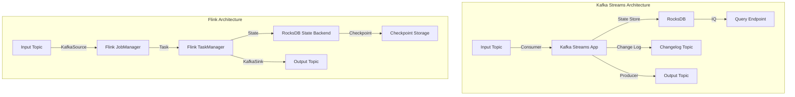
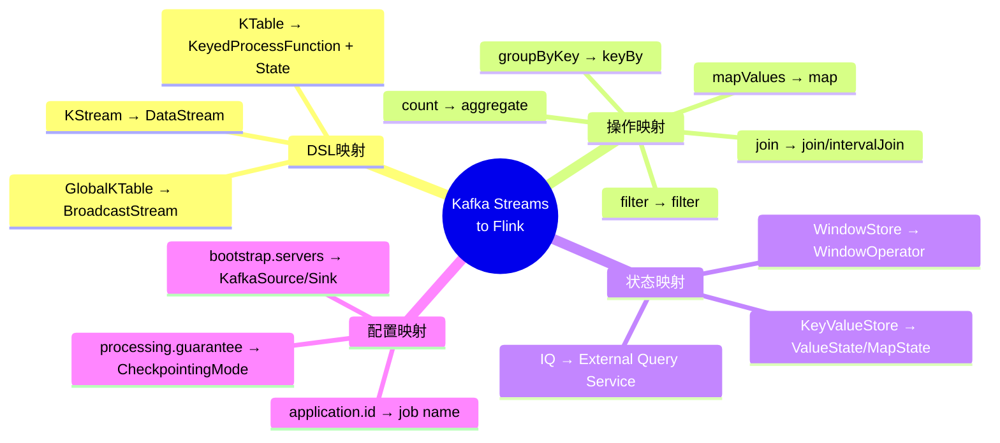
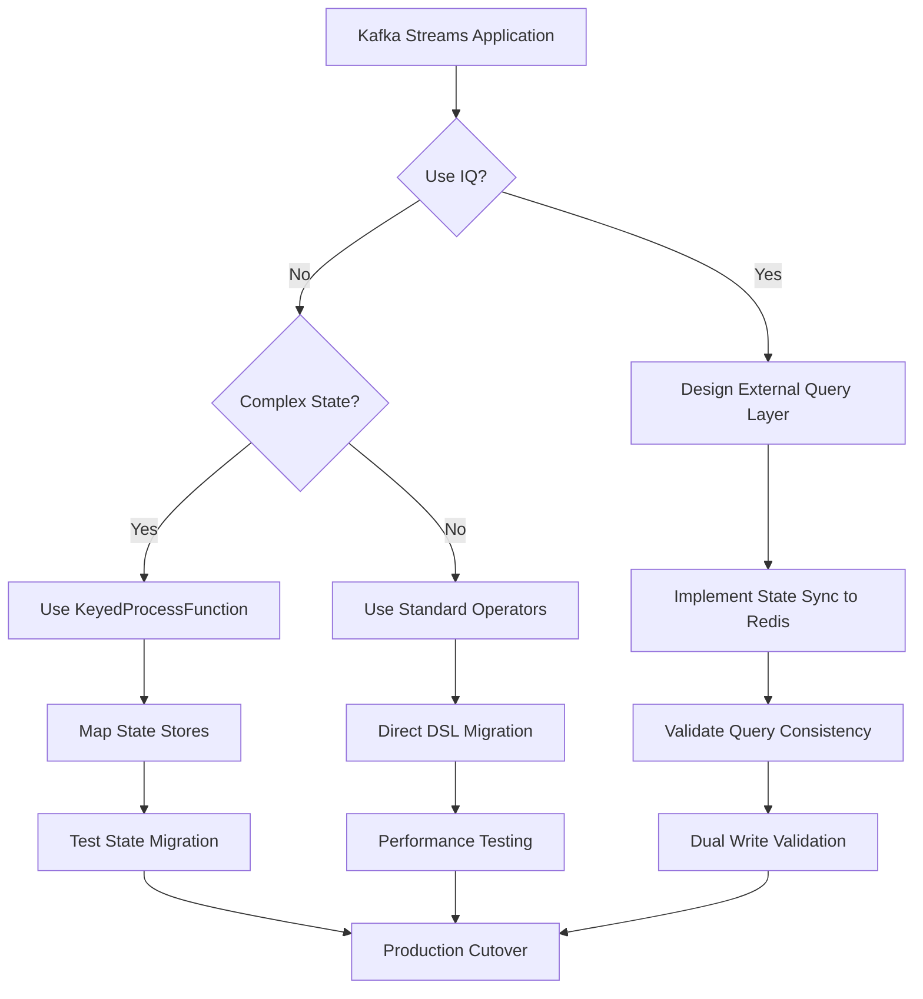

# Kafka Streams 到 Flink 迁移指南

> 所属阶段: Knowledge/05-mapping-guides/migration-guides | 前置依赖: [Flink Kafka Connector](../../../Flink/05-ecosystem/05.01-connectors/flink-connectors-ecosystem-complete-guide.md), [Kafka Streams DSL](https://kafka.apache.org/documentation/streams/) | 形式化等级: L4

## 1. 概念定义 (Definitions)

### Def-K-05-02-01: Kafka Streams 核心抽象

Kafka Streams 建立在 **KStream** 和 **KTable** 两个核心抽象之上：

$$
\text{KStream}(K, V) = \{ (k_i, v_i, t_i) \}_{i=0}^{\infty}, \quad k_i \in K, v_i \in V, t_i \in \mathbb{R}^+
$$

$$
\text{KTable}(K, V) = K \to (V \times \mathbb{R}^+), \quad \text{表示键到值的最新映射}
$$

### Def-K-05-02-02: Flink 流表对偶性

Flink 通过 **DataStream** 和 **Dynamic Table** 实现流表对偶：

$$
\text{StreamToTable}: \text{DataStream}(T) \to \text{Table}(T)
$$

$$
\text{TableToStream}: \text{Table}(T) \to \text{DataStream}(\Delta T)
$$

其中 $\Delta T$ 表示表变更日志（INSERT/UPDATE/DELETE）。

### Def-K-05-02-03: 状态存储对比

| 特性 | Kafka Streams State Store | Flink State Backend |
|------|--------------------------|---------------------|
| 存储引擎 | RocksDB (默认) | Memory/ RocksDB |
| 持久化 | Change Log Topic | Checkpoint |
| TTL | 支持 | 原生支持 |
| 查询能力 | 交互式查询 (IQ) | 有限支持 |
| 容错 | 日志回放 | Checkpoint 恢复 |

## 2. 属性推导 (Properties)

### Prop-K-05-02-01: 拓扑结构等价性

Kafka Streams 的 **Processor Topology** 与 Flink 的 **JobGraph** 在表达力上等价：

$$
\forall \text{Topology}_{KS}, \exists \text{JobGraph}_{Flink}, \quad \text{semantics}(\text{Topology}_{KS}) \cong \text{semantics}(\text{JobGraph}_{Flink})
$$

### Prop-K-05-02-02: 分区分配语义

Kafka Streams 的 **任务并行度** 与 Kafka 分区数绑定：

$$
\text{Parallelism}_{KS} = \text{numPartitions}_{topic}
$$

Flink 的并行度独立于 Kafka 分区数，通过 **Rescale** 实现动态调整：

$$
\text{Parallelism}_{Flink} \in [1, \text{maxParallelism}], \quad \text{可动态重新配置}
$$

### Lemma-K-05-02-01: 再平衡行为差异

Kafka Streams 在分区再平衡时触发 **Rebalance Listener**：

```
Consumer Rebalance → Task Migration → State Restoration → Resume Processing
```

Flink 通过 **Checkpoint** 和 **Savepoint** 实现无状态迁移：

```
Checkpoint/Savepoint → Cancel Job → Rescale → Restore → Resume
```

## 3. 关系建立 (Relations)

### 3.1 DSL API 映射关系

| Kafka Streams DSL | Flink DataStream API | 语义说明 |
|------------------|---------------------|---------|
| `stream()` | `env.fromSource(KafkaSource)` | 数据源 |
| `mapValues(func)` | `map(func)` | 值转换 |
| `flatMapValues(func)` | `flatMap(func)` | 扁平化映射 |
| `filter(pred)` | `filter(pred)` | 过滤 |
| `selectKey(func)` | `keyBy(func)` | 重新分区 |
| `groupByKey()` | `keyBy(KeySelector)` | 按键分组 |
| `count()` | `.aggregate(CountAggregate)` | 计数 |
| `reduce(func)` | `.reduce(func)` | 归约 |
| `join(otherStream)` | `.join(otherStream)` | 流连接 |
| `leftJoin(otherStream)` | `.leftJoin(otherStream)` | 左外连接 |
| `outerJoin(otherStream)` | `.fullOuterJoin(otherStream)` | 全外连接 |
| `to(topic)` | `.sinkTo(KafkaSink)` | 输出到Topic |

### 3.2 KStream vs DataStream 语义对比

```
Kafka Streams                    Flink
────────────────────────────────────────────────────────────────
KStream<K, V>                   →  DataStream<V> + keyBy()
KTable<K, V>                    →  KeyedProcessFunction + ValueState
GlobalKTable<K, V>              →  BroadcastStream + BroadcastState
KGroupedStream<K, V>            →  KeyedStream<K, V>
```

### 3.3 窗口操作映射

```
Kafka Streams                    Flink
────────────────────────────────────────────────────────────────
TimeWindows.of(Duration)        →  TumblingEventTimeWindows.of(Time)
SessionWindows.withGap(...)     →  EventTimeSessionWindows.withGap(...)
SlidingWindows.withSize(...)    →  SlidingEventTimeWindows.of(...)

// 窗口聚合
.count()                        →  .aggregate(CountAggregate)
.reduce(func)                   →  .reduce(func)
.aggregate(initializer, ...)    →  .aggregate(AggregateFunction)
```

## 4. 论证过程 (Argumentation)

### 4.1 部署模式差异

**Kafka Streams 部署选项**:

| 模式 | 描述 | Flink 等价 |
|------|------|-----------|
| Embedded | 嵌入应用进程 | Flink MiniCluster |
| Standalone | 独立进程 | Flink Application Mode |
| Container | Docker/K8s | Flink Kubernetes Operator |

**关键差异**: Kafka Streams 作为库嵌入应用，Flink 作为独立运行时管理作业生命周期。

### 4.2 交互式查询 (Interactive Queries) 迁移

Kafka Streams 提供 **Interactive Queries (IQ)** 直接查询状态存储：

```java

// [伪代码片段 - 不可直接运行] 仅展示核心逻辑
import org.apache.flink.api.common.typeinfo.Types;

// Kafka Streams IQ
ReadOnlyKeyValueStore<String, Long> store =
    streams.store("count-store", QueryableStoreTypes.keyValueStore());
Long count = store.get("key");
```

Flink 原生不支持 IQ，但可通过以下方式实现：

1. **异步查询服务**: 在 `KeyedProcessFunction` 中暴露查询接口
2. **状态后端直接访问**: RocksDB State Backend 支持快照查询
3. **外部存储同步**: 将状态同步到外部 KV 存储（Redis/Cassandra）

### 4.3 序列化对比

**Kafka Streams**:

- 使用 `Serde<T>` 接口统一序列化
- 默认支持 Avro/JSON/String/ByteArray

```java
// [伪代码片段 - 不可直接运行] 仅展示核心逻辑
StreamsBuilder builder = new StreamsBuilder();
KStream<String, MyEvent> stream = builder.stream(
    "input-topic",
    Consumed.with(Serdes.String(), new MyEventSerde())
);
```

**Flink**:

- 使用 `TypeInformation` 和 `TypeSerializer`
- 支持 POJO/Avro/Protobuf/Kryo

```java
// [伪代码片段 - 不可直接运行] 仅展示核心逻辑
KafkaSource<MyEvent> source = KafkaSource.<MyEvent>builder()
    .setTopics("input-topic")
    .setValueOnlyDeserializer(new MyEventDeserializationSchema())
    .build();
```

## 5. 形式证明 / 工程论证 (Proof / Engineering Argument)

### 定理 Thm-K-05-02-01: Kafka Streams 到 Flink 的语义保持性

**定理**: 对于使用 Kafka Streams DSL 构建的任意流处理拓扑 $\mathcal{T}_{KS}$，存在 Flink DataStream 程序 $\mathcal{P}_{F}$ 使得对于所有输入流序列 $\mathcal{I}$：

$$
\mathcal{O}(\mathcal{T}_{KS}, \mathcal{I}) = \mathcal{O}(\mathcal{P}_{F}, \mathcal{I})
$$

**证明**:

1. **源算子等价**: Kafka Streams `StreamsBuilder.stream()` 等价于 Flink `KafkaSource` 配合 `fromSource()`。

2. **转换算子等价**: 基础转换（map/filter/flatMap）语义完全相同。

3. **按键分组等价**: Kafka Streams `groupByKey()` 等价于 Flink `keyBy()`，均产生 `KeyedStream`。

4. **窗口语义等价**: Kafka Streams 时间窗口与 Flink `WindowAssigner` 在事件时间语义下行为一致。

5. **连接语义等价**: Kafka Streams 的 KStream-KStream join 与 Flink `IntervalJoin` 语义一致。

6. **Sink等价**: Kafka Streams `to()` 等价于 Flink `KafkaSink`。

### 工程论证: 状态存储迁移策略

**状态存储类型映射**:

| Kafka Streams | Flink 实现 |
|--------------|-----------|
| KeyValueStore | ValueState/MapState |
| TimestampedKeyValueStore | ValueState + 手动时间戳 |
| WindowStore | WindowState (内部) |
| SessionStore | 自定义 + MapState |

**迁移策略**:

1. **存量数据迁移**: 通过 Kafka Topic 导出导入
2. **双写策略**: 同时写入 Kafka Streams 和 Flink，验证一致性后切换
3. **CDC同步**: 使用 Change Data Capture 同步状态变更

## 6. 实例验证 (Examples)

### 6.1 基础流处理迁移

**Kafka Streams**:

```java
// [伪代码片段 - 不可直接运行] 仅展示核心逻辑
StreamsBuilder builder = new StreamsBuilder();

// 创建KStream
KStream<String, String> source = builder.stream("input-topic");

// 转换处理
KStream<String, String> processed = source
    .filter((key, value) -> value.contains("ERROR"))
    .mapValues(value -> value.toUpperCase())
    .flatMapValues(value -> Arrays.asList(value.split(" ")));

// 输出
processed.to("output-topic");

KafkaStreams streams = new KafkaStreams(builder.build(), props);
streams.start();
```

**Flink 等价实现**:

```java

// [伪代码片段 - 不可直接运行] 仅展示核心逻辑
import org.apache.flink.streaming.api.environment.StreamExecutionEnvironment;
import org.apache.flink.streaming.api.datastream.DataStream;

StreamExecutionEnvironment env =
    StreamExecutionEnvironment.getExecutionEnvironment();

// Kafka Source
KafkaSource<String> source = KafkaSource.<String>builder()
    .setBootstrapServers("kafka:9092")
    .setTopics("input-topic")
    .setGroupId("flink-group")
    .setStartingOffsets(OffsetsInitializer.earliest())
    .setValueOnlyDeserializer(new SimpleStringSchema())
    .build();

DataStream<String> stream = env.fromSource(
    source,
    WatermarkStrategy.noWatermarks(),
    "Kafka Source"
);

// 转换处理
DataStream<String> processed = stream
    .filter(value -> value.contains("ERROR"))
    .map(value -> value.toUpperCase())
    .flatMap(new FlatMapFunction<String, String>() {
        @Override
        public void flatMap(String value, Collector<String> out) {
            for (String word : value.split(" ")) {
                out.collect(word);
            }
        }
    });

// Kafka Sink
KafkaSink<String> sink = KafkaSink.<String>builder()
    .setBootstrapServers("kafka:9092")
    .setRecordSerializer(KafkaRecordSerializationSchema.builder()
        .setTopic("output-topic")
        .setValueSerializationSchema(new SimpleStringSchema())
        .build())
    .build();

processed.sinkTo(sink);
env.execute("KafkaStreams Migration");
```

### 6.2 聚合操作迁移

**Kafka Streams - 计数聚合**:

```java
// [伪代码片段 - 不可直接运行] 仅展示核心逻辑
KTable<String, Long> wordCounts = source
    .groupByKey()
    .count(Materialized.as("counts-store"));

// 输出变更流
wordCounts.toStream().to("counts-topic");
```

**Flink - 计数聚合**:

```java

import org.apache.flink.streaming.api.datastream.DataStream;
import org.apache.flink.api.common.functions.AggregateFunction;
import org.apache.flink.streaming.api.windowing.time.Time;

DataStream<Tuple2<String, Long>> wordCounts = source
    .flatMap((String value, Collector<Tuple2<String, String>> out) -> {
        for (String word : value.split(" ")) {
            out.collect(Tuple2.of(word, word));
        }
    })
    .keyBy(value -> value.f0)
    .window(TumblingEventTimeWindows.of(Time.minutes(1)))
    .aggregate(new CountAggregate<>());

// 自定义聚合函数
public static class CountAggregate<T> implements AggregateFunction<Tuple2<T, String>, Long, Long> {
    @Override
    public Long createAccumulator() {
        return 0L;
    }

    @Override
    public Long add(Tuple2<T, String> value, Long accumulator) {
        return accumulator + 1;
    }

    @Override
    public Long getResult(Long accumulator) {
        return accumulator;
    }

    @Override
    public Long merge(Long a, Long b) {
        return a + b;
    }
}
```

### 6.3 Stream-Table Join 迁移

**Kafka Streams - KStream-KTable Join**:

```java
// [伪代码片段 - 不可直接运行] 仅展示核心逻辑
KStream<String, Order> orders = builder.stream("orders");
KTable<String, Customer> customers = builder.table("customers");

KStream<String, EnrichedOrder> enriched = orders
    .leftJoin(customers, (order, customer) -> {
        order.setCustomerInfo(customer);
        return order;
    });
```

**Flink - Stream-Broadcast Join**:

```java

// [伪代码片段 - 不可直接运行] 仅展示核心逻辑
import org.apache.flink.streaming.api.datastream.DataStream;

// 客户数据作为广播流
DataStream<Customer> customerStream = env.fromSource(
    KafkaSource.<Customer>builder()
        .setTopics("customers")
        .setValueOnlyDeserializer(new CustomerDeserializationSchema())
        .build(),
    WatermarkStrategy.noWatermarks(),
    "Customers"
);

MapStateDescriptor<String, Customer> customerStateDescriptor =
    new MapStateDescriptor<>("customers", String.class, Customer.class);
BroadcastStream<Customer> broadcastCustomers = customerStream.broadcast(customerStateDescriptor);

// 订单流连接广播流
DataStream<EnrichedOrder> enriched = orderStream
    .connect(broadcastCustomers)
    .process(new BroadcastProcessFunction<Order, Customer, EnrichedOrder>() {
        @Override
        public void processElement(Order order, ReadOnlyContext ctx, Collector<EnrichedOrder> out) {
            ReadOnlyBroadcastState<String, Customer> state = ctx.getBroadcastState(customerStateDescriptor);
            Customer customer = state.get(order.getCustomerId());
            out.collect(new EnrichedOrder(order, customer));
        }

        @Override
        public void processBroadcastElement(Customer customer, Context ctx, Collector<EnrichedOrder> out) {
            ctx.getBroadcastState(customerStateDescriptor).put(customer.getId(), customer);
        }
    });
```

### 6.4 交互式查询迁移方案

**方案1: 状态后端查询**:

```java
// Flink 不支持直接IQ,但可通过Queryable State实现(已废弃)
// 推荐方案: 将状态写入外部存储


import org.apache.flink.api.common.state.ValueState;
import org.apache.flink.api.common.state.ValueStateDescriptor;

public class QueryableStateFunction extends KeyedProcessFunction<String, Event, Result> {
    private transient ValueState<AggregatedState> state;
    private transient Connection redisConnection;

    @Override
    public void open(Configuration parameters) throws Exception {
        state = getRuntimeContext().getState(new ValueStateDescriptor<>("state", AggregatedState.class));
        redisConnection = RedisClient.create("redis://localhost").connect();
    }

    @Override
    public void processElement(Event event, Context ctx, Collector<Result> out) throws Exception {
        AggregatedState current = state.value();
        if (current == null) {
            current = new AggregatedState();
        }
        current.update(event);
        state.update(current);

        // 同步到Redis供查询
        redisConnection.sync().set(ctx.getCurrentKey(), serialize(current));

        out.collect(current.toResult());
    }
}
```

**方案2: REST API 服务**:

```java
// 在ProcessFunction中内置HTTP服务

import org.apache.flink.api.common.state.ValueState;
import org.apache.flink.api.common.state.ValueStateDescriptor;

public class StateQueryService extends KeyedProcessFunction<String, Event, Result> {
    private transient ValueState<State> state;
    private transient HttpServer server;

    @Override
    public void open(Configuration parameters) throws Exception {
        state = getRuntimeContext().getState(new ValueStateDescriptor<>("state", State.class));
        server = HttpServer.create(new InetSocketAddress(8080), 0);
        server.createContext("/query", exchange -> {
            String key = extractKey(exchange);
            // 注意: 这里只能在KeyedProcessFunction的processElement中访问状态
            // 需要设计消息驱动的查询机制
        });
        server.start();
    }
}
```

## 7. 可视化 (Visualizations)

### 7.1 架构对比



### 7.2 API 映射全景



### 7.3 迁移决策流程



## 8. 常见问题 (FAQ)

### Q1: Kafka Streams 的 Punctuation 如何迁移？

**A**: 使用 Flink 的 **TimerService**：

```java
public class PunctuatedFunction extends KeyedProcessFunction<String, Event, Result> {
    @Override
    public void processElement(Event event, Context ctx, Collector<Result> out) {
        // 注册定时器实现 punctuation 语义
        ctx.timerService().registerProcessingTimeTimer(ctx.timestamp() + 60000);
        // 处理元素
    }

    @Override
    public void onTimer(long timestamp, OnTimerContext ctx, Collector<Result> out) {
        // 定时触发逻辑
    }
}
```

### Q2: Kafka Streams 的 Processor API 如何迁移？

**A**: 直接使用 Flink 的 **ProcessFunction** 家族：

```java
// Kafka Streams Processor API
public class CustomProcessor extends Processor<String, String> {
    private ProcessorContext context;

    @Override
    public void init(ProcessorContext context) {
        this.context = context;
        this.context.schedule(Duration.ofSeconds(10), PunctuationType.WALL_CLOCK_TIME, this::punctuate);
    }
}

// Flink 等价实现
public class CustomProcessFunction extends KeyedProcessFunction<String, String, String> {
    @Override
    public void open(Configuration parameters) {
        // 初始化
    }

    @Override
    public void processElement(String value, Context ctx, Collector<String> out) {
        // 处理元素
    }
}
```

### Q3: 如何处理 Kafka Streams 的自定义分区器？

**A**: Flink 通过 **自定义分区器** 实现：

```java

// [伪代码片段 - 不可直接运行] 仅展示核心逻辑
import org.apache.flink.streaming.api.datastream.DataStream;

DataStream<Event> stream = ...;
stream.partitionCustom(
    new Partitioner<String>() {
        @Override
        public int partition(String key, int numPartitions) {
            return Math.abs(key.hashCode()) % numPartitions;
        }
    },
    event -> event.getKey()
);
```

### Q4: Kafka Streams 的 DSL vs Processor API 选择对迁移的影响？

**A**:

- **DSL 应用**: 直接映射到 Flink DataStream API，迁移较简单
- **Processor API 应用**: 映射到 Flink ProcessFunction，需手动管理状态和定时器

## 9. 性能对比

| 指标 | Kafka Streams | Flink | 说明 |
|------|---------------|-------|------|
| 延迟 | 10-100ms | 10-100ms | 相当 |
| 吞吐量 | 中等 | 高 | Flink 更优的并行度控制 |
| 扩展性 | 受限于分区数 | 独立扩展 | Flink 更灵活 |
| 状态查询 | 原生IQ支持 | 需外部实现 | Kafka Streams 优势 |
| 资源隔离 | 应用级 | 集群级 | Flink 更适合多租户 |
| 生态集成 | Kafka生态 | 多源支持 | Flink 更广泛 |

## 10. 引用参考 (References)

---

*文档版本: v1.0 | 创建日期: 2026-04-19*
