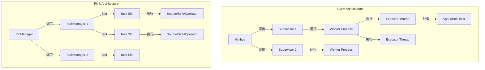
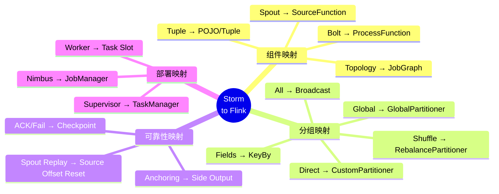
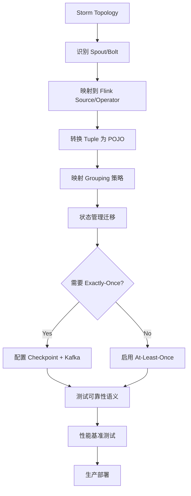

# Apache Storm 到 Flink 迁移指南

> 所属阶段: Knowledge/05-mapping-guides/migration-gives | 前置依赖: [Flink JobGraph](../../Flink/02-core-mechanisms/jobgraph-execution-model.md), [Storm Topology](https://storm.apache.org/releases/current/Concepts.html) | 形式化等级: L4

## 1. 概念定义 (Definitions)

### Def-K-05-03-01: Storm 核心抽象

Apache Storm 的核心抽象由 **Topology**、**Spout** 和 **Bolt** 组成：

$$
\text{Topology} = (S, B, E, G)
$$

其中：

- $S$: Spout 集合（数据源）
- $B$: Bolt 集合（处理节点）
- $E$: 边集合（数据流）
- $G$: 分组策略（Stream Grouping）

### Def-K-05-03-02: Storm Tuple 数据模型

Storm 使用 **Tuple** 作为基本数据单元：

$$
\text{Tuple} = \langle \text{streamId}, \text{componentId}, \text{taskId}, \text{values}[] \rangle
$$

其中 `values[]` 是类型擦除的 Object 数组，需运行时类型检查。

### Def-K-05-03-03: Flink JobGraph 与 Operator

Flink 的执行图模型：

$$
\text{JobGraph} = (V_{op}, E_{pipe}, \mathcal{P}, \mathcal{S})
$$

其中：

- $V_{op}$: 算子顶点集合
- $E_{pipe}$: 管道边集合
- $\mathcal{P}$: 并行度配置
- $\mathcal{S}$: 状态配置

### Def-K-05-03-04: 可靠性语义对比

| 语义 | Storm | Storm (Trident) | Flink |
|------|-------|-----------------|-------|
| 至少一次 | ACK机制 | 透明 | Checkpoint |
| 精确一次 | 不支持 | State + Batch | Checkpoint + Barrier |
| 消息去重 | 需应用实现 | 透明 | 透明 |
| 失败恢复 | Record-level | Batch-level | Checkpoint-level |

## 2. 属性推导 (Properties)

### Prop-K-05-03-01: 拓扑结构等价性

Storm Topology 与 Flink JobGraph 在结构上等价：

$$
\forall \text{Topology}_{Storm}, \exists \text{JobGraph}_{Flink}, \quad |V_{spout}| + |V_{bolt}| = |V_{op}|
$$

### Prop-K-05-03-02: 分组策略映射

Storm 的 Stream Grouping 与 Flink 的分区策略对应：

$$
\begin{aligned}
\text{ShuffleGrouping} &\mapsto \text{RebalancePartitioner} \\
\text{FieldsGrouping} &\mapsto \text{KeyGroupStreamPartitioner} \\
\text{AllGrouping} &\mapsto \text{BroadcastPartitioner} \\
\text{GlobalGrouping} &\mapsto \text{GlobalPartitioner} \\
\text{DirectGrouping} &\mapsto \text{CustomPartitioner}
\end{aligned}
$$

### Lemma-K-05-03-01: 状态管理差异

Storm 的 Bolt 状态需 **手动管理**（外部存储）：

```java
// Storm - 手动状态管理
Map<String, Object> state = new HashMap<>();
// 需定期持久化到 Redis/HBase
```

Flink 提供 **内置状态管理**：

```java
// Flink - 内置状态
ValueStateDescriptor<Long> descriptor = new ValueStateDescriptor<>("count", Types.LONG);
ValueState<Long> state = getRuntimeContext().getState(descriptor);
```

## 3. 关系建立 (Relations)

### 3.1 核心组件映射

| Storm 组件 | Flink 等价组件 | 说明 |
|-----------|---------------|------|
| `IRichSpout` | `SourceFunction` / `RichSourceFunction` | 数据源 |
| `IRichBolt` | `ProcessFunction` / `RichFlatMapFunction` | 处理逻辑 |
| `IBasicBolt` | `MapFunction` / `FlatMapFunction` | 简化处理 |
| `BaseWindowedBolt` | `WindowFunction` | 窗口处理 |
| `TopologyBuilder` | `StreamExecutionEnvironment` | 构建器 |
| `Config` | `Configuration` / 环境设置 | 配置 |
| `OutputCollector` | `Collector` | 输出收集 |

### 3.2 Tuple 到 Row/DataStream 映射

```
Storm Tuple                    Flink
────────────────────────────────────────────────────────────────
Tuple (Object[])              →  POJO / Tuple / Row
Fields (schema)               →  TypeInformation
tuple.getString(0)            →  event.getField()
tuple.getIntegerByField("id") →  event.getId()
new Values(...)               →  out.collect(new Event(...))
```

### 3.3 流分组策略映射

```java
// Storm - Fields Grouping
builder.setBolt("count", new CountBolt(), 4)
    .fieldsGrouping("split", new Fields("word"));

// Flink - KeyBy
stream.flatMap(new Splitter())
    .keyBy(value -> value.getWord())  // 等价于 fieldsGrouping
    .process(new CountFunction())
    .setParallelism(4);
```

### 3.4 配置映射

| Storm 配置 | Flink 配置 | 说明 |
|-----------|-----------|------|
| `TOPOLOGY_WORKERS` | `parallelism.default` | 默认并行度 |
| `TOPOLOGY_MESSAGE_TIMEOUT_SECS` | `execution.checkpointing.timeout` | 超时 |
| `TOPOLOGY_MAX_SPOUT_PENDING` | `execution.max-idle-state-retention` | 最大积压 |
| `TOPOLOGY_ACKERS` | 内置 | ACK透明化 |

## 4. 论证过程 (Argumentation)

### 4.1 可靠性机制差异

**Storm ACK 机制**:

```
Spout → emit(tuple) → Bolt1 → ack(tuple) → Bolt2 → ack(tuple) → Spout.ack(tuple)
                        ↓                              ↓
                      fail → 重发                     fail → 重发
```

**Flink Checkpoint 机制**:

```
Source → [Barrier] → Operator1 → [Barrier] → Operator2 → [Barrier] → Sink
           ↓                         ↓                         ↓
        快照状态                  快照状态                   快照状态
```

**关键差异**:

- Storm: 每条记录 ACK，高开销但细粒度
- Flink: 批量 Checkpoint，低开销粗粒度

### 4.2 部署模式对比

| 模式 | Storm | Flink |
|------|-------|-------|
| Local Mode | `LocalCluster` | `MiniCluster` |
| Standalone | Nimbus + Supervisor | JobManager + TaskManager |
| YARN | Storm-YARN | Flink-YARN |
| Kubernetes | 需自定义 | Native K8s Operator |

### 4.3 窗口处理对比

**Storm Windowing**:

```java
// Storm 1.x - 手动窗口管理
public class WindowBolt extends BaseRichBolt {
    private List<Tuple> window = new ArrayList<>();

    @Override
    public void execute(Tuple tuple) {
        window.add(tuple);
        if (window.size() >= 100) {
            processWindow(window);
            window.clear();
        }
    }
}
```

**Flink Windowing**:

```java
// Flink 原生窗口支持
stream.keyBy(...)
    .window(TumblingEventTimeWindows.of(Time.seconds(10)))
    .aggregate(new AggregateFunction() {...});
```

## 5. 形式证明 / 工程论证 (Proof / Engineering Argument)

### 定理 Thm-K-05-03-01: Storm Topology 到 Flink JobGraph 的语义等价性

**定理**: 对于任意 Storm Topology $\mathcal{T}$，存在 Flink JobGraph $\mathcal{G}$ 使得：

$$
\forall \text{input stream } I, \quad \mathcal{O}(\mathcal{T}, I) \cong \mathcal{O}(\mathcal{G}, I)
$$

其中 $\cong$ 表示在窗口对齐偏差内的语义等价。

**证明**:

1. **Spout 映射**: Storm Spout 的 `nextTuple()` 等价于 Flink SourceFunction 的 `run()` 方法。

2. **Bolt 映射**: Storm Bolt 的 `execute(Tuple)` 等价于 Flink ProcessFunction 的 `processElement()`。

3. **分组映射**: Storm 的 Stream Grouping 可通过 Flink 的 KeyBy 和 Custom Partitioner 实现。

4. **可靠性映射**: Storm 的 ACK/Fail 语义可通过 Flink 的 Checkpoint 和两阶段提交实现。

5. **状态映射**: Storm 的外部状态管理等价于 Flink 的托管状态持久化。

### 工程论证: 性能优化策略

**Storm 优化点**:

- 调整 `TOPOLOGY_MAX_SPOUT_PENDING` 控制背压
- 优化序列化（Kryo 注册）
- 本地或混洗分组减少网络传输

**Flink 优化映射**:

- 自动背压管理（无需配置）
- 类型提示和 POJO 规范
- 链式优化和 Slot 共享

## 6. 实例验证 (Examples)

### 6.1 WordCount 迁移示例

**Storm 实现**:

```java
// Spout
public class SentenceSpout extends BaseRichSpout {
    private SpoutOutputCollector collector;

    @Override
    public void open(Map conf, TopologyContext context, SpoutOutputCollector collector) {
        this.collector = collector;
    }

    @Override
    public void nextTuple() {
        String[] sentences = new String[]{"hello world", "apache storm"};
        String sentence = sentences[new Random().nextInt(sentences.length)];
        collector.emit(new Values(sentence));
    }

    @Override
    public void declareOutputFields(OutputFieldsDeclarer declarer) {
        declarer.declare(new Fields("sentence"));
    }
}

// Split Bolt
public class SplitBolt extends BaseBasicBolt {
    @Override
    public void execute(Tuple input, BasicOutputCollector collector) {
        String sentence = input.getStringByField("sentence");
        for (String word : sentence.split(" ")) {
            collector.emit(new Values(word, 1));
        }
    }

    @Override
    public void declareOutputFields(OutputFieldsDeclarer declarer) {
        declarer.declare(new Fields("word", "count"));
    }
}

// Count Bolt
public class CountBolt extends BaseRichBolt {
    private Map<String, Integer> counts = new HashMap<>();
    private OutputCollector collector;

    @Override
    public void prepare(Map stormConf, TopologyContext context, OutputCollector collector) {
        this.collector = collector;
    }

    @Override
    public void execute(Tuple input) {
        String word = input.getStringByField("word");
        int count = counts.getOrDefault(word, 0) + 1;
        counts.put(word, count);
        collector.emit(new Values(word, count));
    }

    @Override
    public void declareOutputFields(OutputFieldsDeclarer declarer) {
        declarer.declare(new Fields("word", "count"));
    }
}

// 构建 Topology
TopologyBuilder builder = new TopologyBuilder();
builder.setSpout("spout", new SentenceSpout(), 1);
builder.setBolt("split", new SplitBolt(), 2).shuffleGrouping("spout");
builder.setBolt("count", new CountBolt(), 4).fieldsGrouping("split", new Fields("word"));

Config conf = new Config();
conf.setDebug(true);
StormSubmitter.submitTopology("word-count", conf, builder.createTopology());
```

**Flink 等价实现**:

```java
// POJO定义
public static class WordCount {
    public String word;
    public int count;

    public WordCount() {}
    public WordCount(String word, int count) {
        this.word = word;
        this.count = count;
    }
}

// Source Function (等价于 Spout)
public static class SentenceSource implements SourceFunction<String> {
    private volatile boolean isRunning = true;
    private String[] sentences = new String[]{"hello world", "apache flink"};

    @Override
    public void run(SourceContext<String> ctx) throws Exception {
        while (isRunning) {
            String sentence = sentences[new Random().nextInt(sentences.length)];
            ctx.collect(sentence);
            Thread.sleep(100);
        }
    }

    @Override
    public void cancel() {
        isRunning = false;
    }
}

public static void main(String[] args) throws Exception {
    StreamExecutionEnvironment env = StreamExecutionEnvironment.getExecutionEnvironment();

    // Source (等价于 setSpout)
    DataStream<String> sentences = env.addSource(new SentenceSource()).setParallelism(1);

    // Split + Count (等价于 setBolt)
    DataStream<WordCount> wordCounts = sentences
        .flatMap(new FlatMapFunction<String, WordCount>() {
            @Override
            public void flatMap(String sentence, Collector<WordCount> out) {
                for (String word : sentence.split(" ")) {
                    out.collect(new WordCount(word, 1));
                }
            }
        })
        .setParallelism(2)  // 等价于 Split Bolt 并行度
        .keyBy(value -> value.word)  // 等价于 fieldsGrouping
        .sum("count")  // 内置聚合
        .setParallelism(4);  // 等价于 Count Bolt 并行度

    wordCounts.print();
    env.execute("WordCount - Storm Migration");
}
```

### 6.2 可靠性语义迁移

**Storm ACK 机制**:

```java
public class ReliableSpout extends BaseRichSpout {
    private SpoutOutputCollector collector;
    private Map<Long, String> pending = new HashMap<>();
    private long msgId = 0;

    @Override
    public void nextTuple() {
        String message = getNextMessage();
        long id = msgId++;
        pending.put(id, message);
        collector.emit(new Values(message), id);
    }

    @Override
    public void ack(Object msgId) {
        pending.remove((Long) msgId);
    }

    @Override
    public void fail(Object msgId) {
        String message = pending.get((Long) msgId);
        collector.emit(new Values(message), msgId);
    }
}
```

**Flink Checkpoint 机制**:

```java
// Flink 透明 Checkpoint，无需显式 ACK
KafkaSource<String> source = KafkaSource.<String>builder()
    .setTopics("input-topic")
    .setGroupId("flink-group")
    .setStartingOffsets(OffsetsInitializer.earliest())
    .setValueOnlyDeserializer(new SimpleStringSchema())
    .build();

// 启用 Checkpoint 即获得 Exactly-Once 语义
env.enableCheckpointing(60000);
env.getCheckpointConfig().setCheckpointingMode(CheckpointingMode.EXACTLY_ONCE);

DataStream<String> stream = env.fromSource(source, WatermarkStrategy.noWatermarks(), "Kafka Source");
```

### 6.3 窗口处理迁移

**Storm 手动窗口**:

```java
public class WindowedBolt extends BaseRichBolt {
    private List<Tuple> window = new ArrayList<>();
    private long windowSize = 10000; // 10秒
    private long lastEmitTime = System.currentTimeMillis();

    @Override
    public void execute(Tuple tuple) {
        window.add(tuple);

        long now = System.currentTimeMillis();
        if (now - lastEmitTime >= windowSize) {
            processAndEmit(window);
            window.clear();
            lastEmitTime = now;
        }
    }
}
```

**Flink 原生窗口**:

```java
stream.keyBy(value -> value.getKey())
    .window(TumblingEventTimeWindows.of(Time.seconds(10)))
    .aggregate(new AggregateFunction<Value, Accumulator, Result>() {
        @Override
        public Accumulator createAccumulator() {
            return new Accumulator();
        }

        @Override
        public Accumulator add(Value value, Accumulator accumulator) {
            accumulator.add(value);
            return accumulator;
        }

        @Override
        public Result getResult(Accumulator accumulator) {
            return accumulator.toResult();
        }

        @Override
        public Accumulator merge(Accumulator a, Accumulator b) {
            a.merge(b);
            return a;
        }
    });
```

### 6.4 状态管理迁移

**Storm 外部状态**:

```java
public class StatefulBolt extends BaseRichBolt {
    private JedisPool jedisPool;
    private String stateKey = "word-counts";

    @Override
    public void prepare(Map stormConf, TopologyContext context, OutputCollector collector) {
        jedisPool = new JedisPool("redis", 6379);
    }

    @Override
    public void execute(Tuple tuple) {
        String word = tuple.getStringByField("word");
        try (Jedis jedis = jedisPool.getResource()) {
            jedis.hincrBy(stateKey, word, 1);
        }
    }
}
```

**Flink 托管状态**:

```java
public class StatefulFunction extends KeyedProcessFunction<String, String, Tuple2<String, Long>> {
    private ValueState<Long> countState;

    @Override
    public void open(Configuration parameters) {
        ValueStateDescriptor<Long> descriptor =
            new ValueStateDescriptor<>("count", Types.LONG);
        countState = getRuntimeContext().getState(descriptor);
    }

    @Override
    public void processElement(String word, Context ctx, Collector<Tuple2<String, Long>> out)
            throws Exception {
        Long current = countState.value();
        if (current == null) {
            current = 0L;
        }
        current++;
        countState.update(current);
        out.collect(Tuple2.of(word, current));
    }
}
```

## 7. 可视化 (Visualizations)

### 7.1 架构对比



### 7.2 组件映射全景



### 7.3 迁移流程



## 8. 常见问题 (FAQ)

### Q1: Storm 的 Tick Tuple 如何迁移？

**A**: 使用 Flink 的 **TimerService**：

```java
public class TickFunction extends KeyedProcessFunction<String, Event, Result> {
    @Override
    public void open(Configuration parameters) {
        // 注册处理时间定时器（等效于 Tick Tuple）
        ctx.timerService().registerProcessingTimeTimer(System.currentTimeMillis() + 1000);
    }

    @Override
    public void onTimer(long timestamp, OnTimerContext ctx, Collector<Result> out) {
        // Tick 触发逻辑
        // 重新注册下一个 Tick
        ctx.timerService().registerProcessingTimeTimer(timestamp + 1000);
    }
}
```

### Q2: Storm 的 Metrics 如何迁移？

**A**: Flink 提供 **Metric 系统**：

```java
public class MetricBolt extends RichFlatMapFunction<String, String> {
    private transient Counter counter;
    private transient Histogram histogram;

    @Override
    public void open(Configuration parameters) {
        counter = getRuntimeContext()
            .getMetricGroup()
            .counter("recordsProcessed");
        histogram = getRuntimeContext()
            .getMetricGroup()
            .histogram("recordSize", new DropwizardHistogramWrapper(
                new com.codahale.metrics.Histogram(new SlidingWindowReservoir(500))
            ));
    }

    @Override
    public void flatMap(String value, Collector<String> out) {
        counter.inc();
        histogram.update(value.length());
        out.collect(value);
    }
}
```

### Q3: Storm 的 DRPC 如何迁移？

**A**: 使用 Flink 的 **Queryable State** 或外部服务：

```java
// 方案: 将结果写入外部查询服务（如Redis）
public class DRPCMigration extends KeyedProcessFunction<String, Event, Result> {
    private transient JedisPool jedisPool;

    @Override
    public void open(Configuration parameters) {
        jedisPool = new JedisPool("redis", 6379);
    }

    @Override
    public void processElement(Event event, Context ctx, Collector<Result> out) {
        Result result = process(event);

        // 写入可查询存储
        try (Jedis jedis = jedisPool.getResource()) {
            jedis.set(event.getId(), serialize(result));
        }

        out.collect(result);
    }
}
```

### Q4: Storm 的 Trident 如何迁移？

**A**: Flink 的 **DataStream** + **State** 提供等价功能：

```java
// Storm Trident State Query
// DRPCClient client = new DRPCClient(...);
// String result = client.execute("words", "hello");

// Flink 等价实现 - 使用 Keyed State
DataStream<Query> queries = env.addSource(new QuerySource());
DataStream<Event> events = env.addSource(new EventSource());

// 状态更新流
DataStream<State> stateUpdates = events
    .keyBy(e -> e.getKey())
    .process(new StateUpdaterFunction());

// 查询处理
DataStream<Result> results = queries
    .keyBy(q -> q.getKey())
    .connect(stateUpdates.keyBy(s -> s.getKey()))
    .process(new QueryHandlerFunction());
```

## 9. 性能对比

| 指标 | Storm | Storm (Trident) | Flink | 说明 |
|------|-------|----------------|-------|------|
| 延迟 | 毫秒级 | 秒级 | 毫秒级 | Flink 原生流处理 |
| 吞吐量 | 中等 | 中等 | 高 | Flink 优化执行引擎 |
| Exactly-Once | 不支持 | 支持 | 支持 | Trident/Flink 内置 |
| 状态管理 | 外部 | 内置 | 内置 | Flink 状态后端丰富 |
| 背压 | 手动 | 手动 | 自动 | Flink 自动背压 |
| 资源调度 | 静态 | 静态 | 动态 | Flink 动态扩缩容 |

## 10. 引用参考 (References)
