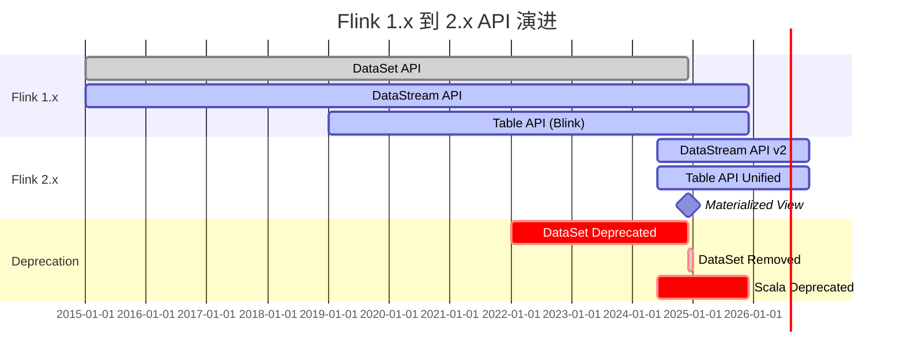
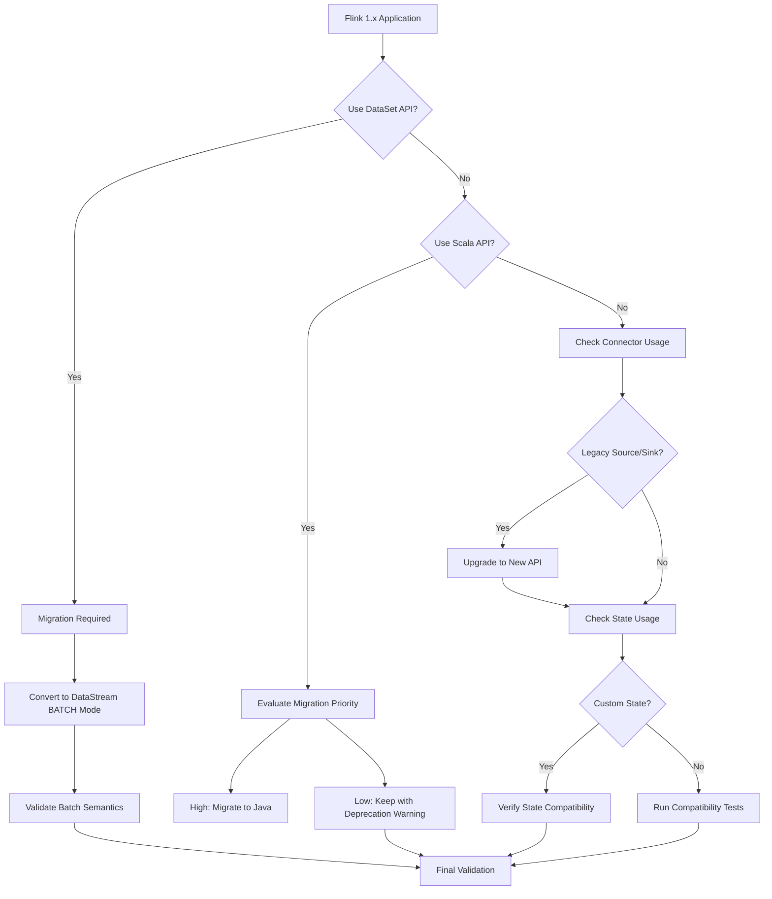
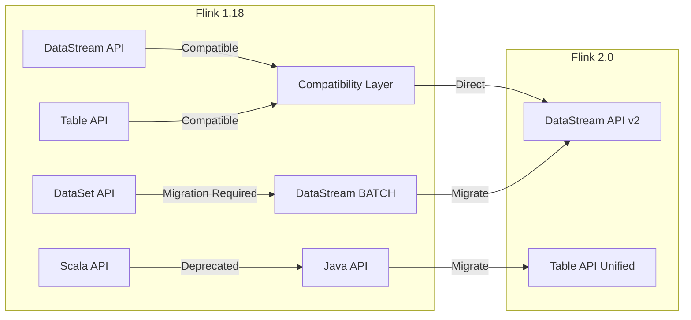

# Flink 1.x 到 2.x 迁移指南

> 所属阶段: Knowledge/05-mapping-guides/migration-guides | 前置依赖: [Flink 2.0 Release Notes](https://nightlies.apache.org/flink/flink-docs-release-2.0/release-notes/flink-2.0/), [Flink 1.20 Migration Guide](https://nightlies.apache.org/flink/flink-docs-stable/docs/dev/datastream/upgrading/) | 形式化等级: L4

## 1. 概念定义 (Definitions)

### Def-K-05-04-01: Flink 1.x 架构模型

Flink 1.x 采用经典 DataStream API 与批流统一（批作为流特例）：

$$
\text{Flink-1.x} = \{ \text{DataSet API}, \text{DataStream API}, \text{Table API/SQL} \}
$$

### Def-K-05-04-02: Flink 2.x 架构演进

Flink 2.x 进一步统一批流处理，引入 **Materialized View** 语义和增强的声明式 API：

$$
\text{Flink-2.x} = \{ \text{DataStream API (v2)}, \text{Table API/SQL (增强)}, \text{Materialized View} \}
$$

### Def-K-05-04-03: 主要弃用与移除组件

| 组件 | Flink 1.x | Flink 2.x | 替代方案 |
|------|-----------|-----------|---------|
| DataSet API | 支持 | 移除 | DataStream (BATCH 模式) |
| Scala API | 支持 | 弃用 | Java API / Table API |
| Legacy Sources | 支持 | 移除 | New Source Interface |
| Legacy Sinks | 支持 | 移除 | New Sink Interface |
| Savepoint V1 | 支持 | 移除 | Savepoint V2 |
| Flink Shaded | 支持 | 结构变更 | 直接依赖管理 |

## 2. 属性推导 (Properties)

### Prop-K-05-04-01: API 兼容性保证

Flink 2.x 保持 **DataStream API** 核心向后兼容：

$$
\forall \text{API}_{core} \in \text{Flink-1.x}, \exists \text{API}_{compat} \in \text{Flink-2.x}
$$

### Prop-K-05-04-02: 状态迁移完备性

Savepoint V2 支持从 V1 迁移：

$$
\text{Savepoint}_{V1} \xrightarrow{\text{upgrade}} \text{Savepoint}_{V2}
$$

### Lemma-K-05-04-01: 配置迁移规则

大部分配置保持兼容，部分废弃配置自动映射：

```
flink-conf.yaml 1.x → flink-conf.yaml 2.x
- parallelism.default (保持)
- state.backend (保持)
- taskmanager.memory.fraction → taskmanager.memory.network.fraction
```

## 3. 关系建立 (Relations)

### 3.1 API 变更映射

| Flink 1.x | Flink 2.x | 变更类型 |
|-----------|-----------|---------|
| `ExecutionEnvironment` | `StreamExecutionEnvironment` | 统一 |
| `DataSet<T>` | `DataStream<T> + ExecutionMode.BATCH` | 语义迁移 |
| `DataStream.setParallelism()` | 保持 | 兼容 |
| `TableEnvironment` | `StreamTableEnvironment` (推荐) | 增强 |
| `StreamExecutionEnvironment.execute()` | 保持 (返回 JobClient) | 增强 |

### 3.2 Connector API 变更

**Source 接口迁移**:

```java
// Flink 1.x - 旧 Source 接口
public class OldSource implements SourceFunction<String> {
    private volatile boolean isRunning = true;

    @Override
    public void run(SourceContext<String> ctx) {
        while (isRunning) {
            ctx.collect(generateData());
        }
    }

    @Override
    public void cancel() {
        isRunning = false;
    }
}

// Flink 2.x - 新 Source 接口
public class NewSource implements Source<String, MySplit, MyEnumeratorState> {
    @Override
    public Boundedness getBoundedness() {
        return Boundedness.CONTINUOUS_UNBOUNDED;
    }

    @Override
    public SourceReader<String, MySplit> createReader(SourceReaderContext readerContext) {
        return new MySourceReader(readerContext);
    }

    @Override
    public SplitEnumerator<MySplit, MyEnumeratorState> createEnumerator(
            SplitEnumeratorContext<MySplit> enumContext) {
        return new MySplitEnumerator(enumContext);
    }
}
```

**Sink 接口迁移**:

```java
// Flink 1.x - 旧 Sink
public class OldSink implements SinkFunction<String> {
    @Override
    public void invoke(String value, Context context) {
        sendToExternalSystem(value);
    }
}

// Flink 2.x - 新 Sink (两阶段提交)
public class NewSink implements TwoPhaseCommittingSink<String, MyTransaction> {
    @Override
    public PrecommittingSinkWriter<String, MyTransaction> createWriter(InitContext context) {
        return new MySinkWriter();
    }

    @Override
    public Committer<MyTransaction> createCommitter() {
        return new MyCommitter();
    }
}
```

### 3.3 状态 API 变更

```java

// [伪代码片段 - 不可直接运行] 仅展示核心逻辑
import org.apache.flink.api.common.state.ValueState;
import org.apache.flink.api.common.state.ValueStateDescriptor;
import org.apache.flink.streaming.api.windowing.time.Time;

// Flink 1.x - 旧 State API
ValueStateDescriptor<Long> descriptor = new ValueStateDescriptor<>(
    "count",  // state name
    Long.class  // type
);
ValueState<Long> state = getRuntimeContext().getState(descriptor);

// Flink 2.x - 增强 State API
ValueStateDescriptor<Long> descriptor = new ValueStateDescriptor<>(
    "count",
    TypeInformation.of(Long.class)
);
// 新增 TTL 配置
StateTtlConfig ttlConfig = StateTtlConfig
    .newBuilder(Time.hours(1))
    .setUpdateType(OnCreateAndWrite)
    .setStateVisibility(NeverReturnExpired)
    .cleanupIncrementally(10, true)
    .build();
descriptor.enableTimeToLive(ttlConfig);

ValueState<Long> state = getRuntimeContext().getState(descriptor);
```

## 4. 论证过程 (Argumentation)

### 4.1 DataSet API 移除影响分析

**受影响场景**:

1. **批处理作业**: 需迁移至 DataStream BATCH 模式
2. **迭代计算**: 需使用 DataStream 迭代 API
3. **机器学习**: FlinkML 需适配新版本

**迁移策略**:

```java

// [伪代码片段 - 不可直接运行] 仅展示核心逻辑
import org.apache.flink.streaming.api.environment.StreamExecutionEnvironment;
import org.apache.flink.streaming.api.datastream.DataStream;

// Flink 1.x - DataSet API
ExecutionEnvironment env = ExecutionEnvironment.getExecutionEnvironment();
DataSet<String> dataset = env.readTextFile("input.txt");
DataSet<Tuple2<String, Integer>> counts = dataset
    .flatMap(new Tokenizer())
    .groupBy(0)
    .sum(1);
counts.writeAsText("output.txt");
env.execute();

// Flink 2.x - DataStream BATCH 模式
StreamExecutionEnvironment env =
    StreamExecutionEnvironment.getExecutionEnvironment();
env.setRuntimeMode(RuntimeExecutionMode.BATCH);

DataStream<String> stream = env.readTextFile("input.txt");
DataStream<Tuple2<String, Integer>> counts = stream
    .flatMap(new Tokenizer())
    .keyBy(value -> value.f0)
    .sum(1);
counts.sinkTo(FileSink.forRowFormat(...).build());
env.execute();
```

### 4.2 Scala API 弃用影响

**变更说明**: Flink 2.x 中 Scala API 标记为弃用，推荐使用 Java API 或 Table API。

**迁移选项**:

1. **保留 Scala 代码**: 继续使用（弃用但可用）
2. **迁移至 Java**: 重写为 Java API
3. **迁移至 Table API**: 使用 SQL 风格的声明式 API

### 4.3 部署配置变更

**内存配置**:

| Flink 1.x 配置 | Flink 2.x 配置 | 说明 |
|---------------|---------------|------|
| `taskmanager.memory.fraction` | `taskmanager.memory.network.fraction` | 重命名 |
| `taskmanager.memory.preallocate` | 移除 | 自动管理 |
| `taskmanager.network.memory.min/max` | `taskmanager.memory.network.min/max` | 命名空间调整 |

**Checkpoint 配置**:

```yaml
# Flink 1.x state.backend: rocksdb
state.backend.incremental: true
state.checkpoints.dir: hdfs:///checkpoints

# Flink 2.x (保持兼容,新增选项)
state.backend: rocksdb
state.backend.incremental: true
state.checkpoints.dir: hdfs:///checkpoints
state.checkpoint-storage: filesystem  # 新增
execution.checkpointing.unaligned: true  # 新增
```

## 5. 形式证明 / 工程论证 (Proof / Engineering Argument)

### 定理 Thm-K-05-04-01: 语义等价迁移完备性

**定理**: 对于使用 Flink 1.x DataStream API 的任意作业 $J_{1.x}$，存在 Flink 2.x 作业 $J_{2.x}$ 满足：

$$
\text{semantics}(J_{1.x}) = \text{semantics}(J_{2.x})
$$

**证明**:

1. **Source 等价**: 新 Source 接口提供完整功能超集，旧 Source 可通过适配器迁移。

2. **Transformation 等价**: DataStream 核心转换（map/filter/flatMap/keyBy/window）保持 API 不变。

3. **Sink 等价**: 新 Sink 接口支持两阶段提交，提供 Exactly-Once 语义超集。

4. **State 等价**: ValueState/MapState/ListState API 保持兼容，新增 TTL 等增强功能。

5. **Checkpoint 等价**: Savepoint V2 保持与 V1 兼容，支持状态迁移。

### 工程论证: 迁移风险评估

**低风险变更** (直接兼容):

- DataStream 核心 API
- 基本窗口操作
- Checkpoint 配置

**中风险变更** (需配置调整):

- 连接器升级 (Source/Sink)
- 状态 TTL 配置
- 内存参数调整

**高风险变更** (需代码重写):

- DataSet API 使用
- Scala API 深度集成
- 自定义序列化器

## 6. 实例验证 (Examples)

### 6.1 Maven 依赖迁移

**Flink 1.x**:

```xml
<properties>
    <flink.version>1.18.0</flink.version>
</properties>

<dependencies>
    <dependency>
        <groupId>org.apache.flink</groupId>
        <artifactId>flink-streaming-java</artifactId>
        <version>${flink.version}</version>
    </dependency>
    <dependency>
        <groupId>org.apache.flink</groupId>
        <artifactId>flink-connector-kafka</artifactId>
        <version>3.0.2-1.18</version>
    </dependency>
</dependencies>
```

**Flink 2.x**:

```xml
<properties>
    <flink.version>2.0.0</flink.version>
</properties>

<dependencies>
    <dependency>
        <groupId>org.apache.flink</groupId>
        <artifactId>flink-streaming-java</artifactId>
        <version>${flink.version}</version>
    </dependency>
    <!-- Connector 版本与 Flink 版本解耦 -->
    <dependency>
        <groupId>org.apache.flink</groupId>
        <artifactId>flink-connector-kafka</artifactId>
        <version>3.1.0-1.18</version>
    </dependency>
    <!-- 新增推荐依赖 -->
    <dependency>
        <groupId>org.apache.flink</groupId>
        <artifactId>flink-clients</artifactId>
        <version>${flink.version}</version>
    </dependency>
</dependencies>
```

### 6.2 Kafka Connector 迁移

**Flink 1.x - 旧 Kafka Consumer**:

```java
// [伪代码片段 - 不可直接运行] 仅展示核心逻辑
// 旧 API (已废弃)
FlinkKafkaConsumer<String> consumer = new FlinkKafkaConsumer<>(
    "input-topic",
    new SimpleStringSchema(),
    properties
);
consumer.setStartFromLatest();

stream.addSource(consumer);
```

**Flink 2.x - 新 Kafka Source**:

```java

// [伪代码片段 - 不可直接运行] 仅展示核心逻辑
import org.apache.flink.streaming.api.datastream.DataStream;

// 新 API
KafkaSource<String> source = KafkaSource.<String>builder()
    .setBootstrapServers("kafka:9092")
    .setTopics("input-topic")
    .setGroupId("flink-group")
    .setStartingOffsets(OffsetsInitializer.latest())
    .setValueOnlyDeserializer(new SimpleStringSchema())
    .build();

DataStream<String> stream = env.fromSource(
    source,
    WatermarkStrategy.noWatermarks(),
    "Kafka Source"
);
```

### 6.3 Kafka Producer 迁移

**Flink 1.x - 旧 Kafka Producer**:

```java
// [伪代码片段 - 不可直接运行] 仅展示核心逻辑
// 旧 API (已废弃)
FlinkKafkaProducer<String> producer = new FlinkKafkaProducer<>(
    "output-topic",
    new SimpleStringSchema(),
    properties
);
producer.setWriteTimestampToKafka(true);

stream.addSink(producer);
```

**Flink 2.x - 新 Kafka Sink**:

```java
// [伪代码片段 - 不可直接运行] 仅展示核心逻辑
// 新 API
KafkaSink<String> sink = KafkaSink.<String>builder()
    .setBootstrapServers("kafka:9092")
    .setRecordSerializer(KafkaRecordSerializationSchema.builder()
        .setTopic("output-topic")
        .setValueSerializationSchema(new SimpleStringSchema())
        .build())
    .setDeliveryGuarantee(DeliveryGuarantee.AT_LEAST_ONCE)
    .build();

stream.sinkTo(sink);
```

### 6.4 Table API 迁移

**Flink 1.x**:

```java

// [伪代码片段 - 不可直接运行] 仅展示核心逻辑
import org.apache.flink.table.api.TableEnvironment;

// 旧 Table API
EnvironmentSettings settings = EnvironmentSettings
    .newInstance()
    .useBlinkPlanner()
    .inStreamingMode()
    .build();

TableEnvironment tableEnv = TableEnvironment.create(settings);

tableEnv.executeSql("CREATE TABLE input_table (...) WITH (...)");
tableEnv.executeSql("CREATE TABLE output_table (...) WITH (...)");

tableEnv.executeSql("INSERT INTO output_table SELECT * FROM input_table");
```

**Flink 2.x**:

```java

// [伪代码片段 - 不可直接运行] 仅展示核心逻辑
import org.apache.flink.streaming.api.datastream.DataStream;
import org.apache.flink.table.api.TableEnvironment;

// 新 Table API (Blink Planner 已成为默认)
EnvironmentSettings settings = EnvironmentSettings
    .newInstance()
    .inStreamingMode()
    .build();

StreamTableEnvironment tableEnv = StreamTableEnvironment.create(env, settings);

// 新增: 更好的 DataStream-Table 互操作
tableEnv.createTemporaryView("input_table", dataStream);
DataStream<Row> result = tableEnv.toDataStream(tableEnv.sqlQuery("SELECT * FROM input_table"));
```

### 6.5 状态 TTL 配置迁移

**Flink 1.x**:

```java

// [伪代码片段 - 不可直接运行] 仅展示核心逻辑
import org.apache.flink.streaming.api.windowing.time.Time;

ValueStateDescriptor<Long> descriptor = new ValueStateDescriptor<>("count", Long.class);

// 基础 TTL 配置
StateTtlConfig ttlConfig = StateTtlConfig
    .newBuilder(Time.hours(24))
    .setUpdateType(OnCreateAndWrite)
    .setStateVisibility(NeverReturnExpired)
    .build();

descriptor.enableTimeToLive(ttlConfig);
```

**Flink 2.x**:

```java

// [伪代码片段 - 不可直接运行] 仅展示核心逻辑
import org.apache.flink.streaming.api.windowing.time.Time;

ValueStateDescriptor<Long> descriptor = new ValueStateDescriptor<>("count", Long.class);

// 增强 TTL 配置
StateTtlConfig ttlConfig = StateTtlConfig
    .newBuilder(Time.hours(24))
    .setUpdateType(OnCreateAndWrite)
    .setStateVisibility(NeverReturnExpired)
    // 新增: 增量清理策略
    .cleanupIncrementally(10, true)
    // 新增: RocksDB 压缩清理
    .cleanupInRocksdbCompactFilter(1000)
    .build();

descriptor.enableTimeToLive(ttlConfig);
```

## 7. 可视化 (Visualizations)

### 7.1 API 演进路线图



### 7.2 迁移决策树



### 7.3 组件兼容性矩阵



## 8. 常见问题 (FAQ)

### Q1: DataSet API 作业如何批量迁移？

**A**: 使用官方迁移脚本和检查清单：

```bash
# 1. 识别 DataSet 使用 grep -r "ExecutionEnvironment.getExecutionEnvironment" src/
grep -r "DataSet<" src/

# 2. 替换为 DataStream BATCH
# ExecutionEnvironment → StreamExecutionEnvironment
# DataSet → DataStream
# env.execute() → env.execute()

# 3. 验证批处理语义
# 确保使用 RuntimeExecutionMode.BATCH
```

### Q2: Savepoint 如何从 V1 迁移到 V2？

**A**: Flink 2.x 支持 Savepoint 升级：

```bash
# 从 1.x 作业创建 Savepoint flink-1.x/bin/flink savepoint <job-id> hdfs:///savepoints/v1

# 升级到 2.x 后恢复(自动升级)
flink-2.x/bin/flink run -s hdfs:///savepoints/v1 <job-jar>
```

### Q3: Scala API 弃用后如何继续维护 Scala 代码？

**A**: 三种策略：

1. **短期**: 继续使用（带弃用警告）
2. **中期**: 迁移至 Java API，使用 Lombok 减少样板代码
3. **长期**: 迁移至 Table API/SQL，获得声明式编程优势

### Q4: 自定义序列化器是否需要修改？

**A**: TypeSerializer 接口保持兼容，但建议迁移到 TypeSerializerSnapshot：

```java
// Flink 2.x 推荐方式
public class MySerializerSnapshot implements TypeSerializerSnapshot<MyType> {
    @Override
    public int getCurrentVersion() {
        return 1;
    }

    @Override
    public void writeSnapshot(DataOutputView out) throws IOException {
        // 序列化配置
    }

    @Override
    public void readSnapshot(int readVersion, DataInputView in, ClassLoader userCodeClassLoader)
            throws IOException {
        // 反序列化配置
    }

    @Override
    public TypeSerializer<MyType> restoreSerializer() {
        return new MySerializer(config);
    }
}
```

## 9. 性能优化新特性

| 特性 | Flink 1.x | Flink 2.x | 优化效果 |
|------|-----------|-----------|---------|
| 批量执行模式 | 有限 | 完整 | 批处理性能提升 30%+ |
| 自适应调度 | 实验性 | 稳定 | 动态资源调整 |
| SQL 优化器 | Blink | 增强 | 查询性能提升 |
| State 访问 | 基础 | 异步 | 高并发场景延迟降低 |
| 网络缓冲 | 静态 | 动态 | 内存效率提升 |
| 检查点增量 | 支持 | 优化 | 大状态检查点加速 |

## 10. 引用参考 (References)
