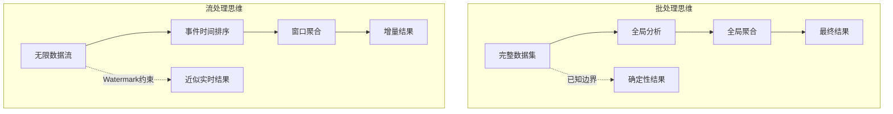
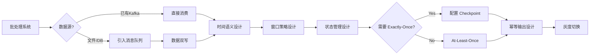
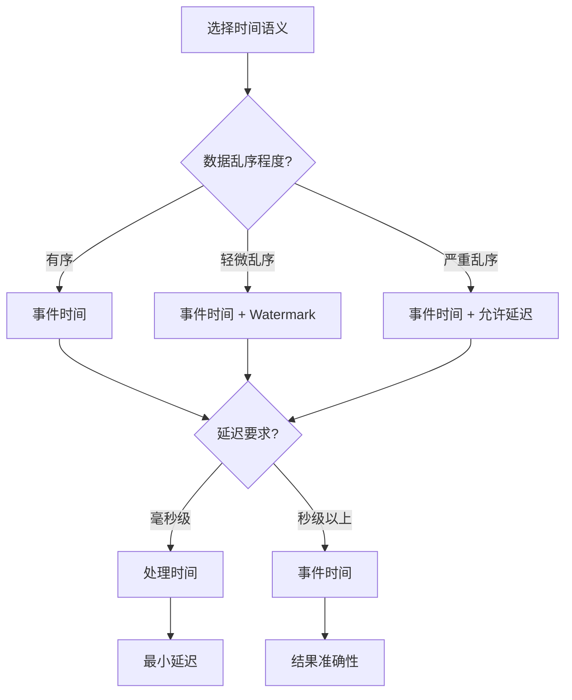
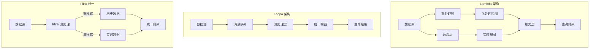

# 批处理到流处理迁移指南

> 所属阶段: Knowledge/05-mapping-guides/migration-guides | 前置依赖: [Flink DataStream API](Flink/03-api/09-language-foundations/flink-datastream-api-complete-guide.md), [Time Semantics](Flink/02-core/time-semantics-and-watermark.md) | 形式化等级: L3

## 1. 概念定义 (Definitions)

### Def-K-05-05-01: 批处理计算模型

批处理遵循 **有界数据集** 计算模型：

$$
\text{Batch}(T) = \{ e_1, e_2, ..., e_n \}, \quad n < \infty, \forall i, e_i \in T
$$

关键特性：

- 数据完整性已知
- 全局排序/聚合可行
- 失败重启成本低
- 延迟以分钟/小时为单位

### Def-K-05-05-02: 流处理计算模型

流处理遵循 **无界数据流** 计算模型：

$$
\text{Stream}(T) = \{ e_i \}_{i=0}^{\infty}, \quad t(e_i) \in \mathbb{R}^+
$$

关键特性：

- 数据无限到达
- 需时间窗口约束计算
- 持续运行要求容错
- 延迟以毫秒/秒为单位

### Def-K-05-05-03: Lambda 与 Kappa 架构

**Lambda 架构** (批流分离):

$$
\text{Query} = f(\text{BatchView}) \bowtie g(\text{RealtimeView})
$$

**Kappa 架构** (批流统一):

$$
\text{Query} = h(\text{StreamProcessing})
$$

### Def-K-05-05-04: 时间语义类型

| 时间类型 | 定义 | 批处理等价 | 流处理应用 |
|---------|------|-----------|-----------|
| 事件时间 (Event Time) | 数据产生时间 | 数据本身时间戳 | 乱序处理 |
| 摄入时间 (Ingestion Time) | 进入系统时间 | 加载时间 | 近似有序 |
| 处理时间 (Processing Time) | 处理时刻 | 当前时间 | 低延迟场景 |

## 2. 属性推导 (Properties)

### Prop-K-05-05-01: 批流语义等价条件

当满足以下条件时，批处理结果与流处理结果一致：

$$
\text{BatchResult} = \text{StreamResult} \iff \forall W, \text{StreamWindow}(W) = \text{BatchPartition}(W)
$$

其中 $W$ 为时间窗口或数据分区。

### Prop-K-05-05-02: 状态需求推导

批处理无状态是因为：

$$
\text{State}_{batch} = \emptyset \quad \because \quad \text{DataComplete} \land \text{RestartFromBeginning}
$$

流处理需要状态：

$$
\text{State}_{stream} \neq \emptyset \quad \because \quad \text{DataInfinite} \land \text{IncrementalComputation}
$$

### Lemma-K-05-05-01: 窗口化批处理等价性

批处理的 `GROUP BY` 等价于流处理的窗口聚合：

$$
\text{SQL: GROUP BY key} \equiv \text{Flink: keyBy(key).window(GlobalWindows)}
$$

## 3. 关系建立 (Relations)

### 3.1 思维模型转换

| 批处理思维 | 流处理思维 | 实现方式 |
|-----------|-----------|---------|
| 完整数据集 | 无限数据流 | 无边界的输入 |
| 全局排序 | 事件时间排序 | Watermark + Timestamp |
| 全局聚合 | 窗口聚合 | Tumbling/Sliding/Session Window |
| 笛卡尔积 | Interval Join | 时间范围 Join |
| 去重 (DISTINCT) | 去重状态 | 状态 + TTL |
| 最终一致性 | 增量一致性 | Checkpoint + State |

### 3.2 SQL 语义映射

```sql
-- 批处理 SQL
SELECT
    user_id,
    COUNT(*) as order_count,
    SUM(amount) as total_amount
FROM orders
WHERE order_date >= '2024-01-01'
GROUP BY user_id
ORDER BY total_amount DESC;
```

```java
// Flink 流处理等价实现
stream.filter(order -> order.getOrderDate().isAfter(LocalDate.of(2024, 1, 1)))
    .keyBy(Order::getUserId)
    .window(TumblingEventTimeWindows.of(Time.days(1)))
    .aggregate(new AggregateFunction<Order, OrderAcc, OrderResult>() {
        @Override
        public OrderAcc createAccumulator() {
            return new OrderAcc();
        }

        @Override
        public OrderAcc add(Order value, OrderAcc accumulator) {
            accumulator.count++;
            accumulator.totalAmount += value.getAmount();
            return accumulator;
        }

        @Override
        public OrderResult getResult(OrderAcc accumulator) {
            return new OrderResult(accumulator.count, accumulator.totalAmount);
        }
    });
```

### 3.3 批处理算子映射

| 批处理 | 流处理 | Flink API |
|--------|--------|-----------|
| Map | Map | `.map()` |
| Filter | Filter | `.filter()` |
| FlatMap | FlatMap | `.flatMap()` |
| Reduce | Windowed Reduce | `.window().reduce()` |
| GroupBy | KeyBy + Window | `.keyBy().window()` |
| Sort | Windowed Sort | `.window().process()` |
| Join | Interval Join | `.intervalJoin()` |
| Union | Union | `.union()` |
| Distinct | State + Filter | `.keyBy().process()` |
| Partition | Custom Partition | `.partitionCustom()` |

## 4. 论证过程 (Argumentation)

### 4.1 数据完整性假设变化

**批处理假设**:

```
∀数据 ∈ 数据集, 处理前已知
处理可以等待数据全部到达
失败可从头重新计算
```

**流处理假设**:

```
∀数据 ∈ 流, 处理时到达
无法等待"全部"数据
需增量计算和容错
```

**迁移策略**: 引入 Watermark 处理乱序和延迟数据：

```java
WatermarkStrategy<Event> strategy = WatermarkStrategy
    .<Event>forBoundedOutOfOrderness(Duration.ofMinutes(5))
    .withTimestampAssigner((event, timestamp) -> event.getEventTime());

stream.assignTimestampsAndWatermarks(strategy);
```

### 4.2 状态管理引入

**批处理无状态设计**:

```java
// 批处理 - 每次读取完整数据
List<Data> allData = readAllData();
Map<Key, Result> result = allData.stream()
    .collect(Collectors.groupingBy(Data::getKey, summarizing()));
```

**流处理有状态设计**:

```java
// 流处理 - 增量更新状态
public class StatefulFunction extends KeyedProcessFunction<Key, Data, Result> {
    private ValueState<Result> state;

    @Override
    public void processElement(Data data, Context ctx, Collector<Result> out) {
        Result current = state.value();
        if (current == null) {
            current = new Result();
        }
        current.update(data);
        state.update(current);
        out.collect(current);
    }
}
```

### 4.3 时间语义引入

**批处理时间处理**:

```java
// 批处理 - 数据到达即处理，时间即处理时间
for (Record record : batchData) {
    process(record);  // 使用系统当前时间
}
```

**流处理时间处理**:

```java
// 流处理 - 显式时间语义
stream.assignTimestampsAndWatermarks(
    WatermarkStrategy.<Record>forBoundedOutOfOrderness(Duration.ofSeconds(10))
        .withTimestampAssigner((record, ts) -> record.getEventTime())
)
.keyBy(Record::getKey)
.window(TumblingEventTimeWindows.of(Time.minutes(1)))
.process(new TimeWindowFunction());
```

## 5. 形式证明 / 工程论证 (Proof / Engineering Argument)

### 定理 Thm-K-05-05-01: 批流到流迁移的语义保持

**定理**: 对于任意批处理作业 $B$，存在流处理作业 $S$，使得对于所有有限输入数据集 $D_{finite}$：

$$
\text{Result}(B, D_{finite}) = \text{Result}(S, D_{finite} \oplus \text{EOS})
$$

其中 $\oplus \text{EOS}$ 表示添加流结束标记。

**证明**:

1. **有界流模拟**: 将有限数据集作为有界流输入，流处理结果与批处理一致。

2. **窗口语义**: 全局聚合可通过 `GlobalWindows` + 触发器实现批处理语义。

3. **时间窗口**: 时间范围分区的批处理等价于时间窗口的流处理。

4. **状态等效**: 批处理的内存聚合状态等价于流处理的 KeyedState。

### 工程论证: 迁移风险评估

**低风险迁移** (直接映射):

- 逐行转换（Map/Filter/FlatMap）
- 简单聚合（COUNT/SUM）
- 单表处理

**中风险迁移** (需语义调整):

- 多表 Join（需时间范围）
- 全局排序（需窗口化）
- 去重（需状态管理）

**高风险迁移** (需架构调整):

- 迭代计算（需自定义逻辑）
- 复杂图算法
- 大量Shuffle操作

## 6. 实例验证 (Examples)

### 6.1 简单 ETL 迁移

**批处理** (Spark):

```scala
// 读取、转换、写入
val df = spark.read.parquet("input/")
val result = df
    .filter(col("status") === "active")
    .withColumn("processed_time", current_timestamp())
    .select("id", "name", "processed_time")
result.write.parquet("output/")
```

**流处理** (Flink):

```java
// Source
DataStream<Row> stream = env.fromSource(
    new ParquetSource("input/"),
    WatermarkStrategy.noWatermarks(),
    "Parquet Source"
);

// 转换
DataStream<Row> result = stream
    .filter(row -> "active".equals(row.getField("status")))
    .map(row -> {
        Row newRow = new Row(3);
        newRow.setField(0, row.getField("id"));
        newRow.setField(1, row.getField("name"));
        newRow.setField(2, Instant.now());
        return newRow;
    });

// Sink
result.sinkTo(new ParquetSink("output/"));
```

### 6.2 聚合计算迁移

**批处理 SQL**:

```sql
SELECT
    product_id,
    AVG(price) as avg_price,
    MAX(price) as max_price,
    COUNT(*) as count
FROM sales
GROUP BY product_id;
```

**流处理实现**:

```java
DataStream<Sale> sales = ...;

DataStream<ProductStats> stats = sales
    .keyBy(Sale::getProductId)
    .window(TumblingEventTimeWindows.of(Time.hours(1)))  // 引入时间窗口
    .aggregate(new AggregateFunction<Sale, Acc, ProductStats>() {
        @Override
        public Acc createAccumulator() {
            return new Acc();
        }

        @Override
        public Acc add(Sale sale, Acc acc) {
            acc.sum += sale.getPrice();
            acc.max = Math.max(acc.max, sale.getPrice());
            acc.count++;
            return acc;
        }

        @Override
        public ProductStats getResult(Acc acc) {
            return new ProductStats(
                acc.sum / acc.count,
                acc.max,
                acc.count
            );
        }
    });
```

### 6.3 Join 操作迁移

**批处理 Join**:

```sql
SELECT o.*, c.name as customer_name
FROM orders o
JOIN customers c ON o.customer_id = c.id;
```

**流处理 Interval Join**:

```java
// 订单流
DataStream<Order> orders = ...;
// 客户流（假设为缓慢变化维度）
DataStream<Customer> customers = ...;

// 区间 Join（订单事件前后5分钟内的客户信息）
DataStream<EnrichedOrder> enrichedOrders = orders
    .keyBy(Order::getCustomerId)
    .intervalJoin(customers.keyBy(Customer::getId))
    .between(Time.minutes(-5), Time.minutes(5))
    .process(new ProcessJoinFunction<Order, Customer, EnrichedOrder>() {
        @Override
        public void processElement(Order order, Customer customer, Context ctx, Collector<EnrichedOrder> out) {
            out.collect(new EnrichedOrder(order, customer));
        }
    });
```

**流处理 Broadcast Join（维度表）**:

```java
// 客户数据作为广播流（缓慢变化）
MapStateDescriptor<String, Customer> descriptor =
    new MapStateDescriptor<>("customers", String.class, Customer.class);
BroadcastStream<Customer> broadcastCustomers = customers.broadcast(descriptor);

// 订单流连接广播流
DataStream<EnrichedOrder> enriched = orders
    .connect(broadcastCustomers)
    .process(new BroadcastProcessFunction<Order, Customer, EnrichedOrder>() {
        @Override
        public void processElement(Order order, ReadOnlyContext ctx, Collector<EnrichedOrder> out) {
            Customer customer = ctx.getBroadcastState(descriptor).get(order.getCustomerId());
            out.collect(new EnrichedOrder(order, customer));
        }

        @Override
        public void processBroadcastElement(Customer customer, Context ctx, Collector<EnrichedOrder> out) {
            ctx.getBroadcastState(descriptor).put(customer.getId(), customer);
        }
    });
```

### 6.4 去重操作迁移

**批处理 Distinct**:

```sql
SELECT DISTINCT user_id, event_type
FROM events;
```

**流处理去重（状态 + TTL）**:

```java
public class DeduplicateFunction extends KeyedProcessFunction<String, Event, Event> {
    private ValueState<Boolean> seenState;

    @Override
    public void open(Configuration parameters) {
        ValueStateDescriptor<Boolean> descriptor = new ValueStateDescriptor<>(
            "seen",
            Types.BOOLEAN
        );

        // 状态 TTL：24小时后过期
        StateTtlConfig ttlConfig = StateTtlConfig
            .newBuilder(Time.hours(24))
            .setUpdateType(OnCreateAndWrite)
            .setStateVisibility(NeverReturnExpired)
            .build();
        descriptor.enableTimeToLive(ttlConfig);

        seenState = getRuntimeContext().getState(descriptor);
    }

    @Override
    public void processElement(Event event, Context ctx, Collector<Event> out) throws Exception {
        if (seenState.value() == null) {
            seenState.update(true);
            out.collect(event);
        }
        // 重复事件丢弃
    }
}

// 使用
stream.keyBy(e -> e.getUserId() + "_" + e.getEventType())
    .process(new DeduplicateFunction());
```

### 6.5 窗口化 Top-N 迁移

**批处理 Top-N**:

```sql
SELECT category, product_id, sales_amount
FROM (
    SELECT *,
        ROW_NUMBER() OVER (PARTITION BY category ORDER BY sales_amount DESC) as rank
    FROM product_sales
) t
WHERE rank <= 10;
```

**流处理实现**:

```java
// 使用 ProcessWindowFunction 实现窗口内 Top-N
public class TopNFunction extends ProcessWindowFunction<
    ProductSale, List<ProductSale>, String, TimeWindow> {

    private int n;

    public TopNFunction(int n) {
        this.n = n;
    }

    @Override
    public void process(String category, Context context, Iterable<ProductSale> elements,
            Collector<List<ProductSale>> out) {

        PriorityQueue<ProductSale> topN = new PriorityQueue<>(
            n,
            Comparator.comparing(ProductSale::getSalesAmount)
        );

        for (ProductSale sale : elements) {
            topN.offer(sale);
            if (topN.size() > n) {
                topN.poll();
            }
        }

        List<ProductSale> result = new ArrayList<>(topN);
        result.sort(Comparator.comparing(ProductSale::getSalesAmount).reversed());
        out.collect(result);
    }
}

// 使用
stream.keyBy(ProductSale::getCategory)
    .window(TumblingEventTimeWindows.of(Time.hours(1)))
    .process(new TopNFunction(10));
```

## 7. 可视化 (Visualizations)

### 7.1 批流思维对比



### 7.2 迁移路线图



### 7.3 时间语义决策树



### 7.4 Lambda vs Kappa 架构



## 8. 常见问题 (FAQ)

### Q1: 如何处理批处理中的全局排序？

**A**: 流处理中需使用窗口约束：

```java
// 批处理全局排序 -> 流处理窗口内排序
stream.keyBy(...)  // 分区键
    .window(TumblingEventTimeWindows.of(Time.hours(1)))
    .process(new SortWindowFunction());  // 窗口内排序
```

### Q2: 流处理如何保证与批处理相同的结果准确性？

**A**: 三层保障：

1. **Watermark 策略**: 处理乱序数据
2. **允许延迟**: 处理迟到数据
3. **Side Output**: 处理超时数据

```java
OutputTag<Event> lateDataTag = new OutputTag<Event>("late-data"){};

stream.assignTimestampsAndWatermarks(
    WatermarkStrategy.<Event>forBoundedOutOfOrderness(Duration.ofMinutes(5))
        .withIdleness(Duration.ofMinutes(10))
)
.keyBy(Event::getKey)
.window(TumblingEventTimeWindows.of(Time.hours(1)))
.allowedLateness(Time.minutes(30))  // 允许30分钟延迟
.sideOutputLateData(lateDataTag)
.aggregate(...);
```

### Q3: 批处理中的大表 Join 如何迁移？

**A**: 三种策略：

1. **Interval Join**: 时间范围内关联
2. **Broadcast Join**: 小表广播
3. **Async I/O + Cache**: 异步查询外部存储

```java
// Async I/O 方案
AsyncDataStream.unorderedWait(
    stream,
    new AsyncFunction<Event, EnrichedEvent>() {
        @Override
        public void asyncInvoke(Event event, ResultFuture<EnrichedEvent> resultFuture) {
            // 异步查询外部存储（Redis/HBase）
            redisAsyncClient.get(event.getKey())
                .thenAccept(result -> resultFuture.complete(
                    Collections.singletonList(new EnrichedEvent(event, result))
                ));
        }
    },
    1000,  // 超时
    TimeUnit.MILLISECONDS,
    100    // 并发度
);
```

### Q4: 如何评估流处理资源需求？

**A**: 考虑因素：

```
资源需求 = 峰值吞吐量 × 状态大小 × Checkpoint频率 × 容错SLA

典型配置：
- 内存: 状态大小 × 2 + JVM 开销
- Checkpoint 间隔: 最大容忍延迟 / 2
- 并行度: 峰值吞吐量 / 单并行度处理能力
```

## 9. 性能对比与预期

| 指标 | 批处理 | 流处理 | 说明 |
|------|--------|--------|------|
| 延迟 | 分钟/小时 | 毫秒/秒 | 流处理实时性优势 |
| 吞吐量 | 高 | 高 | 相当 |
| 资源利用率 | 突发 | 平稳 | 流处理持续消耗 |
| 状态存储 | 无 | 有 | 流处理需状态后端 |
| 失败恢复 | 重新运行 | Checkpoint恢复 | 流处理更快 |
| 结果一致性 | 最终一致 | 增量一致 | 需 Watermark 对齐 |

## 10. 引用参考 (References)
