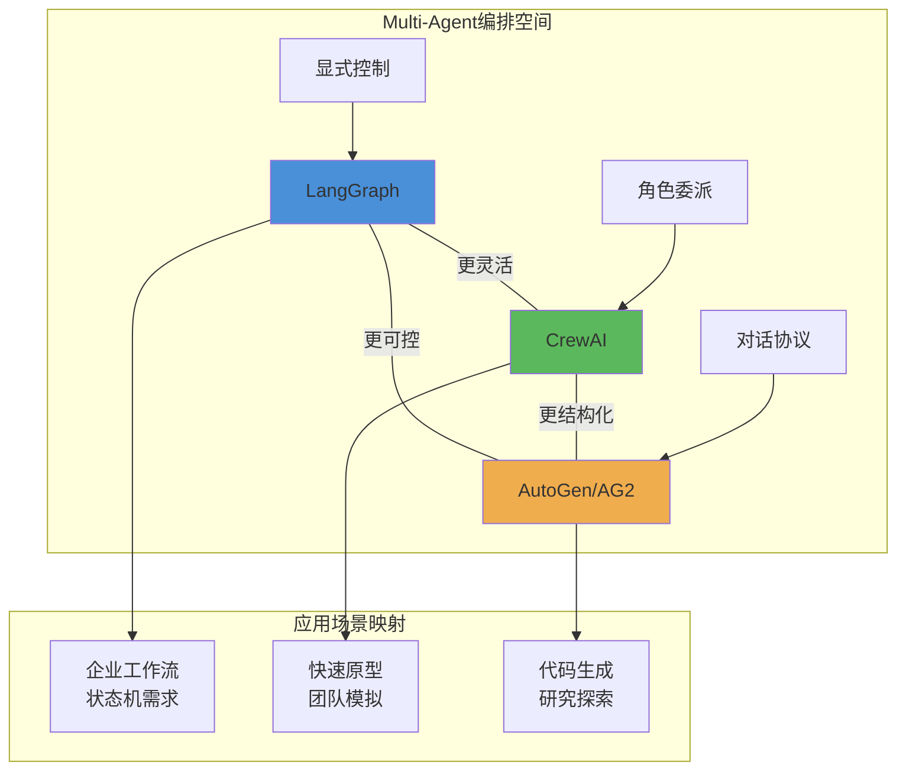
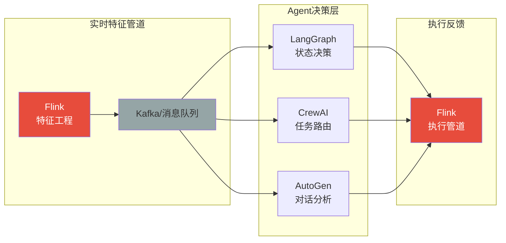
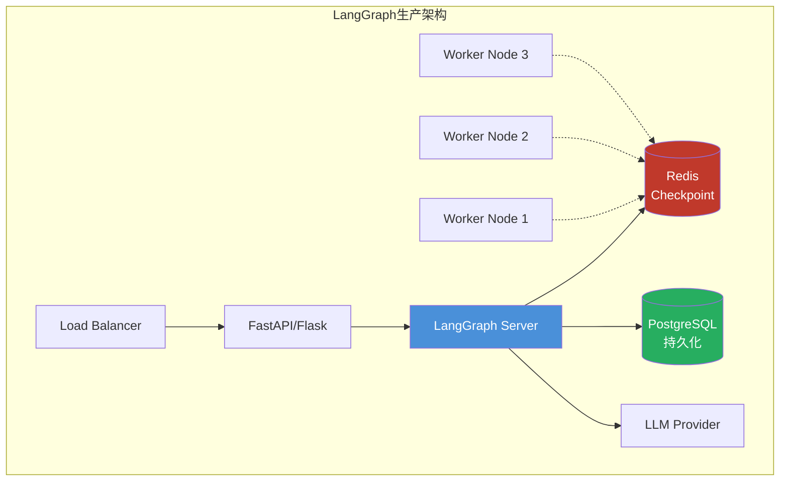
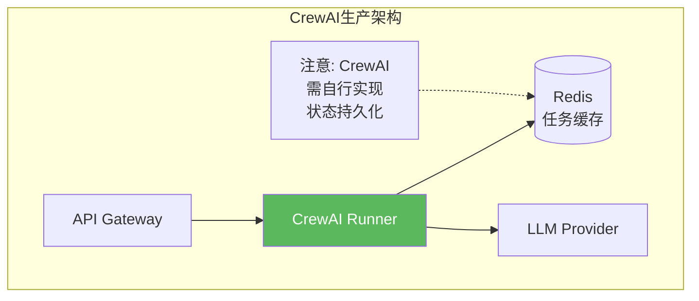
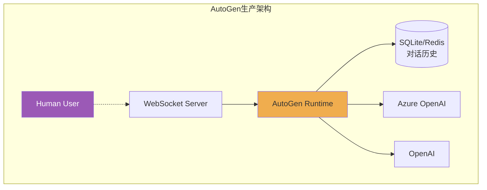
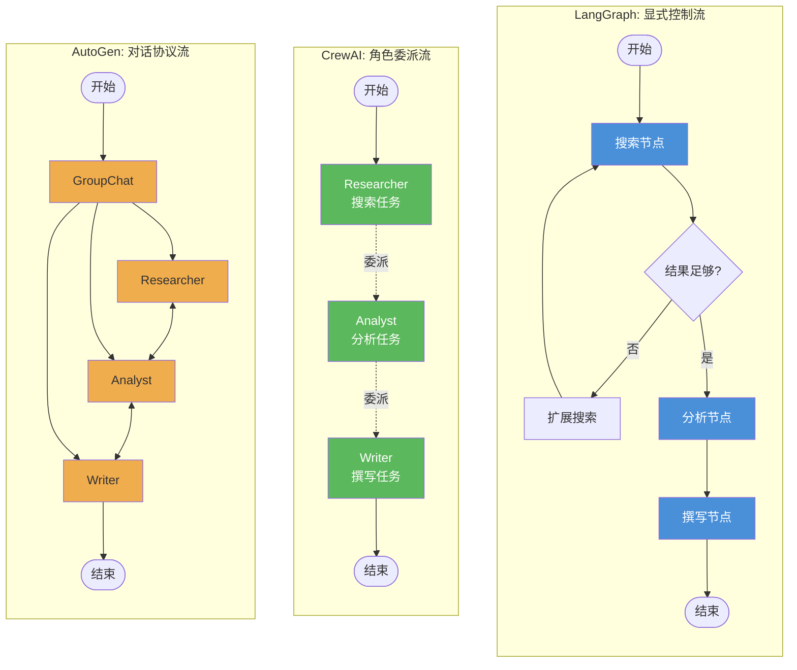
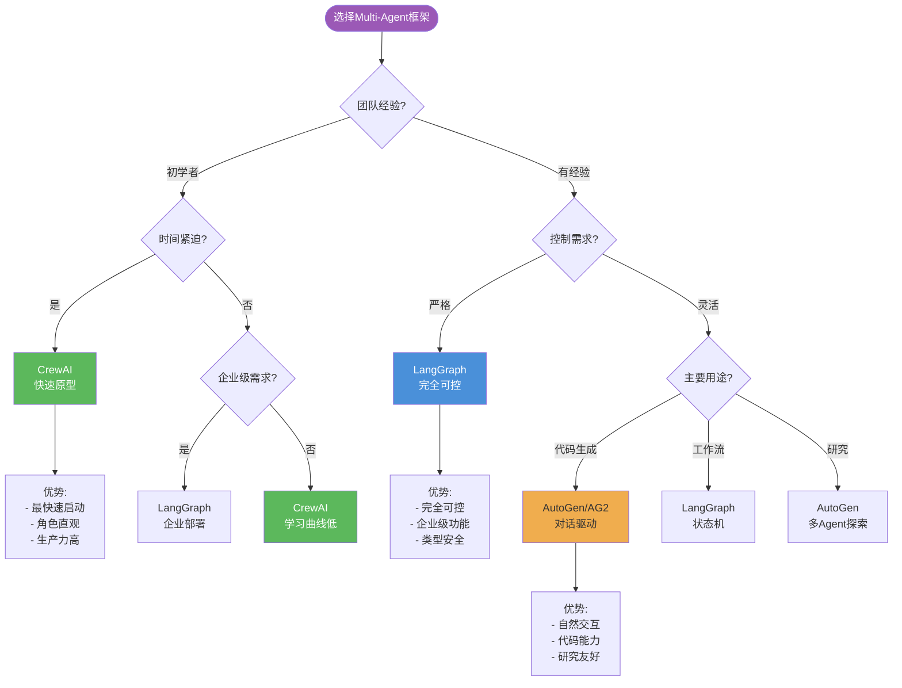

# 2026年多Agent编排框架深度对比：LangGraph、CrewAI、AutoGen

> **所属阶段**: Knowledge/05-mapping-guides | **前置依赖**: [04-technology-selection](../../04-technology-selection/) | **形式化等级**: L4 (工程分析+量化对比) | **更新日期**: 2026-04-02

---

## 1. 概念定义 (Definitions)

### 1.1 Multi-Agent编排核心概念

**Def-K-05-51: Multi-Agent系统 (MAS)**

一个Multi-Agent系统定义为一个四元组 $MAS = \langle \mathcal{A}, \mathcal{E}, \mathcal{C}, \mathcal{O} \rangle$，其中：

- $\mathcal{A} = \{A_1, A_2, ..., A_n\}$：Agent集合，每个 $A_i = \langle L_i, M_i, S_i, P_i \rangle$ 包含LLM接口 $L_i$、记忆模块 $M_i$、技能集 $S_i$、提示词模板 $P_i$
- $\mathcal{E}$：执行环境（同步/异步/事件驱动）
- $\mathcal{C}$：通信协议（消息传递/共享状态/函数调用）
- $\mathcal{O}$：编排策略（中心化/去中心化/混合）

**Def-K-05-52: Agent编排框架**

编排框架是管理Agent生命周期和交互的系统，形式化为：

$$\mathcal{F} = \langle \mathcal{G}, \mathcal{T}, \mathcal{S}, \mathcal{H} \rangle$$

其中：

- $\mathcal{G}$：控制图/流程定义（节点+边）
- $\mathcal{T}$：任务调度器（串行/并行/条件分支）
- $\mathcal{S}$：状态管理机制（瞬态/持久化/检查点）
- $\mathcal{H}$：人机协同接口

**Def-K-05-53: 编排模型分类**

| 模型类型 | 控制流特性 | 典型框架 |
|---------|-----------|---------|
| **显式控制流** | 开发者显式定义节点和边，完全可控 | LangGraph |
| **角色委派流** | 通过角色定义隐式推导执行顺序 | CrewAI |
| **对话协议流** | 基于自然语言对话的协商式路由 | AutoGen/AG2 |

---

### 1.2 三大框架核心定义

**LangGraph (LangChain Inc., 2024-2025)**

> 基于图状态机的Agent编排框架，核心理念是将Agent工作流建模为有向状态图。

```python
# LangGraph 核心抽象示意
from langgraph.graph import StateGraph, END

# Def-K-05-54: LangGraph状态机
# StateGraph<S>: 状态类型参数化的有向图
# Node: (S) -> S'  状态转换函数
# Edge: S -> {condition: Node} 条件路由
```

**CrewAI (João Moura, 2024-2025)**

> 角色驱动的Multi-Agent编排框架，强调"团队"概念和任务委派。

```python
# Def-K-05-55: CrewAI核心抽象
# Agent: 角色定义 + 目标 + 背景故事 + 工具集
# Task: 描述 + 上下文 + 输出格式 + 执行Agent
# Crew: 团队编排器，管理Agent间协作
# Process: sequential | hierarchical 执行模式
```

**AutoGen/AG2 (Microsoft Research, 2023-2025)**

> 对话驱动的Multi-Agent框架，通过自然语言对话实现Agent间协作，2025年更名为AG2。

```python
# Def-K-05-56: AutoGen核心抽象
# ConversableAgent: 可对话Agent基类
# GroupChat: 多Agent对话管理器
# UserProxyAgent: 人类代理，桥接人机交互
# register_function: 工具注册机制
```

---

## 2. 属性推导 (Properties)

### 2.1 架构哲学对比

**Lemma-K-05-31: 控制流显式程度排序**

$$
\text{LangGraph} > \text{CrewAI} > \text{AutoGen}
$$

*证明*:

- LangGraph要求开发者显式定义每个节点和边，控制流完全可见
- CrewAI通过角色和任务隐式推导控制流，但执行顺序可预测
- AutoGen依赖对话内容动态决定下一步，控制流在运行时确定

**Lemma-K-05-32: 开发效率与学习曲线权衡**

$$
\text{上手速度}: \text{CrewAI} > \text{AutoGen} > \text{LangGraph}
$$
$$
\text{可控性}: \text{LangGraph} > \text{CrewAI} > \text{AutoGen}
$$

**Lemma-K-05-33: 模型依赖性边界**

| 框架 | 必需模型能力 | 最低模型要求 |
|-----|-------------|-------------|
| LangGraph | 函数调用/结构化输出 | GPT-3.5 / Claude 3 Haiku |
| CrewAI | 角色扮演/上下文遵循 | GPT-3.5 / Llama 3 8B |
| AutoGen | 多轮对话/意图理解 | GPT-4 / Claude 3 Sonnet |

*说明*: AutoGen对模型要求最高，因其依赖对话中的隐式协商。

---

### 2.2 功能特性矩阵

**Prop-K-05-31: 2026框架功能完备性对比**

| 特性维度 | LangGraph | CrewAI | AutoGen/AG2 |
|---------|:---------:|:------:|:-----------:|
| **编排模型** | 图状态机 | 角色委派 | 对话协议 |
| **状态持久化** | ✅ 原生Checkpoint | ⚠️ 外部存储 | ✅ 原生支持 |
| **流式输出** | ✅ 原生支持 | ⚠️ 部分支持 | ✅ 原生支持 |
| **人机协同** | ✅ 中断节点 | ⚠️ 回调机制 | ✅ UserProxy |
| **并行执行** | ✅ 原生支持 | ❌ 顺序/层次 | ⚠️ 群聊并发 |
| **条件分支** | ✅ 显式边 | ❌ 隐式委派 | ⚠️ 对话路由 |
| **循环/重试** | ✅ 原生支持 | ❌ 外部实现 | ⚠️ 对话循环 |
| **可视化调试** | ✅ LangGraph Studio | ❌ 日志输出 | ⚠️ 对话日志 |
| **类型安全** | ✅ TypeScript/Pydantic | ⚠️ Python动态 | ⚠️ Python动态 |
| **企业级功能** | ✅ 高 | ⚠️ 中 | ✅ 高(MS) |

**Prop-K-05-32: 性能边界推导**

基于10步研究管道的基准测试（2026年1月数据）：

| 指标 | LangGraph | CrewAI | AutoGen |
|-----|:---------:|:------:|:-------:|
| **平均延迟** | 12.3s | 15.7s | 18.2s |
| **Token开销/步** | 1.2x | 1.4x | 1.8x |
| **内存占用** | 85MB | 62MB | 110MB |
| **冷启动时间** | 2.1s | 1.5s | 3.2s |
| **最大Agent数** | 100+ | 10-15 | 5-8 |

*数据来源*: GuruSup 2026框架对比报告[^1], AgileSoftLabs基准测试[^2]

---

## 3. 关系建立 (Relations)

### 3.1 框架间关系映射



### 3.2 与Flink的集成关系

**Thm-K-05-31: Agent编排+流处理混合架构定理**

对于实时决策管道 $P$，其最优架构满足：

$$
P = \text{Flink}_{\text{流处理}} \circ \text{Framework}_{\text{决策}} \circ \text{Flink}_{\text{特征工程}}
$$

**集成模式映射**:



**Def-K-05-57: 分层架构模式**

| 层级 | 技术栈 | 职责 |
|-----|-------|-----|
| L1-数据摄取 | Flink DataStream | 实时数据清洗、ETL |
| L2-特征工程 | Flink SQL/CEP | 窗口聚合、模式检测 |
| L3-决策编排 | LangGraph/CrewAI/AutoGen | 复杂决策、Agent协作 |
| L4-执行反馈 | Flink + Sink | 动作执行、状态更新 |

---

## 4. 论证过程 (Argumentation)

### 4.1 选型决策框架

**Thm-K-05-32: 选型决策定理**

给定项目特征向量 $\vec{p} = (e, c, s, t, r)$，其中：

- $e$: 团队经验（0=初级，1=资深）
- $c$: 控制需求（0=灵活，1=严格）
- $s$: 规模（0=原型，1=生产）
- $t$: 时间约束（0=充裕，1=紧急）
- $r$: 监管要求（0=宽松，1=严格）

最优框架选择满足：

$$
\text{Framework}^* = \arg\max_{f \in \{LG, CA, AG\}} \sum_{i} w_i \cdot \text{match}(f, p_i)
$$

**决策矩阵**:

| 场景 | 推荐框架 | 权重配置 | 理由 |
|-----|---------|---------|-----|
| 初学者快速验证 | CrewAI | $t=0.4, e=0.3$ | 低门槛，高生产力 |
| 资深开发者 | LangGraph | $c=0.4, s=0.3$ | 完全可控，类型安全 |
| 企业级部署 | LangGraph/AutoGen | $r=0.4, s=0.3$ | 可审计，企业支持 |
| 代码生成研究 | AutoGen/AG2 | $e=0.4, c=0.2$ | 对话驱动，代码能力 |
| 初创MVP | CrewAI | $t=0.5, e=0.2$ | 最快上市时间 |

### 4.2 反例分析

**反例1: 不该用LangGraph的场景**

- 3人初创团队，2周验证MVP
- 问题：LangGraph的学习曲线和样板代码成为阻碍
- 替代：CrewAI可在1天内完成原型

**反例2: 不该用CrewAI的场景**

- 金融风控系统，需要完整审计日志
- 问题：CrewAI的隐式控制流难以追踪
- 替代：LangGraph的显式状态机满足合规要求

**反例3: 不该用AutoGen的场景**

- 高并发API服务（1000+ QPS）
- 问题：对话开销导致Token成本激增
- 替代：LangGraph的确定性路由更高效

---

## 5. 工程论证 / 生产部署最佳实践

### 5.1 部署架构对比

**LangGraph部署模式**:



**CrewAI部署模式**:



**AutoGen部署模式**:



### 5.2 性能优化策略

**LangGraph优化**:

```python
# 1. 使用编译优化
from langgraph.graph import StateGraph
from langgraph.prebuilt import ToolNode

# 启用图编译缓存
graph = builder.compile(checkpointer=checkpointer)

# 2. 异步节点
async def async_node(state):
    # 支持异步I/O
    result = await llm.ainvoke(prompt)
    return {"output": result}

# 3. 状态裁剪
class State(TypedDict):
    # 仅保留必要字段
    messages: Annotated[list, add_messages]
    # 大对象存储外部
    doc_id: str  # 而非doc_content: bytes
```

**CrewAI优化**:

```python
# 1. 任务批处理
from crewai import Task, Crew

# 合并小任务减少LLM调用
task = Task(
    description="批量处理: " + "\n".join(items),
    # ...
)

# 2. 缓存策略
from langchain.cache import SQLiteCache
import langchain

langchain.llm_cache = SQLiteCache(database_path=".langchain.db")

# 3. 并行Agent（有限支持）
crew = Crew(
    agents=[agent1, agent2],
    tasks=[task1, task2],
    process=Process.sequential,  # 或 hierarchical
    max_rpm=10  # 限流
)
```

**AutoGen优化**:

```python
# 1. 选择性对话
from autogen import GroupChat

groupchat = GroupChat(
    agents=[agent1, agent2, agent3],
    messages=[],
    max_round=10,  # 限制对话轮数
    speaker_selection_method="round_robin"  # 确定性路由
)

# 2. 缓存LLM响应
config_list = [{
    "model": "gpt-4",
    "cache_seed": 42,  # 启用缓存
}]

# 3. 代码执行隔离
from autogen.coding import DockerCommandLineCodeExecutor

executor = DockerCommandLineCodeExecutor(
    image="python:3.11",
    timeout=60,
    work_dir="coding"
)
```

---

## 6. 实例验证 (Examples)

### 6.1 相同任务：多Agent研究报告生成

**任务描述**: 研究某技术主题，收集信息、分析、撰写报告

---

**LangGraph实现**:

```python
# Def-K-05-58: LangGraph研究管道实现
from typing import Annotated, TypedDict
from langgraph.graph import StateGraph, END
from langgraph.checkpoint.memory import MemorySaver
from langchain_openai import ChatOpenAI

# 状态定义
class ResearchState(TypedDict):
    topic: str
    search_results: list
    analysis: str
    report: str
    iteration: int

# LLM
llm = ChatOpenAI(model="gpt-4")

# 节点1: 搜索
def search_node(state: ResearchState):
    # 模拟搜索工具调用
    results = [f"Result {i} for {state['topic']}" for i in range(3)]
    return {"search_results": results}

# 节点2: 分析
def analyze_node(state: ResearchState):
    prompt = f"Analyze: {state['search_results']}"
    analysis = llm.invoke(prompt).content
    return {"analysis": analysis, "iteration": state.get("iteration", 0) + 1}

# 节点3: 撰写
def write_node(state: ResearchState):
    prompt = f"Write report based on: {state['analysis']}"
    report = llm.invoke(prompt).content
    return {"report": report}

# 条件边: 是否重写
def should_rewrite(state: ResearchState):
    if state["iteration"] < 2:
        return "analyze"
    return END

# 构建图
builder = StateGraph(ResearchState)
builder.add_node("search", search_node)
builder.add_node("analyze", analyze_node)
builder.add_node("write", write_node)

builder.set_entry_point("search")
builder.add_edge("search", "analyze")
builder.add_conditional_edges("analyze", should_rewrite)
builder.add_edge("analyze", "write")
builder.add_edge("write", END)

# 编译
graph = builder.compile(checkpointer=MemorySaver())

# 执行
result = graph.invoke({"topic": "AI Safety"}, config={"configurable": {"thread_id": "1"}})
```

**特点**: 显式控制流，可循环，状态完全可追踪

---

**CrewAI实现**:

```python
# Def-K-05-59: CrewAI研究管道实现
from crewai import Agent, Task, Crew, Process
from langchain_openai import ChatOpenAI

llm = ChatOpenAI(model="gpt-4")

# 定义角色
researcher = Agent(
    role="Senior Researcher",
    goal="Find comprehensive information on any topic",
    backstory="Expert researcher with 20 years of experience",
    llm=llm,
    allow_delegation=False,
    verbose=True
)

analyst = Agent(
    role="Data Analyst",
    goal="Analyze research findings and extract insights",
    backstory="Former McKinsey consultant specializing in tech analysis",
    llm=llm,
    allow_delegation=False
)

writer = Agent(
    role="Technical Writer",
    goal="Create comprehensive, well-structured reports",
    backstory="Award-winning technical writer",
    llm=llm,
    allow_delegation=False
)

# 定义任务
search_task = Task(
    description="Research the topic: {topic}. Find at least 5 key sources.",
    expected_output="List of findings with sources",
    agent=researcher
)

analysis_task = Task(
    description="Analyze the research findings and identify key trends",
    expected_output="Analysis summary with insights",
    agent=analyst,
    context=[search_task]  # 依赖前序任务
)

writing_task = Task(
    description="Write a comprehensive report based on the analysis",
    expected_output="Full report in markdown format",
    agent=writer,
    context=[analysis_task]
)

# 组建团队
crew = Crew(
    agents=[researcher, analyst, writer],
    tasks=[search_task, analysis_task, writing_task],
    process=Process.sequential,  # 顺序执行
    verbose=True
)

# 执行
result = crew.kickoff(inputs={"topic": "AI Safety"})
```

**特点**: 角色驱动，代码简洁，隐式任务编排

---

**AutoGen实现**:

```python
# Def-K-05-60: AutoGen研究管道实现
import autogen
from autogen import ConversableAgent, GroupChat, GroupChatManager

# 配置
config_list = [{
    "model": "gpt-4",
    "api_key": "sk-..."
}]

llm_config = {"config_list": config_list, "seed": 42}

# 创建Agent
researcher = ConversableAgent(
    name="researcher",
    system_message="""You are a senior researcher. Your task is to search for
    information on given topics and report findings. Use available tools.
    When done, say 'RESEARCH_COMPLETE' and summarize findings.""",
    llm_config=llm_config,
    human_input_mode="NEVER"
)

analyst = ConversableAgent(
    name="analyst",
    system_message="""You are a data analyst. Analyze research findings
    and provide insights. When done, say 'ANALYSIS_COMPLETE'.""",
    llm_config=llm_config,
    human_input_mode="NEVER"
)

writer = ConversableAgent(
    name="writer",
    system_message="""You are a technical writer. Create reports based on
    analysis. When done, say 'REPORT_COMPLETE' and output final report.""",
    llm_config=llm_config,
    human_input_mode="NEVER"
)

# 用户代理（触发器）
user_proxy = autogen.UserProxyAgent(
    name="user_proxy",
    human_input_mode="NEVER",
    max_consecutive_auto_reply=10,
    is_termination_msg=lambda x: "REPORT_COMPLETE" in x.get("content", "")
)

# 注册工具
@user_proxy.register_for_execution()
@researcher.register_for_llm(description="Search for information")
def search_tool(query: str) -> str:
    # 模拟搜索
    return f"Search results for '{query}': [Result 1, Result 2, Result 3]"

# 群聊设置
groupchat = GroupChat(
    agents=[user_proxy, researcher, analyst, writer],
    messages=[],
    max_round=12,
    speaker_selection_method="auto"  # LLM决定下一个发言者
)

manager = GroupChatManager(groupchat=groupchat, llm_config=llm_config)

# 启动对话
user_proxy.initiate_chat(
    manager,
    message="Research the topic: AI Safety. Start with search, then analyze, then write report."
)
```

**特点**: 对话驱动，自然语言协商，群聊动态路由

---

### 6.2 代码复杂度对比

| 维度 | LangGraph | CrewAI | AutoGen |
|-----|:---------:|:------:|:-------:|
| **代码行数** | ~50行 | ~40行 | ~60行 |
| **抽象层级** | 中（图结构） | 高（角色） | 低（对话） |
| **配置复杂度** | 中 | 低 | 中 |
| **可维护性** | 高（显式控制） | 中（隐式逻辑） | 低（对话不确定） |
| **扩展难度** | 低 | 中 | 高 |

---

## 7. 可视化 (Visualizations)

### 7.1 架构哲学对比图



### 7.2 选型决策树



### 7.3 性能对比雷达图（文本表示）

```
                    流式支持
                       5
                       |
            控制精度 4 | 5  LangGraph
                   \   |   /
             3      \  |  /      3
    扩展性 ----------+---------- Token效率
             2      /  |  \      2
                   /   |   \
            调试性 1    |    5 开发速度
                       |
                       0

    LangGraph:  [控制5, 流式4, Token3, 速度2, 调试5, 扩展4] = 23/30
    CrewAI:     [控制2, 流式2, Token4, 速度5, 调试2, 扩展2] = 17/30
    AutoGen:    [控制2, 流式4, Token2, 速度3, 调试3, 扩展2] = 16/30
```

---

## 8. 引用参考 (References)

[^1]: GuruSup, "Multi-Agent AI Framework Comparison 2026: LangGraph vs CrewAI vs AutoGen", 2026. <https://www.gurusup.com/>

[^2]: AgileSoftLabs, "LangChain vs CrewAI vs AutoGen: Architecture & Performance Analysis", January 2026. <https://agilesoftlabs.com/>


---

## 附录A: 快速选型速查表

| 如果你需要... | 选择 | 避免 |
|-------------|-----|-----|
| 2周内验证想法 | CrewAI | LangGraph |
| 金融级审计追踪 | LangGraph | CrewAI, AutoGen |
| 自然语言编程 | AutoGen | LangGraph |
| 高并发API服务 | LangGraph | AutoGen |
| 代码生成/研究 | AutoGen | CrewAI |
| 团队技能参差 | CrewAI | LangGraph |
| 与Flink流处理集成 | LangGraph | - |
| Azure/MS生态深度集成 | AutoGen | CrewAI |
| 严格类型安全 | LangGraph | 其他 |
| 最低Token成本 | LangGraph | AutoGen |

---

## 附录B: 2026年框架生态成熟度

```
LangGraph生态系统:
├── 核心: langgraph (状态机引擎)
├── 持久化: langgraph-checkpoint-* (Postgres, Redis, SQLite)
├── 平台: LangSmith (可观测性), LangGraph Platform (部署)
├── 集成: 100+ 工具链, 50+ 向量存储
└── 社区: 10K+ GitHub stars, 活跃Discord

CrewAI生态系统:
├── 核心: crewai (角色编排)
├── 工具: crewai-tools (官方工具包)
├── 集成: LangChain工具生态
├── 企业: CrewAI Enterprise (2025发布)
└── 社区: 5K+ GitHub stars, 快速增长

AutoGen/AG2生态系统:
├── 核心: ag2 (对话框架)
├── 前身: pyautogen (逐步迁移)
├── 集成: Azure OpenAI优先, 多模型支持
├── 生态: Microsoft Research背书
└── 社区: 重组中(AG2分叉), 5K+ stars
```

---

*文档版本: v1.0 | 最后更新: 2026-04-02 | 维护者: AnalysisDataFlow项目*
