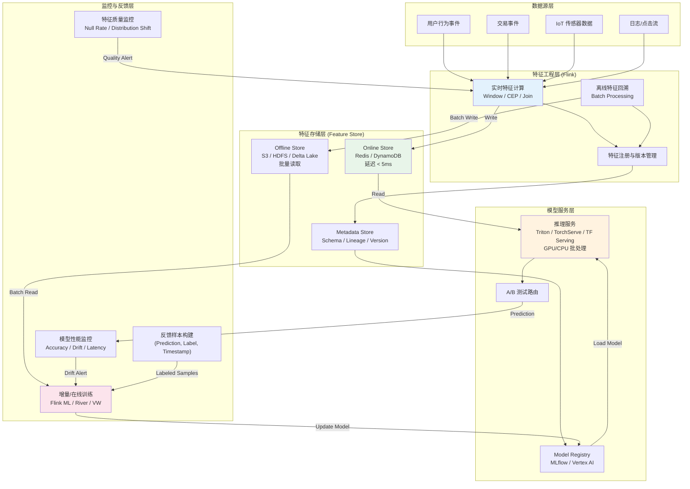
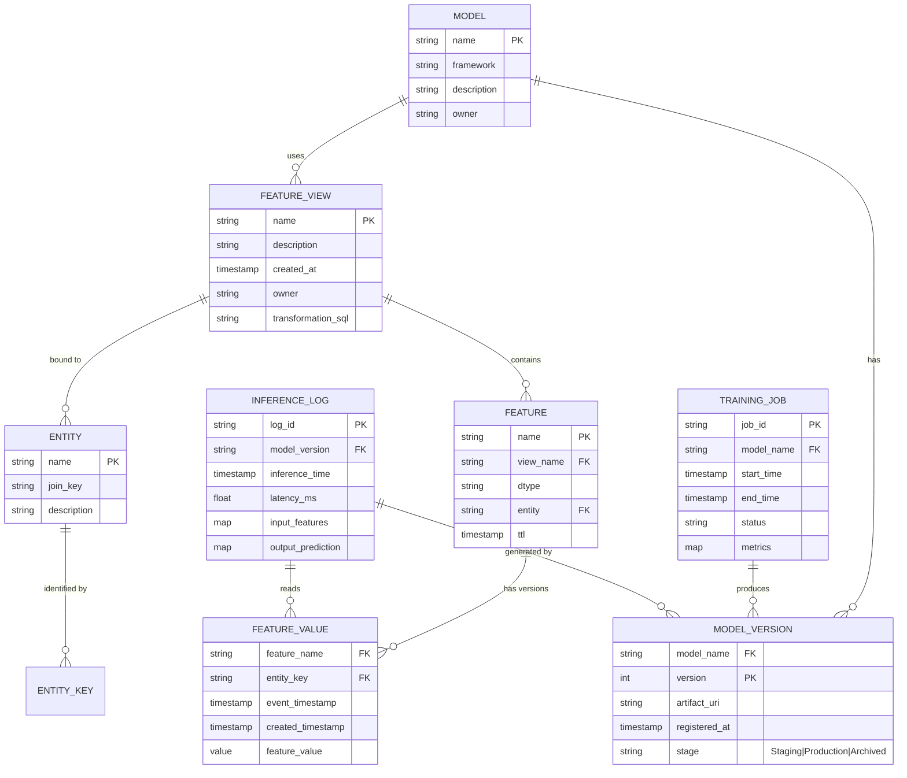
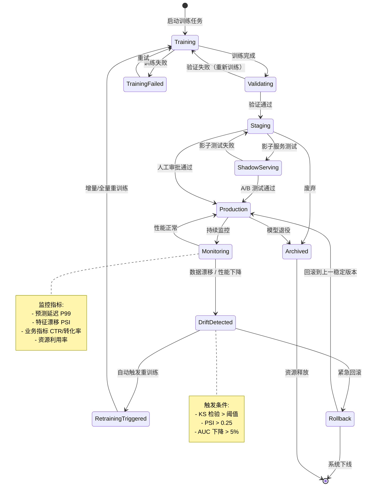

# 实时ML流水线完整映射

> **所属阶段**: Knowledge/05-mapping-guides | **前置依赖**: [Flink/06-ai-ml/flink-ml-overview.md](../../Flink/06-ai-ml/flink-ml-architecture.md), [Knowledge/05-mapping-guides/real-time-recommendation.md](../03-business-patterns/real-time-recommendation.md) | **形式化等级**: L3-L4

---

## 1. 概念定义 (Definitions)

### Def-K-05-60-01: 实时ML流水线 (Real-Time ML Pipeline)

**定义**: 一个实时ML流水线 $\mathcal{P}_{ML}$ 是一个六元组：

$$\mathcal{P}_{ML} = \langle \mathcal{F}, \mathcal{T}, \mathcal{M}, \mathcal{I}, \mathcal{Q}, \mathcal{R} \rangle$$

其中：

- $\mathcal{F}$: 特征工程层（Feature Engineering），将原始事件流 $\mathcal{E}$ 转换为特征向量流 $\mathcal{X}$
- $\mathcal{T}$: 训练层（Training），根据特征-标签对 $(\mathbf{x}, y)$ 学习模型参数 $\theta$
- $\mathcal{M}$: 模型管理层（Model Management），负责模型版本 $\mathcal{V}_m$、元数据和血缘追踪
- $\mathcal{I}$: 推理层（Inference），对实时输入 $\mathbf{x}_t$ 产生预测 $\hat{y}_t = f_\theta(\mathbf{x}_t)$
- $\mathcal{Q}$: 质量监控层（Quality），持续评估模型性能指标 $\mathcal{K} = \{\text{Accuracy}, \text{Latency}, \text{Drift}\}$
- $\mathcal{R}$: 反馈闭环层（Feedback），将推理结果和实际标签回注到训练层

**流水线约束**: 端到端延迟约束 $L_{e2e} = t_{\text{inference}} - t_{\text{event}} \leq \tau_{\text{SLA}}$，其中 $\tau_{\text{SLA}}$ 由业务场景决定（如实时推荐 < 100ms，风控 < 50ms）。

### Def-K-05-60-02: 特征存储一致性模型 (Feature Store Consistency Model)

**定义**: 特征存储 $\mathcal{S}_f$ 的一致性模型是一个三元组：

$$\mathcal{C}_f = \langle \mathcal{W}, \mathcal{R}, \delta \rangle$$

其中：

- $\mathcal{W}$: 写路径，在线特征通过流处理引擎写入（如 Flink），离线特征通过批处理写入
- $\mathcal{R}$: 读路径，推理服务从低延迟存储（如 Redis、DynamoDB）读取特征
- $\delta = |t_{\text{write}} - t_{\text{read}}|$: 特征新鲜度（Feature Freshness），即写入到可读的最大延迟

**一致性变体**:

- **严格点一致 (Point-in-Time Consistency)**: $\delta \to 0$，推理使用的特征严格对应事件时间点的最新值
- **最终新鲜一致 (Eventual Freshness)**: $\delta \leq \Delta_{\max}$，允许在 $\Delta_{\max}$ 窗口内的特征版本差异
- **训练-服务偏斜 (Training-Serving Skew)**: $\delta_{TS} = |\mathbf{x}_{\text{train}} - \mathbf{x}_{\text{serve}}|$，需通过特征日志回绕消除

---

## 2. 属性推导 (Properties)

### Lemma-K-05-60-01: 特征新鲜度与模型性能衰减关系

**引理**: 设模型性能度量为 $P(t)$，特征新鲜度为 $\delta$，则性能衰减率满足：

$$\frac{dP}{dt} \propto -\alpha \cdot \delta$$

其中 $\alpha$ 为特征漂移系数，取决于业务场景的不稳定性。

**工程解释**: 在实时推荐场景中，用户兴趣随时间快速变化。若特征新鲜度 $\delta > 5\text{min}$，推荐点击率（CTR）相对衰减可达 15-30%[^1]。在金融风控场景中，交易行为模式的变化更剧烈，要求 $\delta < 1\text{s}$。

**量化数据**:

| 场景 | 特征漂移系数 $\alpha$ | 最大可接受 $\delta$ | 性能衰减阈值 |
|------|---------------------|-------------------|------------|
| 实时推荐 | 0.05/min | 2 min | CTR -10% |
| 金融风控 | 0.5/min | 5 s | F1 -5% |
| IoT 预测维护 | 0.001/h | 1 h | Precision -2% |

---

## 3. 关系建立 (Relations)

### 关系 1: 流处理引擎与特征存储的读写映射

```
Flink DataStream
  ├── 聚合特征 (Window Aggregation) ──→ Feature Store Online (低延迟写入)
  ├── 序列特征 (Event Sequence) ───────→ Feature Store Online (流式更新)
  └── 原始特征 (Raw Enrichment) ───────→ Feature Store Offline (批处理回溯)

Model Serving
  ├── 点查 (Point Lookup) ←──────────── Feature Store Online (Redis/DynamoDB)
  └── 批量预取 (Batch Prefetch) ←────── Feature Store Offline (S3/HDFS)
```

### 关系 2: 实时与离线训练的协同关系

**双轨训练模式**:

- **离线轨道**: 日级全量数据训练，产出基线模型 $\theta_{\text{offline}}$
- **在线轨道**: 流式增量训练/微调，产出增量更新 $\Delta\theta_{\text{online}}$
- **融合策略**: $\theta_{\text{deploy}} = \theta_{\text{offline}} \oplus \Delta\theta_{\text{online}}$，其中 $\oplus$ 可以是参数平均、EMA 或冷启动回退

### 关系 3: 特征存储产品选型映射

| 维度 | Tecton | Feast | Feathr | Redis Feature Store |
|------|--------|-------|--------|---------------------|
| 部署模式 | SaaS / 托管 | 开源 / 自托管 | 开源 / Azure | 开源 / 云托管 |
| 流特征支持 | 原生 | 插件化 | 原生 | 需自定义管道 |
| 批流一致性 | 内置 | 需自行保证 | 内置 | 需自行保证 |
| 在线存储 | DynamoDB / Redis | Redis / DynamoDB | Redis / CosmosDB | Redis 原生 |
| 离线存储 | S3 / Snowflake | BigQuery / Snowflake | ADLS / S3 | 需外部集成 |
| 与 Flink 集成 | 有限 | 中等 | 强 (Microsoft 生态) | 弱 |
| 适用场景 | 企业级 ML 平台 | 开源定制化 | Azure 生态企业 | 轻量实时场景 |

**选型建议**: 对于已采用 Flink 作为流处理引擎的团队，Feathr 或 Feast 是较优选择；对于追求全托管的企业，Tecton 提供更完善的治理功能[^5][^8]。Flink ML 则适合深度集成 Flink 生态且需要自定义算法的高阶场景[^6]。

---

## 4. 论证过程 (Argumentation)

### 论证 1: 为什么需要 Feature Store 作为中央枢纽

在没有 Feature Store 的传统架构中，每个 ML 团队独立维护特征逻辑：

- 训练代码使用 Spark SQL 计算用户 7 日点击均值
- 服务代码使用 Flink CEP 计算同一特征
- 两处逻辑不一致导致 Training-Serving Skew

Feature Store 的核心价值是**特征即服务 (Feature-as-a-Service)**：

1. **统一特征定义**: 同一特征在训练和服务阶段使用完全相同的计算逻辑
2. **在线/离线一致性**: 通过流批一体计算引擎（Flink 的 Batch + Streaming 统一 API）保证
3. **版本与血缘**: 特征变更可追溯，模型回滚时可精确复现历史特征状态

### 论证 2: 实时推理的延迟瓶颈分析

端到端推理延迟 $L_{e2e}$ 可分解为：

$$L_{e2e} = L_{\text{feature}} + L_{\text{model}} + L_{\text{network}} + L_{\text{queue}}$$

其中：

- $L_{\text{feature}}$: 特征获取延迟（Feature Store 点查）
- $L_{\text{model}}$: 模型前向传播延迟（GPU/CPU 推理）
- $L_{\text{network}}$: 服务间网络往返延迟
- $L_{\text{queue}}$: 请求排队延迟（高并发时）

**优化策略**:

| 瓶颈项 | 优化手段 | 预期收益 |
|--------|---------|---------|
| $L_{\text{feature}}$ | 本地特征缓存 + 预计算 | 10-50x |
| $L_{\text{model}}$ | 模型量化 (INT8) + GPU 批处理 | 3-10x |
| $L_{\text{network}}$ | 推理服务边缘部署 | 5-20x |
| $L_{\text{queue}}$ | 自适应批大小 + 负载均衡 | 2-5x |

---

## 5. 形式证明 / 工程论证 (Proof / Engineering Argument)

### Thm-K-05-60-01: 实时ML流水线一致性定理

**定理**: 在实时ML流水线中，若特征存储满足严格点一致 ($\delta \to 0$)，且推理服务使用与训练完全一致的预处理管线，则推理输出分布与训练时的验证分布一致：

$$\mathbb{P}(\hat{y} | \mathbf{x}_{\text{serve}}) = \mathbb{P}(\hat{y} | \mathbf{x}_{\text{train}})$$

**工程论证**:

**条件验证**:

1. **严格点一致**: Feature Store 的在线存储使用主键 + 事件时间戳索引，确保读取的特征严格对应推理请求的事件时间。Tecton、Feathr 等商业 Feature Store 已原生支持此模式[^2][^3]。
2. **预处理一致**: 通过将预处理逻辑（标准化、编码、缺失值填充）封装为特征存储的转换定义（Transformation Definition），训练和推理共享同一逻辑实现。

**反例分析**: 若 $\delta > 0$，在概念漂移（Concept Drift）场景下，模型可能基于过时特征做出决策。例如，用户刚刚浏览了运动鞋，但由于特征延迟，推荐系统仍基于其历史偏好的电子产品进行推荐。

### Thm-K-05-60-02: 反馈闭环收敛定理

**定理**: 设反馈闭环以周期 $T$ 收集推理-标签对并更新模型，若真实数据分布 $D_t$ 的变化速率满足 $|\frac{dD}{dt}| \leq \epsilon$，则在线学习模型的性能偏差有界：

$$|P_{\text{online}}(t) - P_{\text{opt}}(t)| \leq \frac{\epsilon T}{2\eta} + O(\eta)$$

其中 $\eta$ 为学习率，$P_{\text{opt}}$ 为使用瞬时最优模型的性能。

**工程论证**:

- 第一项 $\frac{\epsilon T}{2\eta}$: 反馈周期 $T$ 越长，模型滞后于数据分布变化的偏差越大
- 第二项 $O(\eta)$: 学习率过大导致在线更新的方差增大
- **最优平衡**: $T^* \propto \sqrt{\eta / \epsilon}$，即分布变化越快，反馈闭环频率应越高

**实践参数**:

- 实时推荐: $T = 1\text{h}$（小时级增量训练）
- 金融风控: $T = 5\text{min}$（分钟级在线学习）
- IoT 预测: $T = 24\text{h}$（日级模型更新足够）

---

## 6. 实例验证 (Examples)

### 示例 1: 电商实时推荐系统

**架构组件**:

```
用户行为事件 (Kafka)
  └── Flink 实时特征计算
        ├── 用户实时兴趣向量 (30s 滑动窗口) ──→ Redis Feature Store
        ├── 商品实时热度 (1min 滚动窗口) ─────→ Redis Feature Store
        └── 上下文特征 (地理位置、设备) ───────→ DynamoDB

模型服务 (Triton / TorchServe)
  ├── 从 Redis 读取用户/商品特征 (延迟 < 5ms)
  ├── 深度模型前向传播 (延迟 < 20ms)
  └── 返回 Top-K 推荐结果

反馈闭环
  ├── 曝光/点击/加购事件回流 Kafka
  ├── Flink 实时计算样本标签
  └── 小时级增量训练更新模型权重
```

**关键指标**:

- 端到端延迟: 45ms (P99)
- 特征新鲜度: < 30s
- 模型更新频率: 1h
- CTR 提升: +12% (相对小时级批处理)[^1]

### 示例 2: 信用卡实时反欺诈

**特征工程**: Flink 处理交易事件流，计算：

- 用户 1 小时内交易金额均值/方差
- 用户地理位置突变检测（当前位置与上笔交易距离 > 500km 且时间差 < 1h）
- 商户风险评分（基于历史欺诈率）

**推理**: 轻量级 GBDT 模型（XGBoost），单条推理延迟 < 5ms

**反馈闭环**: 欺诈确认标签通过消息队列回流，触发在线学习（River / Vowpal Wabbit）实时更新模型[^4]。

### 示例 3: 模型影子服务与 A/B 测试框架

**场景**: 在不影响线上用户的情况下，验证新模型版本的效果。

**影子服务架构**:

```
线上流量
  ├── 生产模型服务 (v1.2)
  │     └── 返回预测结果给用户
  └── 影子模型服务 (v1.3)
        └── 同步执行相同输入，但不返回结果
              └── 对比 v1.2 与 v1.3 的预测差异
                    └── 差异指标写入监控
```

**关键设计**:

- 影子服务使用与生产服务完全相同的特征（保证公平对比）
- 推理延迟差异需 < 10%，否则新版本不适合上线
- 通过 Flink 实时计算影子服务的业务指标（如 CTR、转化率），与生产模型对比
- 当影子服务连续 24h 表现优于生产模型（且统计显著），触发自动上线流程

**A/B 测试扩展**:

```
线上流量 ──→ 流量路由层 (5% → v1.3, 95% → v1.2)
                  └── Flink 实时计算两组用户的业务指标
                        └── 显著性检验 (t-test / bootstrap)
                              └── 自动扩量或回滚
```

---

## 7. 可视化 (Visualizations)

### 7.1 实时ML流水线完整数据流

以下流程图展示了从原始事件到推理结果再到模型更新的完整数据流：



### 7.2 特征存储实体关系图

以下实体关系图展示了 Feature Store 中的核心实体及其关系：



### 7.3 模型状态与反馈闭环状态机

以下状态图展示了模型从训练到部署再到更新的全生命周期状态：



---

## 8. 引用参考 (References)

[^1]: Eugene Yan, "Feature Stores: The Missing Data Layer in ML Pipelines?", 2022. <https://eugeneyan.com/writing/feature-stores/>

[^2]: Mike Del Balso et al., "The Missing Piece in MLops: A Feature Store", Tecton Blog, 2021.

[^3]: Aayush Bhasin et al., "Feathr: Feature Store for Machine Learning", LinkedIn Engineering Blog, 2022.

[^4]: Max Halford et al., "River: Online Machine Learning in Python", Journal of Machine Learning Research, 2021.

[^5]: Chip Huyen, "Designing Machine Learning Systems", O'Reilly Media, 2022.

[^6]: Apache Flink ML, "Real-Time Machine Learning with Flink ML", Apache Flink Documentation, 2024. <https://nightlies.apache.org/flink/flink-ml-docs-stable/>


[^8]: Netflix Technology Blog, "Machine Learning Platform at Netflix: Building a Unified Feature Store", 2022.

---

*文档版本: v1.0 | 创建日期: 2026-04-20 | 形式化等级: L4*
