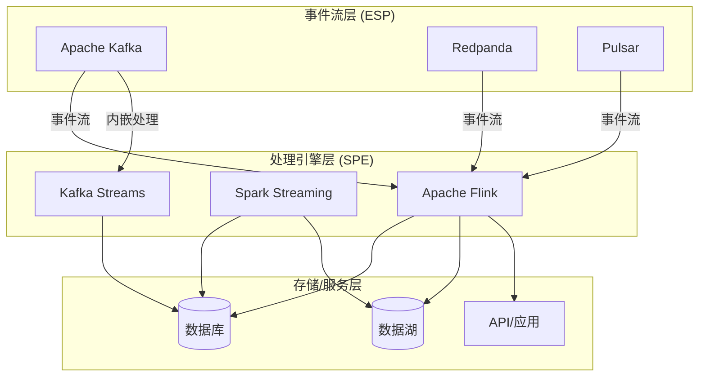
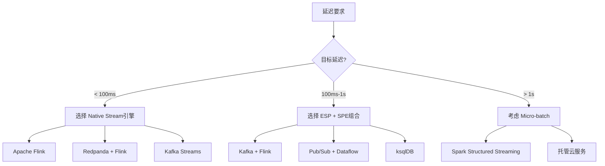
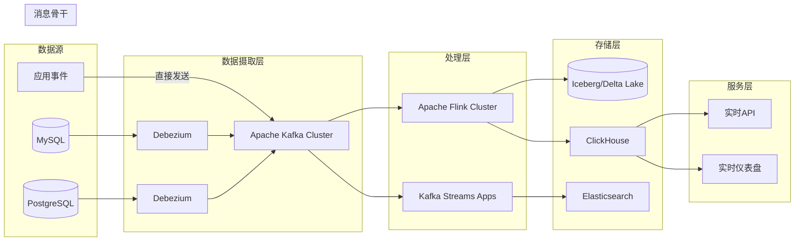
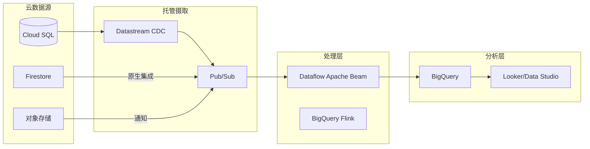
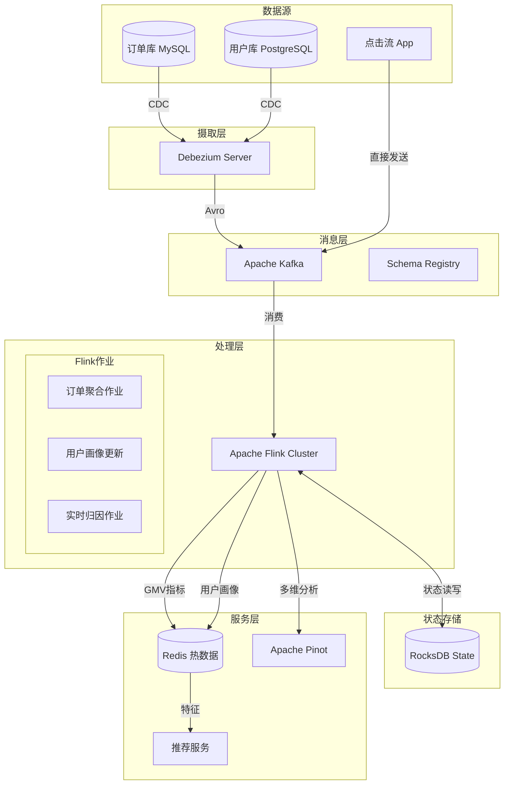
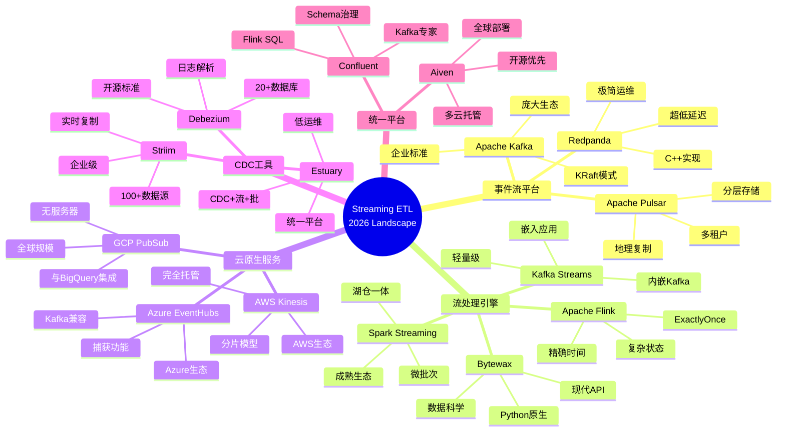
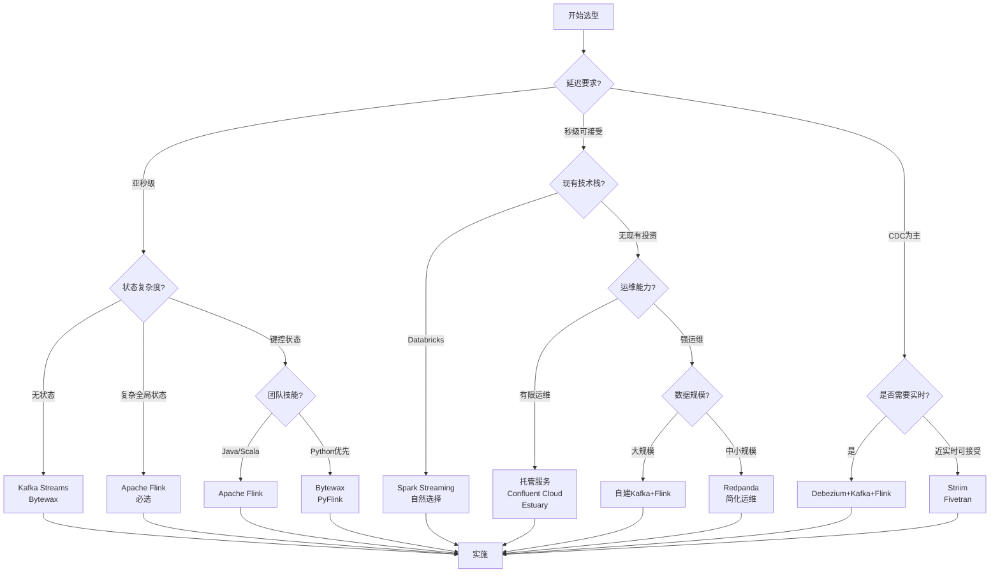
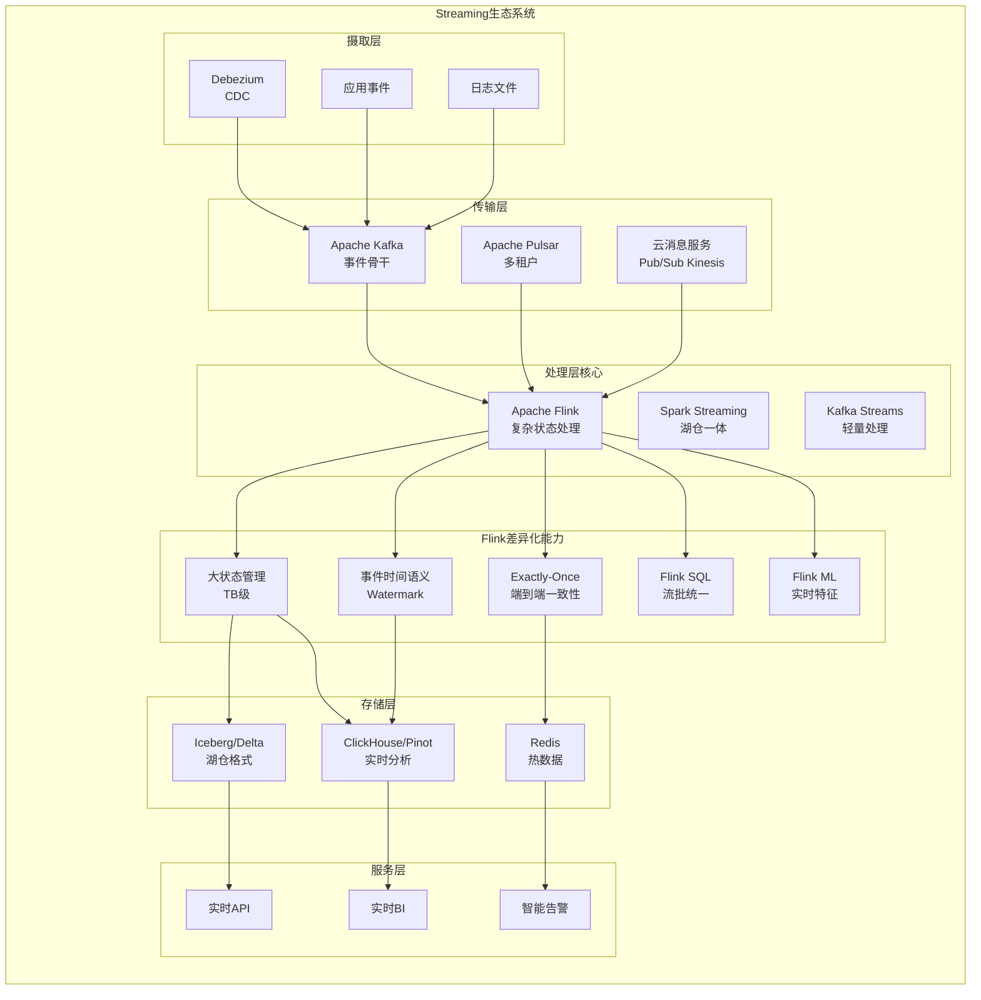
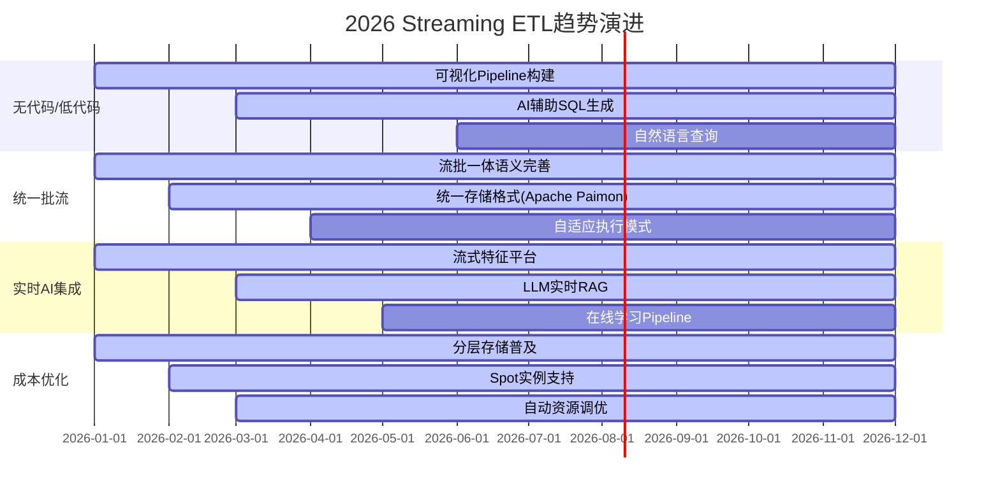

> **状态**: 🔮 前瞻内容 | **风险等级**: 高 | **最后更新**: 2026-04
>
> 此文档描述的内容处于早期规划阶段，可能与最终实现不符。请以 Apache Flink 官方发布为准。
>
# 2026 Streaming ETL工具全景对比

> **所属阶段**: Knowledge/ | **前置依赖**: Knowledge/04-technology-selection | **形式化等级**: L4

---

## 目录

- [2026 Streaming ETL工具全景对比](#2026-streaming-etl工具全景对比)
  - [目录](#目录)
  - [1. 概念定义 (Definitions)](#1-概念定义-definitions)
    - [Def-K-05-30: Streaming ETL形式化定义](#def-k-05-30-streaming-etl形式化定义)
    - [Def-K-05-31: 工具分类学](#def-k-05-31-工具分类学)
    - [Def-K-05-32: 核心指标维度](#def-k-05-32-核心指标维度)
  - [2. 属性推导 (Properties)](#2-属性推导-properties)
    - [Lemma-K-05-15: 事件流平台性能边界](#lemma-k-05-15-事件流平台性能边界)
    - [Lemma-K-05-16: 流处理引擎能力边界](#lemma-k-05-16-流处理引擎能力边界)
    - [Lemma-K-05-17: 云原生服务约束](#lemma-k-05-17-云原生服务约束)
  - [3. 关系建立 (Relations)](#3-关系建立-relations)
    - [Thm-K-05-15: Streaming ETL工具生态关系定理](#thm-k-05-15-streaming-etl工具生态关系定理)
    - [Thm-K-05-16: Flink差异化定位定理](#thm-k-05-16-flink差异化定位定理)
  - [4. 论证过程 (Argumentation)](#4-论证过程-argumentation)
    - [4.1 工具对比矩阵](#41-工具对比矩阵)
      - [事件流平台详细对比](#事件流平台详细对比)
      - [流处理引擎详细对比](#流处理引擎详细对比)
      - [云原生服务详细对比](#云原生服务详细对比)
      - [CDC工具详细对比](#cdc工具详细对比)
    - [4.2 统一平台对比](#42-统一平台对比)
  - [5. 形式证明 / 工程论证 (Proof / Engineering Argument)](#5-形式证明--工程论证-proof--engineering-argument)
    - [Thm-K-05-17: 选型决策框架定理](#thm-k-05-17-选型决策框架定理)
      - [维度1: 延迟要求 ($w\_{latency}$)](#维度1-延迟要求-w_latency)
      - [维度2: 状态复杂度 ($w\_{state}$)](#维度2-状态复杂度-w_state)
      - [维度3: 运维能力 ($w\_{ops}$)](#维度3-运维能力-w_ops)
      - [维度4: 生态系统 ($w\_{eco}$)](#维度4-生态系统-w_eco)
    - [5.2 生产部署架构建议](#52-生产部署架构建议)
  - [6. 实例验证 (Examples)](#6-实例验证-examples)
    - [6.1 多工具组合案例: 电商平台实时Pipeline](#61-多工具组合案例-电商平台实时pipeline)
    - [6.2 Python生态系统案例: PyFlink vs PySpark vs Bytewax](#62-python生态系统案例-pyflink-vs-pyspark-vs-bytewax)
      - [工具对比](#工具对比)
      - [Bytewax示例代码](#bytewax示例代码)
      - [PyFlink等效代码](#pyflink等效代码)
  - [7. 可视化 (Visualizations)](#7-可视化-visualizations)
    - [7.1 2026 Streaming ETL工具全景图](#71-2026-streaming-etl工具全景图)
    - [7.2 选型决策树](#72-选型决策树)
    - [7.3 Flink生态定位图](#73-flink生态定位图)
    - [7.4 性能-复杂度权衡矩阵](#74-性能-复杂度权衡矩阵)
    - [7.5 2026新兴趋势路线图](#75-2026新兴趋势路线图)
  - [8. 引用参考 (References)](#8-引用参考-references)
  - [附录: 快速参考表](#附录-快速参考表)
    - [A. 工具选型速查表](#a-工具选型速查表)
    - [B. 成本模型对比](#b-成本模型对比)

## 1. 概念定义 (Definitions)

### Def-K-05-30: Streaming ETL形式化定义

Streaming ETL（Extract-Transform-Load）是指**对流式数据进行持续提取、转换和加载**的实时数据处理范式。形式化定义如下：

**定义域**: 设 $D_{stream}$ 为无界数据流空间，$D_{bounded}$ 为有界数据集空间

**Streaming ETL三元组**: $SETL = \langle \Sigma, \tau, \mathcal{F} \rangle$

- **$\Sigma$ (Extraction)**: 从源系统捕获变更的函数族，$\Sigma: S_{source} \rightarrow D_{stream}$
  - 事件源提取: $\sigma_{event}(e) = (t_{event}, payload, metadata)$
  - CDC提取: $\sigma_{cdc}(\Delta DB) = \{(op, key, before, after, ts)\}$
  - 日志提取: $\sigma_{log}(l) = (timestamp, level, message, context)$

- **$\tau$ (Transformation)**: 流式转换算子集，$\tau: D_{stream} \rightarrow D'_{stream}$
  - 映射: $\tau_{map}(f) = \{f(x) | x \in stream\}$
  - 过滤: $\tau_{filter}(p) = \{x \in stream | p(x) = true\}$
  - 窗口聚合: $\tau_{window}(w, agg) = \{agg(\{x | x.ts \in w_i\}) | w_i \in \mathcal{W}\}$
  - 连接: $\tau_{join}(A, B, K) = \{(a, b) | a \in A, b \in B, K(a) = K(b)\}$

- **$\mathcal{F}$ (Loading)**: 加载策略集合，$\mathcal{F}: D'_{stream} \rightarrow S_{target}$
  - 同步加载: $f_{sync}(d) \Rightarrow$ 立即写入目标
  - 批量加载: $f_{batch}(B) \Rightarrow$ 累积批次后写入
  - 微批次加载: $f_{micro}(\Delta t) \Rightarrow$ 固定间隔写入

**关键特性**: Streaming ETL区别于Batch ETL的核心在于其**时间维度上的连续性**和**处理语义的有界性**。

---

### Def-K-05-31: 工具分类学

基于功能定位和技术架构，2026年Streaming ETL工具可分为五大类别：

**定义 5.1: 事件流平台 (Event Streaming Platform, ESP)**

ESP是**以分布式日志为核心的消息中间件**，负责高吞吐、低延迟的事件传输与持久化：

$$ESP = \langle Topic, Partition, ConsumerGroup, Retention \rangle$$

- **Topic**: 逻辑事件流的命名空间
- **Partition**: 物理分片，保证分区内的顺序性
- **ConsumerGroup**: 消费者组，实现消费的负载均衡与容错
- **Retention**: 数据保留策略，支持事件回放

**代表工具**: Kafka, Redpanda, Pulsar, RabbitMQ

**定义 5.2: 流处理引擎 (Stream Processing Engine, SPE)**

SPE是**对无界数据流进行有状态计算的执行框架**：

$$SPE = \langle DAG, StateBackend, WindowOperator, Checkpoint \rangle$$

- **DAG**: 有向无环图表示的计算拓扑
- **StateBackend**: 状态存储后端（内存/文件系统/数据库）
- **WindowOperator**: 窗口算子族（滚动、滑动、会话）
- **Checkpoint**: 分布式快照机制，保证容错

**代表工具**: Flink, Spark Structured Streaming, Kafka Streams, Storm

**定义 5.3: 云原生流服务 (Cloud-Native Streaming Service, CNSS)**

CNSS是**托管式流数据基础设施**，隐藏运维复杂性：

$$CNSS = \langle Endpoint, AutoScale, IAM, SLA \rangle$$

- **Endpoint**: 标准化的服务接入点
- **AutoScale**: 自动扩缩容能力
- **IAM**: 与云平台集成的身份认证
- **SLA**: 服务等级协议保证

**代表工具**: AWS Kinesis, GCP Pub/Sub, Azure Event Hubs

**定义 5.4: CDC工具 (Change Data Capture Tool, CDC)**

CDC是**从数据库事务日志捕获变更的专用工具**：

$$CDC = \langle LogMiner, Serializer, SchemaRegistry, OffsetStore \rangle$$

- **LogMiner**: 数据库日志解析器
- **Serializer**: 变更事件序列化器（Debezium格式/Canal格式）
- **SchemaRegistry**: 模式演化管理
- **OffsetStore**: 位点存储，保证断点续传

**代表工具**: Debezium, Striim, Fivetran, Estuary

**定义 5.5: 统一数据流平台 (Unified Data Streaming Platform, UDSP)**

UDSP是**整合CDC、流处理和批量能力的端到端平台**：

$$UDSP = \langle CDC, StreamProc, BatchSync, Materialization \rangle$$

**代表工具**: Estuary, Confluent, Aiven, Decodable

---

### Def-K-05-32: 核心指标维度

**定义 5.6: 延迟等级 (Latency Class)**

$$\mathcal{L} = \{L_{realtime}, L_{near}, L_{microbatch}, L_{batch}\}$$

| 等级 | 延迟范围 | 典型场景 |
|------|----------|----------|
| $L_{realtime}$ | < 100ms | 高频交易、实时监控、IoT告警 |
| $L_{near}$ | 100ms - 1s | 推荐系统、欺诈检测、动态定价 |
| $L_{microbatch}$ | 1s - 60s | 指标聚合、日志分析、报表更新 |
| $L_{batch}$ | > 60s | 数据仓库同步、大规模ETL |

**定义 5.7: 处理语义 (Processing Semantic)**

$$\mathcal{S} = \{AtMostOnce, AtLeastOnce, ExactlyOnce\}$$

- **AtMostOnce**: 最多一次，可能丢数据，最高吞吐
- **AtLeastOnce**: 至少一次，不丢数据但可能重复
- **ExactlyOnce**: 精确一次，端到端去重，实现复杂度最高

**定义 5.8: 状态复杂度 (State Complexity)**

$$\mathcal{C}_{state} = \{Stateless, KeyState, OperatorState, GlobalState\}$$

---

## 2. 属性推导 (Properties)

### Lemma-K-05-15: 事件流平台性能边界

**引理 5.1 (Kafka吞吐上限)**: 在典型生产配置下，单分区Kafka的吞吐量存在理论上限：

$$T_{kafka} \leq \min\left(\frac{BW_{network}}{S_{msg}}, \frac{IOPS_{disk}}{F_{fsync}}, N_{partition} \times T_{single}\right)$$

其中：

- $BW_{network}$: 网络带宽
- $S_{msg}$: 平均消息大小
- $IOPS_{disk}$: 磁盘IOPS
- $F_{fsync}$: 刷盘频率
- $N_{partition}$: 分区数

**实测边界** [^1]:

- 单分区: ~10 MB/s 或 100K msg/s
- 单节点: ~100 MB/s（取决于磁盘和网络）
- 端到端延迟: 2-10ms（本地）, 20-100ms（跨可用区）

**引理 5.2 (Redpanda性能优势)**: 由于C++实现和无ZooKeeper架构，Redpanda在同等硬件下可提供：

$$T_{redpanda} \approx 1.5 \times T_{kafka}, \quad L_{redpanda} \approx 0.3 \times L_{kafka}$$

**引理 5.3 (Pulsar多租户隔离)**: Pulsar通过分层存储和broker-bookie分离实现：

$$Isolation_{pulsar}(tenant_i, tenant_j) = 1 - \frac{Resource_{shared}}{Resource_{total}}$$

相比Kafka的topic-level隔离，Pulsar在共享集群中提供更好的QoS保证。

---

### Lemma-K-05-16: 流处理引擎能力边界

**引理 5.4 (Flink状态规模)**: Flink状态后端支持的状态规模取决于存储介质：

| 状态后端 | 最大状态规模 | checkpoint开销 | 恢复时间 |
|----------|--------------|----------------|----------|
| MemoryStateBackend | JVM Heap | 低 | 快 |
| FsStateBackend | 取决于磁盘 | 中 | 中 |
| RocksDBStateBackend | TB级 | 高（增量checkpoint） | 慢 |

**引理 5.5 (Spark微批次延迟下限)**: Spark Structured Streaming的微批次架构存在固有延迟：

$$L_{spark} \geq T_{trigger} + T_{scheduling} + T_{processing}$$

其中 $T_{scheduling} \approx 50-200ms$，因此Spark难以实现亚秒级延迟 [^2]。

**引理 5.6 (Flink与Spark延迟对比)**: 在相同计算复杂度下：

$$\frac{L_{spark}}{L_{flink}} \approx 10-100 \times$$

对于窗口聚合类工作负载，延迟差距尤为明显。

---

### Lemma-K-05-17: 云原生服务约束

**引理 5.7 (Kinesis分片限制)**: AWS Kinesis Data Streams的分片模型存在以下约束：

- 单分片写入: 1 MB/s 或 1,000 records/s
- 单分片读取: 2 MB/s（共享）或 2 MB/s（增强扇出）
- 分片分裂/合并: 需要时间窗口，非瞬时

**引理 5.8 (云厂商锁定系数)**: 云原生服务的可迁移性可用锁定系数量化：

$$Lock_{cloud} = 1 - \frac{API_{standard}}{API_{total}}$$

| 服务 | 锁定系数 | 迁移路径 |
|------|----------|----------|
| Kinesis | 高 (0.8) | 需重写生产者/消费者 |
| Pub/Sub | 高 (0.7) | 有Kafka连接器但需适配 |
| Event Hubs | 中 (0.4) | Kafka协议兼容，迁移成本低 |

---

## 3. 关系建立 (Relations)

### Thm-K-05-15: Streaming ETL工具生态关系定理

**定理 5.1 (互补性定理)**: 现代Streaming ETL架构中，ESP与SPE呈**互补而非替代**关系：

$$\forall arch \in \mathcal{A}_{modern}: ESP \in arch \land SPE \in arch \Rightarrow ESP \cap SPE = \emptyset$$

**证明概要**:

1. **关注点分离**: ESP负责**durability**和**transport**，SPE负责**computation**和**state**
2. **Kafka+Flink组合**是业界标准架构: Kafka作为事件骨干，Flink执行复杂计算
3. 单一工具难以同时优化这两个维度



**定理 5.2 (分层依赖关系)**: Streaming ETL工具栈呈现**分层依赖**结构：

$$Layer_1(CDC/Extraction) \rightarrow Layer_2(Transport) \rightarrow Layer_3(Processing) \rightarrow Layer_4(Serving)$$

各层工具组合形成完整Pipeline：

| 层级 | 功能 | 工具选项 |
|------|------|----------|
| Layer 1 | 变更捕获 | Debezium, Striim, Estuary |
| Layer 2 | 消息传输 | Kafka, Redpanda, Pub/Sub, Event Hubs |
| Layer 3 | 流处理 | Flink, Spark, ksqlDB |
| Layer 4 | 查询服务 | Materialize, RisingWave, Tinybird |

---

### Thm-K-05-16: Flink差异化定位定理

**定理 5.3 (Flink差异化定位)**: 在流处理引擎谱系中，Flink占据**复杂状态处理+精确时间语义**的独特位置：

$$Position(Flink) = \arg\max_{SPE} \left( StateComplexity \times TemporalSemantics \times ConsistencyGuarantee \right)$$

**与其他引擎的定位差异**:

| 维度 | Flink | Spark Streaming | Kafka Streams | Storm/Flume |
|------|-------|-----------------|---------------|-------------|
| **处理模型** | Native Stream | Micro-batch | Embedded Stream | Native Stream |
| **状态管理** | 内置，TB级 | 依赖外部 | 内嵌，轻量 | 需外部存储 |
| **时间语义** | Event Time原生 | Processing Time为主 | Event Time支持 | Processing Time |
| **延迟** | < 100ms | 秒级 | 毫秒级 | 毫秒级 |
| **一致性** | Exactly-once | Exactly-once | Exactly-once | At-least-once |
| **部署模式** | Cluster/Serverless | Cluster | Application | Cluster |

**定理 5.4 (Iceberg/Delta集成关系)**: Flink与Lakehouse格式的集成遵循**流批统一**范式：

$$
Flink + Iceberg/Delta \Rightarrow \begin{cases}
Streaming: & \text{实时增量写入} \\
Batch: & \text{全量回溯查询} \\
TimeTravel: & \text{历史版本访问}
\end{cases}
$$

Flink通过Table Store或paimon实现与Iceberg/Delta的深度集成，支持流批一体的湖仓架构 [^3]。

---

## 4. 论证过程 (Argumentation)

### 4.1 工具对比矩阵

#### 事件流平台详细对比

| 工具 | 处理模型 | 典型延迟 | 托管/自托管 | 最佳场景 | 2026年关键更新 |
|------|----------|----------|-------------|----------|----------------|
| **Apache Kafka** | 分布式日志 | 2-10ms | 自托管/托管 | 企业事件骨干 | KRaft模式成熟，移除ZooKeeper依赖 [^1] |
| **Redpanda** | Kafka兼容(C++) | <1ms | 自托管/托管 | 超低延迟场景 | Tiered Storage GA，多租户支持增强 |
| **Apache Pulsar** | 分层存储 | 5-20ms | 自托管/托管 | 多租户消息 | 3.0版本性能提升，KOP协议改进 |
| **Apache RocketMQ** | 延迟消息 | 10-50ms | 自托管/托管 | 金融级场景 | 5.0版本云原生重构 |

#### 流处理引擎详细对比

| 工具 | 处理模型 | 典型延迟 | 状态规模 | 最佳场景 | 2026年关键更新 |
|------|----------|----------|----------|----------|----------------|
| **Apache Flink** | Native Stream | <100ms | TB级 | 复杂事件处理 | Flink 2.0预览，自适应调度器 [^4] |
| **Spark Structured Streaming** | Micro-batch | 秒级 | 依赖外部 | 湖仓一体分析 | 持续流处理模式改进 |
| **Kafka Streams** | Embedded | <10ms | GB级 | 轻量级转换 | 3.8版本性能优化 |
| **ksqlDB** | SQL Stream | <100ms | GB级 | SQL优先场景 | 云原生部署增强 |
| **Apache Storm** | Native Stream | <10ms | 需外部 | 简单实时计算 | 维护模式，新项目不推荐 |
| **Bytewax** | Python Native | <100ms | MB-GB级 | Python生态 | 0.20版本状态管理增强 |

#### 云原生服务详细对比

| 工具 | 吞吐量/分片 | 成本模型 | 厂商锁定 | 最佳场景 | 2026年关键更新 |
|------|-------------|----------|----------|----------|----------------|
| **AWS Kinesis** | 1MB/s | 分片小时计费 | 高 | AWS生态 | Kinesis Data Streams增强 |
| **GCP Pub/Sub** | 无上限 | GB计费 | 高 | GCP生态 | Exactly-once交付GA |
| **Azure Event Hubs** | 1MB-40MB/TU | TU小时计费 | 中(Kafka兼容) | Azure生态/Kafka迁移 | 专用集群支持增强 |
| **Confluent Cloud** | 弹性 | CKU计费 | 中 | 企业Kafka | Flink SQL GA，AI功能集成 [^5] |
| **Aiven** | 取决于配置 | 基础设施+服务 | 低 | 多云策略 | 托管Flink全面可用 |

#### CDC工具详细对比

| 工具 | 捕获方式 | 支持数据库 | 延迟 | 托管/自托管 | 最佳场景 |
|------|----------|------------|------|-------------|----------|
| **Debezium** | 日志解析 | 20+ | <1s | 自托管 | 开源CDC骨干 |
| **Striim** | 日志解析+轮询 | 100+ | <1s | 托管/自托管 | 企业级CDC |
| **Fivetran** | API轮询 | 300+ | 分钟级 | 托管 | SaaS集成 |
| **Estuary** | 日志解析 | 50+ | <1s | 托管/BYOC | 实时CDC+流处理统一 |

---

### 4.2 统一平台对比

| 平台 | CDC | 流处理 | 批量同步 | 实时性 | 成本模型 | 运维复杂度 |
|------|-----|--------|----------|--------|----------|------------|
| **Estuary** | ✓原生 | ✓内置 | ✓支持 | 秒级 | 用量计费 | 极低 |
| **Confluent** | ✓Connector | ✓Flink SQL | ✗ | 毫秒级 | CKU计费 | 低 |
| **Aiven** | ✓Connector | ✓托管Flink | ✗ | 毫秒级 | 节点计费 | 低 |
| **Airbyte** | ✓API | ✗ | ✓支持 | 分钟级 | 用量计费 | 低 |
| **Meltano** | ✓Connector | ✗ | ✓支持 | 分钟级 | 开源 | 中 |

---

## 5. 形式证明 / 工程论证 (Proof / Engineering Argument)

### Thm-K-05-17: 选型决策框架定理

**定理 5.5 (多维度决策函数)**: Streaming ETL工具选择可建模为多目标优化问题：

$$\arg\max_{tool} \mathcal{D}(Latency, State, Ops, Ecosystem) = \sum_{i} w_i \cdot f_i(tool)$$

其中权重向量 $\vec{w} = (w_{latency}, w_{state}, w_{ops}, w_{eco})$ 由组织约束决定。

**决策维度分析**:

#### 维度1: 延迟要求 ($w_{latency}$)



**工程建议**:

- $L < 50ms$: 必须使用Flink或Kafka Streams的Native Streaming模式
- $L < 10ms$: 考虑Redpanda替代Kafka作为消息骨干
- $L > 1s$: Spark Streaming的成熟度优势大于延迟劣势

#### 维度2: 状态复杂度 ($w_{state}$)

| 状态复杂度 | 特征 | 推荐工具 | 理由 |
|------------|------|----------|------|
| **Stateless** | 无状态转换 | Kafka Streams, Bytewax | 轻量，嵌入应用 |
| **KeyState** | 按键分区状态 | Flink, ksqlDB | 高效状态后端 |
| **OperatorState** | 算子级广播状态 | Flink | 唯一成熟支持 |
| **GlobalState** | 全局聚合状态 | Flink + RocksDB | TB级状态支持 |

**案例**: 实时推荐系统需要维护用户画像状态（KeyState），应选择Flink而非Spark。

#### 维度3: 运维能力 ($w_{ops}$)

**运维复杂度评估模型**:

$$OpsComplexity = \alpha \cdot ClusterMgmt + \beta \cdot TuningEffort + \gamma \cdot IncidentResponse$$

| 团队能力 | 推荐路径 | 工具组合 |
|----------|----------|----------|
| **有限运维** | 全托管服务 | Confluent Cloud, Estuary, Aiven |
| **中等运维** | 半托管/托管处理引擎 | MSK + 托管Flink, Pub/Sub + Dataflow |
| **强运维** | 自托管核心组件 | Kafka + Flink on K8s |

#### 维度4: 生态系统 ($w_{eco}$)

**生态兼容矩阵**:

| 现有技术栈 | 自然选择 | 迁移成本 |
|------------|----------|----------|
| Databricks/Delta Lake | Spark Structured Streaming | 极低 |
| Confluent/Kafka生态 | Flink/ksqlDB | 低 |
| AWS原生 | Kinesis + MSF | 极低 |
| GCP原生 | Pub/Sub + Dataflow | 极低 |
| Azure原生 | Event Hubs + Stream Analytics | 低 |
| Python数据科学团队 | Bytewax + Flink Python API | 中 |

---

### 5.2 生产部署架构建议

**架构模式1: 企业级实时数仓**



**组件选择理由**:

- **Debezium**: 开源CDC标准，支持主流数据库
- **Kafka**: 企业级事件骨干，高可用保证
- **Flink**: 复杂事件处理，精确时间语义
- **Kafka Streams**: 轻量级应用内处理
- **Iceberg/Delta**: 湖仓一体，支持时间旅行

**架构模式2: 云原生无服务器Streaming**



**适用场景**: 快速启动、成本敏感、无需复杂状态处理

---

## 6. 实例验证 (Examples)

### 6.1 多工具组合案例: 电商平台实时Pipeline

**业务场景**: 电商平台需要构建实时用户行为分析Pipeline

**需求**:

- CDC捕获订单库变更（<1s延迟）
- 实时计算GMV、UV、转化率
- 用户行为实时归因
- 支持实时推荐

**工具组合**:



**关键配置**:

1. **Debezium配置**:

```json
{
  "name": "order-connector",
  "config": {
    "connector.class": "io.debezium.connector.mysql.MySqlConnector",
    "database.hostname": "mysql-prod",
    "database.include.list": "order_db",
    "table.include.list": "order_db.orders,order_db.order_items",
    "snapshot.mode": "initial",
    "tombstones.on.delete": false
  }
}
```

1. **Flink作业关键代码**:

```java
// [伪代码片段 - 不可直接运行] 仅展示核心逻辑
// 订单流表
Table orders = tEnv.fromDataStream(
    env.fromSource(
        KafkaSource.<Order>builder()
            .setTopics("db.order_db.orders")
            .setGroupId("flink-gmv-compute")
            .build(),
        WatermarkStrategy.<Order>forBoundedOutOfOrderness(Duration.ofSeconds(5)),
        "orders"
    )
);

// 窗口聚合计算GMV
tEnv.executeSql("""
    CREATE VIEW gmv_per_minute AS
    SELECT
        TUMBLE_START(event_time, INTERVAL '1' MINUTE) as window_start,
        category_id,
        SUM(amount) as gmv,
        COUNT(DISTINCT user_id) as uv
    FROM orders
    GROUP BY
        TUMBLE(event_time, INTERVAL '1' MINUTE),
        category_id
""");
```

**性能指标**:

- 端到端延迟: ~500ms (p99)
- 吞吐量: 50K events/s
- 状态规模: ~200GB (7天窗口)
- 故障恢复: <30秒

---

### 6.2 Python生态系统案例: PyFlink vs PySpark vs Bytewax

**场景**: 数据科学团队需要构建实时特征工程Pipeline

#### 工具对比

| 工具 | 学习曲线 | 生态系统 | 延迟 | 状态管理 | 最佳场景 |
|------|----------|----------|------|----------|----------|
| **PyFlink** | 中 | Java生态为主 | 低 | 完整 | 混合Java/Python团队 |
| **PySpark Structured Streaming** | 低 | Python数据科学生态 | 秒级 | 依赖外部 | 纯Python团队，已有Spark投资 |
| **Bytewax** | 低 | Python原生 | 低 | 内建 | Python优先团队，新项目 |

#### Bytewax示例代码

```python
# 实时用户行为特征工程 from bytewax.dataflow import Dataflow
from bytewax.connectors.kafka import KafkaSource, KafkaSink
from bytewax.window import TumblingWindow, SystemClockConfig

# 定义数据流 flow = Dataflow()

# 从Kafka读取点击流 flow.input("clickstream", KafkaSource(["localhost:9092"], ["user_clicks"]))

# 解析和转换 def parse_click(event):
    import json
    data = json.loads(event)
    return (data["user_id"], {
        "timestamp": data["ts"],
        "action": data["action"],
        "value": data.get("value", 0)
    })

flow.map(parse_click)

# 按用户ID键控 flow.key_by(lambda x: x[0])

# 窗口聚合:每分钟用户行为统计 def aggregate_actions(window_data):
    user_id, events = window_data
    actions = {}
    total_value = 0
    for _, event in events:
        actions[event["action"]] = actions.get(event["action"], 0) + 1
        total_value += event["value"]
    return {
        "user_id": user_id,
        "action_counts": actions,
        "total_value": total_value,
        "event_count": len(events)
    }

flow.window(
    TumblingWindow(
        length=timedelta(minutes=1),
        clock=SystemClockConfig()
    )
).reduce(aggregate_actions)

# 输出到Redis class RedisSink:
    def __init__(self, redis_host):
        import redis
        self.client = redis.Redis(host=redis_host)

    def write(self, features):
        key = f"user_features:{features['user_id']}"
        self.client.hset(key, mapping=features)

flow.output("redis", RedisSink("localhost"))
```

#### PyFlink等效代码

```python
from pyflink.datastream import StreamExecutionEnvironment
from pyflink.table import StreamTableEnvironment
from pyflink.datastream.connectors.kafka import KafkaSource, KafkaOffsetsInitializer

# 创建环境 env = StreamExecutionEnvironment.get_execution_environment()
t_env = StreamTableEnvironment.create(env)

# 定义Kafka源 t_env.execute_sql("""
    CREATE TABLE user_clicks (
        user_id STRING,
        action STRING,
        value DECIMAL(10,2),
        ts TIMESTAMP(3),
        WATERMARK FOR ts AS ts - INTERVAL '5' SECOND
    ) WITH (
        'connector' = 'kafka',
        'topic' = 'user_clicks',
        'properties.bootstrap.servers' = 'localhost:9092',
        'format' = 'json'
    )
""")

# 特征聚合 t_env.execute_sql("""
    CREATE TABLE user_features (
        user_id STRING,
        window_start TIMESTAMP(3),
        click_count BIGINT,
        purchase_count BIGINT,
        total_value DECIMAL(10,2),
        PRIMARY KEY (user_id, window_start) NOT ENFORCED
    ) WITH (
        'connector' = 'jdbc',
        'url' = 'jdbc:redis://localhost:6379',
        'table-name' = 'user_features'
    )
""")

# 执行聚合插入 t_env.execute_sql("""
    INSERT INTO user_features
    SELECT
        user_id,
        TUMBLE_START(ts, INTERVAL '1' MINUTE) as window_start,
        COUNT(*) FILTER (WHERE action = 'click') as click_count,
        COUNT(*) FILTER (WHERE action = 'purchase') as purchase_count,
        SUM(value) as total_value
    FROM user_clicks
    GROUP BY
        user_id,
        TUMBLE(ts, INTERVAL '1' MINUTE)
""")
```

---

## 7. 可视化 (Visualizations)

### 7.1 2026 Streaming ETL工具全景图



### 7.2 选型决策树



### 7.3 Flink生态定位图



### 7.4 性能-复杂度权衡矩阵

```mermaid
quadrantChart
    title Streaming ETL工具: 性能 vs 运维复杂度
    x-axis 低性能 --> 高性能
    y-axis 低运维复杂度 --> 高运维复杂度

    quadrant-1 高性能/高运维: 专业团队
    quadrant-2 高性能/低运维: 理想选择
    quadrant-3 低性能/低运维: 快速启动
    quadrant-4 低性能/高运维: 避免

    "AWS Kinesis": [0.6, 0.2]
    "GCP Pub/Sub": [0.65, 0.15]
    "Azure Event Hubs": [0.6, 0.25]
    "Confluent Cloud": [0.75, 0.3]
    "Estuary": [0.7, 0.15]
    "Aiven": [0.7, 0.25]
    "自建Kafka": [0.8, 0.8]
    "自建Flink": [0.9, 0.85]
    "Redpanda自建": [0.85, 0.5]
    "Spark on Databricks": [0.6, 0.3]
    "Bytewax": [0.7, 0.4]
    "Kafka Streams": [0.65, 0.35]
```

### 7.5 2026新兴趋势路线图



---

## 8. 引用参考 (References)

[^1]: Mimacom, "8 Best Data Streaming Tools in 2026: Compared & Ranked", 2026-02-18. <https://www.mimacom.com/learning-hub/data-streaming-tools>

[^2]: Estuary, "12 Data Streaming Technologies & Tools For 2026", 2026-03-05. <https://estuary.dev/blog/data-streaming-technologies/>

[^3]: Redpanda, "Flink vs. Spark—A detailed comparison guide", 2025. <https://www.redpanda.com/guides/event-stream-processing-flink-vs-spark>

[^4]: Streamkap, "Data Streaming Tools Compared: Kafka, Flink, Redpanda, and More", 2025-09-15. <https://streamkap.com/resources-and-guides/data-streaming-tools-comparison-7-en-badfe/>

[^5]: Tinybird, "Streaming Data Processing Tools Compared: Brokers, Engines, and Real-Time Serving", 2026-03-29. <https://www.tinybird.co/blog/kafka-alternatives-for-streaming-data-processing-8-tools-compared>


---

## 附录: 快速参考表

### A. 工具选型速查表

| 你的需求 | 推荐工具 | 备选方案 |
|----------|----------|----------|
| 亚秒级复杂事件处理 | **Apache Flink** | Redpanda + Flink |
| 已有Spark投资，秒级可接受 | **Spark Structured Streaming** | Databricks Delta Live Tables |
| 极简运维，快速启动 | **Estuary** / **Confluent Cloud** | Aiven |
| 纯Python团队实时处理 | **Bytewax** | PyFlink |
| 嵌入应用轻量处理 | **Kafka Streams** | Bytewax |
| 超低延迟消息骨干 | **Redpanda** | Pulsar |
| 企业级CDC+流处理统一 | **Estuary** | Striim |
| 多云策略 | **Aiven** / **Confluent** | 自建Kafka+Flink |
| 实时AI/ML特征工程 | **Flink ML** / **Bytewax** | Tecton |

### B. 成本模型对比

| 工具 | 计费维度 | 预估成本 ($/月, 中等规模) | 成本优化建议 |
|------|----------|---------------------------|--------------|
| Confluent Cloud | CKU + 存储 | $3,000-10,000 | 使用Basic集群，合理设置保留期 |
| AWS MSK + MSF | 节点 + 处理 | $2,500-8,000 | 使用Spot实例，按需扩缩容 |
| Estuary | 数据量 | $1,000-5,000 | 批量任务错峰执行 |
| 自建 (EC2/GCE) | 基础设施 | $1,500-6,000 | 预留实例，分层存储 |
| Aiven | 节点规格 | $2,000-7,000 | 选择合适区域，避免跨区流量 |

---

*文档版本: 2026-04-02 | 下次审查: 2026-07-01*

---

*文档版本: v1.0 | 创建日期: 2026-04-19*
