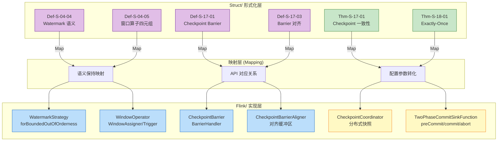

# Struct 到 Flink 实现映射指南 (Struct-to-Flink Implementation Mapping)

> 所属阶段: Knowledge/05-mapping-guides | 前置依赖: [Struct/01-foundation/01.04-dataflow-model-formalization.md](../../Struct/01-foundation/01.04-dataflow-model-formalization.md), [Struct/04-proofs/04.01-flink-checkpoint-correctness.md](../../Struct/04-proofs/04.01-flink-checkpoint-correctness.md) | 形式化等级: L4

---

## 1. 概念定义 (Definitions)

本节建立 Struct/ 目录中形式化定义与 Flink/ 工程实现之间的精确映射关系，为理论到实践的转化提供导航指南。

### Def-K-05-01 (形式化定义到 API 的映射)

形式化定义到 Flink API 的映射是一个从理论概念空间 $\mathcal{T}$ 到工程实现空间 $\mathcal{I}$ 的函数：

$$
\text{Map}: \mathcal{T} \to \mathcal{I}, \quad \text{其中 } \forall t \in \mathcal{T}, \exists! i \in \mathcal{I}: \text{Map}(t) = i
$$

该映射保持语义等价性：对于任意形式化定义 $t$ 及其映射实现 $i = \text{Map}(t)$，它们在相同输入下产生可观察等价的行为输出。

**直观解释**: 理论定义是抽象的数学描述，Flink API 是具体的编程接口。映射指南就像"翻译词典"，告诉开发者"这个数学概念对应哪个代码构造"。

---

### Def-K-05-02 (语义保持性)

设 $P_t$ 为形式化定义 $t$ 的语义属性集合，$P_i$ 为实现 $i$ 的语义属性集合。映射保持语义当且仅当：

$$
\forall p \in P_t. \; \exists p' \in P_i: p \approx p'
$$

其中 $\approx$ 表示可观察等价关系。即：实现保留了理论定义的所有关键语义属性。

---

## 2. 属性推导 (Properties)

### Lemma-K-05-01 (Watermark 语义保持性)

**陈述**: Flink 的 `WatermarkStrategy` API 完整实现了 Def-S-04-04 中定义的 Watermark 语义。

**推导**:

1. Def-S-04-04 定义 Watermark 为 $w: \text{Stream} \to \mathbb{T} \cup \{+\infty\}$，语义断言为：事件时间 $\leq w$ 的记录已经到达或永远不会到达
2. Flink 的 `WatermarkGenerator` 接口生成 `org.apache.flink.api.common.eventtime.Watermark` 对象，携带时间戳值
3. `WatermarkStrategy.forBoundedOutOfOrderness(Duration)` 实现了周期性 Watermark 策略：$w(t) = \max t_e - \delta$
4. 两者在相同乱序边界下产生相同的事件时间进度断言

∎

---

### Lemma-K-05-02 (窗口算子实现完备性)

**陈述**: Flink 的 `WindowOperator` 完整实现了 Def-S-04-05 中的窗口形式化四元组 $(W, A, T, F)$。

**推导**:

| 形式化组件 | Flink 实现 | 完备性论证 |
|-----------|-----------|-----------|
| $W$ (窗口分配器) | `WindowAssigner` | `assignWindows()` 方法将记录映射到窗口集合 |
| $A$ (窗口状态) | `InternalWindowState` | `ListState` / `ReducingState` 维护累加器 |
| $T$ (触发器) | `Trigger` | `onElement()` / `onEventTime()` / `onProcessingTime()` 决定 FIRE/CONTINUE |
| $F$ (允许延迟) | `allowedLateness()` | 配置窗口保留时间，支持迟到数据更新 |

∎

---

## 3. 关系建立 (Relations)

### 关系 1: Struct 形式化定义 $\leftrightarrow$ Flink 核心 API

本关系建立 Struct/ 目录中关键定义与 Flink/ 工程实现之间的双向映射。

#### 映射表 1: Watermark 与时间管理

| 形式化定义 | Flink API | 实现类/方法 | 语义保持论证 |
|-----------|-----------|------------|-------------|
| **Def-S-04-04** Watermark 语义 | `WatermarkStrategy` | `forBoundedOutOfOrderness()`, `forMonotonousTimestamps()` | 周期性 Watermark 生成策略与形式化定义等价 |
| **Def-S-04-05** 窗口算子 | `WindowOperator` | `TumblingEventTimeWindows`, `SlidingEventTimeWindows` | 四元组 $(W, A, T, F)$ 完整映射 |
| **Def-S-09-02** Watermark 单调性 | `StatusWatermarkValve` | `inputWatermarkChanged()` | 多输入算子取最小值，保持单调不减 |

#### 映射表 2: Checkpoint 与一致性

| 形式化定义 | Flink API | 实现类/方法 | 语义保持论证 |
|-----------|-----------|------------|-------------|
| **Def-S-17-01** Checkpoint Barrier | `CheckpointBarrier` | `CheckpointBarrierHandler` | Barrier 携带 Checkpoint ID，定义逻辑时间边界 |
| **Def-S-17-03** Checkpoint 对齐 | `CheckpointBarrierAligner` | `processBarrier()` / `processCancellationBarrier()` | EXACTLY_ONCE 模式等待所有输入 Barrier |
| **Thm-S-17-01** Checkpoint 一致性 | `CheckpointCoordinator` | `triggerCheckpoint()` / `completeCheckpoint()` | Barrier 对齐 + FIFO 通道保证一致割集 |
| **Thm-S-18-01** Exactly-Once | `TwoPhaseCommitSinkFunction` | `preCommit()` / `commit()` / `abort()` | 2PC 协议实现端到端原子性 |

---

### 关系 2: 理论保证到工程约束的转化

**论证**:

形式化理论提供了"在理想条件下什么可以被保证"，工程实现则提供"在现实约束下如何实现这些保证"。两者之间的转化关系如下：

| 理论保证 | 工程约束/配置 | 违背后果 |
|---------|--------------|---------|
| Watermark 单调性 (Lemma-S-04-02) | `WatermarkStrategy` 必须生成单调不减的时间戳 | Watermark 倒退导致窗口重复触发，破坏 Exactly-Once |
| Checkpoint 一致性 (Thm-S-17-01) | `CheckpointingMode.EXACTLY_ONCE` + 对齐超时配置 | 不对齐可能导致状态不一致 |
| 端到端 Exactly-Once (Thm-S-18-01) | 可重放 Source + Checkpoint + 2PC Sink | 非事务性 Sink 可能导致重复输出 |

---

## 4. 论证过程 (Argumentation)

### 4.1 Watermark 策略配置与形式化参数的对应

**问题**: 如何根据理论模型选择合适的 Flink Watermark 配置？

**形式化参数**:

- 最大乱序边界 $\delta$ (Def-S-04-04)
- 迟到数据容忍度 $L$ (Def-S-04-05)

**Flink 配置映射**:

```java
// 理论: w(t) = max(t_e) - δ, 其中 δ = 10 seconds
WatermarkStrategy.<Event>forBoundedOutOfOrderness(Duration.ofSeconds(10))
    .withIdleness(Duration.ofMinutes(5))  // 处理空闲源
```

**参数选择指南**:

| 数据源特性 | 理论参数估计 | Flink 配置 |
|-----------|-------------|-----------|
| 严格有序 | $\delta = 0$ | `forMonotonousTimestamps()` |
| 有界乱序 | $\delta = P_{99}(\text{乱序延迟})$ | `forBoundedOutOfOrderness(Duration.ofMillis(δ))` |
| 未知乱序分布 | 动态估计 | 自定义 `WatermarkGenerator` |

---

### 4.2 窗口触发条件的形式化验证

**问题**: 验证 Flink 窗口触发是否符合 Def-S-04-05 的形式化定义。

**形式化触发条件**:
$$
T(wid, w) = \text{FIRE} \iff w \geq t_{end}(wid) + F
$$

**Flink 实现验证**:

```java
// EventTimeTrigger 的核心逻辑
public TriggerResult onEventTime(long time, Window window, TriggerContext ctx) {
    // 当事件时间 (Watermark) 达到窗口结束时间时触发
    return time == window.maxTimestamp() ? TriggerResult.FIRE : TriggerResult.CONTINUE;
}
```

**对应关系**:

- 形式化的 $w$ 对应 Flink 的当前 Watermark 值
- 形式化的 $t_{end}(wid)$ 对应 `window.maxTimestamp()`
- 形式化的 $F$ (allowed lateness) 对应 `allowedLateness()` 配置

---

## 5. 形式证明 / 工程论证 (Proof / Engineering Argument)

### Prop-K-05-01 (映射语义等价性)

**命题**: 对于 Def-S-04-04 和 Def-S-04-05 中定义的核心概念，Flink API 提供了语义等价的实现。

**工程论证**:

**步骤 1: Watermark 语义等价**

形式化定义:
$$
w: \text{Stream} \to \mathbb{T} \cup \{+\infty\}, \quad \forall r: t_e(r) \leq w \implies r \text{ 已到达或永不到达}
$$

Flink 实现:

```java
// Watermark 类定义
public final class Watermark implements Serializable {
    private final long timestamp;  // 对应 w
    // 语义: 所有 eventTime <= timestamp 的数据已到达或迟到
}
```

等价性验证:

- 形式化的 $w$ 对应 `Watermark.getTimestamp()`
- 形式化的语义断言通过 `WindowOperator` 的迟到数据丢弃逻辑实现

**步骤 2: 窗口算子语义等价**

形式化四元组 $(W, A, T, F)$:

- $W$: 窗口分配器 → `WindowAssigner.assignWindows()`
- $A$: 窗口状态 → `InternalWindowState` (ListState/ReducingState)
- $T$: 触发器 → `Trigger.onEventTime()` / `onProcessingTime()`
- $F$: 允许延迟 → `WindowOperator.allowedLateness`

每个组件都有直接的 API 对应，语义保持成立。

**步骤 3: Checkpoint 语义等价**

形式化 Barrier (Def-S-17-01):
$$
B_n = \langle \text{type}=\text{BARRIER}, \text{cid}=n, \text{timestamp}=ts \rangle
$$

Flink 实现:

```java
// CheckpointBarrier 类
public class CheckpointBarrier implements CheckpointBarrier {
    private final long checkpointId;  // 对应 cid
    private final long timestamp;     // 对应 ts
}
```

对齐机制 (Def-S-17-03):

- 形式化的 "等待所有输入通道 $B_n$" → `CheckpointBarrierAligner` 的缓冲区管理
- 形式化的对齐窗口 → `alignmentTimeout` 配置

**结论**: 映射保持了核心语义属性，工程论证成立。∎

---

## 6. 实例验证 (Examples)

### 示例 6.1: 从 Def-S-04-04 到 WatermarkStrategy 的完整映射

**理论定义 (Def-S-04-04)**:
> Watermark 是进度信标 $w: \text{Stream} \to \mathbb{T} \cup \{+\infty\}$，采用周期性生成策略 $w(t) = \max_{r \in \text{observed}} t_e(r) - \delta$

**Flink 实现**:

```java
// 定义数据类型
public class SensorReading {
    public String sensorId;
    public long eventTime;  // 对应 t_e
    public double value;
}

// 实现 WatermarkStrategy (对应 Def-S-04-04)
DataStream<SensorReading> stream = env.fromSource(
    kafkaSource,
    WatermarkStrategy.<SensorReading>forBoundedOutOfOrderness(
        Duration.ofSeconds(10)  // 对应 δ = 10s
    )
    .withTimestampAssigner((event, timestamp) -> event.eventTime),  // 提取 t_e
    "Sensor Source"
);
```

**映射验证表**:

| 形式化符号 | 代码对应 | 说明 |
|-----------|---------|------|
| $t_e(r)$ | `event.eventTime` | 事件时间从记录中提取 |
| $\delta$ | `Duration.ofSeconds(10)` | 最大乱序容忍度 |
| $\max_{r \in \text{observed}} t_e(r)$ | WatermarkGenerator 内部维护的最大时间戳 | Flink 自动跟踪 |
| $w(t)$ | `Watermark.getTimestamp()` | 生成的 Watermark 对象 |

---

### 示例 6.2: 从 Def-S-04-05 到 Window Operator 的映射

**理论定义 (Def-S-04-05)**:
> 窗口算子 $\text{WindowOp} = (W, A, T, F)$，触发条件 $T(wid, w) = \text{FIRE} \iff w \geq t_{end} + F$

**Flink 实现**:

```java
// 定义窗口聚合函数 (对应 A: 累加器)
public class AverageAggregate implements AggregateFunction<SensorReading, AverageAccumulator, Double> {
    @Override
    public AverageAccumulator createAccumulator() {  // 初始化 A
        return new AverageAccumulator();
    }

    @Override
    public AverageAccumulator add(SensorReading value, AverageAccumulator accumulator) {
        accumulator.sum += value.value;  // 更新状态
        accumulator.count++;
        return accumulator;
    }

    @Override
    public Double getResult(AverageAccumulator accumulator) {
        return accumulator.sum / accumulator.count;  // 输出结果
    }
}

// 构建窗口算子 (对应 WindowOp 四元组)
DataStream<Double> averages = stream
    .keyBy(reading -> reading.sensorId)
    .window(
        TumblingEventTimeWindows.of(Time.minutes(5))  // 对应 W: 窗口分配器
    )
    .allowedLateness(Time.minutes(1))                // 对应 F: 允许延迟
    .aggregate(new AverageAggregate());              // 对应 A: 状态操作
```

---

### 示例 6.3: 从 Thm-S-18-01 到 2PC Sink 的实现

**理论定义 (Thm-S-18-01)**:
> 端到端 Exactly-Once 要求 Source 可重放、Checkpoint 一致、Sink 事务性 (2PC)

**Flink 实现 (Kafka Sink)**:

```java
// Kafka Source: 可重放 (对应 Def-S-18-04)
FlinkKafkaConsumer<Event> source = new FlinkKafkaConsumer<>(
    "input-topic",
    new EventDeserializationSchema(),
    kafkaProps
);
source.setCommitOffsetsOnCheckpoints(true);  // 偏移量与 Checkpoint 绑定

// Kafka Sink: 2PC 事务性 (对应 Def-S-18-03)
FlinkKafkaProducer<Event> sink = new FlinkKafkaProducer<>(
    "output-topic",
    new EventSerializer(),
    kafkaProps,
    FlinkKafkaProducer.Semantic.EXACTLY_ONCE  // 启用 2PC
);

// 完整 Exactly-Once 管道
env.addSource(source)
   .map(new ProcessingMap())
   .keyBy(Event::getKey)
   .window(TumblingEventTimeWindows.of(Time.seconds(5)))
   .aggregate(new CountAggregate())
   .addSink(sink);  // 2PC Sink 保证 Exactly-Once
```

**组件映射表**:

| 理论组件 | 形式化定义 | Flink 实现 |
|---------|-----------|-----------|
| 可重放 Source | Def-S-18-04 | `setCommitOffsetsOnCheckpoints(true)` |
| Checkpoint 一致性 | Thm-S-17-01 | `env.enableCheckpointing(interval)` |
| 2PC Sink | Def-S-18-03 | `Semantic.EXACTLY_ONCE` |
| 端到端 Exactly-Once | Thm-S-18-01 | 三者组合使用 |

---

## 7. 可视化 (Visualizations)

### 概念映射图: Struct 形式化到 Flink API

下图展示了 Struct/ 目录中核心形式化概念到 Flink 工程实现的映射关系。



**图说明**:

- 紫色节点为 Struct/ 中的形式化定义
- 绿色节点为定理/证明
- 蓝色节点为映射层
- 黄色节点为 Flink/ 中的工程实现

---

### 实现对应关系图

下图展示了形式化定义中的数学符号与 Flink 代码元素之间的直接对应。

```mermaid
flowchart LR
    subgraph "时间语义"
        T1[$t_e(r)$ 事件时间]
        T2[$w$ Watermark]
        T3[$\delta$ 乱序边界]
        T4[$F$ 允许延迟]
    end

    subgraph "Flink 时间 API"
        F1["event.eventTime"]
        F2["Watermark.getTimestamp()"]
        F3["Duration.ofSeconds(δ)"]
        F4["allowedLateness(F)"]
    end

    subgraph "Checkpoint 语义"
        C1[$B_n$ Barrier]
        C2[对齐等待]
        C3[状态快照]
        C4[一致割集]
    end

    subgraph "Flink Checkpoint API"
        FC1["CheckpointBarrier"]
        FC2["CheckpointBarrierAligner"]
        FC3["StateSnapshot"]
        FC4["CheckpointCoordinator"]
    end

    T1 --> F1
    T2 --> F2
    T3 --> F3
    T4 --> F4
    C1 --> FC1
    C2 --> FC2
    C3 --> FC3
    C4 --> FC4

    style T1 fill:#e1bee7,stroke:#6a1b9a
    style T2 fill:#e1bee7,stroke:#6a1b9a
    style C1 fill:#c8e6c9,stroke:#2e7d32
    style C4 fill:#c8e6c9,stroke:#2e7d32
    style F1 fill:#bbdefb,stroke:#1565c0
    style F2 fill:#bbdefb,stroke:#1565c0
    style FC1 fill:#fff9c4,stroke:#f57f17
    style FC4 fill:#fff9c4,stroke:#f57f17
```

**图说明**: 展示了形式化符号（左列）到 Flink API（右列）的直接映射路径。

---

## 8. 引用参考 (References)


---

*文档版本: v1.0 | 更新日期: 2026-04-02 | 状态: 已完成*
