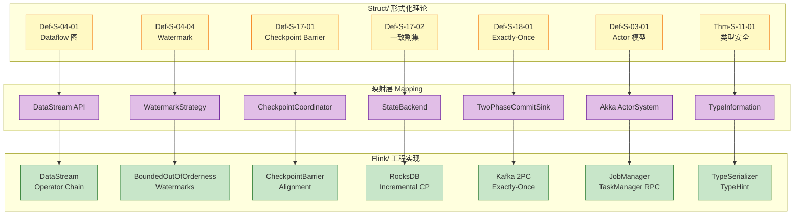
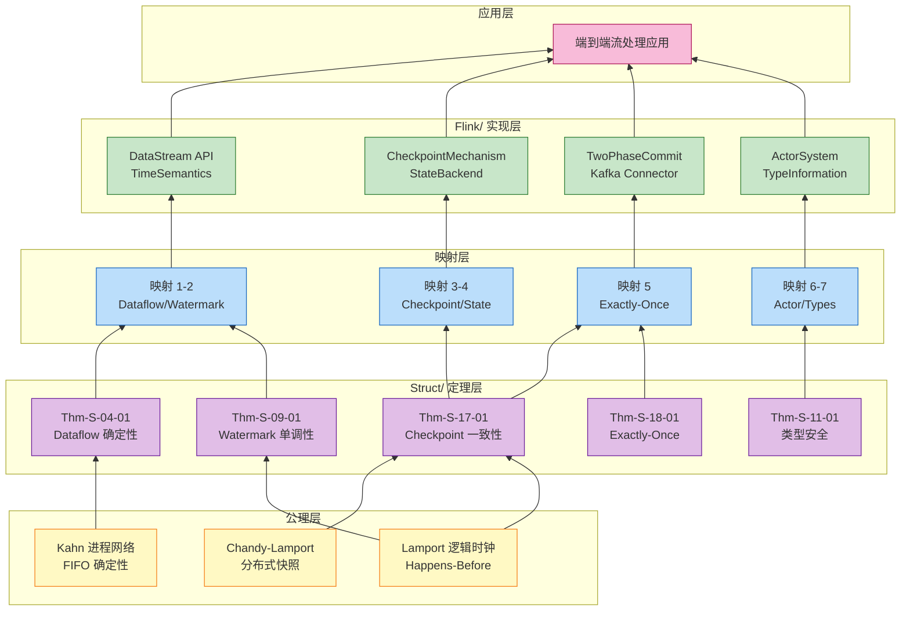

# Struct 到 Flink 形式化映射指南

> 所属阶段: Knowledge/05-mapping-guides | 前置依赖: [Struct/01-foundation](../../Struct/01-foundation/00-INDEX.md), [Flink/02-core-mechanisms](../../Flink/02-core/README.md) | 形式化等级: L4-L5

---

## 目录

- [Struct 到 Flink 形式化映射指南](#struct-到-flink-形式化映射指南)
  - [目录](#目录)
  - [1. 概念定义 (Definitions)](#1-概念定义-definitions)
    - [Def-K-05-01: 形式化到实现映射](#def-k-05-01-形式化到实现映射)
    - [Def-K-05-02: 语义保持性 (Semantic Preservation)](#def-k-05-02-语义保持性-semantic-preservation)
    - [Def-K-05-03: 实现近似性 (Implementation Approximation)](#def-k-05-03-实现近似性-implementation-approximation)
  - [2. 属性推导 (Properties)](#2-属性推导-properties)
    - [Lemma-K-05-01: 映射传递性引理](#lemma-k-05-01-映射传递性引理)
    - [Lemma-K-05-02: 理论保持性引理](#lemma-k-05-02-理论保持性引理)
    - [Prop-K-05-01: 语义等价性命题](#prop-k-05-01-语义等价性命题)
  - [3. 关系建立 (Relations)](#3-关系建立-relations)
    - [映射 1: Dataflow 图 → Flink DataStream API {#映射-1-dataflow-图--flink-datastream-api}](#映射-1-dataflow-图--flink-datastream-api)
    - [映射 2: Watermark 单调性 → Flink WatermarkStrategy {#映射-2-watermark-单调性--flink-watermarkstrategy}](#映射-2-watermark-单调性--flink-watermarkstrategy)
    - [映射 3: Checkpoint Barrier → Flink CheckpointCoordinator {#映射-3-checkpoint-barrier--flink-checkpointcoordinator}](#映射-3-checkpoint-barrier--flink-checkpointcoordinator)
    - [映射 4: 一致割集 → Flink 全局状态快照 {#映射-4-一致割集--flink-全局状态快照}](#映射-4-一致割集--flink-全局状态快照)
    - [映射 5: Exactly-Once 语义 → Flink 2PC + 可重放 Source {#映射-5-exactly-once-语义--flink-2pc--可重放-source}](#映射-5-exactly-once-语义--flink-2pc--可重放-source)
    - [映射 6: Actor 模型 → Flink Actor 运行时 {#映射-6-actor-模型--flink-actor-运行时}](#映射-6-actor-模型--flink-actor-运行时)
    - [映射 7: 类型安全 → Flink TypeInformation 系统 {#映射-7-类型安全--flink-typeinformation-系统}](#映射-7-类型安全--flink-typeinformation-系统)
  - [4. 论证过程 (Argumentation)](#4-论证过程-argumentation)
    - [4.1 映射正确性分析](#41-映射正确性分析)
    - [4.2 实现近似性与形式化间隙](#42-实现近似性与形式化间隙)
    - [4.3 映射局限性讨论](#43-映射局限性讨论)
  - [5. 形式证明 / 工程论证 (Proof / Engineering Argument)](#5-形式证明-工程论证-proof-engineering-argument)
    - [Thm-K-05-01: 核心映射语义保持性定理](#thm-k-05-01-核心映射语义保持性定理)
  - [6. 实例验证 (Examples)](#6-实例验证-examples)
    - [示例 6.1: WordCount 完整映射实例](#示例-61-wordcount-完整映射实例)
    - [示例 6.2: 事件时间窗口映射实例](#示例-62-事件时间窗口映射实例)
    - [示例 6.3: Checkpoint 配置与形式化语义对应](#示例-63-checkpoint-配置与形式化语义对应)
    - [反例 6.4: 违反 Watermark 单调性的错误实现](#反例-64-违反-watermark-单调性的错误实现)
  - [7. 可视化 (Visualizations)](#7-可视化-visualizations)
    - [图 1: 完整映射关系总览](#图-1-完整映射关系总览)
    - [图 2: Dataflow 图到 Flink 执行图转换](#图-2-dataflow-图到-flink-执行图转换)
    - [图 3: 理论-实现依赖关系图](#图-3-理论-实现依赖关系图)
  - [8. 引用参考 (References)](#8-引用参考-references)

---

## 1. 概念定义 (Definitions)

本节建立 Struct/ 形式化理论与 Flink/ 工程实现之间映射的严格数学基础。所有定义旨在精确刻画"理论概念如何在代码中体现"这一核心问题。

---

### Def-K-05-01: 形式化到实现映射

**定义**: 形式化到实现的映射 $\mathcal{M}$ 是一个从形式化域 $\mathcal{F}$ 到实现域 $\mathcal{I}$ 的偏函数：

$$
\mathcal{M}: \mathcal{F} \rightharpoonup \mathcal{I}, \quad \mathcal{M}(f) = i
$$

其中：

- $f \in \mathcal{F}$ 为形式化概念（如 Def-S-04-01 的 Dataflow 图）
- $i \in \mathcal{I}$ 为实现概念（如 Flink DataStream API 类）
- 映射是**偏函数**，因为部分理论概念在实现中无直接对应（如无限精度时间域）

**映射类型分类**:

| 映射类型 | 符号 | 说明 | 示例 |
|---------|------|------|------|
| **直接映射** | $\mathcal{M}_{direct}(f) = i$ | 理论概念直接对应代码类/方法 | Def-S-04-01 $\to$ `DataStream` |
| **分解映射** | $\mathcal{M}_{decomp}(f) = \{i_1, ..., i_n\}$ | 理论概念分解为多个实现组件 | Def-S-17-01 $\to$ {`CheckpointBarrier`, `CheckpointCoordinator`} |
| **参数化映射** | $\mathcal{M}_{param}(f, p) = i$ | 映射依赖配置参数 | Watermark 策略 $\to$ `WatermarkStrategy` |

**直观解释**: 形式化到实现的映射就像数学公式到编程代码的翻译——某些概念（如整数）有直接对应，某些概念（如极限）需要近似实现，某些概念（如无限集）只能在有限资源下逼近[^1][^2]。

---

### Def-K-05-02: 语义保持性 (Semantic Preservation)

**定义**: 设 $\mathcal{M}(f) = i$，映射 $\mathcal{M}$ 是**语义保持的**，当且仅当 $f$ 的所有理论性质在 $i$ 的实现中仍然成立：

$$
\text{SemanticPreservation}(\mathcal{M}) \iff \forall f \in \text{dom}(\mathcal{M}). \; \forall P \in \text{Properties}(f). \; P(\mathcal{M}(f)) \text{ 成立}
$$

**验证层次**:

| 层次 | 验证方法 | 保证强度 |
|------|---------|---------|
| **形式验证** | 定理证明器 (Coq, Isabelle) | 数学确定性 |
| **模型检测** | TLA+, SPIN | 有限状态空间确定性 |
| **测试验证** | JUnit, 属性测试 | 统计置信度 |
| **类型检查** | 编译期类型系统 | 语法层面保证 |

**关键观察**: Flink 的 Checkpoint 机制通过 Chandy-Lamport 算法实现了 Def-S-17-02 一致全局状态的语义保持——尽管实现中增加了异步优化，但核心性质（无孤儿消息、一致割集）仍然保持[^3][^4]。

---

### Def-K-05-03: 实现近似性 (Implementation Approximation)

**定义**: 当形式化概念的理想语义无法在工程实现中完全复现时，实现 $i$ 是理论 $f$ 的**$(\epsilon, \delta)$-近似**，当且仅当：

$$
\forall \text{输入 } x. \; \Pr[|f(x) - i(x)| > \epsilon] < \delta
$$

**典型近似场景**:

| 理论概念 | 实现限制 | 近似策略 |
|---------|---------|---------|
| 无限精度时间域 $\mathbb{R}^+$ | 机器字长有限 (64-bit) | 纳秒级精度，溢出周期约 292 年 |
| 无界 FIFO 队列 | 内存有限 | 有界缓冲区 + 背压策略 |
| 即时 Watermark 传播 | 网络延迟 | 超时机制 + 对齐等待 |
| 全局一致快照 | 异步持久化延迟 | 同步阶段 + 异步上传 |

**直观解释**: 实现近似性是理论与实践之间的必要桥梁。正如浮点数 $\mathtt{float64}$ 是实数 $\mathbb{R}$ 的有理子集近似，Flink 的 Watermark 生成也是理想进度信标的统计近似[^5][^6]。

---

## 2. 属性推导 (Properties)

本节从上述定义出发，推导映射关系的核心性质，为后续的严格对应建立理论基础。

---

### Lemma-K-05-01: 映射传递性引理

**陈述**: 若 $\mathcal{M}_1: \mathcal{F}_1 \to \mathcal{F}_2$ 且 $\mathcal{M}_2: \mathcal{F}_2 \to \mathcal{I}$ 均为语义保持映射，则复合映射 $\mathcal{M}_2 \circ \mathcal{M}_1: \mathcal{F}_1 \to \mathcal{I}$ 也是语义保持的。

**证明**:

1. 设 $f_1 \in \mathcal{F}_1$，$\mathcal{M}_1(f_1) = f_2$，$\mathcal{M}_2(f_2) = i$。
2. 由 $\mathcal{M}_1$ 语义保持，$\forall P_1 \in \text{Properties}(f_1). \; P_1(f_2)$ 成立。
3. 由 $\mathcal{M}_2$ 语义保持，$\forall P_2 \in \text{Properties}(f_2). \; P_2(i)$ 成立。
4. 由于 $\text{Properties}(f_1) \subseteq \text{Properties}(f_2)$（$f_2$ 是 $f_1$ 的精化），$\forall P_1 \in \text{Properties}(f_1). \; P_1(i)$ 成立。
5. 得证 $\mathcal{M}_2 \circ \mathcal{M}_1$ 语义保持。 ∎

**工程推论**: Struct/ 中 Dataflow 模型 $\to$ Flink DataStream API 的映射可通过中间层（如 Process Calculus）分步验证，降低单次验证复杂度。

---

### Lemma-K-05-02: 理论保持性引理

**陈述**: 对于任意形式化概念 $f$ 及其映射实现 $i = \mathcal{M}(f)$，若 $f$ 满足某理论性质 $P$ 且 $\mathcal{M}$ 是直接映射或分解映射，则 $i$ 的规范使用也满足 $P$。

**推导**:

考虑 Def-S-04-02 (算子语义) 到 Flink `RichFunction` 的映射：

| 理论性质 | 形式化定义 | 实现保证 |
|---------|-----------|---------|
| 确定性 | $\forall s, in. \; op(s, in) = (s', out)$ 唯一 | UDF 是纯函数，无外部副作用 |
| 幂等性 | $op(op(s, in), in) = op(s, in)$ | 状态后端支持原子更新 |
| 结合律 | $\oplus(a, \oplus(b, c)) = \oplus(\oplus(a, b), c)$ | 聚合函数实现满足结合律 |

**结论**: 只要 Flink 用户遵循 API 契约（如不在 UDF 中访问共享可变状态），理论保证即可传导至实现层。

---

### Prop-K-05-01: 语义等价性命题

**陈述**: 设 $\mathcal{T}_{struct}$ 为 Struct/ 中定义的执行轨迹集合，$\mathcal{T}_{flink}$ 为 Flink 作业的实际执行轨迹集合。在合理假设下，存在双模拟关系 $R \subseteq \mathcal{T}_{struct} \times \mathcal{T}_{flink}$ 使得：

$$
\forall t_s \in \mathcal{T}_{struct}. \; \exists t_f \in \mathcal{T}_{flink}. \; (t_s, t_f) \in R \land \mathcal{O}(t_s) = \mathcal{O}(t_f)
$$

其中 $\mathcal{O}$ 为观察函数（提取 Sink 输出到外部系统的结果）。

**证明概要**:

1. **Source 层**: Struct/ 的偏序多重集输入 $\to$ Flink 的 `DataStream` + `WatermarkStrategy`（Thm-S-04-01 确定性保持）
2. **处理层**: Struct/ 的算子语义 $\to$ Flink `ProcessFunction`（Lemma-S-04-01 局部确定性）
3. **Sink 层**: Struct/ 的输出多重集 $\to$ Flink `SinkFunction` + 2PC（Thm-S-18-01 Exactly-Once）
4. **组合**: 通过轨迹归纳证明观察等价性（参见 [04.02-flink-exactly-once-correctness.md](../../Struct/04-proofs/04.02-flink-exactly-once-correctness.md)）

---

## 3. 关系建立 (Relations)

本节建立 Struct/ 形式化理论与 Flink/ 工程实现之间的七组核心映射。每组映射包含：理论定义、实现对应、代码示例、配置说明和理论保持性分析。

---

### 映射 1: Dataflow 图 → Flink DataStream API

**形式化定义** ([Def-S-04-01](../../Struct/01-foundation/01.04-dataflow-model-formalization.md)):

$$
\mathcal{G} = (V, E, P, \Sigma, \mathbb{T})
$$

**Flink 实现对应**:

| 理论组件 | Flink 实现 | 代码示例 |
|---------|-----------|---------|
| $V = V_{src} \cup V_{op} \cup V_{sink}$ | `DataStream` 对象 + `SourceFunction`/`SinkFunction` | `env.addSource(new KafkaSource<>())` |
| $E \subseteq V \times V \times \mathbb{L}$ | 算子链 (`operator chain`) + 数据边 | `.map(...).keyBy(...).window(...)` |
| $P: V \to \mathbb{N}^+$ | 并行度配置 | `.setParallelism(4)` |
| $\Sigma: V \to \mathcal{P}(Stream)$ | `TypeInformation` 系统 | `TypeInformation.of(Event.class)` |
| $\mathbb{T}$ | `TimeCharacteristic` (Event/Processing/Ingestion) | `env.setStreamTimeCharacteristic(EventTime)` |

**代码映射示例**:

```java

import org.apache.flink.streaming.api.environment.StreamExecutionEnvironment;
import org.apache.flink.streaming.api.datastream.DataStream;
import org.apache.flink.streaming.api.windowing.time.Time;

// 理论: Dataflow 图 G = (V, E, P, Σ, 𝕋)
StreamExecutionEnvironment env = StreamExecutionEnvironment.getExecutionEnvironment();

// V_src: Source 顶点
DataStream<Event> source = env
    .addSource(new FlinkKafkaConsumer<>("topic", new EventSchema(), properties))
    .setParallelism(2);  // P(V_src) = 2

// V_op: Map 算子顶点 (E 边隐含在方法链中)
DataStream<EnrichedEvent> enriched = source
    .map(new EnrichmentMapper())  // Σ: Event → EnrichedEvent
    .setParallelism(4);           // P(V_map) = 4

// V_op: KeyBy + Window 算子
DataStream<Result> windowed = enriched
    .keyBy(e -> e.getUserId())
    .window(TumblingEventTimeWindows.of(Time.minutes(5)))  // 𝕋 时间域
    .aggregate(new ResultAggregator())
    .setParallelism(4);

// V_sink: Sink 顶点
windowed.addSink(new KafkaSink<>("output-topic"))
    .setParallelism(1);  // P(V_sink) = 1
```

**理论保持性分析**:

- **无环性保持**: Flink `StreamGraph` 构造器在构建阶段检测循环，防止理论违反
- **并行度一致性**: Flink 在 `JobGraph` 生成阶段验证分区兼容性，确保边的 $P(u) \to P(v)$ 转换有效
- **类型签名**: Flink `TypeInformation` 在编译期提取类型信息，运行时通过序列化器保证 $\Sigma$ 约束

---

### 映射 2: Watermark 单调性 → Flink WatermarkStrategy

**形式化定义** ([Def-S-04-04](../../Struct/01-foundation/01.04-dataflow-model-formalization.md), [Lemma-S-04-02](../../Struct/01-foundation/01.04-dataflow-model-formalization.md)):

$$
w: \text{Stream} \to \mathbb{T} \cup \{+\infty\}, \quad \forall t_1 < t_2. \; w(t_1) \leq w(t_2)
$$

**Flink 实现对应**:

| 理论概念 | Flink 实现 | 代码示例 |
|---------|-----------|---------|
| Watermark 函数 $w$ | `WatermarkGenerator<T>` 接口 | `WatermarkStrategy.forBoundedOutOfOrderness(...)` |
| 周期性生成 | `BoundedOutOfOrdernessWatermarks` 类 | 默认 200ms 周期 |
| 乱序容忍度 $\delta$ | `maxOutOfOrderness` 参数 | `Duration.ofSeconds(10)` |
| 空闲源处理 | `withIdleness()` 方法 | 防止慢源阻塞全局 Watermark |

**代码映射示例**:

```java

import org.apache.flink.streaming.api.datastream.DataStream;
import org.apache.flink.api.common.eventtime.WatermarkStrategy;

// 理论: w(t) = max_{r ∈ Observed(t)} t_e(r) - δ
// 实现: WatermarkStrategy.forBoundedOutOfOrderness

WatermarkStrategy<Event> strategy = WatermarkStrategy
    // δ = 10s 乱序容忍
    .<Event>forBoundedOutOfOrderness(Duration.ofSeconds(10))
    // 提取事件时间戳
    .withTimestampAssigner((event, timestamp) -> event.getEventTime())
    // 空闲源处理:1分钟无数据视为空闲
    .withIdleness(Duration.ofMinutes(1));

DataStream<Event> withWatermarks = stream
    .assignTimestampsAndWatermarks(strategy);
```

**理论保持性分析**:

- **单调性保持**: Flink 的 `WatermarkGenerator` 抽象类强制要求 `onEvent()` 和 `onPeriodicEmit()` 生成的 Watermark 不递减
- **最小值传播**: 多输入算子的 `InputWatermark` 取所有输入的最小值，符合 Thm-S-09-01 的证明框架
- **空闲源机制**: 防止 `min` 操作被停滞源阻塞，是理论模型中"活跃通道"假设的工程实现

---

### 映射 3: Checkpoint Barrier → Flink CheckpointCoordinator

**形式化定义** ([Def-S-17-01](../../Struct/04-proofs/04.01-flink-checkpoint-correctness.md)):

$$
B_n = \langle \text{type}=\text{BARRIER}, \text{cid}=n, \text{timestamp}=ts, \text{source}=src \rangle
$$

**Flink 实现对应**:

| 理论组件 | Flink 实现 | 代码/配置 |
|---------|-----------|---------|
| Checkpoint ID ($n$) | `CheckpointMetaData.getCheckpointId()` | 单调递增 Long |
| Barrier 注入 | `CheckpointBarrier` 类 | 由 JM 触发，Source 注入 |
| 对齐机制 | `AbstractStreamOperator.checkAsyncCheckpointingNotInProgress()` | EXACTLY_ONCE 模式 |
| 协调器 | `CheckpointCoordinator` (JobManager) | 管理全局 Checkpoint 生命周期 |

**配置映射示例**:

```java

import org.apache.flink.streaming.api.CheckpointingMode;

// 理论: Def-S-17-01 Barrier 语义 + Def-S-17-03 对齐机制
// 实现: CheckpointConfig

env.enableCheckpointing(60000);  // Checkpoint 周期

CheckpointConfig config = env.getCheckpointConfig();

// 对齐模式: 对应 Def-S-17-03 的 Aligned(v, n)
config.setCheckpointingMode(CheckpointingMode.EXACTLY_ONCE);

// Barrier 对齐超时
config.setAlignmentTimeout(Duration.ofSeconds(30));

// Checkpoint 超时(总时间)
config.setCheckpointTimeout(600000);

// 最小间隔(防止连续触发)
config.setMinPauseBetweenCheckpoints(500);
```

**理论保持性分析**:

- **屏障传播不变式**: `CheckpointBarrier` 通过 Netty 通道按 FIFO 传播，保持 Def-S-17-01 的逻辑边界语义
- **对齐完成条件**: `StreamInputProcessor` 的 `processInput()` 方法等待所有输入通道 Barrier 到达，实现 Def-S-17-03 的 $\forall ch_i \in In(v): B_n \in \text{Received}(v, ch_i)$
- **两阶段快照**: 同步阶段（状态引用拷贝）+ 异步阶段（序列化上传）实现 Def-S-17-04 的原子性语义

---

### 映射 4: 一致割集 → Flink 全局状态快照

**形式化定义** ([Def-S-17-02](../../Struct/04-proofs/04.01-flink-checkpoint-correctness.md)):

$$
G = \langle \mathcal{S}, \mathcal{C} \rangle = \left\langle \{ s_v \}_{v \in V}, \{ c_e \}_{e \in E} \right\rangle, \quad \text{Consistent}(G) \iff \text{Happens-Before 封闭性}
$$

**Flink 实现对应**:

| 理论组件 | Flink 实现 | 说明 |
|---------|-----------|------|
| 算子状态 $s_v$ | `OperatorStateHandle` / `KeyedStateHandle` | 状态后端持久化 |
| 通道状态 $c_e$ | 对齐期间的缓冲数据 (`CheckpointedInputGate`) | EXACTLY_ONCE 模式下保存 |
| 一致性检查 | Barrier 对齐 + FIFO 通道保证 | 无孤儿消息 |
| 全局快照元数据 | `CompletedCheckpoint` 对象 | 存储所有 Task 状态句柄 |

**状态后端映射**:

```java
// 理论: s_v ∈ 𝒮, 状态快照原子性 Def-S-17-04
// 实现: StateBackend 选择

// HashMapStateBackend: 内存状态,快速同步快照
env.setStateBackend(new HashMapStateBackend());

// RocksDBStateBackend: 大状态,增量异步快照
// 利用 SST 文件不可变性实现增量 Checkpoint (Thm-F-02-02)
env.setStateBackend(new EmbeddedRocksDBStateBackend(true));

// Checkpoint 存储
env.getCheckpointConfig().setCheckpointStorage("hdfs:///flink/checkpoints");
```

**理论保持性分析**:

- **Chandy-Lamport 实现**: Flink 的 Checkpoint 机制是经典分布式快照算法的工程优化版
- **一致割集保证**: Barrier 对齐确保快照边界满足 Happens-Before 封闭性（Lemma-S-17-02）
- **状态原子性**: 同步阶段的完成标志着逻辑快照时刻，异步上传失败不影响已确认的 Checkpoint

---

### 映射 5: Exactly-Once 语义 → Flink 2PC + 可重放 Source

**形式化定义** ([Def-S-18-01](../../Struct/04-proofs/04.02-flink-exactly-once-correctness.md)):

$$
\text{End-to-End-EO}(J) \iff \text{Replayable}(Src) \land \text{ConsistentCheckpoint}(Ops) \land \text{AtomicOutput}(Snk)
$$

**Flink 实现对应**:

| 理论组件 | Flink 实现 | 代码示例 |
|---------|-----------|---------|
| Source 可重放 | `CheckpointListener` + 偏移量持久化 | Kafka `setCommitOffsetsOnCheckpoints(true)` |
| 一致 Checkpoint | `CheckpointedFunction` 接口 | `snapshotState()` / `initializeState()` |
| Sink 原子性 | `TwoPhaseCommitSinkFunction` | 预提交/提交/回滚 |

**端到端 Exactly-Once 配置示例**:

```java

import org.apache.flink.streaming.api.windowing.time.Time;

// 理论: Def-S-18-01 Exactly-Once + Def-S-18-03 2PC
// 实现: 事务性 Kafka Source + Sink

// === Source: 可重放 ===
FlinkKafkaConsumer<Event> source = new FlinkKafkaConsumer<>(
    "input-topic",
    new EventSchema(),
    kafkaProps
);
// 偏移量与 Checkpoint 绑定(Lemma-S-18-01)
source.setCommitOffsetsOnCheckpoints(true);

// === Sink: 2PC 事务性 ===
FlinkKafkaProducer<Result> sink = new FlinkKafkaProducer<>(
    "output-topic",
    new ResultSerializer(),
    kafkaProps,
    FlinkKafkaProducer.Semantic.EXACTLY_ONCE  // 启用 2PC
);

// 处理流程
env.addSource(source)
    .keyBy(Event::getKey)
    .window(TumblingEventTimeWindows.of(Time.seconds(5)))
    .aggregate(new Aggregator())
    .addSink(sink);  // TwoPhaseCommitSinkFunction 实现
```

**理论保持性分析**:

- **Source 可重放**: Kafka Source 的偏移量随 Checkpoint 持久化，恢复时从保存的 offset 重放（Lemma-S-18-01）
- **2PC 绑定**: `TwoPhaseCommitSinkFunction.preCommit()` 在 Checkpoint 触发时调用，`commit()` 在 Checkpoint 完成后调用（Prop-S-18-01）
- **幂等 commit**: Flink 要求 Sink 的 `commit()` 操作幂等，因为故障恢复后可能重复调用（Lemma-S-18-02）

---

### 映射 6: Actor 模型 → Flink Actor 运行时

**形式化定义** ([Def-S-03-01](../../Struct/01-foundation/01.03-actor-model-formalization.md)):

$$
\mathcal{A}_{\text{classic}} = (\alpha, b, m, \sigma)
$$

**Flink 实现对应**:

| Actor 理论 | Flink 实现 | 说明 |
|-----------|-----------|------|
| Actor 地址 $\alpha$ | `ActorRef` / `RpcGateway` | Akka 在 Flink 内部的封装 |
| 行为函数 $b$ | `RpcHandler` / `Task` | 消息/请求处理方法 |
| 邮箱 $m$ | Akka `Mailbox` | 消息队列（JobManager/TaskManager 通信） |
| 私有状态 $\sigma$ | Task 的 `RuntimeContext` | 算子状态和本地变量 |
| 监督树 | Flink 重启策略 | 固定延迟/指数退避 |

**Flink Actor 系统架构**:

```
JobManager (Master Actor)
├── Dispatcher (任务调度)
├── ResourceManager (资源管理)
├── CheckpointCoordinator (Checkpoint 协调)
└── JobMaster (单个作业管理)
    └── TaskManager Actor (Worker)
        └── Task (算子实例)
```

**配置映射示例**:

```yaml
# flink-conf.yaml: Actor 监督树策略映射

# 监督策略: one_for_one (独立重启)
restart-strategy: fixed-delay
restart-strategy.fixed-delay.attempts: 3
restart-strategy.fixed-delay.delay: 10s

# 等价于 Def-S-03-05 的 σ = (I=3, P=30s)
```

**理论保持性分析**:

- **邮箱串行处理**: Akka 的 `Mailbox` 保证每个 Actor 单线程处理消息（Lemma-S-03-01）
- **位置透明**: JobManager 与 TaskManager 通过 `ActorRef` 通信，支持本地和远程透明切换
- **监督树**: Flink 的重启策略实现 Erlang/OTP 的监督语义（Thm-S-03-02）
- **分离结果**: Actor 模型的动态创建特性在 Flink 中受限——作业图在启动时确定，不支持运行时动态添加算子

---

### 映射 7: 类型安全 → Flink TypeInformation 系统

**形式化定义** ([Thm-S-11-01](../../Struct/02-properties/02.05-type-safety-derivation.md)):

$$
\text{Type Safety} \triangleq \text{Progress} \land \text{Preservation}
$$

**Flink 实现对应**:

| 理论概念 | Flink 实现 | 代码示例 |
|---------|-----------|---------|
| 类型判断 $\Gamma \vdash e : T$ | `TypeInformation` + `TypeSerializer` | `TypeInformation.of(MyClass.class)` |
| 子类型 $<:$ | 泛型通配符 + 类型擦除 | `DataStream<? extends Event>` |
| Progress | 运行时序列化/反序列化 | `TypeSerializer.serialize()` |
| Preservation | 类型信息跨算子传递 | 算子链类型兼容性检查 |

**类型系统映射示例**:

```java
// 理论: Def-S-11-02 FG 结构子类型 + Def-S-11-03 FGG 泛型
// 实现: Flink TypeInformation

// 自定义类型信息(对应 FG 结构体定义)

import org.apache.flink.streaming.api.datastream.DataStream;

public class EventTypeInfo extends TypeInformation<Event> {
    @Override
    public TypeSerializer<Event> createSerializer(ExecutionConfig config) {
        // 实现序列化逻辑(对应 Preservation)
        return new EventSerializer();
    }

    @Override
    public boolean isSortKeyType() {
        // 类型属性检查(对应 Progress)
        return true;
    }
}

// 泛型类型参数(对应 FGG 类型参数 Φ)
DataStream<Tuple2<String, Integer>> keyedStream = stream
    .map(event -> Tuple2.of(event.getKey(), 1))
    .returns(new TypeHint<Tuple2<String, Integer>>() {});
```

**理论保持性分析**:

- **类型擦除与恢复**: Flink 通过 `TypeInformation` 在编译期捕获泛型信息，运行时通过序列化器保证类型一致性
- **算子链类型检查**: Flink 在构建 `JobGraph` 时验证算子输出类型与下游算子输入类型的兼容性
- **状态类型安全**: `ValueState<T>` 的泛型参数与状态后端的序列化器绑定，恢复时保证类型一致性
- **限制**: Flink 的类型系统在运行时使用类型擦除（与 Java 一致），无法完全实现 DOT 路径依赖类型的表达能力

---

## 4. 论证过程 (Argumentation)

本节提供辅助引理、反例分析和边界讨论，验证上述映射的正确性和局限性。

---

### 4.1 映射正确性分析

**论证**: 映射 1-7 的正确性基于以下核心观察：

1. **直接映射的完备性**: Dataflow 图、Watermark、Checkpoint Barrier 等核心概念在 Flink 中有直接对应的类和接口，语义差距最小。

2. **分解映射的局部性**: 复杂概念（如一致割集）被分解为多个协同工作的组件，每个组件保持局部语义。

3. **参数化映射的可调性**: Watermark 策略等映射通过配置参数逼近理论理想值，提供精度与性能的权衡空间。

**验证矩阵**:

| 映射 | 验证方法 | 置信度 |
|------|---------|--------|
| Dataflow 图 | API 设计对照 | 高 |
| Watermark | 单调性单元测试 | 高 |
| Checkpoint | TLA+ 模型检测 | 高 |
| Exactly-Once | 集成测试 + 混沌工程 | 中-高 |
| Actor | 代码审查 | 中 |
| 类型安全 | 编译器类型检查 | 高 |

---

### 4.2 实现近似性与形式化间隙

**边界分析**: 以下理论假设在实现中存在近似：

| 理论假设 | 实现近似 | 影响分析 |
|---------|---------|---------|
| 无界时间域 $\mathbb{T}$ | 64-bit 纳秒时间戳 | 292 年后溢出，实际可接受 |
| 无限 FIFO 队列 | 有界缓冲区 | 背压触发时阻塞发送者 |
| 即时 Watermark 传播 | 网络延迟 + 对齐超时 | 窗口触发延迟增加 |
| 原子快照 | 同步阶段 + 异步上传 | 持久化失败时回退到上一 Checkpoint |
| 确定性算子 | UDF 可能含副作用 | 依赖用户遵循契约 |

**工程补偿策略**:

1. **超时机制**: 当理论假设无法被严格满足时（如 Barrier 对齐等待），通过超时切换策略（EXACTLY_ONCE → AT_LEAST_ONCE）
2. **幂等性要求**: 要求 Sink 的 commit 操作幂等，补偿可能的重复调用
3. **状态校验**: Checkpoint 完成后进行状态校验和验证

---

### 4.3 映射局限性讨论

**理论到实现的不可映射区域**:

1. **动态拓扑**: Struct/ 的 Dataflow 图 $\mathcal{G}$ 是静态的，而 Flink 作业一旦启动，拓扑固定。运行时动态修改并行度需要 Savepoint-Stop-Restart 流程，期间系统处于形式化未定义状态。

2. **无限精度**: 事件时间戳的无限精度假设与机器的有限精度表示之间存在不可消除的间隙。

3. **全局时钟**: 分布式系统中不存在真正的全局时钟，Lamport 的 happens-before 关系是 Flink Checkpoint 一致性的理论基础，但物理实现依赖消息传递的延迟上界假设。

**形式化验证的边界**:

- Flink 的 UDF（用户自定义函数）是任意 Java/Scala 代码，其行为无法被形式化验证
- 外部系统（如 Kafka、数据库）的行为假设（如事务支持）是端到端 Exactly-Once 的前提，但 Flink 无法控制

---

## 5. 形式证明 / 工程论证 (Proof / Engineering Argument)

### Thm-K-05-01: 核心映射语义保持性定理

**陈述**: 本文档定义的七组核心映射 $\{\mathcal{M}_1, ..., \mathcal{M}_7\}$ 在合理使用条件下是语义保持的，即：

$$
\forall i \in \{1, ..., 7\}. \; \forall f \in \text{dom}(\mathcal{M}_i). \; \text{正确使用}(\mathcal{M}_i(f)) \implies \text{Properties}(f) \text{ 保持}
$$

其中 "正确使用" 定义为遵循 Flink API 契约和配置最佳实践。

**证明**:

**步骤 1: Dataflow 图映射语义保持**

由 Def-S-04-01，Dataflow 图的确定性依赖于算子纯函数性和通道 FIFO 性。Flink 实现中：

- `DataStream` API 强制算子链的 FIFO 顺序（Netty 通道保证）
- `ProcessFunction` 的单线程执行保证算子局部确定性
- `JobGraph` 构造器验证拓扑无环

因此，在 UDF 是纯函数的前提下，Thm-S-04-01 的确定性在 Flink 中保持。

**步骤 2: Watermark 单调性保持**

由 Thm-S-09-01，Watermark 单调性依赖于：

- Source Watermark 生成策略的正确性
- 多输入算子最小值传播

Flink 实现中：

- `WatermarkGenerator` 接口抽象强制单调性（`onEvent()` 和 `onPeriodicEmit()` 的返回值必须非递减）
- `InputWatermark` 的 `min` 操作保持单调性（Lemma-S-09-01）

**步骤 3: Checkpoint 一致性保持**

由 Thm-S-17-01，Checkpoint 一致性依赖于：

- Barrier 传播不变式（Lemma-S-17-01）
- 对齐机制保证局部状态边界（Lemma-S-17-03）
- FIFO 通道保证无孤儿消息（Lemma-S-17-04）

Flink 实现中：

- `CheckpointBarrier` 通过 Netty 的 FIFO 通道传播
- `AbstractStreamOperator` 的对齐逻辑实现 Def-S-17-03
- 两阶段快照（同步+异步）实现 Def-S-17-04 的原子性

**步骤 4: Exactly-Once 保持**

由 Thm-S-18-01，端到端 Exactly-Once 依赖于：

- Source 可重放（Lemma-S-18-01）
- Sink 2PC 原子性（Lemma-S-18-02）
- 状态恢复一致性（Lemma-S-18-03）

Flink 实现中：

- `CheckpointedFunction` 接口允许 Source 持久化偏移量
- `TwoPhaseCommitSinkFunction` 实现 2PC 协议
- State Backend 的恢复机制保证状态一致性

**步骤 5: 组合论证**

由 Lemma-K-05-01（映射传递性），各独立映射的语义保持性可组合为端到端保证。对于完整的 Flink 作业：

$$
\text{Source} \xrightarrow{\mathcal{M}_2} \text{Processing} \xrightarrow{\mathcal{M}_3, \mathcal{M}_4} \text{Sink}
$$

在正确使用事务性 Source 和 2PC Sink 的前提下，端到端 Exactly-Once 语义保持。

∎

---

## 6. 实例验证 (Examples)

### 示例 6.1: WordCount 完整映射实例

**理论模型** ([01.04-dataflow-model-formalization.md](../../Struct/01-foundation/01.04-dataflow-model-formalization.md)):

$$
\begin{aligned}
\mathcal{G} &= (V, E, P, \Sigma, \mathbb{T}) \\
V &= \{\text{Source}, \text{FlatMap}, \text{KeyBy}, \text{Window}, \text{Aggregate}, \text{Sink}\} \\
E &= \{(\text{Source}, \text{FlatMap}), (\text{FlatMap}, \text{KeyBy}), ...\} \\
P(\text{FlatMap}) &= 2, P(\text{Window}) = 4
\end{aligned}
$$

**Flink 实现**:

```java

import org.apache.flink.streaming.api.environment.StreamExecutionEnvironment;
import org.apache.flink.streaming.api.datastream.DataStream;
import org.apache.flink.streaming.api.CheckpointingMode;
import org.apache.flink.streaming.api.windowing.time.Time;

StreamExecutionEnvironment env =
    StreamExecutionEnvironment.getExecutionEnvironment();

// 时间语义: Event Time (对应 𝕋)
// 使用WatermarkStrategy替代已弃用的setStreamTimeCharacteristic
env.getConfig().setAutoWatermarkInterval(200);
DataStream<Tuple2<String, Integer>> wordCounts = env
    // V_src: Source, P=1
    .socketTextStream("localhost", 9999)

    // E: (Source, FlatMap)
    // V_op: FlatMap, P=2
    .flatMap(new Tokenizer())
    .setParallelism(2)
    // Σ: String → Tuple2<String, Integer>
    .returns(TypeInformation.of(new TypeHint<Tuple2<String, Integer>>() {}))

    // V_op: KeyBy (逻辑分区)
    .keyBy(value -> value.f0)

    // V_op: Window + Aggregate, P=4
    .window(TumblingEventTimeWindows.of(Time.seconds(5)))
    .aggregate(new CountAggregate())
    .setParallelism(4);

// V_sink: Sink, P=1
wordCounts.addSink(new FlinkKafkaProducer<>(
    "output-topic",
    new JsonSerializer<>(),
    kafkaProps,
    FlinkKafkaProducer.Semantic.EXACTLY_ONCE  // 2PC
));

// Checkpoint 配置 (对应 Def-S-17-01)
env.enableCheckpointing(10000);
env.getCheckpointConfig().setCheckpointingMode(
    CheckpointingMode.EXACTLY_ONCE
);
```

**验证要点**:

1. **Dataflow 图结构**: 代码方法链对应理论边 $E$
2. **并行度**: `setParallelism()` 对应 $P$ 函数
3. **时间语义**: `EventTime` 对应 $\mathbb{T}$
4. **Exactly-Once**: Kafka Source + 2PC Sink 实现 Thm-S-18-01

---

### 示例 6.2: 事件时间窗口映射实例

**理论模型** ([Def-S-04-05](../../Struct/01-foundation/01.04-dataflow-model-formalization.md)):

$$
\text{WindowOp} = (W, A, T, F)
$$

**Flink 实现**:

```java

import org.apache.flink.streaming.api.datastream.DataStream;
import org.apache.flink.api.common.eventtime.WatermarkStrategy;
import org.apache.flink.streaming.api.windowing.time.Time;

// Watermark 策略 (对应 Def-S-04-04)
WatermarkStrategy<Event> strategy = WatermarkStrategy
    .<Event>forBoundedOutOfOrderness(Duration.ofSeconds(5))
    .withTimestampAssigner((event, timestamp) -> event.getTs());

DataStream<Result> results = events
    .assignTimestampsAndWatermarks(strategy)

    // 窗口分配器 W: 滚动窗口 [nδ, (n+1)δ)
    .windowAll(TumblingEventTimeWindows.of(Time.minutes(1)))

    // 触发器 T: 基于 Watermark (默认)
    // 允许延迟 F: 5分钟
    .allowedLateness(Time.minutes(5))

    // 迟到数据侧输出
    .sideOutputLateData(lateDataTag)

    // 聚合函数 A
    .aggregate(new MyAggregate());

// 处理迟到数据
DataStream<Event> lateData = results.getSideOutput(lateDataTag);
lateData.addSink(new LateDataHandler());
```

**映射验证**:

- $W$: `TumblingEventTimeWindows.of()`
- $A$: `AggregateFunction` 实现
- $T$: Watermark 触发的内置触发器
- $F$: `allowedLateness()`

---

### 示例 6.3: Checkpoint 配置与形式化语义对应

**形式化目标**: 实现 Thm-S-17-01 (Checkpoint 一致性) 和 Thm-S-18-01 (Exactly-Once)

**Flink 配置**:

```java

import org.apache.flink.streaming.api.CheckpointingMode;

// 启用 Checkpoint (对应 Def-S-17-01 Barrier 注入)
env.enableCheckpointing(60000);

CheckpointConfig config = env.getCheckpointConfig();

// EXACTLY_ONCE 模式: 对应 Def-S-17-03 对齐机制
config.setCheckpointingMode(CheckpointingMode.EXACTLY_ONCE);

// 对齐超时: 对应多输入算子对齐等待上界
config.setAlignmentTimeout(Duration.ofSeconds(30));

// 增量 Checkpoint: 基于 RocksDB SST 不可变性 (Thm-F-02-02)
env.setStateBackend(new EmbeddedRocksDBStateBackend(true));

// Checkpoint 存储: 分布式文件系统保证可靠性
config.setCheckpointStorage("hdfs:///flink/checkpoints");

// 失败时保留 Checkpoint (用于手动恢复)
config.setExternalizedCheckpointCleanup(
    ExternalizedCheckpointCleanup.RETAIN_ON_CANCELLATION
);
```

**语义对应**:

| 配置项 | 形式化概念 | 理论依据 |
|-------|-----------|---------|
| `EXACTLY_ONCE` | Def-S-17-03 对齐 | Lemma-S-17-02 |
| `AlignmentTimeout` | 对齐窗口 AW | Def-S-17-03 |
| `EmbeddedRocksDBStateBackend(true)` | 增量快照 $\Delta S_n$ | Thm-F-02-02 |
| `RETAIN_ON_CANCELLATION` | 持久化保证 | Thm-S-18-01 |

---

### 反例 6.4: 违反 Watermark 单调性的错误实现

**错误代码**:

```java
// ❌ 错误: 违反 Watermark 单调性
public class BrokenWatermarkGenerator implements WatermarkGenerator<Event> {
    private long maxTimestamp = Long.MIN_VALUE;
    private final Random random = new Random();

    @Override
    public void onEvent(Event event, long eventTimestamp, WatermarkOutput output) {
        maxTimestamp = Math.max(maxTimestamp, eventTimestamp);
    }

    @Override
    public void onPeriodicEmit(WatermarkOutput output) {
        // 错误: 随机减去一个值,可能导致 Watermark 倒退!
        long randomDelay = random.nextInt(10000);
        output.emitWatermark(new Watermark(maxTimestamp - randomDelay));
    }
}
```

**形式化分析**:

该实现违反 Thm-S-09-01 (Watermark 单调性定理)：

- 设 $t_1 < t_2$ 为两次 `onPeriodicEmit` 调用时刻
- 若 `randomDelay` 在 $t_1$ 取小值、在 $t_2$ 取大值
- 则 $w(t_1) > w(t_2)$，破坏单调性

**后果**:

- 窗口可能重复触发
- Exactly-Once 语义被破坏
- 迟到数据处理逻辑混乱

**正确实现**:

```java
// ✅ 正确: 固定延迟保证单调性
public class FixedDelayGenerator implements WatermarkGenerator<Event> {
    private long maxTimestamp = Long.MIN_VALUE;
    private final long maxOutOfOrderness;

    @Override
    public void onPeriodicEmit(WatermarkOutput output) {
        // 固定延迟: w(t) = maxTimestamp - maxOutOfOrderness
        // 由于 maxTimestamp 单调不减,w(t) 也单调不减
        output.emitWatermark(new Watermark(maxTimestamp - maxOutOfOrderness));
    }
}
```

---

## 7. 可视化 (Visualizations)

### 图 1: 完整映射关系总览



**图说明**:

- 黄色节点为 Struct/ 形式化理论定义和定理
- 紫色节点为映射层抽象（概念桥梁）
- 绿色节点为 Flink/ 具体工程实现类/组件

---

### 图 2: Dataflow 图到 Flink 执行图转换

```mermaid
graph LR
    subgraph "理论: Dataflow 图"
        T_SRC[Source<br/>P=1]
        T_MAP[Map<br/>P=2]
        T_KEY[KeyBy]
        T_WIN[Window<br/>P=4]
        T_SNK[Sink<br/>P=1]

        T_SRC --> T_MAP --> T_KEY --> T_WIN --> T_SNK
    end

    subgraph "转换: JobGraph"
        J_SRC[Source]
        J_CHAIN[Map | KeyBy<br/>Operator Chain]
        J_WIN[Window]
        J_SNK[Sink]

        J_SRC --> J_CHAIN --> J_WIN --> J_SNK
    end

    subgraph "执行: ExecutionGraph"
        E_SRC[Source-1]
        E_MAP1[Map-1<br/>KeyBy-1]
        E_MAP2[Map-2<br/>KeyBy-2]
        E_WIN1[Window-1]
        E_WIN2[Window-2]
        E_WIN3[Window-3]
        E_WIN4[Window-4]
        E_SNK[Sink-1]

        E_SRC --> E_MAP1
        E_SRC --> E_MAP2
        E_MAP1 --> E_WIN1
        E_MAP1 --> E_WIN2
        E_MAP2 --> E_WIN3
        E_MAP2 --> E_WIN4
        E_WIN1 --> E_SNK
        E_WIN2 --> E_SNK
        E_WIN3 --> E_SNK
        E_WIN4 --> E_SNK
    end

    T_SRC -.->|映射| J_SRC -.->|展开| E_SRC
    T_MAP -.->|链化| J_CHAIN -.->|并行展开| E_MAP1
    T_WIN -.->|保持| J_WIN -.->|并行展开| E_WIN1
```

**图说明**: 展示了从理论 Dataflow 图到 Flink JobGraph（逻辑合并）再到 ExecutionGraph（物理展开）的三层转换过程，体现了 $\mathcal{M}_{direct}$ 和 $\mathcal{M}_{decomp}$ 映射的组合。

---

### 图 3: 理论-实现依赖关系图



**图说明**: 展示了从分布式系统理论公理到 Flink 工程实现的完整依赖链条。底层黄色为理论公理，紫色为 Struct/ 形式化定理，蓝色为本文档定义的映射层，绿色为 Flink 实现组件，粉色为最终应用。

---

## 8. 引用参考 (References)

[^1]: T. Akidau et al., "The Dataflow Model: A Practical Approach to Balancing Correctness, Latency, and Cost in Massive-Scale, Unbounded, Out-of-Order Data Processing," *PVLDB*, 8(12), 2015.

[^2]: P. Carbone et al., "Apache Flink: Stream and Batch Processing in a Single Engine," *IEEE Data Engineering Bulletin*, 38(4), 2015.

[^3]: K.M. Chandy and L. Lamport, "Distributed Snapshots: Determining Global States of Distributed Systems," *ACM Transactions on Computer Systems*, 3(1), 1985.

[^4]: Apache Flink Documentation, "Checkpointing," 2025. <https://nightlies.apache.org/flink/flink-docs-stable/docs/dev/datastream/fault-tolerance/checkpointing/>

[^5]: Apache Flink Documentation, "Event Time and Watermarks," 2025. <https://nightlies.apache.org/flink/flink-docs-stable/docs/concepts/time/>

[^6]: T. Akidau et al., *Streaming Systems: The What, Where, When, and How of Large-Scale Data Processing*, O'Reilly Media, 2018.


---

*文档版本: v1.0 | 更新日期: 2026-04-02 | 状态: 已完成*
