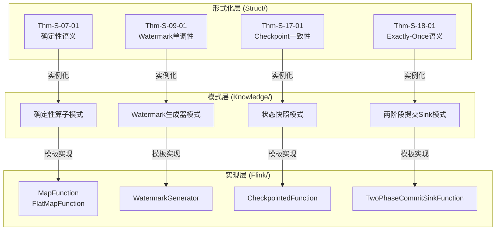
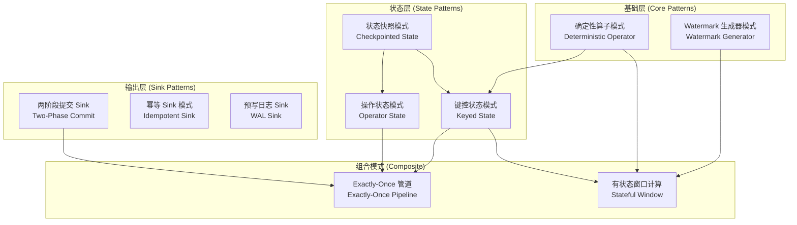
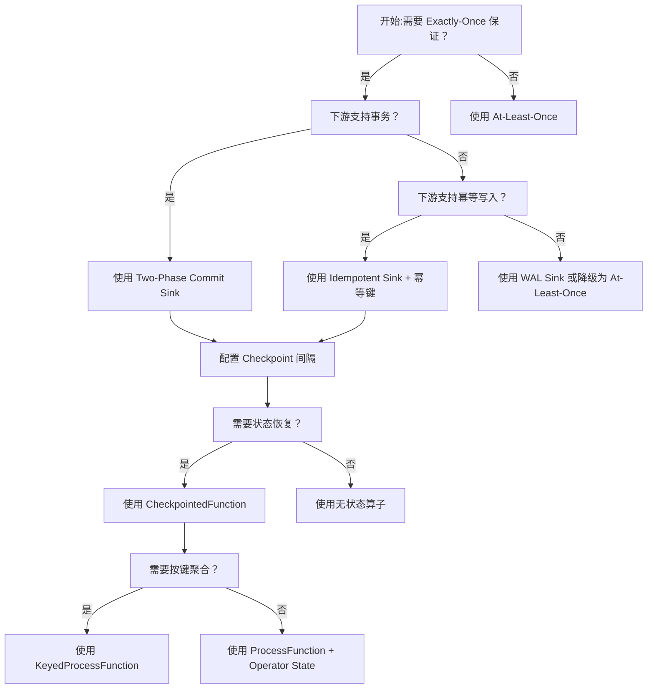
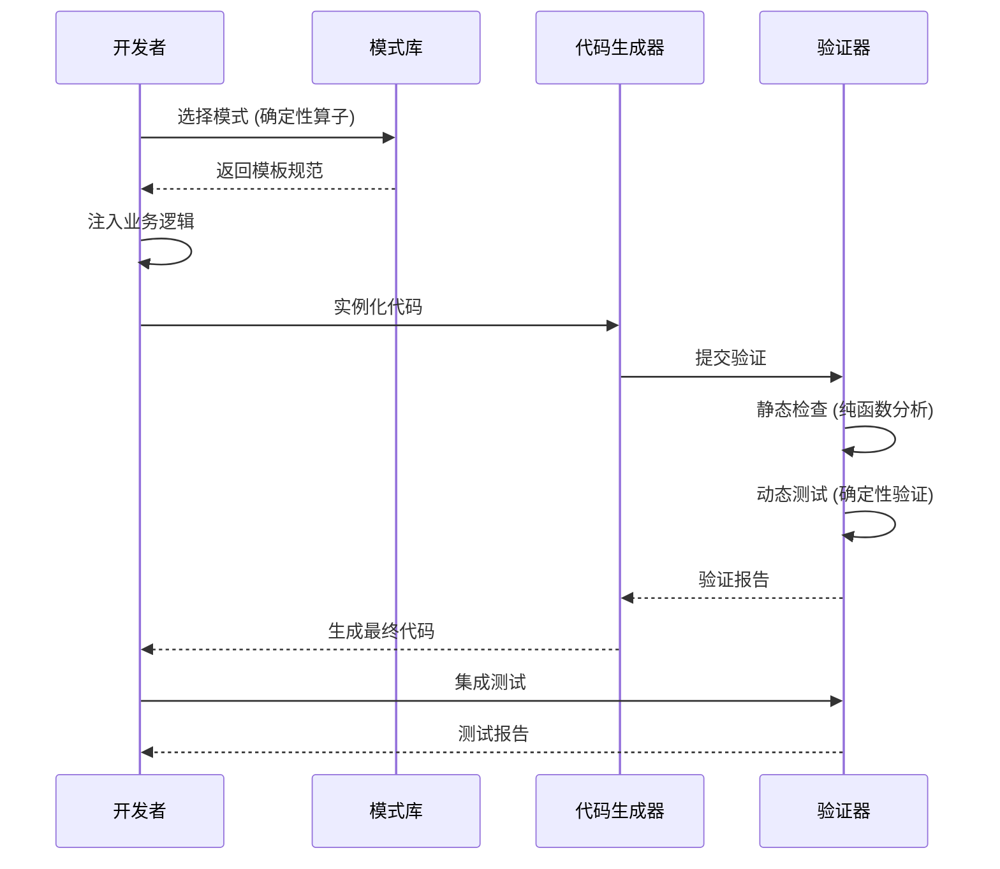

# 5.1 理论到代码的模式语言

> **所属阶段**: Knowledge/05-mapping-guides/
> **前置依赖**: [Struct/07-deterministic-semantics.md](../../Struct/02-properties/02.01-determinism-in-streaming.md), [Struct/09-watermark-theory.md](../../Struct/02-properties/02.03-watermark-monotonicity.md), [Struct/17-checkpoint-mechanism.md](../../Struct/02-properties/02.04-liveness-and-safety.md), [Struct/18-exactly-once-semantics.md](../../Struct/02-properties/02.05-type-safety-derivation.md)
> **形式化等级**: L4-L5

---

## 目录

- [5.1 理论到代码的模式语言](#51-理论到代码的模式语言)
  - [目录](#目录)
  - [1. 概念定义 (Definitions)](#1-概念定义-definitions)
    - [Def-K-05-01: 形式化→代码模式 (Formal-to-Code Pattern)](#def-k-05-01-形式化代码模式-formal-to-code-pattern)
    - [Def-K-05-02: 模式实例化 (Pattern Instantiation)](#def-k-05-02-模式实例化-pattern-instantiation)
    - [Def-K-05-03: 模式组合 (Pattern Composition)](#def-k-05-03-模式组合-pattern-composition)
  - [2. 属性推导 (Properties)](#2-属性推导-properties)
    - [Lemma-K-05-01: 模式传递性](#lemma-k-05-01-模式传递性)
    - [Lemma-K-05-02: 组合封闭性](#lemma-k-05-02-组合封闭性)
    - [Lemma-K-05-03: 代码等价性保持](#lemma-k-05-03-代码等价性保持)
  - [3. 关系建立 (Relations)](#3-关系建立-relations)
    - [理论↔代码 映射矩阵](#理论代码-映射矩阵)
    - [映射关系说明](#映射关系说明)
  - [4. 论证过程 (Argumentation)](#4-论证过程-argumentation)
    - [4.1 模式正确性论证框架](#41-模式正确性论证框架)
    - [4.2 反模式识别标准](#42-反模式识别标准)
  - [5. 形式证明 / 工程论证](#5-形式证明--工程论证)
    - [5.1 模式验证的工程方法](#51-模式验证的工程方法)
    - [5.2 各模式验证策略](#52-各模式验证策略)
  - [6. 实例验证 (Examples)](#6-实例验证-examples)
    - [6.1 确定性算子模式 (Deterministic Operator Pattern)](#61-确定性算子模式-deterministic-operator-pattern)
      - [Java 实现模板](#java-实现模板)
      - [Scala 实现模板](#scala-实现模板)
      - [Python 实现模板](#python-实现模板)
    - [6.2 Watermark 生成器模式 (Watermark Generator Pattern)](#62-watermark-生成器模式-watermark-generator-pattern)
      - [Java 实现模板](#java-实现模板-1)
      - [Scala 实现模板](#scala-实现模板-1)
      - [Python 实现模板](#python-实现模板-1)
    - [6.3 状态快照模式 (Checkpointed State Pattern)](#63-状态快照模式-checkpointed-state-pattern)
      - [Java 实现模板](#java-实现模板-2)
      - [Scala 实现模板](#scala-实现模板-2)
      - [Python 实现模板](#python-实现模板-2)
    - [6.4 两阶段提交 Sink 模式 (Two-Phase Commit Sink Pattern)](#64-两阶段提交-sink-模式-two-phase-commit-sink-pattern)
      - [Java 实现模板](#java-实现模板-3)
      - [Scala 实现模板](#scala-实现模板-3)
      - [Python 实现模板](#python-实现模板-3)
    - [6.5 模式组合示例](#65-模式组合示例)
  - [7. 可视化 (Visualizations)](#7-可视化-visualizations)
    - [7.1 模式层次关系图](#71-模式层次关系图)
    - [7.2 模式选择决策树](#72-模式选择决策树)
    - [7.3 模式实例化流程](#73-模式实例化流程)
  - [8. 引用参考 (References)](#8-引用参考-references)

## 1. 概念定义 (Definitions)

### Def-K-05-01: 形式化→代码模式 (Formal-to-Code Pattern)

> 一个形式化到代码的模式是一个五元组 $P = (F, C, M, V, I)$，其中：
>
> - $F$ 是形式化规范（定理、性质、约束）
> - $C$ 是代码模板（多语言实现骨架）
> - $M$ 是映射规则（形式化→代码的转换函数）
> - $V$ 是验证策略（如何验证代码满足形式化约束）
> - $I$ 是组合不变量（与其他模式组合时的约束保持条件）

**直观解释**: 模式语言提供了一座桥梁，将 Struct/ 目录中的严格数学定义转换为工程实践中可复用的代码结构。每个模式都携带了形式化"血统"，确保代码实现具有可验证的语义保证。

### Def-K-05-02: 模式实例化 (Pattern Instantiation)

> 给定模式 $P$ 和具体业务逻辑 $L$，实例化操作 $\llbracket P \rrbracket_L$ 产生具体代码 $C_L$，满足：
> $$C_L \in C \land \text{sat}(C_L, F)$$
> 即实例化后的代码必须满足模式的形式化约束。

### Def-K-05-03: 模式组合 (Pattern Composition)

> 模式 $P_1$ 与 $P_2$ 的组合 $P_1 \oplus P_2$ 定义当且仅当：
> $$I_{P_1}(C_2) \land I_{P_2}(C_1) = \text{true}$$
> 即双方的不变量在组合后仍然保持。

---

## 2. 属性推导 (Properties)

### Lemma-K-05-01: 模式传递性

> 若模式 $P_1$ 的形式化规范 $F_1$ 蕴含 $F_2$（$F_1 \Rightarrow F_2$），且 $P_2$ 基于 $F_2$ 构建，则任何 $P_1$ 的正确实例化也是 $P_2$ 的正确实例化。

**工程含义**: 基于更强形式化保证实现的代码自动继承较弱的保证。例如，满足确定性语义（Thm-S-07-01）的算子自动满足幂等性要求。

### Lemma-K-05-02: 组合封闭性

> 对于任意两个满足组合条件的模式 $P_i$ 和 $P_j$，其组合 $P_i \oplus P_j$ 的不变量 $I_{ij}$ 是各自不变量的合取：
> $$I_{ij} = I_i \land I_j \land I_{compat}(i,j)$$
> 其中 $I_{compat}$ 是模式特定的兼容性约束。

### Lemma-K-05-03: 代码等价性保持

> 若两个代码实现 $C_A$ 和 $C_B$ 都是同一模式 $P$ 的正确实例化，则在相同输入流 $S$ 下：
> $$\llbracket C_A \rrbracket(S) = \llbracket C_B \rrbracket(S)$$
> 即输出流在观测等价意义下相同。

---

## 3. 关系建立 (Relations)

### 理论↔代码 映射矩阵

| 形式化定理/定义 (Struct/) | 代码模式 (Knowledge/) | 实现载体 | 验证方法 |
|--------------------------|----------------------|----------|----------|
| Thm-S-07-01: 确定性语义 | **确定性算子模式** | `MapFunction`, `FlatMapFunction` | 纯函数检查 + 无副作用分析 |
| Thm-S-09-01: Watermark 单调性 | **Watermark生成器模式** | `WatermarkGenerator` | 单调性断言 + 边界测试 |
| Thm-S-17-01: Checkpoint 一致性 | **状态快照模式** | `CheckpointedFunction` | 快照恢复测试 + 状态一致性校验 |
| Thm-S-18-01: Exactly-Once 语义 | **两阶段提交 Sink 模式** | `TwoPhaseCommitSinkFunction` | 故障注入测试 + 幂等性验证 |
| Def-S-08-01: 时间域分类 | **时间语义选择模式** | `TimeCharacteristic` 配置 | 时间戳提取验证 |
| Thm-S-10-01: 窗口正确性 | **窗口算子模式** | `WindowFunction` | 窗口边界测试 + 触发器验证 |
| Def-S-11-01: 状态类型 | **状态后端选择模式** | `StateBackend` 配置 | 状态访问模式分析 |
| Thm-S-12-01: Backpressure 控制 | **反压处理模式** | `BoundedOutOfOrdernessGenerator` | 缓冲区监控 + 速率测试 |

### 映射关系说明



---

## 4. 论证过程 (Argumentation)

### 4.1 模式正确性论证框架

每个模式的正确性需要验证三个层次：

1. **语义保持性**: 代码实现是否保持了形式化规范定义的语义
2. **实例化正确性**: 业务逻辑注入后是否破坏模式保证
3. **组合安全性**: 多个模式组合使用时是否产生冲突

### 4.2 反模式识别标准

| 反模式 | 违反的形式化约束 | 症状 | 检测方法 |
|-------|----------------|------|---------|
| **非确定性映射** | Thm-S-07-01 | 相同输入产生不同输出 | 静态分析 + 随机测试 |
| **非单调 Watermark** | Thm-S-09-01 | 时间倒退触发异常 | 运行时断言 |
| **状态逃逸** | Thm-S-17-01 | 恢复后状态不一致 | 快照对比测试 |
| **非幂等写入** | Thm-S-18-01 | 故障恢复后重复数据 | 幂等键检查 |
| **共享可变状态** | Lemma-K-05-01 | 并发修改导致竞态 | 逃逸分析 |
| **跨算子状态依赖** | Lemma-K-05-02 | 算子重启后顺序错乱 | 拓扑验证 |

---

## 5. 形式证明 / 工程论证

### 5.1 模式验证的工程方法

由于代码层面的形式化验证成本极高，我们采用以下工程验证策略：

**Def-K-05-04: 验证金字塔**

```
         ┌─────────────┐
         │   形式验证   │  ← 核心不变量 (关键代码路径)
         │  (Coq/TLA+) │
        ┌┴─────────────┴┐
        │   属性测试     │  ← 随机输入 + 性质断言
        │  (ScalaCheck) │
       ┌┴───────────────┴┐
       │   集成测试       │  ← 故障注入 + 端到端验证
       │  (MiniCluster)  │
      ┌┴─────────────────┴┐
      │    单元测试        │  ← 边界条件 + 正常路径
      │   (JUnit/TestNG)  │
      └───────────────────┘
```

### 5.2 各模式验证策略

**确定性算子模式**:

- 静态检查: 函数是否纯函数（无外部 IO、无静态可变状态）
- 动态检查: 相同输入序列的多次执行输出一致性
- 反例测试: 注入随机延迟，验证输出稳定性

**Watermark 生成器模式**:

- 单调性断言: `currentWatermark >= lastEmittedWatermark`
- 延迟边界测试: 验证最大乱序时间容差
- 空流测试: 无数据时 Watermark 推进行为

**两阶段提交 Sink 模式**:

- 故障注入: 在 pre-commit/commit/abort 各阶段注入故障
- 幂等性验证: 重复执行事务结果不变
- 隔离性验证: 并发事务互不干扰

---

## 6. 实例验证 (Examples)

### 6.1 确定性算子模式 (Deterministic Operator Pattern)

**理论来源**: Thm-S-07-01 — 确定性语义要求算子在相同输入历史下产生相同输出。

#### Java 实现模板

```java
import org.apache.flink.api.common.functions.MapFunction;

// ✅ 正确实现:纯函数式映射
public class DeterministicMapFunction
    implements MapFunction<Event, EnrichedEvent> {

    // 允许:不可变配置参数
    private final String staticConfig;

    // 禁止:可变静态状态
    // private static int counter; // ❌ 违反确定性

    // 禁止:外部可变依赖
    // private ExternalCache cache; // ❌ 违反确定性

    public DeterministicMapFunction(String config) {
        this.staticConfig = config;
    }

    @Override
    public EnrichedEvent map(Event event) {
        // ✅ 纯函数:输出仅依赖于输入和不可变配置
        return new EnrichedEvent(
            event.getId(),
            event.getTimestamp(),
            enrich(event.getData(), staticConfig)
        );
    }

    private String enrich(String data, String config) {
        // 确定性转换逻辑
        return data + "_" + config;
    }
}
```

#### Scala 实现模板

```scala
// ✅ 正确实现:函数式风格
class DeterministicMapFunction(config: String)
  extends MapFunction[Event, EnrichedEvent] {

  override def map(event: Event): EnrichedEvent = {
    // 纯函数转换
    EnrichedEvent(
      id = event.id,
      timestamp = event.timestamp,
      data = enrich(event.data, config)
    )
  }

  private def enrich(data: String, cfg: String): String = {
    s"${data}_$cfg"
  }
}

// 更简洁的匿名函数形式
val deterministicMap: Event => EnrichedEvent = { event =>
  EnrichedEvent(
    id = event.id,
    timestamp = event.timestamp,
    data = event.data + "_suffix"
  )
}
```

#### Python 实现模板

```python
from pyflink.datastream import MapFunction

class DeterministicMapFunction(MapFunction):
    def __init__(self, config: str):
        # 仅存储不可变配置
        self._static_config = config
        # 禁止:self._cache = {}  # ❌ 可变状态

    def map(self, event: Event) -> EnrichedEvent:
        # 纯函数:无副作用,无外部依赖
        return EnrichedEvent(
            id=event.id,
            timestamp=event.timestamp,
            data=self._enrich(event.data)
        )

    def _enrich(self, data: str) -> str:
        return f"{data}_{self._static_config}"

# 使用示例 stream.map(DeterministicMapFunction("config_value"))
```

**反模式示例**:

```java
// ❌ 错误实现:非确定性
public class NonDeterministicMap implements MapFunction<Event, Result> {
    private Random random = new Random(); // 非确定性来源
    private static int counter = 0;       // 共享可变状态
    private ExternalService client;       // 外部依赖

    @Override
    public Result map(Event event) {
        counter++;  // ❌ 竞态条件
        int salt = random.nextInt();  // ❌ 不可重现
        String ext = client.fetch(event.getId());  // ❌ 外部状态
        return new Result(event, salt, ext);
    }
}
```

---

### 6.2 Watermark 生成器模式 (Watermark Generator Pattern)

**理论来源**: Thm-S-09-01 — Watermark 必须保持单调不减性质。

#### Java 实现模板

```java
// ✅ 正确实现:带乱序容忍的 Watermark 生成器
public class BoundedOutOfOrdernessGenerator
    implements WatermarkGenerator<Event> {

    private final long maxOutOfOrderness;
    private long currentMaxTimestamp = Long.MIN_VALUE;

    public BoundedOutOfOrdernessGenerator(Duration maxOutOfOrderness) {
        this.maxOutOfOrderness = maxOutOfOrderness.toMillis();
    }

    @Override
    public void onEvent(Event event, long eventTimestamp, WatermarkOutput output) {
        // 更新当前最大时间戳
        currentMaxTimestamp = Math.max(currentMaxTimestamp, eventTimestamp);
    }

    @Override
    public void onPeriodicEmit(WatermarkOutput output) {
        // 发射 watermark = 当前最大时间 - 乱序容忍度
        long watermarkTimestamp = currentMaxTimestamp - maxOutOfOrderness;

        // ✅ 单调性保证:确保不发射倒退的 watermark
        if (watermarkTimestamp > Long.MIN_VALUE) {
            output.emitWatermark(new Watermark(watermarkTimestamp));
        }
    }
}

// ✅ 正确实现:空闲数据源处理
public class IdleSourceAwareGenerator
    implements WatermarkGenerator<Event> {

    private final WatermarkGenerator<Event> delegate;
    private final long idleTimeout;
    private volatile long lastEventTime = System.currentTimeMillis();

    @Override
    public void onEvent(Event event, long eventTimestamp, WatermarkOutput output) {
        lastEventTime = System.currentTimeMillis();
        delegate.onEvent(event, eventTimestamp, output);
    }

    @Override
    public void onPeriodicEmit(WatermarkOutput output) {
        // 空闲检测:长时间无数据时标记为空闲
        if (System.currentTimeMillis() - lastEventTime > idleTimeout) {
            output.markIdle();
        }
        delegate.onPeriodicEmit(output);
    }
}
```

#### Scala 实现模板

```scala
// ✅ 正确实现:函数式风格的 Watermark 策略
class BoundedOutOfOrdernessGenerator(
    maxOutOfOrderness: Duration
) extends WatermarkGenerator[Event] {

  private val maxOutOfOrdernessMs = maxOutOfOrderness.toMillis
  @volatile private var currentMaxTimestamp = Long.MinValue

  override def onEvent(
      event: Event,
      eventTimestamp: Long,
      output: WatermarkOutput
  ): Unit = {
    currentMaxTimestamp = math.max(currentMaxTimestamp, eventTimestamp)
  }

  override def onPeriodicEmit(output: WatermarkOutput): Unit = {
    val watermarkTimestamp = currentMaxTimestamp - maxOutOfOrdernessMs
    if (watermarkTimestamp > Long.MinValue) {
      output.emitWatermark(new Watermark(watermarkTimestamp))
    }
  }
}

// 简洁的 Watermark 策略构建器
object WatermarkStrategies {
  def boundedOutOfOrderness[T: TimestampAssigner](
      maxOutOfOrderness: Duration
  ): WatermarkStrategy[T] = {
    WatermarkStrategy
      .forBoundedOutOfOrderness(maxOutOfOrderness)
      .withTimestampAssigner(implicitly[TimestampAssigner[T]])
  }
}
```

#### Python 实现模板

```python
from pyflink.datastream import WatermarkStrategy
from pyflink.common import Duration

# ✅ 正确实现:使用内置策略 watermark_strategy = (
    WatermarkStrategy
    .for_bounded_out_of_orderness(Duration.of_seconds(5))
    .with_timestamp_assigner(lambda event, _: event.timestamp)
)

# ✅ 正确实现:自定义 Watermark 生成器 class BoundedOutOfOrdernessGenerator:
    def __init__(self, max_out_of_orderness: int):
        self._max_out_of_orderness = max_out_of_orderness
        self._current_max_timestamp = float('-inf')

    def on_event(self, event, event_timestamp, output):
        self._current_max_timestamp = max(
            self._current_max_timestamp,
            event_timestamp
        )

    def on_periodic_emit(self, output):
        watermark_timestamp = (
            self._current_max_timestamp - self._max_out_of_orderness
        )
        if watermark_timestamp > float('-inf'):
            output.emit_watermark(watermark_timestamp)

# 应用策略 stream.assign_timestamps_and_watermarks(watermark_strategy)
```

**反模式示例**:

```java
// ❌ 错误实现:非单调 Watermark
public class BrokenWatermarkGenerator implements WatermarkGenerator<Event> {
    @Override
    public void onEvent(Event event, long eventTimestamp, WatermarkOutput output) {
        // ❌ 直接发射基于事件时间的 watermark,无乱序容忍
        output.emitWatermark(new Watermark(eventTimestamp));
    }

    @Override
    public void onPeriodicEmit(WatermarkOutput output) {
        // ❌ 发射系统时间作为 watermark
        output.emitWatermark(new Watermark(System.currentTimeMillis()));
    }
}
```

---

### 6.3 状态快照模式 (Checkpointed State Pattern)

**理论来源**: Thm-S-17-01 — Checkpoint 机制保证状态一致性快照。

#### Java 实现模板

```java
import org.apache.flink.streaming.api.functions.KeyedProcessFunction;

import org.apache.flink.api.common.state.ValueState;
import org.apache.flink.api.common.state.ValueStateDescriptor;
import org.apache.flink.api.common.typeinfo.Types;


// ✅ 正确实现:带状态管理的 KeyedProcessFunction
public class StatefulCounterFunction
    extends KeyedProcessFunction<String, Event, Result>
    implements CheckpointedFunction {

    // 状态声明:使用 Flink 托管状态
    private ValueState<Long> counterState;
    private ListState<Event> bufferedEvents;

    // 非状态变量(瞬态):不参与 Checkpoint
    private transient Map<String, LocalCache> localCache;

    @Override
    public void open(Configuration parameters) {
        // 初始化状态描述符
        ValueStateDescriptor<Long> counterDescriptor =
            new ValueState<>("counter", Types.LONG);
        counterState = getRuntimeContext().getState(counterDescriptor);

        ListStateDescriptor<Event> bufferDescriptor =
            new ListState<>("buffer", Event.class);
        bufferedEvents = getRuntimeContext().getListState(bufferDescriptor);

        // 初始化瞬态缓存(仅本地使用,不 Checkpoint)
        localCache = new HashMap<>();
    }

    @Override
    public void processElement(Event event, Context ctx, Collector<Result> out)
            throws Exception {
        // 读取/更新状态
        Long current = counterState.value();
        if (current == null) current = 0L;
        counterState.update(current + 1);

        // 使用状态做业务逻辑
        bufferedEvents.add(event);

        // 设置定时器
        ctx.timerService().registerEventTimeTimer(event.timestamp + 60000);
    }

    @Override
    public void onTimer(long timestamp, OnTimerContext ctx, Collector<Result> out)
            throws Exception {
        // 定时器触发时的状态处理
        for (Event e : bufferedEvents.get()) {
            out.collect(new Result(e, counterState.value()));
        }
        bufferedEvents.clear();
    }

    // ===== CheckpointedFunction 接口实现 =====

    @Override
    public void snapshotState(FunctionSnapshotContext context) throws Exception {
        // ✅ Flink 自动处理 ValueState 和 ListState 的快照
        // 无需额外操作,已注册的状态会自动参与 Checkpoint
    }

    @Override
    public void initializeState(FunctionInitializationContext context) throws Exception {
        // ✅ 从 Checkpoint 或 Savepoint 恢复状态
        ValueStateDescriptor<Long> counterDescriptor =
            new ValueState<>("counter", Types.LONG);
        counterState = context.getKeyedStateStore().getState(counterDescriptor);

        ListStateDescriptor<Event> bufferDescriptor =
            new ListState<>("buffer", Event.class);
        bufferedEvents = context.getKeyedStateStore().getListState(bufferDescriptor);
    }
}
```

#### Scala 实现模板

```scala
// ✅ 正确实现:Scala 风格的状态管理
class StatefulCounterFunction
  extends KeyedProcessFunction[String, Event, Result]
     with CheckpointedFunction {

  // 使用 lazy val 延迟初始化状态
  private lazy val counterState: ValueState[Long] = {
    val descriptor = new ValueStateDescriptor[Long]("counter", classOf[Long])
    getRuntimeContext.getState(descriptor)
  }

  private lazy val bufferState: ListState[Event] = {
    val descriptor = new ListStateDescriptor[Event]("buffer", classOf[Event])
    getRuntimeContext.getListState(descriptor)
  }

  override def processElement(
      event: Event,
      ctx: KeyedProcessFunction[String, Event, Result]#Context,
      out: Collector[Result]
  ): Unit = {
    val current = Option(counterState.value()).getOrElse(0L)
    counterState.update(current + 1)
    bufferState.add(event)

    ctx.timerService.registerEventTimeTimer(event.timestamp + 60000)
  }

  override def onTimer(
      timestamp: Long,
      ctx: KeyedProcessFunction[String, Event, Result]#OnTimerContext,
      out: Collector[Result]
  ): Unit = {
    val count = counterState.value()
    bufferState.get().forEach { event =>
      out.collect(Result(event, count))
    }
    bufferState.clear()
  }

  override def snapshotState(context: FunctionSnapshotContext): Unit = {
    // 状态自动快照
  }

  override def initializeState(context: FunctionInitializationContext): Unit = {
    // 状态自动恢复
  }
}

// 使用 Flink Scala DSL 的简化版本
class SimpleStatefulFunction extends ProcessFunction[Event, Result] {

  private var counter: ValueState[Long] = _

  override def open(parameters: Configuration): Unit = {
    counter = getRuntimeContext.getState(
      new ValueStateDescriptor[Long]("counter", createTypeInformation[Long])
    )
  }

  override def processElement(
      event: Event,
      ctx: ProcessFunction[Event, Result]#Context,
      out: Collector[Result]
  ): Unit = {
    val newCount = Option(counter.value()).getOrElse(0L) + 1
    counter.update(newCount)
    out.collect(Result(event, newCount))
  }
}
```

#### Python 实现模板

```python
from pyflink.datastream import (
    KeyedProcessFunction,
    ValueStateDescriptor,
    ListStateDescriptor
)
from pyflink.common.typeinfo import Types

class StatefulCounterFunction(KeyedProcessFunction):
    def __init__(self):
        self._counter_state = None
        self._buffer_state = None

    def open(self, runtime_context):
        # 初始化状态
        counter_descriptor = ValueStateDescriptor(
            "counter",
            Types.LONG()
        )
        self._counter_state = runtime_context.get_state(counter_descriptor)

        buffer_descriptor = ListStateDescriptor(
            "buffer",
            Types.PICKLED_BYTE_ARRAY()
        )
        self._buffer_state = runtime_context.get_list_state(buffer_descriptor)

    def process_element(self, event, ctx):
        # 读取/更新状态
        current = self._counter_state.value()
        if current is None:
            current = 0
        self._counter_state.update(current + 1)

        # 添加到缓冲区
        self._buffer_state.add(event)

        # 注册定时器
        ctx.timer_service().register_event_time_timer(
            event.timestamp + 60000
        )

    def on_timer(self, timestamp, ctx):
        # 定时器触发,处理缓冲数据
        count = self._counter_state.value()
        for event in self._buffer_state.get():
            yield Result(event, count)
        self._buffer_state.clear()

# 应用函数 stream.key_by(lambda e: e.key).process(StatefulCounterFunction())
```

**反模式示例**:

```java
// ❌ 错误实现:状态管理违规
public class BadStatefulFunction extends ProcessFunction<Event, Result> {

    // ❌ 禁止:使用普通实例变量存储需要恢复的状态
    private int counter = 0;
    private List<Event> buffer = new ArrayList<>();

    // ❌ 禁止:使用静态共享状态
    private static Map<String, Object> sharedState = new HashMap<>();

    @Override
    public void processElement(Event event, Context ctx, Collector<Result> out) {
        // 更新实例变量 —— 不会在 Checkpoint 中保存
        counter++;
        buffer.add(event);
        out.collect(new Result(event, counter));
    }

    // ❌ 缺失:没有实现 CheckpointedFunction 接口
}
```

---

### 6.4 两阶段提交 Sink 模式 (Two-Phase Commit Sink Pattern)

**理论来源**: Thm-S-18-01 — Exactly-Once 语义通过两阶段提交协议实现。

#### Java 实现模板

```java
// ✅ 正确实现:两阶段提交 Sink(Kafka 示例)
public class KafkaExactlyOnceSink
    extends TwoPhaseCommitSinkFunction<Event, KafkaTransactionState, Void> {

    private transient FlinkKafkaProducer<String> producer;
    private final Properties kafkaProps;
    private final String topic;

    public KafkaExactlyOnceSink(String topic, Properties kafkaProps) {
        // 序列化类型信息
        super(
            TypeInformation.of(Event.class).createSerializer(new ExecutionConfig()),
            TypeInformation.of(KafkaTransactionState.class).createSerializer(new ExecutionConfig())
        );
        this.topic = topic;
        this.kafkaProps = kafkaProps;
    }

    @Override
    protected void invoke(
            KafkaTransactionState transaction,
            Event event,
            Context context) throws Exception {
        // 写入到当前事务
        producer.send(new ProducerRecord<>(
            topic,
            event.getKey(),
            serialize(event)
        ));
    }

    @Override
    protected KafkaTransactionState beginTransaction() throws Exception {
        // 开始新事务
        producer.beginTransaction();
        return new KafkaTransactionState(producer.getTransactionId());
    }

    @Override
    protected void preCommit(KafkaTransactionState transaction) throws Exception {
        // 预提交:刷新缓冲区,确保数据已发送到 Kafka
        producer.flush();
        // 注意:此时不提交事务,等待 Checkpoint 完成
    }

    @Override
    protected void commit(KafkaTransactionState transaction) {
        // 提交事务:Checkpoint 成功后调用
        try {
            producer.commitTransaction();
        } catch (ProducerFencedException e) {
            // 事务已被其他生产者实例接管(正常情况)
            log.info("Transaction {} already committed by another instance",
                    transaction.getTransactionId());
        }
    }

    @Override
    protected void abort(KafkaTransactionState transaction) {
        // 中止事务:Checkpoint 失败时调用
        try {
            producer.abortTransaction();
        } catch (ProducerFencedException e) {
            // 事务已被接管,忽略
        }
    }

    @Override
    protected void initializeTransaction(
            KafkaTransactionState transaction,
            Context context) {
        // 初始化生产者
        this.producer = new FlinkKafkaProducer<>(topic, kafkaProps);

        // 恢复未完成的事务(如果存在)
        if (transaction != null) {
            producer.resumeTransaction(transaction.getTransactionId());
        }
    }
}

// 事务状态类
public class KafkaTransactionState {
    private final String transactionId;
    private final long checkpointId;

    public KafkaTransactionState(String transactionId) {
        this.transactionId = transactionId;
        this.checkpointId = -1;
    }

    // 必须支持序列化以参与 Checkpoint
    // getter / setter ...
}
```

#### Scala 实现模板

```scala
// ✅ 正确实现:Scala 风格的两阶段提交 Sink
class KafkaExactlyOnceSink(
    topic: String,
    kafkaProps: Properties
) extends TwoPhaseCommitSinkFunction[Event, TransactionState, Void](
    createTypeInformation[Event].createSerializer(new ExecutionConfig),
    createTypeInformation[TransactionState].createSerializer(new ExecutionConfig)
) {

  @transient private var producer: FlinkKafkaProducer[String] = _

  override def invoke(
      transaction: TransactionState,
      event: Event,
      context: Context
  ): Unit = {
    producer.send(new ProducerRecord(topic, event.key, serialize(event)))
  }

  override def beginTransaction(): TransactionState = {
    producer.beginTransaction()
    TransactionState(producer.getTransactionId)
  }

  override def preCommit(transaction: TransactionState): Unit = {
    producer.flush()
  }

  override def commit(transaction: TransactionState): Unit = {
    try {
      producer.commitTransaction()
    } catch {
      case _: ProducerFencedException =>
        // 事务已被其他实例提交
        log.info(s"Transaction ${transaction.id} already committed")
    }
  }

  override def abort(transaction: TransactionState): Unit = {
    try {
      producer.abortTransaction()
    } catch {
      case _: ProducerFencedException => ()
    }
  }
}

case class TransactionState(
    id: String,
    checkpointId: Long = -1L
)
```

#### Python 实现模板

```python
from pyflink.datastream import TwoPhaseCommitSinkFunction
from pyflink.common.typeinfo import Types

class KafkaExactlyOnceSink(TwoPhaseCommitSinkFunction):
    def __init__(self, topic: str, kafka_props: dict):
        super().__init__(
            Types.PICKLED_BYTE_ARRAY(),  # 输入序列化器
            Types.PICKLED_BYTE_ARRAY()   # 事务状态序列化器
        )
        self._topic = topic
        self._kafka_props = kafka_props
        self._producer = None

    def invoke(self, transaction, event, context):
        """将事件写入当前事务"""
        self._producer.send(
            self._topic,
            key=event.key,
            value=self._serialize(event)
        )

    def begin_transaction(self):
        """开始新事务"""
        self._producer.begin_transaction()
        return {
            'transaction_id': self._producer.transaction_id,
            'checkpoint_id': -1
        }

    def pre_commit(self, transaction):
        """预提交:刷新数据"""
        self._producer.flush()

    def commit(self, transaction):
        """提交事务"""
        try:
            self._producer.commit_transaction()
        except ProducerFencedException:
            # 事务已被其他实例处理
            pass

    def abort(self, transaction):
        """中止事务"""
        try:
            self._producer.abort_transaction()
        except ProducerFencedException:
            pass

    def _serialize(self, event):
        """序列化事件"""
        import pickle
        return pickle.dumps(event)

# 应用 Sink stream.add_sink(KafkaExactlyOnceSink("output-topic", kafka_config))
```

**反模式示例**:

```java
import org.apache.flink.streaming.api.functions.sink.RichSinkFunction;

// ❌ 错误实现:非幂等 Sink
public class BadSink extends RichSinkFunction<Event> {
    private DatabaseConnection db;

    @Override
    public void invoke(Event event, Context context) {
        // ❌ 直接写入,无事务保护
        // ❌ 无幂等键,故障恢复后可能重复写入
        db.execute("INSERT INTO events VALUES (?, ?)",
                   event.getId(), event.getData());
    }

    // ❌ 缺失:没有两阶段提交协议
    // ❌ 缺失:没有处理故障恢复场景
}
```

---

### 6.5 模式组合示例

以下展示如何将多个模式组合使用：

```java
import org.apache.flink.streaming.api.environment.StreamExecutionEnvironment;

import org.apache.flink.streaming.api.datastream.DataStream;
import org.apache.flink.streaming.api.CheckpointingMode;


// ✅ 正确实现:组合多个模式
public class ComplexStreamPipeline {

    public static void main(String[] args) throws Exception {
        StreamExecutionEnvironment env =
            StreamExecutionEnvironment.getExecutionEnvironment();

        // 启用 Checkpoint(状态快照模式)
        env.enableCheckpointing(60000);
        env.getCheckpointConfig().setCheckpointingMode(
            CheckpointingMode.EXACTLY_ONCE
        );

        // 1. 输入源 + Watermark 生成器模式
        DataStream<Event> source = env
            .addSource(new KafkaSource<>())
            .assignTimestampsAndWatermarks(
                WatermarkStrategy
                    .<Event>forBoundedOutOfOrderness(Duration.ofSeconds(5))
                    .withTimestampAssigner((event, ts) -> event.getTimestamp())
            );

        // 2. 确定性算子模式
        DataStream<EnrichedEvent> mapped = source
            .map(new DeterministicMapFunction("config"))
            .returns(EnrichedEvent.class);

        // 3. 状态管理模式(KeyedProcessFunction)
        DataStream<Result> processed = mapped
            .keyBy(EnrichedEvent::getKey)
            .process(new StatefulCounterFunction())
            .uid("stateful-counter");  // 必须设置 UID 以支持状态恢复

        // 4. 两阶段提交 Sink 模式
        processed.addSink(new KafkaExactlyOnceSink("output", kafkaProps))
            .uid("exactly-once-sink");

        env.execute("Complex Pipeline with Multiple Patterns");
    }
}
```

---

## 7. 可视化 (Visualizations)

### 7.1 模式层次关系图



### 7.2 模式选择决策树



### 7.3 模式实例化流程



---

## 8. 引用参考 (References)


---

*文档版本: v1.0*
*创建日期: 2026-04-02*
*最后更新: 2026-04-02*

---

*文档版本: v1.0 | 创建日期: 2026-04-18*
