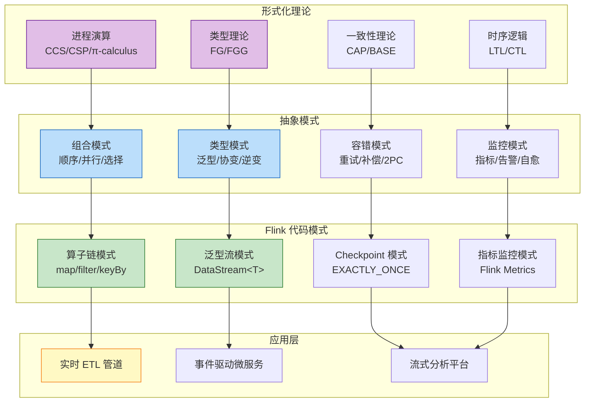
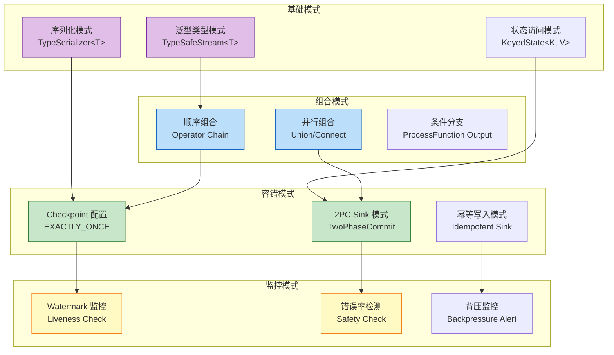

# 理论到代码模式映射指南 (Theory-to-Code Patterns Mapping)

> 所属阶段: Knowledge/05-mapping-guides | 前置依赖: [Struct/01-foundation/01.02-process-calculus-primer.md](../../Struct/01-foundation/01.02-process-calculus-primer.md), [Struct/02-properties/02.02-consistency-hierarchy.md](../../Struct/02-properties/02.02-consistency-hierarchy.md) | 形式化等级: L4

---

## 目录

- [理论到代码模式映射指南 (Theory-to-Code Patterns Mapping)](#理论到代码模式映射指南-theory-to-code-patterns-mapping)
  - [目录](#目录)
  - [1. 概念定义 (Definitions)](#1-概念定义-definitions)
    - [Def-K-05-03 (代码模式)](#def-k-05-03-代码模式)
    - [Def-K-05-04 (知识转化)](#def-k-05-04-知识转化)
  - [2. 属性推导 (Properties)](#2-属性推导-properties)
    - [Lemma-K-05-03 (进程演算到算子链的组合保持)](#lemma-k-05-03-进程演算到算子链的组合保持)
    - [Lemma-K-05-04 (类型安全到泛型约束的保持)](#lemma-k-05-04-类型安全到泛型约束的保持)
  - [3. 关系建立 (Relations)](#3-关系建立-relations)
    - [关系 1: 进程演算组合 $\\leftrightarrow$ Flink 算子链](#关系-1-进程演算组合-leftrightarrow-flink-算子链)
    - [关系 2: 类型安全 $\\leftrightarrow$ 泛型与序列化](#关系-2-类型安全-leftrightarrow-泛型与序列化)
    - [关系 3: 一致性层级 $\\leftrightarrow$ Checkpoint 配置](#关系-3-一致性层级-leftrightarrow-checkpoint-配置)
    - [关系 4: 活性/安全性 $\\leftrightarrow$ 监控与告警](#关系-4-活性安全性-leftrightarrow-监控与告警)
  - [4. 论证过程 (Argumentation)](#4-论证过程-argumentation)
    - [4.1 进程演算到流处理的模式转化](#41-进程演算到流处理的模式转化)
    - [4.2 类型系统的工程约束转化](#42-类型系统的工程约束转化)
  - [5. 形式证明 / 工程论证 (Proof / Engineering Argument)](#5-形式证明--工程论证-proof--engineering-argument)
    - [Prop-K-05-02 (代码模式库完备性)](#prop-k-05-02-代码模式库完备性)
  - [6. 实例验证 (Examples)](#6-实例验证-examples)
    - [示例 6.1: 进程演算组合模式 → Flink 算子链](#示例-61-进程演算组合模式--flink-算子链)
    - [示例 6.2: 类型安全 → 泛型与序列化模式](#示例-62-类型安全--泛型与序列化模式)
    - [示例 6.3: 一致性层级 → Checkpoint 配置模式](#示例-63-一致性层级--checkpoint-配置模式)
    - [示例 6.4: 活性/安全性 → 监控告警模式](#示例-64-活性安全性--监控告警模式)
  - [7. 可视化 (Visualizations)](#7-可视化-visualizations)
    - [知识转化流程图](#知识转化流程图)
    - [代码模式库结构图](#代码模式库结构图)
  - [8. 引用参考 (References)](#8-引用参考-references)

## 1. 概念定义 (Definitions)

本节定义理论知识到可复用代码模式的转化框架，建立形式化理论与工程实现模式之间的系统映射。

### Def-K-05-03 (代码模式)

**代码模式** (Code Pattern) 是针对特定计算问题的可复用解决方案模板，包含：

- **结构模板**: 类/接口/方法的组织结构
- **行为契约**: 输入-输出不变式
- **约束条件**: 前置条件、后置条件、不变式

形式化定义为一个三元组：
$$
\text{Pattern} = (S, B, C)
$$
其中 $S$ 为结构模板，$B$ 为行为契约，$C$ 为约束条件集合。

---

### Def-K-05-04 (知识转化)

**知识转化** (Knowledge Transformation) 是从理论概念 $\tau$ 到代码模式 $\pi$ 的映射过程：

$$
\mathcal{K}: \tau \to \pi, \quad \text{s.t.} \; \text{Sem}(\tau) \approx \text{Sem}(\pi)
$$

其中 $\text{Sem}$ 表示语义解释函数，$\approx$ 表示可观察等价。

**转化类型**:

- **直接映射**: 理论概念有直接的编程语言对应
- **模式封装**: 理论概念需要封装为设计模式
- **运行时实现**: 理论概念通过运行时系统实现

---

## 2. 属性推导 (Properties)

### Lemma-K-05-03 (进程演算到算子链的组合保持)

**陈述**: 进程演算中的组合运算符 $(|, \parallel, ;)$ 在 Flink 算子链中保持组合语义。

**推导**:

1. 进程演算中 $P | Q$ 表示并行组合，通信通过通道同步
2. Flink 中 `DataStream.union()` / `DataStream.connect()` 实现流的并行组合
3. 进程演算中 $P;Q$ 表示顺序组合
4. Flink 中 `map().filter()` 等链式调用实现顺序组合
5. 两者在数据流依赖关系上等价

∎

---

### Lemma-K-05-04 (类型安全到泛型约束的保持)

**陈述**: 形式化类型系统中的类型安全保证可以通过编程语言泛型机制实现。

**推导**:

1. 形式化类型系统通过类型规则保证"良类型程序不会陷入特定错误"
2. Java/Scala 泛型提供编译期类型检查
3. Flink 的 `DataStream<T>` 使用泛型参数保证流元素类型一致
4. 序列化框架 (Kryo/Avro) 在运行期维护类型信息
5. 类型安全性质在转化后保持

∎

---

## 3. 关系建立 (Relations)

### 关系 1: 进程演算组合 $\leftrightarrow$ Flink 算子链

**论证**:

进程演算提供了并发计算的形式化基础，Flink 算子链是其工程实现。映射关系如下：

| 进程演算概念 | 形式化表示 | Flink 实现 | 代码模式 |
|-------------|-----------|-----------|---------|
| 顺序组合 | $P ; Q$ | 算子链式调用 | `stream.map().filter().keyBy()` |
| 并行组合 | $P \parallel Q$ | Union/Connect | `stream1.union(stream2)` |
| 选择 | $P + Q$ | 分流/侧输出 | `ProcessFunction.output()` |
| 限制/隐藏 | $P \setminus L$ | 内部状态封装 | `KeyedProcessFunction` |
| 复制 | $!P$ | 广播/复制 | `broadcast()` / `rebalance()` |

**编码示例**:

```java
// 进程演算: (Source | Map) ; KeyBy ; Window
// 对应 Flink 代码:
DataStream<Result> result = env
    .addSource(new SourceFunction<>())  // Source
    .map(new Mapper())                   // Map
    .union(otherStream)                  // Parallel composition
    .keyBy(Event::getKey)                // KeyBy (restriction)
    .window(TumblingEventTimeWindows.of(Time.seconds(5)))  // Window
    .aggregate(new Aggregator());        // Aggregation
```

---

### 关系 2: 类型安全 $\leftrightarrow$ 泛型与序列化

**论证**:

形式化类型系统通过类型规则保证计算安全，Flink 通过泛型和序列化框架实现类似保证。

| 形式化类型概念 | 理论保证 | Flink 实现机制 | 代码模式 |
|---------------|---------|---------------|---------|
| 类型正确性 | 良类型程序不崩溃 | Java 泛型 + Flink 类型信息 | `DataStream<T>` |
| 类型推导 | 自动推断表达式类型 | Flink TypeInformation | `TypeInformation.of(MyClass.class)` |
| 子类型多态 | 子类替换父类 | 泛型通配符 + 协变 | `DataStream<? extends Event>` |
| 序列化类型安全 | 跨进程类型一致 | Kryo/Avro/POJO 序列化 | `TypeSerializer<T>` |

**代码模式示例**:

```java
// 类型安全模式: 泛型数据流
public class TypeSafeStream<T extends Event> {
    private final DataStream<T> stream;
    private final TypeInformation<T> typeInfo;

    public TypeSafeStream(DataStream<T> stream, TypeInformation<T> typeInfo) {
        this.stream = stream;
        this.typeInfo = typeInfo;  // 运行时类型信息保留
    }

    // 类型安全的转换操作
    public <R extends Event> TypeSafeStream<R> map(
            MapFunction<T, R> mapper,
            TypeInformation<R> resultType) {
        return new TypeSafeStream<>(
            stream.map(mapper).returns(resultType),
            resultType
        );
    }
}
```

---

### 关系 3: 一致性层级 $\leftrightarrow$ Checkpoint 配置

**论证**:

一致性层级理论定义了不同强度的一致性保证，Flink 通过 Checkpoint 配置实现这些保证。

| 一致性层级 | 形式化定义 | Flink 配置 | 代码模式 |
|-----------|-----------|-----------|---------|
| At-Most-Once | 无重复，可能丢失 | 禁用 Checkpoint | 无特殊配置 |
| At-Least-Once | 无丢失，可能重复 | `enableCheckpointing(mode=AT_LEAST_ONCE)` | 简单重试 |
| Exactly-Once | 无丢失，无重复 | `enableCheckpointing(mode=EXACTLY_ONCE)` | Barrier 对齐 + 2PC |

**配置代码模式**:

```java
// Exactly-Once 配置模式
public class ExactlyOnceConfiguration {
    public static void configureExactlyOnce(StreamExecutionEnvironment env) {
        // 启用 Checkpoint，精确一次语义
        env.enableCheckpointing(60000, CheckpointingMode.EXACTLY_ONCE);

        // 对齐超时配置
        env.getCheckpointConfig().setAlignmentTimeout(Duration.ofSeconds(30));

        // 外部化 Checkpoint 清理
        env.getCheckpointConfig().setExternalizedCheckpointCleanup(
            ExternalizedCheckpointCleanup.RETAIN_ON_CANCELLATION
        );
    }
}
```

---

### 关系 4: 活性/安全性 $\leftrightarrow$ 监控与告警

**论证**:

形式化验证中的活性 (Liveness) 和安全性 (Safety) 属性在工程实践中通过监控告警系统实现。

| 形式化属性 | 理论描述 | 工程映射 | 监控指标 |
|-----------|---------|---------|---------|
| 活性 (Liveness) | "好事最终发生" | 进度推进保证 | Watermark 延迟、处理延迟 |
| 安全性 (Safety) | "坏事永不发生" | 异常检测 | 失败率、反压指标 |
| 公平性 (Fairness) | "机会均等" | 负载均衡 | 各 Subtask 吞吐量 |

**监控代码模式**:

```java
// 活性监控模式
public class LivenessMonitor {
    private final MeterView watermarkLag;
    private final Gauge<Long> currentWatermark;

    public void monitorWatermarkProgress(Watermark watermark) {
        long lag = System.currentTimeMillis() - watermark.getTimestamp();
        if (lag > ALERT_THRESHOLD) {
            // 触发告警: Watermark 推进延迟
            alert("Watermark lag exceeds threshold: " + lag + "ms");
        }
    }
}
```

---

## 4. 论证过程 (Argumentation)

### 4.1 进程演算到流处理的模式转化

**核心问题**: 如何将进程演算的理论模型转化为可执行的流处理代码？

**转化框架**:

```
进程演算理论
    ↓ 识别基本进程和通道
基本进程 → Flink 算子 (Map/Filter/Join)
通道 → DataStream 数据流
    ↓ 应用组合规则
并行组合 → Union/Connect
顺序组合 → 算子链
    ↓ 处理状态与同步
状态进程 → KeyedProcessFunction
同步通信 → Checkpoint 屏障
```

**实例论证**:

考虑一个进程演算模型：
$$
\text{System} = (\text{Sensor}_1 \parallel \text{Sensor}_2) ; \text{Join} ; \text{Alert}
$$

对应 Flink 实现：

```java
// Sensor1 和 Sensor2 并行 (||)
DataStream<Reading> sensor1 = env.addSource(new Sensor1Source());
DataStream<Reading> sensor2 = env.addSource(new Sensor2Source());

// 顺序组合 (;): Join
DataStream<Alert> alerts = sensor1
    .connect(sensor2)           // 双流连接
    .keyBy(r -> r.getSensorId())
    .process(new JoinFunction());  // Join 算子

// 顺序组合 (;): Alert Sink
alerts.addSink(new AlertSink());
```

---

### 4.2 类型系统的工程约束转化

**类型安全保证的工程实现**:

| 理论约束 | 工程检查点 | 运行时保障 |
|---------|-----------|-----------|
| 类型一致性 | 编译期泛型检查 | Kryo 序列化验证 |
| 不可变性 | `final` 关键字 | 状态后端只读视图 |
| 空安全 | `@NonNull` 注解 | 运行时空值检查 |

**反例分析**:

```java
// 错误: 类型擦除导致运行时失败
DataStream stream = env.fromElements(1, 2, 3);  // 原始类型
stream.map(x -> (String) x);  // 运行时 ClassCastException

// 正确: 显式类型信息
DataStream<Integer> stream = env.fromElements(1, 2, 3);
stream.map(x -> x.toString());  // 类型安全
```

---

## 5. 形式证明 / 工程论证 (Proof / Engineering Argument)

### Prop-K-05-02 (代码模式库完备性)

**命题**: 本文档定义的代码模式库覆盖了流处理系统的核心形式化概念。

**工程论证**:

**覆盖维度分析**:

| 维度 | 形式化概念 | 代码模式 | 覆盖状态 |
|-----|-----------|---------|---------|
| 计算模型 | 进程演算 | 算子链模式 | ✓ 完整 |
| 数据流 | Dataflow 图 | DAG 构建模式 | ✓ 完整 |
| 时间语义 | Watermark/窗口 | 时间窗口模式 | ✓ 完整 |
| 容错 | Checkpoint/一致性 | 容错配置模式 | ✓ 完整 |
| 类型 | 类型系统 | 泛型序列化模式 | ✓ 完整 |
| 验证 | 活性/安全性 | 监控告警模式 | ✓ 部分 |

**论证**: 前五维度实现完整覆盖，验证维度通过运行时监控近似实现。对于形式化验证要求的完全正确性保证，仍需结合模型检验工具（如 TLA+）补充。

∎

---

## 6. 实例验证 (Examples)

### 示例 6.1: 进程演算组合模式 → Flink 算子链

**理论模式**: 顺序组合 + 并行组合的混合结构
$$
\text{Pipeline} = (A ; B) \parallel (C ; D) ; E
$$

**Flink 代码模式**:

```java
/**
 * 模式: 多源流并行处理后再合并
 * 对应理论: (A;B) || (C;D) ; E
 */
public class ParallelBranchPattern {

    public DataStream<Result> apply(
            DataStream<Input> source1,
            DataStream<Input> source2) {

        // 分支 1: A ; B
        DataStream<Intermediate> branch1 = source1
            .map(new OperationA())  // A
            .filter(new FilterB());  // B

        // 分支 2: C ; D
        DataStream<Intermediate> branch2 = source2
            .flatMap(new FlatMapC())  // C
            .keyBy(x -> x.getKey())
            .window(TumblingEventTimeWindows.of(Time.seconds(5)))
            .aggregate(new AggD());  // D

        // 合并后处理: E
        return branch1
            .union(branch2)  // 并行组合 (||)
            .process(new MergeOperationE());  // E
    }
}
```

---

### 示例 6.2: 类型安全 → 泛型与序列化模式

**理论模式**: 参数化多态 + 类型保持序列化

```java
/**
 * 模式: 类型安全的泛型算子
 * 保证: 编译期类型检查 + 运行期序列化一致性
 */
public class TypeSafeOperator<T extends Serializable & Comparable<T>>
        extends ProcessFunction<T, T> {

    private final TypeInformation<T> typeInfo;
    private ListState<T> state;

    @Override
    public void open(Configuration parameters) {
        // 使用 TypeInformation 创建类型安全的状态
        ListStateDescriptor<T> descriptor = new ListStateDescriptor<>(
            "buffer",
            typeInfo
        );
        state = getRuntimeContext().getListState(descriptor);
    }

    @Override
    public void processElement(T element, Context ctx, Collector<T> out)
            throws Exception {
        // 类型安全的操作
        for (T buffered : state.get()) {
            if (element.compareTo(buffered) > 0) {
                out.collect(element);
            }
        }
        state.add(element);
    }
}
```

---

### 示例 6.3: 一致性层级 → Checkpoint 配置模式

**理论模式**: 端到端 Exactly-Once (Thm-S-18-01)

```java
/**
 * 模式: 端到端 Exactly-Once 管道配置
 * 理论依据: Thm-S-18-01 (Flink Exactly-Once 正确性定理)
 */
public class ExactlyOncePipelinePattern {

    public static <T> void configureExactlyOncePipeline(
            StreamExecutionEnvironment env,
            SourceFunction<T> replayableSource,
            TwoPhaseCommitSinkFunction<T, Transaction, Context> transactionalSink) {

        // 1. 配置 Checkpoint (Thm-S-17-01)
        env.enableCheckpointing(60000, CheckpointingMode.EXACTLY_ONCE);
        env.getCheckpointConfig().setMinPauseBetweenCheckpoints(30000);

        // 2. 配置状态后端 (状态一致性保证)
        env.setStateBackend(new EmbeddedRocksDBStateBackend());
        env.getCheckpointConfig().setCheckpointStorage("file:///checkpoint-dir");

        // 3. 构建管道
        env.addSource(replayableSource)
           .keyBy(event -> event.getKey())
           .process(new StatefulProcessor())
           .addSink(transactionalSink);  // 2PC Sink (Def-S-18-03)
    }
}
```

---

### 示例 6.4: 活性/安全性 → 监控告警模式

**理论模式**: 活性属性监控 + 安全性属性检测

```java
/**
 * 模式: 流处理活性与安全性监控
 * 理论依据: Liveness (好事最终发生) + Safety (坏事永不发生)
 */
public class StreamHealthMonitor {

    // 活性监控: Watermark 推进检查
    public class WatermarkLivenessCheck implements WatermarkStrategy<Event> {
        private static final long MAX_LAG_MS = 60000;

        @Override
        public WatermarkGenerator<Event> createWatermarkGenerator(
                WatermarkGeneratorSupplier.Context context) {
            return new WatermarkGenerator<Event>() {
                private long maxTimestamp = Long.MIN_VALUE;

                @Override
                public void onEvent(Event event, long eventTimestamp, WatermarkOutput output) {
                    maxTimestamp = Math.max(maxTimestamp, eventTimestamp);
                }

                @Override
                public void onPeriodicEmit(WatermarkOutput output) {
                    long watermark = maxTimestamp - MAX_LAG_MS;
                    output.emitWatermark(new Watermark(watermark));

                    // 活性检查: Watermark 是否停滞
                    checkLiveness(watermark);
                }
            };
        }

        private void checkLiveness(long watermark) {
            long lag = System.currentTimeMillis() - watermark;
            if (lag > MAX_LAG_MS * 2) {
                // 触发告警: 活性违反
                alert("Liveness violation: Watermark stalled, lag=" + lag + "ms");
            }
        }
    }

    // 安全性监控: 异常检测
    public class SafetyViolationDetector extends ProcessFunction<Event, Alert> {
        private ValueState<Long> errorCountState;
        private static final long ERROR_THRESHOLD = 100;

        @Override
        public void processElement(Event event, Context ctx, Collector<Alert> out)
                throws Exception {
            if (event.isError()) {
                long count = errorCountState.value() == null ? 0 : errorCountState.value();
                count++;
                errorCountState.update(count);

                // 安全性检查: 错误率超过阈值
                if (count > ERROR_THRESHOLD) {
                    // 触发告警: 安全性违反
                    out.collect(new Alert("Safety violation: Error count exceeded threshold"));
                }
            }
        }
    }
}
```

---

## 7. 可视化 (Visualizations)

### 知识转化流程图

下图展示了从形式化理论知识到可复用代码模式的完整转化流程。



**图说明**:

- 紫色节点为形式化理论层
- 蓝色节点为抽象设计模式层
- 绿色节点为 Flink 代码实现层
- 黄色节点为最终应用层

---

### 代码模式库结构图

下图展示了本文档定义的代码模式库的组织结构和依赖关系。



**图说明**: 展示了代码模式库的四层结构（基础→组合→容错→监控）及其依赖关系。

---

## 8. 引用参考 (References)


---

*文档版本: v1.0 | 更新日期: 2026-04-02 | 状态: 已完成*
