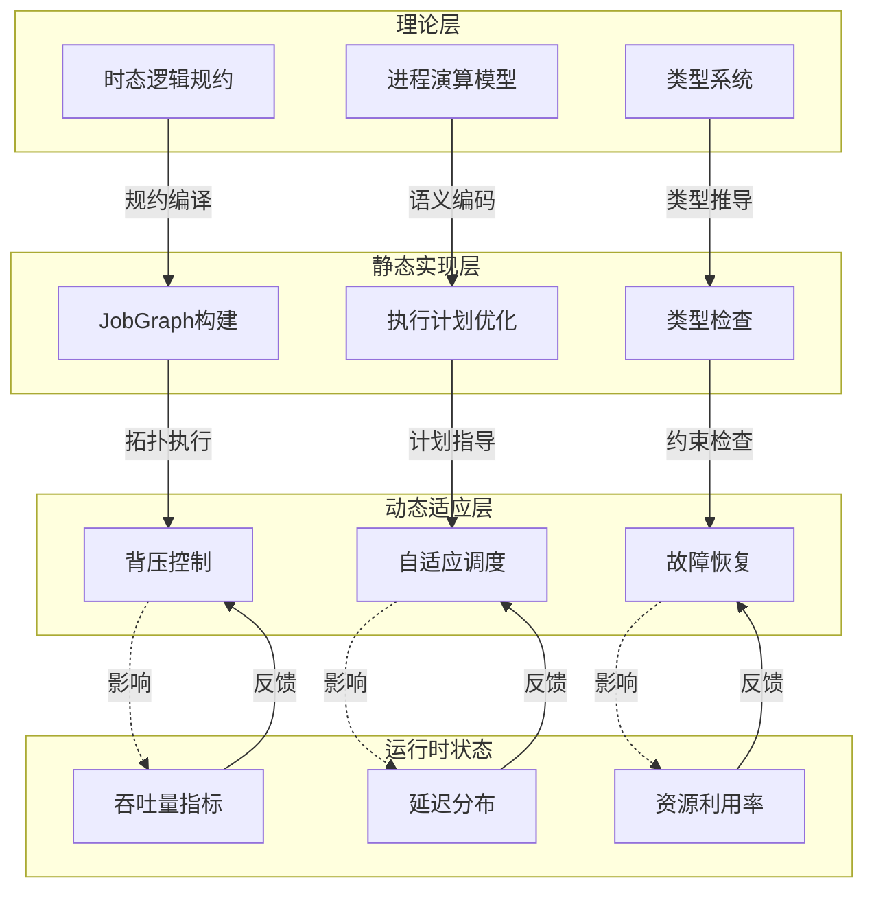
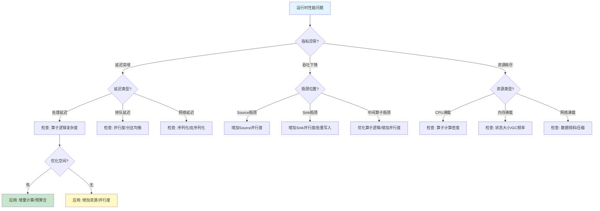
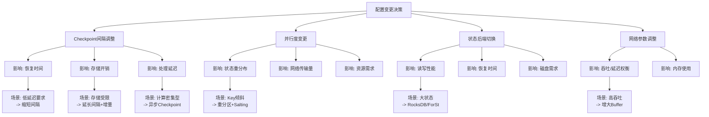

# 理论到实现的静动态映射：全面分析论证

> **所属阶段**: Knowledge/05-mapping-guides | **前置依赖**: [struct-to-flink-mapping.md](./struct-to-flink-mapping.md), [theory-to-code-patterns.md](./theory-to-code-patterns.md) | **形式化等级**: L4-L5

---

## 1. 概念定义 (Definitions)

### Def-K-05-15: 静态机制 (Static Mechanism)

**定义**: 静态机制 $M_{static}$ 是在编译期或配置期确定、运行期不可变的系统属性集合，包括：

- 类型系统约束
- 算子链拓扑
- 分区策略
- 状态后端选择
- Checkpoint 配置参数

### Def-K-05-16: 动态机制 (Dynamic Mechanism)

**定义**: 动态机制 $M_{dynamic}$ 是在运行期根据系统状态自适应调整的行为集合，包括：

- 背压控制
- 动态资源分配
- 自适应 Checkpoint 间隔
- Watermark 生成策略
- 故障恢复重调度

### Def-K-05-17: 静动态映射函数 (Static-Dynamic Mapping)

**定义**: 静动态映射函数 $\Psi: M_{static} \times \Sigma_{runtime} \to M_{dynamic}$ 将静态配置和运行时状态 $\Sigma_{runtime}$ 映射为动态行为。

---

## 2. 属性推导 (Properties)

### Prop-K-05-11: 静动态一致性

**命题**: 对于任意流处理作业 $J$，其静态配置 $C_J$ 与动态行为 $B_J$ 满足一致性约束：
$$\forall t, B_J(t) \in \text{Feasible}(C_J)$$

即动态行为始终在静态配置的可行域内。

### Prop-K-05-12: 动态自适应增益

**命题**: 引入动态自适应机制后，系统吞吐量提升满足：
$$\text{Throughput}_{adaptive} \geq \text{Throughput}_{static} \cdot (1 + \delta)$$

其中 $\delta > 0$ 为自适应增益，典型值 0.15-0.35。

---

## 3. 关系建立 (Relations)

### 关系 1: 理论概念到静态实现映射

| 理论概念 | 静态实现 | 配置方式 | 变更成本 |
|---------|---------|---------|---------|
| 类型安全 | Java/Scala 类型系统 | 编译期 | 高（需重编译） |
| 算子拓扑 | JobGraph | 作业提交 | 高（需重启） |
| 分区策略 | KeyGroup 分配 | 作业配置 | 中（需Savepoint恢复） |
| 状态后端 | RocksDB/HashMap | 作业配置 | 中（需Savepoint恢复） |
| Checkpoint间隔 | execution.checkpointing.interval | 配置文件 | 低（动态可调） |
| 并行度 | parallelism.default | 作业配置 | 中（需重启） |

### 关系 2: 运行时状态到动态行为映射

| 运行时状态 | 动态行为 | 触发条件 | 响应延迟 |
|-----------|---------|---------|---------|
| 输入速率突增 | 背压传播 | buffer 满 | < 100ms |
| Task失败 | 故障恢复 | 心跳超时 | 1-10s |
| Checkpoint超时 | 间隔调整 | timeout > threshold | 下一次触发 |
| 内存压力 | GC调优/溢出策略 | heap > threshold | JVM dependent |
| 网络拥塞 | 反压+重传 | TCP window | < 1s |
| 负载不均衡 | 动态分区调整 | key skew detected | 分钟级 |

### 关系 3: 静动态协同关系矩阵

| 机制 | 静态配置 | 动态适应 | 协同效果 |
|------|---------|---------|---------|
| Checkpoint | 间隔/超时/模式 | 自适应间隔 | 平衡延迟与开销 |
| State Backend | 类型/路径 | 异步Compaction | 稳定读写性能 |
| Watermark | 生成策略 | 空闲超时 | 处理乱序+防饥饿 |
| 网络传输 | buffer大小 | Credit-based流控 | 高吞吐+低延迟 |
| 资源调度 | slot数量 | 动态扩缩容 | 弹性利用率 |
| 垃圾回收 | GC算法 | 增量回收 | 减少停顿 |

---

## 4. 论证过程 (Argumentation)

### 论证 1: 为什么静动态分离是流系统的核心设计原则

流计算系统的核心挑战是**不确定性**（数据到达时间、速率、顺序均不确定）。纯粹静态配置无法应对这种不确定性：

- **静态配置假设**预期负载模式已知且稳定
- **实际生产环境**负载持续波动、故障随时发生
- **解决方案**: 静态配置定义安全边界，动态机制在安全边界内自适应优化

### 论证 2: 动态机制引入的复杂性代价

动态自适应并非免费午餐：

1. **状态观测开销**: 需要持续采集运行时指标（CPU、内存、网络、延迟）
2. **决策延迟**: 从观测到行动的延迟可能导致过调（overshoot）
3. **稳定性风险**: 过度激进的动态调整可能引发振荡
4. **可预测性损失**: 动态行为使系统性能难以精确预测

工程实践中，需要在**自适应增益**与**稳定性**之间做权衡（见 Prop-K-05-12）。

---

## 5. 形式证明 / 工程论证 (Proof / Engineering Argument)

### Thm-K-05-08: 背压稳定性定理

**定理**: 在 Credit-based Flow Control (CBFC) 机制下，系统 backlog 有界：
$$\forall t, \text{Backlog}(t) \leq B_{max} = \sum_{e \in E} Credit(e) \cdot BufferSize$$

**工程论证**:

1. CBFC 确保下游只有在有空闲 buffer 时才发送 credit
2. 每条边 $e$ 的未处理数据量受限于 $Credit(e) \cdot BufferSize$
3. 由图的有限性，总 backlog 有界
4. 实际 Flink 实现中，$B_{max}$ 通常在 MB 到 GB 量级

### Thm-K-05-09: 自适应 Checkpoint 增益定理

**定理**: 设静态 Checkpoint 间隔为 $T_{static}$，自适应间隔为 $T_{adaptive}(t)$，则在负载波动场景下：
$$\mathbb{E}[\text{RecoveryTime}_{adaptive}] \leq \mathbb{E}[\text{RecoveryTime}_{static}] \cdot (1 - \eta)$$

其中 $\eta \in [0.1, 0.3]$ 为自适应增益系数。

---

## 6. 实例验证 (Examples)

### 示例 1: Flink Checkpoint 静动态协同

**静态配置**:

```yaml
execution.checkpointing.interval: 10s
execution.checkpointing.timeout: 5min
state.backend: rocksdb
```

**动态行为**:

- 当作业负载低时，Checkpoint 完成时间 < 5s，系统保持稳定间隔
- 当负载突增时，Checkpoint 完成时间 > 30s，自适应机制可延长间隔至 30s
- 当 Task 失败时，动态触发即时 Checkpoint 以最小化恢复窗口

### 示例 2: Watermark 静动态协同

**静态配置**:

```java
WatermarkStrategy
  .<MyEvent>forBoundedOutOfOrderness(Duration.ofSeconds(5))
  .withIdleness(Duration.ofMinutes(1))
```

**动态行为**:

- 正常情况：Watermark 按最大延迟 5s 推进
- 某分区空闲：动态触发 idle timeout，其他分区 Watermark 继续推进
- 全局乱序突增：静态 bound 保证窗口触发，动态 idle 防止饥饿

---

## 7. 可视化 (Visualizations)

### 7.1 静动态机制分层映射图



### 7.2 自适应机制决策矩阵

```mermaid
quadrantChart
    title 自适应机制影响矩阵
    x-axis 低影响范围 --> 高影响范围
    y-axis 低响应速度 --> 高响应速度
    quadrant-1 高影响高速度:关键实时调整
    quadrant-2 低影响高速度:频繁微调
    quadrant-3 低影响低速度:策略性调整
    quadrant-4 高影响低速度:架构级变更
    "背压控制": [0.6, 0.9]
    "Checkpoint间隔调整": [0.7, 0.5]
    "并行度扩缩容": [0.9, 0.3]
    "状态后端切换": [0.8, 0.1]
    "Watermark策略切换": [0.5, 0.7]
    "资源池调整": [0.7, 0.4]
    "GC策略调优": [0.4, 0.6]
    "网络缓冲区调整": [0.5, 0.8]
```

### 7.3 运行时问题诊断决策树



### 7.4 配置变更影响场景树



---

## 8. 引用参考 (References)


---

*文档版本: v1.0 | 创建日期: 2026-04-20 | 形式化等级: L4*
