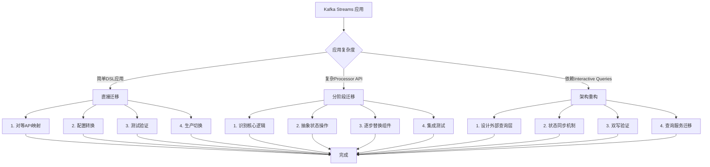
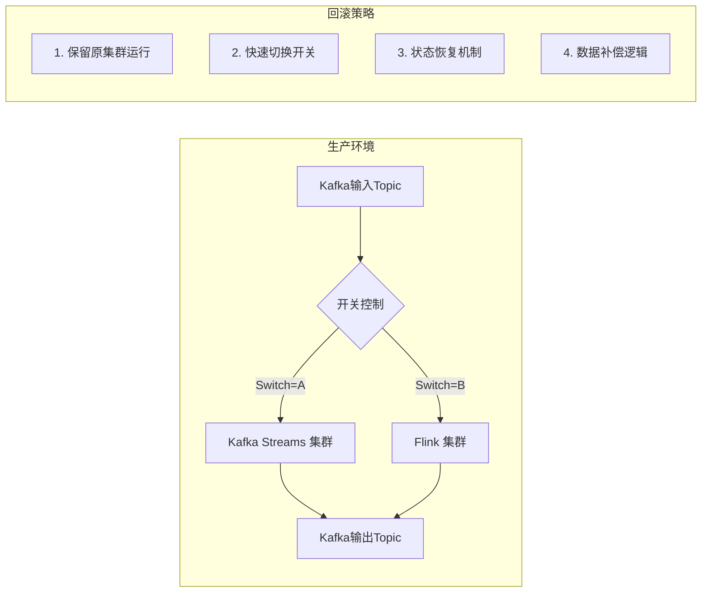
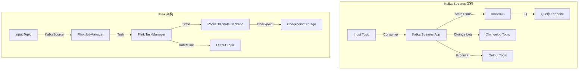
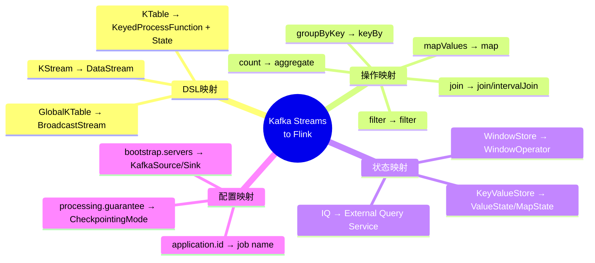
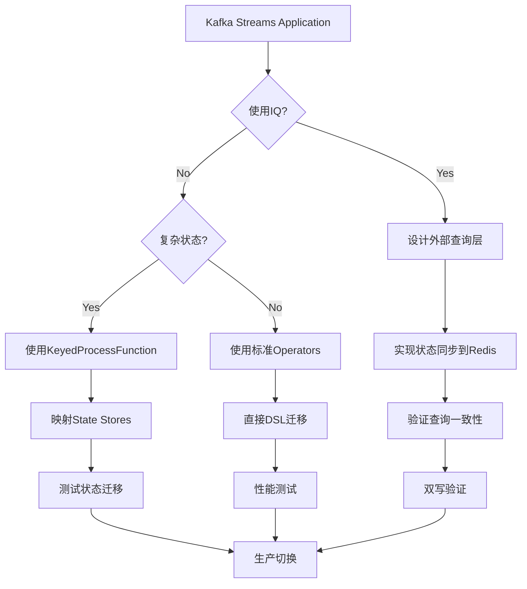
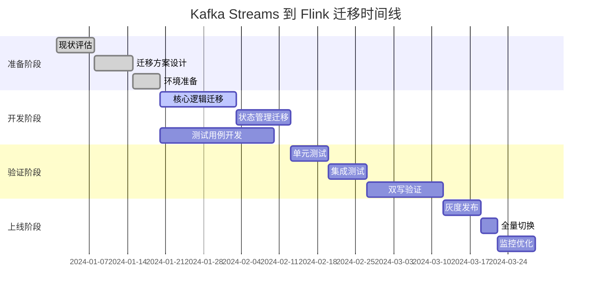

# Kafka Streams 到 Flink 迁移指南

> 所属阶段: Knowledge/05-migrations | 前置依赖: [Flink DataStream API](../../Flink/03-api/09-language-foundations/flink-datastream-api-complete-guide.md), [Kafka Streams 官方文档](https://kafka.apache.org/documentation/streams/) | 形式化等级: L4

## 1. 概念定义 (Definitions)

### Def-K-05-13-01: Kafka Streams 核心抽象

Kafka Streams 建立在 **KStream**、**KTable** 和 **GlobalKTable** 三个核心抽象之上：

$$
\text{KStream}(K, V) = \{ (k_i, v_i, t_i) \}_{i=0}^{\infty}, \quad k_i \in K, v_i \in V, t_i \in \mathbb{R}^+
$$

$$
\text{KTable}(K, V) = K \to (V \times \mathbb{R}^+), \quad \text{表示键到最新值的映射}
$$

$$
\text{GlobalKTable}(K, V) = \text{全量复制到每个实例的KTable}
$$

### Def-K-05-13-02: Flink 核心抽象

Flink 通过 **DataStream**、**Table** 和 **BroadcastStream** 实现流处理：

$$
\text{DataStream}(T) = \{ (e_i, t_i) \}_{i=0}^{\infty}, \quad e_i \in T, t_i \in \mathbb{R}^+
$$

$$
\text{StreamToTable}: \text{DataStream}(T) \to \text{Table}(T, \Delta T)
$$

其中 $\Delta T$ 表示表变更日志（INSERT/UPDATE/DELETE）。

### Def-K-05-13-03: 状态存储对比

| 特性 | Kafka Streams State Store | Flink State Backend |
|------|--------------------------|---------------------|
| 存储引擎 | RocksDB (默认) / 内存 | Memory / RocksDB / HashMap |
| 持久化机制 | Change Log Topic | Checkpoint / Savepoint |
| TTL 支持 | 支持 (基于时间) | 原生支持 (StateTtlConfig) |
| 查询能力 | 交互式查询 (IQ) | Queryable State (有限) |
| 容错恢复 | 日志回放重放 | Checkpoint 恢复 |
| 状态清理 | 基于时间/大小 | TTL / 显式清理 |

### Def-K-05-13-04: 拓扑结构定义

$$
\text{Topology}_{KS} = (V_{processor}, E_{stream}, E_{table})
$$

$$
\text{JobGraph}_{Flink} = (V_{operator}, E_{connection})
$$

**拓扑等价性**: 对于任意 Kafka Streams 拓扑，存在 Flink JobGraph 在语义上等价。

## 2. 属性推导 (Properties)

### Prop-K-05-13-01: 并行度语义差异

Kafka Streams 的并行度与 Kafka 分区数严格绑定：

$$
\text{Parallelism}_{KS} = \sum_{topic \in \text{inputs}} \text{numPartitions}_{topic}
$$

Flink 的并行度可独立配置，支持动态扩展：

$$
\text{Parallelism}_{Flink} \in [1, \text{maxParallelism}], \quad \text{支持运行时调整}
$$

### Prop-K-05-13-02: 时间语义对比

| 时间类型 | Kafka Streams | Flink |
|---------|--------------|-------|
| 事件时间 | 通过 TimestampExtractor | WatermarkStrategy |
| 处理时间 | 内置支持 | 内置支持 |
| 摄取时间 | 支持 | 支持 |
| Watermark 生成 | 隐式/显式 | 显式策略配置 |

### Lemma-K-05-13-01: 再平衡行为差异

Kafka Streams 在分区再平衡时的处理流程：

```
Consumer Rebalance → Task 暂停 → State 恢复 → 处理恢复
       ↓                    ↓           ↓           ↓
   触发监听器           提交偏移量    从Changelog   继续消费
                                     恢复状态
```

Flink 通过 Checkpoint 实现无状态迁移：

```
Checkpoint 完成 → Job 取消 → 重新部署 → State 恢复 → 继续处理
       ↓              ↓           ↓           ↓           ↓
   异步快照保存      优雅停止    新并行度配置   从检查点      精确恢复
                                          恢复状态
```

## 3. 关系建立 (Relations)

### 3.1 核心概念映射关系

| Kafka Streams 概念 | Flink 等价概念 | 语义说明 |
|-------------------|---------------|---------|
| `KStream<K, V>` | `DataStream<V>` + `keyBy()` | 无界数据流 |
| `KTable<K, V>` | `KeyedProcessFunction` + `ValueState` | 可更新的表视图 |
| `GlobalKTable<K, V>` | `BroadcastStream` + `BroadcastState` | 全量广播状态 |
| `KGroupedStream<K, V>` | `KeyedStream<K, V>` | 按键分组后的流 |
| `Topology` | `JobGraph` | 执行拓扑结构 |
| `Processor API` | `ProcessFunction` | 底层处理API |

### 3.2 DSL API 映射表

| Kafka Streams DSL | Flink DataStream API | 说明 |
|------------------|---------------------|------|
| `stream()` | `env.fromSource(KafkaSource)` | 创建输入流 |
| `mapValues(func)` | `map(func)` | 值转换 |
| `flatMapValues(func)` | `flatMap(func)` | 扁平化映射 |
| `filter(pred)` | `filter(pred)` | 条件过滤 |
| `selectKey(func)` | `keyBy(KeySelector)` | 重新分区键 |
| `groupByKey()` | `keyBy(KeySelector)` | 按键分组 |
| `count()` | `.aggregate(CountAggregate)` | 计数聚合 |
| `reduce(func)` | `.reduce(ReduceFunction)` | 归约操作 |
| `join(otherStream)` | `.join(otherStream)` | 流-流连接 |
| `leftJoin(otherStream)` | `.leftJoin(otherStream)` | 左外连接 |
| `outerJoin(otherStream)` | `.fullOuterJoin(otherStream)` | 全外连接 |
| `to(topic)` | `.sinkTo(KafkaSink)` | 输出到Topic |

### 3.3 窗口操作映射

```
Kafka Streams                          Flink
────────────────────────────────────────────────────────────────
TimeWindows.of(Duration)           →   TumblingEventTimeWindows.of(Time)
SlidingWindows.of(Duration,           SlidingEventTimeWindows.of(
  Duration)                         →     Time, Time)
SessionWindows.withGap(Duration)   →   EventTimeSessionWindows.withGap(Time)

// 窗口聚合操作
.count()                           →   .aggregate(CountAggregate)
.reduce(Reducer)                   →   .reduce(ReduceFunction)
.aggregate(Initializer, ...)       →   .aggregate(AggregateFunction)
```

### 3.4 状态存储映射

```
Kafka Streams State Store            Flink State
────────────────────────────────────────────────────────────────
KeyValueStore<K, V>               →   ValueState<V>
TimestampedKeyValueStore<K, V>    →   ValueState<V> + 时间戳字段
WindowStore<K, V>                 →   WindowState (内部实现)
SessionStore<K, V>                →   MapState<Long, V> + 自定义逻辑
```

## 4. 论证过程 (Argumentation)

### 4.1 架构对比分析

#### Kafka Streams 架构

```
┌─────────────────────────────────────────────────────────────┐
│                    Kafka Streams Application                 │
│  ┌─────────────┐  ┌─────────────┐  ┌─────────────────────┐  │
│  │   KStream   │  │   KTable    │  │   GlobalKTable      │  │
│  │   Source    │  │   Source    │  │   (全量复制)         │  │
│  └──────┬──────┘  └──────┬──────┘  └──────────┬──────────┘  │
│         │                │                    │             │
│         ▼                ▼                    ▼             │
│  ┌─────────────────────────────────────────────────────┐   │
│  │              Processor Topology                      │   │
│  │  ┌──────────┐   ┌──────────┐   ┌──────────┐         │   │
│  │  │  Filter  │ → │   Map    │ → │  Join    │         │   │
│  │  └──────────┘   └──────────┘   └──────────┘         │   │
│  └─────────────────────────────────────────────────────┘   │
│         │                                                   │
│         ▼                                                   │
│  ┌─────────────────────────────────────────────────────┐   │
│  │              State Stores (RocksDB)                  │   │
│  │  ┌──────────────┐  ┌──────────────┐  ┌──────────┐   │   │
│  │  │ KeyValueStore│  │  WindowStore │  │ IQ Query │   │   │
│  │  └──────────────┘  └──────────────┘  └──────────┘   │   │
│  └─────────────────────────────────────────────────────┘   │
│         │                                                   │
│         ▼                                                   │
│  ┌─────────────────────────────────────────────────────┐   │
│  │              Output (Producer)                       │   │
│  └─────────────────────────────────────────────────────┘   │
└─────────────────────────────────────────────────────────────┘
         │                                    │
         ▼                                    ▼
   ┌──────────┐                       ┌──────────────┐
   │   Kafka  │◄─────────────────────►│ Changelog    │
   │  Cluster │    State 恢复/备份     │   Topics     │
   └──────────┘                       └──────────────┘
```

#### Flink 架构

```
┌─────────────────────────────────────────────────────────────┐
│                      Flink Cluster                           │
│  ┌──────────────────┐          ┌──────────────────────────┐ │
│  │   JobManager     │          │      TaskManager(s)      │ │
│  │  ┌────────────┐  │          │  ┌────────────────────┐  │ │
│  │  │ JobGraph   │  │          │  │      Task          │  │ │
│  │  │ Scheduler  │──┼──────────┼─►│  ┌──────────────┐  │  │ │
│  │  │ Checkpoint │  │          │  │  │   Operator   │  │  │ │
│  │  └────────────┘  │          │  │  └──────────────┘  │  │ │
│  └──────────────────┘          │  │         │          │  │ │
│                                 │  │         ▼          │  │ │
│                                 │  │  ┌──────────────┐  │  │ │
│                                 │  │  │ State Backend│  │  │ │
│                                 │  │  │  (RocksDB)   │  │  │ │
│                                 │  │  └──────────────┘  │  │ │
│                                 │  └────────────────────┘  │ │
│                                 └──────────────────────────┘ │
└─────────────────────────────────────────────────────────────┘
         │                                    │
         ▼                                    ▼
   ┌──────────┐                       ┌──────────────┐
   │   Kafka  │◄─────────────────────►│ Checkpoint   │
   │  Cluster │      数据源/输出       │   Storage    │
   └──────────┘                       └──────────────┘
```

#### 关键差异对比

| 维度 | Kafka Streams | Flink |
|------|---------------|-------|
| **部署模式** | 嵌入应用进程（库模式） | 独立运行时（集群模式） |
| **资源管理** | 应用自身管理 | YARN/K8s/Standalone |
| **并行度** | 绑定Kafka分区数 | 独立配置，可动态调整 |
| **状态查询** | 原生IQ支持 | 需外部存储/Queryable State |
| **容错机制** | Changelog Topic | Checkpoint/Savepoint |
| **生态集成** | Kafka生态为主 | 多源连接器支持 |

### 4.2 部署模式差异

**Kafka Streams 部署选项**:

| 模式 | 描述 | 适用场景 |
|------|------|---------|
| Embedded | 嵌入Spring Boot等应用 | 轻量级处理、微服务 |
| Standalone | 独立JVM进程 | 中等规模处理 |
| Container | Docker/Kubernetes部署 | 云原生场景 |

**Flink 部署选项**:

| 模式 | 描述 | 适用场景 |
|------|------|---------|
| Application Mode | 每个应用独立JobManager | 生产环境推荐 |
| Per-Job Mode | 每个作业独立集群 | 资源隔离要求高 |
| Session Mode | 共享集群资源 | 开发测试环境 |

### 4.3 状态管理差异论证

**Kafka Streams 状态管理**:

1. **本地存储**: 每个实例维护自己的RocksDB状态
2. **变更日志**: 状态变更自动写入Kafka Topic
3. **恢复机制**: 重启时从Changelog Topic重放恢复
4. **查询能力**: 通过Interactive Queries直接查询本地状态

**Flink 状态管理**:

1. **分布式存储**: 状态分布在各TaskManager
2. **Checkpoint**: 异步快照到分布式存储(HDFS/S3)
3. **恢复机制**: 从Checkpoint/Savepoint精确恢复
4. **查询能力**: 有限支持，推荐同步到外部存储

## 5. 形式证明 / 工程论证 (Proof / Engineering Argument)

### 定理 Thm-K-05-13-01: Kafka Streams 到 Flink 的语义保持性

**定理**: 对于使用 Kafka Streams DSL 构建的任意流处理拓扑 $\mathcal{T}_{KS}$，存在 Flink DataStream 程序 $\mathcal{P}_{F}$ 使得对于所有输入流序列 $\mathcal{I}$：

$$
\mathcal{O}(\mathcal{T}_{KS}, \mathcal{I}) = \mathcal{O}(\mathcal{P}_{F}, \mathcal{I})
$$

**证明**:

1. **源算子等价**: Kafka Streams `StreamsBuilder.stream()` 等价于 Flink `KafkaSource` 配合 `fromSource()`，均从Kafka Topic消费数据。

2. **转换算子等价**: 基础转换（map/filter/flatMap）语义完全相同，均为无状态逐条转换。

3. **按键分组等价**: Kafka Streams `groupByKey()` 等价于 Flink `keyBy()`，均产生 `KeyedStream` 用于后续聚合。

4. **窗口语义等价**: Kafka Streams 时间窗口与 Flink `WindowAssigner` 在事件时间语义下行为一致，均按时间边界分组。

5. **连接语义等价**: Kafka Streams 的 KStream-KStream join 与 Flink `IntervalJoin` 语义一致，均基于时间窗口匹配。

6. **Sink等价**: Kafka Streams `to()` 等价于 Flink `KafkaSink`，均输出到Kafka Topic。

### 工程论证: 状态存储迁移策略

**状态类型映射**:

| Kafka Streams | Flink 实现 | 迁移复杂度 |
|--------------|-----------|-----------|
| KeyValueStore | ValueState/MapState | 低 |
| TimestampedKeyValueStore | ValueState + 时间戳 | 中 |
| WindowStore | WindowOperator 内部状态 | 中 |
| SessionStore | MapState + 自定义逻辑 | 高 |

**迁移策略**:

1. **存量数据迁移**: 通过Kafka Topic导出导入
2. **双写策略**: 同时写入两套系统，验证一致性后切换
3. **CDC同步**: 使用Change Data Capture同步状态变更

## 6. 实例验证 (Examples)

### 6.1 WordCount 迁移示例

**Kafka Streams 实现**:

```java
public class KafkaStreamsWordCount {
    public static void main(String[] args) {
        Properties props = new Properties();
        props.put(StreamsConfig.APPLICATION_ID_CONFIG, "word-count-app");
        props.put(StreamsConfig.BOOTSTRAP_SERVERS_CONFIG, "kafka:9092");
        props.put(StreamsConfig.DEFAULT_KEY_SERDE_CLASS_CONFIG, Serdes.String().getClass());
        props.put(StreamsConfig.DEFAULT_VALUE_SERDE_CLASS_CONFIG, Serdes.String().getClass());
        props.put(StreamsConfig.PROCESSING_GUARANTEE_CONFIG, "exactly_once_v2");

        StreamsBuilder builder = new StreamsBuilder();

        // 创建输入流
        KStream<String, String> source = builder.stream("input-topic");

        // WordCount 处理逻辑
        KTable<String, Long> wordCounts = source
            // 将每行文本拆分为单词
            .flatMapValues(value -> Arrays.asList(value.toLowerCase().split("\\W+")))
            // 过滤空单词
            .filter((key, word) -> !word.isEmpty())
            // 选择单词作为key
            .selectKey((key, word) -> word)
            // 按单词分组
            .groupByKey()
            // 计数聚合
            .count(Materialized.<String, Long, KeyValueStore<Bytes, byte[]>>as("counts-store")
                .withValueSerde(Serdes.Long()));

        // 输出结果到topic
        wordCounts.toStream().to("output-topic",
            Produced.with(Serdes.String(), Serdes.Long()));

        KafkaStreams streams = new KafkaStreams(builder.build(), props);
        streams.start();

        // 优雅关闭
        Runtime.getRuntime().addShutdownHook(new Thread(streams::close));
    }
}
```

**Flink 等价实现**:

```java
public class FlinkWordCount {
    public static void main(String[] args) throws Exception {
        StreamExecutionEnvironment env =
            StreamExecutionEnvironment.getExecutionEnvironment();

        // 配置Checkpoint实现Exactly-Once
        env.enableCheckpointing(60000);
        env.getCheckpointConfig().setCheckpointingMode(
            CheckpointingMode.EXACTLY_ONCE);
        env.getCheckpointConfig().setMinPauseBetweenCheckpoints(30000);

        // Kafka Source配置
        KafkaSource<String> source = KafkaSource.<String>builder()
            .setBootstrapServers("kafka:9092")
            .setTopics("input-topic")
            .setGroupId("word-count-flink")
            .setStartingOffsets(OffsetsInitializer.earliest())
            .setValueOnlyDeserializer(new SimpleStringSchema())
            .build();

        DataStream<String> stream = env.fromSource(
            source,
            WatermarkStrategy.noWatermarks(),
            "Kafka Source"
        );

        // WordCount 处理逻辑
        DataStream<Tuple2<String, Long>> wordCounts = stream
            // 将每行文本拆分为单词
            .flatMap(new Tokenizer())
            // 过滤空单词
            .filter(word -> !word.isEmpty())
            // 转换为(word, 1)格式
            .map(word -> Tuple2.of(word, 1L))
            .returns(Types.TUPLE(Types.STRING, Types.LONG))
            // 按单词分组
            .keyBy(value -> value.f0)
            // 窗口聚合（可选，无窗口则为全局聚合）
            .window(TumblingEventTimeWindows.of(Time.minutes(1)))
            // 计数求和
            .aggregate(new CountAggregate());

        // Kafka Sink配置
        KafkaSink<Tuple2<String, Long>> sink = KafkaSink.<Tuple2<String, Long>>builder()
            .setBootstrapServers("kafka:9092")
            .setRecordSerializer(KafkaRecordSerializationSchema.builder()
                .setTopic("output-topic")
                .setKeySerializationSchema(new SimpleStringSchema())
                .setValueSerializationSchema(new LongSerializationSchema())
                .build())
            .setDeliveryGuarantee(DeliveryGuarantee.EXACTLY_ONCE)
            .build();

        wordCounts.sinkTo(sink);
        env.execute("Flink WordCount");
    }

    // 自定义FlatMapFunction：分词
    public static class Tokenizer implements FlatMapFunction<String, String> {
        @Override
        public void flatMap(String value, Collector<String> out) {
            for (String word : value.toLowerCase().split("\\W+")) {
                out.collect(word);
            }
        }
    }

    // 自定义聚合函数：计数
    public static class CountAggregate implements
            AggregateFunction<Tuple2<String, Long>, Long, Long> {
        @Override
        public Long createAccumulator() { return 0L; }

        @Override
        public Long add(Tuple2<String, Long> value, Long accumulator) {
            return accumulator + value.f1;
        }

        @Override
        public Long getResult(Long accumulator) { return accumulator; }

        @Override
        public Long merge(Long a, Long b) { return a + b; }
    }
}
```

### 6.2 Join 操作迁移

**Kafka Streams - KStream-KStream Join**:

```java
// 订单流
KStream<String, Order> orders = builder.stream("orders");
// 支付流
KStream<String, Payment> payments = builder.stream("payments");

// 在5分钟窗口内连接订单和支付
KStream<String, EnrichedOrder> enrichedOrders = orders
    .join(payments,
        (order, payment) -> new EnrichedOrder(order, payment),
        JoinWindows.of(Duration.ofMinutes(5)),
        StreamJoined.with(Serdes.String(), orderSerde, paymentSerde));
```

**Flink - Interval Join**:

```java
// 订单流
DataStream<Order> orders = env.fromSource(
    KafkaSource.<Order>builder()
        .setTopics("orders")
        .setValueOnlyDeserializer(new OrderDeserializationSchema())
        .build(),
    WatermarkStrategy.<Order>forBoundedOutOfOrderness(Duration.ofSeconds(5))
        .withIdleness(Duration.ofMinutes(1)),
    "Orders"
).assignTimestampsAndWatermarks(
    WatermarkStrategy.<Order>forBoundedOutOfOrderness(Duration.ofSeconds(5))
);

// 支付流
DataStream<Payment> payments = env.fromSource(
    KafkaSource.<Payment>builder()
        .setTopics("payments")
        .setValueOnlyDeserializer(new PaymentDeserializationSchema())
        .build(),
    WatermarkStrategy.<Payment>forBoundedOutOfOrderness(Duration.ofSeconds(5)),
    "Payments"
).assignTimestampsAndWatermarks(
    WatermarkStrategy.<Payment>forBoundedOutOfOrderness(Duration.ofSeconds(5))
);

// Interval Join在5分钟窗口内连接
DataStream<EnrichedOrder> enrichedOrders = orders
    .keyBy(Order::getOrderId)
    .intervalJoin(payments.keyBy(Payment::getOrderId))
    .between(Time.minutes(-5), Time.minutes(5))
    .process(new ProcessJoinFunction<Order, Payment, EnrichedOrder>() {
        @Override
        public void processElement(Order order, Payment payment,
                Context ctx, Collector<EnrichedOrder> out) {
            out.collect(new EnrichedOrder(order, payment));
        }
    });
```

**Kafka Streams - KStream-KTable Join**:

```java
// 订单流
KStream<String, Order> orders = builder.stream("orders");
// 客户维度表
KTable<String, Customer> customers = builder.table("customers");

// 左连接客户信息
KStream<String, EnrichedOrder> enriched = orders
    .leftJoin(customers,
        (order, customer) -> {
            order.setCustomerInfo(customer);
            return order;
        });
```

**Flink - Stream-Broadcast Join**:

```java
// 客户数据作为广播流
DataStream<Customer> customerStream = env.fromSource(
    KafkaSource.<Customer>builder()
        .setTopics("customers")
        .setValueOnlyDeserializer(new CustomerDeserializationSchema())
        .build(),
    WatermarkStrategy.noWatermarks(),
    "Customers"
);

// 定义广播状态描述符
MapStateDescriptor<String, Customer> customerStateDescriptor =
    new MapStateDescriptor<>("customers", String.class, Customer.class);
BroadcastStream<Customer> broadcastCustomers = customerStream.broadcast(customerStateDescriptor);

// 订单流连接广播流
DataStream<EnrichedOrder> enriched = orderStream
    .connect(broadcastCustomers)
    .process(new BroadcastProcessFunction<Order, Customer, EnrichedOrder>() {
        @Override
        public void processElement(Order order, ReadOnlyContext ctx,
                Collector<EnrichedOrder> out) throws Exception {
            ReadOnlyBroadcastState<String, Customer> state =
                ctx.getBroadcastState(customerStateDescriptor);
            Customer customer = state.get(order.getCustomerId());
            out.collect(new EnrichedOrder(order, customer));
        }

        @Override
        public void processBroadcastElement(Customer customer, Context ctx,
                Collector<EnrichedOrder> out) throws Exception {
            ctx.getBroadcastState(customerStateDescriptor).put(customer.getId(), customer);
        }
    });
```

### 6.3 Window 操作迁移

**Kafka Streams - 滚动窗口聚合**:

```java
// 每5分钟统计一次用户点击数
KStream<String, Click> clicks = builder.stream("clicks");

KTable<Windowed<String>, Long> clickCounts = clicks
    .groupByKey()
    .windowedBy(TimeWindows.of(Duration.ofMinutes(5)))
    .count();
```

**Flink - 滚动窗口聚合**:

```java
DataStream<Tuple2<String, Long>> clickCounts = clicks
    .keyBy(Click::getUserId)
    .window(TumblingEventTimeWindows.of(Time.minutes(5)))
    .aggregate(new CountAggregate<>());
```

**Kafka Streams - 滑动窗口聚合**:

```java
// 每1分钟计算过去5分钟的统计
KTable<Windowed<String>, Long> slidingCounts = clicks
    .groupByKey()
    .windowedBy(TimeWindows.of(Duration.ofMinutes(5)).advanceBy(Duration.ofMinutes(1)))
    .count();
```

**Flink - 滑动窗口聚合**:

```java
DataStream<Tuple2<String, Long>> slidingCounts = clicks
    .keyBy(Click::getUserId)
    .window(SlidingEventTimeWindows.of(Time.minutes(5), Time.minutes(1)))
    .aggregate(new CountAggregate<>());
```

**Kafka Streams - 会话窗口聚合**:

```java
// 会话窗口：活动间隔超过10分钟则开启新会话
KTable<Windowed<String>, Long> sessionCounts = clicks
    .groupByKey()
    .windowedBy(SessionWindows.withGap(Duration.ofMinutes(10)))
    .count();
```

**Flink - 会话窗口聚合**:

```java
DataStream<Tuple2<String, Long>> sessionCounts = clicks
    .keyBy(Click::getUserId)
    .window(EventTimeSessionWindows.withGap(Time.minutes(10)))
    .aggregate(new CountAggregate<>());
```

### 6.4 State Store 迁移

**Kafka Streams - KeyValueStore**:

```java
public class KafkaStreamsStatefulProcessor {
    public static void main(String[] args) {
        StreamsBuilder builder = new StreamsBuilder();

        KStream<String, Event> events = builder.stream("events");

        events.process(() -> new Processor<String, Event, String, Result>() {
            private KeyValueStore<String, AggregatedState> stateStore;
            private ProcessorContext context;

            @Override
            public void init(ProcessorContext context) {
                this.context = context;
                this.stateStore = (KeyValueStore<String, AggregatedState>)
                    context.getStateStore("aggregated-state");
            }

            @Override
            public void process(String key, Event event) {
                AggregatedState current = stateStore.get(key);
                if (current == null) {
                    current = new AggregatedState();
                }
                current.update(event);
                stateStore.put(key, current);
                context.forward(key, current.toResult());
            }
        }, "aggregated-state");

        // 配置状态存储
        builder.addStateStore(
            Stores.keyValueStoreBuilder(
                Stores.persistentKeyValueStore("aggregated-state"),
                Serdes.String(),
                aggregatedStateSerde
            )
        );
    }
}
```

**Flink - ValueState 等价实现**:

```java
public class FlinkStatefulFunction extends KeyedProcessFunction<String, Event, Result> {
    private transient ValueState<AggregatedState> state;

    @Override
    public void open(Configuration parameters) {
        StateTtlConfig ttlConfig = StateTtlConfig
            .newBuilder(Time.hours(24))
            .setUpdateType(StateTtlConfig.UpdateType.OnCreateAndWrite)
            .setStateVisibility(StateTtlConfig.StateVisibility.NeverReturnExpired)
            .build();

        ValueStateDescriptor<AggregatedState> descriptor =
            new ValueStateDescriptor<>("aggregated-state", AggregatedState.class);
        descriptor.enableTimeToLive(ttlConfig);
        state = getRuntimeContext().getState(descriptor);
    }

    @Override
    public void processElement(Event event, Context ctx, Collector<Result> out)
            throws Exception {
        AggregatedState current = state.value();
        if (current == null) {
            current = new AggregatedState();
        }
        current.update(event);
        state.update(current);
        out.collect(current.toResult());
    }
}
```

## 7. 配置迁移

### 7.1 应用ID配置

| Kafka Streams 配置 | Flink 等价配置 | 说明 |
|-------------------|---------------|------|
| `application.id` | `pipeline.name` / 作业名 | 应用唯一标识 |
| `client.id` | `metrics.reporter` 前缀 | 客户端标识 |
| `group.id` | `KafkaSource.groupId` | 消费者组ID |

**Kafka Streams**:

```java
props.put(StreamsConfig.APPLICATION_ID_CONFIG, "my-streams-app");
props.put(StreamsConfig.CLIENT_ID_CONFIG, "my-client");
```

**Flink**:

```java
env.execute("my-streams-app");  // 作业名称

// KafkaSource配置
createKafkaSource()
    .setProperty("group.id", "my-consumer-group")
    .setProperty("client.id", "my-client");
```

### 7.2 Kafka消费者配置

| Kafka Streams 配置 | Flink 等价配置 | 说明 |
|-------------------|---------------|------|
| `bootstrap.servers` | `KafkaSource.setBootstrapServers()` | Kafka地址 |
| `auto.offset.reset` | `OffsetsInitializer` | 起始偏移量 |
| `max.poll.records` | `fetch.max.bytes` | 消费批次大小 |
| `enable.auto.commit` | 禁用（由Checkpoint管理） | 自动提交 |

**Kafka Streams**:

```java
props.put(StreamsConfig.BOOTSTRAP_SERVERS_CONFIG, "kafka:9092");
props.put(ConsumerConfig.AUTO_OFFSET_RESET_CONFIG, "earliest");
props.put(ConsumerConfig.MAX_POLL_RECORDS_CONFIG, 500);
```

**Flink**:

```java
KafkaSource<String> source = KafkaSource.<String>builder()
    .setBootstrapServers("kafka:9092")
    .setStartingOffsets(OffsetsInitializer.earliest())
    .setProperty("fetch.max.bytes", "52428800")
    .build();

// 禁用自动提交，由Flink Checkpoint管理
// Flink自动处理偏移量提交
```

### 7.3 状态目录配置

| Kafka Streams 配置 | Flink 等价配置 | 说明 |
|-------------------|---------------|------|
| `state.dir` | `state.backend.incremental` | 状态存储路径 |
| `state.cleanup.delay.ms` | `state.backend.rocksdb.predefined-options` | 状态清理 |

**Kafka Streams**:

```java
props.put(StreamsConfig.STATE_DIR_CONFIG, "/var/lib/kafka-streams");
props.put(StreamsConfig.STATE_CLEANUP_DELAY_MS_CONFIG, 60000);
```

**Flink**:

```java
// 配置RocksDB状态后端
EmbeddedRocksDBStateBackend rocksDbBackend =
    new EmbeddedRocksDBStateBackend(true);  // 增量Checkpoint
env.setStateBackend(rocksDbBackend);

// Checkpoint存储路径
env.getCheckpointConfig().setCheckpointStorage("file:///var/lib/flink/checkpoints");
```

### 7.4 Exactly-Once配置

**Kafka Streams**:

```java
// 启用Exactly-Once语义
props.put(StreamsConfig.PROCESSING_GUARANTEE_CONFIG, "exactly_once_v2");

// 事务超时配置
props.put(ProducerConfig.TRANSACTION_TIMEOUT_CONFIG, 60000);
```

**Flink**:

```java
// 启用Checkpoint实现Exactly-Once
env.enableCheckpointing(60000);
env.getCheckpointConfig().setCheckpointingMode(CheckpointingMode.EXACTLY_ONCE);

// Kafka Sink配置Exactly-Once
KafkaSink<String> sink = KafkaSink.<String>builder()
    .setBootstrapServers("kafka:9092")
    .setDeliveryGuarantee(DeliveryGuarantee.EXACTLY_ONCE)
    .setTransactionalIdPrefix("flink-transaction")
    .build();
```

## 8. 高级特性迁移

### 8.1 Interactive Queries 替代方案

**Kafka Streams - Interactive Queries**:

```java
// 启动Streams应用
KafkaStreams streams = new KafkaStreams(builder.build(), props);
streams.start();

// 通过REST API提供状态查询服务
ReadOnlyKeyValueStore<String, Long> store = streams.store(
    StoreQueryParameters.fromNameAndType(
        "counts-store",
        QueryableStoreTypes.keyValueStore()
    )
);
Long count = store.get("word");
```

**Flink - 替代方案1：外部存储同步**:

```java
public class StateSyncFunction extends KeyedProcessFunction<String, Event, Result> {
    private transient ValueState<AggregatedState> state;
    private transient RedisAsyncCommands<String, String> redisCommands;

    @Override
    public void open(Configuration parameters) {
        state = getRuntimeContext().getState(
            new ValueStateDescriptor<>("state", AggregatedState.class));

        // 连接Redis
        RedisClient client = RedisClient.create("redis://localhost:6379");
        redisCommands = client.connect().async();
    }

    @Override
    public void processElement(Event event, Context ctx, Collector<Result> out)
            throws Exception {
        AggregatedState current = state.value();
        if (current == null) {
            current = new AggregatedState();
        }
        current.update(event);
        state.update(current);

        // 同步到Redis供外部查询
        redisCommands.set(ctx.getCurrentKey(), serialize(current));

        out.collect(current.toResult());
    }
}
```

**Flink - 替代方案2：异步查询服务**:

```java
// 通过AsyncFunction实现异步状态查询
public class AsyncStateQueryFunction
    extends AsyncFunction<String, QueryResult> {

    private transient StateQueryClient queryClient;

    @Override
    public void open(Configuration parameters) {
        queryClient = new StateQueryClient("http://query-service:8080");
    }

    @Override
    public void asyncInvoke(String key, ResultFuture<QueryResult> resultFuture) {
        queryClient.queryAsync(key)
            .thenAccept(result -> resultFuture.complete(Collections.singletonList(result)))
            .exceptionally(throwable -> {
                resultFuture.completeExceptionally(throwable);
                return null;
            });
    }
}
```

### 8.2 Exactly-Once 语义迁移

**Kafka Streams Exactly-Once 配置**:

```java
// 启用Exactly-Once语义 (EOS v2)
props.put(StreamsConfig.PROCESSING_GUARANTEE_CONFIG, "exactly_once_v2");

// 事务ID前缀
props.put(StreamsConfig.APPLICATION_ID_CONFIG, "my-app");  // 自动生成transactional.id

// 事务超时时间
props.put(ProducerConfig.TRANSACTION_TIMEOUT_CONFIG, 60000);
```

**Flink Exactly-Once 配置**:

```java
public class FlinkExactlyOnceJob {
    public static void main(String[] args) throws Exception {
        StreamExecutionEnvironment env =
            StreamExecutionEnvironment.getExecutionEnvironment();

        // 1. 启用Checkpoint
        env.enableCheckpointing(60000);  // 每60秒触发一次Checkpoint
        env.getCheckpointConfig().setCheckpointingMode(
            CheckpointingMode.EXACTLY_ONCE);

        // 2. Checkpoint配置
        env.getCheckpointConfig().setMinPauseBetweenCheckpoints(30000);
        env.getCheckpointConfig().setCheckpointTimeout(600000);
        env.getCheckpointConfig().setMaxConcurrentCheckpoints(1);
        env.getCheckpointConfig().enableExternalizedCheckpoints(
            ExternalizedCheckpointCleanup.RETAIN_ON_CANCELLATION);

        // 3. 配置状态后端
        env.setStateBackend(new EmbeddedRocksDBStateBackend(true));
        env.getCheckpointConfig().setCheckpointStorage("hdfs://namenode:8020/flink/checkpoints");

        // 4. Kafka Source配置
        KafkaSource<String> source = KafkaSource.<String>builder()
            .setBootstrapServers("kafka:9092")
            .setTopics("input-topic")
            .setGroupId("flink-consumer-group")
            .setStartingOffsets(OffsetsInitializer.earliest())
            .build();

        // 5. Kafka Sink配置Exactly-Once
        KafkaSink<String> sink = KafkaSink.<String>builder()
            .setBootstrapServers("kafka:9092")
            .setRecordSerializer(KafkaRecordSerializationSchema.builder()
                .setTopic("output-topic")
                .setValueSerializationSchema(new SimpleStringSchema())
                .build())
            .setDeliveryGuarantee(DeliveryGuarantee.EXACTLY_ONCE)
            .setTransactionalIdPrefix("flink-exactly-once")
            .build();

        env.fromSource(source, WatermarkStrategy.noWatermarks(), "Source")
           .map(new ProcessingFunction())
           .sinkTo(sink);

        env.execute("Flink Exactly-Once Job");
    }
}
```

### 8.3 重新分区迁移

**Kafka Streams - 重新分区**:

```java
// 通过through()显式重新分区到中间topic
KStream<String, Event> repartitioned = events
    .selectKey((key, value) -> value.getNewKey())
    .through("repartition-topic");

// 或隐式重新分区（groupByKey会自动触发）
KGroupedStream<String, Event> grouped = events
    .selectKey((key, value) -> value.getNewKey())
    .groupByKey();
```

**Flink - 重新分区策略**:

```java
// 1. 通过keyBy重新分区
DataStream<Event> repartitioned = events
    .map(event -> {
        event.setPartitionKey(event.getNewKey());
        return event;
    })
    .keyBy(Event::getPartitionKey);

// 2. 自定义分区器
DataStream<Event> customPartitioned = events
    .partitionCustom(
        new Partitioner<String>() {
            @Override
            public int partition(String key, int numPartitions) {
                // 自定义分区逻辑
                return Math.abs(key.hashCode()) % numPartitions;
            }
        },
        Event::getPartitionKey
    );

// 3. 广播（对应GlobalKTable）
DataStream<Dimension> broadcastStream = dimensionStream.broadcast();

// 4. 重平衡（负载均衡）
DataStream<Event> rebalanced = events.rebalance();

// 5.  rescale（本地优先）
DataStream<Event> rescaled = events.rescale();
```

## 9. 最佳实践

### 9.1 迁移策略选择



### 9.2 双写验证方案

```java
/**
 * 双写验证模式：同时写入两套系统，对比输出一致性
 */
public class DualWriteValidation {

    public static void main(String[] args) throws Exception {
        StreamExecutionEnvironment env =
            StreamExecutionEnvironment.getExecutionEnvironment();

        // 源数据
        DataStream<Event> source = env.fromSource(
            KafkaSource.<Event>builder()
                .setTopics("input-topic")
                .build(),
            WatermarkStrategy.noWatermarks(),
            "Source"
        );

        // Flink处理结果
        DataStream<Result> flinkResult = source
            .keyBy(Event::getKey)
            .process(new FlinkProcessingFunction());

        // 旁路输出：同时发送到验证Topic
        OutputTag<Result> validationTag = new OutputTag<Result>("validation"){};

        SingleOutputStreamOperator<Result> mainStream = flinkResult
            .process(new ProcessFunction<Result, Result>() {
                @Override
                public void processElement(Result result, Context ctx,
                        Collector<Result> out) {
                    out.collect(result);
                    ctx.output(validationTag, result);
                }
            });

        // 主输出到生产Topic
        mainStream.sinkTo(KafkaSink.<Result>builder()
            .setBootstrapServers("kafka:9092")
            .setRecordSerializer(...)
            .build());

        // 验证输出到专门Topic
        mainStream.getSideOutput(validationTag)
            .sinkTo(KafkaSink.<Result>builder()
                .setBootstrapServers("kafka:9092")
                .setRecordSerializer(
                    KafkaRecordSerializationSchema.builder()
                        .setTopic("flink-validation-output")
                        .build()
                )
                .build());

        env.execute();
    }
}
```

### 验证流程

```
┌─────────────────────────────────────────────────────────────────┐
│                      双写验证流程                                │
├─────────────────────────────────────────────────────────────────┤
│                                                                 │
│   输入数据 ──────► ┌──────────────┐  ──────► Kafka Streams 输出  │
│       │            │  相同输入源  │         (已有Topic)          │
│       │            └──────────────┘                            │
│       │                          │                             │
│       │                          ▼                             │
│       │                   Flink 处理                           │
│       │                          │                             │
│       │                          ▼                             │
│       └──────────► ┌──────────────┐  ──────► Flink 输出         │
│                    │  验证Topic   │         (验证Topic)         │
│                    └──────────────┘                            │
│                                                                 │
│   对比服务                                                       │
│   ┌──────────────┐                                              │
│   │ 读取两个输出 │                                              │
│   │ 按Key关联    │                                              │
│   │ 字段级对比   │                                              │
│   │ 生成差异报告 │                                              │
│   └──────────────┘                                              │
│                                                                 │
│   验收标准：                                                     │
│   - 延迟差异 < 1分钟                                            │
│   - 数据一致性 100%                                             │
│   - 字段值差异 0                                                │
│                                                                 │
└─────────────────────────────────────────────────────────────────┘
```

### 9.3 回滚方案



**回滚检查清单**:

| 检查项 | 详细内容 | 状态 |
|-------|---------|------|
| 原系统状态 | Kafka Streams应用保持运行，可随时切换 | ☐ |
| 数据一致性 | 双写期间数据已对齐 | ☐ |
| 监控告警 | Flink异常自动触发回滚 | ☐ |
| 状态备份 | Checkpoint已保存到可靠存储 | ☐ |
| 切换脚本 | 一键切换流量到原系统 | ☐ |
| 回滚时间 | RTO < 5分钟 | ☐ |
| 数据补偿 | 切换期间数据可补偿处理 | ☐ |

## 10. 可视化 (Visualizations)

### 10.1 架构对比图



### 10.2 API 映射全景图



### 10.3 迁移决策流程



### 10.4 时间线规划



## 11. 性能对比与优化

### 11.1 性能对比

| 指标 | Kafka Streams | Flink | 优化建议 |
|------|---------------|-------|---------|
| 延迟 | 10-100ms | 1-10ms | Flink更优的流处理模型 |
| 吞吐量 | 中等 | 高 | Flink并行度独立配置 |
| 扩展性 | 受限于分区数 | 独立扩展 | Flink动态扩缩容 |
| 状态查询 | 原生IQ支持 | 需外部实现 | 引入Redis/Cassandra |
| 资源隔离 | 应用级 | 集群级 | Flink更适合多租户 |
| 生态集成 | Kafka生态 | 多源支持 | Flink连接器更丰富 |

### 11.2 性能优化建议

**Flink 特有优化**:

```java
// 1. 启用对象复用
env.getConfig().enableObjectReuse();

// 2. 配置网络缓冲区
env.setBufferTimeout(100);  // 减少延迟

// 3. 调整并行度
DataStream<Event> stream = env.fromSource(...)
    .setParallelism(4)  // Source并行度
    .keyBy(...)
    .window(...)
    .aggregate(...)
    .setParallelism(8);  // 聚合操作并行度

// 4. 状态后端调优
RocksDBStateBackend rocksDbBackend = new RocksDBStateBackend("hdfs://...", true);
rocksDbBackend.setPredefinedOptions(PredefinedOptions.FLASH_SSD_OPTIMIZED);
env.setStateBackend(rocksDbBackend);

// 5. Checkpoint优化
env.getCheckpointConfig().setCheckpointInterval(60000);
env.getCheckpointConfig().setMinPauseBetweenCheckpoints(30000);
env.getCheckpointConfig().enableUnalignedCheckpoints();  // 非对齐Checkpoint
```

## 12. 常见问题 (FAQ)

### Q1: Kafka Streams 的 Punctuation 如何迁移？

**A**: 使用 Flink 的 **TimerService** 实现：

```java
public class PunctuatedFunction extends KeyedProcessFunction<String, Event, Result> {
    @Override
    public void processElement(Event event, Context ctx, Collector<Result> out) {
        // 注册处理时间定时器，模拟 punctuation
        ctx.timerService().registerProcessingTimeTimer(
            ctx.timerService().currentProcessingTime() + 60000);
        // 处理元素
    }

    @Override
    public void onTimer(long timestamp, OnTimerContext ctx, Collector<Result> out) {
        // 定时触发逻辑（类似punctuation）
        // 执行周期性操作
    }
}
```

### Q2: Kafka Streams 的 Processor API 如何迁移？

**A**: 映射到 Flink 的 **ProcessFunction** 家族：

```java
// Kafka Streams Processor API
public class CustomProcessor extends Processor<String, String> {
    private ProcessorContext context;
    private KeyValueStore<String, String> store;

    @Override
    public void init(ProcessorContext context) {
        this.context = context;
        this.store = (KeyValueStore<String, String>)
            context.getStateStore("my-store");
        this.context.schedule(Duration.ofSeconds(10),
            PunctuationType.WALL_CLOCK_TIME, this::punctuate);
    }
}

// Flink 等价实现
public class CustomProcessFunction extends KeyedProcessFunction<String, String, String> {
    private transient ValueState<String> state;

    @Override
    public void open(Configuration parameters) {
        state = getRuntimeContext().getState(
            new ValueStateDescriptor<>("my-state", String.class));
    }

    @Override
    public void processElement(String value, Context ctx, Collector<String> out) {
        // 处理元素
        // 使用ctx.timerService()替代schedule
    }
}
```

### Q3: 如何处理 Kafka Streams 的自定义分区器？

**A**: Flink 通过 **自定义分区器** 实现：

```java
DataStream<Event> stream = ...;
stream.partitionCustom(
    new Partitioner<String>() {
        @Override
        public int partition(String key, int numPartitions) {
            // 自定义分区逻辑
            return Math.abs(key.hashCode()) % numPartitions;
        }
    },
    event -> event.getKey()
);
```

### Q4: Kafka Streams 的 DSL vs Processor API 选择对迁移的影响？

**A**:

- **DSL 应用**: 直接映射到 Flink DataStream API，迁移较简单
- **Processor API 应用**: 映射到 Flink ProcessFunction，需手动管理状态和定时器

### Q5: 如何处理迁移期间的消费者组偏移量？

**A**: 使用 Flink 的 `OffsetsInitializer` 灵活控制起始位置：

```java
KafkaSource<String> source = KafkaSource.<String>builder()
    // 从最早偏移量开始（全量迁移）
    .setStartingOffsets(OffsetsInitializer.earliest())
    // 或从最新偏移量开始（增量迁移）
    // .setStartingOffsets(OffsetsInitializer.latest())
    // 或从特定时间戳开始
    // .setStartingOffsets(OffsetsInitializer.timestamp(1699999999999L))
    .build();
```

## 13. 引用参考 (References)
