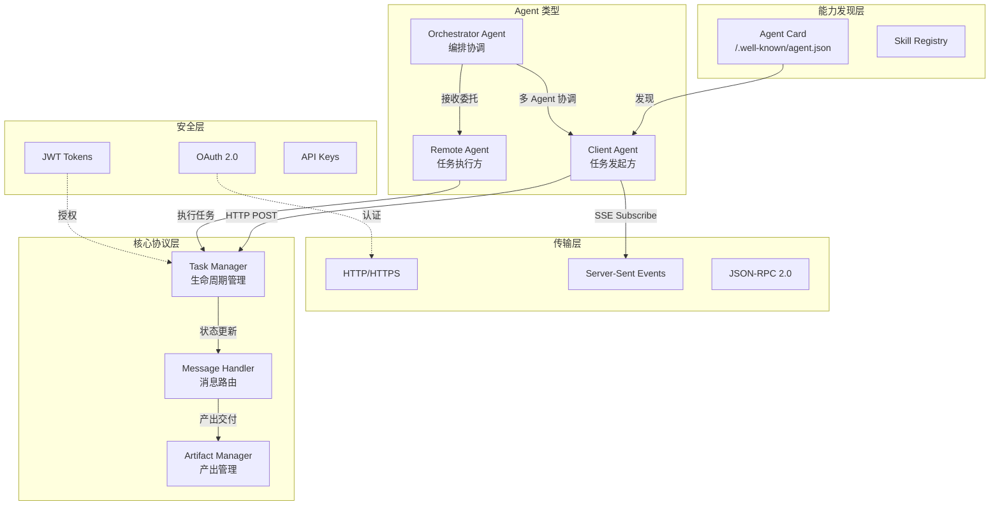
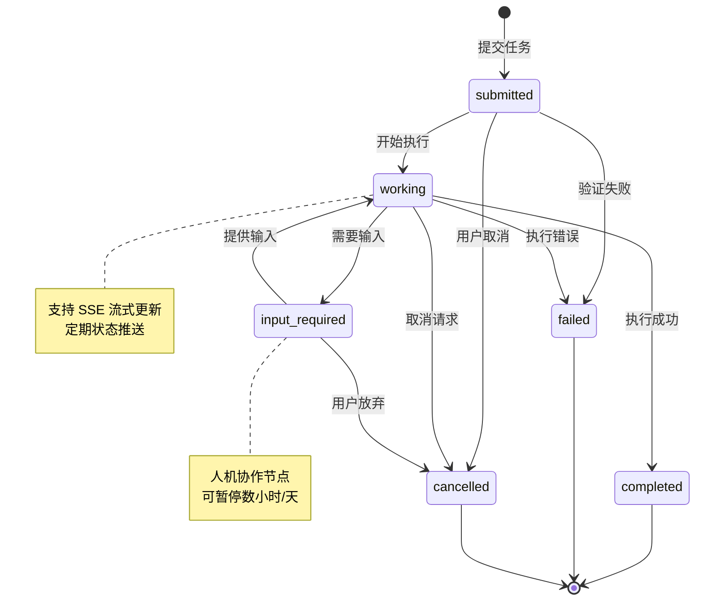
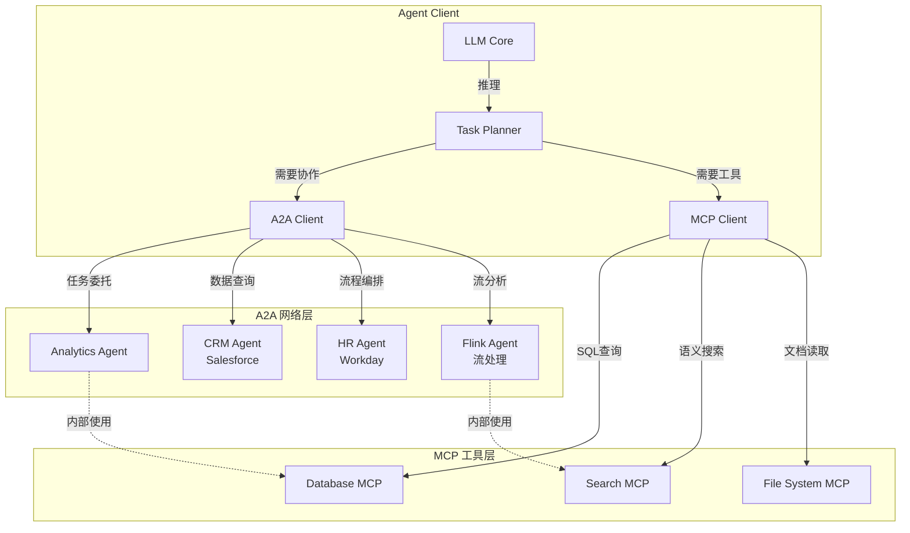
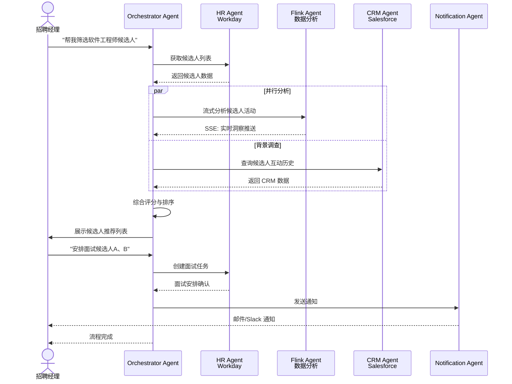
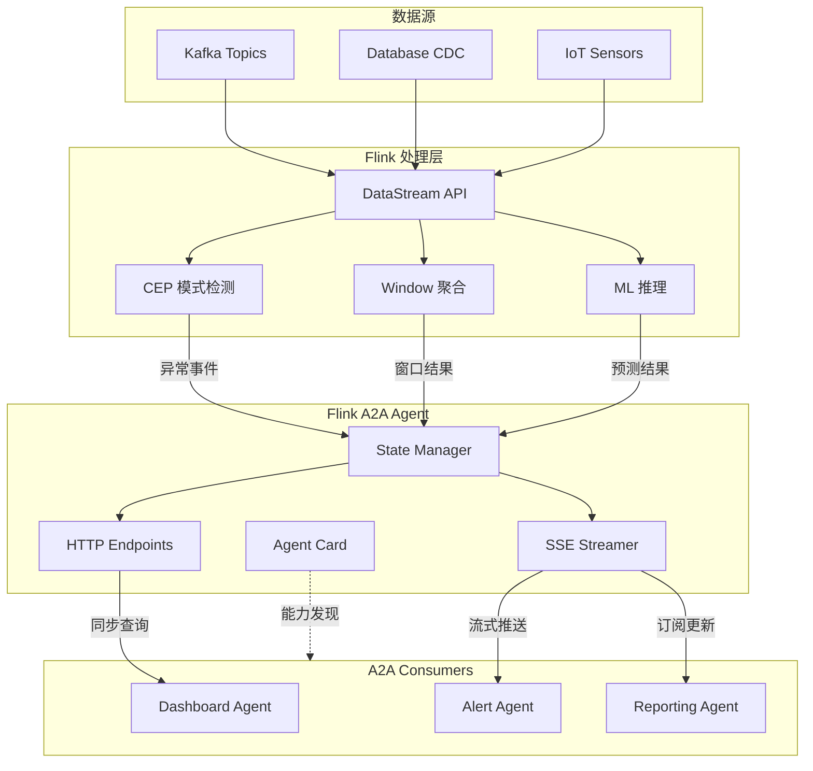
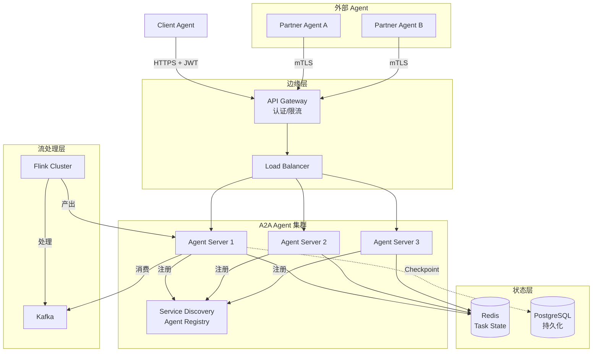

# Google A2A (Agent-to-Agent) 协议技术分析

> **状态**: ✅ 已发布 | **A2A v1.0**: 2026年初 GA | **最后更新**: 2026-04-15
>
> ✅ A2A v1.0 已于 2026 年初正式发布，获 150+ 组织支持，并集成至 Azure AI Foundry、Amazon Bedrock AgentCore。
> 所属阶段: Knowledge/06-frontier | 前置依赖: [MCP协议分析](mcp-protocol-agent-streaming.md) | 形式化等级: L3-L4

## 目录

- [Google A2A (Agent-to-Agent) 协议技术分析](#google-a2a-agent-to-agent-协议技术分析)
  - [目录](#目录)
  - [1. 概念定义 (Definitions)](#1-概念定义-definitions)
    - [Def-K-06-230: Agent-to-Agent Protocol (A2A)](#def-k-06-230-agent-to-agent-protocol-a2a)
    - [Def-K-06-231: Agent Card (能力卡片)](#def-k-06-231-agent-card-能力卡片)
    - [Def-K-06-232: Task 生命周期](#def-k-06-232-task-生命周期)
    - [Def-K-06-233: Message 与 Part](#def-k-06-233-message-与-part)
    - [Def-K-06-234: Artifact (任务产出)](#def-k-06-234-artifact-任务产出)
    - [Def-K-06-235: A2A 与流处理集成模型](#def-k-06-235-a2a-与流处理集成模型)
  - [2. 属性推导 (Properties)](#2-属性推导-properties)
    - [Lemma-K-06-220: A2A 协议延迟分解](#lemma-k-06-220-a2a-协议延迟分解)
    - [Prop-K-06-220: 任务状态一致性](#prop-k-06-220-任务状态一致性)
    - [Prop-K-06-221: 多模态传输容量边界](#prop-k-06-221-多模态传输容量边界)
    - [Lemma-K-06-221: Agent Card 缓存有效性](#lemma-k-06-221-agent-card-缓存有效性)
  - [3. 关系建立 (Relations)](#3-关系建立-relations)
    - [3.1 A2A vs MCP: 互补而非竞争](#31-a2a-vs-mcp-互补而非竞争)
    - [3.2 A2A + MCP 混合架构](#32-a2a-mcp-混合架构)
    - [3.3 A2A 与流处理（Flink）集成点](#33-a2a-与流处理flink集成点)
    - [3.4 A2A 发布背景与企业采用](#34-a2a-发布背景与企业采用)
      - [Def-K-06-236: A2A v1.0 核心增强](#def-k-06-236-a2a-v10-核心增强)
      - [Prop-K-06-222: A2A 企业采用增长命题](#prop-k-06-222-a2a-企业采用增长命题)
  - [4. 论证过程 (Argumentation)](#4-论证过程-argumentation)
    - [4.1 为什么需要 A2A 协议？](#41-为什么需要-a2a-协议)
    - [4.2 反模式：避免的设计陷阱](#42-反模式避免的设计陷阱)
    - [4.3 A2A + Flink 集成论证](#43-a2a-flink-集成论证)
  - [5. 形式证明 / 工程论证](#5-形式证明-工程论证)
    - [Thm-K-06-150: A2A 任务完成可靠性定理](#thm-k-06-150-a2a-任务完成可靠性定理)
    - [Thm-K-06-151: A2A-MCP 正交性定理](#thm-k-06-151-a2a-mcp-正交性定理)
    - [Thm-K-06-152: 流式 Artifact 完整性定理](#thm-k-06-152-流式-artifact-完整性定理)
  - [6. 实例验证 (Examples)](#6-实例验证-examples)
    - [6.1 Flink 作为 A2A Remote Agent](#61-flink-作为-a2a-remote-agent)
    - [6.2 A2A Client Agent 实现](#62-a2a-client-agent-实现)
    - [6.3 A2A + Flink CEP 异常检测场景](#63-a2a-flink-cep-异常检测场景)
  - [7. 可视化 (Visualizations)](#7-可视化-visualizations)
    - [7.1 A2A 协议架构全景图](#71-a2a-协议架构全景图)
    - [7.2 A2A Task 生命周期状态机](#72-a2a-task-生命周期状态机)
    - [7.3 A2A vs MCP 协作架构](#73-a2a-vs-mcp-协作架构)
    - [7.4 多 Agent 招聘流程示例](#74-多-agent-招聘流程示例)
    - [7.5 A2A + Flink 实时分析集成](#75-a2a-flink-实时分析集成)
    - [7.6 企业级 A2A 部署拓扑](#76-企业级-a2a-部署拓扑)
  - [8. 引用参考 (References)](#8-引用参考-references)

## 1. 概念定义 (Definitions)

### Def-K-06-230: Agent-to-Agent Protocol (A2A)

**A2A** 是由 Google 于 2025 年推出的开放协议标准，用于标准化 AI Agent 之间的通信与协作：

$$
\text{A2A} \triangleq \langle \mathcal{A}, \mathcal{T}, \mathcal{M}, \mathcal{C}, \mathcal{S} \rangle
$$

其中：

- $\mathcal{A}$: Agent 集合，包含 Client Agent 和 Remote Agent
- $\mathcal{T}$: Task 集合，具有生命周期的任务对象
- $\mathcal{M}$: Message 集合，Agent 间交换的消息
- $\mathcal{C}$: Capability，通过 Agent Card 声明的能力
- $\mathcal{S}$: Security，认证与授权机制

**关键特性**：

- 基于 HTTP/HTTPS 传输
- 使用 JSON-RPC 2.0 消息格式
- 支持 Server-Sent Events (SSE) 流式通信
- 企业级安全（OAuth 2.0、API Keys、JWT）
- 模态无关（支持文本、音频、视频流）

### Def-K-06-231: Agent Card (能力卡片)

**Agent Card** 是 Agent 能力的标准化声明，以 JSON 格式发布在 well-known URL（`/.well-known/agent.json`）：

```json
{
  "name": "DataAnalyticsAgent",
  "description": "实时数据分析与洞察生成 Agent",
  "url": "https://analytics.example.com/a2a",
  "provider": {
    "organization": "Example Corp",
    "url": "https://example.com"
  },
  "version": "1.0.0",
  "versionCompatibility": {
    "minA2AVersion": "1.0",
    "maxA2AVersion": "2.x",
    "deprecatedVersions": ["0.9-beta"]
  },
  "documentationUrl": "https://docs.example.com/a2a",
  "capabilities": {
    "streaming": true,
    "pushNotifications": true,
    "stateTransitionHistory": false
  },
  "sla": {
    "availability": "99.9%",
    "maxResponseTimeMs": 2000,
    "supportHours": "24/7"
  },
  "authentication": {
    "schemes": ["Bearer", "OAuth2"],
    "credentials": "https://auth.example.com/token"
  },
  "defaultInputModes": ["text/plain", "application/json"],
  "defaultOutputModes": ["text/plain", "text/markdown", "image/png"],
  "skills": [
    {
      "id": "stream_analytics",
      "name": "流数据分析",
      "description": "分析实时流数据并生成趋势报告",
      "tags": ["analytics", "streaming", "real-time"],
      "examples": [
        "分析过去1小时的销售趋势",
        "检测异常流量模式"
      ],
      "inputModes": ["application/json"],
      "outputModes": ["application/json", "text/markdown"]
    }
  ]
}
```

### Def-K-06-232: Task 生命周期

**Task** 是 A2A 协议的核心概念，表示 Agent 需要完成的工作单元，具有明确的生命周期状态：

```
┌─────────┐    ┌─────────┐    ┌─────────┐    ┌─────────┐
│ submitted │──▶│ working │──▶│ input_required │──▶│ completed │
└─────────┘    └────┬────┘    └──────────────┘    └─────────┘
                    │
                    ▼
              ┌─────────┐    ┌─────────┐
              │ cancelled │    │ failed  │
              └─────────┘    └─────────┘
```

状态定义：

| 状态 | 描述 |
|------|------|
| `submitted` | 任务已提交，等待处理 |
| `working` | Remote Agent 正在处理任务 |
| `input_required` | 需要用户/Client 提供额外输入 |
| `completed` | 任务完成，输出 Artifact 可用 |
| `cancelled` | 任务被取消 |
| `failed` | 任务执行失败 |

### Def-K-06-233: Message 与 Part

**Message** 是 Agent 间通信的基本单元，包含多个 **Part**：

```typescript
interface Message {
  role: "user" | "agent";
  parts: Part[];
  metadata?: Record<string, any>;
}

type Part =
  | { type: "text"; text: string }
  | { type: "file"; file: { name: string; mimeType: string; bytes?: string; uri?: string } }
  | { type: "data"; data: Record<string, any> }
  | { type: "form"; form: { fields: FormField[] } }
  | { type: "iframe"; iframe: { uri: string; height?: number } };
```

### Def-K-06-234: Artifact (任务产出)

**Artifact** 是 Task 完成的输出产物，支持多模态内容：

```typescript
interface Artifact {
  name?: string;
  description?: string;
  parts: Part[];
  index?: number;          // 用于多 Artifact 排序
  append?: boolean;        // 是否追加到已有 Artifact
  lastChunk?: boolean;     // 是否为最后一块流式数据
  metadata?: Record<string, any>;
}
```

### Def-K-06-235: A2A 与流处理集成模型

**A2A-Streaming Integration Model (ASIM)** 定义 Agent 与流处理系统的交互范式：

$$
\text{ASIM} \triangleq \langle \mathcal{F}, \mathcal{A}, \phi, \psi \rangle
$$

其中：

- $\mathcal{F}$: Flink 流处理系统
- $\mathcal{A}$: A2A Agent 网络
- $\phi: \mathcal{F} \rightarrow \mathcal{A}$: 流数据到 Agent 感知的映射
- $\psi: \mathcal{A} \rightarrow \mathcal{F}$: Agent 决策到流处理动作的映射

## 2. 属性推导 (Properties)

### Lemma-K-06-220: A2A 协议延迟分解

**引理**: A2A 调用的端到端延迟满足：

$$
L_{\text{A2A}} = L_{\text{discovery}} + L_{\text{negotiation}} + L_{\text{execution}} + L_{\text{streaming}}
$$

各分量说明：

| 分量 | 典型值 | 说明 |
|------|--------|------|
| $L_{\text{discovery}}$ | 50-200ms | Agent Card 获取与解析 |
| $L_{\text{negotiation}}$ | 10-50ms | 能力协商与匹配 |
| $L_{\text{execution}}$ | 变量 | 实际任务执行时间 |
| $L_{\text{streaming}}$ | 20-100ms | SSE 流式传输开销 |

### Prop-K-06-220: 任务状态一致性

**命题**: 在分布式 Agent 协作中，Task 状态满足最终一致性：

$$
\forall t \in \mathcal{T}: \diamond \square (\text{state}(t) \in \{\text{completed}, \text{failed}, \text{cancelled}\})
$$

**工程意义**:

- Client Agent 需实现幂等的任务提交
- Remote Agent 需保证状态持久化
- 使用 SSE 实现状态变更的实时推送

### Prop-K-06-221: 多模态传输容量边界

**命题**: A2A 协议的多模态数据传输满足：

$$
\text{Throughput} \leq \min(\text{Bandwidth}_{\text{network}}, \text{Processing}_{\text{agent}}, \text{Buffer}_{\text{sse}})
$$

**约束条件**:

- 单条 SSE 连接缓冲区通常 1-4MB
- 大文件应使用 URI 引用而非内联 bytes
- 视频流建议使用分块 Artifact (`append: true`)

### Lemma-K-06-221: Agent Card 缓存有效性

**引理**: Agent Card 的缓存策略应满足：

$$
\text{CacheTTL} \propto \frac{1}{\text{SkillUpdateFrequency}}
$$

**推荐配置**:

| 场景 | TTL | 刷新策略 |
|------|-----|----------|
| 静态能力 | 1小时 | 懒加载 |
| 动态服务 | 5分钟 | 主动刷新 |
| 关键任务 | 1分钟 | 预检 + 缓存 |

## 3. 关系建立 (Relations)

### 3.1 A2A vs MCP: 互补而非竞争

| 维度 | MCP (Model Context Protocol) | A2A (Agent-to-Agent Protocol) |
|------|------------------------------|-------------------------------|
| **通信层级** | Agent ↔ Tool/Context | Agent ↔ Agent |
| **核心抽象** | Resources, Tools, Prompts | Tasks, Messages, Artifacts |
| **关系模式** | 客户端-服务器 | 对等协作 |
| **能力发现** | 运行时协商 | Agent Card 预声明 |
| **状态管理** | 无状态（通常） | 有状态 Task 生命周期 |
| **交互时长** | 短期请求-响应 | 支持长时任务（小时/天） |
| **设计目标** | 工具集成标准化 | Agent 协作标准化 |

**协作架构**:

```
┌─────────────────────────────────────────────────────────────────┐
│                        AI Agent (Client)                        │
│  ┌──────────────┐  ┌──────────────┐  ┌──────────────────────┐  │
│  │  LLM Core    │  │ MCP Client   │  │ A2A Client           │  │
│  │              │  │ (Tools)      │  │ (Agent Collaboration)│  │
│  └──────────────┘  └──────┬───────┘  └──────────┬───────────┘  │
└───────────────────────────┼─────────────────────┼──────────────┘
                            │                     │
         ┌──────────────────┘                     └──────────────┐
         │                                                       │
┌────────▼──────────┐                              ┌─────────────▼──────┐
│   MCP Servers     │                              │   A2A Agents       │
│  ┌─────────────┐  │                              │  ┌─────────────┐   │
│  │ Data Source │  │                              │  │ Remote Agent│   │
│  │ File System │  │                              │  │  (Worker)   │   │
│  │   APIs      │  │                              │  └─────────────┘   │
│  └─────────────┘  │                              │  ┌─────────────┐   │
│                   │                              │  │ Remote Agent│   │
│  → 工具调用       │                              │  │ (Specialist)│   │
│  → 上下文获取     │                              │  └─────────────┘   │
│                   │                              │                   │
└───────────────────┘                              │  → 任务委托       │
                                                   │  → 协作决策       │
                                                   └───────────────────┘
```

### 3.2 A2A + MCP 混合架构

在复杂系统中，A2A 与 MCP 可协同工作：

```
┌─────────────────────────────────────────────────────────────────┐
│                     Orchestrator Agent                          │
│  ┌───────────────────────────────────────────────────────────┐ │
│  │  A2A Client ◄────────────────────────────────────┐        │ │
│  │       │                                           │        │ │
│  │       ▼                                           │        │ │
│  │  ┌─────────┐    ┌─────────┐    ┌─────────┐        │        │ │
│  │  │  MCP    │◄──►│  LLM    │◄──►│  A2A    ├────────┘        │ │
│  │  │ Client  │    │ Engine  │    │ Client  │                 │ │
│  │  └────┬────┘    └─────────┘    └─────────┘                 │ │
│  └───────┼─────────────────────────────────────────────────────┘ │
└──────────┼────────────────────────────────────────────────────────┘
           │
    ┌──────┴──────────────────────────────────────────┐
    │                                                   │
    ▼                                                   ▼
┌─────────────────────┐                     ┌─────────────────────┐
│  MCP Ecosystem      │                     │  A2A Ecosystem      │
│  ┌───────────────┐  │                     │  ┌───────────────┐  │
│  │ Database MCP  │  │                     │  │ Analytics     │  │
│  │ Server        │  │                     │  │ Agent         │  │
│  └───────────────┘  │                     │  └───────────────┘  │
│  ┌───────────────┐  │                     │  ┌───────────────┐  │
│  │ Search MCP    │  │                     │  │ CRM Agent     │  │
│  │ Server        │  │                     │  │ (Salesforce)  │  │
│  └───────────────┘  │                     │  └───────────────┘  │
│  ┌───────────────┐  │                     │  ┌───────────────┐  │
│  │ Flink MCP     │  │                     │  │ HR Agent      │  │
│  │ Server        │  │                     │  │ (Workday)     │  │
│  └───────────────┘  │                     │  └───────────────┘  │
└─────────────────────┘                     └─────────────────────┘

用途: 工具调用、数据获取、实时流处理    用途: 跨系统协作、业务编排
```

### 3.3 A2A 与流处理（Flink）集成点

| 集成场景 | A2A 角色 | Flink 角色 | 交互模式 |
|----------|----------|------------|----------|
| **实时洞察** | 消费 Agent | 流分析引擎 | Flink 作为 A2A Remote Agent |
| **智能决策** | 决策 Agent | 计算后端 | A2A Task 触发 Flink SQL |
| **异常响应** | 监控 Agent | CEP 引擎 | Flink 通过 SSE 推送警报 |
| **数据协商** | 数据 Agent | 处理管道 | 双向流式 Artifact 传输 |

### 3.4 A2A 发布背景与企业采用

Google 于 **2025-04** 发布 A2A（Agent-to-Agent）协议，旨在解决异构 AI Agent 之间的互操作性问题[^3]。**A2A v1.0** 于 **2026 年初** 正式发布，并于 **2026-04-09** 迎来一周年里程碑[^6]。目前 A2A 与 MCP 一同由 **Linux Foundation AAIF** 共治，成为企业级 Agent 协作的开放标准[^4]。截至 2026-04，已有 **150+ 组织** 支持 A2A 标准，涵盖 CRM、HR、数据分析与客服自动化等领域[^6]。

#### Def-K-06-236: A2A v1.0 核心增强

**A2A v1.0** 在初始发布基础上引入了四项关键企业级能力：

$$
\text{A2A}_{v1.0} \triangleq \text{A2A}_{base} + \langle \mathcal{S}_{signed}, \mathcal{M}_{tenant}, \mathcal{B}_{proto}, \mathcal{V}_{nego} \rangle
$$

其中：

| 增强项 | 符号 | 说明 |
|--------|------|------|
| **Signed Agent Cards** | $\mathcal{S}_{signed}$ | Agent Card 支持加密签名身份验证，防止能力声明篡改 |
| **多租户** | $\mathcal{M}_{tenant}$ | 原生支持多租户隔离与命名空间级别的资源边界 |
| **双协议绑定** | $\mathcal{B}_{proto}$ | 同时支持 gRPC 与 REST/JSON-RPC 两种传输绑定 |
| **版本协商** | $\mathcal{V}_{nego}$ | 向后兼容的协议版本协商机制，支持平滑迁移 |

**云平台集成**：A2A v1.0 已原生集成到 **Azure AI Foundry** 与 **Amazon Bedrock AgentCore**[^6]。

**企业采用特征**：

| 领域 | 典型场景 | 代表集成 |
|------|----------|----------|
| CRM | 销售线索自动跟进 | Salesforce Agent |
| HR | 候选人筛选与面试安排 | Workday Agent |
| 数据分析 | 实时报表与洞察推送 | Flink Analytics Agent |
| 客服 | 多 Agent 协同问题解决 | ServiceNow Agent |

#### Prop-K-06-222: A2A 企业采用增长命题

**命题**: A2A 的企业采用率随生态互操作性需求呈超线性增长：

$$
\text{Adoption}(t) \propto (\text{InteroperabilityDemand}(t))^{1 + \epsilon}, \quad \epsilon > 0
$$

**工程意义**:

- 多 Agent 系统（MAS）的复杂度随 Agent 数量 $N$ 以 $O(N^2)$ 增长，标准化协议可降低至 $O(N)$
- 企业 IT 部门倾向于采用基金会治理的开放标准以降低厂商锁定风险

## 4. 论证过程 (Argumentation)

### 4.1 为什么需要 A2A 协议？

**现有方案局限性**:

1. **单体 Agent 架构**
   - 问题：单 Agent 难以处理复杂跨域任务
   - 示例：招聘流程涉及 HR 系统、日程系统、邮件系统

2. **点对点集成**
   - 问题：$N$ 个 Agent 需要 $O(N^2)$ 个集成
   - 维护成本高，版本兼容性难保障

3. **MCP 的局限性**
   - 适合工具调用，不适合对等协作
   - 缺乏长时任务管理能力
   - 无原生状态机支持

**A2A 解决方案**:

- **标准化通信**：统一消息格式、状态管理、错误处理
- **能力发现**：Agent Card 实现服务网格式的自动发现
- **异步协作**：支持人类在环的长时任务
- **企业就绪**：内置认证、授权、审计

### 4.2 反模式：避免的设计陷阱

**反模式 1: 过度细粒度 Agent**

```python
# ❌ 错误:每个函数都是独立 Agent class CalculatorAgent:
    def add(self, a, b): return a + b

class SubtractAgent:
    def sub(self, a, b): return a - b

# 正确:相关功能聚合为一个 Agent class MathAgent:
    def calculate(self, expression: str) -> float:
        # 处理多种数学运算
        pass
```

**反模式 2: 同步阻塞调用**

```text
# ❌ 错误:阻塞等待长时任务 result = a2a_client.send_task_sync(
    agent_url,
    {"query": "深度市场分析"}  # 可能需要数小时
)

# 正确:使用异步 + 回调/SSE async for event in a2a_client.send_subscribe(agent_url, task):
    if event.type == "status_update":
        update_ui(event.status)
    elif event.type == "artifact":
        display_result(event.artifact)
```

**反模式 3: 忽视状态持久化**

```python
# ❌ 错误:内存中存储 Task 状态 task_states = {}  # 服务重启丢失

# 正确:使用持久化状态存储 class PersistentTaskStore:
    def save(self, task_id: str, state: TaskState):
        self.redis.setex(f"a2a:task:{task_id}", 86400, state.json())

    def load(self, task_id: str) -> TaskState:
        return TaskState.parse(self.redis.get(f"a2a:task:{task_id}"))
```

### 4.3 A2A + Flink 集成论证

**为什么 Flink 适合作为 A2A Remote Agent？**

1. **流式输出映射到 SSE**
   - Flink DataStream 可自然映射到 A2A 的 SSE 流
   - Window 结果可作为增量 Artifact 推送

2. **状态管理与 Task 生命周期对齐**
   - Flink Checkpoint 与 A2A Task 状态可协同
   - 支持恰好一次的任务执行保证

3. **复杂事件处理 (CEP) 赋能 Agent 感知**
   - 模式检测触发 Agent 协作
   - 实时异常驱动多 Agent 响应

## 5. 形式证明 / 工程论证

### Thm-K-06-150: A2A 任务完成可靠性定理

**定理**: 在正确的实现下，A2A 任务满足：

$$
\text{Started}(t) \land \neg \text{Cancelled}(t) \Rightarrow \diamond (\text{Completed}(t) \lor \text{Failed}(t))
$$

**证明概要**:

1. **状态机完备性**: A2A Task 状态机包含终止状态（completed/failed/cancelled）
2. **心跳机制**: Remote Agent 定期发送状态更新，Client 可检测超时
3. **持久化保证**: Task 状态持久化到可靠存储
4. **幂等重试**: Client 可在网络故障后安全重试

**工程实现要求**:

```python
class ReliableTaskManager:
    async def execute_with_guarantee(self, task: Task) -> TaskResult:
        # 1. 持久化任务状态
        await self.store.save(task.id, TaskState.SUBMITTED)

        # 2. 启动超时监控
        watchdog = asyncio.create_task(self._watchdog(task.id))

        try:
            # 3. 执行实际任务
            result = await self._execute(task)
            await self.store.save(task.id, TaskState.COMPLETED)
            return result
        except Exception as e:
            await self.store.save(task.id, TaskState.FAILED)
            raise
        finally:
            watchdog.cancel()
```

### Thm-K-06-151: A2A-MCP 正交性定理

**定理**: A2A 与 MCP 是正交的协议层，可同时使用而不冲突：

$$
\forall a \in \text{Agents}: \text{SupportsA2A}(a) \land \text{SupportsMCP}(a) \Rightarrow \text{Valid}(a)
$$

**工程论证**:

| 层级 | 协议 | 职责 | 互斥性 |
|------|------|------|--------|
| L1: 传输 | HTTP/SSE | 消息传输 | 共享 |
| L2: 通信 | A2A / MCP | 交互语义 | 正交 |
| L3: 能力 | Agent Card / Capabilities | 能力声明 | 互补 |
| L4: 应用 | Task / Tool | 业务逻辑 | 协同 |

### Thm-K-06-152: 流式 Artifact 完整性定理

**定理**: 使用 SSE 流式传输的 Artifact 分块满足完整性：

$$
\forall a \in \text{Artifacts}: \text{Streaming}(a) \Rightarrow \text{Ordered}(\text{Chunks}(a)) \land \text{Complete}(\text{Reassemble}(\text{Chunks}(a)))
$$

**依赖条件**:

- SSE 保证消息顺序
- 每个 Chunk 包含 `index` 和 `lastChunk` 标记
- 客户端实现排序缓冲和重组逻辑

## 6. 实例验证 (Examples)

### 6.1 Flink 作为 A2A Remote Agent

```python
# flink_a2a_agent.py from flask import Flask, request, jsonify, Response
import json
import asyncio
from pyflink.datastream import StreamExecutionEnvironment
from pyflink.table import StreamTableEnvironment

app = Flask(__name__)

# Agent Card endpoint @app.route("/.well-known/agent.json", methods=["GET"])
def agent_card():
    return jsonify({
        "name": "FlinkAnalyticsAgent",
        "description": "基于 Flink 的实时流数据分析 Agent",
        "url": "https://flink-agent.example.com/a2a",
        "version": "1.0.0",
        "capabilities": {
            "streaming": True,
            "pushNotifications": True
        },
        "skills": [
            {
                "id": "realtime_aggregation",
                "name": "实时聚合分析",
                "description": "对流数据进行窗口聚合分析",
                "inputModes": ["application/json"],
                "outputModes": ["text/event-stream"]
            },
            {
                "id": "anomaly_detection",
                "name": "异常检测",
                "description": "使用 ML 模型检测流数据异常",
                "inputModes": ["application/json"],
                "outputModes": ["application/json"]
            }
        ]
    })

# Task 提交端点 @app.route("/a2a/tasks/send", methods=["POST"])
def send_task():
    """同步任务提交"""
    data = request.json
    task_id = data["id"]
    skill = data["message"]["parts"][0]["data"]["skill"]
    params = data["message"]["parts"][0]["data"]["params"]

    if skill == "realtime_aggregation":
        result = execute_flink_aggregation(params)
        return jsonify({
            "id": task_id,
            "status": "completed",
            "artifacts": [{
                "parts": [{"type": "data", "data": result}]
            }]
        })

    return jsonify({"id": task_id, "status": "failed"}), 400

# 流式任务订阅端点 @app.route("/a2a/tasks/sendSubscribe", methods=["POST"])
def send_subscribe():
    """流式任务提交(SSE)"""
    data = request.json
    task_id = data["id"]

    def generate():
        # 发送任务状态更新
        yield f"data: {json.dumps({'type': 'status', 'status': 'working'})}\n\n"

        # 执行 Flink 流查询
        env = StreamExecutionEnvironment.get_execution_environment()
        table_env = StreamTableEnvironment.create(env)

        # 模拟实时数据推送
        for i, window_result in enumerate(stream_flink_results(table_env)):
            artifact = {
                "type": "artifact",
                "artifact": {
                    "name": f"window_{i}",
                    "parts": [{"type": "data", "data": window_result}],
                    "index": i,
                    "lastChunk": False
                }
            }
            yield f"data: {json.dumps(artifact)}\n\n"

        # 发送完成标记
        yield f"data: {json.dumps({'type': 'status', 'status': 'completed'})}\n\n"

    return Response(generate(), mimetype='text/event-stream')

def execute_flink_aggregation(params):
    """执行 Flink 聚合查询"""
    table_env = StreamTableEnvironment.create(
        StreamExecutionEnvironment.get_execution_environment()
    )

    sql = f"""
    SELECT
        TUMBLE_START(event_time, INTERVAL '{params['window']}' MINUTE) as window_start,
        {params['aggregation']}(value) as result
    FROM {params['table']}
    WHERE event_time > NOW() - INTERVAL '{params['range']}'
    GROUP BY TUMBLE(event_time, INTERVAL '{params['window']}' MINUTE)
    """

    result = table_env.execute_sql(sql).fetch_all()
    return {"windows": result}

def stream_flink_results(table_env):
    """流式获取 Flink 结果"""
    # 实际实现中连接到 Kafka/Pulsar 源
    # 这里模拟窗口结果
    for i in range(10):
        yield {
            "window_id": i,
            "timestamp": "2025-04-03T10:00:00Z",
            "metrics": {"count": 100 + i * 10, "avg": 50.5}
        }
        asyncio.sleep(1)

if __name__ == "__main__":
    app.run(host="0.0.0.0", port=8080)
```

### 6.2 A2A Client Agent 实现

```python
# a2a_client_agent.py import httpx
import json
from typing import AsyncIterator, Dict, Any

class A2AClient:
    """A2A Client Agent 实现"""

    def __init__(self, http_client: httpx.AsyncClient = None):
        self.http = http_client or httpx.AsyncClient()
        self.agent_cache: Dict[str, dict] = {}

    async def discover_agent(self, agent_url: str) -> dict:
        """发现并缓存 Agent Card"""
        if agent_url not in self.agent_cache:
            response = await self.http.get(f"{agent_url}/.well-known/agent.json")
            self.agent_cache[agent_url] = response.json()
        return self.agent_cache[agent_url]

    async def send_task(
        self,
        agent_url: str,
        message: dict,
        task_id: str = None
    ) -> dict:
        """同步发送任务"""
        task = {
            "id": task_id or generate_uuid(),
            "message": message,
            "metadata": {"timestamp": now_iso()}
        }

        response = await self.http.post(
            f"{agent_url}/a2a/tasks/send",
            json=task
        )
        return response.json()

    async def send_subscribe(
        self,
        agent_url: str,
        message: dict,
        task_id: str = None
    ) -> AsyncIterator[dict]:
        """流式订阅任务结果(SSE)"""
        task = {
            "id": task_id or generate_uuid(),
            "message": message
        }

        async with self.http.stream(
            "POST",
            f"{agent_url}/a2a/tasks/sendSubscribe",
            json=task
        ) as response:
            async for line in response.aiter_lines():
                if line.startswith("data: "):
                    yield json.loads(line[6:])

class AnalyticsOrchestratorAgent:
    """分析编排 Agent:使用 A2A 协调多个 Specialist Agent"""

    def __init__(self):
        self.a2a = A2AClient()
        self.specialists = {
            "streaming": "https://flink-agent.example.com",
            "crm": "https://salesforce-agent.example.com",
            "hr": "https://workday-agent.example.com"
        }

    async def analyze_hiring_pipeline(self, job_id: str):
        """跨系统招聘分析工作流"""

        # 1. 从 HR 系统获取候选人列表
        hr_task = await self.a2a.send_task(
            self.specialists["hr"],
            {
                "role": "user",
                "parts": [{
                    "type": "data",
                    "data": {
                        "action": "get_candidates",
                        "job_id": job_id
                    }
                }]
            }
        )
        candidates = hr_task["artifacts"][0]["parts"][0]["data"]

        # 2. 流式分析候选人活动数据
        insights = []
        async for event in self.a2a.send_subscribe(
            self.specialists["streaming"],
            {
                "role": "user",
                "parts": [{
                    "type": "data",
                    "data": {
                        "skill": "candidate_activity_analysis",
                        "params": {
                            "candidate_ids": [c["id"] for c in candidates],
                            "metrics": ["interview_score", "response_time"]
                        }
                    }
                }]
            }
        ):
            if event.get("type") == "artifact":
                insights.append(event["artifact"])
                print(f"收到分析结果: {event['artifact']['name']}")
            elif event.get("type") == "status":
                print(f"任务状态: {event['status']}")

        # 3. 综合生成报告
        return self.generate_report(candidates, insights)

    def generate_report(self, candidates, insights):
        # 生成综合分析报告
        return {
            "candidate_count": len(candidates),
            "insights": insights,
            "recommendations": self._rank_candidates(candidates, insights)
        }

# 辅助函数 def generate_uuid() -> str:
    import uuid
    return str(uuid.uuid4())

def now_iso() -> str:
    from datetime import datetime
    return datetime.utcnow().isoformat()
```

### 6.3 A2A + Flink CEP 异常检测场景

```python
# a2a_flink_cep_example.py from pyflink.datastream import StreamExecutionEnvironment
from pyflink.table import StreamTableEnvironment
from pyflink.cep import Pattern, PatternSelectFunction

class A2AAlertAgent:
    """A2A 告警 Agent:接收 Flink CEP 检测到的异常并触发多 Agent 响应"""

    def __init__(self, a2a_client: A2AClient):
        self.a2a = a2a_client
        self.response_agents = {
            "incident": "https://pagerduty-agent.example.com",
            "autoheal": "https://remediation-agent.example.com",
            "notification": "https://slack-agent.example.com"
        }

    async def on_anomaly_detected(self, anomaly_event: dict):
        """Flink CEP 检测到异常时调用"""

        severity = anomaly_event["severity"]

        # 并行通知多个响应 Agent
        responses = await asyncio.gather(
            self._notify_incident_management(anomaly_event),
            self._send_notifications(anomaly_event),
            self._trigger_autohealing(anomaly_event) if severity == "critical" else asyncio.sleep(0)
        )

        return responses

    async def _notify_incident_management(self, event: dict):
        return await self.a2a.send_task(
            self.response_agents["incident"],
            {
                "role": "user",
                "parts": [{
                    "type": "data",
                    "data": {
                        "incident_type": "anomaly_detected",
                        "details": event,
                        "priority": event["severity"]
                    }
                }]
            }
        )

    async def _send_notifications(self, event: dict):
        return await self.a2a.send_task(
            self.response_agents["notification"],
            {
                "role": "user",
                "parts": [{
                    "type": "data",
                    "data": {
                        "channel": "#alerts",
                        "message": f"🚨 检测到异常: {event['description']}"
                    }
                }]
            }
        )

# Flink CEP 作业:检测异常模式 def create_flink_cep_job():
    env = StreamExecutionEnvironment.get_execution_environment()
    table_env = StreamTableEnvironment.create(env)

    # 定义异常模式:连续3次错误 + 响应时间 > 5s
    pattern = Pattern.begin("error") \
        .where(lambda evt: evt["status"] == "error") \
        .next("slow") \
        .where(lambda evt: evt["response_time"] > 5000) \
        .times_or_more(3) \
        .within(Time.seconds(60))

    # 应用模式到数据流
    pattern_stream = CEP.pattern(event_stream, pattern) \
        .process(PatternSelectFunction())

    # 将检测结果发送到 A2A Agent
    pattern_stream.add_sink(A2AAlertSink("https://alert-agent.example.com"))

    env.execute("A2A Anomaly Detection")
```

## 7. 可视化 (Visualizations)

### 7.1 A2A 协议架构全景图



### 7.2 A2A Task 生命周期状态机



### 7.3 A2A vs MCP 协作架构



### 7.4 多 Agent 招聘流程示例



### 7.5 A2A + Flink 实时分析集成



### 7.6 企业级 A2A 部署拓扑



## 8. 引用参考 (References)

[^3]: Google, "Agent-to-Agent Protocol (A2A)", 2025-04. <https://google.github.io/A2A/>
[^4]: Linux Foundation AAIF, "Joint Governance Announcement: MCP & A2A", 2026-01. <https://lf-ai-foundation.org/>
[^6]: Linux Foundation, "A2A Protocol Surpasses 150 Organizations, Lands in Major Cloud Platforms", 2026-04-09. <https://www.linuxfoundation.org/press/a2a-protocol-surpasses-150-organizations-lands-in-major-cloud-platforms-and-sees-enterprise-production-use-in-first-year>
