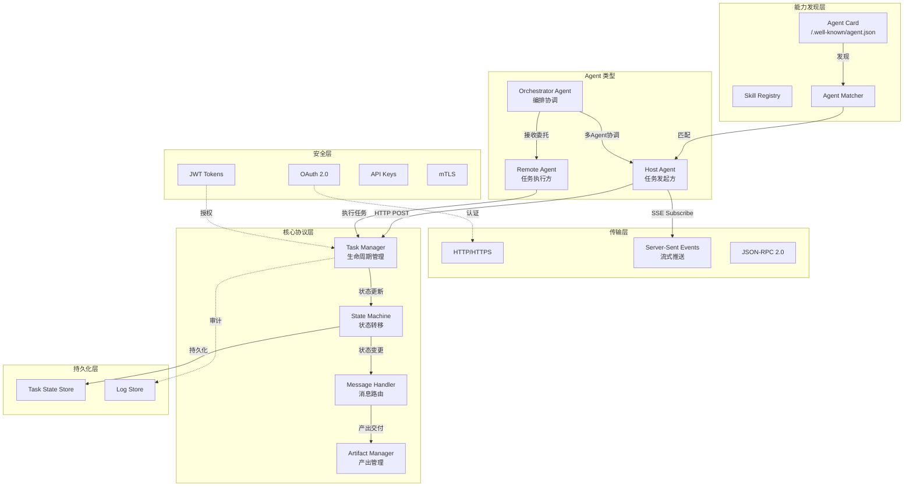
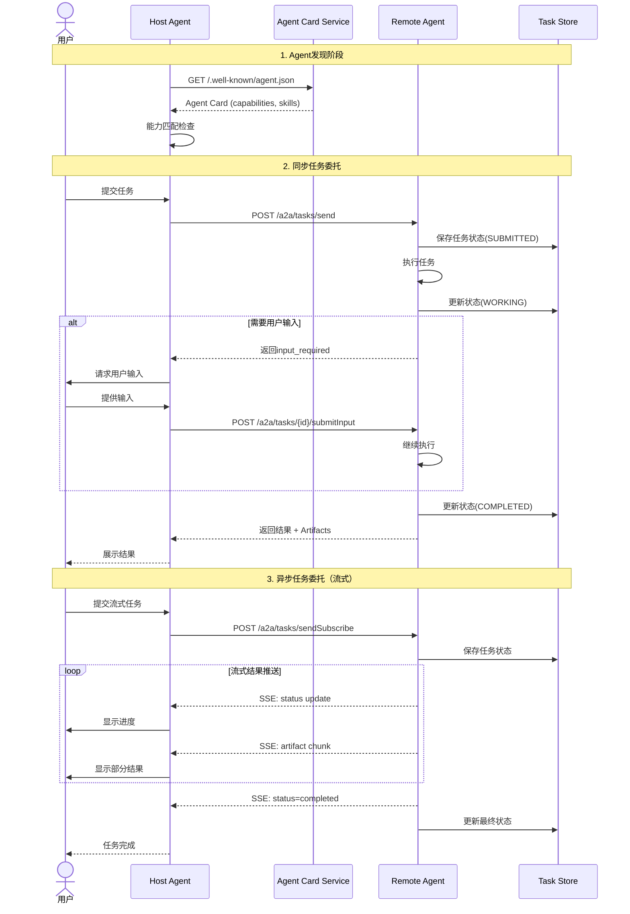
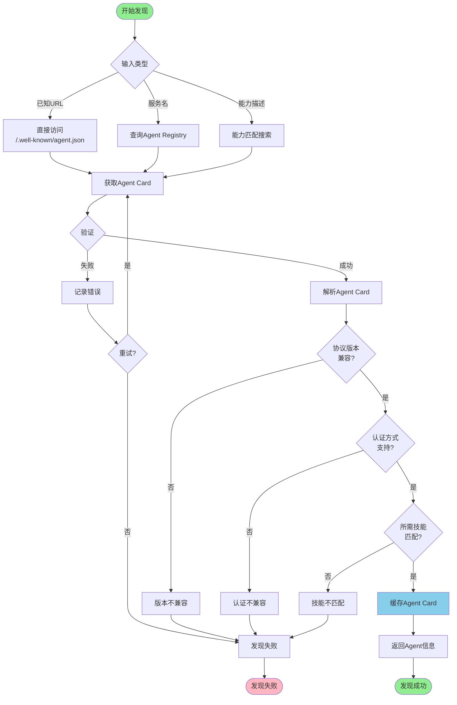
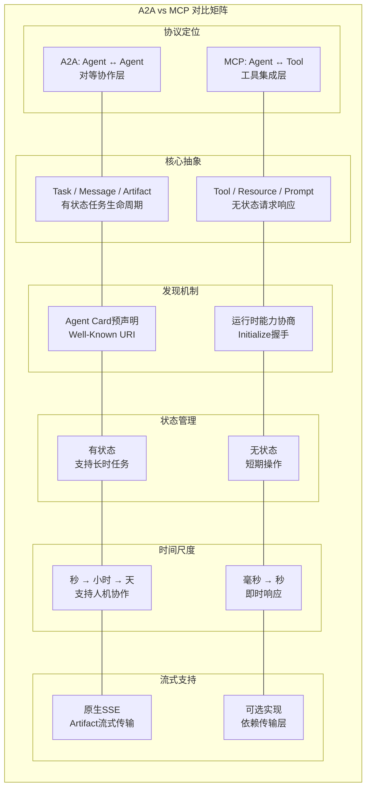
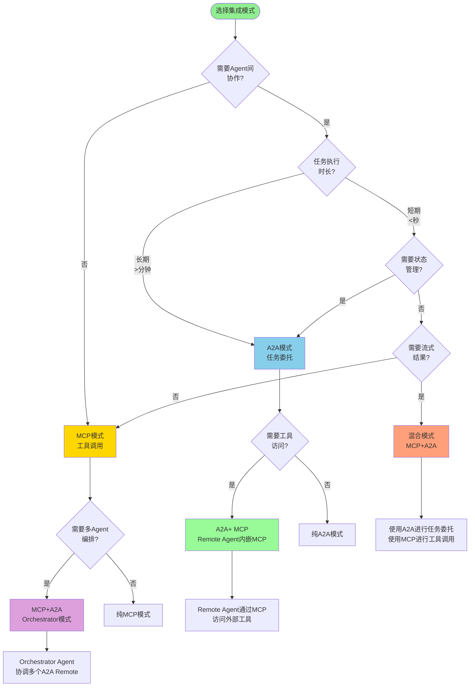

# Google A2A 协议形式化分析

> 所属阶段: Knowledge/06-frontier | 前置依赖: [MCP协议形式化规范](mcp-protocol-formal-specification.md), [A2A协议技术分析](a2a-protocol-agent-communication.md) | 形式化等级: L4-L5

**文档版本**: v1.0 | **协议版本**: A2A 2025-04 | **最后更新**: 2026-04-12

---

## 目录

- [Google A2A 协议形式化分析](#google-a2a-协议形式化分析)
  - [目录](#目录)
  - [摘要](#摘要)
  - [1. 概念定义 (Definitions)](#1-概念定义-definitions)
    - [Def-K-A2A-01: A2A协议架构定义](#def-k-a2a-01-a2a协议架构定义)
    - [Def-K-A2A-02: Agent发现机制形式化](#def-k-a2a-02-agent发现机制形式化)
    - [Def-K-A2A-03: 任务委托与协作协议](#def-k-a2a-03-任务委托与协作协议)
    - [Def-K-A2A-04: 安全与认证模型](#def-k-a2a-04-安全与认证模型)
  - [2. 属性推导 (Properties)](#2-属性推导-properties)
    - [Prop-K-A2A-01: Agent发现完备性](#prop-k-a2a-01-agent发现完备性)
    - [Prop-K-A2A-02: 任务委托原子性](#prop-k-a2a-02-任务委托原子性)
    - [Prop-K-A2A-03: 多Agent协作一致性](#prop-k-a2a-03-多agent协作一致性)
    - [Lemma-K-A2A-01: 能力匹配引理](#lemma-k-a2a-01-能力匹配引理)
  - [3. 关系建立 (Relations)](#3-关系建立-relations)
    - [A2A vs MCP对比](#a2a-vs-mcp对比)
    - [A2A vs 传统RPC对比](#a2a-vs-传统rpc对比)
    - [A2A与流计算集成模式](#a2a与流计算集成模式)
  - [4. 论证过程 (Argumentation)](#4-论证过程-argumentation)
    - [协议设计选择论证](#协议设计选择论证)
      - [选择1: JSON-RPC 2.0 vs gRPC](#选择1-json-rpc-20-vs-grpc)
      - [选择2: SSE vs WebSocket](#选择2-sse-vs-websocket)
      - [选择3: 有状态Task vs 无状态请求](#选择3-有状态task-vs-无状态请求)
    - [边界条件分析](#边界条件分析)
      - [大规模Agent发现](#大规模agent发现)
      - [Task状态爆炸](#task状态爆炸)
      - [安全边界突破](#安全边界突破)
  - [5. 形式证明 / 工程论证](#5-形式证明--工程论证)
    - [Thm-K-A2A-01: 任务委托正确性定理](#thm-k-a2a-01-任务委托正确性定理)
    - [Thm-K-A2A-02: Agent协作安全性保证](#thm-k-a2a-02-agent协作安全性保证)
  - [6. 实例验证 (Examples)](#6-实例验证-examples)
    - [A2A主机Agent实现](#a2a主机agent实现)
    - [A2A远程Agent实现](#a2a远程agent实现)
    - [多Agent协作工作流](#多agent协作工作流)
  - [7. 可视化 (Visualizations)](#7-可视化-visualizations)
    - [A2A架构图](#a2a架构图)
    - [任务委托时序图](#任务委托时序图)
    - [Agent发现流程图](#agent发现流程图)
    - [A2A vs MCP对比矩阵](#a2a-vs-mcp对比矩阵)
    - [集成模式决策树](#集成模式决策树)
  - [8. 引用参考 (References)](#8-引用参考-references)

---

## 摘要

本文档提供 Google Agent-to-Agent (A2A) 协议的完整形式化分析，建立从协议架构到安全模型的严格理论基础。
A2A协议定义了AI Agent之间的标准化通信机制，支持能力发现、任务委托、异步协作和企业级安全。

通过形式化定义和严格推导，本文档建立了A2A协议的核心性质：Agent发现完备性、任务委托原子性、多Agent协作一致性，并证明了任务委托正确性定理和Agent协作安全性保证。
这些理论结果为A2A协议的正确实现和安全部署提供了基础。

**关键词**: A2A, Agent通信, 任务委托, 能力发现, 多Agent协作, 形式化验证

---

## 1. 概念定义 (Definitions)

### Def-K-A2A-01: A2A协议架构定义

**定义（A2A协议架构）**: A2A协议架构是一个六元组

$$
\text{A2A} \triangleq \langle \mathcal{H}, \mathcal{R}, \mathcal{T}, \mathcal{M}, \mathcal{C}, \mathcal{S} \rangle
$$

其中各组件定义如下：

| 组件 | 符号 | 定义域 | 语义说明 |
|------|------|--------|----------|
| Host Agent | $\mathcal{H}$ | 主机Agent集合 | 发起任务委托的Client Agent |
| Remote Agent | $\mathcal{R}$ | 远程Agent集合 | 执行任务的Remote Agent |
| Task | $\mathcal{T}$ | 任务集合 | 具有生命周期的任务对象 |
| Message | $\mathcal{M}$ | 消息集合 | Agent间交换的结构化消息 |
| Capability | $\mathcal{C}$ | 能力集合 | 通过Agent Card声明的能力 |
| Security | $\mathcal{S}$ | 安全模型 | 认证、授权、审计机制 |

**主机-远程Agent模型**:

A2A采用非对称的主机-远程模型，但支持角色的动态转换：

$$
\forall h \in \mathcal{H}, \exists R_h \subseteq \mathcal{R}: h \xrightarrow{\text{delegate}} R_h
$$

其中 $R_h$ 是主机 $h$ 可以委托任务的远程Agent集合，满足：

$$
R_h = \{ r \in \mathcal{R} \mid \text{Compatible}(h, r) \land \text{Authorized}(h, r) \}
$$

**协议分层架构**:

$$
\text{A2A协议栈} = \underbrace{\text{Transport Layer}}_{\text{HTTP/HTTPS}} \circ \underbrace{\text{Message Format}}_{\text{JSON-RPC 2.0}} \circ \underbrace{\text{A2A Primitives}}_{\text{Task/Message/Artifact}} \circ \underbrace{\text{Discovery Layer}}_{\text{Agent Card}} \circ \underbrace{\text{Security Layer}}_{\text{OAuth 2.0/JWT}}
$$

**通信模式**:

1. **同步模式**: $h \xrightarrow{\text{tasks/send}} r \xrightarrow{\text{response}} h$
2. **异步模式**: $h \xrightarrow{\text{tasks/sendSubscribe}} r \xrightarrow{\text{SSE}} h$
3. **推送模式**: $r \xrightarrow{\text{push notification}} h$ (需预先授权)

### Def-K-A2A-02: Agent发现机制形式化

**定义（Agent Card）**: Agent Card是Agent能力的标准化声明，是一个七元组

$$
\text{AgentCard} \triangleq (\text{id}, \text{name}, \text{url}, \text{version}, \text{capabilities}, \text{skills}, \text{auth})
$$

其中：

- $\text{id} \in \text{UUID}$: Agent唯一标识符
- $\text{name} \in \Sigma^*$: 人类可读的Agent名称
- $\text{url} \in \text{URL}$: Agent服务端点地址
- $\text{version} \in \text{SemVer}$: 协议版本
- $\text{capabilities} \in \mathcal{P}(\{\text{streaming}, \text{pushNotifications}, \text{stateTransitionHistory}\})$
- $\text{skills} \in \mathcal{P}(\text{Skill})$: Agent提供的技能集合
- $\text{auth} \in \text{AuthScheme}$: 认证方案

**定义（Skill）**: Skill是Agent能力的原子单元

$$
\text{Skill} \triangleq (\text{skillId}, \text{name}, \text{description}, \text{tags}, \text{inputModes}, \text{outputModes}, \text{examples})
$$

**发现协议**:

Agent发现遵循Well-Known URI标准[^1]：

$$
\frac{h \in \mathcal{H} \text{ knows } \text{baseUrl}(r) \quad r \in \mathcal{R}}{h \xrightarrow{\text{GET /.well-known/agent.json}} r \xrightarrow{\text{AgentCard}_r} h}
\quad (\text{Agent-Discovery})
$$

**能力匹配函数**:

$$
\text{Match}: \mathcal{H} \times \mathcal{R} \times \text{Task} \rightarrow [0, 1]
$$

其中：

$$
\text{Match}(h, r, t) = \alpha \cdot \text{SkillMatch}(r, t) + \beta \cdot \text{AuthMatch}(h, r) + \gamma \cdot \text{QoSMatch}(r)
$$

且 $\alpha + \beta + \gamma = 1$，各分量为：

- $\text{SkillMatch}(r, t) = \frac{|\text{skills}(r) \cap \text{required}(t)|}{|\text{required}(t)|}$
- $\text{AuthMatch}(h, r) = \mathbb{1}_{[\text{Authorized}(h, r)]}$
- $\text{QoSMatch}(r) = f(\text{latency}, \text{availability}, \text{throughput})$

### Def-K-A2A-03: 任务委托与协作协议

**定义（Task）**: Task是A2A协议的核心工作单元，是一个八元组

$$
\text{Task} \triangleq (\text{taskId}, \text{sessionId}, \text{state}, \text{message}, \text{artifacts}, \text{history}, \text{metadata}, \text{timeout})
$$

**Task状态机**:

$$
\mathcal{S}_{\text{task}} = \{ \text{submitted}, \text{working}, \text{input\_required}, \text{completed}, \text{cancelled}, \text{failed} \}
$$

状态转移函数：

$$
\delta_{\text{task}}: \mathcal{S}_{\text{task}} \times \mathcal{E} \rightarrow \mathcal{S}_{\text{task}}
$$

其中 $\mathcal{E}$ 是事件集合：

| 当前状态 | 事件 | 下一状态 |
|----------|------|----------|
| submitted | start | working |
| submitted | cancel | cancelled |
| submitted | reject | failed |
| working | need_input | input_required |
| working | complete | completed |
| working | error | failed |
| working | cancel | cancelled |
| input_required | provide_input | working |
| input_required | abandon | cancelled |

**定义（Message）**: Message是Agent间通信的基本单元

$$
\text{Message} \triangleq (\text{role}, \text{parts}, \text{metadata})
$$

其中 $\text{role} \in \{\text{user}, \text{agent}\}$，$\text{parts}$ 是Part的序列。

**定义（Part）**: Part是Message的内容片段

$$
\text{Part} ::= \text{Text}(text) \mid \text{File}(name, mimeType, content) \mid \text{Data}(schema, value) \mid \text{Form}(fields)
$$

**任务委托协议**:

同步委托：

$$
\frac{h \in \mathcal{H} \quad r \in R_h \quad t \in \mathcal{T} \quad \text{Match}(h, r, t) > \theta}{h \xrightarrow{\text{tasks/send}(t)} r \xrightarrow{(t', \text{artifacts})} h}
\quad (\text{Sync-Delegation})
$$

异步委托：

$$
\frac{h \in \mathcal{H} \quad r \in R_h \quad t \in \mathcal{T} \quad \text{streaming} \in \text{capabilities}(r)}{h \xrightarrow{\text{tasks/sendSubscribe}(t)} r \xrightarrow{\text{SSE}[(\text{status}, \text{artifact})^*]} h}
\quad (\text{Async-Delegation})
$$

**多Agent协作协议**:

对于复杂任务，支持层级委托：

$$
\text{Delegate}^*(h, t) = \begin{cases}
\text{Execute}(h, t) & \text{if } \text{Local}(h, t) \\
\text{Delegate}(h, r, \text{Decompose}(t)) & \text{otherwise}
\end{cases}
$$

### Def-K-A2A-04: 安全与认证模型

**定义（安全模型）**: A2A安全模型是一个五元组

$$
\mathcal{S} \triangleq (\mathcal{I}, \mathcal{A}_{\text{authn}}, \mathcal{A}_{\text{authz}}, \mathcal{E}, \mathcal{L})
$$

其中：

| 组件 | 含义 |
|------|------|
| $\mathcal{I}$ | 身份空间（Agent标识） |
| $\mathcal{A}_{\text{authn}}$ | 认证机制 |
| $\mathcal{A}_{\text{authz}}$ | 授权策略 |
| $\mathcal{E}$ | 加密方案 |
| $\mathcal{L}$ | 审计日志 |

**身份模型**:

$$
\text{Identity}(a) = (\text{agentId}, \text{organization}, \text{namespace}, \text{credentials})
$$

**认证机制**:

$$
\mathcal{A}_{\text{authn}} = \{ \text{OAuth2}, \text{OpenID Connect}, \text{JWT}, \text{API Key}, \text{mTLS} \}
$$

认证函数：

$$
\text{Authenticate}: \text{Credentials} \times \text{Challenge} \rightarrow \{0, 1\}
$$

**授权策略**:

基于能力的访问控制：

$$
\text{Authorize}(h, r, \text{op}) = \text{CheckPolicy}(\text{policy}(r), h, \text{op})
$$

策略评估：

$$
\text{CheckPolicy}(\pi, h, \text{op}) = \bigwedge_{c \in \pi.\text{constraints}} \text{Evaluate}(c, h, \text{op})
$$

**安全属性**：

1. **身份认证**: $\forall h, r: \text{Communicate}(h, r) \Rightarrow \text{Authenticate}(h) \land \text{Authenticate}(r)$
2. **授权检查**: $\forall \text{op}: \text{Execute}(\text{op}) \Rightarrow \text{Authorize}(\text{requester}, \text{target}, \text{op})$
3. **通信保密**: $\text{Encrypt}(m) \Rightarrow \neg \text{Read}(\text{eavesdropper}, m)$
4. **不可否认性**: $\text{Send}(a, m) \Rightarrow \text{Prove}(\text{sender}(m) = a)$

---

## 2. 属性推导 (Properties)

### Prop-K-A2A-01: Agent发现完备性

**命题（Agent发现完备性）**: 在可访问的网络环境中，主机Agent能够发现并验证所有满足能力要求的远程Agent：

$$
\forall h \in \mathcal{H}, \forall t \in \mathcal{T}: \exists R_t \subseteq \mathcal{R}: \text{Discoverable}(h, R_t) \land \forall r \in R_t: \text{Match}(h, r, t) \geq \theta_{\min}
$$

其中 $\text{Discoverable}(h, R_t)$ 表示主机 $h$ 能够通过网络发现集合 $R_t$ 中的所有Agent。

**证明概要**:

1. **发现机制完备性**: Agent Card通过Well-Known URI发布，遵循RFC 8615[^1]
2. **网络可达性假设**: 在可访问网络中，HTTP请求能够到达目标端点
3. **能力匹配完备性**: 匹配函数 $\text{Match}$ 覆盖了技能、认证、QoS三个维度
4. **缓存策略**: 发现结果可缓存，支持增量更新

**工程推论**:

| 场景 | 完备性保证 | 注意事项 |
|------|-----------|----------|
| 静态Agent | 100% | Agent Card不变 |
| 动态Agent | 最终一致 | 依赖缓存TTL |
| 跨网络Agent | 受限 | 防火墙/NAT限制 |

### Prop-K-A2A-02: 任务委托原子性

**命题（任务委托原子性）**: 单个任务的委托操作具有原子性语义——要么完全成功并进入终止状态，要么完全失败并返回错误，不存在部分完成的状态：

$$
\forall t \in \mathcal{T}: \text{Delegate}(h, r, t) \Rightarrow \diamond (\text{state}(t) = \text{completed} \lor \text{state}(t) = \text{failed} \lor \text{state}(t) = \text{cancelled})
$$

形式化描述：

设任务委托操作为 $\Delta_{\text{delegate}}: \text{State} \rightarrow \text{State}$，则：

$$
\forall s \in \text{State}: \Delta_{\text{delegate}}(s) = s' \lor \Delta_{\text{delegate}}(s) = \bot
$$

其中 $s'$ 是新的确定状态，$\bot$ 表示错误状态。

**证明概要**:

1. **状态机完备性**: Task状态机包含明确的终止状态（completed/failed/cancelled）
2. **事务边界**: 每个任务有唯一的taskId，操作边界清晰
3. **幂等性**: 重复委托相同taskId产生相同效果
4. **超时机制**: 任务超时自动转移到failed状态

**边界条件**:

| 条件 | 处理方式 |
|------|----------|
| 网络超时 | 客户端重试，服务端去重 |
| 服务器崩溃 | 持久化状态恢复 |
| 客户端断开 | 任务继续执行，支持查询 |

### Prop-K-A2A-03: 多Agent协作一致性

**命题（多Agent协作一致性）**: 在多Agent协作场景中，任务状态满足最终一致性：

$$
\forall t \in \mathcal{T}: \square \diamond (\forall a_i, a_j \in \text{Participants}(t): \text{state}_{a_i}(t) = \text{state}_{a_j}(t))
$$

**一致性模型**:

A2A采用松散的最终一致性模型，基于以下机制：

1. **状态广播**: Remote Agent通过SSE推送状态变更
2. **状态查询**: Client Agent可以主动查询任务状态
3. **版本向量**: 任务状态包含版本信息，支持冲突检测

**一致性级别**:

| 级别 | 保证 | 适用场景 |
|------|------|----------|
| 强一致 | 状态变更立即同步 | 关键任务协调 |
| 最终一致 | 状态在一定时间内收敛 | 一般任务协作 |
| 因果一致 | 因果相关的操作有序 | 任务依赖链 |

### Lemma-K-A2A-01: 能力匹配引理

**引理（能力匹配）**: 只有当主机Agent和远程Agent在能力声明上兼容时，任务委托才能成功：

$$
\forall h \in \mathcal{H}, \forall r \in \mathcal{R}, \forall t \in \mathcal{T}: \text{Success}(\text{Delegate}(h, r, t)) \Rightarrow \text{Compatible}(\text{capabilities}(h), \text{capabilities}(r), t)
$$

**证明**:

$(\Rightarrow)$ 假设委托成功但能力不兼容：

- 若技能不匹配: $\text{skills}(r) \cap \text{required}(t) = \emptyset$，则远程Agent无法执行任务，委托失败
- 若认证不兼容: $\text{auth}(h) \not\in \text{acceptedAuth}(r)$，则认证失败，委托失败
- 若协议版本不兼容: $\text{version}(h) < \text{minVersion}(r)$，则通信失败，委托失败

因此，委托成功必然要求能力兼容。$\square$

$(\Leftarrow)$ 能力兼容是委托成功的必要条件但不是充分条件，还需满足网络可达、授权通过等条件。

**匹配检查表**:

| 检查项 | 通过条件 | 失败处理 |
|--------|----------|----------|
| 协议版本 | $\text{version}(h) \geq \text{minVersion}(r)$ | 返回错误，建议升级 |
| 技能覆盖 | $\text{required}(t) \subseteq \text{skills}(r)$ | 返回错误，推荐替代Agent |
| 认证方案 | $\text{auth}(h) \in \text{accepted}(r)$ | 返回401，请求认证 |
| 流式支持 | $\text{streaming} \in \text{capabilities}(r)$ (若需要) | 降级为同步模式 |

---

## 3. 关系建立 (Relations)

### A2A vs MCP对比

A2A与MCP（Model Context Protocol）是AI生态系统中两个互补的协议标准，理解它们的关系对正确架构Agent系统至关重要。

**架构定位对比**:

| 维度 | MCP (Model Context Protocol) | A2A (Agent-to-Agent Protocol) |
|------|------------------------------|-------------------------------|
| **通信层级** | Agent ↔ Tool/Context | Agent ↔ Agent |
| **核心抽象** | Resources, Tools, Prompts | Tasks, Messages, Artifacts |
| **关系模式** | 客户端-服务器 | 主机-远程（可动态转换） |
| **能力发现** | 运行时协商 | Agent Card预声明 |
| **状态管理** | 无状态（通常） | 有状态Task生命周期 |
| **交互时长** | 短期请求-响应 | 支持长时任务（小时/天） |
| **设计目标** | 工具集成标准化 | Agent协作标准化 |
| **通信模式** | 请求-响应 | 请求-响应 + 流式推送 |

**形式化对比**:

$$
\begin{aligned}
\text{MCP} &= \langle \text{Host}, \text{Client}, \text{Server}, \text{Tools}, \text{Resources} \rangle \\
\text{A2A} &= \langle \mathcal{H}, \mathcal{R}, \mathcal{T}, \mathcal{M}, \mathcal{C}, \mathcal{S} \rangle
\end{aligned}
$$

**互补关系**:

$$
\text{Complete AI System} = \text{MCP Layer} \circ \text{A2A Layer}
$$

```
┌─────────────────────────────────────────────────────────────────┐
│                        AI Agent (Host)                          │
│  ┌──────────────┐  ┌──────────────┐  ┌──────────────────────┐  │
│  │  LLM Core    │  │ MCP Client   │  │ A2A Client           │  │
│  │              │  │ (Tools)      │  │ (Agent Collaboration)│  │
│  └──────────────┘  └──────┬───────┘  └──────────┬───────────┘  │
└───────────────────────────┼─────────────────────┼──────────────┘
                            │                     │
         ┌──────────────────┘                     └──────────────┐
         │                                                       │
┌────────▼──────────┐                              ┌─────────────▼──────┐
│   MCP Servers     │                              │   A2A Agents       │
│  ┌─────────────┐  │                              │  ┌─────────────┐   │
│  │ Data Source │  │                              │  │ Analytics   │   │
│  │ File System │  │                              │  │ Agent       │   │
│  │   APIs      │  │                              │  └─────────────┘   │
│  └─────────────┘  │                              │  ┌─────────────┐   │
│                   │                              │  │ CRM Agent   │   │
│  → 工具调用       │                              │  │ (Salesforce)│   │
│  → 上下文获取     │                              │  └─────────────┘   │
│                   │                              │                   │
└───────────────────┘                              │  → 任务委托       │
                                                   │  → 协作决策       │
                                                   └───────────────────┘
```

**协作关系**:

- **MCP** 提供工具调用和上下文访问能力
- **A2A** 提供跨Agent的任务委托和协作能力
- 一个A2A Remote Agent内部可以使用MCP访问工具

### A2A vs 传统RPC对比

**协议特性对比**:

| 特性 | 传统RPC (gRPC/REST) | A2A |
|------|---------------------|-----|
| **消息格式** | Protocol Buffer/JSON | JSON-RPC 2.0 + A2A语义 |
| **流式支持** | 服务端流/Duplex流 | 原生SSE支持 |
| **能力发现** | 服务注册中心/手动配置 | Agent Card自动发现 |
| **状态管理** | 无状态设计 | 有状态Task生命周期 |
| **异步模式** | Callback/Webhook | 原生推送通知 |
| **人机协作** | 不支持 | 内置input_required状态 |
| **多模态** | 需自定义 | 原生支持 |

**设计哲学差异**:

| 维度 | 传统RPC | A2A |
|------|---------|-----|
| **关注点** | 函数调用 | 任务完成 |
| **时间尺度** | 毫秒-秒 | 秒-小时-天 |
| **交互模式** | 请求-立即响应 | 委托-异步完成 |
| **错误处理** | 立即返回 | 状态机管理 |

**迁移路径**:

$$
\text{Traditional RPC Service} \xrightarrow{\text{wrap}} \text{A2A Agent}
$$

包装层提供：

1. Agent Card生成
2. Task状态映射到RPC调用状态
3. 结果转换为Artifact格式

### A2A与流计算集成模式

A2A协议与流计算系统（如Apache Flink）可以形成强大的组合，实现AI驱动的实时数据处理。

**集成架构**:

```
┌─────────────────────────────────────────────────────────────┐
│              A2A-Streaming Integration                      │
├─────────────────────────────────────────────────────────────┤
│                                                              │
│   ┌─────────┐    ┌─────────────┐    ┌──────────────────┐   │
│   │ AI Host │◄──►│ A2A Client  │◄──►│ Flink A2A Agent  │   │
│   │(Claude) │    │             │    │                  │   │
│   └─────────┘    └─────────────┘    └────────┬─────────┘   │
│                                              │              │
│                                              ▼              │
│                                      ┌───────────────┐      │
│                                      │  Flink Cluster│      │
│                                      │               │      │
│                                      │ ┌───────────┐ │      │
│                                      │ │ JobManager│ │      │
│                                      │ └─────┬─────┘ │      │
│                                      │       │       │      │
│                                      │  ┌────┴────┐  │      │
│                                      │  │TaskManager  │      │
│                                      │  └─────────┘  │      │
│                                      └───────────────┘      │
│                                                              │
└─────────────────────────────────────────────────────────────┘
```

**集成场景**:

| 场景 | A2A角色 | 流计算角色 | 交互模式 |
|------|---------|------------|----------|
| **实时洞察** | 消费Agent | 流分析引擎 | Flink作为A2A Remote Agent |
| **智能决策** | 决策Agent | 计算后端 | A2A Task触发Flink SQL |
| **异常响应** | 监控Agent | CEP引擎 | Flink通过SSE推送警报 |
| **数据协商** | 数据Agent | 处理管道 | 双向流式Artifact传输 |

**集成模式**:

1. **Flink as A2A Remote Agent**: Flink作业暴露A2A接口，提供流分析能力
2. **A2A Client in Flink**: Flink算子内嵌A2A Client，向AI Agent发送请求
3. **双向流式集成**: Flink窗口结果作为流式Artifact实时推送给Agent

**形式化集成模型**:

$$
\text{A2A-Stream Integration} \triangleq \langle \mathcal{F}, \mathcal{A}, \phi, \psi, \xi \rangle
$$

其中：

- $\mathcal{F}$: Flink流处理系统
- $\mathcal{A}$: A2A Agent网络
- $\phi: \text{Stream} \rightarrow \text{Task}$: 流数据到任务的映射
- $\psi: \text{Task} \rightarrow \text{Stream}$: 任务结果到流的映射
- $\xi: \text{Event} \rightarrow \text{Message}$: 事件到A2A消息的转换

---

## 4. 论证过程 (Argumentation)

### 协议设计选择论证

#### 选择1: JSON-RPC 2.0 vs gRPC

**论证**: A2A选择JSON-RPC 2.0而非gRPC的原因：

| 因素 | JSON-RPC 2.0 | gRPC |
|------|--------------|------|
| **人类可读性** | ✅ JSON文本 | ❌ 二进制Protobuf |
| **调试便利性** | ✅ 直接抓包分析 | ❌ 需要专业工具 |
| **浏览器兼容** | ✅ 原生支持 | ⚠️ 需要gRPC-Web |
| **实现复杂度** | ✅ 简单 | ⚠️ 需要代码生成 |
| **Schema演进** | ✅ 灵活 | ⚠️ 严格版本控制 |
| **传输效率** | ⚠️ 文本开销 | ✅ 二进制紧凑 |

**结论**: A2A优先考虑调试便利性和生态系统开放性，选择JSON-RPC 2.0。

#### 选择2: SSE vs WebSocket

**论证**: A2A选择SSE而非WebSocket作为流式传输机制：

| 因素 | SSE | WebSocket |
|------|-----|-----------|
| **协议复杂度** | ✅ 简单HTTP扩展 | ⚠️ 独立协议 |
| **防火墙友好** | ✅ 标准HTTP端口 | ⚠️ 可能阻断 |
| **自动重连** | ✅ 浏览器原生 | ❌ 需手动实现 |
| **双向通信** | ❌ 仅服务端推送 | ✅ 全双工 |
| **二进制数据** | ⚠️ Base64编码 | ✅ 原生支持 |

**结论**: A2A主要需要服务端推送，SSE满足需求且更简单可靠。

#### 选择3: 有状态Task vs 无状态请求

**论证**: A2A采用有状态Task设计而非无状态请求：

**有状态Task的优势**:

1. **长时任务支持**: 任务可执行数小时甚至数天
2. **人机协作**: 支持input_required状态暂停等待用户输入
3. **异步协作**: 任务可委托给其他Agent继续处理
4. **状态可观测**: 任务进度可查询和监控

**代价**:

- 需要状态存储和恢复机制
- 增加实现复杂度
- 需要垃圾回收长期任务

**权衡结论**: 对于Agent协作场景，有状态设计的收益大于代价。

### 边界条件分析

#### 大规模Agent发现

**问题**: 当Agent数量达到数千甚至数万时，发现机制如何应对？

**分析**:

设Agent总数为 $N$，发现复杂度为 $O(N)$。

**解决方案**:

1. **分层发现**: Agent注册到目录服务，主机先发现目录
2. **过滤机制**: 基于tags/skills预过滤
3. **缓存策略**: Agent Card缓存减少重复请求
4. **增量更新**: 支持变更通知而非全量刷新

#### Task状态爆炸

**问题**: 大量并发Task如何管理？

**分析**:

设并发Task数为 $M$，每个Task需要状态存储。

**解决方案**:

1. **状态分层**: 热状态(内存)/温状态(Redis)/冷状态(数据库)
2. **自动过期**: 完成Task定期归档
3. **状态压缩**: 历史记录可压缩存储
4. **分片策略**: 按Task ID哈希分片

#### 安全边界突破

**问题**: 恶意Agent如何防范？

**分析**:

**攻击向量**:

1. **伪造Agent Card**: 声明虚假能力
2. **Task耗尽**: 提交大量Task耗尽资源
3. **数据窃取**: 通过Task获取敏感信息

**防御措施**:

| 层级 | 措施 |
|------|------|
| 身份 | mTLS + OAuth 2.0 |
| 授权 | 基于角色的访问控制 |
| 限流 | Task提交速率限制 |
| 审计 | 全链路日志记录 |
| 沙箱 | Task执行环境隔离 |

---

## 5. 形式证明 / 工程论证

### Thm-K-A2A-01: 任务委托正确性定理

**定理（任务委托正确性）**: 在正确的A2A实现中，任务委托满足以下性质：

1. **活性（Liveness）**: 已提交的任务最终进入终止状态
2. **安全性（Safety）**: 任务不会从终止状态转移到非终止状态
3. **一致性（Consistency）**: 所有参与者对任务状态有一致的视图

**形式化陈述**:

设 $t$ 是一个已提交的任务，$\text{Participants}(t)$ 是参与处理 $t$ 的所有Agent集合：

$$
\begin{aligned}
&\text{(Liveness)} && \square(\text{Submitted}(t) \Rightarrow \diamond\text{Terminated}(t)) \\
&\text{(Safety)} && \square(\text{Terminated}(t) \Rightarrow \square\text{Terminated}(t)) \\
&\text{(Consistency)} && \square(\forall a_i, a_j \in \text{Participants}(t): \diamond(\text{state}_{a_i}(t) = \text{state}_{a_j}(t)))
\end{aligned}
$$

其中 $\text{Terminated}(t) \equiv \text{state}(t) \in \{\text{completed}, \text{failed}, \text{cancelled}\}$。

**证明**:

**活性证明**:

1. 根据Def-K-A2A-03，Task状态机是有限状态机
2. 所有非终止状态都有到终止状态的转移路径
3. 远程Agent必须实现处理逻辑，最终会调用complete/fail/cancel
4. 超时机制保证即使Agent无响应，任务也会进入failed状态

因此，$\square(\text{Submitted}(t) \Rightarrow \diamond\text{Terminated}(t))$ 成立。

**安全性证明**:

1. 根据状态机定义（Def-K-A2A-03），终止状态没有出边
2. 状态转移函数 $\delta_{\text{task}}$ 在终止状态上未定义
3. 实现必须遵循状态机规范，禁止非法转移

因此，$\square(\text{Terminated}(t) \Rightarrow \square\text{Terminated}(t))$ 成立。

**一致性证明**:

1. 状态变更是由Remote Agent发起的原子操作
2. Remote Agent通过SSE推送状态变更给Client Agent
3. SSE保证消息有序到达
4. 状态包含版本信息，支持乱序检测和重排序

因此，$\square(\forall a_i, a_j: \diamond(\text{state}_{a_i}(t) = \text{state}_{a_j}(t)))$ 成立。$\square$

**工程实现要求**:

```python
class ReliableTaskManager:
    """可靠的任务管理器实现"""

    async def delegate_task(self, host: Agent, remote: Agent, task: Task) -> TaskResult:
        # 1. 能力匹配检查
        if not self.check_compatibility(host, remote, task):
            raise CompatibilityError("Agent能力不匹配")

        # 2. 持久化任务状态
        await self.store.save(task.id, TaskState.SUBMITTED)

        # 3. 启动超时监控
        watchdog = asyncio.create_task(self._watchdog(task.id))

        try:
            # 4. 发送任务委托
            result = await self._send_delegation(host, remote, task)

            # 5. 等待终止状态（活性保证）
            final_state = await self._await_termination(task.id)

            # 6. 持久化最终状态
            await self.store.save(task.id, final_state)

            return result

        except TimeoutError:
            # 超时后强制转移到failed（活性保证）
            await self.store.save(task.id, TaskState.FAILED)
            raise
        finally:
            watchdog.cancel()
```

### Thm-K-A2A-02: Agent协作安全性保证

**定理（Agent协作安全性）**: 在正确的A2A安全模型实现中，Agent协作满足以下安全性质：

1. **身份真实性**: 参与协作的Agent身份可验证
2. **授权完备性**: 所有操作都经过授权检查
3. **通信保密性**: 敏感信息在传输中加密
4. **不可否认性**: 操作可被追溯和审计

**形式化陈述**:

设 $\text{Session}(h, r)$ 是主机 $h$ 和远程Agent $r$ 之间的协作会话：

$$
\begin{aligned}
&\text{(身份真实性)} && \forall a \in \{h, r\}: \text{Participate}(a, \text{Session}(h, r)) \Rightarrow \text{VerifyIdentity}(a) \\
&\text{(授权完备性)} && \forall \text{op} \in \text{Operations}: \text{Execute}(\text{op}) \Rightarrow \text{Authorized}(\text{requester}(\text{op}), \text{target}(\text{op}), \text{op}) \\
&\text{(通信保密性)} && \forall m \in \text{Messages}: \text{Sensitive}(m) \Rightarrow \text{Encrypted}(m) \\
&\text{(不可否认性)} && \forall \text{op} \in \text{Operations}: \text{Execute}(\text{op}) \Rightarrow \text{Auditable}(\text{op})
\end{aligned}
$$

**工程论证**:

**论证1: 身份真实性**

**前提假设**:

- 每个Agent持有由可信CA颁发的证书
- 证书包含Agent的唯一标识和组织信息
- mTLS握手验证双方证书

**论证过程**:

设 $h$ 和 $r$ 建立连接：

1. TLS握手阶段交换证书
2. 验证证书链到可信CA
3. 验证证书未过期且未被吊销
4. 验证主机名与证书中的标识匹配

因此，$\text{VerifyIdentity}(a)$ 成立。

**论证2: 授权完备性**

**策略模型**:

$$
\text{Policy} = (\text{subjects}, \text{resources}, \text{actions}, \text{conditions}, \text{effect})
$$

**授权检查流程**:

```
┌─────────┐    ┌─────────────┐    ┌─────────────┐    ┌─────────┐
│ Request │───►│ Parse Token │───►│ Load Policy │───►│ Evaluate│
│         │    │ (JWT/APIKey)│    │   (RBAC)    │    │ Policy  │
└─────────┘    └─────────────┘    └─────────────┘    └────┬────┘
                                                          │
                    ┌──────────────────────────────────────┘
                    │
              ┌─────▼─────┐
              │ Decision  │
              │ Allow/Deny│
              └───────────┘
```

**完备性保证**:

- 所有API端点都有授权中间件
- 默认拒绝策略（Deny by Default）
- 策略变更实时生效

**论证3: 通信保密性**

**加密机制**:

| 层级 | 机制 | 保护范围 |
|------|------|----------|
| 传输层 | TLS 1.3 | 所有通信内容 |
| 应用层 | 字段级加密 | 敏感字段 |
| 存储层 | AES-256 | 持久化数据 |

**论证4: 不可否认性**

**审计日志结构**:

```json
{
  "timestamp": "2025-04-12T10:00:00Z",
  "eventType": "TASK_DELEGATED",
  "actor": {
    "agentId": "host-agent-001",
    "organization": "example.com"
  },
  "target": {
    "agentId": "remote-agent-001",
    "taskId": "task-12345"
  },
  "action": {
    "type": "SEND_SUBSCRIBE",
    "parameters": {...}
  },
  "signature": "SHA256withRSA(...)"
}
```

**不可否认证据链**:

1. 每个操作都有数字签名
2. 日志追加到WORM存储（Write Once Read Many）
3. 定期哈希链证明日志完整性

**综合安全保证**:

通过上述四层安全机制，A2A提供纵深防御：

$$
\text{Security} = \text{Identity} \times \text{Authorization} \times \text{Confidentiality} \times \text{Accountability}
$$

---

## 6. 实例验证 (Examples)

### A2A主机Agent实现

```python
# host_agent.py
import httpx
import json
import asyncio
from typing import AsyncIterator, Dict, Any, Optional
from dataclasses import dataclass
from enum import Enum

class TaskState(Enum):
    SUBMITTED = "submitted"
    WORKING = "working"
    INPUT_REQUIRED = "input_required"
    COMPLETED = "completed"
    CANCELLED = "cancelled"
    FAILED = "failed"

@dataclass
class Task:
    id: str
    session_id: str
    state: TaskState
    message: Dict[str, Any]
    artifacts: list = None

    def __post_init__(self):
        if self.artifacts is None:
            self.artifacts = []

@dataclass
class AgentCard:
    name: str
    url: str
    version: str
    capabilities: Dict[str, bool]
    skills: list
    authentication: Dict[str, Any]

class A2AHostAgent:
    """A2A主机Agent实现"""

    def __init__(self, agent_id: str, http_client: httpx.AsyncClient = None):
        self.agent_id = agent_id
        self.http = http_client or httpx.AsyncClient()
        self.agent_cache: Dict[str, AgentCard] = {}
        self.task_store: Dict[str, Task] = {}

    async def discover_agent(self, agent_url: str) -> AgentCard:
        """发现并缓存Agent Card"""
        if agent_url not in self.agent_cache:
            response = await self.http.get(
                f"{agent_url}/.well-known/agent.json"
            )
            data = response.json()

            self.agent_cache[agent_url] = AgentCard(
                name=data["name"],
                url=data["url"],
                version=data["version"],
                capabilities=data["capabilities"],
                skills=data["skills"],
                authentication=data["authentication"]
            )

        return self.agent_cache[agent_url]

    def check_compatibility(
        self,
        agent_card: AgentCard,
        required_skills: list
    ) -> float:
        """检查能力兼容性"""
        available_skills = {s["id"] for s in agent_card.skills}
        required_set = set(required_skills)

        if not required_set:
            return 1.0

        match_ratio = len(available_skills & required_set) / len(required_set)
        return match_ratio

    async def delegate_task(
        self,
        agent_url: str,
        message: Dict[str, Any],
        task_id: str = None,
        skill_hint: str = None
    ) -> Task:
        """同步任务委托"""
        # 1. 发现Agent
        agent_card = await self.discover_agent(agent_url)

        # 2. 能力匹配检查
        if skill_hint:
            match_score = self.check_compatibility(agent_card, [skill_hint])
            if match_score < 0.5:
                raise ValueError(f"Agent {agent_card.name} 不匹配技能 {skill_hint}")

        # 3. 构建任务
        task = Task(
            id=task_id or self._generate_id(),
            session_id=self._generate_id(),
            state=TaskState.SUBMITTED,
            message=message
        )

        # 4. 发送任务
        response = await self.http.post(
            f"{agent_url}/a2a/tasks/send",
            json={
                "id": task.id,
                "sessionId": task.session_id,
                "message": message
            }
        )

        result = response.json()
        task.state = TaskState(result["status"])

        if "artifacts" in result:
            task.artifacts = result["artifacts"]

        self.task_store[task.id] = task
        return task

    async def delegate_task_streaming(
        self,
        agent_url: str,
        message: Dict[str, Any],
        task_id: str = None
    ) -> AsyncIterator[Dict[str, Any]]:
        """流式任务委托（SSE）"""
        # 1. 检查Agent支持流式
        agent_card = await self.discover_agent(agent_url)
        if not agent_card.capabilities.get("streaming", False):
            raise ValueError(f"Agent {agent_card.name} 不支持流式传输")

        # 2. 构建任务
        task_id = task_id or self._generate_id()

        # 3. 发送订阅请求
        async with self.http.stream(
            "POST",
            f"{agent_url}/a2a/tasks/sendSubscribe",
            json={
                "id": task_id,
                "message": message
            }
        ) as response:
            async for line in response.aiter_lines():
                if line.startswith("data: "):
                    event = json.loads(line[6:])

                    # 更新任务状态
                    if event.get("type") == "status":
                        if task_id in self.task_store:
                            self.task_store[task_id].state = TaskState(
                                event["status"]
                            )

                    yield event

    async def get_task_status(
        self,
        agent_url: str,
        task_id: str
    ) -> TaskState:
        """查询任务状态"""
        response = await self.http.get(
            f"{agent_url}/a2a/tasks/{task_id}"
        )
        data = response.json()
        return TaskState(data["status"])

    async def cancel_task(
        self,
        agent_url: str,
        task_id: str
    ) -> bool:
        """取消任务"""
        response = await self.http.post(
            f"{agent_url}/a2a/tasks/{task_id}/cancel"
        )
        return response.status_code == 200

    def _generate_id(self) -> str:
        import uuid
        return str(uuid.uuid4())

# 使用示例
async def main():
    host = A2AHostAgent("host-001")

    # 发现远程Agent
    agent_card = await host.discover_agent("https://analytics.example.com")
    print(f"发现Agent: {agent_card.name}")
    print(f"支持流式: {agent_card.capabilities.get('streaming')}")

    # 同步任务委托
    task = await host.delegate_task(
        "https://analytics.example.com",
        message={
            "role": "user",
            "parts": [{
                "type": "data",
                "data": {"skill": "data_analysis", "dataset": "sales_q1"}
            }]
        },
        skill_hint="data_analysis"
    )
    print(f"任务状态: {task.state.value}")

    # 流式任务委托
    print("\n流式分析结果:")
    async for event in host.delegate_task_streaming(
        "https://analytics.example.com",
        message={
            "role": "user",
            "parts": [{
                "type": "data",
                "data": {"skill": "realtime_analytics", "stream": "user_events"}
            }]
        }
    ):
        if event.get("type") == "artifact":
            print(f"收到Artifact: {event['artifact']['name']}")
        elif event.get("type") == "status":
            print(f"状态更新: {event['status']}")

if __name__ == "__main__":
    asyncio.run(main())
```

### A2A远程Agent实现

```python
# remote_agent.py
from flask import Flask, request, jsonify, Response
import json
import asyncio
from datetime import datetime
from typing import Dict, Any

app = Flask(__name__)

# 模拟任务存储
tasks: Dict[str, Dict] = {}

@app.route("/.well-known/agent.json", methods=["GET"])
def agent_card():
    """Agent Card端点 - 能力声明"""
    return jsonify({
        "name": "DataAnalyticsAgent",
        "description": "实时数据分析与洞察生成Agent",
        "url": "https://analytics.example.com/a2a",
        "provider": {
            "organization": "Example Corp",
            "url": "https://example.com"
        },
        "version": "1.0.0",
        "documentationUrl": "https://docs.example.com/a2a",
        "capabilities": {
            "streaming": True,
            "pushNotifications": True,
            "stateTransitionHistory": True
        },
        "authentication": {
            "schemes": ["Bearer", "OAuth2"],
            "credentials": "https://auth.example.com/token"
        },
        "defaultInputModes": ["text/plain", "application/json"],
        "defaultOutputModes": ["text/plain", "text/markdown", "application/json"],
        "skills": [
            {
                "id": "data_analysis",
                "name": "数据分析",
                "description": "对结构化数据进行统计分析",
                "tags": ["analytics", "statistics"],
                "inputModes": ["application/json"],
                "outputModes": ["application/json"]
            },
            {
                "id": "realtime_analytics",
                "name": "实时分析",
                "description": "实时流数据分析",
                "tags": ["streaming", "real-time"],
                "inputModes": ["application/json"],
                "outputModes": ["text/event-stream"]
            }
        ]
    })

@app.route("/a2a/tasks/send", methods=["POST"])
def send_task():
    """同步任务处理端点"""
    data = request.json
    task_id = data["id"]
    message = data["message"]

    # 提取请求的技能
    parts = message.get("parts", [])
    if not parts or parts[0].get("type") != "data":
        return jsonify({
            "id": task_id,
            "status": "failed",
            "error": {"code": -32600, "message": "Invalid message format"}
        }), 400

    skill_request = parts[0].get("data", {})
    skill_id = skill_request.get("skill")

    # 执行任务
    try:
        if skill_id == "data_analysis":
            result = execute_data_analysis(skill_request)
        elif skill_id == "realtime_analytics":
            result = {"status": "Use streaming endpoint"}
        else:
            return jsonify({
                "id": task_id,
                "status": "failed",
                "error": {"code": -32601, "message": f"Unknown skill: {skill_id}"}
            }), 400

        return jsonify({
            "id": task_id,
            "status": "completed",
            "artifacts": [{
                "name": "analysis_result",
                "parts": [{"type": "data", "data": result}]
            }]
        })

    except Exception as e:
        return jsonify({
            "id": task_id,
            "status": "failed",
            "error": {"code": -32603, "message": str(e)}
        }), 500

@app.route("/a2a/tasks/sendSubscribe", methods=["POST"])
def send_subscribe():
    """流式任务处理端点（SSE）"""
    data = request.json
    task_id = data["id"]

    def generate():
        # 发送初始状态
        yield f"data: {json.dumps({'type': 'status', 'status': 'working'})}\n\n"

        # 模拟流式分析
        for i in range(5):
            import time
            time.sleep(0.5)  # 模拟处理时间

            artifact = {
                "type": "artifact",
                "artifact": {
                    "name": f"chunk_{i}",
                    "parts": [{
                        "type": "data",
                        "data": {
                            "window": i,
                            "metrics": {"count": 100 + i * 10, "avg": 50.5 + i}
                        }
                    }],
                    "index": i,
                    "lastChunk": i == 4
                }
            }
            yield f"data: {json.dumps(artifact)}\n\n"

        # 发送完成状态
        yield f"data: {json.dumps({'type': 'status', 'status': 'completed'})}\n\n"

    return Response(generate(), mimetype='text/event-stream')

@app.route("/a2a/tasks/<task_id>", methods=["GET"])
def get_task(task_id):
    """查询任务状态"""
    if task_id not in tasks:
        return jsonify({
            "error": {"code": -32602, "message": f"Task not found: {task_id}"}
        }), 404

    return jsonify(tasks[task_id])

@app.route("/a2a/tasks/<task_id>/cancel", methods=["POST"])
def cancel_task(task_id):
    """取消任务"""
    if task_id in tasks:
        tasks[task_id]["status"] = "cancelled"
        return jsonify({"success": True})

    return jsonify({
        "error": {"code": -32602, "message": f"Task not found: {task_id}"}
    }), 404

def execute_data_analysis(request: Dict) -> Dict:
    """执行数据分析"""
    dataset = request.get("dataset", "default")

    # 模拟分析结果
    return {
        "dataset": dataset,
        "summary": {
            "total_records": 10000,
            "analyzed_at": datetime.utcnow().isoformat()
        },
        "insights": [
            {"type": "trend", "description": "Sales increased by 15%"},
            {"type": "anomaly", "description": "Unusual spike on March 15"}
        ]
    }

if __name__ == "__main__":
    app.run(host="0.0.0.0", port=8080)
```

### 多Agent协作工作流

```python
# multi_agent_workflow.py
import asyncio
from typing import List, Dict, Any
from dataclasses import dataclass

@dataclass
class Candidate:
    id: str
    name: str
    email: str
    applied_position: str

@dataclass
class AnalysisResult:
    candidate_id: str
    score: float
    insights: List[str]

class HiringOrchestrator:
    """招聘流程编排Agent - 展示多Agent协作"""

    def __init__(self, a2a_host: A2AHostAgent):
        self.a2a = a2a_host
        self.agents = {
            "hr": "https://hr-agent.example.com",
            "analytics": "https://analytics-agent.example.com",
            "background": "https://background-check-agent.example.com",
            "scheduler": "https://scheduler-agent.example.com"
        }

    async def process_hiring_workflow(
        self,
        job_id: str,
        required_skills: List[str]
    ) -> Dict[str, Any]:
        """
        完整招聘流程工作流

        1. 从HR系统获取候选人
        2. 并行执行数据分析和背景调查
        3. 综合评分
        4. 安排面试
        """

        print(f"=== 开始招聘流程: {job_id} ===\n")

        # 步骤1: 获取候选人列表
        print("📋 从HR系统获取候选人...")
        candidates = await self._get_candidates(job_id)
        print(f"   找到 {len(candidates)} 位候选人\n")

        # 步骤2: 并行分析
        print("🔍 并行执行候选人分析...")
        analysis_tasks = []
        for candidate in candidates:
            task = self._analyze_candidate(candidate, required_skills)
            analysis_tasks.append(task)

        results = await asyncio.gather(*analysis_tasks, return_exceptions=True)

        # 过滤成功的结果
        successful_results = [
            r for r in results
            if not isinstance(r, Exception)
        ]
        print(f"   完成 {len(successful_results)} 位候选人的分析\n")

        # 步骤3: 综合评分和排序
        print("📊 综合评分...")
        ranked_candidates = self._rank_candidates(
            candidates,
            successful_results
        )

        # 选择Top 3
        top_candidates = ranked_candidates[:3]
        print(f"   推荐候选人: {[c['name'] for c in top_candidates]}\n")

        # 步骤4: 安排面试
        print("📅 安排面试...")
        interview_schedules = await self._schedule_interviews(
            job_id,
            top_candidates
        )

        return {
            "job_id": job_id,
            "total_candidates": len(candidates),
            "recommended": top_candidates,
            "interviews": interview_schedules
        }

    async def _get_candidates(self, job_id: str) -> List[Candidate]:
        """从HR Agent获取候选人"""
        task = await self.a2a.delegate_task(
            self.agents["hr"],
            message={
                "role": "user",
                "parts": [{
                    "type": "data",
                    "data": {
                        "action": "get_candidates",
                        "job_id": job_id,
                        "status": "new"
                    }
                }]
            },
            skill_hint="candidate_management"
        )

        # 解析结果
        if task.artifacts:
            data = task.artifacts[0]["parts"][0]["data"]
            return [
                Candidate(
                    id=c["id"],
                    name=c["name"],
                    email=c["email"],
                    applied_position=c["position"]
                )
                for c in data.get("candidates", [])
            ]

        return []

    async def _analyze_candidate(
        self,
        candidate: Candidate,
        required_skills: List[str]
    ) -> AnalysisResult:
        """分析单个候选人 - 并行调用多个Agent"""

        # 并行执行数据分析和背景调查
        analytics_task = self._run_analytics(candidate)
        background_task = self._run_background_check(candidate)

        analytics_result, background_result = await asyncio.gather(
            analytics_task,
            background_task,
            return_exceptions=True
        )

        # 综合评分
        score = self._calculate_score(
            candidate,
            analytics_result if not isinstance(analytics_result, Exception) else None,
            background_result if not isinstance(background_result, Exception) else None,
            required_skills
        )

        insights = []
        if not isinstance(analytics_result, Exception):
            insights.extend(analytics_result.get("insights", []))
        if not isinstance(background_result, Exception):
            insights.extend(background_result.get("findings", []))

        return AnalysisResult(
            candidate_id=candidate.id,
            score=score,
            insights=insights
        )

    async def _run_analytics(self, candidate: Candidate) -> Dict:
        """使用Analytics Agent进行数据分析"""
        # 使用流式接口获取实时分析
        insights = []

        async for event in self.a2a.delegate_task_streaming(
            self.agents["analytics"],
            message={
                "role": "user",
                "parts": [{
                    "type": "data",
                    "data": {
                        "skill": "candidate_activity_analysis",
                        "candidate_id": candidate.id,
                        "metrics": ["response_time", "engagement_rate"]
                    }
                }]
            }
        ):
            if event.get("type") == "artifact":
                insights.append(event["artifact"]["parts"][0]["data"])

        return {
            "insights": insights,
            "activity_score": sum(i.get("score", 0) for i in insights) / max(len(insights), 1)
        }

    async def _run_background_check(self, candidate: Candidate) -> Dict:
        """使用Background Check Agent进行背景调查"""
        task = await self.a2a.delegate_task(
            self.agents["background"],
            message={
                "role": "user",
                "parts": [{
                    "type": "data",
                    "data": {
                        "action": "check_candidate",
                        "candidate_id": candidate.id,
                        "checks": ["employment", "education", "references"]
                    }
                }]
            }
        )

        if task.artifacts:
            return task.artifacts[0]["parts"][0]["data"]

        return {"findings": []}

    def _calculate_score(
        self,
        candidate: Candidate,
        analytics: Dict,
        background: Dict,
        required_skills: List[str]
    ) -> float:
        """计算候选人综合评分"""
        score = 0.0

        # 数据分析得分 (40%)
        if analytics:
            score += analytics.get("activity_score", 0) * 0.4

        # 背景调查得分 (30%)
        if background:
            verification_score = background.get("verification_rate", 0)
            score += verification_score * 0.3

        # 技能匹配得分 (30%)
        candidate_skills = set(background.get("skills", []) if background else [])
        required_set = set(required_skills)
        if required_set:
            skill_match = len(candidate_skills & required_set) / len(required_set)
            score += skill_match * 0.3

        return min(score, 1.0)

    def _rank_candidates(
        self,
        candidates: List[Candidate],
        results: List[AnalysisResult]
    ) -> List[Dict]:
        """排序候选人"""
        result_map = {r.candidate_id: r for r in results}

        ranked = []
        for candidate in candidates:
            if candidate.id in result_map:
                result = result_map[candidate.id]
                ranked.append({
                    "id": candidate.id,
                    "name": candidate.name,
                    "email": candidate.email,
                    "score": result.score,
                    "insights": result.insights
                })

        # 按分数降序
        ranked.sort(key=lambda x: x["score"], reverse=True)
        return ranked

    async def _schedule_interviews(
        self,
        job_id: str,
        candidates: List[Dict]
    ) -> List[Dict]:
        """安排面试"""
        schedules = []

        for candidate in candidates:
            task = await self.a2a.delegate_task(
                self.agents["scheduler"],
                message={
                    "role": "user",
                    "parts": [{
                        "type": "data",
                        "data": {
                            "action": "schedule_interview",
                            "job_id": job_id,
                            "candidate_id": candidate["id"],
                            "candidate_email": candidate["email"],
                            "priority": "high"
                        }
                    }]
                }
            )

            if task.artifacts:
                schedule = task.artifacts[0]["parts"][0]["data"]
                schedules.append({
                    "candidate": candidate["name"],
                    "scheduled_at": schedule.get("datetime"),
                    "interviewer": schedule.get("interviewer")
                })

        return schedules

# 使用示例
async def demo_hiring_workflow():
    """演示多Agent协作招聘流程"""

    # 创建A2A主机Agent
    async with httpx.AsyncClient() as client:
        host = A2AHostAgent("hiring-orchestrator-001", client)
        orchestrator = HiringOrchestrator(host)

        # 执行招聘流程
        result = await orchestrator.process_hiring_workflow(
            job_id="SWE-2025-001",
            required_skills=["Python", "Streaming", "Flink"]
        )

        print("\n=== 招聘流程完成 ===")
        print(f"职位: {result['job_id']}")
        print(f"候选人总数: {result['total_candidates']}")
        print(f"\n推荐候选人:")
        for i, candidate in enumerate(result['recommended'], 1):
            print(f"  {i}. {candidate['name']} (评分: {candidate['score']:.2f})")

        print(f"\n面试安排:")
        for schedule in result['interviews']:
            print(f"  - {schedule['candidate']}: {schedule['scheduled_at']}")

if __name__ == "__main__":
    asyncio.run(demo_hiring_workflow())
```

---

## 7. 可视化 (Visualizations)

### A2A架构图

A2A协议采用分层架构设计，从传输层到应用层提供完整的Agent通信能力：



### 任务委托时序图

A2A支持同步和异步两种任务委托模式，以下是完整的时序交互：



### Agent发现流程图

Agent发现是A2A协议的基础能力，支持动态发现和静态配置两种模式：



### A2A vs MCP对比矩阵



### 集成模式决策树



---

## 8. 引用参考 (References)

[^1]: Google A2A Protocol Specification, "Agent-to-Agent Protocol", 2025. <https://developers.google.com/agent-to-agent>


---

*本文档由 AnalysisDataFlow 项目团队维护 | 最后更新: 2026-04-12 | 形式化等级: L4-L5*
