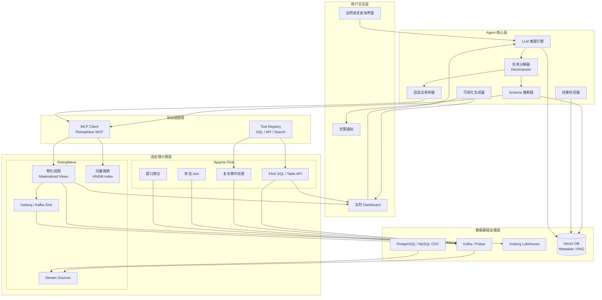
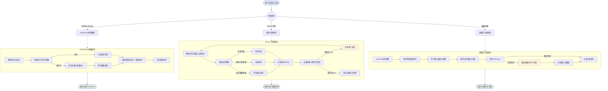

> **状态**: 🔮 前瞻内容 | **风险等级**: 高 | **最后更新**: 2026-05-06
>
> 本文档描述 Agentic Data Analytics 这一前沿交叉领域，LLM 驱动的 Agent 实时分析流数据的能力尚处于早期探索阶段。实现细节可能随技术演进大幅调整。

# Agentic Data Analytics：LLM 驱动的流数据自主分析

> **所属阶段**: Knowledge/06-frontier | **前置依赖**: [ai-agent-streaming-architecture.md](ai-agent-streaming-architecture.md), [streaming-mcp-a2a-integration.md](streaming-mcp-a2a-integration.md), [flink-risingwave-hybrid-architecture.md](flink-risingwave-hybrid-architecture.md) | **形式化等级**: L3-L4

---

## 1. 概念定义 (Definitions)

### Def-K-06-310: Agentic Data Analytics (Agentic 数据分析)

**Agentic Data Analytics** 定义为一种由大型语言模型（LLM）驱动的自主数据分析范式，其中 AI Agent 在流数据环境 $\mathcal{S}$ 中实时感知、推理、执行分析任务并迭代优化结果。形式上，Agentic Data Analytics 系统可建模为七元组：

$$
\mathcal{A}_{ADA} \triangleq \langle \mathcal{L}, \mathcal{S}, \mathcal{T}, \mathcal{Q}, \mathcal{V}, \mathcal{M}, \mathcal{G} \rangle
$$

其中各分量定义如下：

| 组件 | 符号 | 形式化定义 | 功能描述 |
|------|------|------------|----------|
| **LLM 引擎** | $\mathcal{L}$ | $\mathcal{L}: (\mathcal{P}, \mathcal{H}) \rightarrow \mathcal{D}$ | 基于提示 $\mathcal{P}$ 和对话历史 $\mathcal{H}$ 生成决策 $\mathcal{D}$ |
| **流数据环境** | $\mathcal{S}$ | $\mathcal{S} = \{ s_1, s_2, \ldots, s_n \}$ | 待分析的流数据源集合，每个 $s_i$ 为有序事件序列 $s_i = \langle e_1, e_2, \ldots \rangle$ |
| **任务分解器** | $\mathcal{T}$ | $\mathcal{T}: \text{NL} \rightarrow \{ t_1, t_2, \ldots, t_m \}$ | 将自然语言查询分解为可执行的子任务集合 |
| **查询执行器** | $\mathcal{Q}$ | $\mathcal{Q}: t_j \times \mathcal{S} \rightarrow \mathcal{R}_j$ | 在流数据上执行子任务 $t_j$ 并返回结果 $\mathcal{R}_j$ |
| **可视化生成器** | $\mathcal{V}$ | $\mathcal{V}: \mathcal{R} \rightarrow \text{Dashboard} \cup \text{Chart} \cup \text{NL}$ | 将分析结果转换为可视化组件或自然语言回答 |
| **记忆与上下文** | $\mathcal{M}$ | $\mathcal{M}_t = f(\mathcal{M}_{t-1}, \mathcal{O}_t, \mathcal{R}_t)$ | 维护分析会话的状态、中间结果和历史上下文 |
| **目标函数** | $\mathcal{G}$ | $\mathcal{G}: (q, \mathcal{R}) \rightarrow \mathbb{R}$ | 评估查询 $q$ 与结果 $\mathcal{R}$ 的相关性与准确性 |

**核心特征**：

1. **自主性**：Agent 无需预定义分析逻辑，由 LLM 动态决定探测、采样、查询、可视化的步骤序列[^1]
2. **实时性**：操作对象是当前持续到达的流数据，而非静态快照
3. **迭代性**：通过多轮交互逐步收敛到用户意图，支持 "Drill-down" 探索
4. **多模态输出**：可生成 SQL 查询、聚合指标、动态 Dashboard、自然语言摘要或异常告警

**与 Streaming Agents 的本质区别**：

| 维度 | Agentic Data Analytics | Streaming Agents |
|------|----------------------|-----------------|
| 流操作模式 | **只读**（Read-only） | **读写**（Read-Write） |
| 核心任务 | 分析、洞察、可视化 | 处理、转换、响应、写回流 |
| 用户交互 | 自然语言对话，ad-hoc 查询 | 事件驱动，自动化工作流 |
| 输出形式 | Dashboard、图表、文本回答 | 事件、动作、下游流写入 |
| 典型场景 | 销售自助分析、运维排查 | 实时推荐、欺诈检测、内容审核 |

> **直观解释**：Agentic Data Analytics 相当于为流数据配备了一位 "7×24 小时待命的智能数据分析师"，它能够理解业务问题、自主探索数据、发现模式并呈现结论，但**不修改**原始数据流。Streaming Agents 则相当于 "流处理算子的智能替代者"，持续消费事件并产生下游输出[^2]。

---

### Def-K-06-311: 流查询任务分解 (Stream Query Task Decomposition)

**流查询任务分解** 是 Agentic Data Analytics 的核心机制，将用户的自然语言分析请求 $\text{NL}_q$ 转化为可在流处理系统上执行的算子序列。形式上，任务分解函数定义为：

$$
\text{Decompose}: \text{NL}_q \times \mathcal{M}_{schema} \rightarrow \langle \mathcal{P}, \Sigma, \Delta, \Gamma, \Omega \rangle
$$

其中：

- $\mathcal{P}$：**探测计划**（Probe Plan），用于识别目标流、推断 schema 和采样数据分布
  $$
  \mathcal{P} = \{ \text{list_streams}(), \text{describe_schema}(s_i), \text{sample}(s_i, n, \tau) \}
  $$
  其中 $n$ 为采样条数，$\tau$ 为时间窗口约束

- $\Sigma$：**选择算子**（Selection Operators），定义过滤条件和字段选择
  $$
  \Sigma = \{ \sigma_{\theta_1}, \sigma_{\theta_2}, \ldots \}, \quad \sigma_{\theta}: e \rightarrow \{0, 1\}
  $$

- $\Delta$：**聚合算子**（Aggregation Operators），包含窗口类型、分组键和聚合函数
  $$
  \Delta = \{ (w, g, agg) \mid w \in \{\text{TUMBLE}, \text{HOP}, \text{SESSION}\}, g \subseteq \text{attrs}, agg \in \{\text{SUM}, \text{AVG}, \text{COUNT}, \ldots\} \}
  $$

- $\Gamma$：**时序约束**（Temporal Constraints），定义分析时间范围和新鲜度要求
  $$
  \Gamma = (t_{start}, t_{end}, \delta_{fresh}) \in \mathbb{T}^3
  $$

- $\Omega$：**输出规范**（Output Specification），定义结果呈现形式（图表类型、排序、Top-K 等）
  $$
  \Omega \in \{ \text{table}, \text{line}, \text{bar}, \text{pie}, \text{geo}, \text{summary} \} \times \mathbb{N}
  $$

**任务分解的 LLM 驱动流程**：

```
用户查询: "过去24小时趋势产品是什么？"
   ↓
Step 1: 意图识别 → "时间序列聚合 + Top-K 排名"
   ↓
Step 2: 实体解析 → streams=["orders", "products"], time_range="24h", metric="sales_volume"
   ↓
Step 3: Schema 推断 → 采样 100 条记录，推断字段类型和关联键
   ↓
Step 4: 算子生成 → TUMBLE(window=1h) → JOIN(products) → GROUP BY(product_id) → ORDER BY(count) → LIMIT(10)
   ↓
Step 5: 执行计划 → 连续查询（Continuous Query）或快照查询（Snapshot Query）
   ↓
Step 6: 结果封装 → 返回趋势图 + Top 10 产品列表 + 环比变化摘要
```

---

### Def-K-06-312: 实时 Dashboard 一致性 (Real-time Dashboard Consistency)

**实时 Dashboard 一致性** 定义 Agentic Data Analytics 系统中连续查询结果在可视化界面上的正确性保证。形式上，一致性模型定义为四元组：

$$
\mathcal{C}_{dash} \triangleq \langle \mathcal{V}_{vis}, \mathcal{V}_{true}, \epsilon_{sync}, \tau_{refresh} \rangle
$$

其中：

- $\mathcal{V}_{vis}$：**可见状态**，用户在 Dashboard 上观测到的聚合结果集合
- $\mathcal{V}_{true}$：**真实状态**，流处理引擎内部维护的物化视图或窗口状态的数学期望
- $\epsilon_{sync}$：**同步误差**，由刷新间隔和网络延迟导致的一致性偏差
  $$
  \epsilon_{sync} = | \mathcal{V}_{vis}^{(t)} - \mathcal{V}_{true}^{(t)} | \leq \Delta_{max}
  $$
- $\tau_{refresh}$：**刷新周期**，Dashboard 从后端拉取更新的时间间隔

**三种一致性级别**：

| 级别 | 名称 | 定义 | 适用场景 |
|------|------|------|----------|
| **强一致** | Strong | $\forall t: \mathcal{V}_{vis}^{(t)} = \mathcal{V}_{true}^{(t)}$ | 金融风控、实时交易监控 |
| **最终一致** | Eventual | $\lim_{t \to \infty} \mathcal{V}_{vis}^{(t)} = \mathcal{V}_{true}^{(t)}$ | 销售分析、用户行为看板 |
| **近似一致** | Approximate | $\Pr[| \mathcal{V}_{vis} - \mathcal{V}_{true} | > \delta] < \epsilon$ | 大规模日志分析、IoT 监控 |

**与流处理 Watermark 的关系**：

当流处理引擎使用事件时间（Event Time）处理时，Dashboard 的一致性受 Watermark 进度约束：

$$
\mathcal{V}_{true}^{(t)} = \text{Aggregate}(\{ e \mid e.ts \leq t - \max(\text{watermark\_delay}, \text{late\_allowed}) \})
$$

这意味着 Dashboard 显示的 "当前值" 实际上是 Watermark 之前已关闭窗口的聚合结果，而非物理时钟的即时状态[^3]。

---

### Def-K-06-313: 流数据漂移 (Stream Data Drift)

**流数据漂移** 定义为流数据分布在时间维度上的统计特性变化，导致 Agent 先前推断的 schema、采样分布或模型假设失效。形式上，漂移检测问题定义为：

$$
\text{Drift}: \exists t_0, \forall t > t_0: D(P_t \| P_{t_0}) > \theta_{drift}
$$

其中：

- $P_t$：时刻 $t$ 的数据分布（可以是联合分布或边缘分布）
- $D(\cdot \| \cdot)$：分布距离度量，常用选择包括 KL 散度、JS 散度、Wasserstein 距离或 Kolmogorov-Smirnov 统计量
- $\theta_{drift}$：漂移检测阈值，由业务容忍度和误报率共同决定

**漂移分类**：

| 漂移类型 | 数学描述 | 典型原因 | Agent 影响 |
|----------|----------|----------|------------|
| **概念漂移** | $P(y \mid x)$ 变化 | 用户行为模式改变、业务规则更新 | 历史查询逻辑可能不再适用 |
| **协变量漂移** | $P(x)$ 变化 | 流量来源变化、新市场开拓 | Schema 推断可能失效 |
| **特征漂移** | $P(x_i)$ 变化 | 传感器老化、季节因素 | 采样统计量产生偏差 |
| **Schema 漂移** | $\text{dom}(x_i)$ 扩展或收缩 | 上游系统升级、字段增减 | 自动推断的字段类型错误 |

**Agent 自适应机制**：

$$
\text{Adapt}(\mathcal{A}_{ADA}, P_t, P_{t_0}) = \begin{cases}
\text{重新采样} & \text{if } D_{KS} > \theta_1 \\
\text{重新推断Schema} & \text{if } \text{new\_fields\_detected} \\
\text{告警+降级} & \text{if } D_{KL} > \theta_2 \\
\text{继续监控} & \text{otherwise}
\end{cases}
$$

---

## 2. 属性推导 (Properties)

### Prop-K-06-310: Agentic Analytics 延迟-准确性权衡

**命题**：在 Agentic Data Analytics 系统中，端到端查询延迟 $L$ 与结果准确性 $Acc$ 之间存在不可兼得的权衡关系：

$$
\forall q \in \text{Queries}: \frac{\partial Acc}{\partial L} \geq 0 \quad \text{且} \quad \frac{\partial^2 Acc}{\partial L^2} \leq 0
$$

**量化形式**：

对于流数据采样率 $r \in (0, 1]$ 和 LLM 推理深度 $d \in \mathbb{N}$（迭代轮数）：

$$
L(q) = L_{probe} + L_{sample}(r) + d \cdot L_{llm} + L_{query}(r) + L_{viz}
$$

$$
Acc(q) = Acc_{base} + \alpha \cdot \log(1 + r \cdot N) + \beta \cdot \log(1 + d) - \gamma \cdot D(P_{sample} \| P_{true})
$$

其中 $N$ 为流数据总量，$\alpha, \beta, \gamma$ 为系统相关常数。

**权衡曲线**：

| 配置模式 | 采样率 $r$ | LLM 深度 $d$ | 延迟 $L$ | 准确性 $Acc$ | 适用场景 |
|----------|-----------|-------------|---------|-------------|----------|
| **即时模式** | 0.01 | 1 | < 2s | 中等 | 探索性分析、大屏监控 |
| **平衡模式** | 0.10 | 2 | 2-10s | 较高 | 日常报表、运维排查 |
| **深度模式** | 1.00 | 3+ | 10-60s | 高 | 根因分析、审计报告 |
| **全量模式** | 1.00 | 5+ | > 60s | 最高 | 战略决策、合规分析 |

**工程推论**：不存在单一最优配置；Agent 应根据查询意图自动选择模式。例如：

- "现在销售额多少？" → 即时模式（命中预计算物化视图）
- "过去一周异常原因？" → 深度模式（全量扫描 + 多轮推理）

---

### Prop-K-06-311: 实时 Dashboard 一致性下界

**命题**：在基于事件时间的流处理系统中，实时 Dashboard 的一致性误差存在由 Watermark 机制决定的下界：

$$
\epsilon_{sync} \geq \max(0, t_{physical} - t_{watermark} - \tau_{refresh})
$$

**证明概要**：

1. **Watermark 定义**：Apache Flink 的 Watermark 策略保证所有时间戳 $\leq t_{watermark}$ 的事件已被处理[^4]
   $$
   t_{watermark} = \min_{s \in \text{sources}} (\max_{e \in s_{buffer}} e.ts - \delta_{max\_out\_of\_orderness})
   $$

2. **窗口关闭条件**：一个事件时间窗口 $[t_1, t_2)$ 仅在 $t_{watermark} \geq t_2$ 时才被触发计算

3. **可见性延迟**：Dashboard 的刷新周期为 $\tau_{refresh}$，因此用户看到的结果最多延迟
   $$
   L_{visible} = (t_{physical} - t_{watermark}) + \tau_{refresh} + L_{network}
   $$

4. **下界导出**：由于 $t_{watermark} \leq t_{physical}$ 恒成立（Watermark 不能超过物理时间），且窗口必须等待 Watermark 推进：
   $$
   \epsilon_{sync} = t_{physical} - t_{watermark} \geq 0
   $$
   当系统存在迟到事件处理（Allowed Lateness）时，误差进一步增大：
   $$
   \epsilon_{sync}^{(late)} \geq \delta_{late} = \text{allowed\_lateness\_duration}
   $$

**工程含义**：

- 追求强一致的 Dashboard 必须接受 Watermark 引入的固有延迟
- Agent 在向用户呈现 "实时数据" 时，应显式标注数据新鲜度（Freshness Indicator）
- 对于需要亚秒级一致性的场景（如高频交易），应使用处理时间（Processing Time）而非事件时间

---

## 3. 关系建立 (Relations)

### 3.1 Agentic Data Analytics 与 Streaming Agents 的关系

Agentic Data Analytics 与 Streaming Agents 位于 AI×Streaming 融合光谱的不同位置：

```
┌─────────────────────────────────────────────────────────────────┐
│                    AI × Streaming 融合光谱                        │
├─────────────────────────────────────────────────────────────────┤
│  只读 ◄─────────────────────────────────────────────► 读写      │
│                                                                 │
│  ┌──────────────┐    ┌──────────────┐    ┌──────────────┐      │
│  │  流数据探索    │    │  Ad-hoc 查询  │    │  Streaming   │      │
│  │  (Schema推断)  │    │  (自然语言)   │    │   Agents     │      │
│  └──────────────┘    └──────────────┘    └──────────────┘      │
│         │                   │                   │               │
│         └───────────────────┼───────────────────┘               │
│                             ▼                                   │
│              ┌────────────────────────────┐                     │
│              │  Agentic Data Analytics    │                     │
│              │  (本论文档核心)             │                     │
│              └────────────────────────────┘                     │
│                             │                                   │
│         ┌───────────────────┼───────────────────┐               │
│         ▼                   ▼                   ▼               │
│  ┌──────────────┐    ┌──────────────┐    ┌──────────────┐      │
│  │  实时Dashboard │    │  自助分析      │    │  流处理Agent   │      │
│  │  构建          │    │  (NL2SQL)     │    │  (读+写)      │      │
│  └──────────────┘    └──────────────┘    └──────────────┘      │
└─────────────────────────────────────────────────────────────────┘
```

**关键区分维度**：

| 维度 | Agentic Data Analytics | Streaming Agents |
|------|----------------------|-----------------|
| **数据流向** | 单向：Stream → Agent → Insight | 双向：Stream ↔ Agent → Stream |
| **状态变更** | 不修改源数据，不产生副作用 | 可能修改下游流、触发动作、写入数据库 |
| **交互模式** | 请求-响应（用户提问） | 持续运行（事件触发） |
| **延迟要求** | 秒级到分钟级（人类可接受） | 毫秒级到秒级（自动化要求） |
| **错误影响** | 分析结论偏差，可人工修正 | 级联故障，直接影响业务系统 |
| **典型系统** | Text2SQL Agent、ChatBI、RisingWave MCP | Confluent Streaming Agents、Flink Agentic Jobs |

**协同关系**：两者可形成互补架构——Streaming Agents 负责实时数据处理和异常检测，Agentic Data Analytics 负责对检测到的异常进行深度分析和根因解释[^2]。

---

### 3.2 与 Flink / RisingWave 的集成模式

Agentic Data Analytics 需要底层流处理引擎提供计算能力和数据访问接口。Flink 和 RisingWave 分别代表了两种集成范式：

**范式 A：Flink 作为计算引擎（Compute-centric）**

```
┌─────────────┐     ┌─────────────┐     ┌─────────────────────┐
│   用户查询   │────►│  LLM Agent  │────►│  Flink SQL / Table  │
│  (自然语言)  │     │ (任务分解)   │     │   API (动态提交)     │
└─────────────┘     └─────────────┘     └─────────────────────┘
                                                │
                                                ▼
                                       ┌─────────────────┐
                                       │  Kafka / Pulsar │
                                       │   (数据层)       │
                                       └─────────────────┘
```

- **优势**：Flink 提供完整的流处理语义（Exactly-Once、复杂事件处理、窗口机制）
- **挑战**：Agent 动态提交的 Flink SQL 需要独立的 Session Cluster 或 Application Mode 管理生命周期
- **适用**：复杂流分析、需要 CEP 模式匹配、多流 Join 的场景

**范式 B：RisingWave 作为分析引擎（Analytics-centric）**

```
┌─────────────┐     ┌─────────────┐     ┌─────────────────────┐
│   用户查询   │────►│  LLM Agent  │────►│  RisingWave MCP     │
│  (自然语言)  │     │ (NL2SQL)    │     │  Server (标准协议)   │
└─────────────┘     └─────────────┘     └─────────────────────┘
                                                │
                                                ▼
                                       ┌─────────────────┐
                                       │  物化视图 / Source │
                                       │  (自动增量维护)    │
                                       └─────────────────┘
```

- **优势**：RisingWave 提供 PostgreSQL 协议兼容的 MCP Server，Agent 可直接通过标准协议查询物化视图[^5]
- **挑战**：复杂有状态计算（如 Session Window、CEP）的表达能力弱于 Flink
- **适用**：实时 Dashboard、自助分析、向量搜索增强的语义查询

**混合范式：Flink + RisingWave 分层架构**

```
数据采集层 → Flink (复杂ETL + CEP) → RisingWave (物化视图 + Serving) → Agent (MCP查询)
```

此架构结合了 Flink 的深度计算能力与 RisingWave 的实时 Serving 能力，是当前生产环境中的推荐方案[^6]。

---

## 4. 论证过程 (Argumentation)

### 4.1 幻觉控制：Agentic Analytics 的核心挑战

LLM 在流数据分析中的幻觉（Hallucination）表现为三类：

| 幻觉类型 | 表现形式 | 根因分析 | 缓解策略 |
|----------|----------|----------|----------|
| **Schema 幻觉** | 推断不存在的字段或表 | 训练数据与目标 schema 分布偏移 | 强制 schema 验证 + 元数据检索增强 |
| **数值幻觉** | 生成看似合理但错误的统计值 | LLM 不擅长精确数值计算 | 工具调用（Tool Use）委托计算引擎执行聚合 |
| **因果幻觉** | 错误关联相关性与因果性 | LLM 缺乏时间序列因果推断能力 | 引入因果发现算法（如 PC 算法）作为外部工具 |

**形式化分析**：

设 Agent 生成的查询为 $q_{gen}$，真实正确查询为 $q_{opt}$，幻觉风险定义为：

$$
\text{Risk}_{hallucination} = \Pr[q_{gen} \neq q_{opt}] = f(\text{schema\_complexity}, \text{query\_ambiguity}, \text{context\_gap})
$$

根据 arXiv 2604.14590 的实证研究，当 schema 字段数 $> 50$ 且用户查询涉及多表关联时，幻觉概率显著上升[^1]。

**工程缓解方案**：

1. **检索增强生成（RAG）**：将数据库元数据、历史查询、字段描述嵌入向量数据库，Agent 在生成 SQL 前检索相关上下文
2. **校验链（Verification Chain）**：Agent 生成查询后，先执行 `EXPLAIN` 或 `LIMIT 5` 预览结果，自我验证合理性
3. **人在回路（Human-in-the-loop）**：高风险操作（如删除、更新）需人工确认；对于只读分析，自动执行但标注置信度
4. **执行沙箱**：Agent 查询在只读隔离环境中执行，禁止 `INSERT/UPDATE/DELETE`[^1]

---

### 4.2 延迟约束下的采样策略

当流数据吞吐率 $R$（events/second）超过 Agent 处理能力时，必须进行采样。采样策略直接影响分析准确性：

**均匀采样**：

$$
\hat{\mu} = \frac{1}{n} \sum_{i=1}^{n} x_i, \quad x_i \sim \text{Uniform}(S)
$$

- 优点：无偏估计，实现简单
- 缺点：无法捕捉突发事件和尾部特征

**分层采样**：

$$
\hat{\mu}_{strat} = \sum_{k=1}^{K} w_k \cdot \hat{\mu}_k, \quad w_k = \frac{|S_k|}{|S|}
$$

- 按关键维度（如地域、产品类别）分层，保证各子群体代表性
- 适合需要保证群体公平性的分析场景

**时间加权采样**：

$$
P(e_i \text{ selected}) \propto e^{-\lambda (t_{now} - e_i.ts)}
$$

- 优先采样近期事件，适合关注近期趋势的分析
- $\lambda$ 为衰减系数，控制历史遗忘速度

**自适应采样**：Agent 根据查询意图动态选择采样策略：

```
IF 查询涉及 "趋势" 或 "变化":
    → 时间加权采样 (λ = 0.1/h)
ELIF 查询涉及 "分布" 或 "占比":
    → 分层采样 (按关键维度)
ELIF 查询涉及 "异常" 或 "极端值":
    → 重要性采样 (基于密度估计)
ELSE:
    → 均匀采样
```

---

### 4.3 反例：完全自主分析的边界

**反例 1：Schema 推断失败**

某电商流数据包含字段 `amount`，Agent 采样 100 条记录后推断其为销售额（数值型）。实际上该字段在促销期间会混入字符串值 `"N/A"`（表示未结算），导致后续聚合查询抛出异常或产生错误统计。

**教训**：Schema 推断必须结合完整性约束（NOT NULL、CHECK）和统计分布检验，不能仅依赖类型采样。

**反例 2：时区混淆**

用户询问 "过去 24 小时的订单趋势"，Agent 使用系统默认时区（UTC）计算窗口，但业务数据实际以 `America/New_York` 记录。结果 Dashboard 显示的 "昨日趋势" 实际上跨越了两个自然日。

**教训**：流数据分析必须显式处理时区语义，Agent 应将时区信息纳入任务分解的 $\Gamma$（时序约束）组件。

---

## 5. 形式证明 / 工程论证 (Proof / Engineering Argument)

### Thm-K-06-310: Agentic Dashboard 一致性保证定理

**定理**：在基于 Flink + RisingWave 的混合架构中，若满足以下条件：

1. Flink 使用事件时间处理，Watermark 生成策略为 `BoundedOutOfOrdernessWatermarks`（最大乱序度为 $\delta$）
2. RisingWave 物化视图的 checkpoint 间隔为 $\tau_{chk}$
3. Dashboard 前端轮询间隔为 $\tau_{poll}$
4. Agent 查询通过 MCP 协议以只读事务执行

则实时 Dashboard 的最终一致性延迟上界为：

$$
L_{consistency} \leq \delta + \tau_{chk} + \tau_{poll} + L_{network}
$$

**工程论证**：

1. **乱序容忍**（Flink 层）：Watermark 机制允许事件时间乱序到达最多 $\delta$，窗口计算必须等待 Watermark 推进到窗口结束时间 $+ \delta$ 才能触发[^4]

2. **状态持久化**（RisingWave 层）：物化视图的增量更新以 checkpoint 为原子单位，最坏情况下用户查询读到的是上一个 checkpoint 的状态，延迟不超过 $\tau_{chk}$

3. **前端刷新**（应用层）：轮询机制下，前端最多在 $\tau_{poll}$ 后才能感知后端状态变化

4. **网络传输**：$L_{network}$ 为典型的 RTT（10-100ms）

**数值示例**：

取典型生产参数 $\delta = 5s$（允许 5 秒乱序），$\tau_{chk} = 1s$，$\tau_{poll} = 2s$，$L_{network} = 50ms$：

$$
L_{consistency} \leq 5 + 1 + 2 + 0.05 = 8.05s
$$

这意味着用户看到的 Dashboard "当前值" 实际上是约 8 秒前的窗口聚合结果。对于销售自助分析场景，此延迟可接受；但对于高频交易风控，需改用处理时间语义将延迟降至亚秒级。

---

## 6. 实例验证 (Examples)

### 6.1 生产场景：销售自助分析

**场景描述**：某跨国零售企业有 200+ 区域销售经理，需要实时监控各渠道销售趋势。传统 BI 报表延迟为 T+1，无法满足促销期间的即时决策需求。

**Agentic Data Analytics 方案**：

```python
# [伪代码 - 展示核心交互逻辑]
# Agent: SalesAnalyticsAgent
# Backend: RisingWave (物化视图) + Flink (实时ETL)

class SalesAnalyticsAgent:
    def handle_query(self, nl_query: str, user_context: dict) -> dict:
        # Step 1: 意图识别
        intent = self.llm.classify_intent(nl_query)
        # 示例输出: {"type": "trend_analysis", "dimensions": ["region", "channel"],
        #           "metric": "revenue", "time_range": "24h"}

        # Step 2: Schema 探测
        schema = self.probe_schema(intent["required_streams"])
        # 查询 RisingWave information_schema，获取字段类型和约束

        # Step 3: SQL 生成 (NL2SQL)
        sql = self.llm.generate_sql(
            intent=intent,
            schema=schema,
            dialect="risingwave",  # 生成 RisingWave 兼容的 Streaming SQL
            constraints=["read_only", "max_execution_time=30s"]
        )
        # 示例 SQL:
        # SELECT region, channel, SUM(amount) as revenue,
        #        window_start, window_end
        # FROM TUMBLE(orders, order_time, INTERVAL '1' HOUR)
        # WHERE order_time > NOW() - INTERVAL '24' HOUR
        # GROUP BY region, channel, window_start, window_end

        # Step 4: 执行与验证
        result = self.risingwave_client.execute(sql)
        validation = self.validate_result(result, intent)
        if validation.confidence < 0.8:
            # 低置信度时请求澄清或提供更多上下文
            return self.clarify(validation.uncertainties)

        # Step 5: 可视化生成
        dashboard = self.viz.generate(
            data=result,
            chart_type=intent.get("viz_type", "line"),
            annotations=validation.insights  # 自动标注异常点和趋势变化
        )

        return {
            "dashboard": dashboard,
            "sql": sql,  # 透明性：向用户展示生成的查询
            "freshness": result.metadata.watermark_time,
            "confidence": validation.confidence
        }
```

**关键设计决策**：

| 决策点 | 选择 | 理由 |
|--------|------|------|
| 底层引擎 | Flink → RisingWave | Flink 处理多源 Join 和维度补全，RisingWave 提供物化视图 Serving |
| Agent 协议 | MCP (Model Context Protocol) | 标准化工具调用，支持 RisingWave 官方 MCP Server[^5] |
| 一致性级别 | 最终一致（1s checkpoint） | 销售分析容忍秒级延迟，换取更高吞吐量 |
| 采样策略 | 自适应分层（按区域分层） | 保证小区域不被大区域淹没 |

---

### 6.2 生产场景：运维根因分析

**场景描述**：云原生平台每秒产生 50K+ 日志、指标、追踪事件。当告警触发时，SRE 需要快速定位根因，传统方式需在多个系统间手动查询。

**Agentic Data Analytics 工作流**：

```
告警: "API Gateway P99 延迟突增至 2s (阈值: 500ms)"
  │
  ▼
Agent 接收告警上下文 (时间戳、服务、环境)
  │
  ▼
Step 1: 关联分析 → 查询同一时段相关指标
        - 上游服务延迟
        - 数据库连接池使用率
        - 容器 CPU / 内存
        - 网络丢包率
  │
  ▼
Step 2: 模式识别 → LLM 分析指标相关性
        "数据库连接池使用率在同一时刻从 30% 升至 95%，
         与 API 延迟上升高度相关 (correlation=0.92)"
  │
  ▼
Step 3: 日志挖掘 → 采样查询异常 Trace
        - 调用链分析：发现 db-query 平均耗时从 5ms 增至 800ms
        - 慢查询识别：某 N+1 查询在促销期间被触发
  │
  ▼
Step 4: 根因定位 → 生成分析报告
        "根因：促销活动导致某列表接口被高频调用，
         触发已知的 N+1 查询问题。
         建议：立即启用该接口的缓存降级策略 (预案 #47)"
  │
  ▼
Step 5: 行动建议 → 提供一键执行选项 (经人工确认)
        - 可选：执行缓存预热
        - 可选：临时扩容数据库连接池
        - 可选：切换至只读副本
```

**技术架构要点**：

- **数据源**：OpenTelemetry Collector → Kafka → Flink (异常检测 CEP) → RisingWave (指标关联物化视图)
- **Agent 能力**：调用 Prometheus API 查指标、调用 Jaeger API 查 Trace、调用 Kubernetes API 查 Pod 状态
- **延迟要求**：从告警到根因报告 < 30s（使用即时模式采样）
- **幻觉控制**：所有数值结论必须附带原始查询和截图，LLM 仅负责关联推理，不生成具体数值

---

### 6.3 生产场景：金融实时风控解释

**场景描述**：支付系统需实时评估交易风险并给出可解释的风险评分。监管要求风控决策必须可审计、可解释。

**Agentic Data Analytics 角色**：不直接执行风控决策（由确定性规则引擎负责），而是在决策触发后**解释**风险来源。

```
交易事件: {user_id: U12345, amount: $50,000, merchant: M789,
           location: "Shanghai", device_fingerprint: "FP-abc..."}
  │
  ▼
规则引擎判定: 高风险 (命中规则: "异地大额交易")
  │
  ▼
Agentic 解释器启动:
  ├─ 查询用户历史：过去 90 天平均交易 $200，地点为 Beijing
  ├─ 查询设备指纹：该设备 30 天内首次出现
  ├─ 查询商户风险：M789 为新增商户，注册 3 天
  ├─ 关联图谱分析：该用户与 2 个已知风险账户有资金往来
  │
  ▼
生成自然语言解释:
  "该交易被标记为高风险，原因如下：
   1. 金额异常：$50,000 是用户历史平均的 250 倍
   2. 地点异常：交易地点 Shanghai 与用户常驻 Beijing 不符
   3. 设备异常：首次使用此设备，可能存在账户盗用
   4. 商户风险：收款方为注册仅 3 天的新商户
   5. 关联风险：该账户与已知风险账户存在资金往来

   建议操作：要求二次验证（短信+人脸），或人工审核。"
```

**合规要点**：

- Agent 仅读取流数据（交易流、用户画像流、风险图谱流），**不修改**风控规则或交易状态
- 所有分析步骤记录审计日志（SQL 查询、采样参数、LLM 提示词）
- 解释结论置信度低于阈值时，自动降级为 "无法确定，建议人工审核"

---

## 7. 可视化 (Visualizations)

### 7.1 Agentic Data Analytics 系统架构总图

以下架构图展示了 Agentic Data Analytics 的完整技术栈，从用户交互层到流数据基础设施的分层关系：



**架构层次说明**：

1. **用户交互层**：支持自然语言查询、实时 Dashboard 和告警通知三种入口
2. **Agent 核心层**：LLM 驱动任务分解、Schema 推断、采样策略选择和结果可视化
3. **协议适配层**：通过 MCP 协议与 RisingWave 交互，通过 Tool Registry 调用 Flink SQL 和外部 API
4. **流处理计算层**：Flink 负责复杂计算（CEP、多流 Join），RisingWave 负责物化视图维护和实时 Serving
5. **数据基础设施层**：Kafka 作为事件总线，CDC 捕获数据库变更，Iceberg 提供湖仓归档，Vector DB 支撑元数据检索增强[^5][^6]

---

### 7.2 Agentic Analytics 任务分解与执行流程

以下流程图展示了从用户自然语言查询到结果返回的完整决策与执行树：



**三范式对比**：

| 范式 | 关键特征 | 采样策略 | 一致性要求 | 输出形式 |
|------|----------|----------|------------|----------|
| **实时 Dashboard 构建** | 连续查询、预计算、窗口聚合 | 预计算无需采样，全量增量维护 | 最终一致（1-5s） | 动态图表、实时看板 |
| **Ad-hoc 流查询** | 点对点回答、自然语言、即时响应 | 自适应采样（根据查询意图） | 近似一致或快照一致 | 文本摘要、数据表格、单图 |
| **流数据探索** | 迭代式、Drill-down、假设验证 | 渐进式采样（由粗到细） | 探索阶段可接受偏差 | 多维度报告、关联图谱、异常标注 |

---

## 8. 引用参考 (References)

[^1]: S. Garg et al., "AgileLog: A Forkable Shared Log for Agents on Data Streams", arXiv:2604.14590, 2026. <https://arxiv.org/abs/2604.14590>

[^2]: Confluent, "Streaming Agents — Build, test, deploy, and orchestrate event-driven agents", Confluent Cloud Documentation, 2026. <https://www.confluent.io/product/streaming-agents/>

[^3]: TileDB, "What is Agentic AI? — A Comprehensive Guide", TileDB Blog, 2026. <https://www.tiledb.com/blog/what-is-agentic-ai>

[^4]: Apache Flink Documentation, "Event Time and Watermarks", 2025. <https://nightlies.apache.org/flink/flink-docs-stable/docs/concepts/time/>

[^5]: RisingWave Labs, "RisingWave MCP Server", GitHub, 2026. <https://github.com/risingwavelabs/risingwave-mcp>

[^6]: RisingWave, "Streaming Infrastructure for Agentic AI", RisingWave Official Site, 2026. <https://risingwave.com/>


---

_文档版本: v1.0 | 创建日期: 2026-05-06 | 定理注册: Def-K-06-310~313, Prop-K-06-310~311, Thm-K-06-310 | 形式化元素: 7 | Mermaid图: 2_
