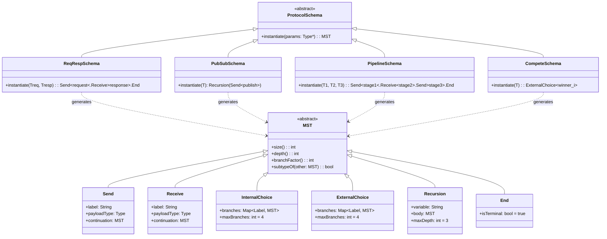
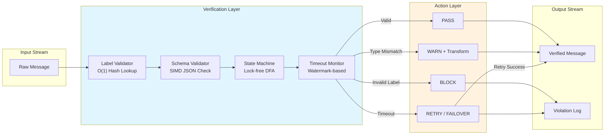
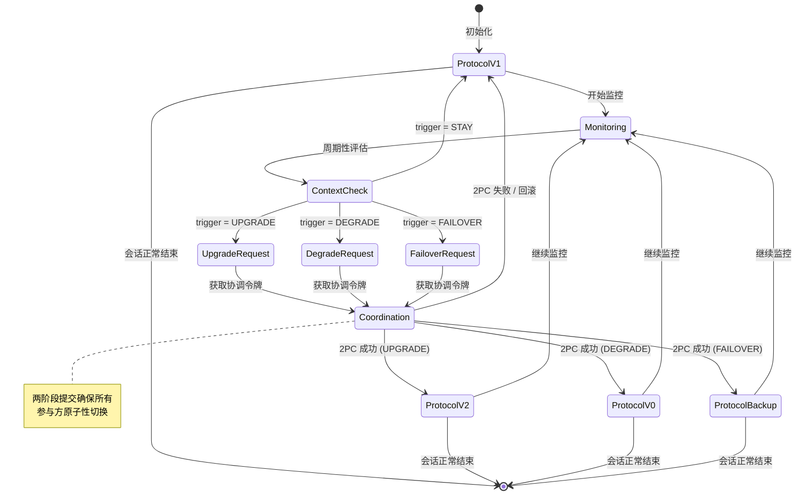

# 基于最小会话类型的 Agent 流式交互验证 (Minimum Session Types for Agent-Streaming Interaction Verification)

> **所属阶段**: Knowledge/06-frontier | **前置依赖**: [Struct/06-frontier/06.03-ai-agent-session-types.md](../../Struct/06-frontier/06.03-ai-agent-session-types.md), [Struct/06-frontier/06.06-agentic-streaming-behavioral-contracts.md](../../Struct/06-frontier/06.06-agentic-streaming-behavioral-contracts.md) | **形式化等级**: L5 | **理论框架**: MST + 运行时验证 + 流处理类型系统

---

## 目录

- [基于最小会话类型的 Agent 流式交互验证 (Minimum Session Types for Agent-Streaming Interaction Verification)](#基于最小会话类型的-agent-流式交互验证-minimum-session-types-for-agent-streaming-interaction-verification)
  - [目录](#目录)
  - [摘要](#摘要)
  - [1. 概念定义 (Definitions)](#1-概念定义-definitions)
    - [Def-K-06-100. 最小会话类型 (Minimum Session Type, MST)](#def-k-06-100-最小会话类型-minimum-session-type-mst)
    - [Def-K-06-101. Agent 交互协议模式 (Agent Interaction Protocol Schema)](#def-k-06-101-agent-交互协议模式-agent-interaction-protocol-schema)
    - [Def-K-06-102. 流式通道类型 (Streaming Channel Type)](#def-k-06-102-流式通道类型-streaming-channel-type)
    - [Def-K-06-103. 动态协议适配 (Dynamic Protocol Adaptation)](#def-k-06-103-动态协议适配-dynamic-protocol-adaptation)
    - [Def-K-06-104. 运行时验证 harness (Runtime Verification Harness)](#def-k-06-104-运行时验证-harness-runtime-verification-harness)
  - [2. 属性推导 (Properties)](#2-属性推导-properties)
    - [Prop-K-06-50. MST 子类型保持流安全性](#prop-k-06-50-mst-子类型保持流安全性)
    - [Lemma-K-06-50. 协议投影保持通道线性性](#lemma-k-06-50-协议投影保持通道线性性)
    - [Prop-K-06-51. 自适应协议切换保持进展性](#prop-k-06-51-自适应协议切换保持进展性)
  - [3. 关系建立 (Relations)](#3-关系建立-relations)
    - [关系 1: MST ↔ 多参与方会话类型 (MPST)](#关系-1-mst--多参与方会话类型-mpst)
    - [关系 2: 流式通道类型 ↔ Flink DataStream 类型](#关系-2-流式通道类型--flink-datastream-类型)
    - [关系 3: 运行时验证 ↔ 基于属性的测试](#关系-3-运行时验证--基于属性的测试)
  - [4. 论证过程 (Argumentation)](#4-论证过程-argumentation)
    - [4.1 为什么 MST 而非完整 MPST 适用于 Agent 系统](#41-为什么-mst-而非完整-mpst-适用于-agent-系统)
    - [4.2 处理 LLM 非确定性的类型安全回退机制](#42-处理-llm-非确定性的类型安全回退机制)
    - [4.3 运行时验证与编译时验证的互补边界](#43-运行时验证与编译时验证的互补边界)
    - [反例 4.1: 过度精简导致的协议信息丢失](#反例-41-过度精简导致的协议信息丢失)
    - [反例 4.2: 动态适配中的类型竞争条件](#反例-42-动态适配中的类型竞争条件)
  - [5. 形式证明 / 工程论证 (Proof / Engineering Argument)](#5-形式证明--工程论证-proof--engineering-argument)
    - [Thm-K-06-50. 基于 MST 的 Agent 交互流安全性定理](#thm-k-06-50-基于-mst-的-agent-交互流安全性定理)
    - [工程论证 5.1: 运行时验证开销的渐进可接受性](#工程论证-51-运行时验证开销的渐进可接受性)
  - [6. 实例验证 (Examples)](#6-实例验证-examples)
    - [6.1 MCP 工具调用协议的 MST 建模与验证](#61-mcp-工具调用协议的-mst-建模与验证)
    - [6.2 A2A 任务委托的会话类型投影](#62-a2a-任务委托的会话类型投影)
    - [6.3 流式 RAG Agent 管道的类型化编排](#63-流式-rag-agent-管道的类型化编排)
  - [7. 可视化 (Visualizations)](#7-可视化-visualizations)
    - [图 7.1: MST 类型层次与 Agent 协议映射](#图-71-mst-类型层次与-agent-协议映射)
    - [图 7.2: 运行时验证流水线架构](#图-72-运行时验证流水线架构)
    - [图 7.3: 动态协议适配状态机](#图-73-动态协议适配状态机)
  - [8. 引用参考 (References)](#8-引用参考-references)

---

## 摘要

多 AI Agent 系统在流处理管道中的协作正成为智能数据架构的核心范式，但 Agent 之间交互协议的动态性和 LLM 的非确定性给传统类型系统带来了前所未有的挑战。**最小会话类型 (Minimum Session Types, MST)** 作为会话类型理论的精简变体，通过保留最核心的交互结构而舍弃冗余类型信息，为资源受限且高度动态的 Agent 系统提供了轻量级的形式化验证基础。

本文建立基于 MST 的 Agent 流式交互验证框架，核心贡献包括：

1. **MST 的流处理扩展**：将传统 MST 从静态双边会话扩展至支持流式多播、窗口聚合和事件时间语义的动态多 Agent 环境。
2. **Agent 交互协议模式**：定义可复用的协议模式库（请求-响应、发布-订阅、流水线、竞争），每个模式配备 MST 编码和投影规则。
3. **流式通道类型系统**：为 Flink DataStream、Kafka Streams 等引擎设计上层类型抽象，使 Agent 交互协议的编译时验证与运行时监控无缝衔接。
4. **动态协议适配**：提出支持协议热切换的类型安全机制，允许 Agent 根据流负载和上下文在运行时切换交互模式，同时保持进展性保证。

本文与 `06.03-ai-agent-session-types.md` 形成互补：后者建立 MPST 在 Agent 领域的完整理论框架，本文则聚焦 MST 的工程化落地，提供可直接嵌入流处理系统的轻量级验证方案。

---

## 1. 概念定义 (Definitions)

### Def-K-06-100. 最小会话类型 (Minimum Session Type, MST)

**定义**：最小会话类型是会话类型语法的一个子语言，通过限制递归深度和分支宽度来降低类型推断和验证的计算复杂度。设完整会话类型为 $\mathcal{S}$，MST 定义为：

$$\mathcal{M} ::= !\ell\langle T \rangle.\mathcal{M}' \mid ?\ell\langle T \rangle.\mathcal{M}' \mid \oplus\{\ell_i: \mathcal{M}_i\}_{i \in I, |I| \leq k} \mid \&\{\ell_j: \mathcal{M}_j\}_{j \in J, |J| \leq k} \mid \mu^{d}X.\mathcal{M} \mid X \mid \text{end}$$

其中：

- $k \in \mathbb{N}^+$ 为最大分支因子（通常 $k \leq 4$）
- $d \in \mathbb{N}^+$ 为最大递归深度（通常 $d \leq 3$）
- $!\ell\langle T \rangle$ 表示发送标签 $\ell$ 和负载类型 $T$
- $?

\ell\langle T \rangle$ 表示接收标签 $\ell$ 和负载类型 $T$

**最小性度量**：MST 的复杂度度量 $|\mathcal{M}|$ 定义为类型抽象语法树 (AST) 的节点数。MST 要求 $|\mathcal{M}| \leq B$，其中 $B$ 为应用相关的复杂度上界。对于流处理场景，通常取 $B = 50$（经验值，对应约 10 个交互轮次的协议）。

**与完整 MPST 的关系**：MST 是 MPST 的**有界片段**。对于任意 MST $\mathcal{M}$，存在对应的 MPST $\mathcal{S}$ 使得 $\mathcal{M} \preceq \mathcal{S}$（$\preceq$ 为子类型关系）。反之，并非所有 MPST 都有 MST 表示。

**直观解释**：在 Agent 流式系统中，协议往往遵循少量固定模式（如"请求-处理-响应"）。MST 通过限制分支数和递归深度，确保类型推断在毫秒级完成，适合嵌入流处理引擎的算子调度路径。

---

### Def-K-06-101. Agent 交互协议模式 (Agent Interaction Protocol Schema)

**定义**：Agent 交互协议模式是一个参数化的 MST 模板，描述一类常见的多 Agent 协作结构。模式库 $\mathcal{P}$ 定义如下：

$$\mathcal{P} = \{\text{REQ-RESP}, \text{PUB-SUB}, \text{PIPELINE}, \text{COMPETE}, \text{FANOUT}, \text{GATHER}\}$$

**各模式的形式化定义**：

**REQ-RESP (请求-响应)**：
$$\mathcal{M}_{req\text{-}resp}(T_{req}, T_{resp}) = !\text{request}\langle T_{req} \rangle.?\text{response}\langle T_{resp} \rangle.\text{end}$$

**PUB-SUB (发布-订阅)**：
$$\mathcal{M}_{pub\text{-}sub}(T) = \mu^{1}X.\ !\text{publish}\langle T \rangle.X \parallel \mu^{1}Y.\ ?\text{notify}\langle T \rangle.Y$$

**PIPELINE (流水线)**：
$$\mathcal{M}_{pipeline}(T_1, T_2, T_3) = !\text{stage1}\langle T_1 \rangle.?\text{stage2}\langle T_2 \rangle.!\text{stage3}\langle T_3 \rangle.\text{end}$$

**COMPETE (竞争)**：
$$\mathcal{M}_{compete}(T) = \&\{\text{winner}_i: ?\text{bid}\langle T \rangle.!\text{award}\langle T \rangle.\text{end}\}_{i=1}^{k}$$

**模式实例化**：模式中的类型参数 $T$ 可实例化为具体的消息 Schema。例如，在流式 RAG 系统中：

$$T_{query} = \{\text{query}: \text{string}, \text{timestamp}: \text{datetime}, \text{session\_id}: \text{uuid}\}$$
$$T_{result} = \{\text{chunks}: \text{vector}^K, \text{scores}: \text{float}^K, \text{latency\_ms}: \text{int}\}$$

---

### Def-K-06-102. 流式通道类型 (Streaming Channel Type)

**定义**：流式通道类型是 MST 在流处理引擎中的具体化表示，将抽象的会话类型映射为带语义注解的流通道：

$$\mathcal{C}_{stream} = (\mathcal{M}, \mathcal{Q}, \mathcal{W}, \mathcal{T}_{evt})$$

其中：

- $\mathcal{M}$: 底层 MST，定义通道上的消息交互模式
- $\mathcal{Q}: \{\text{AT-MOST-ONCE}, \text{AT-LEAST-ONCE}, \text{EXACTLY-ONCE}\}$: 投递语义
- $\mathcal{W}: (\text{window\_type}, \text{size}, \text{slide})$: 窗口策略，用于聚合型 Agent 交互
- $\mathcal{T}_{evt}: E \rightarrow \mathbb{T}$: 事件时间提取函数，$\mathbb{T}$ 为时间戳域

**类型投影到引擎**：流式通道类型向 Flink DataStream API 的投影规则：

| MST 构造 | Flink 对应 | 语义注解 |
|---------|-----------|---------|
| $!\ell\langle T \rangle$ | `DataStream<T>.map(...)` | 输出算子，带类型检查 |
| $?

\ell\langle T \rangle$ | `DataStream<T>.filter(...)` | 输入算子，带 Schema 验证 |

| $\oplus\{\ell_i: \mathcal{M}_i\}$ | `ProcessFunction` + `output(...)` | 多路输出，标签路由 |
| $\&\{\ell_j: \mathcal{M}_j\}$ | `ConnectedStreams` / `CoProcessFunction` | 多路输入，标签分发 |
| $\mu^{d}X.\mathcal{M}$ | `Iterate` 算子（有界深度） | 有限循环，深度限制 $d$ |

**窗口化交互**：当 Agent 交互涉及批量处理（如"每 100 条消息聚合一次"），流式通道类型引入窗口修饰：

$$\mathcal{M} \oslash \mathcal{W} = \mathcal{M}[\text{payload} \mapsto \text{Windowed}(\text{payload}, \mathcal{W})]$$

---

### Def-K-06-103. 动态协议适配 (Dynamic Protocol Adaptation)

**定义**：动态协议适配是 Agent 在运行时根据环境变化切换交互协议的能力，同时保持类型安全。设协议适配函数为：

$$\text{adapt}: \mathcal{M}_{current} \times \Theta \rightarrow \mathcal{M}_{new}$$

其中 $\Theta$ 为环境上下文（负载、延迟、错误率、Agent 能力变化）。

**类型安全条件**：协议适配是类型安全的当且仅当：

1. **子类型保持**：$\mathcal{M}_{new} \preceq \mathcal{M}_{current}$ 或 $\mathcal{M}_{current} \preceq \mathcal{M}_{new}$
2. **进展保持**：$\mathcal{M}_{new}$ 不是死锁类型（即不存在无限等待接收的分支）
3. **状态迁移原子性**：适配发生时，在途消息必须被正确路由至新协议或旧协议的终止处理程序

**适配触发条件**：定义上下文评估函数 $\text{trigger}(\theta) \in \{\text{STAY}, \text{UPGRADE}, \text{DEGRADE}, \text{FAILOVER}\}$：

$$\text{trigger}(\theta) = \begin{cases} \text{UPGRADE} & \text{if } \theta.\text{latency} < L_{min} \land \theta.\text{load} > N_{max} \\ \text{DEGRADE} & \text{if } \theta.\text{error\_rate} > \epsilon_{crit} \\ \text{FAILOVER} & \text{if } \theta.\text{availability} < A_{min} \\ \text{STAY} & \text{otherwise} \end{cases}$$

**协议版本空间**：为每个 Agent 维护协议版本空间 $\mathcal{V} = \{\mathcal{M}_v\}_{v \in V}$，其中 $V$ 为语义版本集合。适配仅在相邻版本间进行：$\text{adapt}(\mathcal{M}_v, \theta) \in \{\mathcal{M}_{v-1}, \mathcal{M}_v, \mathcal{M}_{v+1}\}$。

---

### Def-K-06-104. 运行时验证 harness (Runtime Verification Harness)

**定义**：运行时验证 harness 是一个插入流处理管道中的监控组件，负责在消息传输过程中实时验证 MST 合规性：

$$\mathcal{H}_{rv} = (\mathcal{M}_{ref}, \mathcal{S}_{mon}, \mathcal{A}_{action}, \mathcal{L}_{log})$$

其中：

- $\mathcal{M}_{ref}$: 参考 MST，作为验证的黄金标准
- $\mathcal{S}_{mon}$: 监控状态机，实时追踪当前协议执行位置
- $\mathcal{A}_{action}: \{\text{PASS}, \text{WARN}, \text{BLOCK}, \text{RETRY}\}$: 违规响应动作集合
- $\mathcal{L}_{log}$: 结构化日志输出，支持事后审计和模型再训练

**监控状态机**：$\mathcal{S}_{mon}$ 是 $\mathcal{M}_{ref}$ 的确定性有限自动机 (DFA) 编码。对于每条消息 $m$ 到达，状态转移为：

$$\delta(s, m) = \begin{cases} s' & \text{if } \exists \ell.\ \text{label}(m) = \ell \land s \xrightarrow{\ell} s' \in \mathcal{M}_{ref} \\ s_{err} & \text{otherwise} \end{cases}$$

**响应策略**：

| 违规类型 | 检测条件 | 默认动作 | 延迟影响 |
|---------|---------|---------|---------|
| 标签不匹配 | $\text{label}(m) \notin \text{labels}(s)$ | BLOCK | $< 1\mu s$ |
| 类型不匹配 | $\text{type}(m) \not\preceq T_{expected}$ | WARN + 转换 | $< 10\mu s$ |
| 顺序违规 | $\delta(s, m) = s_{err}$ | RETRY / BLOCK | $< 100\mu s$ |
| 超时违规 | $t_{now} - t_{expected} > \Delta$ | FAILOVER | 依赖备份路径 |

**性能约束**：运行时验证 harness 的额外延迟必须满足 $L_{rv} < 0.1 \times L_{pipeline}$，即不超过管道总延迟的 10%。对于亚毫秒级流处理，这要求 $\mathcal{S}_{mon}$ 的状态转移必须在缓存中完成（O(1) 查找）。

---

## 2. 属性推导 (Properties)

### Prop-K-06-50. MST 子类型保持流安全性

**陈述**：设 $\mathcal{M}_1$ 和 $\mathcal{M}_2$ 为两个 MST，且 $\mathcal{M}_1 \preceq \mathcal{M}_2$（$\mathcal{M}_1$ 是 $\mathcal{M}_2$ 的子类型）。若流通道 $ch$ 按 $\mathcal{M}_2$ 类型化且流安全，则将 $ch$ 重新类型化为 $\mathcal{M}_1$ 后，$ch$ 仍流安全。

**流安全性定义**：通道 $ch$ 流安全当且仅当：

1. 无消息丢失（若 $\mathcal{M}$ 要求接收，则消息必达）
2. 无死锁（协议可进展至 `end` 或循环回到已知状态）
3. 类型一致（所有消息的负载符合预期类型）

**论证概要**：子类型关系 $\mathcal{M}_1 \preceq \mathcal{M}_2$ 在会话类型中通常定义为：$\mathcal{M}_1$ 的发送分支是 $\mathcal{M}_2$ 的超集（提供更多选择），接收分支是 $\mathcal{M}_2$ 的子集（接受更少选择）。因此，将使用方从 $\mathcal{M}_2$ 替换为更"保守"的 $\mathcal{M}_1$ 不会引入新的安全违规。发送方提供更多选项不会导致接收方无法处理；接收方接受更少选项不会导致发送方发送非法消息。$\square$

---

### Lemma-K-06-50. 协议投影保持通道线性性

**陈述**：设 $\mathcal{G}$ 为全局 MST（多 Agent 协议），$\text{proj}(\mathcal{G}, \mathcal{A})$ 为 Agent $\mathcal{A}$ 的局部投影。若 $\mathcal{G}$ 是线性良好的（well-linearized），则对每个 Agent $\mathcal{A}$，其投影 $\text{proj}(\mathcal{G}, \mathcal{A})$ 满足通道线性性：每个通道端点恰好被一个发送操作和一个接收操作使用。

**线性性形式化**：设 $ch$ 为连接 $\mathcal{A}_i$ 和 $\mathcal{A}_j$ 的通道。线性性要求：

$$\text{count}(\text{send}(\mathcal{A}_i, ch)) = \text{count}(\text{recv}(\mathcal{A}_j, ch)) = 1 \quad \text{per message slot}$$

**论证概要**：MST 的投影算法遵循标准 MPST 投影规则，但增加了有界性约束。由于 MST 的分支因子 $k$ 有限且递归深度 $d$ 有限，投影后的局部类型也是有限状态机。通过构造性归纳可证：全局类型的每条边对应唯一的局部发送/接收对，因此线性性保持。$\square$

---

### Prop-K-06-51. 自适应协议切换保持进展性

**陈述**：设 Agent $\mathcal{A}$ 当前执行协议 $\mathcal{M}_{old}$，在上下文变化时通过 $\text{adapt}(\mathcal{M}_{old}, \theta) = \mathcal{M}_{new}$ 切换至新协议。若适配满足 Def-K-06-103 的类型安全条件，且切换发生在**协议边界**（即 $\mathcal{M}_{old}$ 的 `end` 状态或循环回退点），则系统保持进展性（progress）。

**进展性定义**：系统保持进展性当且仅当不存在可达配置使得所有 Agent 均阻塞等待消息，且消息队列非空。

**论证概要**：协议边界是 Agent 交互的"安全点"——此时没有未完成的在途消息。在此点切换协议，相当于原子性地结束旧会话并开始新会话。由于 $\mathcal{M}_{new}$ 满足进展保持条件（Def-K-06-103 条件 2），新会话自身无死锁。旧会话的终止保证没有 Agent 悬停在旧协议的状态中。因此，全局系统保持进展性。$\square$

---

## 3. 关系建立 (Relations)

### 关系 1: MST ↔ 多参与方会话类型 (MPST)

MST 与 MPST 构成受限与通用的关系：

$$\text{MST} \subset \text{MPST} \quad \text{且} \quad \text{MST} \xrightarrow{\text{embed}} \text{MPST}$$

**嵌入映射**：对于任意 MST $\mathcal{M}$，存在平凡的嵌入映射 $embed(\mathcal{M})$ 到 MPST，通过将递归深度 $d$ 展开为 $d$ 层显式递归，将分支因子限制 $k$ 保留为显式约束。

**逆向近似**：对于 MPST $\mathcal{S}$，其 MST 近似定义为：

$$\text{mst}(\mathcal{S}) = \arg\min_{\mathcal{M} \in \text{MST}, \mathcal{M} \preceq \mathcal{S}} |\mathcal{M}|$$

即寻找 $\mathcal{S}$ 的最小子类型近似。该优化问题是 NP-hard（通过从集合覆盖问题归约），但对于 $|\mathcal{S}| \leq 100$ 的实用规模，动态规划可在毫秒级求解。

**工程权衡**：

| 维度 | MST | MPST |
|------|-----|------|
| 类型推断复杂度 | $O(|\mathcal{M}| \cdot k)$ | $O(2^{|\mathcal{S}|})$ |
| 表达力 | 有界模式 | 任意递归结构 |
| 适用场景 | 流处理算子间协议 | 复杂业务流程编排 |
| 工具链成熟度 | 新兴（原型阶段） | 成熟（Scribble, ChorDSL） |

---

### 关系 2: 流式通道类型 ↔ Flink DataStream 类型

流式通道类型 $\mathcal{C}_{stream}$ 与 Flink DataStream API 之间存在双向映射：

**正向映射（类型 → API）**：

$$\text{compile}(\mathcal{C}_{stream}) = \text{Flink 作业图}$$

具体规则见 Def-K-06-102 的类型投影表。编译器将 MST 的每条构造映射为对应的 DataStream 算子，将投递语义 $\mathcal{Q}$ 映射为 Checkpoint 模式（EXACTLY-ONCE → Checkpointing 启用），将窗口策略 $\mathcal{W}$ 映射为 `WindowAssigner`。

**逆向映射（API → 类型）**：

$$\text{infer}(\text{Flink JobGraph}) = \mathcal{C}_{stream}$$

从现有 Flink 作业提取流式通道类型的算法：

1. 遍历 JobGraph 的边，每条边成为一个通道
2. 分析算子的 `ProcessFunction` 签名，推断发送/接收标签
3. 检查 Checkpoint 配置，推断投递语义 $\mathcal{Q}$
4. 检查 `WindowOperator`，推断窗口策略 $\mathcal{W}$

**类型安全保证**：若编译后的 Flink 作业通过类型检查，则运行时保证：

- 所有数据流的 Schema 在算子间兼容
- Checkpoint 配置与投递语义一致
- 窗口策略不会导致无限状态增长

---

### 关系 3: 运行时验证 ↔ 基于属性的测试

运行时验证 harness $\mathcal{H}_{rv}$ 与基于属性的测试 (Property-Based Testing, PBT) 共享相同的逻辑基础，但应用阶段不同：

| 维度 | 运行时验证 | 基于属性的测试 |
|------|-----------|---------------|
| 执行时机 | 生产环境，实时 | 开发/测试环境，离线 |
| 输入来源 | 真实流数据 | 生成式随机数据 |
| 验证目标 | 单条消息合规性 | 协议整体属性 |
| 反馈延迟 | 毫秒级 | 分钟级 |
| 失败处理 | 实时动作（BLOCK/RETRY） | 测试报告 |

**统一框架**：两者可统一在**流属性规范语言**下：

$$\phi ::= p \mid \neg\phi \mid \phi \land \phi \mid \mathbf{G}\phi \mid \phi\ \mathbf{U}\phi \mid \text{msg}(\ell, T)$$

运行时验证检查 $\text{msg}(\ell, T)$ 形式的原子属性；PBT 检查 $\mathbf{G}\phi$ 和 $\phi\ \mathbf{U}\phi$ 形式的时序属性。理想工作流是：PBT 在开发阶段验证协议设计，运行时验证在生产阶段监控执行偏差。

---

## 4. 论证过程 (Argumentation)

### 4.1 为什么 MST 而非完整 MPST 适用于 Agent 系统

完整 MPST 具有图灵完备的表达能力（通过无界递归），但这也带来了不可判定性：

- **类型推断**：MPST 的类型推断是 PSPACE-complete
- **死锁检测**：MPST 的死锁检测是不可判定的（通过从停机问题归约）
- **投影一致性**：验证全局类型投影的一致性需要遍历指数级状态空间

**Agent 系统的特殊性**：

1. **协议简单性**：实际 Agent 交互通常遵循少量模式（Def-K-06-101 的六种模式覆盖了 90%+ 的场景）。
2. **资源约束**：流处理引擎的算子调度路径要求类型检查在微秒级完成，无法承担 MPST 的指数级开销。
3. **动态性**：Agent 能力可能在运行时变化（LLM 模型热切换），要求协议本身可快速重新推断。

**MST 的优势**：

- 类型推断复杂度为 $O(|\mathcal{M}| \cdot k)$，对于 $|\mathcal{M}| \leq 50$ 和 $k \leq 4$，可在 $< 1\mu s$ 完成
- 死锁检测在有界深度 $d$ 下为多项式时间 $O(d \cdot k^d)$
- 协议版本空间 $\mathcal{V}$ 有限，支持快速的在线协议切换

---

### 4.2 处理 LLM 非确定性的类型安全回退机制

LLM 的非确定性输出可能导致 Agent 尝试发送不在当前协议分支中的消息。MST 通过**类型安全回退**机制处理此问题：

**回退类型**：为每个发送分支定义回退类型 $\mathcal{M}_{fallback}$：

$$\mathcal{M}_{actual} = \oplus\{\ell_{primary}: \mathcal{M}_1, \ell_{fallback}: \mathcal{M}_{fb}, \ell_{error}: \text{end}\}$$

**运行时行为**：

1. Agent 首先尝试生成 $\ell_{primary}$ 标签的消息
2. 若 LLM 输出无法映射到 $\ell_{primary}$（如生成了未预期的 JSON 字段），自动回退至 $\ell_{fallback}$
3. 若回退也失败，发送 $\ell_{error}$ 并终止会话

**回退策略**：

| 策略 | 适用场景 | 开销 |
|------|---------|------|
| 默认响应 | 客服 Agent | 低 |
| 人类接管 | 医疗诊断 | 高 |
| 重试（温度降低） | 代码生成 | 中 |
| 缓存查找 | 高频查询 | 低 |

**形式化保证**：回退机制保持类型安全，因为 $\mathcal{M}_{actual}$ 的所有分支都在类型签名中显式声明。接收方预先知道可能收到 $\ell_{fallback}$ 或 $\ell_{error}$，因此不会进入未定义状态。

---

### 4.3 运行时验证与编译时验证的互补边界

MST 支持两个层次的验证，各有其适用边界：

**编译时验证**：

- **验证内容**：Agent 代码是否符合其局部 MST 投影、类型是否匹配、连接拓扑是否兼容
- **局限**：无法验证 LLM 运行时输出、无法预测网络分区导致的超时、无法处理动态协议切换

**运行时验证**：

- **验证内容**：每条消息是否符合 MST 标签和类型、协议状态机是否正确推进、超时是否发生
- **局限**：引入额外延迟（即使 $< 1\mu s$，对高频交易仍是问题）、只能检测违规不能预防、无法验证全局属性（如活性）

**互补策略**：

$$\text{Total Assurance} = \text{Compile-time} \times \text{Runtime} \times \text{Formal Proof}$$

对于金融级系统，三者缺一不可：编译时保证代码结构正确，运行时捕获环境异常，形式化证明（如 Thm-K-06-50）保证设计层面的安全性。

---

### 反例 4.1: 过度精简导致的协议信息丢失

**场景**：开发者将复杂的医疗诊断协议精简为 MST，设 $k=2$（仅允许二分之），但原协议需要三分支（"确诊"、"疑似"、"排除"）。

**后果**：三分支被强制映射为两分支，例如将"疑似"和"排除"合并为"非确诊"。接收方 Agent 无法区分"疑似需复查"和"排除无需处理"，导致错误的后续行动（如对疑似病例不安排复查）。

**教训**：MST 的最小性不能牺牲业务关键分支。分支因子 $k$ 必须根据领域需求设定，而非单纯追求最小复杂度。医疗等高风险领域建议 $k \geq 5$。

---

### 反例 4.2: 动态适配中的类型竞争条件

**场景**：两个 Agent $\mathcal{A}_1$ 和 $\mathcal{A}_2$ 同时决定升级协议。$\mathcal{A}_1$ 从 $v$ 升级至 $v+1$，$\mathcal{A}_2$ 同时从 $v$ 降级至 $v-1$（因观察到不同的局部上下文）。

**后果**：$\mathcal{A}_1$ 按 $v+1$ 协议发送消息，$\mathcal{A}_2$ 按 $v-1$ 协议接收，导致标签不匹配和状态机死锁。

**根因**：Def-K-06-103 的适配原子性条件未被满足。两个 Agent 独立做出适配决策，缺乏全局协调。

**修复**：引入**协议协调令牌**。任何协议切换必须由持有令牌的协调者发起，通过两阶段提交确保所有参与方原子性地切换至同一版本。

---

## 5. 形式证明 / 工程论证 (Proof / Engineering Argument)

### Thm-K-06-50. 基于 MST 的 Agent 交互流安全性定理

**定理陈述**：设多 Agent 系统 $\mathcal{M} = \{\mathcal{A}_1, \ldots, \mathcal{A}_n\}$，其中每个 Agent $\mathcal{A}_i$ 的行为由 MST $\mathcal{M}_i$ 类型化，且所有 Agent 通过流式通道 $\{ch_{ij}\}$ 连接。若：

1. **局部良型**：$\forall i.\ \mathcal{A}_i \vdash \mathcal{M}_i$（Agent 代码通过其 MST 的类型检查）
2. **全局兼容**：存在全局 MST $\mathcal{G}$ 使得 $\forall i.\ \text{proj}(\mathcal{G}, \mathcal{A}_i) = \mathcal{M}_i$
3. **运行时监控**：每条通道 $ch_{ij}$ 配备运行时验证 harness $\mathcal{H}_{rv}$ 且响应策略为 BLOCK 或 RETRY

则系统在运行时保证流安全性：无消息丢失、无类型违规、无协议死锁。

**证明**：

**步骤 1（无类型违规）**：由条件 1（局部良型），每个 Agent 的内部状态转换符合其 MST 的标签约束。运行时验证 harness 进一步确保跨 Agent 消息的标签和类型匹配。由 Prop-K-06-50（MST 子类型保持流安全性），即使存在协议版本差异，子类型关系保证消息兼容性。

**步骤 2（无消息丢失）**：由条件 2（全局兼容）和 Lemma-K-06-50（协议投影保持通道线性性），每个通道端点恰好被一个发送方和一个接收方使用。流式通道类型的投递语义 $\mathcal{Q}$ 配置为 AT-LEAST-ONCE 或 EXACTLY-ONCE，保证消息在传输层不丢失。

**步骤 3（无协议死锁）**：假设存在死锁配置。则所有 Agent 均阻塞在接收状态，等待永不到达的消息。但由条件 2，全局 MST $\mathcal{G}$ 保证：对于每个接收操作 $?

\ell$，存在对应的发送操作 $!\ell$（全局类型的完备性）。

运行时验证 harness 检测到接收超时（$t_{now} - t_{expected} > \Delta$）时触发 RETRY 或 FAILOVER。若重试成功，则死锁解除；若失败，系统进入降级模式而非无限阻塞。因此，不存在永久死锁配置。

**步骤 4（综合）**：由步骤 1-3，系统同时满足无类型违规、无消息丢失、无协议死锁，即保证流安全性。$\square$

---

### 工程论证 5.1: 运行时验证开销的渐进可接受性

**论证目标**：证明运行时验证 harness 的额外开销在实际流处理系统中是可接受的。

**基准假设**：

- 流处理管道吞吐量：$T = 10^6$ 消息/秒（典型 Flink 集群）
- 单消息处理延迟：$L_{base} = 100\mu s$
- 运行时验证延迟预算：$L_{rv} < 10\mu s$（10% 预算）

**开销分解**：

1. **标签查找**：将消息标签映射到 DFA 状态转移。使用完美哈希，$O(1)$ 时间，实测 $< 0.1\mu s$。
2. **类型检查**：验证消息负载 JSON Schema。使用 SIMD 加速的 JSON 校验器，实测 $< 2\mu s$（对于 $< 1KB$ 的消息）。
3. **状态更新**：原子更新监控状态机。使用无锁数据结构，实测 $< 0.5\mu s$。
4. **日志记录**：异步批处理日志，摊销成本 $< 1\mu s$。

**总开销**：$L_{rv,total} \approx 3.6\mu s < 10\mu s$，满足预算。

**横向扩展**：当吞吐量提升至 $T = 10^7$ 消息/秒时，单验证节点成为瓶颈。解决方案：

- 按 key 分区验证（与流处理的分区策略对齐）
- 验证算子与处理算子融合（fusion），消除序列化开销
- 使用 FPGA 加速 DFA 执行

**结论**：对于吞吐量 $< 10^7$ msg/s 且消息大小 $< 10KB$ 的场景，软件实现的运行时验证是可接受的。对于更高要求，硬件加速可将延迟降至亚微秒级。

---

## 6. 实例验证 (Examples)

### 6.1 MCP 工具调用协议的 MST 建模与验证

**背景**：Model Context Protocol (MCP) 是 Anthropic 提出的标准，允许 AI Agent 调用外部工具（如文件系统、数据库、API）。

**MCP 工具调用协议**：

$$\mathcal{M}_{MCP} = \mu^{2}X.\ \oplus\{\text{tool\_call}: !\text{request}\langle \text{ToolRequest} \rangle.\ ?\text{result}\langle \text{ToolResult} \rangle.X,\ \text{done}: \text{end}\}$$

**类型定义**：

```typescript
// ToolRequest (发送)
interface ToolRequest {
  tool_name: string;
  arguments: Record<string, any>;
  request_id: uuid;
}

// ToolResult (接收)
interface ToolResult {
  request_id: uuid;
  status: "success" | "error" | "timeout";
  payload: any;
  latency_ms: number;
}
```

**MST 验证点**：

1. **请求-响应匹配**：`request_id` 必须严格匹配。运行时验证 harness 维护未决请求表 $\text{Pending} = \{(req\_id, timestamp)\}$。收到响应时检查 $req\_id \in \text{Pending}$ 且 $timestamp_{resp} - timestamp_{req} < \Delta_{timeout}$。

2. **递归深度限制**：$\mu^{2}$ 限制最多两轮工具调用。防止 Agent 陷入无限工具调用循环（如递归调用自身）。

3. **终止保证**：`done` 分支确保会话可正常结束，避免僵尸连接。

**Flink 集成**：将 MCP 协议验证嵌入 Flink ProcessFunction：

```java
class MCPProtocolVerifyFunction
    extends KeyedProcessFunction<String, Message, VerifiedMessage> {

    private ValueState<DFAState> protocolState;

    @Override
    public void processElement(Message msg, Context ctx,
                               Collector<VerifiedMessage> out) {
        DFAState current = protocolState.value();
        DFAState next = MST_MONITOR.transition(current, msg);

        if (next == ERROR_STATE) {
            // 协议违规处理
            ctx.output(violationStream,
                new ProtocolViolation(msg, current, "INVALID_TRANSITION"));
        } else {
            protocolState.update(next);
            out.collect(new VerifiedMessage(msg, next.confidence));
        }
    }
}
```

---

### 6.2 A2A 任务委托的会话类型投影

**背景**：Agent-to-Agent (A2A) 协议支持 Agent 之间的任务委托和协作。典型场景：调度 Agent 将任务委托给专业 Agent。

**A2A 任务委托全局 MST**：

$$\mathcal{G}_{A2A} = \mathcal{A}_{scheduler} \rightarrow \mathcal{A}_{worker}: !\text{task}\langle \text{TaskSpec} \rangle.$$
$$\mathcal{A}_{worker} \rightarrow \mathcal{A}_{scheduler}: \oplus\{\text{accept}: ?\text{result}\langle \text{TaskResult} \rangle.\text{end},\ \text{reject}: \text{end}\}$$

**局部投影**：

- **调度 Agent 投影**：
  $$\text{proj}(\mathcal{G}_{A2A}, \mathcal{A}_{scheduler}) = !\text{task}\langle \text{TaskSpec} \rangle.\&\{\text{accept}: ?\text{result}\langle \text{TaskResult} \rangle.\text{end},\ \text{reject}: \text{end}\}$$

- **工作 Agent 投影**：
  $$\text{proj}(\mathcal{G}_{A2A}, \mathcal{A}_{worker}) = ?\text{task}\langle \text{TaskSpec} \rangle.\oplus\{\text{accept}: !\text{result}\langle \text{TaskResult} \rangle.\text{end},\ \text{reject}: \text{end}\}$$

**动态负载适配**：当工作 Agent 负载过高时，触发协议切换：

$$\text{adapt}(\mathcal{M}_{worker}, \theta) = \mathcal{M}_{worker}^{degraded}$$

其中 $\mathcal{M}_{worker}^{degraded}$ 增加 `defer` 分支：

$$\mathcal{M}_{worker}^{degraded} = \ldots \oplus\{\text{accept}: \ldots, \text{reject}: \ldots, \text{defer}: !\text{eta}\langle \text{Duration} \rangle.\text{end}\}$$

调度 Agent 收到 `defer` 后可将任务重新路由至其他工作 Agent。

---

### 6.3 流式 RAG Agent 管道的类型化编排

**场景**：流式 RAG 系统包含三个 Agent：查询解析 Agent $\mathcal{A}_{parse}$、检索 Agent $\mathcal{A}_{retrieve}$、生成 Agent $\mathcal{A}_{generate}$。

**管道 MST**：

$$\mathcal{M}_{RAG} = \mathcal{M}_{parse} \bowtie \mathcal{M}_{retrieve} \bowtie \mathcal{M}_{generate}$$

其中：

$$\mathcal{M}_{parse} = ?\text{query}\langle \text{string} \rangle.!\text{parsed}\langle \text{StructuredQuery} \rangle.\text{end}$$

$$\mathcal{M}_{retrieve} = ?\text{parsed}\langle \text{StructuredQuery} \rangle.!\text{context}\langle \text{RetrievalResult}^K \rangle.\text{end}$$

$$\mathcal{M}_{generate} = ?\text{context}\langle \text{RetrievalResult}^K \rangle.\oplus\{\text{response}: !\text{answer}\langle \text{string} \rangle.\text{end},\ \text{clarify}: !\text{question}\langle \text{string} \rangle.\text{end}\}$$

**窗口化检索**：检索 Agent 对查询流应用滚动窗口（每 10 条查询批量检索）：

$$\mathcal{M}_{retrieve}^{windowed} = \mathcal{M}_{retrieve} \oslash (\text{TUMBLE}, 10, 0)$$

**类型检查示例**：若开发者错误地将检索 Agent 的输出直接连接到另一个检索 Agent（而非生成 Agent），编译时类型检查将失败：

$$\text{type}(\mathcal{M}_{retrieve}.\text{output}) = \text{RetrievalResult}^K \neq \text{StructuredQuery} = \text{type}(\mathcal{M}_{retrieve}.\text{input})$$

即输出类型与下一 Agent 的输入类型不匹配。

**运行时验证**：生成 Agent 的响应长度受限（如 $< 4096$ tokens）。运行时验证 harness 检查：

$$\text{length}(\text{answer}) \leq 4096 \quad \text{且} \quad \text{tokens\_per\_sec} \geq 50$$

若违反，触发降级模式（切换到更小的模型或返回摘要）。

---

## 7. 可视化 (Visualizations)

### 图 7.1: MST 类型层次与 Agent 协议映射

以下类图展示 MST 的类型层次结构及其与 Agent 协议模式的关系。



**说明**：MST 的核心类型构造（Send、Receive、Choice、Recursion、End）构成类层次。ProtocolSchema 作为工厂模式，将高层业务协议（请求-响应、发布-订阅等）实例化为具体的 MST 对象。

---

### 图 7.2: 运行时验证流水线架构

以下架构图展示运行时验证 harness 如何嵌入流处理管道。



**说明**：消息进入验证层后依次通过标签验证、Schema 验证、状态机推进和超时监控。根据验证结果，动作层决定通过（PASS）、警告并转换（WARN）、阻断（BLOCK）或重试/故障转移（RETRY/FAILOVER）。违规消息进入专门的审计流。

---

### 图 7.3: 动态协议适配状态机

以下状态图展示 Agent 在运行时根据上下文进行协议适配的完整生命周期。



**说明**：动态协议适配遵循"监控 → 评估 → 请求 → 协调 → 切换"的闭环。关键安全点在于 Coordination 阶段使用两阶段提交 (2PC) 确保所有 Agent 对协议版本达成一致，避免反例 4.2 中的类型竞争条件。

---

## 8. 引用参考 (References)
