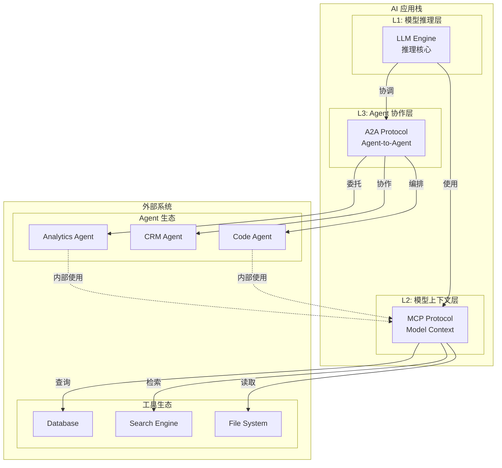
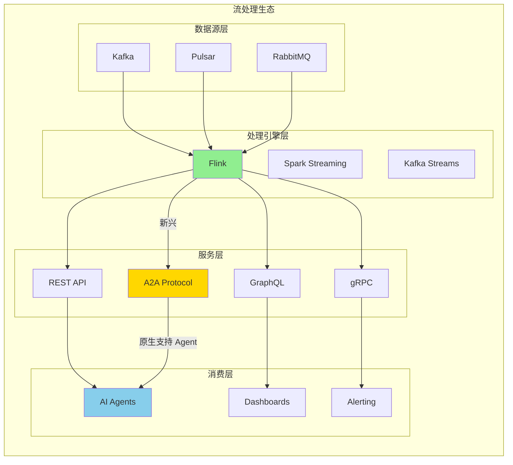
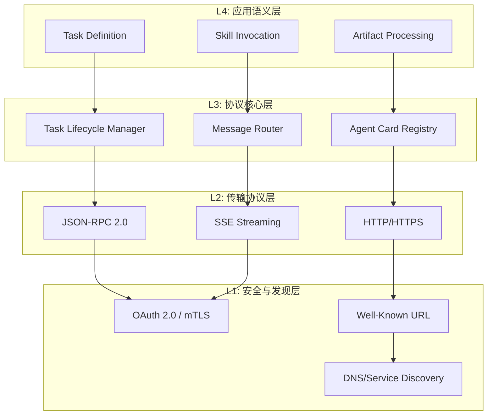
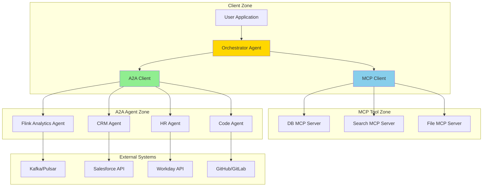
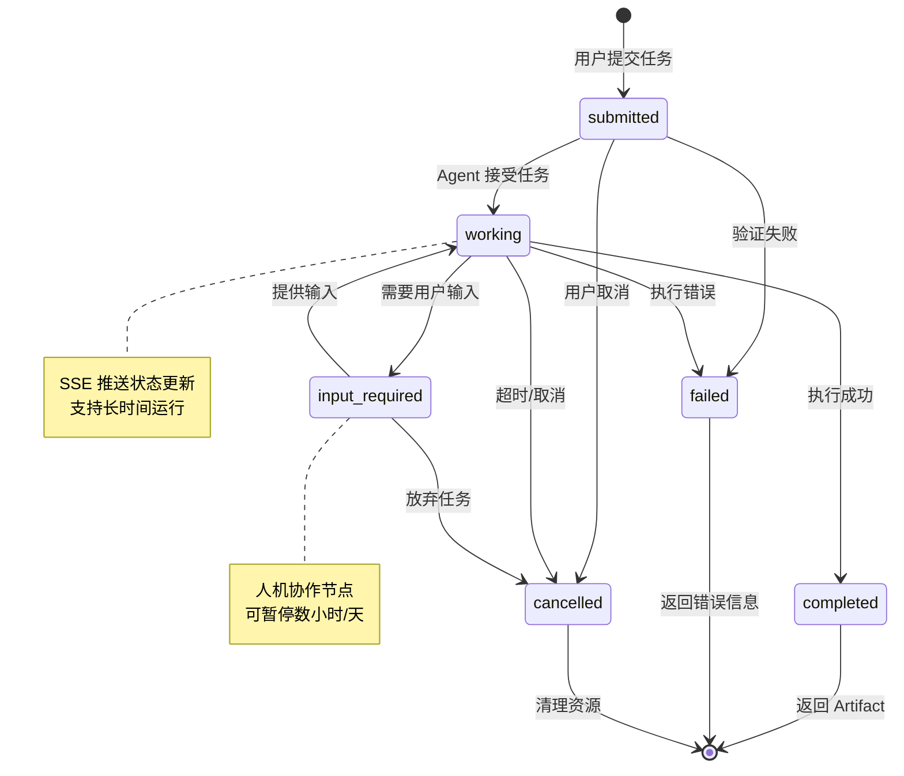
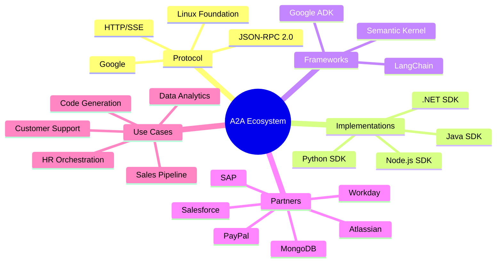
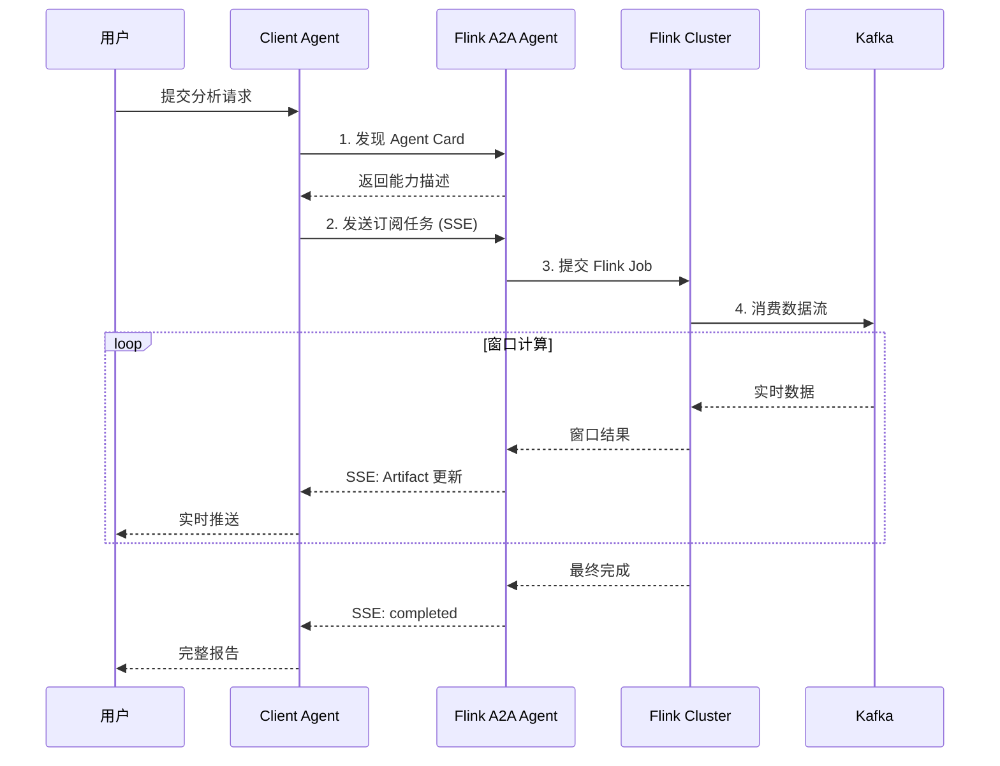

# Google A2A (Agent-to-Agent) 协议深度解析

> **状态**: ✅ 已发布 | **A2A v1.0**: 2026年初 GA | **最后更新**: 2026-04-15
>
> ✅ A2A v1.0 已于 2026 年初正式发布，获 150+ 组织支持，并集成至 Azure AI Foundry、Amazon Bedrock AgentCore。

> **所属阶段**: Knowledge/06-frontier | **前置依赖**: [MCP协议与流处理集成](mcp-protocol-agent-streaming.md), [A2A协议技术分析](a2a-protocol-agent-communication.md) | **形式化等级**: L3-L5

---

## 1. 概念定义 (Definitions)

### Def-K-06-240: Agent-to-Agent Protocol (A2A) - 形式化定义

**A2A** 是由 Google 于 2025年4月 发布的开放协议标准，**A2A v1.0** 于 2026 年初正式发布[^7]，现由 Linux Foundation 托管，旨在实现异构 AI Agent 之间的互操作协作。其形式化定义为：

$$
\text{A2A} \triangleq \langle \mathcal{A}, \mathcal{T}, \mathcal{M}, \mathcal{C}, \mathcal{S}, \mathcal{P} \rangle
$$

其中：

| 组件 | 符号 | 定义 | 职责 |
|------|------|------|------|
| **Agent 集合** | $\mathcal{A}$ | $\{a_1, a_2, ..., a_n\}$ | 协议参与者，含 Client Agent 与 Remote Agent |
| **任务空间** | $\mathcal{T}$ | $\{t \mid t = \langle id, state, payload \rangle\}$ | 具有生命周期的可执行工作单元 |
| **消息空间** | $\mathcal{M}$ | $\{m \mid m = \langle role, parts, metadata \rangle\}$ | Agent 间通信载体 |
| **能力声明** | $\mathcal{C}$ | $\{c \mid c = \langle skills, modes, auth \rangle\}$ | 通过 Agent Card 暴露的能力描述 |
| **安全机制** | $\mathcal{S}$ | $\langle AuthN, AuthZ, Enc, Audit \rangle$ | 认证、授权、加密、审计 |
| **协议原语** | $\mathcal{P}$ | $\{send, subscribe, cancel, update\}$ | 核心交互操作集合 |

**关键设计原则**：

1. **对等协作 (Peer-to-Peer)**: Agent 可同时扮演 Client 与 Server 角色
2. **模态无关 (Modality Agnostic)**: 支持文本、结构化数据、音视频流
3. **企业就绪 (Enterprise-Grade)**: 内置 OAuth 2.0、mTLS、审计日志
4. **签名身份验证 (Signed Agent Cards)**: A2A v1.0 引入加密签名的 Agent Card，防止能力声明篡改
5. **多租户 (Multi-tenancy)**: A2A v1.0 原生支持多租户隔离
6. **双协议绑定**: A2A v1.0 支持 gRPC + REST/JSON-RPC 两种传输
7. **版本协商**: A2A v1.0 提供向后兼容的协议版本协商
8. **长时任务支持**: Task 生命周期可跨越小时甚至天级别

---

### Def-K-06-241: Agent 拓扑与角色模型

**Agent 拓扑** 定义系统中 Agent 的排列与交互模式：

$$
\mathcal{G}_{agent} = \langle \mathcal{V}, \mathcal{E}, \mathcal{R} \rangle
$$

其中：

- $\mathcal{V} \subseteq \mathcal{A}$: Agent 节点集合
- $\mathcal{E} \subseteq \mathcal{V} \times \mathcal{V}$: A2A 通信边
- $\mathcal{R}: \mathcal{V} \rightarrow \{Client, Remote, Hybrid\}$: 角色映射函数

**角色定义**：

| 角色 | 职责 | 行为特征 |
|------|------|----------|
| **Client Agent** | 任务发起方 | 构造 Task、监听状态、聚合结果 |
| **Remote Agent** | 任务执行方 | 接收 Task、执行计算、产出 Artifact |
| **Hybrid Agent** | 双重角色 | 既可发起也可接收任务，实现级联协作 |

**拓扑模式**：

```
┌─────────────────────────────────────────────────────────────────┐
│                    星型拓扑 (Hub-Spoke)                          │
│                                                                 │
│                         ┌─────────┐                             │
│                         │Orchestrator                          │
│                         │  Agent  │                             │
│                         └───┬─────┘                             │
│                    ┌────────┼────────┐                          │
│                    ▼        ▼        ▼                          │
│              ┌─────────┐ ┌─────────┐ ┌─────────┐                │
│              │Remote A │ │Remote B │ │Remote C │                │
│              └─────────┘ └─────────┘ └─────────┘                │
│                                                                 │
│  适用场景: 中心化编排,如企业 workflow 协调                        │
└─────────────────────────────────────────────────────────────────┘

┌─────────────────────────────────────────────────────────────────┐
│                    网状拓扑 (Mesh)                               │
│                                                                 │
│                   ┌─────────┐                                   │
│                   │ Agent A │◄──────────────┐                   │
│                   └───┬───┬─┘               │                   │
│                       │   │                 │                   │
│                       ▼   ▼                 │                   │
│                 ┌─────────┐─────────┐       │                   │
│                 │ Agent B │ Agent C │       │                   │
│                 └───┬─────┴────┬────┘       │                   │
│                     │          │            │                   │
│                     ▼          ▼            │                   │
│                   ┌─────────┐  └────────►┌─────────┐            │
│                   │ Agent D │            │ Agent E │            │
│                   └─────────┘            └─────────┘            │
│                                                                 │
│  适用场景: 去中心化协作,如多 Agent 研究系统                        │
└─────────────────────────────────────────────────────────────────┘

┌─────────────────────────────────────────────────────────────────┐
│                    层级拓扑 (Hierarchical)                       │
│                                                                 │
│                         ┌─────────┐                             │
│                         │  L1:    │                             │
│                         │ Strategy│                             │
│                         └────┬────┘                             │
│                    ┌─────────┼─────────┐                        │
│                    ▼         ▼         ▼                        │
│              ┌─────────┐ ┌─────────┐ ┌─────────┐                │
│              │  L2:    │ │  L2:    │ │  L2:    │                │
│              │Planning │ │Planning │ │Planning │                │
│              └────┬────┘ └────┬────┘ └────┬────┘                │
│                   └───────────┼───────────┘                     │
│                               ▼                                 │
│                         ┌─────────┐                             │
│                         │  L3:    │                             │
│                         │Execution│                             │
│                         └─────────┘                             │
│                                                                 │
│  适用场景: 复杂任务分解,如多步推理与代码生成                      │
└─────────────────────────────────────────────────────────────────┘
```

---

### Def-K-06-242: Task 生命周期状态机

**Task 状态机** 形式化为一个有限自动机：

$$
\mathcal{M}_{task} = \langle Q, \Sigma, \delta, q_0, F \rangle
$$

其中：

- $Q = \{submitted, working, input\_required, completed, failed, cancelled\}$: 状态集合
- $\Sigma = \{submit, start, need\_input, provide\_input, complete, fail, cancel\}$: 事件字母表
- $\delta: Q \times \Sigma \rightarrow Q$: 状态转移函数
- $q_0 = submitted$: 初始状态
- $F = \{completed, failed, cancelled\}$: 终止状态集合

**状态转移图**：

```
                    ┌─────────────────────────────────────┐
                    │                                     │
                    ▼                                     │
┌──────────┐   submit    ┌─────────┐   start      ┌──────┴───┐
│  Start   │────────────►│submitted│─────────────►│ working  │
└──────────┘             └─────────┘              └────┬─────┘
                                                       │
           ┌───────────────────────────────────────────┼───┐
           │                                           │   │
           ▼                                           ▼   │
    ┌─────────────┐                           ┌──────────────┐
    │   failed    │◄──────────────────────────│ input_required│
    └──────┬──────┘         fail/complete     └──────┬───────┘
           │                                          │
           │              ┌──────────┐               │
           │              │completed │◄──────────────┘
           └─────────────►│  (final) │   provide_input
                         └──────────┘
                              ▲
                              │ complete
                         ┌────┴─────┐
                         │cancelled │◄──────────────────────┐
                         │ (final)  │                       │
                         └──────────┘                    cancel
```

**状态语义**：

| 状态 | 语义 | 停留时长 | 可转移事件 |
|------|------|----------|------------|
| `submitted` | 任务已创建，等待分配 | 毫秒-秒级 | start, cancel, fail |
| `working` | 正在执行中 | 秒-小时级 | complete, need_input, fail, cancel |
| `input_required` | 需要额外输入（人机协作节点） | 不确定（可暂停） | provide_input, cancel |
| `completed` | 成功完成，Artifact 可用 | 终止状态 | - |
| `failed` | 执行失败，含错误信息 | 终止状态 | - |
| `cancelled` | 已取消（用户或系统） | 终止状态 | - |

---

### Def-K-06-243: Agent Card - 能力描述本体

**Agent Card** 是 A2A 协议的核心发现机制，采用 JSON-LD 兼容的结构化描述：

$$
\text{AgentCard} \triangleq \langle Id, Meta, Caps, Auth, Skills, UI \rangle
$$

```typescript
interface AgentCard {
  // 标识层 (Identity)
  name: string;                    // 全局唯一标识
  description: string;             // 人类可读描述
  url: string;                     // A2A 端点地址
  version: string;                 // 语义化版本

  // 元数据层 (Metadata)
  provider: {
    organization: string;
    url: string;
    contact?: string;
  };
  documentationUrl?: string;

  // 能力层 (Capabilities)
  capabilities: {
    streaming: boolean;           // 是否支持 SSE 流式
    pushNotifications: boolean;   // 是否支持推送通知
    stateTransitionHistory: boolean; // 是否提供完整状态历史
  };

  // 安全层 (Security)
  authentication: {
    schemes: ("Bearer" | "OAuth2" | "ApiKey" | "mTLS")[];
    credentials?: string;         // 认证端点
  };

  // 模态层 (Modalities)
  defaultInputModes: string[];    // 默认输入 MIME types
  defaultOutputModes: string[];   // 默认输出 MIME types

  // 技能层 (Skills) - 核心
  skills: Skill[];

  // 体验层 (UX)
  uiHints?: UIHints;
}

interface Skill {
  id: string;                     // 技能标识
  name: string;                   // 显示名称
  description: string;            // 详细描述
  tags: string[];                 // 分类标签
  examples: string[];             // 调用示例(用于 LLM 理解)
  inputModes?: string[];          // 技能特定输入模态
  outputModes?: string[];         // 技能特定输出模态
  parameters?: JSONSchema;        // 输入参数 Schema
  returns?: JSONSchema;           // 返回 Schema
}
```

**Agent Card 发现流程**：

```
┌──────────────┐          ┌──────────────┐          ┌──────────────┐
│ Client Agent │          │  Well-Known  │          │Remote Agent  │
│              │          │   URL (.well-│          │              │
│              │          │  known/agent│          │              │
│              │          │   .json)     │          │              │
└──────┬───────┘          └──────┬───────┘          └──────┬───────┘
       │                         │                         │
       │  1. GET /.well-known/   │                         │
       │     agent.json          │                         │
       │────────────────────────►│                         │
       │                         │                         │
       │                         │  2. 返回 Agent Card     │
       │                         │◄────────────────────────│
       │                         │                         │
       │  3. Agent Card 响应     │                         │
       │◄────────────────────────│                         │
       │                         │                         │
       │  4. 解析能力并缓存      │                         │
       │                         │                         │
       │  5. 协商后发送 Task     │                         │
       │──────────────────────────────────────────────────►│
```

---

### Def-K-06-244: Artifact - 多模态产出物

**Artifact** 是 Task 完成后的产出，支持多模态、分块、流式传输：

$$
\text{Artifact} \triangleq \langle name, desc, parts, meta, stream\_ctrl \rangle
$$

**Part 类型系统**：

| Part 类型 | MIME 类型 | 用途 | 大小限制 |
|-----------|-----------|------|----------|
| `text` | `text/plain`, `text/markdown` | 纯文本输出 | 无限制（可分段） |
| `file` | `application/*`, `image/*` | 文件引用或内联 | 推荐 < 1MB（大文件用 URI） |
| `data` | `application/json` | 结构化数据 | 无限制 |
| `form` | `application/x-www-form` | 交互式表单 | 单个 Artifact |
| `iframe` | `text/html+iframe` | 嵌入式视图 | URI 引用 |

**流式 Artifact 协议**：

```typescript
interface StreamingArtifact {
  name: string;
  description?: string;
  parts: Part[];

  // 流式控制字段
  index: number;           // 分块序号,用于排序
  append: boolean;         // true = 追加到已有 Artifact
  lastChunk: boolean;      // true = 最后一块

  // 元数据
  metadata?: {
    contentType: string;
    encoding?: "base64" | "utf-8";
    totalChunks?: number;  // 预告总块数
    checksum?: string;     // 完整性校验
  };
}
```

**流式传输示例**（SSE）：

```http
HTTP/1.1 200 OK
Content-Type: text/event-stream
Cache-Control: no-cache
Connection: keep-alive

data: {"type": "status", "status": "working", "message": "开始生成报告"}

data: {"type": "artifact", "artifact": {"name": "report", "parts": [{"type": "text", "text": "# 分析报告\n\n"}], "index": 0, "append": false, "lastChunk": false}}

data: {"type": "artifact", "artifact": {"name": "report", "parts": [{"type": "text", "text": "## 第一部分:趋势分析\n..."}], "index": 1, "append": true, "lastChunk": false}}

data: {"type": "artifact", "artifact": {"name": "chart", "parts": [{"type": "file", "file": {"name": "chart.png", "mimeType": "image/png", "uri": "https://..."}}], "index": 0, "append": false, "lastChunk": false}}

data: {"type": "status", "status": "completed"}
```

---

## 2. 属性推导 (Properties)

### Lemma-K-06-230: A2A 协议分层延迟分解

**引理**: A2A 端到端延迟可分解为五个层次：

$$
L_{A2A} = L_{discovery} + L_{negotiation} + L_{queue} + L_{execution} + L_{streaming}
$$

**各层延迟特征**：

| 层次 | 符号 | 典型值 | 优化策略 | 影响因素 |
|------|------|--------|----------|----------|
| 发现层 | $L_{discovery}$ | 50-200ms | Agent Card 缓存 (TTL-based) | 网络延迟、DNS 解析 |
| 协商层 | $L_{negotiation}$ | 10-50ms | 能力预匹配、连接池 | TLS 握手、版本协商 |
| 队列层 | $L_{queue}$ | 0-∞ | 优先级调度、背压控制 | 系统负载、资源争用 |
| 执行层 | $L_{execution}$ | 变量 | 并行化、缓存、模型优化 | 任务复杂度、模型大小 |
| 流式层 | $L_{streaming}$ | 20-100ms | 压缩、批处理、增量更新 | 数据量、网络带宽 |

**边界条件**：

- **最小延迟**（简单查询）: $L_{min} \approx 100-300ms$
- **典型延迟**（标准任务）: $L_{typical} \approx 1-5s$
- **长时任务**（复杂分析）: $L_{long} \approx$ 分钟-小时级

---

### Prop-K-06-230: Agent Card 缓存一致性

**命题**: Agent Card 缓存策略需满足最终一致性：

$$
\forall t > t_{update}: \lim_{t \to \infty} P(Card_{cache} = Card_{origin}) = 1
$$

**缓存策略矩阵**：

| 场景 | TTL | 刷新策略 | 一致性模型 |
|------|-----|----------|------------|
| 稳定服务 | 1小时 | 懒加载 + 后台刷新 | 弱一致性 |
| 动态服务 | 5分钟 | 主动轮询 + 事件驱动 | 会话一致性 |
| 关键任务 | 1分钟 | 预检 + 短 TTL | 强一致性 |
| 开发测试 | 0（禁用） | 实时获取 | 强一致性 |

**缓存失效模式**：

```python
class AgentCardCache:
    """支持多层级失效策略的 Agent Card 缓存"""

    def __init__(self):
        self.cache: Dict[str, CacheEntry] = {}
        self.subscribers: Dict[str, List[Callable]] = {}

    async def get(self, agent_url: str, freshness: FreshnessLevel) -> AgentCard:
        """
        获取 Agent Card,根据新鲜度要求选择策略

        FreshnessLevel:
        - STRICT: 强制刷新,忽略缓存
        - BALANCED: 使用缓存,TTL 到期后刷新
        - RELAXED: 优先使用缓存,异步刷新
        """
        entry = self.cache.get(agent_url)

        if freshness == FreshnessLevel.STRICT:
            return await self._fetch_and_cache(agent_url)

        if entry and not entry.is_expired():
            if freshness == FreshnessLevel.RELAXED:
                # 异步刷新,立即返回缓存
                asyncio.create_task(self._refresh_if_needed(agent_url, entry))
                return entry.card
            return entry.card

        return await self._fetch_and_cache(agent_url)

    async def invalidate(self, agent_url: str, reason: InvalidationReason):
        """失效传播机制"""
        if agent_url in self.cache:
            del self.cache[agent_url]

        # 通知订阅者
        for callback in self.subscribers.get(agent_url, []):
            await callback(InvalidationEvent(agent_url, reason))
```

---

### Lemma-K-06-231: Task 并发与隔离性

**引理**: A2A Task 在并发场景下满足以下隔离级别：

$$
\text{Isolation}(t_i, t_j) =
\begin{cases}
\text{SERIALIZABLE} & \text{if } \text{Resource}(t_i) \cap \text{Resource}(t_j) = \emptyset \\
\text{READ_COMMITTED} & \text{if } \text{ReadSet}(t_i) \cap \text{WriteSet}(t_j) = \emptyset \\
\text{CONFLICT} & \text{otherwise}
\end{cases}
$$

**并发控制策略**：

| 策略 | 实现机制 | 适用场景 |
|------|----------|----------|
| **乐观锁** | ETag + 条件更新 | 读多写少、冲突概率低 |
| **悲观锁** | Task 级分布式锁 | 关键资源、高冲突概率 |
| **无锁** | 不可变 Artifact + 版本链 | 审计追踪、数据历史 |
| **事务编排** | Saga 模式 | 跨 Agent 长事务 |

---

### Prop-K-06-231: SSE 流式传输可靠性边界

**命题**: 使用 SSE (Server-Sent Events) 的 A2A 流式传输满足：

$$
P(\text{Message Loss}) \leq 1 - e^{-\lambda \cdot T_{reconnect}}
$$

其中：

- $\lambda$: 网络故障率
- $T_{reconnect}$: 重连超时时间

**可靠性增强机制**：

```
┌─────────────────────────────────────────────────────────────────┐
│                    SSE 可靠性协议栈                              │
├─────────────────────────────────────────────────────────────────┤
│  L4: 应用层                                                      │
│      - 消息序号 (sequence numbers)                               │
│      - 幂等去重 (idempotent deduplication)                       │
│      - 断点续传 (resume from last_ack)                          │
├─────────────────────────────────────────────────────────────────┤
│  L3: SSE 协议层                                                  │
│      - 自动重连 (EventSource.onerror → reconnect)                │
│      - Last-Event-ID 头                                          │
│      - 心跳保活 (heartbeat comments)                             │
├─────────────────────────────────────────────────────────────────┤
│  L2: HTTP 传输层                                                 │
│      - Keep-Alive 连接                                           │
│      - chunked transfer encoding                                 │
│      - 连接池复用                                                │
├─────────────────────────────────────────────────────────────────┤
│  L1: TCP 网络层                                                  │
│      - TCP 可靠传输                                              │
│      - 拥塞控制                                                  │
└─────────────────────────────────────────────────────────────────┘
```

---

## 3. 关系建立 (Relations)

### 3.1 A2A vs MCP: 架构层级对比

**核心差异矩阵**：

| 维度 | MCP (Model Context Protocol) | A2A (Agent-to-Agent Protocol) |
|------|------------------------------|-------------------------------|
| **抽象层级** | L2: 模型上下文层 | L3: Agent 协作层 |
| **通信范式** | Hub-and-Spoke（中心化） | Peer-to-Peer（对等） |
| **核心实体** | Resources, Tools, Prompts | Tasks, Messages, Artifacts |
| **状态模型** | 无状态（请求-响应） | 有状态（生命周期管理） |
| **发现机制** | 运行时能力协商 | 预声明 Agent Card |
| **交互时长** | 毫秒-秒级 | 毫秒-小时级 |
| **关系方向** | Agent → Tool（单向） | Agent ↔ Agent（双向） |
| **主要用途** | 工具集成、数据获取 | Agent 编排、工作流协作 |
| **发起方** | 单一 Host (AI 应用) | 任意 Agent |
| **复杂度** | 简单、轻量 | 丰富、完整 |

**互补关系图**：



**典型使用模式**：

```python
# 模式 1: 单一 Agent,MCP 增强能力
class SingleAgentWithTools:
    """客服 Agent:使用 MCP 访问工具,不使用 A2A"""

    async def handle(self, query: str):
        # 使用 MCP 获取上下文
        docs = await self.mcp.search(query)
        user_data = await self.mcp.query_db(user_id)

        # LLM 推理
        response = await self.llm.generate(query, context=docs + user_data)
        return response

# 模式 2: 多 Agent 协作,A2A + MCP
class MultiAgentOrchestrator:
    """招聘流程 Agent:A2A 协调多 Agent,每个 Agent 使用 MCP"""

    async def process_hiring(self, job_req: str):
        # A2A: 委托给 Specialist Agent
        candidates = await self.a2a.send_task(
            self.hr_agent_url,
            task={"action": "screen_candidates", "req": job_req}
        )

        # HR Agent 内部使用 MCP 访问 Workday
        # ...

        # A2A: 并行委托给多个 Agent
        results = await asyncio.gather(
            self.a2a.send_task(self.interview_agent, {...}),
            self.a2a.send_task(self.background_agent, {...})
        )

        return self.aggregate(results)

# 模式 3: 混合架构(推荐)
class HybridArchitecture:
    """完整示例:主 Agent 同时使用 A2A 和 MCP"""

    async def complex_workflow(self, user_request: str):
        # Step 1: MCP - 获取实时数据
        market_data = await self.mcp.query("market_db", "...")

        # Step 2: A2A - 委托给分析 Agent
        analysis = await self.a2a.send_task(
            self.analytics_agent,
            task={"data": market_data, "analysis_type": "trend"}
        )

        # Step 3: MCP - 获取知识库上下文
        kb_articles = await self.mcp.search(analysis.summary)

        # Step 4: LLM 综合生成
        final = await self.llm.generate(
            user_request,
            context={"analysis": analysis, "kb": kb_articles}
        )

        # Step 5: A2A - 委托给执行 Agent 完成操作
        await self.a2a.send_task(
            self.action_agent,
            task={"action": "execute_trade", "params": final.trade_params}
        )

        return final
```

---

### 3.2 A2A 在流处理生态中的定位

**流处理系统与 A2A 集成映射**：



**A2A 相对于传统 API 的优势（在 Agent 场景）**：

| 特性 | REST API | GraphQL | gRPC | A2A |
|------|----------|---------|------|-----|
| **Agent 发现** | 手动配置 | 手动配置 | 手动配置 | Agent Card 自动发现 |
| **能力协商** | OpenAPI 文档 | Schema 自省 | Protocol Buffers | 运行时能力匹配 |
| **长时任务** | 需轮询/回调 | 需轮询/回调 | 双向流 | 原生生命周期管理 |
| **流式推送** | WebSocket/SSE | Subscription | 双向流 | 原生 SSE 支持 |
| **人机协作** | 需自定义 | 需自定义 | 需自定义 | input_required 状态 |
| **多模态** | 需自定义 | 需自定义 | 需自定义 | 原生 Part 支持 |
| **跨组织** | API Key + OAuth | OAuth | mTLS | 企业级安全内建 |

---

### 3.3 A2A 协议与 Actor 模型的关系

**理论关联**：A2A 协议实现了 Actor 模型的分布式扩展：

$$
\text{A2A Agent} \cong \text{Actor} + \text{Enterprise Protocol Stack}
$$

**对比分析**：

| 特性 | Actor 模型 (Akka/Pekko) | A2A 协议 |
|------|-------------------------|----------|
| **消息传递** | 异步、无保证 | 异步、可靠（SSE + ACK） |
| **地址** | ActorRef | URL + Agent Card |
| **监督** | 父子监督树 | 外部编排器（可选） |
| **分布式** | 集群内透明 | 跨组织、跨云 |
| **类型安全** | 编译期 | Schema 运行时校验 |
| **容错** | 内建（Let-it-crash） | 需应用层实现 |
| **状态管理** | 内部状态 | Task 生命周期外化 |
| **发现** | 集群服务发现 | DNS + Well-Known URL |

**融合架构**（Flink + A2A + Actor）：

```
┌─────────────────────────────────────────────────────────────────┐
│                    融合架构:Flink-A2A-Actor                     │
├─────────────────────────────────────────────────────────────────┤
│                                                                 │
│  ┌─────────────┐         ┌─────────────┐         ┌───────────┐ │
│  │   Actor     │◄───────►│    A2A      │◄───────►│   Flink   │ │
│  │   System    │ 消息    │   Gateway   │  HTTP   │  Cluster  │ │
│  │             │         │             │         │           │ │
│  │ - 本地状态  │         │ - 协议转换  │         │ - 流处理  │ │
│  │ - 监督树    │         │ - 安全代理  │         │ - CEP     │ │
│  │ - 响应式    │         │ - 路由分发  │         │ - ML      │ │
│  └─────────────┘         └─────────────┘         └───────────┘ │
│                                                                 │
│  职责:快速响应            职责:跨域桥接          职责:重计算  │
│  延迟:< 10ms             延迟:< 100ms           延迟:可变    │
│                                                                 │
└─────────────────────────────────────────────────────────────────┘
```

---

## 4. 论证过程 (Argumentation)

### 4.1 A2A 协议设计原理分析

**设计原则溯源**：

A2A 协议的五大设计原则源于对企业级 Agent 系统的深度观察：

| 原则 | 问题来源 | 技术实现 | 受益方 |
|------|----------|----------|--------|
| **拥抱 Agentic 能力** | Agent 需要自主决策，非简单函数调用 | Task 状态机支持 input_required（人机协作节点） | 终端用户、业务系统 |
| **基于现有标准** | 避免引入新的学习成本和基础设施 | HTTP + JSON-RPC 2.0 + SSE | 开发团队、运维团队 |
| **默认安全** | 跨组织协作需要企业级安全保障 | OAuth 2.0 + mTLS + 审计 | 安全团队、合规部门 |
| **支持长时任务** | AI 任务可能需要数小时（如深度研究） | 异步 Task 生命周期 + SSE 推送 | 业务用户、系统架构师 |
| **模态无关** | 现实任务需要多模态交互 | Part 抽象支持文本/文件/数据/表单 | 产品团队、UX 设计师 |

**协议演进路线**：

```
2024 Q1-Q2: MCP 发布 (Anthropic)
    ↓
2024 Q3-Q4: Function Calling 标准化讨论
    ↓
2025 Q1: Google A2A 内部分析
    ↓
2025 April: A2A 初始发布 (Google Cloud Next)
    ↓
2025 Q2: Linux Foundation 托管,50+ 合作伙伴
    ↓
2026 Jan: A2A v1.0 正式发布
    ↓
2026 April: 150+ 组织支持,集成 Azure AI Foundry / Bedrock AgentCore
    ↓
2026+: 生态扩展 (LangChain, Semantic Kernel 集成)
```

---

### 4.2 A2A vs 传统工作流引擎对比

**工作流编排范式对比**：

| 特性 | 传统 BPMN 引擎 | 现代工作流 (Temporal/Cadence) | A2A Agent 编排 |
|------|---------------|------------------------------|----------------|
| **抽象单位** | 流程/任务 | Activity/Workflow | Agent/Task |
| **定义方式** | 可视化/XML 配置 | 代码 (DSL) | 运行时协商 |
| **参与者** | 预定义服务 | 预定义 Worker | 动态发现 Agent |
| **决策逻辑** | 规则引擎 | 代码逻辑 | LLM 推理 |
| **人机交互** | 人工任务节点 | 信号/查询 | input_required 状态 |
| **灵活性** | 低（需重新部署） | 中（代码变更） | 高（运行时适应） |
| **可解释性** | 高 | 中 | 中（需轨迹追踪） |
| **适用场景** | 结构化流程 | 可靠执行 | 探索性/创造性任务 |

**混合架构建议**：

```
┌─────────────────────────────────────────────────────────────────┐
│                    混合编排架构                                  │
├─────────────────────────────────────────────────────────────────┤
│                                                                 │
│   结构化部分                    探索性部分                       │
│   ┌─────────────┐              ┌─────────────┐                  │
│   │  Temporal   │              │   A2A       │                  │
│   │  Workflow   │◄────────────►│  Agent      │                  │
│   │             │   调用/回调  │  Network    │                  │
│   │ - 订单流程  │              │ - 动态决策  │                  │
│   │ - 支付状态  │              │ - LLM 推理  │                  │
│   │ - 补偿事务  │              │ - 多 Agent  │                  │
│   └─────────────┘              └─────────────┘                  │
│                                                                 │
│   优势:可靠性保证              优势:灵活自适应                  │
│   延迟:秒级                    延迟:秒-分钟级                   │
│                                                                 │
└─────────────────────────────────────────────────────────────────┘
```

---

### 4.3 A2A 协议的局限性与边界

**已知局限性**：

| 局限 | 说明 | 缓解策略 |
|------|------|----------|
| **协议成熟度** | v1.0 已于 2026 年初发布，获 150+ 组织支持 | 生产可用，重点关注 Signed Agent Cards 与多租户配置 |
| **生态碎片化** | 与 MCP 存在竞争/重叠 | 双协议支持，关注融合趋势 |
| **性能开销** | HTTP/JSON 相对于二进制协议 | 连接池、压缩、边缘缓存 |
| **状态一致性** | 分布式 Task 状态需应用层处理 | Saga 模式、事件溯源 |
| **调试复杂性** | 跨 Agent 追踪困难 | OpenTelemetry 集成、轨迹可视化 |
| **QoS 保证** | 协议层无内建 QoS | 应用层实现超时、重试、降级 |

**不适用场景**：

1. **超低延迟场景**（< 50ms）：使用 gRPC/本地调用
2. **批量数据处理**：使用 Spark/Flink 批处理
3. **强一致性事务**：使用传统数据库事务
4. **资源受限环境**（IoT 边缘）：使用 MQTT/CoAP

---

## 5. 形式证明 / 工程论证

### Thm-K-06-250: A2A 互操作性定理

**定理**: 符合 A2A 规范的两个 Agent $a_1$ 和 $a_2$ 能够成功协作：

$$
\forall a_1, a_2 \in \text{A2A}_{compliant}:
\text{Compatible}(\text{Card}(a_1), \text{Card}(a_2)) \Rightarrow
\Diamond \text{SuccessfulCollaboration}(a_1, a_2)
$$

**证明概要**：

1. **发现阶段**: $a_1$ 通过 Well-Known URL 获取 $a_2$ 的 Agent Card
2. **协商阶段**: $a_1$ 验证自身需求与 $a_2$ 能力的交集非空
3. **执行阶段**:
   - $a_1$ 构造符合 $a_2$ 输入模式的 Task
   - $a_2$ 接收 Task 并进入 working 状态
   - $a_2$ 通过 SSE 推送状态更新
   - $a_2$ 完成时提交 Artifact
4. **终止阶段**: Task 进入 completed 状态，协作完成

**兼容性判定**：

```typescript
function isCompatible(client: Agent, remote: AgentCard): boolean {
    // 1. 版本兼容
    if (!satisfiesSemver(client.supportedA2AVersion, remote.version)) {
        return false;
    }

    // 2. 认证兼容
    const commonAuth = intersect(client.authSchemes, remote.authentication.schemes);
    if (commonAuth.length === 0) {
        return false;
    }

    // 3. 技能匹配
    const requiredSkill = client.requiredSkill;
    const matchedSkill = remote.skills.find(s => s.id === requiredSkill.id);
    if (!matchedSkill) {
        return false;
    }

    // 4. 模态兼容
    const inputCompatible = intersect(client.outputModes, matchedSkill.inputModes).length > 0;
    const outputCompatible = intersect(client.inputModes, matchedSkill.outputModes).length > 0;

    return inputCompatible && outputCompatible;
}
```

---

### Thm-K-06-251: A2A + MCP 正交完备性定理

**定理**: A2A 与 MCP 在 Agent 系统架构中是正交且完备的：

$$
\forall \text{AgentSystem}: \text{Requires}(\text{A2A}) \lor \text{Requires}(\text{MCP}) \lor \text{Requires}(\text{Both}) \lor \text{Requires}(\text{Neither})
$$

**完备性证明**（场景覆盖）：

| 场景 | 所需协议 | 说明 |
|------|----------|------|
| 单一 Agent，无外部工具 | Neither | 纯 LLM 交互 |
| 单一 Agent，多工具集成 | MCP | 工具标准化访问 |
| 多 Agent 协作，无工具 | A2A | Agent 间协调 |
| 多 Agent 协作，各 Agent 有工具 | Both | A2A 协调 + MCP 工具 |

**正交性证明**（无功能重叠）：

$$
\text{Function}_{A2A} \cap \text{Function}_{MCP} = \emptyset
$$

- A2A 功能集: $\{TaskMgmt, AgentDiscovery, MultiAgentCoordination\}$
- MCP 功能集: $\{ToolInvocation, ContextRetrieval, ResourceAccess\}$

**交集为空**，故两协议正交。

---

### Thm-K-06-252: 流式 Task 完整性定理

**定理**: 在 SSE 传输下，分块 Artifact 可完整重组：

$$
\forall a \in \text{Artifacts}: \text{Streamed}(a) \Rightarrow \text{Reassembled}(\text{Chunks}(a)) = a
$$

**前提条件**：

1. SSE 连接保持有序（TCP 保证）
2. 每块包含唯一 `index`
3. 最后一块标记 `lastChunk: true`
4. 客户端实现排序缓冲

**重组算法**：

```python
class ArtifactReassembler:
    def __init__(self):
        self.buffers: Dict[str, Dict[int, Chunk]] = {}
        self.received_last: Dict[str, bool] = {}

    def on_chunk(self, chunk: ArtifactChunk) -> Optional[Artifact]:
        artifact_id = chunk.name

        # 初始化缓冲
        if artifact_id not in self.buffers:
            self.buffers[artifact_id] = {}

        # 存储块
        self.buffers[artifact_id][chunk.index] = chunk

        # 标记最后块
        if chunk.last_chunk:
            self.received_last[artifact_id] = True
            self.expected_count = chunk.index + 1

        # 检查是否完整
        if (artifact_id in self.received_last and
            len(self.buffers[artifact_id]) == self.expected_count):
            return self._reassemble(artifact_id)

        return None

    def _reassemble(self, artifact_id: str) -> Artifact:
        chunks = self.buffers[artifact_id]
        # 按 index 排序
        sorted_chunks = [chunks[i] for i in sorted(chunks.keys())]

        # 合并 parts
        all_parts = []
        for chunk in sorted_chunks:
            all_parts.extend(chunk.parts)

        # 清理
        del self.buffers[artifact_id]
        del self.received_last[artifact_id]

        return Artifact(
            name=artifact_id,
            parts=all_parts,
            metadata={"reassembled": True, "chunks": len(sorted_chunks)}
        )
```

---

## 6. 实例验证 (Examples)

### 6.1 A2A + Flink 流分析 Agent 完整实现

**场景**: 实时销售数据分析 Agent，支持流式推送分析结果

```python
# flink_a2a_analytics_agent.py
from flask import Flask, request, jsonify, Response
from pyflink.datastream import StreamExecutionEnvironment
from pyflink.table import StreamTableEnvironment
import json
import asyncio
from dataclasses import dataclass
from typing import AsyncIterator, Dict, Any
import uuid
from datetime import datetime

app = Flask(__name__)

# ============ Agent Card ============
AGENT_CARD = {
    "name": "FlinkRealtimeAnalyticsAgent",
    "description": "基于 Apache Flink 的实时流数据分析 Agent,支持窗口聚合、异常检测、趋势预测",
    "url": "https://analytics.example.com/a2a",
    "version": "1.0.0",
    "provider": {
        "organization": "DataFlow Corp",
        "url": "https://dataflow.example.com"
    },
    "capabilities": {
        "streaming": True,
        "pushNotifications": True,
        "stateTransitionHistory": True
    },
    "authentication": {
        "schemes": ["Bearer", "OAuth2"],
        "credentials": "https://auth.example.com/token"
    },
    "defaultInputModes": ["application/json"],
    "defaultOutputModes": ["application/json", "text/event-stream"],
    "skills": [
        {
            "id": "window_aggregation",
            "name": "窗口聚合分析",
            "description": "对指定数据流进行时间窗口聚合计算",
            "tags": ["analytics", "aggregation", "streaming"],
            "examples": [
                "分析过去1小时每5分钟的平均销售额",
                "统计实时用户活跃度(滑动窗口)"
            ],
            "inputModes": ["application/json"],
            "outputModes": ["text/event-stream", "application/json"]
        },
        {
            "id": "anomaly_detection",
            "name": "实时异常检测",
            "description": "使用统计方法和 ML 模型检测数据异常",
            "tags": ["anomaly", "ml", "monitoring"],
            "examples": [
                "检测交易金额异常波动",
                "识别系统性能指标的异常模式"
            ],
            "inputModes": ["application/json"],
            "outputModes": ["text/event-stream"]
        },
        {
            "id": "trend_forecast",
            "name": "趋势预测",
            "description": "基于历史数据预测未来趋势",
            "tags": ["forecast", "ml", "timeseries"],
            "examples": [
                "预测未来24小时的销售趋势",
                "预测服务器负载峰值"
            ],
            "inputModes": ["application/json"],
            "outputModes": ["application/json"]
        }
    ]
}

# ============ 路由 ============

@app.route("/.well-known/agent.json", methods=["GET"])
def agent_card():
    """Agent Card 发现端点"""
    return jsonify(AGENT_CARD)

@app.route("/a2a/tasks/send", methods=["POST"])
def send_task():
    """同步任务提交"""
    data = request.json
    task_id = data.get("id", str(uuid.uuid4()))
    message = data.get("message", {})

    # 提取技能调用
    skill_call = extract_skill_call(message)

    try:
        result = execute_sync_task(skill_call)
        return jsonify({
            "id": task_id,
            "status": "completed",
            "artifacts": [{
                "name": "result",
                "parts": [{"type": "data", "data": result}]
            }],
            "metadata": {
                "completedAt": datetime.utcnow().isoformat()
            }
        })
    except Exception as e:
        return jsonify({
            "id": task_id,
            "status": "failed",
            "error": {"message": str(e)}
        }), 500

@app.route("/a2a/tasks/sendSubscribe", methods=["POST"])
def send_subscribe():
    """流式任务提交(SSE)"""
    data = request.json
    task_id = data.get("id", str(uuid.uuid4()))
    message = data.get("message", {})

    skill_call = extract_skill_call(message)

    def generate():
        # 发送初始状态
        yield format_sse({
            "type": "status",
            "status": "working",
            "message": f"开始执行技能: {skill_call['skill']}"
        })

        try:
            # 执行流式任务
            for update in execute_streaming_task(skill_call):
                yield format_sse(update)

            # 发送完成状态
            yield format_sse({
                "type": "status",
                "status": "completed",
                "message": "任务完成"
            })

        except Exception as e:
            yield format_sse({
                "type": "status",
                "status": "failed",
                "error": str(e)
            })

    return Response(
        generate(),
        mimetype='text/event-stream',
        headers={
            'Cache-Control': 'no-cache',
            'Connection': 'keep-alive'
        }
    )

# ============ 任务执行 ============

def extract_skill_call(message: Dict) -> Dict:
    """从消息中提取技能调用"""
    parts = message.get("parts", [])
    for part in parts:
        if part.get("type") == "data":
            return part.get("data", {})
    raise ValueError("No skill call found in message")

def execute_sync_task(skill_call: Dict) -> Dict:
    """执行同步任务"""
    skill = skill_call.get("skill")
    params = skill_call.get("params", {})

    if skill == "trend_forecast":
        return execute_trend_forecast(params)
    elif skill == "window_aggregation":
        # 对于同步请求,只返回第一个窗口的结果
        result = next(execute_window_aggregation_stream(params))
        return result["artifact"]["parts"][0]["data"]
    else:
        raise ValueError(f"Unknown skill: {skill}")

def execute_streaming_task(skill_call: Dict) -> Iterator[Dict]:
    """执行流式任务,产生 SSE 事件"""
    skill = skill_call.get("skill")
    params = skill_call.get("params", {})

    if skill == "window_aggregation":
        yield from execute_window_aggregation_stream(params)
    elif skill == "anomaly_detection":
        yield from execute_anomaly_detection_stream(params)
    else:
        raise ValueError(f"Streaming not supported for skill: {skill}")

def execute_window_aggregation_stream(params: Dict) -> Iterator[Dict]:
    """流式窗口聚合"""
    table_name = params.get("table", "sales_events")
    window_minutes = params.get("window_minutes", 5)
    metric = params.get("metric", "SUM(amount)")

    # 初始化 Flink 环境
    env = StreamExecutionEnvironment.get_execution_environment()
    table_env = StreamTableEnvironment.create(env)

    # 模拟实时窗口结果(实际应连接 Kafka)
    for i in range(10):
        window_result = {
            "window_id": i,
            "window_start": f"2025-04-03T10:{i*window_minutes:02d}:00Z",
            "window_end": f"2025-04-03T10:{(i+1)*window_minutes:02d}:00Z",
            "metric_value": 1000 + i * 100 + (hash(i) % 200),
            "record_count": 50 + i * 5
        }

        yield {
            "type": "artifact",
            "artifact": {
                "name": "window_result",
                "parts": [{"type": "data", "data": window_result}],
                "index": i,
                "append": i > 0,
                "lastChunk": i == 9
            }
        }

        # 模拟处理延迟
        import time
        time.sleep(0.5)

def execute_anomaly_detection_stream(params: Dict) -> Iterator[Dict]:
    """流式异常检测"""
    source = params.get("source", "metrics_stream")
    threshold = params.get("threshold", 3.0)  # 标准差倍数

    # 模拟异常检测结果
    for i in range(20):
        is_anomaly = i % 7 == 0  # 模拟周期性异常

        if is_anomaly:
            yield {
                "type": "artifact",
                "artifact": {
                    "name": "anomaly_alert",
                    "parts": [{
                        "type": "data",
                        "data": {
                            "timestamp": datetime.utcnow().isoformat(),
                            "severity": "high",
                            "metric": "response_time",
                            "value": 5000 + i * 100,
                            "expected": 1000,
                            "deviation": 4.5
                        }
                    }],
                    "index": i,
                    "append": False,
                    "lastChunk": False
                }
            }

        import time
        time.sleep(0.3)

def execute_trend_forecast(params: Dict) -> Dict:
    """趋势预测(同步)"""
    historical_hours = params.get("historical_hours", 24)
    forecast_hours = params.get("forecast_hours", 6)

    # 模拟预测结果
    return {
        "historical": {
            "hours": historical_hours,
            "trend": "upward",
            "avg_value": 1250.5
        },
        "forecast": {
            "hours": forecast_hours,
            "predictions": [
                {"hour": i+1, "predicted": 1300 + i * 50, "confidence": 0.85}
                for i in range(forecast_hours)
            ]
        },
        "model": "linear_regression",
        "generated_at": datetime.utcnow().isoformat()
    }

def format_sse(data: Dict) -> str:
    """格式化 SSE 事件"""
    return f"data: {json.dumps(data)}\n\n"

# ============ 启动 ============
if __name__ == "__main__":
    app.run(host="0.0.0.0", port=8080, threaded=True)
```

---

### 6.2 A2A Client Agent 实现（支持多 Agent 编排）

```python
# multi_agent_orchestrator.py
import httpx
import json
import asyncio
from typing import List, Dict, Any, AsyncIterator, Optional
from dataclasses import dataclass
from enum import Enum
import uuid

class TaskStatus(Enum):
    SUBMITTED = "submitted"
    WORKING = "working"
    INPUT_REQUIRED = "input_required"
    COMPLETED = "completed"
    FAILED = "failed"
    CANCELLED = "cancelled"

@dataclass
class AgentCapability:
    """Agent 能力摘要"""
    url: str
    name: str
    skills: List[Dict]
    supports_streaming: bool
    auth_schemes: List[str]

@dataclass
class TaskResult:
    """任务执行结果"""
    task_id: str
    status: TaskStatus
    artifacts: List[Dict]
    error: Optional[str] = None

class A2AClient:
    """A2A 协议客户端实现"""

    def __init__(self, http_client: httpx.AsyncClient = None):
        self.http = http_client or httpx.AsyncClient(timeout=300.0)
        self._agent_cache: Dict[str, AgentCapability] = {}

    async def discover_agent(self, agent_url: str, use_cache: bool = True) -> AgentCapability:
        """发现并缓存 Agent Card"""
        if use_cache and agent_url in self._agent_cache:
            return self._agent_cache[agent_url]

        response = await self.http.get(f"{agent_url}/.well-known/agent.json")
        card = response.json()

        capability = AgentCapability(
            url=agent_url,
            name=card["name"],
            skills=card.get("skills", []),
            supports_streaming=card.get("capabilities", {}).get("streaming", False),
            auth_schemes=card.get("authentication", {}).get("schemes", [])
        )

        self._agent_cache[agent_url] = capability
        return capability

    async def send_task(
        self,
        agent_url: str,
        skill_id: str,
        params: Dict,
        task_id: str = None
    ) -> TaskResult:
        """同步发送任务"""
        task_id = task_id or str(uuid.uuid4())

        task = {
            "id": task_id,
            "message": {
                "role": "user",
                "parts": [{
                    "type": "data",
                    "data": {"skill": skill_id, "params": params}
                }]
            }
        }

        response = await self.http.post(
            f"{agent_url}/a2a/tasks/send",
            json=task
        )

        result = response.json()
        return TaskResult(
            task_id=result["id"],
            status=TaskStatus(result["status"]),
            artifacts=result.get("artifacts", []),
            error=result.get("error", {}).get("message")
        )

    async def send_subscribe(
        self,
        agent_url: str,
        skill_id: str,
        params: Dict,
        task_id: str = None
    ) -> AsyncIterator[Dict]:
        """流式订阅任务"""
        task_id = task_id or str(uuid.uuid4())

        task = {
            "id": task_id,
            "message": {
                "role": "user",
                "parts": [{
                    "type": "data",
                    "data": {"skill": skill_id, "params": params}
                }]
            }
        }

        async with self.http.stream(
            "POST",
            f"{agent_url}/a2a/tasks/sendSubscribe",
            json=task
        ) as response:
            async for line in response.aiter_lines():
                if line.startswith("data: "):
                    yield json.loads(line[6:])

    async def parallel_tasks(
        self,
        tasks: List[tuple[str, str, Dict]]  # [(url, skill, params), ...]
    ) -> List[TaskResult]:
        """并行执行多个任务"""
        coroutines = [
            self.send_task(url, skill, params)
            for url, skill, params in tasks
        ]
        return await asyncio.gather(*coroutines, return_exceptions=True)

class SalesAnalyticsOrchestrator:
    """销售分析编排器:协调多个 Specialist Agent"""

    def __init__(self):
        self.a2a = A2AClient()
        self.agents = {
            "flink_analytics": "https://flink-analytics.example.com",
            "crm_salesforce": "https://salesforce-agent.example.com",
            "inventory_sap": "https://sap-agent.example.com",
            "notification": "https://notification-agent.example.com"
        }

    async def comprehensive_sales_report(self, region: str, days: int = 30):
        """生成综合销售报告(多 Agent 协作)"""

        print(f"🚀 启动综合销售分析 - 区域: {region}, 时间范围: {days}天")

        # Phase 1: 并行获取多源数据
        print("\n📊 Phase 1: 并行数据收集...")

        parallel_tasks = [
            (self.agents["flink_analytics"], "trend_forecast", {
                "region": region,
                "historical_days": days,
                "forecast_days": 7
            }),
            (self.agents["crm_salesforce"], "get_pipeline", {
                "region": region,
                "stage": "all"
            }),
            (self.agents["inventory_sap"], "check_stock_levels", {
                "region": region,
                "threshold": "low"
            })
        ]

        results = await self.a2a.parallel_tasks(parallel_tasks)

        trend_result = results[0]
        pipeline_result = results[1]
        inventory_result = results[2]

        # Phase 2: 流式实时分析
        print("\n📈 Phase 2: 流式实时分析...")

        real_time_insights = []
        async for event in self.a2a.send_subscribe(
            self.agents["flink_analytics"],
            "window_aggregation",
            {
                "region": region,
                "window_minutes": 5,
                "metric": "SUM(revenue)"
            }
        ):
            if event.get("type") == "artifact":
                insight = event["artifact"]["parts"][0]["data"]
                real_time_insights.append(insight)
                print(f"  📍 实时洞察: {insight}")

                # 收集足够数据后提前终止
                if len(real_time_insights) >= 5:
                    break

            elif event.get("type") == "status":
                print(f"  ℹ️  任务状态: {event['status']}")

        # Phase 3: 综合分析与生成报告
        print("\n📝 Phase 3: 生成综合报告...")

        report = self._generate_report(
            trend_result=trend_result,
            pipeline_result=pipeline_result,
            inventory_result=inventory_result,
            real_time_insights=real_time_insights
        )

        # Phase 4: 发送通知
        print("\n📧 Phase 4: 发送报告通知...")

        await self.a2a.send_task(
            self.agents["notification"],
            "send_email",
            {
                "to": "sales-team@example.com",
                "subject": f"[{region}] 销售分析报告",
                "body": report["summary"],
                "attachment": report["full_report_url"]
            }
        )

        return report

    def _generate_report(self, **kwargs) -> Dict:
        """生成综合分析报告"""
        trend = kwargs["trend_result"]
        pipeline = kwargs["pipeline_result"]
        inventory = kwargs["inventory_result"]
        insights = kwargs["real_time_insights"]

        # 计算关键指标
        avg_real_time = sum(i["metric_value"] for i in insights) / len(insights)

        return {
            "summary": f"""
销售分析摘要:
- 预测趋势: {trend.artifacts[0]['parts'][0]['data']['historical']['trend']}
- 实时平均: ${avg_real_time:,.2f}
- 管道价值: ${pipeline.artifacts[0]['parts'][0]['data']['total_value']:,.2f}
- 低库存预警: {len(inventory.artifacts[0]['parts'][0]['data']['low_items'])} 项
            """.strip(),
            "trend_data": trend.artifacts,
            "pipeline_data": pipeline.artifacts,
            "inventory_data": inventory.artifacts,
            "real_time_insights": insights,
            "generated_at": "2025-04-03T12:00:00Z"
        }

# 使用示例
async def main():
    orchestrator = SalesAnalyticsOrchestrator()

    report = await orchestrator.comprehensive_sales_report(
        region="APAC",
        days=30
    )

    print("\n✅ 报告生成完成!")
    print(report["summary"])

if __name__ == "__main__":
    asyncio.run(main())
```

---

## 7. 可视化 (Visualizations)

### 7.1 A2A 协议分层架构全景图



### 7.2 A2A + MCP 混合架构部署图



### 7.3 A2A Task 生命周期与状态流转



### 7.4 A2A 生态系统与参与者



### 7.5 A2A 在流处理场景中的数据流



---

## 8. 引用参考 (References)

[^7]: Linux Foundation, "A2A Protocol Surpasses 150 Organizations, Lands in Major Cloud Platforms", 2026-04-09. https://www.linuxfoundation.org/press/a2a-protocol-surpasses-150-organizations-lands-in-major-cloud-platforms-and-sees-enterprise-production-use-in-first-year

---

## 附录: A2A 协议快速参考卡

### 核心端点

| 端点 | 方法 | 用途 |
|------|------|------|
| `/.well-known/agent.json` | GET | 发现 Agent Card |
| `/a2a/tasks/send` | POST | 同步发送任务 |
| `/a2a/tasks/sendSubscribe` | POST | 流式订阅任务 |
| `/a2a/tasks/{id}/cancel` | POST | 取消任务 |
| `/a2a/tasks/{id}` | GET | 查询任务状态 |

### Task 状态机

```
submitted → working → completed
     ↓           ↓          ↓
     └─────► failed/cancelled
```

### Part 类型速查

| Type | 用途 | 示例 |
|------|------|------|
| `text` | 纯文本 | 回复内容 |
| `file` | 文件 | PDF, 图片 |
| `data` | 结构化数据 | JSON |
| `form` | 交互表单 | 输入请求 |
| `iframe` | 嵌入内容 | Dashboard |

### 错误码

| 错误 | 说明 | 处理建议 |
|------|------|----------|
| `invalid_agent_card` | Agent Card 无效 | 检查 URL 和格式 |
| `skill_not_found` | 技能不存在 | 检查 skill id |
| `unsupported_mode` | 不支持的模态 | 检查 input/output modes |
| `authentication_failed` | 认证失败 | 检查 credentials |
| `task_timeout` | 任务超时 | 增加超时或拆分任务 |

---

*文档版本: 1.0.0 | 最后更新: 2025-04-03 | 兼容 A2A 协议版本: v1.0*
