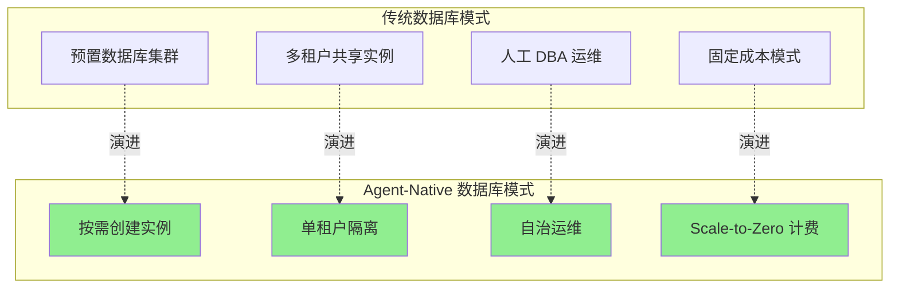
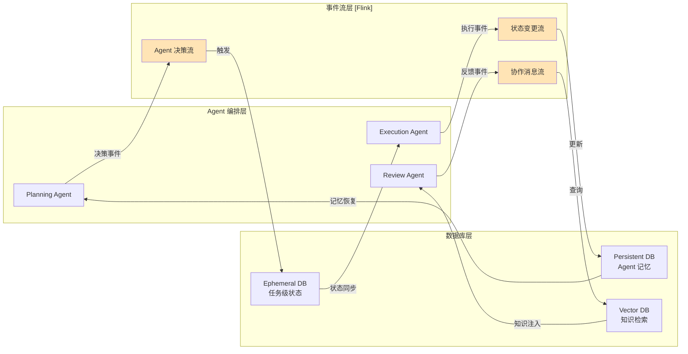
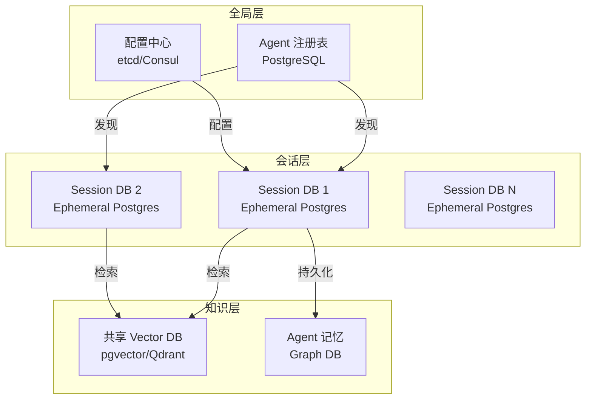
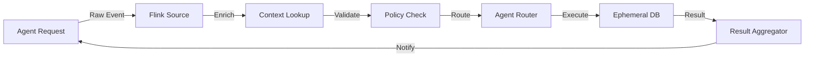
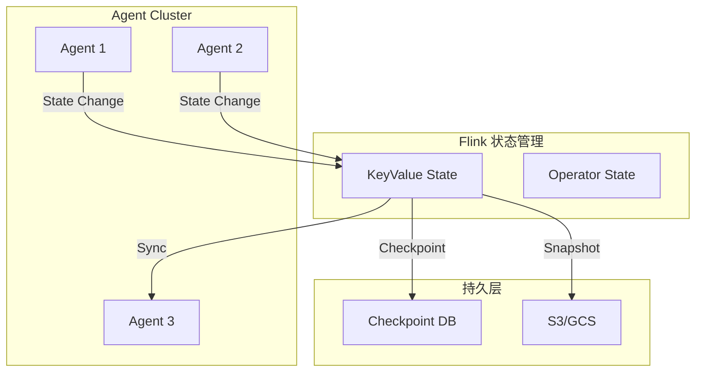
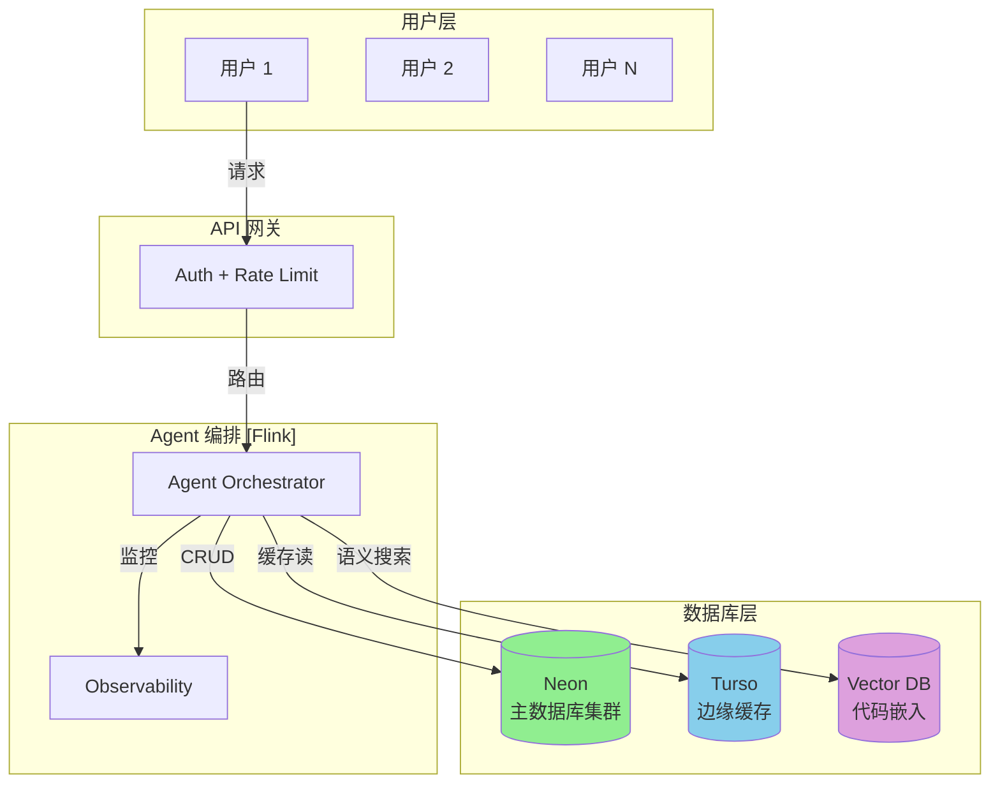
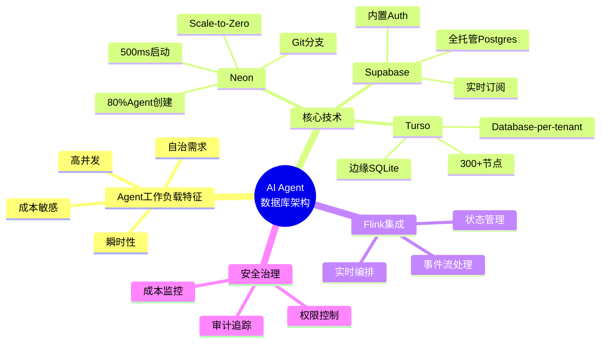
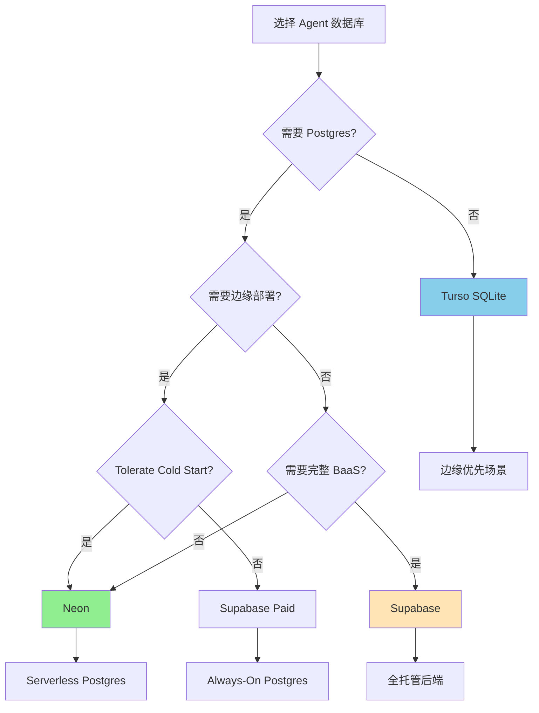
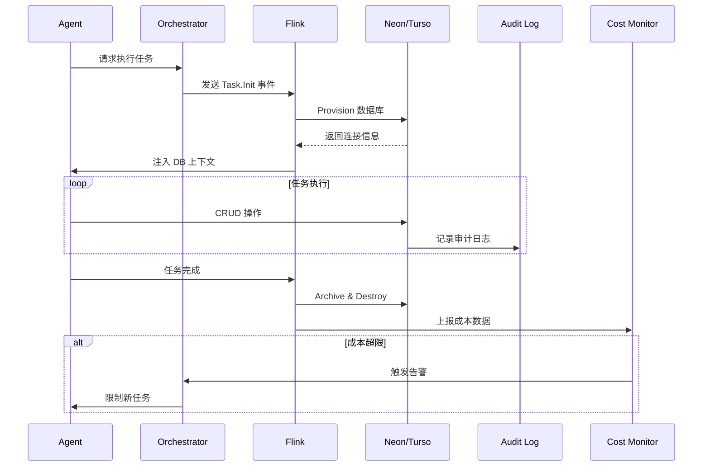

# AI Agent 数据库工作负载：前沿架构分析

> **所属阶段**: Knowledge/06-frontier | **前置依赖**: [04-technology-selection/database-selection-guide.md](../04-technology-selection/database-selection-guide.md), [Flink/03-flink-state-management.md](../../Flink/03-flink-state-management.md) | **形式化等级**: L3-L4

---

## 1. 概念定义 (Definitions)

### Def-K-06-50: Agent-Native Database (Agent原生数据库)

**定义**: Agent-Native Database 是指专为 AI Agent 工作负载设计的数据库系统，满足以下核心特征：

$$
\text{Agent-Native DB} \triangleq \langle D, O, P, C \rangle
$$

其中：

- $D$: 数据库实例集合，支持瞬时创建与销毁
- $O$: 操作原语集合，包含声明式 API 和事件驱动接口
- $P$: 性能约束，包含启动延迟 $T_{provision} < 1s$ 和扩展响应时间 $T_{scale} < 5s$
- $C$: 成本模型，支持 scale-to-zero 和按使用付费

### Def-K-06-51: Ephemeral Database Pattern (瞬态数据库模式)

**定义**: Ephemeral Database Pattern 是一种生命周期与单个 Agent 任务绑定的数据库使用模式：

$$
\text{Lifecycle}(DB_{ephemeral}) \subseteq \text{Lifecycle}(Task_{agent})
$$

**特征**:

1. **按需创建**: Agent 任务启动时自动 provision
2. **自动销毁**: 任务完成后自动释放资源
3. **状态隔离**: 每个任务拥有独立的数据库上下文
4. **成本归零**: 无活跃任务时成本趋近于零

### Def-K-06-52: Self-Driving Database Capability (自治数据库能力)

**定义**: Self-Driving Database Capability 是数据库系统自主管理其生命周期和资源配置的能力集合：

$$
\mathcal{SD} = \{ \text{AutoProvision}, \text{AutoScale}, \text{AutoOptimize}, \text{AutoHeal}, \text{AutoSecure} \}
$$

| 能力 | 描述 | Agent 场景需求 |
|------|------|----------------|
| AutoProvision | 自动创建数据库实例 | 瞬时响应 Agent 请求 |
| AutoScale | 自动扩缩容 | 匹配 Agent 工作负载波动 |
| AutoOptimize | 自动查询优化 | 无需人工 DBA 干预 |
| AutoHeal | 自动故障恢复 | Agent 无需处理数据库错误 |
| AutoSecure | 自动安全加固 | 权限最小化原则 |

---

## 2. 属性推导 (Properties)

### Prop-K-06-25: Agent 数据库启动延迟边界

**命题**: 对于满足 Agent-Native 标准的数据库系统，实例启动延迟 $T_{provision}$ 必须满足：

$$
T_{provision} < 1\text{秒} \quad \text{(硬约束)}
$$

$$
T_{provision} < 500\text{毫秒} \quad \text{(软目标)}
$$

**推导**: 根据 Neon 的公开数据[^1]，其可以在约 500 毫秒内完成 PostgreSQL 实例的 provision。对于 AI Agent 场景，每次 LLM 推理调用的典型延迟为 1-3 秒，数据库启动延迟必须与推理延迟同量级，否则会成为系统瓶颈。

### Prop-K-06-26: 并发数据库实例上限

**命题**: 单个 Agent 平台支持的并发数据库实例数 $N_{max}$ 与以下因素相关：

$$
N_{max} = \min\left( \frac{R_{total}}{R_{min}}, \frac{B_{total}}{B_{avg}}, I_{quota} \right)
$$

其中：

- $R_{total}$: 总可用计算资源
- $R_{min}$: 单个数据库最小资源需求
- $B_{total}$: 总预算上限
- $B_{avg}$: 平均单个数据库成本
- $I_{quota}$: 平台实例配额限制

**实例验证**: Neon 的 Agent Plan 支持数万到数十万级别的数据库实例管理[^1]，每个实例可以独立 scale-to-zero。

### Prop-K-06-27: Scale-to-Zero 成本节约率

**命题**: 对于典型的 Agent 工作负载（峰值利用率 < 20%），scale-to-zero 可实现的成本节约率为：

$$
\eta_{savings} = 1 - \frac{\int_{0}^{T} U(t) \cdot P_{active} \, dt}{T \cdot P_{provisioned}} > 70\%
$$

其中 $U(t)$ 为时间 $t$ 的资源利用率，$P_{active}$ 为活跃状态单价，$P_{provisioned}$ 为预置资源单价。

---

## 3. 关系建立 (Relations)

### 3.1 Agent-Native DB vs 传统数据库的对比关系



### 3.2 AI Agent 架构中的数据库与流处理关系



### 3.3 数据库选型决策矩阵

| 维度 | Neon | Turso | Supabase | 传统 RDS |
|------|------|-------|----------|----------|
| **启动延迟** | ~500ms [^1] | ~5ms [^2] | ~10-30s | 分钟级 |
| **Scale-to-Zero** | ✅ | ⚠️ (已弃用) [^2] | ✅ (免费版暂停) | ❌ |
| **分支能力** | Git-like 即时分支 | 每数据库分支 | 手动复制 | 快照恢复 |
| **边缘部署** | ❌ | ✅ 300+ 节点 [^2] | ❌ | ❌ |
| **Postgres 兼容** | ✅ | ❌ (SQLite) | ✅ | ✅ |
| **多租户模型** | Schema 级 | Database-per-tenant | Schema 级 | 实例级 |
| **免费层限制** | 0.5GB / 100 项目 | 9GB / 500 数据库 | 500MB / 2 项目 | 无 |
| **HTTP API** | ✅ | ✅ | ✅ | ❌ |

---

## 4. 论证过程 (Argumentation)

### 4.1 AI Agent 为何需要专用数据库模式的论证

**观察**: Neon 数据显示，80% 的数据库由 AI Agent 创建而非人类[^1]。

**论证**: 这一现象背后的根本原因在于 Agent 工作负载与传统应用的本质差异：

1. **生命周期错配**:
   - 传统应用: $T_{lifecycle} \approx$ 月/年级别
   - Agent 任务: $T_{lifecycle} \approx$ 秒/分钟级别

2. **实例数量级差异**:
   - 传统 SaaS: 1 应用 ≈ N 数据库 (N 较小)
   - Agent 平台: 1 平台 ≈ $10^4$-$10^6$ 数据库

3. **操作模式转变**:
   - 人类操作: 交互式、探索性、低频率
   - Agent 操作: 程序化、确定性、高频率

### 4.2 "Self-Driving" 从营销到现实的演进

**历史背景**: "Self-Driving Database" 概念最早由 Oracle Autonomous Database 于 2017 年提出，但当时主要是运维自动化。

**2026 现实**: Agent-Native 数据库实现了真正的自治：

| 能力层级 | 2017 状态 | 2026 状态 |
|----------|-----------|-----------|
| 自动扩缩容 | 基于规则 | 基于预测 + 即时响应 |
| 自动优化 | 统计建议 | 自动执行 |
| 自动创建 | ❌ | ✅ 瞬时创建 |
| 自动销毁 | ❌ | ✅ 任务绑定 |
| 成本控制 | ❌ | ✅ 按请求计费 |

### 4.3 Serverless 数据库的冷启动问题分析

**Thm-K-06-25: Scale-to-Zero 延迟权衡定理**

**定理**: 对于 serverless 数据库，存在以下不可能三角：

$$
\text{低成本} + \text{低延迟} + \text{持久连接} = \text{不可能同时满足}
$$

**证明**:

- 要实现低成本，必须 scale-to-zero（释放资源）
- 释放资源后，新请求需要重新初始化（冷启动）
- 冷启动必然引入延迟（网络连接 + 进程启动 + 状态恢复）
- 要保持持久连接，资源必须持续占用（高成本）

**推论**: Neon 的 ~500ms 冷启动是在成本和延迟之间的工程平衡点[^1]。

---

## 5. 形式证明 / 工程论证 (Engineering Argument)

### 5.1 多 Agent 系统数据库架构设计原则

**设计原则 1: 分层状态隔离**



**设计原则 2: 事件驱动的数据库生命周期**

```
Agent 任务启动
    ↓
Event: Task.Init → Flink 处理
    ↓
Action: Provision DB (Neon API)
    ↓
State: DB.Ready → 注入 Agent Context
    ↓
Agent 执行任务
    ↓
Event: Task.Complete
    ↓
Action: Archive & Destroy DB
    ↓
State: Cost = 0
```

**设计原则 3: 速率限制与成本防护**

```yaml
# Neon Agent Plan 资源限制示例
rate_limits:
  databases_per_minute: 100
  compute_hours_per_day: 1000
  storage_gb_max: 100

cost_controls:
  daily_budget_limit: $50
  alert_threshold: 80%
  auto_suspend: true
```

### 5.2 Flink 在 AI Agent 架构中的集成模式

**模式 1: Agent 决策管道 (Decision Pipeline)**



**模式 2: 多 Agent 状态同步**



**模式 3: Agent 间事件流**

| 事件类型 | Flink 角色 | 数据库交互 |
|----------|------------|------------|
| Task 创建 | 路由分发 | Provision DB |
| 状态变更 | 流处理 | Update State |
| 协作请求 | 消息广播 | Query Context |
| 结果聚合 | 窗口计算 | Write Results |
| 任务完成 | 清理触发 | Archive & Drop |

### 5.3 成本模型对比分析

**场景**: 10,000 个 Agent，每个每天平均活跃 10 分钟

| 方案 | 计算成本/天 | 存储成本/月 | 总成本/月 |
|------|-------------|-------------|-----------|
| **传统 RDS** (t3.medium x 100) | $96/day | $200 | ~$3,080 |
| **Neon Serverless** | $8/day [^1] | $50 | ~$290 |
| **Turso Edge** | $0.5/day [^2] | $20 | ~$35 |
| **Supabase** | $10/day | $25 | ~$325 |

**结论**: Serverless 数据库在 Agent 场景下可实现 10-100 倍的成本节约。

---

## 6. 实例验证 (Examples)

### 6.1 多 Agent SaaS 平台数据库架构

**场景**: AI 代码生成平台，支持每个用户拥有独立 Agent 实例



**实现要点**:

1. **用户隔离**: 每个用户的 Agent 会话使用独立的数据库分支
2. **边缘加速**: Turso 缓存热点查询结果
3. **语义检索**: pgvector 存储代码嵌入向量
4. **成本优化**: Neon scale-to-zero + Turso 免费层

### 6.2 Agent 创建数据库的代码示例

```typescript
// Neon Agent Plan API 示例
import { neon } from '@neondatabase/serverless';

class AgentDatabaseManager {
  private neonClient: typeof neon;

  async provisionDatabase(agentId: string, taskId: string): Promise<DatabaseConfig> {
    // 1. 创建瞬态数据库
    const db = await this.neonClient`
      SELECT create_database(
        name => ${`agent-${agentId}-${taskId}`},
        owner => 'agent_service',
        template => 'agent_template'
      )
    `;

    // 2. 设置自动销毁 TTL
    await this.neonClient`
      SELECT set_database_ttl(
        database_id => ${db.id},
        ttl_minutes => 60
      )
    `;

    // 3. 应用资源限制
    await this.neonClient`
      ALTER DATABASE ${db.name}
      SET max_connections = 10;
      SET shared_buffers = '128MB';
    `;

    return {
      connectionString: db.connection_string,
      expiresAt: new Date(Date.now() + 60 * 60 * 1000)
    };
  }

  async archiveAndDestroy(databaseId: string, agentId: string): Promise<void> {
    // 归档重要状态到持久存储
    await this.archiveState(databaseId, agentId);
    // 销毁瞬态数据库
    await this.neonClient`DROP DATABASE IF EXISTS ${databaseId}`;
  }
}
```

### 6.3 Flink + Agent 数据库集成示例

```java
// Flink 作业：Agent 任务编排与数据库生命周期管理
public class AgentOrchestrationJob {

    public static void main(String[] args) throws Exception {
        StreamExecutionEnvironment env = StreamExecutionEnvironment.getExecutionEnvironment();

        // 数据源：Agent 任务事件
        DataStream<AgentTaskEvent> taskStream = env
            .addSource(new AgentTaskSource())
            .keyBy(AgentTaskEvent::getAgentId);

        // 处理：数据库生命周期管理
        DataStream<TaskResult> results = taskStream
            .process(new RichProcessFunction<>() {
                private transient NeonDatabaseClient dbClient;

                @Override
                public void open(Configuration parameters) {
                    dbClient = new NeonDatabaseClient(
                        System.getenv("NEON_API_KEY")
                    );
                }

                @Override
                public void processElement(
                    AgentTaskEvent event,
                    Context ctx,
                    Collector<TaskResult> out
                ) throws Exception {
                    // 1. 为任务创建瞬态数据库
                    DatabaseInstance db = dbClient.provision(
                        event.getTaskId(),
                        ResourceLimits.builder()
                            .maxComputeUnits(0.25)
                            .maxStorageGB(1)
                            .ttlMinutes(event.getExpectedDuration() * 2)
                            .build()
                    );

                    // 2. 将连接信息注入 Agent 上下文
                    AgentContext context = AgentContext.builder()
                        .databaseUrl(db.getConnectionString())
                        .task(event)
                        .build();

                    // 3. 执行 Agent 任务
                    TaskResult result = executeAgentTask(context);

                    // 4. 归档并清理
                    dbClient.archiveAndDestroy(db.getId());

                    out.collect(result);
                }
            });

        // 输出到下游系统
        results.addSink(new ResultSink());

        env.execute("Agent Database Orchestration");
    }
}
```

---

## 7. 可视化 (Visualizations)

### 7.1 AI Agent 数据库架构全景图



### 7.2 数据库选型决策树



### 7.3 Agent 数据库治理流程



### 7.4 2026 AI Agent 数据库趋势雷达

```mermaid
radarChart
    title AI Agent Database Capability Radar (2026)
    axis Startup Latency, Scale-to-Zero, Branching, Edge Deploy, Cost Efficiency, Multi-Tenant

    "Neon" : 90, 95, 95, 20, 90, 70
    "Turso" : 95, 40, 80, 95, 95, 95
    "Supabase" : 50, 60, 60, 30, 75, 70
    "Traditional RDS" : 20, 10, 40, 30, 30, 60
```

---

## 8. 引用参考 (References)

[^1]: Neon, "Neon for AI Agent Platforms", 2025. <https://neon.com/use-cases/ai-agents>

[^2]: Turso Documentation, "Turso Pricing and Plans", 2026. <https://turso.tech/pricing>


---

## 附录：关键术语速查

| 术语 | 定义 | 相关概念 |
|------|------|----------|
| **Agent-Native DB** | 专为 AI Agent 设计的数据库模式 | Ephemeral DB, Self-Driving |
| **Scale-to-Zero** | 无负载时资源归零的能力 | Serverless, Cost Optimization |
| **Cold Start** | 从零启动实例的延迟 | Provisioning Latency |
| **Database Branching** | 类似 Git 的数据库分支能力 | Neon, Copy-on-Write |
| **Ephemeral DB** | 生命周期绑定的瞬态数据库 | Task-Scoped Database |
| **Database-per-Tenant** | 每个租户独立数据库的隔离模式 | Multi-Tenancy |

---

*文档版本: v1.0 | 创建日期: 2026-04-02 | 状态: Active*
