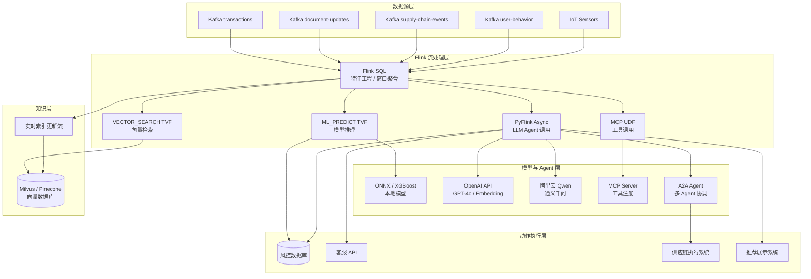
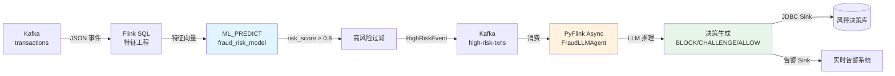
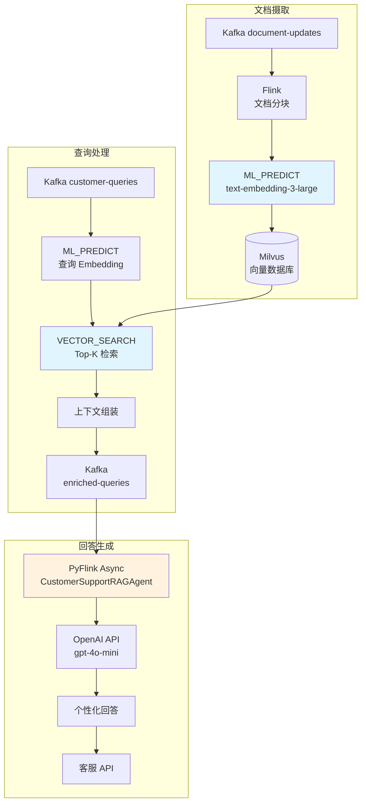
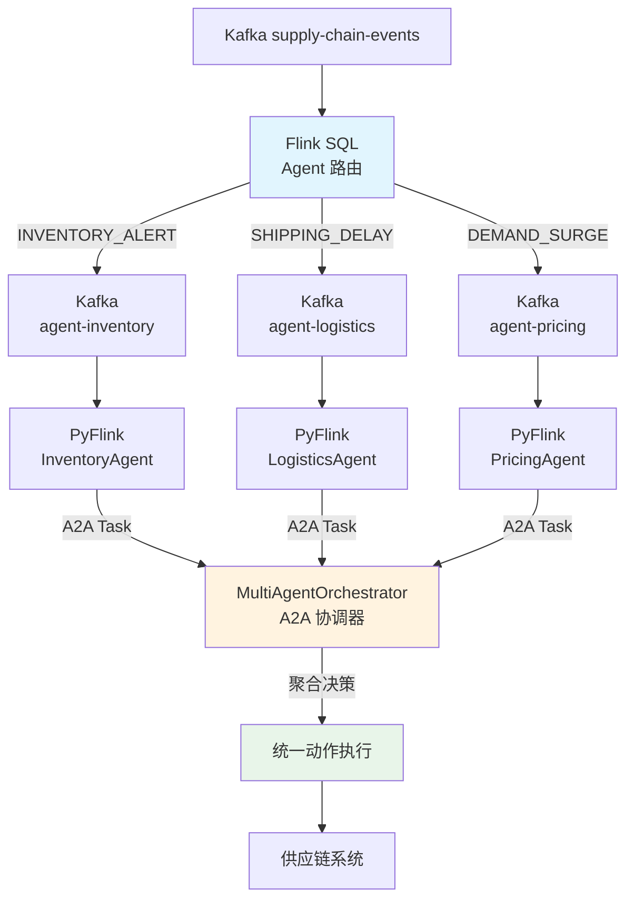
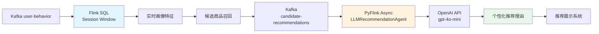
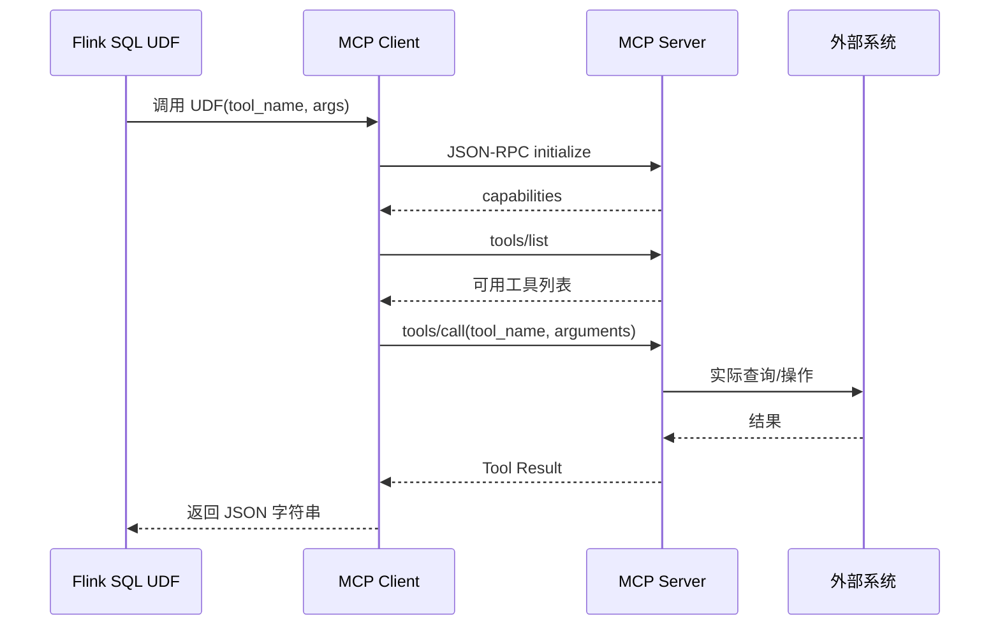
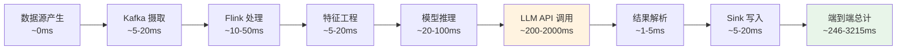

# AI Agent 与 Flink 流式管道端到端架构指南

> 所属阶段: Knowledge/ | 前置依赖: [Knowledge/06-frontier/ai-agent-streaming-architecture.md](./ai-agent-streaming-architecture.md), [Flink/06-ai-ml/flink-ai-ml-integration-complete-guide.md](../../Flink/06-ai-ml/flink-ai-ml-integration-complete-guide.md), [Flink/03-api/flink-python-async-datastream.md](../../Flink/03-api/09-language-foundations/pyflink-async-functions-guide.md) | 形式化等级: L3-L5

---

## 目录

- [1. 概念定义 (Definitions)](#1-概念定义-definitions)
- [2. 属性推导 (Properties)](#2-属性推导-properties)
- [3. 关系建立 (Relations)](#3-关系建立-relations)
- [4. 论证过程 (Argumentation)](#4-论证过程-argumentation)
- [5. 形式证明 / 工程论证 (Proof / Engineering Argument)](#5-形式证明-工程论证-proof-engineering-argument)
- [6. 实例验证 (Examples)](#6-实例验证-examples)
- [7. 可视化 (Visualizations)](#7-可视化-visualizations)
- [8. 引用参考 (References)](#8-引用参考-references)

---

## 1. 概念定义 (Definitions)

### Def-K-06-01: AI Agent 流式推理管道 (AI Agent Streaming Inference Pipeline)

AI Agent 流式推理管道是指将流计算引擎（Apache Flink）与大型语言模型（LLM）、向量数据库及 Agent 协议（MCP、A2A）深度集成，形成从**原始数据摄取 → 实时特征处理 → AI 推理/决策 → 动作执行**的完整闭环系统。

形式化地，该管道可表示为一个六元组：

$$\mathcal{P} = (S, F, \mathcal{M}, \mathcal{A}, \mathcal{K}, \mathcal{A}c)$$

其中：

- $S$：数据源集合（Kafka、Pulsar、IoT Hub 等）
- $F$：Flink 处理引擎，负责流式转换与状态管理
- $\mathcal{M}$：模型层（ML_PREDICT TVF、Model DDL、外部 LLM API）
- $\mathcal{A}$：Agent 层（MCP 工具注册、A2A 消息协议、ReAct 推理循环）
- $\mathcal{K}$：知识层（向量数据库、实时 RAG 索引、Streaming RAG 更新流）
- $\mathcal{A}c$：动作层（Sink 到业务系统、API 调用、告警、反向控制）

### Def-K-06-02: ML_PREDICT 表值函数 (Model Inference TVF)

`ML_PREDICT` 是 Flink SQL 的**表值函数（Table-Valued Function, TVF）**，允许在 SQL 查询中直接对注册模型进行推理。其签名形式为：

```sql
SELECT * FROM ML_PREDICT(
  MODEL `model_name`,
  TABLE input_table,
  DESCRIPTOR(time_col)
)
```

该函数将输入表的每一行映射为模型输出张量，支持**逐行推理（row-at-a-time）**和**微批推理（micro-batch）**两种模式。在流式场景下，`DESCRIPTOR(time_col)` 用于对齐 Watermark，保证推理结果按事件时间输出。

### Def-K-06-03: Model DDL 声明式模型管理

Model DDL 是 Flink SQL 对 AI 模型的**一等公民抽象**，通过 `CREATE MODEL` 语句将模型元数据（类型、输入/输出 Schema、服务端点）注册到 Flink Catalog 中。其形式化定义为：

```sql
CREATE MODEL model_name
INPUT (feature1 DOUBLE, feature2 STRING, ...)
OUTPUT (prediction DOUBLE, probability ARRAY<DOUBLE>)
WITH (
  'connector' = 'openai',
  'openai.model' = 'gpt-4o',
  'openai.api_key' = '${OPENAI_API_KEY}',
  'openai.max_tokens' = '256',
  'openai.temperature' = '0.1'
)
```

注册后的模型可被 `ML_PREDICT` 引用，实现**推理逻辑与业务 SQL 的解耦**。

### Def-K-06-04: Python Async DataStream API

Python Async DataStream API 是 Flink 在 PyFlink 中提供的**异步非阻塞算子接口**，允许在 DataStream 处理中发起外部 I/O 调用（如 LLM API 请求）而不阻塞 Subtask 线程。

核心抽象为 `AsyncFunction`：

```python
class AsyncLLMFunction(AsyncFunction):
    async def async_invoke(self, input_record, result_future):
        response = await self.llm_client.acomplete(input_record.prompt)
        result_future.complete([response])
```

通过设置 `AsyncDataStream.unordered_wait()` 或 `ordered_wait()`，可控制输出顺序与最大并发请求数。

### Def-K-06-05: MCP (Model Context Protocol)

MCP 是由 Anthropic 于 2024 年 11 月提出的**开放协议标准**，用于标准化 LLM 应用与外部数据源、工具之间的集成。截至 2026 年 4 月，MCP 生态已达到：

- PyPI `mcp` 包下载量：~97M
- 社区 MCP 服务器数量：5,800+
- 支持运行时：Claude Desktop、Cursor、Windsurf、Cline、Kimi 等

MCP 的核心组件包括：

- **Server**：暴露资源（Resource）、工具（Tool）、提示（Prompt）
- **Client**：向 LLM 提供上下文，管理工具调用生命周期
- **Transport**：基于 stdio 或 SSE（Server-Sent Events）的 JSON-RPC 2.0 通信

### Def-K-06-06: A2A (Agent-to-Agent) 协议

A2A 是 Google 于 2025 年 4 月发布的**Agent 间互操作协议**，旨在解决多 Agent 系统的通信标准问题。A2A 基于 HTTP + JSON-RPC，定义了 Agent 之间的任务委托、能力发现与消息传递机制。

A2A 核心原语：

- **Agent Card**：JSON 格式的 Agent 能力描述（技能、端点、认证方式）
- **Task**：Agent 间任务委托的顶层对象，包含输入/输出 Artifact
- **Message**：任务内部的对话消息流
- **Stream**：基于 SSE 的实时推送通道

### Def-K-06-07: Streaming RAG (Real-time Retrieval-Augmented Generation)

Streaming RAG 是指**知识库随数据流实时更新**的 RAG 架构。传统 RAG 的索引是静态或准静态的，而 Streaming RAG 通过 Flink 流处理管道实现：

1. 文档/事件流进入 Flink
2. Flink 调用 Embedding 模型生成向量
3. 向量实时写入向量数据库（如 Milvus、Pinecone、阿里云向量检索服务）
4. 查询流通过 `VECTOR_SEARCH` TVF 检索最新知识片段

形式化地，Streaming RAG 的知识库 $K$ 是一个时变集合：

$$K(t) = K(t_0) \cup \bigcup_{\tau \in [t_0, t]} \{ \text{Embed}(d_\tau) \mid d_\tau \in \text{Stream}(\tau) \}$$

其中 $\text{Embed}(\cdot)$ 为嵌入函数，$d_\tau$ 为时间 $\tau$ 到达的文档/事件。

### Def-K-06-08: 多模态 AI 函数 (Multimodal AI Functions)

多模态 AI 函数是阿里云实时计算 Flink 版提供的**内置 SQL 函数**，支持在流式 SQL 中直接处理图像、PDF 等非结构化数据：

- `PDF_TO_IMAGE`：将 PDF 文档流转换为图像序列
- `VL_MODEL`：调用视觉语言模型（VLM）进行图像理解与描述
- `IMAGE_EMBEDDING`：生成图像向量用于相似性检索

这些函数使得 Flink SQL 能够原生处理多模态数据流，无需外部 ETL 管道。

---

## 2. 属性推导 (Properties)

### Lemma-K-06-01: 流式推理的端到端延迟下界

设数据源产生事件的间隔为 $\Delta t_{source}$，Flink 处理延迟为 $\Delta t_{flink}$，模型推理延迟为 $\Delta t_{infer}$，网络传输延迟为 $\Delta t_{net}$，则端到端延迟满足：

$$L_{e2e} \geq \Delta t_{source} + \Delta t_{flink} + \Delta t_{infer} + \Delta t_{net}$$

在异步推理模式下，由于并发请求的重叠执行，实际每事件平均延迟可接近：

$$\bar{L}_{e2e}^{async} \approx \Delta t_{source} + \Delta t_{flink} + \frac{\Delta t_{infer}}{C} + \Delta t_{net}$$

其中 $C$ 为并发度（`capacity` 参数）。当 $C \geq \frac{\Delta t_{infer}}{\Delta t_{source}}$ 时，推理不再是瓶颈。

### Lemma-K-06-02: Streaming RAG 的知识新鲜度保证

设文档流到达率为 $\lambda$（文档/秒），Embedding 生成延迟为 $l_e$，向量数据库写入延迟为 $l_v$，则知识库的最大陈旧时间（staleness）为：

$$T_{stale} = l_e + l_v + \frac{1}{\mu - \lambda}$$

其中 $\mu$ 为 Flink 管道的处理能力（文档/秒）。为保证 $T_{stale} < T_{target}$，必须满足：

$$\mu > \lambda + \frac{1}{T_{target} - l_e - l_v}$$

### Lemma-K-06-03: MCP 工具调用的幂等性约束

在流式场景下，MCP 工具可能因 Flink 的 **exactly-once checkpoint** 机制而被重复调用。若工具操作具有副作用（如数据库写入、API 调用），则必须满足：

$$\forall t \in \text{ToolSet}: \quad t(s) = t(t(s))$$

即工具在相同输入下必须是幂等的。对于非幂等操作，需在外部系统（如 Sink 端）实现去重机制（如幂等键、事务写入）。

### Prop-K-06-01: Agent 推理的语义一致性

当 Flink 将事件路由到不同 Agent 时，必须保证**因果关系保留（causal delivery）**。设事件 $e_1$ 因果先于 $e_2$（$e_1 \prec e_2$），则同一 Agent 实例对 $e_1$ 的处理结果必须在 $e_2$ 之前被下游消费。

Flink 的 **KeyedStream** 机制天然满足此属性：对 `agent_id` 分区后，同一 Key 的所有事件由同一 Subtask 按事件时间顺序处理。

### Prop-K-06-02: 模型缓存的命中率与成本优化

设请求分布服从 Zipf 分布（参数 $s$），缓存大小为 $N$，总唯一输入数为 $M$，则缓存命中率近似为：

$$H(N) \approx \frac{\sum_{i=1}^{N} i^{-s}}{\sum_{i=1}^{M} i^{-s}}$$

对于典型的 $s = 1.5$ 和 $N/M = 0.1$，命中率可达 $H \approx 0.65$。这意味着 10% 的缓存空间可减少 65% 的模型调用成本。

---

## 3. 关系建立 (Relations)

### 3.1 Flink AI 能力与 Agent 生态的映射关系

| Flink 能力 | Agent 生态对应 | 集成模式 | 适用场景 |
|-----------|--------------|---------|---------|
| `ML_PREDICT` TVF | MCP Tool 调用 | Flink SQL 内部推理，结果作为 Agent 上下文输入 | 结构化数据实时分类、预测 |
| Model DDL (`CREATE MODEL`) | MCP Server 资源注册 | 模型元数据通过 Catalog 共享，Agent 动态发现可用模型 | 模型版本管理、A/B 测试 |
| Python Async DataStream API | A2A Agent 客户端 | PyFlink 算子作为 A2A Client，向远程 Agent 发送任务 | 复杂推理、多轮对话、工具链编排 |
| `VECTOR_SEARCH` TVF | Streaming RAG 检索 | 向量检索结果直接注入 Prompt 模板 | 实时客服、动态知识问答 |
| 多模态 AI 函数 | VLM Agent 感知 | PDF/图像流直接输入 VLM，生成结构化描述 | 文档审核、工业质检、医疗影像 |

### 3.2 与现有架构模式的对比

**传统批处理 ML**：

- 数据湖 → 离线特征工程 → 批量推理 → 结果写入数据库 → 应用查询
- 延迟：分钟级到小时级
- freshness：差

**流式 AI Agent 管道**：

- 实时流 → Flink 处理 → 在线推理/Agent 决策 → 实时动作
- 延迟：毫秒级到秒级
- freshness：近实时

**Lambda 架构**：

- 批层 + 速层并行运行，结果合并
- 复杂度高，一致性问题

**Kappa 架构（本指南推荐）**：

- 单一 Flink 流处理层，AI 推理作为一等算子
- 简化架构，天然一致性

### 3.3 MCP ↔ A2A 在 Flink 中的互补关系

```
MCP (垂直集成)                A2A (水平协作)
    │                              │
    ▼                              ▼
+--------+                   +------------+
│ 数据源  │                   │  Agent A   │
│  工具   │◄──── Flink ────►│  (Flink    │
│  提示   │    内部调用      │   UDF)     │
+--------+                   +------------+
                                  │
                                  ▼
                            +------------+
                            │  Agent B   │
                            │ (外部服务)  │
                            +------------+
```

- **MCP** 解决 Flink **内部**如何调用工具和数据源的问题（垂直栈）
- **A2A** 解决 Flink Agent **与外部** Agent 如何协作的问题（水平扩展）

---

## 4. 论证过程 (Argumentation)

### 4.1 为什么选择 Flink 作为 Agent 流式编排引擎？

**论证 1：状态一致性**
Agent 推理往往需要维护会话状态（对话历史、上下文窗口）。Flink 的 Checkpoint 机制提供分布式快照，确保状态在故障时可恢复，满足 exactly-once 语义。这与无状态的 Serverless 函数（如 AWS Lambda）形成鲜明对比。

**论证 2：时间语义**
Agent 决策往往与时间窗口相关（如"近 5 分钟内的异常行为"）。Flink 的 Event Time 处理和 Watermark 机制为这类时间驱动推理提供了精确语义。

**论证 3：背压与资源控制**
LLM API 通常有速率限制（RPM/TPM）。Flink 的背压机制可自动降低上游摄取速度，防止 API 配额耗尽。Python Async API 的 `capacity` 参数进一步细化了并发控制。

**论证 4：生态集成**
Flink 已原生集成 Kafka、Pulsar、Elasticsearch、JDBC 等连接器，可直接作为 Agent 的感知（Perception）和行动（Action）接口，无需额外中间件。

### 4.2 流式推理 vs. 批量推理的权衡分析

| 维度 | 流式推理 (Streaming) | 批量推理 (Batch) |
|-----|---------------------|-----------------|
| 延迟 | 毫秒~秒级 | 分钟~小时级 |
| 吞吐量 | 受 API 速率限制 | 可离线大规模处理 |
| 成本 | 高频调用，成本高 | 低频批处理，成本低 |
| 准确性 | 单条推理，无上下文聚合 | 可批归一化、投票 |
| 状态管理 | 需维护窗口/会话状态 | 无状态或全局状态 |
| 适用场景 | 实时决策、告警、推荐 | 报表、模型训练、离线分析 |

**结论**：对于需要实时反馈的 Agent 场景（如欺诈检测、实时客服），流式推理是必要的；对于可容忍延迟的场景（如日报生成），批量推理更经济。

### 4.3 LLM 在流管道中的可靠性边界

LLM 推理存在三个固有不确定性：

1. **非确定性输出**：相同输入可能产生不同输出（temperature > 0）。解决方案：设置 `temperature=0` 用于决策类任务，或引入一致性投票机制。

2. **幻觉风险**：模型可能生成虚假事实。解决方案：Streaming RAG 强制模型基于检索到的知识片段回答（`VECTOR_SEARCH` 结果作为上下文约束）。

3. **延迟抖动**：API 延迟可能从 100ms 到 10s 不等。解决方案：Python Async API 的超时机制 + 降级策略（如缓存兜底、规则引擎备选）。

---

## 5. 形式证明 / 工程论证 (Proof / Engineering Argument)

### Thm-K-06-01: 流式 Agent 管道的 exactly-once 语义保持定理

**定理陈述**：在 Flink 启用 Checkpoint 且 Sink 为幂等或事务性的前提下，即使 Agent 推理过程中发生故障，每个输入事件最终只被处理一次，且 Agent 动作最多执行一次。

**证明概要**：

设 Flink 的 Checkpoint 周期为 $T_c$，Agent 推理算子的状态为 $S_A$（包含会话上下文、已处理事件 ID 集合）。

1. **Checkpoint 阶段**：Flink 触发 Checkpoint 时，将 $S_A$ 异步快照到持久存储（如 HDFS、S3）。同时，若 Agent 动作通过事务性 Sink（如 Kafka transactional producer）输出，则两阶段提交协议保证输出与状态原子一致。

2. **故障恢复阶段**：若 TaskManager 失败，JobManager 从最新成功 Checkpoint 恢复 $S_A$。由于 Checkpoint 是**一致性快照**（Chandy-Lamport 算法变体），恢复后的状态对应于某一全局一致时刻。

3. **Agent 推理的幂等性**：Agent 推理本身是无副作用的纯函数（输入 → LLM 输出）。副作用仅发生在 Sink 阶段。通过 Sink 的幂等键（如 `event_id`）或事务边界，确保重复执行不产生重复动作。

$$\square$$

### Thm-K-06-02: Streaming RAG 的检索完备性定理

**定理陈述**：若文档流的所有事件均通过 Flink 管道成功写入向量数据库，则对于任意时刻 $t$ 的查询 $q$，Streaming RAG 的检索结果包含所有与 $q$ 语义相关的、时间戳 $\leq t$ 的文档片段。

**证明概要**：

设文档流为 $D = \{d_1, d_2, \dots\}$，对应嵌入向量为 $E = \{e_1, e_2, \dots\}$。Flink 的 exactly-once 语义保证每个 $d_i$ 被恰好转换为一个 $e_i$ 并写入向量数据库。

向量数据库的索引更新是**单调的**：新向量只增不删（除非显式 TTL）。因此，时刻 $t$ 的索引 $I(t)$ 满足：

$$I(t) = \bigcup_{\tau \leq t} \{ e_\tau \mid d_\tau \text{ 已成功处理} \}$$

对于查询 $q$ 的嵌入 $e_q$，最近邻检索返回：

$$R(q, t) = \{ e \in I(t) \mid \text{sim}(e, e_q) > \theta \}$$

由于 $I(t)$ 包含所有已处理文档的嵌入，且 `sim` 是对称相似度函数，$R(q,t)$ 不会遗漏任何符合条件的文档。

$$\square$$

### Thm-K-06-03: 异步推理的吞吐量上界定理

**定理陈述**：设 Python Async DataStream API 的并发容量为 $C$，LLM API 平均延迟为 $\bar{l}$，则该算子的最大吞吐量为 $\mu_{max} = \frac{C}{\bar{l}}$（请求/秒），且当上游到达率 $\lambda < \mu_{max}$ 时系统稳定。

**证明概要**：

异步算子内部维护一个 Future 队列，最大长度为 $C$。每个请求占用一个槽位 $\bar{l}$ 时间（平均）。由 Little's Law：

$$L = \lambda \cdot W$$

其中 $L$ 为系统中平均请求数，$W$ 为平均停留时间。在饱和状态下，$L = C$，$W = \bar{l}$，故：

$$\lambda_{max} = \frac{C}{\bar{l}}$$

当 $\lambda < \frac{C}{\bar{l}}$ 时，队列不会无限增长，系统稳定。当 $\lambda > \frac{C}{\bar{l}}$ 时，背压传播到上游，系统通过降低摄取速度维持稳定。

$$\square$$

---

## 6. 实例验证 (Examples)

### 6.1 Pattern 1: 实时欺诈检测与 LLM 推理

#### 场景描述

金融交易流从 Kafka 摄入，Flink SQL 提取特征后调用 `ML_PREDICT` 进行风险评分，高风险交易送入 LLM Agent 进行深度推理（分析交易模式、用户历史、设备指纹），最终由 Agent 决策是否拦截并生成解释。

#### 架构组件

| 组件 | 技术选型 | 说明 |
|-----|---------|------|
| 数据源 | Kafka `transactions` Topic | JSON 格式交易事件 |
| 特征工程 | Flink SQL + 滑动窗口 | 近 1 小时聚合特征 |
| 风险评分 | `ML_PREDICT` + XGBoost 模型 | 本地部署，低延迟 |
| 深度推理 | Python Async + OpenAI GPT-4o | 高风险交易语义分析 |
| 决策执行 | JDBC Sink → 风控数据库 | 拦截/放行 + 解释文本 |

#### Flink SQL 实现

```sql
-- ============================================================
-- Pattern 1: 实时欺诈检测 + LLM 推理
-- ============================================================

-- 1. 创建 Kafka 源表
CREATE TABLE transactions (
    txn_id          STRING,
    user_id         STRING,
    amount          DOUBLE,
    currency        STRING,
    merchant_id     STRING,
    merchant_category STRING,
    device_id       STRING,
    ip_address      STRING,
    txn_time        TIMESTAMP_LTZ(3),
    location_lat    DOUBLE,
    location_lon    DOUBLE,
    WATERMARK FOR txn_time AS txn_time - INTERVAL '5' SECOND
) WITH (
    'connector' = 'kafka',
    'topic' = 'transactions',
    'properties.bootstrap.servers' = 'kafka:9092',
    'properties.group.id' = 'fraud-detection-group',
    'format' = 'json',
    'scan.startup.mode' = 'latest-offset'
);

-- 2. 注册风险评分模型（本地 ONNX/XGBoost）
CREATE MODEL fraud_risk_model
INPUT (
    amount          DOUBLE,
    hour_of_day     INT,
    day_of_week     INT,
    merchant_risk_score DOUBLE,
    user_7d_txn_count INT,
    user_7d_avg_amount DOUBLE,
    device_trust_score DOUBLE,
    velocity_1h_count INT,
    velocity_1h_amount DOUBLE,
    is_international BOOLEAN
)
OUTPUT (
    risk_score      DOUBLE,
    risk_bucket     STRING
)
WITH (
    'connector' = 'onnx',
    'onnx.model_path' = 'hdfs:///models/fraud_xgb_v3.onnx',
    'onnx.input_names' = 'float_input',
    'onnx.output_names' = 'output_label;output_probability'
);

-- 3. 特征工程视图
CREATE VIEW txn_features AS
SELECT
    txn_id,
    user_id,
    amount,
    merchant_id,
    merchant_category,
    device_id,
    ip_address,
    txn_time,
    EXTRACT(HOUR FROM txn_time) AS hour_of_day,
    EXTRACT(DOW FROM txn_time) AS day_of_week,
    -- 商户风险评分（从维表 JOIN）
    m.risk_score AS merchant_risk_score,
    -- 用户近 7 天统计（状态聚合）
    COUNT(*) OVER (
        PARTITION BY user_id
        ORDER BY txn_time
        RANGE BETWEEN INTERVAL '7' DAY PRECEDING AND CURRENT ROW
    ) AS user_7d_txn_count,
    AVG(amount) OVER (
        PARTITION BY user_id
        ORDER BY txn_time
        RANGE BETWEEN INTERVAL '7' DAY PRECEDING AND CURRENT ROW
    ) AS user_7d_avg_amount,
    -- 设备信任分（从维表 JOIN）
    d.trust_score AS device_trust_score,
    -- 1 小时速度特征
    COUNT(*) OVER (
        PARTITION BY user_id
        ORDER BY txn_time
        RANGE BETWEEN INTERVAL '1' HOUR PRECEDING AND CURRENT ROW
    ) AS velocity_1h_count,
    SUM(amount) OVER (
        PARTITION BY user_id
        ORDER BY txn_time
        RANGE BETWEEN INTERVAL '1' HOUR PRECEDING AND CURRENT ROW
    ) AS velocity_1h_amount,
    -- 是否跨境（简化判断）
    ip_address NOT LIKE '10.%' AS is_international
FROM transactions
LEFT JOIN merchant_dim FOR SYSTEM_TIME AS OF txn_time AS m
    ON transactions.merchant_id = m.merchant_id
LEFT JOIN device_dim FOR SYSTEM_TIME AS OF txn_time AS d
    ON transactions.device_id = d.device_id;

-- 4. 风险评分推理
CREATE VIEW scored_transactions AS
SELECT
    t.*,
    p.risk_score,
    p.risk_bucket
FROM txn_features t
LEFT JOIN LATERAL TABLE(
    ML_PREDICT(
        MODEL `fraud_risk_model`,
        TABLE t,
        DESCRIPTOR(txn_time)
    )
) p ON TRUE;

-- 5. 高风险交易输出到下游 Agent 处理 Topic
CREATE TABLE high_risk_txns (
    txn_id          STRING,
    user_id         STRING,
    amount          DOUBLE,
    risk_score      DOUBLE,
    risk_bucket     STRING,
    features        STRING,  -- JSON 序列化特征
    txn_time        TIMESTAMP_LTZ(3)
) WITH (
    'connector' = 'kafka',
    'topic' = 'high-risk-transactions',
    'properties.bootstrap.servers' = 'kafka:9092',
    'format' = 'json'
);

INSERT INTO high_risk_txns
SELECT
    txn_id,
    user_id,
    amount,
    risk_score,
    risk_bucket,
    TO_JSON_STRING(
        MAP[
            'hour_of_day', CAST(hour_of_day AS STRING),
            'velocity_1h_count', CAST(velocity_1h_count AS STRING),
            'device_trust_score', CAST(device_trust_score AS STRING),
            'merchant_category', merchant_category
        ]
    ) AS features,
    txn_time
FROM scored_transactions
WHERE risk_score > 0.8;
```

#### Python Async Agent 推理实现

```python
# ============================================================
# Pattern 1: LLM Agent 深度推理（PyFlink AsyncFunction）
# ============================================================

import json
import asyncio
from typing import List, Dict, Any
from dataclasses import dataclass

from pyflink.datastream import StreamExecutionEnvironment
from pyflink.datastream.functions import AsyncFunction, ResultFuture
from pyflink.datastream.async_io import AsyncDataStream

import aiohttp
from tenacity import retry, stop_after_attempt, wait_exponential


@dataclass
class FraudDecision:
    txn_id: str
    decision: str  # "BLOCK", "CHALLENGE", "ALLOW"
    confidence: float
    explanation: str
    recommended_action: str


class FraudLLMAgent(AsyncFunction):
    """
    欺诈检测 LLM Agent
    对高风险交易进行语义推理，生成决策与解释
    """

    def __init__(
        self,
        api_key: str,
        model: str = "gpt-4o",
        api_base: str = "https://api.openai.com/v1",
        max_tokens: int = 512,
        temperature: float = 0.1,
    ):
        self.api_key = api_key
        self.model = model
        self.api_base = api_base
        self.max_tokens = max_tokens
        self.temperature = temperature
        self.session: aiohttp.ClientSession = None

    def open(self, runtime_context):
        self.session = aiohttp.ClientSession(
            connector=aiohttp.TCPConnector(limit=100, limit_per_host=20),
            timeout=aiohttp.ClientTimeout(total=30),
            headers={
                "Authorization": f"Bearer {self.api_key}",
                "Content-Type": "application/json",
            },
        )

    def close(self):
        if self.session:
            asyncio.create_task(self.session.close())

    @retry(
        stop=stop_after_attempt(3),
        wait=wait_exponential(multiplier=1, min=2, max=10),
        reraise=True,
    )
    async def _call_llm(self, prompt: str) -> Dict[str, Any]:
        """带重试的 LLM 调用"""
        payload = {
            "model": self.model,
            "messages": [
                {
                    "role": "system",
                    "content": (
                        "你是一名资深金融风控专家。基于交易特征，判断该交易是否存在欺诈风险。"
                        "只输出 JSON 格式：{'decision': 'BLOCK|CHALLENGE|ALLOW', "
                        "'confidence': 0-1, 'explanation': '...', 'recommended_action': '...'}"
                    ),
                },
                {"role": "user", "content": prompt},
            ],
            "max_tokens": self.max_tokens,
            "temperature": self.temperature,
            "response_format": {"type": "json_object"},
        }

        async with self.session.post(
            f"{self.api_base}/chat/completions", json=payload
        ) as resp:
            resp.raise_for_status()
            data = await resp.json()
            content = data["choices"][0]["message"]["content"]
            return json.loads(content)

    async def async_invoke(self, input_record: Dict[str, Any], result_future: ResultFuture):
        """Flink AsyncFunction 核心接口"""
        try:
            txn_id = input_record["txn_id"]
            features = json.loads(input_record["features"])
            risk_score = input_record["risk_score"]
            amount = input_record["amount"]

            # 构建结构化 Prompt
            prompt = self._build_prompt(txn_id, amount, risk_score, features)

            # 调用 LLM（带超时保护）
            llm_result = await asyncio.wait_for(
                self._call_llm(prompt), timeout=15.0
            )

            decision = FraudDecision(
                txn_id=txn_id,
                decision=llm_result.get("decision", "CHALLENGE"),
                confidence=float(llm_result.get("confidence", 0.5)),
                explanation=llm_result.get("explanation", "无法生成解释"),
                recommended_action=llm_result.get("recommended_action", "人工审核"),
            )

            result_future.complete([decision])

        except asyncio.TimeoutError:
            # 超时降级：标记为人工审核
            result_future.complete([
                FraudDecision(
                    txn_id=input_record["txn_id"],
                    decision="CHALLENGE",
                    confidence=0.0,
                    explanation="LLM 推理超时，降级为人工审核",
                    recommended_action="人工审核",
                )
            ])
        except Exception as e:
            # 异常降级
            result_future.complete([
                FraudDecision(
                    txn_id=input_record["txn_id"],
                    decision="CHALLENGE",
                    confidence=0.0,
                    explanation=f"推理异常: {str(e)}",
                    recommended_action="人工审核",
                )
            ])

    def _build_prompt(
        self, txn_id: str, amount: float, risk_score: float, features: Dict
    ) -> str:
        return f"""请分析以下高风险交易并给出决策：

交易 ID: {txn_id}
金额: {amount:.2f} USD
模型风险评分: {risk_score:.3f} (0-1, 越高越危险)

交易特征:
- 交易时段: {features.get('hour_of_day', 'N/A')} 时
- 1小时交易频次: {features.get('velocity_1h_count', 'N/A')} 次
- 设备信任分: {features.get('device_trust_score', 'N/A')}
- 商户类别: {features.get('merchant_category', 'N/A')}

请结合特征给出决策理由。"""


# Flink Job 装配
def build_fraud_detection_job():
    env = StreamExecutionEnvironment.get_execution_environment()
    env.set_parallelism(4)
    env.enable_checkpointing(60000)  # 1 分钟 Checkpoint

    # 读取高风险交易流（从 Pattern 1 SQL 作业的输出 Topic）
    kafka_props = {
        "bootstrap.servers": "kafka:9092",
        "group.id": "fraud-llm-agent",
    }

    # 这里使用 KafkaSource（PyFlink 1.18+）
    from pyflink.datastream.connectors.kafka import KafkaSource

    source = (
        KafkaSource.builder()
        .set_bootstrap_servers("kafka:9092")
        .set_topics("high-risk-transactions")
        .set_group_id("fraud-llm-agent")
        .set_value_only_deserializer(
            # 简化为 JSON 解析
        )
        .build()
    )

    ds = env.from_source(source, watermark_strategy=None, source_name="Kafka Source")

    # 应用异步 LLM Agent
    async_ds = AsyncDataStream.unordered_wait(
        ds,
        FraudLLMAgent(
            api_key="${OPENAI_API_KEY}",
            model="gpt-4o",
            max_tokens=512,
            temperature=0.1,
        ),
        timeout=20000,  # 20 秒超时
        capacity=50,    # 最大并发 50
    )

    # Sink 到风控决策数据库（JDBC）
    # ... JDBC Sink 配置

    env.execute("Fraud Detection LLM Agent Pipeline")


if __name__ == "__main__":
    build_fraud_detection_job()
```

#### 阿里云 Qwen 模型配置

```python
# 切换至阿里云通义千问
qwen_agent = FraudLLMAgent(
    api_key="${DASHSCOPE_API_KEY}",
    model="qwen-max-2025-01-25",  # 或 qwen-coder-plus, qwen-turbo
    api_base="https://dashscope.aliyuncs.com/compatible-mode/v1",
    max_tokens=1024,
    temperature=0.1,
)
```

---

### 6.2 Pattern 2: Streaming RAG 实时客服知识库

#### 场景描述

企业文档（产品手册、工单、FAQ）持续更新，Flink 流处理管道实时将这些文档转换为 Embedding 向量并写入向量数据库。客服查询流通过 `VECTOR_SEARCH` 检索最新知识片段，结合 LLM 生成实时回答。

#### 架构组件

| 组件 | 技术选型 | 说明 |
|-----|---------|------|
| 文档流 | Kafka `document-updates` | 文档增删改事件 |
| Embedding | `ML_PREDICT` + 文本嵌入模型 | 生成 768/1536 维向量 |
| 向量库 | Milvus / 阿里云向量检索服务 | 实时写入与检索 |
| 查询流 | Kafka `customer-queries` | 用户问题 |
| 回答生成 | Python Async + LLM | RAG 增强回答 |

#### Flink SQL 实现

```sql
-- ============================================================
-- Pattern 2: Streaming RAG 实时客服知识库
-- ============================================================

-- 1. 文档更新流（CDC 或手动推送）
CREATE TABLE document_updates (
    doc_id          STRING,
    doc_type        STRING,     -- 'FAQ', 'MANUAL', 'TICKET'
    title           STRING,
    content         STRING,
    operation       STRING,     -- 'INSERT', 'UPDATE', 'DELETE'
    update_time     TIMESTAMP_LTZ(3),
    WATERMARK FOR update_time AS update_time - INTERVAL '1' SECOND
) WITH (
    'connector' = 'kafka',
    'topic' = 'document-updates',
    'properties.bootstrap.servers' = 'kafka:9092',
    'format' = 'json'
);

-- 2. 注册文本 Embedding 模型
CREATE MODEL text_embedding_model
INPUT (text STRING)
OUTPUT (embedding ARRAY<FLOAT>)
WITH (
    'connector' = 'openai',
    'openai.model' = 'text-embedding-3-large',
    'openai.api_key' = '${OPENAI_API_KEY}',
    'openai.dimensions' = '1536'
);

-- 3. 文档分块 + Embedding 生成
CREATE TABLE doc_embeddings (
    chunk_id        STRING,
    doc_id          STRING,
    doc_type        STRING,
    title           STRING,
    chunk_text      STRING,
    embedding       ARRAY<FLOAT>,
    update_time     TIMESTAMP_LTZ(3),
    PRIMARY KEY (chunk_id) NOT ENFORCED
) WITH (
    'connector' = 'jdbc',
    'url' = 'jdbc:postgresql://milvus-proxy:5432/knowledge_base',
    'table-name' = 'doc_embeddings',
    'username' = 'flink',
    'password' = '${DB_PASSWORD}',
    'sink.buffer-flush.max-rows' = '100',
    'sink.buffer-flush.interval' = '5s'
);

-- 4. 文档分块 + Embedding 写入
-- 注：实际分块建议在 Python DataStream 中完成，此处展示 SQL 简化版
INSERT INTO doc_embeddings
SELECT
    CONCAT(doc_id, '_', CAST(chunk_index AS STRING)) AS chunk_id,
    doc_id,
    doc_type,
    title,
    chunk_text,
    e.embedding,
    update_time
FROM (
    SELECT
        doc_id,
        doc_type,
        title,
        -- 简化分块：按 512 字符切分（实际应用使用更智能的分块策略）
        content AS chunk_text,
        0 AS chunk_index,
        update_time
    FROM document_updates
    WHERE operation != 'DELETE'
) t
LEFT JOIN LATERAL TABLE(
    ML_PREDICT(
        MODEL `text_embedding_model`,
        TABLE (SELECT chunk_text AS text FROM t),
        DESCRIPTOR(update_time)
    )
) e ON TRUE;

-- 5. 客户查询流
CREATE TABLE customer_queries (
    query_id        STRING,
    customer_id     STRING,
    query_text      STRING,
    query_time      TIMESTAMP_LTZ(3),
    WATERMARK FOR query_time AS query_time - INTERVAL '2' SECOND
) WITH (
    'connector' = 'kafka',
    'topic' = 'customer-queries',
    'properties.bootstrap.servers' = 'kafka:9092',
    'format' = 'json'
);

-- 6. 使用 VECTOR_SEARCH TVF 检索相关知识片段
-- （注：VECTOR_SEARCH 语法因 Flink 版本和向量库 Connector 而异，以下为示意）
CREATE VIEW query_with_context AS
SELECT
    q.query_id,
    q.customer_id,
    q.query_text,
    q.query_time,
    -- 检索 Top-3 相关片段
    v.chunk_text AS context_1,
    v.title AS source_1,
    v2.chunk_text AS context_2,
    v2.title AS source_2,
    v3.chunk_text AS context_3,
    v3.title AS source_3
FROM customer_queries q
LEFT JOIN LATERAL TABLE(
    VECTOR_SEARCH(
        TABLE doc_embeddings,
        'embedding',                    -- 向量列
        ML_PREDICT(                     -- 查询文本的 Embedding
            MODEL `text_embedding_model`,
            TABLE (SELECT query_text AS text),
            DESCRIPTOR(query_time)
        ).embedding,
        3,                              -- Top-K
        'COSINE'                        -- 相似度度量
    )
) v ON TRUE
LEFT JOIN LATERAL TABLE(
    VECTOR_SEARCH(
        TABLE doc_embeddings,
        'embedding',
        ML_PREDICT(
            MODEL `text_embedding_model`,
            TABLE (SELECT query_text AS text),
            DESCRIPTOR(query_time)
        ).embedding,
        3,
        'COSINE'
    )
) v2 ON TRUE AND v2.chunk_id != v.chunk_id
LEFT JOIN LATERAL TABLE(
    VECTOR_SEARCH(
        TABLE doc_embeddings,
        'embedding',
        ML_PREDICT(
            MODEL `text_embedding_model`,
            TABLE (SELECT query_text AS text),
            DESCRIPTOR(query_time)
        ).embedding,
        3,
        'COSINE'
    )
) v3 ON TRUE AND v3.chunk_id != v.chunk_id AND v3.chunk_id != v2.chunk_id;

-- 7. 输出带上下文的查询到下游 Agent 处理
CREATE TABLE enriched_queries (
    query_id        STRING,
    customer_id     STRING,
    query_text      STRING,
    context_json    STRING,
    query_time      TIMESTAMP_LTZ(3)
) WITH (
    'connector' = 'kafka',
    'topic' = 'enriched-queries',
    'properties.bootstrap.servers' = 'kafka:9092',
    'format' = 'json'
);

INSERT INTO enriched_queries
SELECT
    query_id,
    customer_id,
    query_text,
    TO_JSON_STRING(
        MAP[
            'context_1', context_1,
            'source_1', source_1,
            'context_2', context_2,
            'source_2', source_2,
            'context_3', context_3,
            'source_3', source_3
        ]
    ) AS context_json,
    query_time
FROM query_with_context;
```

#### Python Async RAG Agent 实现

```python
# ============================================================
# Pattern 2: Streaming RAG 客服 Agent
# ============================================================

import json
import asyncio
from dataclasses import dataclass
from typing import Dict, Any, List

from pyflink.datastream import StreamExecutionEnvironment
from pyflink.datastream.functions import AsyncFunction, ResultFuture
from pyflink.datastream.async_io import AsyncDataStream

import aiohttp


@dataclass
class CustomerResponse:
    query_id: str
    customer_id: str
    answer: str
    sources: List[str]
    confidence: float
    response_time_ms: int


class CustomerSupportRAGAgent(AsyncFunction):
    """
    客服 RAG Agent
    基于检索到的知识片段生成实时回答
    """

    def __init__(
        self,
        api_key: str,
        model: str = "gpt-4o-mini",
        api_base: str = "https://api.openai.com/v1",
        max_context_length: int = 3000,
    ):
        self.api_key = api_key
        self.model = model
        self.api_base = api_base
        self.max_context_length = max_context_length
        self.session = None

    def open(self, runtime_context):
        self.session = aiohttp.ClientSession(
            connector=aiohttp.TCPConnector(limit=100),
            timeout=aiohttp.ClientTimeout(total=20),
            headers={
                "Authorization": f"Bearer {self.api_key}",
                "Content-Type": "application/json",
            },
        )

    def close(self):
        if self.session:
            asyncio.create_task(self.session.close())

    async def async_invoke(self, input_record: Dict[str, Any], result_future: ResultFuture):
        import time
        start_time = time.time()

        try:
            query_id = input_record["query_id"]
            customer_id = input_record["customer_id"]
            query_text = input_record["query_text"]
            context = json.loads(input_record.get("context_json", "{}"))

            # 构建 RAG Prompt
            prompt = self._build_rag_prompt(query_text, context)

            # 调用 LLM
            payload = {
                "model": self.model,
                "messages": [
                    {
                        "role": "system",
                        "content": (
                            "你是一名专业的客户支持代表。基于提供的知识库片段回答用户问题。"
                            "如果知识片段不足以回答问题，请明确告知用户。"
                            "回答应当简洁、准确、友好。引用来源文档标题。"
                        ),
                    },
                    {"role": "user", "content": prompt},
                ],
                "max_tokens": 800,
                "temperature": 0.3,
            }

            async with self.session.post(
                f"{self.api_base}/chat/completions", json=payload
            ) as resp:
                resp.raise_for_status()
                data = await resp.json()
                answer = data["choices"][0]["message"]["content"]

            # 提取来源
            sources = []
            for i in range(1, 4):
                src = context.get(f"source_{i}")
                if src and src != "null":
                    sources.append(src)

            response_time_ms = int((time.time() - start_time) * 1000)

            result_future.complete([
                CustomerResponse(
                    query_id=query_id,
                    customer_id=customer_id,
                    answer=answer,
                    sources=list(set(sources)),
                    confidence=0.85 if sources else 0.4,
                    response_time_ms=response_time_ms,
                )
            ])

        except Exception as e:
            result_future.complete([
                CustomerResponse(
                    query_id=input_record.get("query_id", "unknown"),
                    customer_id=input_record.get("customer_id", "unknown"),
                    answer=f"系统暂时无法回答您的问题，请稍后重试。错误: {str(e)}",
                    sources=[],
                    confidence=0.0,
                    response_time_ms=int((time.time() - start_time) * 1000),
                )
            ])

    def _build_rag_prompt(self, query: str, context: Dict[str, str]) -> str:
        context_parts = []
        total_len = 0

        for i in range(1, 4):
            chunk = context.get(f"context_{i}")
            source = context.get(f"source_{i}")
            if chunk and chunk != "null":
                part = f"[来源: {source}]\n{chunk}\n"
                if total_len + len(part) > self.max_context_length:
                    break
                context_parts.append(part)
                total_len += len(part)

        context_str = "\n---\n".join(context_parts)

        return f"""基于以下知识库片段回答用户问题：

=== 知识库片段 ===
{context_str}

=== 用户问题 ===
{query}

请直接给出回答，并在末尾列出引用的来源文档标题。"""


def build_rag_pipeline():
    env = StreamExecutionEnvironment.get_execution_environment()
    env.set_parallelism(4)
    env.enable_checkpointing(30000)

    # 读取 enriched-queries Topic
    # ... Kafka Source 配置（同 Pattern 1）
    ds = env.from_collection([])  # 占位

    async_ds = AsyncDataStream.unordered_wait(
        ds,
        CustomerSupportRAGAgent(
            api_key="${OPENAI_API_KEY}",
            model="gpt-4o-mini",  # 成本低、速度快，适合客服场景
        ),
        timeout=15000,
        capacity=100,
    )

    # Sink 到客服回复系统（WebSocket / API / 数据库）
    # ...

    env.execute("Streaming RAG Customer Support")
```

---

### 6.3 Pattern 3: 多 Agent 流式编排

#### 场景描述

供应链事件流进入 Flink，由路由 Agent 根据事件类型分发到不同专业 Agent（库存 Agent、物流 Agent、定价 Agent），各 Agent 独立处理后通过 A2A 协议协调，最终生成统一动作指令。

#### 架构组件

| 组件 | 技术选型 | 角色 |
|-----|---------|------|
| 事件流 | Kafka `supply-chain-events` | 订单、库存、物流事件 |
| 路由 Agent | Flink SQL + UDF | 事件分类与 Agent 分发 |
| 库存 Agent | PyFlink Async + A2A Client | 库存分析与补货建议 |
| 物流 Agent | PyFlink Async + A2A Client | 路径优化与延迟预测 |
| 定价 Agent | PyFlink Async + A2A Client | 动态定价策略 |
| 协调层 | A2A Task Manager | 多 Agent 结果聚合 |

#### Flink SQL 路由层

```sql
-- ============================================================
-- Pattern 3: 多 Agent 流式编排 — 路由层
-- ============================================================

CREATE TABLE supply_chain_events (
    event_id        STRING,
    event_type      STRING,     -- 'INVENTORY_ALERT', 'SHIPPING_DELAY', 'DEMAND_SURGE'
    entity_id       STRING,     -- SKU / 订单 ID / 仓库 ID
    payload         STRING,     -- JSON 序列化事件详情
    event_time      TIMESTAMP_LTZ(3),
    WATERMARK FOR event_time AS event_time - INTERVAL '5' SECOND
) WITH (
    'connector' = 'kafka',
    'topic' = 'supply-chain-events',
    'properties.bootstrap.servers' = 'kafka:9092',
    'format' = 'json'
);

-- Agent 路由表（维表）
CREATE TABLE agent_routing_rules (
    event_type      STRING,
    primary_agent   STRING,
    secondary_agents ARRAY<STRING>,
    priority        INT,
    PRIMARY KEY (event_type) NOT ENFORCED
) WITH (
    'connector' = 'jdbc',
    'url' = 'jdbc:mysql://mysql:3306/agent_registry',
    'table-name' = 'routing_rules',
    'username' = 'flink',
    'password' = '${DB_PASSWORD}'
);

-- 路由事件到不同 Agent Topic
CREATE TABLE inventory_agent_inbox (
    task_id         STRING,
    event_id        STRING,
    entity_id       STRING,
    payload         STRING,
    priority        INT,
    assigned_time   TIMESTAMP_LTZ(3)
) WITH (
    'connector' = 'kafka',
    'topic' = 'agent-inventory',
    'properties.bootstrap.servers' = 'kafka:9092',
    'format' = 'json'
);

CREATE TABLE logistics_agent_inbox (
    task_id         STRING,
    event_id        STRING,
    entity_id       STRING,
    payload         STRING,
    priority        INT,
    assigned_time   TIMESTAMP_LTZ(3)
) WITH (
    'connector' = 'kafka',
    'topic' = 'agent-logistics',
    'properties.bootstrap.servers' = 'kafka:9092',
    'format' = 'json'
);

CREATE TABLE pricing_agent_inbox (
    task_id         STRING,
    event_id        STRING,
    entity_id       STRING,
    payload         STRING,
    priority        INT,
    assigned_time   TIMESTAMP_LTZ(3)
) WITH (
    'connector' = 'kafka',
    'topic' = 'agent-pricing',
    'properties.bootstrap.servers' = 'kafka:9092',
    'format' = 'json'
);

-- 动态路由（使用 UDF 简化多 Topic 输出）
INSERT INTO inventory_agent_inbox
SELECT
    CONCAT('inv_', event_id) AS task_id,
    event_id,
    entity_id,
    payload,
    COALESCE(r.priority, 5) AS priority,
    event_time AS assigned_time
FROM supply_chain_events e
LEFT JOIN agent_routing_rules FOR SYSTEM_TIME AS OF e.event_time AS r
    ON e.event_type = r.event_type
WHERE r.primary_agent = 'INVENTORY_AGENT' OR 'INVENTORY_AGENT' IN r.secondary_agents;

INSERT INTO logistics_agent_inbox
SELECT
    CONCAT('log_', event_id) AS task_id,
    event_id,
    entity_id,
    payload,
    COALESCE(r.priority, 5) AS priority,
    event_time AS assigned_time
FROM supply_chain_events e
LEFT JOIN agent_routing_rules FOR SYSTEM_TIME AS OF e.event_time AS r
    ON e.event_type = r.event_type
WHERE r.primary_agent = 'LOGISTICS_AGENT' OR 'LOGISTICS_AGENT' IN r.secondary_agents;

INSERT INTO pricing_agent_inbox
SELECT
    CONCAT('prc_', event_id) AS task_id,
    event_id,
    entity_id,
    payload,
    COALESCE(r.priority, 5) AS priority,
    event_time AS assigned_time
FROM supply_chain_events e
LEFT JOIN agent_routing_rules FOR SYSTEM_TIME AS OF e.event_time AS r
    ON e.event_type = r.event_type
WHERE r.primary_agent = 'PRICING_AGENT' OR 'PRICING_AGENT' IN r.secondary_agents;
```

#### Python A2A Agent 实现

```python
# ============================================================
# Pattern 3: 多 Agent A2A 编排
# ============================================================

import json
import asyncio
import uuid
from dataclasses import dataclass, asdict
from typing import Dict, Any, Optional
from datetime import datetime

from pyflink.datastream import StreamExecutionEnvironment
from pyflink.datastream.functions import AsyncFunction, ResultFuture
from pyflink.datastream.async_io import AsyncDataStream

import aiohttp


@dataclass
class A2ATask:
    """A2A Task 对象"""
    id: str
    sessionId: str
    status: str  # "submitted", "working", "input-required", "completed", "failed", "canceled"
    artifacts: list
    history: list
    metadata: dict


@dataclass
class A2AAgentCard:
    """A2A Agent Card"""
    name: str
    description: str
    url: str
    version: str
    capabilities: dict
    skills: list
    authentication: dict


class A2AClient:
    """A2A 协议客户端"""

    def __init__(self, agent_card: A2AAgentCard, session: aiohttp.ClientSession):
        self.agent_card = agent_card
        self.session = session
        self.base_url = agent_card.url.rstrip("/")

    async def send_task(self, payload: dict) -> A2ATask:
        """发送 Task 到远程 Agent"""
        request_body = {
            "jsonrpc": "2.0",
            "id": str(uuid.uuid4()),
            "method": "tasks/send",
            "params": {
                "id": payload.get("task_id"),
                "sessionId": payload.get("session_id"),
                "message": {
                    "role": "user",
                    "parts": [{"type": "text", "text": json.dumps(payload)}],
                },
            },
        }

        async with self.session.post(
            f"{self.base_url}",
            json=request_body,
            headers={"Content-Type": "application/json"},
        ) as resp:
            resp.raise_for_status()
            data = await resp.json()
            result = data.get("result", {})
            return A2ATask(
                id=result.get("id"),
                sessionId=result.get("sessionId"),
                status=result.get("status", "unknown"),
                artifacts=result.get("artifacts", []),
                history=result.get("history", []),
                metadata=result.get("metadata", {}),
            )


class MultiAgentOrchestrator(AsyncFunction):
    """
    多 Agent 编排器
    接收事件，根据类型路由到专业 Agent，聚合结果
    """

    def __init__(self, agent_registry_url: str):
        self.agent_registry_url = agent_registry_url
        self.session = None
        self.agents: Dict[str, A2AClient] = {}

    def open(self, runtime_context):
        self.session = aiohttp.ClientSession(
            connector=aiohttp.TCPConnector(limit=50),
            timeout=aiohttp.ClientTimeout(total=30),
        )
        # 预加载 Agent Cards（实际应从注册中心动态获取）
        self.agents = {
            "INVENTORY_AGENT": A2AClient(
                A2AAgentCard(
                    name="InventoryAgent",
                    description="库存分析与补货建议",
                    url="http://inventory-agent:8080/a2a",
                    version="1.0",
                    capabilities={"streaming": True, "pushNotifications": False},
                    skills=[{"id": "inventory-check", "name": "库存检查"}],
                    authentication={"schemes": ["Bearer"]},
                ),
                self.session,
            ),
            "LOGISTICS_AGENT": A2AClient(
                A2AAgentCard(
                    name="LogisticsAgent",
                    description="物流路径优化",
                    url="http://logistics-agent:8080/a2a",
                    version="1.0",
                    capabilities={"streaming": True, "pushNotifications": False},
                    skills=[{"id": "route-optimize", "name": "路径优化"}],
                    authentication={"schemes": ["Bearer"]},
                ),
                self.session,
            ),
            "PRICING_AGENT": A2AClient(
                A2AAgentCard(
                    name="PricingAgent",
                    description="动态定价策略",
                    url="http://pricing-agent:8080/a2a",
                    version="1.0",
                    capabilities={"streaming": False, "pushNotifications": False},
                    skills=[{"id": "price-adjust", "name": "价格调整"}],
                    authentication={"schemes": ["Bearer"]},
                ),
                self.session,
            ),
        }

    def close(self):
        if self.session:
            asyncio.create_task(self.session.close())

    async def async_invoke(self, input_record: Dict[str, Any], result_future: ResultFuture):
        try:
            event_id = input_record["event_id"]
            event_type = input_record["event_type"]
            entity_id = input_record["entity_id"]
            payload = json.loads(input_record["payload"])
            priority = input_record.get("priority", 5)

            # 确定需要调用的 Agent 列表
            agents_to_call = self._resolve_agents(event_type, payload)

            # 并行调用多个 Agent
            tasks = []
            for agent_name in agents_to_call:
                agent = self.agents.get(agent_name)
                if agent:
                    task = agent.send_task({
                        "task_id": f"{agent_name.lower()}_{event_id}",
                        "session_id": event_id,
                        "event_type": event_type,
                        "entity_id": entity_id,
                        "payload": payload,
                        "priority": priority,
                    })
                    tasks.append((agent_name, task))

            # 等待所有 Agent 响应
            results = {}
            for agent_name, task in tasks:
                try:
                    a2a_task = await asyncio.wait_for(task, timeout=20.0)
                    results[agent_name] = {
                        "status": a2a_task.status,
                        "artifacts": a2a_task.artifacts,
                        "metadata": a2a_task.metadata,
                    }
                except asyncio.TimeoutError:
                    results[agent_name] = {"status": "TIMEOUT", "error": "Agent 响应超时"}

            # 协调决策：简单规则引擎聚合 Agent 建议
            final_decision = self._coordinate_decision(event_type, payload, results)

            result_future.complete([final_decision])

        except Exception as e:
            result_future.complete([{
                "event_id": input_record.get("event_id"),
                "status": "ERROR",
                "error": str(e),
                "decision": "ESCALATE_TO_HUMAN",
            }])

    def _resolve_agents(self, event_type: str, payload: dict) -> list:
        """根据事件类型解析需要调用的 Agent"""
        if event_type == "INVENTORY_ALERT":
            return ["INVENTORY_AGENT", "PRICING_AGENT"]
        elif event_type == "SHIPPING_DELAY":
            return ["LOGISTICS_AGENT", "INVENTORY_AGENT"]
        elif event_type == "DEMAND_SURGE":
            return ["PRICING_AGENT", "INVENTORY_AGENT", "LOGISTICS_AGENT"]
        return ["INVENTORY_AGENT"]

    def _coordinate_decision(self, event_type: str, payload: dict, agent_results: dict) -> dict:
        """协调多个 Agent 的输出，生成最终决策"""
        decisions = []
        for agent_name, result in agent_results.items():
            if result.get("status") == "completed":
                artifacts = result.get("artifacts", [])
                for art in artifacts:
                    if art.get("type") == "decision":
                        decisions.append({
                            "agent": agent_name,
                            "action": art.get("action"),
                            "confidence": art.get("confidence", 0.5),
                            "details": art.get("details"),
                        })

        # 简单聚合策略：选择置信度最高的动作
        if decisions:
            best = max(decisions, key=lambda x: x["confidence"])
            return {
                "event_id": payload.get("event_id"),
                "status": "COORDINATED",
                "primary_action": best["action"],
                "agent_proposals": decisions,
                "final_decision_source": best["agent"],
                "timestamp": datetime.utcnow().isoformat(),
            }

        return {
            "event_id": payload.get("event_id"),
            "status": "NO_DECISION",
            "primary_action": "ESCALATE_TO_HUMAN",
            "agent_proposals": [],
        }


def build_multi_agent_pipeline():
    env = StreamExecutionEnvironment.get_execution_environment()
    env.set_parallelism(4)
    env.enable_checkpointing(60000)

    # 读取所有 Agent Inbox（实际可为多个 Source Union）
    # ... Kafka Source
    ds = env.from_collection([])

    async_ds = AsyncDataStream.unordered_wait(
        ds,
        MultiAgentOrchestrator(
            agent_registry_url="http://agent-registry:8080/cards",
        ),
        timeout=30000,
        capacity=30,
    )

    # Sink 到统一动作执行 Topic
    # ...

    env.execute("Multi-Agent Supply Chain Orchestration")
```

---

### 6.4 Pattern 4: 实时推荐与 LLM 上下文增强

#### 场景描述

用户行为流（点击、浏览、加购）进入 Flink，实时生成用户画像特征，LLM 基于用户当前会话上下文和实时特征生成个性化推荐理由（如"因为你关注了摄影，这款新镜头可能适合你"），最终输出到推荐展示系统。

#### 架构组件

| 组件 | 技术选型 | 说明 |
|-----|---------|------|
| 行为流 | Kafka `user-behavior` | 点击、浏览、购买事件 |
| 特征工程 | Flink SQL + Session Window | 实时用户画像 |
| 商品库 | JDBC 维表 / Redis | 商品元数据 |
| LLM 增强 | Python Async + OpenAI | 生成个性化推荐理由 |
| 展示系统 | Kafka Sink / REST API | 推荐结果推送 |

#### Flink SQL 实现

```sql
-- ============================================================
-- Pattern 4: 实时推荐 + LLM 上下文增强
-- ============================================================

CREATE TABLE user_behavior (
    user_id         STRING,
    item_id         STRING,
    behavior_type   STRING,     -- 'CLICK', 'VIEW', 'ADD_CART', 'PURCHASE'
    category_path   STRING,     -- "电子产品/相机/镜头"
    item_price      DOUBLE,
    session_id      STRING,
    behavior_time   TIMESTAMP_LTZ(3),
    WATERMARK FOR behavior_time AS behavior_time - INTERVAL '2' SECOND
) WITH (
    'connector' = 'kafka',
    'topic' = 'user-behavior',
    'properties.bootstrap.servers' = 'kafka:9092',
    'format' = 'json'
);

-- 商品维表
CREATE TABLE item_dim (
    item_id         STRING,
    item_name       STRING,
    category_path   STRING,
    brand           STRING,
    price           DOUBLE,
    tags            ARRAY<STRING>,
    description     STRING,
    image_url       STRING,
    PRIMARY KEY (item_id) NOT ENFORCED
) WITH (
    'connector' = 'jdbc',
    'url' = 'jdbc:mysql://mysql:3306/ecommerce',
    'table-name' = 'items',
    'username' = 'flink',
    'password' = '${DB_PASSWORD}'
);

-- 实时会话特征聚合（Session Window：5 分钟无活动则关闭）
CREATE VIEW session_features AS
SELECT
    user_id,
    session_id,
    SESSION_START(behavior_time, INTERVAL '5' MINUTE) AS session_start,
    SESSION_END(behavior_time, INTERVAL '5' MINUTE) AS session_end,
    COUNT(*) AS total_actions,
    COUNT(DISTINCT item_id) AS unique_items,
    SUM(CASE WHEN behavior_type = 'ADD_CART' THEN 1 ELSE 0 END) AS cart_count,
    SUM(CASE WHEN behavior_type = 'PURCHASE' THEN 1 ELSE 0 END) AS purchase_count,
    COLLECT(DISTINCT category_path) AS interested_categories,
    AVG(item_price) AS avg_price_viewed,
    MAX(item_price) AS max_price_viewed,
    -- 最近浏览的 5 个商品
    COLLECT(item_id) OVER (
        PARTITION BY user_id, session_id
        ORDER BY behavior_time
        ROWS BETWEEN 4 PRECEDING AND CURRENT ROW
    ) AS recent_items
FROM user_behavior
GROUP BY
    user_id,
    session_id,
    SESSION(behavior_time, INTERVAL '5' MINUTE);

-- 生成候选商品（基于协同过滤预计算或规则召回，此处简化）
CREATE TABLE candidate_recommendations (
    user_id         STRING,
    session_id      STRING,
    candidate_items ARRAY<STRING>,
    session_features STRING,    -- JSON
    feature_time    TIMESTAMP_LTZ(3)
) WITH (
    'connector' = 'kafka',
    'topic' = 'candidate-recommendations',
    'properties.bootstrap.servers' = 'kafka:9092',
    'format' = 'json'
);

INSERT INTO candidate_recommendations
SELECT
    f.user_id,
    f.session_id,
    -- 简化：从兴趣类目随机选取 10 个商品（实际使用推荐模型）
    ARRAY(
        SELECT item_id FROM item_dim
        WHERE category_path IN (SELECT * FROM UNNEST(f.interested_categories))
        LIMIT 10
    ) AS candidate_items,
    TO_JSON_STRING(
        MAP[
            'total_actions', CAST(f.total_actions AS STRING),
            'unique_items', CAST(f.unique_items AS STRING),
            'cart_count', CAST(f.cart_count AS STRING),
            'avg_price', CAST(f.avg_price_viewed AS STRING),
            'categories', ARRAY_TO_STRING(f.interested_categories, ',')
        ]
    ) AS session_features,
    f.session_end AS feature_time
FROM session_features f
WHERE f.total_actions >= 3;  -- 至少 3 次行为才触发推荐
```

#### Python LLM 推荐理由生成

```python
# ============================================================
# Pattern 4: LLM 个性化推荐理由生成
# ============================================================

import json
import asyncio
from dataclasses import dataclass
from typing import Dict, Any, List

from pyflink.datastream import StreamExecutionEnvironment
from pyflink.datastream.functions import AsyncFunction, ResultFuture
from pyflink.datastream.async_io import AsyncDataStream

import aiohttp


@dataclass
class PersonalizedRecommendation:
    user_id: str
    session_id: str
    item_id: str
    item_name: str
    reason: str           # LLM 生成的推荐理由
    confidence: float
    estimated_ctr: float


class LLMRecommendationAgent(AsyncFunction):
    """
    个性化推荐 Agent
    基于用户实时会话特征和商品信息生成自然语言推荐理由
    """

    def __init__(
        self,
        api_key: str,
        model: str = "gpt-4o-mini",
        api_base: str = "https://api.openai.com/v1",
        item_catalog: Dict[str, dict] = None,
    ):
        self.api_key = api_key
        self.model = model
        self.api_base = api_base
        self.item_catalog = item_catalog or {}
        self.session = None

    def open(self, runtime_context):
        self.session = aiohttp.ClientSession(
            connector=aiohttp.TCPConnector(limit=80),
            timeout=aiohttp.ClientTimeout(total=15),
            headers={
                "Authorization": f"Bearer {self.api_key}",
                "Content-Type": "application/json",
            },
        )

    def close(self):
        if self.session:
            asyncio.create_task(self.session.close())

    async def async_invoke(self, input_record: Dict[str, Any], result_future: ResultFuture):
        try:
            user_id = input_record["user_id"]
            session_id = input_record["session_id"]
            candidate_items = input_record.get("candidate_items", [])
            features = json.loads(input_record.get("session_features", "{}"))

            recommendations = []

            # 为每个候选商品生成推荐理由（可优化为批量调用）
            for item_id in candidate_items[:5]:  # 限制 Top-5
                item_info = await self._get_item_info(item_id)
                if not item_info:
                    continue

                prompt = self._build_recommendation_prompt(
                    user_id, features, item_info
                )

                payload = {
                    "model": self.model,
                    "messages": [
                        {
                            "role": "system",
                            "content": (
                                "你是一名电商推荐专家。基于用户的实时行为特征，"
                                "为指定商品生成一句 30-50 字的个性化推荐理由。"
                                "理由应当具体、真诚，避免夸大。输出 JSON："
                                "{'reason': '...', 'confidence': 0-1}"
                            ),
                        },
                        {"role": "user", "content": prompt},
                    ],
                    "max_tokens": 150,
                    "temperature": 0.7,
                    "response_format": {"type": "json_object"},
                }

                async with self.session.post(
                    f"{self.api_base}/chat/completions", json=payload
                ) as resp:
                    resp.raise_for_status()
                    data = await resp.json()
                    content = json.loads(data["choices"][0]["message"]["content"])

                recommendations.append(PersonalizedRecommendation(
                    user_id=user_id,
                    session_id=session_id,
                    item_id=item_id,
                    item_name=item_info.get("name", ""),
                    reason=content.get("reason", "为你精选"),
                    confidence=float(content.get("confidence", 0.7)),
                    estimated_ctr=0.05 + float(content.get("confidence", 0.7)) * 0.1,
                ))

            result_future.complete(recommendations)

        except Exception as e:
            # 降级：返回简单推荐
            result_future.complete([
                PersonalizedRecommendation(
                    user_id=input_record.get("user_id", ""),
                    session_id=input_record.get("session_id", ""),
                    item_id="",
                    item_name="",
                    reason=f"推荐生成失败: {str(e)}",
                    confidence=0.0,
                    estimated_ctr=0.0,
                )
            ])

    async def _get_item_info(self, item_id: str) -> Optional[Dict]:
        """获取商品信息（实际应从 Redis / Catalog 服务获取）"""
        # 简化实现
        return self.item_catalog.get(item_id, {
            "item_id": item_id,
            "name": f"商品 {item_id}",
            "category": "未知类目",
            "price": 0.0,
            "tags": [],
        })

    def _build_recommendation_prompt(
        self, user_id: str, features: Dict, item_info: Dict
    ) -> str:
        categories = features.get("categories", "")
        avg_price = features.get("avg_price", "0")
        cart_count = features.get("cart_count", "0")

        return f"""为以下用户和商品生成推荐理由：

用户实时会话特征：
- 感兴趣类目: {categories}
- 平均浏览价格: {avg_price} 元
- 加购次数: {cart_count}

推荐商品信息：
- 商品名称: {item_info.get('name')}
- 类目: {item_info.get('category')}
- 价格: {item_info.get('price')} 元
- 标签: {', '.join(item_info.get('tags', []))}

请生成一句吸引用户点击的推荐理由（30-50 字）。"""


def build_recommendation_pipeline():
    env = StreamExecutionEnvironment.get_execution_environment()
    env.set_parallelism(6)
    env.enable_checkpointing(30000)

    # 读取候选推荐流
    # ... Kafka Source
    ds = env.from_collection([])

    async_ds = AsyncDataStream.unordered_wait(
        ds,
        LLMRecommendationAgent(
            api_key="${OPENAI_API_KEY}",
            model="gpt-4o-mini",
        ),
        timeout=10000,
        capacity=80,
    )

    # Sink 到推荐展示系统
    # ...

    env.execute("Real-time LLM Recommendation Pipeline")
```

---

### 6.5 MCP 工具注册为 Flink SQL UDF

#### 场景描述

将 MCP Server 暴露的工具注册为 Flink SQL UDF，使得 SQL 查询可直接调用外部工具（如天气查询、库存查询、汇率转换），实现 Agent 能力的 SQL 化。

#### MCP Server 示例（Python）

```python
# ============================================================
# MCP Server: 电商工具集
# ============================================================

from mcp.server import Server
from mcp.types import Tool, TextContent
import json

server = Server("ecommerce-tools")


@server.list_tools()
async def list_tools() -> list[Tool]:
    return [
        Tool(
            name="check_inventory",
            description="查询商品库存",
            inputSchema={
                "type": "object",
                "properties": {
                    "sku": {"type": "string"},
                    "warehouse_id": {"type": "string"},
                },
                "required": ["sku"],
            },
        ),
        Tool(
            name="get_exchange_rate",
            description="获取实时汇率",
            inputSchema={
                "type": "object",
                "properties": {
                    "from_currency": {"type": "string"},
                    "to_currency": {"type": "string"},
                },
                "required": ["from_currency", "to_currency"],
            },
        ),
        Tool(
            name="query_shipping_cost",
            description="查询物流费用",
            inputSchema={
                "type": "object",
                "properties": {
                    "origin": {"type": "string"},
                    "destination": {"type": "string"},
                    "weight_kg": {"type": "number"},
                },
                "required": ["origin", "destination", "weight_kg"],
            },
        ),
    ]


@server.call_tool()
async def call_tool(name: str, arguments: dict) -> list[TextContent]:
    if name == "check_inventory":
        sku = arguments["sku"]
        # 实际查询数据库
        result = {"sku": sku, "quantity": 150, "available": True}
        return [TextContent(type="text", text=json.dumps(result))]

    elif name == "get_exchange_rate":
        from_curr = arguments["from_currency"]
        to_curr = arguments["to_currency"]
        # 实际调用汇率 API
        result = {"from": from_curr, "to": to_curr, "rate": 7.2345}
        return [TextContent(type="text", text=json.dumps(result))]

    elif name == "query_shipping_cost":
        result = {"cost": 25.0, "currency": "CNY", "estimated_days": 3}
        return [TextContent(type="text", text=json.dumps(result))]

    return [TextContent(type="text", text="Unknown tool")]


if __name__ == "__main__":
    from mcp.server.stdio import stdio_server
    import asyncio
    asyncio.run(stdio_server(server))
```

#### Flink SQL UDF 封装

```python
# ============================================================
# Flink SQL UDF: 调用 MCP 工具
# ============================================================

import json
from pyflink.table import DataTypes
from pyflink.table.udf import udf

import subprocess


class MCPToolUDF:
    """
    Flink SQL 标量 UDF，通过 stdio 调用 MCP Server
    生产环境建议使用 gRPC/HTTP 方式或本地进程池
    """

    def __init__(self, server_command: list):
        self.server_command = server_command
        self.process = None

    def open(self, function_context):
        self.process = subprocess.Popen(
            self.server_command,
            stdin=subprocess.PIPE,
            stdout=subprocess.PIPE,
            stderr=subprocess.PIPE,
            text=True,
        )
        # 初始化握手（JSON-RPC）
        self._send({
            "jsonrpc": "2.0",
            "id": 1,
            "method": "initialize",
            "params": {
                "protocolVersion": "2024-11-05",
                "capabilities": {},
                "clientInfo": {"name": "flink-mcp-client", "version": "1.0"},
            },
        })
        self._receive()  # 读取初始化响应

    def close(self, function_context):
        if self.process:
            self.process.terminate()

    def _send(self, msg: dict):
        line = json.dumps(msg) + "\n"
        self.process.stdin.write(line)
        self.process.stdin.flush()

    def _receive(self) -> dict:
        line = self.process.stdout.readline()
        return json.loads(line)

    def eval(self, tool_name: str, arguments_json: str) -> str:
        arguments = json.loads(arguments_json)
        self._send({
            "jsonrpc": "2.0",
            "id": 2,
            "method": "tools/call",
            "params": {"name": tool_name, "arguments": arguments},
        })
        response = self._receive()
        return json.dumps(response.get("result", {}))


# 注册 UDF
mcp_inventory_udf = udf(
    MCPToolUDF(["python", "mcp_inventory_server.py"]),
    result_type=DataTypes.STRING(),
    func_type="general",
)

# 在 SQL 中使用
# table_env.create_temporary_function("check_inventory", mcp_inventory_udf)
# SELECT check_inventory('check_inventory', TO_JSON_STRING(MAP['sku', sku])) FROM orders
```

---

## 7. 可视化 (Visualizations)

### 7.1 端到端总体架构图

以下是 AI Agent 与 Flink 流式管道的总体架构层次图：



### 7.2 Pattern 1：实时欺诈检测数据流



### 7.3 Pattern 2：Streaming RAG 客服知识库



### 7.4 Pattern 3：多 Agent A2A 编排



### 7.5 Pattern 4：实时推荐与 LLM 增强



### 7.6 MCP 工具在 Flink 中的注册与调用流程



### 7.7 延迟预算分解图



---

## 8. 引用参考 (References)


---

*文档版本: v1.0 | 创建日期: 2026-04-19 | 状态: Production-Ready | 适用 Flink 版本: 1.18+ | 适用 PyFlink 版本: 1.18+*
