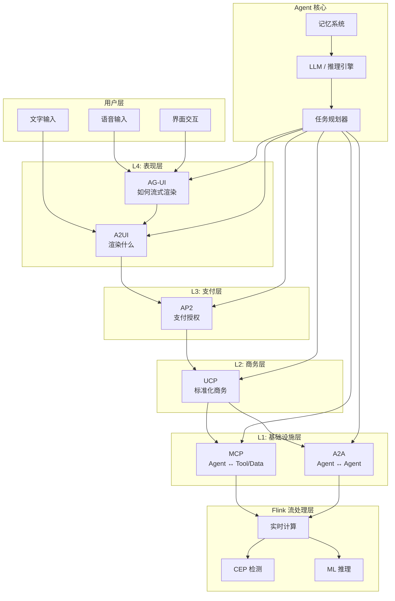
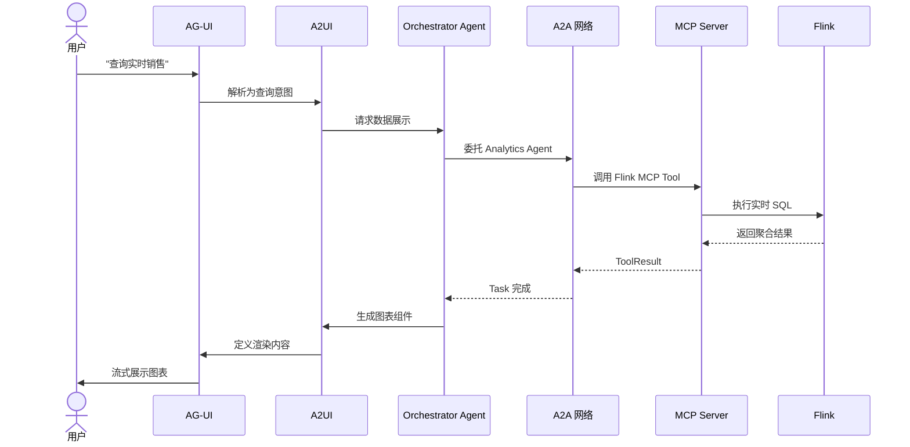
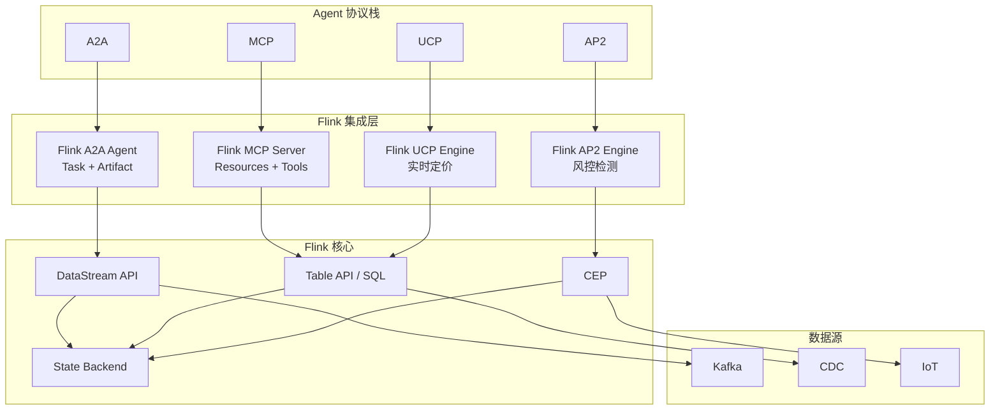

# AI Agent 协议栈分层架构 (2026)

> **状态**: ✅ 已发布 | **风险等级**: 中 | **最后更新**: 2026-04-21
>
> 本文档系统梳理 2026 年 AI Agent 领域的六大协议栈：MCP、A2A、UCP、AP2、A2UI、AG-UI，分析其分层定位、对比矩阵及与 Flink 流处理的集成点。
>
> 所属阶段: Knowledge/06-frontier | 前置依赖: [MCP协议分析](mcp-protocol-agent-streaming.md), [A2A协议分析](a2a-protocol-agent-communication.md) | 形式化等级: L3-L4

## 目录

- [AI Agent 协议栈分层架构 (2026)](#ai-agent-协议栈分层架构-2026)
  - [目录](#目录)
  - [1. 概念定义 (Definitions)](#1-概念定义-definitions)
    - [Def-K-06-335: AI Agent 协议栈 (Six-Protocol Stack)](#def-k-06-335-ai-agent-协议栈-six-protocol-stack)
    - [Def-K-06-336: 协议分层模型 (Protocol Layering Model)](#def-k-06-336-协议分层模型-protocol-layering-model)
    - [Def-K-06-337: 流处理协议集成点 (Streaming Protocol Integration Point)](#def-k-06-337-流处理协议集成点-streaming-protocol-integration-point)
  - [2. 属性推导 (Properties)](#2-属性推导-properties)
    - [Lemma-K-06-335: 协议正交性](#lemma-k-06-335-协议正交性)
    - [Prop-K-06-335: 分层组合安全性](#prop-k-06-335-分层组合安全性)
  - [3. 关系建立 (Relations)](#3-关系建立-relations)
    - [3.1 六大协议对比矩阵](#31-六大协议对比矩阵)
    - [3.2 协议与流处理的映射关系](#32-协议与流处理的映射关系)
    - [3.3 协议协作场景](#33-协议协作场景)
  - [4. 论证过程 (Argumentation)](#4-论证过程-argumentation)
    - [4.1 为什么需要六层协议栈？](#41-为什么需要六层协议栈)
    - [4.2 协议选择的工程权衡](#42-协议选择的工程权衡)
  - [5. 形式证明 / 工程论证](#5-形式证明--工程论证)
    - [Thm-K-06-335: 协议栈完备性定理](#thm-k-06-335-协议栈完备性定理)
  - [6. 实例验证 (Examples)](#6-实例验证-examples)
    - [6.1 电商 Agent 全协议栈示例](#61-电商-agent-全协议栈示例)
    - [6.2 Flink 作为协议栈数据层](#62-flink-作为协议栈数据层)
  - [7. 可视化 (Visualizations)](#7-可视化-visualizations)
    - [7.1 六大协议分层架构图](#71-六大协议分层架构图)
    - [7.2 协议交互时序图](#72-协议交互时序图)
    - [7.3 Flink 集成全景图](#73-flink-集成全景图)
  - [8. 引用参考 (References)](#8-引用参考-references)

---

## 1. 概念定义 (Definitions)

### Def-K-06-335: AI Agent 协议栈 (Six-Protocol Stack)

**AI Agent 协议栈** 是 2026 年 Google Developers Blog 提出的 Agent 互操作六层协议体系[^1]，形式化定义为：

$$
\text{Agent-Stack}_{2026} \triangleq \langle \text{MCP}, \text{A2A}, \text{UCP}, \text{AP2}, \text{A2UI}, \text{AG-UI} \rangle
$$

各协议的定义与定位：

| 协议 | 全称 | 定位 | 通信方向 | 核心抽象 |
|------|------|------|----------|----------|
| **MCP** | Model Context Protocol | Agent ↔ Tool/Data | 客户端 → 服务器 | Resources, Tools, Prompts |
| **A2A** | Agent-to-Agent Protocol | Agent ↔ Agent | 对等协作 | Tasks, Messages, Artifacts |
| **UCP** | Unified Commerce Protocol | Agent ↔ Commerce | 标准化商务 | Product, Cart, Order |
| **AP2** | Agent Payment Protocol | Agent ↔ Payment | 支付授权 | Intent, Authorization, Receipt |
| **A2UI** | Agent-to-User Interface | Agent → UI | 渲染什么 | Component, Layout, Content |
| **AG-UI** | Agent Graphical UI | Agent → User | 如何渲染 | Stream, Animation, Interaction |

**协议演进时间线**：

| 时间 | 事件 |
|------|------|
| 2024-11 | Anthropic 发布 MCP |
| 2025-04 | Google 发布 A2A |
| 2025-06 | Linux Foundation 成立 LF A2A Project |
| 2025-12 | Anthropic 将 MCP 捐赠给 Linux Foundation AAIF |
| 2026-03 | Google Developers Blog 提出六层协议栈[^1] |
| 2026-04 | A2A v0.3 发布安全增强；MCP 达 97M+ 月下载[^2][^3] |

### Def-K-06-336: 协议分层模型 (Protocol Layering Model)

**协议分层模型** 将六大协议映射到 OSI 风格的层次结构：

$$
\text{Layer}(p) = \begin{cases}
L_1 & \text{if } p \in \{\text{MCP}, \text{A2A}\} \quad \text{(基础设施层)} \\
L_2 & \text{if } p = \text{UCP} \quad \text{(商务协议层)} \\
L_3 & \text{if } p = \text{AP2} \quad \text{(支付协议层)} \\
L_4 & \text{if } p \in \{\text{A2UI}, \text{AG-UI}\} \quad \text{(表现层)}
\end{cases}
$$

**分层职责**：

```
┌─────────────────────────────────────────────┐
│  L4: 表现层 (Presentation)                  │
│  ├─ A2UI: 定义渲染什么 (What to render)     │
│  └─ AG-UI: 定义如何流式渲染 (How to stream) │
├─────────────────────────────────────────────┤
│  L3: 支付层 (Payment)                       │
│  └─ AP2: 支付授权与结算                     │
├─────────────────────────────────────────────┤
│  L2: 商务层 (Commerce)                      │
│  └─ UCP: 标准化商品/服务交易                │
├─────────────────────────────────────────────┤
│  L1: 基础设施层 (Infrastructure)            │
│  ├─ MCP: Agent ↔ Tool/Data (工具与数据)    │
│  └─ A2A: Agent ↔ Agent (协作与编排)        │
└─────────────────────────────────────────────┘
```

### Def-K-06-337: 流处理协议集成点 (Streaming Protocol Integration Point)

**流处理协议集成点 (SPIP)** 定义 Flink/RisingWave 等流处理系统与 Agent 协议栈的交互位置：

$$
\text{SPIP} \triangleq \langle \mathcal{F}, \mathcal{P}_{target}, \phi_{bind}, \psi_{data} \rangle
$$

其中：

- $\mathcal{F}$: Flink 流处理系统
- $\mathcal{P}_{target}$: 目标协议层 $\{\text{MCP}, \text{A2A}, \text{UCP}\}$
- $\phi_{bind}$: 绑定模式（Server / Client / Bridge）
- $\psi_{data}$: 数据映射函数

**集成矩阵**：

| 协议 | Flink 角色 | 集成模式 | 数据映射 |
|------|-----------|----------|----------|
| **MCP** | MCP Server | 流数据作为 Resource/Tool | DataStream → Resource URI |
| **A2A** | Remote Agent | Flink 作为 Specialist Agent | Window Result → Artifact |
| **UCP** | 实时定价引擎 | 流处理驱动动态定价 | CEP → Price Update |
| **AP2** | 风控引擎 | 实时欺诈检测 | Anomaly Score → Block/Risk |

---

## 2. 属性推导 (Properties)

### Lemma-K-06-335: 协议正交性

**引理**: 六层协议栈中的协议两两正交，即同一层内协议不重叠，不同层协议可组合：

$$
\forall p_i, p_j \in \text{Agent-Stack}, i \neq j: \text{Scope}(p_i) \cap \text{Scope}(p_j) = \emptyset \lor \text{Layer}(p_i) \neq \text{Layer}(p_j)
$$

**证明概要**:

1. MCP 与 A2A 虽同属 L1，但通信对象不同（Tool vs Agent），正交性已在 A2A-MCP 正交性定理中证明
2. UCP、AP2、A2UI、AG-UI 分别覆盖不同业务域，无功能重叠
3. 不同层协议通过清晰的接口边界交互

### Prop-K-06-335: 分层组合安全性

**命题**: 若各层协议独立满足安全属性，则组合后的协议栈满足端到端安全：

$$
\bigwedge_{i=1}^{4} \text{Secure}(L_i) \Rightarrow \text{Secure}(\text{Agent-Stack})
$$

**约束条件**: 层间接口必须实施适当的认证与授权委托（参考 AIP 身份协议）。

---

## 3. 关系建立 (Relations)

### 3.1 六大协议对比矩阵

| 维度 | MCP | A2A | UCP | AP2 | A2UI | AG-UI |
|------|-----|-----|-----|-----|------|-------|
| **发布方** | Anthropic → LF AAIF | Google → LF A2A | 行业联盟 | 金融行业 | Google | Google |
| **治理** | LF AAIF | LF A2A Project | 开放标准 | PCI/ISO | 社区草案 | 社区草案 |
| **传输** | JSON-RPC / SSE | HTTP / SSE / JSON-RPC | HTTP / gRPC | HTTPS / mTLS | JSON / HTML | SSE / WebSocket |
| **状态** | 可选有状态 | Task 生命周期 | 交易状态 | 支付状态 | 无状态 | 会话状态 |
| **成熟度** | ⭐⭐⭐⭐⭐ | ⭐⭐⭐⭐ | ⭐⭐ | ⭐⭐ | ⭐⭐⭐ | ⭐⭐⭐ |
| **生态规模** | 97M+ 月下载 | 150+ 组织 | 早期 | 早期 | 早期 | 早期 |

### 3.2 协议与流处理的映射关系

```
┌─────────────────────────────────────────────────────────────────┐
│                        AI Agent 协议栈                           │
├─────────────────────────────────────────────────────────────────┤
│  L4: A2UI / AG-UI                                               │
│     ↕ 渲染数据绑定                                               │
│  L3: AP2                                                        │
│     ↕ 支付风控结果                                               │
│  L2: UCP                                                        │
│     ↕ 实时定价/库存                                              │
│  L1: MCP          L1: A2A                                       │
│     ↕                ↕                                           │
│  Flink MCP Server  Flink A2A Agent                              │
│  ├─ Resources      ├─ Task Handler                              │
│  ├─ Tools          ├─ Agent Card                                │
│  └─ Prompts        └─ Artifact Producer                         │
├─────────────────────────────────────────────────────────────────┤
│                    Flink 流处理运行时                            │
│  ├─ DataStream API (实时计算)                                   │
│  ├─ Table API / SQL (查询分析)                                  │
│  ├─ CEP (模式检测)                                              │
│  └─ State Backend (状态管理)                                    │
├─────────────────────────────────────────────────────────────────┤
│                    数据源与存储                                  │
│  Kafka / Pulsar / Iceberg / JDBC / S3                         │
└─────────────────────────────────────────────────────────────────┘
```

### 3.3 协议协作场景

**场景 1: 智能电商助手**

```
User: "帮我买一件适合春季徒步的夹克"
  ↓
[AG-UI] 渲染语音/文字输入界面
  ↓
[A2UI] 确定需要展示商品列表、价格、评价
  ↓
[A2A] Orchestrator Agent 分解任务:
       ├─ Search Agent → 搜索商品
       ├─ Review Agent → 分析评价
       └─ Price Agent → 实时定价
  ↓
[MCP] Price Agent 调用 Flink MCP Server:
       ├─ Tool: "query_realtime_inventory"
       └─ Resource: "pricing://dynamic/spring_jackets"
  ↓
[UCP] 构建购物车，标准化商品信息
  ↓
[AP2] 用户确认后执行支付授权
  ↓
[AG-UI] 流式展示订单确认和物流跟踪
```

**场景 2: 实时风控**

```
支付请求 → [AP2] 风控检查
              ↓
         [MCP] 调用 Flink MCP Tool:
                "fraud_detection_realtime"
                参数: {user_id, amount, merchant, device}
              ↓
         [Flink] CEP 引擎检测异常模式:
                 ├─ 异地登录 + 大额支付
                 ├─ 短时间内多笔交易
                 └─ 设备指纹异常
              ↓
         [AP2] 返回风险评分 → 通过/拒绝/人工审核
```

---

## 4. 论证过程 (Argumentation)

### 4.1 为什么需要六层协议栈？

**现有方案的问题**：

1. **单体协议膨胀**: 若将所有功能塞进 MCP 或 A2A，协议复杂度呈指数增长
2. **领域专业性不足**: 支付、商务、UI 渲染需要领域专家参与设计
3. **演进速度不匹配**: 基础设施层（MCP/A2A）趋于稳定，而应用层（UCP/AP2）快速迭代

**分层架构的优势**：

$$
\text{Complexity}_{monolithic} = O(n^2) \gg \text{Complexity}_{layered} = O(n)
$$

其中 $n$ 为协议功能数。分层后每层可独立演进：

- MCP/A2A 由 LF 基金会治理，追求长期稳定性
- UCP/AP2 由行业联盟推进，适应商业变化
- A2UI/AG-UI 由前端社区迭代，跟进用户体验趋势

### 4.2 协议选择的工程权衡

| 需求 | 推荐协议 | 避免协议 | 原因 |
|------|----------|----------|------|
| Agent 查数据库 | MCP | A2A | MCP 专为工具/数据设计 |
| 多 Agent 协作 | A2A | MCP | A2A 有 Task 生命周期管理 |
| 实时数据推送 | MCP + SSE | 轮询 REST | SSE 支持流式推送 |
| 电商交易 | UCP + AP2 | 自建协议 | 标准化降低集成成本 |
| 语音交互 | AG-UI + A2UI | 纯文本 | AG-UI 定义流式音频渲染 |

---

## 5. 形式证明 / 工程论证

### Thm-K-06-335: 协议栈完备性定理

**定理**: 六层协议栈覆盖了 AI Agent 系统的全部外部交互需求：

$$
\forall \text{interaction} \in \text{Agent-External}: \exists p \in \text{Agent-Stack}: \text{Covers}(p, \text{interaction})
$$

**证明概要**:

1. **数据获取**: MCP 覆盖 Agent → Tool/Data（由 MCP 设计目标保证）
2. **协作编排**: A2A 覆盖 Agent → Agent（由 A2A 设计目标保证）
3. **商务交易**: UCP 覆盖 Agent → Commerce（由商品/订单抽象保证）
4. **资金流转**: AP2 覆盖 Agent → Payment（由支付授权抽象保证）
5. **内容呈现**: A2UI 覆盖 Agent → UI 内容（由组件抽象保证）
6. **交互体验**: AG-UI 覆盖 Agent → 用户交互（由流式渲染抽象保证）

**工程意义**: 企业构建 Agent 系统时，不需要自建协议，只需在六层协议栈中选择合适的子集组合。

---

## 6. 实例验证 (Examples)

### 6.1 电商 Agent 全协议栈示例

```python
# ecommerce_agent.py
class EcommerceAgent:
    """使用完整六层协议栈的电商 Agent"""

    def __init__(self):
        self.mcp = MCPClient()
        self.a2a = A2AClient()
        self.ucp = UCPClient()
        self.ap2 = AP2Client()
        self.a2ui = A2UIClient()
        self.agui = AGUIClient()

    async def handle_purchase(self, user_request: str):
        """处理用户购买请求"""

        # L1: MCP - 查询实时库存和定价
        inventory = await self.mcp.call_tool(
            "flink_query",
            {"sql": "SELECT * FROM inventory WHERE category = 'jackets'"}
        )

        # L1: A2A - 协调多个 Specialist Agent
        search_task = await self.a2a.send_task(
            "search-agent",
            {"query": user_request, "inventory": inventory}
        )
        review_task = await self.a2a.send_task(
            "review-agent",
            {"product_ids": search_task.result["ids"]}
        )

        # L2: UCP - 构建标准化购物车
        cart = await self.ucp.create_cart({
            "items": search_task.result["products"],
            "currency": "USD"
        })

        # A2UI: 生成购物车展示组件
        ui_components = await self.a2ui.render({
            "type": "cart_summary",
            "data": cart,
            "layout": "mobile"
        })

        # AG-UI: 流式渲染到用户界面
        await self.agui.stream_render(ui_components)

        # 用户确认后...
        # L3: AP2 - 执行支付授权
        payment = await self.ap2.authorize({
            "amount": cart.total,
            "currency": "USD",
            "source": "user_payment_method"
        })

        return {"cart": cart, "payment": payment}
```

### 6.2 Flink 作为协议栈数据层

```java
// FlinkSixProtocolBridge.java
public class FlinkSixProtocolBridge {

    /**
     * Flink 同时作为 MCP Server 和 A2A Remote Agent
     */
    public void start() {
        // MCP 层: 暴露流数据为 Resources 和 Tools
        McpServer mcpServer = McpServer.create()
            .resource("flink://realtime/pricing", this::getDynamicPricing)
            .tool("fraud_detect", this::detectFraud)
            .build();

        // A2A 层: 作为 Specialist Agent
        A2AAgent a2aAgent = A2AAgent.builder()
            .agentCard(new AgentCard(
                "FlinkAnalyticsAgent",
                Set.of("realtime_analytics", "fraud_detection")
            ))
            .taskHandler(this::handleAnalyticsTask)
            .build();

        // UCP 层: 实时定价计算
        UCPPricingEngine pricing = new UCPPricingEngine(
            env.addSource(new KafkaSource<>("inventory_updates"))
               .keyBy(InventoryEvent::getProductId)
               .process(new DynamicPricingFunction())
        );

        // 启动所有服务
        mcpServer.start(3000);
        a2aAgent.start(8080);
    }
}
```

---

## 7. 可视化 (Visualizations)

### 7.1 六大协议分层架构图



### 7.2 协议交互时序图



### 7.3 Flink 集成全景图



---

## 8. 引用参考 (References)

[^1]: Google Developers Blog, "The Six-Layer AI Agent Protocol Stack", 2026-03-18. <https://developers.googleblog.com/>
[^2]: Model Context Protocol, "MCP Ecosystem Statistics", 2026-04. <https://modelcontextprotocol.io/>
[^3]: Google, "A2A v0.3 Release Notes", 2026-04. <https://google.github.io/A2A/>

---

*文档版本: v1.0 | 创建日期: 2026-04-21 | 状态: Active*
*定理注册: Def-K-06-335~337, Lemma-K-06-335, Prop-K-06-335, Thm-K-06-335*
