# AI Agent流式处理架构：实时推理与行动系统

> **状态**: 前瞻 | **预计发布时间**: 2026-06 | **最后更新**: 2026-04-12
>
> ⚠️ 本文档描述的特性处于早期讨论阶段，尚未正式发布。实现细节可能变更。

> **所属阶段**: Knowledge/06-frontier | **前置依赖**: [realtime-ai-streaming-2026.md](realtime-ai-streaming-2026.md), [ai-agent-database-workloads.md](ai-agent-database-workloads.md), [real-time-rag-architecture.md](real-time-rag-architecture.md) | **形式化等级**: L3-L4

---

## 1. 概念定义 (Definitions)

### Def-K-06-110: AI Agent (人工智能代理)

**定义**: AI Agent是一个能够在环境中自主感知、推理、行动和学习的智能系统，形式化为五元组：

$$
\mathcal{A}_{agent} \triangleq \langle \mathcal{P}, \mathcal{R}, \mathcal{A}, \mathcal{M}, \mathcal{G} \rangle
$$

其中：

| 组件 | 符号 | 形式化定义 | 功能描述 |
|------|------|------------|----------|
| **感知** | $\mathcal{P}$ | $\mathcal{E}_{env} \rightarrow \mathcal{O}$ | 将环境输入转换为内部观测 |
| **推理** | $\mathcal{R}$ | $(\mathcal{O}, \mathcal{M}_t) \rightarrow \mathcal{D}$ | 基于观测和记忆生成决策 |
| **行动** | $\mathcal{A}$ | $\mathcal{D} \rightarrow \mathcal{E}_{env}$ | 执行决策影响环境 |
| **记忆** | $\mathcal{M}$ | $\mathcal{M}_t = f(\mathcal{M}_{t-1}, \mathcal{O}_t, \mathcal{D}_t)$ | 状态累积与学习 |
| **目标** | $\mathcal{G}$ | $\mathcal{G}: \mathcal{S} \rightarrow \mathbb{R}$ | 优化目标函数 |

**核心特征**: 与单一任务ML模型不同，Agent具备**持续性**、**自主性**和**适应性**，能够在开放环境中长期运行。

---

### Def-K-06-111: Agent架构模式 (Agent Architecture Patterns)

**定义**: 2026年主流的Agent架构模式包括以下三类：

**模式1 - ReAct (Reasoning + Acting)**:

$$
\text{ReAct}: \mathcal{O}_t \xrightarrow{\text{Thought}} \tau_t \xrightarrow{\text{Action}} a_t \xrightarrow{\text{Observation}} \mathcal{O}_{t+1}
$$

其中 $\tau_t$ 为推理轨迹(Thought)，通过交错推理与行动循环解决复杂问题。

**模式2 - Plan-and-Execute**:

$$
\text{Plan-and-Execute}: \mathcal{O}_0 \xrightarrow{\text{Plan}} \{a_1, a_2, ..., a_n\} \xrightarrow{\text{Execute}} \text{Result}
$$

先制定完整计划，再顺序或并行执行。

**模式3 - Multi-Agent协作**:

$$
\text{Multi-Agent}: \{\mathcal{A}_1, \mathcal{A}_2, ..., \mathcal{A}_m\} \xrightarrow{\text{Coordination}} \text{Collective Output}
$$

多个Agent通过消息传递协调完成复杂任务。

---

### Def-K-06-112: Agent记忆系统 (Agent Memory System)

**定义**: Agent记忆系统是一个分层存储架构，形式化为：

$$
\mathcal{M} = \langle \mathcal{M}_{stm}, \mathcal{M}_{mtm}, \mathcal{M}_{ltm}, \mathcal{M}_{ep} \rangle
$$

**短期记忆 (STM - Short-Term Memory)**:

$$
\mathcal{M}_{stm}(t) = \{ (o_i, d_i, a_i) \mid i \in [t-w, t] \}
$$

其中 $w$ 为上下文窗口大小，通常受限于LLM的token限制(4k-128k)。

**中期记忆 (MTM - Medium-Term Memory)**:

$$
\mathcal{M}_{mtm}(t) = \{ (s_j, v_j, t_j) \mid t - \Delta t_{mtm} \leq t_j \leq t \}
$$

存储会话级上下文，包括对话摘要、用户偏好、任务状态等，保留时间通常在小时到天级别。

**长期记忆 (LTM - Long-Term Memory)**:

$$
\mathcal{M}_{ltm} = \{ (k_j, v_j) \mid k_j \in \mathbb{R}^d \}
$$

以向量形式存储在Vector DB中，通过相似度检索访问。

**情景记忆 (Episodic Memory)**:

$$
\mathcal{M}_{ep} = \{ e_1, e_2, ..., e_n \}, \quad e_i = (s_i, a_i, r_i, s'_i)
$$

存储完整的交互episode，用于强化学习与经验回放。

**记忆流式更新机制**:

$$
\mathcal{M}_{t+1} = \alpha \cdot \mathcal{M}_{stm} \oplus \beta \cdot \mathcal{M}_{mtm} \oplus \gamma \cdot \text{Embed}(\mathcal{M}_{ltm}) \oplus \delta \cdot \mathcal{M}_{ep}
$$

其中 $\oplus$ 表示记忆融合操作，权重参数满足 $\alpha + \beta + \gamma + \delta = 1$。

---

### Def-K-06-113: 流式Agent触发 (Streaming Agent Trigger)

**定义**: 流式Agent触发是事件驱动的Agent激活机制：

$$
\text{Trigger}: \mathcal{E}_{stream} \times \mathcal{C}_{condition} \times \mathcal{C}_{context} \rightarrow \{0, 1\}
$$

其中：

- $\mathcal{E}_{stream}$: 事件流输入
- $\mathcal{C}_{condition}$: 触发条件（规则/ML模型/LLM判断）
- $\mathcal{C}_{context}$: 实时组装的上文（Streaming Joins）

**触发模式**:

| 模式 | 触发条件 | 延迟要求 | 适用场景 |
|------|----------|----------|----------|
| **规则触发** | $e.type \in \{alert, error\}$ | < 100ms | 简单事件响应 |
| **阈值触发** | $\text{metric} > \theta$ | < 1s | 监控告警 |
| **模式触发** | $\text{CEP}(e_{t-w:t}) = \text{pattern}$ | < 5s | 复杂事件检测 |
| **语义触发** | $\text{LLM}(\text{context}) = \text{action_required}$ | < 10s | 智能决策 |

---

### Def-K-06-114: 多Agent编排架构 (Multi-Agent Orchestration)

**定义**: 多Agent编排定义了Agent间的协作拓扑与控制流：

**Orchestrator-Worker模式**:

$$
\mathcal{O}: \text{Task} \rightarrow \{ \text{Subtask}_i \}_{i=1}^n \rightarrow \{ \mathcal{A}_i \}_{i=1}^n \rightarrow \text{Aggregate}
$$

单一协调器分配任务给多个Worker Agent。

**Supervisor + Workers模式**:

$$
\mathcal{S}: \{ \mathcal{A}_i \}_{i=1}^n \rightarrow \text{Decision} \rightarrow \text{Action}
$$

Supervisor监控Worker状态，可中断、重试或重新分配任务。

**去中心化协作模式**:

$$
\mathcal{A}_i \xrightarrow{\text{msg}} \mathcal{A}_j, \quad \forall i,j \in [1, n]
$$

Agent间直接通信，无中央协调器。

**分层协作模式 (Hierarchical)**:

$$
\mathcal{H} = \langle \mathcal{L}_1, \mathcal{L}_2, ..., \mathcal{L}_k \rangle, \quad \mathcal{L}_i \xrightarrow{\text{delegate}} \mathcal{L}_{i+1}
$$

多级分层架构，上层Agent负责战略决策，下层Agent负责执行。

---

### Def-K-06-115: Agent状态机 (Agent State Machine)

**定义**: Agent状态机是一个扩展的有限状态机，形式化为七元组：

$$
\mathcal{M}_{agent} = \langle Q, \Sigma, \delta, q_0, F, \mathcal{V}, \eta \rangle
$$

其中：

| 组件 | 符号 | 定义 | 描述 |
|------|------|------|------|
| 状态集 | $Q$ | $\{idle, perceiving, reasoning, tool\_selecting, executing, reflecting, error, completed\}$ | Agent状态 |
| 输入字母表 | $\Sigma$ | $\{evt\_input, evt\_mem\_retrieved, evt\_tool\_needed, evt\_tool\_done, evt\_error, evt\_timeout\}$ | 触发事件 |
| 转移函数 | $\delta$ | $Q \times \Sigma \rightarrow Q$ | 状态转换 |
| 初始状态 | $q_0$ | $idle$ | 初始状态 |
| 终止状态 | $F$ | $\{completed, error\}$ | 结束状态 |
| 变量集 | $\mathcal{V}$ | $\{context, memory, tools, iteration\}$ | 状态变量 |
| 守卫条件 | $\eta$ | $\mathcal{V} \rightarrow \{true, false\}$ | 转换条件 |

**状态转移语义**:

$$
\delta(q, \sigma) =
\begin{cases}
perceiving & \text{if } q = idle \land \sigma = evt\_input \\
reasoning & \text{if } q = perceiving \land \sigma = evt\_mem\_retrieved \\
tool\_selecting & \text{if } q = reasoning \land \sigma = evt\_tool\_needed \\
executing & \text{if } q = tool\_selecting \land \exists t \in \mathcal{T}: match(t, goal) \\
reflecting & \text{if } q = executing \land \sigma = evt\_tool\_done \\
reasoning & \text{if } q = reflecting \land \eta(iteration < max\_iter) \\
completed & \text{if } q = reflecting \land \eta(goal\_achieved) \\
error & \text{if } \sigma = evt\_error \lor \eta(iteration \geq max\_iter)
\end{cases}
$$

---

### Def-K-06-116: 工具调用流编排 (Tool Calling Flow Orchestration)

**定义**: 工具调用流编排定义了Agent选择和执行工具的动态流程：

$$
\mathcal{T}_{flow} = \langle \mathcal{T}, \mathcal{G}_{dep}, \mathcal{S}_{exec}, \mathcal{O}_{order} \rangle
$$

其中：

- $\mathcal{T} = \{t_1, t_2, ..., t_n\}$: 可用工具集合
- $\mathcal{G}_{dep} = (\mathcal{T}, \mathcal{E}_{dep})$: 工具依赖图
- $\mathcal{S}_{exec} \in \{sequential, parallel, conditional\}$: 执行策略
- $\mathcal{O}_{order}: \mathcal{T} \rightarrow \mathbb{N}$: 执行顺序

**工具选择函数**:

$$
\text{select\_tool}(goal, context) = \arg\max_{t \in \mathcal{T}} \left( \text{relevance}(t, goal) \cdot \text{confidence}(t, context) \right)
$$

---

### Def-K-06-117: 记忆流式更新协议 (Memory Streaming Update Protocol)

**定义**: 记忆流式更新协议规范了记忆的实时更新流程：

$$
\mathcal{P}_{mem} = \langle \mathcal{E}_{update}, \mathcal{P}_{process}, \mathcal{S}_{storage}, \mathcal{N}_{notify} \rangle
$$

**更新事件类型**:

| 事件类型 | 触发条件 | 处理策略 | 存储目标 |
|----------|----------|----------|----------|
| `context_update` | 对话轮次增加 | 滑动窗口更新 | $\mathcal{M}_{stm}$ |
| `session_checkpoint` | 会话里程碑 | 摘要生成 | $\mathcal{M}_{mtm}$ |
| `insight_extracted` | 重要信息识别 | 向量化存储 | $\mathcal{M}_{ltm}$ |
| `episode_complete` | 任务完成 | 经验打包 | $\mathcal{M}_{ep}$ |

**更新流水线**:

$$
\mathcal{E}_{update} \xrightarrow{extract} \mathcal{F}_{features} \xrightarrow{embed} \mathbb{R}^d \xrightarrow{store} \mathcal{M}_{\bullet} \xrightarrow{index} \mathcal{I}_{searchable}
$$

---

## 2. 属性推导 (Properties)

### Prop-K-06-80: Agent响应延迟边界定理

**命题**: 流式Agent系统的端到端响应延迟满足：

$$
L_{agent} = L_{perception} + L_{retrieval} + L_{inference} + L_{action}
$$

各分量边界：

| 组件 | 公式 | 典型值 | 优化策略 |
|------|------|--------|----------|
| 感知延迟 | $L_{perception}$ | 10-100ms | 边缘部署、本地预处理 |
| 记忆检索 | $L_{retrieval} = L_{vector} + L_{db}$ | 20-200ms | 缓存、近似检索 |
| 推理延迟 | $L_{inference}$ | 100-1000ms | 模型蒸馏、批处理 |
| 行动执行 | $L_{action}$ | 50-500ms | 异步执行、预授权 |
| **总计** | | **180ms-1.8s** | **P99 < 2s** |

**推论**: 对于实时交互场景（如客服Agent），必须满足 $L_{agent} < 2s$ 才能保证用户体验。

---

### Prop-K-06-81: 推理-行动循环复杂度边界

**命题**: ReAct模式的推理步数 $N_{steps}$ 与任务复杂度 $C_{task}$ 满足：

$$
N_{steps} \leq \alpha \cdot C_{task} + \beta
$$

其中 $\alpha$ 为每步解决率（通常 0.3-0.5），$\beta$ 为启动开销（通常 1-2步）。

**迭代终止条件**:

$$
\text{Terminate} \iff \text{GoalAchieved}(\mathcal{S}_t) \lor N_{steps} > N_{max} \lor L_{elapsed} > L_{timeout}
$$

| 任务类型 | 典型步数 | 最大步数 | 超时阈值 |
|----------|----------|----------|----------|
| 单工具调用 | 1-2 | 3 | 5s |
| 多步推理 | 3-5 | 10 | 30s |
| 复杂分析 | 5-10 | 20 | 120s |
| 研究任务 | 10-50 | 100 | 10min |

---

### Lemma-K-06-80: 上下文窗口效率引理

**引理**: 给定上下文窗口大小 $W$（token数），有效信息量 $I_{effective}$ 随对话轮次 $n$ 衰减：

$$
I_{effective}(n) = I_{total} \cdot e^{-\lambda n}
$$

其中 $\lambda$ 为信息衰减系数（通常 0.1-0.3）。

**工程意义**: 长对话中早期信息的重要性下降，需要外部记忆系统（LTM）补充。

---

### Prop-K-06-82: 多Agent并行效率定理

**命题**: 多Agent系统的并行加速比 $S_p$ 满足Amdahl定律：

$$
S_p = \frac{1}{(1-f) + \frac{f}{p} + \frac{c \cdot p}{T_{seq}}}
$$

其中：

- $f$: 可并行化比例（通常 0.6-0.9）
- $p$: Worker Agent数量
- $c$: 协调开销系数
- $T_{seq}$: 串行执行时间

**最优Worker数量**:

$$
p^* = \sqrt{\frac{f \cdot T_{seq}}{c}}
$$

对于典型Agent任务，$p^* \in [3, 8]$，过多Agent会增加协调开销反而降低效率。

---

### Lemma-K-06-81: 记忆一致性引理

**引理**: 在流式更新场景下，记忆系统满足最终一致性：

$$
\forall m \in \mathcal{M}, \forall t > t_{write}: \lim_{t \to \infty} P(read(m, t) = m_{latest}) = 1
$$

**一致性级别**:

| 记忆类型 | 一致性模型 | 保证延迟 |
|----------|------------|----------|
| $\mathcal{M}_{stm}$ | 强一致性 | < 10ms |
| $\mathcal{M}_{mtm}$ | 会话一致性 | < 100ms |
| $\mathcal{M}_{ltm}$ | 最终一致性 | < 1s |
| $\mathcal{M}_{ep}$ | 最终一致性 | < 5s |

---

### Prop-K-06-83: Agent状态机活性定理

**命题**: Agent状态机满足活性条件（Liveness），即：

$$
\Diamond (q \in F), \quad \forall \text{合法输入序列}
$$

**证明概要**:

1. **有限迭代保证**: $iteration < max\_iter$ 确保推理循环终止
2. **超时机制**: $L_{elapsed} < L_{timeout}$ 强制终止长时间运行
3. **错误处理**: 任何错误状态最终转移到 $error \in F$
4. **完成检测**: $goal\_achieved$ 条件确保正常终止到 $completed \in F$

---

## 3. 关系建立 (Relations)

### 3.1 Agent vs 传统AI系统的对比关系

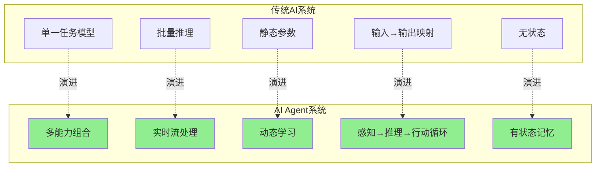
```mermaid
graph TB
    subgraph "传统AI系统"
        T1[单一任务模型]
        T2[批量推理]
        T3[静态参数]
        T4[输入→输出映射]
        T5[无状态]
    end

    subgraph "AI Agent系统"
        A1[多能力组合]
        A2[实时流处理]
        A3[动态学习]
        A4[感知→推理→行动循环]
        A5[有状态记忆]
    end

    T1 -.->|演进| A1
    T2 -.->|演进| A2
    T3 -.->|演进| A3
    T4 -.->|演进| A4
    T5 -.->|演进| A5

    style A1 fill:#90EE90
    style A2 fill:#90EE90
    style A3 fill:#90EE90
    style A4 fill:#90EE90
    style A5 fill:#90EE90
```

**核心差异矩阵**:

| 维度 | 传统AI | AI Agent |
|------|--------|----------|
| **交互模式** | 请求-响应 | 持续对话 |
| **上下文** | 单次请求 | 跨会话累积 |
| **工具使用** | 无/预定义 | 动态调用 |
| **学习能力** | 离线训练 | 在线适应 |
| **决策范围** | 分类/预测 | 规划/执行 |
| **延迟要求** | 秒级可接受 | 亚秒级交互 |

---

### 3.2 Agent与RAG、传统ML的关系

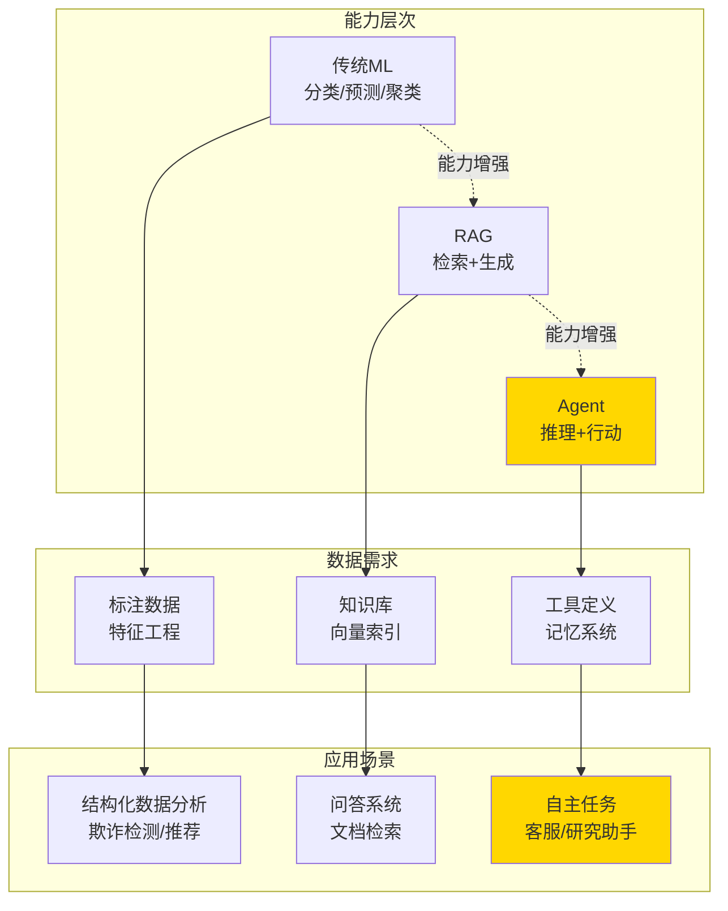
```mermaid
graph TB
    subgraph "能力层次"
        ML[传统ML<br/>分类/预测/聚类]
        RAG[RAG<br/>检索+生成]
        AGENT[Agent<br/>推理+行动]
    end

    subgraph "数据需求"
        ML_D[标注数据<br/>特征工程]
        RAG_D[知识库<br/>向量索引]
        AGENT_D[工具定义<br/>记忆系统]
    end

    subgraph "应用场景"
        ML_A[结构化数据分析<br/>欺诈检测/推荐]
        RAG_A[问答系统<br/>文档检索]
        AGENT_A[自主任务<br/>客服/研究助手]
    end

    ML --> ML_D --> ML_A
    RAG --> RAG_D --> RAG_A
    AGENT --> AGENT_D --> AGENT_A

    ML -.->|能力增强| RAG
    RAG -.->|能力增强| AGENT

    style AGENT fill:#FFD700
    style AGENT_A fill:#FFD700
```

---

### 3.3 Multi-Agent协作模式对比

| 模式 | 拓扑结构 | 通信复杂度 | 容错性 | 适用场景 |
|------|----------|------------|--------|----------|
| **Orchestrator-Worker** | 星型 | $O(n)$ | 中 | 任务分解明确 |
| **Supervisor-Workers** | 星型+监控 | $O(n)$ | 高 | 需要容错保障 |
| **去中心化** | 网状 | $O(n^2)$ | 高 | 自主协作 |
| **分层架构** | 树型 | $O(\log n)$ | 高 | 复杂组织 |

---

### 3.4 2026年Agent架构趋势映射

| 趋势 | 2024年状态 | 2026年预期 | 技术驱动 |
|------|------------|------------|----------|
| **推理能力** | CoT单一推理 | 多步+反思+验证 | o1/o3级模型 |
| **记忆系统** | 简单Vector DB | 分层+记忆压缩 | 专用Agent DB |
| **工具生态** | 100+工具 | 10,000+工具 | MCP协议标准化 |
| **多Agent** | 实验性 | 生产级编排 | 框架成熟 |
| **流式集成** | 批处理为主 | 事件驱动原生 | Flink+Agent融合 |
| **边缘部署** | 云端集中 | 边缘-云协同 | 端侧模型优化 |

---

## 4. 论证过程 (Argumentation)

### 4.1 Agent架构选型决策树

**决策维度分析**:

```
┌─────────────────────────────────────────────────────────────────┐
│                    Agent架构选型决策树                           │
├─────────────────────────────────────────────────────────────────┤
│                                                                 │
│  Q1: 任务是否需要多步推理?                                       │
│      ├─ 否 → 简单Prompt+LLM                                     │
│      └─ 是 → Q2                                                 │
│                                                                 │
│  Q2: 是否需要外部工具?                                           │
│      ├─ 否 → ReAct (纯推理)                                     │
│      └─ 是 → Q3                                                 │
│                                                                 │
│  Q3: 工具依赖是否可预测?                                         │
│      ├─ 是 → Plan-and-Execute (预规划)                          │
│      └─ 否 → ReAct (自适应工具调用)                              │
│                                                                 │
│  Q4: 任务是否可分解为独立子任务?                                  │
│      ├─ 是 → Multi-Agent (Orchestrator-Worker)                  │
│      └─ 否 → Single-Agent with Tool Use                         │
│                                                                 │
│  Q5: 是否需要容错与监控?                                         │
│      ├─ 是 → Supervisor + Workers                               │
│      └─ 否 → 去中心化Multi-Agent                                │
│                                                                 │
└─────────────────────────────────────────────────────────────────┘
```

---

### 4.2 Multi-Agent协作的必然性论证

**观察**: 2026年复杂任务处理呈现以下特征：

1. **专业化分工**: 单一Agent难以同时精通多个领域
2. **并行效率**: 独立子任务并行处理可显著降低总延迟
3. **容错需求**: 单个Agent失败不应导致整个任务失败
4. **可扩展性**: 动态添加新Agent扩展系统能力

**论证**: Multi-Agent架构是解决复杂问题的必然选择：

$$
\text{Complexity}(\text{Single Agent}) > \text{Threshold} \Rightarrow \text{Require Multi-Agent}
$$

**复杂度阈值判定**:

| 指标 | 单Agent上限 | Multi-Agent优势 |
|------|-------------|-----------------|
| 工具数量 | 10-20个 | 可扩展至100+ |
| 领域跨度 | 1-2个 | 无限制 |
| 任务步骤 | 10步 | 100+步 |
| 执行时间 | 5分钟 | 小时级 |

---

### 4.3 流式处理与Agent结合的必然性论证

**观察**: 2026年Agent工作负载呈现以下特征：

1. **事件驱动性**: 85%的Agent任务由外部事件触发（用户消息、系统告警、数据更新）
2. **实时性需求**: 客服、交易、IoT场景要求 < 2s响应
3. **上下文动态性**: Agent决策依赖实时组装的多源数据

**论证**: 流式处理（Flink）与Agent结合是必然选择：

| 挑战 | 传统方案 | Flink方案 |
|------|----------|-----------|
| **上下文组装** | 查询多个DB（500ms+） | Streaming Joins（< 50ms） |
| **动态规则** | 静态配置+重启 | Broadcast State（实时更新） |
| **事件触发** | 轮询（秒级延迟） | 事件流（毫秒级） |
| **多Agent协调** | REST调用（耦合） | 消息流（解耦） |
| **状态恢复** | 应用层实现 | Checkpoint原生 |

---

### 4.4 反例分析：Agent不适用场景

**场景1: 超低延迟高频交易**

- **要求**: < 1ms决策延迟
- **问题**: Agent推理链（100ms+）无法满足
- **解决方案**: 规则引擎 + Agent用于离线策略优化

**场景2: 100%确定性决策**

- **要求**: 金融合规、医疗诊断的可审计性
- **问题**: LLM概率性输出难以满足
- **解决方案**: Agent辅助生成候选，规则引擎最终决策

**场景3: 纯感知任务**

- **要求**: 图像分类、语音识别
- **问题**: Agent架构过度复杂
- **解决方案**: 直接使用专用ML模型

---

## 5. 形式证明 / 工程论证 (Engineering Argument)

### 5.1 Agent核心组件架构

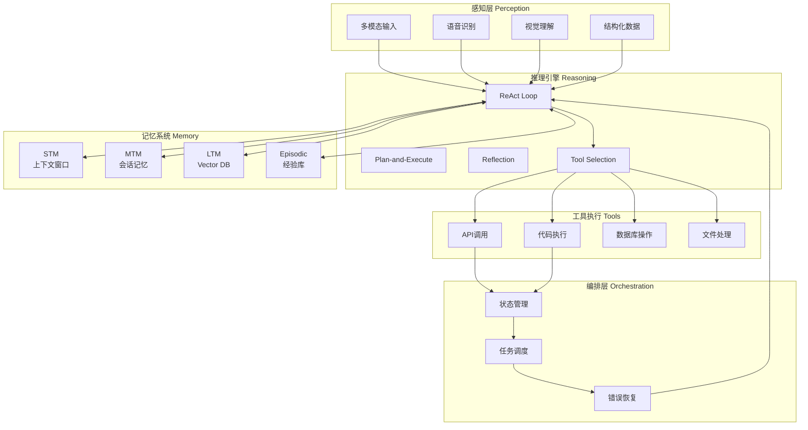
```mermaid
graph TB
    subgraph "感知层 Perception"
        P1[多模态输入]
        P2[语音识别]
        P3[视觉理解]
        P4[结构化数据]
    end

    subgraph "推理引擎 Reasoning"
        R1[ReAct Loop]
        R2[Plan-and-Execute]
        R3[Reflection]
        R4[Tool Selection]
    end

    subgraph "记忆系统 Memory"
        M1[STM<br/>上下文窗口]
        M2[MTM<br/>会话记忆]
        M3[LTM<br/>Vector DB]
        M4[Episodic<br/>经验库]
    end

    subgraph "工具执行 Tools"
        T1[API调用]
        T2[代码执行]
        T3[数据库操作]
        T4[文件处理]
    end

    subgraph "编排层 Orchestration"
        O1[状态管理]
        O2[任务调度]
        O3[错误恢复]
    end

    P1 --> R1
    P2 --> R1
    P3 --> R1
    P4 --> R1

    R1 <--> M1
    R1 <--> M2
    R1 <--> M3
    R1 <--> M4

    R1 --> R4
    R4 --> T1
    R4 --> T2
    R4 --> T3
    R4 --> T4

    T1 --> O1
    T2 --> O1
    O1 --> O2
    O2 --> O3
    O3 --> R1
```

---

### 5.2 Agent状态机详细定义

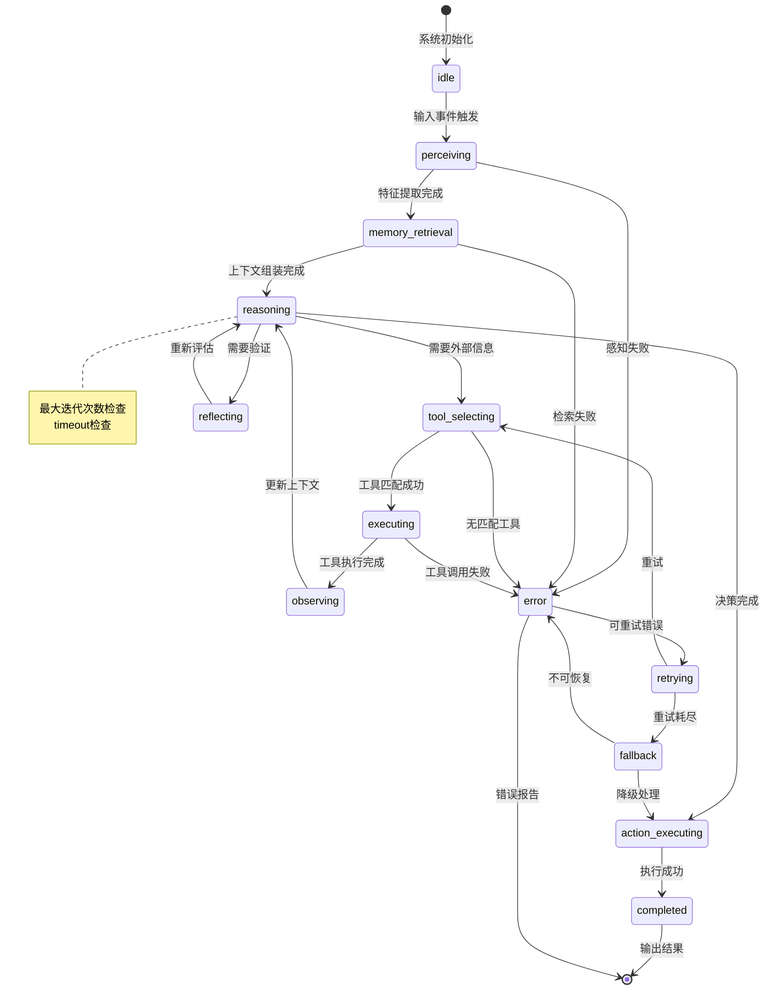
```mermaid
stateDiagram-v2
    [*] --> idle: 系统初始化

    idle --> perceiving: 输入事件触发

    perceiving --> memory_retrieval: 特征提取完成
    memory_retrieval --> reasoning: 上下文组装完成

    reasoning --> tool_selecting: 需要外部信息
    tool_selecting --> executing: 工具匹配成功
    executing --> observing: 工具执行完成
    observing --> reasoning: 更新上下文

    reasoning --> reflecting: 需要验证
    reflecting --> reasoning: 重新评估

    reasoning --> action_executing: 决策完成
    action_executing --> completed: 执行成功

    perceiving --> error: 感知失败
    memory_retrieval --> error: 检索失败
    tool_selecting --> error: 无匹配工具
    executing --> error: 工具调用失败

    error --> retrying: 可重试错误
    retrying --> tool_selecting: 重试
    retrying --> fallback: 重试耗尽

    fallback --> action_executing: 降级处理
    fallback --> error: 不可恢复

    completed --> [*]: 输出结果
    error --> [*]: 错误报告

    note right of reasoning
        最大迭代次数检查
        timeout检查
    end note
```

**状态转移表**:

| 当前状态 | 触发事件 | 守卫条件 | 下一状态 | 动作 |
|----------|----------|----------|----------|------|
| idle | `evt_input` | - | perceiving | 启动感知处理 |
| perceiving | `evt_perceive_done` | - | memory_retrieval | 触发记忆检索 |
| memory_retrieval | `evt_mem_retrieved` | - | reasoning | 开始推理 |
| reasoning | `evt_tool_needed` | `confidence < threshold` | tool_selecting | 选择工具 |
| reasoning | `evt_goal_achieved` | `confidence >= threshold` | action_executing | 执行行动 |
| tool_selecting | `evt_tool_matched` | $\exists t \in \mathcal{T}$ | executing | 调用工具 |
| executing | `evt_tool_done` | success | observing | 处理结果 |
| executing | `evt_tool_error` | fail | retrying | 错误处理 |
| retrying | `evt_retry` | `retry_count < max` | tool_selecting | 重试选择 |
| retrying | `evt_max_retry` | `retry_count >= max` | fallback | 降级 |

---

### 5.3 记忆管理流式更新机制

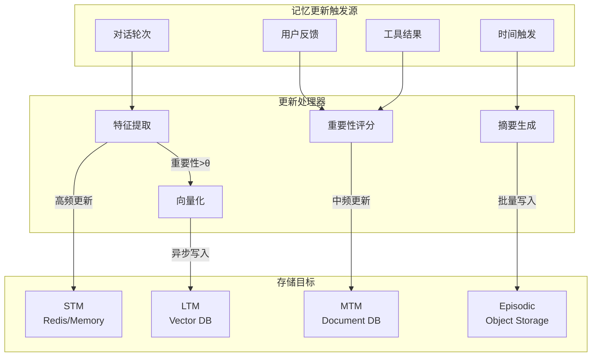
```mermaid
flowchart TD
    subgraph "记忆更新触发源"
        T1[对话轮次]
        T2[用户反馈]
        T3[工具结果]
        T4[时间触发]
    end

    subgraph "更新处理器"
        P1[特征提取]
        P2[重要性评分]
        P3[向量化]
        P4[摘要生成]
    end

    subgraph "存储目标"
        S1[STM<br/>Redis/Memory]
        S2[MTM<br/>Document DB]
        S3[LTM<br/>Vector DB]
        S4[Episodic<br/>Object Storage]
    end

    T1 --> P1
    T2 --> P2
    T3 --> P2
    T4 --> P4

    P1 -->|高频更新| S1
    P1 -->|重要性>θ| P3
    P2 -->|中频更新| S2
    P3 -->|异步写入| S3
    P4 -->|批量写入| S4
```

**记忆更新策略**:

```python
class StreamingMemoryUpdater:
    """流式记忆更新处理器"""

    async def process_update(self, event: MemoryEvent):
        # 1. 确定更新目标
        if event.type == "context_update":
            await self._update_stm(event)
        elif event.type == "session_checkpoint":
            await self._update_mtm(event)
        elif event.type == "insight_extracted":
            await self._update_ltm(event)
        elif event.type == "episode_complete":
            await self._update_episodic(event)

    async def _update_stm(self, event):
        """短期记忆更新 - 毫秒级"""
        # 滑动窗口更新
        self.stm.append(event.data)
        if len(self.stm) > self.window_size:
            self.stm.pop(0)
        await self.stm_store.write(self.session_id, self.stm)

    async def _update_ltm(self, event):
        """长期记忆更新 - 异步批量"""
        # 向量化
        embedding = await self.embedding_model.encode(event.data)
        # 批量写入Vector DB
        await self.ltm_buffer.add({
            "id": event.id,
            "vector": embedding,
            "metadata": event.metadata,
            "timestamp": event.timestamp
        })

        # 批量刷新
        if self.ltm_buffer.size >= self.batch_size:
            await self._flush_ltm_buffer()
```

---

### 5.4 流式处理集成模式

**模式1: 实时上下文组装 (Streaming Joins)**

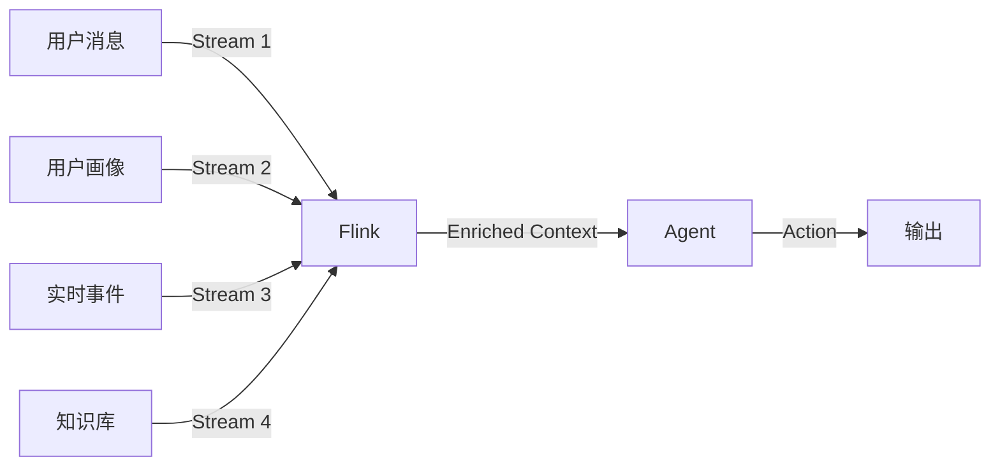
```mermaid
flowchart LR
    A[用户消息] -->|Stream 1| F[Flink]
    B[用户画像] -->|Stream 2| F
    C[实时事件] -->|Stream 3| F
    D[知识库] -->|Stream 4| F

    F -->|Enriched Context| AG[Agent]
    AG -->|Action| OUT[输出]
```

**Flink实现**:

```java

import org.apache.flink.streaming.api.datastream.DataStream;

// 实时上下文组装
DataStream<Context> enrichedContext = userMessages
    .keyBy(Message::getUserId)
    .connect(userProfiles.broadcast())  // Broadcast State模式
    .connect(realtimeEvents)
    .process(new ContextEnrichmentFunction());

// 触发Agent处理
enrichedContext
    .addSink(new AgentInvocationSink());
```

**模式2: 动态规则处理 (Broadcast State)**

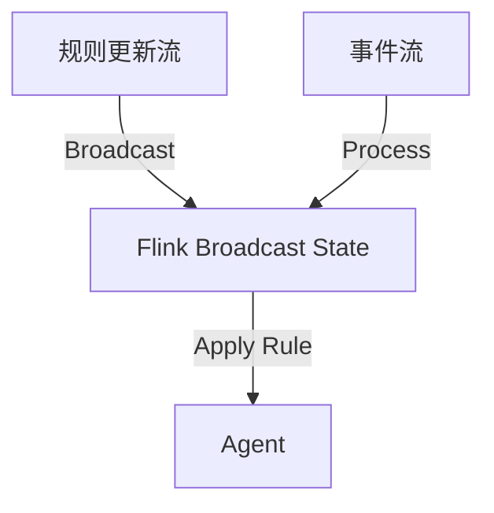
```mermaid
flowchart TD
    R[规则更新流] -->|Broadcast| F[Flink Broadcast State]
    E[事件流] -->|Process| F
    F -->|Apply Rule| AG[Agent]
```

**模式3: 多Agent协作事件流**

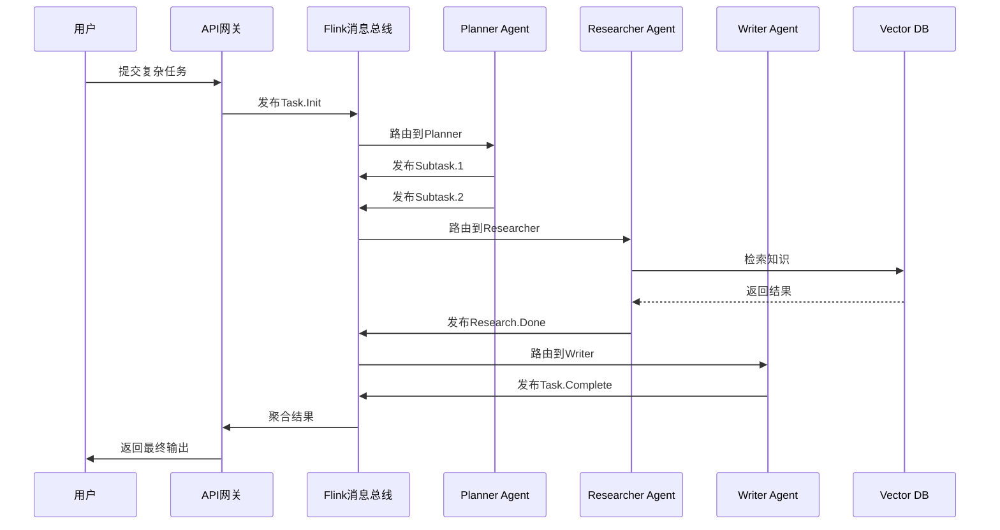
```mermaid
sequenceDiagram
    participant U as 用户
    participant GW as API网关
    participant F as Flink消息总线
    participant A1 as Planner Agent
    participant A2 as Researcher Agent
    participant A3 as Writer Agent
    participant V as Vector DB

    U->>GW: 提交复杂任务
    GW->>F: 发布Task.Init
    F->>A1: 路由到Planner
    A1->>F: 发布Subtask.1
    A1->>F: 发布Subtask.2
    F->>A2: 路由到Researcher
    A2->>V: 检索知识
    V-->>A2: 返回结果
    A2->>F: 发布Research.Done
    F->>A3: 路由到Writer
    A3->>F: 发布Task.Complete
    F->>GW: 聚合结果
    GW->>U: 返回最终输出
```

---

### 5.5 生产实践最佳实践

**评估与测试 (Trajectory Evaluation)**:

| 评估维度 | 指标 | 计算方法 |
|----------|------|----------|
| **任务成功率** | $P_{success}$ | $\frac{\text{成功任务数}}{\text{总任务数}}$ |
| **轨迹效率** | $\eta$ | $\frac{\text{最优步数}}{\text{实际步数}}$ |
| **工具调用准确率** | $A_{tool}$ | $\frac{\text{正确工具选择}}{\text{总工具调用}}$ |
| **响应延迟** | $L_{p99}$ | P99端到端延迟 |
| **成本效益** | $C_{per\_task}$ | $\frac{\text{总成本}}{\text{任务数}}$ |

**护栏与边界 (Guardrails)**:

```yaml
# Guardrails配置示例 guardrails:
  input:
    - type: toxicity_filter
      threshold: 0.8
    - type: prompt_injection_detector
      action: block

  output:
    - type: fact_checker
      confidence_threshold: 0.9
    - type: sensitive_data_filter
      patterns: [SSN, CreditCard]

  tools:
    - type: rate_limit
      calls_per_minute: 100
    - type: allowed_domains
      whitelist: [api.example.com]

  cost:
    - type: token_limit
      max_tokens_per_request: 4000
    - type: budget_limit
      daily_budget_usd: 1000

  memory:
    - type: privacy_filter
      pii_detection: true
      retention_limit: 30d
```

**身份与委托治理 (Identity & Attestation)**:

### Def-K-06-118: Agent 身份 (Agent Identity)

**定义**: Agent 身份是在分布式系统中唯一标识和验证 AI Agent 的凭证集合，形式化为：

$$
\mathcal{I}_{agent} \triangleq \langle did, pk, \mathcal{C}_{cap}, \mathcal{T}_{valid} \rangle
$$

其中：

- $did$: 去中心化标识符（Decentralized Identifier）
- $pk$: Agent 的公钥，用于签名验证
- $\mathcal{C}_{cap}$: 能力声明集合
- $\mathcal{T}_{valid}$: 身份有效期时间窗口

### Def-K-06-119: 委托证明 (Delegation Attestation)

**定义**: 委托证明是身份所有者授权 Agent 在限定范围内代表其行事的密码学凭证：

$$
\mathcal{D}_{attest} \triangleq Sign_{sk_{owner}}(agent_{did}, scope, expiry, nonce)
$$

其中 $scope$ 定义了 Agent 可调用的工具集合、可访问的数据分类级别以及操作配额限制。

**AIP（Agent Identity Protocol）治理集成**:

AIP 填补了 MCP/A2A 在身份验证、授权委托和行为溯源方面的空白。在企业级 Agent 部署中，AIP 提供以下核心能力：

| 能力 | 描述 | 对 Guardrails 的补强 |
|------|------|----------------------|
| **可验证身份** | 每个 Agent 拥有独立的 DID 和公私钥对 | 防止匿名/伪造 Agent 调用敏感工具 |
| **委托凭证** | 所有者通过签名 VC 限定 Agent 权限 | 实现动态最小权限原则 |
| **行为溯源** | 每次工具调用携带签名日志 | 满足金融/医疗行业的可审计性要求 |

**NIST AI RMF 与 NCCoE 2026 合规要求**:

根据 NIST AI RMF 和 NCCoE 2026 年软件/AI Agent 身份项目，企业级 Agent 部署必须满足以下合规控制点：

| NIST 功能 | 控制要求 | 行业影响 |
|-----------|----------|----------|
| **GOVERN-1** | 建立 Agent 资产清单，明确责任主体 | 所有受监管行业强制要求 |
| **MAP-1** | 识别 Agent 的上下文、用途和利益相关者 | 高风险 AI 系统（EU AI Act） |
| **MEASURE-2** | 持续监控 Agent 行为和工具调用异常 | 金融风控、医疗诊断系统 |
| **MANAGE-2** | 制定异常响应和权限回收 playbook | 关键基础设施运营者 |

**行业合规刚需说明**:

- **金融行业**: SEC AI 指南要求所有参与投资决策或客户交互的 AI 系统具备完整的行为审计链。AIP 的签名日志和委托凭证是满足该要求的必要技术组件。
- **医疗行业**: HIPAA 和 GDPR 要求任何访问 PHI（受保护健康信息）的系统必须实现身份可追溯性和最小权限访问。AIP 的 DID 绑定和动态授权直接对应这些要求。
- **关键基础设施**: NIST CSF 2.0 和 EO 14110 要求 AI 系统在网络边界和身份边界上实施严格管控。AIP 与零信任网络架构的集成是合规部署的关键。

**可观测性 (Tracing)**:

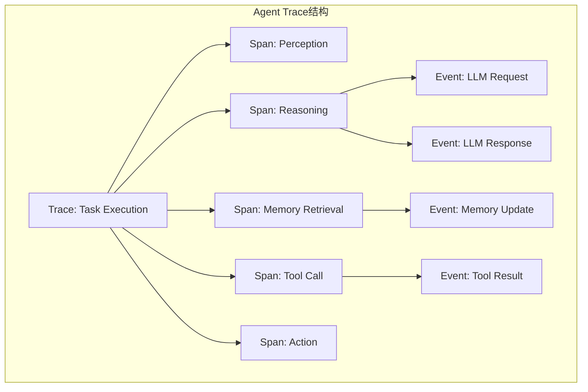
```mermaid
graph TB
    subgraph "Agent Trace结构"
        T1[Trace: Task Execution]
        T2[Span: Perception]
        T3[Span: Reasoning]
        T4[Span: Memory Retrieval]
        T5[Span: Tool Call]
        T6[Span: Action]
        T7[Event: LLM Request]
        T8[Event: LLM Response]
        T9[Event: Tool Result]
        T10[Event: Memory Update]
    end

    T1 --> T2
    T1 --> T3
    T1 --> T4
    T1 --> T5
    T1 --> T6
    T3 --> T7
    T3 --> T8
    T4 --> T10
    T5 --> T9
```

**成本优化策略**:

| 策略 | 实现方式 | 节约比例 |
|------|----------|----------|
| **模型分层** | 简单任务用小模型 | 60-80% |
| **缓存复用** | 相似查询结果缓存 | 20-40% |
| **批处理** | 非实时任务合并 | 30-50% |
| **蒸馏部署** | 本地小模型替代API | 90%+ |
| **记忆压缩** | 智能摘要减少token | 30-50% |

---

### 5.6 Flink作为Agent数据管道

**架构定位**:

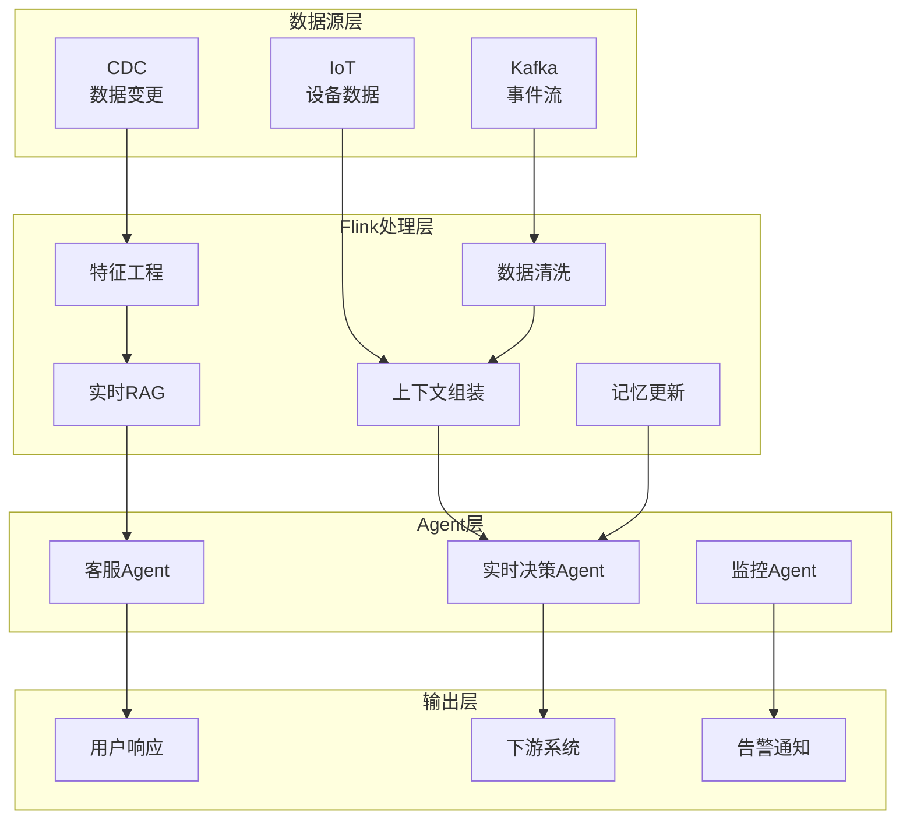
```mermaid
graph TB
    subgraph "数据源层"
        S1[Kafka<br/>事件流]
        S2[CDC<br/>数据变更]
        S3[IoT<br/>设备数据]
    end

    subgraph "Flink处理层"
        F1[数据清洗]
        F2[特征工程]
        F3[上下文组装]
        F4[实时RAG]
        F5[记忆更新]
    end

    subgraph "Agent层"
        A1[实时决策Agent]
        A2[客服Agent]
        A3[监控Agent]
    end

    subgraph "输出层"
        O1[用户响应]
        O2[下游系统]
        O3[告警通知]
    end

    S1 --> F1
    S2 --> F2
    S3 --> F3

    F1 --> F3
    F2 --> F4
    F3 --> A1
    F4 --> A2
    F5 --> A1

    A1 --> O2
    A2 --> O1
    A3 --> O3
```

---

## 6. 实例验证 (Examples)

### 6.1 完整实例: 智能客服Agent系统

**场景**: 电商平台的实时客服Agent，处理用户咨询、订单查询、退换货

**系统架构**:

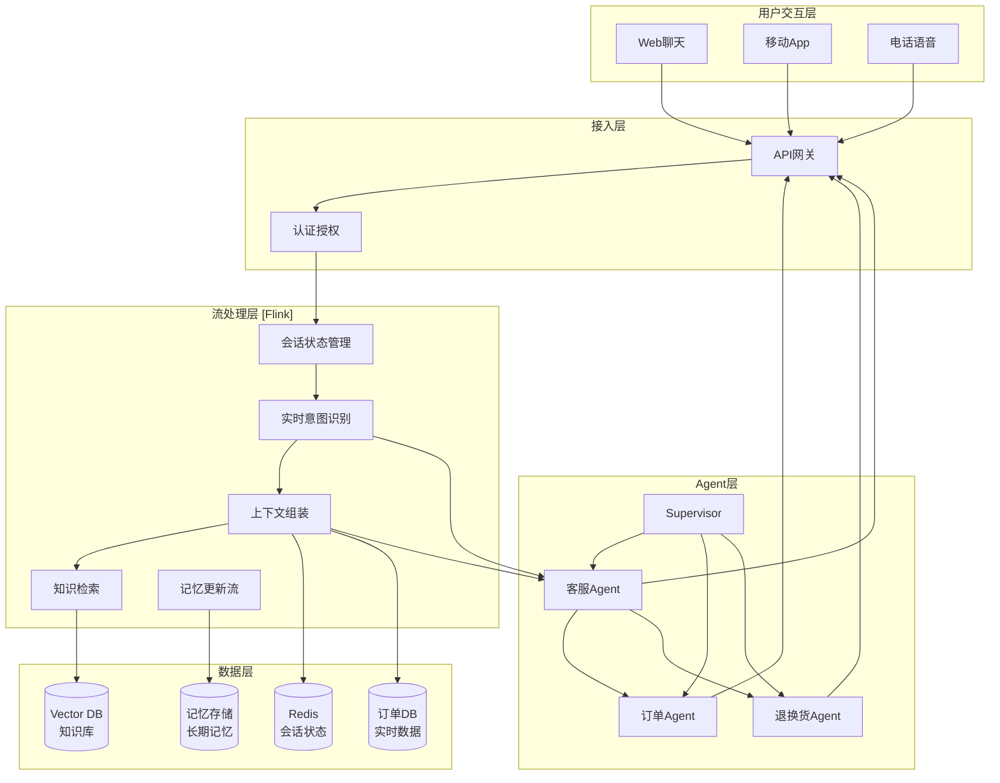
```mermaid
graph TB
    subgraph "用户交互层"
        U1[Web聊天]
        U2[移动App]
        U3[电话语音]
    end

    subgraph "接入层"
        GW[API网关]
        AUTH[认证授权]
    end

    subgraph "流处理层 [Flink]"
        F1[会话状态管理]
        F2[实时意图识别]
        F3[上下文组装]
        F4[知识检索]
        F5[记忆更新流]
    end

    subgraph "Agent层"
        A1[客服Agent]
        A2[订单Agent]
        A3[退换货Agent]
        A4[Supervisor]
    end

    subgraph "数据层"
        D1[(Vector DB<br/>知识库)]
        D2[(Redis<br/>会话状态)]
        D3[(订单DB<br/>实时数据)]
        D4[(记忆存储<br/>长期记忆)]
    end

    U1 --> GW
    U2 --> GW
    U3 --> GW
    GW --> AUTH
    AUTH --> F1

    F1 --> F2
    F2 --> F3
    F3 --> F4
    F4 --> D1
    F3 --> D2
    F3 --> D3
    F5 --> D4

    F2 --> A1
    F3 --> A1
    A1 --> A2
    A1 --> A3
    A4 --> A1
    A4 --> A2
    A4 --> A3

    A1 --> GW
    A2 --> GW
    A3 --> GW
```

**Agent实现代码**:

```python
# 客服Agent核心实现 (Python + LangChain风格)
from typing import List, Dict, Any
from dataclasses import dataclass
import asyncio

@dataclass
class AgentContext:
    session_id: str
    user_id: str
    conversation_history: List[Dict]
    user_profile: Dict
    retrieved_knowledge: List[str]
    short_term_memory: List[Dict]
    medium_term_memory: Dict
    long_term_context: List[str]
    order_info: Dict = None

class CustomerServiceAgent:
    def __init__(self):
        self.llm = ChatOpenAI(model="gpt-4o", temperature=0.2)
        self.tools = self._setup_tools()
        self.memory_manager = HierarchicalMemoryManager()
        self.state_machine = AgentStateMachine()

    def _setup_tools(self) -> List[Tool]:
        return [
            Tool(
                name="query_order",
                func=self._query_order,
                description="查询订单状态和详情"
            ),
            Tool(
                name="process_return",
                func=self._process_return,
                description="处理退换货申请"
            ),
            Tool(
                name="search_knowledge",
                func=self._search_knowledge,
                description="搜索产品知识和政策"
            ),
            Tool(
                name="update_preferences",
                func=self._update_preferences,
                description="更新用户偏好记忆"
            ),
            Tool(
                name="transfer_human",
                func=self._transfer_human,
                description="转接人工客服"
            )
        ]

    async def process(self, message: str, context: AgentContext) -> str:
        # Step 1: 更新短期记忆
        await self.memory_manager.update_stm(
            context.session_id,
            {"role": "user", "content": message}
        )

        # Step 2: 意图识别
        intent = await self._classify_intent(message, context)

        # Step 3: 记忆检索 (分层)
        memories = await self._retrieve_memories(context, intent)

        # Step 4: 上下文组装 (Streaming Join)
        enriched_context = await self._enrich_context(context, intent, memories)

        # Step 5: ReAct推理循环
        response = await self._react_loop(message, enriched_context)

        # Step 6: 更新记忆层次
        await self._update_all_memories(context.session_id, message, response, intent)

        return response

    async def _retrieve_memories(self, context: AgentContext, intent: str) -> Dict:
        """分层记忆检索"""
        tasks = {
            "stm": self.memory_manager.get_stm(context.session_id),
            "mtm": self.memory_manager.get_mtm(context.user_id),
            "ltm": self.memory_manager.search_ltm(intent, top_k=5),
            "episodic": self.memory_manager.get_similar_episodes(context.user_id, intent)
        }

        results = await asyncio.gather(*tasks.values())
        return dict(zip(tasks.keys(), results))

    async def _update_all_memories(self, session_id: str, message: str,
                                    response: str, intent: str):
        """流式更新所有记忆层次"""
        # STM - 立即更新
        await self.memory_manager.update_stm(session_id, {
            "role": "assistant",
            "content": response,
            "intent": intent
        })

        # MTM - 异步会话检查点
        asyncio.create_task(
            self.memory_manager.checkpoint_session(session_id)
        )

        # LTM - 异步提取洞察
        if self._is_insight_worthy(message, response):
            asyncio.create_task(
                self.memory_manager.extract_and_store_insight(
                    session_id, message, response
                )
            )

    async def _react_loop(self, message: str, context: AgentContext) -> str:
        """ReAct推理循环"""
        max_iterations = 5
        thoughts = []
        actions = []

        for i in range(max_iterations):
            # Thought: 推理下一步
            thought = await self._generate_thought(message, context, thoughts, actions)
            thoughts.append(thought)

            # 检查是否可以直接回答
            if "FINAL_ANSWER" in thought:
                return thought.replace("FINAL_ANSWER:", "").strip()

            # Action: 选择工具
            action = await self._select_action(thought, self.tools)
            actions.append(action)

            # 执行工具
            observation = await self._execute_action(action, context)

            # 更新上下文
            thoughts.append(f"Observation: {observation}")

        # 达到最大迭代次数,返回当前最佳答案
        return await self._generate_final_answer(thoughts)
```

---

### 6.2 Multi-Agent协作实例: 研究报告生成

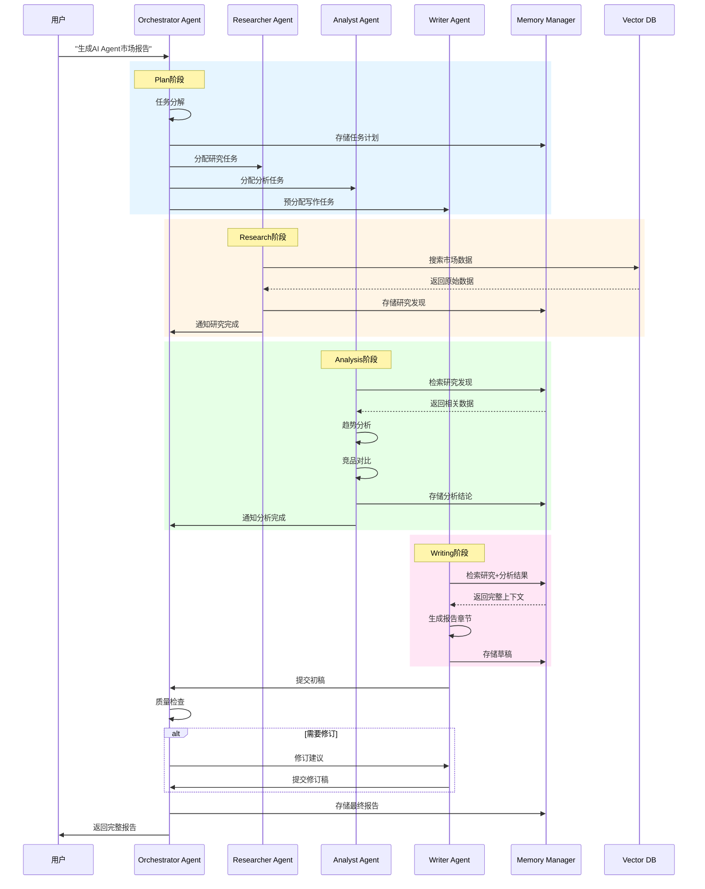
```mermaid
sequenceDiagram
    participant U as 用户
    participant O as Orchestrator Agent
    participant R as Researcher Agent
    participant A as Analyst Agent
    participant W as Writer Agent
    participant M as Memory Manager
    participant V as Vector DB

    U->>O: "生成AI Agent市场报告"

    rect rgb(230, 245, 255)
        Note over O: Plan阶段
        O->>O: 任务分解
        O->>M: 存储任务计划
        O->>R: 分配研究任务
        O->>A: 分配分析任务
        O->>W: 预分配写作任务
    end

    rect rgb(255, 245, 230)
        Note over R: Research阶段
        R->>V: 搜索市场数据
        V-->>R: 返回原始数据
        R->>M: 存储研究发现
        R->>O: 通知研究完成
    end

    rect rgb(230, 255, 230)
        Note over A: Analysis阶段
        A->>M: 检索研究发现
        M-->>A: 返回相关数据
        A->>A: 趋势分析
        A->>A: 竞品对比
        A->>M: 存储分析结论
        A->>O: 通知分析完成
    end

    rect rgb(255, 230, 245)
        Note over W: Writing阶段
        W->>M: 检索研究+分析结果
        M-->>W: 返回完整上下文
        W->>W: 生成报告章节
        W->>M: 存储草稿
    end

    W->>O: 提交初稿
    O->>O: 质量检查
    alt 需要修订
        O->>W: 修订建议
        W->>O: 提交修订稿
    end
    O->>M: 存储最终报告
    O->>U: 返回完整报告
```

---

### 6.3 记忆流式更新实例

```java
import org.apache.flink.streaming.api.environment.StreamExecutionEnvironment;

import org.apache.flink.streaming.api.datastream.DataStream;
import org.apache.flink.streaming.api.windowing.time.Time;


// Flink记忆更新流处理
public class MemoryUpdateJob {

    public static void main(String[] args) throws Exception {
        StreamExecutionEnvironment env =
            StreamExecutionEnvironment.getExecutionEnvironment();

        // 记忆更新事件流
        DataStream<MemoryEvent> memoryEvents = env
            .addSource(new KafkaSource<MemoryEvent>()
                .setTopics("agent-memory-updates")
                .setGroupId("memory-processor"))
            .keyBy(MemoryEvent::getUserId);

        // 分层处理
        DataStream<MemoryUpdate> stmUpdates = memoryEvents
            .filter(e -> e.getTargetTier() == MemoryTier.STM)
            .process(new STMUpdateFunction());

        DataStream<MemoryUpdate> ltmUpdates = memoryEvents
            .filter(e -> e.getTargetTier() == MemoryTier.LTM)
            .map(new EmbeddingFunction())
            .addSink(new VectorDBSink());

        DataStream<MemoryUpdate> mtmUpdates = memoryEvents
            .filter(e -> e.getTargetTier() == MemoryTier.MTM)
            .window(TumblingProcessingTimeWindows.of(Time.minutes(5)))
            .process(new SessionSummarizationFunction())
            .addSink(new DocumentDBSink());

        env.execute("Agent Memory Streaming Updates");
    }
}
```

---

## 7. 可视化 (Visualizations)

### 7.1 AI Agent流式架构全景图

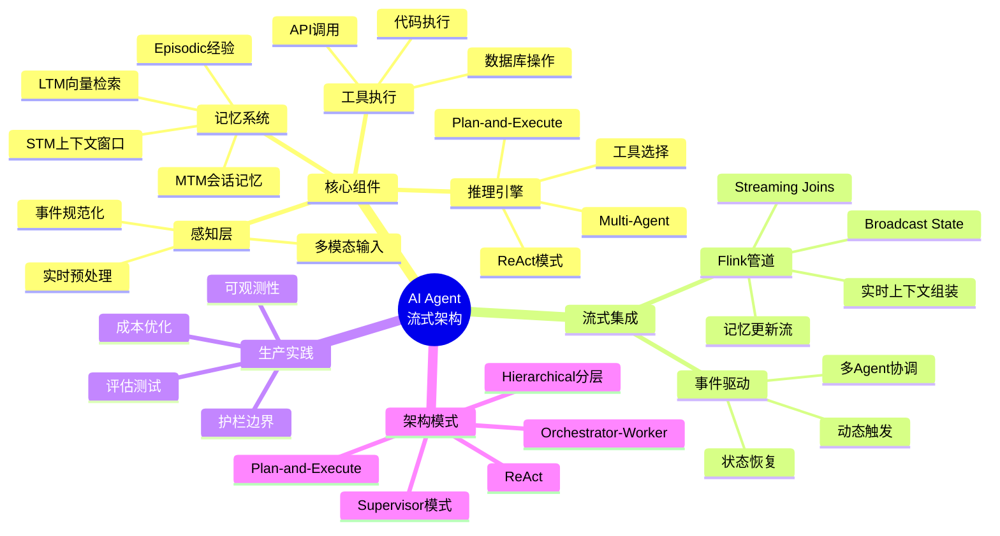
```mermaid
mindmap
  root((AI Agent
  流式架构))
    核心组件
      感知层
        多模态输入
        实时预处理
        事件规范化
      推理引擎
        ReAct模式
        Plan-and-Execute
        Multi-Agent
        工具选择
      记忆系统
        STM上下文窗口
        MTM会话记忆
        LTM向量检索
        Episodic经验
      工具执行
        API调用
        代码执行
        数据库操作
    流式集成
      Flink管道
        实时上下文组装
        Streaming Joins
        Broadcast State
        记忆更新流
      事件驱动
        动态触发
        多Agent协调
        状态恢复
    生产实践
      评估测试
      护栏边界
      可观测性
      成本优化
    架构模式
      ReAct
      Plan-and-Execute
      Orchestrator-Worker
      Supervisor模式
      Hierarchical分层
```

---

### 7.2 多Agent协作拓扑演进

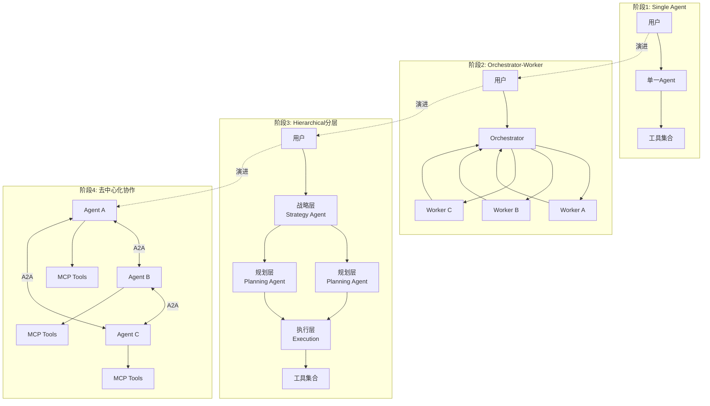
```mermaid
graph TB
    subgraph "阶段1: Single Agent"
        S1[用户] --> S2[单一Agent]
        S2 --> S3[工具集合]
    end

    subgraph "阶段2: Orchestrator-Worker"
        O1[用户] --> O2[Orchestrator]
        O2 --> O3[Worker A]
        O2 --> O4[Worker B]
        O2 --> O5[Worker C]
        O3 --> O2
        O4 --> O2
        O5 --> O2
    end

    subgraph "阶段3: Hierarchical分层"
        H1[用户] --> H2[战略层<br/>Strategy Agent]
        H2 --> H3[规划层<br/>Planning Agent]
        H2 --> H4[规划层<br/>Planning Agent]
        H3 --> H5[执行层<br/>Execution]
        H4 --> H5
        H5 --> H6[工具集合]
    end

    subgraph "阶段4: 去中心化协作"
        D1[Agent A] <-->|A2A| D2[Agent B]
        D2 <-->|A2A| D3[Agent C]
        D3 <-->|A2A| D1
        D1 --> D4[MCP Tools]
        D2 --> D5[MCP Tools]
        D3 --> D6[MCP Tools]
    end

    S1 -.->|演进| O1
    O1 -.->|演进| H1
    H1 -.->|演进| D1
```

---

### 7.3 记忆层次架构图

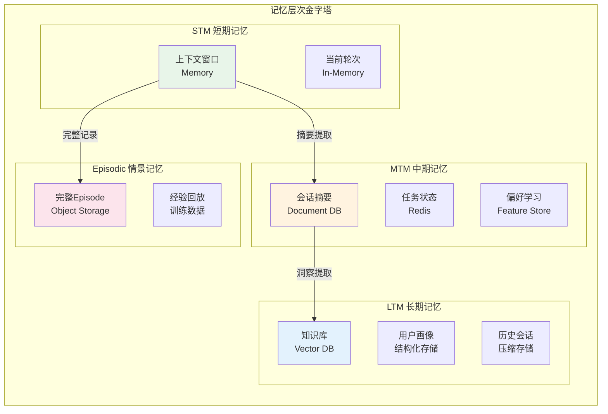
```mermaid
graph TB
    subgraph "记忆层次金字塔"
        direction TB

        subgraph "LTM 长期记忆"
            L1[知识库<br/>Vector DB]
            L2[用户画像<br/>结构化存储]
            L3[历史会话<br/>压缩存储]
        end

        subgraph "MTM 中期记忆"
            M1[会话摘要<br/>Document DB]
            M2[任务状态<br/>Redis]
            M3[偏好学习<br/>Feature Store]
        end

        subgraph "STM 短期记忆"
            S1[上下文窗口<br/>Memory]
            S2[当前轮次<br/>In-Memory]
        end

        subgraph "Episodic 情景记忆"
            E1[完整Episode<br/>Object Storage]
            E2[经验回放<br/>训练数据]
        end
    end

    S1 -->|摘要提取| M1
    M1 -->|洞察提取| L1
    S1 -->|完整记录| E1

    style L1 fill:#e3f2fd
    style M1 fill:#fff3e0
    style S1 fill:#e8f5e9
    style E1 fill:#fce4ec
```

---

### 7.4 Agent工作流编排对比

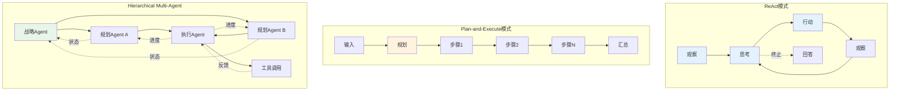
```mermaid
graph TB
    subgraph "ReAct模式"
        R1[观察] --> R2[思考]
        R2 --> R3[行动]
        R3 --> R4[观察]
        R4 --> R2
        R2 -.->|终止| R5[回答]
    end

    subgraph "Plan-and-Execute模式"
        P1[输入] --> P2[规划]
        P2 --> P3[步骤1]
        P3 --> P4[步骤2]
        P4 --> P5[步骤N]
        P5 --> P6[汇总]
    end

    subgraph "Hierarchical Multi-Agent"
        H1[战略Agent] --> H2[规划Agent A]
        H1 --> H3[规划Agent B]
        H2 --> H4[执行Agent]
        H3 --> H4
        H4 --> H5[工具调用]
        H5 -.->|反馈| H4
        H4 -.->|进度| H2
        H4 -.->|进度| H3
        H2 -.->|状态| H1
        H3 -.->|状态| H1
    end

    style R1 fill:#e3f2fd
    style R2 fill:#e3f2fd
    style R3 fill:#e3f2fd
    style P2 fill:#fff3e0
    style H1 fill:#e8f5e9
```

| 维度 | ReAct | Plan-and-Execute | Hierarchical Multi-Agent |
|------|-------|------------------|--------------------------|
| **适用任务** | 工具依赖不确定 | 步骤可预先规划 | 复杂多域任务 |
| **灵活性** | 高（自适应） | 中（需重新规划） | 高（动态调度） |
| **可解释性** | 中等 | 高（计划清晰） | 高（层级清晰） |
| **效率** | 可能多步探索 | 执行更高效 | 并行度高 |
| **容错性** | 可动态调整 | 需显式错误处理 | 层级隔离容错 |
| **延迟** | 中等 | 低（预规划） | 可并行降低 |

---

### 7.5 Flink+Agent集成架构

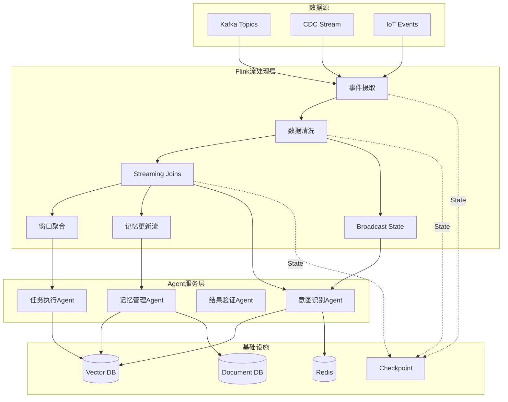
```mermaid
graph TB
    subgraph "数据源"
        K[Kafka Topics]
        C[CDC Stream]
        I[IoT Events]
    end

    subgraph "Flink流处理层"
        F1[事件摄取]
        F2[数据清洗]
        F3[Streaming Joins]
        F4[Broadcast State]
        F5[窗口聚合]
        F6[记忆更新流]
    end

    subgraph "Agent服务层"
        A1[意图识别Agent]
        A2[任务执行Agent]
        A3[结果验证Agent]
        A4[记忆管理Agent]
    end

    subgraph "基础设施"
        V[(Vector DB)]
        R[(Redis)]
        D[(Document DB)]
        CK[Checkpoint]
    end

    K --> F1
    C --> F1
    I --> F1

    F1 --> F2
    F2 --> F3
    F2 --> F4
    F3 --> F5
    F3 --> F6

    F3 --> A1
    F4 --> A1
    F5 --> A2
    F6 --> A4

    A1 --> V
    A1 --> R
    A2 --> V
    A4 --> V
    A4 --> D

    F1 -.->|State| CK
    F2 -.->|State| CK
    F3 -.->|State| CK
```

---

### 7.6 Agent生产部署决策树

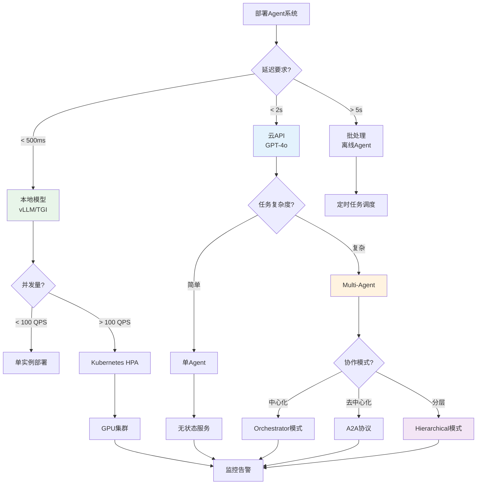
```mermaid
flowchart TD
    A[部署Agent系统] --> B{延迟要求?}

    B -->|< 500ms| C[本地模型<br/>vLLM/TGI]
    B -->|< 2s| D[云API<br/>GPT-4o]
    B -->|> 5s| E[批处理<br/>离线Agent]

    C --> F{并发量?}
    D --> G{任务复杂度?}
    E --> H[定时任务调度]

    F -->|< 100 QPS| I[单实例部署]
    F -->|> 100 QPS| J[Kubernetes HPA]

    G -->|简单| K[单Agent]
    G -->|复杂| L[Multi-Agent]

    J --> M[GPU集群]
    K --> N[无状态服务]
    L --> O{协作模式?}

    O -->|中心化| P[Orchestrator模式]
    O -->|去中心化| Q[A2A协议]
    O -->|分层| R[Hierarchical模式]

    M --> S[监控告警]
    N --> S
    P --> S
    Q --> S
    R --> S

    style C fill:#e8f5e9
    style D fill:#e3f2fd
    style L fill:#fff3e0
    style R fill:#f3e5f5
```

---

## 8. 引用参考 (References)


---

## 附录：关键术语速查

| 术语 | 定义 | 相关概念 |
|------|------|----------|
| **AI Agent** | 感知-推理-行动循环的自主系统 | LLM, ReAct |
| **ReAct** | 交错推理与行动的Agent模式 | Chain-of-Thought |
| **Plan-and-Execute** | 先规划后执行的Agent模式 | Task Decomposition |
| **STM** | 短期记忆，当前上下文窗口 | Context Window |
| **MTM** | 中期记忆，会话级上下文 | Session Memory |
| **LTM** | 长期记忆，持久化向量存储 | Vector DB, RAG |
| **Tool Calling** | Agent调用外部工具的能力 | Function Calling, MCP |
| **Orchestrator** | 协调多Agent工作的中心节点 | Multi-Agent |
| **Guardrails** | Agent行为的边界保护机制 | Safety, Alignment |
| **Streaming Joins** | 实时多流数据关联 | Flink, Window |
| **Broadcast State** | Flink动态规则分发模式 | Dynamic Rules |
| **A2A Protocol** | Agent间通信的开放协议 | Google A2A |
| **MCP Protocol** | 模型上下文协议 | Anthropic MCP |

---

*文档版本: v2.0 | 更新日期: 2026-04-08 | 状态: Active*
*更新内容: 补充Multi-Agent协作、状态机定义、分层记忆管理机制*
