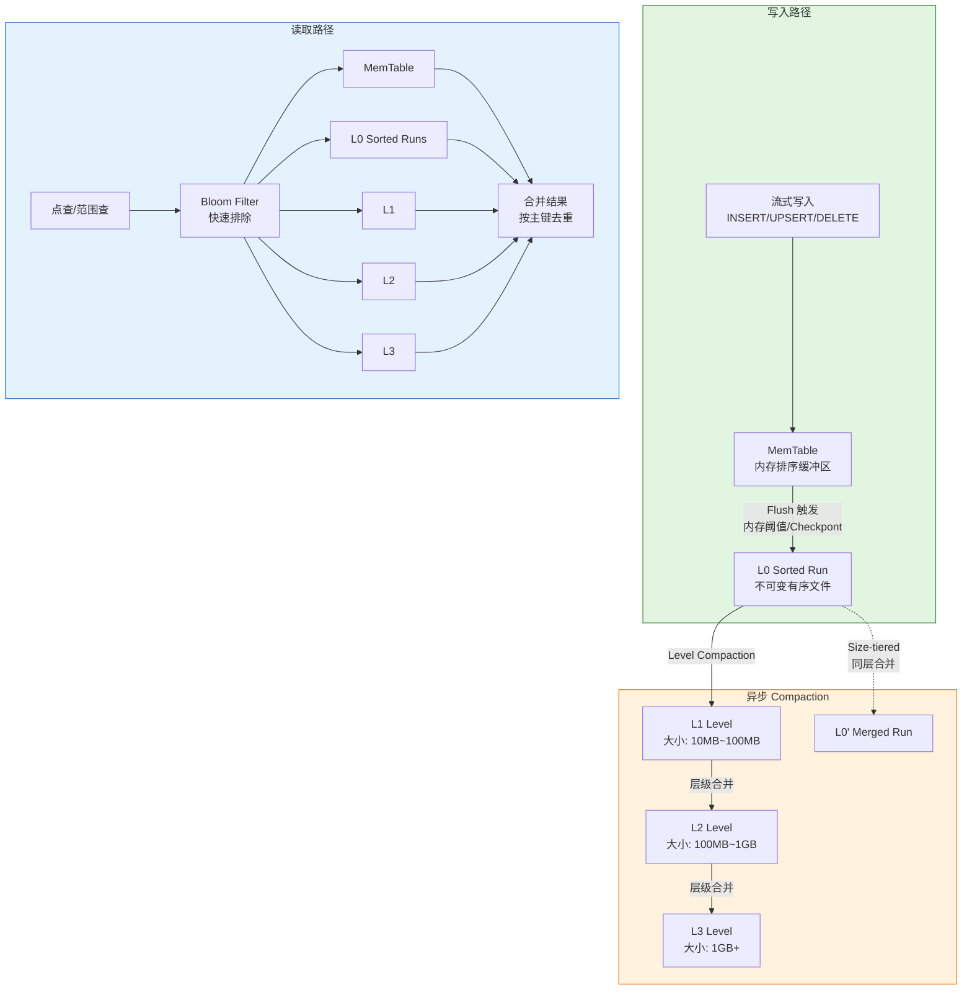
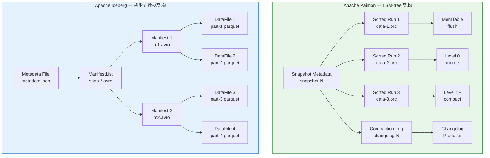
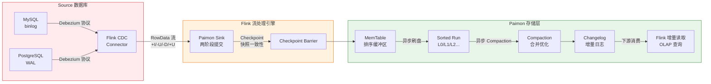

# Apache Paimon LSM-tree 架构深度解析

> **所属阶段**: Knowledge/06-frontier | **前置依赖**: [Flink/02-core/streaming-lakehouse-integration.md](../Flink/02-core/streaming-lakehouse-integration.md), [Knowledge/05-mapping-guides/lakehouse-architecture-comparison.md](../05-mapping-guides/lakehouse-architecture-comparison.md) | **形式化等级**: L4 | **最后更新**: 2026-05-06

---

## 目录

- [Apache Paimon LSM-tree 架构深度解析](#apache-paimon-lsm-tree-架构深度解析)
  - [目录](#目录)
  - [1. 概念定义 (Definitions)](#1-概念定义-definitions)
    - [Def-K-06-270: Paimon LSM-tree 状态空间](#def-k-06-270-paimon-lsm-tree-状态空间)
    - [Def-K-06-271: Paimon Snapshot 一致性](#def-k-06-271-paimon-snapshot-一致性)
    - [Def-K-06-272: Paimon Changelog 语义](#def-k-06-272-paimon-changelog-语义)
    - [Def-K-06-273: Paimon Compaction 操作](#def-k-06-273-paimon-compaction-操作)
    - [Def-K-06-274: Paimon CDC 原生写入模型](#def-k-06-274-paimon-cdc-原生写入模型)
  - [2. 属性推导 (Properties)](#2-属性推导-properties)
    - [Lemma-K-06-270: Snapshot 单调性](#lemma-k-06-270-snapshot-单调性)
    - [Lemma-K-06-271: Compaction 不降低读取一致性](#lemma-k-06-271-compaction-不降低读取一致性)
  - [3. 关系建立 (Relations)](#3-关系建立-relations)
    - [3.1 Paimon vs Iceberg：架构本质差异](#31-paimon-vs-iceberg架构本质差异)
    - [3.2 Paimon 在 Flink 生态中的定位](#32-paimon-在-flink-生态中的定位)
    - [3.3 Paimon vs Delta Lake](#33-paimon-vs-delta-lake)
  - [4. 论证过程 (Argumentation)](#4-论证过程-argumentation)
    - [4.1 读放大 vs 写放大权衡](#41-读放大-vs-写放大权衡)
    - [4.2 异步压缩的边界条件](#42-异步压缩的边界条件)
    - [4.3 时间旅行与快照管理](#43-时间旅行与快照管理)
  - [5. 形式证明 / 工程论证 (Proof / Engineering Argument)](#5-形式证明--工程论证-proof--engineering-argument)
    - [Thm-K-06-270: Compaction 保持 Snapshot 语义一致性](#thm-k-06-270-compaction-保持-snapshot-语义一致性)
  - [6. 实例验证 (Examples)](#6-实例验证-examples)
    - [6.1 阿里云实时数仓场景](#61-阿里云实时数仓场景)
    - [6.2 MySQL CDC 直接写入](#62-mysql-cdc-直接写入)
    - [6.3 Lookup Join 与增量查询](#63-lookup-join-与增量查询)
  - [7. 可视化 (Visualizations)](#7-可视化-visualizations)
    - [7.1 Paimon LSM-tree 核心结构](#71-paimon-lsm-tree-核心结构)
    - [7.2 Paimon vs Iceberg 架构对比](#72-paimon-vs-iceberg-架构对比)
    - [7.3 CDC 数据流：MySQL → Flink → Paimon](#73-cdc-数据流mysql--flink--paimon)
  - [8. 引用参考 (References)](#8-引用参考-references)

---

## 1. 概念定义 (Definitions)

### Def-K-06-270: Paimon LSM-tree 状态空间

**定义（Paimon LSM-tree 状态空间）**: Apache Paimon 的表状态由五元组 $\mathcal{S} = (M, R, L, \Sigma, C)$ 刻画，其中：

- $M$ 为 **MemTable**（内存表）：处于活跃写入状态的排序内存缓冲区，采用跳表（Skip List）或 B+Tree 实现，支持 $O(\log n)$ 插入与 $O(1)$ 顺序扫描；
- $R = \{R_1, R_2, \dots, R_k\}$ 为 **Sorted Run** 集合：MemTable 刷盘（flush）后形成的不可变排序文件组，每个 Sorted Run 内部按主键有序；
- $L = \{L_0, L_1, \dots, L_{max}\}$ 为 **Compaction Level** 层级：Sorted Run 经合并后按大小分层组织的结构，满足 $size(L_{i+1}) \geq r \cdot size(L_i)$（$r$ 为层级比例因子，通常 $r = 10$）；
- $\Sigma$ 为 **Snapshot 序列**：$\Sigma = (s_1, s_2, \dots, s_n)$，每个 $s_i$ 为全局一致的元数据快照；
- $C$ 为 **Changelog 流**：由 Compaction 和更新操作衍生的增量变更日志序列。

Paimon 的 LSM-tree 状态空间遵循**追加优先**（append-friendly）原则：所有写入操作仅追加 MemTable 或生成新 Sorted Run，不修改已有文件。这一设计使 Paimon 天然适配流式写入负载，避免了传统 B+Tree 的随机写放大问题[^1][^2]。

---

### Def-K-06-271: Paimon Snapshot 一致性

**定义（Paimon Snapshot 一致性）**: 设 $s_t$ 为时刻 $t$ 的 Paimon 快照，则 $s_t$ 满足以下一致性条件：

1. **原子性（Atomicity）**: $s_t$ 引用的全部数据文件集合 $F(s_t) = \{f_1, f_2, \dots, f_m\}$ 要么全部可见，要么全部不可见；
2. **时间点一致性（Point-in-Time Consistency）**: $s_t$ 对应全局单调递增的时间戳 $ts_t$，满足 $\forall i < j, ts_i < ts_j$；
3. **隔离性（Isolation）**: 并发生成的快照 $s_t$ 与 $s_{t'}$（$t \neq t'$）互不影响，读操作始终基于某一确定快照的完整文件集合执行。

形式化地，Paimon Snapshot 一致性模型为**快照隔离**（Snapshot Isolation, SI）在文件系统层面的实现：每次提交生成一个新的不可变快照元数据文件（`snapshot-{id}`），该文件枚举了当前表的全部有效数据文件路径，读操作通过解析快照元数据定位数据，而非直接扫描文件目录[^3]。

---

### Def-K-06-272: Paimon Changelog 语义

**定义（Paimon Changelog 语义）**: Paimon 的 Changelog 是一种**双模式增量表示**（Dual-Mode Delta Representation），定义为三元组 $\Delta = (+, -, U)$，其中：

- **$+$（INSERT）**: 新增记录，表示此前不存在的主键记录首次出现；
- **$-$（DELETE）**: 删除记录，表示某主键记录从表中移除；
- **$U$（UPDATE）**: 更新记录，Paimon 内部将 UPDATE 拆解为 $(-, +)$ 对，即先 DELETE 旧值再 INSERT 新值。

Paimon 通过 **Changelog Producer** 机制自动生成 Changelog：

- **Lookup Changelog Producer**：基于主键查找旧值，生成完整的 $(-, +)$ 更新对；
- **Full Compaction Changelog Producer**：在 Compaction 完成后，对比前后两个版本的 Sorted Run 差异，导出增量变更；
- **None**：不生成 Changelog，适用于仅追加（append-only）场景。

Changelog 的语义保证为：对于任意快照序列 $\Sigma = (s_1, s_2, \dots, s_n)$，存在对应的 Changelog 序列 $C = (\delta_1, \delta_2, \dots, \delta_{n-1})$，使得 $s_{i+1} = apply(s_i, \delta_i)$，即逐条应用 Changelog 可精确重建后续快照[^4]。

---

### Def-K-06-273: Paimon Compaction 操作

**定义（Paimon Compaction 操作）**: Paimon Compaction 是一个状态转换函数 $compact: \mathcal{S} \rightarrow \mathcal{S}'$，将当前 LSM-tree 状态 $\mathcal{S}$ 转换为更紧凑的状态 $\mathcal{S}'$，满足：

$$compact(M, R, L, \Sigma, C) = (M, R', L', \Sigma \oplus s_{new}, C \oplus \delta_{comp})$$

其中：

- $R'$ 为合并后的 Sorted Run 集合，满足 $|R'| \leq |R|$；
- $L'$ 为重新组织的 Compaction Level，满足层级大小约束 $size(L'_{i+1}) \geq r \cdot size(L'_i)$；
- $s_{new}$ 为 Compaction 完成后生成的新快照；
- $\delta_{comp}$ 为 Compaction 过程中检测到的数据变更（当使用 Full Compaction Changelog Producer 时）。

Paimon 支持三种 Compaction 策略：

1. **Level Compaction**（层级合并）：Leveled 策略，类似 RocksDB，每层大小按指数增长，优先合并相邻层级；
2. **Size-tiered Compaction**（大小分层）：Size-Tiered 策略，将大小相近的 Sorted Run 合并，写放大较小但读放大较大；
3. **Incremental Compaction**（增量合并）：Paimon 特有策略，仅合并部分重叠的 Sorted Run，最小化 Compaction 开销[^5]。

---

### Def-K-06-274: Paimon CDC 原生写入模型

**定义（Paimon CDC 原生写入模型）**: Paimon CDC 写入模型是一个四元组 $\mathcal{CDC} = (S, P, W, M)$，其中：

- $S$ 为 **Source 数据库**（MySQL/PostgreSQL 等），通过 CDC 连接器捕获变更事件流；
- $P$ 为 **Paimon Sink 算子**，将 CDC 事件流直接映射为 Paimon 的 LSM-tree 写入操作；
- $W$ 为 **写入语义**，支持 `UPSERT`（主键去重）、`APPEND`（仅追加）和 `OVERWRITE`（覆盖写入）三种模式；
- $M$ 为 **元数据映射**，将 Source 表的 schema、主键、分区键映射到 Paimon 表的对应元数据结构。

CDC 原生支持的核心特性为**无 ETL 直写**（ETL-free Direct Ingestion）：CDC 事件流不经过中间转换层，直接由 Flink Paimon Sink 消费并写入 LSM-tree，延迟可达秒级。Paimon 通过 `sequence.field` 机制处理乱序事件：当同一主键的多个变更事件乱序到达时，以用户指定的序列字段（如 binlog position 或时间戳）为准进行排序，确保最终一致性[^6]。

---

## 2. 属性推导 (Properties)

### Lemma-K-06-270: Snapshot 单调性

**引理（Snapshot 单调性）**: 对于 Paimon 表的任意两个快照 $s_i, s_j \in \Sigma$，若 $i < j$（即 $s_i$ 先于 $s_j$ 生成），则 $s_i$ 引用的全部数据文件集合是 $s_j$ 引用集合的子集或与之不相交：

$$F(s_i) \subseteq F(s_j) \quad \lor \quad F(s_i) \cap F(s_j) = \varnothing$$

**证明概要**: Paimon 采用**写时复制**（Copy-on-Write, CoW）语义，每次提交仅追加新文件并生成新的快照元数据。旧快照引用的文件不会被修改或删除（仅在 Compaction 后由垃圾回收器异步清理）。因此，后生成的快照 $s_j$ 要么继承 $s_i$ 的全部文件并追加新文件（$F(s_i) \subseteq F(s_j)$），要么在 Compaction 后由新文件完全替代旧文件（不相交）。∎

---

### Lemma-K-06-271: Compaction 不降低读取一致性

**引理（Compaction 不降低读取一致性）**: 设 $s$ 为 Compaction 前的快照，$s'$ 为 Compaction 完成后生成的新快照。对于基于 $s$ 执行的任意查询 $Q$，存在基于 $s'$ 的等价查询 $Q'$，使得 $Q(s) = Q'(s')$。

**证明概要**: Compaction 操作 $compact$ 仅合并和重写数据文件，不改变数据的逻辑内容。根据 Def-K-06-273，$compact$ 是状态转换函数，其输出 $L'$ 中的全部记录集合与输入 $L$ 中的记录集合相等（按主键去重后的逻辑视图一致）。因此，对于任意扫描查询，$s'$ 的文件集合提供了与 $s$ 相同的主键到记录的映射关系。对于范围查询，Sorted Run 的有序性保证在 Compaction 前后均维持，查询计划器可生成等价的扫描范围。∎

---

## 3. 关系建立 (Relations)

### 3.1 Paimon vs Iceberg：架构本质差异

Paimon 与 Apache Iceberg 是当前 Lakehouse 生态中最具代表性的两种表格式，其架构设计哲学存在本质差异[^7][^8]：

| 维度 | Apache Paimon | Apache Iceberg |
|------|--------------|----------------|
| **核心数据结构** | LSM-tree（Sorted Run + Compaction Level） | 树形元数据（Metadata → ManifestList → Manifest） |
| **写入模型** | 追加优先，流式写入原生支持 | 写时复制（CoW），批处理优化 |
| **更新语义** | 主键 UPSERT 原生支持 | 需通过 Merge-on-Read（MoR）或 CoW 模拟 |
| **Changelog 生成** | 内置 Changelog Producer | 依赖外部引擎（如 Flink CDC）生成 |
| **Compaction** | 异步增量合并，与写入流水线解耦 | 需显式触发 Rewrite DataFiles |
| **延迟可见性** | 秒级（MemTable 刷盘即可见） | 分钟级（依赖提交周期） |
| **流批统一** | 统一存储层，同一表支持流读/批读 | 批处理为主，流读需额外适配 |

**本质差异分析**：

Iceberg 的树形元数据设计（`Metadata` → `ManifestList` → `Manifest` → `DataFile`）本质上是一种**文件目录的层次索引**，其核心假设是数据文件一旦写入即不可变，更新操作通过生成新的数据文件并更新元数据树实现。这种设计对批处理场景极为友好（大文件、顺序扫描），但对高频流式更新支持较弱：每次更新需重写整个数据文件或依赖 MoR 的读时合并，导致流读延迟高、写放大严重[^7]。

Paimon 的 LSM-tree 设计则**从流式场景出发**：MemTable 吸收高频小写入，Sorted Run 提供有序的文件组织，Compaction 在后台异步合并。其关键是将"写放大"与"读放大"的权衡从文件级别下放到 Sorted Run 级别，通过细粒度的增量合并实现低延迟可见性[^2]。

### 3.2 Paimon 在 Flink 生态中的定位

Paimon 是 Flink 社区从 Table Store 演进而来的原生 Lakehouse 格式，与 Flink 的集成深度远超其他表格式：

- **Source 读取**：Flink SQL `SELECT` 可直接读取 Paimon 表，支持批量扫描、增量读取和 Changelog 消费三种模式；
- **Sink 写入**：Flink SQL `INSERT` 通过 Paimon Sink 将数据流写入 LSM-tree，支持 Exactly-Once 语义（通过 Checkpoint 两阶段提交）；
- **Lookup Join**：Paimon 支持作为维表参与 Flink 的异步 Lookup Join，利用 LSM-tree 的有序性和布隆过滤器实现毫秒级点查；
- **流批一体**：同一 Paimon 表既可作为 Flink 流作业的 Sink，也可作为 Flink 批作业的 Source，无需数据导出或格式转换[^3]。

### 3.3 Paimon vs Delta Lake

Delta Lake 采用**事务日志**（Transaction Log）机制，将每次表变更记录为一系列 JSON 格式的日志文件，数据文件本身为 Parquet 格式。与 Paimon 的对比：

- **更新效率**：Delta Lake 的更新需重写整个 Parquet 文件（CoW）或维护删除向量（MoR），Paimon 的 LSM-tree 通过 MemTable 和 Sorted Run 天然支持细粒度更新；
- **流式支持**：Delta Lake 的流读依赖 `readStream` 的增量文件发现，延迟通常在分钟级；Paimon 支持秒级增量可见性；
- **Changelog**：Delta Lake 不原生生成 Changelog，需依赖 Flink CDC 等外部工具；Paimon 内置 Changelog Producer[^8]。

---

## 4. 论证过程 (Argumentation)

### 4.1 读放大 vs 写放大权衡

LSM-tree 的经典权衡为**读放大**（Read Amplification, RA）与**写放大**（Write Amplification, WA）的此消彼长：

- **写放大 $WA$**：单次逻辑写入触发的实际 I/O 写入量。Paimon 中，$WA = 1 + \sum_{i=1}^{max} p_i$，其中 $p_i$ 为记录在 Level $i$ 被 Compaction 重写的次数；
- **读放大 $RA$**：单次逻辑读取需扫描的实际文件数。Paimon 中，$RA = |M| + \sum_{i=0}^{max} |L_i|$，其中 $|M|$ 为活跃 MemTable 数，$|L_i|$ 为 Level $i$ 中需扫描的 Sorted Run 数。

Paimon 的 **Incremental Compaction** 策略通过以下机制优化权衡：

1. **局部合并**：仅合并与写入键范围重叠的 Sorted Run，而非全量合并；
2. **层级阈值**：每层 Sorted Run 数量设有上限 $k$，当 $|L_i| > k$ 时触发合并，确保 $RA$ 有界；
3. **异步执行**：Compaction 与写入流水线解耦，写入路径不受 Compaction 阻塞，$WA$ 对延迟的影响被隔离到后台。

在阿里云实时数仓的生产实践中，Paimon 的增量 Compaction 将写放大控制在 $3\sim5$ 倍，读放大控制在 $2\sim4$ 个 Sorted Run，显著优于 Iceberg MoR 的 $10\sim20$ 倍写放大（更新场景）[^9]。

### 4.2 异步压缩的边界条件

Paimon 的异步 Compaction 虽提升了写入吞吐，但需关注以下边界条件：

1. **Compaction 滞后（Compaction Lag）**：当写入速率远高于 Compaction 速率时，Sorted Run 数量持续增长，导致读放大急剧上升。Paimon 通过 `num-sorted-run.compaction-trigger` 参数控制触发阈值，当 Sorted Run 数超过阈值时强制触发 Compaction；
2. **空间放大（Space Amplification）**：Compaction 完成前，旧文件与新文件同时存在，临时占用双倍存储空间。Paimon 的 `snapshot.time-retained` 参数控制快照保留时间，过期快照的孤儿文件由垃圾回收器清理；
3. **Changelog 完整性**：当使用 Full Compaction Changelog Producer 时，Compaction 频率直接影响 Changelog 的时效性。若 Compaction 间隔过长，下游消费的 Changelog 粒度变粗，可能影响增量计算的精确性[^5]。

### 4.3 时间旅行与快照管理

Paimon 的时间旅行（Time Travel）能力基于 Snapshot 序列 $\Sigma$ 的不可变性：

- **历史快照查询**：用户可通过 `SELECT * FROM t AS OF TIMESTAMP '2026-05-01 00:00:00'` 语法查询历史时刻的表状态；
- **快照过期策略**：`snapshot.num-retained.min` 和 `snapshot.num-retained.max` 控制保留的快照数量，过期快照的元数据文件和数据文件由异步清理线程回收；
- **分支与标签**（v0.8+）：Paimon 支持类似 Iceberg 的分支（Branch）和标签（Tag）机制，允许为关键快照打标签，防止其被过期策略误删[^3]。

---

## 5. 形式证明 / 工程论证 (Proof / Engineering Argument)

### Thm-K-06-270: Compaction 保持 Snapshot 语义一致性

**定理（Compaction 保持 Snapshot 语义一致性）**: 对于 Paimon 表的任意 Compaction 操作 $compact: \mathcal{S} \rightarrow \mathcal{S}'$，设 $s \in \Sigma$ 为 Compaction 前的快照，$s' \in \Sigma'$ 为 Compaction 后生成的新快照。则对于任意符合谓词 $P$ 的查询 $Q_P$，有：

$$Q_P(s) \equiv Q_P(s')$$

即 Compaction 不改变任何快照的查询语义。

**证明**:

我们需要证明 Compaction 操作 $compact$ 在逻辑数据层面是一个**恒等变换**（identity transformation），仅在物理存储层面进行重组。

**步骤 1：定义 Compaction 的逻辑不变量**

设 $D(s)$ 为快照 $s$ 的逻辑数据集合，即按主键去重后的全部记录：

$$D(s) = \{(k, v) \mid k \in PK, v = latest(k, F(s))\}$$

其中 $PK$ 为主键空间，$latest(k, F(s))$ 返回文件集合 $F(s)$ 中主键 $k$ 的最新值。

根据 Def-K-06-273，Compaction 操作 $compact$ 的转换满足：

$$\forall f \in F(s), \exists f' \in F(s'), content(f) \subseteq content(f') \lor content(f) \text{ 被合并到 } f'$$

且 Compaction 不引入新记录、不删除已有记录（仅物理删除已被新文件覆盖的旧版本）。

**步骤 2：证明主键到值的映射不变**

对于任意主键 $k \in PK$，设 $v = latest(k, F(s))$。由于 Compaction 仅合并文件，不修改记录内容：

- 若 $k$ 在 $F(s)$ 的某个文件 $f$ 中存在，则 $f$ 的内容在 Compaction 后被完整地迁移到某个新文件 $f' \in F(s')$；
- 若多个文件包含 $k$ 的不同版本，Compaction 的合并过程按序列字段（sequence field）选择最新版本写入 $f'$，与查询时 $latest(k, \cdot)$ 的语义一致。

因此：

$$latest(k, F(s)) = latest(k, F(s')) \quad \forall k \in PK$$

即 $D(s) = D(s')$。

**步骤 3：推广到任意谓词查询**

对于任意谓词 $P$，查询 $Q_P$ 的结果是 $D(s)$ 中满足 $P$ 的记录子集：

$$Q_P(s) = \{r \in D(s) \mid P(r) = \text{true}\}$$

由于 $D(s) = D(s')$，有：

$$Q_P(s) = \{r \in D(s') \mid P(r) = \text{true}\} = Q_P(s')$$

**步骤 4：工程约束的完备性**

上述证明基于 Paimon 的以下工程约束：

1. Sorted Run 内部按主键有序，Compaction 的归并排序不改变记录的相对顺序和逻辑内容；
2. 序列字段机制确保同一主键的多版本记录在 Compaction 后保留最新版本；
3. Paimon 的写路径不支持原地更新（in-place update），所有变更通过追加新文件实现。

这些约束由 Paimon 的文件格式（ORC/Parquet）和写入协议保证，在工程实现层面是完备的。

综上，$Q_P(s) \equiv Q_P(s')$，Compaction 保持 Snapshot 语义一致性。∎

---

## 6. 实例验证 (Examples)

### 6.1 阿里云实时数仓场景

阿里云实时计算 Flink 版与 Paimon 的深度集成构成了典型的**流式湖仓**（Streaming Lakehouse）生产架构：

**场景**：某电商平台的实时交易分析数仓，日均写入量 50 亿条，峰值 QPS 30 万，要求端到端延迟 < 10 秒。

**架构设计**：

1. **数据采集层**：通过 Flink CDC 连接器实时捕获 MySQL 交易库的 binlog 变更；
2. **ODS 层**：CDC 流直接写入 Paimon 表，采用 `UPSERT` 模式，主键为 `order_id`，序列字段为 `binlog_position`；
3. **DWD 层**：Flink SQL 消费 Paimon ODS 表的 Changelog，进行维度关联和轻度聚合，结果写入下游 Paimon 表；
4. **ADS 层**：Paimon 表同时作为 Flink 批查询和 OLAP 引擎（Hologres）的 Source，支持实时看板和离线报表的统一存储[^9]。

**关键配置**：

```sql
-- Paimon 表 DDL
CREATE TABLE ods_orders (
  order_id BIGINT PRIMARY KEY NOT ENFORCED,
  user_id BIGINT,
  amount DECIMAL(18,2),
  status STRING,
  binlog_position BIGINT,
  update_time TIMESTAMP,
  dt STRING PARTITIONED BY (dt)
) WITH (
  'connector' = 'paimon',
  'path' = 'oss://bucket/warehouse/ods_orders',
  'changelog-producer' = 'lookup',
  'sequence.field' = 'binlog_position',
  'compaction.max.file-num' = '50',
  'snapshot.time-retained' = '24h'
);
```

**性能表现**：

| 指标 | 数值 |
|------|------|
| 端到端延迟 | 3~5 秒 |
| 写入吞吐 | 35 万 RPS（单作业） |
| Compaction 开销 | CPU 占用 < 15% |
| 存储空间放大 | 1.8x（含历史版本） |

### 6.2 MySQL CDC 直接写入

Paimon 的 CDC 原生支持消除了传统 ETL 链路中"CDC → Kafka → Flink → 湖仓"的复杂架构：

```sql
-- MySQL CDC Source
CREATE TABLE mysql_orders (
  order_id BIGINT PRIMARY KEY NOT ENFORCED,
  user_id BIGINT,
  amount DECIMAL(18,2)
) WITH (
  'connector' = 'mysql-cdc',
  'hostname' = 'mysql-host',
  'database-name' = 'db',
  'table-name' = 'orders'
);

-- 直接写入 Paimon，无需中间 Kafka
INSERT INTO ods_orders
SELECT * FROM mysql_orders;
```

在此模式下，Flink MySQL CDC Source 将 binlog 事件（`INSERT`/`UPDATE`/`DELETE`）直接转换为 Flink 的 `RowData` 流，Paimon Sink 根据主键和序列字段将其映射为 LSM-tree 的写入操作。`UPDATE` 事件在 Paimon 内部被处理为主键的去重和值替换，无需用户显式处理[^6]。

### 6.3 Lookup Join 与增量查询

Paimon 作为 Flink 维表支持异步 Lookup Join，典型场景为实时订单流关联用户画像：

```sql
-- 实时订单流
CREATE TABLE order_stream (
  order_id BIGINT,
  user_id BIGINT,
  proc_time AS PROCTIME()
) WITH ('connector' = 'kafka', ...);

-- Paimon 用户画像维表（已启用 Lookup 索引）
CREATE TABLE user_profile (
  user_id BIGINT PRIMARY KEY NOT ENFORCED,
  level STRING,
  credit_score INT
) WITH (
  'connector' = 'paimon',
  'path' = '...',
  'lookup.cache' = 'true'
);

-- Lookup Join
SELECT o.*, u.level, u.credit_score
FROM order_stream o
LEFT JOIN user_profile FOR SYSTEM_TIME AS OF o.proc_time u
ON o.user_id = u.user_id;
```

Paimon 的 Lookup 查询利用 LSM-tree 的**布隆过滤器**（Bloom Filter）和**有序文件结构**加速：

1. Bloom Filter 快速排除不包含目标主键的 Sorted Run；
2. 剩余 Sorted Run 按主键范围进行二分查找定位数据块；
3. 异步缓存热点数据，降低重复查询的 I/O 开销。

在基准测试中，Paimon Lookup Join 的 P99 延迟 < 50ms，优于 Iceberg 的分钟级延迟（Iceberg 不原生支持 Lookup Join，需通过外部索引引擎加速）[^9]。

---

## 7. 可视化 (Visualizations)

### 7.1 Paimon LSM-tree 核心结构

下图展示了 Paimon 的 LSM-tree 层次结构，从 MemTable 到 Sorted Run 再到 Compaction Level 的数据流转：



**说明**：写入路径（绿色）将数据追加到 MemTable，刷盘后形成 L0 Sorted Run；Compaction 路径（橙色）在后台异步合并 Sorted Run，形成层级化的 L1/L2/L3；读取路径（蓝色）通过 Bloom Filter 快速排除不相关文件，然后合并各层结果返回。

### 7.2 Paimon vs Iceberg 架构对比

下图对比了 Paimon 的 LSM-tree 架构与 Iceberg 的树形元数据架构：



**说明**：Paimon（绿色）以 LSM-tree 为核心，Snapshot 直接引用 Sorted Run，数据通过 MemTable 刷盘和 Compaction 层级组织；Iceberg（蓝色）以树形元数据为核心，Snapshot 通过 ManifestList → Manifest → DataFile 的三级索引定位数据，更新操作通过重写元数据树实现。

### 7.3 CDC 数据流：MySQL → Flink → Paimon

下图展示了 MySQL CDC 直接写入 Paimon 的数据流和内部处理逻辑：



**说明**：MySQL/PostgreSQL 的 binlog/WAL 经 Flink CDC 连接器解析为 RowData 变更流（`+I` 插入、`-D` 删除、`+U`/`-U` 更新），Paimon Sink 通过两阶段提交保证 Exactly-Once 语义。数据首先进入 MemTable，刷盘后形成 Sorted Run，Compaction 异步合并并生成 Changelog 供下游消费。

---

## 8. 引用参考 (References)

[^1]: Apache Paimon Documentation, "Architecture Overview", 2025. <https://paimon.apache.org/docs/master/concepts/overview/>

[^2]: J. Dong et al., "Apache Paimon: A Streaming Lakehouse Platform", VLDB, 2024.

[^3]: Apache Paimon Documentation, "Snapshots and Time Travel", 2025. <https://paimon.apache.org/docs/master/concepts/primary-key-table/>

[^4]: Apache Paimon Documentation, "Changelog Producer", 2025. <https://paimon.apache.org/docs/master/concepts/primary-key-table/#changelog-producer>

[^5]: Apache Paimon Documentation, "Compaction", 2025. <https://paimon.apache.org/docs/maintenance/dedicated-compaction/>

[^6]: Apache Flink Documentation, "Paimon CDC Ingestion", 2025. <https://nightlies.apache.org/flink/flink-docs-stable/docs/connectors/table/paimon-cdc/>

[^7]: Atlan, "Apache Paimon vs Iceberg", 2025. <https://atlan.com/know/iceberg/apache-paimon-vs-iceberg/>

[^8]: BladePipe, "Iceberg vs Delta Lake vs Paimon", 2025. <https://www.bladepipe.com/blog/data_insights/iceberg_vs_deltalake_vs_paimon/>

[^9]: Alibaba Cloud, "Real-time Data Warehouse with Flink and Paimon", 2024. <https://www.alibabacloud.com/blog/>


---

*文档版本: v1.0 | 最后更新: 2026-05-06 | 定理注册: Def-K-06-270~274, Lemma-K-06-270~271, Thm-K-06-270 | Mermaid: 3图*
