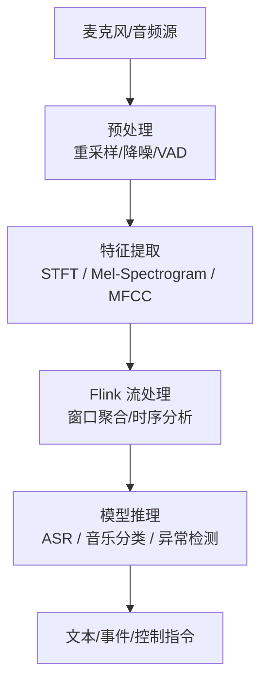
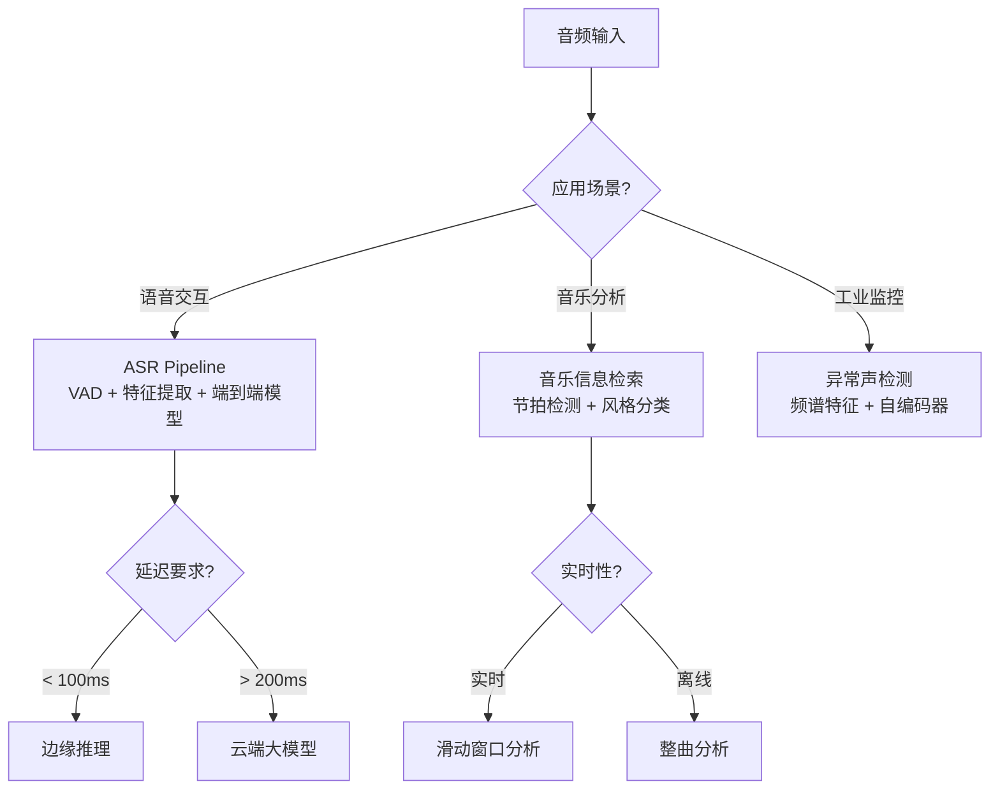
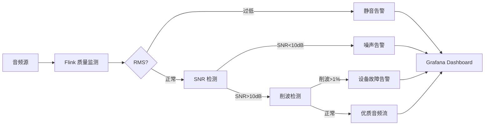

# 音频流实时处理

> **所属阶段**: Knowledge/06-frontier/ | **前置依赖**: [多模态流处理架构](./multimodal-stream-processing.md) | **形式化等级**: L3

---

## 1. 概念定义 (Definitions)

**Def-K-Audio-01: 音频流实时处理 (Real-Time Audio Stream Processing)**
对连续音频信号（如语音、音乐、环境声）进行实时采集、特征提取、事件检测、分类识别和响应触发的流计算应用。典型场景包括实时语音转写、音乐推荐、异常声音检测、语音助手交互等。

**Def-K-Audio-02: 短时傅里叶变换 (STFT)**
将时域音频信号分割为短时帧，对每帧进行傅里叶变换，得到时频域表示的方法。STFT 是音频流处理中最基础的特征提取步骤之一。

**Def-K-Audio-03: Mel 频谱图 (Mel-Spectrogram)**
基于人耳听觉特性设计的频谱表示，将线性频率轴映射到 Mel 刻度上，能够更好地捕捉语音和音乐中的感知相关信息。

---

## 2. 属性推导 (Properties)

**Lemma-K-Audio-01: 音频流延迟的感知边界**
人类对语音交互的延迟敏感度约为 200-300ms（对话自然性），对音乐播放的同步敏感度约为 20-40ms。因此，实时语音处理系统的端到端延迟应 < 200ms，而多声道音乐混音的同步精度应 < 20ms。

**Lemma-K-Audio-02: 特征提取与推理的解耦优势**
在音频流处理中，Mel 频谱图等特征提取计算量小、延迟低，可以高频执行（如每 10ms 一帧）；而深度学习推理（如语音识别模型）计算量大，适合以较低频率批处理（如每 500ms 一批）。解耦两者可以优化资源利用率。

**Prop-K-Audio-01: 滑动窗口是音频事件检测的关键**
由于音频事件（如关键词、异常声响）可能在任意时刻发生，且持续时间不一，采用重叠滑动窗口（Overlapping Sliding Windows）可以显著提高事件检测的召回率，避免事件跨越窗口边界时被遗漏。

---

## 3. 关系建立 (Relations)

### 3.1 音频流处理架构



### 3.2 音频处理与其他模态的对比

| 特性 | 音频流 | 视频流 | 文本流 |
|------|--------|--------|--------|
| 数据率 | 中 (16-128 kbps) | 极高 (Mbps-Gbps) | 低 (bps-kbps) |
| 典型延迟要求 | < 200ms | < 1-3s | < 100ms |
| 核心特征 | 频谱/时序 | 空间/时序 | 语义/语法 |
| 推理频率 | 中 (100-500ms) | 低 (1-5s) | 高 (10-50ms) |
| 主要硬件 | CPU/GPU | GPU | CPU |

---

## 4. 论证过程 (Argumentation)

### 4.1 音频流处理的核心挑战

1. **实时性要求高**：语音识别需要低延迟才能保证对话流畅性
2. **噪声环境复杂**：真实场景的混响、背景噪声、多人同时说话会严重降低识别准确率
3. **多语言与方言**：全球有 7,000+ 种语言，主流 ASR 模型对低资源语言的支持仍然有限
4. **隐私敏感**：语音数据包含生物特征信息（声纹），本地化/边缘化处理需求强烈

### 4.2 典型应用场景

- **实时会议转写**：将多人会议语音实时转为文字，支持说话人分离
- **智能客服质检**：实时分析客服通话中的情绪、关键词、合规性
- **工业异常检测**：通过麦克风监控设备运转声音，提前发现轴承磨损、皮带松动等故障
- **音乐实时推荐**：根据用户当前播放的音乐风格和情绪状态，实时推荐下一首歌曲

---

## 5. 形式证明 / 工程论证

### 5.1 滑动窗口事件检测的完备性

**定理 (Thm-K-Audio-01)**: 设音频事件的最大持续时间为 $T_{max}$，滑动窗口长度为 $W$，滑动步长为 $S$。若 $W \geq T_{max}$ 且 $S \leq W / 2$，则任意音频事件至少会被一个完整窗口覆盖。

**工程论证**：

1. 音频事件在时域上连续，长度为 $t \leq T_{max}$
2. 滑动窗口以步长 $S$ 前进，相邻窗口之间的未覆盖间隙为 $W - S$
3. 若 $S \leq W / 2$，则 $W - S \geq W / 2 > 0$，且任意长度 $t \leq W$ 的事件都不会完全落入间隙中
4. 因此，每个事件都会被至少一个窗口完整捕获
5. 实际工程中，通常选择 $W = 2 \times T_{max}$，$S = W / 2$，以平衡检测精度和计算开销

---

## 6. 实例验证

### 6.1 Flink 音频特征提取作业

```java
DataStream<AudioFrame> audioStream = env
    .addSource(new MicrophoneSource(16000, 1024))
    .assignTimestampsAndWatermarks(
        WatermarkStrategy.<AudioFrame>forBoundedOutOfOrderness(Duration.ofMillis(100))
    );

// 每 500ms 的滑动窗口,计算 Mel 频谱图
DataStream<MelSpectrogram> melStream = audioStream
    .windowAll(SlidingEventTimeWindows.of(Time.milliseconds(500), Time.milliseconds(250)))
    .process(new MelSpectrogramWindowFunction());

// 送入 ASR 模型
melStream
    .map(new AsrInferenceMapFunction())
    .addSink(new TranscriptSink());
```

### 6.2 Python 音频特征提取 UDF

```python
from pyflink.table.udf import udf
from pyflink.table import DataTypes
import librosa
import numpy as np

@udf(result_type=DataTypes.ARRAY(DataTypes.FLOAT()))
def extract_mel_features(audio_bytes, sample_rate=16000):
    y = np.frombuffer(audio_bytes, dtype=np.float32)
    mel_spec = librosa.feature.melspectrogram(y=y, sr=sample_rate, n_mels=128)
    log_mel = librosa.power_to_db(mel_spec, ref=np.max)
    return log_mel.flatten().tolist()
```

### 6.3 语音活动检测 (VAD) 配置

```yaml
# WebRTC VAD 配置示例
vad:
  mode: 3  # 0=Normal, 1=LowBitRate, 2=Aggressive, 3=VeryAggressive
  frame_duration_ms: 30
  sample_rate: 16000
```

---

## 7. 可视化

### 音频流处理决策树



---

## 8. 引用参考


### 6.4 音频流处理的挑战与对策

**挑战一：噪声环境下的鲁棒性**

工业现场、公共交通、开放办公室等场景的信噪比 (SNR) 通常低于 10 dB，严重影响 ASR 和事件检测的准确率。

**对策**：

- **信号预处理**：谱减法 (Spectral Subtraction)、维纳滤波 (Wiener Filter) 降低稳态噪声。
- **神经网络降噪**：使用 RNNoise、DeepFilterNet 等轻量模型进行实时语音增强。
- **多通道波束成形**：麦克风阵列利用空间信息增强目标方向信号。

```python
# 基于谱减法的轻量降噪示例
import numpy as np

def spectral_subtraction(signal, noise_estimate, alpha=1.5):
    """
    信号: 时域音频帧
    noise_estimate: 预估计的噪声频谱
    alpha: 过减因子
    """
    spec = np.fft.rfft(signal)
    magnitude = np.abs(spec)
    phase = np.angle(spec)

    # 谱减 + 半波整流
    cleaned_mag = np.maximum(magnitude - alpha * noise_estimate, 0.01 * magnitude)
    cleaned_spec = cleaned_mag * np.exp(1j * phase)

    return np.fft.irfft(cleaned_spec, n=len(signal))
```

**挑战二：说话人重叠（鸡尾酒会问题）**

会议场景常有多人同时说话，导致 ASR 产生混乱的转写结果。

**对策**：

- **说话人分离 (Speaker Diarization)**：使用聚类或端到端模型（如 pyannote.audio）识别"谁在什么时候说话"。
- **目标说话人提取 (Target Speaker Extraction)**：基于 enrolled voiceprint 提取特定说话人的语音。
- **流式 Diarization 的状态管理**：Flink 的 KeyedState 可用于保存每个会议室的说话人聚类中心，实现跨窗口的说话人一致性追踪。

**挑战三：低资源语言的模型缺失**

主流 ASR 模型对英语、中文支持较好，但对小语种、方言、专业术语的覆盖不足。

**对策**：

- **微调 (Fine-tuning)**：在通用模型基础上使用领域数据微调。
- **热词增强 (Hotword Boosting)**：在解码阶段提升特定词汇（如人名、产品名）的概率。
- **混合解码**：通用模型 + n-gram 语言模型插值，提升领域准确率。

---

### 6.5 音频质量评估 Pipeline

在音频流处理系统中，实时监测输入音频质量对于及早发现设备故障或网络异常至关重要。

```java
public class AudioQualityMonitorFunction extends ProcessFunction<AudioFrame, QualityMetric> {
    @Override
    public void processElement(AudioFrame frame, Context ctx, Collector<QualityMetric> out) {
        double[] samples = frame.getSamples();

        // 1. 计算 RMS 能量
        double rms = Math.sqrt(Arrays.stream(samples).map(s -> s * s).average().orElse(0));

        // 2. 估算信噪比 (简化版:基于静音段假设)
        double noiseFloor = estimateNoiseFloor(samples);
        double snrDb = 20 * Math.log10(rms / (noiseFloor + 1e-10));

        // 3. 检测削波 (Clipping)
        long clipCount = Arrays.stream(samples)
            .filter(s -> Math.abs(s) > 0.99).count();
        double clipRatio = (double) clipCount / samples.length;

        // 4. 检测直流偏移
        double dcOffset = Arrays.stream(samples).average().orElse(0);

        out.collect(new QualityMetric(
            frame.getTimestamp(),
            rms,
            snrDb,
            clipRatio,
            dcOffset
        ));
    }

    private double estimateNoiseFloor(double[] samples) {
        // 使用分位数法估计噪声底
        double[] sorted = samples.clone();
        Arrays.sort(sorted);
        double[] magnitudes = Arrays.stream(sorted).map(Math::abs).toArray();
        Arrays.sort(magnitudes);
        return magnitudes[magnitudes.length / 10]; // 10% 分位数
    }
}
```

---

## 7. 可视化 (Visualizations)

### 7.4 音频流质量监控 Dashboard 架构



---

## 8. 引用参考 (References)


### 6.6 Flink 状态管理在音频流中的应用

在长时间的音频监控场景中（如 24x7 呼叫中心质检），需要利用 Flink 的状态管理来维护说话人身份、会话上下文和音频质量基线。

```java
// 基于 KeyedState 的说话人追踪算子
public class SpeakerTrackingFunction extends KeyedProcessFunction<String, AudioFrame, SpeakerEvent> {
    // 状态:当前房间的活跃说话人列表
    private ListState<SpeakerProfile> speakerState;
    // 状态:每个说话人的累计发言时长
    private MapState<String, Long> speakingTimeState;
    // 状态:音频质量历史基线(用于异常检测)
    private ValueState<QualityBaseline> baselineState;

    @Override
    public void open(Configuration parameters) {
        speakerState = getRuntimeContext().getListState(
            new ListStateDescriptor<>("speakers", SpeakerProfile.class));
        speakingTimeState = getRuntimeContext().getMapState(
            new MapStateDescriptor<>("speaking-time", String.class, Long.class));
        baselineState = getRuntimeContext().getState(
            new ValueStateDescriptor<>("quality-baseline", QualityBaseline.class));
    }

    @Override
    public void processElement(AudioFrame frame, Context ctx, Collector<SpeakerEvent> out)
            throws Exception {
        String roomId = ctx.getCurrentKey();

        // 更新说话人时长
        String speakerId = frame.getDetectedSpeakerId();
        Long currentTime = speakingTimeState.get(speakerId);
        if (currentTime == null) currentTime = 0L;
        speakingTimeState.put(speakerId, currentTime + frame.getDurationMs());

        // 更新音频质量基线(指数移动平均)
        QualityBaseline baseline = baselineState.value();
        if (baseline == null) {
            baseline = new QualityBaseline(frame.getRms(), frame.getSnrDb());
        } else {
            baseline.update(frame.getRms(), frame.getSnrDb(), 0.01);
        }
        baselineState.update(baseline);

        // 检测异常:当前帧 SNR 偏离基线超过 2 个标准差
        if (Math.abs(frame.getSnrDb() - baseline.meanSnr) > 2 * baseline.stdSnr) {
            out.collect(new SpeakerEvent(
                roomId, speakerId, "QUALITY_ANOMALY",
                frame.getSnrDb(), ctx.timestamp()
            ));
        }

        // 定时器:每小时输出一次会话摘要
        long currentHour = ctx.timestamp() / 3_600_000 * 3_600_000;
        ctx.timerService().registerEventTimeTimer(currentHour + 3_600_000);
    }

    @Override
    public void onTimer(long timestamp, OnTimerContext ctx, Collector<SpeakerEvent> out)
            throws Exception {
        String roomId = ctx.getCurrentKey();
        for (Map.Entry<String, Long> entry : speakingTimeState.entries()) {
            out.collect(new SpeakerEvent(
                roomId, entry.getKey(), "HOURLY_SUMMARY",
                entry.getValue(), timestamp
            ));
        }
    }
}
```

**设计要点**：

- 使用 `KeyedProcessFunction` 按房间 ID 分区，保证同一房间的说话人状态一致性。
- `MapState` 适合保存动态数量的说话人信息，避免预分配固定大小的状态。
- 每小时触发一次的定时器实现了会话摘要的周期性输出，而不需要额外的批处理作业。

---

### 6.7 音频流 Pipeline 的部署配置

以下是一个完整的 Flink 音频流处理作业在 Kubernetes 上的部署配置，包含了资源限制、Checkpoint 配置和 PVC 挂载（用于保存语音模型）：

```yaml
apiVersion: flink.apache.org/v1beta1
kind: FlinkDeployment
metadata:
  name: audio-stream-pipeline
spec:
  image: flink:1.18-scala_2.12
  flinkVersion: v1.18
  jobManager:
    resource:
      memory: 2Gi
      cpu: 1
  taskManager:
    resource:
      memory: 4Gi
      cpu: 2
    podTemplate:
      spec:
        containers:
          - name: flink-main-container
            volumeMounts:
              - name: model-volume
                mountPath: /opt/models
        volumes:
          - name: model-volume
            persistentVolumeClaim:
              claimName: audio-models-pvc
  job:
    jarURI: local:///opt/flink/usrlib/audio-pipeline.jar
    parallelism: 4
    upgradeMode: stateful
    state: running
    args:
      - --checkpointing.interval
      - 30s
      - --state.backend
      - rocksdb
      - --state.checkpoints.dir
      - s3://flink-checkpoints/audio-pipeline
```


**小结**：音频流处理在实时会议、工业监控、智能家居等场景中扮演着越来越重要的角色。通过 Flink 的窗口聚合、状态管理和侧输出能力，可以构建端到端的低延迟音频分析 Pipeline。未来，随着多模态大模型和专用 AI 音频芯片的普及，音频流处理将与视频、文本深度融合，成为下一代智能交互系统的核心数据通道之一。
