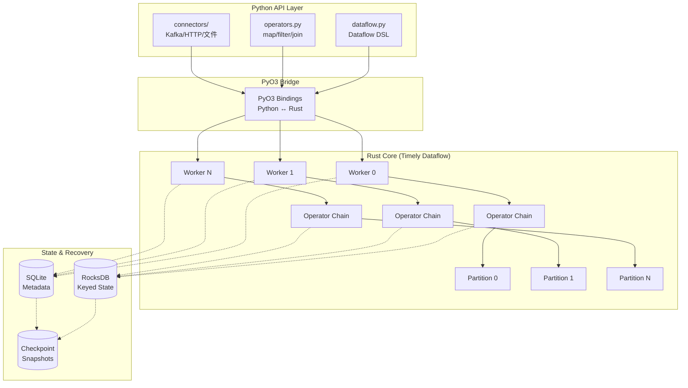
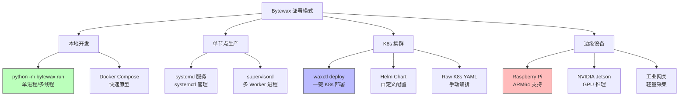

# Bytewax: Python-Native 轻量级流处理框架

> **所属阶段**: Knowledge/Frontier | **前置依赖**: [Flink/02-core/flink-architecture-overview.md](../../Flink/02-core/flink-architecture-overview.md), [Knowledge/01-concept-atlas/stream-processing-fundamentals.md](../01-concept-atlas/stream-processing-fundamentals.md) | **形式化等级**: L4 (工程选型论证)

---

## 目录

- [Bytewax: Python-Native 轻量级流处理框架](#bytewax-python-native-轻量级流处理框架)
  - [目录](#目录)
  - [1. 概念定义 (Definitions)](#1-概念定义-definitions)
    - [Def-K-06-493: Bytewax Dataflow 模型](#def-k-06-493-bytewax-dataflow-模型)
    - [Def-K-06-494: Bytewax Worker 分区模型](#def-k-06-494-bytewax-worker-分区模型)
    - [Def-K-06-495: Bytewax 状态算子 (Stateful Operator)](#def-k-06-495-bytewax-状态算子-stateful-operator)
  - [2. 属性推导 (Properties)](#2-属性推导-properties)
    - [Prop-K-06-493: Bytewax 内存效率优势](#prop-k-06-493-bytewax-内存效率优势)
    - [Prop-K-06-494: Bytewax 规模上限约束](#prop-k-06-494-bytewax-规模上限约束)
  - [3. 关系建立 (Relations)](#3-关系建立-relations)
    - [与 Flink 的对比映射](#与-flink-的对比映射)
    - [与 Pathway 的对比映射](#与-pathway-的对比映射)
    - [技术栈定位](#技术栈定位)
  - [4. 论证过程 (Argumentation)](#4-论证过程-argumentation)
    - [反例分析: Bytewax 不适合的场景](#反例分析-bytewax-不适合的场景)
    - [边界讨论: "25x 更低内存"的适用范围](#边界讨论-25x-更低内存的适用范围)
  - [5. 形式证明 / 工程论证 (Proof / Engineering Argument)](#5-形式证明--工程论证-proof--engineering-argument)
    - [工程论证: Bytewax 在 Python 生态中的选型价值](#工程论证-bytewax-在-python-生态中的选型价值)
  - [6. 实例验证 (Examples)](#6-实例验证-examples)
    - [示例 1: 实时 Embedding 管道](#示例-1-实时-embedding-管道)
    - [示例 2: CDC 管道 (MySQL → Kafka → Bytewax → Pinecone)](#示例-2-cdc-管道-mysql--kafka--bytewax--pinecone)
    - [示例 3: waxctl K8s 部署配置](#示例-3-waxctl-k8s-部署配置)
  - [7. 可视化 (Visualizations)](#7-可视化-visualizations)
    - [Bytewax Dataflow 架构图](#bytewax-dataflow-架构图)
    - [Bytewax 部署模式对比](#bytewax-部署模式对比)
  - [8. 引用参考 (References)](#8-引用参考-references)

## 1. 概念定义 (Definitions)

### Def-K-06-493: Bytewax Dataflow 模型

Bytewax 是一种**Python-native 的流处理框架**，其核心执行引擎基于 Rust 实现的 Timely Dataflow，通过 PyO3 绑定向 Python 暴露 API。

**形式化定义**:

```
Bytewax = ⟨D, W, O, S, C⟩
其中:
  D: Dataflow — 有向无环图 (DAG)，由算子 (Operator) 和流 (Stream) 组成
  W: Worker — 执行进程集合，每个 Worker 承载 DAG 的一个分区
  O: Operator — 计算算子集合 (map, filter, flat_map, reduce, join, etc.)
  S: State — 算子级状态存储 (基于 RocksDB/SQLite 的持久化状态)
  C: Checkpoint — 周期性状态快照机制，用于容错恢复
```

**关键特征**:

- **Python-first API**: 全部业务逻辑以 Python 函数编写，无需 JVM 或 Scala
- **Rust 核心引擎**: 底层数据交换、调度、网络由 Rust Timely Dataflow 处理
- **单进程/多进程统一模型**: 本地开发时单进程运行，生产环境通过 `waxctl` 扩展为分布式集群

### Def-K-06-494: Bytewax Worker 分区模型

**定义**: Bytewax 采用**基于 Key 的分区策略**，将输入流按照用户定义的 Key 函数路由到不同 Worker 进程。

```
分区函数: partition(k, N) → worker_id ∈ [0, N-1]
  k: 事件键 (Key)
  N: Worker 总数

路由保证: 同一 Key 的所有事件始终路由到同一 Worker
```

**Worker 职责**:

| 组件 | 职责 |
|------|------|
| Input Connector | 从 Kafka/Redpanda/文件 等源读取数据 |
| Dataflow 算子链 | 执行 map/filter/reduce/join 等变换 |
| State Store | 维护窗口状态、聚合状态、会话状态 |
| Output Connector | 将结果写入下游系统 |
| Checkpoint 线程 | 周期性将状态快照写入持久化存储 |

### Def-K-06-495: Bytewax 状态算子 (Stateful Operator)

**定义**: Bytewax 中维护跨事件状态的有状态算子，支持基于事件时间 (Event Time) 和 processing time 的窗口计算。

**状态类型分类**:

| 状态类型 | 描述 | 典型算子 |
|---------|------|---------|
| Keyed State | 每个 Key 独立的值状态 | `reduce`, `fold`, `stateful_map` |
| Window State | 时间窗口内的聚合缓冲 | `fold_window`, `reduce_window` |
| Session State | 动态超时窗口 | `collect_window` with gap |
| Recovery State | 检查点恢复的元数据 | 框架内部管理 |

**状态持久化**:

```
Checkpoint 流程:
  1. Barrier 注入: 协调器向所有 Worker 注入 barrier
  2. 状态冻结: 各 Worker 将内存状态序列化
  3. 快照写入: 状态写入 SQLite/RocksDB/云存储
  4. ACK 确认: 确认后释放旧状态版本
```

---

## 2. 属性推导 (Properties)

### Prop-K-06-493: Bytewax 内存效率优势

**命题**: 在同等吞吐条件下，Bytewax 的内存占用显著低于基于 JVM 的流处理引擎（如 Flink、Spark Streaming）。

**论证**:

1. **无 JVM 开销**: Bytewax Worker 进程为原生进程，无 JVM Heap、GC、MetaSpace 等运行时开销
2. **Rust 内存模型**: 底层 Timely Dataflow 使用 Rust 的零成本抽象与所有权模型，内存分配可控
3. **状态存储外置**: 大状态可持久化到 RocksDB/SQLite，而非全部驻留 JVM Heap
4. **Python GIL 规避**: 计算密集型操作在 Rust 层执行，Python 仅处理业务逻辑

| 指标 | Bytewax (Python+Rust) | Flink (JVM) | Spark Streaming (JVM) |
|------|----------------------|-------------|----------------------|
| 基础内存占用 | ~50-100 MB/Worker | ~500 MB-1 GB/TaskManager | ~1-2 GB/Executor |
| 状态存储 | RocksDB/SQLite (外置) | RocksDB (内嵌/外置) | 内存/RocksDB |
| GC 停顿 | 无 (Rust) | 有 (JVM G1/ZGC) | 有 (JVM G1/ZGC) |
| 启动延迟 | < 1 秒 | 5-15 秒 | 10-30 秒 |

> **注**: 上述数据为典型配置下的经验值，实际表现取决于工作负载特征。[^1]

### Prop-K-06-494: Bytewax 规模上限约束

**命题**: Bytewax 的设计哲学偏向**轻量级、低延迟、易部署**，在超大规模 (petabyte-scale) 场景下存在架构性约束。

**约束分析**:

1. **Worker 模型限制**: Bytewax 采用静态 Worker 集合，不支持 Flink 式的动态任务迁移与弹性扩缩容
2. **无全局协调器**: 缺乏类似 Flink JobManager 的全局调度实体，复杂故障恢复依赖外部编排 (K8s)
3. **连接器生态**: 相比 Flink 的 50+ 官方连接器，Bytewax 的连接器覆盖范围较窄
4. **社区规模**: 开源社区活跃度与贡献者数量远低于 Apache Flink

---

## 3. 关系建立 (Relations)

### 与 Flink 的对比映射

| 维度 | Bytewax | Apache Flink |
|------|---------|--------------|
| **语言栈** | Python + Rust | Java/Scala (JVM) |
| **内存占用** | 低 (~25x 优势) [^2] | 高 (JVM 开销) |
| **延迟** | 毫秒级 (轻量框架) | 毫秒~秒级 (取决于配置) |
| **状态后端** | RocksDB / SQLite | RocksDB / Heap / 自定义 |
| **exactly-once** | At-least-once + 幂等 (Checkpoint 恢复) | Exactly-once (两阶段提交) |
| **生态连接器** | 10+ (Kafka, Redpanda, 文件, HTTP) | 50+ (官方 + 社区) |
| **集群管理** | waxctl (K8s) / 手动 | Flink-native K8s / YARN / Mesos |
| **SQL 支持** | 无原生 SQL (Python API) | Flink SQL (完整 ANSI SQL) |
| **规模上限** | 10-100 节点典型场景 | 1000+ 节点生产验证 |
| **学习曲线** | 低 (Python 开发者友好) | 高 (需理解 JVM 生态) |

### 与 Pathway 的对比映射

Bytewax 与 Pathway 均为 **Python + Rust** 技术栈的流处理框架，但设计哲学存在本质差异：

| 维度 | Bytewax | Pathway |
|------|---------|---------|
| **编程模型** | Dataflow DAG (显式图构建) | 声明式 Rust-like DSL |
| **状态抽象** | 显式状态算子 (`stateful_map`) | 隐式增量计算 (类似数据库) |
| **批流统一** | 批处理为流特例 | 原生批流统一 (增量视图) |
| **部署目标** | K8s / 边缘设备 / 本地 | 云端 / 笔记本 / 嵌入应用 |
| **与 Python 集成** | PyO3 绑定，Python 驱动 | Rust 核心，Python 包装 |
| **适用场景** | 实时 ETL / CDC / 轻量聚合 | 增量数据转换 / 实时分析 / 响应式 UI |

**核心哲学差异**:

- **Bytewax**: 面向**流处理工程师**，提供显式的 Dataflow 图构建能力，类似 Flink 的 Python 版轻量替代
- **Pathway**: 面向**数据分析师/应用开发者**，提供声明式增量计算接口，类似 Materialize 的 Python 版

### 技术栈定位

```
轻量级流处理谱系:

JVM 重量级 (高吞吐/大规模)          Python-Native (轻量/低延迟)           声明式流数据库
   Flink  ←──────────────────────→  Bytewax  ←──────────────────────→  Pathway
                                    ↑                                   ↑
                               25x 内存优势                        增量视图抽象
                               Python 生态原生                      类 SQL 声明式
```

---

## 4. 论证过程 (Argumentation)

### 反例分析: Bytewax 不适合的场景

**场景 1: 复杂事件处理 (CEP) 模式匹配**

- Flink CEP 库提供成熟的 NFA-based 模式匹配
- Bytewax 缺乏原生 CEP 支持，需自行实现状态机
- **结论**: 复杂序列模式检测优先选 Flink

**场景 2: 超大规模状态 (TB 级 Keyed State)**

- Bytewax 的 RocksDB 集成相对基础，缺乏增量检查点优化
- Flink 的增量 Checkpoint + 本地状态恢复经过大规模生产验证
- **结论**: TB 级状态场景优先选 Flink

**场景 3: 需要 SQL 接口的数据管道**

- Bytewax 无原生 SQL 支持
- Flink SQL / RisingWave / Materialize 提供更优选择
- **结论**: SQL-first 场景优先选流数据库或 Flink SQL

### 边界讨论: "25x 更低内存"的适用范围

[^2] 中提到的 25x 内存优势需放在特定上下文中理解：

1. **基准条件**: 对比的是 Flink TaskManager 的完整 JVM 进程（含堆内存、托管内存、网络缓冲）与 Bytewax 单 Worker 进程
2. **工作负载**: 适用于无状态或轻状态转换（map/filter/simple aggregate），重状态场景差距缩小
3. **部署密度**: Bytewax 允许更高部署密度（单节点更多 Worker），但实际受限于 Python GIL 的并发瓶颈
4. **不适用于**: 与 Flink 的 MiniCluster 或嵌入式模式对比，因后者已大幅简化

---

## 5. 形式证明 / 工程论证 (Proof / Engineering Argument)

### 工程论证: Bytewax 在 Python 生态中的选型价值

**定理**: 对于以 Python 为主要技术栈、需要毫秒级延迟、中等规模数据量的组织，Bytewax 是 Flink 的有效轻量替代方案。

**论证框架**:

**前提条件**:

- P1: 团队技术栈以 Python 为主（数据科学、ML 工程、后端服务）
- P2: 数据量处于 GB~TB/天 级别，非 PB 级
- P3: 延迟要求为毫秒~秒级，非微秒级硬实时
- P4: 运维能力有限，偏好轻量级部署方案

**推导**:

1. 由 P1: 引入 Flink 需要额外的 JVM 运维知识和跨语言调用开销（PyFlink 存在序列化瓶颈）
2. 由 P2: Bytewax 的 Worker 模型足以支撑该数据量，无需 Flink 的全局调度复杂度
3. 由 P3: Bytewax 的 Rust 核心可提供足够的处理延迟性能
4. 由 P4: `waxctl` 提供一键式 K8s 部署，学习成本远低于 Flink 的集群配置

**结论**: 在满足前提条件的情况下，Bytewax 的总拥有成本 (TCO) 低于 Flink，且开发效率更高。

---

## 6. 实例验证 (Examples)

### 示例 1: 实时 Embedding 管道

```python
from bytewax.dataflow import Dataflow
from bytewax.connectors.kafka import KafkaSource
from bytewax.connectors.stdio import StdOutSink
import sentence_transformers

model = sentence_transformers.SentenceTransformer('all-MiniLM-L6-v2')

def embed(text):
    embedding = model.encode(text)
    return {"text": text, "embedding": embedding.tolist()}

flow = Dataflow("embedding-pipeline")
stream = flow.input("kafka-in", KafkaSource(["localhost:9092"], "documents"))
stream.map(embed)
stream.output("stdout", StdOutSink())
```

**说明**: 利用 Bytewax 的 Python-native 特性，直接集成 `sentence-transformers` 库进行实时文本向量化，无需跨语言序列化开销。[^3]

### 示例 2: CDC 管道 (MySQL → Kafka → Bytewax → Pinecone)

```python
from bytewax.dataflow import Dataflow
from bytewax.connectors.kafka import KafkaSource
from bytewax.window import EventClockConfig, TumblingWindow
import pinecone

# 解析 Debezium CDC 格式
def parse_cdc(record):
    return record["after"]  # 仅处理变更后的数据

# 窗口聚合: 每 10 秒批量写入向量数据库
def aggregate_window(items):
    return {"batch": items, "count": len(items)}

flow = Dataflow("cdc-pipeline")
stream = flow.input("cdc-in", KafkaSource(["kafka:9092"], "dbserver.inventory.customers"))
stream.map(parse_cdc)
stream.map(lambda x: (x["id"], x))  # (key, value)
stream.fold_window(
    "10s-batch",
    EventClockConfig(lambda x: x["ts_ms"]),
    TumblingWindow(length=timedelta(seconds=10)),
    aggregate_window
)
# 输出到 Pinecone (自定义 connector)
```

### 示例 3: waxctl K8s 部署配置

```yaml
# waxctl deployment spec
apiVersion: bytewax.io/v1
kind: Dataflow
metadata:
  name: realtime-etl
spec:
  image: my-registry/bytewax-etl:v1.0
  workers: 4
  resources:
    requests:
      memory: "256Mi"
      cpu: "500m"
    limits:
      memory: "512Mi"
      cpu: "1000m"
  input:
    kafka:
      brokers: ["kafka:9092"]
      topics: ["events"]
  state:
    backend: rocksdb
    checkpointInterval: 30s
```

---

## 7. 可视化 (Visualizations)

### Bytewax Dataflow 架构图

Bytewax 的架构分层展示了 Python API 层、Rust Timely Dataflow 核心层以及状态存储层的协作关系：



### Bytewax 部署模式对比



---

## 8. 引用参考 (References)

[^1]: Bytewax Documentation, "Architecture", 2025. <https://bytewax.io/docs/getting-started/architecture>
[^2]: Bytewax Blog, "Why we built Bytewax: A Python-native streaming engine", 2023. <https://bytewax.io/blog/why-we-built-bytewax>
[^3]: Bytewax Cheatsheet, "Operators and Patterns", 2025. <https://bytewax.io/blog/introducing-the-bytewax-cheatsheet>
