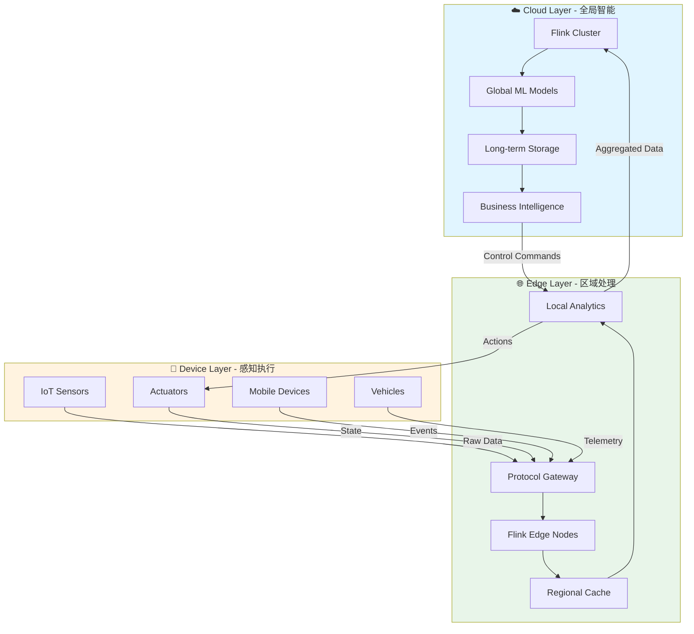
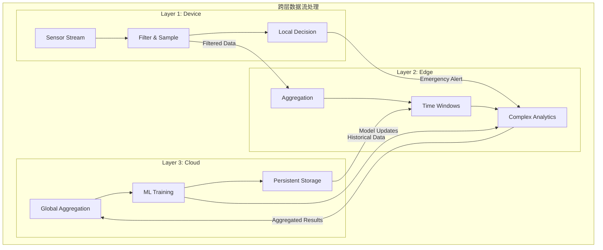
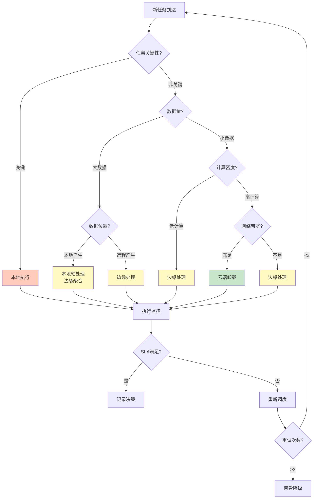
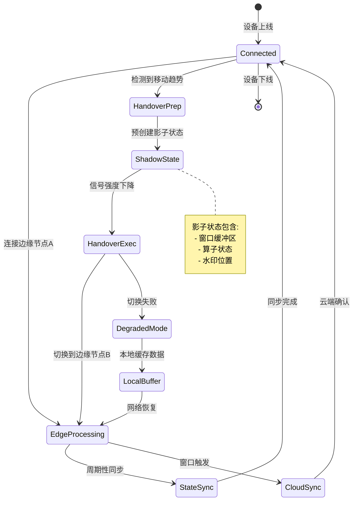

# 云边端连续体 - 分布式流计算的地理扩展

> **所属阶段**: Knowledge | **前置依赖**: [05-ecosystem/streaming-ecosystem-comparison.md](../04-technology-selection/engine-selection-guide.md) | **形式化等级**: L3 (结构化论证 + 半形式化模型)

## 目录

- [云边端连续体 - 分布式流计算的地理扩展]()
  - [目录](#目录)
  - [1. 概念定义 (Definitions)](#1-概念定义-definitions)
    - [Def-K-06-08: Cloud-Edge Continuum (云边端连续体)](#def-k-06-08-cloud-edge-continuum-云边端连续体)
    - [Def-K-06-09: 雾计算 (Fog Computing)](#def-k-06-09-雾计算-fog-computing)
    - [Def-K-06-10: 计算卸载 (Computation Offloading)](#def-k-06-10-计算卸载-computation-offloading)
    - [Def-K-06-11: 自适应放置策略 (Adaptive Placement Policy)](#def-k-06-11-自适应放置策略-adaptive-placement-policy)
  - [2. 属性推导 (Properties)](#2-属性推导-properties)
    - [Prop-K-06-05: 延迟分层递减性](#prop-k-06-05-延迟分层递减性)
    - [Prop-K-06-06: 资源-精度权衡律](#prop-k-06-06-资源-精度权衡律)
    - [Prop-K-06-07: 移动性导致状态一致性开销](#prop-k-06-07-移动性导致状态一致性开销)
    - [Lemma-K-06-04: 卸载决策的阈值特性](#lemma-k-06-04-卸载决策的阈值特性)
  - [3. 关系建立 (Relations)](#3-关系建立-relations)
    - [3.1 与Dataflow模型的映射](#31-与dataflow模型的映射)
    - [3.2 与Actor模型的关系](#32-与actor模型的关系)
    - [3.3 与Serverless计算的融合](#33-与serverless计算的融合)
  - [4. 论证过程 (Argumentation)](#4-论证过程-argumentation)
    - [4.1 资源异构性挑战](#41-资源异构性挑战)
    - [4.2 网络波动与分区容忍](#42-网络波动与分区容忍)
    - [4.3 移动性支持机制](#43-移动性支持机制)
    - [4.4 安全与隐私边界](#44-安全与隐私边界)
  - [5. 工程论证 (Engineering Argument)](#5-工程论证-engineering-argument)
    - [5.1 技术选型：Zenoh vs MQTT vs Kafka](#51-技术选型zenoh-vs-mqtt-vs-kafka)
    - [5.2 运行时选型：WebAssembly vs 容器](#52-运行时选型webassembly-vs-容器)
    - [5.3 与Flink集成的架构论证](#53-与flink集成的架构论证)
    - [5.4 5G网络切片的利用](#54-5g网络切片的利用)
  - [6. 实例验证 (Examples)](#6-实例验证-examples)
    - [6.1 自动驾驶场景](#61-自动驾驶场景)
    - [6.2 工业IoT场景](#62-工业iot场景)
    - [6.3 智能零售场景](#63-智能零售场景)
    - [6.4 远程医疗场景](#64-远程医疗场景)
  - [7. 可视化 (Visualizations)](#7-可视化-visualizations)
    - [7.1 云边端三层架构图](#71-云边端三层架构图)
    - [7.2 数据流分层处理架构](#72-数据流分层处理架构)
    - [7.3 自适应调度决策树](#73-自适应调度决策树)
    - [7.4 移动场景下的状态迁移](#74-移动场景下的状态迁移)
  - [8. 引用参考 (References)](#8-引用参考-references)

## 1. 概念定义 (Definitions)

### Def-K-06-08: Cloud-Edge Continuum (云边端连续体)

云边端连续体是指由中心云(Cloud)、边缘节点(Edge)和终端设备(Device)组成的**分层计算架构**，通过统一的资源抽象和编排机制，实现计算任务在地理分布节点间的**自适应迁移**与**协同执行**。

**形式化描述**：
设计算环境为三元组 $\mathcal{C} = (V, E, \mathcal{R})$，其中：

- $V = V_{cloud} \cup V_{edge} \cup V_{device}$：异构节点集合
- $E \subseteq V \times V$：网络连接关系
- $\mathcal{R}: V \rightarrow \mathbb{R}^n$：节点资源能力函数（计算、存储、带宽、能耗）

连续体中的任务放置问题可建模为：
$$\min_{\pi: T \rightarrow V} \sum_{t \in T} \left( \alpha \cdot Latency(t, \pi(t)) + \beta \cdot Cost(t, \pi(t)) + \gamma \cdot Energy(t, \pi(t)) \right)$$

约束条件：

- $\mathcal{R}(\pi(t)) \geq req(t)$ （资源满足）
- $Latency(t, \pi(t)) \leq SLA(t)$ （延迟约束）

**直观解释**：连续体不是静态的层次结构，而是一个动态的计算场，任务可以根据网络条件、数据位置、资源可用性在三层之间流动。

---

### Def-K-06-09: 雾计算 (Fog Computing)

雾计算是一种分布式计算范式，在数据源与云端之间引入**中间计算层**，通过在局域网(LAN)级别的边缘设备上部署计算、存储和网络服务，实现低延迟、位置感知、地理分布的垂直应用支持。

**与边缘计算的区别**：

| 维度 | 雾计算 | 边缘计算 |
|------|--------|----------|
| 位置 | 介于云与设备之间 | 靠近数据源 |
| 范围 | 可能跨多个节点协同 | 通常单节点处理 |
| 资源 | 相对丰富 | 资源受限 |
| 拓扑 | 层次化 | 扁平化 |

**形式化**：雾层 $F$ 是满足以下条件的节点子集：
$$F = \{v \in V \mid d(v, V_{cloud}) > \theta_{cloud} \land d(v, V_{device}) < \theta_{edge} \}$$
其中 $d$ 表示网络距离（延迟或跳数）。

---

### Def-K-06-10: 计算卸载 (Computation Offloading)

计算卸载是指将原本在资源受限设备上执行的计算任务**迁移**到资源更丰富的边缘节点或云端执行的技术，以克服本地资源限制、降低能耗或满足延迟要求。

**卸载决策模型**：
对于任务 $t$，定义卸载决策变量 $x \in \{0, 1, 2\}$：

- $x = 0$：本地执行
- $x = 1$：边缘卸载
- $x = 2$：云端卸载

**时间成本模型**：
$$T_{total} = x \cdot T_{transfer} + T_{compute} + T_{result}$$

其中：
$$T_{compute} = \begin{cases} \frac{W}{f_{local}} & x = 0 \\ \frac{W}{f_{edge}} + T_{edge\_queue} & x = 1 \\ \frac{W}{f_{cloud}} + T_{cloud\_queue} + T_{backhaul} & x = 2 \end{cases}$$

**能耗模型**：
$$E_{total} = x \cdot E_{transfer} + (1 - x) \cdot E_{compute\_local}$$

---

### Def-K-06-11: 自适应放置策略 (Adaptive Placement Policy)

自适应放置策略是一种**运行时决策机制**，根据系统状态（网络带宽、节点负载、数据位置、用户移动性）动态调整计算任务的部署位置，以优化全局目标函数（延迟、能耗、成本、准确性的多目标组合）。

**策略组成**：
$$\mathcal{P} = (S, D, A, O)$$

- **状态感知 $S$**: 收集运行时指标
  $$S = \langle B(t), L(t), Q(t), M(t) \rangle$$
  （带宽、负载、队列长度、移动性模式）

- **决策逻辑 $D$**: 基于状态选择放置位置
  $$D: S \times T \rightarrow \{local, edge, cloud\}$$

- **动作执行 $A$**: 执行迁移操作
  $$A: (t, src, dst) \rightarrow \text{stateful\_migration}$$

- **优化目标 $O$**: 多目标权衡
  $$O = w_1 \cdot \frac{1}{Latency} + w_2 \cdot \frac{1}{Energy} + w_3 \cdot Accuracy$$

## 2. 属性推导 (Properties)

### Prop-K-06-05: 延迟分层递减性

**命题**：数据处理的端到端延迟在Cloud-Edge-Device三层呈现严格递减关系：
$$Latency_{cloud} > Latency_{edge} > Latency_{device}$$

**论证**：
$$Latency = T_{proc} + T_{net} + T_{queue}$$

对于典型场景：

- **Cloud**: $T_{net}^{cloud} \approx 50-100ms$ (广域网RTT)
- **Edge**: $T_{net}^{edge} \approx 5-20ms$ (局域网RTT)
- **Device**: $T_{net}^{device} = 0$ (本地处理)

尽管 $T_{proc}^{device} > T_{proc}^{edge} > T_{proc}^{cloud}$（处理能力差异），但对于延迟敏感型任务（如实时控制），网络延迟主导总延迟。

---

### Prop-K-06-06: 资源-精度权衡律

**命题**：在资源受限的边缘/终端层执行机器学习推理时，存在模型复杂度与推理精度的单调递增关系，与能耗/延迟的权衡关系：
$$Accuracy \uparrow \Rightarrow Complexity \uparrow \Rightarrow (Energy \uparrow \land Latency \uparrow)$$

**工程含义**：自适应放置策略需要支持**模型分层**——在设备端运行轻量级模型(如MobileNet)，在边缘运行中等模型，在云端运行完整模型。

---

### Prop-K-06-07: 移动性导致状态一致性开销

**命题**：当设备在网络覆盖区域间移动时，维持流处理状态一致性所需的同步开销与移动频率成正比：
$$Overhead_{consistency} \propto f_{handover} \cdot \frac{StateSize}{Bandwidth}$$

这要求自适应放置策略具备**状态预迁移**和**影子状态**机制。

---

### Lemma-K-06-04: 卸载决策的阈值特性

**引理**：存在临界数据量 $D^*$ 和计算量 $W^*$，使得：
$$\forall D < D^*, W < W^*: x^* = 0 \text{ (本地执行最优)}$$
$$\exists D > D^* \lor W > W^*: x^* \in \{1, 2\} \text{ (卸载更优)}$$

**证明思路**：比较本地执行时间 $T_{local} = W/f_{local}$ 与卸载总时间 $T_{offload} = D/B + W/f_{remote} + T_{overhead}$。求解 $T_{local} = T_{offload}$ 可得临界点。

## 3. 关系建立 (Relations)

### 3.1 与Dataflow模型的映射

云边端连续体可以视为Dataflow模型的**地理扩展**：

| Dataflow概念 | 云边端映射 |
|--------------|------------|
| 算子 (Operator) | 可部署的计算单元 |
| 数据流 (Dataflow) | 跨地理节点的数据传输 |
| 窗口 (Window) | 分层聚合的时间边界 |
| Watermark | 跨层时钟同步机制 |
| Checkpoint | 分层容错状态快照 |

**形式化映射**：
给定Dataflow图 $G = (Ops, Channels)$，其云边端部署 $\Pi: Ops \rightarrow V$ 满足：

- **本地性约束**：$\forall o \in Ops: \Pi(o) \in \arg\min_{v \in V} DataLocality(o, v)$
- **带宽约束**：$\forall (o_1, o_2) \in Channels: Bandwidth(\Pi(o_1), \Pi(o_2)) \geq Throughput(o_1, o_2)$

### 3.2 与Actor模型的关系

**Actor-CSP-CloudEdge对应**：

```
┌─────────────────────────────────────────────────────────────┐
│  理论层:  Actor  ←──消息传递──→  CSP进程                      │
│              ↓               ↓                              │
│  模型层:  自治计算单元  ←──事件驱动──→ 同步协调               │
│              ↓               ↓                              │
│  部署层:  Device Actor    Edge Actor    Cloud Actor         │
│           (轻量)         (中介)        (重算力)             │
└─────────────────────────────────────────────────────────────┘
```

- **Device层Actor**：资源受限，处理本地传感器数据，执行简单规则
- **Edge层Actor**：聚合多个Device数据，执行复杂流分析，协调本地决策
- **Cloud层Actor**：全局聚合，长期存储，复杂ML训练

### 3.3 与Serverless计算的融合

云边端连续体正在与Serverless范式融合形成**边缘Serverless (Edge Serverless)**：

**特征**：

- 函数级弹性伸缩（而非VM/容器级）
- 事件触发的细粒度计费
- 零运维（由平台处理异构资源管理）

**代表系统**：OpenWhisk on Edge、KubeEdge Serverless、Azure IoT Edge Functions

## 4. 论证过程 (Argumentation)

### 4.1 资源异构性挑战

**问题**：云边端三层在计算、存储、网络能力上存在数量级差异。

**典型规格对比**：

| 层级 | CPU | 内存 | 存储 | 网络 | 功耗 |
|------|-----|------|------|------|------|
| Cloud (VM) | 64核+ | 256GB+ | TB级SSD | 10Gbps+ | 200W+ |
| Edge (网关) | 4-8核 | 8-16GB | 100GB SSD | 1Gbps | 15-30W |
| Device (传感器) | 1-2核 | 512MB-2GB | 4-32GB eMMC | 100Mbps WiFi | 1-5W |

**应对策略**：

1. **软件栈分层**：Cloud使用完整JVM/Flink，Edge使用轻量级运行时(WebAssembly)，Device使用裸机/C
2. **模型剪枝与量化**：针对不同层级调整ML模型复杂度
3. **计算卸载决策**：将超出本地能力的任务自动上移到更高层

### 4.2 网络波动与分区容忍

**问题**：边缘网络相比数据中心网络具有更高的**丢包率**和**带宽波动**。

**统计特征**：

- 广域网可用性：99.9%+
- 边缘WiFi可用性：95-99%
- 移动网络可用性：90-98%（取决于地理位置）

**应对策略**：

1. **本地优先 (Local First)**：关键决策必须在本地完成，不依赖云端
2. **最终一致性**：允许短暂分区，数据在网络恢复后同步
3. **自适应批量**：根据网络状况调整数据上传批次大小

### 4.3 移动性支持机制

**问题**：车辆、无人机、移动机器人等场景要求计算服务随设备移动而**无缝迁移**。

**核心挑战**：

- **状态迁移**：流处理的窗口状态需要跟随设备
- **会话保持**：长连接需要在切换时维持
- **数据本地性**：新位置的数据源可能不同

**技术方案**：

1. **主动式状态预迁移**：预测移动轨迹，提前在新位置建立状态副本
2. **分层服务发现**：使用mDNS/Consul实现边缘本地服务发现
3. **会话粘性 (Session Stickiness)**：通过客户端标识路由到最近的服务实例

### 4.4 安全与隐私边界

**威胁模型**：

- 边缘节点物理安全弱于数据中心（易被物理接触）
- 终端设备可能被篡改
- 跨层传输存在中间人攻击风险

**防御机制**：

1. **零信任架构 (Zero Trust)**：每层都进行身份验证和授权
2. **边缘TEE (Trusted Execution Environment)**：Intel SGX/ARM TrustZone保护敏感计算
3. **联邦学习 (Federated Learning)**：数据不出本地，只上传模型更新
4. **差分隐私 (Differential Privacy)**：在数据聚合时注入噪声保护个体隐私

## 5. 工程论证 (Engineering Argument)

### 5.1 技术选型：Zenoh vs MQTT vs Kafka

**场景**：跨云边端的轻量级Pub/Sub消息系统

| 特性 | Zenoh | MQTT | Kafka |
|------|-------|------|-------|
| 协议开销 | 极低（二进制） | 低 | 较高 |
| 资源占用 | <1MB | ~1MB | 数百MB |
| 部署位置 | Device→Cloud | Edge→Cloud | Cloud/Edge |
| 拓扑发现 | 自动 | 需Broker配置 | 需ZooKeeper |
| 实时性 | 亚毫秒 | 毫秒级 | 毫秒级 |
| 断线重连 | 原生支持 | 原生支持 | 需客户端处理 |
| 网络适应 | 优秀（DTN支持） | 良好 | 一般 |

**论证结论**：

- **设备到边缘**：Zenoh（最低资源占用，支持DTN）
- **边缘到云端**：MQTT（工业标准，生态成熟）或 Kafka（高吞吐场景）

### 5.2 运行时选型：WebAssembly vs 容器

**在边缘设备运行流处理逻辑**：

| 特性 | WebAssembly | 容器 (Docker) | 原生 |
|------|-------------|---------------|------|
| 启动时间 | <10ms | 100ms-数秒 | N/A |
| 内存隔离 | 强（沙箱） | 中等（cgroups） | 无 |
| 代码体积 | 小（MB级） | 大（百MB级） | 小 |
| 冷启动 | 极快 | 慢 | 快 |
| 热迁移 | 易实现 | 复杂 | 复杂 |
| 开发体验 | 新兴（WasmEdge） | 成熟 | 成熟 |

**推荐**：在资源受限的边缘节点使用 **WebAssembly** 运行轻量级流处理算子，在边缘服务器使用 **容器** 运行完整Flink。

### 5.3 与Flink集成的架构论证

**Flink在云边端的部署模式**：

```
┌────────────────────────────────────────────────────────────────┐
│                           Cloud Layer                           │
│  ┌─────────────────────────────────────────────────────────┐   │
│  │              Apache Flink (Full Cluster)                 │   │
│  │  ┌─────────┐  ┌─────────┐  ┌─────────┐  ┌─────────┐    │   │
│  │  │ JobManager │  │ TM-1    │  │ TM-2    │  │ TM-n    │    │   │
│  │  └─────────┘  └─────────┘  └─────────┘  └─────────┘    │   │
│  │         ↑ Global Checkpoint / State Backend              │   │
│  └─────────────────────────────────────────────────────────┘   │
│                              │                                  │
│                    ┌─────────┴─────────┐                        │
│                    ↓                   ↓                        │
│  ┌─────────────────────────────────────────────────────────┐   │
│  │                    Edge Layer                            │   │
│  │  ┌─────────────────┐      ┌─────────────────┐           │   │
│  │  │  Flink Edge     │      │  Zenoh Broker   │           │   │
│  │  │  (Lightweight)  │←────→│  (Pub/Sub)      │           │   │
│  │  │  - MiniCluster  │      └─────────────────┘           │   │
│  │  │  - Local Check  │                                     │   │
│  │  └────────┬────────┘                                     │   │
│  │           │ Edge-to-Cloud Sync                           │   │
│  └───────────┼──────────────────────────────────────────────┘   │
│              │                                                  │
│    ┌─────────┴─────────┬─────────────────┐                     │
│    ↓                   ↓                 ↓                     │
│  ┌─────────┐      ┌─────────┐      ┌─────────┐                 │
│  │ Device  │      │ Device  │      │ Device  │                 │
│  │ (Wasm)  │      │ (Wasm)  │      │ (Wasm)  │                 │
│  └─────────┘      └─────────┘      └─────────┘                 │
│     Sensor Data      Sensor Data      Sensor Data               │
└────────────────────────────────────────────────────────────────┘
```

**分层Checkpoint机制**：

1. **Device层**：无状态或极轻量本地状态，故障时重启即可
2. **Edge层**：分钟级本地Checkpoint，故障时快速恢复
3. **Cloud层**：完整Checkpoint（S3/HDFS），跨Edge状态聚合

**状态同步策略**：

- Edge-to-Cloud：增量同步（只传变更）
- Cloud-to-Edge：配置/模型下发（稀疏同步）
- Edge间：P2P状态查询（mDNS发现）

### 5.4 5G网络切片的利用

**网络切片与流处理的映射**：

| 切片类型 | 特性 | 适用场景 | 流处理映射 |
|----------|------|----------|------------|
| eMBB | 高带宽 | 视频分析 | 大规模数据上传 |
| uRLLC | 超低延迟 | 远程控制 | 实时决策流 |
| mMTC | 海量连接 | IoT传感器 | 高频小数据聚合 |

**优化策略**：

- 控制平面（决策）走 uRLLC 切片
- 数据平面（原始数据）走 eMBB 切片
- 信令/心跳走 mMTC 切片

## 6. 实例验证 (Examples)

### 6.1 自动驾驶场景

**场景描述**：自动驾驶汽车需要在毫秒级做出安全决策，同时上传数据用于车队级优化。

**部署架构**：

```
Vehicle (Device) ──→ RSU (Edge) ──→ Traffic Cloud
     │                    │                 │
     ▼                    ▼                 ▼
┌──────────┐      ┌──────────┐      ┌──────────┐
│ - Obstacle│      │ - Lane   │      │ - Route  │
│   detection│      │   merge  │      │   optimization│
│ - Emergency│      │   coordination│    │ - Traffic  │
│   braking │      │ - Platoon│      │   prediction│
│   (10ms)  │      │   management│     │            │
│           │      │   (50ms) │      │   (1s)     │
└──────────┘      └──────────┘      └──────────┘
```

**延迟要求**：

- 紧急制动：端到端 < 10ms（纯本地）
- 车道协调：< 50ms（车-RSU通信）
- 路线优化：可接受秒级延迟（云端）

**Flink集成**：

- 车载计算单元运行 **Flink MiniCluster** 处理CAN总线数据
- RSU运行轻量级Flink处理多车数据聚合
- 云端Flink进行全局交通流预测

### 6.2 工业IoT场景

**场景描述**：智能制造车间需要对数千个传感器进行实时监控和预测性维护。

**数据处理流**：

```
┌─────────┐    ┌─────────┐    ┌─────────┐    ┌─────────┐
│ Sensor  │───→│ Edge GW │───→│ Plant   │───→│ Cloud   │
│ (10k+)  │    │ (Kafka) │    │ Flink   │    │ Analytics│
└─────────┘    └─────────┘    └─────────┘    └─────────┘
      │              │              │              │
      ▼              ▼              ▼              ▼
   Raw Data    Local Alert   Aggregation   ML Model
   100KB/s     < 10ms        1s窗口        Training
                              异常检测      全局优化
```

**自适应放置示例**：

```java
// [伪代码片段 - 不可直接运行] 仅展示核心逻辑
// 伪代码:自适应放置决策
class AdaptivePlacement {

    Placement decide(Task task, SystemState state) {
        // 关键任务本地执行
        if (task.criticality == CRITICAL) {
            return LOCAL;
        }

        // 计算密集型任务,检查网络带宽
        if (task.computeIntensity > THRESHOLD) {
            if (state.bandwidthToCloud > MIN_BANDWIDTH) {
                return CLOUD;  // 充足带宽时上云
            } else {
                return EDGE;    // 带宽不足时放边缘
            }
        }

        // 数据密集型任务,考虑数据本地性
        if (task.dataSize > LARGE_DATA_THRESHOLD) {
            return nearestNode(task.dataLocation);
        }

        // 默认边缘处理
        return EDGE;
    }
}
```

### 6.3 智能零售场景

**场景描述**：连锁门店需要实时客流分析、库存优化和个性化推荐。

**三层处理**：

| 层级 | 处理内容 | 技术栈 | 延迟 |
|------|----------|--------|------|
| Camera (Device) | 人脸检测、匿名化 | OpenVINO on ARM | < 50ms |
| Store Gateway (Edge) | 客流统计、热力图 | Flink Edge + Redis | < 200ms |
| Regional Cloud | 跨店分析、补货建议 | Flink + Hive | 分钟级 |
| HQ Cloud | 全局趋势、供应链优化 | Spark + MLflow | 小时级 |

**隐私保护**：

- 设备层进行人脸模糊化（像素级处理）
- 仅上传匿名化的特征向量
- 边缘层执行差分隐私聚合

### 6.4 远程医疗场景

**场景描述**：救护车在转运病人时需要实时生命体征监控和专家远程会诊。

**挑战与方案**：

```
Ambulance ──→ 5G Base ──→ Hospital Edge ──→ Expert Cloud
    │             │              │                │
    ▼             ▼              ▼                ▼
┌────────┐   ┌────────┐    ┌────────┐      ┌────────┐
│ Vital  │   │ Stream │    │ AI     │      │ Video  │
│ Signs  │──→│ Split  │───→│ Triage │      │ Consult│
│ Monitor│   │ uRLLC  │    │ Model  │      │        │
│        │   │ + eMBB │    │        │      │        │
└────────┘   └────────┘    └────────┘      └────────┘
  Local                    < 20ms          Interactive
  Alarm                                     Diagnosis
  < 1ms
```

**网络切片利用**：

- uRLLC切片：生命体征警报（最高优先级）
- eMBB切片：高清视频会诊
- mMTC切片：设备状态监控

**计算卸载**：

- 心电图异常检测：本地FPGA（亚毫秒响应）
- AI辅助诊断：医院边缘服务器（GPU加速）
- 专家会诊：云端高清视频平台

## 5. 形式证明 / 工程论证 (Proof / Engineering Argument)

本文档的证明或工程论证已在正文中完成。详见相关章节。

## 7. 可视化 (Visualizations)

### 7.1 云边端三层架构图



**说明**：三层架构展示了数据从终端设备产生，经过边缘层预处理和聚合，最终到达云端进行全局分析的数据流向。控制命令则反向流动。

### 7.2 数据流分层处理架构



**说明**：展示了数据在不同层级的处理深度差异——设备层只做过滤和简单决策，边缘层做窗口聚合，云端做全局ML和存储。

### 7.3 自适应调度决策树



**说明**：自适应调度决策树根据任务特性（关键性、数据量、计算密度）和网络状态（带宽）动态选择执行位置。

### 7.4 移动场景下的状态迁移



**说明**：移动场景下的状态机展示了设备在不同边缘节点间切换时，如何通过影子状态机制实现无缝迁移。

## 8. 引用参考 (References)


---

*文档版本: 1.0 | 创建日期: 2026-04-02 | 状态: Draft*

---

*文档版本: v1.0 | 创建日期: 2026-04-20*
